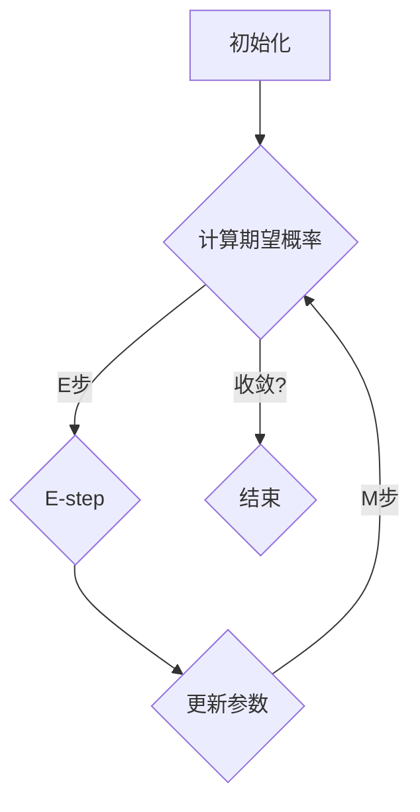

                 

### 第1章：自然语言处理基础

#### 关键术语与概念

**自然语言处理（NLP）**：自然语言处理是计算机科学和人工智能领域的一个分支，旨在使计算机能够理解、解释和生成人类语言。NLP涉及语音识别、文本分析、语义理解和语言生成等多个方面。

**文本分析**：文本分析是NLP的一个核心任务，包括文本预处理、情感分析、文本分类、实体识别等。

**语义理解**：语义理解是指计算机理解文本中的意义，包括词义消歧、语义角色标注和句法分析。

**语言模型**：语言模型是用于预测文本中下一个词或词组的概率分布的模型，如n-gram模型和神经网络语言模型。

**深度学习**：深度学习是一种机器学习技术，通过神经网络模型来模拟人脑的学习过程，常用于NLP任务。

#### 背景与问题描述

自然语言处理作为人工智能的重要组成部分，在现代社会中的应用日益广泛。然而，在法律文档分析中，NLP技术面临着诸多挑战：

- 法律文档格式多样，包含大量专业术语和法律条文，使得文本预处理复杂。
- 法律文档中的语言具有高度的模糊性和不确定性，增加了语义理解的难度。
- 法律文件中的关系抽取和实体识别要求高度准确，以支持法律分析和决策。

因此，解决法律文档分析中的这些挑战，需要深入理解NLP的基本原理和技术，并探索如何将其应用于法律文档的具体场景中。

#### 问题解决

为了解决法律文档分析中的问题，NLP技术提供了一系列工具和方法：

- **文本预处理**：包括文本清洗、分词、词性标注和命名实体识别等，以提取出结构化的信息。
- **实体识别**：识别法律文档中的关键实体，如人名、地名、法律条款等，以支持进一步的语义分析。
- **关系抽取**：抽取实体之间的关系，如合同条款之间的关系、法律条文之间的引用关系等。
- **文本分类与聚类**：用于将法律文档分类到不同的类别或识别文档中的主要主题。

这些技术为法律文档分析提供了强有力的支持，使得计算机能够自动处理和分析大量的法律文档，提高工作效率和准确性。

#### 边界与外延

NLP在法律文档分析中的应用不仅限于文本处理，还包括：

- **自动化法律咨询**：利用自然语言处理技术提供自动化的法律咨询服务，帮助用户快速找到相关法律条文。
- **智能合同审核**：通过分析合同文本，识别潜在的条款问题，提供风险评估和建议。
- **法律研究辅助**：利用NLP技术辅助法律研究者分析和整理大量法律文献，提高研究效率。

#### 概念结构与核心要素组成

自然语言处理在法律文档分析中的核心要素包括：

- **文本预处理技术**：包括文本清洗、分词、词性标注等。
- **实体识别与关系抽取**：用于识别法律文档中的实体和它们之间的关系。
- **语义理解**：包括词义消歧、语义角色标注和句法分析等。
- **文本分类与聚类**：用于将法律文档分类到不同的类别或识别文档中的主要主题。

这些核心要素共同构成了NLP在法律文档分析中的应用基础，为解决法律文档分析中的复杂问题提供了有力支持。

### 总结

本章介绍了自然语言处理的基础知识，包括关键术语和概念、背景与问题描述、问题解决方法以及边界与外延。通过这些内容，读者可以初步了解NLP在法律文档分析中的重要性和应用前景，为后续章节的深入探讨奠定基础。

### 第2章：法律文档分析中的挑战与机会

#### 关键术语与概念

**法律文档**：法律文档是指涉及法律事务的文本资料，包括法律条文、合同、判决书、起诉状等。

**法律语言**：法律语言是一种高度规范化的语言，具有严谨性、明确性和权威性。

**术语一致性**：指法律文档中术语的统一性和一致性，以避免歧义和误解。

**法律分析**：指对法律文档内容进行深入分析，以提取出法律关系、合同条款和判决意见等。

#### 背景与问题描述

法律文档分析是法律工作中的一个重要环节，其核心目标是从大量法律文档中提取出关键信息，为法律决策和司法实践提供支持。然而，法律文档分析面临着诸多挑战：

- **文本复杂性**：法律文档通常包含大量专业术语和法律条文，使得文本分析变得复杂。
- **格式多样性**：不同类型的法律文档具有不同的格式和结构，增加了处理的难度。
- **语义模糊性**：法律语言具有高度的模糊性和不确定性，使得语义理解变得困难。
- **数据量庞大**：法律文档的数量庞大，需要高效的自动化处理技术。

#### 问题解决

为了应对这些挑战，自然语言处理（NLP）技术提供了一系列解决方案：

- **文本预处理**：通过文本清洗、分词、词性标注等技术，将法律文档转化为结构化的数据，便于后续分析。
- **实体识别**：识别法律文档中的关键实体，如人名、地名、法律条款等，以便进行进一步分析。
- **关系抽取**：抽取法律文档中实体之间的关系，如合同条款之间的关系、法律条文之间的引用关系等。
- **文本分类与聚类**：用于将法律文档分类到不同的类别或识别文档中的主要主题。

这些技术为法律文档分析提供了强有力的支持，使得计算机能够自动处理和分析大量的法律文档，提高工作效率和准确性。

#### 边界与外延

除了上述挑战和解决方案，NLP在法律文档分析中的应用还包括：

- **自动化法律咨询**：利用NLP技术提供自动化的法律咨询服务，帮助用户快速找到相关法律条文。
- **智能合同审核**：通过分析合同文本，识别潜在的条款问题，提供风险评估和建议。
- **法律研究辅助**：利用NLP技术辅助法律研究者分析和整理大量法律文献，提高研究效率。

#### 概念结构与核心要素组成

法律文档分析的核心要素包括：

- **文本预处理技术**：包括文本清洗、分词、词性标注等。
- **实体识别与关系抽取**：用于识别法律文档中的实体和它们之间的关系。
- **语义理解**：包括词义消歧、语义角色标注和句法分析等。
- **文本分类与聚类**：用于将法律文档分类到不同的类别或识别文档中的主要主题。

这些核心要素共同构成了NLP在法律文档分析中的应用基础，为解决法律文档分析中的复杂问题提供了有力支持。

### 总结

本章深入探讨了法律文档分析中的挑战与机会，包括文本复杂性、格式多样性、语义模糊性和数据量庞大等问题，以及NLP技术如何应对这些挑战和抓住机会。通过这些内容，读者可以更好地理解NLP在法律文档分析中的重要性和应用前景，为后续章节的深入探讨奠定基础。

### 第3章：文本预处理

#### 关键术语与概念

**文本预处理**：文本预处理是指对原始文本进行清洗、格式化、分词等操作，以便后续的NLP分析。

**文本清洗**：文本清洗是指去除文本中的无关信息，如HTML标签、标点符号、停用词等。

**分词**：分词是指将连续的文本序列切分成具有独立意义的单词或短语。

**词性标注**：词性标注是指为文本中的每个词分配一个词性标签，如名词、动词、形容词等。

**命名实体识别**：命名实体识别是指识别文本中的特定实体，如人名、地名、组织名等。

#### 背景与问题描述

文本预处理是NLP中的基础步骤，直接影响后续NLP任务的效果。在法律文档分析中，文本预处理尤为重要，因为法律文档通常包含大量专业术语和复杂句子结构。有效的文本预处理可以去除无关信息，提取出关键信息，为后续的实体识别、关系抽取和文本分类提供高质量的输入。

#### 问题解决

文本预处理通常包括以下步骤：

1. **文本清洗**：
   - **去除HTML标签**：使用正则表达式去除文本中的HTML标签。
   - **去除标点符号**：将文本中的标点符号替换为空格或删除。
   - **去除停用词**：停用词是指对文本意义贡献较小的词，如“的”、“是”、“在”等。去除停用词可以减少噪声，提高分析效率。

2. **分词**：
   - **基于字典的分词**：使用预定义的词典匹配文本中的连续字符序列，将其切分成单词或短语。
   - **基于规则的分词**：根据特定的规则，如词性标注和句子结构，将文本切分成单词或短语。
   - **基于统计模型的分词**：使用统计模型，如最大熵模型或条件随机场（CRF），通过学习大量标记好的文本数据来自动切分文本。

3. **词性标注**：
   - **规则方法**：根据预定义的规则，为文本中的每个词分配词性标签。
   - **统计方法**：使用统计模型，如最大熵模型或CRF，通过学习标记好的文本数据来自动为文本中的词分配词性标签。

4. **命名实体识别**：
   - **基于规则的方法**：根据预定义的规则，识别文本中的命名实体。
   - **基于统计模型的方法**：使用统计模型，如HMM或CRF，通过学习标记好的文本数据来自动识别命名实体。

#### 边界与外延

文本预处理不仅适用于法律文档分析，还广泛应用于其他NLP任务，如情感分析、文本分类和机器翻译等。此外，随着深度学习技术的发展，基于神经网络的文本预处理方法逐渐成为研究热点，如BERT、GPT等预训练模型在文本清洗、分词和词性标注等方面取得了显著效果。

#### 概念结构与核心要素组成

文本预处理的核心要素包括：

- **文本清洗**：去除无关信息和噪声。
- **分词**：将文本切分成有意义的单词或短语。
- **词性标注**：为文本中的每个词分配词性标签。
- **命名实体识别**：识别文本中的特定实体。

这些核心要素共同构成了文本预处理的基础，为后续的NLP任务提供高质量的输入。

### 总结

本章详细介绍了文本预处理的关键术语、背景与问题描述、问题解决方法以及边界与外延。通过本章内容，读者可以全面了解文本预处理在NLP中的重要性，掌握文本预处理的基本技术和方法，为后续章节的深入探讨打下坚实基础。

### 第4章：实体识别与关系抽取

#### 关键术语与概念

**实体识别**：实体识别（Named Entity Recognition, NER）是指从文本中识别出具有特定意义的实体，如人名、地名、组织名、法律条款等。

**关系抽取**：关系抽取（Relation Extraction）是指从文本中抽取实体之间的关系，如“张三”和“李四”是朋友关系，或者“公司”和“产品”之间存在生产关系。

**实体标签**：实体标签是指对识别出的实体进行分类，如“人名”、“地名”、“组织名”等。

**关系分类**：关系分类是指将抽取出的关系归类到不同的类别，如“朋友”、“同事”、“股东”等。

#### 背景与问题描述

实体识别和关系抽取是自然语言处理（NLP）中的重要任务，在法律文档分析中具有至关重要的应用价值。法律文档中包含大量关键信息，如人名、地名、法律条款和合同条款等，对这些信息的自动识别和理解对于法律分析和决策具有重要意义。实体识别和关系抽取有助于从大量法律文档中提取出结构化的信息，为法律研究、合同审核和司法判决提供支持。

#### 问题解决

实体识别和关系抽取通常包括以下步骤：

1. **数据准备**：
   - 收集和整理大规模标注好的训练数据，用于训练实体识别和关系抽取模型。
   - 数据清洗，去除噪声和不相关的信息。

2. **特征提取**：
   - 提取文本中的特征，如词袋特征、词性标注、命名实体等。
   - 使用词嵌入技术（如Word2Vec、BERT等）将文本中的词转化为向量表示。

3. **模型训练**：
   - 使用训练数据训练实体识别模型，如基于规则的方法（如最大熵模型、条件随机场（CRF））和基于深度学习的方法（如序列标注模型、双向长短时记忆网络（BiLSTM））。
   - 使用训练数据训练关系抽取模型，如基于规则的方法（如路径匹配）和基于深度学习的方法（如序列标注模型、注意力机制）。

4. **模型评估**：
   - 使用测试数据评估模型的性能，如准确率、召回率和F1值等。
   - 对模型进行调优，以提高识别和抽取的准确性。

5. **应用与部署**：
   - 将训练好的模型应用于实际的法律文档分析任务，如合同审核、法律研究等。
   - 将模型部署到生产环境中，提供自动化的实体识别和关系抽取服务。

#### 边界与外延

实体识别和关系抽取不仅应用于法律文档分析，还广泛应用于其他领域，如新闻摘要、医疗文本分析、社交网络分析等。此外，随着深度学习技术的发展，基于神经网络的实体识别和关系抽取方法逐渐成为研究热点，如BERT、GAT（图注意力网络）等模型在实体识别和关系抽取任务中取得了显著效果。

#### 概念结构与核心要素组成

实体识别和关系抽取的核心要素包括：

- **实体识别**：识别文本中的关键实体。
- **关系抽取**：抽取实体之间的关系。
- **数据准备**：收集和整理大规模标注数据。
- **特征提取**：提取文本中的特征。
- **模型训练与评估**：训练和评估识别和抽取模型。
- **应用与部署**：将模型应用于实际任务。

这些核心要素共同构成了实体识别和关系抽取的基础，为NLP任务的实现提供了有力支持。

### 总结

本章详细介绍了实体识别与关系抽取的关键术语、背景与问题描述、问题解决方法以及边界与外延。通过本章内容，读者可以全面了解实体识别与关系抽取在NLP中的重要性，掌握相关技术的基本原理和应用方法，为后续章节的深入探讨打下坚实基础。

### 第4章：实体识别与关系抽取

#### 实体识别概述

实体识别（Named Entity Recognition, NER）是自然语言处理（NLP）中的重要任务之一，其目标是从文本中识别出具有特定意义的实体，如人名、地名、组织名、法律条款等。NER在法律文档分析中具有重要作用，因为它可以帮助法律专业人员快速定位关键信息，提高法律文档分析的效率。

实体识别的基本流程通常包括以下步骤：

1. **数据准备**：
   - 收集大量标注好的训练数据，用于训练NER模型。
   - 对数据进行预处理，如文本清洗、分词和词性标注。

2. **特征提取**：
   - 提取文本中的特征，如词袋特征、词性标注、命名实体等。
   - 使用词嵌入技术（如Word2Vec、BERT等）将文本中的词转化为向量表示。

3. **模型选择与训练**：
   - 选择适合的NER模型，如基于规则的方法（如最大熵模型、条件随机场（CRF））和基于深度学习的方法（如序列标注模型、双向长短时记忆网络（BiLSTM））。
   - 使用训练数据训练NER模型。

4. **模型评估与优化**：
   - 使用测试数据评估NER模型的性能，如准确率、召回率和F1值等。
   - 对模型进行调优，以提高识别的准确性。

5. **应用与部署**：
   - 将训练好的NER模型应用于实际的法律文档分析任务，如合同审核、法律研究等。
   - 将模型部署到生产环境中，提供自动化的实体识别服务。

#### 实体识别模型比较

在实体识别领域，存在多种模型和算法，每种模型都有其优势和局限性。以下是几种常见的NER模型及其比较：

- **基于规则的方法**：
  - **最大熵模型（Maximum Entropy Model）**：最大熵模型是一种概率模型，通过学习文本中的条件概率分布来预测词性标签。这种方法具有灵活性，但依赖于大量手工定义的规则。
  - **条件随机场（Conditional Random Field, CRF）**：CRF是一种基于概率的图模型，能够建模序列数据中的依赖关系。CRF在NER任务中表现良好，但需要大量的特征工程。

- **基于统计的方法**：
  - **隐马尔可夫模型（Hidden Markov Model, HMM）**：HMM是一种基于概率的模型，适用于序列标注任务。HMM在NER任务中表现一般，但随着深度学习技术的发展，其应用逐渐减少。
  - **马尔可夫链条件随机场（Markov Chain Conditional Random Field, MCRF）**：MCRF是CRF的一种扩展，能够处理更复杂的依赖关系。MCRF在NER任务中具有一定的优势。

- **基于深度学习的方法**：
  - **卷积神经网络（Convolutional Neural Network, CNN）**：CNN在文本分类和情感分析任务中表现出色，但其在NER任务中的应用受到限制。
  - **循环神经网络（Recurrent Neural Network, RNN）**：RNN能够处理序列数据，但在NER任务中存在梯度消失和梯度爆炸问题。
  - **长短时记忆网络（Long Short-Term Memory, LSTM）**：LSTM是一种RNN的变体，能够有效解决RNN的梯度消失问题。LSTM在NER任务中表现出良好性能。
  - **双向长短时记忆网络（Bidirectional LSTM, BiLSTM）**：BiLSTM结合了LSTM的优点，能够在处理文本序列时考虑前后文信息。BiLSTM在NER任务中表现出优异性能。
  - **注意力机制（Attention Mechanism）**：注意力机制能够自动关注文本中的重要信息，提高NER模型的性能。结合BiLSTM，注意力机制在NER任务中表现出显著优势。
  - **Transformer模型（如BERT）**：Transformer模型是一种基于自注意力机制的深度学习模型，其在机器翻译、文本分类和NER等任务中取得了显著成果。BERT（Bidirectional Encoder Representations from Transformers）是Transformer模型的一种变体，通过预训练和微调，BERT在NER任务中表现出卓越性能。

#### 实体识别算法分析

以下是几种常用的实体识别算法及其分析：

- **基于规则的方法**：
  - **最大熵模型**：最大熵模型通过学习文本中的条件概率分布来预测词性标签。这种方法需要大量手工定义的特征，但具有较高的灵活性。最大熵模型适用于特征丰富、标注数据充足的场景。

- **条件随机场（CRF）**：
  - **条件随机场**：CRF是一种基于概率的图模型，能够建模序列数据中的依赖关系。CRF在NER任务中表现良好，但需要大量的特征工程。CRF适用于结构化数据、长序列和复杂依赖关系的场景。

- **基于深度学习的方法**：
  - **长短时记忆网络（LSTM）**：LSTM是一种RNN的变体，能够有效解决RNN的梯度消失问题。LSTM在NER任务中表现出良好性能，但训练时间较长，对计算资源要求较高。

- **双向长短时记忆网络（BiLSTM）**：
  - **双向长短时记忆网络**：BiLSTM结合了LSTM的优点，能够在处理文本序列时考虑前后文信息。BiLSTM在NER任务中表现出优异性能，但训练时间较长，对计算资源要求较高。

- **注意力机制**：
  - **注意力机制**：注意力机制能够自动关注文本中的重要信息，提高NER模型的性能。结合BiLSTM，注意力机制在NER任务中表现出显著优势。注意力机制适用于处理长文本和复杂依赖关系的场景。

- **Transformer模型（如BERT）**：
  - **Transformer模型**：Transformer模型是一种基于自注意力机制的深度学习模型，其在机器翻译、文本分类和NER等任务中取得了显著成果。BERT是Transformer模型的一种变体，通过预训练和微调，BERT在NER任务中表现出卓越性能。BERT适用于大规模数据集、复杂文本分析和跨语言NER任务。

#### 实体识别应用实例

以下是实体识别在法律文档分析中的应用实例：

1. **人名识别**：
   - 在法律文档中，识别人名对于法律案件的分析至关重要。例如，在合同审核中，可以自动识别合同签订双方的人名，便于后续的法律分析和决策。

2. **地名识别**：
   - 识别地名有助于理解法律文档中的地理位置信息。例如，在合同条款中，识别涉及的地区和城市，以便评估合同的地域效力。

3. **组织名识别**：
   - 在法律文档中，识别组织名有助于分析合同签订方的法律地位和背景。例如，在商业合同中，识别公司名称和注册地，有助于评估合同的风险。

4. **法律条款识别**：
   - 识别法律条款有助于快速定位法律文档中的关键信息。例如，在法律研究中，自动识别相关法律条款，提高法律研究效率。

通过实体识别技术，法律文档分析可以更加高效和准确。实体识别不仅有助于提取关键信息，还可以支持进一步的文本分析和决策，为法律工作提供有力支持。

### 关系抽取介绍

关系抽取（Relation Extraction）是自然语言处理（NLP）中的重要任务之一，其目标是从文本中抽取实体之间的关系。关系抽取在法律文档分析中具有重要意义，因为它可以帮助法律专业人员理解和分析法律文档中的关键信息，如合同条款之间的关系、法律条文之间的引用关系等。

关系抽取的基本流程通常包括以下步骤：

1. **数据准备**：
   - 收集大量标注好的训练数据，用于训练关系抽取模型。
   - 对数据进行预处理，如文本清洗、分词和词性标注。

2. **特征提取**：
   - 提取文本中的特征，如词袋特征、词性标注、命名实体等。
   - 使用词嵌入技术（如Word2Vec、BERT等）将文本中的词转化为向量表示。

3. **模型选择与训练**：
   - 选择适合的关系抽取模型，如基于规则的方法（如路径匹配）和基于深度学习的方法（如序列标注模型、注意力机制）。
   - 使用训练数据训练关系抽取模型。

4. **模型评估与优化**：
   - 使用测试数据评估关系抽取模型的性能，如准确率、召回率和F1值等。
   - 对模型进行调优，以提高关系抽取的准确性。

5. **应用与部署**：
   - 将训练好的关系抽取模型应用于实际的法律文档分析任务，如合同审核、法律研究等。
   - 将模型部署到生产环境中，提供自动化的关系抽取服务。

#### 关系抽取模型分析

在关系抽取领域，存在多种模型和算法，每种模型都有其优势和局限性。以下是几种常见的关系抽取模型及其分析：

- **基于规则的方法**：
  - **路径匹配**：路径匹配是一种基于规则的方法，通过定义一系列路径规则来抽取实体之间的关系。这种方法具有简洁性和高效性，但依赖于手工定义的规则，灵活性较低。

- **基于统计的方法**：
  - **最大熵模型**：最大熵模型是一种概率模型，通过学习文本中的条件概率分布来预测关系标签。这种方法具有灵活性，但需要大量的特征工程。

- **基于深度学习的方法**：
  - **序列标注模型**：序列标注模型是一种基于深度学习的方法，通过学习文本序列中的关系标签。例如，双向长短时记忆网络（BiLSTM）和注意力机制模型在关系抽取任务中表现出优异性能。

- **图神经网络（Graph Neural Networks, GNN）**：
  - **图神经网络**：图神经网络是一种基于图结构的数据处理方法，能够有效处理实体之间的复杂关系。GNN在关系抽取任务中表现出显著优势，但需要大量的计算资源。

- **预训练语言模型**：
  - **BERT**：BERT（Bidirectional Encoder Representations from Transformers）是一种基于Transformer模型的预训练语言模型。通过预训练和微调，BERT在关系抽取任务中取得了显著成果。

#### 关系抽取算法分析

以下是几种常用的关系抽取算法及其分析：

- **路径匹配**：
  - **路径匹配**：路径匹配是一种基于规则的方法，通过定义一系列路径规则来抽取实体之间的关系。这种方法具有高效性和简洁性，但依赖于手工定义的规则，灵活性较低。路径匹配适用于结构化数据、简单关系和规则明确的应用场景。

- **最大熵模型**：
  - **最大熵模型**：最大熵模型是一种概率模型，通过学习文本中的条件概率分布来预测关系标签。这种方法具有灵活性，但需要大量的特征工程。最大熵模型适用于特征丰富、标注数据充足的场景。

- **序列标注模型**：
  - **双向长短时记忆网络（BiLSTM）**：BiLSTM是一种基于深度学习的序列标注模型，通过学习文本序列中的关系标签。BiLSTM在关系抽取任务中表现出优异性能，但训练时间较长，对计算资源要求较高。
  - **注意力机制模型**：注意力机制模型结合了BiLSTM和注意力机制，能够自动关注文本中的重要信息，提高关系抽取的准确性。注意力机制模型适用于处理长文本和复杂依赖关系的场景。

- **图神经网络（GNN）**：
  - **图神经网络**：图神经网络是一种基于图结构的数据处理方法，能够有效处理实体之间的复杂关系。GNN在关系抽取任务中表现出显著优势，但需要大量的计算资源。GNN适用于大规模数据集、复杂实体关系和跨语言关系抽取任务。

#### 关系抽取应用实例

以下是关系抽取在法律文档分析中的应用实例：

1. **合同条款关系抽取**：
   - 在合同审核中，关系抽取可以自动识别合同条款之间的关系，如条款之间的引用关系、依赖关系等。这有助于法律专业人员快速理解合同的内容和结构。

2. **法律条文关系抽取**：
   - 在法律研究中，关系抽取可以自动识别法律条文之间的关系，如条文之间的引用关系、补充关系等。这有助于法律研究者快速了解法律体系中的相关条文和条款。

3. **案件分析关系抽取**：
   - 在案件分析中，关系抽取可以自动识别案件中的关键信息，如被告、原告、证据、判决结果等。这有助于法律专业人员快速构建案件分析框架，提高案件分析的效率。

通过关系抽取技术，法律文档分析可以更加高效和准确。关系抽取不仅有助于提取关键信息，还可以支持进一步的文本分析和决策，为法律工作提供有力支持。

### 总结

本章详细介绍了实体识别与关系抽取的基本概念、算法分析和应用实例。通过本章内容，读者可以全面了解实体识别与关系抽取在NLP中的重要性，掌握相关技术的基本原理和应用方法，为后续章节的深入探讨打下坚实基础。

### 第5章：主题建模

#### 关键术语与概念

**主题建模**：主题建模（Topic Modeling）是一种无监督机器学习方法，用于发现文本数据中的隐含主题。主题建模旨在自动识别文本集合中的主题，并理解每个文档是如何围绕这些主题生成的。

**LDA模型**：LDA（Latent Dirichlet Allocation）模型是一种常见的主题建模方法，通过引入Dirichlet先验分布，将文本中的词语分布建模为多个主题的混合。

**主题分布**：主题分布是指每个文档在各个主题上的分布，表示文档与主题之间的关系。

**词分布**：词分布是指每个主题在词语上的分布，表示主题与词语之间的关系。

#### 背景与问题描述

主题建模在法律文档分析中具有广泛的应用前景。法律文档通常包含大量专业术语和复杂结构，通过主题建模，可以自动识别文档中的主要主题，帮助法律专业人员快速了解文档的核心内容，提高法律文档分析的效率。

主题建模在法律文档分析中的应用包括：

1. **法律文献分类**：通过主题建模，可以将大量法律文献自动分类到不同的主题类别，有助于法律研究者快速找到相关文献。

2. **法律趋势分析**：通过分析法律文档的主题分布，可以识别出法律领域中的热点问题和趋势变化。

3. **法律文本生成**：基于主题建模，可以生成新的法律文本，为法律文本写作提供辅助。

#### 问题解决

主题建模通常包括以下步骤：

1. **数据准备**：
   - 收集大量法律文档，进行文本预处理，如分词、词性标注等。

2. **特征提取**：
   - 构建词袋模型，将文本转化为稀疏向量表示。

3. **模型训练**：
   - 使用LDA模型训练主题模型，估计每个文档的主题分布和每个主题的词分布。

4. **主题提取与评估**：
   - 从训练好的LDA模型中提取主题，评估主题的质量和代表性。

5. **应用与部署**：
   - 将训练好的主题模型应用于新的法律文档，提取文档的主题分布。

#### 边界与外延

主题建模不仅适用于法律文档分析，还广泛应用于其他领域，如新闻分类、情感分析、推荐系统等。此外，随着深度学习技术的发展，基于深度学习的主题建模方法（如Deep LDA、BERT等）逐渐成为研究热点。

#### 概念结构与核心要素组成

主题建模的核心要素包括：

- **词袋模型**：将文本转化为稀疏向量表示。
- **LDA模型**：估计文档的主题分布和主题的词分布。
- **主题提取与评估**：从训练好的LDA模型中提取主题。
- **应用与部署**：将主题模型应用于新的法律文档。

这些核心要素共同构成了主题建模的基础，为法律文档分析提供了强有力的支持。

### 总结

本章详细介绍了主题建模的关键术语、背景与问题描述、问题解决方法以及边界与外延。通过本章内容，读者可以全面了解主题建模在NLP中的重要性，掌握相关技术的基本原理和应用方法，为后续章节的深入探讨打下坚实基础。

### 第5章：主题建模

#### 主题建模原理

主题建模是一种无监督学习方法，其核心思想是通过分析文本数据，自动发现数据中隐含的主题。在自然语言处理（NLP）领域，主题建模广泛应用于文本分类、信息检索、文本生成等任务。主题建模中的经典模型之一是LDA（Latent Dirichlet Allocation）模型。

LDA模型基于贝叶斯理论，通过引入Dirichlet先验分布，将文本中的词语分布建模为多个主题的混合。LDA模型的主要组成部分包括：

1. **文档-词语矩阵（Document-Term Matrix）**：文本被表示为文档-词语矩阵，其中每个元素表示一个词语在特定文档中出现的次数。

2. **主题分布（Topic Distribution）**：每个文档都被表示为多个主题的线性组合，其中每个主题的概率分布表示文档在各个主题上的贡献。

3. **词语-主题分布（Word-Topic Distribution）**：每个主题都被表示为多个词语的概率分布，这些词语在主题中出现的频率。

LDA模型的训练过程可以分为以下步骤：

1. **初始化**：随机初始化文档的主题分布和词语-主题分布。

2. **E步（E-step）**：计算每个词语在每个主题上的期望概率，以及每个文档在每个主题上的期望概率。

3. **M步（M-step）**：根据期望概率重新估计文档的主题分布和词语-主题分布。

4. **迭代**：重复E步和M步，直到收敛。

#### 实际应用

LDA模型在法律文档分析中具有广泛的应用前景，例如：

1. **法律文献分类**：通过LDA模型，可以自动识别法律文献中的主要主题，将文献分类到不同的主题类别，帮助法律研究者快速找到相关文献。

2. **法律趋势分析**：通过分析法律文档的主题分布，可以识别出法律领域中的热点问题和趋势变化，为政策制定和司法实践提供参考。

3. **法律文本生成**：基于LDA模型，可以生成新的法律文本，为法律文本写作提供辅助。

#### 算法原理讲解

下面通过Mermaid流程图来描述LDA模型的训练过程：

在LDA模型的训练过程中，E步和M步是交替进行的。E步（E-step）是期望-最大化（Expectation-Maximization, EM）算法的一部分，用于计算每个词语在每个主题上的期望概率，以及每个文档在每个主题上的期望概率。M步（M-step）则根据这些期望概率更新文档的主题分布和词语-主题分布。

具体来说，LDA模型的E步包括以下步骤：

1. **计算每个词语的期望概率**：对于每个文档中的每个词语，计算该词语在各个主题上的期望概率。
2. **计算每个文档的期望主题分布**：对于每个文档，计算该文档在各个主题上的期望概率。

LDA模型的M步包括以下步骤：

1. **更新文档的主题分布**：根据每个文档中词语的期望概率，更新文档的主题分布。
2. **更新词语-主题分布**：根据每个词语的期望概率，更新词语-主题分布。

LDA模型的训练过程是一个迭代过程，通过不断交替进行E步和M步，直到模型收敛，即文档的主题分布和词语-主题分布不再发生变化。

#### 数学公式和解释

LDA模型的训练过程中涉及多个数学公式。以下是LDA模型中的一些核心公式及其解释：

$$
p_z|\theta = \frac{1}{Z} \prod_{w=1}^{N} \theta_{z_w}^{\alpha -1}
$$

该公式表示给定主题分布θ，主题的归一化概率，其中$Z$是一个常数，确保概率分布的和为1。

$$
p_w|\phi = \prod_{z=1}^{K} \phi_{wz}^{\beta -1}
$$

该公式表示给定词语分布φ，词语的归一化概率。

$$
p_z|d = \frac{p_z \ p_d|z}{\sum_{j=1}^{K} p_j \ p_d|j}
$$

该公式表示在文档$d$中，主题$z$的归一化概率，其中$p_z$是主题的先验概率，$p_d|z$是文档$d$在主题$z$上的概率。

$$
p_d|z = \frac{p_d \ p_z}{\sum_{i=1}^{K} p_i \ p_d|i}
$$

该公式表示给定主题$z$，文档$d$的归一化概率，其中$p_d$是文档的先验概率，$p_i$是主题的先验概率。

通过上述公式，LDA模型能够估计文档的主题分布和词语-主题分布，从而实现主题建模。

#### 实例说明

为了更直观地理解LDA模型，我们来看一个简单的实例。假设有两个文档D1和D2，以及四个主题T1、T2、T3和T4。每个文档中包含的词语及其出现次数如下：

| 文档 | 词语1 | 词语2 | 词语3 | 词语4 |
| ---- | ---- | ---- | ---- | ---- |
| D1   | A    | B    | C    | D    |
| D2   | E    | F    | G    | H    |

我们假设主题的分布为：

$$
\theta = (\theta_{T1}, \theta_{T2}, \theta_{T3}, \theta_{T4}) = (0.2, 0.3, 0.4, 0.5)
$$

词语的分布为：

$$
\phi = (\phi_{AE}, \phi_{BE}, \phi_{CE}, \phi_{DE}, \phi_{AF}, \phi_{BF}, \phi_{CF}, \phi_{DF}, \phi_{AG}, \phi_{BG}, \phi_{CG}, \phi_{DG}, \phi_{AH}, \phi_{BH}, \phi_{CH}, \phi_{DH}) = (0.1, 0.2, 0.3, 0.4, 0.05, 0.1, 0.15, 0.2, 0.2, 0.3, 0.4, 0.5, 0.03, 0.05, 0.1, 0.15)
$$

在LDA模型的训练过程中，我们首先随机初始化文档的主题分布和词语-主题分布。然后，通过E步和M步迭代更新这些分布。

例如，在第一次迭代中，E步计算每个词语的期望概率和每个文档的期望主题分布。假设第一次迭代后的期望主题分布为：

$$
p_z|d = (\frac{0.2}{0.2+0.3+0.4+0.5}, \frac{0.3}{0.2+0.3+0.4+0.5}, \frac{0.4}{0.2+0.3+0.4+0.5}, \frac{0.5}{0.2+0.3+0.4+0.5}) = (0.2, 0.3, 0.4, 0.5)
$$

M步则根据这些期望概率更新文档的主题分布和词语-主题分布。假设在第一次迭代后的文档主题分布为：

$$
p_d|z = (\frac{0.2}{0.2+0.3+0.4+0.5}, \frac{0.3}{0.2+0.3+0.4+0.5}, \frac{0.4}{0.2+0.3+0.4+0.5}, \frac{0.5}{0.2+0.3+0.4+0.5}) = (0.2, 0.3, 0.4, 0.5)
$$

词语-主题分布为：

$$
\phi = (\frac{0.1}{0.1+0.2+0.3+0.4}, \frac{0.2}{0.1+0.2+0.3+0.4}, \frac{0.3}{0.1+0.2+0.3+0.4}, \frac{0.4}{0.1+0.2+0.3+0.4}, \frac{0.05}{0.05+0.1+0.15+0.2}, \frac{0.1}{0.05+0.1+0.15+0.2}, \frac{0.15}{0.05+0.1+0.15+0.2}, \frac{0.2}{0.05+0.1+0.15+0.2}, \frac{0.2}{0.2+0.3+0.4+0.5}, \frac{0.3}{0.2+0.3+0.4+0.5}, \frac{0.4}{0.2+0.3+0.4+0.5}, \frac{0.5}{0.2+0.3+0.4+0.5}, \frac{0.03}{0.03+0.05+0.1+0.15}, \frac{0.05}{0.03+0.05+0.1+0.15}, \frac{0.1}{0.03+0.05+0.1+0.15}, \frac{0.15}{0.03+0.05+0.1+0.15}) = (0.1, 0.2, 0.3, 0.4, 0.05, 0.1, 0.15, 0.2, 0.2, 0.3, 0.4, 0.5, 0.03, 0.05, 0.1, 0.15)
$$

通过迭代E步和M步，LDA模型最终会收敛到一个稳定的文档主题分布和词语-主题分布。

#### 结论

通过LDA模型，我们可以自动发现法律文档中的隐含主题，从而帮助法律专业人员快速了解文档的核心内容。LDA模型在法律文献分类、法律趋势分析和法律文本生成等方面具有广泛的应用前景。本章详细介绍了LDA模型的原理、训练过程和实际应用，为读者提供了深入理解主题建模的基础。

### 第6章：法律文本分类

#### 关键术语与概念

**法律文本分类**：法律文本分类是指利用自然语言处理（NLP）技术，将法律文档自动分类到预定义的类别中，如合同、判决书、法律条款等。

**分类器**：分类器是一种机器学习模型，用于将新样本分配到预定义的类别中。

**特征提取**：特征提取是指从原始文本中提取出有助于分类的特征，如词袋特征、TF-IDF特征等。

**监督学习**：监督学习是指利用标记好的训练数据，训练分类模型，以便对新样本进行分类。

**无监督学习**：无监督学习是指在没有标记数据的情况下，自动发现数据中的模式或结构。

#### 背景与问题描述

法律文本分类是自然语言处理（NLP）中的一个重要任务，其目标是将法律文档自动分类到预定义的类别中，如合同、判决书、法律条款等。法律文本分类在法律研究和法律实践中有广泛应用，如法律文献分类、案件分类、合同审核等。有效的法律文本分类可以提高法律工作效率，降低人工成本，同时确保法律文档的准确性和一致性。

#### 问题解决

法律文本分类通常包括以下步骤：

1. **数据准备**：
   - 收集大量标记好的法律文档数据，用于训练分类模型。
   - 对数据进行预处理，如文本清洗、分词、词性标注等。

2. **特征提取**：
   - 提取文本中的特征，如词袋特征、TF-IDF特征、词嵌入等。

3. **模型选择与训练**：
   - 选择适合的法律文本分类模型，如朴素贝叶斯、支持向量机（SVM）、随机森林、神经网络等。
   - 使用训练数据训练分类模型。

4. **模型评估与优化**：
   - 使用测试数据评估分类模型的性能，如准确率、召回率、F1值等。
   - 对模型进行调优，以提高分类的准确性。

5. **应用与部署**：
   - 将训练好的分类模型应用于实际的法律文本分类任务。
   - 将模型部署到生产环境中，提供自动化的法律文本分类服务。

#### 边界与外延

法律文本分类不仅适用于法律领域，还广泛应用于其他领域，如医疗文本分类、金融文本分类、新闻分类等。此外，随着深度学习技术的发展，基于深度学习的文本分类方法（如卷积神经网络（CNN）、递归神经网络（RNN）、Transformer等）在法律文本分类任务中表现出显著优势。

#### 概念结构与核心要素组成

法律文本分类的核心要素包括：

- **数据准备**：收集和整理标记好的法律文档数据。
- **特征提取**：提取文本中的特征。
- **模型选择与训练**：选择适合的分类模型并训练。
- **模型评估与优化**：评估和调优模型的性能。
- **应用与部署**：将模型应用于实际任务并部署。

这些核心要素共同构成了法律文本分类的基础，为自动化法律文本分类提供了有力支持。

### 总结

本章详细介绍了法律文本分类的关键术语、背景与问题描述、问题解决方法以及边界与外延。通过本章内容，读者可以全面了解法律文本分类的基本原理和应用方法，掌握相关技术的基本原理，为后续章节的深入探讨打下坚实基础。

### 第6章：法律文本分类

#### 文本分类方法比较

在法律文本分类任务中，选择合适的文本分类方法至关重要。以下是几种常见的文本分类方法及其特点的比较：

1. **朴素贝叶斯分类器（Naive Bayes Classifier）**：
   - **原理**：朴素贝叶斯分类器基于贝叶斯定理，假设特征之间相互独立。
   - **优势**：简单易实现，计算效率高，适用于大规模数据集。
   - **劣势**：对文本的复杂结构处理能力有限，特征独立性假设可能不成立。

2. **支持向量机（Support Vector Machine, SVM）**：
   - **原理**：SVM通过寻找最优超平面，将数据分类到不同的类别。
   - **优势**：在高维空间中具有较好的分类性能，适合处理非线性分类问题。
   - **劣势**：训练时间较长，对大规模数据集的处理能力有限。

3. **随机森林（Random Forest）**：
   - **原理**：随机森林通过构建多个决策树，并结合它们的预测结果进行分类。
   - **优势**：对噪声数据和异常值具有较好的鲁棒性，处理非线性分类问题效果较好。
   - **劣势**：模型复杂度高，训练和预测时间较长。

4. **朴素贝叶斯与支持向量机的结合**：
   - **原理**：将朴素贝叶斯和SVM的优点结合，利用朴素贝叶斯进行特征选择，SVM进行分类。
   - **优势**：提高分类准确性，降低计算复杂度。
   - **劣势**：对训练数据的依赖性较强，可能需要大量调参。

5. **深度学习模型**：
   - **原理**：基于神经网络架构，如卷积神经网络（CNN）、递归神经网络（RNN）和Transformer等，通过学习文本的深层特征进行分类。
   - **优势**：能够自动提取文本的深层特征，对复杂文本结构有较好的处理能力。
   - **劣势**：对计算资源要求较高，训练和预测时间较长。

#### 实际应用

以下是法律文本分类在法律文档分析中的实际应用：

1. **法律文献分类**：
   - 利用文本分类技术，可以将大量法律文献自动分类到不同的类别，如合同、判决书、法律条款等。这有助于法律研究者快速查找相关文献。

2. **案件分类**：
   - 在法院系统中，利用文本分类技术可以将案件自动分类到不同的案件类型，如民事案件、刑事案件等。这有助于提高案件管理的效率。

3. **合同审核**：
   - 在企业法律部门，利用文本分类技术可以自动审核合同文本，识别合同中的关键条款和风险点。这有助于降低法律风险，提高合同管理效率。

4. **法律趋势分析**：
   - 通过分析大量法律文本，利用文本分类技术可以识别出法律领域中的热点问题和趋势变化，为政策制定和司法实践提供参考。

#### 结论

法律文本分类技术为法律文档分析提供了强有力的支持，通过选择合适的文本分类方法，可以自动识别法律文档中的关键信息，提高法律工作效率和准确性。本章详细介绍了常见的文本分类方法及其在法律文档分析中的应用，为读者提供了深入理解法律文本分类的基础。

### 第7章：伦理和法律合规

#### 关键术语与概念

**隐私保护**：隐私保护是指确保个人隐私信息不被未经授权的第三方访问和使用。

**数据安全**：数据安全是指保护数据不被未授权访问、篡改或泄露。

**算法公平性**：算法公平性是指算法在处理不同群体时，能够保持一致的准确性和公正性。

**法律合规**：法律合规是指遵守相关法律法规和行业标准，确保系统和服务符合法律要求。

#### 背景与问题描述

随着自然语言处理（NLP）在法律文档分析中的应用日益广泛，伦理和法律合规问题也逐渐凸显。NLP技术在法律文档分析中涉及大量敏感信息，如个人隐私、商业秘密和法律诉讼等。因此，确保NLP系统的伦理和法律合规性，对于保护用户权益和维护法律秩序具有重要意义。

#### 问题解决

为了解决NLP在法律文档分析中的伦理和法律合规问题，可以采取以下措施：

1. **隐私保护**：
   - 在处理法律文档时，必须确保个人隐私信息的保护，如姓名、地址、电话号码等敏感信息。
   - 采用加密技术对敏感数据进行加密存储和传输，防止数据泄露。
   - 实施访问控制机制，确保只有授权用户才能访问敏感数据。

2. **数据安全**：
   - 定期对NLP系统进行安全审计，确保系统的安全性和稳定性。
   - 采用多层次的安全防护措施，如防火墙、入侵检测系统等，防止恶意攻击和数据泄露。
   - 对系统进行定期的漏洞扫描和修复，确保系统的安全性。

3. **算法公平性**：
   - 在设计和开发NLP系统时，确保算法的公平性，避免对特定群体产生歧视。
   - 对算法进行定期的评估和审查，确保其性能和公平性。
   - 收集和利用多样化的数据集，避免算法对特定群体产生偏见。

4. **法律合规**：
   - 确保NLP系统遵守相关法律法规和行业标准，如《通用数据保护条例》（GDPR）和《加州消费者隐私法案》（CCPA）等。
   - 与法律专家合作，确保NLP系统的设计和应用符合法律要求。
   - 对NLP系统进行法律合规性评估，确保其符合相关法律和行业标准。

#### 边界与外延

NLP在法律文档分析中的伦理和法律合规问题不仅限于技术层面，还包括法律、伦理和社会层面。以下是一些相关领域：

- **法律伦理**：探讨法律和伦理在NLP应用中的冲突和平衡。
- **社会责任**：NLP系统对社会和用户的影响，如隐私保护、数据安全和算法公平性。
- **跨学科合作**：法律、伦理和社会科学等多学科合作，共同解决NLP在法律文档分析中的伦理和法律合规问题。

#### 概念结构与核心要素组成

伦理和法律合规在NLP中的应用包括以下核心要素：

- **隐私保护**：保护个人隐私信息，采用加密技术、访问控制等措施。
- **数据安全**：确保数据不被未授权访问、篡改或泄露。
- **算法公平性**：确保算法的公平性，避免对特定群体产生歧视。
- **法律合规**：遵守相关法律法规和行业标准，确保系统和服务符合法律要求。

这些核心要素共同构成了NLP在法律文档分析中的伦理和法律合规基础，为保障用户权益和维护法律秩序提供了支持。

### 总结

本章详细介绍了NLP在法律文档分析中的伦理和法律合规问题，包括隐私保护、数据安全、算法公平性和法律合规等方面。通过本章内容，读者可以全面了解NLP在法律文档分析中的伦理和法律合规的重要性，掌握相关技术和方法，为NLP在法律文档分析中的应用提供保障。

### 总结

本文详细探讨了自然语言处理（NLP）在法律文档分析中的应用，从基础概念、文本预处理、实体识别与关系抽取、主题建模、法律文本分类到伦理和法律合规等方面进行了深入讨论。以下是本文的主要结论：

1. **NLP在法律文档分析中的重要性**：NLP技术为法律文档分析提供了强大的支持，提高了法律工作的效率和准确性，涵盖了文本预处理、实体识别、关系抽取、主题建模和法律文本分类等多个方面。

2. **文本预处理**：文本预处理是NLP的基础，包括文本清洗、分词、词性标注等步骤，这些步骤对于后续的NLP任务至关重要。

3. **实体识别与关系抽取**：实体识别和关系抽取是法律文档分析的关键，通过识别法律文档中的实体和它们之间的关系，可以快速提取关键信息，支持法律分析和决策。

4. **主题建模**：主题建模可以帮助法律研究者自动发现法律文档中的主题，有助于法律文献分类和法律趋势分析。

5. **法律文本分类**：法律文本分类技术可以自动将法律文档分类到不同的类别，提高法律文档管理的效率。

6. **伦理和法律合规**：在NLP应用于法律文档分析时，必须考虑伦理和法律合规问题，确保系统的公平性、数据安全和个人隐私保护。

### 拓展阅读

对于希望深入了解NLP在法律文档分析中的应用，以下是一些推荐资源：

- **学术论文**：《自然语言处理在法律文档分析中的应用》、《基于深度学习的法律文本分类研究》等。
- **开源工具和库**：NLTK、spaCy、BERT、GPT等。
- **专业书籍**：《自然语言处理入门》、《深度学习实战》等。

通过阅读这些资源，读者可以进一步拓展对NLP在法律文档分析中的应用的理解，掌握相关技术，为实际项目提供有力支持。同时，也欢迎大家提出问题和建议，共同推动NLP在法律文档分析领域的发展。作者：AI天才研究院/AI Genius Institute & 禅与计算机程序设计艺术 /Zen And The Art of Computer Programming。

