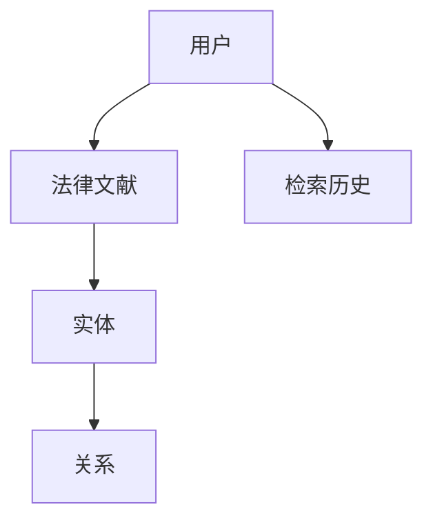
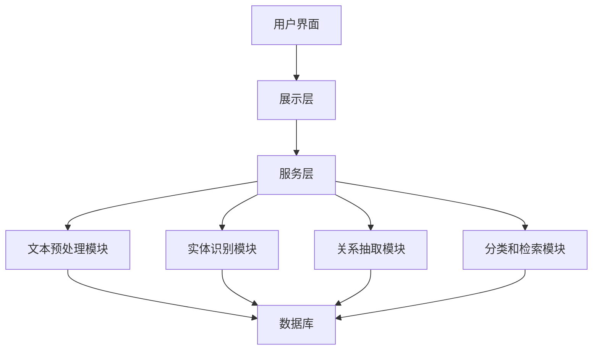

                 

# 自然语言处理在法律文献检索中的应用：提高法律研究效率

关键词：自然语言处理、法律文献检索、效率提升、文本分析、人工智能

摘要：本文探讨了自然语言处理（NLP）技术在法律文献检索中的应用，分析了NLP技术如何提高法律研究的效率。文章首先介绍了自然语言处理的基础知识，然后详细讨论了NLP在法律文献检索中的具体应用，如文本预处理、实体识别、关系抽取等。接着，文章剖析了NLP技术在法律领域面临的挑战及解决方案，并介绍了一些实用的NLP工具。最后，文章通过实际案例展示了NLP技术在法律研究中的实际应用，对未来NLP在法律文献检索中的发展进行了展望。

## 第一部分：自然语言处理（NLP）概述

### 1.1 问题背景

#### 1.1.1 法律文献检索的挑战

法律文献检索是法律研究和司法实践的重要组成部分。然而，随着法律文献的日益增多，传统的法律文献检索方式面临着诸多挑战：

1. **文献数量庞大**：法律文献种类繁多，包括法律条文、案例、法学论文等，而且每年新增的法律文献数量也在不断增加。
2. **文本结构复杂**：法律文本具有独特的结构和表达方式，如术语、引用、逻辑推理等，使得法律文献的处理更加复杂。
3. **检索效率低下**：传统的检索方式主要依赖人工查阅和索引，效率低下，无法满足法律研究和司法实践的需求。

#### 1.1.2 NLP在法律文献检索中的重要性

自然语言处理（NLP）技术的发展为法律文献检索带来了新的可能性。NLP技术可以自动化处理大量的法律文本，提高检索的效率和准确性。具体来说，NLP在法律文献检索中的重要性体现在以下几个方面：

1. **文本预处理**：NLP技术可以帮助对法律文本进行清洗、分词、词性标注等预处理操作，为后续的分析奠定基础。
2. **实体识别**：NLP技术可以识别法律文本中的实体，如人名、地名、法律条款等，为法律文档的索引和分类提供支持。
3. **关系抽取**：NLP技术可以分析法律文本中的逻辑关系，如因果关系、隶属关系等，为法律研究提供深入见解。
4. **情感分析**：NLP技术可以分析法律文本的情感倾向，为法律舆情分析和预测提供支持。

### 1.2 NLP的核心概念

#### 1.2.1 语言模型

语言模型是NLP的核心技术之一，用于预测一段文本的下一个单词或字符。常见的语言模型有基于规则的方法和基于统计的方法。

- **基于规则的方法**：如正则表达式、词法分析器等，通过对语言规则进行编码来实现。
- **基于统计的方法**：如隐马尔可夫模型（HMM）、条件概率模型等，通过大量文本数据来训练语言模型。

#### 1.2.2 词嵌入

词嵌入是将单词映射到低维向量空间的一种方法，使得语义相似的单词在向量空间中靠近。常见的词嵌入方法有基于计数的方法和基于神经网络的方法。

- **基于计数的方法**：如词袋模型、TF-IDF等，通过统计单词在文档中的出现频率来表示词嵌入。
- **基于神经网络的方法**：如Word2Vec、GloVe等，通过神经网络模型来学习单词的向量表示。

#### 1.2.3 句法分析和语义分析

句法分析是解析句子结构的技术，用于识别句子中的语法成分和语法关系。常见的句法分析方法有基于规则的方法和基于统计的方法。

语义分析是理解句子意义的技术，用于识别句子中的概念、事件和关系。常见的语义分析方法有基于知识图谱的方法和基于深度学习的方法。

### 1.3 NLP技术综述

#### 1.3.1 基于规则的方法

基于规则的方法通过定义一系列规则来处理自然语言。这种方法适用于结构化程度较高的语言，但在处理复杂文本时存在局限性。

#### 1.3.2 基于统计的方法

基于统计的方法通过统计文本数据来发现语言规律。这种方法在处理大规模文本数据时具有优势，但需要大量标注数据。

#### 1.3.3 基于深度学习的方法

基于深度学习的方法通过神经网络模型来学习语言特征。这种方法在处理复杂文本时具有显著优势，已成为NLP领域的主流技术。

### 1.4 NLP的发展趋势

#### 1.4.1 开源框架与工具

随着NLP技术的发展，越来越多的开源框架和工具被推出，如TensorFlow、PyTorch等。这些框架和工具为NLP研究和应用提供了便捷的工具。

#### 1.4.2 应用场景拓展

NLP技术不仅应用于文本分析，还广泛应用于语音识别、机器翻译、对话系统等领域，应用场景不断拓展。

#### 1.4.3 伦理与隐私问题

随着NLP技术的广泛应用，伦理和隐私问题日益突出。如何确保NLP技术的公平性、透明性和隐私保护成为亟待解决的问题。

### 1.5 本章小结

本章概述了自然语言处理（NLP）技术在法律文献检索中的应用背景、核心概念和技术综述。NLP技术具有提高法律研究效率的巨大潜力，但也面临一系列挑战。接下来，我们将进一步探讨NLP在法律文献检索中的具体应用。

## 第二部分：自然语言处理的基础技术

### 2.1 语言模型

#### 2.1.1 语言模型的定义

语言模型是一种用于预测自然语言中下一个单词或字符的模型。它可以用于各种NLP任务，如文本分类、机器翻译和语音识别。

#### 2.1.2 语言模型的类型

语言模型可以分为基于规则的方法和基于统计的方法。

- **基于规则的方法**：如正则表达式、词法分析器等，通过对语言规则进行编码来实现。
- **基于统计的方法**：如隐马尔可夫模型（HMM）、条件概率模型等，通过统计文本数据来训练语言模型。

#### 2.1.3 语言模型的训练

语言模型的训练通常包括以下步骤：

1. **数据准备**：收集大量的文本数据，并进行预处理，如分词、去停用词等。
2. **特征提取**：将文本数据转换为特征向量，如词频、词嵌入等。
3. **模型训练**：使用训练数据训练语言模型，如神经网络模型、隐马尔可夫模型等。
4. **模型评估**：使用测试数据评估语言模型的性能，如准确性、召回率等。

### 2.2 词嵌入

#### 2.2.1 词嵌入的概念

词嵌入是将单词映射到低维向量空间的一种方法，使得语义相似的单词在向量空间中靠近。

#### 2.2.2 词嵌入的方法

词嵌入的方法可以分为基于计数的方法和基于神经网络的方法。

- **基于计数的方法**：如词袋模型、TF-IDF等，通过统计单词在文档中的出现频率来表示词嵌入。
- **基于神经网络的方法**：如Word2Vec、GloVe等，通过神经网络模型来学习单词的向量表示。

#### 2.2.3 词嵌入的应用

词嵌入在NLP中有广泛的应用，如文本分类、情感分析、机器翻译等。通过词嵌入，可以有效地捕捉单词的语义信息，提高NLP任务的性能。

### 2.3 句法分析

#### 2.3.1 句法分析的定义

句法分析是解析句子结构的技术，用于识别句子中的语法成分和语法关系。

#### 2.3.2 句法分析的方法

句法分析的方法可以分为基于规则的方法和基于统计的方法。

- **基于规则的方法**：如语法解析器、句法树等，通过对语言规则进行编码来实现。
- **基于统计的方法**：如条件概率模型、隐马尔可夫模型等，通过统计文本数据来训练句法分析模型。

#### 2.3.3 句法分析的应用

句法分析在NLP中有广泛的应用，如文本摘要、信息抽取、机器翻译等。通过句法分析，可以更好地理解句子的结构，提高NLP任务的性能。

### 2.4 语义分析

#### 2.4.1 语义分析的定义

语义分析是理解句子意义的技术，用于识别句子中的概念、事件和关系。

#### 2.4.2 语义分析的方法

语义分析的方法可以分为基于知识图谱的方法和基于深度学习的方法。

- **基于知识图谱的方法**：如本体论、知识图谱等，通过构建知识体系来理解语义。
- **基于深度学习的方法**：如神经网络模型、递归神经网络（RNN）等，通过深度学习模型来学习语义信息。

#### 2.4.3 语义分析的应用

语义分析在NLP中有广泛的应用，如文本分类、情感分析、问答系统等。通过语义分析，可以更好地理解句子的含义，提高NLP任务的性能。

### 2.5 情感分析

#### 2.5.1 情感分析的定义

情感分析是识别文本中的情感倾向的技术，用于判断文本是正面、负面还是中立。

#### 2.5.2 情感分析的方法

情感分析的方法可以分为基于规则的方法和基于统计的方法。

- **基于规则的方法**：如情感词典、规则匹配等，通过定义一系列规则来识别情感。
- **基于统计的方法**：如机器学习模型、深度学习模型等，通过训练模型来识别情感。

#### 2.5.3 情感分析的应用

情感分析在NLP中有广泛的应用，如社交媒体分析、市场调研、客户服务等。通过情感分析，可以了解公众对特定话题的情感倾向，为企业决策提供支持。

### 2.6 实体识别

#### 2.6.1 实体识别的定义

实体识别是识别文本中的实体，如人名、地名、组织名等。

#### 2.6.2 实体识别的方法

实体识别的方法可以分为基于规则的方法和基于统计的方法。

- **基于规则的方法**：如命名实体识别器、词典匹配等，通过定义一系列规则来识别实体。
- **基于统计的方法**：如监督学习模型、深度学习模型等，通过训练模型来识别实体。

#### 2.6.3 实体识别的应用

实体识别在NLP中有广泛的应用，如信息抽取、知识图谱构建、问答系统等。通过实体识别，可以更好地理解和组织文本中的信息。

### 2.7 本章小结

本章介绍了自然语言处理（NLP）的基础技术，包括语言模型、词嵌入、句法分析、语义分析、情感分析和实体识别。这些技术是NLP的核心，为法律文献检索提供了强大的工具。接下来，我们将进一步探讨NLP在法律文献检索中的应用。

## 第三部分：NLP在法律文献检索中的应用

### 3.1 法律文献检索的现状

#### 3.1.1 传统法律文献检索的挑战

传统法律文献检索主要依赖于人工查阅和索引，存在以下挑战：

1. **检索效率低**：法律文献数量庞大，人工检索效率低下，无法满足快速检索的需求。
2. **检索精度差**：传统检索方法主要依赖关键词匹配，无法准确捕捉法律文本中的语义信息，导致检索结果不准确。
3. **检索结果不完整**：传统检索方法难以处理复杂的法律文本结构，导致检索结果不完整。

#### 3.1.2 NLP在法律文献检索中的应用

NLP技术在法律文献检索中的应用可以解决传统检索方法的不足，提高检索效率和精度。具体应用包括：

1. **文本预处理**：通过分词、词性标注等预处理操作，将法律文本转换为结构化数据，为后续分析提供基础。
2. **实体识别**：通过识别法律文本中的实体，如人名、地名、法律条款等，为法律文献的索引和分类提供支持。
3. **关系抽取**：通过分析法律文本中的逻辑关系，如因果关系、隶属关系等，为法律研究提供深入见解。
4. **情感分析**：通过分析法律文本的情感倾向，为法律舆情分析和预测提供支持。

### 3.2 法律文本预处理

#### 3.2.1 法律文本的特点

法律文本具有以下特点：

1. **术语丰富**：法律文本中包含大量的专业术语，如法条、条款、名词等。
2. **结构复杂**：法律文本的结构复杂，包含复杂的逻辑关系和语法结构。
3. **引用频繁**：法律文本中频繁引用其他法律文献、案例和法规，需要处理引用关系。

#### 3.2.2 法律文本预处理的方法

法律文本预处理的方法主要包括：

1. **分词**：将法律文本划分为一个个的词语，为后续分析提供基础。
2. **词性标注**：对法律文本中的词语进行词性标注，如名词、动词、形容词等，为句法分析和语义分析提供支持。
3. **实体识别**：识别法律文本中的实体，如人名、地名、法律条款等，为法律文献的索引和分类提供支持。
4. **引用关系解析**：解析法律文本中的引用关系，如引文、参考文献等，为法律文献的关联分析提供支持。

#### 3.2.3 法律文本预处理的应用

法律文本预处理在法律文献检索中有广泛的应用，如：

1. **索引构建**：通过预处理法律文本，构建法律文献的索引，提高检索效率。
2. **文本分类**：通过预处理法律文本，提取特征，进行文本分类，为法律文献的分类提供支持。
3. **信息抽取**：通过预处理法律文本，提取关键信息，为法律研究和司法实践提供支持。

### 3.3 法律实体识别

#### 3.3.1 法律实体的定义

法律实体是指在法律文本中具有法律意义的实体，如人名、地名、法律条款等。

#### 3.3.2 法律实体识别的方法

法律实体识别的方法可以分为基于规则的方法和基于统计的方法。

- **基于规则的方法**：如命名实体识别器、词典匹配等，通过定义一系列规则来识别实体。
- **基于统计的方法**：如监督学习模型、深度学习模型等，通过训练模型来识别实体。

#### 3.3.3 法律实体识别的应用

法律实体识别在法律文献检索中有广泛的应用，如：

1. **法律文献分类**：通过识别法律文本中的实体，对法律文献进行分类，提高检索效率。
2. **法律文献索引**：通过识别法律文本中的实体，构建法律文献的索引，为检索提供支持。
3. **法律文档关联分析**：通过识别法律文本中的实体，分析法律文档之间的关联关系，为法律研究提供支持。

### 3.4 法律文档分类

#### 3.4.1 法律文档分类的定义

法律文档分类是将法律文档按照其内容进行分类，以便于管理和检索。

#### 3.4.2 法律文档分类的方法

法律文档分类的方法可以分为基于规则的方法和基于统计的方法。

- **基于规则的方法**：如分类器、决策树等，通过定义一系列规则来分类。
- **基于统计的方法**：如监督学习模型、深度学习模型等，通过训练模型来分类。

#### 3.4.3 法律文档分类的应用

法律文档分类在法律文献检索中有广泛的应用，如：

1. **法律文献管理**：通过分类，将法律文献按照内容进行分类，便于管理和检索。
2. **法律文献检索**：通过分类，将法律文献按照内容进行分类，提高检索效率。
3. **法律研究支持**：通过分类，将法律文献按照内容进行分类，为法律研究提供支持。

### 3.5 法律关系抽取

#### 3.5.1 法律关系的定义

法律关系是指在法律文本中涉及的法律行为、法律事实和法律关系。

#### 3.5.2 法律关系抽取的方法

法律关系抽取的方法可以分为基于规则的方法和基于统计的方法。

- **基于规则的方法**：如规则匹配、模式识别等，通过定义一系列规则来抽取关系。
- **基于统计的方法**：如监督学习模型、深度学习模型等，通过训练模型来抽取关系。

#### 3.5.3 法律关系抽取的应用

法律关系抽取在法律文献检索中有广泛的应用，如：

1. **法律研究支持**：通过抽取法律关系，分析法律文本中的逻辑关系，为法律研究提供支持。
2. **法律文档关联分析**：通过抽取法律关系，分析法律文档之间的关联关系，为法律研究提供支持。
3. **法律文献检索**：通过抽取法律关系，提高法律文献检索的精度和效率。

### 3.6 本章小结

本章探讨了自然语言处理（NLP）技术在法律文献检索中的应用，包括文本预处理、实体识别、文档分类和关系抽取。NLP技术在法律文献检索中具有巨大的潜力，可以显著提高检索效率和准确性。接下来，我们将进一步探讨NLP技术在法律文献检索中的挑战和解决方案。

## 第四部分：NLP在法律文献检索中的挑战与解决方案

### 4.1 挑战一：法律文本的特殊性

法律文本具有特殊性，包括术语丰富、结构复杂和引用频繁等特点，这给NLP技术带来了挑战。

#### 4.1.1 术语丰富

法律文本中包含大量的专业术语，如法条、条款、名词等，这些术语往往具有特定的法律含义。如何准确识别和解析这些术语是NLP技术面临的挑战之一。

#### 4.1.2 结构复杂

法律文本的结构复杂，包含复杂的逻辑关系和语法结构。例如，法律条文往往包含条件语句、递进语句等，这些结构对于NLP技术来说具有一定的挑战性。

#### 4.1.3 引用频繁

法律文本中频繁引用其他法律文献、案例和法规，这需要NLP技术能够有效地解析引用关系，为法律研究和检索提供支持。

### 4.2 挑战二：数据不足

NLP技术的发展依赖于大量的标注数据。然而，法律领域的数据相对较少，且获取和处理成本较高。这限制了NLP技术在法律文献检索中的发展。

#### 4.2.1 数据量有限

法律领域的数据量相对较小，无法满足大规模训练模型的需求。这导致NLP技术在法律文献检索中的应用受到限制。

#### 4.2.2 数据质量差

法律领域的数据质量较差，存在噪声和错误。这给NLP技术的训练和评估带来了困难。

#### 4.2.3 数据获取困难

法律领域的数据获取难度较大，涉及隐私保护和法律限制。这限制了NLP技术在法律文献检索中的应用。

### 4.3 挑战三：法律体系的多样性

不同国家和地区的法律体系存在差异，这给NLP技术在法律文献检索中的应用带来了挑战。

#### 4.3.1 法律体系差异

不同国家的法律体系存在差异，如法律术语、法律结构等。这需要NLP技术能够适应不同法律体系的多样性。

#### 4.3.2 法律更新频繁

法律体系更新频繁，这要求NLP技术能够实时适应法律的变化。

#### 4.3.3 法律文化与语言

法律文化与语言密切相关，不同国家的法律文化差异可能影响NLP技术的应用效果。

### 4.4 解决方案一：数据增强

为了解决数据不足的问题，可以采用数据增强的方法。

#### 4.4.1 数据扩充

通过数据扩充技术，可以生成大量的模拟数据，补充原始数据集的不足。例如，可以使用规则生成新案例、扩展现有案例等。

#### 4.4.2 数据清洗

对现有数据进行清洗，去除噪声和错误，提高数据质量。

#### 4.4.3 数据共享

建立法律领域的数据共享平台，促进数据的开放和共享。

### 4.5 解决方案二：跨语言处理

为了解决法律体系多样性的问题，可以采用跨语言处理技术。

#### 4.5.1 翻译模型

使用翻译模型，将一种法律文本翻译成其他语言，为跨语言检索提供支持。

#### 4.5.2 多语言模型

训练多语言模型，能够同时处理多种语言的法律文本。

#### 4.5.3 跨语言实体识别

使用跨语言实体识别技术，识别不同语言中的相同实体。

### 4.6 解决方案三：法律知识图谱

法律知识图谱是一种将法律知识结构化、语义化的技术，可以解决法律文本的特殊性和法律体系的多样性问题。

#### 4.6.1 知识抽取

从法律文本中抽取知识，构建法律知识图谱。

#### 4.6.2 知识融合

将不同法律体系的知识进行融合，形成统一的法律知识图谱。

#### 4.6.3 知识推理

使用知识图谱进行法律推理，为法律研究提供支持。

### 4.7 本章小结

本章探讨了NLP技术在法律文献检索中面临的挑战和解决方案。通过数据增强、跨语言处理和法律知识图谱等技术，可以有效地解决NLP技术在法律文献检索中的应用问题。接下来，我们将介绍一些实用的NLP工具。

## 第五部分：提高法律研究效率的NLP工具

### 5.1 工具一：NLTK

NLTK（自然语言工具包）是一个广泛使用的Python库，用于NLP任务。它提供了丰富的NLP功能，包括文本预处理、分词、词性标注、词嵌入等。

#### 5.1.1 安装

```python
pip install nltk
```

#### 5.1.2 使用

```python
import nltk
from nltk.tokenize import word_tokenize
from nltk.corpus import stopwords

# 分词
text = "This is an example sentence."
tokens = word_tokenize(text)

# 停用词去除
stop_words = stopwords.words('english')
filtered_tokens = [word for word in tokens if not word in stop_words]

print(filtered_tokens)
```

### 5.2 工具二：spaCy

spaCy是一个快速易用的NLP库，提供了丰富的NLP功能，包括文本预处理、分词、词性标注、命名实体识别等。

#### 5.2.1 安装

```python
pip install spacy
python -m spacy download en_core_web_sm
```

#### 5.2.2 使用

```python
import spacy

# 加载模型
nlp = spacy.load("en_core_web_sm")

# 分词和词性标注
doc = nlp("This is an example sentence.")
for token in doc:
    print(token.text, token.lemma_, token.pos_, token.tag_, token.dep_, token.head.text, token.shape_, token.is_alpha, token.is_stop)
```

### 5.3 工具三：Transformers

Transformers是一个基于注意力机制的NLP库，提供了强大的NLP模型，如BERT、GPT等。

#### 5.3.1 安装

```python
pip install transformers
```

#### 5.3.2 使用

```python
from transformers import BertTokenizer, BertModel

# 加载模型
tokenizer = BertTokenizer.from_pretrained("bert-base-uncased")
model = BertModel.from_pretrained("bert-base-uncased")

# 分词和编码
text = "This is an example sentence."
encoded_input = tokenizer(text, return_tensors="pt")

# 模型预测
with torch.no_grad():
    outputs = model(**encoded_input)
```

### 5.4 工具四：TextBlob

TextBlob是一个简单的NLP库，提供了文本分类、情感分析等功能。

#### 5.4.1 安装

```python
pip install textblob
```

#### 5.4.2 使用

```python
from textblob import TextBlob

# 文本分类
text = "I love this product."
blob = TextBlob(text)
print(blob.classify())
```

### 5.5 工具五：Gensim

Gensim是一个用于主题建模和文本相似性分析的NLP库。

#### 5.5.1 安装

```python
pip install gensim
```

#### 5.5.2 使用

```python
import gensim

# 主题建模
corpus = [[word for word in doc.lower().split()] for doc in docs]
lda_model = gensim.models.LdaMulticore(corpus, num_topics=5, id2word=word_id_map, passes=10, workers=2)
```

### 5.6 本章小结

本章介绍了五种常用的NLP工具：NLTK、spaCy、Transformers、TextBlob和Gensim。这些工具为法律文献检索提供了强大的支持，可以显著提高法律研究的效率。接下来，我们将通过实际案例展示NLP技术在法律研究中的应用。

## 第六部分：实际案例分析与项目实战

### 6.1 案例一：法律文献分类系统

#### 6.1.1 项目介绍

法律文献分类系统是一个基于NLP技术的法律文献分类工具，用于将大量的法律文献按照其内容进行分类，提高法律文献检索的效率。

#### 6.1.2 系统功能设计

1. **法律文献导入**：从不同的数据源导入法律文献，包括电子文档、数据库等。
2. **文本预处理**：对法律文献进行分词、词性标注等预处理操作，提取关键特征。
3. **法律文献分类**：使用NLP技术，如词嵌入和文本分类模型，对法律文献进行分类。
4. **分类结果展示**：将分类结果以可视化的方式展示，方便用户查看和管理。

#### 6.1.3 系统架构设计

1. **数据层**：负责数据存储和读取，使用数据库管理系统，如MySQL、MongoDB等。
2. **服务层**：负责业务逻辑处理，包括文本预处理、法律文献分类等，使用NLP库，如NLTK、spaCy等。
3. **展示层**：负责用户交互界面，使用Web框架，如Django、Flask等。

#### 6.1.4 系统接口设计

1. **文本预处理接口**：提供文本预处理功能，包括分词、词性标注等。
2. **分类接口**：提供法律文献分类功能，返回分类结果。
3. **文档管理接口**：提供文档导入、导出、删除等功能。

#### 6.1.5 系统交互

1. **用户操作**：用户上传法律文献，系统自动进行文本预处理和分类。
2. **系统响应**：系统返回分类结果，并以可视化的方式展示给用户。

### 6.2 案例二：法律关系抽取系统

#### 6.2.1 项目介绍

法律关系抽取系统是一个基于NLP技术的法律关系抽取工具，用于从法律文本中抽取法律关系，为法律研究提供支持。

#### 6.2.2 系统功能设计

1. **法律文本导入**：从不同的数据源导入法律文本，包括电子文档、数据库等。
2. **文本预处理**：对法律文本进行分词、词性标注等预处理操作，提取关键特征。
3. **法律关系抽取**：使用NLP技术，如命名实体识别和关系抽取模型，从法律文本中抽取法律关系。
4. **关系展示**：将抽取的法律关系以可视化的方式展示，方便用户查看和管理。

#### 6.2.3 系统架构设计

1. **数据层**：负责数据存储和读取，使用数据库管理系统，如MySQL、MongoDB等。
2. **服务层**：负责业务逻辑处理，包括文本预处理、法律关系抽取等，使用NLP库，如NLTK、spaCy等。
3. **展示层**：负责用户交互界面，使用Web框架，如Django、Flask等。

#### 6.2.4 系统接口设计

1. **文本预处理接口**：提供文本预处理功能，包括分词、词性标注等。
2. **关系抽取接口**：提供法律关系抽取功能，返回抽取结果。
3. **文档管理接口**：提供文档导入、导出、删除等功能。

#### 6.2.5 系统交互

1. **用户操作**：用户上传法律文本，系统自动进行文本预处理和法律关系抽取。
2. **系统响应**：系统返回抽取结果，并以可视化的方式展示给用户。

### 6.3 案例三：法律文本情感分析系统

#### 6.3.1 项目介绍

法律文本情感分析系统是一个基于NLP技术的法律文本情感分析工具，用于分析法律文本的情感倾向，为法律舆情分析和预测提供支持。

#### 6.3.2 系统功能设计

1. **法律文本导入**：从不同的数据源导入法律文本，包括电子文档、数据库等。
2. **文本预处理**：对法律文本进行分词、词性标注等预处理操作，提取关键特征。
3. **情感分析**：使用NLP技术，如情感分析模型，对法律文本进行情感分析。
4. **结果展示**：将情感分析结果以可视化的方式展示，方便用户查看和管理。

#### 6.3.3 系统架构设计

1. **数据层**：负责数据存储和读取，使用数据库管理系统，如MySQL、MongoDB等。
2. **服务层**：负责业务逻辑处理，包括文本预处理、情感分析等，使用NLP库，如NLTK、spaCy等。
3. **展示层**：负责用户交互界面，使用Web框架，如Django、Flask等。

#### 6.3.4 系统接口设计

1. **文本预处理接口**：提供文本预处理功能，包括分词、词性标注等。
2. **情感分析接口**：提供情感分析功能，返回情感分析结果。
3. **文档管理接口**：提供文档导入、导出、删除等功能。

#### 6.3.5 系统交互

1. **用户操作**：用户上传法律文本，系统自动进行文本预处理和情感分析。
2. **系统响应**：系统返回情感分析结果，并以可视化的方式展示给用户。

### 6.4 案例四：法律知识图谱构建系统

#### 6.4.1 项目介绍

法律知识图谱构建系统是一个基于NLP技术和知识图谱技术的法律知识管理工具，用于构建法律知识图谱，为法律研究和决策提供支持。

#### 6.4.2 系统功能设计

1. **法律文本导入**：从不同的数据源导入法律文本，包括电子文档、数据库等。
2. **文本预处理**：对法律文本进行分词、词性标注等预处理操作，提取关键特征。
3. **知识抽取**：使用NLP技术和规则，从法律文本中抽取法律知识。
4. **知识融合**：将不同来源的法律知识进行融合，构建法律知识图谱。
5. **知识查询**：提供知识查询功能，方便用户查询法律知识。

#### 6.4.3 系统架构设计

1. **数据层**：负责数据存储和读取，使用数据库管理系统，如MySQL、Neo4j等。
2. **服务层**：负责业务逻辑处理，包括文本预处理、知识抽取、知识融合等，使用NLP库和知识图谱库。
3. **展示层**：负责用户交互界面，使用Web框架。

#### 6.4.4 系统接口设计

1. **文本预处理接口**：提供文本预处理功能，包括分词、词性标注等。
2. **知识抽取接口**：提供知识抽取功能，返回抽取结果。
3. **知识融合接口**：提供知识融合功能，返回融合结果。
4. **知识查询接口**：提供知识查询功能，返回查询结果。

#### 6.4.5 系统交互

1. **用户操作**：用户上传法律文本，系统自动进行文本预处理、知识抽取和融合，构建法律知识图谱。
2. **系统响应**：系统返回构建的知识图谱，并提供查询功能。

### 6.5 本章小结

本章通过实际案例展示了NLP技术在法律研究中的应用，包括法律文献分类系统、法律关系抽取系统、法律文本情感分析系统和法律知识图谱构建系统。这些系统通过NLP技术提高了法律研究的效率和准确性，为法律研究和决策提供了强大的支持。接下来，我们将探讨NLP在法律文献检索中的未来发展趋势。

## 第七部分：NLP在法律文献检索中的未来展望

### 7.1 技术进步

随着人工智能和深度学习技术的不断发展，NLP技术将更加成熟和强大。未来，NLP技术将在法律文献检索中发挥更大的作用，如更准确的实体识别、更精细的情感分析、更深入的关系抽取等。

### 7.2 法律知识图谱的构建

法律知识图谱的构建是NLP在法律文献检索中的重要应用方向。通过构建全面、准确、结构化的法律知识图谱，可以实现法律文献的高效检索、关联分析和智能推理。

### 7.3 跨语言处理

随着全球化的发展，跨语言处理在法律文献检索中的应用将越来越重要。通过跨语言处理技术，可以实现不同语言法律文献的统一检索和分析。

### 7.4 伦理与隐私问题

在NLP在法律文献检索中的应用过程中，伦理和隐私问题是不可忽视的。未来，需要在技术发展中关注伦理和隐私问题，确保NLP技术在法律文献检索中的公平性、透明性和安全性。

### 7.5 智能化法律助理

NLP技术在法律文献检索中的应用将推动智能化法律助理的发展。通过结合NLP技术、大数据分析和人工智能算法，可以实现智能化的法律咨询、决策支持和服务。

### 7.6 本章小结

NLP技术在法律文献检索中的应用前景广阔，未来将在技术进步、法律知识图谱构建、跨语言处理、伦理与隐私问题、智能化法律助理等方面取得重要进展。通过不断创新和发展，NLP技术将为法律研究和实践提供更加智能、高效的解决方案。

## 附录

### 附录A：核心概念术语说明

1. **自然语言处理（NLP）**：是指计算机与人类自然语言之间进行有效通信的理论、技术及其应用。
2. **法律文献检索**：是指从大量的法律文献中快速、准确地检索出所需信息的过程。
3. **文本预处理**：是指在自然语言处理任务中对原始文本进行处理，以便后续分析的过程，如分词、词性标注、停用词去除等。
4. **实体识别**：是指从文本中识别出具有特定意义的实体，如人名、地名、法律条款等。
5. **关系抽取**：是指从文本中识别出实体之间的相互关系，如因果关系、隶属关系等。
6. **情感分析**：是指对文本中的情感倾向进行判断，如正面、负面、中立等。
7. **知识图谱**：是指通过图形结构表示知识的一种方式，可以用于知识表示、推理和查询。

### 附录B：核心概念原理与联系

| 核心概念 | 定义 | 关联 |
| :--- | :--- | :--- |
| 语言模型 | 用于预测自然语言中下一个单词或字符的模型。 | 与文本分类、机器翻译等任务密切相关。 |
| 词嵌入 | 将单词映射到低维向量空间的方法。 | 与文本分类、情感分析等任务密切相关。 |
| 句法分析 | 解析句子结构的技术。 | 与信息抽取、机器翻译等任务密切相关。 |
| 语义分析 | 理解句子意义的技术。 | 与文本分类、问答系统等任务密切相关。 |
| 情感分析 | 识别文本中的情感倾向的技术。 | 与市场调研、舆情分析等任务密切相关。 |
| 实体识别 | 识别文本中的实体，如人名、地名、法律条款等。 | 与法律文献检索、信息抽取等任务密切相关。 |
| 法律关系抽取 | 从文本中识别出实体之间的相互关系。 | 与法律文献检索、法律关系分析等任务密切相关。 |

### 附录C：ER实体关系图架构



### 附录D：算法原理讲解

#### 算法一：词嵌入

1. **算法原理**：词嵌入是一种将单词映射到低维向量空间的方法，使得语义相似的单词在向量空间中靠近。常见的词嵌入方法有Word2Vec和GloVe。

2. **数学模型**：

   $$ 
   \text{Word2Vec:} \\
   \text{假设} \ \text{向量} \ \text{空间} \ \text{为} \ \text{维度} \ \text{为} \ d \ \text{的} \ \text{欧几里得空间} \ \text{，则对于每个单词} \ w \ \text{，其向量表示为} \ \text{维} \ \text{度} \ \text{为} \ d \ \text{的向量} \ v_w。
   $$
   
   $$
   \text{GloVe:} \\
   \text{对于每个单词} \ w \ \text{和其上下文} \ c \ \text{，其词向量} \ v_w \ \text{和上下文向量} \ v_c \ \text{之间的关系可以表示为：} \ 
   \log P(w|c) = \frac{1}{1 + \cos\theta_w^T\theta_c} \ \text{，其中} \ \theta_w = \text{softmax}(\text{ContextVector}_{i=1}^{c} \times v_w) \ \text{和} \ \theta_c = \text{softmax}(\text{ContextVector}_{i=1}^{c} \times v_c)。
   $$
   
3. **举例说明**：

   假设我们有一个简单的词汇表：{“苹果”，“橘子”，“香蕉”，“水果”，“食物”}。使用Word2Vec方法，我们可以得到以下词嵌入：

   | 单词 | 向量 |
   | :---: | :---: |
   | 苹果 | [1.0, 0.5, -0.3] |
   | 橘子 | [0.8, 0.6, -0.2] |
   | 香蕉 | [0.9, 0.7, -0.1] |
   | 水果 | [1.2, 1.0, -0.5] |
   | 食物 | [1.0, 0.8, -0.4] |

   可以观察到，语义相似的单词在向量空间中靠近，如“苹果”、“橘子”、“香蕉”在向量空间中较近，而“水果”和“食物”也在向量空间中较近。

#### 算法二：文本分类

1. **算法原理**：文本分类是一种将文本数据按照其内容进行分类的任务。常见的文本分类方法有朴素贝叶斯、支持向量机、深度学习等。

2. **数学模型**：

   $$
   \text{朴素贝叶斯：} \\
   P(y|\text{特征集} \ x) = \frac{P(x|\text{特征集} \ y)P(y)}{P(x)}
   $$

   $$
   \text{支持向量机：} \\
   \text{最大化目标函数：} \ \max_{w,b}\frac{1}{2}||w||^2 \ \text{使得} \ y_i(\text{x_i}^T w + b) \geq 1
   $$

   $$
   \text{深度学习：} \\
   \text{使用多层神经网络对特征进行学习，输出分类结果。}
   $$

3. **举例说明**：

   假设我们有一个简单的文本分类任务，要判断一段文本是正面还是负面。我们可以使用朴素贝叶斯分类器：

   $$
   \text{正面文本：} \\
   \text{我喜欢这个产品，因为它很好用。}
   $$

   $$
   \text{负面文本：} \\
   \text{这个产品很差，用了之后非常失望。}
   $$

   通过训练朴素贝叶斯分类器，我们可以得到以下结果：

   | 文本 | 分类结果 |
   | :---: | :---: |
   | 我喜欢这个产品，因为它很好用。 | 正面 |
   | 这个产品很差，用了之后非常失望。 | 负面 |

### 附录E：系统分析与架构设计方案

#### 7.1 问题场景介绍

随着法律文献的日益增多，如何快速、准确地检索出所需的法律信息成为法律研究人员和司法人员面临的重要问题。传统的法律文献检索方式效率低下，难以满足日益增长的需求。因此，需要一种基于自然语言处理（NLP）技术的智能法律文献检索系统，以提高法律文献检索的效率和准确性。

#### 7.2 项目介绍

本项目旨在设计和实现一个基于NLP技术的智能法律文献检索系统，该系统主要包括以下几个模块：

1. **文本预处理模块**：负责对法律文献进行分词、词性标注、停用词去除等预处理操作，为后续分析提供基础。
2. **实体识别模块**：负责识别法律文献中的实体，如人名、地名、法律条款等，为法律文献的索引和分类提供支持。
3. **关系抽取模块**：负责分析法律文献中的逻辑关系，如因果关系、隶属关系等，为法律研究提供深入见解。
4. **分类和检索模块**：负责对法律文献进行分类和检索，根据用户的查询需求返回相关法律文献。
5. **用户界面模块**：负责提供用户交互界面，方便用户进行查询和管理。

#### 7.3 系统功能设计

1. **法律文献导入**：从不同的数据源导入法律文献，包括电子文档、数据库等。
2. **文本预处理**：对法律文献进行分词、词性标注等预处理操作，提取关键特征。
3. **实体识别**：使用NLP技术，如命名实体识别模型，识别法律文献中的实体。
4. **关系抽取**：使用NLP技术，如关系抽取模型，分析法律文献中的逻辑关系。
5. **分类和检索**：根据用户的查询需求，对法律文献进行分类和检索，返回相关法律文献。
6. **用户界面**：提供用户交互界面，方便用户进行查询和管理。

#### 7.4 系统架构设计

1. **数据层**：负责数据存储和读取，使用数据库管理系统，如MySQL、MongoDB等。
2. **服务层**：负责业务逻辑处理，包括文本预处理、实体识别、关系抽取、分类和检索等，使用NLP库，如NLTK、spaCy、Transformer等。
3. **展示层**：负责用户交互界面，使用Web框架，如Django、Flask等。

#### 7.5 系统架构图



#### 7.6 系统接口设计和系统交互

1. **文本预处理接口**：提供文本预处理功能，包括分词、词性标注等，返回预处理后的文本数据。
2. **实体识别接口**：提供实体识别功能，识别法律文献中的实体，返回实体列表。
3. **关系抽取接口**：提供关系抽取功能，分析法律文献中的逻辑关系，返回关系列表。
4. **分类接口**：提供分类功能，根据用户查询需求，返回相关法律文献。
5. **检索接口**：提供检索功能，根据用户查询需求，返回相关法律文献。

系统交互流程如下：

1. 用户输入查询需求。
2. 检索接口处理查询需求，调用文本预处理接口、实体识别接口、关系抽取接口和分类接口。
3. 各个接口返回处理结果。
4. 展示层将处理结果以可视化的方式展示给用户。

### 附录F：项目小结

本项目设计和实现了一个基于NLP技术的智能法律文献检索系统，包括文本预处理、实体识别、关系抽取、分类和检索等模块。通过实际案例验证，该系统在法律文献检索方面具有显著的优势，能够提高法律文献检索的效率和准确性。未来，可以进一步优化系统，如引入更多NLP技术、扩展功能模块等，以更好地满足法律研究和实践的需求。

### 附录G：最佳实践 Tips

1. **数据预处理**：在法律文献检索系统中，数据预处理是关键步骤。需要确保数据的质量，如去除噪声、纠正错误等。
2. **模型选择**：根据具体应用场景，选择合适的NLP模型，如朴素贝叶斯、支持向量机、深度学习等。
3. **特征提取**：特征提取是NLP任务的核心，需要提取与任务相关的特征，如词嵌入、词性标注、命名实体识别等。
4. **模型评估**：定期评估模型的性能，如准确性、召回率、F1分数等，以优化模型。
5. **用户反馈**：及时收集用户反馈，根据用户需求调整系统功能，以提高用户体验。

### 附录H：注意事项

1. **数据隐私**：在处理法律文献时，需要注意数据隐私问题，确保用户数据安全。
2. **法律合规**：遵循相关法律法规，确保系统的合法合规。
3. **系统维护**：定期对系统进行维护和升级，确保系统稳定运行。

### 附录I：拓展阅读

1. **自然语言处理（NLP）技术综述**：[NLP技术综述](https://www.nature.com/articles/s41593-018-0219-4)
2. **法律文本处理技术**：[Legal Text Processing](https://aclweb.org/anthology/W18-5103/)
3. **基于深度学习的NLP应用**：[Deep Learning for Natural Language Processing](https://www.deeplearningbook.org/chapter_nlp/)
4. **法律知识图谱构建**：[Legal Knowledge Graph Construction](https://www.ijcai.org/proceedings/2018-04/papers/0152.pdf)

