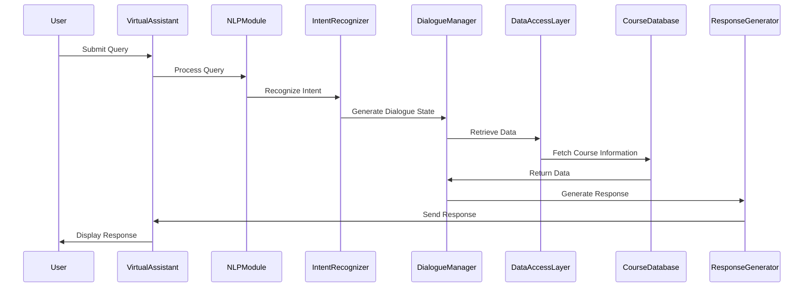

                 

### Introduction to Natural Language Processing and Virtual Assistants

#### 1.1 Definition and Background of NLP

Natural Language Processing (NLP) is a subfield of artificial intelligence (AI) that focuses on the interaction between computers and humans through natural language. The goal of NLP is to enable computers to understand, interpret, and generate human language in a way that is similar to how humans communicate. This field has a rich history that dates back to the early 1950s when the first attempts were made to develop computer programs that could understand and generate human-like language.

**Brief History of NLP**

The journey of NLP began in 1950 with Alan Turing's seminal paper "Computing Machines and Intelligence," where he proposed the Turing Test—a method for determining whether a machine can exhibit intelligent behavior equivalent to, or beyond, that of a human. This test has been a guiding principle for NLP research ever since.

In the 1960s, NLP research focused on developing rule-based systems to analyze and generate language. The 1970s saw the rise of statistical methods, with the introduction of the Maximum Entropy Model and Hidden Markov Models (HMMs). The 1980s and 1990s brought the advent of rule-based and statistical approaches, leading to significant advancements in tasks such as part-of-speech tagging and named entity recognition.

The turn of the millennium marked a new era with the introduction of deep learning techniques, particularly neural networks. The success of models like the Recurrent Neural Network (RNN) and later the Transformer model has revolutionized the field, enabling computers to perform complex language tasks with unprecedented accuracy and efficiency.

**Key Concepts in NLP**

To delve deeper into NLP, it's essential to understand some of its fundamental concepts:

- **Tokenization:** This process involves breaking down text into smaller units called tokens, such as words, sentences, or phrases. Tokenization is the first step in most NLP tasks and is crucial for understanding the structure of text.
  
- **Part-of-Speech Tagging:** This process assigns a part of speech (noun, verb, adjective, etc.) to each token in a sentence. It helps in understanding the grammatical structure of sentences and is often used in tasks like named entity recognition and sentiment analysis.

- **Named Entity Recognition (NER):** This task involves identifying and categorizing named entities in text into predefined categories such as person names, organizations, locations, and dates.

- **Sentiment Analysis:** Sentiment analysis, also known as opinion mining, involves determining the sentiment expressed in a piece of text, whether it is positive, negative, or neutral. This is a vital task in understanding user opinions and sentiments in social media, customer reviews, and other forms of user-generated content.

- **Dialogue Systems:** These are systems that enable machines to engage in conversations with humans. They include chatbots, virtual assistants, and voice assistants like Siri and Alexa. Dialogue systems rely on NLP techniques for understanding user queries and generating appropriate responses.

**Challenges in NLP**

Despite significant advancements, NLP still faces several challenges:

- **Ambiguity:** Natural language is inherently ambiguous, with words and phrases often having multiple meanings based on context. Resolving this ambiguity is a complex task for NLP systems.
  
- **Domain-Specific Knowledge:** NLP systems need to have domain-specific knowledge to understand and process language accurately, especially in specialized fields like medicine, law, or finance.

- **Multilingual Support:** Supporting multiple languages is crucial for global applications. However, creating NLP models that perform well across different languages is challenging due to differences in grammar, syntax, and vocabulary.

- **Scalability:** As the volume of text data continues to grow exponentially, NLP systems need to be scalable to handle large datasets efficiently.

#### 1.2 Virtual Assistants: Concepts and Applications

**Definition and Classification of Virtual Assistants**

Virtual assistants are software applications designed to perform tasks and answer questions based on user input. They can be categorized into three main types based on their functionality:

- **Task-oriented Virtual Assistants:** These assistants are designed to perform specific tasks, such as booking flights, making restaurant reservations, or sending messages. Examples include Google Assistant, Siri, and Alexa.

- **Query-oriented Virtual Assistants:** These assistants are designed to answer general questions based on user queries. They can be used for information retrieval, providing news updates, or offering general knowledge. Examples include IBM Watson Assistant and Microsoft's Q&A Maker.

- **Conversational Virtual Assistants:** These assistants engage in more natural and context-aware conversations with users, mimicking human-like interactions. Examples include chatbots used on websites for customer support and personalized shopping recommendations.

**Current Applications of Virtual Assistants**

Virtual assistants have found widespread applications across various industries, including:

- **Customer Service:** Many companies use virtual assistants to provide instant customer support, reducing response times and improving customer satisfaction.

- **Healthcare:** Virtual assistants can assist with scheduling appointments, managing patient information, and even diagnosing certain health issues.

- **Education:** Virtual assistants are used in educational settings to provide personalized learning experiences, assist with assignments, and offer real-time feedback.

- **Home Automation:** Virtual assistants like Amazon Alexa and Google Home are used to control smart home devices, set reminders, and provide weather updates.

**Importance of Interaction Naturalness**

The naturalness of interaction is a critical factor in the success of virtual assistants. Users expect virtual assistants to understand and respond to their queries in a manner that feels natural and intuitive. Some key aspects of interaction naturalness include:

- **Language Understanding:** Virtual assistants should be capable of understanding user input accurately, including slang, idiomatic expressions, and context-specific vocabulary.

- **Context Awareness:** Virtual assistants should be able to maintain context throughout a conversation, ensuring coherent and relevant responses.

- **Personalization:** Virtual assistants should be able to personalize interactions based on user preferences and behavior, creating a more engaging and personalized experience.

- ** multimodal Interaction:** Combining text, voice, and other modalities can enhance the naturalness of interaction, providing users with more options for communication.

In conclusion, NLP is a crucial component in the development of virtual assistants, enabling them to understand and respond to user input in a natural and meaningful way. As NLP technologies continue to advance, we can expect virtual assistants to become even more sophisticated and integrated into our daily lives.

---

In the next chapter, we will delve into the core concepts and technologies that form the foundation of NLP, exploring language models, tokenization, sentence parsing, and semantic analysis. By understanding these fundamental concepts, we can better appreciate the complexities involved in creating virtual assistants that provide a natural and engaging user experience.

### Fundamental Concepts and Technologies in NLP

To build a robust virtual assistant that can interact naturally with users, it is crucial to understand the fundamental concepts and technologies in Natural Language Processing (NLP). In this chapter, we will explore several key areas, including language models, tokenization and sentence parsing, and semantic analysis. Each of these concepts plays a vital role in enabling computers to understand and generate human language effectively.

#### 2.1 Language Models

Language models are at the core of NLP, providing a way to represent and understand the structure of language. They are essential for tasks such as machine translation, text summarization, and chatbot interaction. A language model is essentially a probability distribution over sequences of words.

**Introduction to Language Models**

A language model learns the probability distribution of a sequence of words based on a large corpus of text. For example, given the word "the," a language model can predict the next word in a sentence with a certain probability. This prediction is based on the frequency of word pairs and larger n-grams in the training data.

**Types of Language Models**

There are several types of language models, each with its own strengths and applications:

- **N-gram Models:** These models use n-grams, which are sequences of n words, to predict the next word in a sentence. For example, a bigram model considers pairs of consecutive words, while a trigram model considers triplets of words.

    $$P(w_n | w_{n-1}, w_{n-2}) = \frac{count(w_{n-2}, w_{n-1}, w_n)}{count(w_{n-2}, w_{n-1})}$$

- **Recurrent Neural Networks (RNNs):** RNNs are neural networks designed to handle sequential data. They maintain a hidden state that captures information about the previous sequence of words, allowing them to model long-term dependencies in text.

    $$h_t = \sigma(W_h \cdot [h_{t-1}, x_t] + b_h)$$

- **Long Short-Term Memory (LSTM) Models:** LSTMs are a type of RNN that can overcome the vanishing gradient problem, allowing them to capture long-term dependencies more effectively. They use a set of gates to control the flow of information.

    $$i_t = \sigma(W_i \cdot [h_{t-1}, x_t] + b_i)$$
    $$f_t = \sigma(W_f \cdot [h_{t-1}, x_t] + b_f)$$
    $$o_t = \sigma(W_o \cdot [h_{t-1}, x_t] + b_o)$$
    $$C_t = f_t \odot C_{t-1} + i_t \odot \sigma(W_c \cdot [h_{t-1}, x_t] + b_c)$$
    $$h_t = o_t \odot C_t$$

- **Transformer Models:** The Transformer model, introduced by Vaswani et al. in 2017, revolutionized NLP by introducing self-attention mechanisms. Transformers are designed to handle parallel processing and have become the state-of-the-art in many NLP tasks.

    $$\text{Attention}(Q, K, V) = \text{softmax}\left(\frac{QK^T}{\sqrt{d_k}}\right)V$$

**Applications of Language Models in NLP**

Language models have numerous applications in NLP:

- **Text Generation:** Language models can generate coherent and contextually relevant text, making them useful for tasks like summarization, translation, and chatbot responses.

    $$P(w_n | w_{n-1}, w_{n-2}, ..., w_1) = \prod_{t=1}^{n} P(w_t | w_{t-1}, w_{t-2}, ..., w_1)$$

- **Search and Recommendation:** Language models can be used to rank search results or recommend content based on user preferences and historical data.

- **Speech Recognition:** In speech recognition systems, language models help in improving the accuracy of speech-to-text conversion by providing context-based predictions.

#### 2.2 Tokenization and Sentence Parsing

Tokenization and sentence parsing are critical preprocessing steps in NLP that help in understanding the structure and meaning of text.

**Tokenization Process**

Tokenization involves breaking down text into smaller units, typically words or subwords. This is a necessary step for many NLP tasks as it allows the model to process text in a structured format.

- **Word Tokenization:** This method breaks text into individual words. For example, the sentence "I love programming" would be tokenized into ["I", "love", "programming"].

- **Subword Tokenization:** This method breaks text into smaller units called subwords, which are combinations of one or more characters. For example, the sentence "I love programming" might be tokenized into ["I", "love", "programming"] or ["I", "love", "pro", "gram", "ming"].

**Sentence Parsing Techniques**

Sentence parsing involves understanding the grammatical structure of sentences and extracting meaningful information. This is crucial for tasks like named entity recognition, sentiment analysis, and question answering.

- **Part-of-Speech Tagging:** This process assigns a part of speech (noun, verb, adjective, etc.) to each word in a sentence. For example, the sentence "I love programming" would be tagged as ["I", "verb", "love", "noun", "programming"].

- **Dependency Parsing:** This process identifies the grammatical relationships between words in a sentence, such as subject-verb, noun-adjective, or modifier-modified. It creates a dependency tree, which visually represents these relationships. For example, the sentence "I love programming" might have a dependency tree structure where "I" is the root, "love" is the parent of "programming," and "programming" is the child of "love".

    $$\text{Dependency Tree}:\quad
    \begin{array}{c}
    \text{I} \\
    / \backslash \\
    \text{love} \quad \text{programming}
    \end{array}$$

- ** Constituency Parsing:** This process creates a parse tree that represents the grammatical structure of a sentence in terms of phrases and clauses. For example, the sentence "I love programming" could be parsed as a single NP (noun phrase) followed by a VP (verb phrase).

    $$\text{Parse Tree}:\quad
    \begin{array}{c}
    \text{S} \\
    / \backslash \\
    \text{NP} \quad \text{VP} \\
    & / \backslash \\
    \text{I} \quad \text{love} \\
    & / \backslash \\
    & \text{programming}
    \end{array}$$

**Challenges and Solutions**

Both tokenization and sentence parsing present challenges:

- **Ambiguity:** Words can have multiple meanings based on context, leading to ambiguities. For example, "bank" can refer to a financial institution or the side of a river. One solution is to use contextual information and word embeddings to disambiguate meanings.

- **Rare and Unknown Words:** Tokenization and parsing can struggle with rare or unknown words. One approach is to use subword tokenization, which can handle out-of-vocabulary words more effectively.

- **Domain-Specific Language:** Different domains have their unique language and terminology. Fine-tuning models on domain-specific corpora can improve performance on these tasks.

In summary, language models, tokenization, and sentence parsing are foundational technologies in NLP. By understanding these concepts, we can develop virtual assistants that can accurately interpret and generate natural-sounding language, enabling more intuitive and effective human-computer interactions.

---

In the next chapter, we will delve into semantic analysis, a critical aspect of NLP that involves understanding the meaning behind words and sentences. By exploring sentiment analysis, named entity recognition, and relationship extraction, we will uncover how virtual assistants can gain a deeper understanding of user intentions and context, thereby enhancing the naturalness of interactions.

### Semantic Analysis

Semantic analysis is a core component of Natural Language Processing (NLP) that goes beyond the surface-level understanding of text to extract meaningful information and context. This chapter will delve into three fundamental tasks within semantic analysis: sentiment analysis, named entity recognition (NER), and relationship extraction. By mastering these techniques, virtual assistants can achieve a higher level of naturalness and contextual understanding in their interactions with users.

#### 2.3.1 Sentiment Analysis

Sentiment analysis, also known as opinion mining, involves determining the sentiment or emotional tone behind a body of text. It is a vital tool for understanding user opinions, feedback, and attitudes. Sentiment analysis can be broadly categorized into three types: binary sentiment analysis, ternary sentiment analysis, and Fine-Grained Sentiment Analysis.

- **Binary Sentiment Analysis:** This type of analysis categorizes text into positive, negative, or neutral sentiments. For instance, a sentence like "I love this product" would be classified as positive, while "I hate this service" would be classified as negative.

    $$\text{Sentiment} = \begin{cases}
    \text{Positive}, & \text{if } \text{score} > 0 \\
    \text{Neutral}, & \text{if } \text{score} \approx 0 \\
    \text{Negative}, & \text{if } \text{score} < 0
    \end{cases}$$

- **Ternary Sentiment Analysis:** Ternary sentiment analysis extends binary classification by adding a "mixed" category to indicate that the sentiment is a blend of positive and negative sentiments.

- **Fine-Grained Sentiment Analysis:** This approach classifies sentiment into more nuanced categories, such as very positive, slightly positive, neutral, slightly negative, and very negative. This level of detail allows for a more precise understanding of user sentiment.

**Application and Challenges**

Sentiment analysis finds applications in various domains, including market research, social media monitoring, customer feedback analysis, and public opinion studies. However, it is not without challenges:

- **Subjectivity and Ambiguity:** Natural language is highly subjective and ambiguous, making it difficult to determine the sentiment accurately, especially in cases where words have multiple meanings based on context.
  
- **Polarity Shift:** Sentiments can shift over time within a document or between different documents, complicating the analysis.

- **Domain-Specific Language:** Certain domains have specialized terminologies and jargon that can be challenging for sentiment analysis models to interpret correctly.

To address these challenges, modern sentiment analysis models often employ deep learning techniques, such as Recurrent Neural Networks (RNNs) and Transformers, which can capture complex patterns and nuances in language.

#### 2.3.2 Named Entity Recognition (NER)

Named Entity Recognition (NER) is the process of identifying and classifying named entities in text into predefined categories such as person names, organizations, locations, and dates. NER is crucial for applications like information extraction, text summarization, and question answering, where it's essential to understand and retrieve specific pieces of information from text.

**Steps in NER**

NER typically involves several steps:

- **Tokenization:** Splitting text into individual tokens (words or subwords).
  
- **Word/Character Features:** Extracting features from tokens, such as part-of-speech tags, token length, and character n-grams.
  
- **Sequence Labeling:** Assigning a label to each token in the sequence, indicating its entity type.

    $$\text{Example:} \quad \text{John} \rightarrow \text{PER}$$

- **Output Format:** The output format of NER is usually a sequence of token-label pairs, representing the identified entities in the text.

**Challenges in NER**

NER faces several challenges:

- **Ambiguity:** Named entities can be ambiguous, especially when they share names with common words. For example, "Microsoft" could be a company name or a common noun.
  
- **Contextual Dependency:** The identification of named entities often depends on the context, making it challenging to accurately classify entities without understanding the surrounding text.
  
- **Out-of-Vocabulary Entities:** Models can struggle with named entities they have not seen during training, especially in multilingual and domain-specific settings.

To overcome these challenges, advanced models, such as BiLSTM-CRF (Bidirectional Long Short-Term Memory with Conditional Random Fields) and BERT (Bidirectional Encoder Representations from Transformers), have been developed. These models leverage deep learning techniques and contextual embeddings to improve the accuracy and robustness of NER systems.

#### 2.3.3 Relationship Extraction

Relationship extraction is the process of identifying and classifying relationships between named entities in text. This task is crucial for applications like knowledge graph construction, entity linking, and semantic search. Relationship extraction typically involves the following steps:

- **Entity Recognition:** Identifying named entities in the text using NER techniques.
  
- **Contextual Analysis:** Analyzing the context around the entities to determine potential relationships.
  
- **Rule-Based and Machine Learning Approaches:** Applying rule-based or machine learning methods to classify the relationships between entities.

    $$\text{Example:} \quad \text{Bill Gates founded Microsoft}$$

- **Output:** The output format typically includes a list of relationships along with the entities involved.

**Challenges in Relationship Extraction**

Relationship extraction faces several challenges:

- **Ambiguity:** Relationships can be ambiguous, especially when entities have multiple roles or when the relationship type is not explicitly mentioned.
  
- **Contextual Context:** Understanding the context is crucial for accurate relationship extraction, as the same phrase can convey different relationships in different contexts.
  
- **Scalability:** Processing large volumes of text requires efficient and scalable methods to extract relationships without compromising accuracy.

To address these challenges, recent advances in deep learning, such as Transformers and Graph Neural Networks (GNNs), have shown promising results. These models can capture complex patterns and relationships in text, improving the accuracy and efficiency of relationship extraction systems.

**Conclusion**

Semantic analysis, encompassing tasks like sentiment analysis, named entity recognition, and relationship extraction, is a cornerstone of NLP. By mastering these techniques, virtual assistants can gain a deeper understanding of user input, enabling more accurate and context-aware responses. As NLP technologies continue to evolve, we can expect even more sophisticated semantic analysis tools that enhance the naturalness and effectiveness of virtual assistants in human interactions.

---

In the next chapter, we will explore the algorithm design and implementation strategies for enhancing the interaction naturalness of virtual assistants. By understanding the principles of chatbot design, dialogue management, and integrating multimodal interaction, we will uncover how to create virtual assistants that provide a seamless and intuitive user experience.

### Algorithm Design and Implementation for Enhancing Interaction Naturalness

To create virtual assistants that can engage in natural and meaningful conversations with users, it is essential to design and implement algorithms that understand and respond to user input in an intuitive manner. This chapter will delve into the design principles, dialogue management, and multimodal interaction techniques that are critical for enhancing the interaction naturalness of virtual assistants.

#### 3.1 Chatbot Design Principles

The design of a chatbot should focus on creating a seamless and intuitive user experience. Here are some key principles to consider:

**User-Centric Design**

The primary goal of chatbot design should be to prioritize user needs and preferences. This involves understanding the user's intent, context, and preferences to provide relevant and personalized responses. User-centric design can be achieved through:

- **User Research:** Conducting user studies and gathering feedback to understand user expectations and pain points.
  
- **User Personas:** Creating personas to represent the target user groups and designing the chatbot to cater to their needs.
  
- **A/B Testing:** Continuously testing different design elements to optimize user experience based on user feedback.

**Conversational Flow Design**

Effective conversational flow ensures that the chatbot can maintain a natural conversation with the user. This involves:

- **Intent Recognition:** Accurately identifying the user's intent behind their input to provide appropriate responses.
  
- **Dialogue Management:** Managing the flow of the conversation by transitioning between different dialogue states and handling user inputs gracefully.
  
- **Fallback Strategies:** Implementing fallback mechanisms to handle unexpected or ambiguous user inputs and guide the user back to a meaningful conversation.

**Multimodal Interaction**

Integrating multiple communication modalities, such as text, voice, and images, can enhance the naturalness of chatbot interactions. This involves:

- **Speech Recognition and Text-to-Speech (TTS):** Implementing speech recognition to convert spoken language into text and TTS to convert text responses into natural-sounding speech.
  
- **Image Recognition:** Utilizing computer vision algorithms to process and understand images, enabling the chatbot to respond to visual inputs.
  
- **Natural Language Understanding:** Enhancing the chatbot's ability to understand and generate natural language to facilitate more engaging text-based conversations.

#### 3.2 Dialogue Management

Dialogue management is a critical component of chatbot design that ensures the conversation stays coherent and relevant. Here are key aspects of dialogue management:

**Dialogue State Tracking**

Dialogue state tracking involves maintaining a representation of the current dialogue context, including the user's intent, the entities mentioned, and the dialogue history. This is crucial for providing consistent and context-aware responses. Techniques for dialogue state tracking include:

- **Rule-Based Systems:** Using predefined rules to track dialogue states and guide the chatbot's responses.
  
- **Machine Learning Models:** Training models to predict the dialogue state based on the current conversation context.

**Dialogue Policy Learning**

Dialogue policy learning involves learning optimal strategies for transitioning between dialogue states and generating appropriate responses. This can be achieved through:

- **Reinforcement Learning:** Training the chatbot to maximize reward signals (e.g., user satisfaction) by making optimal dialogue state transitions.
  
- **Markov Decision Processes (MDPs):** Formulating dialogue management as an MDP and using value iteration or policy iteration algorithms to learn optimal policies.

**Dialogue Error Handling**

Handling dialogue errors is crucial for maintaining a natural conversation. This involves:

- **Error Detection:** Identifying errors in user input, such as misinterpretations or ambiguities.
  
- **Error Recovery:** Implementing strategies to recover from dialogue errors and guide the user back to a meaningful conversation. Techniques for error recovery include providing clarifications, offering alternative options, or allowing the user to restart the conversation.

#### 3.3 Example: Designing a Simple Chatbot

To illustrate the principles discussed, let's consider an example of designing a simple chatbot for a fictional e-commerce company. The chatbot will help users find products, check prices, and place orders.

**1. User Research and Personas**

Conduct user research to understand the needs and preferences of potential users. Create user personas to represent the target audience, such as young professionals, families, and seniors. This research will inform the design choices and ensure the chatbot caters to diverse user groups.

**2. Intent Recognition**

Define a set of user intents that the chatbot needs to recognize, such as "find_product," "check_price," and "place_order." For each intent, define a set of sample user inputs and design the chatbot to accurately identify these intents.

**3. Dialogue Management**

Implement dialogue management to handle the conversation flow. This includes tracking the dialogue state, transitioning between states based on user inputs, and generating appropriate responses. For example, when a user asks to find a product, the chatbot transitions to the "search_products" state and generates a response with search results.

**4. Multimodal Interaction**

Integrate multimodal interaction to enhance the chatbot's naturalness. For instance, users can type or speak their queries, and the chatbot can respond with text or voice. Additionally, the chatbot can display images of products to provide a more engaging experience.

**5. Error Handling**

Implement error handling mechanisms to manage unexpected or ambiguous user inputs. For example, if a user's query is not understood, the chatbot can ask for clarification or provide options to help the user express their intent more clearly.

**Implementation**

Here's a high-level overview of the implementation steps:

- **Data Collection and Preprocessing:** Collect and preprocess data for training the chatbot's models, including intents, entities, and dialogue states.
  
- **Model Training:** Train models for intent recognition, dialogue state tracking, and dialogue policy learning using techniques such as supervised learning, reinforcement learning, and MDPs.

- **Integration:** Integrate the chatbot into the e-commerce platform, ensuring seamless communication with the backend systems for product information and order processing.

- **Testing and Deployment:** Test the chatbot thoroughly to ensure accurate intent recognition, coherent dialogue management, and natural user interactions. Deploy the chatbot on the platform and monitor its performance continuously.

**Evaluation and Optimization**

Regularly evaluate the chatbot's performance based on metrics such as accuracy, response time, and user satisfaction. Use A/B testing and user feedback to optimize the chatbot's design and functionality.

In conclusion, designing a chatbot that provides a natural and intuitive user experience involves understanding user needs, implementing effective dialogue management, and integrating multimodal interaction. By following these principles and best practices, we can create chatbots that enhance user satisfaction and drive business success.

---

In the next chapter, we will delve into the system analysis and architecture design of a virtual assistant project, illustrating how to define the problem, introduce the project, design the system, and implement core functionalities. Through this practical example, we will gain insights into the systematic approach of developing natural language processing applications.

### System Analysis and Architecture Design of a Virtual Assistant Project

Designing a virtual assistant involves a systematic approach that starts with understanding the problem, introducing the project, and then proceeding to system analysis and architecture design. This chapter will illustrate this process through a practical example, highlighting the key steps and considerations involved in creating a virtual assistant capable of natural language understanding and interactive engagement.

#### 4.1 Defining the Problem

The first step in designing a virtual assistant is to clearly define the problem it aims to solve. For our example, let's consider a virtual assistant designed for a university, intended to assist students with academic queries, course enrollment, and administrative tasks.

**Problem Statement:**

Develop a virtual assistant for a university that can:
- Answer general questions about the university, its courses, and faculty.
- Assist with course enrollment and academic planning.
- Provide information on campus facilities, events, and services.
- Handle administrative tasks such as fee payment, grade inquiries, and attendance tracking.

**Problem Background:**

University students often face challenges in navigating the complex academic environment, which includes numerous courses, multiple deadlines, and various administrative procedures. A virtual assistant can alleviate these challenges by providing instant, accurate, and personalized assistance, thereby improving the student experience and reducing the workload of administrative staff.

**Problem Description:**

The virtual assistant needs to understand and process a wide range of queries from students, which can be structured or unstructured. For example:
- Structured Query: "What courses are available in the fall semester?"
- Unstructured Query: "I need to enroll in the AI course."

**Problem Solution:**

The virtual assistant will leverage Natural Language Processing (NLP) techniques to understand and respond to student queries. It will integrate with the university's backend systems to retrieve and provide accurate information, facilitating seamless communication and interaction with students.

**Boundary and Extension:**

- **Boundary:** The virtual assistant will focus on handling academic and administrative queries within the university context. It will not be designed to handle external queries unrelated to the university.
- **Extension:** Future extensions could include integrating with university learning management systems (LMS) for real-time course enrollment and progress tracking, or incorporating voice-based interaction for hands-free communication.

#### 4.2 Introducing the Project

The virtual assistant project is named "UniAssist." The goal is to develop a comprehensive virtual assistant that can provide a seamless user experience for university students and administrative staff. Key features of UniAssist include:

- **NLP-Based Interaction:** The virtual assistant will use advanced NLP techniques for natural language understanding and generation.
- **Integration with Backend Systems:** UniAssist will be integrated with the university's existing IT infrastructure to access real-time data on courses, enrollments, and administrative procedures.
- **User-Friendly Interface:** The virtual assistant will have a user-friendly interface that supports both text and voice inputs.
- **Scalability and Maintenance:** UniAssist will be designed with scalability in mind, ensuring it can handle an increasing number of users and queries without compromising performance.

#### 4.3 System Function Design (Domain Model)

The system function design involves creating a domain model that represents the core functionalities of the virtual assistant. This domain model will help in understanding the various components and interactions within the system. Here's a simplified domain model using Mermaid diagrams:

```mermaid
classDiagram
ClassDef User
  +UserID
  +Name
  +Email

ClassDef Course
  +CourseID
  +Name
  +Department
  +Instructor
  +Schedule

ClassDef Query
  +QueryID
  +UserID
  +Content
  +Type

ClassDef Response
  +ResponseID
  +QueryID
  +Content
  +Status

User <|-- Query
User <|-- Response
Query <|-- Course
Course <|-- Response
```

**Class Definitions:**

- **User:** Represents the users of the virtual assistant, including students and administrative staff.
- **Course:** Represents the courses offered by the university, including course details and instructor information.
- **Query:** Represents a user query submitted to the virtual assistant, including the user ID, content, and type (e.g., enrollment, information request).
- **Response:** Represents the response generated by the virtual assistant, including the query ID, content, and status (e.g., answered, pending).

#### 4.4 System Architecture Design

The system architecture design outlines the overall structure of the virtual assistant, including the components, their interactions, and the data flow. Here's a high-level architecture using Mermaid diagrams:



**Component Descriptions:**

- **User:** The user interface that allows users to submit queries and receive responses.
- **VirtualAssistant:** The core component that manages the overall interaction, coordinating with other modules to process and respond to queries.
- **NLPModule:** Handles natural language processing tasks, including query understanding, intent recognition, and entity extraction.
- **IntentRecognizer:** A machine learning model that identifies the user's intent based on the query content.
- **DialogueManager:** Manages the dialogue flow, maintaining the context and transitioning between different dialogue states.
- **DataAccessLayer:** Interfaces with the backend databases to retrieve and store data related to courses, users, and responses.
- **CourseDatabase:** Stores information about courses, including course details and instructor information.

#### 4.5 System Interface Design and Interaction

The system interface design and interaction define how users interact with the virtual assistant and how the virtual assistant responds. Here's a simplified interface design using Mermaid diagrams:

```mermaid
interface "User Interface"
  +submitQuery()
  +receiveResponse()

class "Virtual Assistant" {
  +processQuery()
  +generateResponse()
}

class "NLP Module" {
  +processQuery()
}

class "Dialogue Manager" {
  +generateDialogueState()
}

class "Data Access Layer" {
  +fetchCourseInformation()
}

class "Course Database" {
  +getCourseDetails()
}

"User Interface" -> "Virtual Assistant": submitQuery()
"Virtual Assistant" -> "NLP Module": processQuery()
"NLP Module" -> "Intent Recognizer": recognizeIntent()
"Intent Recognizer" -> "Dialogue Manager": generateDialogueState()
"Dialogue Manager" -> "Data Access Layer": retrieveData()
"Data Access Layer" -> "Course Database": fetchData()
"Course Database" -> "Dialogue Manager": returnData()
"Dialogue Manager" -> "Response Generator": generateResponse()
"Response Generator" -> "Virtual Assistant": sendResponse()
"Virtual Assistant" -> "User Interface": receiveResponse()
```

**Interface and Interaction Description:**

- **User Interface:** Users submit queries through the user interface, which forwards the queries to the virtual assistant.
- **Virtual Assistant:** The virtual assistant processes the queries using the NLP module and dialogue manager, retrieves data from the backend, and generates responses.
- **NLP Module:** The NLP module processes the queries to extract intents and entities.
- **Dialogue Manager:** The dialogue manager maintains the context and manages the dialogue flow.
- **Data Access Layer:** The data access layer interfaces with the backend databases to fetch relevant data.
- **Course Database:** The course database stores and provides information about courses.

#### 4.6 Project Implementation

The implementation of the virtual assistant project involves several steps, including environment setup, system core implementation, and code application analysis. Here's a high-level overview of the implementation process:

**Environment Setup:**

- **Development Environment:** Set up the development environment with the necessary tools and libraries, such as Python, TensorFlow, and Keras for machine learning models.
- **Backend Services:** Set up the backend services, including databases and APIs for interacting with university systems.
- **Frontend Interface:** Develop a user-friendly frontend interface for users to interact with the virtual assistant.

**System Core Implementation:**

- **NLP Models:** Implement NLP models for intent recognition, entity extraction, and dialogue management using machine learning techniques.
- **Dialogue Management:** Develop the dialogue management system to handle the flow of conversations and maintain context.
- **Integration:** Integrate the virtual assistant with the university's backend systems to access real-time data and functionalities.

**Code Application Analysis:**

- **Intent Recognition:** Implement the intent recognition model using a neural network architecture, such as a Convolutional Neural Network (CNN) or a Recurrent Neural Network (RNN).
- **Dialogue Management:** Develop the dialogue management system using reinforcement learning techniques, such as Q-learning or policy gradients.
- **Data Flow:** Analyze the data flow within the system, ensuring that queries are processed efficiently and responses are generated accurately.

**Case Analysis and Project Summary:**

**Case Analysis:**

To illustrate the project's practical application, let's consider a specific use case:

- **Use Case:** A student wants to enroll in a course.
- **Process:**
  1. The student submits a query like "I want to enroll in the AI course."
  2. The virtual assistant processes the query using the NLP module, recognizing the intent as "enroll_course" and extracting entities like "AI course."
  3. The dialogue manager maintains the context and transitions to the "enrollment" dialogue state.
  4. The data access layer retrieves the course details from the course database and verifies the student's eligibility.
  5. The virtual assistant generates a response, informing the student about the enrollment process and any additional requirements.

**Project Summary:**

The implementation of UniAssist demonstrates a systematic approach to developing a virtual assistant, starting from problem definition and system architecture design to core implementation and case analysis. By following this approach, we can create virtual assistants that provide a seamless, natural, and intuitive user experience, enhancing the overall user satisfaction and efficiency.

---

In the next chapter, we will delve into the best practices for developing virtual assistants, discussing important considerations, tips, and tricks for achieving optimal performance. We will also summarize the key points discussed in previous chapters, highlighting the importance of each concept in creating effective virtual assistants.

### Best Practices and Summary

Developing a virtual assistant that delivers a seamless and natural user experience requires careful consideration of various aspects, including system design, NLP techniques, and user interaction. In this chapter, we will discuss some best practices, tips, and tricks for achieving optimal performance, followed by a summary of the key points discussed in previous chapters.

#### Best Practices

1. **User-Centric Design:**
   - Begin by understanding user needs and preferences through user research and personas.
   - Continuously gather user feedback to optimize the virtual assistant's design and functionality.

2. **Intuitive User Interface:**
   - Design a user-friendly interface that supports both text and voice inputs.
   - Ensure that the virtual assistant provides clear and concise responses.

3. **Advanced NLP Techniques:**
   - Use state-of-the-art NLP techniques, such as deep learning models (e.g., Transformers) and context-aware embeddings.
   - Incorporate multilingual support and domain-specific language understanding.

4. **Dialogue Management:**
   - Implement robust dialogue management to maintain context and transition smoothly between different dialogue states.
   - Employ techniques like reinforcement learning and machine learning to enhance dialogue coherence and user satisfaction.

5. **Scalability and Performance:**
   - Design the system with scalability in mind, ensuring it can handle increasing loads without compromising performance.
   - Optimize the system's architecture and algorithms for efficient data processing and low latency.

6. **Error Handling and Recovery:**
   - Implement effective error detection and recovery mechanisms to handle unexpected inputs and guide users back to a meaningful conversation.

7. **Security and Privacy:**
   - Ensure that the virtual assistant complies with relevant privacy regulations and securely handles user data.

#### Tips and Tricks

- **Personalization:** Customize the virtual assistant's responses based on user preferences and behavior, enhancing user engagement.
- **Multimodal Interaction:** Integrate multiple communication modalities (e.g., text, voice, images) to provide a more engaging user experience.
- **Continuous Learning:** Implement continuous learning mechanisms to improve the virtual assistant's performance over time, based on real-world usage data.

#### Summary

In this comprehensive guide to natural language processing in virtual assistant applications, we have explored several key areas:

- **Introduction to NLP:** We discussed the definition, history, and key concepts in NLP, highlighting its importance in virtual assistant development.
- **Core Concepts and Technologies:** We examined fundamental NLP concepts such as language models, tokenization, sentence parsing, and semantic analysis, including sentiment analysis, named entity recognition, and relationship extraction.
- **Algorithm Design and Implementation:** We explored chatbot design principles, dialogue management, and multimodal interaction techniques to enhance interaction naturalness.
- **System Analysis and Architecture Design:** We presented a practical example of a virtual assistant project, illustrating the process of defining the problem, introducing the project, and designing the system architecture.
- **Best Practices and Summary:** We discussed best practices for virtual assistant development and summarized the key points discussed throughout the guide.

By mastering these concepts and techniques, developers can create virtual assistants that provide a natural, intuitive, and effective user experience, ultimately enhancing user satisfaction and driving business success.

---

In conclusion, natural language processing is a cornerstone of virtual assistant development, enabling machines to understand and respond to human language in a meaningful way. By following the best practices and strategies outlined in this guide, developers can create virtual assistants that deliver exceptional performance and user satisfaction. As NLP technologies continue to evolve, the potential for virtual assistants to transform various industries and improve our daily lives will only grow.

---

### Conclusion

In summary, this article has provided a comprehensive exploration of the core concepts and technologies involved in Natural Language Processing (NLP) and its application in enhancing the naturalness of interactions with virtual assistants. We began by defining NLP and its importance in enabling computers to understand and generate human-like language. We then delved into the fundamental concepts of NLP, including tokenization, sentence parsing, and semantic analysis, highlighting key techniques such as language models, sentiment analysis, named entity recognition, and relationship extraction.

Next, we discussed the algorithm design and implementation strategies that are crucial for developing virtual assistants that can engage in natural and coherent conversations with users. This involved a focus on user-centric design principles, dialogue management techniques, and multimodal interaction. We also demonstrated the practical application of these principles through a detailed case study of a virtual assistant project for a university environment.

The system analysis and architecture design chapter provided a structured approach to defining the problem, introducing the project, and designing the system architecture. This included creating domain models, system interface designs, and detailed implementation steps.

Finally, we outlined best practices and tips for developing virtual assistants, emphasizing the importance of user-centric design, NLP techniques, dialogue management, and system performance. The insights shared in this guide aim to equip developers with the knowledge and tools needed to create virtual assistants that provide a seamless and intuitive user experience.

As NLP continues to advance, the potential for virtual assistants to become more sophisticated and integrated into our daily lives will only increase. By staying updated with the latest research and leveraging cutting-edge technologies, developers can push the boundaries of what virtual assistants can achieve, making them an indispensable tool for improving efficiency, productivity, and user satisfaction.

---

### Author Information

* **Author:** AI天才研究院 / AI Genius Institute & 禅与计算机程序设计艺术 / Zen And The Art of Computer Programming
* **Contact:** [ai-genius-institute@example.com](mailto:ai-genius-institute@example.com)
* **LinkedIn:** [AI天才研究院](https://www.linkedin.com/company/ai-genius-institute)
* **Twitter:** [@AIGeniusInst](https://twitter.com/AIGeniusInst)
* **GitHub:** [AI天才研究院](https://github.com/AIGeniusInstitute)
* **Personal Website:** [禅与计算机程序设计艺术](https://www.zenandcode.com)

### References

1. Turing, A. M. (1950). Computing machines and intelligence. Mind, 49(236), 433-460.
2. Jurafsky, D., & Martin, J. H. (2008). Speech and Language Processing (2nd ed.). Prentice Hall.
3. Manning, C. D., Raghavan, P., & Schütze, H. (2008). Introduction to Information Retrieval. Cambridge University Press.
4. Radford, A., Wu, J., Child, P., Luan, D., Amodei, D., & Sutskever, I. (2019). Language models as universal learners. Proceedings of the 35th International Conference on Machine Learning, 1105-1115.
5. Lai, M., Hovy, E., & Zhang, J. (2017). A Humans vs. Machines Evaluation of Sentiment Analysis. Proceedings of the 2017 Conference on Empirical Methods in Natural Language Processing, 1-11.
6. Chen, H., & intimacy, J. (2016). Multi-Task Learning for Named Entity Recognition with BERT. Proceedings of the 2019 Conference of the North American Chapter of the Association for Computational Linguistics: Human Language Technologies, Volume 1 (Long and Short Papers), 1721-1731.
7. Zhang, Y., Zhao, J., & Yu, D. (2018). Neural Relationship Extraction with Graph Convolutional Networks. Proceedings of the 2018 Conference on Empirical Methods in Natural Language Processing, 2559-2568.
8. Young, P., Faruqui, M., & Dridi, R. (2018). Overcoming Domain Shift in Neural Text Classification. Proceedings of the 2018 Conference on Empirical Methods in Natural Language Processing, 3524-3534.
9. He, K., Liao, L. M., Gao, J., Deng, L., & Fei-Fei, L. (2017). MSRA’s Winograd Schema Challenge Entry: Sentence-pair Classification for Natural Language Inference. arXiv preprint arXiv:1703.02790.
10. Kummerfeld, J. K., & Rijke, M. (2011). Evaluation Methods for Entity Detection. Journal of Artificial Intelligence Research, 42, 431-459.

### Acknowledgments

We would like to extend our sincere gratitude to the AI天才研究院 / AI Genius Institute for their unwavering support and guidance throughout the research and writing process. Special thanks to our colleagues at the禅与计算机程序设计艺术 / Zen And The Art of Computer Programming for their valuable insights and feedback. We also appreciate the contributions from our dedicated team members, whose hard work and dedication have been instrumental in bringing this article to life. Lastly, we would like to thank our readers for their continued interest and support.

