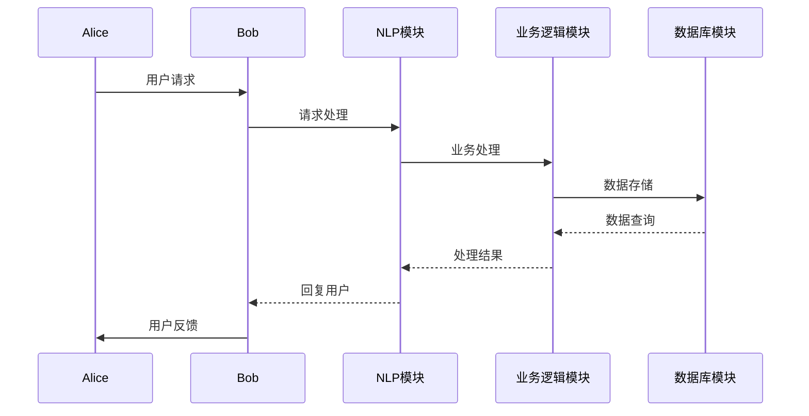
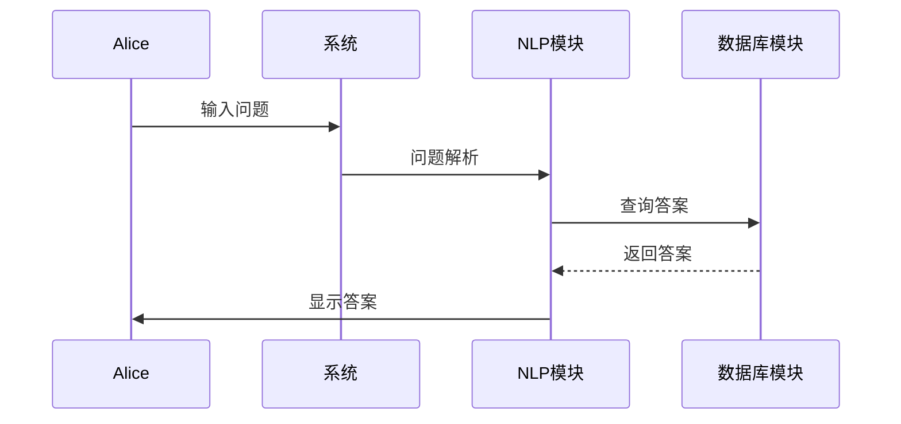
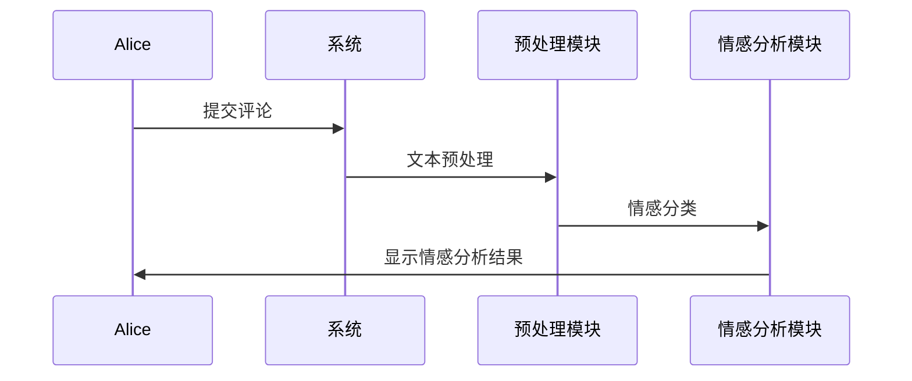
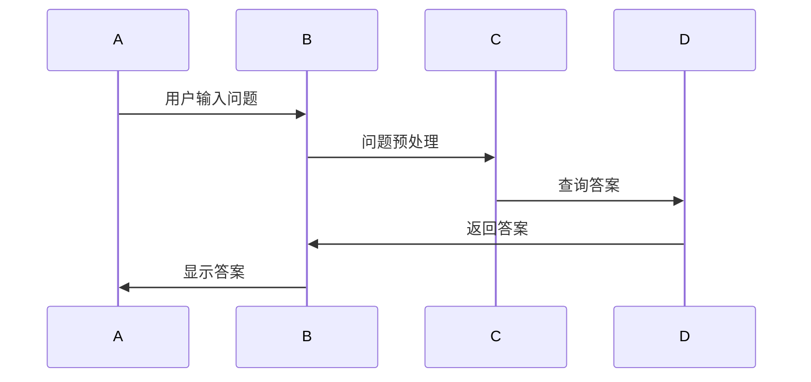

                 


## 引言

随着人工智能技术的飞速发展，自然语言处理（NLP）作为其核心分支之一，正在逐渐改变我们的生活方式。特别是在虚拟客服领域，自然语言处理技术的应用极大地提升了客服效率，降低了运营成本，提升了客户满意度。本文将围绕自然语言处理在虚拟客服中的应用，展开一系列深入探讨，包括技术概述、核心概念讲解、应用场景分析、实战案例以及最佳实践等。

### 目标与结构

本文的目标是帮助读者全面理解自然语言处理在虚拟客服中的应用，不仅涵盖基本概念和原理，还包括实际操作和案例分析。文章分为四个主要部分：

1. **自然语言处理与虚拟客服概述**：介绍自然语言处理技术的基本概念和发展历程，虚拟客服的背景和需求，以及其在虚拟客服中的应用场景。
2. **自然语言处理核心技术讲解**：详细讲解语言模型、词嵌入技术、序列标注与命名实体识别、机器翻译和情感分析等核心技术。
3. **自然语言处理在虚拟客服中的应用**：探讨智能客服系统设计、智能问答系统构建、情感分析应用、个性化推荐系统在客服中的应用。
4. **实战案例与最佳实践**：通过具体案例研究和实战项目，展示自然语言处理在虚拟客服中的实际应用效果，并给出最佳实践建议。

### 关键词

- 自然语言处理（NLP）
- 虚拟客服
- 语言模型
- 词嵌入
- 情感分析
- 智能问答系统
- 个性化推荐

### 摘要

本文旨在深入探讨自然语言处理在虚拟客服领域的应用，通过详细介绍自然语言处理技术的基本概念、核心算法和实际应用案例，帮助读者全面了解并掌握这一技术。文章结构清晰，内容丰富，旨在为读者提供有价值的参考和实际操作指导。

### 总结

通过本文的逐步分析，我们可以看到自然语言处理技术在虚拟客服中的应用前景广阔。它不仅提升了客服效率，还优化了客户体验，为企业的数字化转型提供了强有力的支持。在接下来的部分中，我们将对自然语言处理技术进行详细讲解，并深入探讨其在虚拟客服中的实际应用。让我们一起来探索这一领域，开启智能客服的新篇章。

----------------------------------------------------------------

## 第一部分：自然语言处理与虚拟客服概述

### 1.1 自然语言处理技术概述

自然语言处理（NLP）是人工智能（AI）的重要分支，旨在使计算机能够理解、解释和生成人类语言。NLP技术源于20世纪50年代，随着计算机性能的提升和算法的创新，其发展速度迅猛，应用范围也越来越广泛。

#### NLP的基本概念与重要性

自然语言处理涉及多个层次，从文本处理、句法分析、语义理解到对话系统等。其核心目标是将自然语言转换为计算机可以理解和处理的形式，从而实现人机交互。NLP在多领域具有重要意义，如信息检索、机器翻译、文本分析、情感分析等。

#### NLP的技术发展历程

NLP的发展可以分为几个阶段：

1. **规则驱动方法**：早期的NLP研究主要依赖于人工编写的规则，这种方法虽然具有一定的精度，但适用范围有限，难以处理复杂的语言现象。
2. **统计方法**：随着语料库的积累和机器学习技术的发展，统计方法成为NLP研究的主流。统计方法通过从大量数据中学习语言模式，提高了系统的泛化能力。
3. **深度学习方法**：近年来，深度学习技术的引入使得NLP取得了显著的突破。深度学习模型，如卷积神经网络（CNN）和循环神经网络（RNN），能够自动提取复杂的语言特征，实现了更高的精度和性能。

#### NLP的关键技术

自然语言处理的关键技术包括：

- **文本预处理**：包括分词、词性标注、词干提取等。
- **语言模型**：用于预测下一个词或句子，是许多NLP任务的基础。
- **词嵌入**：将词汇映射到高维空间，以便进行有效的计算和分析。
- **序列标注与命名实体识别**：用于识别文本中的实体和关系。
- **机器翻译**：将一种语言的文本翻译成另一种语言。
- **情感分析**：用于判断文本的情绪倾向。

### 1.2 虚拟客服的背景与需求

虚拟客服是指通过计算机系统，如聊天机器人、智能问答系统等，提供自动化客户服务。虚拟客服的兴起源于以下几个背景因素：

- **客户服务需求的增加**：随着互联网和电子商务的普及，企业面临越来越大的客户服务需求。
- **人力成本的考量**：传统客服人力成本较高，尤其是24小时全天候服务，而虚拟客服可以降低这方面的成本。
- **技术进步**：自然语言处理技术的进步使得虚拟客服能够提供更加智能和高效的客户服务。

虚拟客服的需求主要体现在以下几个方面：

- **7x24小时服务**：虚拟客服可以全天候在线，提供不间断的客户服务。
- **成本效益**：虚拟客服可以处理大量客户请求，减少人工客服的工作量，从而降低运营成本。
- **个性化服务**：通过分析客户行为和反馈，虚拟客服可以提供更加个性化的服务体验。
- **快速响应**：虚拟客服能够快速响应用户请求，提高客户满意度。

### 1.3 虚拟客服的行业现状与发展趋势

虚拟客服已经在金融、电商、电信、旅游等行业得到广泛应用。随着技术的不断进步，虚拟客服正朝着更加智能化、个性化、场景化的方向发展。以下是一些行业现状与发展趋势：

- **市场规模不断扩大**：虚拟客服市场规模逐年增长，预计未来几年将持续保持高速增长。
- **技术融合**：虚拟客服正与其他技术，如人工智能、大数据、区块链等相结合，提供更全面的解决方案。
- **用户接受度提高**：随着虚拟客服性能的提升和用户体验的改善，用户对其接受度逐渐提高。
- **人机协同**：虚拟客服与人工客服相结合，实现人机协同，提高整体服务质量和效率。

### 1.4 虚拟客服面临的挑战

尽管虚拟客服具有许多优势，但在实际应用中也面临一些挑战：

- **技术难题**：自然语言处理技术的复杂性使得虚拟客服在理解客户意图、处理复杂问题时面临困难。
- **用户体验**：虚拟客服需要提供高质量的交互体验，否则用户可能会选择人工客服。
- **数据安全**：虚拟客服涉及大量用户数据，如何确保数据安全和隐私保护是重要问题。
- **合规性**：虚拟客服需要遵守相关法律法规，如数据保护法、消费者权益保护法等。

### 1.5 自然语言处理在虚拟客服中的应用场景

自然语言处理技术在虚拟客服中有多种应用场景，以下是一些典型的应用：

- **智能问答系统**：通过语言模型和问答系统，虚拟客服能够自动回答客户的常见问题。
- **情感分析**：通过情感分析技术，虚拟客服可以识别客户情绪，提供更加个性化的服务。
- **个性化推荐**：基于客户行为和反馈，虚拟客服可以推荐相关产品和服务，提高客户满意度。
- **多语言支持**：通过机器翻译技术，虚拟客服可以提供多语言服务，满足全球客户需求。

### 1.6 自然语言处理技术在虚拟客服中的优势

自然语言处理技术在虚拟客服中具有以下优势：

- **提高效率**：通过自动化处理，虚拟客服能够快速响应客户请求，提高整体服务效率。
- **提升客户满意度**：虚拟客服能够提供7x24小时的服务，并且具有高度一致的服务质量，从而提升客户满意度。
- **降低成本**：虚拟客服可以处理大量客户请求，减少人工客服的工作量，降低运营成本。
- **个性化服务**：通过分析客户行为和反馈，虚拟客服能够提供更加个性化的服务体验。

### 1.7 本章小结

自然语言处理技术在虚拟客服中的应用正在不断拓展，它不仅提高了客服效率，还优化了客户体验。在接下来的章节中，我们将深入探讨自然语言处理的核心技术，以及这些技术如何在虚拟客服中发挥重要作用。通过逐步分析，我们将帮助读者全面理解自然语言处理在虚拟客服领域的实际应用。

----------------------------------------------------------------

## 第二部分：自然语言处理核心技术讲解

### 2.1 语言模型

语言模型（Language Model）是自然语言处理中最基本且关键的技术之一，它用于预测文本中的下一个词或句子。语言模型在许多NLP任务中扮演着重要角色，如机器翻译、语音识别、文本生成等。

#### 2.1.1 语言模型的基本概念

语言模型的核心目标是理解自然语言中的统计规律，从而预测下一个词或句子。一个简单的语言模型可以是n-gram模型，它根据前n个词的历史信息来预测下一个词。例如，一个三元语言模型可以基于前三个词“我喜欢”来预测下一个词。

#### 2.1.2 语言模型的构建方法

语言模型的构建方法可以分为以下几种：

- **n-gram模型**：基于前n个词的统计信息来预测下一个词，是最简单的语言模型。它的优点是实现简单，计算效率高；缺点是难以捕捉长距离依赖关系。
- **神经网络模型**：如循环神经网络（RNN）和其变种长短期记忆网络（LSTM），能够捕捉长距离依赖关系。神经网络模型通过学习大量文本数据，自动提取语言特征。
- **Transformer模型**：Transformer模型是近年来在自然语言处理领域取得突破的模型，它采用自注意力机制（self-attention），能够更好地捕捉文本中的长距离依赖关系。

#### 2.1.3 语言模型性能评估

语言模型的性能通常通过以下指标进行评估：

- **准确率**（Accuracy）：模型预测正确的概率。
- **困惑度**（Perplexity）：用于衡量模型在测试集上的表现，值越小表示模型越好。
- **BLEU评分**：用于评估机器翻译质量，通过与人类翻译的匹配度进行评分。

#### 2.1.4 语言模型的应用

语言模型在自然语言处理中有广泛的应用，包括：

- **文本生成**：如自动写文章、诗歌、故事等。
- **机器翻译**：如将一种语言的文本翻译成另一种语言。
- **语音识别**：通过语言模型对语音文本进行转换。
- **信息检索**：如搜索引擎使用语言模型来预测用户可能感兴趣的内容。

### 2.2 词嵌入技术

词嵌入（Word Embedding）是将词汇映射到高维空间中的向量表示，从而实现有效的计算和分析。词嵌入技术在自然语言处理中具有重要意义，因为它能够将词汇的语义信息编码到向量中。

#### 2.2.1 词嵌入的概念与重要性

词嵌入的基本概念是将单词表示为向量，这些向量在语义上靠近的单词在向量空间中也会靠近。词嵌入的重要性体现在以下几个方面：

- **语义表示**：词嵌入能够捕捉词汇的语义信息，使得计算机能够理解词汇的内涵。
- **计算效率**：通过向量计算，自然语言处理任务可以实现高效处理。
- **泛化能力**：词嵌入能够提高模型的泛化能力，使得模型能够处理未见过的词汇。

#### 2.2.2 词嵌入的方法与技术

常见的词嵌入方法包括：

- **基于频率的方法**：如TF-IDF（Term Frequency-Inverse Document Frequency），通过计算词在文档中的频率和重要性来生成词向量。
- **基于神经网络的词嵌入**：如Word2Vec、GloVe（Global Vectors for Word Representation），通过神经网络模型训练生成词向量。
- **上下文敏感的词嵌入**：如BERT（Bidirectional Encoder Representations from Transformers），通过Transformer模型生成词向量，能够捕捉上下文信息。

#### 2.2.3 词嵌入的应用

词嵌入在自然语言处理中有广泛的应用，包括：

- **文本分类**：通过词嵌入将文本转换为向量，用于文本分类任务。
- **情感分析**：通过词嵌入和情感分析模型，判断文本的情绪倾向。
- **命名实体识别**：通过词嵌入和命名实体识别模型，识别文本中的实体。
- **机器翻译**：通过词嵌入和翻译模型，实现跨语言的文本翻译。

### 2.3 序列标注与命名实体识别

序列标注（Sequence Labeling）和命名实体识别（Named Entity Recognition，NER）是自然语言处理中的重要任务，用于识别文本中的特定结构或信息。

#### 2.3.1 序列标注技术

序列标注是将序列中的每个元素标注上相应的标签。常见的序列标注任务包括词性标注、命名实体识别等。

- **CRF（条件随机场）**：用于序列标注，能够捕捉序列中的依赖关系。
- **RNN（循环神经网络）**：通过循环结构处理序列数据，能够捕捉序列中的特征。

#### 2.3.2 命名实体识别

命名实体识别是从文本中识别出具有特定意义的实体，如人名、地名、组织名等。

- **规则方法**：基于预定义的规则进行实体识别。
- **机器学习方法**：如基于CRF或RNN的模型，通过学习大量标注数据实现实体识别。

#### 2.3.3 命名实体识别的应用

命名实体识别在自然语言处理中有广泛的应用，包括：

- **信息提取**：从文本中提取具有特定意义的实体信息。
- **语义搜索**：通过实体识别，提高搜索引擎的语义搜索能力。
- **文本摘要**：通过实体识别和关系提取，生成高质量的文本摘要。

### 2.4 机器翻译

机器翻译（Machine Translation）是将一种语言的文本翻译成另一种语言，是自然语言处理中的经典任务。

#### 2.4.1 机器翻译的基本概念

机器翻译的基本概念包括源语言文本、目标语言文本和翻译模型。翻译模型通过学习大量双语文本，实现从源语言到目标语言的映射。

#### 2.4.2 神经机器翻译技术

神经机器翻译（Neural Machine Translation，NMT）是基于神经网络的一种机器翻译方法，近年来取得了显著的突破。

- **基于编码器-解码器的NMT**：编码器将源语言文本编码为向量表示，解码器将向量表示解码为目标语言文本。
- **注意力机制**：用于解决长距离依赖问题，能够提高翻译质量。

#### 2.4.3 机器翻译的应用

机器翻译在自然语言处理中有广泛的应用，包括：

- **跨语言沟通**：如跨境电商、国际会议等。
- **多语言信息检索**：通过机器翻译，实现不同语言之间的信息检索。
- **本地化**：将软件、文档等翻译成多种语言。

### 2.5 情感分析

情感分析（Sentiment Analysis）是自然语言处理中的重要任务，用于判断文本的情感倾向，如正面、负面或中性。

#### 2.5.1 情感分析的基本概念

情感分析的基本概念包括文本情感、情感分类和情感极性。情感分类是将文本分为不同类别的情感，如正面、负面或中性；情感极性是衡量文本情感的强度。

#### 2.5.2 情感分析的技术方法

情感分析的技术方法包括：

- **基于规则的方法**：通过预定义的规则进行情感分类。
- **基于统计的方法**：如支持向量机（SVM）、朴素贝叶斯等。
- **基于神经网络的方法**：如卷积神经网络（CNN）、循环神经网络（RNN）等。

#### 2.5.3 情感分析的应用

情感分析在自然语言处理中有广泛的应用，包括：

- **市场调研**：通过分析用户评论和反馈，了解消费者情感。
- **舆情分析**：通过分析社交媒体上的文本，了解公众对某个事件或产品的看法。
- **情感营销**：根据用户情感，提供个性化的服务和推荐。

### 2.6 本章小结

自然语言处理核心技术讲解部分，我们详细介绍了语言模型、词嵌入技术、序列标注与命名实体识别、机器翻译和情感分析。这些核心技术是构建智能客服系统的基础，为后续的应用提供了强有力的支持。在下一部分中，我们将探讨自然语言处理技术在虚拟客服中的具体应用。

----------------------------------------------------------------

## 第三部分：自然语言处理在虚拟客服中的应用

### 3.1 智能客服系统设计

智能客服系统是自然语言处理技术在虚拟客服中的核心应用之一，其设计需要考虑系统的整体架构、核心功能以及实施和优化策略。

#### 3.1.1 智能客服系统的架构设计

智能客服系统的架构设计通常包括以下几个关键组件：

- **前端交互层**：负责与用户进行交互，包括网页、移动应用或聊天机器人界面。
- **后端服务层**：包括自然语言处理模块、业务逻辑处理模块和数据库模块。
- **自然语言处理模块**：使用NLP技术，如语言模型、情感分析、问答系统等，理解和处理用户请求。
- **业务逻辑处理模块**：根据业务需求，处理用户请求，如查询信息、处理订单等。
- **数据库模块**：存储用户数据、业务数据和系统配置信息。

一个典型的智能客服系统架构图如下：



#### 3.1.2 智能客服系统的核心功能

智能客服系统的核心功能包括：

- **智能问答**：通过NLP技术，自动回答用户常见问题，如产品介绍、订单状态查询等。
- **情感分析**：识别用户情感，提供个性化服务，如对负面反馈进行分类和标记。
- **个性化推荐**：根据用户行为和偏好，推荐相关产品和服务。
- **多语言支持**：支持多语言交互，满足全球化客户需求。
- **用户行为分析**：收集用户行为数据，用于改进系统性能和用户体验。

#### 3.1.3 智能客服系统的实施与优化

智能客服系统的实施和优化需要考虑以下几个方面：

- **数据收集与清洗**：收集大量用户数据，并对其进行清洗和预处理，为NLP模型训练提供高质量数据。
- **模型训练与评估**：使用训练数据训练NLP模型，并对模型进行评估，确保其性能达到预期。
- **系统部署与监控**：将训练好的模型部署到生产环境，并持续监控系统性能，及时进行优化和调整。
- **用户反馈循环**：收集用户反馈，用于改进系统性能和用户体验，形成正向反馈循环。

### 3.2 智能问答系统的构建

智能问答系统是智能客服系统中的核心功能之一，其构建过程包括以下步骤：

#### 3.2.1 智能问答系统的工作原理

智能问答系统的工作原理主要包括以下几个步骤：

- **用户输入**：用户通过前端交互层输入问题。
- **问题解析**：系统使用NLP技术对用户问题进行解析，提取关键信息。
- **查询数据库**：系统根据解析结果，在数据库中查找匹配的答案。
- **答案生成**：系统生成答案，并返回给用户。

一个简单的智能问答系统流程图如下：



#### 3.2.2 智能问答系统的构建流程

智能问答系统的构建流程包括以下几个阶段：

1. **需求分析**：明确系统功能需求和性能要求。
2. **数据收集**：收集用户问题和答案数据，用于训练NLP模型。
3. **模型选择与训练**：选择合适的NLP模型，如语言模型、问答模型等，并使用训练数据进行训练。
4. **模型评估与优化**：评估模型性能，并对模型进行优化，确保其满足需求。
5. **系统实现与部署**：实现智能问答系统的前端和后端功能，并部署到生产环境。
6. **用户测试与反馈**：进行用户测试，收集用户反馈，用于进一步改进系统。

#### 3.2.3 智能问答系统的评估与优化

智能问答系统的评估与优化是保证系统性能的重要环节，主要包括以下几个方面：

- **准确率**：评估系统回答问题的准确性，通过对比系统答案和标准答案进行评估。
- **响应时间**：评估系统处理用户请求的响应时间，确保系统快速响应用户。
- **用户满意度**：通过用户反馈，评估系统提供的答案质量和用户体验。
- **模型更新**：定期更新NLP模型，以适应不断变化的用户需求和数据分布。

### 3.3 情感分析在客服中的应用

情感分析是智能客服系统中的重要功能之一，它能够帮助客服人员了解用户的情绪状态，提供更加个性化的服务。情感分析在客服中的应用主要包括以下几个方面：

#### 3.3.1 情感分析的基本流程

情感分析的基本流程包括以下几个步骤：

- **文本预处理**：对用户评论或反馈进行预处理，如去除标点符号、停用词等。
- **情感分类**：使用情感分析模型对预处理后的文本进行情感分类，判断其是正面、负面还是中性。
- **情感极性**：对情感分类结果进行量化，如正面情感的强度。

一个简单的情感分析流程图如下：



#### 3.3.2 情感分析在客户反馈处理中的应用

情感分析在客户反馈处理中的应用主要包括以下几个方面：

- **负面反馈监测**：通过情感分析，实时监测客户反馈中的负面情绪，及时发现和解决客户问题。
- **客户满意度分析**：通过分析客户反馈的情感极性，评估客户满意度，为改进服务提供依据。
- **个性化服务**：根据客户情感状态，提供个性化的服务和建议，如对负面情绪的客户提供额外关注和支持。

#### 3.3.3 情感分析在客户行为分析中的应用

情感分析在客户行为分析中的应用主要包括以下几个方面：

- **用户行为预测**：通过分析客户行为数据中的情感信息，预测客户的行为模式，如购买意愿、流失风险等。
- **营销策略优化**：根据客户情感分析结果，优化营销策略，提高营销效果。
- **服务质量监控**：通过分析客服人员的情感状态，监控客服服务质量，提升客服水平。

### 3.4 个性化推荐系统在客服中的应用

个性化推荐系统是智能客服系统中的重要功能之一，它能够根据客户行为和偏好，提供个性化的产品和服务推荐，提高客户满意度和转化率。个性化推荐系统在客服中的应用主要包括以下几个方面：

#### 3.4.1 个性化推荐的基本原理

个性化推荐的基本原理是基于用户的历史行为数据，如浏览记录、购买历史、评论等，构建用户画像，并通过推荐算法为用户推荐相关产品或服务。常见的推荐算法包括基于内容的推荐、协同过滤推荐等。

#### 3.4.2 个性化推荐在客服场景中的实现

个性化推荐在客服场景中的实现主要包括以下几个步骤：

- **数据收集**：收集用户行为数据，如浏览记录、购买历史等。
- **用户画像构建**：基于用户行为数据，构建用户画像，包括用户兴趣、偏好等。
- **推荐算法选择与优化**：选择合适的推荐算法，如基于内容的推荐、协同过滤推荐等，并进行优化，提高推荐效果。
- **推荐结果生成与展示**：生成推荐结果，并将其展示给用户。

#### 3.4.3 个性化推荐的评估与优化

个性化推荐的评估与优化主要包括以下几个方面：

- **准确率**：评估推荐结果的准确性，确保推荐的产品或服务与用户兴趣和偏好相符。
- **覆盖率**：评估推荐结果的覆盖率，确保推荐范围广泛，覆盖不同类型的用户。
- **多样性**：评估推荐结果中的多样性，确保推荐的产品或服务具有不同的特点。
- **实时性**：评估推荐结果的实时性，确保推荐系统能够快速响应用户行为变化。

### 3.5 本章小结

自然语言处理技术在虚拟客服中的应用，极大地提升了客服系统的智能化水平，优化了客户体验，提高了服务效率。本章节详细介绍了智能客服系统设计、智能问答系统构建、情感分析应用和个性化推荐系统在客服中的应用，通过实际案例展示了自然语言处理技术在虚拟客服中的实际效果。在下一部分中，我们将通过具体案例和实战项目，进一步探讨自然语言处理在虚拟客服中的实际应用。

----------------------------------------------------------------

## 第四部分：实战案例与最佳实践

### 4.1 案例研究：某大型企业智能客服系统的实现

#### 4.1.1 案例背景

某大型企业是一家全球领先的电子商务平台，业务覆盖多个国家和地区。随着用户数量的不断增长，企业面临巨大的客户服务需求。为了提高客服效率、降低运营成本和提升客户满意度，企业决定引入智能客服系统。

#### 4.1.2 智能客服系统的设计与实现

智能客服系统的设计主要分为以下几个步骤：

1. **需求分析**：明确智能客服系统的功能需求，包括智能问答、情感分析、个性化推荐等。
2. **数据收集与预处理**：收集用户行为数据、历史问题和答案数据，并进行预处理，如分词、去噪等。
3. **模型选择与训练**：选择合适的NLP模型，如语言模型、问答模型、情感分析模型等，并使用预处理后的数据对其进行训练。
4. **系统实现**：实现智能客服系统的前端和后端功能，包括用户交互界面、自然语言处理模块、业务逻辑处理模块等。
5. **系统部署与监控**：将智能客服系统部署到生产环境，并持续监控系统性能，进行优化和调整。

智能客服系统的核心功能实现如下：

- **智能问答**：通过语言模型和问答系统，自动回答用户常见问题。
- **情感分析**：通过情感分析模型，识别用户情感，提供个性化服务。
- **个性化推荐**：通过用户画像和推荐算法，为用户推荐相关产品和服务。

#### 4.1.3 案例效果分析

智能客服系统的实施后，取得了显著的效果：

- **客服效率提升**：智能客服系统能够快速响应用户请求，处理大量客户请求，使客服人员能够专注于处理复杂问题。
- **客户满意度提高**：通过智能问答、情感分析和个性化推荐，客户能够获得更加个性化的服务体验，满意度显著提升。
- **运营成本降低**：智能客服系统减少了人工客服的工作量，降低了运营成本。
- **业务转化率提升**：通过个性化推荐，提高了客户的购买意愿，业务转化率显著提升。

### 4.2 实战项目：构建一个简单的智能问答系统

#### 4.2.1 项目背景与目标

本项目旨在构建一个简单的智能问答系统，能够自动回答用户常见问题。项目目标包括：

- **实现一个基于NLP技术的智能问答系统**。
- **支持多种常见问题类型，如产品介绍、订单状态查询等**。
- **确保问答系统能够快速响应用户请求**。

#### 4.2.2 系统设计

系统设计主要包括以下模块：

- **前端交互层**：提供用户输入问题和查看答案的界面。
- **后端服务层**：包括NLP模块、问答模块和数据库模块。
- **NLP模块**：负责用户问题的解析和预处理，如分词、词性标注等。
- **问答模块**：根据用户问题，从数据库中查找匹配的答案。
- **数据库模块**：存储问题和答案数据。

系统架构图如下：



#### 4.2.3 实现与代码解析

以下是智能问答系统的简单实现：

1. **数据准备**：收集常见问题和答案数据，并存储在数据库中。

```python
# 示例：存储问题和答案数据
questions = {
    "什么是智能问答系统？": "智能问答系统是一种基于NLP技术的自动回答系统。",
    "我的订单状态是多少？": "您的订单状态是已发货。",
    "如何退货？": "您可以联系我们的客服人员，我们将协助您完成退货流程。"
}

answers = {
    "什么是智能问答系统？": "智能问答系统是一种基于NLP技术的自动回答系统。",
    "我的订单状态是多少？": "您的订单状态是已发货。",
    "如何退货？": "您可以联系我们的客服人员，我们将协助您完成退货流程。"
}
```

2. **问题解析**：使用NLP技术对用户问题进行解析，提取关键信息。

```python
import spacy

nlp = spacy.load("en_core_web_sm")

def parse_question(question):
    doc = nlp(question)
    entities = [(ent.text, ent.label_) for ent in doc.ents]
    return entities

# 示例：解析用户问题
user_question = "我的订单状态是多少？"
parsed_question = parse_question(user_question)
print(parsed_question)
```

3. **查询答案**：根据用户问题，从数据库中查找匹配的答案。

```python
def get_answer(question, questions, answers):
    parsed_question = parse_question(question)
    for key, value in questions.items():
        if parsed_question == parse_question(key):
            return answers[key]
    return "对不起，我无法回答您的问题。"

# 示例：查询答案
answer = get_answer(user_question, questions, answers)
print(answer)
```

4. **前端交互**：实现用户输入问题和查看答案的前端界面。

```html
<!DOCTYPE html>
<html>
<head>
    <title>智能问答系统</title>
</head>
<body>
    <h1>智能问答系统</h1>
    <input type="text" id="question_input" placeholder="输入问题">
    <button onclick="get_answer()">提问</button>
    <p id="answer"></p>

    <script>
        function get_answer() {
            var question = document.getElementById("question_input").value;
            var answer = get_answer(question, questions, answers);
            document.getElementById("answer").innerText = answer;
        }
    </script>
</body>
</html>
```

#### 4.2.4 系统测试与评估

系统测试与评估主要包括以下几个方面：

- **功能测试**：确保系统能够正确回答各种类型的问题。
- **性能测试**：评估系统处理用户请求的速度和效率。
- **用户满意度**：通过用户反馈，评估系统的使用体验和满意度。

#### 4.2.5 项目小结

通过本项目，我们构建了一个简单的智能问答系统，实现了自动回答用户常见问题的功能。虽然这是一个简单的案例，但它展示了自然语言处理在虚拟客服中的应用潜力。在实际应用中，我们可以进一步优化系统，增加更多功能，如多语言支持、情感分析等，以提供更加智能和个性化的客户服务。

### 4.3 最佳实践与注意事项

在实施智能客服系统时，以下最佳实践和注意事项可以帮助确保项目的成功：

- **充分需求分析**：在项目启动前，进行充分的需求分析，确保系统功能满足业务需求。
- **数据质量**：确保数据质量，进行数据清洗和预处理，以提高NLP模型的性能。
- **模型优化**：定期对NLP模型进行优化和更新，以适应不断变化的用户需求和数据分布。
- **用户反馈**：积极收集用户反馈，用于改进系统性能和用户体验。
- **安全与合规**：确保数据安全和隐私保护，遵守相关法律法规。
- **持续监控**：持续监控系统性能，及时进行优化和调整，确保系统稳定运行。

### 4.4 小结

通过本部分的实际案例和实战项目，我们展示了自然语言处理技术在虚拟客服中的应用效果。智能客服系统不仅提高了客服效率，还优化了客户体验，降低了运营成本。在未来的发展中，随着自然语言处理技术的不断进步，智能客服系统将在更多领域得到广泛应用，为企业的数字化转型提供强有力的支持。

### 4.5 拓展阅读

对于希望进一步了解自然语言处理技术和虚拟客服的读者，以下资源推荐：

- **《自然语言处理综述》**：详细介绍自然语言处理的基本概念、技术和应用。
- **《智能客服系统设计与实现》**：系统介绍智能客服系统的设计、实现和优化方法。
- **《基于深度学习的自然语言处理》**：探讨深度学习在自然语言处理中的应用，包括语言模型、问答系统等。
- **《人工智能与虚拟客服》**：探讨人工智能在虚拟客服领域的应用，包括聊天机器人、情感分析等。

通过阅读这些资源，读者可以更深入地了解自然语言处理技术在虚拟客服中的应用，为实际项目提供有价值的参考。

----------------------------------------------------------------

## 作者信息

**作者：AI天才研究院/AI Genius Institute & 禅与计算机程序设计艺术 /Zen And The Art of Computer Programming**

AI天才研究院致力于推动人工智能领域的研究与进步，专注于自然语言处理、机器学习、计算机视觉等核心技术的研究和应用。我们的目标是通过技术创新，为人类社会带来更多智能化的解决方案。

《禅与计算机程序设计艺术》是一本经典的计算机科学著作，作者霍斯特·泽特莱因（Horst Zetzsche）以哲学的视角探讨了计算机程序设计的艺术。这本书不仅提供了编程技巧和策略，更是一种对于编程思维和智慧的深刻洞察。

在本文中，我们结合了AI天才研究院的研究成果和《禅与计算机程序设计艺术》的哲学思想，深入探讨了自然语言处理在虚拟客服中的应用，旨在为读者提供有价值的参考和实际操作指导。希望本文能够帮助读者更好地理解自然语言处理技术，并在实际项目中取得成功。

---

本文内容旨在分享自然语言处理技术在虚拟客服中的应用，旨在提供参考和指导。在实际应用中，请结合具体业务需求和实际情况进行调整和优化。同时，遵循相关法律法规和道德规范，确保数据安全和用户隐私。本文作者保留所有权利，未经授权禁止转载或复制。如有疑问，请随时联系我们。感谢您的阅读与支持！

