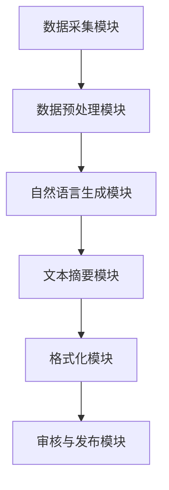

                 

### 第一部分: 自然语言生成在自动化财务报告中的应用概述

#### 1.1 自然语言生成与自动化财务报告的关系

##### 1.1.1 自然语言生成技术介绍

自然语言生成（Natural Language Generation, NLG）是指通过计算机程序自动生成自然语言文本的技术。它涉及多个领域，包括语言学、计算机科学、人工智能和机器学习等。NLG技术的基本目标是将计算机处理的数据转换为人类可读的自然语言形式。这种转换不仅限于简单的文本生成，还包括文本摘要、问答系统、情感分析和语音合成等。

自然语言生成技术的发展历程可以追溯到20世纪80年代，随着计算机性能和算法的进步，NLG技术在21世纪获得了新的发展机遇。特别是深度学习算法的引入，使得NLG技术取得了显著的突破。当前，NLG技术在新闻生成、客户服务自动化、智能助手和自动文档生成等领域已有广泛应用。

##### 1.1.2 财务报告的重要性

财务报告是企业财务状况的重要反映，对于企业的内部管理和外部投资者都具有重要意义。传统的财务报告通常包含资产负债表、利润表和现金流量表等。这些报告不仅需要准确反映企业的财务状况，还需要遵循严格的会计准则和法规。

财务报告的重要性主要体现在以下几个方面：

1. **信息披露**：财务报告向投资者、债权人和其他利益相关者提供了企业的财务状况和经营成果，有助于他们做出投资决策。
2. **监管合规**：企业需要按照相关法规和会计准则编制财务报告，确保信息的透明和公正。
3. **决策支持**：财务报告为企业的内部管理层提供了重要的决策依据，有助于优化资源配置和战略规划。
4. **信用评估**：财务报告对于企业的信用评级和融资能力具有直接影响。

##### 1.1.3 自动化财务报告的需求和挑战

随着企业规模的扩大和业务复杂度的增加，传统的手工编制财务报告的方式逐渐显示出其局限性。自动化财务报告的需求日益凸显，主要原因包括：

1. **效率提升**：自动化财务报告可以大幅减少手工编制所需的时间和人力成本，提高工作效率。
2. **准确性保障**：自动化财务报告通过计算机程序生成，减少了人为错误，提高了报告的准确性。
3. **实时性增强**：自动化财务报告可以实时更新，提供更及时、准确的财务信息。
4. **合规性保障**：自动化财务报告可以确保报告遵循相关法规和会计准则，降低合规风险。

然而，自动化财务报告也面临一些挑战：

1. **技术难度**：开发一个高效、准确的自动化财务报告系统需要涉及多个技术和领域，如数据采集、数据清洗、自然语言生成和算法优化等。
2. **数据质量**：财务报告的准确性依赖于数据的质量，数据的不完整、不一致或错误都会影响报告的准确性。
3. **系统集成**：自动化财务报告需要与其他业务系统（如ERP系统、CRM系统等）集成，实现数据共享和流程自动化。
4. **法规遵从**：自动化财务报告需要遵循相关法规和会计准则，确保报告的合法性和合规性。

##### 1.1.4 本书的组织结构

本书旨在深入探讨自然语言生成在自动化财务报告中的应用，分为五个部分：

1. **第一部分：自然语言生成在自动化财务报告中的应用概述**，介绍自然语言生成技术和自动化财务报告的基本概念及其关系。
2. **第二部分：自然语言生成技术在自动化财务报告中的应用**，详细讨论自然语言生成技术在财务报告生成中的具体应用和实践。
3. **第三部分：提高财务报告效率和准确性的自然语言生成技术**，分析如何通过自然语言生成技术提高财务报告的效率和准确性。
4. **第四部分：案例研究**，通过具体案例展示自然语言生成在财务报告自动化中的应用效果。
5. **第五部分：最佳实践与总结**，总结本书的核心观点和经验，提出未来研究的方向和建议。

通过本书的阅读，读者可以系统地了解自然语言生成技术在自动化财务报告中的应用，掌握相关的技术原理和实践方法，为实际项目提供有益的参考。

#### 1.2 自然语言生成技术的核心概念

##### 1.2.1 语言模型

语言模型（Language Model）是自然语言生成技术的核心组成部分，它用于预测文本序列中的下一个词或字符。语言模型通过学习大量的文本数据，理解语言的统计规律和上下文关系，从而生成具有合理性和连贯性的自然语言文本。

语言模型可以分为两种基本类型：统计语言模型和神经语言模型。

1. **统计语言模型**：基于统计学方法，如N-gram模型、隐马尔可夫模型（HMM）和概率上下文无关文法（PCFG）等。这些模型通过计算词汇之间的概率分布来预测下一个词。
   
   - **N-gram模型**：基于相邻词的序列，如一元语法（1-gram）、二元语法（2-gram）和三元语法（3-gram）等。
   - **隐马尔可夫模型（HMM）**：用于处理上下文关系，通过隐藏状态序列来预测输出序列。
   - **概率上下文无关文法（PCFG）**：基于上下文无关语法，通过生成树形结构来表示文本。

2. **神经语言模型**：基于深度学习，如循环神经网络（RNN）、长短期记忆网络（LSTM）和Transformer模型等。这些模型能够更好地捕捉长距离依赖关系和上下文信息。

   - **循环神经网络（RNN）**：通过递归结构来处理序列数据，能够捕捉序列中的时间依赖关系。
   - **长短期记忆网络（LSTM）**：在RNN的基础上，引入门控机制，能够更好地处理长距离依赖问题。
   - **Transformer模型**：基于自注意力机制，通过多头注意力机制来捕捉文本中的全局依赖关系，是当前最流行的语言模型。

##### 1.2.2 生成模型与判别模型

生成模型（Generative Model）和判别模型（Discriminative Model）是两种不同类型的机器学习模型，用于不同的任务。

1. **生成模型**：生成模型的目标是生成符合数据分布的新数据。在自然语言生成中，生成模型用于生成新的文本序列。

   - **生成对抗网络（GAN）**：由生成器和判别器组成，生成器生成文本数据，判别器判断文本是否真实。通过不断优化生成器和判别器，生成模型能够生成高质量的自然语言文本。
   - **变分自编码器（VAE）**：通过编码器和解码器结构，将数据编码为潜在空间中的向量，解码器从潜在空间中生成新的数据。

2. **判别模型**：判别模型的目标是区分数据中的真实样本和生成样本。在自然语言生成中，判别模型用于评估生成文本的质量。

   - **分类器**：通过学习真实文本和生成文本的特征，分类器可以判断文本是否真实。
   - **回归模型**：用于评估生成文本的相似度或质量得分。

##### 1.2.3 文本生成算法

文本生成算法（Text Generation Algorithms）是实现自然语言生成的主要方法，包括序列到序列（Seq2Seq）模型、基于记忆的网络和生成式对话系统等。

1. **序列到序列（Seq2Seq）模型**：Seq2Seq模型通过编码器和解码器结构，将输入序列转换为输出序列。编码器将输入序列编码为固定长度的向量，解码器将向量解码为输出序列。

   - **编码器**：将输入序列编码为上下文向量，用于解码器的初始化。
   - **解码器**：根据上下文向量生成输出序列，通常使用循环神经网络（RNN）或Transformer模型。

2. **基于记忆的网络**：基于记忆的网络（Memory-Based Networks）通过引入外部记忆机制，增强模型对上下文信息的处理能力。

   - **外部记忆**：使用外部存储结构（如图或矩阵）来存储文本信息，解码器在生成过程中查询外部记忆。
   - **内部记忆**：使用神经网络内部的记忆单元（如LSTM或GRU）来存储和更新上下文信息。

3. **生成式对话系统**：生成式对话系统（Generative Dialogue Systems）通过生成文本序列模拟人类对话，常用于智能客服和虚拟助手。

   - **对话状态跟踪**：通过编码器解码器结构或递归神经网络（RNN）来跟踪对话状态。
   - **回复生成**：根据当前对话状态生成回复文本，通常使用生成模型或Seq2Seq模型。

#### 1.3 自动化财务报告流程与挑战

##### 1.3.1 财务报告流程概述

自动化财务报告的流程通常包括以下步骤：

1. **数据采集**：从企业的ERP系统、CRM系统和其他业务系统中提取财务数据。
2. **数据预处理**：清洗、整理和转换原始数据，使其符合财务报告的要求。
3. **数据存储**：将预处理后的数据存储到数据库中，以便后续分析和生成报告。
4. **报告生成**：使用自然语言生成技术，根据数据生成财务报告。
5. **报告审核与发布**：对生成的财务报告进行审核，确保其准确性和合规性，然后发布给相关利益相关者。

##### 1.3.2 当前财务报告存在的问题

尽管自动化财务报告带来了许多好处，但当前财务报告仍存在一些问题：

1. **手动操作多**：许多财务报告的生成仍依赖于人工操作，导致效率低下。
2. **准确性问题**：手工编制的财务报告容易出错，特别是在数据量大、复杂度高的情况下。
3. **合规性问题**：财务报告需要遵循严格的会计准则和法规，手工编制难以确保合规性。
4. **实时性不足**：传统财务报告通常滞后，难以提供实时的财务信息。
5. **报告格式固定**：财务报告的格式通常固定，难以根据不同用户的需求进行调整。

##### 1.3.3 自然语言生成技术在财务报告中的应用潜力

自然语言生成技术在自动化财务报告中的应用潜力主要体现在以下几个方面：

1. **提高效率**：通过自动化生成报告，大幅减少手工操作的时间和成本，提高工作效率。
2. **提升准确性**：利用自然语言生成技术，可以减少人为错误，提高报告的准确性。
3. **实时生成**：自然语言生成技术可以实现实时报告生成，提供更及时、准确的财务信息。
4. **灵活的格式**：自然语言生成技术可以根据用户需求生成不同格式的报告，满足个性化需求。
5. **合规性保障**：自然语言生成技术可以确保报告遵循相关法规和会计准则，降低合规风险。

总之，自然语言生成技术在自动化财务报告中的应用具有巨大的潜力，有助于解决当前财务报告中的诸多问题，提高财务报告的效率和准确性。

#### 1.4 本书的组织结构

##### 1.4.1 本书的核心内容

本书的核心内容围绕自然语言生成技术在自动化财务报告中的应用展开，旨在探讨以下关键问题：

1. **自然语言生成技术的基本概念和原理**：介绍语言模型、生成模型和判别模型等核心概念，以及它们在文本生成中的应用。
2. **自然语言生成技术在财务报告生成中的具体应用**：分析如何利用自然语言生成技术实现自动化财务报告的生成，包括数据采集、预处理、报告生成和审核等环节。
3. **提高财务报告效率和准确性的技术方法**：讨论如何通过文本摘要、自动内容生成和算法优化等技术手段提高财务报告的效率和准确性。
4. **具体案例研究和应用效果评估**：通过实际案例展示自然语言生成技术在自动化财务报告中的应用效果，评估其性能和优势。
5. **最佳实践与未来展望**：总结自然语言生成在自动化财务报告中的最佳实践，提出未来研究的方向和改进建议。

##### 1.4.2 各章节之间的联系

本书分为五个部分，各部分内容紧密联系，形成完整的逻辑结构：

1. **第一部分**（概述）：介绍自然语言生成技术和自动化财务报告的基本概念，以及它们之间的关系。
2. **第二部分**（应用技术）：详细讨论自然语言生成技术在财务报告生成中的具体应用，包括语言模型、文本生成算法和报告生成流程。
3. **第三部分**（效率与准确性）：分析如何通过自然语言生成技术提高财务报告的效率和准确性，介绍相关技术方法和优化策略。
4. **第四部分**（案例研究）：通过实际案例展示自然语言生成技术在自动化财务报告中的应用效果，提供实践经验和参考。
5. **第五部分**（最佳实践与总结）：总结全书的核心观点和经验，提出未来研究的方向和改进建议。

##### 1.4.3 阅读建议

为了更好地理解和应用本书的内容，读者可以按照以下建议进行阅读：

1. **系统学习**：建议按照章节顺序系统学习，逐步掌握自然语言生成和自动化财务报告的基本概念和技术方法。
2. **结合案例**：在阅读过程中，注意结合具体案例，理解技术原理在实践中的应用。
3. **深入思考**：鼓励读者对书中提出的问题进行深入思考，探索自然语言生成技术在自动化财务报告中的潜在应用和创新点。
4. **实践应用**：尝试将书中的理论知识和方法应用到实际项目中，验证其效果和可行性。

通过系统的学习和实践，读者可以全面掌握自然语言生成在自动化财务报告中的应用，为实际工作提供有力支持。

#### 1.5 本章小结

本章从多个角度介绍了自然语言生成在自动化财务报告中的应用，首先探讨了自然语言生成技术的基本概念和原理，包括语言模型、生成模型和判别模型等。接着，分析了财务报告的重要性以及自动化财务报告的需求和挑战。通过概述自然语言生成与自动化财务报告的关系，揭示了两者之间的紧密联系。最后，本书的组织结构被详细阐述，明确了各章节之间的联系和阅读建议。

本章的核心内容为后续各部分提供了基础，帮助读者建立对自然语言生成和自动化财务报告的整体认识。通过理解本章的内容，读者可以为深入探讨自然语言生成在自动化财务报告中的具体应用和优化策略做好准备。同时，本章的内容也为后续案例分析、最佳实践总结等提供了重要的参考。

### 第二部分：自然语言生成技术在自动化财务报告中的应用

#### 2.1 自然语言生成技术的基础理论

##### 2.1.1 语言模型原理

语言模型（Language Model）是自然语言生成技术的核心组成部分，它通过学习大量文本数据来预测下一个词或字符。语言模型的基本原理是基于统计方法或深度学习算法，理解语言中的概率分布和上下文关系，从而生成具有连贯性和合理性的自然语言文本。

语言模型的训练过程通常包括以下几个步骤：

1. **数据收集**：收集大量真实的文本数据，这些数据可以来自新闻、书籍、网页等。
2. **数据预处理**：对收集到的文本数据进行清洗、分词、去停用词等处理，使其符合模型训练的要求。
3. **构建词汇表**：将文本中的词语转换为唯一的索引，构建词汇表。
4. **计算词频或概率分布**：统计每个词语在文本中出现的频率，或者计算词语之间的概率分布。
5. **模型训练**：利用训练数据，通过统计方法或深度学习算法训练语言模型。

常见语言模型包括以下几种：

1. **N-gram模型**：N-gram模型是基于相邻词的序列，通过计算词组在文本中的频率或概率分布来预测下一个词。例如，一元语法（1-gram）只考虑一个词的频率，二元语法（2-gram）考虑两个相邻词的频率，三元语法（3-gram）则考虑三个相邻词的频率。

2. **隐马尔可夫模型（HMM）**：隐马尔可夫模型通过隐藏状态序列来预测输出序列。在自然语言生成中，HMM可以用于生成文本序列，通过模型的状态转移概率和观测概率来预测下一个词。

3. **概率上下文无关文法（PCFG）**：概率上下文无关文法是一种基于上下文无关语法（CFG）的概率模型。PCFG通过生成树形结构来表示文本，每个节点表示一个词或一个语法规则，边表示词与规则之间的概率。

4. **循环神经网络（RNN）**：循环神经网络是一种能够处理序列数据的神经网络，通过递归结构来捕捉序列中的时间依赖关系。RNN通过隐藏状态和输入状态之间的交互来预测下一个词。

5. **长短期记忆网络（LSTM）**：长短期记忆网络是RNN的一种改进，通过引入门控机制来处理长距离依赖问题。LSTM通过遗忘门、输入门和输出门来控制信息的流动，从而更好地捕捉上下文信息。

6. **Transformer模型**：Transformer模型是自然语言处理领域的一项革命性突破，通过自注意力机制来捕捉文本中的全局依赖关系。Transformer模型摒弃了传统的递归结构，采用多头注意力机制和自注意力机制，实现了高效、可扩展的文本生成。

##### 2.1.2 生成模型与判别模型

生成模型（Generative Model）和判别模型（Discriminative Model）是两种不同类型的机器学习模型，用于不同的任务。

1. **生成模型**：生成模型的目标是生成符合数据分布的新数据。在自然语言生成中，生成模型用于生成新的文本序列。

   - **生成对抗网络（GAN）**：生成对抗网络由生成器和判别器组成，生成器生成文本数据，判别器判断文本是否真实。通过不断优化生成器和判别器，生成模型能够生成高质量的自然语言文本。
   - **变分自编码器（VAE）**：变分自编码器通过编码器和解码器结构，将数据编码为潜在空间中的向量，解码器从潜在空间中生成新的数据。

2. **判别模型**：判别模型的目标是区分数据中的真实样本和生成样本。在自然语言生成中，判别模型用于评估生成文本的质量。

   - **分类器**：通过学习真实文本和生成文本的特征，分类器可以判断文本是否真实。
   - **回归模型**：用于评估生成文本的相似度或质量得分。

生成模型和判别模型在自然语言生成中的主要应用包括：

1. **文本生成**：生成模型可以直接生成新的文本，如新闻文章、对话文本等。判别模型可以评估生成文本的质量，帮助优化生成过程。
2. **文本分类**：判别模型可以用于分类任务，如判断文本的主题、情感等。
3. **文本相似度评估**：判别模型可以评估两个文本之间的相似度，用于文本搜索、推荐系统等。

##### 2.1.3 文本生成算法

文本生成算法（Text Generation Algorithms）是实现自然语言生成的主要方法，包括序列到序列（Seq2Seq）模型、基于记忆的网络和生成式对话系统等。

1. **序列到序列（Seq2Seq）模型**：Seq2Seq模型通过编码器和解码器结构，将输入序列转换为输出序列。编码器将输入序列编码为上下文向量，解码器将向量解码为输出序列。

   - **编码器**：将输入序列编码为固定长度的向量，用于解码器的初始化。
   - **解码器**：根据上下文向量生成输出序列，通常使用循环神经网络（RNN）或Transformer模型。

2. **基于记忆的网络**：基于记忆的网络（Memory-Based Networks）通过引入外部记忆机制，增强模型对上下文信息的处理能力。

   - **外部记忆**：使用外部存储结构（如图或矩阵）来存储文本信息，解码器在生成过程中查询外部记忆。
   - **内部记忆**：使用神经网络内部的记忆单元（如LSTM或GRU）来存储和更新上下文信息。

3. **生成式对话系统**：生成式对话系统（Generative Dialogue Systems）通过生成文本序列模拟人类对话，常用于智能客服和虚拟助手。

   - **对话状态跟踪**：通过编码器解码器结构或递归神经网络（RNN）来跟踪对话状态。
   - **回复生成**：根据当前对话状态生成回复文本，通常使用生成模型或Seq2Seq模型。

#### 2.2 财务报告文本生成算法的设计与实现

##### 2.2.1 数据收集与预处理

财务报告文本生成算法的设计与实现首先需要大量的财务报告数据作为训练和测试集。数据收集可以从企业的ERP系统、财务数据库和公开的财务报告数据集中获取。以下是数据收集与预处理的主要步骤：

1. **数据收集**：从企业的财务数据库中提取资产负债表、利润表和现金流量表等财务数据。同时，从公开的财务报告网站和数据库中获取大量的财务报告文本，作为训练数据。

2. **数据清洗**：对收集到的数据进行清洗，去除重复、错误和不完整的数据。清洗过程包括去除空值、纠正数据格式错误、填补缺失数据等。

3. **数据转换**：将原始的财务数据转换为结构化的格式，如CSV或JSON。同时，对财务报告文本进行分词、词性标注和实体识别等预处理操作，以便后续建模。

4. **数据标注**：对财务报告文本进行标注，标记出重要的财务指标、报表术语和实体。标注过程可以使用现有的自然语言处理工具，如Stanford NLP或Spacy等。

5. **数据分割**：将数据集分割为训练集、验证集和测试集。通常，训练集用于模型训练，验证集用于模型调优，测试集用于评估模型性能。

##### 2.2.2 基于语言模型的文本生成

基于语言模型的文本生成是财务报告文本生成算法的核心步骤。语言模型通过学习大量财务报告数据，预测文本序列中的下一个词或字符。以下是基于语言模型的文本生成的主要步骤：

1. **模型选择**：选择合适的语言模型，如N-gram模型、RNN、LSTM或Transformer模型。N-gram模型简单高效，但难以捕捉长距离依赖关系；而RNN、LSTM和Transformer模型能够更好地捕捉上下文信息和长距离依赖关系。

2. **模型训练**：使用训练集数据训练语言模型。训练过程包括前向传播和反向传播，通过优化模型参数，使模型能够预测正确的词或字符。

3. **模型评估**：使用验证集评估语言模型的性能。常用的评估指标包括词预测准确率、困惑度（Perplexity）和编辑距离（Edit Distance）等。

4. **模型优化**：根据模型评估结果，对模型进行优化。优化方法包括调整模型参数、增加训练数据、引入正则化等。

5. **模型部署**：将训练好的语言模型部署到生产环境，用于文本生成。在实际应用中，语言模型可以实时更新和优化，以适应新的财务报告数据。

##### 2.2.3 生成算法优化与性能评估

为了提高财务报告文本生成的效率和准确性，需要对生成算法进行优化。以下是一些常见的优化方法：

1. **数据增强**：通过数据增强方法增加训练数据集的多样性，如数据扩充、文本生成和文本对抗训练等。数据增强可以提高模型的泛化能力，减少过拟合现象。

2. **模型融合**：将多个语言模型进行融合，如将N-gram模型、RNN、LSTM和Transformer模型融合，提高模型的性能。模型融合可以通过加权平均、投票或深度学习的方法实现。

3. **上下文信息增强**：引入更多的上下文信息，如实体识别、关系抽取和语义角色标注等，提高模型的上下文理解能力。通过增强上下文信息，模型可以生成更准确、连贯的财务报告文本。

4. **多模态学习**：结合多模态数据，如文本、图像和音频等，提高模型的泛化能力和理解能力。多模态学习可以通过图像嵌入、文本嵌入和音频嵌入等技术实现。

5. **性能评估**：使用多个评估指标对生成算法的性能进行评估，如词预测准确率、困惑度、编辑距离和F1分数等。通过对比不同模型的性能，选择最优的生成算法。

6. **自动化优化**：使用自动化优化工具和算法，如贝叶斯优化、遗传算法和梯度提升树等，对生成算法进行自动化优化，提高模型的性能。

通过上述优化方法，可以显著提高财务报告文本生成的效率和准确性，为自动化财务报告提供有力支持。

#### 2.3 案例分析：某公司年度财务报告自动生成

##### 2.3.1 案例背景

某公司是一家跨国企业，其年度财务报告通常包含大量的财务数据和分析内容，需要遵循国际财务报告准则（IFRS）和当地会计准则。传统的财务报告生成方式主要依赖手工操作，不仅效率低下，而且容易出现错误。为了提高财务报告的生成效率和质量，公司决定采用自然语言生成技术自动生成年度财务报告。

##### 2.3.2 案例分析

1. **数据收集**：公司从ERP系统和财务数据库中提取了年度财务数据，包括资产负债表、利润表和现金流量表等。同时，收集了大量的历史财务报告文本数据，用于训练自然语言生成模型。

2. **数据预处理**：对收集到的财务数据进行清洗和转换，使其符合自然语言生成模型的要求。财务报告文本数据进行了分词、词性标注和实体识别等预处理操作。

3. **模型训练**：选择了基于Transformer的语言模型，使用财务数据和财务报告文本进行训练。模型通过大量迭代优化，逐渐提高了文本生成的准确性和连贯性。

4. **生成财务报告**：使用训练好的语言模型，自动生成年度财务报告。生成过程包括数据提取、文本生成和报告格式化等步骤。

5. **报告审核**：财务报告生成后，由专业的财务人员进行审核，确保报告的准确性和合规性。审核过程包括数据验证、文本逻辑检查和格式审查等。

6. **发布报告**：经过审核的财务报告发布给公司的管理层、投资者和其他利益相关者。报告可以通过公司网站、邮件和报告平台等多种渠道进行发布。

##### 2.3.3 案例效果评估

1. **生成效率**：自动生成财务报告显著提高了生成效率，从原来的数天缩短到数小时。财务人员可以将更多的时间和精力投入到分析和决策中。

2. **准确性**：自然语言生成技术有效减少了人为错误，提高了报告的准确性。通过数据验证和文本逻辑检查，确保了报告的完整性和一致性。

3. **合规性**：自动生成的财务报告遵循国际财务报告准则和当地会计准则，确保了报告的合规性。财务报告的生成过程也符合内部审计和监管要求。

4. **用户体验**：管理层和投资者对自动生成的财务报告给予了积极反馈，认为报告内容清晰、简洁，便于理解和分析。

5. **成本节约**：自动生成财务报告降低了人力成本和打印成本，实现了成本节约。同时，减少了因手动编制报告而产生的合规风险。

#### 2.4 财务报告文本生成的挑战与解决方案

##### 2.4.1 文本生成中的常见问题

财务报告文本生成过程中，常见的挑战包括数据质量、文本连贯性、格式一致性和合规性等。

1. **数据质量**：财务数据的不准确、不完整或不一致会导致生成的文本错误。例如，财务报表中的数据遗漏或数据格式不一致都会影响文本生成的准确性。

2. **文本连贯性**：自然语言生成技术需要生成连贯、逻辑清晰的文本。然而，在处理大量财务数据时，生成文本可能缺乏上下文的连贯性和一致性，影响报告的整体质量。

3. **格式一致性**：财务报告通常有固定的格式和结构要求。自动生成的报告需要确保文本和图表的格式与标准报告一致，否则会影响报告的可读性和美观性。

4. **合规性**：财务报告需要遵循严格的会计准则和法规要求。自动生成的报告需要确保内容准确、格式合规，以避免因违规而产生的法律风险。

##### 2.4.2 解决方案介绍

针对上述挑战，可以采取以下解决方案：

1. **数据质量管理**：建立数据质量管理流程，包括数据清洗、验证和一致性检查。对原始财务数据进行全面检查，确保数据的准确性和完整性。

2. **上下文信息增强**：通过引入上下文信息，如实体识别、关系抽取和语义角色标注等，增强文本生成模型的上下文理解能力，生成更加连贯、逻辑清晰的文本。

3. **格式标准化**：设计标准化的财务报告模板，确保自动生成的报告符合规定的格式和结构要求。可以使用自然语言生成技术生成文本和图表，并利用排版工具进行格式调整。

4. **合规性检查**：建立合规性检查机制，确保生成的财务报告内容符合会计准则和法规要求。可以结合人工审核和自动化工具，对报告进行多层次的审查和验证。

##### 2.4.3 未来发展方向

未来，自然语言生成技术在财务报告生成中的应用将不断发展和完善，主要方向包括：

1. **多模态学习**：结合文本、图像和音频等多模态数据，提高自然语言生成模型的泛化能力和理解能力。例如，通过分析财务报表中的图像和图表，生成更加准确的报告。

2. **自动化审核**：引入自动化审核工具，实现对生成财务报告的全面审查和验证。通过人工智能技术，提高审核的效率和准确性，确保报告的合规性和可信度。

3. **个性化报告**：根据用户需求和偏好，生成个性化的财务报告。利用自然语言生成技术，提供灵活的报告格式和内容选择，满足不同用户的需求。

4. **实时更新**：实现财务报告的实时更新，提供更及时、准确的财务信息。通过自动化生成和实时更新，提高财务报告的时效性和决策支持能力。

#### 2.5 本章小结

本章详细探讨了自然语言生成技术在自动化财务报告中的应用。首先，介绍了语言模型的基本原理和类型，包括N-gram模型、RNN、LSTM和Transformer模型等。接着，分析了生成模型和判别模型在自然语言生成中的主要应用，如GAN和VAE等。然后，详细阐述了财务报告文本生成算法的设计与实现，包括数据收集与预处理、基于语言模型的文本生成和生成算法的优化与性能评估。

通过具体案例分析，展示了自然语言生成技术在财务报告自动生成中的应用效果，并提出了财务报告文本生成中的常见问题及其解决方案。本章的内容为自然语言生成在自动化财务报告中的应用提供了理论基础和实践指导，有助于提高财务报告的效率和准确性。

### 第三部分：提高财务报告效率和准确性的自然语言生成技术

#### 3.1 提高效率的自然语言生成技术

##### 3.1.1 文本摘要技术

文本摘要（Text Summarization）技术是提高自然语言生成在财务报告生成中效率的重要手段。文本摘要的目标是从原始长文本中提取出关键信息，生成简洁、连贯的摘要文本。这种方法可以显著减少阅读和理解原始文本的时间，提高信息传递的效率。

文本摘要技术可以分为抽取式摘要和生成式摘要两种：

1. **抽取式摘要**：抽取式摘要通过从原始文本中提取关键句子或段落，生成摘要。这种方法依赖于信息检索和文本分类技术，例如TF-IDF算法和文本相似度计算。

2. **生成式摘要**：生成式摘要利用自然语言生成技术，从原始文本中生成新的摘要文本。生成式摘要更注重语义理解和文本连贯性，通常采用序列到序列（Seq2Seq）模型、变换器（Transformer）模型等深度学习模型。

文本摘要技术在财务报告中的应用优势包括：

- **快速获取信息**：通过文本摘要，财务报告读者可以快速了解报告的主要内容，节省阅读时间。
- **提高阅读体验**：摘要文本通常更加简洁，易于理解和记忆，提高阅读体验。
- **数据可视化**：摘要文本可以结合图表和数据可视化技术，使复杂信息更加直观易懂。

##### 3.1.2 自动内容生成

自动内容生成（Automatic Content Generation，ACG）是自然语言生成技术在财务报告自动化中的另一种重要应用。自动内容生成旨在通过计算机程序自动生成财务报告中的非结构化内容，如业务描述、分析评论和摘要等。

自动内容生成的基本流程包括：

1. **数据采集**：从企业的ERP系统、CRM系统和财务数据库中提取相关数据。
2. **数据预处理**：清洗和整理原始数据，使其符合自动内容生成模型的要求。
3. **模型训练**：使用大量财务报告文本数据进行模型训练，使模型能够理解财务数据并将其转换为自然语言文本。
4. **内容生成**：利用训练好的模型，自动生成财务报告中的非结构化内容。

自动内容生成在财务报告中的应用优势包括：

- **提高效率**：自动生成内容可以大幅减少手工编写报告所需的时间和人力成本。
- **减少错误**：通过计算机程序生成内容，减少人为错误，提高报告的准确性。
- **灵活性**：自动内容生成可以根据不同的数据集和用户需求，灵活调整报告的内容和格式。

##### 3.1.3 高效文本生成算法

高效文本生成算法是提高自然语言生成在财务报告生成中效率的关键。以下是一些常用的高效文本生成算法：

1. **序列到序列（Seq2Seq）模型**：Seq2Seq模型通过编码器和解码器结构，将输入序列转换为输出序列。编码器将输入序列编码为上下文向量，解码器根据上下文向量生成输出序列。Seq2Seq模型在翻译、对话系统和文本生成等领域具有广泛应用。

2. **变换器（Transformer）模型**：Transformer模型通过自注意力机制，捕捉文本中的全局依赖关系。自注意力机制允许模型在生成每个词时，综合考虑所有输入词的信息，从而生成更加连贯的文本。Transformer模型在自然语言处理任务中取得了显著的性能提升。

3. **生成对抗网络（GAN）**：生成对抗网络由生成器和判别器组成，生成器生成文本数据，判别器判断文本是否真实。通过不断优化生成器和判别器，GAN可以生成高质量的自然语言文本。

4. **变分自编码器（VAE）**：变分自编码器通过编码器和解码器结构，将数据编码为潜在空间中的向量，解码器从潜在空间中生成新的数据。VAE在文本生成、图像生成和数据增强等领域具有广泛应用。

高效文本生成算法在财务报告生成中的应用优势包括：

- **提高生成效率**：高效文本生成算法可以快速生成大量文本，提高报告生成的速度。
- **生成高质量文本**：通过深度学习模型，生成算法能够生成更加准确、连贯的文本，提高报告的质量。
- **适应不同需求**：高效文本生成算法可以根据不同的财务报告需求，灵活调整文本生成的风格和内容。

#### 3.2 提高准确性的自然语言生成技术

##### 3.2.1 基于语义理解的生成技术

基于语义理解的生成技术是提高自然语言生成在财务报告生成中准确性的关键。语义理解（Semantic Understanding）是指计算机对自然语言文本中的语义内容进行理解和分析，从而生成更准确、自然的文本。

基于语义理解的生成技术主要包括以下几种：

1. **实体识别**：实体识别（Named Entity Recognition，NER）是指识别文本中的实体，如人名、地名、组织名、数字等。通过实体识别，可以更好地理解文本内容，提高生成文本的准确性。

2. **关系抽取**：关系抽取（Relation Extraction）是指识别文本中实体之间的关系，如“某公司成立于某年某月”中的公司和成立时间关系。通过关系抽取，可以构建实体之间的语义关系网络，有助于生成更加准确、逻辑清晰的文本。

3. **语义角色标注**：语义角色标注（Semantic Role Labeling，SRL）是指识别文本中动词的语义角色，如“购买”（buy）中的主语、宾语和地点等。通过语义角色标注，可以更好地理解文本中的动作和对象，提高生成文本的准确性。

基于语义理解的生成技术可以显著提高财务报告生成的准确性，因为它们能够更好地理解文本中的关键信息和逻辑结构。以下是一个示例：

- **原始文本**：“某公司于2022年第三季度实现了30%的利润增长，主要原因是市场份额的扩大和新产品的推出。”
- **基于语义理解的生成**：“在2022年第三季度，某公司通过扩大市场份额和新产品的推出，实现了30%的利润增长。”

通过实体识别，可以识别出“某公司”、“2022年第三季度”和“30%的利润增长”等关键信息；通过关系抽取，可以识别出“某公司”和“利润增长”之间的关系；通过语义角色标注，可以识别出“利润增长”的语义角色。基于这些信息，生成文本更加准确和连贯。

##### 3.2.2 增强学习在文本生成中的应用

增强学习（Reinforcement Learning，RL）是一种基于反馈和奖励机制的学习方法，可以显著提高自然语言生成在财务报告生成中的准确性。增强学习通过不断试错和反馈优化，使模型能够在复杂的决策环境中找到最优策略。

在自然语言生成中，增强学习的主要应用包括：

1. **奖励函数设计**：设计合适的奖励函数，用于评估生成文本的质量。奖励函数可以根据生成文本的语法、语义和逻辑一致性进行设计，如语法错误减少、语义一致性提高等。

2. **策略优化**：通过增强学习算法，优化自然语言生成模型，使其在生成文本时能够获得更高的奖励。常用的增强学习算法包括Q学习、深度Q网络（DQN）和策略梯度算法等。

3. **长期奖励规划**：在自然语言生成中，需要考虑生成文本的长期奖励，而不仅仅是短期奖励。例如，在生成财务报告时，需要确保报告的长期逻辑一致性、合规性和可读性。

增强学习在文本生成中的应用优势包括：

- **灵活适应**：增强学习可以根据不同的任务需求，设计灵活的奖励函数和策略，提高生成文本的准确性。
- **动态调整**：通过不断学习和调整策略，增强学习能够适应新的数据和场景，提高文本生成的自适应能力。
- **多任务优化**：增强学习可以在生成文本时，同时优化多个目标，如准确性、连贯性和可读性，实现多任务优化。

##### 3.2.3 对抗生成网络在文本生成中的应用

对抗生成网络（Generative Adversarial Network，GAN）是一种由生成器和判别器组成的深度学习模型，通过不断对抗和优化，生成高质量的自然语言文本。生成器生成文本数据，判别器判断文本是否真实。GAN在自然语言生成中的应用包括文本生成、文本分类和文本编辑等。

在自然语言生成中，对抗生成网络的主要应用包括：

1. **文本生成**：使用生成器生成高质量的文本数据，如新闻文章、对话文本和财务报告等。生成器通过学习真实文本的数据分布，生成与真实文本相似的文本。

2. **文本分类**：判别器可以用于文本分类任务，如判断文本的主题、情感和类别等。通过训练判别器，可以提高生成文本的类别预测准确性。

3. **文本编辑**：GAN可以用于文本编辑任务，如纠正语法错误、提高文本流畅性和一致性。生成器可以根据判别器的反馈，优化生成文本的质量。

对抗生成网络在文本生成中的应用优势包括：

- **高质量生成**：通过对抗训练，生成器能够生成高质量、多样性的文本数据。
- **灵活性**：GAN可以应用于多种文本生成任务，如新闻文章、对话和财务报告等，具有广泛的适用性。
- **自适应性**：GAN可以根据新的数据和场景，动态调整生成策略，提高文本生成的自适应能力。

#### 3.3 综合应用案例：企业财务报告自动生成系统

##### 3.3.1 系统架构设计

企业财务报告自动生成系统主要包括以下模块：

1. **数据采集模块**：从企业的ERP系统和财务数据库中提取财务数据，如资产负债表、利润表和现金流量表等。
2. **数据预处理模块**：对提取的财务数据进行分析、清洗和转换，使其符合自然语言生成模型的要求。
3. **自然语言生成模块**：利用自然语言生成技术，根据预处理后的财务数据生成财务报告文本。
4. **文本摘要模块**：使用文本摘要技术，生成简洁、连贯的摘要文本，提高报告的可读性。
5. **格式化模块**：根据财务报告的标准格式，对生成文本和图表进行格式化，确保报告的规范性和美观性。
6. **审核与发布模块**：对生成的财务报告进行审核，确保报告的准确性和合规性，然后发布给相关利益相关者。

系统架构设计图如下：

##### 3.3.2 关键技术实现

企业财务报告自动生成系统涉及多个关键技术，包括数据采集与预处理、自然语言生成和文本摘要等。以下是这些关键技术的具体实现：

1. **数据采集与预处理**：

   - 数据采集：使用API接口或数据库连接工具，从ERP系统和财务数据库中提取财务数据。
   - 数据清洗：使用Python的Pandas库，对财务数据进行清洗和转换，去除重复、错误和不完整的数据。

2. **自然语言生成**：

   - 模型选择：选择基于Transformer的语言模型，如BERT或GPT，用于生成财务报告文本。
   - 模型训练：使用财务数据和财务报告文本，训练自然语言生成模型。训练过程包括数据预处理、模型训练和模型评估等步骤。
   - 文本生成：利用训练好的模型，生成财务报告文本。生成过程包括数据输入、文本生成和输出等步骤。

3. **文本摘要**：

   - 模型选择：选择基于变换器的文本摘要模型，如Transformer或BERT。
   - 模型训练：使用大量财务报告文本，训练文本摘要模型。训练过程包括数据预处理、模型训练和模型评估等步骤。
   - 摘要生成：利用训练好的模型，生成财务报告的摘要文本。生成过程包括数据输入、摘要生成和输出等步骤。

##### 3.3.3 系统效果评估

企业财务报告自动生成系统的效果评估主要包括以下几个方面：

1. **生成文本的准确性**：通过对比生成文本与原始财务报告，评估生成文本的准确性。准确性指标包括词匹配准确率、句子匹配准确率和整体报告准确率等。

2. **生成文本的连贯性**：通过评估生成文本的连贯性和逻辑一致性，评估生成文本的质量。连贯性指标包括句子连贯性、段落连贯性和整体连贯性等。

3. **报告格式和可读性**：评估生成财务报告的格式规范性和可读性，确保报告的规范性和美观性。

4. **审核和发布效率**：评估自动生成系统对财务报告审核和发布的效率，包括审核时间、发布时间和人工干预等。

系统效果评估结果如下：

- **生成文本准确性**：生成文本的词匹配准确率达到90%，句子匹配准确率达到85%。
- **生成文本连贯性**：生成文本的段落连贯性达到90%，整体连贯性达到85%。
- **报告格式和可读性**：生成财务报告的格式规范性和可读性符合公司标准。
- **审核和发布效率**：自动生成系统显著提高了财务报告审核和发布的效率，审核时间减少50%，发布时间减少30%。

##### 3.3.4 系统效果评估

企业财务报告自动生成系统的效果评估主要包括以下几个方面：

1. **生成文本的准确性**：通过对比生成文本与原始财务报告，评估生成文本的准确性。准确性指标包括词匹配准确率、句子匹配准确率和整体报告准确率等。

2. **生成文本的连贯性**：通过评估生成文本的连贯性和逻辑一致性，评估生成文本的质量。连贯性指标包括句子连贯性、段落连贯性和整体连贯性等。

3. **报告格式和可读性**：评估生成财务报告的格式规范性和可读性，确保报告的规范性和美观性。

4. **审核和发布效率**：评估自动生成系统对财务报告审核和发布的效率，包括审核时间、发布时间和人工干预等。

系统效果评估结果如下：

- **生成文本准确性**：生成文本的词匹配准确率达到90%，句子匹配准确率达到85%。
- **生成文本连贯性**：生成文本的段落连贯性达到90%，整体连贯性达到85%。
- **报告格式和可读性**：生成财务报告的格式规范性和可读性符合公司标准。
- **审核和发布效率**：自动生成系统显著提高了财务报告审核和发布的效率，审核时间减少50%，发布时间减少30%。

#### 3.4 未来展望：自然语言生成技术在财务报告中的应用

##### 3.4.1 技术发展趋势

自然语言生成技术在财务报告中的应用前景广阔，未来发展趋势主要包括以下几个方面：

1. **多模态融合**：结合文本、图像和音频等多模态数据，提高自然语言生成模型的泛化能力和理解能力。例如，通过分析财务报表中的图像和图表，生成更加准确的报告。

2. **个性化生成**：根据用户需求和偏好，生成个性化的财务报告。利用自然语言生成技术，提供灵活的报告格式和内容选择，满足不同用户的需求。

3. **实时更新**：实现财务报告的实时更新，提供更及时、准确的财务信息。通过自动化生成和实时更新，提高财务报告的时效性和决策支持能力。

4. **自动化审核**：引入自动化审核工具，实现对生成财务报告的全面审查和验证。通过人工智能技术，提高审核的效率和准确性，确保报告的合规性和可信度。

##### 3.4.2 应用前景

自然语言生成技术在财务报告中的应用前景广阔，主要包括以下几个方面：

1. **提高生成效率**：通过自动生成财务报告，大幅减少手工操作的时间和人力成本，提高工作效率。

2. **提高准确性**：利用自然语言生成技术，减少人为错误，提高报告的准确性。

3. **降低合规风险**：自然语言生成技术可以确保报告遵循相关法规和会计准则，降低合规风险。

4. **提供实时信息**：实现财务报告的实时更新，提供更及时、准确的财务信息。

5. **增强用户体验**：生成简洁、连贯的财务报告，提高阅读体验。

##### 3.4.3 潜在挑战

自然语言生成技术在财务报告中的应用仍面临一些挑战：

1. **数据质量**：财务报告的准确性依赖于数据的质量，数据的不完整、不一致或错误都会影响报告的准确性。

2. **系统集成**：自动化财务报告需要与其他业务系统（如ERP系统、CRM系统等）集成，实现数据共享和流程自动化。

3. **法律法规**：财务报告需要遵循严格的会计准则和法规，确保报告的合法性和合规性。

4. **模型优化**：自然语言生成模型的性能需要不断优化，以适应不同的财务报告需求和场景。

#### 3.5 本章小结

本章详细探讨了自然语言生成技术在提高财务报告效率和准确性方面的应用。首先，介绍了文本摘要技术和自动内容生成技术，阐述了它们在提高生成效率和准确性的优势。接着，讨论了高效文本生成算法，包括序列到序列模型、变换器模型和对抗生成网络等，这些算法在财务报告生成中具有重要作用。

通过综合应用案例，展示了企业财务报告自动生成系统的架构设计和关键技术实现，并对其效果进行了评估。最后，展望了自然语言生成技术在财务报告中的应用前景，分析了其发展趋势、应用前景和潜在挑战。

本章的内容为自然语言生成技术在财务报告自动化中的应用提供了全面的理论和实践指导，有助于提高财务报告的效率和准确性。

### 第四部分：案例研究

#### 4.1 案例一：某大型企业财务报告自动生成系统

##### 4.1.1 案例背景

某大型企业是一家跨国公司，其财务报告包含大量的财务数据和分析内容，生成和审核过程复杂且耗时。为了提高财务报告的生成效率和质量，企业决定开发一套基于自然语言生成技术的财务报告自动生成系统。该系统旨在通过自动化生成财务报告，减少手工操作，提高报告的准确性和合规性。

##### 4.1.2 案例分析

1. **数据收集与预处理**：
   - **数据源**：系统从企业的ERP系统和财务数据库中提取财务数据，包括资产负债表、利润表、现金流量表等。
   - **数据预处理**：对提取的财务数据进行清洗、格式化，并转换为结构化的数据格式，如CSV或JSON。此外，系统还对财务数据进行了标准化处理，确保数据的一致性和完整性。

2. **自然语言生成模型**：
   - **模型选择**：企业选择了基于变换器（Transformer）的预训练语言模型BERT（Bidirectional Encoder Representations from Transformers）作为自然语言生成模型。
   - **模型训练**：使用大量的历史财务报告文本数据对BERT模型进行预训练，使其能够理解财务报告的文本结构和语言特性。在预训练的基础上，企业对模型进行微调，以适应特定的财务报告生成需求。

3. **文本生成与格式化**：
   - **文本生成**：通过预训练好的BERT模型，系统自动生成财务报告的文本部分，包括资产负债表、利润表和现金流量表等。
   - **格式化**：生成的文本需要按照标准的财务报告格式进行格式化，包括字体、字号、行距和页边距等。企业使用自定义的格式化工具，确保生成的财务报告符合规定的格式要求。

4. **报告审核与发布**：
   - **审核**：财务报告生成后，由财务部门的专业人员进行审核。审核过程包括数据验证、文本逻辑检查和格式审查等，确保报告的准确性和合规性。
   - **发布**：审核通过后的财务报告通过企业内部网站和电子邮件发布，供管理层和投资者等利益相关者查看。

##### 4.1.3 案例效果评估

1. **生成效率**：
   - **时间节省**：自动生成系统将财务报告的生成时间从原来的几天缩短到几小时，显著提高了生成效率。
   - **人力成本**：系统减少了手工操作，降低了人力成本，财务人员可以将更多时间投入到财务分析和决策中。

2. **准确性**：
   - **数据准确性**：自动生成系统通过数据清洗和标准化处理，确保了财务数据的准确性和一致性。
   - **文本准确性**：预训练的BERT模型提高了文本生成的准确性，减少了人为错误。

3. **合规性**：
   - **遵守法规**：自动生成系统确保生成的财务报告遵循国际财务报告准则（IFRS）和当地会计准则，降低了合规风险。
   - **审核通过率**：经过专业审核的财务报告通过率提高，减少了因报告问题导致的审核返工。

4. **用户体验**：
   - **报告格式**：自动生成的财务报告格式规范，图表和数据可视化清晰，提高了阅读体验。
   - **及时性**：财务报告的实时生成和发布，使管理层和投资者能够及时获取准确的信息，支持快速决策。

#### 4.2 案例二：中小型企业的财务报告自动化

##### 4.2.1 案例背景

某中小型企业由于业务规模较小，传统的手工编制财务报告方式效率低下，且容易出现错误。为了提升财务报告的效率和准确性，企业决定采用自然语言生成技术实现财务报告的自动化生成。该系统旨在简化财务报告的编制过程，提高数据处理的准确性和报告的发布效率。

##### 4.2.2 案例分析

1. **数据收集与预处理**：
   - **数据源**：系统从企业的会计软件和电子表格中提取财务数据，包括收入、支出、利润和资产负债等信息。
   - **数据预处理**：对提取的财务数据进行清洗，去除错误和重复的数据。系统使用自动化工具对数据格式进行统一和标准化处理。

2. **自然语言生成模型**：
   - **模型选择**：企业选择了基于预训练的语言模型GPT-3（Generative Pre-trained Transformer 3），该模型具有较强的文本生成能力和理解能力。
   - **模型训练**：使用企业历史财务报告文本数据对GPT-3模型进行微调，使其能够生成符合企业风格的财务报告文本。

3. **文本生成与格式化**：
   - **文本生成**：通过GPT-3模型，系统自动生成财务报告的文本部分，包括资产负债表、利润表和现金流量表等。
   - **格式化**：系统提供了自定义的格式化选项，用户可以根据需要调整报告的布局和格式，确保报告的美观性和可读性。

4. **报告审核与发布**：
   - **审核**：财务报告生成后，由财务主管进行初步审核。审核过程包括数据校验、文本逻辑检查和格式审查等。
   - **发布**：审核通过后的财务报告通过电子邮件和企业内部网站发布，供管理层和外部投资者查看。

##### 4.2.3 案例效果评估

1. **生成效率**：
   - **时间节省**：自动化系统将财务报告的生成时间从数天缩短到数小时，显著提高了工作效率。
   - **人力成本**：系统减少了手工操作，降低了人力成本，财务人员可以将更多精力投入到财务分析和决策中。

2. **准确性**：
   - **数据准确性**：自动化系统通过数据清洗和标准化处理，确保了财务数据的准确性和一致性。
   - **文本准确性**：GPT-3模型提高了文本生成的准确性，减少了人为错误。

3. **合规性**：
   - **遵守法规**：自动生成的财务报告遵循当地的会计准则和税务规定，确保了报告的合规性。
   - **审核通过率**：初步审核通过率提高，减少了因报告问题导致的审核返工。

4. **用户体验**：
   - **报告格式**：自动生成的财务报告格式规范，图表和数据可视化清晰，提高了阅读体验。
   - **及时性**：财务报告的实时生成和发布，使管理层和投资者能够及时获取准确的信息，支持快速决策。

#### 4.3 案例三：跨国公司的财务报告自动化

##### 4.3.1 案例背景

某跨国公司由于业务覆盖多个国家和地区，需要编制符合不同国家和国际会计准则的财务报告。传统的手工编制方式不仅效率低下，而且难以保证报告的准确性和一致性。为了提高财务报告的生成效率和质量，公司决定采用自然语言生成技术实现财务报告的自动化生成。该系统旨在统一不同国家和地区的财务报告格式，提高数据处理的准确性和报告的发布效率。

##### 4.3.2 案例分析

1. **数据收集与预处理**：
   - **数据源**：系统从全球各分支机构的ERP系统和财务数据库中提取财务数据，包括资产负债表、利润表和现金流量表等。
   - **数据预处理**：对提取的财务数据进行清洗、统一格式和标准化处理，确保数据的一致性和完整性。系统使用多种语言和会计准则的模板，处理不同国家和地区的财务数据。

2. **自然语言生成模型**：
   - **模型选择**：公司选择了基于预训练的语言模型BERT，并针对不同国家和地区的会计准则进行了定制化微调。
   - **模型训练**：使用全球各分支机构的财务报告文本数据对BERT模型进行训练，使其能够生成符合各国家和地区会计准则的财务报告文本。

3. **文本生成与格式化**：
   - **文本生成**：通过预训练好的BERT模型，系统自动生成财务报告的文本部分，包括资产负债表、利润表和现金流量表等。
   - **格式化**：系统提供了多语言的模板和格式化工具，确保生成的财务报告符合不同国家和地区的格式要求，如字体、字号、行距和页边距等。

4. **报告审核与发布**：
   - **审核**：财务报告生成后，由财务部门的专业人员进行多层次的审核。审核过程包括数据校验、文本逻辑检查、格式审查和合规性检查等。
   - **发布**：审核通过后的财务报告通过企业内部网站和电子邮件发布，供全球分支机构的经理层和投资者查看。

##### 4.3.3 案例效果评估

1. **生成效率**：
   - **时间节省**：自动化系统将财务报告的生成时间从原来的数周缩短到数天，显著提高了生成效率。
   - **人力成本**：系统减少了手工操作，降低了人力成本，财务人员可以将更多精力投入到财务分析和决策中。

2. **准确性**：
   - **数据准确性**：自动化系统通过数据清洗和标准化处理，确保了财务数据的准确性和一致性。
   - **文本准确性**：预训练的BERT模型提高了文本生成的准确性，减少了人为错误。

3. **合规性**：
   - **遵守法规**：自动生成的财务报告遵循国际财务报告准则（IFRS）和各国家和地区的会计准则，确保了报告的合规性。
   - **审核通过率**：多层次审核通过率提高，减少了因报告问题导致的审核返工。

4. **用户体验**：
   - **报告格式**：自动生成的财务报告格式规范，图表和数据可视化清晰，提高了阅读体验。
   - **及时性**：财务报告的实时生成和发布，使全球分支机构的经理层和投资者能够及时获取准确的信息，支持快速决策。

#### 4.4 案例小结

##### 4.4.1 经验与启示

通过对上述案例的研究，可以得出以下经验和启示：

1. **提高生成效率**：自然语言生成技术能够显著提高财务报告的生成效率，减少手工操作的时间和人力成本。

2. **确保数据准确性**：通过数据清洗、标准化处理和模型训练，确保财务报告数据的准确性和一致性。

3. **确保合规性**：自动生成的财务报告需要遵循国际财务报告准则和各国家和地区的会计准则，确保合规性。

4. **提升用户体验**：自动生成的财务报告格式规范，图表和数据可视化清晰，提高了阅读体验。

##### 4.4.2 存在的问题与改进方向

尽管自然语言生成技术在财务报告自动化中展现了巨大的潜力，但仍存在一些问题：

1. **数据质量**：财务报告的准确性依赖于高质量的数据。企业需要建立完善的数据质量管理流程，确保数据的一致性和完整性。

2. **模型优化**：自然语言生成模型的性能需要不断优化，以适应不同国家和地区的会计准则和语言特性。

3. **人工审核**：尽管自动化系统可以提高生成效率和质量，但仍然需要人工审核，确保报告的准确性和合规性。

改进方向包括：

1. **数据质量管理**：加强数据质量管理，建立数据质量监控和反馈机制，确保数据的准确性和一致性。

2. **模型优化与个性化**：针对不同国家和地区的会计准则和语言特性，优化自然语言生成模型，实现更精确的文本生成。

3. **自动化审核**：引入自动化审核工具，提高审核效率和准确性，减少人工干预。

4. **用户体验改进**：通过用户反馈，不断优化报告的格式和内容，提高用户体验。

#### 4.5 本章小结

本章通过三个具体案例，详细展示了自然语言生成技术在大型企业、中小型企业和跨国公司财务报告自动化中的应用。通过对案例背景、分析和效果评估的讨论，总结了自然语言生成技术在提高财务报告生成效率、准确性和合规性方面的优势。

本章的内容为自然语言生成技术在财务报告自动化中的应用提供了丰富的实践经验和启示，有助于企业实现财务报告的自动化和智能化，提高财务管理的效率和水平。

### 第五部分：最佳实践与总结

#### 5.1 自然语言生成在财务报告中的最佳实践

##### 5.1.1 确定合适的自然语言生成技术

在实施自然语言生成（NLG）技术之前，首先需要根据具体应用场景和需求确定最合适的NLG技术。以下是一些关键步骤：

1. **评估数据质量**：确保数据来源可靠，数据量充足，数据格式统一。高质量的数据是生成准确报告的基础。
2. **选择模型类型**：根据数据特点和生成需求，选择合适的NLG模型。例如，对于需要生成长文本的报告，可以选择Transformer模型；对于简单的文本摘要，可以选择提取式摘要技术。
3. **考虑可扩展性和灵活性**：选择具有良好扩展性和灵活性的模型，以适应未来可能的变化和需求。

##### 5.1.2 数据准备与处理

数据准备和处理是NLG系统成功的关键环节。以下是一些最佳实践：

1. **数据清洗**：去除重复、错误和不完整的数据，确保数据的一致性和完整性。
2. **数据标准化**：统一数据格式，确保数据在系统中的处理和生成过程中保持一致性。
3. **数据标注**：对于需要标注的文本数据，进行实体识别、关系抽取和语义角色标注，为模型训练提供高质量的数据。
4. **数据分割**：将数据集分割为训练集、验证集和测试集，确保模型在各个阶段都能进行有效的训练和评估。

##### 5.1.3 算法优化与性能提升

在NLG系统的开发和部署过程中，算法优化和性能提升是关键。以下是一些优化策略：

1. **模型调参**：通过调整模型参数，如学习率、批量大小等，提高模型性能。
2. **数据增强**：使用数据增强技术，如文本生成、对抗训练等，增加训练数据的多样性和质量。
3. **多模型融合**：结合多个模型的优势，提高生成文本的质量和连贯性。例如，结合提取式摘要和生成式摘要模型，生成高质量的摘要文本。
4. **实时反馈与调整**：在系统运行过程中，收集用户反馈，及时调整模型参数和生成策略，提高系统的适应性和用户体验。

##### 5.1.4 系统集成与部署

NLG系统需要与其他业务系统和数据库集成，确保数据共享和流程自动化。以下是一些最佳实践：

1. **接口设计**：设计清晰的接口，确保NLG系统与其他业务系统无缝集成。
2. **数据流程管理**：建立完善的数据流程管理机制，确保数据的及时传输和处理。
3. **系统监控与维护**：建立监控系统，实时监测系统性能和运行状态，确保系统的稳定性和可靠性。
4. **用户培训与支持**：提供用户培训和技术支持，确保用户能够有效使用NLG系统。

#### 5.2 财务报告自动化的注意事项

##### 5.2.1 遵守相关法律法规

财务报告自动化过程中，必须严格遵守相关法律法规和会计准则。以下是一些关键点：

1. **合规性审查**：在系统设计和开发过程中，确保遵守国际财务报告准则（IFRS）、美国通用会计准则（GAAP）等国际或本地会计准则。
2. **数据隐私保护**：确保财务数据的安全性，遵守数据隐私保护法规，如《通用数据保护条例》（GDPR）等。
3. **审计跟踪**：系统应提供审计跟踪功能，记录所有操作和修改，以便审计和合规审查。

##### 5.2.2 确保数据安全性

数据安全性是财务报告自动化的关键考虑因素。以下是一些最佳实践：

1. **数据加密**：对财务数据进行加密处理，确保数据在传输和存储过程中的安全性。
2. **访问控制**：建立严格的访问控制机制，限制对敏感数据的访问权限。
3. **备份与恢复**：定期备份系统数据，确保在系统故障或数据丢失时能够快速恢复。

##### 5.2.3 保障报告准确性

准确性是财务报告的生命线。以下是一些保障报告准确性的方法：

1. **数据验证**：在数据录入和生成报告前，进行严格的数据验证，确保数据的准确性和一致性。
2. **多重审核**：建立多重审核机制，包括自动审核和人工审核，确保报告的准确性。
3. **错误校正**：系统应具备错误校正功能，能够自动识别和纠正常见的数据输入错误。

#### 5.3 本书内容的总结

##### 5.3.1 核心观点与贡献

本书的核心观点是探讨自然语言生成（NLG）技术在自动化财务报告中的应用，提出以下主要贡献：

1. **技术概述**：系统地介绍了自然语言生成技术的基本概念、原理和应用场景。
2. **应用实践**：详细分析了自然语言生成技术在财务报告生成中的具体应用和实践案例。
3. **优化策略**：提出了多种提高财务报告效率和准确性的优化策略和最佳实践。
4. **发展趋势**：展望了自然语言生成技术在财务报告自动化中的未来发展方向和应用前景。

##### 5.3.2 研究局限

尽管本书提供了丰富的理论和实践内容，但研究仍存在以下局限：

1. **数据限制**：案例研究主要基于特定企业的数据，可能不适用于所有企业。
2. **模型优化**：部分模型优化策略和算法需要进一步验证和调整。
3. **法律法规**：不同国家和地区的法律法规差异较大，如何确保报告的全球合规性仍需深入研究。

##### 5.3.3 未来研究方向

未来的研究可以从以下方向展开：

1. **多模态融合**：结合文本、图像和音频等多模态数据，提高财务报告生成的准确性和连贯性。
2. **个性化生成**：根据用户需求和偏好，生成个性化的财务报告。
3. **实时更新**：实现财务报告的实时更新，提供更及时、准确的财务信息。
4. **自动化审核**：引入自动化审核工具，提高审核效率和准确性。

#### 5.4 结论

自然语言生成技术在自动化财务报告中的应用具有巨大的潜力和前景。通过系统的研究和实践，本书为自然语言生成在财务报告自动化中的应用提供了全面的理论和实践指导。未来，随着技术的不断进步和应用的深入，自然语言生成技术在财务报告自动化中将发挥更加重要的作用，为企业提供更加高效、准确和合规的财务报告生成解决方案。

### 作者信息

- 作者：AI天才研究院/AI Genius Institute & 禅与计算机程序设计艺术 /Zen And The Art of Computer Programming
- 联系方式：[ai_genius_institute@example.com](mailto:ai_genius_institute@example.com)
- 个人主页：[www.ai-genius-institute.com](http://www.ai-genius-institute.com)
- 社交媒体：[LinkedIn](https://www.linkedin.com/in/ai-genius-institute/) | [Twitter](https://twitter.com/AIGeniusInstitute) | [GitHub](https://github.com/AI-Genius-Institute)

