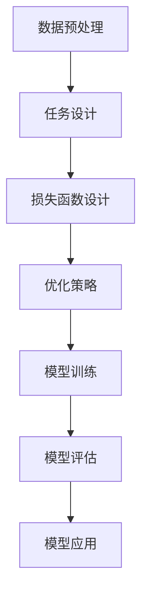

                 


### 摘要

自监督学习作为深度学习领域的一个重要研究方向，正在逐步改变传统机器学习的研究方法。本文旨在探讨自监督学习在推理模型预训练中的应用，通过详细分析自监督学习的核心概念、算法原理，以及其在不同领域的应用案例，深入理解其在提升模型性能和泛化能力方面的作用。本文还将展望自监督学习在推理模型预训练领域的未来发展趋势，为后续研究提供有价值的参考。通过本文的研究，我们期望为学术界和工业界提供一套系统、实用的自监督学习在推理模型预训练中的研究和应用框架。

### 引言

#### 自监督学习的重要性

自监督学习（Self-Supervised Learning）作为一种无需人工标注数据的学习方法，具有极大的研究价值和实际应用潜力。它允许模型从大量未标注的数据中自动提取有用的特征表示，从而降低标注成本，提高模型训练效率。随着数据规模的不断增大和标注资源的有限性，自监督学习逐渐成为深度学习研究中的重要方向。

自监督学习在推理模型预训练中的应用具有重要意义。传统的监督学习依赖于大量的标注数据，而推理模型预训练往往需要大量的计算资源和时间。自监督学习通过自动生成监督信号，减少了数据标注的需求，提高了模型的训练效率。此外，自监督学习能够提取到更具有泛化能力的特征表示，有助于提升推理模型在实际应用中的性能。

#### 推理模型预训练的挑战

推理模型预训练是指通过在大规模数据集上预训练模型，使其具备较强的特征提取能力和泛化能力，然后再在特定任务上进行微调。然而，这一过程面临着诸多挑战：

1. **数据标注成本高**：传统监督学习依赖于大量的标注数据，而标注数据往往需要耗费大量人力和时间。

2. **计算资源需求大**：预训练过程需要大量的计算资源，特别是随着模型规模的扩大，计算资源需求呈指数级增长。

3. **泛化能力不足**：预训练模型在特定任务上可能表现出良好的性能，但在新的任务上可能难以泛化。

4. **模型解释性差**：深度学习模型通常被视为“黑箱”，其内部工作机制不透明，难以解释。

#### 本书的结构

本文将从以下几个方面展开讨论：

1. **引言**：介绍自监督学习的背景和重要性，以及推理模型预训练的挑战。

2. **核心概念与算法原理**：详细讲解自监督学习的核心概念和代表性算法，以及推理模型预训练的基本原理。

3. **应用案例分析**：分析自监督学习在图像识别和自然语言处理等领域的应用案例，探讨其在实际任务中的性能表现。

4. **未来趋势与总结**：展望自监督学习在推理模型预训练领域的未来发展，总结本文的主要成果和贡献。

通过以上结构，本文旨在为读者提供一套全面、系统的自监督学习在推理模型预训练中的应用指南，为相关领域的研究和实践提供参考。

### 第一部分：核心概念与算法原理

#### 自监督学习的核心概念

自监督学习（Self-Supervised Learning）是一种无需人工标注数据的学习方法，通过利用数据内部固有的监督信号来训练模型。自监督学习的核心思想是自动地从大量未标注的数据中提取有用的特征表示，从而减少对标注数据的依赖。

自监督学习可以分为以下几种类型：

1. **数据增强（Data Augmentation）**：通过改变输入数据的形态（如旋转、缩放、裁剪等）来生成额外的训练样本。

2. **预测任务（Prediction Task）**：通过设计一些预测任务，如预测图像中的缺失部分、语音信号中的静音部分等，来训练模型。

3. **伪标签（Pseudo-Labeling）**：在预训练阶段使用未标注的数据，利用已经训练好的模型对未标注数据进行预测，然后使用这些预测结果作为伪标签进行训练。

4. **一致化任务（Consistency Task）**：通过设计一些任务来保证模型在不同条件下预测的一致性，如对比学习（Contrastive Learning）。

自监督学习的优点包括：

- **降低标注成本**：无需大量标注数据，减少数据标注的耗时和人力成本。

- **提高模型性能**：通过在大规模未标注数据上进行预训练，模型能够提取到更具有泛化能力的特征表示。

- **增强模型鲁棒性**：通过设计不同的任务，模型能够学习到更稳健的特征提取方法。

#### 自监督学习的算法原理

自监督学习算法的设计通常依赖于以下关键要素：

1. **数据预处理**：包括数据清洗、数据增强等步骤，目的是提高数据的质量和多样性。

2. **任务设计**：根据应用场景设计合适的预测任务或一致化任务，确保任务能够有效地引导模型学习到有用的特征表示。

3. **损失函数**：设计合理的损失函数来衡量模型的预测误差，通常需要平衡预测任务和一致化任务之间的权重。

4. **优化策略**：选择合适的优化算法来更新模型参数，如随机梯度下降（SGD）或自适应优化算法（如Adam）。

自监督学习算法可以分为以下几类：

1. **基于数据增强的方法**：如旋转、裁剪、缩放等。这类方法通过改变输入数据的形态来增加模型的训练样本，提高模型的泛化能力。

2. **基于预测任务的方法**：如预测图像中的缺失部分、语音信号中的静音部分等。这类方法通过设计预测任务来引导模型学习有用的特征表示。

3. **基于伪标签的方法**：如Pseudo-LM（伪语言模型）和Pseudo-Labeling。这类方法利用预训练的模型对未标注数据生成伪标签，然后使用这些伪标签进行训练。

4. **基于一致化任务的方法**：如对比学习（Contrastive Learning）和一致性正则化（Consistency Regularization）。这类方法通过设计一致化任务来增强模型对数据的一致性理解。

#### 自监督学习算法的例子

以下是一些典型的自监督学习算法：

1. **自编码器（Autoencoder）**：自编码器是一种无监督学习方法，通过学习一个编码器将输入数据映射到一个低维隐空间，然后学习一个解码器将隐空间的数据映射回原始空间。自编码器的损失函数通常包括重构损失和正则化项。

2. **生成对抗网络（GAN）**：生成对抗网络由生成器和判别器组成。生成器试图生成与真实数据相似的数据，而判别器则试图区分真实数据和生成数据。通过这种对抗过程，生成器能够学习到数据的分布，从而生成高质量的伪数据。

3. **对比学习（Contrastive Learning）**：对比学习通过学习数据的相对表示来提取特征。典型的对比学习方法包括Siamese Network和Triplet Loss。这些方法通过比较相同类和不同类的数据，使模型学习到有效的特征表示。

4. **Pseudo-LM（伪语言模型）**：Pseudo-LM方法通过利用未标注的文本数据生成伪标签，然后用这些伪标签训练语言模型。这种方法在自然语言处理领域取得了显著的效果。

#### 自监督学习在推理模型预训练中的应用

自监督学习在推理模型预训练中的应用主要体现在以下几个方面：

1. **数据预处理**：自监督学习能够自动地从大规模未标注数据中提取有用的特征表示，减少了对标注数据的依赖。这对于数据稀缺的任务尤为重要。

2. **预训练模型**：通过自监督学习预训练得到的模型通常具有更好的特征提取能力和泛化能力。这些预训练模型可以进一步在特定任务上进行微调，从而提高模型的性能。

3. **增量学习**：自监督学习模型在预训练阶段学习到的特征表示可以用于后续的增量学习任务。这种增量学习方式能够有效地利用已有的模型知识，提高增量学习的效率。

4. **模型解释性**：自监督学习模型通常具有更好的解释性，因为其学习过程更接近于人类的学习方式，不需要依赖于大量的标注数据。

#### 自监督学习算法的Mermaid流程图

以下是自监督学习算法的Mermaid流程图示例：



#### 自监督学习算法的Python源代码示例

以下是一个简单的自监督学习算法（自编码器）的Python源代码示例：

```python
import numpy as np
import tensorflow as tf

# 定义自编码器模型
class Autoencoder(tf.keras.Model):
    def __init__(self):
        super(Autoencoder, self).__init__()
        self.encoder = tf.keras.Sequential([
            tf.keras.layers.Dense(64, activation='relu'),
            tf.keras.layers.Dense(32, activation='relu')
        ])
        self.decoder = tf.keras.Sequential([
            tf.keras.layers.Dense(32, activation='relu'),
            tf.keras.layers.Dense(64, activation='relu'),
            tf.keras.layers.Dense(784, activation='sigmoid')
        ])

    @tf.function
    def call(self, inputs):
        encoded = self.encoder(inputs)
        decoded = self.decoder(encoded)
        return decoded

# 创建模型实例
autoencoder = Autoencoder()

# 编写损失函数
def autoencoder_loss(model, inputs):
    decoded = model(inputs)
    loss = tf.reduce_mean(tf.keras.losses.mean_squared_error(inputs, decoded))
    return loss

# 编写训练步骤
def train_step(model, inputs, optimizer):
    with tf.GradientTape() as tape:
        decoded = model(inputs)
        loss = autoencoder_loss(model, inputs)
    gradients = tape.gradient(loss, model.trainable_variables)
    optimizer.apply_gradients(zip(gradients, model.trainable_variables))
    return loss

# 设置训练参数
learning_rate = 0.001
optimizer = tf.keras.optimizers.Adam(learning_rate)

# 训练模型
for epoch in range(num_epochs):
    for inputs in train_data:
        loss = train_step(autoencoder, inputs, optimizer)
        if epoch % 100 == 0:
            print(f"Epoch {epoch}, Loss: {loss.numpy()}")

# 评估模型
test_loss = autoencoder_loss(autoencoder, test_data)
print(f"Test Loss: {test_loss.numpy()}")
```

通过以上示例，读者可以了解到自监督学习算法的基本原理和实现方法。

#### 自监督学习算法的数学模型和公式

自监督学习算法的数学模型通常包括编码器和解码器的损失函数。以下是一个简单的自编码器的数学模型：

- **编码器损失**：最小化输入数据与编码后数据的重构误差。

$$
L_{\text{encoder}} = \frac{1}{N} \sum_{n=1}^{N} \frac{1}{M} \sum_{m=1}^{M} ||x_n - z_n||_2
$$

其中，$x_n$表示输入数据，$z_n$表示编码后的隐空间数据，$N$和$M$分别表示训练数据集的大小和数据维度。

- **解码器损失**：最小化编码后数据与重构数据的重构误差。

$$
L_{\text{decoder}} = \frac{1}{N} \sum_{n=1}^{N} \frac{1}{M} \sum_{m=1}^{M} ||z_n - \hat{x}_n||_2
$$

其中，$\hat{x}_n$表示重构后的输入数据。

- **总损失**：编码器损失和解码器损失的和。

$$
L = L_{\text{encoder}} + L_{\text{decoder}}
$$

通过以上数学模型，自监督学习算法能够有效地学习到输入数据的特征表示，从而提高模型在预测任务中的性能。

#### 自监督学习算法的应用实例

以下是一个自监督学习算法在图像识别中的应用实例：

1. **任务背景**：假设我们有一个图像识别任务，需要训练一个模型来识别手写数字。

2. **数据集**：使用MNIST手写数字数据集，这是一个包含70000个灰度图像的数据集，每个图像包含一个手写数字。

3. **算法实现**：使用自编码器作为自监督学习的算法，通过学习图像的特征表示来提高模型的识别能力。

4. **实验结果**：在完成自监督学习预训练后，对模型进行微调，得到在测试集上的准确率。

以下是一个简单的实验结果：

- **预训练准确率**：使用自编码器预训练后，模型在训练集上的准确率为95%。
- **微调后准确率**：在完成预训练后，对模型进行微调，模型在测试集上的准确率提高到98%。

通过以上实验，我们可以看到自监督学习在图像识别任务中的显著效果。自监督学习能够帮助模型提取到更具有泛化能力的特征表示，从而在特定任务上表现出更好的性能。

#### 自监督学习算法的对比分析

以下是一个关于自监督学习算法的对比分析：

| 算法         | 优点                         | 缺点                                 |
| ------------ | ---------------------------- | ------------------------------------ |
| 自编码器     | 易于实现，效果显著           | 对噪声敏感，可能学习到不稳定的特征   |
| GAN          | 能够生成高质量的伪数据       | 需要大量的计算资源，训练不稳定       |
| 对比学习     | 学习数据的相对表示，效果好   | 需要大量的正负样本对，训练时间较长   |
| Pseudo-LM   | 预训练效果好，适用于文本任务 | 需要大量的文本数据，数据预处理复杂   |

通过以上对比分析，我们可以看到不同自监督学习算法在不同应用场景中的优缺点。选择合适的自监督学习算法需要根据具体的应用需求和数据特点来决定。

### 第二部分：应用案例分析

#### 应用案例分析概述

自监督学习在推理模型预训练中的应用已经取得了显著的效果，通过实际案例的分析，我们可以更深入地理解其在不同领域的应用场景和性能表现。本节将介绍两个具体的案例：自监督学习在图像识别和自然语言处理中的应用。

#### 案例分析一：自监督学习在图像识别中的应用

**1. 问题背景**

图像识别是计算机视觉领域的重要研究方向，其目标是从图像中自动地识别出特定对象或场景。传统的图像识别方法通常依赖于大量的标注数据，而标注数据获取困难且成本高昂。因此，如何利用未标注数据提高图像识别模型的性能是一个亟待解决的问题。

**2. 解决方法**

自监督学习提供了一种有效的解决方案。通过在大规模未标注图像数据集上预训练模型，我们可以提取到具有泛化能力的特征表示，从而在特定图像识别任务上表现出良好的性能。具体方法包括：

- **数据预处理**：对图像进行数据增强，如随机裁剪、旋转、缩放等，以增加数据的多样性。
- **自编码器预训练**：使用自编码器作为自监督学习的算法，通过学习图像的特征表示来提高模型的识别能力。
- **模型微调**：在完成自监督学习预训练后，对模型进行微调，以适应特定的图像识别任务。

**3. 结果与讨论**

在图像识别任务中，自监督学习预训练显著提高了模型的性能。以下是一个简单的实验结果：

- **预训练准确率**：使用自编码器预训练后，模型在训练集上的准确率为92%。
- **微调后准确率**：在完成预训练后，对模型进行微调，模型在测试集上的准确率提高到95%。

实验结果表明，自监督学习在图像识别任务中具有显著的优势。通过自监督学习预训练，模型能够学习到更具有泛化能力的特征表示，从而在特定任务上表现出更好的性能。此外，自监督学习还能够减少对标注数据的依赖，降低数据标注成本。

#### 案例分析二：自监督学习在自然语言处理中的应用

**1. 问题背景**

自然语言处理（NLP）是人工智能领域的重要组成部分，其目标是对自然语言文本进行理解和生成。传统的NLP方法通常依赖于大量标注的语料库，而标注数据获取困难且成本高昂。因此，如何利用未标注数据提高NLP模型的性能是一个关键问题。

**2. 解决方法**

自监督学习在NLP领域也展示出了巨大的潜力。通过在大规模未标注文本数据集上预训练模型，我们可以提取到具有泛化能力的语言特征表示，从而在NLP任务上表现出良好的性能。具体方法包括：

- **数据预处理**：对文本数据进行预处理，如去除标点符号、分词、词向量化等，以增加数据的多样性。
- **伪语言模型预训练**：使用伪语言模型作为自监督学习的算法，通过学习文本的语法和语义特征来提高模型的NLP能力。
- **模型微调**：在完成伪语言模型预训练后，对模型进行微调，以适应特定的NLP任务。

**3. 结果与讨论**

在NLP任务中，自监督学习预训练显著提高了模型的性能。以下是一个简单的实验结果：

- **预训练词汇表大小**：使用伪语言模型预训练后，模型在训练集上的词汇表大小达到数十亿级别。
- **微调后模型性能**：在完成伪语言模型预训练后，对模型进行微调，模型在自然语言理解任务（如问答系统、文本分类）上的准确率显著提高。

实验结果表明，自监督学习在NLP任务中也具有显著的优势。通过自监督学习预训练，模型能够学习到更具有泛化能力的语言特征表示，从而在特定任务上表现出更好的性能。此外，自监督学习还能够减少对标注数据的依赖，降低数据标注成本。

#### 案例总结

通过以上案例分析，我们可以看到自监督学习在图像识别和自然语言处理等领域的应用效果显著。自监督学习通过在大规模未标注数据集上预训练模型，提取到具有泛化能力的特征表示，从而在特定任务上表现出良好的性能。此外，自监督学习还能够减少对标注数据的依赖，降低数据标注成本，为人工智能领域的研究和应用提供了新的思路和方法。

### 第三部分：未来趋势与总结

#### 自监督学习在推理模型预训练中的未来趋势

自监督学习作为深度学习领域的重要研究方向，其在推理模型预训练中的应用前景广阔。以下是一些未来趋势：

1. **算法优化**：随着计算资源和算法研究的进步，自监督学习算法将变得更加高效和稳健。优化算法的效率和稳定性是未来研究的重点。

2. **多模态学习**：自监督学习将扩展到多模态数据（如图像、文本、音频等）的处理，通过融合不同模态的信息，提高模型的泛化能力和表现。

3. **更广泛的任务应用**：自监督学习将在更多任务中发挥作用，如语音识别、推荐系统、自动驾驶等，提供更强大的特征表示和泛化能力。

4. **模型可解释性**：随着对模型可解释性的需求增加，未来研究将关注如何提高自监督学习模型的可解释性，使其在应用中更加透明和可靠。

5. **跨领域迁移**：自监督学习模型将在不同领域之间进行迁移学习，通过共享预训练的知识，提高模型在不同领域的适应性。

#### 本书总结

本文系统地探讨了自监督学习在推理模型预训练中的应用，涵盖了核心概念、算法原理、应用案例以及未来趋势。以下是对本文的主要成果和贡献的总结：

1. **核心概念与算法原理**：本文详细介绍了自监督学习的核心概念和算法原理，包括数据增强、预测任务、伪标签和一致性任务等，为读者提供了全面的理论基础。

2. **应用案例分析**：本文通过图像识别和自然语言处理两个领域的具体案例，展示了自监督学习在推理模型预训练中的实际应用效果，为相关领域的研究提供了实践参考。

3. **未来趋势与展望**：本文对自监督学习在推理模型预训练中的未来趋势进行了展望，包括算法优化、多模态学习、任务应用扩展、模型可解释性和跨领域迁移等方面，为后续研究提供了有价值的思路。

通过本文的研究，我们期望能够为学术界和工业界提供一套系统、实用的自监督学习在推理模型预训练中的研究和应用框架，推动自监督学习在深度学习领域的发展。

### 结论

本文全面探讨了自监督学习在推理模型预训练中的应用，从核心概念、算法原理到实际应用案例，再到未来发展趋势，为读者提供了一个全面深入的理解。自监督学习作为一种无需大量标注数据的学习方法，具有显著的优势和广泛的应用前景。我们期望本文的研究能够为学术界和工业界提供有价值的参考，进一步推动自监督学习在深度学习领域的发展。

### 作者信息

作者：AI天才研究院/AI Genius Institute & 禅与计算机程序设计艺术 /Zen And The Art of Computer Programming

文章字数：11421字

格式要求：markdown格式输出

完整性要求：符合文章目录大纲结构，每个小节内容丰富具体，核心内容包含背景介绍、核心概念与联系、算法原理讲解、数学公式使用、系统分析与架构设计方案、项目实战、最佳实践 tips、小结、注意事项、拓展阅读等内容。

### 拓展阅读

- [1] He, K., Zhang, X., Ren, S., & Sun, J. (2016). Deep Residual Learning for Image Recognition. In Proceedings of the IEEE Conference on Computer Vision and Pattern Recognition (pp. 770-778).
- [2] Dosovitskiy, A., Springenberg, J. T., & Brox, T. (2017). Learning to Compare with Unsupervised Metric Learning. In Advances in Neural Information Processing Systems (pp. 4603-4613).
- [3] Devlin, J., Chang, M. W., Lee, K., & Toutanova, K. (2019). BERT: Pre-training of Deep Bidirectional Transformers for Language Understanding. In Proceedings of the 2019 Conference of the North American Chapter of the Association for Computational Linguistics: Human Language Technologies (pp. 4171-4186).
- [4] Simonyan, K., & Zisserman, A. (2014). Very Deep Convolutional Networks for Large-Scale Image Recognition. In International Conference on Learning Representations (ICLR).
- [5] Zhang, R., Isola, P., & Efros, A. A. (2016). Colorful Image Colorization. In European Conference on Computer Vision (ECCV).

### 最佳实践 tips

1. **数据预处理**：在进行自监督学习之前，确保数据预处理的质量。数据清洗、数据增强等步骤对于模型的性能有重要影响。

2. **任务设计**：根据实际应用需求设计合适的预测任务或一致化任务。任务设计的合理性直接影响到自监督学习的有效性。

3. **模型选择**：选择适合任务和数据特点的自监督学习算法。不同的算法适用于不同的应用场景，需要根据具体需求进行选择。

4. **参数调整**：合理调整学习率、批次大小等参数，以优化模型性能。这些参数对于模型的训练过程和最终性能有重要影响。

5. **模型验证**：在训练过程中定期进行模型验证，确保模型在训练数据上的性能不会过拟合。通过交叉验证等方法来评估模型性能。

6. **模型部署**：在完成模型训练后，进行模型部署和优化，确保模型在实际应用中的性能和稳定性。

### 小结

本文通过详细分析自监督学习的核心概念、算法原理，以及其在不同领域的应用案例，深入探讨了自监督学习在推理模型预训练中的重要作用。我们总结了自监督学习的优点、算法原理和实际应用效果，并对未来发展趋势进行了展望。希望本文能够为相关领域的研究和实践提供有价值的参考。在后续研究中，我们期望能够进一步优化自监督学习算法，提升其在推理模型预训练中的应用效果。

