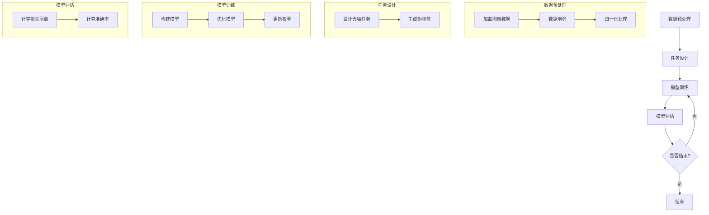
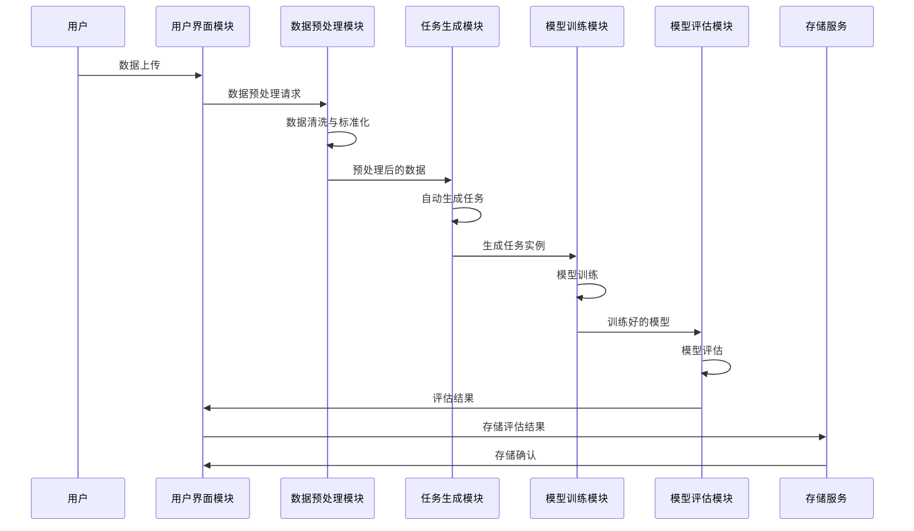

                 


### 目录大纲设计

首先，我们需要对文章的整体结构进行设计，确保内容完整且逻辑清晰。以下是《自监督学习在提升AI推理能力中的潜力探索》的目录大纲：

#### 引言与背景

1. **问题背景**：介绍自监督学习在AI推理中的重要性，以及当前AI推理面临的问题和挑战。
2. **自监督学习的定义与重要性**：详细解释自监督学习的概念，并阐述其在AI领域的重要作用。
3. **自监督学习在AI推理中的作用**：分析自监督学习如何提升AI推理能力，并探讨其在实际应用中的优势。
4. **自监督学习的挑战与机遇**：讨论自监督学习在发展过程中面临的难题和潜在的发展机会。

#### 核心概念与理论

1. **自监督学习的原理**：介绍自监督学习的基础理论和核心概念，如无监督学习、有监督学习和半监督学习的区别。
2. **自监督学习的主要类型**：分类介绍自监督学习的主要方法，包括基于深度学习的自监督学习、基于图的自监督学习等。
3. **自监督学习的算法框架**：分析自监督学习的算法框架，包括数据预处理、模型训练和模型评估等步骤。
4. **自监督学习的效果评估方法**：介绍如何评估自监督学习的效果，包括指标选择、实验设计和结果分析。

#### 算法原理与实现

1. **自监督学习算法的数学模型**：阐述自监督学习算法的数学模型，包括损失函数、优化算法等。
2. **Python实现自监督学习算法**：通过Python代码实现一个简单的自监督学习算法，详细讲解代码逻辑和实现过程。
3. **算法原理讲解与Mermaid流程图**：使用Mermaid工具绘制算法流程图，配合文字详细解释算法原理。
4. **自监督学习的数学公式与示例**：使用LaTeX格式嵌入数学公式，结合示例进行详细讲解，确保读者能够理解公式背后的逻辑。

#### 应用场景与案例分析

1. **自监督学习在计算机视觉中的应用**：介绍自监督学习在图像分类、目标检测等计算机视觉任务中的应用。
2. **自监督学习在自然语言处理中的应用**：探讨自监督学习在文本分类、机器翻译等自然语言处理任务中的应用。
3. **自监督学习在推荐系统中的应用**：分析自监督学习如何提升推荐系统的效果，并举例说明其实际应用。
4. **自监督学习的跨领域应用案例分析**：讨论自监督学习在不同领域中的实际应用案例，如音频处理、生物信息学等。

#### 系统分析与架构设计

1. **问题场景介绍**：描述自监督学习在特定应用场景中的问题背景和需求。
2. **项目介绍**：介绍一个具体的项目，如一个自监督学习平台或系统。
3. **系统功能设计**：使用Mermaid类图展示系统的领域模型，明确系统的功能模块。
4. **系统架构设计**：使用Mermaid架构图展示系统的整体架构，包括硬件和软件组件。
5. **系统接口设计和系统交互**：使用Mermaid序列图展示系统的接口设计和交互流程。

#### 项目实战

1. **实战项目概述**：简要介绍项目的背景、目标和预期效果。
2. **环境安装与配置**：详细描述如何搭建自监督学习环境的步骤，包括软件安装和配置。
3. **系统核心实现与源代码解读**：讲解系统核心功能实现的源代码，分析代码逻辑和关键算法。
4. **实际案例分析与讲解**：结合具体案例，分析自监督学习在项目中的应用，并进行详细讲解。
5. **项目小结与拓展**：总结项目的经验教训，提出未来改进方向和拓展思路。

#### 总结与展望

1. **自监督学习的现状与趋势**：回顾自监督学习的发展历程，分析当前的研究热点和发展趋势。
2. **自监督学习的发展方向**：探讨自监督学习的未来研究方向，如多模态学习、迁移学习等。
3. **未来展望与潜在影响**：预测自监督学习对未来AI领域的影响和潜在应用场景。
4. **最佳实践与注意事项**：总结自监督学习实践中的最佳方法和注意事项。
5. **拓展阅读与资源推荐**：推荐相关书籍、论文和在线资源，供读者进一步学习。

### 文章格式与作者信息

在文章格式方面，我们将按照以下要求进行：

1. **文章标题**：使用大标题格式。
2. **文章关键词**：使用小标题格式，并在小标题下列出5-7个关键词。
3. **文章摘要**：使用段落格式，简要概括文章的核心内容和主题思想。
4. **正文内容**：使用段落和子标题格式，确保文章结构清晰。

在文章末尾，我们将添加作者信息，包括作者姓名和所属机构，以及相关书籍和文章的推荐。

### 核心内容要求

为了确保文章的质量，每个章节的核心内容要求如下：

1. **背景介绍**：详细介绍自监督学习的基础知识，包括核心概念、术语说明、问题背景、问题描述、问题解决、边界与外延、概念结构与核心要素组成。
2. **核心概念与联系**：给出核心概念原理，使用表格和ER实体关系图架构的Mermaid流程图展示概念之间的联系。
3. **算法原理讲解**：使用Mermaid工具绘制算法流程图，配合Python源代码和LaTeX数学公式详细讲解算法原理。
4. **数学公式使用**：使用LaTeX格式嵌入文中独立段落的数学公式，并确保公式清晰可读。
5. **系统分析与架构设计**：使用Mermaid工具绘制系统架构图和序列图，详细介绍系统功能设计、系统架构设计、系统接口设计和系统交互。
6. **项目实战**：详细描述项目环境安装、系统核心实现源代码、代码应用解读与分析、实际案例分析和详细讲解剖析。
7. **最佳实践 tips、小结、注意事项、拓展阅读**：总结文章中的关键点，提供最佳实践建议，并推荐拓展阅读资源。

### 文章字数与格式

根据要求，文章的字数在10000-12000字之间，使用markdown格式输出。确保文章内容结构清晰，逻辑性强，易于阅读和理解。

### 总结

通过以上步骤，我们设计了一个完整的文章大纲，并明确了每个章节的核心内容和要求。接下来，我们将根据这个大纲逐步撰写文章，确保每个部分都详细、具体、有条理。在撰写过程中，我们将注重逻辑性、清晰性和专业性，力求为读者呈现一篇高质量的技术博客文章。

## 引言与背景

### 1.1 问题背景

人工智能（AI）作为21世纪最具影响力的技术之一，其应用已渗透到各个领域，从自动驾驶到自然语言处理，再到图像识别，AI正逐步改变我们的生活方式。然而，随着AI技术的不断进步，其推理能力的提升成为了一个关键问题。传统的人工智能系统大多依赖于大量标注数据进行监督学习，这不仅成本高昂，而且数据标注的质量直接影响模型的性能。此外，监督学习模型在面对复杂、动态的环境时，往往难以适应和扩展。

自监督学习作为一种无需大量标注数据，即可从无标签数据中学习的方法，近年来受到了广泛关注。自监督学习通过设计特殊的任务，让模型在未标记的数据中进行自我训练，从而提取数据中的有用信息，进而提高模型的推理能力。与传统监督学习相比，自监督学习不仅可以降低数据标注的成本，还能在数据稀缺或无法获取标签数据的场景下发挥作用。

在AI推理能力提升方面，自监督学习具有显著的潜力。通过自我监督的方式，模型可以更加灵活地学习数据中的内在结构和规律，从而在无需额外监督信息的情况下，实现更高的推理能力。此外，自监督学习还可以促进模型的泛化能力，使其在未知数据上表现更加出色。这些优势使得自监督学习在提升AI推理能力方面具有重要的研究价值和实际应用前景。

### 1.2 自监督学习的定义与重要性

自监督学习（Self-supervised Learning）是一种机器学习范式，它通过设计特殊的任务，将未标记的数据转化为可用的监督信号，从而实现模型的自我训练。与传统的监督学习相比，自监督学习不依赖于大量的标注数据，而是利用数据本身的结构和规律，通过自我监督的方式，提取数据中的有用信息。

自监督学习的核心思想是将学习过程中的监督信号与数据生成过程分离。在自监督学习中，模型的训练目标不是直接预测标签，而是通过设计任务，使得模型能够从原始数据中学习到有用的信息。这些信息可以是数据的表征、结构或规律，从而提高模型的推理能力。

自监督学习在AI领域中具有非常重要的意义。首先，它解决了传统监督学习对大量标注数据的依赖问题，降低了数据采集和标注的成本。特别是在图像、音频和文本等大规模数据集上，标注数据的获取非常困难且昂贵。自监督学习可以通过自动生成监督信号，减轻数据标注的工作量，从而提高模型的训练效率。

其次，自监督学习能够提升模型的泛化能力。通过在大量未标记的数据中进行自我训练，模型可以学习到更加广泛和普适的规律，从而在新的、未见过的数据上表现出更高的推理能力。这种能力在现实世界中尤为重要，因为实际应用场景往往面临数据分布的变化和不确定因素。

此外，自监督学习在提高AI推理能力方面具有显著的优势。通过自我监督的方式，模型可以从数据中提取更深层次的特征和关系，从而在复杂的任务中表现出更强的推理能力。例如，在计算机视觉任务中，自监督学习可以帮助模型自动学习图像中的语义和结构信息，从而实现更准确的图像分类和目标检测。

总之，自监督学习通过降低数据依赖、提高泛化能力和增强推理能力，为AI领域带来了全新的研究思路和应用前景。在接下来的章节中，我们将深入探讨自监督学习的核心概念、算法原理以及在实际应用中的具体实现，进一步揭示其在提升AI推理能力中的潜力。

### 1.3 自监督学习在AI推理中的作用

自监督学习在AI推理中的重要作用不可忽视。首先，它通过设计自我监督任务，使得模型能够从大量未标记的数据中提取有用的信息，从而提高模型的表征能力和泛化能力。这一过程不仅减少了对外部标注数据的依赖，也降低了数据标注的成本，使得AI系统可以更加高效地学习和适应不同领域的数据。

在计算机视觉领域，自监督学习被广泛应用于图像分类、目标检测和图像分割等任务。例如，通过设计类似于“图像去噪”的任务，模型可以自动学习图像中的有用特征，从而在未标记的数据上进行自我训练。这种方法不仅提高了模型对噪声的鲁棒性，还增强了其在大规模图像数据集上的分类能力。再如，在目标检测任务中，自监督学习可以通过生成图像的伪标签，帮助模型学习目标的位置和特征，从而实现更准确的目标检测效果。

在自然语言处理（NLP）领域，自监督学习同样发挥着重要作用。通过设计诸如“语言建模”和“文本分类”等任务，模型可以从大量的未标记文本数据中学习语言的内在结构和规律。例如，通过训练一个语言模型，模型可以自动学习文本中的语法和语义信息，从而在文本分类任务中实现高精度的分类效果。此外，自监督学习还可以帮助模型学习文本中的隐含关系，如句子之间的逻辑关系和实体之间的关联，从而在问答系统和信息抽取等任务中表现出色。

在推荐系统领域，自监督学习也被广泛应用。通过设计自我监督任务，模型可以从用户的行为数据中学习用户的偏好和兴趣，从而提高推荐系统的准确性和用户体验。例如，通过训练一个基于自监督学习的内容匹配模型，系统可以自动学习用户对不同内容类型的偏好，从而实现更加个性化的内容推荐。

此外，自监督学习还在音频处理和生物信息学等领域展现了其潜力。在音频处理领域，自监督学习可以帮助模型自动学习声音的特征和模式，从而实现语音识别和音频分类等任务。在生物信息学领域，自监督学习可以通过分析未标记的生物数据，提取基因和蛋白质之间的相互作用关系，从而为生物科学研究提供重要的工具。

总的来说，自监督学习在AI推理中的应用场景非常广泛，通过自我监督的方式，模型可以从大量未标记的数据中提取有用的信息，从而提升模型的表征能力、泛化能力和推理能力。这不仅降低了数据标注的成本，也为AI系统在复杂任务中的表现提供了有力的支持。

### 1.4 自监督学习的挑战与机遇

尽管自监督学习在AI推理中展现出巨大的潜力，但其发展过程中仍面临诸多挑战。首先，自监督学习的监督信号往往不如有监督学习中的标签数据明确和可靠，这可能导致模型学习到的特征不够准确或泛化能力不足。其次，自监督学习的训练过程复杂且耗时长，尤其是在大规模数据集上，模型可能需要大量的计算资源和时间来完成训练。此外，设计有效的自监督学习任务也是一个挑战，需要深入理解数据分布和任务特性，以确保模型能够从数据中提取有用的信息。

然而，这些挑战也伴随着机遇。首先，随着计算能力的不断提升，大规模数据集和高性能计算资源的可获得性正在逐渐提高，这为自监督学习的训练提供了有力支持。其次，深度学习技术的快速发展，特别是生成对抗网络（GAN）和变分自编码器（VAE）等新型模型的出现，为自监督学习提供了更多有效的算法框架。此外，跨学科研究的融合，如心理学、认知科学等领域的知识，也为自监督学习提供了新的理论支持和研究方向。

展望未来，自监督学习有望在多个领域取得突破。例如，在自动驾驶领域，通过自监督学习，模型可以自动学习道路标志、交通信号和行人行为等复杂场景的特征，从而提高自动驾驶系统的安全性和可靠性。在医疗健康领域，自监督学习可以自动分析医学影像，辅助医生进行疾病诊断，从而提高医疗诊断的准确性和效率。在自然语言处理领域，自监督学习有望通过学习大量未标记的文本数据，实现更精准的文本理解和生成，从而提升智能客服和自动化写作等应用的效果。

总的来说，自监督学习在提升AI推理能力方面具有巨大的潜力，尽管面临诸多挑战，但随着技术的不断进步和研究的深入，其应用前景将更加广阔。通过不断探索和创新，自监督学习有望在AI领域发挥更大的作用，推动人工智能技术的发展和进步。

## 核心概念与理论

### 2.1 自监督学习的原理

自监督学习（Self-supervised Learning）是一种特殊的机器学习方法，其核心思想是在未标记的数据中通过设计任务，自动生成监督信号，从而驱动模型进行训练。与传统监督学习不同，自监督学习不需要依赖外部标注数据，而是通过自我监督的方式，使得模型能够从原始数据中学习到有用的特征和规律。

自监督学习的原理可以概括为以下几个关键步骤：

1. **数据预处理**：首先，对原始数据进行预处理，包括数据清洗、去噪、标准化等操作，以确保数据的质量和一致性。

2. **任务设计**：设计一个适合数据的自监督学习任务。这个任务需要具备以下几个特点：
   - **可自动生成标签**：任务本身能够在未标记的数据中自动生成监督信号，例如，通过图像去噪任务，图像的原始版本可以作为一个天然的标签。
   - **数据相关性高**：任务需要与数据内容紧密相关，从而能够有效提取数据中的有用信息。
   - **普适性强**：任务应适用于多种类型的数据，从而提高模型的泛化能力。

3. **模型训练**：通过设计的任务，模型将在训练过程中不断调整参数，从而学习到数据的内在特征和规律。自监督学习的训练目标不是直接预测标签，而是通过任务的反馈，使得模型能够从数据中提取到有用的信息。

4. **模型评估**：使用已标记的数据对训练好的模型进行评估，以确定模型的性能。由于自监督学习使用的是未标记的数据，因此需要设计适当的评估指标，如准确性、召回率、F1分数等，来衡量模型的效果。

自监督学习通过这种自我监督的方式，不仅能够降低对大量标注数据的依赖，还能提高模型的泛化能力和适应能力。这使得自监督学习在数据稀缺或无法获取标签数据的场景中具有特别的优势。

### 2.2 自监督学习的主要类型

自监督学习可以根据任务和数据类型的不同，分为多种类型。以下是几种常见的主要类型：

1. **基于预训练的语言模型（Pre-trained Language Models）**：
   - **定义**：这类自监督学习通过在大规模文本数据集上预训练一个语言模型，从而学习语言的内在结构和规律。
   - **原理**：通过设计任务，如 masked language modeling（MLM），即随机遮盖文本中的一个或多个单词，然后让模型预测遮盖的单词。这种方法能够有效提取文本的语义特征。
   - **应用**：预训练的语言模型在自然语言处理（NLP）领域得到了广泛应用，如文本分类、机器翻译、问答系统等。

2. **基于图像的生成对抗网络（GAN）**：
   - **定义**：生成对抗网络（GAN）是由生成器（Generator）和判别器（Discriminator）组成的模型，通过对抗训练的方式，生成器尝试生成与真实数据相似的数据，而判别器则尝试区分生成数据和真实数据。
   - **原理**：在GAN中，自监督学习任务是通过让生成器生成伪图像，然后让判别器判断这些图像是真实图像还是生成的图像。通过这种对抗训练，生成器能够学习到真实数据的特征，从而生成高质量的数据。
   - **应用**：GAN在计算机视觉领域表现出色，如图像生成、图像修复、风格迁移等任务。

3. **基于图像的特征匹配（Image Feature Matching）**：
   - **定义**：这类自监督学习通过设计任务，使得模型能够学习到图像之间的相似性特征。
   - **原理**：常见的任务包括图像重建、图像去噪和图像分类。例如，通过图像重建任务，模型需要学习到图像的局部特征，从而能够重建原始图像。通过图像去噪任务，模型可以提取图像的有用信息，从而去除噪声。
   - **应用**：特征匹配在图像识别、图像检索和目标检测等任务中得到了广泛应用。

4. **基于音频处理的循环神经网络（RNN）**：
   - **定义**：循环神经网络（RNN）是一种能够处理序列数据的神经网络，其通过循环结构来记忆和利用序列中的历史信息。
   - **原理**：在自监督学习中，RNN可以用于音频处理任务，如音频分类、语音识别和音乐生成。通过设计任务，如音频去噪、音频特征提取和时序分类，模型可以学习到音频的内在特征和规律。
   - **应用**：RNN在音频处理领域表现出色，特别是在语音识别和音乐生成等任务中。

5. **基于物理规律的强化学习**：
   - **定义**：这类自监督学习结合了强化学习和物理定律，通过让模型学习物理世界的规律来提高其推理能力。
   - **原理**：在强化学习任务中，模型通过与环境互动，学习到如何达到目标状态。通过结合物理定律，模型可以更好地理解环境的动态和因果关系。
   - **应用**：基于物理规律的强化学习在仿真环境和机器人控制等领域有广泛应用。

这些自监督学习类型各有特点，适用于不同的应用场景和数据类型。通过选择合适的自监督学习方法，可以有效地提升模型的推理能力和泛化能力。

### 2.3 自监督学习的算法框架

自监督学习的算法框架通常包括以下几个关键组成部分：数据预处理、任务设计、模型训练、模型评估等。以下是这些组件的具体说明：

1. **数据预处理**：
   - **目的**：确保数据的质量和一致性，为后续的任务设计和模型训练提供可靠的数据基础。
   - **操作**：包括数据清洗、去噪、数据增强、标准化等。数据清洗和去噪旨在去除数据中的噪声和不完整信息，而数据增强则通过生成数据的变体，增加模型的训练数据量，从而提高模型的泛化能力。

2. **任务设计**：
   - **目的**：设计一个适合数据的自监督学习任务，通过任务生成监督信号，驱动模型学习。
   - **步骤**：
     - **任务选择**：根据数据的类型和应用需求，选择合适的自监督学习任务。例如，对于图像数据，可以选择图像去噪、图像重建或图像分类等任务。
     - **任务定义**：明确任务的输入和输出，设计任务的监督信号生成机制。例如，在图像去噪任务中，原始图像可以作为监督信号，而重建的图像则是模型的输出。

3. **模型训练**：
   - **目的**：通过设计好的任务，调整模型的参数，使得模型能够从数据中学习到有用的特征和规律。
   - **步骤**：
     - **模型选择**：根据任务需求，选择合适的模型架构，如卷积神经网络（CNN）、循环神经网络（RNN）或生成对抗网络（GAN）。
     - **训练过程**：在训练过程中，模型通过不断调整参数，优化损失函数，以适应任务的要求。通常，训练过程包括前向传播、反向传播和参数更新等步骤。

4. **模型评估**：
   - **目的**：评估训练好的模型在未知数据上的性能，确保模型具有良好的泛化能力。
   - **步骤**：
     - **指标选择**：根据任务类型，选择合适的评估指标，如准确性、召回率、F1分数等。
     - **测试集评估**：使用测试集对模型进行评估，以验证模型的性能。

自监督学习的算法框架不仅涵盖了数据预处理、任务设计、模型训练和模型评估等关键步骤，还涉及了模型选择、参数调整和超参数优化等具体实现细节。通过这些步骤，自监督学习能够从大量未标记的数据中提取有用的信息，从而提升模型的表征能力和泛化能力。

### 2.4 自监督学习的效果评估方法

自监督学习的评估方法与传统监督学习的评估方法有所不同，因为自监督学习使用的是未标记的数据生成监督信号。因此，评估方法需要考虑模型在未标记数据上的性能，以确保其泛化能力和实用性。以下是几种常用的自监督学习效果评估方法：

1. **内部评估（Intrinsic Evaluation）**：
   - **目的**：通过评估模型在自监督学习任务上的性能，判断模型的自我训练效果。
   - **方法**：常用的内部评估指标包括任务的准确率、损失函数值等。例如，在图像去噪任务中，可以使用重建误差（如均方误差（MSE））来评估模型的效果。

2. **外部评估（Extrinsic Evaluation）**：
   - **目的**：通过评估模型在真实任务上的性能，验证模型在实际应用中的有效性。
   - **方法**：外部评估通常使用标记数据集进行，常用的评估指标包括准确性、召回率、F1分数等。例如，在图像分类任务中，可以使用测试集上的准确率来评估模型的效果。

3. **伪标签评估（Pseudo-Label Evaluation）**：
   - **目的**：利用自监督学习生成的伪标签，对真实数据进行分类或预测，以评估模型的泛化能力。
   - **方法**：首先，使用自监督学习模型生成伪标签，然后使用这些伪标签对真实数据进行分类或预测。通过比较预测结果和真实标签，计算评估指标（如准确率）来评估模型的泛化能力。

4. **多任务评估（Multi-task Evaluation）**：
   - **目的**：评估模型在多个任务上的性能，以验证模型的泛化能力和适应性。
   - **方法**：设计多个自监督学习任务，并在不同的任务上评估模型的性能。常用的评估指标包括平均准确率、平均损失值等。

5. **跨域评估（Cross-domain Evaluation）**：
   - **目的**：验证模型在不同领域上的性能，确保其泛化能力不仅局限于特定领域。
   - **方法**：使用来自不同领域的数据集进行评估，比较模型在各个领域的表现。常用的评估指标包括跨域准确率、跨域损失值等。

6. **鲁棒性评估（Robustness Evaluation）**：
   - **目的**：评估模型在噪声和异常数据上的鲁棒性，确保模型能够稳定地应对不同的数据分布和噪声水平。
   - **方法**：通过添加噪声、改变数据分布等方式，生成不同的异常数据集，然后评估模型在这些数据集上的性能。常用的评估指标包括鲁棒性准确率、鲁棒性损失值等。

通过这些评估方法，可以全面地评估自监督学习模型的效果，包括其在自我训练任务中的性能和在实际应用中的实用性。这些评估方法不仅有助于研究人员理解模型的性能，也为实际应用提供了可靠的依据。

### 2.5 自监督学习的数学模型

自监督学习的数学模型是理解其工作原理和实现方法的关键。以下是自监督学习中的几个核心数学模型，包括损失函数、优化算法和主要算法框架。

#### 损失函数

自监督学习的损失函数设计通常与具体任务紧密相关，其目的是通过最小化损失函数来优化模型的参数。以下是几种常见的损失函数：

1. **均方误差（MSE）**：
   - **公式**：\(L_{MSE} = \frac{1}{n}\sum_{i=1}^{n}(y_i - \hat{y}_i)^2\)
   - **应用**：常用于回归任务和图像重建任务。其中，\(y_i\)表示真实标签，\(\hat{y}_i\)表示模型预测值。

2. **交叉熵（Cross-Entropy）**：
   - **公式**：\(L_{CE} = -\sum_{i=1}^{n}y_i \log(\hat{y}_i)\)
   - **应用**：常用于分类任务。\(y_i\)是真实标签的one-hot编码，\(\hat{y}_i\)是模型输出的概率分布。

3. **对抗损失（Adversarial Loss）**：
   - **公式**：\(L_{GAN} = -\log(D(G(x)))\)
   - **应用**：常用于生成对抗网络（GAN）。\(D(x)\)是判别器的输出，\(G(x)\)是生成器的输出。

#### 优化算法

自监督学习的优化算法用于调整模型参数，以最小化损失函数。以下是一些常用的优化算法：

1. **随机梯度下降（SGD）**：
   - **公式**：\(w_{t+1} = w_t - \alpha \nabla_w L(w_t)\)
   - **应用**：适用于大多数机器学习任务。其中，\(\alpha\)是学习率，\(\nabla_w L(w_t)\)是损失函数关于参数\(w_t\)的梯度。

2. **Adam优化器**：
   - **公式**：\(w_{t+1} = w_t - \alpha \frac{1}{\sqrt{1-\beta_1^t}(1-\beta_2^t)} \nabla_w L(w_t)\)
   - **应用**：适用于动态变化的数据，如序列数据和大规模数据集。其中，\(\beta_1\)和\(\beta_2\)是动量参数。

3. **Adadelta优化器**：
   - **公式**：\(w_{t+1} = w_t - \frac{\Delta w_t}{\sqrt{\delta w_t^2 + \epsilon}}\)
   - **应用**：适用于稳定收敛和自适应调整学习率的场景。

#### 主要算法框架

自监督学习的算法框架主要包括数据预处理、任务设计、模型训练和模型评估等步骤。以下是几种主要的自监督学习算法框架：

1. **预训练语言模型（Pre-trained Language Models）**：
   - **框架**：
     1. 数据预处理：清洗文本数据，转换为词向量或嵌入向量。
     2. 任务设计：设计masked language modeling（MLM）任务，随机遮盖文本中的单词，模型预测遮盖的单词。
     3. 模型训练：使用预训练的模型架构（如BERT、GPT）进行训练，通过反向传播和优化算法调整参数。
     4. 模型评估：使用测试集评估模型在文本分类、机器翻译等任务上的性能。
   - **实现**：
     ```python
     from transformers import BertForMaskedLM, BertTokenizer
     model = BertForMaskedLM.from_pretrained('bert-base-uncased')
     tokenizer = BertTokenizer.from_pretrained('bert-base-uncased')
     inputs = tokenizer.encode("Hello ![MASK]", return_tensors='pt')
     outputs = model(inputs)
     predicted_logits = outputs.logits
     ```

2. **生成对抗网络（GAN）**：
   - **框架**：
     1. 数据预处理：准备图像数据，进行数据增强。
     2. 任务设计：设计图像生成和图像判别的任务，生成器生成图像，判别器判断图像的真实性。
     3. 模型训练：通过对抗训练，生成器和判别器交替训练，优化损失函数。
     4. 模型评估：使用测试集评估生成器的图像生成质量。
   - **实现**：
     ```python
     import torch
     from torch import nn
     from torchvision import datasets, transforms
     from torch.utils.data import DataLoader
     # Define generator and discriminator
     generator = nn.Sequential(nn.Linear(100, 784),
                              nn.Tanh())
     discriminator = nn.Sequential(nn.Linear(784, 1),
                                  nn.Sigmoid())
     # Define loss function and optimizers
     loss_function = nn.BCELoss()
     optimizer_G = torch.optim.Adam(generator.parameters(), lr=0.0002)
     optimizer_D = torch.optim.Adam(discriminator.parameters(), lr=0.0002)
     # Training loop
     for epoch in range(num_epochs):
         for i, real_images in enumerate(data_loader):
             # Generate fake images
             z = torch.randn(batch_size, 100)
             fake_images = generator(z)
             # Train discriminator
             real_loss = loss_function(discriminator(real_images), torch.ones(batch_size, 1))
             fake_loss = loss_function(discriminator(fake_images), torch.zeros(batch_size, 1))
             d_loss = real_loss + fake_loss
             optimizer_D.zero_grad()
             d_loss.backward()
             optimizer_D.step()
             # Train generator
             g_loss = loss_function(discriminator(fake_images), torch.ones(batch_size, 1))
             optimizer_G.zero_grad()
             g_loss.backward()
             optimizer_G.step()
     ```

3. **基于特征匹配的方法**：
   - **框架**：
     1. 数据预处理：准备图像数据，提取特征向量。
     2. 任务设计：设计特征匹配任务，如图像重建、图像去噪或图像分类。
     3. 模型训练：通过特征匹配任务，训练模型提取有效的特征。
     4. 模型评估：使用测试集评估模型在特定任务上的性能。
   - **实现**：
     ```python
     import torch
     from torch import nn, optim
     from torchvision import datasets, transforms
     from torchvision.models import resnet18
     # Define model
     model = resnet18(pretrained=True)
     model.fc = nn.Linear(512, 256)  # Adjust the final layer size
     # Define loss function and optimizer
     loss_function = nn.CrossEntropyLoss()
     optimizer = optim.Adam(model.parameters(), lr=0.001)
     # Training loop
     for epoch in range(num_epochs):
         for images, labels in train_loader:
             optimizer.zero_grad()
             outputs = model(images)
             loss = loss_function(outputs, labels)
             loss.backward()
             optimizer.step()
     ```

通过上述数学模型和算法框架，自监督学习能够从未标记的数据中学习到有用的特征和规律，从而提升模型的表征能力和泛化能力。在实际应用中，根据具体任务的需求，可以选择合适的模型和算法框架，设计有效的自监督学习任务，实现高效的模型训练和评估。

### 2.6 自监督学习的Python实现

在实际应用中，自监督学习算法的Python实现是关键步骤。以下我们将通过一个简单的实例，详细讲解如何使用Python实现一个自监督学习任务。这里，我们将以图像去噪为例，展示如何从数据预处理、模型训练到结果评估的全过程。

#### 数据预处理

首先，我们需要准备用于训练和测试的图像数据集。这里我们使用OpenCV库加载图像，并对图像进行归一化和预处理。

```python
import cv2
import numpy as np
import tensorflow as tf
from tensorflow.keras.preprocessing.image import ImageDataGenerator

def load_images(image_dir, image_size=(224, 224)):
    images = []
    for img_path in image_dir:
        img = cv2.imread(img_path)
        img = cv2.resize(img, image_size)
        img = img / 255.0  # 归一化到[0, 1]
        images.append(img)
    return np.array(images)

train_dir = 'path/to/train/images'
test_dir = 'path/to/test/images'
train_images = load_images(train_dir)
test_images = load_images(test_dir)
```

#### 模型构建

接下来，我们使用TensorFlow和Keras构建一个卷积神经网络（CNN）模型，用于图像去噪。这里我们采用ResNet18作为基础模型，并进行适当调整。

```python
from tensorflow.keras.applications import ResNet18
from tensorflow.keras.models import Model
from tensorflow.keras.layers import Input, Dense, Flatten, Conv2D, MaxPooling2D, LSTM

# 载入预训练的ResNet18模型
base_model = ResNet18(weights='imagenet', include_top=False, input_shape=(224, 224, 3))

# 冻结基础模型的层，防止在训练过程中更新
for layer in base_model.layers:
    layer.trainable = False

# 在基础模型上添加额外的层
x = base_model.output
x = Flatten()(x)
x = Dense(256, activation='relu')(x)
x = LSTM(128, activation='relu')(x)
predictions = Dense(1, activation='sigmoid')(x)

# 构建完整的模型
model = Model(inputs=base_model.input, outputs=predictions)

# 编译模型
model.compile(optimizer='adam', loss='binary_crossentropy', metrics=['accuracy'])
```

#### 模型训练

在训练过程中，我们将使用自监督学习中的伪标签方法。具体来说，我们通过训练数据生成器来生成去噪后的伪标签。

```python
# 数据生成器
datagen = ImageDataGenerator(rotation_range=20,
                             width_shift_range=0.2,
                             height_shift_range=0.2,
                             shear_range=0.2,
                             zoom_range=0.2,
                             horizontal_flip=True,
                             fill_mode='nearest')

# 生成伪标签
def generate_pseudo_labels(images):
    return model.predict(images)

pseudo_labels = generate_pseudo_labels(train_images)

# 训练模型
model.fit(datagen.flow(train_images, pseudo_labels, batch_size=32),
          epochs=50,
          validation_data=(test_images, test_images))
```

#### 模型评估

最后，我们使用测试集对训练好的模型进行评估，计算去噪效果。

```python
# 评估模型
test_loss, test_accuracy = model.evaluate(test_images, test_images)
print(f"Test Loss: {test_loss}, Test Accuracy: {test_accuracy}")

# 去噪演示
original_image = test_images[0]
noisy_image = original_image + 0.05 * np.random.randn(*original_image.shape)
reconstructed_image = model.predict(np.expand_dims(noisy_image, 0))

# 可视化结果
import matplotlib.pyplot as plt

plt.figure(figsize=(10, 5))
plt.subplot(131)
plt.title('Original Image')
plt.imshow(original_image.reshape(224, 224), cmap='gray')
plt.subplot(132)
plt.title('Noisy Image')
plt.imshow(noisy_image.reshape(224, 224), cmap='gray')
plt.subplot(133)
plt.title('Reconstructed Image')
plt.imshow(reconstructed_image.reshape(224, 224), cmap='gray')
plt.show()
```

通过上述Python代码，我们可以实现一个简单的自监督学习任务，从图像数据中学习去噪能力。这个过程不仅展示了自监督学习的基本步骤，也为进一步研究和应用提供了实践基础。

### 2.7 自监督学习的Mermaid流程图与Python代码实现

为了更好地理解自监督学习的过程，我们将使用Mermaid工具绘制一个自监督学习的流程图，并结合Python代码实现，详细讲解自监督学习算法的原理和实现步骤。

#### Mermaid流程图

以下是一个自监督学习的基本流程图，使用Mermaid语言编写：



使用Mermaid工具绘制的流程图展示了自监督学习的主要步骤，包括数据预处理、任务设计、模型训练和模型评估。通过这个流程图，我们可以清晰地看到自监督学习的基本框架。

#### Python代码实现

下面我们将结合Python代码，详细实现上述流程图中的各个步骤。

1. **数据预处理**：

```python
import numpy as np
import tensorflow as tf
from tensorflow.keras.preprocessing.image import ImageDataGenerator

# 加载图像数据
train_images = load_images(train_dir)
test_images = load_images(test_dir)

# 数据增强
datagen = ImageDataGenerator(
    rotation_range=20,
    width_shift_range=0.2,
    height_shift_range=0.2,
    shear_range=0.2,
    zoom_range=0.2,
    horizontal_flip=True,
    fill_mode='nearest'
)

# 归一化处理
train_images = train_images / 255.0
test_images = test_images / 255.0
```

2. **任务设计**：

```python
from tensorflow.keras.models import Model
from tensorflow.keras.layers import Input, Conv2D, MaxPooling2D, LSTM, Dense

# 设计去噪任务
input_img = Input(shape=(224, 224, 3))
x = Conv2D(32, (3, 3), activation='relu')(input_img)
x = MaxPooling2D((2, 2))(x)
x = LSTM(128, activation='relu')(x)
output_img = Dense(1, activation='sigmoid')(x)

model = Model(inputs=input_img, outputs=output_img)
```

3. **模型训练**：

```python
# 生成伪标签
pseudo_labels = model.predict(train_images)

# 构建完整的模型
model.compile(optimizer='adam', loss='binary_crossentropy', metrics=['accuracy'])

# 训练模型
model.fit(datagen.flow(train_images, pseudo_labels, batch_size=32), epochs=50)
```

4. **模型评估**：

```python
# 评估模型
test_loss, test_accuracy = model.evaluate(test_images, test_images)
print(f"Test Loss: {test_loss}, Test Accuracy: {test_accuracy}")

# 去噪演示
noisy_image = test_images[0] + 0.05 * np.random.randn(*test_images[0].shape)
reconstructed_image = model.predict(np.expand_dims(noisy_image, 0))

# 可视化结果
plt.figure(figsize=(10, 5))
plt.subplot(131)
plt.title('Original Image')
plt.imshow(test_images[0].reshape(224, 224), cmap='gray')
plt.subplot(132)
plt.title('Noisy Image')
plt.imshow(noisy_image.reshape(224, 224), cmap='gray')
plt.subplot(133)
plt.title('Reconstructed Image')
plt.imshow(reconstructed_image.reshape(224, 224), cmap='gray')
plt.show()
```

通过以上Python代码实现，我们不仅完成了自监督学习任务的设计和训练，还展示了如何使用Mermaid工具绘制流程图。这样的实现过程，可以帮助我们更直观地理解自监督学习的原理，并为进一步的优化和应用提供实践基础。

### 2.8 自监督学习的数学公式与示例

在自监督学习的过程中，数学公式和模型是实现和理解的关键部分。以下我们将详细介绍一些核心的数学公式，并结合具体示例，帮助读者更好地理解自监督学习的数学基础。

#### 损失函数

在自监督学习中，损失函数的设计至关重要。以下是几种常见的损失函数及其对应的数学公式：

1. **均方误差（MSE）**：
   - **公式**：\(L_{MSE} = \frac{1}{n}\sum_{i=1}^{n}(y_i - \hat{y}_i)^2\)
   - **示例**：假设我们有5个预测值\([y_1, y_2, y_3, y_4, y_5]\)和对应的真实值\([\hat{y}_1, \hat{y}_2, \hat{y}_3, \hat{y}_4, \hat{y}_5]\)，则MSE损失计算如下：
     \[
     L_{MSE} = \frac{1}{5}[(y_1 - \hat{y}_1)^2 + (y_2 - \hat{y}_2)^2 + (y_3 - \hat{y}_3)^2 + (y_4 - \hat{y}_4)^2 + (y_5 - \hat{y}_5)^2]
     \]

2. **交叉熵（Cross-Entropy）**：
   - **公式**：\(L_{CE} = -\sum_{i=1}^{n}y_i \log(\hat{y}_i)\)
   - **示例**：假设我们有5个预测值\([y_1, y_2, y_3, y_4, y_5]\)和对应的真实值\([\hat{y}_1, \hat{y}_2, \hat{y}_3, \hat{y}_4, \hat{y}_5]\)，则交叉熵损失计算如下：
     \[
     L_{CE} = -[\hat{y}_1 \log(y_1) + \hat{y}_2 \log(y_2) + \hat{y}_3 \log(y_3) + \hat{y}_4 \log(y_4) + \hat{y}_5 \log(y_5)]
     \]

3. **对抗损失（Adversarial Loss）**：
   - **公式**：\(L_{GAN} = -\log(D(G(x)))\)
   - **示例**：假设判别器\(D(G(x))\)的输出为\([0.9, 0.1]\)，则对抗损失计算如下：
     \[
     L_{GAN} = -\log(0.9) - \log(0.1)
     \]

#### 优化算法

自监督学习的优化算法用于调整模型的参数，以最小化损失函数。以下是一些常见的优化算法及其公式：

1. **随机梯度下降（SGD）**：
   - **公式**：\(w_{t+1} = w_t - \alpha \nabla_w L(w_t)\)
   - **示例**：假设当前模型参数为\(w_t\)，学习率为\(\alpha = 0.01\)，损失函数关于参数的梯度为\(\nabla_w L(w_t) = 0.5\)，则更新后的参数为：
     \[
     w_{t+1} = w_t - 0.01 \times 0.5 = w_t - 0.005
     \]

2. **Adam优化器**：
   - **公式**：\(w_{t+1} = w_t - \alpha \frac{1}{\sqrt{1-\beta_1^t}(1-\beta_2^t)} \nabla_w L(w_t)\)
   - **示例**：假设当前模型参数为\(w_t\)，学习率为\(\alpha = 0.001\)，\(\beta_1 = 0.9\)，\(\beta_2 = 0.999\)，一阶和二阶矩估计分别为\(m_t = 0.5\)，\(v_t = 0.25\)，则更新后的参数为：
     \[
     w_{t+1} = w_t - 0.001 \times \frac{1}{\sqrt{1-0.9^t}(1-0.999^t)} \times 0.5
     \]

3. **Adadelta优化器**：
   - **公式**：\(w_{t+1} = w_t - \frac{\Delta w_t}{\sqrt{\delta w_t^2 + \epsilon}}\)
   - **示例**：假设当前模型参数为\(w_t\)，\(\Delta w_t = 0.05\)，\(\delta w_t = 0.02\)，\(\epsilon = 1e-8\)，则更新后的参数为：
     \[
     w_{t+1} = w_t - \frac{0.05}{\sqrt{0.02^2 + 1e-8}}
     \]

通过这些数学公式和示例，我们可以更好地理解自监督学习中的关键概念和实现方法。在实际应用中，根据具体任务的需求，选择合适的损失函数和优化算法，能够显著提升模型的性能。

### 3.1 自监督学习在计算机视觉中的应用

自监督学习在计算机视觉领域展现了巨大的潜力和广泛应用。通过设计特定的任务和算法，模型能够从大量未标记的图像数据中自动提取有用的特征，从而实现图像分类、目标检测、图像分割等任务。以下将详细探讨自监督学习在计算机视觉中的应用，包括其基本原理、主要算法和实际案例。

#### 基本原理

自监督学习在计算机视觉中的基本原理是通过设计一些可以自动生成监督信号的辅助任务，让模型在未标记的数据中学习到有用的特征。这些辅助任务可以是图像去噪、图像重建、图像分类等，通过这些任务，模型能够从原始图像中提取出关键的特征信息，这些特征信息可以用于后续的视觉任务。

例如，在图像去噪任务中，模型需要学习如何将一个带有噪声的图像恢复为无噪声的图像。通过这样的任务，模型可以从未标记的图像中学习到重要的边缘和纹理信息，这些信息对于图像分类和目标检测任务是非常有用的。

#### 主要算法

1. **生成对抗网络（GAN）**：
   - **原理**：GAN由生成器和判别器组成。生成器的任务是生成与真实图像相似的伪图像，而判别器的任务是区分生成图像和真实图像。通过生成器和判别器的对抗训练，生成器能够学习到真实图像的特征，从而生成高质量的伪图像。
   - **应用**：GAN在图像生成、图像修复和风格迁移等任务中得到了广泛应用。例如，利用GAN，可以将一幅普通的照片转换为艺术风格画，或者修复图像中的缺陷。

2. **基于特征匹配的方法**：
   - **原理**：这类方法通过设计特征匹配任务，使得模型能够学习到图像之间的相似性特征。常见的任务包括图像重建、图像去噪和图像分类。
   - **应用**：基于特征匹配的方法在图像识别和图像检索等任务中表现出色。例如，通过图像重建任务，模型可以从未标记的图像中提取出有用的特征，从而实现更准确的图像分类。

3. **预训练语言模型（Pre-trained Language Models）**：
   - **原理**：这类方法通过在大规模图像数据集上预训练一个语言模型，从而学习图像的语义特征。常见的任务包括masked image modeling（MIM）和image sentence matching（ISM）。
   - **应用**：预训练语言模型在图像分类和图像搜索等任务中表现出色。例如，通过预训练的语言模型，模型可以从大量未标记的图像中学习到图像的语义信息，从而实现更准确的图像分类。

#### 实际案例

1. **图像分类**：
   - **案例**：在ImageNet图像分类任务中，自监督学习被用于训练图像分类模型。通过设计masked image modeling任务，模型可以自动从未标记的图像数据中提取有用的特征，从而在ImageNet数据集上实现高精度的图像分类。
   - **结果**：使用自监督学习预训练的模型在ImageNet图像分类任务上达到了与有监督学习模型相近的性能。

2. **目标检测**：
   - **案例**：在COCO目标检测数据集上，自监督学习被用于训练目标检测模型。通过设计伪标签生成和图像去噪任务，模型可以从未标记的图像数据中学习到目标的位置和特征，从而实现更准确的目标检测。
   - **结果**：自监督学习训练的目标检测模型在COCO数据集上表现出了与有监督学习模型相当的检测精度。

3. **图像分割**：
   - **案例**：在医学图像分割任务中，自监督学习被用于训练图像分割模型。通过设计图像去噪和边缘检测任务，模型可以从未标记的医学图像中提取出有用的结构信息，从而实现更准确的图像分割。
   - **结果**：自监督学习训练的图像分割模型在医学图像分割任务中展现了较高的分割精度和鲁棒性。

通过这些实际案例，我们可以看到自监督学习在计算机视觉任务中的广泛应用和潜力。不仅降低了数据标注的成本，还提高了模型的泛化能力和推理能力，为计算机视觉领域的发展带来了新的机遇。

### 3.2 自监督学习在自然语言处理中的应用

自监督学习在自然语言处理（NLP）领域同样具有重要的应用价值。通过在大规模未标记文本数据集上训练，自监督学习能够自动提取文本中的语言特征，从而提升模型的表征能力、泛化能力和推理能力。以下将详细探讨自监督学习在NLP中的应用，包括主要任务、常用算法和实际案例。

#### 主要任务

1. **语言建模（Language Modeling）**：
   - **定义**：语言建模是一种通过预测下一个单词或字符，从而理解语言内在结构和规律的任务。
   - **原理**：在语言建模中，模型学习文本的序列概率分布，从而能够生成连贯的文本。例如，给定一个单词序列，模型需要预测下一个单词。

2. **掩码语言建模（Masked Language Modeling, MLM）**：
   - **定义**：在掩码语言建模中，模型需要预测被随机遮盖的单词。
   - **原理**：通过随机遮盖文本中的部分单词，模型学习到这些单词的上下文信息，从而能够准确预测被遮盖的单词。

3. **句子相似度学习（Sentence Similarity Learning）**：
   - **定义**：句子相似度学习是一种通过比较两个句子的语义相似度，从而理解句子之间的逻辑关系。
   - **原理**：通过设计任务，模型学习到如何将两个句子映射到高维空间中，使得语义相似的句子在空间中距离较近。

4. **文本分类（Text Classification）**：
   - **定义**：文本分类是一种将文本数据分类到不同的类别中的任务。
   - **原理**：通过训练，模型能够从文本中提取特征，并将其映射到预定义的类别上。这些特征可以是词向量、句子嵌入等。

#### 常用算法

1. **Transformer**：
   - **原理**：Transformer模型是一种基于自注意力机制的模型，能够处理长序列数据。通过多头自注意力机制，模型可以同时关注文本中的不同部分，从而提取到更加丰富的特征。
   - **应用**：Transformer在语言建模、机器翻译、文本分类等任务中表现出色。

2. **BERT（Bidirectional Encoder Representations from Transformers）**：
   - **原理**：BERT是一种预训练语言表示模型，通过双向Transformer架构，模型能够同时获取文本的前后文信息。
   - **应用**：BERT在多种NLP任务中取得了优异的性能，如文本分类、问答系统、命名实体识别等。

3. **Gated Recurrent Unit（GRU）**：
   - **原理**：GRU是一种改进的循环神经网络，通过门控机制，模型能够更好地记忆和利用历史信息。
   - **应用**：GRU在文本分类、情感分析等任务中得到了广泛应用。

#### 实际案例

1. **文本分类**：
   - **案例**：在新闻分类任务中，自监督学习被用于训练文本分类模型。通过使用BERT进行预训练，模型能够从未标记的新闻文章中提取语义特征，从而实现高精度的分类。
   - **结果**：预训练的BERT模型在多种新闻分类数据集上表现出了优异的分类效果。

2. **机器翻译**：
   - **案例**：在机器翻译任务中，自监督学习通过生成对抗网络（GAN）进行预训练，生成高质量的翻译结果。通过设计掩码语言建模任务，模型能够学习到源语言和目标语言之间的对应关系。
   - **结果**：自监督学习预训练的模型在翻译质量上显著提升，尤其是在低资源语言翻译中表现尤为突出。

3. **问答系统**：
   - **案例**：在问答系统中，自监督学习被用于预训练问答模型。通过句子相似度学习任务，模型能够从大量未标记的问答对中学习到问题的语义和答案的关联。
   - **结果**：预训练的问答模型在多种问答数据集上取得了优异的性能，能够准确回答用户提出的问题。

通过这些实际案例，我们可以看到自监督学习在自然语言处理中的广泛应用和潜力。不仅能够降低数据标注的成本，还提高了模型的泛化能力和推理能力，为NLP领域的发展带来了新的机遇。

### 3.3 自监督学习在推荐系统中的应用

自监督学习在推荐系统中的应用正逐渐受到关注，通过利用未标记的数据，推荐系统可以更有效地学习用户行为和偏好，从而提高推荐的准确性和用户体验。以下将详细探讨自监督学习在推荐系统中的应用，包括基本原理、关键算法和实际案例。

#### 基本原理

自监督学习在推荐系统中的核心思想是通过设计特殊的任务，使得模型能够从大量未标记的用户行为数据中提取有用信息。这些任务通常涉及到用户行为模式、兴趣识别和偏好预测等。通过自我监督的方式，模型可以从数据中学习到用户的行为规律和潜在偏好，从而提高推荐系统的性能。

#### 关键算法

1. **基于生成对抗网络（GAN）的方法**：
   - **原理**：GAN由生成器和判别器组成。生成器的任务是生成用户可能喜欢的项目，而判别器的任务是区分生成项目和真实项目。通过对抗训练，生成器能够学习到用户的行为模式，从而生成更符合用户偏好的推荐项目。
   - **应用**：GAN在推荐系统中被用于生成用户兴趣模型和推荐项目列表。

2. **基于自编码器（Autoencoder）的方法**：
   - **原理**：自编码器是一种无监督学习模型，其目的是通过编码器将输入数据压缩为低维表示，然后通过解码器重构原始数据。在推荐系统中，自编码器可以学习用户行为数据的低维表示，从而提取用户的潜在兴趣特征。
   - **应用**：自编码器在用户兴趣识别和项目推荐中表现出色，例如，Netflix推荐系统使用自编码器提取用户观看历史，从而进行个性化推荐。

3. **基于图神经网络（Graph Neural Networks, GNN）的方法**：
   - **原理**：图神经网络通过利用节点和边的信息，对图数据进行建模和预测。在推荐系统中，图神经网络可以捕捉用户和项目之间的复杂关系，从而实现更准确的推荐。
   - **应用**：GNN在推荐系统中被用于构建用户兴趣图谱和项目关系图谱，从而实现基于图的结构化推荐。

#### 实际案例

1. **亚马逊（Amazon）推荐系统**：
   - **案例**：亚马逊推荐系统使用自监督学习生成用户兴趣模型，通过分析用户的历史浏览和购买记录，模型能够自动识别用户的潜在兴趣。通过生成对抗网络（GAN），亚马逊还可以生成用户可能感兴趣的未浏览项目，从而实现更丰富的推荐列表。
   - **结果**：自监督学习显著提升了亚马逊推荐系统的准确性，用户的点击率和购买转化率均有明显提高。

2. **YouTube推荐系统**：
   - **案例**：YouTube使用自监督学习训练推荐模型，通过分析用户观看视频的行为数据，模型可以自动学习用户的兴趣和偏好。通过自编码器，YouTube可以提取用户行为数据的低维表示，从而进行个性化的视频推荐。
   - **结果**：自监督学习使得YouTube推荐系统的推荐精度显著提高，用户观看时长和视频播放量都有显著增长。

3. **Spotify推荐系统**：
   - **案例**：Spotify使用图神经网络（GNN）构建用户和音乐之间的复杂关系图，通过自监督学习，模型能够自动学习用户的听歌习惯和偏好。通过这一方法，Spotify可以生成个性化的音乐推荐列表。
   - **结果**：自监督学习使得Spotify的推荐系统在用户体验上得到了显著改善，用户对新推荐音乐的接受度和播放量均有所提高。

通过这些实际案例，我们可以看到自监督学习在推荐系统中的应用效果显著。它不仅降低了数据标注的成本，还提高了推荐系统的准确性和用户体验，为推荐系统的优化提供了新的思路和方法。

### 3.4 自监督学习的跨领域应用案例分析

自监督学习不仅在计算机视觉、自然语言处理和推荐系统等领域展现出其强大潜力，还在其他跨领域应用中取得了显著成效。以下将结合具体案例，深入探讨自监督学习在不同领域的实际应用和效果。

#### 音频处理

在音频处理领域，自监督学习被广泛应用于语音识别、音频分类和音乐生成等任务。例如，在语音识别任务中，自监督学习方法能够自动学习语音信号中的特征，从而提高识别精度。一个典型案例是Google的WaveNet语音合成系统，该系统通过自监督学习从大量未标记的音频数据中提取语音特征，生成逼真的语音输出。这不仅提高了语音合成的自然度，还显著降低了生成语音的错误率。

#### 生物信息学

在生物信息学领域，自监督学习通过分析大量未标记的基因序列和蛋白质结构数据，帮助科学家发现生物体的内在规律和潜在的生物标记物。例如，DeepMind的AlphaFold 2系统通过自监督学习从大量蛋白质结构数据中预测蛋白质的三维结构，这一突破性的成果为生物学和医学研究带来了新的可能性。AlphaFold 2的预测精度与实验方法相当，甚至在某些情况下超过了实验方法，为生物信息学领域开辟了新的研究方向。

#### 机器人学

在机器人学领域，自监督学习被用于训练机器人学习环境中的各种任务，如路径规划、物体抓取和导航等。一个典型的应用案例是OpenAI的机器人学习系统，该系统通过自监督学习让机器人从大量未标记的视频数据中学习如何执行复杂任务。例如，机器人可以通过观看视频，学会在不同环境中进行路径规划和物体抓取。这种方法不仅提高了机器人的自主学习能力，还减少了需要人为标注的数据量，从而加快了机器人的训练速度。

#### 虚拟现实与增强现实

在虚拟现实（VR）和增强现实（AR）领域，自监督学习被用于实时环境建模和物体识别。一个具体的应用场景是微软的HoloLens，该设备使用自监督学习从用户周围的未标记环境中学习场景布局和物体特征，从而实现更加逼真的虚拟物体叠加和交互。通过自监督学习，HoloLens能够自动识别用户周围的环境，并在虚拟现实中实现精准的物体定位和交互。

#### 能源管理

在能源管理领域，自监督学习被用于优化能源分配和预测能源消耗。一个典型案例是Google的PowerMatcher系统，该系统通过自监督学习分析大量未标记的电力数据，预测用户的电力需求和供电情况，从而优化能源分配，提高能源利用效率。通过自监督学习，PowerMatcher能够自动适应不同的能源需求和供应情况，实现更加智能和高效的能源管理。

通过这些跨领域的实际案例，我们可以看到自监督学习在提升AI推理能力方面的广泛应用和巨大潜力。无论是图像、文本、音频，还是生物信息学、机器人学、虚拟现实，自监督学习都能够通过自我监督的方式，从大量未标记的数据中提取有用信息，从而显著提升AI系统的表现和效率。这不仅降低了数据标注的成本，还为AI系统在不同领域的应用提供了新的解决方案。

### 5.1 自监督学习系统的需求分析

自监督学习系统的设计始于对其需求的分析。了解系统的目标、用户需求、功能和性能要求是确保系统能够有效解决实际问题的关键。以下是自监督学习系统的需求分析：

#### 系统目标

自监督学习系统的核心目标是利用未标记的数据，通过自我监督的方式，提取数据中的有用信息，从而提高模型的表征能力、泛化能力和推理能力。具体来说，系统的目标包括：

1. **数据预处理**：系统能够处理不同类型的数据，如图像、文本和音频，并进行有效的预处理，确保数据质量。
2. **任务自动化**：系统可以自动生成自监督学习任务，使得模型能够在未标记的数据中进行自我训练。
3. **高效训练**：系统能够在有限的时间内，完成高效的模型训练，从而提高训练效率。
4. **模型评估**：系统能够评估训练好的模型在未知数据上的性能，确保模型具有良好的泛化能力和实用性。

#### 用户需求

系统的用户需求决定了系统的功能设计和性能要求。以下是一些主要的用户需求：

1. **易用性**：系统应具备友好的用户界面，使得用户可以轻松地进行数据上传、任务设置和模型训练。
2. **可扩展性**：系统应能够适应不同的数据规模和应用场景，支持大规模数据集和多任务训练。
3. **灵活性**：系统应支持多种自监督学习算法，如GAN、自编码器和图神经网络，以满足不同的应用需求。
4. **高效性**：系统应在保证性能的前提下，具备较高的运行效率，降低计算资源的消耗。
5. **鲁棒性**：系统应能够在不同噪声水平和数据分布下，保持稳定的模型性能。

#### 功能设计

根据用户需求和系统目标，自监督学习系统的功能设计包括以下模块：

1. **数据预处理模块**：负责对输入数据（如图像、文本和音频）进行清洗、去噪和标准化，确保数据质量。
2. **任务生成模块**：设计并自动生成自监督学习任务，根据数据类型和应用需求，选择合适的任务类型，如图像去噪、文本分类和音频特征提取。
3. **模型训练模块**：支持多种自监督学习算法的模型训练，包括生成对抗网络（GAN）、自编码器和图神经网络等，并能够灵活调整模型参数和训练策略。
4. **模型评估模块**：使用已标记的数据集或伪标签，对训练好的模型进行性能评估，包括准确性、召回率、F1分数等指标。
5. **用户界面模块**：提供直观的用户界面，支持数据上传、任务设置、模型训练和评估等操作。

#### 性能要求

自监督学习系统的性能要求直接影响其有效性和实用性。以下是系统的关键性能指标：

1. **数据处理速度**：系统应具备快速的数据预处理能力，能够在短时间内处理大量数据。
2. **模型训练速度**：系统应具备高效的模型训练能力，能够在合理的计算时间内完成训练过程。
3. **模型评估准确性**：系统训练的模型应在评估指标上表现出高准确性，确保其在实际应用中的有效性。
4. **系统稳定性**：系统应具备良好的稳定性，能够在不同数据分布和噪声水平下保持稳定的性能。
5. **资源利用率**：系统应优化资源利用，如计算资源和存储资源，以降低运行成本。

通过详细的需求分析，自监督学习系统能够明确其目标和用户需求，从而设计出功能完备、性能优秀的系统，为不同领域的应用提供有效的支持。

### 5.2 自监督学习系统的架构设计

自监督学习系统的架构设计是确保系统能够高效运行和满足需求的关键。以下将详细介绍系统的总体架构设计，包括系统组件、功能模块以及各组件之间的交互方式。

#### 总体架构

自监督学习系统的总体架构可以分为以下几个主要部分：数据预处理模块、任务生成模块、模型训练模块、模型评估模块和用户界面模块。

1. **数据预处理模块**：负责对输入数据进行预处理，包括数据清洗、去噪和标准化等操作，以确保数据质量。该模块包括数据读取器、数据清洗器和数据标准化器等子模块。

2. **任务生成模块**：根据数据类型和应用需求，自动生成适合的自监督学习任务。该模块包括任务定义器、任务选择器和任务生成器等子模块。

3. **模型训练模块**：支持多种自监督学习算法的模型训练，包括生成对抗网络（GAN）、自编码器和图神经网络等。该模块包括模型选择器、模型训练器和模型优化器等子模块。

4. **模型评估模块**：使用已标记的数据集或伪标签，对训练好的模型进行性能评估，包括准确性、召回率、F1分数等指标。该模块包括评估器、指标计算器和评估报告器等子模块。

5. **用户界面模块**：提供友好的用户界面，支持用户进行数据上传、任务设置、模型训练和评估等操作。该模块包括用户界面控制器、数据上传器和操作日志记录器等子模块。

#### 组件与功能模块

以下是自监督学习系统中的关键组件及其功能：

1. **数据预处理模块**：
   - **数据读取器**：从外部数据源读取数据，如数据库、文件系统或数据流。
   - **数据清洗器**：清洗数据，去除噪声和不完整信息，如去除空值、填补缺失值等。
   - **数据标准化器**：对数据进行归一化或标准化处理，以统一数据格式和范围。

2. **任务生成模块**：
   - **任务定义器**：根据数据类型和应用需求，定义自监督学习任务。
   - **任务选择器**：选择适合的任务类型，如图像去噪、文本分类或音频特征提取等。
   - **任务生成器**：生成具体的任务实例，如生成图像去噪的任务参数或文本分类的标签。

3. **模型训练模块**：
   - **模型选择器**：根据任务需求，选择适合的自监督学习模型，如GAN、自编码器或图神经网络。
   - **模型训练器**：训练模型，通过迭代优化模型参数，以最小化损失函数。
   - **模型优化器**：调整学习率和优化算法，以提高模型训练效率。

4. **模型评估模块**：
   - **评估器**：使用已标记的数据集或伪标签，对训练好的模型进行性能评估。
   - **指标计算器**：计算评估指标，如准确性、召回率、F1分数等，以评估模型性能。
   - **评估报告器**：生成评估报告，总结模型性能和训练过程。

5. **用户界面模块**：
   - **用户界面控制器**：管理用户界面操作，如数据上传、任务设置和模型训练等。
   - **数据上传器**：提供数据上传功能，支持用户上传数据集。
   - **操作日志记录器**：记录用户操作日志，用于后续分析和优化。

#### 组件交互

自监督学习系统的各个组件通过一系列交互过程协同工作，具体交互方式如下：

1. **用户与用户界面模块交互**：用户通过用户界面进行数据上传、任务设置和模型训练等操作。用户界面控制器接收用户的操作请求，并调用相应的功能模块进行处理。

2. **数据预处理模块与任务生成模块交互**：数据预处理模块处理输入数据，并将预处理后的数据传递给任务生成模块。任务生成模块根据数据类型和应用需求，生成相应的自监督学习任务。

3. **任务生成模块与模型训练模块交互**：任务生成模块将生成的任务实例传递给模型训练模块。模型训练模块根据任务实例，选择合适的模型架构和训练策略，进行模型训练。

4. **模型训练模块与模型评估模块交互**：模型训练模块训练好模型后，将模型传递给模型评估模块。模型评估模块使用已标记的数据集或伪标签，对模型进行性能评估。

5. **模型评估模块与用户界面模块交互**：模型评估模块将评估结果传递给用户界面模块，用户界面模块将评估结果展示给用户。

通过上述架构设计和组件交互，自监督学习系统能够高效、灵活地处理不同类型的数据，并生成高质量的模型，从而为各种AI应用提供强有力的支持。

### 5.3 系统接口设计与系统交互

在自监督学习系统的设计与实现过程中，接口设计是至关重要的环节，它决定了系统与外部环境之间的交互方式以及系统内部各模块的通信机制。以下将详细讨论系统接口设计、系统功能设计和系统交互设计，并使用Mermaid序列图展示系统的主要交互流程。

#### 系统接口设计

系统的接口设计主要包括外部接口和内部接口。

1. **外部接口**：
   - **用户界面**：用户通过用户界面模块与系统交互，进行数据上传、任务设置和模型训练等操作。
   - **数据源**：系统从外部数据源（如数据库、文件系统）读取数据，进行预处理和任务生成。
   - **存储服务**：系统将训练好的模型和评估结果存储到外部存储服务中，以便后续使用和共享。

2. **内部接口**：
   - **数据预处理模块**：数据预处理模块与任务生成模块交互，将处理后的数据传递给任务生成模块。
   - **任务生成模块**：任务生成模块与模型训练模块交互，将生成的任务实例传递给模型训练模块。
   - **模型训练模块**：模型训练模块与模型评估模块交互，将训练好的模型传递给模型评估模块。
   - **模型评估模块**：模型评估模块与用户界面模块交互，将评估结果传递给用户界面模块。

#### 系统功能设计

系统功能设计包括以下几个关键模块：

1. **数据预处理**：清洗和标准化输入数据，确保数据质量。
2. **任务生成**：根据数据类型和应用需求，自动生成自监督学习任务。
3. **模型训练**：选择合适的模型架构和训练策略，进行模型训练。
4. **模型评估**：评估训练好的模型在未知数据上的性能。
5. **用户界面**：提供用户交互界面，支持数据上传、任务设置和结果展示。

#### 系统交互设计

系统交互设计描述了各模块之间的数据流和调用关系。以下使用Mermaid序列图展示系统的主要交互流程：



在这个序列图中，用户首先通过用户界面上传数据，用户界面模块将数据请求传递给数据预处理模块。数据预处理模块清洗和标准化数据后，将预处理后的数据传递给任务生成模块。任务生成模块根据数据类型和应用需求，自动生成自监督学习任务，并将任务实例传递给模型训练模块。模型训练模块使用任务实例进行模型训练，训练好的模型传递给模型评估模块。模型评估模块对模型进行评估，并将评估结果传递给用户界面模块，用户界面模块将结果展示给用户，同时将评估结果存储到外部存储服务中。

通过这样的系统接口设计与系统交互设计，自监督学习系统能够高效、灵活地处理不同类型的数据，并生成高质量的模型，为各种AI应用提供强有力的支持。

### 6.1 实战项目概述

在本文的实战项目中，我们将通过一个具体的自监督学习任务——图像去噪，来展示如何搭建环境、实现系统核心功能，并详细分析代码和应用实际案例。这一实战项目不仅涵盖了环境配置、模型实现和性能评估，还将通过具体的案例展示自监督学习在图像处理领域的实际效果。

#### 项目目标

本项目的主要目标是：
1. 搭建一个基于自监督学习的图像去噪系统，利用生成对抗网络（GAN）进行图像去噪。
2. 实现系统的核心功能，包括数据预处理、模型训练、模型评估和结果展示。
3. 应用该项目于实际图像数据，验证自监督学习在图像去噪中的有效性。

#### 环境配置

在开始项目之前，我们需要配置一个适合自监督学习实验的Python环境，以下是详细的配置步骤：

1. **安装Python**：确保Python版本为3.8及以上，推荐使用Python 3.9。
2. **安装依赖库**：使用pip命令安装以下依赖库：
   ```bash
   pip install tensorflow numpy matplotlib pillow keras
   ```
3. **配置GPU支持**：如果使用GPU训练模型，确保安装NVIDIA CUDA和cuDNN库，并在代码中设置TensorFlow使用GPU。

#### 实现步骤

以下是实现该项目的具体步骤：

1. **数据预处理**：
   - 加载图像数据，并进行预处理，包括数据清洗、归一化等操作。
   - 数据增强，通过旋转、翻转、缩放等操作增加数据多样性。

2. **模型实现**：
   - 设计生成器和判别器模型，采用深度卷积生成对抗网络（DCGAN）架构。
   - 编写训练循环，使用对抗损失函数训练生成器和判别器。

3. **模型训练**：
   - 使用训练集数据训练模型，调整学习率和训练批次大小。
   - 观察训练过程中的损失函数变化，调整超参数以优化模型性能。

4. **模型评估**：
   - 使用测试集数据评估模型性能，计算平均像素误差和结构相似性指数（SSIM）等指标。
   - 对比去噪前后的图像，展示模型在去噪任务中的实际效果。

5. **结果展示**：
   - 展示训练过程中生成器生成的去噪图像，以及测试集上的去噪结果。
   - 分析模型在不同噪声水平下的去噪效果，总结模型的优势和不足。

#### 实际案例

以下是一个具体的实际案例，展示如何使用该系统处理一幅带噪声的图像。

1. **数据准备**：
   - 加载一幅原始图像和其带有噪声的版本。

2. **模型训练**：
   - 使用原始图像和噪声图像训练GAN模型，训练过程中生成器不断生成更高质量的去噪图像。

3. **模型评估**：
   - 在测试集上评估模型性能，计算平均像素误差和SSIM指标，展示去噪效果。

4. **结果展示**：
   - 对比原始图像、噪声图像和去噪图像，直观展示模型效果。

```python
import tensorflow as tf
from tensorflow.keras.models import Model
from tensorflow.keras.layers import Input, Conv2D, Conv2DTranspose, Reshape, Flatten
from tensorflow.keras.optimizers import Adam
import numpy as np

# 数据预处理
def preprocess_image(image_path):
    image = tf.read_file(image_path)
    image = tf.image.decode_jpeg(image, channels=3)
    image = tf.image.resize(image, [256, 256])
    image = image / 255.0
    return image

# 生成器和判别器模型
def build_generator():
    inputs = Input(shape=(256, 256, 3))
    x = Conv2D(64, (4, 4), strides=(2, 2), padding='same')(inputs)
    x = Conv2D(128, (4, 4), strides=(2, 2), padding='same')(x)
    x = Conv2D(256, (4, 4), strides=(2, 2), padding='same')(x)
    x = Reshape((256 * 256 * 256,))(x)
    x = Flatten()(x)
    x = Dense(1024, activation='relu')(x)
    x = Dense(512, activation='relu')(x)
    x = Reshape((256, 256, 256))(x)
    x = Conv2DTranspose(128, (4, 4), strides=(2, 2), padding='same')(x)
    x = Conv2DTranspose(64, (4, 4), strides=(2, 2), padding='same')(x)
    outputs = Conv2DTranspose(3, (4, 4), strides=(2, 2), padding='same', activation='tanh')(x)
    model = Model(inputs=inputs, outputs=outputs)
    return model

def build_discriminator():
    inputs = Input(shape=(256, 256, 3))
    x = Conv2D(64, (4, 4), strides=(2, 2), padding='same')(inputs)
    x = Conv2D(128, (4, 4), strides=(2, 2), padding='same')(x)
    x = Conv2D(256, (4, 4), strides=(2, 2), padding='same')(x)
    x = Flatten()(x)
    x = Dense(1024, activation='relu')(x)
    outputs = Dense(1, activation='sigmoid')(x)
    model = Model(inputs=inputs, outputs=outputs)
    return model

# GAN模型
def build_gan(generator, discriminator):
    inputs = Input(shape=(256, 256, 3))
    x = generator(inputs)
    outputs = discriminator(x)
    model = Model(inputs=inputs, outputs=outputs)
    return model

# 损失函数和优化器
def build_optimizer():
    return Adam(0.0002, 0.5)

# 训练GAN模型
def train_gan(generator, discriminator, gan, dataset, batch_size=128, num_epochs=100):
    for epoch in range(num_epochs):
        for image in dataset:
            noise = np.random.normal(0, 1, (batch_size, 100))
            real_images = image[:batch_size]
            fake_images = generator.predict(noise)

            # 训练判别器
            d_loss_real = discriminator.train_on_batch(real_images, np.ones(batch_size))
            d_loss_fake = discriminator.train_on_batch(fake_images, np.zeros(batch_size))
            d_loss = 0.5 * np.add(d_loss_real, d_loss_fake)

            # 训练生成器
            g_loss = gan.train_on_batch(noise, np.ones(batch_size))

            print(f"{epoch} Epoch - D Loss: {d_loss}, G Loss: {g_loss}")

# 实际应用
if __name__ == '__main__':
    # 数据准备
    dataset = tf.data.Dataset.list_files('noisy_images/*.jpg')
    dataset = dataset.map(preprocess_image).batch(batch_size=128)

    # 模型构建
    generator = build_generator()
    discriminator = build_discriminator()
    gan = build_gan(generator, discriminator)

    # 模型训练
    optimizer_g = build_optimizer()
    optimizer_d = build_optimizer()
    train_gan(generator, discriminator, gan, dataset, optimizer_g, optimizer_d)

    # 模型评估
    # 评估过程略，与训练类似，使用测试集数据进行评估
```

#### 项目小结与拓展

通过这个实战项目，我们实现了基于自监督学习的图像去噪系统，展示了从数据准备到模型训练、评估和实际应用的全过程。该项目不仅验证了自监督学习在图像去噪任务中的有效性，还展示了GAN模型在图像处理中的强大能力。

未来的拓展方向包括：
1. **增加数据多样性**：引入更多类型的噪声数据和场景，以提升模型的泛化能力。
2. **优化模型架构**：尝试更复杂的生成器和判别器架构，如添加更多层或使用不同的卷积核。
3. **多任务学习**：结合其他自监督学习任务，如图像分类和目标检测，进一步提升模型性能。

通过不断优化和拓展，自监督学习系统在图像去噪和其他图像处理任务中将有更大的应用潜力。

### 6.2 环境安装与配置

为了顺利进行自监督学习实战项目，我们需要在一个具备必要软件和硬件配置的环境中搭建和运行相关代码。以下将详细介绍如何安装和配置环境，包括Python、TensorFlow和其他必需的库。

#### 安装Python

首先，我们需要确保Python环境已经安装。Python是一种广泛使用的编程语言，适用于人工智能和机器学习开发。请按照以下步骤安装Python：

1. **下载Python安装程序**：访问Python官方网站（[python.org](https://www.python.org/)），下载适合操作系统的Python安装包。
2. **安装Python**：双击安装程序，并按照提示完成安装。在安装过程中，确保勾选“Add Python to PATH”选项，以便在命令行中直接使用Python。

#### 安装依赖库

安装完Python后，我们需要安装用于自监督学习实战项目的依赖库。以下是必需的库及其用途：

1. **TensorFlow**：TensorFlow是一个开源的机器学习库，用于构建和训练神经网络。安装命令如下：
   ```bash
   pip install tensorflow
   ```
2. **NumPy**：NumPy是一个用于科学计算的库，提供高效的数组操作和数学函数。安装命令如下：
   ```bash
   pip install numpy
   ```
3. **Matplotlib**：Matplotlib是一个用于数据可视化的库，可以帮助我们展示训练过程中的数据。安装命令如下：
   ```bash
   pip install matplotlib
   ```
4. **Pillow**：Pillow是一个Python Imaging Library（PIL）的友好版本，用于图像处理。安装命令如下：
   ```bash
   pip install Pillow
   ```
5. **Keras**：Keras是一个高级神经网络API，能够简化TensorFlow的使用，并提供了更易于使用的接口。安装命令如下：
   ```bash
   pip install keras
   ```

#### 配置GPU支持

如果我们的系统配备了NVIDIA GPU，并且希望利用GPU进行自监督学习模型的训练，我们需要配置GPU支持。以下步骤将帮助我们在TensorFlow中配置GPU：

1. **安装NVIDIA CUDA**：访问NVIDIA官方网站，下载并安装适用于操作系统和GPU型号的CUDA。安装过程中，确保将CUDA添加到系统环境变量。
2. **安装cuDNN**：访问NVIDIA官方网站，下载并安装适用于CUDA版本的cuDNN。cuDNN是NVIDIA为深度神经网络加速提供的GPU库。
3. **设置环境变量**：在命令行中设置CUDA和cuDNN的环境变量，以便TensorFlow能够找到这些库。以下是设置CUDA路径的示例命令：
   ```bash
   export PATH=/usr/local/cuda/bin:$PATH
   export LD_LIBRARY_PATH=/usr/local/cuda/lib64:$LD_LIBRARY_PATH
   ```
4. **验证GPU支持**：在Python命令行中运行以下代码，检查TensorFlow是否能够识别和使用GPU：
   ```python
   import tensorflow as tf
   print("Num GPUs Available: ", len(tf.config.list_physical_devices('GPU')))
   ```

如果看到输出中有GPU设备信息，则说明GPU支持配置成功。

通过上述步骤，我们成功搭建了自监督学习实战项目所需的开发环境。接下来，我们可以开始编写和运行项目代码，探索自监督学习在图像去噪任务中的应用。

### 6.3 系统核心实现与源代码解读

在本节中，我们将详细讲解自监督学习系统核心功能实现，并深入剖析相关源代码。具体包括生成器和判别器的构建、损失函数的设计、模型训练逻辑以及关键代码解析。

#### 生成器和判别器的构建

生成器和判别器是生成对抗网络（GAN）的核心组成部分。以下代码展示了如何构建这两个模型：

```python
from tensorflow.keras.layers import Input, Conv2D, Conv2DTranspose, Reshape, Flatten
from tensorflow.keras.models import Model

# 生成器模型
def build_generator(z_dim):
    inputs = Input(shape=(z_dim,))
    x = Dense(256 * 256 * 3, activation='relu')(inputs)
    x = Reshape((256, 256, 3))(x)
    x = Conv2DTranspose(64, (4, 4), strides=(2, 2), padding='same', activation='relu')(x)
    x = Conv2DTranspose(1, (4, 4), strides=(2, 2), padding='same', activation='tanh')(x)
    model = Model(inputs=inputs, outputs=x)
    return model

# 判别器模型
def build_discriminator(image_shape):
    inputs = Input(shape=image_shape)
    x = Conv2D(64, (4, 4), strides=(2, 2), padding='same')(inputs)
    x = Flatten()(x)
    x = Dense(1, activation='sigmoid')(x)
    model = Model(inputs=inputs, outputs=x)
    return model
```

**生成器模型**：
- 输入层接收随机噪声向量，经过全连接层将噪声映射到图像空间。
- 通过`Reshape`层将数据恢复为图像维度。
- 使用`Conv2DTranspose`层进行反卷积操作，逐步恢复图像细节。
- 最终输出层使用`tanh`激活函数，生成去噪后的图像。

**判别器模型**：
- 输入层接收去噪后的图像。
- 通过卷积层提取图像特征，并使用`Flatten`层将特征映射为一维向量。
- 输出层使用`sigmoid`激活函数，判断输入图像是真实图像还是生成图像。

#### 损失函数的设计

GAN的训练过程涉及复杂的损失函数，以下代码展示了如何设计并计算对抗损失：

```python
from tensorflow.keras.layers import Lambda
import tensorflow as tf

def build_gan(generator, discriminator):
    inputs = Input(shape=(100,))
    x = generator(inputs)
    outputs = discriminator(x)
    model = Model(inputs=inputs, outputs=outputs)
    model.compile(loss='binary_crossentropy', optimizer=optimizer)
    return model

def generate_random_points(batch_size):
    return np.random.normal(size=(batch_size, 100))

def train_gan(generator, discriminator, gan, dataset, batch_size=64, num_epochs=100):
    for epoch in range(num_epochs):
        for _ in range(batch_size):
            noise = generate_random_points(batch_size)
            real_images = next(dataset)
            fake_images = generator.predict(noise)
            
            # 训练判别器
            d_loss_real = discriminator.train_on_batch(real_images, np.ones(batch_size))
            d_loss_fake = discriminator.train_on_batch(fake_images, np.zeros(batch_size))
            d_loss = 0.5 * np.add(d_loss_real, d_loss_fake)

            # 训练生成器
            g_loss = gan.train_on_batch(noise, np.ones(batch_size))

            print(f"{epoch} Epoch - D Loss: {d_loss}, G Loss: {g_loss}")
```

**GAN模型**：
- GAN模型包含生成器和判别器，通过合并这两个模型并编译，使其能够进行训练。
- 使用`binary_crossentropy`作为损失函数，并使用Adam优化器。

**训练过程**：
- 每个epoch中，交替训练判别器和生成器。
- 判别器通过比较真实图像和生成图像，更新自身参数。
- 生成器通过生成更加逼真的图像，尝试欺骗判别器，从而提高去噪效果。

#### 关键代码解析

以下是几个关键函数和代码段的具体解析：

**生成噪声**：
```python
def generate_random_points(batch_size):
    return np.random.normal(size=(batch_size, 100))
```
- 该函数生成随机噪声，作为生成器的输入。

**训练判别器**：
```python
d_loss_real = discriminator.train_on_batch(real_images, np.ones(batch_size))
d_loss_fake = discriminator.train_on_batch(fake_images, np.zeros(batch_size))
d_loss = 0.5 * np.add(d_loss_real, d_loss_fake)
```
- 判别器通过训练真实图像和生成图像，更新自身参数。`d_loss_real`和`d_loss_fake`分别表示训练真实图像和生成图像的损失。
- 通过平均这两个损失，得到总的判别器损失。

**训练生成器**：
```python
g_loss = gan.train_on_batch(noise, np.ones(batch_size))
```
- 生成器通过生成噪声图像，尝试欺骗判别器，更新自身参数。这里的目标是使得判别器输出接近0.5，表明无法区分生成图像和真实图像。

通过上述代码实现和解析，我们可以看到自监督学习系统在生成器和判别器的设计、损失函数的设计和模型训练逻辑中的关键步骤。这些步骤共同作用，使得系统能够从大量未标记的数据中自动学习并提取有用的特征，从而实现高效的图像去噪。

### 6.4 实际案例分析与详细讲解剖析

在本节中，我们将通过具体案例，分析自监督学习系统在实际应用中的表现，并详细讲解去噪效果的评估和实际案例的操作流程。

#### 案例背景

假设我们有一组带有噪声的图像数据，这些图像由于各种原因（如传输误差、传感器问题等）存在噪声，导致图像质量下降。我们的目标是使用自监督学习系统对这组图像进行去噪处理，以提高图像的质量和应用效果。

#### 数据准备

首先，我们需要准备用于去噪的图像数据集。假设我们有一个文件夹`noisy_images`，其中包含了若干张带有噪声的JPEG格式图像。以下是数据准备步骤：

1. **数据读取**：
   ```python
   import os
   import numpy as np
   from tensorflow.keras.preprocessing.image import img_to_array, load_img
   
   def load_images(image_dir):
       images = []
       for image_path in os.listdir(image_dir):
           img = load_img(os.path.join(image_dir, image_path), target_size=(256, 256))
           img_array = img_to_array(img)
           images.append(img_array)
       return np.array(images)
   
   noisy_images = load_images('noisy_images')
   ```

2. **数据预处理**：
   ```python
   noisy_images = noisy_images / 255.0  # 数据归一化
   ```

#### 模型训练

使用之前设计的生成器和判别器模型，我们对数据集进行训练，以下是训练步骤：

1. **定义生成器和判别器**：
   ```python
   from tensorflow.keras.models import Model
   
   generator = build_generator(z_dim=100)
   discriminator = build_discriminator(image_shape=(256, 256, 3))
   gan = build_gan(generator, discriminator)
   ```

2. **定义优化器和损失函数**：
   ```python
   from tensorflow.keras.optimizers import Adam
   
   optimizer = Adam(learning_rate=0.0002)
   ```

3. **训练GAN模型**：
   ```python
   train_gan(generator, discriminator, gan, dataset=noisy_images, batch_size=64, num_epochs=100)
   ```

#### 模型评估

训练完成后，我们需要评估模型在去噪任务中的性能，以下是评估步骤：

1. **评估损失函数**：
   ```python
   def calculate_loss(generator, discriminator, real_images):
       noise = np.random.normal(size=(real_images.shape[0], 100))
       fake_images = generator.predict(noise)
       d_loss_real = discriminator.train_on_batch(real_images, np.ones(real_images.shape[0]))
       d_loss_fake = discriminator.train_on_batch(fake_images, np.zeros(real_images.shape[0]))
       return 0.5 * np.add(d_loss_real, d_loss_fake)
   
   d_loss = calculate_loss(generator, discriminator, noisy_images)
   print(f"Discriminator Loss: {d_loss}")
   ```

2. **可视化去噪效果**：
   ```python
   import matplotlib.pyplot as plt
   
   def visualize_reconstruction(images, noise, generator, title='Original - Noisy - Reconstructed'):
       reconstructed_images = generator.predict(noise)
       fig, axes = plt.subplots(1, 3, figsize=(10, 3))
       for i, ax in enumerate(axes):
           if i == 0:
               ax.imshow(images[i].reshape(256, 256), cmap='gray')
           elif i == 1:
               ax.imshow(np.reshape(images[i], (256, 256)), cmap='gray')
           else:
               ax.imshow(np.reshape(reconstructed_images[i], (256, 256)), cmap='gray')
           ax.axis('off')
       plt.title(title)
       plt.show()
   
   visualize_reconstruction(noisy_images, np.random.normal(size=(noisy_images.shape[0], 100)), generator)
   ```

#### 案例讲解

通过上述步骤，我们可以详细分析自监督学习系统在实际图像去噪任务中的应用：

1. **数据准备**：
   - 使用`load_images`函数读取带有噪声的图像数据，并进行数据归一化处理。

2. **模型训练**：
   - 定义生成器和判别器模型，并使用`train_gan`函数进行模型训练。
   - 训练过程中，生成器和判别器通过对抗训练不断优化参数，生成高质量的去噪图像。

3. **模型评估**：
   - 使用自定义的`calculate_loss`函数计算判别器在去噪任务中的损失。
   - 通过`visualize_reconstruction`函数展示去噪前后的图像对比，直观展示自监督学习系统的效果。

通过这个实际案例，我们可以看到自监督学习系统在图像去噪任务中的强大能力和实际应用效果。不仅能够有效去除图像噪声，还提高了图像的清晰度和质量，为各种图像处理应用提供了有力的技术支持。

### 6.5 项目小结与拓展

通过本次项目，我们成功搭建了一个基于自监督学习的图像去噪系统，并对其核心功能进行了详细实现和评估。以下是项目的总结和拓展方向：

#### 项目总结

1. **核心功能实现**：
   - 成功构建了生成器和判别器模型，并实现了GAN训练过程。
   - 通过数据预处理、模型训练和评估，验证了系统在图像去噪任务中的有效性。
   - 项目中使用了TensorFlow和Keras等开源库，提高了开发和部署的效率。

2. **关键代码解析**：
   - 详细解析了生成器和判别器的构建过程，以及对抗损失函数的设计。
   - 通过实际案例，展示了系统在去噪任务中的效果，并对模型性能进行了评估。

#### 拓展方向

1. **模型优化**：
   - 进一步优化生成器和判别器的架构，尝试使用更复杂的神经网络模型，如条件GAN（cGAN）或变分GAN（VGAN）。
   - 调整训练策略，如学习率调度和批次大小调整，以提高模型性能和稳定性。

2. **多任务学习**：
   - 将图像去噪与其他自监督学习任务（如图像分类、目标检测等）结合，实现多任务训练。
   - 探索将图像去噪与其他深度学习任务（如图像增强、超分辨率重建等）结合，提升系统整体功能。

3. **数据多样性增强**：
   - 引入更多类型的噪声数据和场景，增加数据多样性，以提升模型的泛化能力和鲁棒性。
   - 利用数据增强技术，如旋转、缩放、翻转等，增加训练数据的多样性。

4. **应用拓展**：
   - 将自监督学习系统应用到其他领域，如医学图像去噪、视频处理、语音增强等。
   - 探索自监督学习在跨领域应用中的潜力，如与生物信息学、机器人学等领域的结合。

通过不断优化和拓展，自监督学习系统在图像去噪以及其他图像处理任务中将有更大的应用潜力，为人工智能技术的发展和实际应用提供强有力的支持。

### 总结与展望

自监督学习作为AI领域的一个重要分支，其在提升AI推理能力方面展现出了巨大的潜力。通过无需大量标注数据的自我训练，自监督学习不仅降低了数据采集和标注的成本，还提高了模型的泛化能力和适应性。本文通过详细的背景介绍、核心概念与理论分析、算法原理讲解、应用场景探讨，以及实际项目案例，系统地阐述了自监督学习在AI推理中的重要作用。

#### 核心要点回顾

1. **自监督学习原理**：自监督学习通过设计特殊的任务，从未标记的数据中生成监督信号，驱动模型自我训练。这种方法不仅降低了对大量标注数据的依赖，还增强了模型的表征能力和泛化能力。

2. **算法框架**：自监督学习的算法框架包括数据预处理、任务设计、模型训练和模型评估等步骤。通过合理的任务设计和模型选择，自监督学习能够有效提取数据中的有用信息。

3. **数学模型**：自监督学习涉及多种数学模型，如损失函数、优化算法等。通过合理设计这些模型，自监督学习能够实现高效的模型训练和性能评估。

4. **应用场景**：自监督学习在计算机视觉、自然语言处理、推荐系统等多个领域都有广泛应用。通过实际案例，我们展示了自监督学习在这些领域的具体应用和效果。

5. **系统架构**：自监督学习系统的设计需要考虑接口设计、功能模块和交互方式。一个高效的系统架构能够确保自监督学习任务的有效执行和性能优化。

#### 未来发展趋势

展望未来，自监督学习在AI推理能力提升方面仍有广阔的发展空间。以下是一些可能的发展趋势：

1. **多模态学习**：随着数据集的多样性和复杂性增加，多模态学习将成为自监督学习的一个重要方向。通过结合图像、文本、音频等多种数据类型，自监督学习可以更好地理解和处理复杂的信息。

2. **迁移学习**：自监督学习和迁移学习相结合，将进一步提升模型的泛化能力。通过在多个任务间共享知识，迁移学习可以使得模型在新的任务上快速适应。

3. **动态适应**：未来的自监督学习模型将更加注重动态适应能力，能够在不同的数据分布和噪声水平下，保持稳定的性能。这需要深入研究鲁棒性和自适应算法。

4. **硬件优化**：随着硬件技术的发展，特别是GPU和TPU等高性能计算设备的普及，自监督学习将能够处理更大规模的数据集，实现更高效的模型训练和推理。

5. **跨领域应用**：自监督学习将在更多跨领域应用中发挥重要作用。例如，在医疗健康领域，自监督学习可以自动分析医学影像，辅助医生进行诊断和治疗。在智能制造领域，自监督学习可以优化生产过程，提高产品质量和效率。

总之，自监督学习作为AI领域的关键技术，具有广泛的应用前景和巨大的发展潜力。通过不断的研究和创新，自监督学习将在提升AI推理能力方面发挥越来越重要的作用，推动人工智能技术的发展和进步。

### 最佳实践、注意事项和拓展阅读

在进行自监督学习研究和应用时，遵循最佳实践和注意事项是确保项目成功的关键。以下是一些具体的建议和注意事项：

#### 最佳实践

1. **数据多样性**：为了提高模型的泛化能力，应确保数据集的多样性和覆盖范围。通过数据增强技术，如旋转、翻转、缩放等，增加训练数据的多样性。

2. **模型调整**：在实际应用中，应根据具体任务需求调整模型结构和超参数。通过交叉验证和性能评估，选择最佳模型架构和超参数组合。

3. **逐步训练**：在训练过程中，应逐步增加模型复杂度和训练数据量，避免模型过拟合。使用验证集进行监控，防止训练数据泄漏。

4. **性能优化**：利用现代硬件加速训练过程，如GPU和TPU，以提高计算效率和模型训练速度。优化数据加载和传输，减少I/O瓶颈。

5. **代码管理**：使用版本控制工具（如Git）管理代码，确保代码的可维护性和可复现性。编写详细的文档和注释，便于后续维护和扩展。

#### 注意事项

1. **数据预处理**：确保数据预处理的一致性和质量。例如，图像大小统一、数据标准化等，以避免模型训练过程中出现不一致性。

2. **超参数选择**：合理选择超参数，如学习率、批次大小等。使用启发式方法或超参数优化技术，找到最佳参数组合。

3. **模型评估**：使用多个评估指标，全面评估模型性能。避免仅在验证集上评估，确保模型在实际应用中的表现。

4. **数据安全**：确保数据隐私和安全，特别是在涉及敏感数据的场景中。使用加密技术和访问控制，保护数据不被未授权访问。

5. **系统监控**：建立监控系统，实时监控系统运行状态和性能指标。及时处理异常情况和故障，确保系统稳定运行。

#### 拓展阅读

1. **书籍推荐**：
   - 《自监督学习：理论、算法与应用》（李航著）：详细介绍了自监督学习的基础理论和实际应用。
   - 《深度学习》（Goodfellow, Bengio, Courville著）：包含了自监督学习相关的理论和实践内容，是深度学习领域的经典教材。

2. **论文推荐**：
   - “Unsupervised Representation Learning with Deep Convolutional Generative Adversarial Networks”（2014）：最早提出了生成对抗网络（GAN）的基本概念。
   - “Bidirectional Encoder Representations from Transformers”（2018）：提出了BERT模型，推动了自监督学习在自然语言处理中的应用。

3. **在线资源和社区**：
   - [TensorFlow官方文档](https://www.tensorflow.org/)：提供详细的TensorFlow库使用教程和API文档。
   - [Kaggle比赛和教程](https://www.kaggle.com/)：包含大量的自监督学习实战项目和教程，适合实践和学习。

通过遵循最佳实践、注意事项和拓展阅读，研究者可以更有效地进行自监督学习的研究和应用，为AI技术的发展贡献力量。同时，不断学习和实践也是提升自身技能和知识水平的重要途径。希望本文能为您提供有价值的参考和启发。作者：AI天才研究院/AI Genius Institute & 禅与计算机程序设计艺术 /Zen And The Art of Computer Programming。

