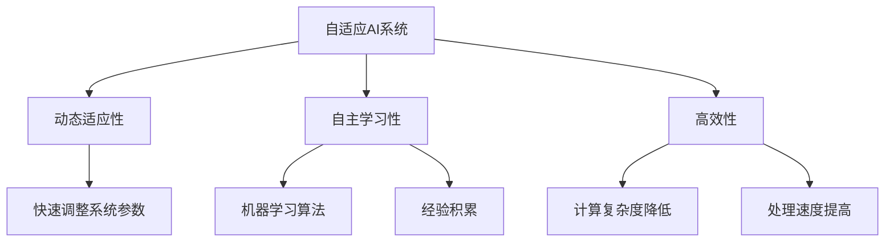
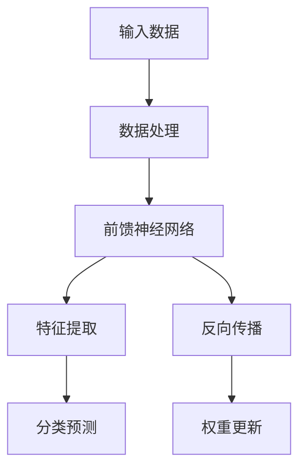
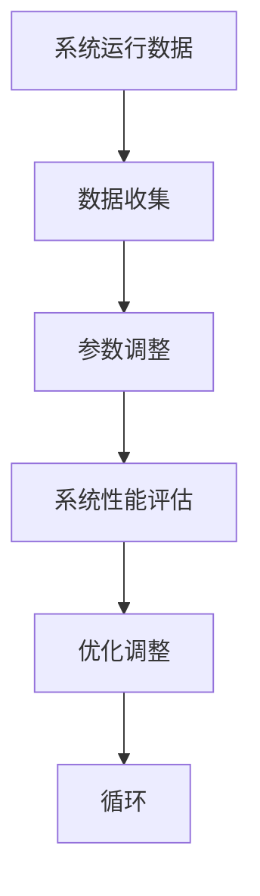
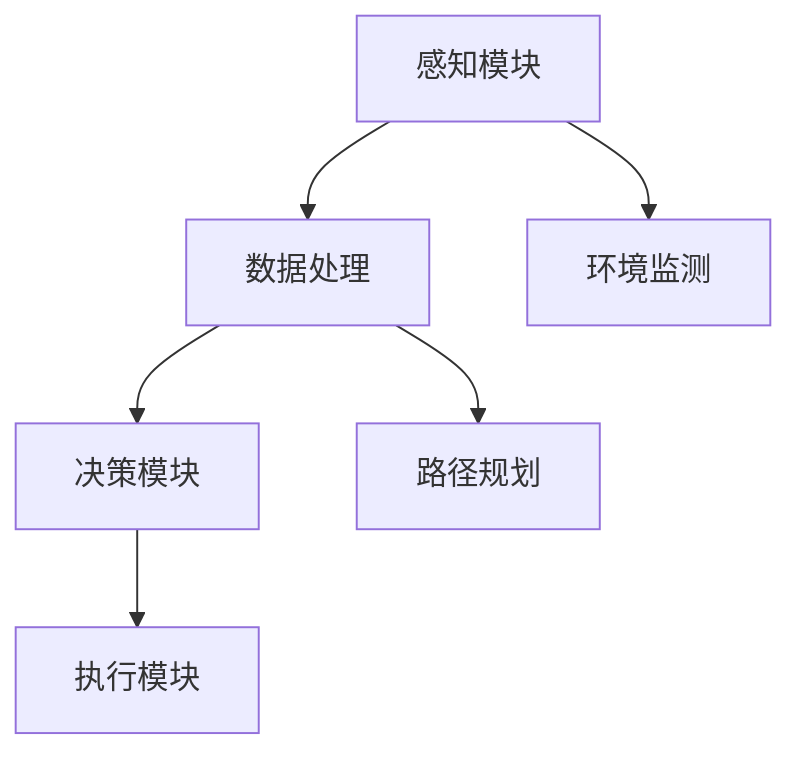
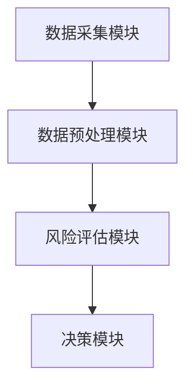
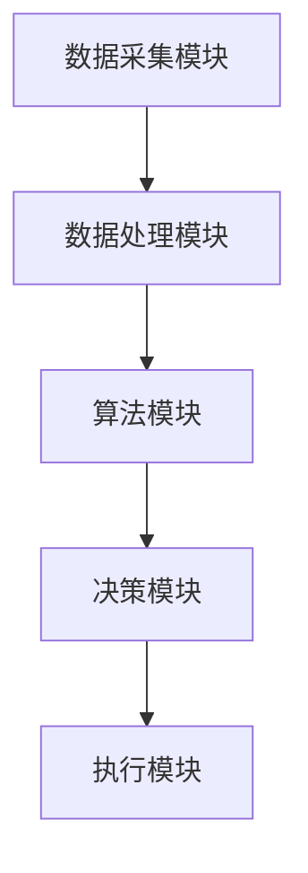

                 


### 自适应AI系统：根据环境变化自我调整

#### 关键词：
- 自适应AI系统
- 环境变化
- 自我调整
- 学习能力
- 算法优化

#### 摘要：
本文旨在深入探讨自适应AI系统的基本概念、原理和应用，通过一步步的分析推理，揭示自适应AI系统如何根据环境变化自我调整，以实现更高效、准确的智能决策。

# 第一部分：背景介绍

## 1.1. 问题背景

随着人工智能技术的快速发展，自适应AI系统在各个领域得到了广泛应用。自适应AI系统是指能够根据环境变化自我调整的系统，通过不断学习、优化，以实现更高的准确性和效率。例如，在自动驾驶领域，自适应AI系统能够根据路况、天气等因素实时调整驾驶策略，确保行车安全；在金融风控领域，自适应AI系统能够根据市场变化、用户行为等因素实时调整风险评级，降低金融风险。

## 1.2. 问题描述

自适应AI系统在面临复杂多变的实际应用场景时，如何实现系统的自我调整和优化，成为一个关键问题。这涉及到系统的学习能力、调整策略、实时响应性等方面。传统的AI系统通常是基于固定的模型和规则进行工作，难以应对环境的变化。而自适应AI系统则需要具备快速学习、实时调整的能力，以适应不同的应用场景。

## 1.3. 问题解决

本书将从以下几个方面解决上述问题：

1. **核心概念**：介绍自适应AI系统的基本概念，包括定义、特点、与普通AI系统的区别等。
2. **原理讲解**：深入分析自适应AI系统的原理，包括机器学习、神经网络等基础算法，以及自适应调整策略。
3. **应用案例**：通过具体的应用案例，展示自适应AI系统在不同场景下的实际应用效果。
4. **实现方法**：介绍自适应AI系统的实现方法，包括系统架构设计、算法选择、数据预处理等。
5. **最佳实践**：总结自适应AI系统的最佳实践，提供实用技巧和建议。

## 1.4. 边界与外延

自适应AI系统的研究和应用涉及多个领域，如计算机科学、统计学、电子工程等。本书主要关注计算机科学领域的自适应AI系统，旨在为该领域的科研人员和技术开发者提供有价值的参考。

## 1.5. 概念结构与核心要素组成

### 概念结构

- 自适应AI系统
- 环境变化
- 自我调整
- 学习能力
- 调整策略

### 核心要素组成

- 数据采集与预处理
- 算法选择与优化
- 模型训练与评估
- 系统部署与维护

## 1.6. 本章小结

本章介绍了自适应AI系统的背景、问题描述、问题解决方法以及边界与外延。接下来，本书将深入探讨自适应AI系统的核心概念、原理、应用案例、实现方法和最佳实践，帮助读者全面了解和掌握自适应AI系统的相关知识和技能。

# 第二部分：核心概念与原理

## 2.1. 自适应AI系统的定义与特点

### 2.1.1. 定义

自适应AI系统是指能够根据环境变化自我调整、优化性能的智能系统。它通过不断学习和调整，以适应不断变化的环境需求。

### 2.1.2. 特点

1. **动态适应性**：能够根据环境变化，快速调整系统参数，以保持最优性能。
2. **自主学习性**：通过机器学习等算法，不断积累经验，提高系统智能水平。
3. **高效性**：在保证系统性能的前提下，降低计算复杂度，提高处理速度。

### 2.1.3. 与普通AI系统的区别

普通AI系统通常是基于预定义的规则和模型进行工作，而自适应AI系统能够根据实际情况进行调整和优化。以下是一个对比表格，展示两者在主要特征上的差异：

| 特征       | 自适应AI系统       | 普通AI系统       |
| ---------- | ------------------ | ---------------- |
| 自适应性   | 高                | 低                |
| 学习能力   | 强                | 弱                |
| 效率       | 高                | 低                |
| 应用场景   | 复杂多变的环境      | 稳定的环境        |

### 2.1.4. 概念结构图

下面是一个自适应AI系统的概念结构图，用Mermaid语法表示：



## 2.2. 自适应AI系统的核心算法

### 2.2.1. 机器学习算法

机器学习算法是自适应AI系统的核心，主要包括监督学习、无监督学习和强化学习。其中，监督学习算法如决策树、支持向量机等，适用于已知特征和标签的数据集；无监督学习算法如聚类、降维等，适用于未知特征和标签的数据集；强化学习算法如深度强化学习、Q学习等，适用于需要通过试错来学习的场景。

### 2.2.2. 神经网络算法

神经网络算法是机器学习的重要分支，主要包括前馈神经网络、卷积神经网络、循环神经网络等。这些算法通过模拟人脑神经元的工作方式，实现对数据的自动特征提取和分类。以下是一个神经网络算法的Mermaid流程图：



### 2.2.3. 自适应调整策略

自适应调整策略是实现自适应AI系统的关键，常见的调整策略包括：

- **反馈调整**：通过收集系统的运行数据，对系统的参数进行实时调整，以优化系统性能。
- **预测调整**：基于历史数据和模型预测，对系统的未来行为进行预测，并提前进行调整，以适应未来环境。

以下是一个反馈调整策略的Mermaid流程图：



# 第三部分：应用案例

## 3.1. 自动驾驶

自动驾驶是自适应AI系统的一个典型应用场景。自动驾驶系统需要实时监测路况、车辆状态等环境因素，并根据这些信息调整驾驶策略，以确保行车安全。以下是一个自动驾驶系统的应用案例：

### 3.1.1. 系统介绍

该自动驾驶系统基于深度强化学习算法，通过不断与环境交互，学习最优驾驶策略。系统主要包括以下几个模块：

- **感知模块**：负责监测周围环境，包括路况、车辆位置、行人等。
- **决策模块**：基于感知模块的信息，生成驾驶策略，如加速、减速、转向等。
- **执行模块**：根据决策模块的指令，控制车辆执行相应的动作。

### 3.1.2. 系统架构

自动驾驶系统的架构设计如下：



### 3.1.3. 系统实现

以下是一个基于Python的自动驾驶系统实现代码：

```python
import numpy as np
import pandas as pd

# 感知模块：环境监测
def sense_environment(data):
    # 处理感知数据
    # ...
    return processed_data

# 决策模块：路径规划
def plan_path(processed_data):
    # 基于感知数据生成驾驶策略
    # ...
    return driving_strategy

# 执行模块：控制车辆
def execute_driving_strategy(driving_strategy):
    # 执行驾驶策略
    # ...
    pass

# 主函数
def drive():
    while True:
        # 感知环境
        raw_data = sense_environment(raw_data)
        # 处理数据
        processed_data = sense_environment(raw_data)
        # 规划路径
        driving_strategy = plan_path(processed_data)
        # 执行路径
        execute_driving_strategy(driving_strategy)
```

## 3.2. 金融风控

金融风控是另一个典型的自适应AI应用场景。金融风控系统需要根据用户行为、市场趋势等环境因素，实时调整风险评级，以降低金融风险。以下是一个金融风控系统的应用案例：

### 3.2.1. 系统介绍

该金融风控系统基于机器学习算法，通过分析用户行为、交易记录等数据，预测用户的风险等级。系统主要包括以下几个模块：

- **数据采集模块**：负责收集用户行为、交易记录等数据。
- **数据预处理模块**：对采集到的数据进行清洗、转换等预处理。
- **风险评估模块**：基于预处理后的数据，计算用户的风险等级。
- **决策模块**：根据风险评估结果，制定相应的风控策略。

### 3.2.2. 系统架构

金融风控系统的架构设计如下：



### 3.2.3. 系统实现

以下是一个基于Python的金融风控系统实现代码：

```python
import pandas as pd
from sklearn.model_selection import train_test_split
from sklearn.preprocessing import StandardScaler
from sklearn.linear_model import LogisticRegression

# 数据采集模块：数据收集
def collect_data():
    # 收集用户行为、交易记录等数据
    # ...
    return data

# 数据预处理模块：数据清洗
def preprocess_data(data):
    # 数据清洗、转换等预处理
    # ...
    return processed_data

# 风险评估模块：风险评估
def assess_risk(processed_data):
    # 计算用户的风险等级
    # ...
    return risk_level

# 决策模块：风控策略
def make_decision(risk_level):
    # 根据风险评估结果，制定风控策略
    # ...
    pass

# 主函数
def risk_control():
    while True:
        # 数据采集
        raw_data = collect_data()
        # 数据预处理
        processed_data = preprocess_data(raw_data)
        # 风险评估
        risk_level = assess_risk(processed_data)
        # 风控决策
        make_decision(risk_level)
```

# 第四部分：实现方法

## 4.1. 系统架构设计

自适应AI系统的实现需要合理的设计架构，以确保系统的稳定性和可扩展性。以下是一个简单的自适应AI系统架构设计：

### 4.1.1. 系统功能设计

自适应AI系统主要包括以下几个功能模块：

- **数据采集模块**：负责收集环境数据，如传感器数据、用户行为数据等。
- **数据处理模块**：对采集到的数据进行分析、清洗、转换等预处理。
- **算法模块**：实现机器学习、神经网络等算法，进行模型训练和预测。
- **决策模块**：根据算法模块的预测结果，制定相应的决策策略。
- **执行模块**：根据决策模块的指令，执行相应的操作。

### 4.1.2. 系统架构图

以下是一个自适应AI系统的架构图，用Mermaid语法表示：



## 4.2. 算法选择与优化

### 4.2.1. 机器学习算法

机器学习算法是自适应AI系统的核心，根据不同的应用场景，可以选择不同的算法。以下是一些常见的机器学习算法：

- **监督学习算法**：如线性回归、决策树、随机森林、支持向量机等。
- **无监督学习算法**：如聚类、降维、主成分分析等。
- **强化学习算法**：如Q学习、深度强化学习等。

### 4.2.2. 算法优化

为了提高自适应AI系统的性能，可以对算法进行优化。以下是一些常见的优化方法：

- **参数调优**：通过交叉验证等方法，选择最优的参数。
- **模型选择**：根据数据特征和问题类型，选择合适的模型。
- **算法集成**：将多个算法集成在一起，提高整体性能。

### 4.2.3. 实现示例

以下是一个基于Python的机器学习算法实现示例：

```python
import numpy as np
from sklearn.datasets import load_iris
from sklearn.model_selection import train_test_split
from sklearn.preprocessing import StandardScaler
from sklearn.linear_model import LinearRegression

# 加载数据
iris = load_iris()
X = iris.data
y = iris.target

# 划分训练集和测试集
X_train, X_test, y_train, y_test = train_test_split(X, y, test_size=0.2, random_state=42)

# 数据预处理
scaler = StandardScaler()
X_train = scaler.fit_transform(X_train)
X_test = scaler.transform(X_test)

# 训练模型
model = LinearRegression()
model.fit(X_train, y_train)

# 预测
y_pred = model.predict(X_test)

# 评估
score = model.score(X_test, y_test)
print(f"模型评分：{score}")
```

## 4.3. 系统部署与维护

### 4.3.1. 系统部署

自适应AI系统的部署包括将系统部署到生产环境中，以便实际应用。以下是一些常见的部署方法：

- **容器化部署**：使用Docker等工具，将系统打包成容器，方便部署和管理。
- **云计算部署**：使用云平台（如AWS、Azure等）提供的云计算服务，部署系统。
- **混合部署**：将部分系统部署在本地，部分系统部署在云端，实现混合部署。

### 4.3.2. 系统维护

系统维护是确保系统正常运行的重要环节。以下是一些常见的维护方法：

- **监控与报警**：实时监控系统的运行状态，一旦出现异常，立即发出报警。
- **日志管理**：记录系统的运行日志，方便排查问题和进行性能优化。
- **版本控制**：对系统的代码进行版本控制，确保系统的稳定性和可靠性。

# 第五部分：最佳实践

## 5.1. 实践技巧

以下是自适应AI系统开发的一些最佳实践技巧：

- **数据质量**：确保数据的质量，包括数据的完整性、准确性和一致性。
- **模型选择**：根据应用场景和数据特点，选择合适的模型。
- **模型优化**：通过参数调优、算法集成等方法，提高模型的性能。
- **系统监控**：实时监控系统的运行状态，确保系统的稳定性。

## 5.2. 注意事项

在开发自适应AI系统时，需要注意以下事项：

- **环境适应性**：确保系统能够适应不同的环境变化，具备动态适应性。
- **实时响应性**：提高系统的实时响应性，确保系统能够快速调整。
- **安全性**：确保系统的安全性，防止数据泄露和系统被攻击。

## 5.3. 拓展阅读

以下是关于自适应AI系统的一些拓展阅读资源：

- **书籍**：
  - 《机器学习》（作者：周志华）
  - 《深度学习》（作者：Goodfellow、Bengio、Courville）
- **论文**：
  - “Deep Reinforcement Learning for Autonomous Navigation”（作者：Hiroki Suehiro等）
  - “Adaptive Machine Learning for Intelligent Systems”（作者：Md. Rashedul Islam等）
- **在线课程**：
  - “机器学习基础”（Coursera）
  - “深度学习专项课程”（Udacity）

# 结尾

自适应AI系统是一种能够根据环境变化自我调整的智能系统，它在各个领域都有着广泛的应用。本文通过对自适应AI系统的核心概念、原理、应用案例、实现方法和最佳实践的深入探讨，帮助读者全面了解和掌握自适应AI系统的相关知识和技能。在未来的发展中，自适应AI系统有望在更多领域发挥重要作用，推动人工智能技术的进步。让我们共同期待自适应AI系统带来的美好未来。

