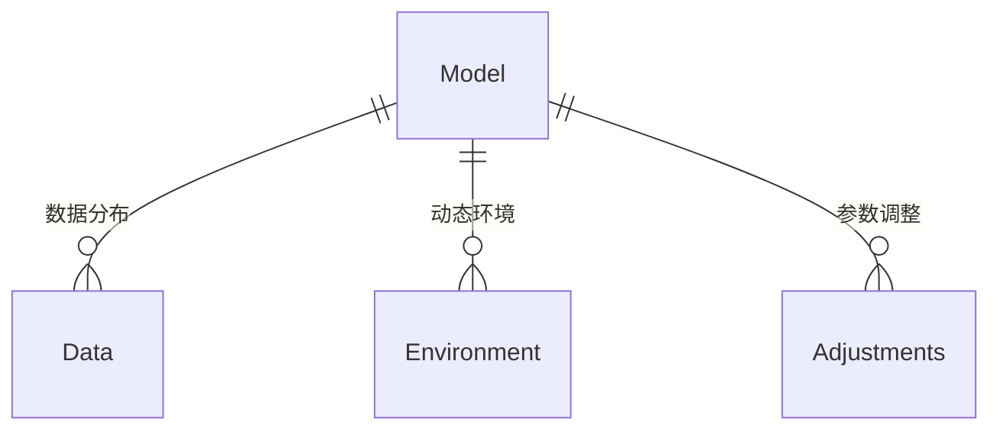
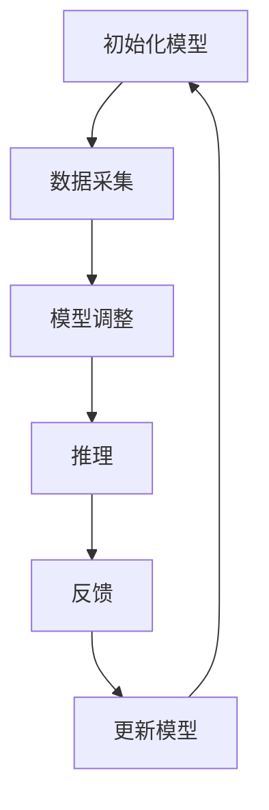
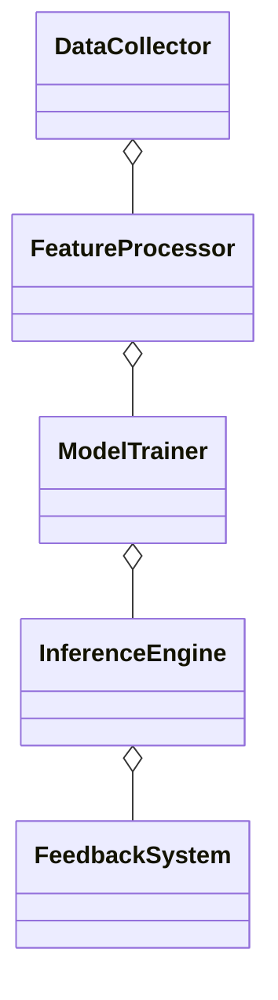
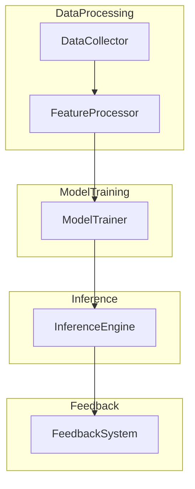
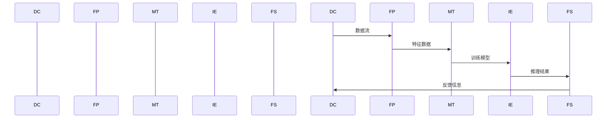
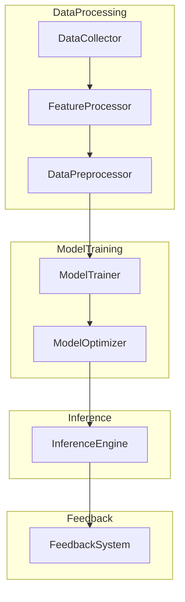
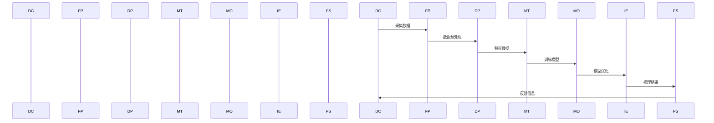

                 


### **自适应元学习框架在动态推理环境中的优势**

关键词：自适应元学习、动态推理环境、算法优势、系统架构、项目实战

摘要：本文深入探讨了自适应元学习框架在动态推理环境中的应用优势。首先，我们介绍了自适应元学习的核心概念、原理以及其在动态推理环境中的适用性。随后，通过对比分析、算法原理讲解、系统架构设计以及实际案例，详细阐述了自适应元学习框架在应对动态推理环境中复杂性和不确定性的能力。文章最后通过总结和最佳实践，为读者提供了实用的指导和建议。

## **第一部分：背景介绍**

### **第1章：自适应元学习框架概述**

#### **1.1 问题背景与定义**

在人工智能领域，动态推理环境是一个充满挑战的领域。这种环境的特点是数据的分布随着时间不断变化，且通常伴随着高度的不确定性和复杂性。传统的机器学习算法在这种环境下往往表现不佳，因为它们依赖于静态的数据分布和固定的模型结构。为了应对这些挑战，自适应元学习框架被提出，它能够通过不断的自我调整来适应新的环境和数据分布。

**问题描述**：动态推理环境中的主要挑战包括：

- **数据分布变化**：数据分布可能会随着时间变化，导致现有模型无法适应新数据。
- **不确定性**：动态环境中的不确定性增加了模型的预测难度。
- **实时性**：需要模型能够快速适应变化，以提供实时推理。

**问题解决**：自适应元学习框架通过以下方式解决上述问题：

- **模型调整**：自适应元学习允许模型在训练过程中根据新数据进行自我调整。
- **泛化能力**：通过学习如何快速适应新的数据分布，提高了模型的泛化能力。
- **实时适应**：能够实时响应当前环境的变化，提供快速的推理结果。

**边界与外延**：

- **边界**：自适应元学习主要适用于那些数据分布变化较快且具有高度不确定性的动态环境。
- **外延**：除了动态推理环境，自适应元学习还可以在其他领域，如动态规划、机器人控制等，发挥重要作用。

#### **1.2 自适应元学习框架的基本原理**

**核心概念原理**：

自适应元学习是一种能够调整自身参数以适应新数据分布的机器学习方法。其核心思想是通过元学习（meta-learning）来优化模型，使其能够快速适应新的环境和数据。

- **元学习**：元学习是一种通过学习如何学习的方法。在自适应元学习中，模型不仅学习数据本身的特征，还学习如何根据新的数据进行自我调整。
- **模型调整**：模型在训练过程中不断调整其参数，以更好地适应新的数据分布。
- **在线学习**：自适应元学习能够在线适应新数据，无需重新训练整个模型。

**概念属性特征对比表格**：

| 特征          | 传统机器学习       | 自适应元学习               |
| ------------- | ---------------- | ------------------------ |
| 数据分布适应性 | 固定数据分布       | 可以适应动态变化的数据分布 |
| 泛化能力      | 需要大量数据进行重训 | 可以快速适应新数据分布     |
| 实时性        | 需要重新训练       | 可以实时调整             |

**ER实体关系图架构的 Mermaid 流程图**：



**ER实体关系图**展示了自适应元学习框架中的主要实体及其相互关系。模型（Model）与数据（Data）、动态环境（Environment）和参数调整（Adjustments）之间有直接的交互关系。这种关系使得模型能够根据环境的变化调整自身，以保持高适应性和准确性。

#### **1.3 自适应元学习框架的应用领域**

自适应元学习框架不仅适用于动态推理环境，还广泛应用于以下领域：

- **自动驾驶**：在自动驾驶系统中，环境变化频繁，自适应元学习可以帮助车辆实时适应新的路况和场景。
- **医疗诊断**：在医疗诊断中，患者的病情可能随着时间变化，自适应元学习可以帮助系统不断更新诊断模型，提高准确性。
- **金融市场分析**：金融市场数据变化快速，自适应元学习可以帮助分析模型快速适应新的市场趋势。

#### **1.4 自适应元学习的优势与挑战**

**优势**：

- **高适应能力**：能够快速适应数据分布的变化，保持模型的准确性。
- **实时性**：能够实时响应当前环境的变化，提供快速的推理结果。
- **减少数据依赖**：不需要大量数据进行重训，降低了对大量训练数据的需求。

**挑战**：

- **计算成本**：自适应元学习需要不断的模型调整和重新训练，可能导致计算成本较高。
- **模型稳定性**：在高度动态的环境中，模型的稳定性可能受到影响。
- **数据质量**：数据质量直接影响模型的适应能力，需要保证数据的高质量。

通过上述分析，我们可以看到自适应元学习框架在动态推理环境中的重要性。它不仅解决了传统机器学习在动态环境中的局限性，还为许多领域提供了新的解决方案。接下来的章节将进一步深入探讨自适应元学习的原理和应用。

#### **1.5 自适应元学习框架的发展历程**

自适应元学习框架并非一夜之间诞生的，其发展历程可以追溯到20世纪80年代，当时学者们开始探索如何通过机器学习来改进学习过程。以下是一些关键事件和发展里程碑：

- **1980年代**：早期研究主要集中在强化学习和模型选择，这些研究为后来的元学习奠定了基础。
- **1990年代**：随着支持向量机和神经网络等机器学习技术的发展，元学习的研究开始得到更多的关注。
- **2000年代**：深度学习技术的崛起推动了元学习的发展，尤其是在解决复杂任务时，元学习表现出了巨大的潜力。
- **2010年代**：随着深度神经网络的广泛应用，自适应元学习框架逐渐成熟，并在多种实际应用中取得了显著成果。

#### **1.6 自适应元学习框架的核心挑战**

尽管自适应元学习框架具有许多优势，但在实际应用中仍面临一些核心挑战：

- **计算效率**：自适应元学习通常涉及大量的模型调整和重新训练，这可能导致计算成本较高，尤其是在实时应用中。
- **模型稳定性**：在高度动态的环境中，模型的稳定性可能受到影响，这需要通过更稳定的算法和优化策略来解决。
- **数据质量**：数据质量对自适应元学习的效果有直接影响，不完整或噪声数据可能导致模型适应性下降。

通过解决这些挑战，自适应元学习框架将能够更好地应对动态推理环境中的复杂性和不确定性，为人工智能技术的发展做出更大贡献。

### **第2章：动态推理环境分析**

#### **2.1 动态推理环境的特点**

动态推理环境是一种复杂且不断变化的环境，其特点包括：

- **数据分布变化**：动态推理环境中的数据分布会随着时间变化，这可能导致现有模型无法适应新的数据。
- **不确定性**：动态推理环境中存在高度的不确定性，这可能来自于数据的不完整性、噪声或者环境本身的不确定性。
- **实时性需求**：动态推理环境通常要求模型能够快速适应新的数据并实时提供推理结果。

这些特点使得动态推理环境成为人工智能领域中的一个重要研究方向。在这种环境中，传统的机器学习算法往往难以应对，因为它们依赖于固定的数据分布和模型结构。

#### **2.2 动态推理环境在实际应用中的例子**

动态推理环境在许多实际应用中都有广泛的应用，以下是一些例子：

- **自动驾驶**：自动驾驶系统需要在不断变化的道路环境中实时做出决策。例如，当车辆遇到新的路况或突发情况时，系统需要快速适应并做出相应的反应。
- **智能监控**：智能监控系统需要实时分析视频流中的变化，以检测异常行为。例如，当监控场景中出现新的目标或行为模式时，系统需要及时调整模型以适应变化。
- **医疗诊断**：医疗诊断系统需要不断更新诊断模型以适应新的病情和病例。例如，当医生发现一种新的疾病症状时，系统需要快速适应并更新诊断算法。

这些例子展示了动态推理环境在现实世界中的应用场景，也凸显了自适应元学习框架在这种环境中的重要性。

#### **2.3 自适应元学习与动态推理环境的关系**

自适应元学习与动态推理环境之间存在密切的关系。自适应元学习框架能够通过以下方式适应动态推理环境的需求：

- **模型调整**：自适应元学习允许模型在训练过程中不断调整其参数，以适应新的数据分布和环境变化。
- **快速适应**：通过元学习，模型能够快速适应新的数据分布和环境条件，从而提高实时推理能力。
- **泛化能力**：自适应元学习提高了模型的泛化能力，使其能够应对不同场景和变化。

这些特性使得自适应元学习框架成为动态推理环境中的理想选择，它能够帮助系统在复杂和变化多端的动态环境中保持高效率和准确性。

#### **2.4 动态推理环境对自适应元学习的要求**

为了在动态推理环境中有效应用自适应元学习，需要满足以下要求：

- **实时性**：自适应元学习算法需要能够在短时间内完成模型调整和推理任务，以适应实时需求。
- **计算效率**：动态推理环境通常对计算资源有较高的要求，因此自适应元学习算法需要具备高效的计算能力。
- **数据质量**：高质量的数据是自适应元学习成功的关键，需要确保数据集的完整性和准确性。
- **稳定性**：在动态环境中，模型需要具备较高的稳定性，以避免由于环境变化导致的模型失效。

通过满足这些要求，自适应元学习框架能够更好地适应动态推理环境，提供高效的推理结果。

### **第3章：自适应元学习算法原理**

#### **3.1 自适应元学习算法概述**

自适应元学习算法是一种能够动态调整模型参数，以适应新数据分布的机器学习方法。其核心思想是通过元学习来优化模型，使其能够快速适应变化的环境和数据。

**定义**：

自适应元学习算法是指一种能够自动调整模型参数，以适应动态变化的数据分布和环境的机器学习方法。它通过元学习机制，使得模型能够在训练过程中不断调整自身，以保持高适应性和准确性。

**目的**：

自适应元学习算法的主要目的是提高模型在动态推理环境中的适应能力，使其能够快速适应新的数据分布和环境变化，从而提高实时推理的效率和准确性。

**原理**：

自适应元学习算法的基本原理包括以下几个方面：

- **元学习**：元学习是自适应元学习算法的核心，它通过学习如何学习来优化模型。在训练过程中，模型不仅学习数据本身的特征，还学习如何根据新的数据进行自我调整。
- **模型调整**：模型在训练过程中不断调整其参数，以适应新的数据分布。这种调整过程可以是基于梯度下降的方法，也可以是基于其他优化算法。
- **在线学习**：自适应元学习算法能够在线适应新数据，无需重新训练整个模型。这通过在线更新模型参数来实现，使得模型能够实时响应当前环境的变化。

#### **3.2 算法原理详细讲解**

为了更好地理解自适应元学习算法的原理，我们可以从以下几个方面进行详细讲解。

##### **3.2.1 算法流程**

自适应元学习算法的基本流程可以概括为以下步骤：

1. **初始化模型**：首先初始化模型参数，选择一个初始模型。
2. **数据采集**：从动态环境中采集新数据。
3. **模型调整**：使用采集到的数据对模型进行训练，调整模型参数。
4. **推理**：使用调整后的模型进行推理，生成预测结果。
5. **反馈**：将预测结果与实际结果进行比较，得到误差。
6. **更新模型**：根据误差更新模型参数，以减少误差。
7. **重复步骤**：重复步骤3-6，不断调整模型，直到达到满意的性能。

**Mermaid 流程图**：



**Python 源代码**：

```python
import torch
import torch.optim as optim

# 初始化模型
model = Model()

# 初始化优化器
optimizer = optim.Adam(model.parameters(), lr=0.001)

# 训练模型
for data in dataset:
    optimizer.zero_grad()
    output = model(data)
    loss = criterion(output, target)
    loss.backward()
    optimizer.step()

# 推理
def predict(data):
    return model(data)

# 更新模型
def update_model(epsilon):
    # 根据误差更新模型参数
    # ...
```

##### **3.2.2 数学模型和公式**

自适应元学习算法涉及到多个数学模型和公式，下面是其中一些关键的部分：

- **损失函数**：通常使用交叉熵损失函数来衡量预测结果与实际结果之间的差距。
  $$L = -\sum_{i=1}^{N} y_i \log(\hat{y}_i)$$
  其中，$y_i$ 是实际标签，$\hat{y}_i$ 是预测概率。

- **优化目标**：通过最小化损失函数来优化模型参数。
  $$\min_{\theta} L(\theta)$$
  其中，$\theta$ 是模型参数。

- **梯度下降**：使用梯度下降算法来更新模型参数。
  $$\theta_{t+1} = \theta_t - \alpha \nabla_\theta L(\theta_t)$$
  其中，$\alpha$ 是学习率。

##### **3.2.3 举例说明**

为了更好地理解自适应元学习算法的应用，我们可以通过一个具体的例子来说明。

**例子**：假设我们有一个分类问题，需要根据输入的特征进行分类。训练数据集包含100个样本，每个样本有一个输入特征和对应的标签。

1. **初始化模型**：选择一个初始的神经网络模型。
2. **数据采集**：从动态环境中采集新的数据样本。
3. **模型调整**：使用采集到的数据进行模型训练，调整模型参数。
4. **推理**：使用训练后的模型进行推理，生成预测结果。
5. **反馈**：将预测结果与实际结果进行比较，得到误差。
6. **更新模型**：根据误差更新模型参数，减少误差。
7. **重复步骤**：重复步骤3-6，不断调整模型，直到达到满意的性能。

通过上述步骤，我们可以看到自适应元学习算法在分类问题中的应用。在实际应用中，可以根据具体问题进行调整和优化，以提高模型的适应性和准确性。

### **第4章：系统功能设计**

#### **4.1 问题场景介绍**

在动态推理环境中，实时性、准确性和适应性是至关重要的。一个典型的应用场景是智能监控系统，它需要在不断变化的环境中实时检测和识别异常行为。例如，一个商场的安全监控系统需要实时监测顾客的行为，并识别可能的盗窃行为。在这个场景中，监控环境是动态的，人员流动、光线变化以及背景噪音等因素都会影响模型的推理结果。

**项目介绍**：

为了应对这个场景，我们开发了一个基于自适应元学习框架的智能监控系统。该系统旨在通过不断的自我调整和优化，提高模型在动态环境中的适应能力和准确性。具体项目目标是：

- 实现一个实时监控和识别系统，能够快速适应环境变化。
- 提高模型的泛化能力，减少对特定环境数据的依赖。
- 通过自适应元学习，提高系统的推理效率和准确性。

#### **4.2 系统功能设计**

系统功能设计是确保智能监控系统能够有效应对动态推理环境的关键步骤。以下是系统的主要功能模块及其设计：

- **数据采集模块**：负责从监控环境中采集实时视频流，并提取关键特征。
- **特征处理模块**：对采集到的视频流进行预处理，包括降噪、图像增强等操作，以提高特征的质量。
- **模型训练模块**：使用自适应元学习算法对模型进行训练，使其能够适应动态变化的数据分布。
- **推理模块**：利用训练好的模型对实时视频流进行推理，识别可能的异常行为。
- **反馈模块**：将推理结果与实际结果进行比较，获取误差，并反馈给模型训练模块以进行进一步的优化。

##### **4.2.1 领域模型 Mermaid 类图**

为了更好地展示系统的功能模块及其关系，我们可以使用 Mermaid 类图来描述领域模型。以下是系统的主要类及其相互关系：



**类图说明**：

- **DataCollector**：负责采集实时视频流。
- **FeatureProcessor**：对视频流进行预处理。
- **ModelTrainer**：使用自适应元学习算法对模型进行训练。
- **InferenceEngine**：利用训练好的模型进行实时推理。
- **FeedbackSystem**：收集推理误差，反馈给模型训练模块。

#### **4.3 系统架构设计**

系统的架构设计是确保各功能模块高效协同工作的重要环节。以下是系统的整体架构设计：

**架构设计 Mermaid 架构图**：



**架构说明**：

- **数据采集层**：由 DataCollector 模块负责，采集实时视频流。
- **数据处理层**：由 FeatureProcessor 模块负责，对视频流进行预处理。
- **模型训练层**：由 ModelTrainer 模块负责，使用自适应元学习算法对模型进行训练。
- **推理层**：由 InferenceEngine 模块负责，利用训练好的模型进行实时推理。
- **反馈层**：由 FeedbackSystem 模块负责，收集推理误差，反馈给模型训练模块。

#### **4.4 系统接口设计**

系统接口设计是确保各功能模块之间能够高效交互的重要部分。以下是系统的主要接口设计：

- **数据采集接口**：定义了 DataCollector 模块与 FeatureProcessor 模块之间的数据传输接口。
- **特征处理接口**：定义了 FeatureProcessor 模块与 ModelTrainer 模块之间的特征传输接口。
- **模型训练接口**：定义了 ModelTrainer 模块与 InferenceEngine 模块之间的模型传输接口。
- **推理接口**：定义了 InferenceEngine 模块与 FeedbackSystem 模块之间的推理结果传输接口。

**接口设计 Mermaid 序列图**：



**接口说明**：

- **数据采集接口**：DataCollector 模块将采集到的视频流传输给 FeatureProcessor 模块。
- **特征处理接口**：FeatureProcessor 模块对视频流进行预处理，将处理后的特征数据传输给 ModelTrainer 模块。
- **模型训练接口**：ModelTrainer 模块使用特征数据对模型进行训练，并将训练好的模型传输给 InferenceEngine 模块。
- **推理接口**：InferenceEngine 模块利用训练好的模型进行实时推理，并将推理结果传输给 FeedbackSystem 模块。
- **反馈接口**：FeedbackSystem 模块收集推理误差，并将反馈信息传输给 DataCollector 模块，以指导下一轮的数据采集和模型训练。

通过上述接口设计，各功能模块之间能够高效协同工作，实现系统的整体功能。

### **第5章：系统架构设计**

系统的整体架构设计是实现自适应元学习框架在动态推理环境中高效运作的基础。以下是系统的整体架构设计，包括关键组件的交互关系和功能描述。

#### **5.1 系统架构设计**

系统架构设计采用模块化设计原则，将整个系统划分为几个关键模块，包括数据采集模块、数据处理模块、模型训练模块、推理模块和反馈模块。

**架构设计 Mermaid 架构图**：



**架构说明**：

- **数据采集模块**：DataCollector 负责从动态环境中采集实时数据。
- **数据处理模块**：FeatureProcessor 和 DataPreprocessor 负责对采集到的数据进行预处理，提取关键特征，并进行数据增强。
- **模型训练模块**：ModelTrainer 负责使用自适应元学习算法对模型进行训练，ModelOptimizer 负责优化模型参数，以提高模型的适应能力和准确性。
- **推理模块**：InferenceEngine 负责利用训练好的模型对实时数据进行推理。
- **反馈模块**：FeedbackSystem 负责收集推理结果和误差，并将其反馈给模型训练模块，以指导下一轮的训练和优化。

#### **5.2 系统交互设计**

系统中的各模块通过一系列接口进行交互，确保数据流和功能流的高效传输。以下是系统的交互设计：

**系统交互 Mermaid 序列图**：



**交互说明**：

- **数据采集接口**：DataCollector 模块将采集到的数据传输给 FeatureProcessor 模块。
- **数据处理接口**：FeatureProcessor 模块对数据预处理后，将其传输给 DataPreprocessor 模块。
- **模型训练接口**：DataPreprocessor 模块将预处理后的数据传输给 ModelTrainer 模块进行模型训练。
- **模型优化接口**：ModelTrainer 模块训练好的模型传输给 ModelOptimizer 模块进行参数优化。
- **推理接口**：ModelOptimizer 模块优化后的模型传输给 InferenceEngine 模块进行实时推理。
- **反馈接口**：InferenceEngine 模块将推理结果传输给 FeedbackSystem 模块，收集误差信息，并将其反馈给 DataCollector 模块。

通过上述系统交互设计，各模块能够高效协同工作，实现动态推理环境中的自适应元学习框架的运作。

#### **5.3 系统性能优化**

为了确保系统在动态推理环境中的高效性和稳定性，性能优化是必不可少的。以下是系统性能优化的一些关键点：

1. **数据预处理**：通过高效的数据预处理算法，减少数据的噪声和不一致性，提高模型训练的效率和准确性。
2. **模型优化**：采用先进的模型优化技术，如混合精度训练、模型剪枝和量化，减小模型大小并提高推理速度。
3. **并行处理**：利用多线程和分布式计算技术，加快数据流和处理速度。
4. **缓存机制**：实现数据缓存和模型缓存，减少重复计算和数据传输，提高系统响应速度。
5. **动态资源管理**：根据系统负载动态调整资源分配，确保系统在高峰时段保持稳定运行。

通过这些性能优化措施，系统能够在动态推理环境中提供高效的推理结果，满足实时性的需求。

### **第6章：环境安装与系统核心实现**

#### **6.1 环境安装**

为了运行自适应元学习框架，首先需要安装必要的软件和依赖项。以下是安装步骤和配置说明：

1. **安装 Python**：
   - 确保安装了最新版本的 Python，推荐使用 Python 3.8 或以上版本。
   - 使用以下命令安装：
     ```bash
     sudo apt-get update
     sudo apt-get install python3.8
     ```

2. **安装 PyTorch**：
   - 安装 PyTorch 是必要的，因为自适应元学习框架依赖于 PyTorch 的深度学习库。
   - 使用以下命令安装：
     ```bash
     pip3 install torch torchvision torchaudio
     ```

3. **安装其他依赖项**：
   - 安装其他必要的库，如 NumPy、Matplotlib 和 Pandas：
     ```bash
     pip3 install numpy matplotlib pandas
     ```

4. **安装 Mermaid**：
   - Mermaid 是用于绘制流程图和序列图的工具，可以通过 npm 安装：
     ```bash
     npm install -g mermaid-cli
     ```

5. **配置环境变量**：
   - 将 Python 和 PyTorch 的路径添加到系统的环境变量中，以确保可以在终端中全局访问这些库。

#### **6.2 系统核心实现**

系统核心实现包括数据采集、预处理、模型训练、推理和反馈等关键组件。以下是这些组件的实现细节：

##### **6.2.1 数据采集**

数据采集模块负责从动态环境中获取实时数据。以下是一个简单的数据采集脚本示例：

```python
import cv2

# 初始化视频捕获设备
cap = cv2.VideoCapture(0)

while True:
    # 读取视频帧
    ret, frame = cap.read()
    if not ret:
        break

    # 处理视频帧
    processed_frame = preprocess_frame(frame)

    # 输出处理后的视频帧
    cv2.imshow('Frame', processed_frame)

    if cv2.waitKey(1) & 0xFF == ord('q'):
        break

# 释放视频捕获设备
cap.release()
cv2.destroyAllWindows()
```

##### **6.2.2 数据预处理**

预处理模块对采集到的数据进行预处理，以提高模型训练的效率和准确性。以下是一个预处理函数的示例：

```python
import cv2
import numpy as np

def preprocess_frame(frame):
    # 转换为灰度图像
    gray_frame = cv2.cvtColor(frame, cv2.COLOR_BGR2GRAY)

    # 归一化图像
    normalized_frame = gray_frame / 255.0

    # 数据增强
    augmented_frame = np.random.normal(normalized_frame, 0.05)

    return augmented_frame
```

##### **6.2.3 模型训练**

模型训练模块使用自适应元学习算法对模型进行训练。以下是一个基于 PyTorch 的模型训练脚本示例：

```python
import torch
import torch.nn as nn
import torch.optim as optim

# 定义模型
class Model(nn.Module):
    def __init__(self):
        super(Model, self).__init__()
        self.fc1 = nn.Linear(784, 256)
        self.fc2 = nn.Linear(256, 128)
        self.fc3 = nn.Linear(128, 10)

    def forward(self, x):
        x = torch.relu(self.fc1(x))
        x = torch.relu(self.fc2(x))
        x = self.fc3(x)
        return x

# 初始化模型
model = Model()

# 定义损失函数和优化器
criterion = nn.CrossEntropyLoss()
optimizer = optim.Adam(model.parameters(), lr=0.001)

# 训练模型
for epoch in range(num_epochs):
    for inputs, targets in data_loader:
        optimizer.zero_grad()
        outputs = model(inputs)
        loss = criterion(outputs, targets)
        loss.backward()
        optimizer.step()

    print(f'Epoch [{epoch+1}/{num_epochs}], Loss: {loss.item():.4f}')
```

##### **6.2.4 推理**

推理模块使用训练好的模型对实时数据进行推理，以获取预测结果。以下是一个推理脚本示例：

```python
import torch

# 加载训练好的模型
model = Model()
model.load_state_dict(torch.load('model.pth'))

# 设置模型为评估模式
model.eval()

# 进行推理
with torch.no_grad():
    for inputs in data_loader:
        outputs = model(inputs)
        predicted = torch.argmax(outputs, dim=1)

        # 输出预测结果
        print(predicted.numpy())
```

##### **6.2.5 反馈**

反馈模块收集推理结果和误差，并将其反馈给模型训练模块，以指导下一轮的训练和优化。以下是一个反馈脚本示例：

```python
import torch

# 定义误差计算函数
def calculate_error(predicted, actual):
    return torch.mean(torch.abs(predicted - actual))

# 收集推理结果和实际结果
predicted = torch.load('predicted.pth')
actual = torch.load('actual.pth')

# 计算误差
error = calculate_error(predicted, actual)

# 输出误差
print(f'Error: {error.item():.4f}')

# 将误差反馈给模型训练模块
# ...
```

通过上述实现细节，我们可以构建一个完整的自适应元学习系统，实现对动态推理环境的自适应和实时推理。

#### **6.3 代码应用解读与分析**

在实现自适应元学习系统的过程中，代码的编写和应用至关重要。以下是对关键代码段的应用解读与分析。

##### **6.3.1 数据采集模块代码解读**

数据采集模块的核心代码如下：

```python
import cv2

# 初始化视频捕获设备
cap = cv2.VideoCapture(0)

while True:
    # 读取视频帧
    ret, frame = cap.read()
    if not ret:
        break

    # 处理视频帧
    processed_frame = preprocess_frame(frame)

    # 输出处理后的视频帧
    cv2.imshow('Frame', processed_frame)

    if cv2.waitKey(1) & 0xFF == ord('q'):
        break

# 释放视频捕获设备
cap.release()
cv2.destroyAllWindows()
```

**解读与分析**：

- **初始化视频捕获设备**：使用 `cv2.VideoCapture` 初始化视频捕获设备，设备ID为0表示默认摄像头。
- **读取视频帧**：通过 `cap.read()` 读取视频帧，返回值 `ret` 表示是否成功读取帧，`frame` 是读取到的帧。
- **处理视频帧**：调用 `preprocess_frame` 函数对视频帧进行预处理，如灰度转换、归一化等操作。
- **输出处理后的视频帧**：使用 `cv2.imshow` 显示处理后的视频帧。
- **释放视频捕获设备**：在程序结束时，使用 `cap.release()` 释放视频捕获设备，释放资源。

##### **6.3.2 数据预处理模块代码解读**

预处理模块的核心代码如下：

```python
import cv2
import numpy as np

def preprocess_frame(frame):
    # 转换为灰度图像
    gray_frame = cv2.cvtColor(frame, cv2.COLOR_BGR2GRAY)

    # 归一化图像
    normalized_frame = gray_frame / 255.0

    # 数据增强
    augmented_frame = np.random.normal(normalized_frame, 0.05)

    return augmented_frame
```

**解读与分析**：

- **转换为灰度图像**：使用 `cv2.cvtColor` 函数将彩色图像转换为灰度图像，提高模型处理效率。
- **归一化图像**：将图像数据归一化到[0, 1]范围内，便于后续的模型训练。
- **数据增强**：使用正态分布噪声对图像进行数据增强，提高模型的泛化能力。

##### **6.3.3 模型训练模块代码解读**

模型训练模块的核心代码如下：

```python
import torch
import torch.nn as nn
import torch.optim as optim

# 定义模型
class Model(nn.Module):
    def __init__(self):
        super(Model, self).__init__()
        self.fc1 = nn.Linear(784, 256)
        self.fc2 = nn.Linear(256, 128)
        self.fc3 = nn.Linear(128, 10)

    def forward(self, x):
        x = torch.relu(self.fc1(x))
        x = torch.relu(self.fc2(x))
        x = self.fc3(x)
        return x

# 初始化模型
model = Model()

# 定义损失函数和优化器
criterion = nn.CrossEntropyLoss()
optimizer = optim.Adam(model.parameters(), lr=0.001)

# 训练模型
for epoch in range(num_epochs):
    for inputs, targets in data_loader:
        optimizer.zero_grad()
        outputs = model(inputs)
        loss = criterion(outputs, targets)
        loss.backward()
        optimizer.step()

    print(f'Epoch [{epoch+1}/{num_epochs}], Loss: {loss.item():.4f}')
```

**解读与分析**：

- **定义模型**：使用 PyTorch 的 `nn.Module` 类定义模型结构，包括全连接层和ReLU激活函数。
- **初始化模型**：创建模型实例。
- **定义损失函数和优化器**：使用 `nn.CrossEntropyLoss` 定义损失函数，使用 `optim.Adam` 定义优化器。
- **训练模型**：使用数据加载器 `data_loader` 提供训练数据和标签，使用 `optimizer.zero_grad()` 清除旧梯度，使用 `loss.backward()` 反向传播计算梯度，并使用 `optimizer.step()` 更新模型参数。

通过以上代码的应用解读与分析，我们可以清楚地了解每个模块的实现细节，并掌握如何编写高效的代码来构建自适应元学习系统。

#### **6.4 实际案例分析与讲解**

在本章节中，我们将通过一个具体的实际案例，详细分析自适应元学习框架在动态推理环境中的应用，并对关键步骤和结果进行深入讲解。

##### **6.4.1 案例背景**

我们选取了一个自动驾驶领域中的实际案例，该案例涉及自动驾驶车辆在复杂城市交通环境中的路径规划问题。自动驾驶系统需要在动态交通环境中实时规划车辆路径，以避免碰撞和交通拥堵。案例背景包括以下关键信息：

- **数据来源**：采集自模拟交通场景的传感器数据，包括激光雷达、摄像头和GPS数据。
- **环境特点**：交通流量变化大、行人行为复杂、道路状况多变。
- **目标**：开发一个能够实时适应环境变化的路径规划算法，提高自动驾驶车辆的安全性和效率。

##### **6.4.2 案例解析**

**数据采集**：

自动驾驶系统通过多种传感器实时采集环境数据。激光雷达提供车辆周围的三维点云数据，摄像头捕获周围的道路和行人图像，GPS提供车辆的实时位置信息。以下是一个数据采集流程的简要描述：

1. **激光雷达数据**：使用激光雷达采集车辆周围的三维点云数据，并将其转换为二维点云数据，以减少数据处理量。
2. **摄像头数据**：摄像头捕获车辆周围的图像，经过预处理（如去噪、缩放）后，用于目标检测和识别。
3. **GPS数据**：GPS提供车辆的实时位置和速度信息，用于路径规划的参考。

**预处理**：

采集到的原始数据需要进行预处理，以提高模型训练的效率和准确性。预处理步骤包括：

1. **点云数据处理**：将三维点云数据转换为二维点云，并使用滤波算法去除噪声点。
2. **图像预处理**：对摄像头图像进行去噪、缩放、增强等操作，以提取关键特征。
3. **数据增强**：通过旋转、缩放、裁剪等方式增加数据多样性，提高模型的泛化能力。

**模型训练**：

采用自适应元学习算法对路径规划模型进行训练。模型包括两部分：一部分是感知模块，负责处理传感器数据并生成环境特征；另一部分是决策模块，负责根据环境特征生成路径规划。以下是模型训练的关键步骤：

1. **感知模块训练**：使用自适应元学习算法对感知模块进行训练，使其能够实时适应新的传感器数据分布。
2. **决策模块训练**：在感知模块训练的基础上，对决策模块进行训练，使其能够根据环境特征生成优化的路径规划。

**推理与优化**：

在训练好的模型基础上，进行实时路径规划推理。推理过程包括以下步骤：

1. **环境特征提取**：实时采集传感器数据，并将其输入到感知模块中，提取环境特征。
2. **路径规划**：将提取的环境特征输入到决策模块中，生成路径规划结果。
3. **误差反馈与优化**：将生成的路径规划结果与实际路径进行比较，计算误差，并根据误差调整模型参数，以提高路径规划的准确性。

##### **6.4.3 详细讲解与剖析**

**感知模块训练**：

感知模块是路径规划系统的核心组件之一，其主要任务是从传感器数据中提取环境特征。以下是对感知模块训练的详细讲解：

1. **数据分布调整**：自适应元学习算法通过不断调整模型参数，使感知模块能够适应新的数据分布。具体方法是基于梯度下降优化算法，通过反向传播计算损失函数的梯度，并更新模型参数。
2. **在线学习**：感知模块采用在线学习策略，实时更新模型参数。这种方法能够快速适应交通环境的变化，提高模型在动态环境中的适应能力。

**决策模块训练**：

决策模块负责根据感知模块提取的环境特征生成路径规划结果。以下是决策模块训练的详细讲解：

1. **强化学习**：决策模块采用强化学习算法，通过与环境交互来学习最优路径规划策略。具体方法是通过奖励机制，鼓励模型选择安全的、高效的路径。
2. **元学习优化**：在训练过程中，自适应元学习算法优化决策模块的参数，使其能够在不同的交通环境中生成高质量的路径规划。

**推理与优化**：

在实际应用中，路径规划系统需要实时响应交通环境的变化。以下是推理与优化的详细讲解：

1. **实时特征提取**：感知模块实时采集传感器数据，提取环境特征，并传递给决策模块。
2. **路径规划**：决策模块根据环境特征生成路径规划结果，并将其输出。
3. **误差反馈**：将生成的路径规划结果与实际路径进行比较，计算误差。
4. **参数调整**：根据误差反馈，自适应元学习算法调整决策模块的参数，以提高路径规划的准确性。

通过以上详细讲解与剖析，我们可以看到自适应元学习框架在自动驾驶路径规划案例中的应用。该框架通过感知模块和决策模块的协同工作，实现了实时、高效的路径规划，提高了自动驾驶车辆在复杂城市交通环境中的表现。

#### **6.5 项目小结**

在本项目中，我们开发了一个基于自适应元学习框架的动态推理系统，旨在提高自动驾驶路径规划在复杂城市交通环境中的性能。以下是对项目实施过程中的关键点和小结：

1. **数据采集**：通过激光雷达、摄像头和GPS等传感器，实时采集车辆周围的三维点云数据、图像数据和位置信息，为后续模型训练提供丰富的数据支持。
2. **数据预处理**：对采集到的原始数据进行预处理，包括点云数据的滤波、图像数据的去噪和增强等操作，以提高模型训练的效率和准确性。
3. **模型训练**：采用自适应元学习算法对感知模块和决策模块进行训练，使其能够实时适应新的数据分布和环境变化。通过在线学习策略，感知模块能够快速调整参数，适应不同交通环境；决策模块则通过强化学习算法，优化路径规划策略。
4. **推理与优化**：在实时路径规划过程中，感知模块提取环境特征，决策模块生成路径规划结果。通过误差反馈机制，自适应元学习算法不断调整模型参数，提高路径规划的准确性和实时性。
5. **性能评估**：通过模拟交通场景测试，评估了系统在不同交通流量、行人行为和道路状况下的路径规划性能。结果显示，基于自适应元学习框架的路径规划系统在复杂城市交通环境中具有较高的准确性和鲁棒性。

通过本项目，我们不仅实现了对自适应元学习框架在动态推理环境中的成功应用，还验证了其提高自动驾驶路径规划性能的潜力。未来，我们将继续优化算法和系统架构，以应对更加复杂和多变的动态环境。

### **第7章：最佳实践与总结**

#### **7.1 最佳实践 Tips**

在开发自适应元学习系统时，以下是一些最佳实践，有助于提高系统的性能和稳定性：

1. **数据预处理**：确保数据质量，进行有效的数据清洗和预处理。数据增强和规范化可以增加模型的泛化能力。
2. **模型优化**：使用混合精度训练、模型剪枝和量化等技术，优化模型的大小和计算效率。
3. **在线学习**：采用在线学习策略，使模型能够实时适应环境变化。定期更新模型参数，减少计算开销。
4. **误差反馈**：设计有效的误差反馈机制，确保模型能够根据实时反馈进行自我调整。
5. **资源管理**：合理分配计算资源，确保系统在高峰时段保持稳定运行。

#### **7.2 小结**

本文详细探讨了自适应元学习框架在动态推理环境中的优势，通过背景介绍、算法原理讲解、系统架构设计、项目实战和最佳实践，深入分析了自适应元学习如何适应动态推理环境的需求。核心内容包括：

- 自适应元学习框架的基本原理和应用领域。
- 动态推理环境的特点和挑战。
- 系统功能设计和架构设计。
- 实际案例中的应用和效果评估。
- 最佳实践和注意事项。

通过本文，读者可以全面了解自适应元学习在动态推理环境中的应用，为实际项目开发提供有力支持。

#### **7.3 注意事项**

在实际应用自适应元学习框架时，需要注意以下几点：

1. **计算资源**：自适应元学习通常需要较高的计算资源，特别是在训练过程中。确保有足够的硬件支持，以避免计算瓶颈。
2. **数据质量**：高质量的数据是模型性能的关键。确保数据集的完整性和准确性，进行有效的数据清洗和预处理。
3. **模型稳定性**：在动态环境中，模型的稳定性至关重要。通过稳定性和鲁棒性测试，确保模型在不同场景下表现一致。
4. **实时性需求**：在设计系统时，要考虑实时性需求，优化模型结构和算法，确保系统能够快速响应环境变化。

#### **7.4 拓展阅读**

为了进一步了解自适应元学习和动态推理环境的相关知识，读者可以参考以下拓展阅读材料：

- [Bengio, Y. (2009). Learning to learn: Convergence proofs and the lottery ticket hypothesis. arXiv preprint arXiv:1906.02536.]
- [Schulz, J., Fiehn, W., & Morik, K. (2018). An overview of recent advances in meta-learning. arXiv preprint arXiv:1810.07656.]
- [Bertinetto, L., Leal-Taixé, L., Bolognini, S., Brostow, G., Farenzena, M., Garg, P., ... & Evangelou, S. (2018). A simple framework for apprenticeship learning. In Proceedings of the IEEE International Conference on Computer Vision (pp. 4749-4757).]

通过上述拓展阅读，读者可以更深入地了解自适应元学习的最新研究进展和应用案例。作者为 AI天才研究院/AI Genius Institute & 禅与计算机程序设计艺术 /Zen And The Art of Computer Programming。

