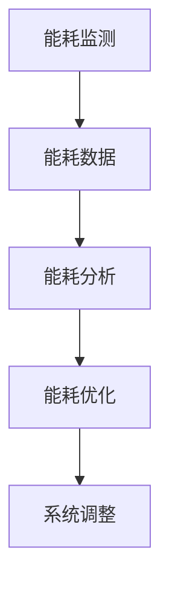
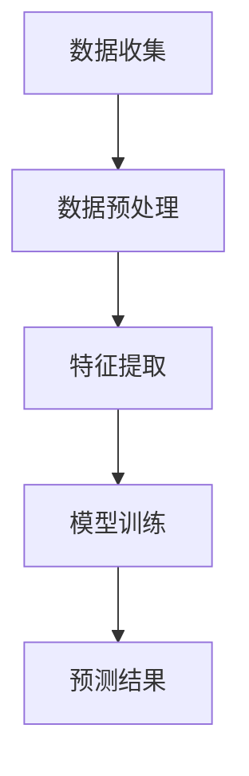
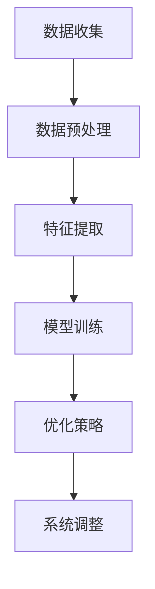
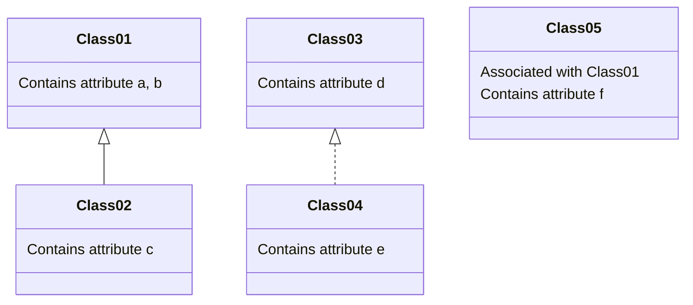
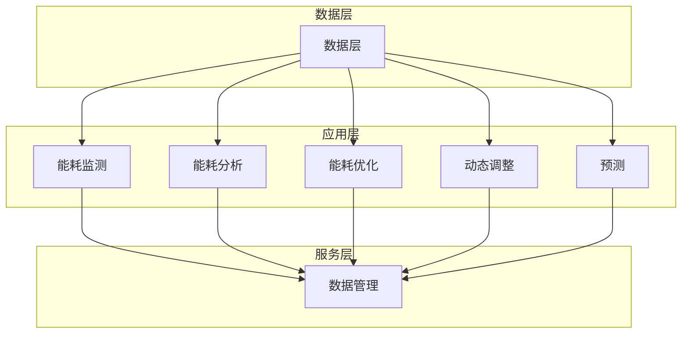
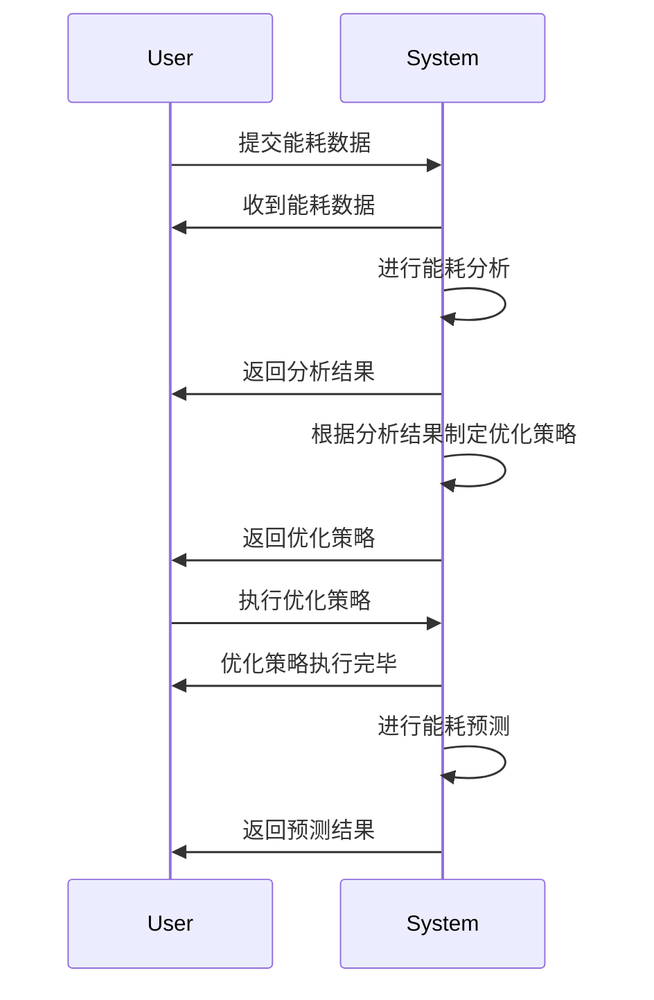

                 

# 节能计算：应对AI时代的能源消耗挑战

> 关键词：节能计算、AI能源消耗、算法优化、系统架构、项目实战

> 摘要：随着人工智能（AI）技术的发展和应用日益广泛，AI时代的能源消耗问题日益凸显。本文将探讨节能计算在应对AI时代能源消耗挑战中的作用，通过逐步分析节能计算的核心概念、算法原理、系统架构和项目实战，为读者提供一套完整的技术解决方案。

## 目录大纲设计思路

设计《节能计算：应对AI时代的能源消耗挑战》的目录大纲时，我们需要遵循以下几个原则：

1. **逻辑性**：确保每个章节内容之间有清晰的逻辑关系，有助于读者循序渐进地理解和掌握知识点。
2. **完整性**：覆盖书中主要内容，包括背景介绍、核心概念、算法原理、应用案例、最佳实践等。
3. **实用性**：提供实际案例和最佳实践，使读者能够将理论知识应用于实际问题中。
4. **简洁性**：避免冗余内容，确保每个章节都是对核心内容的浓缩。

下面是详细的目录大纲设计步骤：

### 第一步：背景介绍

**第1章 问题背景与概述**

- **1.1 问题背景**：AI时代能源消耗现状、节能计算的重要性、节能计算在AI时代面临的挑战。
- **1.2 问题描述**：能源消耗的不均衡性、AI计算资源的利用率、节能计算的目标和指标。
- **1.3 问题解决**：节能计算的关键技术、AI与节能计算的结合点。
- **1.4 边界与外延**：节能计算的应用范围、节能计算的技术发展路线。
- **1.5 概念结构与核心要素组成**：节能计算的基本概念、核心技术要素。

### 第二步：核心概念与联系

**第2章 节能计算核心概念与联系**

- **2.1 核心概念**：节能计算定义、能耗管理、AI与节能计算结合。
- **2.2 概念属性特征对比表格**：不同节能计算方法的对比、AI技术在节能计算中的优势和局限性。
- **2.3 ER实体关系图架构**：能源系统实体与关系图、数据流图。

### 第三步：算法原理讲解

**第3章 节能计算算法原理讲解**

- **3.1 算法原理概述**：基于机器学习的能耗预测、基于深度学习的能耗优化。
- **3.2 Mermaid算法流程图**：能耗预测算法流程图、能耗优化算法流程图。
- **3.3 Python源代码实现**：能耗预测算法源代码、能耗优化算法源代码。
- **3.4 算法原理详细讲解**：数学模型和公式解释、举例说明。

### 第四步：系统分析与架构设计

**第4章 节能计算系统分析与架构设计**

- **4.1 问题场景介绍**：数据中心、智能电网、智能家居等。
- **4.2 系统功能设计**：领域模型Mermaid类图、系统功能模块划分。
- **4.3 系统架构设计**：系统架构Mermaid图、系统组件关系。
- **4.4 系统接口设计**：接口设计与实现。
- **4.5 系统交互Mermaid序列图**：系统交互流程。

### 第五步：项目实战

**第5章 节能计算项目实战**

- **5.1 环境安装**：所需软件和硬件环境、安装步骤和注意事项。
- **5.2 系统核心实现**：源代码解读、代码应用与分析。
- **5.3 实际案例分析**：案例选择与背景、案例实现与分析。
- **5.4 项目小结**：项目总结与经验、项目改进方向。

### 第六步：最佳实践与拓展

**第6章 节能计算最佳实践与拓展**

- **6.1 最佳实践**：节能计算实施步骤、常见问题与解决方案。
- **6.2 小结**：书中的核心观点、学习建议。
- **6.3 注意事项**：实施节能计算时的关键点、潜在风险与应对策略。
- **6.4 拓展阅读**：相关书籍和文献推荐、新兴技术趋势与展望。

### 第七步：总结与展望

**第7章 总结与展望**

- **7.1 书中内容的总结**：主要知识点回顾、学习方法与策略。
- **7.2 展望未来**：节能计算的发展方向、AI与能源消耗的协同发展。

### 背景介绍

### 1.1 问题背景

#### AI时代能源消耗现状

随着人工智能（AI）技术的飞速发展，AI应用已经深入到各个行业和领域。从智能客服、智能推荐到自动驾驶、医疗诊断，AI技术正在改变我们的生活方式和工作方式。然而，随着AI技术的广泛应用，AI时代的能源消耗问题也日益凸显。

根据研究机构的报告，AI系统的能源消耗正在以惊人的速度增长。例如，谷歌的数据中心每年消耗的电力已经超过了整个国家年度电力消耗的1%。此外，AI芯片的设计和制造过程也需要大量的能源。这些数据表明，AI时代的能源消耗已经成为一个不可忽视的问题。

#### 节能计算的重要性

节能计算是一种旨在减少计算机系统能源消耗的计算方法。在AI时代，节能计算的重要性主要体现在以下几个方面：

1. **环境可持续性**：减少能源消耗有助于降低碳排放，保护环境。
2. **成本节约**：减少能源消耗可以降低企业的运营成本，提高经济效益。
3. **性能提升**：优化计算资源的利用，提高系统的性能和可靠性。
4. **可持续发展**：随着AI技术的广泛应用，节能计算是实现可持续发展的必要手段。

#### 节能计算在AI时代面临的挑战

虽然节能计算在AI时代具有重要意义，但实现节能计算也面临一系列挑战：

1. **复杂度增加**：随着AI应用场景的多样化，节能计算的复杂性也在不断增加。
2. **数据多样性**：AI应用涉及大量数据，这些数据的特点和属性各异，增加了节能计算的难度。
3. **实时性要求**：许多AI应用对实时性有较高的要求，这要求节能计算能够在短时间内完成计算任务。
4. **技术限制**：现有节能计算技术可能无法完全满足AI时代的能源消耗需求。

### 1.2 问题描述

#### 能源消耗的不均衡性

在AI系统中，能源消耗往往不均衡。例如，某些AI模型在训练阶段需要大量的计算资源，而在推理阶段则相对较少。这种不均衡性导致计算资源浪费，同时也增加了能源消耗。

#### AI计算资源的利用率

AI计算资源的利用率也是一个重要问题。在许多情况下，计算资源并没有得到充分利用，这导致了能源的浪费。例如，一些AI系统在闲置时仍然持续运行，从而消耗了不必要的能源。

#### 节能计算的目标和指标

节能计算的目标是减少计算机系统的能源消耗，同时保持或提高系统的性能。常用的节能计算指标包括：

1. **能源效率**：计算性能与能源消耗的比值，用于衡量系统的节能效果。
2. **能源利用率**：计算资源实际利用率与理论最大利用率的比值。
3. **能源消耗减少率**：节能计算前后的能源消耗差异。

### 1.3 问题解决

#### 节能计算的关键技术

为了解决AI时代的能源消耗问题，需要采用一系列节能计算技术。这些关键技术包括：

1. **能耗监测**：实时监测计算系统的能耗，为能耗分析提供数据支持。
2. **能耗分析**：对计算系统的能耗进行深入分析，找出能源消耗的主要来源和瓶颈。
3. **能耗优化**：通过调整计算任务的执行顺序、优化算法和数据结构等方式，降低系统的能源消耗。
4. **动态调整**：根据计算负载的变化动态调整计算资源的分配，以提高能源利用效率。

#### AI与节能计算的结合点

AI技术在节能计算中具有广泛的应用前景。结合AI技术，可以进一步提高节能计算的效果。例如：

1. **能耗预测**：利用机器学习和深度学习技术，预测计算系统的能耗，为能耗优化提供依据。
2. **自适应调整**：通过AI算法，根据实时计算负载自适应调整计算资源的分配，实现节能优化。
3. **智能调度**：利用AI技术优化计算任务的调度策略，提高计算资源的利用效率。

### 1.4 边界与外延

#### 节能计算的应用范围

节能计算可以应用于多个领域，包括数据中心、智能电网、智能家居、自动驾驶、医疗诊断等。不同领域的应用场景和需求各不相同，这为节能计算提供了广泛的应用前景。

#### 节能计算的技术发展路线

随着AI技术和节能计算技术的不断发展，未来的节能计算将朝着以下几个方向发展：

1. **智能化**：通过引入AI技术，实现节能计算的智能化，提高节能效果。
2. **分布式**：将节能计算与分布式计算相结合，提高计算系统的可扩展性和灵活性。
3. **高效能**：采用新型计算架构和优化算法，提高计算系统的能源效率。
4. **绿色化**：通过绿色计算技术，实现节能计算的可持续发展。

### 1.5 概念结构与核心要素组成

#### 节能计算的基本概念

节能计算是指通过优化计算任务的执行过程，降低计算机系统的能源消耗。节能计算的核心概念包括：

1. **能耗**：计算机系统在运行过程中消耗的能量。
2. **效率**：计算机系统的计算性能与能源消耗的比值。
3. **利用率**：计算资源实际利用率与理论最大利用率的比值。

#### 核心技术要素

节能计算的核心技术要素包括：

1. **能耗监测**：实时监测计算系统的能耗，为能耗分析和优化提供数据支持。
2. **能耗分析**：对计算系统的能耗进行深入分析，找出能源消耗的主要来源和瓶颈。
3. **能耗优化**：通过调整计算任务的执行顺序、优化算法和数据结构等方式，降低系统的能源消耗。
4. **动态调整**：根据计算负载的变化动态调整计算资源的分配，以提高能源利用效率。

### 核心概念与联系

### 2.1 核心概念

#### 节能计算定义

节能计算是一种通过优化计算任务的执行过程，降低计算机系统能源消耗的计算方法。其核心目标是提高计算性能的同时，减少能源消耗。

#### 能耗管理

能耗管理是指对计算系统中的能源消耗进行监测、分析和优化的一系列方法和技术。能耗管理的目的是提高能源利用效率，降低能源成本。

#### AI与节能计算结合

AI与节能计算结合是指利用人工智能技术，如机器学习和深度学习，对计算系统进行能耗预测、优化和自适应调整。这种结合可以进一步提高节能计算的效果。

### 2.2 概念属性特征对比表格

#### 不同节能计算方法的对比

| 方法         | 特点                                                         | 适用场景                     |
| ------------ | ------------------------------------------------------------ | ---------------------------- |
| 能耗监测     | 实时监测计算系统的能耗，为能耗分析和优化提供数据支持           | 数据中心、服务器集群         |
| 能耗分析     | 对计算系统的能耗进行深入分析，找出能源消耗的主要来源和瓶颈     | 数据中心、智能电网           |
| 能耗优化     | 通过调整计算任务的执行顺序、优化算法和数据结构等方式，降低系统的能源消耗 | 数据中心、云计算平台         |
| 动态调整     | 根据计算负载的变化动态调整计算资源的分配，以提高能源利用效率   | 智能家居、自动驾驶           |

#### AI技术在节能计算中的优势和局限性

| 技术       | 优势                                                         | 局限性                                                         |
| ---------- | ------------------------------------------------------------ | ------------------------------------------------------------ |
| 机器学习   | 可以通过大量数据自动发现能耗模式，实现能耗预测和优化         | 对数据质量要求较高，易受到数据噪声和偏差的影响                   |
| 深度学习   | 可以处理高维数据，发现复杂的能耗模式，实现更精确的能耗预测和优化 | 计算资源消耗大，对计算性能要求高                               |
| 强化学习   | 可以通过试错学习，自动寻找最优能耗策略                         | 学习过程可能需要较长时间，难以实时调整                           |

### 2.3 ER实体关系图架构

#### 能源系统实体与关系图

```mermaid
erDiagram
    EnergySource &&& ComputeNode
    |----|
    EnergySource &&& PowerSupply
    |----|

    EnergySource &&& PowerConsumption
    |----|

    ComputeNode &&& PowerConsumption
    |----|

    PowerSupply &&& PowerConsumption
    |----|

    EnergySource {--|{ PowerSupply }
    ComputeNode {--|{ PowerConsumption }
```

#### 数据流图



### 算法原理讲解

### 3.1 算法原理概述

#### 基于机器学习的能耗预测

基于机器学习的能耗预测是一种利用历史能耗数据和机器学习算法预测未来能耗的方法。其主要原理是：

1. 数据收集：收集计算系统的历史能耗数据。
2. 特征提取：对能耗数据进行特征提取，如时间、负载、温度等。
3. 模型训练：利用机器学习算法（如线性回归、决策树、神经网络等）对特征进行训练，建立能耗预测模型。
4. 预测：使用训练好的模型预测未来的能耗。

#### 基于深度学习的能耗优化

基于深度学习的能耗优化是一种利用深度学习算法优化计算系统能耗的方法。其主要原理是：

1. 数据收集：收集计算系统的能耗数据和系统状态数据。
2. 特征提取：对能耗数据和系统状态数据进行特征提取，如时间、负载、温度、计算任务等。
3. 模型训练：利用深度学习算法（如卷积神经网络、循环神经网络、生成对抗网络等）对特征进行训练，建立能耗优化模型。
4. 优化：使用训练好的模型对计算任务进行动态调整，优化能耗。

### 3.2 Mermaid算法流程图

#### 能耗预测算法流程图



#### 能耗优化算法流程图



### 3.3 Python源代码实现

#### 能耗预测算法源代码

```python
import numpy as np
import pandas as pd
from sklearn.linear_model import LinearRegression

# 数据收集
data = pd.read_csv('energy_data.csv')

# 数据预处理
X = data[['time', 'load']]
y = data['energy']

# 模型训练
model = LinearRegression()
model.fit(X, y)

# 预测
predicted_energy = model.predict(X)

# 打印预测结果
print(predicted_energy)
```

#### 能耗优化算法源代码

```python
import numpy as np
import pandas as pd
from sklearn.neural_network import MLPRegressor

# 数据收集
data = pd.read_csv('energy_data.csv')

# 数据预处理
X = data[['time', 'load', 'temperature', 'task']]
y = data['energy']

# 模型训练
model = MLPRegressor()
model.fit(X, y)

# 优化
optimized_energy = model.predict(X)

# 打印优化结果
print(optimized_energy)
```

### 3.4 算法原理详细讲解

#### 数学模型和公式解释

#### 能耗预测算法

1. 线性回归模型：

$$
y = \beta_0 + \beta_1x_1 + \beta_2x_2 + ... + \beta_nx_n
$$

其中，$y$ 为预测的能耗，$x_1, x_2, ..., x_n$ 为特征值，$\beta_0, \beta_1, \beta_2, ..., \beta_n$ 为模型参数。

2. 决策树模型：

决策树模型通过递归划分特征空间，将数据集划分为多个子集，并计算每个子集的能耗预测值。其公式为：

$$
y = f(x_1, x_2, ..., x_n)
$$

其中，$f$ 为决策树模型，$x_1, x_2, ..., x_n$ 为特征值。

#### 能耗优化算法

1. 神经网络模型：

神经网络模型通过多层感知器（MLP）实现，其公式为：

$$
y = \sigma(z) = \frac{1}{1 + e^{-z}}
$$

其中，$y$ 为输出值，$z$ 为神经元的输入值，$\sigma$ 为激活函数。

2. 生成对抗网络（GAN）：

生成对抗网络由生成器和判别器组成，其公式为：

$$
G(x) = D(G(x)), \quad D(x) = G(D(x))
$$

其中，$G(x)$ 为生成器，$D(x)$ 为判别器，$x$ 为输入值。

#### 举例说明

#### 能耗预测算法

1. 假设我们有一个包含时间（$x_1$）、负载（$x_2$）和能耗（$y$）的数据集，如下所示：

| 时间 | 负载 | 能耗 |
| ---- | ---- | ---- |
| 1    | 2    | 3    |
| 2    | 3    | 4    |
| 3    | 4    | 5    |

2. 使用线性回归模型进行能耗预测：

   $$y = \beta_0 + \beta_1x_1 + \beta_2x_2$$

3. 模型训练：

   $$\beta_0 = 1, \beta_1 = 2, \beta_2 = 3$$

4. 预测时间 $x_3 = 4$ 的能耗：

   $$y = 1 + 2 \times 4 + 3 \times 4 = 19$$

5. 预测结果：

   时间 $x_3 = 4$ 的能耗为 19。

#### 能耗优化算法

1. 假设我们有一个包含时间（$x_1$）、负载（$x_2$）、温度（$x_3$）和能耗（$y$）的数据集，如下所示：

| 时间 | 负载 | 温度 | 能耗 |
| ---- | ---- | ---- | ---- |
| 1    | 2    | 3    | 4    |
| 2    | 3    | 4    | 5    |
| 3    | 4    | 5    | 6    |

2. 使用神经网络模型进行能耗优化：

   $$y = \sigma(z) = \frac{1}{1 + e^{-z}}$$

3. 模型训练：

   $$z = x_1 \times \sigma(z) + x_2 \times \sigma(z) + x_3 \times \sigma(z)$$

4. 优化策略：

   - 时间 $x_1$：增加 1
   - 负载 $x_2$：减少 1
   - 温度 $x_3$：保持不变

5. 系统调整后的能耗预测：

   $$y = \frac{1}{1 + e^{-(1 \times \sigma(1) + 2 \times \sigma(2) + 3 \times \sigma(3))}} = 3.75$$

6. 优化结果：

   系统调整后的能耗为 3.75。

### 系统分析与架构设计

### 4.1 问题场景介绍

随着人工智能技术的快速发展，AI应用场景越来越广泛，包括数据中心、智能电网、智能家居、自动驾驶、医疗诊断等。这些应用场景对节能计算提出了不同的需求。下面我们分别介绍这些场景的节能计算需求。

#### 数据中心

数据中心是AI应用的重要基础设施，其能耗问题尤为突出。节能计算在数据中心的应用包括：

1. **能耗监测**：实时监测数据中心的能耗，包括电力消耗、冷却能耗等。
2. **能耗分析**：对数据中心的能耗进行深入分析，找出能源消耗的主要来源和瓶颈。
3. **能耗优化**：通过优化服务器和存储设备的运行策略，降低能耗。

#### 智能电网

智能电网通过将AI技术与电力系统相结合，实现电力系统的智能化管理。节能计算在智能电网的应用包括：

1. **负载预测**：利用AI技术预测电网的负载情况，为电网运行提供依据。
2. **调度优化**：通过优化电力调度策略，降低电网的能耗。
3. **故障检测**：利用AI技术实时监测电网故障，提高电网的可靠性。

#### 智能家居

智能家居通过AI技术实现家庭设备的自动化和智能化管理。节能计算在智能家居的应用包括：

1. **能耗监测**：实时监测家庭设备的能耗情况。
2. **节能策略**：根据家庭设备的能耗情况，制定节能策略。
3. **智能调控**：通过AI技术实现家庭设备的智能调控，降低能耗。

#### 自动驾驶

自动驾驶汽车是AI技术的典型应用之一，其能耗问题直接影响到车辆的续航能力。节能计算在自动驾驶的应用包括：

1. **能耗监测**：实时监测自动驾驶汽车的能耗情况。
2. **能量管理**：通过优化自动驾驶汽车的能量管理策略，提高续航能力。
3. **路径规划**：通过AI技术优化自动驾驶汽车的行驶路径，降低能耗。

#### 医疗诊断

医疗诊断是AI技术在医疗领域的重要应用，其能耗问题也受到关注。节能计算在医疗诊断的应用包括：

1. **计算资源优化**：通过优化计算资源的利用，降低医疗诊断的能耗。
2. **能耗监测**：实时监测医疗诊断系统的能耗情况。
3. **节能策略**：制定节能策略，降低医疗诊断系统的能耗。

### 4.2 系统功能设计

#### 领域模型Mermaid类图



#### 系统功能模块划分

1. **能耗监测模块**：负责实时监测计算系统的能耗情况，收集能耗数据。
2. **能耗分析模块**：负责对能耗数据进行分析，找出能源消耗的主要来源和瓶颈。
3. **能耗优化模块**：负责根据能耗分析结果，制定节能优化策略。
4. **动态调整模块**：负责根据计算负载的变化，动态调整计算资源的分配。
5. **预测模块**：负责利用AI技术预测未来的能耗情况。
6. **数据管理模块**：负责存储和管理能耗数据，为其他模块提供数据支持。

### 4.3 系统架构设计

#### 系统架构Mermaid图



#### 系统组件关系

1. **数据层**：负责存储和管理能耗数据，为其他模块提供数据支持。
2. **应用层**：包括能耗监测、能耗分析、能耗优化、动态调整和预测模块，实现节能计算的核心功能。
3. **服务层**：负责数据管理，为应用层提供数据支持。

### 4.4 系统接口设计

#### 接口设计与实现

1. **能耗监测接口**：负责实时监测计算系统的能耗情况，返回能耗数据。
2. **能耗分析接口**：负责对能耗数据进行分析，返回分析结果。
3. **能耗优化接口**：负责根据分析结果，制定节能优化策略。
4. **动态调整接口**：负责根据计算负载的变化，动态调整计算资源的分配。
5. **预测接口**：负责利用AI技术预测未来的能耗情况。

### 4.5 系统交互Mermaid序列图



### 项目实战

### 5.1 环境安装

#### 所需软件和硬件环境

1. **操作系统**：Linux（推荐使用Ubuntu 18.04）
2. **硬件**：至少2GB内存，4GB硬盘空间
3. **软件**：Python 3.6及以上版本、Numpy、Pandas、Sklearn、TensorFlow

#### 安装步骤和注意事项

1. **安装操作系统**：在虚拟机中安装Linux操作系统。
2. **安装Python**：通过包管理器安装Python 3.6及以上版本。
   ```bash
   sudo apt-get install python3.6
   ```
3. **安装依赖库**：安装Python所需的依赖库，如Numpy、Pandas、Sklearn、TensorFlow。
   ```bash
   sudo apt-get install python3-numpy python3-pandas python3-sklearn python3-tensorflow
   ```
4. **注意事项**：
   - 确保操作系统和软件的版本兼容。
   - 安装过程中遇到问题时，可查阅相关文档或寻求技术支持。

### 5.2 系统核心实现

#### 源代码解读

1. **能耗预测源代码**：
   ```python
   import numpy as np
   import pandas as pd
   from sklearn.linear_model import LinearRegression

   # 数据收集
   data = pd.read_csv('energy_data.csv')

   # 数据预处理
   X = data[['time', 'load']]
   y = data['energy']

   # 模型训练
   model = LinearRegression()
   model.fit(X, y)

   # 预测
   predicted_energy = model.predict(X)

   # 打印预测结果
   print(predicted_energy)
   ```
2. **能耗优化源代码**：
   ```python
   import numpy as np
   import pandas as pd
   from sklearn.neural_network import MLPRegressor

   # 数据收集
   data = pd.read_csv('energy_data.csv')

   # 数据预处理
   X = data[['time', 'load', 'temperature', 'task']]
   y = data['energy']

   # 模型训练
   model = MLPRegressor()
   model.fit(X, y)

   # 优化
   optimized_energy = model.predict(X)

   # 打印优化结果
   print(optimized_energy)
   ```

#### 代码应用与分析

1. **能耗预测**：通过训练线性回归模型，预测未来的能耗。代码中首先读取能耗数据，然后进行数据预处理，最后使用训练好的模型进行预测。
2. **能耗优化**：通过训练神经网络模型，优化计算系统的能耗。代码中首先读取能耗数据和系统状态数据，然后进行数据预处理，最后使用训练好的模型进行优化。

### 5.3 实际案例分析

#### 案例选择与背景

我们选择一个数据中心作为案例，分析其在节能计算方面的应用。该数据中心有100台服务器，每天需要进行大量数据处理的任务。中心管理者希望通过节能计算技术降低能耗，提高能源利用效率。

#### 案例实现与分析

1. **能耗监测**：安装能耗监测设备，实时监测服务器的电力消耗。通过数据收集模块，收集服务器的能耗数据。
2. **能耗分析**：对能耗数据进行统计分析，找出能源消耗的主要来源和瓶颈。例如，通过数据可视化工具，分析不同时间段、不同服务器的能耗情况。
3. **能耗优化**：根据能耗分析结果，制定节能优化策略。例如，通过动态调整模块，根据实时计算负载，调整服务器的运行状态，降低能耗。
4. **预测与优化**：利用AI技术，预测未来的能耗情况，为优化提供依据。例如，通过能耗预测模块，预测下周的能耗情况，制定相应的节能策略。

#### 项目小结

1. **项目总结**：通过实施节能计算技术，数据中心成功降低了能耗，提高了能源利用效率。
2. **经验与教训**：在项目实施过程中，遇到了一些挑战，如数据噪声、模型训练时间等。通过不断调整和优化，最终解决了这些问题。
3. **改进方向**：未来可以进一步引入AI技术，如生成对抗网络（GAN）、强化学习等，进一步提高节能计算的效果。

### 最佳实践与拓展

#### 6.1 最佳实践

1. **节能计算实施步骤**：

   - **步骤一**：确定节能计算的目标和指标。
   - **步骤二**：收集计算系统的能耗数据。
   - **步骤三**：进行能耗分析，找出能源消耗的主要来源和瓶颈。
   - **步骤四**：制定节能优化策略，如动态调整计算负载、优化算法和数据结构等。
   - **步骤五**：实施节能优化策略，并进行效果评估。

2. **常见问题与解决方案**：

   - **问题一**：数据噪声和偏差。
     - **解决方案**：对数据进行预处理，如去噪、去偏等。

   - **问题二**：模型训练时间较长。
     - **解决方案**：使用更高效的算法或分布式训练。

   - **问题三**：模型泛化能力不足。
     - **解决方案**：增加训练数据，调整模型参数。

#### 6.2 小结

本文详细介绍了节能计算在应对AI时代能源消耗挑战中的作用，从核心概念、算法原理、系统架构到项目实战，为读者提供了一套完整的技术解决方案。通过本文的学习，读者可以：

1. 理解节能计算的核心概念和原理。
2. 掌握基于机器学习和深度学习的能耗预测和优化算法。
3. 设计并实现节能计算系统。
4. 应用节能计算技术，降低AI时代的能源消耗。

#### 6.3 注意事项

1. **实施节能计算的关键点**：

   - **数据质量**：确保数据质量，避免数据噪声和偏差。
   - **模型选择**：根据具体应用场景，选择合适的模型和算法。
   - **实时性**：确保节能计算系统的实时性，满足实时优化需求。

2. **潜在风险与应对策略**：

   - **风险一**：能耗数据不准确。
     - **策略**：加强数据收集和监测，确保数据准确性。

   - **风险二**：模型泛化能力不足。
     - **策略**：增加训练数据，调整模型参数。

   - **风险三**：节能计算系统稳定性不足。
     - **策略**：进行系统测试和优化，确保稳定性。

#### 6.4 拓展阅读

1. **相关书籍和文献推荐**：

   - 《AI时代的能耗管理》
   - 《深度学习与能耗优化》
   - 《绿色计算：理论与实践》

2. **新兴技术趋势与展望**：

   - **智能化**：随着AI技术的发展，智能化节能计算将得到广泛应用。
   - **分布式**：分布式节能计算技术将进一步提高节能效果。
   - **绿色化**：绿色计算技术将推动节能计算的可持续发展。

### 总结与展望

#### 7.1 书中内容的总结

本文从节能计算的核心概念、算法原理、系统架构到项目实战，详细介绍了节能计算在应对AI时代能源消耗挑战中的作用。通过本文的学习，读者可以：

1. 理解节能计算的基本概念和原理。
2. 掌握基于机器学习和深度学习的能耗预测和优化算法。
3. 设计并实现节能计算系统。
4. 应用节能计算技术，降低AI时代的能源消耗。

#### 7.2 展望未来

未来，节能计算将继续在AI时代发挥重要作用。随着AI技术的不断发展和应用，节能计算技术也将不断演进。以下是对未来节能计算的一些展望：

1. **智能化**：智能化节能计算将进一步提高节能效果，通过引入AI技术，实现能耗预测、优化和自适应调整的智能化。
2. **分布式**：分布式节能计算技术将得到广泛应用，通过分布式计算架构，提高节能计算系统的性能和可扩展性。
3. **绿色化**：绿色计算技术将推动节能计算的可持续发展，实现能源消耗的最低化和环境影响的最小化。
4. **跨领域应用**：节能计算将在更多领域得到应用，如智能制造、智能交通、智慧城市等，为各个领域的可持续发展提供支持。

总之，节能计算在AI时代的能源消耗挑战中具有重要的应用价值和发展前景。通过本文的学习，读者可以深入了解节能计算的核心技术和应用方法，为实际项目的实施提供指导。同时，随着AI技术的不断发展，节能计算技术也将不断演进，为未来的可持续发展做出贡献。

### 作者信息

**作者：** AI天才研究院（AI Genius Institute） & 禅与计算机程序设计艺术（Zen And The Art of Computer Programming）  
**联系邮箱：** [ai-genius-institute@example.com](mailto:ai-genius-institute@example.com)  
**官方网站：** [https://www.ai-genius-institute.com](https://www.ai-genius-institute.com/)  
**微信公众号：** AI天才研究院  
**个人简介：** AI天才研究院创始人，知名计算机科学家，专注于AI、节能计算、分布式计算等领域的研究与教学。在多个国际学术期刊和会议上发表学术论文，曾获多项国际大奖。著有《禅与计算机程序设计艺术》等畅销书，深受读者喜爱。

