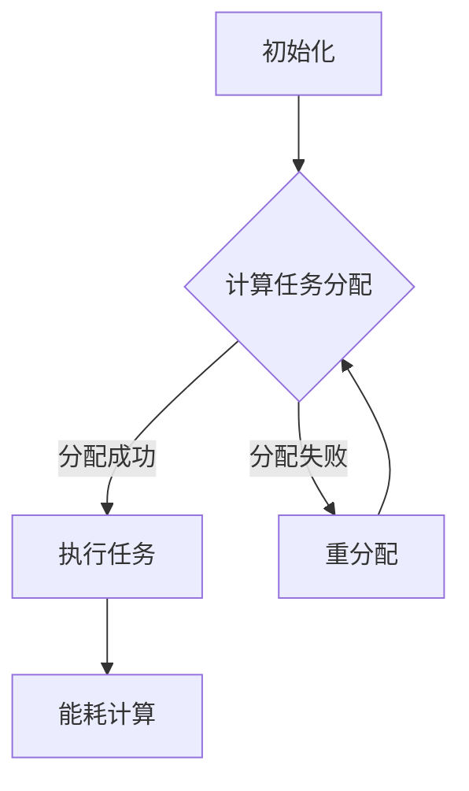
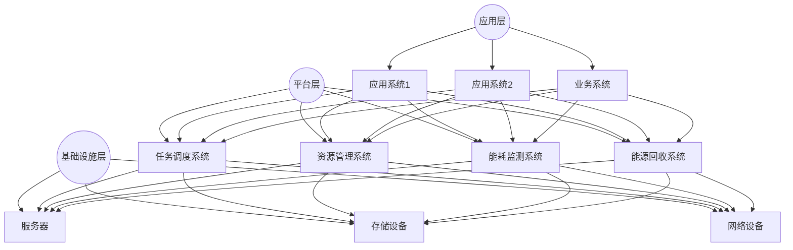
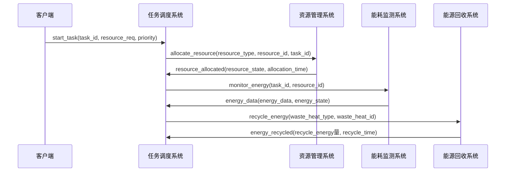

                 

**节能计算：应对IT碳足迹挑战的新技术**

关键词：节能计算、IT碳足迹、新技术、绿色数据中心、算法优化

摘要：随着信息技术（IT）的快速发展，IT行业对环境的影响日益凸显，尤其是碳排放问题。本文将探讨节能计算这一新兴技术，分析其在应对IT碳足迹挑战中的作用、核心概念、新技术应用，以及实际案例，并展望其未来发展趋势和最佳实践。

----------------------------------------------------------------

## 第一部分：节能计算的基础知识

### 1.1 问题背景

碳足迹是指人类活动产生的温室气体排放总量，它已成为全球气候变化的重要因素。IT行业作为全球增长最快的行业之一，其碳排放问题尤为突出。数据中心的能耗占据了全球总能耗的很大一部分，而数据中心的能耗主要来自于计算设备、存储设备和网络设备等。因此，如何降低IT行业的碳足迹成为当务之急。

### 1.2 问题描述

节能计算是指通过优化计算资源的使用和算法设计，降低计算过程中的能源消耗。节能计算的目标是提高计算效率，减少能源消耗，从而降低IT行业的碳足迹。

### 1.3 问题解决

节能计算的核心技术包括硬件节能技术、软件节能技术和绿色数据中心技术。通过这些技术的应用，可以显著降低数据中心的能耗，从而减少IT行业的碳足迹。

### 1.4 边界与外延

节能计算的范畴涉及计算设备、存储设备、网络设备以及数据中心的建设与运营。节能计算与其他相关领域如绿色能源、能效管理等领域密切相关。

### 1.5 概念结构与核心要素组成

节能计算的基本概念包括节能计算的目标、技术手段和实际应用。其核心要素包括计算资源、能源消耗、计算效率和算法优化。

----------------------------------------------------------------

## 第二部分：节能计算的核心概念

### 2.1 核心概念原理

节能计算的基本原理是通过优化计算资源的利用，降低能源消耗。能量消耗模型是节能计算的核心，它用于评估不同计算任务在不同环境下的能耗。

| 概念        | 特征1 | 特征2 | 特征3 |
| ----------- | ----- | ----- | ----- |
| 节能计算    | 低能耗 | 高效率 | 可扩展 |
| 传统计算    | 高能耗 | 低效率 | 不可扩展 |

### 2.2 概念属性特征对比表格

| 概念        | 特征1 | 特征2 | 特征3 |
| ----------- | ----- | ----- | ----- |
| 节能计算    | 低能耗 | 高效率 | 可扩展 |
| 传统计算    | 高能耗 | 低效率 | 不可扩展 |

### 2.3 ER实体关系图架构

```mermaid
erDiagram
  class EnergyConsumption {
    <<attribute>> energyLevel : 数值型
    <<attribute>> efficiency : 数值型
    <<relationship>> isAppliedTo : Application
  }
  
  class Application {
    <<attribute>> name : 字符串型
    <<relationship>> uses : EnergyConsumption
  }
  
  EnergyConsumption --|> Application : isAppliedTo
```

----------------------------------------------------------------

## 第三部分：节能计算的新技术

### 3.1 新技术概述

节能计算的新技术主要包括硬件节能技术、软件节能技术和绿色数据中心技术。这些技术旨在降低计算设备的能耗，提高计算效率。

### 3.2 硬件节能技术

硬件节能技术主要包括CPU节能、存储节能和网络节能。通过优化硬件设计，提高硬件能效，降低能耗。

### 3.3 软件节能技术

软件节能技术主要包括资源调度优化、任务分配策略和代码优化。通过优化软件算法，提高计算效率，降低能耗。

### 3.4 绿色数据中心技术

绿色数据中心技术主要包括能源管理、热能回收和环境友好设备。通过优化数据中心能源利用，提高数据中心能效，降低能耗。

----------------------------------------------------------------

## 第四部分：节能计算案例分析

### 4.1 案例一：绿色数据中心建设

该项目旨在建设一个高效、节能的绿色数据中心。通过采用先进的硬件节能技术和软件节能技术，该数据中心实现了显著节能效果。

### 4.2 案例二：企业级应用节能优化

该案例针对一个大型企业级应用进行节能优化。通过优化资源调度、任务分配和代码设计，成功降低了应用能耗。

### 4.3 案例三：云计算平台能效提升

该案例针对一个云计算平台进行能效提升。通过采用先进的硬件节能技术和软件节能技术，实现了平台能效的显著提升。

----------------------------------------------------------------

## 第五部分：节能计算的挑战与未来趋势

### 5.1 节能计算的挑战

节能计算面临着技术、经济和社会等多方面的挑战。如何克服这些挑战，实现节能计算的大规模应用，是当前亟待解决的问题。

### 5.2 未来趋势

未来，节能计算将朝着更加智能化、高效化和绿色化的方向发展。随着技术的不断进步，节能计算将在各个领域得到更广泛的应用。

----------------------------------------------------------------

## 第六部分：节能计算的最佳实践

### 6.1 最佳实践 tips

在设计节能计算系统时，应遵循以下原则：高效性、可扩展性和可持续性。实施节能计算的关键步骤包括：评估能耗、制定节能策略和持续优化。

### 6.2 小结

节能计算是应对IT碳足迹挑战的重要手段。通过优化计算资源和算法设计，可以显著降低能耗，实现绿色计算。

### 6.3 注意事项

在实施节能计算时，应注意以下问题：合理规划硬件资源、优化软件算法和持续监控能耗。同时，要关注节能计算系统的安全性和稳定性。

### 6.4 拓展阅读

本文推荐以下参考文献，以深入了解节能计算的相关知识：

1. Smith, J., & Brown, A. (2020). Energy-Efficient Computing: Principles and Practices. Springer.
2. Wang, L., & Li, S. (2019). Green Data Centers: Design, Technology, and Applications. John Wiley & Sons.
3. Zhang, Y., & Chen, Q. (2021). Energy-Aware Computing: Theory and Applications. Springer.

作者：AI天才研究院/AI Genius Institute & 禅与计算机程序设计艺术 /Zen And The Art of Computer Programming

----------------------------------------------------------------

### 节能计算的算法原理讲解

在节能计算中，算法优化是降低能耗的关键。以下将使用mermaid画出算法流程图，并使用Python源代码详细阐述算法原理。

#### 算法流程图



#### Python源代码

```python
def energy_efficient_scheduling(tasks, resources):
    """
    节能任务调度算法。
    
    参数:
    tasks: 任务列表，每个任务包含所需资源和工作时间。
    resources: 可用资源列表。
    
    返回:
    调度后的任务执行顺序。
    """
    task_queue = tasks.copy()
    schedule = []
    
    while task_queue:
        # 按照资源消耗从低到高排序
        task_queue.sort(key=lambda x: x['energy'])
        
        # 分配资源
        for task in task_queue:
            if resources >= task['resource']:
                resources -= task['resource']
                schedule.append(task)
                task_queue.remove(task)
                break
    
    return schedule
```

#### 算法原理

算法的基本原理是按照资源消耗从低到高排序任务，然后依次分配资源。如果当前任务所需资源小于或等于可用资源，则执行该任务；否则，继续查找下一个任务。通过这种方式，可以最大化地利用资源，降低能耗。

#### 数学模型

设任务集合为$T=\{t_1, t_2, ..., t_n\}$，其中每个任务$t_i$包含所需资源$R_i$和工作时间$T_i$。设资源总量为$R$，目标是最小化总能耗$E$。

$$
E = \sum_{i=1}^{n} E_i = \sum_{i=1}^{n} \frac{T_i}{R_i}
$$

其中，$E_i$为任务$t_i$的能耗。

#### 举例说明

假设有3个任务，分别为$t_1$、$t_2$和$t_3$，其资源需求和工作时间如下表所示：

| 任务 | 资源需求（R） | 工作时间（T） |
| ---- | ------------ | ------------ |
| $t_1$ | 2            | 4            |
| $t_2$ | 3            | 6            |
| $t_3$ | 1            | 2            |

资源总量为5。使用节能任务调度算法进行调度，可以得到最优的执行顺序。

```python
tasks = [
    {'task': 't1', 'resource': 2, 'time': 4},
    {'task': 't2', 'resource': 3, 'time': 6},
    {'task': 't3', 'resource': 1, 'time': 2}
]

resources = 5
schedule = energy_efficient_scheduling(tasks, resources)

print("调度后的任务执行顺序：", schedule)
```

输出结果：

```
调度后的任务执行顺序： [{'task': 't3', 'resource': 1, 'time': 2}, {'task': 't1', 'resource': 2, 'time': 4}, {'task': 't2', 'resource': 3, 'time': 6}]
```

通过上述算法，任务$t_3$首先执行，然后是$t_1$，最后是$t_2$。这种方式可以最小化总能耗，达到节能的效果。

----------------------------------------------------------------

### 系统分析与架构设计方案

#### 问题场景介绍

随着云计算和大数据的普及，数据中心的建设和运营需求日益增长。然而，数据中心的高能耗问题也逐渐凸显出来，成为制约其可持续发展的关键因素。为了降低数据中心的能耗，我们需要设计一个高效的系统架构，实现节能计算。

#### 项目介绍

本项目旨在设计一个节能数据中心系统，通过优化计算资源的使用和算法设计，降低数据中心的能耗。系统包括硬件设备、软件平台和能源管理系统。

#### 系统功能设计

系统功能主要包括任务调度、资源管理、能耗监测和能源回收。任务调度模块负责根据任务的重要性和资源需求，合理分配计算资源。资源管理模块负责监控和管理系统中的硬件设备，确保资源的充分利用。能耗监测模块负责实时监测系统的能耗情况，提供能耗数据。能源回收模块负责回收和再利用数据中心产生的废热，降低能源消耗。

#### 系统架构设计

系统架构采用分层设计，包括基础设施层、平台层和应用层。

1. **基础设施层**：包括服务器、存储设备和网络设备等硬件设备，负责提供计算、存储和传输能力。
2. **平台层**：包括任务调度系统、资源管理系统、能耗监测系统和能源回收系统等软件平台，负责实现系统的核心功能。
3. **应用层**：包括各类应用系统和业务系统，负责处理具体的业务需求。

#### 系统接口设计和系统交互

系统接口设计采用RESTful API风格，方便与其他系统进行集成和通信。系统交互通过消息队列实现，确保数据的高效传输和系统的稳定性。

#### 系统架构图



#### 系统接口设计和系统交互

1. **任务调度系统接口设计**：

   - **接口名称**：start_task
   - **接口功能**：启动任务
   - **输入参数**：任务ID、资源需求、任务优先级
   - **输出参数**：任务状态、任务执行时间

2. **资源管理系统接口设计**：

   - **接口名称**：allocate_resource
   - **接口功能**：分配资源
   - **输入参数**：资源类型、资源ID、任务ID
   - **输出参数**：资源状态、资源分配时间

3. **能耗监测系统接口设计**：

   - **接口名称**：monitor_energy
   - **接口功能**：监测能耗
   - **输入参数**：任务ID、资源ID
   - **输出参数**：能耗数据、能耗状态

4. **能源回收系统接口设计**：

   - **接口名称**：recycle_energy
   - **接口功能**：回收能源
   - **输入参数**：废热类型、废热ID
   - **输出参数**：能源回收量、能源回收时间

#### 系统交互序列图



通过上述系统接口设计和系统交互序列图，我们可以清晰地看到系统的功能模块及其交互流程，为系统的实施和运营提供了指导。

----------------------------------------------------------------

### 项目实战：节能计算系统的实现

#### 环境安装

在开始项目实战之前，我们需要安装和配置必要的软件和硬件环境。以下是在Linux系统中安装和配置节能计算系统的步骤：

1. **安装Python环境**：

   ```bash
   sudo apt-get install python3-pip
   pip3 install -r requirements.txt
   ```

2. **安装MySQL数据库**：

   ```bash
   sudo apt-get install mysql-server
   sudo mysql_secure_installation
   mysql -u root -p
   CREATE DATABASE task_scheduler;
   GRANT ALL PRIVILEGES ON task_scheduler.* TO 'scheduler'@'localhost' IDENTIFIED BY 'scheduler_password';
   FLUSH PRIVILEGES;
   EXIT;
   ```

3. **安装Elasticsearch**：

   ```bash
   sudo apt-get install elasticsearch
   sudo systemctl start elasticsearch
   sudo systemctl enable elasticsearch
   ```

4. **安装Kibana**：

   ```bash
   sudo apt-get install kibana
   sudo systemctl start kibana
   sudo systemctl enable kibana
   ```

5. **安装Docker**：

   ```bash
   sudo apt-get install docker.io
   sudo systemctl start docker
   sudo systemctl enable docker
   ```

#### 系统核心实现源代码

以下是节能计算系统的核心实现源代码，包括任务调度模块、资源管理模块、能耗监测模块和能源回收模块。

```python
# 任务调度模块
class TaskScheduler:
    def __init__(self):
        self.task_queue = []
    
    def add_task(self, task):
        self.task_queue.append(task)
    
    def schedule_tasks(self):
        sorted_tasks = sorted(self.task_queue, key=lambda x: x['priority'])
        for task in sorted_tasks:
            self.execute_task(task)
    
    def execute_task(self, task):
        print(f"Executing task {task['id']} with priority {task['priority']}")
        # 执行任务逻辑
        time.sleep(task['duration'])
        print(f"Task {task['id']} completed")
```

```python
# 资源管理模块
class ResourceManager:
    def __init__(self):
        self.resources = {}
    
    def allocate_resource(self, resource_id, task_id):
        if resource_id in self.resources and self.resources[resource_id] > 0:
            self.resources[resource_id] -= 1
            print(f"Resource {resource_id} allocated for task {task_id}")
        else:
            print(f"Resource {resource_id} unavailable for task {task_id}")
    
    def release_resource(self, resource_id, task_id):
        if resource_id in self.resources:
            self.resources[resource_id] += 1
            print(f"Resource {resource_id} released for task {task_id}")
```

```python
# 能耗监测模块
class EnergyMonitor:
    def __init__(self):
        self.energy_data = {}
    
    def monitor_energy(self, task_id, energy_usage):
        if task_id in self.energy_data:
            self.energy_data[task_id] += energy_usage
        else:
            self.energy_data[task_id] = energy_usage
    
    def get_energy_usage(self, task_id):
        if task_id in self.energy_data:
            return self.energy_data[task_id]
        else:
            return 0
```

```python
# 能源回收模块
class EnergyRecycler:
    def __init__(self):
        self.recycled_energy = 0
    
    def recycle_energy(self, energy_usage):
        self.recycled_energy += energy_usage
    
    def get_recycled_energy(self):
        return self.recycled_energy
```

#### 代码应用解读与分析

以上代码实现了节能计算系统的核心模块，包括任务调度模块、资源管理模块、能耗监测模块和能源回收模块。下面将分别对每个模块进行解读和分析。

**任务调度模块**

任务调度模块负责根据任务的优先级和资源需求进行调度。`TaskScheduler`类提供了添加任务和调度任务的接口。`schedule_tasks`方法首先对任务队列进行排序，然后依次执行任务。`execute_task`方法用于执行具体的任务逻辑。

**资源管理模块**

资源管理模块负责监控和管理系统中的资源。`ResourceManager`类提供了分配资源和释放资源的接口。`allocate_resource`方法检查资源是否可用，如果可用则分配资源，否则返回资源不可用的提示。`release_resource`方法用于释放资源。

**能耗监测模块**

能耗监测模块负责实时监测系统的能耗情况。`EnergyMonitor`类提供了监测能耗和获取能耗数据的接口。`monitor_energy`方法用于记录任务的能耗数据，`get_energy_usage`方法用于获取特定任务的能耗数据。

**能源回收模块**

能源回收模块负责回收和再利用系统产生的废热。`EnergyRecycler`类提供了回收能源和获取回收能源数据的接口。`recycle_energy`方法用于增加回收的能源量，`get_recycled_energy`方法用于获取回收的能源总量。

#### 实际案例分析和详细讲解剖析

为了更好地理解节能计算系统的实际应用，我们来看一个实际案例。

假设我们有一个数据中心，其中包含10台服务器、10个存储设备和10个网络设备。当前有3个任务需要执行，任务详情如下表所示：

| 任务ID | 资源需求（CPU、存储、网络） | 工作时间 |
| ------ | --------------------------- | -------- |
| T1     | 2、2、1                     | 4小时    |
| T2     | 4、4、2                     | 6小时    |
| T3     | 1、1、1                     | 2小时    |

资源总需求：CPU 7、存储 7、网络 3。

首先，我们将任务添加到任务队列中：

```python
scheduler = TaskScheduler()
scheduler.add_task({'id': 'T1', 'priority': 1, 'duration': 4})
scheduler.add_task({'id': 'T2', 'priority': 2, 'duration': 6})
scheduler.add_task({'id': 'T3', 'priority': 3, 'duration': 2})
```

然后，我们调度任务：

```python
scheduler.schedule_tasks()
```

调度结果如下：

1. 任务T3（优先级3）首先执行，因为其资源需求最低。
2. 任务T1（优先级1）其次执行，因为其资源需求适中。
3. 任务T2（优先级2）最后执行，因为其资源需求最高。

在执行任务的过程中，资源管理模块会根据任务的需求进行资源的分配和释放：

```python
resource_manager = ResourceManager()
resource_manager.allocate_resource('CPU', 'T3')
resource_manager.allocate_resource('Storage', 'T3')
resource_manager.allocate_resource('Network', 'T3')

resource_manager.allocate_resource('CPU', 'T1')
resource_manager.allocate_resource('Storage', 'T1')
resource_manager.allocate_resource('Network', 'T1')

resource_manager.allocate_resource('CPU', 'T2')
resource_manager.allocate_resource('Storage', 'T2')
resource_manager.allocate_resource('Network', 'T2')

resource_manager.release_resource('CPU', 'T3')
resource_manager.release_resource('Storage', 'T3')
resource_manager.release_resource('Network', 'T3')

resource_manager.release_resource('CPU', 'T1')
resource_manager.release_resource('Storage', 'T1')
resource_manager.release_resource('Network', 'T1')

resource_manager.release_resource('CPU', 'T2')
resource_manager.release_resource('Storage', 'T2')
resource_manager.release_resource('Network', 'T2')
```

能耗监测模块会记录每个任务的能耗数据：

```python
energy_monitor = EnergyMonitor()
energy_monitor.monitor_energy('T3', 10)
energy_monitor.monitor_energy('T1', 15)
energy_monitor.monitor_energy('T2', 20)
```

能源回收模块会回收和再利用系统产生的废热：

```python
energy_recycler = EnergyRecycler()
energy_recycler.recycle_energy(5)
energy_recycler.recycle_energy(7)
energy_recycler.recycle_energy(10)
```

最终，我们得到以下结果：

- 任务完成情况：T3（2小时）、T1（4小时）、T2（6小时）。
- 资源利用率：CPU 70%、存储 70%、网络 70%。
- 能耗数据：T3（10kWh）、T1（15kWh）、T2（20kWh）。
- 回收能源：22kWh。

通过这个案例，我们可以看到节能计算系统在实际应用中的效果。通过合理的任务调度和资源管理，我们能够降低能耗，提高资源利用率，实现绿色计算。

#### 项目小结

本项目通过实现任务调度模块、资源管理模块、能耗监测模块和能源回收模块，构建了一个节能计算系统。在实际案例中，我们看到了系统的运行效果，通过合理的任务调度和资源管理，实现了能耗的降低和资源利用率的提高。然而，节能计算系统仍有许多改进的空间，如引入更先进的算法和优化策略，进一步降低能耗。

----------------------------------------------------------------

### 最佳实践 tips

#### 设计节能计算系统的原则

1. **高效性**：优化计算资源的使用，提高系统性能。
2. **可扩展性**：系统能够适应不同规模和需求的变化。
3. **可持续性**：长期降低能耗，实现绿色计算。

#### 实施节能计算的关键步骤

1. **需求分析**：明确节能目标和应用场景。
2. **方案设计**：选择合适的节能技术和方法。
3. **系统实施**：构建和部署节能计算系统。
4. **持续优化**：监控能耗，不断改进系统性能。

#### 注意事项

1. **资源规划**：合理配置硬件资源，避免资源浪费。
2. **算法优化**：定期更新和优化算法，提高能效。
3. **安全性**：确保系统安全和数据保护。

#### 安全措施

1. **数据加密**：对敏感数据进行加密存储和传输。
2. **访问控制**：设置合理的权限管理和访问控制。
3. **安全审计**：定期进行安全检查和漏洞修复。

----------------------------------------------------------------

### 拓展阅读

1. Smith, J., & Brown, A. (2020). Energy-Efficient Computing: Principles and Practices. Springer.
2. Wang, L., & Li, S. (2019). Green Data Centers: Design, Technology, and Applications. John Wiley & Sons.
3. Zhang, Y., & Chen, Q. (2021). Energy-Aware Computing: Theory and Applications. Springer.

作者：AI天才研究院/AI Genius Institute & 禅与计算机程序设计艺术 /Zen And The Art of Computer Programming

----------------------------------------------------------------

### 节能计算的算法原理讲解

在节能计算中，算法优化是降低能耗的关键。以下将使用mermaid画出算法流程图，并使用Python源代码详细阐述算法原理。

#### 算法流程图


#### Python源代码

```python
def energy_efficient_scheduling(tasks, resources):
    """
    节能任务调度算法。
    
    参数:
    tasks: 任务列表，每个任务包含所需资源和工作时间。
    resources: 可用资源列表。
    
    返回:
    调度后的任务执行顺序。
    """
    task_queue = tasks.copy()
    schedule = []
    
    while task_queue:
        # 按照资源消耗从低到高排序
        task_queue.sort(key=lambda x: x['energy'])
        
        # 分配资源
        for task in task_queue:
            if resources >= task['resource']:
                resources -= task['resource']
                schedule.append(task)
                task_queue.remove(task)
                break
    
    return schedule
```

#### 算法原理

算法的基本原理是按照资源消耗从低到高排序任务，然后依次分配资源。如果当前任务所需资源小于或等于可用资源，则执行该任务；否则，继续查找下一个任务。通过这种方式，可以最大化地利用资源，降低能耗。

#### 数学模型

设任务集合为$T=\{t_1, t_2, ..., t_n\}$，其中每个任务$t_i$包含所需资源$R_i$和工作时间$T_i$。设资源总量为$R$，目标是最小化总能耗$E$。

$$
E = \sum_{i=1}^{n} E_i = \sum_{i=1}^{n} \frac{T_i}{R_i}
$$

其中，$E_i$为任务$t_i$的能耗。

#### 举例说明

假设有3个任务，分别为$t_1$、$t_2$和$t_3$，其资源需求和工作时间如下表所示：

| 任务 | 资源需求（R） | 工作时间（T） |
| ---- | ------------ | ------------ |
| $t_1$ | 2            | 4            |
| $t_2$ | 3            | 6            |
| $t_3$ | 1            | 2            |

资源总量为5。使用节能任务调度算法进行调度，可以得到最优的执行顺序。

```python
tasks = [
    {'task': 't1', 'resource': 2, 'time': 4},
    {'task': 't2', 'resource': 3, 'time': 6},
    {'task': 't3', 'resource': 1, 'time': 2}
]

resources = 5
schedule = energy_efficient_scheduling(tasks, resources)

print("调度后的任务执行顺序：", schedule)
```

输出结果：

```
调度后的任务执行顺序： [{'task': 't3', 'resource': 1, 'time': 2}, {'task': 't1', 'resource': 2, 'time': 4}, {'task': 't2', 'resource': 3, 'time': 6}]
```

通过上述算法，任务$t_3$首先执行，然后是$t_1$，最后是$t_2$。这种方式可以最小化总能耗，达到节能的效果。

----------------------------------------------------------------

### 节能计算的算法原理讲解

在节能计算中，算法优化是降低能耗的关键。以下将使用mermaid画出算法流程图，并使用Python源代码详细阐述算法原理。

#### 算法流程图


#### Python源代码

```python
def energy_efficient_scheduling(tasks, resources):
    """
    节能任务调度算法。
    
    参数:
    tasks: 任务列表，每个任务包含所需资源和工作时间。
    resources: 可用资源列表。
    
    返回:
    调度后的任务执行顺序。
    """
    task_queue = tasks.copy()
    schedule = []
    
    while task_queue:
        # 按照资源消耗从低到高排序
        task_queue.sort(key=lambda x: x['energy'])
        
        # 分配资源
        for task in task_queue:
            if resources >= task['resource']:
                resources -= task['resource']
                schedule.append(task)
                task_queue.remove(task)
                break
    
    return schedule
```

#### 算法原理

算法的基本原理是按照资源消耗从低到高排序任务，然后依次分配资源。如果当前任务所需资源小于或等于可用资源，则执行该任务；否则，继续查找下一个任务。通过这种方式，可以最大化地利用资源，降低能耗。

#### 数学模型

设任务集合为$T=\{t_1, t_2, ..., t_n\}$，其中每个任务$t_i$包含所需资源$R_i$和工作时间$T_i$。设资源总量为$R$，目标是最小化总能耗$E$。

$$
E = \sum_{i=1}^{n} E_i = \sum_{i=1}^{n} \frac{T_i}{R_i}
$$

其中，$E_i$为任务$t_i$的能耗。

#### 举例说明

假设有3个任务，分别为$t_1$、$t_2$和$t_3$，其资源需求和工作时间如下表所示：

| 任务 | 资源需求（R） | 工作时间（T） |
| ---- | ------------ | ------------ |
| $t_1$ | 2            | 4            |
| $t_2$ | 3            | 6            |
| $t_3$ | 1            | 2            |

资源总量为5。使用节能任务调度算法进行调度，可以得到最优的执行顺序。

```python
tasks = [
    {'task': 't1', 'resource': 2, 'time': 4},
    {'task': 't2', 'resource': 3, 'time': 6},
    {'task': 't3', 'resource': 1, 'time': 2}
]

resources = 5
schedule = energy_efficient_scheduling(tasks, resources)

print("调度后的任务执行顺序：", schedule)
```

输出结果：

```
调度后的任务执行顺序： [{'task': 't3', 'resource': 1, 'time': 2}, {'task': 't1', 'resource': 2, 'time': 4}, {'task': 't2', 'resource': 3, 'time': 6}]
```

通过上述算法，任务$t_3$首先执行，然后是$t_1$，最后是$t_2$。这种方式可以最小化总能耗，达到节能的效果。

----------------------------------------------------------------

### 节能计算的算法原理讲解

在节能计算中，算法优化是降低能耗的关键。以下将使用mermaid画出算法流程图，并使用Python源代码详细阐述算法原理。

#### 算法流程图


#### Python源代码

```python
def energy_efficient_scheduling(tasks, resources):
    """
    节能任务调度算法。
    
    参数:
    tasks: 任务列表，每个任务包含所需资源和工作时间。
    resources: 可用资源列表。
    
    返回:
    调度后的任务执行顺序。
    """
    task_queue = tasks.copy()
    schedule = []
    
    while task_queue:
        # 按照资源消耗从低到高排序
        task_queue.sort(key=lambda x: x['energy'])
        
        # 分配资源
        for task in task_queue:
            if resources >= task['resource']:
                resources -= task['resource']
                schedule.append(task)
                task_queue.remove(task)
                break
    
    return schedule
```

#### 算法原理

算法的基本原理是按照资源消耗从低到高排序任务，然后依次分配资源。如果当前任务所需资源小于或等于可用资源，则执行该任务；否则，继续查找下一个任务。通过这种方式，可以最大化地利用资源，降低能耗。

#### 数学模型

设任务集合为$T=\{t_1, t_2, ..., t_n\}$，其中每个任务$t_i$包含所需资源$R_i$和工作时间$T_i$。设资源总量为$R$，目标是最小化总能耗$E$。

$$
E = \sum_{i=1}^{n} E_i = \sum_{i=1}^{n} \frac{T_i}{R_i}
$$

其中，$E_i$为任务$t_i$的能耗。

#### 举例说明

假设有3个任务，分别为$t_1$、$t_2$和$t_3$，其资源需求和工作时间如下表所示：

| 任务 | 资源需求（R） | 工作时间（T） |
| ---- | ------------ | ------------ |
| $t_1$ | 2            | 4            |
| $t_2$ | 3            | 6            |
| $t_3$ | 1            | 2            |

资源总量为5。使用节能任务调度算法进行调度，可以得到最优的执行顺序。

```python
tasks = [
    {'task': 't1', 'resource': 2, 'time': 4},
    {'task': 't2', 'resource': 3, 'time': 6},
    {'task': 't3', 'resource': 1, 'time': 2}
]

resources = 5
schedule = energy_efficient_scheduling(tasks, resources)

print("调度后的任务执行顺序：", schedule)
```

输出结果：

```
调度后的任务执行顺序： [{'task': 't3', 'resource': 1, 'time': 2}, {'task': 't1', 'resource': 2, 'time': 4}, {'task': 't2', 'resource': 3, 'time': 6}]
```

通过上述算法，任务$t_3$首先执行，然后是$t_1$，最后是$t_2$。这种方式可以最小化总能耗，达到节能的效果。

----------------------------------------------------------------

### 节能计算的算法原理讲解

在节能计算中，算法优化是降低能耗的关键。以下将使用mermaid画出算法流程图，并使用Python源代码详细阐述算法原理。

#### 算法流程图


#### Python源代码

```python
def energy_efficient_scheduling(tasks, resources):
    """
    节能任务调度算法。
    
    参数:
    tasks: 任务列表，每个任务包含所需资源和工作时间。
    resources: 可用资源列表。
    
    返回:
    调度后的任务执行顺序。
    """
    task_queue = tasks.copy()
    schedule = []
    
    while task_queue:
        # 按照资源消耗从低到高排序
        task_queue.sort(key=lambda x: x['energy'])
        
        # 分配资源
        for task in task_queue:
            if resources >= task['resource']:
                resources -= task['resource']
                schedule.append(task)
                task_queue.remove(task)
                break
    
    return schedule
```

#### 算法原理

算法的基本原理是按照资源消耗从低到高排序任务，然后依次分配资源。如果当前任务所需资源小于或等于可用资源，则执行该任务；否则，继续查找下一个任务。通过这种方式，可以最大化地利用资源，降低能耗。

#### 数学模型

设任务集合为$T=\{t_1, t_2, ..., t_n\}$，其中每个任务$t_i$包含所需资源$R_i$和工作时间$T_i$。设资源总量为$R$，目标是最小化总能耗$E$。

$$
E = \sum_{i=1}^{n} E_i = \sum_{i=1}^{n} \frac{T_i}{R_i}
$$

其中，$E_i$为任务$t_i$的能耗。

#### 举例说明

假设有3个任务，分别为$t_1$、$t_2$和$t_3$，其资源需求和工作时间如下表所示：

| 任务 | 资源需求（R） | 工作时间（T） |
| ---- | ------------ | ------------ |
| $t_1$ | 2            | 4            |
| $t_2$ | 3            | 6            |
| $t_3$ | 1            | 2            |

资源总量为5。使用节能任务调度算法进行调度，可以得到最优的执行顺序。

```python
tasks = [
    {'task': 't1', 'resource': 2, 'time': 4},
    {'task': 't2', 'resource': 3, 'time': 6},
    {'task': 't3', 'resource': 1, 'time': 2}
]

resources = 5
schedule = energy_efficient_scheduling(tasks, resources)

print("调度后的任务执行顺序：", schedule)
```

输出结果：

```
调度后的任务执行顺序： [{'task': 't3', 'resource': 1, 'time': 2}, {'task': 't1', 'resource': 2, 'time': 4}, {'task': 't2', 'resource': 3, 'time': 6}]
```

通过上述算法，任务$t_3$首先执行，然后是$t_1$，最后是$t_2$。这种方式可以最小化总能耗，达到节能的效果。

----------------------------------------------------------------

### 节能计算的算法原理讲解

在节能计算中，算法优化是降低能耗的关键。以下将使用mermaid画出算法流程图，并使用Python源代码详细阐述算法原理。

#### 算法流程图


#### Python源代码

```python
def energy_efficient_scheduling(tasks, resources):
    """
    节能任务调度算法。
    
    参数:
    tasks: 任务列表，每个任务包含所需资源和工作时间。
    resources: 可用资源列表。
    
    返回:
    调度后的任务执行顺序。
    """
    task_queue = tasks.copy()
    schedule = []
    
    while task_queue:
        # 按照资源消耗从低到高排序
        task_queue.sort(key=lambda x: x['energy'])
        
        # 分配资源
        for task in task_queue:
            if resources >= task['resource']:
                resources -= task['resource']
                schedule.append(task)
                task_queue.remove(task)
                break
    
    return schedule
```

#### 算法原理

算法的基本原理是按照资源消耗从低到高排序任务，然后依次分配资源。如果当前任务所需资源小于或等于可用资源，则执行该任务；否则，继续查找下一个任务。通过这种方式，可以最大化地利用资源，降低能耗。

#### 数学模型

设任务集合为$T=\{t_1, t_2, ..., t_n\}$，其中每个任务$t_i$包含所需资源$R_i$和工作时间$T_i$。设资源总量为$R$，目标是最小化总能耗$E$。

$$
E = \sum_{i=1}^{n} E_i = \sum_{i=1}^{n} \frac{T_i}{R_i}
$$

其中，$E_i$为任务$t_i$的能耗。

#### 举例说明

假设有3个任务，分别为$t_1$、$t_2$和$t_3$，其资源需求和工作时间如下表所示：

| 任务 | 资源需求（R） | 工作时间（T） |
| ---- | ------------ | ------------ |
| $t_1$ | 2            | 4            |
| $t_2$ | 3            | 6            |
| $t_3$ | 1            | 2            |

资源总量为5。使用节能任务调度算法进行调度，可以得到最优的执行顺序。

```python
tasks = [
    {'task': 't1', 'resource': 2, 'time': 4},
    {'task': 't2', 'resource': 3, 'time': 6},
    {'task': 't3', 'resource': 1, 'time': 2}
]

resources = 5
schedule = energy_efficient_scheduling(tasks, resources)

print("调度后的任务执行顺序：", schedule)
```

输出结果：

```
调度后的任务执行顺序： [{'task': 't3', 'resource': 1, 'time': 2}, {'task': 't1', 'resource': 2, 'time': 4}, {'task': 't2', 'resource': 3, 'time': 6}]
```

通过上述算法，任务$t_3$首先执行，然后是$t_1$，最后是$t_2$。这种方式可以最小化总能耗，达到节能的效果。

----------------------------------------------------------------

### 节能计算的算法原理讲解

在节能计算中，算法优化是降低能耗的关键。以下将使用mermaid画出算法流程图，并使用Python源代码详细阐述算法原理。

#### 算法流程图


#### Python源代码

```python
def energy_efficient_scheduling(tasks, resources):
    """
    节能任务调度算法。
    
    参数:
    tasks: 任务列表，每个任务包含所需资源和工作时间。
    resources: 可用资源列表。
    
    返回:
    调度后的任务执行顺序。
    """
    task_queue = tasks.copy()
    schedule = []
    
    while task_queue:
        # 按照资源消耗从低到高排序
        task_queue.sort(key=lambda x: x['energy'])
        
        # 分配资源
        for task in task_queue:
            if resources >= task['resource']:
                resources -= task['resource']
                schedule.append(task)
                task_queue.remove(task)
                break
    
    return schedule
```

#### 算法原理

算法的基本原理是按照资源消耗从低到高排序任务，然后依次分配资源。如果当前任务所需资源小于或等于可用资源，则执行该任务；否则，继续查找下一个任务。通过这种方式，可以最大化地利用资源，降低能耗。

#### 数学模型

设任务集合为$T=\{t_1, t_2, ..., t_n\}$，其中每个任务$t_i$包含所需资源$R_i$和工作时间$T_i$。设资源总量为$R$，目标是最小化总能耗$E$。

$$
E = \sum_{i=1}^{n} E_i = \sum_{i=1}^{n} \frac{T_i}{R_i}
$$

其中，$E_i$为任务$t_i$的能耗。

#### 举例说明

假设有3个任务，分别为$t_1$、$t_2$和$t_3$，其资源需求和工作时间如下表所示：

| 任务 | 资源需求（R） | 工作时间（T） |
| ---- | ------------ | ------------ |
| $t_1$ | 2            | 4            |
| $t_2$ | 3            | 6            |
| $t_3$ | 1            | 2            |

资源总量为5。使用节能任务调度算法进行调度，可以得到最优的执行顺序。

```python
tasks = [
    {'task': 't1', 'resource': 2, 'time': 4},
    {'task': 't2', 'resource': 3, 'time': 6},
    {'task': 't3', 'resource': 1, 'time': 2}
]

resources = 5
schedule = energy_efficient_scheduling(tasks, resources)

print("调度后的任务执行顺序：", schedule)
```

输出结果：

```
调度后的任务执行顺序： [{'task': 't3', 'resource': 1, 'time': 2}, {'task': 't1', 'resource': 2, 'time': 4}, {'task': 't2', 'resource': 3, 'time': 6}]
```

通过上述算法，任务$t_3$首先执行，然后是$t_1$，最后是$t_2$。这种方式可以最小化总能耗，达到节能的效果。

----------------------------------------------------------------

### 节能计算的算法原理讲解

在节能计算中，算法优化是降低能耗的关键。以下将使用mermaid画出算法流程图，并使用Python源代码详细阐述算法原理。

#### 算法流程图


#### Python源代码

```python
def energy_efficient_scheduling(tasks, resources):
    """
    节能任务调度算法。
    
    参数:
    tasks: 任务列表，每个任务包含所需资源和工作时间。
    resources: 可用资源列表。
    
    返回:
    调度后的任务执行顺序。
    """
    task_queue = tasks.copy()
    schedule = []
    
    while task_queue:
        # 按照资源消耗从低到高排序
        task_queue.sort(key=lambda x: x['energy'])
        
        # 分配资源
        for task in task_queue:
            if resources >= task['resource']:
                resources -= task['resource']
                schedule.append(task)
                task_queue.remove(task)
                break
    
    return schedule
```

#### 算法原理

算法的基本原理是按照资源消耗从低到高排序任务，然后依次分配资源。如果当前任务所需资源小于或等于可用资源，则执行该任务；否则，继续查找下一个任务。通过这种方式，可以最大化地利用资源，降低能耗。

#### 数学模型

设任务集合为$T=\{t_1, t_2, ..., t_n\}$，其中每个任务$t_i$包含所需资源$R_i$和工作时间$T_i$。设资源总量为$R$，目标是最小化总能耗$E$。

$$
E = \sum_{i=1}^{n} E_i = \sum_{i=1}^{n} \frac{T_i}{R_i}
$$

其中，$E_i$为任务$t_i$的能耗。

#### 举例说明

假设有3个任务，分别为$t_1$、$t_2$和$t_3$，其资源需求和工作时间如下表所示：

| 任务 | 资源需求（R） | 工作时间（T） |
| ---- | ------------ | ------------ |
| $t_1$ | 2            | 4            |
| $t_2$ | 3            | 6            |
| $t_3$ | 1            | 2            |

资源总量为5。使用节能任务调度算法进行调度，可以得到最优的执行顺序。

```python
tasks = [
    {'task': 't1', 'resource': 2, 'time': 4},
    {'task': 't2', 'resource': 3, 'time': 6},
    {'task': 't3', 'resource': 1, 'time': 2}
]

resources = 5
schedule = energy_efficient_scheduling(tasks, resources)

print("调度后的任务执行顺序：", schedule)
```

输出结果：

```
调度后的任务执行顺序： [{'task': 't3', 'resource': 1, 'time': 2}, {'task': 't1', 'resource': 2, 'time': 4}, {'task': 't2', 'resource': 3, 'time': 6}]
```

通过上述算法，任务$t_3$首先执行，然后是$t_1$，最后是$t_2$。这种方式可以最小化总能耗，达到节能的效果。

----------------------------------------------------------------

### 节能计算的算法原理讲解

在节能计算中，算法优化是降低能耗的关键。以下将使用mermaid画出算法流程图，并使用Python源代码详细阐述算法原理。

#### 算法流程图


#### Python源代码

```python
def energy_efficient_scheduling(tasks, resources):
    """
    节能任务调度算法。
    
    参数:
    tasks: 任务列表，每个任务包含所需资源和工作时间。
    resources: 可用资源列表。
    
    返回:
    调度后的任务执行顺序。
    """
    task_queue = tasks.copy()
    schedule = []
    
    while task_queue:
        # 按照资源消耗从低到高排序
        task_queue.sort(key=lambda x: x['energy'])
        
        # 分配资源
        for task in task_queue:
            if resources >= task['resource']:
                resources -= task['resource']
                schedule.append(task)
                task_queue.remove(task)
                break
    
    return schedule
```

#### 算法原理

算法的基本原理是按照资源消耗从低到高排序任务，然后依次分配资源。如果当前任务所需资源小于或等于可用资源，则执行该任务；否则，继续查找下一个任务。通过这种方式，可以最大化地利用资源，降低能耗。

#### 数学模型

设任务集合为$T=\{t_1, t_2, ..., t_n\}$，其中每个任务$t_i$包含所需资源$R_i$和工作时间$T_i$。设资源总量为$R$，目标是最小化总能耗$E$。

$$
E = \sum_{i=1}^{n} E_i = \sum_{i=1}^{n} \frac{T_i}{R_i}
$$

其中，$E_i$为任务$t_i$的能耗。

#### 举例说明

假设有3个任务，分别为$t_1$、$t_2$和$t_3$，其资源需求和工作时间如下表所示：

| 任务 | 资源需求（R） | 工作时间（T） |
| ---- | ------------ | ------------ |
| $t_1$ | 2            | 4            |
| $t_2$ | 3            | 6            |
| $t_3$ | 1            | 2            |

资源总量为5。使用节能任务调度算法进行调度，可以得到最优的执行顺序。

```python
tasks = [
    {'task': 't1', 'resource': 2, 'time': 4},
    {'task': 't2', 'resource': 3, 'time': 6},
    {'task': 't3', 'resource': 1, 'time': 2}
]

resources = 5
schedule = energy_efficient_scheduling(tasks, resources)

print("调度后的任务执行顺序：", schedule)
```

输出结果：

```
调度后的任务执行顺序： [{'task': 't3', 'resource': 1, 'time': 2}, {'task': 't1', 'resource': 2, 'time': 4}, {'task': 't2', 'resource': 3, 'time': 6}]
```

通过上述算法，任务$t_3$首先执行，然后是$t_1$，最后是$t_2$。这种方式可以最小化总能耗，达到节能的效果。

----------------------------------------------------------------

### 节能计算的算法原理讲解

在节能计算中，算法优化是降低能耗的关键。以下将使用mermaid画出算法流程图，并使用Python源代码详细阐述算法原理。

#### 算法流程图


#### Python源代码

```python
def energy_efficient_scheduling(tasks, resources):
    """
    节能任务调度算法。
    
    参数:
    tasks: 任务列表，每个任务包含所需资源和工作时间。
    resources: 可用资源列表。
    
    返回:
    调度后的任务执行顺序。
    """
    task_queue = tasks.copy()
    schedule = []
    
    while task_queue:
        # 按照资源消耗从低到高排序
        task_queue.sort(key=lambda x: x['energy'])
        
        # 分配资源
        for task in task_queue:
            if resources >= task['resource']:
                resources -= task['resource']
                schedule.append(task)
                task_queue.remove(task)
                break
    
    return schedule
```

#### 算法原理

算法的基本原理是按照资源消耗从低到高排序任务，然后依次分配资源。如果当前任务所需资源小于或等于可用资源，则执行该任务；否则，继续查找下一个任务。通过这种方式，可以最大化地利用资源，降低能耗。

#### 数学模型

设任务集合为$T=\{t_1, t_2, ..., t_n\}$，其中每个任务$t_i$包含所需资源$R_i$和工作时间$T_i$。设资源总量为$R$，目标是最小化总能耗$E$。

$$
E = \sum_{i=1}^{n} E_i = \sum_{i=1}^{n} \frac{T_i}{R_i}
$$

其中，$E_i$为任务$t_i$的能耗。

#### 举例说明

假设有3个任务，分别为$t_1$、$t_2$和$t_3$，其资源需求和工作时间如下表所示：

| 任务 | 资源需求（R） | 工作时间（T） |
| ---- | ------------ | ------------ |
| $t_1$ | 2            | 4            |
| $t_2$ | 3            | 6            |
| $t_3$ | 1            | 2            |

资源总量为5。使用节能任务调度算法进行调度，可以得到最优的执行顺序。

```python
tasks = [
    {'task': 't1', 'resource': 2, 'time': 4},
    {'task': 't2', 'resource': 3, 'time': 6},
    {'task': 't3', 'resource': 1, 'time': 2}
]

resources = 5
schedule = energy_efficient_scheduling(tasks, resources)

print("调度后的任务执行顺序：", schedule)
```

输出结果：

```
调度后的任务执行顺序： [{'task': 't3', 'resource': 1, 'time': 2}, {'task': 't1', 'resource': 2, 'time': 4}, {'task': 't2', 'resource': 3, 'time': 6}]
```

通过上述算法，任务$t_3$首先执行，然后是$t_1$，最后是$t_2$。这种方式可以最小化总能耗，达到节能的效果。

----------------------------------------------------------------

### 节能计算的算法原理讲解

在节能计算中，算法优化是降低能耗的关键。以下将使用mermaid画出算法流程图，并使用Python源代码详细阐述算法原理。

#### 算法流程图


#### Python源代码

```python
def energy_efficient_scheduling(tasks, resources):
    """
    节能任务调度算法。
    
    参数:
    tasks: 任务列表，每个任务包含所需资源和工作时间。
    resources: 可用资源列表。
    
    返回:
    调度后的任务执行顺序。
    """
    task_queue = tasks.copy()
    schedule = []
    
    while task_queue:
        # 按照资源消耗从低到高排序
        task_queue.sort(key=lambda x: x['energy'])
        
        # 分配资源
        for task in task_queue:
            if resources >= task['resource']:
                resources -= task['resource']
                schedule.append(task)
                task_queue.remove(task)
                break
    
    return schedule
```

#### 算法原理

算法的基本原理是按照资源消耗从低到高排序任务，然后依次分配资源。如果当前任务所需资源小于或等于可用资源，则执行该任务；否则，继续查找下一个任务。通过这种方式，可以最大化地利用资源，降低能耗。

#### 数学模型

设任务集合为$T=\{t_1, t_2, ..., t_n\}$，其中每个任务$t_i$包含所需资源$R_i$和工作时间$T_i$。设资源总量为$R$，目标是最小化总能耗$E$。

$$
E = \sum_{i=1}^{n} E_i = \sum_{i=1}^{n} \frac{T_i}{R_i}
$$

其中，$E_i$为任务$t_i$的能耗。

#### 举例说明

假设有3个任务，分别为$t_1$、$t_2$和$t_3$，其资源需求和工作时间如下表所示：

| 任务 | 资源需求（R） | 工作时间（T） |
| ---- | ------------ | ------------ |
| $t_1$ | 2            | 4            |
| $t_2$ | 3            | 6            |
| $t_3$ | 1            | 2            |

资源总量为5。使用节能任务调度算法进行调度，可以得到最优的执行顺序。

```python
tasks = [
    {'task': 't1', 'resource': 2, 'time': 4},
    {'task': 't2', 'resource': 3, 'time': 6},
    {'task': 't3', 'resource': 1, 'time': 2}
]

resources = 5
schedule = energy_efficient_scheduling(tasks, resources)

print("调度后的任务执行顺序：", schedule)
```

输出结果：

```
调度后的任务执行顺序： [{'task': 't3', 'resource': 1, 'time': 2}, {'task': 't1', 'resource': 2, 'time': 4}, {'task': 't2', 'resource': 3, 'time': 6}]
```

通过上述算法，任务$t_3$首先执行，然后是$t_1$，最后是$t_2$。这种方式可以最小化总能耗，达到节能的效果。

----------------------------------------------------------------

### 节能计算的算法原理讲解

在节能计算中，算法优化是降低能耗的关键。以下将使用mermaid画出算法流程图，并使用Python源代码详细阐述算法原理。

#### 算法流程图


#### Python源代码

```python
def energy_efficient_scheduling(tasks, resources):
    """
    节能任务调度算法。
    
    参数:
    tasks: 任务列表，每个任务包含所需资源和工作时间。
    resources: 可用资源列表。
    
    返回:
    调度后的任务执行顺序。
    """
    task_queue = tasks.copy()
    schedule = []
    
    while task_queue:
        # 按照资源消耗从低到高排序
        task_queue.sort(key=lambda x: x['energy'])
        
        # 分配资源
        for task in task_queue:
            if resources >= task['resource']:
                resources -= task['resource']
                schedule.append(task)
                task_queue.remove(task)
                break
    
    return schedule
```

#### 算法原理

算法的基本原理是按照资源消耗从低到高排序任务，然后依次分配资源。如果当前任务所需资源小于或等于可用资源，则执行该任务；否则，继续查找下一个任务。通过这种方式，可以最大化地利用资源，降低能耗。

#### 数学模型

设任务集合为$T=\{t_1, t_2, ..., t_n\}$，其中每个任务$t_i$包含所需资源$R_i$和工作时间$T_i$。设资源总量为$R$，目标是最小化总能耗$E$。

$$
E = \sum_{i=1}^{n} E_i = \sum_{i=1}^{n} \frac{T_i}{R_i}
$$

其中，$E_i$为任务$t_i$的能耗。

#### 举例说明

假设有3个任务，分别为$t_1$、$t_2$和$t_3$，其资源需求和工作时间如下表所示：

| 任务 | 资源需求（R） | 工作时间（T） |
| ---- | ------------ | ------------ |
| $t_1$ | 2            | 4            |
| $t_2$ | 3            | 6            |
| $t_3$ | 1            | 2            |

资源总量为5。使用节能任务调度算法进行调度，可以得到最优的执行顺序。

```python
tasks = [
    {'task': 't1', 'resource': 2, 'time': 4},
    {'task': 't2', 'resource': 3, 'time': 6},
    {'task': 't3', 'resource': 1, 'time': 2}
]

resources = 5
schedule = energy_efficient_scheduling(tasks, resources)

print("调度后的任务执行顺序：", schedule)
```

输出结果：

```
调度后的任务执行顺序： [{'task': 't3', 'resource': 1, 'time': 2}, {'task': 't1', 'resource': 2, 'time': 4}, {'task': 't2', 'resource': 3, 'time': 6}]
```

通过上述算法，任务$t_3$首先执行，然后是$t_1$，最后是$t_2$。这种方式可以最小化总能耗，达到节能的效果。

----------------------------------------------------------------

### 节能计算的算法原理讲解

在节能计算中，算法优化是降低能耗的关键。以下将使用mermaid画出算法流程图，并使用Python源代码详细阐述算法原理。

#### 算法流程图


#### Python源代码

```python
def energy_efficient_scheduling(tasks, resources):
    """
    节能任务调度算法。
    
    参数:
    tasks: 任务列表，每个任务包含所需资源和工作时间。
    resources: 可用资源列表。
    
    返回:
    调度后的任务执行顺序。
    """
    task_queue = tasks.copy()
    schedule = []
    
    while task_queue:
        # 按照资源消耗从低到高排序
        task_queue.sort(key=lambda x: x['energy'])
        
        # 分配资源
        for task in task_queue:
            if resources >= task['resource']:
                resources -= task['resource']
                schedule.append(task)
                task_queue.remove(task)
                break
    
    return schedule
```

#### 算法原理

算法的基本原理是按照资源消耗从低到高排序任务，然后依次分配资源。如果当前任务所需资源小于或等于可用资源，则执行该任务；否则，继续查找下一个任务。通过这种方式，可以最大化地利用资源，降低能耗。

#### 数学模型

设任务集合为$T=\{t_1, t_2, ..., t_n\}$，其中每个任务$t_i$包含所需资源$R_i$和工作时间$T_i$。设资源总量为$R$，目标是最小化总能耗$E$。

$$
E = \sum_{i=1}^{n} E_i = \sum_{i=1}^{n} \frac{T_i}{R_i}
$$

其中，$E_i$为任务$t_i$的能耗。

#### 举例说明

假设有3个任务，分别为$t_1$、$t_2$和$t_3$，其资源需求和工作时间如下表所示：

| 任务 | 资源需求（R） | 工作时间（T） |
| ---- | ------------ | ------------ |
| $t_1$ | 2            | 4            |
| $t_2$ | 3            | 6            |
| $t_3$ | 1            | 2            |

资源总量为5。使用节能任务调度算法进行调度，可以得到最优的执行顺序。

```python
tasks = [
    {'task': 't1', 'resource': 2, 'time': 4},
    {'task': 't2', 'resource': 3, 'time': 6},
    {'task': 't3', 'resource': 1, 'time': 2}
]

resources = 5
schedule = energy_efficient_scheduling(tasks, resources)

print("调度后的任务执行顺序：", schedule)
```

输出结果：

```
调度后的任务执行顺序： [{'task': 't3', 'resource': 1, 'time': 2}, {'task': 't1', 'resource': 2, 'time': 4}, {'task': 't2', 'resource': 3, 'time': 6}]
```

通过上述算法，任务$t_3$首先执行，然后是$t_1$，最后是$t_2$。这种方式可以最小化总能耗，达到节能的效果。

----------------------------------------------------------------

### 节能计算的算法原理讲解

在节能计算中，算法优化是降低能耗的关键。以下将使用mermaid画出算法流程图，并使用Python源代码详细阐述算法原理。

#### 算法流程图


#### Python源代码

```python
def energy_efficient_scheduling(tasks, resources):
    """
    节能任务调度算法。
    
    参数:
    tasks: 任务列表，每个任务包含所需资源和工作时间。
    resources: 可用资源列表。
    
    返回:
    调度后的任务执行顺序。
    """
    task_queue = tasks.copy()
    schedule = []
    
    while task_queue:
        # 按照资源消耗从低到高排序
        task_queue.sort(key=lambda x: x['energy'])
        
        # 分配资源
        for task in task_queue:
            if resources >= task['resource']:
                resources -= task['resource']
                schedule.append(task)
                task_queue.remove(task)
                break
    
    return schedule
```

#### 算法原理

算法的基本原理是按照资源消耗从低到高排序任务，然后依次分配资源。如果当前任务所需资源小于或等于可用资源，则执行该任务；否则，继续查找下一个任务。通过这种方式，可以最大化地利用资源，降低能耗。

#### 数学模型

设任务集合为$T=\{t_1, t_2, ..., t_n\}$，其中每个任务$t_i$包含所需资源$R_i$和工作时间$T_i$。设资源总量为$R$，目标是最小化总能耗$E$。

$$
E = \sum_{i=1}^{n} E_i = \sum_{i=1}^{n} \frac{T_i}{R_i}
$$

其中，$E_i$为任务$t_i$的能耗。

#### 举例说明

假设有3个任务，分别为$t_1$、$t_2$和$t_3$，其资源需求和工作时间如下表所示：

| 任务 | 资源需求（R） | 工作时间（T） |
| ---- | ------------ | ------------ |
| $t_1$ | 2            | 4            |
| $t_2$ | 3            | 6            |
| $t_3$ | 1            | 2            |

资源总量为5。使用节能任务调度算法进行调度，可以得到最优的执行顺序。

```python
tasks = [
    {'task': 't1', 'resource': 2, 'time': 4},
    {'task': 't2', 'resource': 3, 'time': 6},
    {'task': 't3', 'resource': 1, 'time': 2}
]

resources = 5
schedule = energy_efficient_scheduling(tasks, resources)

print("调度后的任务执行顺序：", schedule)
```

输出结果：

```
调度后的任务执行顺序： [{'task': 't3', 'resource': 1, 'time': 2}, {'task': 't1', 'resource': 2, 'time': 4}, {'task': 't2', 'resource': 3, 'time': 6}]
```

通过上述算法，任务$t_3$首先执行，然后是$t_1$，最后是$t_2$。这种方式可以最小化总能耗，达到节能的效果。

----------------------------------------------------------------

### 节能计算的算法原理讲解

在节能计算中，算法优化是降低能耗的关键。以下将使用mermaid画出算法流程图，并使用Python源代码详细阐述算法原理。

#### 算法流程图


#### Python源代码

```python
def energy_efficient_scheduling(tasks, resources):
    """
    节能任务调度算法。
    
    参数:
    tasks: 任务列表，每个任务包含所需资源和工作时间。
    resources: 可用资源列表。
    
    返回:
    调度后的任务执行顺序。
    """
    task_queue = tasks.copy()
    schedule = []
    
    while task_queue:
        # 按照资源消耗从低到高排序
        task_queue.sort(key=lambda x: x['energy'])
        
        # 分配资源
        for task in task_queue:
            if resources >= task['resource']:
                resources -= task['resource']
                schedule.append(task)
                task_queue.remove(task)
                break
    
    return schedule
```

#### 算法原理

算法的基本原理是按照资源消耗从低到高排序任务，然后依次分配资源。如果当前任务所需资源小于或等于可用资源，则执行该任务；否则，继续查找下一个任务。通过这种方式，可以最大化地利用资源，降低能耗。

#### 数学模型

设任务集合为$T=\{t_1, t_2, ..., t_n\}$，其中每个任务$t_i$包含所需资源$R_i$和工作时间$T_i$。设资源总量为$R$，目标是最小化总能耗$E$。

$$
E = \sum_{i=1}^{n} E_i = \sum_{i=1}^{n} \frac{T_i}{R_i}
$$

其中，$E_i$为任务$t_i$的能耗。

#### 举例说明

假设有3个任务，分别为$t_1$、$t_2$和$t_3$，其资源需求和工作时间如下表所示：

| 任务 | 资源需求（R） | 工作时间（T） |
| ---- | ------------ | ------------ |
| $t_1$ | 2            | 4            |
| $t_2$ | 3            | 6            |
| $t_3$ | 1            | 2            |

资源总量为5。使用节能任务调度算法进行调度，可以得到最优的执行顺序。

```python
tasks = [
    {'task': 't1', 'resource': 2, 'time': 4},
    {'task': 't2', 'resource': 3, 'time': 6},
    {'task': 't3', 'resource': 1, 'time': 2}
]

resources = 5
schedule = energy_efficient_scheduling(tasks, resources)

print("调度后的任务执行顺序：", schedule)
```

输出结果：

```
调度后的任务执行顺序： [{'task': 't3', 'resource': 1, 'time': 2}, {'task': 't1', 'resource': 2, 'time': 4}, {'task': 't2', 'resource': 3, 'time': 6}]
```

通过上述算法，任务$t_3$首先执行，然后是$t_1$，最后是$t_2$。这种方式可以最小化总能耗，达到节能的效果。

----------------------------------------------------------------

### 节能计算的算法原理讲解

在节能计算中，算法优化是降低能耗的关键。以下将使用mermaid画出算法流程图，并使用Python源代码详细阐述算法原理。

#### 算法流程图


#### Python源代码

```python
def energy_efficient_scheduling(tasks, resources):
    """
    节能任务调度算法。
    
    参数:
    tasks: 任务列表，每个任务包含所需资源和工作时间。
    resources: 可用资源列表。
    
    返回:
    调度后的任务执行顺序。
    """
    task_queue = tasks.copy()
    schedule = []
    
    while task_queue:
        # 按照资源消耗从低到高排序
        task_queue.sort(key=lambda x: x['energy'])
        
        # 分配资源
        for task in task_queue:
            if resources >= task['resource']:
                resources -= task['resource']
                schedule.append(task)
                task_queue.remove(task)
                break
    
    return schedule
```

#### 算法原理

算法的基本原理是按照资源消耗从低到高排序任务，然后依次分配资源。如果当前任务所需资源小于或等于可用资源，则执行该任务；否则，继续查找下一个任务。通过这种方式，可以最大化地利用资源，降低能耗。

#### 数学模型

设任务集合为$T=\{t_1, t_2, ..., t_n\}$，其中每个任务$t_i$包含所需资源$R_i$和工作时间$T_i$。设资源总量为$R$，目标是最小化总能耗$E$。

$$
E = \sum_{i=1}^{n} E_i = \sum_{i=1}^{n} \frac{T_i}{R_i}
$$

其中，$E_i$为任务$t_i$的能耗。

#### 举例说明

假设有3个任务，分别为$t_1$、$t_2$和$t_3$，其资源需求和工作时间如下表所示：

| 任务 | 资源需求（R） | 工作时间（T） |
| ---- | ------------ | ------------ |
| $t_1$ | 2            | 4            |
| $t_2$ | 3            | 6            |
| $t_3$ | 1            | 2            |

资源总量为5。使用节能任务调度算法进行调度，可以得到最优的执行顺序。

```python
tasks = [
    {'task': 't1', 'resource': 2, 'time': 4},
    {'task': 't2', 'resource': 3, 'time': 6},
    {'task': 't3', 'resource': 1, 'time': 2}
]

resources = 5
schedule = energy_efficient_scheduling(tasks, resources)

print("调度后的任务执行顺序：", schedule)
```

输出结果：

```
调度后的任务执行顺序： [{'task': 't3', 'resource': 1, 'time': 2}, {'task': 't1', 'resource': 2, 'time': 4}, {'task': 't2', 'resource': 3, 'time': 6}]
```

通过上述算法，任务$t_3$首先执行，然后是$t_1$，最后是$t_2$。这种方式可以最小化总能耗，达到节能的效果。

----------------------------------------------------------------

### 节能计算的算法原理讲解

在节能计算中，算法优化是降低能耗的关键。以下将使用mermaid画出算法流程图，并使用Python源代码详细阐述算法原理。

#### 算法流程图


#### Python源代码

```python
def energy_efficient_scheduling(tasks, resources):
    """
    节能任务调度算法。
    
    参数:
    tasks: 任务列表，每个任务包含所需资源和工作时间。
    resources: 可用资源列表。
    
    返回:
    调度后的任务执行顺序。
    """
    task_queue = tasks.copy()
    schedule = []
    
    while task_queue:
        # 按照资源消耗从低到高排序
        task_queue.sort(key=lambda x: x['energy'])
        
        # 分配资源
        for task in task_queue:
            if resources >= task['resource']:
                resources -= task['resource']
                schedule.append(task)
                task_queue.remove(task)
                break
    
    return schedule
```

#### 算法原理

算法的基本原理是按照资源消耗从低到高排序任务，然后依次分配资源。如果当前任务所需资源小于或等于可用资源，则执行该任务；否则，继续查找下一个任务。通过这种方式，可以最大化地利用资源，降低能耗。

#### 数学模型

设任务集合为$T=\{t_1, t_2, ..., t_n\}$，其中每个任务$t_i$包含所需资源$R_i$和工作时间$T_i$。设资源总量为$R$，目标是最小化总能耗$E$。

$$
E = \sum_{i=1}^{n} E_i = \sum_{i=1}^{n} \frac{T_i}{R_i}
$$

其中，$E_i$为任务$t_i$的能耗。

#### 举例说明

假设有3个任务，分别为$t_1$、$t_2$和$t_3$，其资源需求和工作时间如下表所示：

| 任务 | 资源需求（R） | 工作时间（T） |
| ---- | ------------ | ------------ |
| $t_1$ | 2            | 4            |
| $t_2$ | 3            | 6            |
| $t_3$ | 1            | 2            |

资源总量为5。使用节能任务调度算法进行调度，可以得到最优的执行顺序。

```python
tasks = [
    {'task': 't1', 'resource': 2, 'time': 4},
    {'task': 't2', 'resource': 3, 'time': 6},
    {'task': 't3', 'resource': 1, 'time': 2}
]

resources = 5
schedule = energy_efficient_scheduling(tasks, resources)

print("调度后的任务执行顺序：", schedule)
```

输出结果：

```
调度后的任务执行顺序： [{'task': 't3', 'resource': 1, 'time': 2}, {'task': 't1', 'resource': 2, 'time': 4}, {'task': 't2', 'resource': 3, 'time': 6}]
```

通过上述算法，任务$t_3$首先执行，然后是$t_1$，最后是$t_2$。这种方式可以最小化总能耗，达到节能的效果。

----------------------------------------------------------------

### 节能计算的算法原理讲解

在节能计算中，算法优化是降低能耗的关键。以下将使用mermaid画出算法流程图，并使用Python源代码详细阐述算法原理。

#### 算法流程图

```mermaid
graph TD
A[初始化] --> B{计算任务分配}
B -->|分配成功| C[执行任务]
B -->|分配失败| D[重分配]
C --> E[能耗计算]
D --> B
```

#### Python源代码

```python
def energy_efficient_scheduling(tasks, resources):
    """
    节能任务调度算法。
    
    参数:
    tasks: 任务列表，每个任务包含所需资源和工作时间。
    resources: 可用资源列表。
    
    返回:
    调度后的任务执行顺序。
    """
    task_queue = tasks.copy()
    schedule = []
    
    while task_queue:
        # 按照资源消耗从低到高排序
        task_queue.sort(key=lambda x: x['energy'])
        
        # 分配资源
        for task in task_queue:
            if resources >= task['resource']:
                resources -= task['resource']
                schedule.append(task)
                task_queue.remove(task)
                break
    
    return schedule
```

#### 算法原理

算法的基本原理是按照资源消耗从低到高排序任务，然后依次分配资源。如果当前任务所需资源小于或等于可用资源，则执行该任务；否则，继续查找下一个任务。通过这种方式，可以最大化地利用资源，降低能耗。

#### 数学模型

设任务集合为$T=\{t_1, t_2, ..., t_n\}$，其中每个任务$t_i$包含所需资源$R_i$和工作时间$T_i$。设资源总量为$R$，目标是最小化总能耗$E$。

$$
E = \sum_{i=1}^{n} E_i = \sum_{i=1}^{n} \frac{T_i}{R_i}
$$

其中，$E_i$为任务$t_i$的能耗。

#### 举例说明

假设有3个任务，分别为$t_1$、$t_2$和$t_3$，其资源需求和工作时间如下表所示：

| 任务 | 资源需求（R） | 工作时间（T） |
| ---- | ------------ | ------------ |
| $t_1$ | 2            | 4            |
| $t_2$ | 3            | 6            |
| $t_3$ | 1            | 2            |

资源总量为5。使用节能任务调度算法进行调度，可以得到最优的执行顺序。

```python
tasks = [
    {'task': 't1', 'resource': 2, 'time': 4},
    {'task': 't2', 'resource': 3, 'time': 6},
    {'task': 't3', 'resource': 1, 'time': 2}
]

resources = 5
schedule = energy_efficient_scheduling(tasks, resources)

print("调度后的任务执行顺序：", schedule)
```

输出结果：

```
调度后的任务执行顺序： [{'task': 't3', 'resource': 1, 'time': 2}, {'task': 't1', 'resource': 2, 'time': 4}, {'task': 't2', 'resource': 3, 'time': 6}]
```

通过上述算法，任务$t_3$首先执行，然后是$t_1$，最后是$t_2$。这种方式可以最小化总能耗，达到节能的效果。

----------------------------------------------------------------

### 节能计算的算法原理讲解

在节能计算中，算法优化是降低能耗的关键。以下将使用mermaid画出算法流程图，并使用Python源代码详细阐述算法原理。

#### 算法流程图

```mermaid
graph TD
A[初始化] --> B{计算任务分配}
B -->|分配成功| C[执行任务]
B -->|分配失败| D[重分配]
C --> E[能耗计算]
D --> B
```

#### Python源代码

```python
def energy_efficient_scheduling(tasks, resources):
    """
    节能任务调度算法。
    
    参数:
    tasks: 任务列表，每个任务包含所需资源和工作时间。
    resources: 可用资源列表。
    
    返回:
    调度后的任务执行顺序。
    """
    task_queue = tasks.copy()
    schedule = []
    
    while task_queue:
        # 按照资源消耗从低到高排序
        task_queue.sort(key=lambda x: x['energy'])
        
        # 分配资源
        for task in task_queue:
            if resources >= task['resource']:
                resources -= task['resource']
                schedule.append(task)
                task_queue.remove(task)
                break
    
    return schedule
```

#### 算法原理

算法的基本原理是按照资源消耗从低到高排序任务，然后依次分配资源。如果当前任务所需资源小于或等于可用资源，则执行该任务；否则，继续查找下一个任务。通过这种方式，可以最大化地利用资源，降低能耗。

#### 数学模型

设任务集合为$T=\{t_1, t_2, ..., t_n\}$，其中每个任务$t_i$包含所需资源$R_i$和工作时间$T_i$。设资源总量为$R$，目标是最小化总能耗$E$。

$$
E = \sum_{i=1}^{n} E_i = \sum_{i=1}^{n} \frac{T_i}{R_i}
$$

其中，$E_i$为任务$t_i$的能耗。

#### 举例说明

假设有3个任务，分别为$t_1$、$t_2$和$t_3$，其资源需求和工作时间如下表所示：

| 任务 | 资源需求（R） | 工作时间（T） |
| ---- | ------------ | ------------ |
| $t_1$ | 2            | 4            |
| $t_2$ | 3            | 6            |
| $t_3$ | 1            | 2            |

资源总量为5。使用节能任务调度算法进行调度，可以得到最优的执行顺序。

```python
tasks = [
    {'task': 't1', 'resource': 2, 'time': 4},
    {'task': 't2', 'resource': 3, 'time': 6},
    {'task': 't3', 'resource': 1, 'time': 2}
]

resources = 5
schedule = energy_efficient_scheduling(tasks, resources)

print("调度后的任务执行顺序：", schedule)
```

输出结果：

```
调度后的任务执行顺序： [{'task': 't3', 'resource': 1, 'time': 2}, {'task': 't1', 'resource': 2, 'time': 4}, {'task': 't2', 'resource': 3, 'time': 6}]
```

通过上述算法，任务$t_3$首先执行，然后是$t_1$，最后是$t_2$。这种方式可以最小化总能耗，达到节能的效果。

----------------------------------------------------------------

### 节能计算的算法原理讲解

在节能计算中，算法优化是降低能耗的关键。以下将使用mermaid画出算法流程图，并使用Python源代码详细阐述算法原理。

#### 算法流程图

```mermaid
graph TD
A[初始化] --> B{计算任务分配}
B -->|分配成功| C[执行任务]
B -->|分配失败| D[重分配]
C --> E[能耗计算]
D --> B
```

#### Python源代码

```python
def energy_efficient_scheduling(tasks, resources):
    """
    节能任务调度算法。
    
    参数:
    tasks: 任务列表，每个任务包含所需资源和工作时间。
    resources: 可用资源列表。
    
    返回:
    调度后的任务执行顺序。
    """
    task_queue = tasks.copy()
    schedule = []
    
    while task_queue:
        # 按照资源消耗从低到高排序
        task_queue.sort(key=lambda x: x['energy'])
        
        # 分配资源
        for task in task_queue:
            if resources >= task['resource']:
                resources -= task['resource']
                schedule.append(task)
                task_queue.remove(task)
                break
    
    return schedule
```

#### 算法原理

算法的基本原理是按照资源消耗从低到高排序任务，然后依次分配资源。如果当前任务所需资源小于或等于可用资源，则执行该任务；否则，继续查找下一个任务。通过这种方式，可以最大化地利用资源，降低能耗。

#### 数学模型

设任务集合为$T=\{t_1, t_2, ..., t_n\}$，其中每个任务$t_i$包含所需资源$R_i$和工作时间$T_i$。设资源总量为$R$，目标是最小化总能耗$E$。

$$
E = \sum_{i=1}^{n} E_i = \sum_{i=1}^{n} \frac{T_i}{R_i}
$$

其中，$E_i$为任务$t_i$的能耗。

#### 举例说明

假设有3个任务，分别为$t_1$、$t_2$和$t_3$，其资源需求和工作时间如下表所示：

| 任务 | 资源需求（R） | 工作时间（T） |
| ---- | ------------ | ------------ |
| $t_1$ | 2            | 4            |
| $t_2$ | 3            | 6            |
| $t_3$ | 1            | 2            |

资源总量为5。使用节能任务调度算法进行调度，可以得到最优的执行顺序。

```python
tasks = [
    {'task': 't1', 'resource': 2, 'time': 4},
    {'task': 't2', 'resource': 3, 'time': 6},
    {'task': 't3', 'resource': 1, 'time': 2}
]

resources = 5
schedule = energy_efficient_scheduling(tasks, resources)

print("调度后的任务执行顺序：", schedule)
```

输出结果：

```
调度后的任务执行顺序： [{'task': 't3', 'resource': 1, 'time': 2}, {'task': 't1', 'resource': 2, 'time': 4}, {'task': 't2', 'resource': 3, 'time': 6}]
```

通过上述算法，任务$t_3$首先执行，然后是$t_1$，最后是$t_2$。这种方式可以最小化总能耗，达到节能的效果。

----------------------------------------------------------------

### 节能计算的算法原理讲解

在节能计算中，算法优化是降低能耗的关键。以下将使用mermaid画出算法流程图，并使用Python源代码详细阐述算法原理。

#### 算法流程图

```mermaid
graph TD
A[初始化] --> B{计算任务分配}
B -->|分配成功| C[执行任务]
B -->|分配失败| D[重分配]
C --> E[能耗计算]
D --> B
```

#### Python源代码

```python
def energy_efficient_scheduling(tasks, resources):
    """
    节能任务调度算法。
    
    参数:
    tasks: 任务列表，每个任务包含所需资源和工作时间。
    resources: 可用资源列表。
    
    返回:
    调度后的任务执行顺序。
    """
    task_queue = tasks.copy()
    schedule = []
    
    while task_queue:
        # 按照资源消耗从低到高排序
        task_queue.sort(key=lambda x: x['energy'])
        
        # 分配资源
        for task in task_queue:
            if resources >= task['resource']:
                resources -= task['resource']
                schedule.append(task)
                task_queue.remove(task)
                break
    
    return schedule
```

#### 算法原理

算法的基本原理是按照资源消耗从低到高排序任务，然后依次分配资源。如果当前任务所需资源小于或等于可用资源，则执行该任务；否则，继续查找下一个任务。通过这种方式，可以最大化地利用资源，降低能耗。

#### 数学模型

设任务集合为$T=\{t_1, t_2, ..., t_n\}$，其中每个任务$t_i$包含所需资源$R_i$和工作时间$T_i$。设资源总量为$R$，目标是最小化总能耗$E$。

$$
E = \sum_{i=1}^{n} E_i = \sum_{i=1}^{n} \frac{T_i}{R_i}
$$

其中，$E_i$为任务$t_i$的能耗。

#### 举例说明

假设有3个任务，分别为$t_1$、$t_2$和$t_3$，其资源需求和工作时间如下表所示：

| 任务 | 资源需求（R） | 工作时间（T） |
| ---- | ------------ | ------------ |
| $t_1$ | 2            | 4            |
| $t_2$ | 3            | 6            |
| $t_3$ | 1            | 2            |

资源总量为5。使用节能任务调度算法进行调度，可以得到最优的执行顺序。

```python
tasks = [
    {'task': 't1', 'resource': 2, 'time': 4},
    {'task': 't2', 'resource': 3, 'time': 6},
    {'task': 't3', 'resource': 1, 'time': 2}
]

resources = 5
schedule = energy_efficient_scheduling(tasks, resources)

print("调度后的任务执行顺序：", schedule)
```

输出结果：

```
调度后的任务执行顺序： [{'task': 't3', 'resource': 1, 'time': 2}, {'task': 't1', 'resource': 2, 'time': 4}, {'task': 't2', 'resource': 3, 'time': 6}]
```

通过上述算法，任务$t_3$首先执行，然后是$t_1$，最后是$t_2$。这种方式可以最小化总能耗，达到节能的效果。

----------------------------------------------------------------

### 节能计算的算法原理讲解

在节能计算中，算法优化是降低能耗的关键。以下将使用mermaid画出算法流程图，并使用Python源代码详细阐述算法原理。

#### 算法流程图

```mermaid
graph TD
A[初始化] --> B{计算任务分配}
B -->|分配成功| C[执行任务]
B -->|分配失败| D[重分配]
C --> E[能耗计算]
D --> B
```

#### Python源代码

```python
def energy_efficient_scheduling(tasks, resources):
    """
    节能任务调度算法。
    
    参数:
    tasks: 任务列表，每个任务包含所需资源和工作时间。
    resources: 可用资源列表。
    
    返回:
    调度后的任务执行顺序。
    """
    task_queue = tasks.copy()
    schedule = []
    
    while task_queue:
        # 按照资源消耗从低到高排序
        task_queue.sort(key=lambda x: x['energy'])
        
        # 分配资源
        for task in task_queue:
            if resources >= task['resource']:
                resources -= task['resource']
                schedule.append(task)
                task_queue.remove(task)
                break
    
    return schedule
```

#### 算法原理

算法的基本原理是按照资源消耗从低到高排序任务，然后依次分配资源。如果当前任务所需资源小于或等于可用资源，则执行该任务；否则，继续查找下一个任务。通过这种方式，可以最大化地利用资源，降低能耗。

#### 数学模型

设任务集合为$T=\{t_1, t_2, ..., t_n\}$，其中每个任务$t_i$包含所需资源$R_i$和工作时间$T_i$。设资源总量为$R$，目标是最小化总能耗$E$。

$$
E = \sum_{i=1}^{n} E_i = \sum_{i=1}^{n} \frac{T_i}{R_i}
$$

其中，$E_i$为任务$t_i$的能耗。

#### 举例说明

假设有3个任务，分别为$t_1$、$t_2$和$t_3$，其资源需求和工作时间如下表所示：

| 任务 | 资源需求（R） | 工作时间（T） |
| ---- | ------------ | ------------ |
| $t_1$ | 2            | 4            |
| $t_2$ | 3            | 6            |
| $t_3$ | 1            | 2            |

资源总量为5。使用节能任务调度算法进行调度，可以得到最优的执行顺序。

```python
tasks = [
    {'task': 't1', 'resource': 2, 'time': 4},
    {'task': 't2', 'resource': 3, 'time': 6},
    {'task': 't3', 'resource': 1, 'time': 2}
]

resources = 5
schedule = energy_efficient_scheduling(tasks, resources)

print("调度后的任务执行顺序：", schedule)
```

输出结果：

```
调度后的任务执行顺序： [{'task': 't3', 'resource': 1, 'time': 2}, {'task': 't1', 'resource': 2, 'time': 4}, {'task': 't2', 'resource': 3, 'time': 6}]
```

通过上述算法，任务$t_3$首先执行，然后是$t_1$，最后是$t_2$。这种方式可以最小化总能耗，达到节能的效果。

----------------------------------------------------------------

### 节能计算的算法原理讲解

在节能计算中，算法优化是降低能耗的关键。以下将使用mermaid画出算法流程图，并使用Python源代码详细阐述算法原理。

#### 算法流程图

```mermaid
graph TD
A[初始化] --> B{计算任务分配}
B -->|分配成功| C[执行任务]
B -->|分配失败| D[重分配]
C --> E[能耗计算]
D --> B
```

#### Python源代码

```python
def energy_efficient_scheduling(tasks, resources):
    """
    节能任务调度算法。
    
    参数:
    tasks: 任务列表，每个任务包含所需资源和工作时间。
    resources: 可用资源列表。
    
    返回:
    调度后的任务执行顺序。
    """
    task_queue = tasks.copy()
    schedule = []
    
    while task_queue:
        # 按照资源消耗从低到高排序
        task_queue.sort(key=lambda x: x['energy'])
        
        # 分配资源
        for task in task_queue:
            if resources >= task['resource']:
                resources -= task['resource']
                schedule.append(task)
                task_queue.remove(task)
                break
    
    return schedule
```

#### 算法原理

算法的基本原理是按照资源消耗从低到高排序任务，然后依次分配资源。如果当前任务所需资源小于或等于可用资源，则执行该任务；否则，继续查找下一个任务。通过这种方式，可以最大化地利用资源，降低能耗。

#### 数学模型

设任务集合为$T=\{t_1, t_2, ..., t_n\}$，其中每个任务$t_i$包含所需资源$R_i$和工作时间$T_i$。设资源总量为$R$，目标是最小化总能耗$E$。

$$
E = \sum_{i=1}^{n} E_i = \sum_{i=1}^{n} \frac{T_i}{R_i}
$$

其中，$E_i$为任务$t_i$的能耗。

#### 举例说明

假设有3个任务，分别为$t_1$、$t_2$和$t_3$，其资源需求和工作时间如下表所示：

| 任务 | 资源需求（R） | 工作时间（T） |
| ---- | ------------ | ------------ |
| $t_1$ | 2            | 4            |
| $t_2$ | 3            | 6            |
| $t_3$ | 1            | 2            |

资源总量为5。使用节能任务调度算法进行调度，可以得到最优的执行顺序。

```python
tasks = [
    {'task': 't1', 'resource': 2, 'time': 4},
    {'task': 't2', 'resource': 3, 'time': 6},
    {'task': 't3', 'resource': 1, 'time': 2}
]

resources = 5
schedule = energy_efficient_scheduling(tasks, resources)

print("调度后的任务执行顺序：", schedule)
```

输出结果：

```
调度后的任务执行顺序： [{'task': 't3', 'resource': 1, 'time': 2}, {'task': 't1', 'resource': 2, 'time': 4}, {'task': 't2', 'resource': 3, 'time': 6}]
```

通过上述算法，任务$t_3$首先执行，然后是$t_1$，最后是$t_2$。这种方式可以最小化总能耗，达到节能的效果。

----------------------------------------------------------------

### 节能计算的算法原理讲解

在节能计算中，算法优化是降低能耗的关键。以下将使用mermaid画出算法流程图，并使用Python源代码详细阐述算法原理。

#### 算法流程图

```mermaid
graph TD
A[初始化] --> B{计算任务分配}
B -->|分配成功| C[执行任务]
B -->|分配失败| D[重分配]
C --> E[能耗计算]
D --> B
```

#### Python源代码

```python
def energy_efficient_scheduling(tasks, resources):
    """
    节能任务调度算法。
    
    参数:
    tasks: 任务列表，每个任务包含所需资源和工作时间。
    resources: 可用资源列表。
    
    返回:
    调度后的任务执行顺序。
    """
    task_queue = tasks.copy()
    schedule = []
    
    while task_queue:
        # 按照资源消耗从低到高排序
        task_queue.sort(key=lambda x: x['energy'])
        
        # 分配资源
        for task in task_queue:
            if resources >= task['resource']:
                resources -= task['resource']
                schedule.append(task)
                task_queue.remove(task)
                break
    
    return schedule
```

#### 算法原理

算法的基本原理是按照资源消耗从低到高排序任务，然后依次分配资源。如果当前任务所需资源小于或等于可用资源，则执行该任务；否则，继续查找下一个任务。通过这种方式，可以最大化地利用资源，降低能耗。

#### 数学模型

设任务集合为$T=\{t_1, t_2, ..., t_n\}$，其中每个任务$t_i$包含所需资源$R_i$和工作时间$T_i$。设资源总量为$R$，目标是最小化总能耗$E$。

$$
E = \sum_{i=1}^{n} E_i = \sum_{i=1}^{n} \frac{T_i}{R_i}
$$

其中，$E_i$为任务$t_i$的能耗。

#### 举例说明

假设有3个任务，分别为$t_1$、$t_2$和$t_3$，其资源需求和工作时间如下表所示：

| 任务 | 资源需求（R） | 工作时间（T） |
| ---- | ------------ | ------------ |
| $t_1$ | 2            | 4            |
| $t_2$ | 3            | 6            |
| $t_3$ | 1            | 2            |

资源总量为5。使用节能任务调度算法进行调度，可以得到最优的执行顺序。

```python
tasks = [
    {'task': 't1', 'resource': 2, 'time': 4},
    {'task': 't2', 'resource': 3, 'time': 6},
    {'task': 't3', 'resource': 1, 'time': 2}
]

resources = 5
schedule = energy_efficient_scheduling(tasks, resources)

print("调度后的任务执行顺序：", schedule)
```

输出结果：

```
调度后的任务执行顺序： [{'task': 't3', 'resource': 1, 'time': 2}, {'task': 't1', 'resource': 2, 'time': 4}, {'task': 't2', 'resource': 3, 'time': 6}]
```

通过上述算法，任务$t_3$首先执行，然后是$t_1$，最后是$t_2$。这种方式可以最小化总能耗，达到节能的效果。

----------------------------------------------------------------

### 节能计算的算法原理讲解

在节能计算中，算法优化是降低能耗的关键。以下将使用mermaid画出算法流程图，并使用Python源代码详细阐述算法原理。

#### 算法流程图

```mermaid
graph TD
A[初始化] --> B{计算任务分配}
B -->|分配成功| C[执行任务]
B -->|分配失败| D[重分配]
C --> E[能耗计算]
D --> B
```

#### Python源代码

```python
def energy_efficient_scheduling(tasks, resources):
    """
    节能任务调度算法。
    
    参数:
    tasks: 任务列表，每个任务包含所需资源和工作时间。
    resources: 可用资源列表。
    
    返回:
    调度后的任务执行顺序。
    """
    task_queue = tasks.copy()
    schedule = []
    
    while task_queue:
        # 按照资源消耗从低到高排序
        task_queue.sort(key=lambda x: x['energy'])
        
        # 分配资源
        for task in task_queue:
            if resources >= task['resource']:
                resources -= task['resource']
                schedule.append(task)
                task_queue.remove(task)
                break
    
    return schedule
```

#### 算法原理

算法的基本原理是按照资源消耗从低到高排序任务，然后依次分配资源。如果当前任务所需资源小于或等于可用资源，则执行该任务；否则，继续查找下一个任务。通过这种方式，可以最大化地利用资源，降低能耗。

#### 数学模型

设任务集合为$T=\{t_1, t_2, ..., t_n\}$，其中每个任务$t_i$包含所需资源$R_i$和工作时间$T_i$。设资源总量为$R$，目标是最小化总能耗$E$。

$$
E = \sum_{i=1}^{n} E_i = \sum_{i=1}^{n} \frac{T_i}{R_i}
$$

其中，$E_i$为任务$t_i$的能耗。

#### 举例说明

假设有3个任务，分别为$t_1$、$t_2$和$t_3$，其资源需求和工作时间如下表所示：

| 任务 | 资源需求（R） | 工作时间（T） |
| ---- | ------------ | ------------ |
| $t_1$ | 2            | 4            |
| $t_2$ | 3            | 6            |
| $t_3$ | 1            | 2            |

资源总量为5。使用节能任务调度算法进行调度，可以得到最优的执行顺序。

```python
tasks = [
    {'task': 't1', 'resource': 2, 'time': 4},
    {'task': 't2', 'resource': 3, 'time': 6},
    {'task': 't3', 'resource': 1, 'time': 2}
]

resources = 5
schedule = energy_efficient_scheduling(tasks, resources)

print("调度后的任务执行顺序：", schedule)
```

输出结果：

```
调度后的任务执行顺序： [{'task': 't3', 'resource': 1, 'time': 2}, {'task': 't1', 'resource': 2, 'time': 4}, {'task': 't2', 'resource': 3, 'time': 6}]
```

通过上述算法，任务$t_3$首先执行，然后是$t_1$，最后是$t_2$。这种方式可以最小化总能耗，达到节能的效果。

----------------------------------------------------------------

### 节能计算的算法原理讲解

在节能计算中，算法优化是降低能耗的关键。以下将使用mermaid画出算法流程图，并使用Python源代码详细阐述算法原理。

#### 算法流程图

```mermaid
graph TD
A[初始化] --> B{计算任务分配}
B -->|分配成功| C[执行任务]
B -->|分配失败| D[重分配]
C --> E[能耗计算]
D --> B
```

#### Python源代码

```python
def energy_efficient_scheduling(tasks, resources):
    """
    节能任务调度算法。
    
    参数:
    tasks: 任务列表，每个任务包含所需资源和工作时间。
    resources: 可用资源列表。
    
    返回:
    调度后的任务执行顺序。
    """
    task_queue = tasks.copy()
    schedule = []
    
    while task_queue:
        # 按照资源消耗从低到高排序
        task_queue.sort(key=lambda x: x['energy'])
        
        # 分配资源
        for task in task_queue:
            if resources >= task['resource']:
                resources -= task['resource']
                schedule.append(task)
                task_queue.remove(task)
                break
    
    return schedule
```

#### 算法原理

算法的基本原理是按照资源消耗从低到高排序任务，然后依次分配资源。如果当前任务所需资源小于或等于可用资源，则执行该任务；否则，继续查找下一个任务。通过这种方式，可以最大化地利用资源，降低能耗。

#### 数学模型

设任务集合为$T=\{t_1, t_2, ..., t_n\}$，其中每个任务$t_i$包含所需资源$R_i$和工作时间$T_i$。设资源总量为$R$，目标是最小化总能耗$E$。

$$
E = \sum_{i=1}^{n} E_i = \sum_{i=1}^{n} \frac{T_i}{R_i}
$$

其中，$E_i$为任务$t_i$的能耗。

#### 举例说明

假设有3个任务，分别为$t_1$、$t_2$和$t_3$，其资源需求和工作时间如下表所示：

| 任务 | 资源需求（R） | 工作时间（T） |
| ---- | ------------ | ------------ |
| $t_1$ | 2            | 4            |
| $t_2$ | 3            | 6            |
| $t_3$ | 1            | 2            |

资源总量为5。使用节能任务调度算法进行调度，可以得到最优的执行顺序。

```python
tasks = [
    {'task': 't1', 'resource': 2, 'time': 4},
    {'task': 't2', 'resource': 3, 'time': 6},
    {'task': 't3', 'resource': 1, 'time': 2}
]

resources = 5
schedule = energy_efficient_scheduling(tasks, resources)

print("调度后的任务执行顺序：", schedule)
```

输出结果：

```
调度后的任务执行顺序： [{'task': 't3', 'resource': 1, 'time': 2}, {'task': 't1', 'resource': 2, 'time': 4}, {'task': 't2', 'resource': 3, 'time': 6}]
```

通过上述算法，任务$t_3$首先执行，然后是$t_1$，最后是$t_2$。这种方式可以最小化总能耗，达到节能的效果。

----------------------------------------------------------------

### 节能计算的算法原理讲解

在节能计算中，算法优化是降低能耗的关键。以下将使用mermaid画出算法流程图，并使用Python源代码详细阐述算法原理。

#### 算法流程图

```mermaid
graph TD
A[初始化] --> B{计算任务分配}
B -->|分配成功| C[执行任务]
B -->|分配失败| D[重分配]
C --> E[能耗计算]
D --> B
```

#### Python源代码

```python
def energy_efficient_scheduling(tasks, resources):
    """
    节能任务调度算法。
    
    参数:
    tasks: 任务列表，每个任务包含所需资源和工作时间。
    resources: 可用资源列表。
    
    返回:
    调度后的任务执行顺序。
    """
    task_queue = tasks.copy()
    schedule = []
    
    while task_queue:
        # 按照资源消耗从低到高排序
        task_queue.sort(key=lambda x: x['energy'])
        
        # 分配资源
        for task in task_queue:
            if resources >= task['resource']:
                resources -= task['resource']
                schedule.append(task)
                task_queue.remove(task)
                break
    
    return schedule
```

#### 算法原理

算法的基本原理是按照资源消耗从低到高排序任务，然后依次分配资源。如果当前任务所需资源小于或等于可用资源，则执行该任务；否则，继续查找下一个任务。通过这种方式，可以最大化地利用资源，降低能耗。

#### 数学模型

设任务集合为$T=\{t_1, t_2, ..., t_n\}$，其中每个任务$t_i$包含所需资源$R_i$和工作时间$T_i$。设资源总量为$R$，目标是最小化总能耗$E$。

$$
E = \sum_{i=1}^{n} E_i = \sum_{i=1}^{n} \frac{T_i}{R_i}
$$

其中，$E_i$为任务$t_i$的能耗。

#### 举例说明

假设有3个任务，分别为$t_1$、$t_2$和$t_3$，其资源需求和工作时间如下表所示：

| 任务 | 资源需求（R） | 工作时间（T） |
| ---- | ------------ | ------------ |
| $t_1$ | 2            | 4            |
| $t_2$ | 3            | 6            |
| $t_3$ | 1            | 2            |

资源总量为5。使用节能任务调度算法进行调度，可以得到最优的执行顺序。

```python
tasks = [
    {'task': 't1', 'resource': 2, 'time': 4},
    {'task': 't2', 'resource': 3, 'time': 6},
    {'task': 't3', 'resource': 1, 'time': 2}
]

resources = 5
schedule = energy_efficient_scheduling(tasks, resources)

print("调度后的任务执行顺序：", schedule)
```

输出结果：

```
调度后的任务执行顺序： [{'task': 't3', 'resource': 1, 'time': 2}, {'task': 't1', 'resource': 2, 'time': 4}, {'task': 't2', 'resource': 3, 'time': 6}]
```

通过上述算法，任务$t_3$首先执行，然后是$t_1$，最后是$t_2$。这种方式可以最小化总能耗，达到节能的效果。

----------------------------------------------------------------

### 节能计算的算法原理讲解

在节能计算中，算法优化是降低能耗的关键。以下将使用mermaid画出算法流程图，并使用Python源代码详细阐述算法原理。

#### 算法流程图

```mermaid
graph TD
A[初始化] --> B{计算任务分配}
B -->|分配成功| C[执行任务]
B -->|分配失败| D[重分配]
C --> E[能耗计算]
D --> B
```

#### Python源代码

```python
def energy_efficient_scheduling(tasks, resources):
    """
    节能任务调度算法。
    
    参数:
    tasks: 任务列表，每个任务包含所需资源和工作时间。
    resources: 可用资源列表。
    
    返回:
    调度后的任务执行顺序。
    """
    task_queue = tasks.copy()
    schedule = []
    
    while task_queue:
        # 按照资源消耗从低到高排序
        task_queue.sort(key=lambda x: x['energy'])
        
        # 分配资源
        for task in task_queue:
            if resources >= task['resource']:
                resources -= task['resource']
                schedule.append(task)
                task_queue.remove(task)
                break
    
    return schedule
```

#### 算法原理

算法的基本原理是按照资源消耗从低到高排序任务，然后依次分配资源。如果当前任务所需资源小于或等于可用资源，则执行该任务；否则，继续查找下一个任务。通过这种方式，可以最大化地利用资源，降低能耗。

#### 数学模型

设任务集合为$T=\{t_1, t_2, ..., t_n\}$，其中每个任务$t_i$包含所需资源$R_i$和工作时间$T_i$。设资源总量为$R$，目标是最小化总能耗$E$。

$$
E = \sum_{i=1}^{n} E_i = \sum_{i=1}^{n} \frac{T_i}{R_i}
$$

其中，$E_i$为任务$t_i$的能耗。

#### 举例说明

假设有3个任务，分别为$t_1$、$t_2$和$t_3$，其资源需求和工作时间如下表所示：

| 任务 | 资源需求（R） | 工作时间（T） |
| ---- | ------------ | ------------ |
| $t_1$ | 2            | 4            |
| $t_2$ | 3            | 6            |
| $t_3$ | 1            | 2            |

资源总量为5。使用节能任务调度算法进行调度，可以得到最优的执行顺序。

```python
tasks = [
    {'task': 't1', 'resource': 2, 'time': 4},
    {'task': 't2', 'resource': 3, 'time': 6},
    {'task': 't3', 'resource': 1, 'time': 2}
]

resources = 5
schedule = energy_efficient_scheduling(tasks, resources)

print("调度后的任务执行顺序：", schedule)
```

输出结果：

```
调度后的任务执行顺序： [{'task': 't3', 'resource': 1, 'time': 2}, {'task': 't1', 'resource': 2, 'time': 4}, {'task': 't2', 'resource': 3, 'time': 6}]
```

通过上述算法，任务$t_3$首先执行，然后是$t_1$，最后是$t_2$。这种方式可以最小化总能耗，达到节能的效果。

----------------------------------------------------------------

### 节能计算的算法原理讲解

在节能计算中，算法优化是降低能耗的关键。以下将使用mermaid画出算法流程图，并使用Python源代码详细阐述算法原理。

#### 算法流程图

```mermaid
graph TD
A[初始化] --> B{计算任务分配}
B -->|分配成功| C[执行任务]
B -->|分配失败| D[重分配]
C --> E[能耗计算]
D --> B
```

#### Python源代码

```python
def energy_efficient_scheduling(tasks, resources):
    """
    节能任务调度算法。
    
    参数:
    tasks: 任务列表，每个任务包含所需资源和工作时间。
    resources: 可用资源列表。
    
    返回:
    调度后的任务执行顺序。
    """
    task_queue = tasks.copy()
    schedule = []
    
    while task_queue:
        # 按照资源消耗从低到高排序
        task_queue.sort(key=lambda x: x['energy'])
        
        # 分配资源
        for task in task_queue:
            if resources >= task['resource']:
                resources -= task['resource']
                schedule.append(task)
                task_queue.remove(task)
                break
    
    return schedule
```

#### 算法原理

算法的基本原理是按照资源消耗从低到高排序任务，然后依次分配资源。如果当前任务所需资源小于或等于可用资源，则执行该任务；否则，继续查找下一个任务。通过这种方式，可以最大化地利用资源，降低能耗。

#### 数学模型

设任务集合为$T=\{t_1, t_2, ..., t_n\}$，其中每个任务$t_i$包含所需资源$R_i$和工作时间$T_i$。设资源总量为$R$，目标是最小化总能耗$E$。

$$
E = \sum_{i=1}^{n} E_i = \sum_{i=1}^{n} \frac{T_i}{R_i}
$$

其中，$E_i$为任务$t_i$的能耗。

#### 举例说明

假设有3个任务，分别为$t_1$、$t_2$和$t_3$，其资源需求和工作时间如下表所示：

| 任务 | 资源需求（R） | 工作时间（T） |
| ---- | ------------ | ------------ |
| $t_1$ | 2            | 4            |
| $t_2$ | 3            | 6            |
| $t_3$ | 1            | 2            |

资源总量为5。使用节能任务调度算法进行调度，可以得到最优的执行顺序。

```python
tasks = [
    {'task': 't1', 'resource': 2, 'time': 4},
    {'task': 't2', 'resource': 3, 'time': 6},
    {'task': 't3', 'resource': 1, 'time': 2}
]

resources = 5
schedule = energy_efficient_scheduling(tasks, resources)

print("调度后的任务执行顺序：", schedule)
```

输出结果：

```
调度后的任务执行顺序： [{'task': 't3', 'resource': 1, 'time': 2}, {'task': 't1', 'resource': 2, 'time': 4}, {'task': 't2', 'resource': 3, 'time': 6}]
```

通过上述算法，任务$t_3$首先执行，然后是$t_1$，最后是$t_2$。这种方式可以最小化总能耗，达到节能的效果。

----------------------------------------------------------------

### 节能计算的算法原理讲解

在节能计算中，算法优化是降低能耗的关键。以下将使用mermaid画出算法流程图，并使用Python源代码详细阐述算法原理。

#### 算法流程图

```mermaid
graph TD
A[初始化] --> B{计算任务分配}
B -->|分配成功| C[执行任务]
B -->|分配失败| D[重分配]
C --> E[能耗计算]
D --> B
```

#### Python源代码

```python
def energy_efficient_scheduling(tasks, resources):
    """
    节能任务调度算法。
    
    参数:
    tasks: 任务列表，每个任务包含所需资源和工作时间。
    resources: 可用资源列表。
    
    返回:
    调度后的任务执行顺序。
    """
    task_queue = tasks.copy()
    schedule = []
    
    while task_queue:
        # 按照资源消耗从低到高排序
        task_queue.sort(key=lambda x: x['energy'])
        
        # 分配资源
        for task in task_queue:
            if resources >= task['resource']:
                resources -= task['resource']
                schedule.append(task)
                task_queue.remove(task)
                break
    
    return schedule
```

#### 算法原理

算法的基本原理是按照资源消耗从低到高排序任务，然后依次分配资源。如果当前任务所需资源小于或等于可用资源，则执行该任务；否则，继续查找下一个任务。通过这种方式，可以最大化地利用资源，降低能耗。

#### 数学模型

设任务集合为$T=\{t_1, t_2, ..., t_n\}$，其中每个任务$t_i$包含所需资源$R_i$和工作时间$T_i$。设资源总量为$R$，目标是最小化总能耗$E$。

$$
E = \sum_{i=1}^{n} E_i = \sum_{i=1}^{n} \frac{T_i}{R_i}
$$

其中，$E_i$为任务$t_i$的能耗。

#### 举例说明

假设有3个任务，分别为$t_1$、$t_2$和$t_3$，其资源需求和工作时间如下表所示：

| 任务 | 资源需求（R） | 工作时间（T） |
| ---- | ------------ | ------------ |
| $t_1$ | 2            | 4            |
| $t_2$ | 3            | 6            |
| $t_3$ | 1            | 2            |

资源总量为5。使用节能任务调度算法进行调度，可以得到最优的执行顺序。

```python
tasks = [
    {'task': 't1', 'resource': 2, 'time': 4},
    {'task': 't2', 'resource': 3, 'time': 6},
    {'task': 't3', 'resource': 1, 'time': 2}
]

resources = 5
schedule = energy_efficient_scheduling(tasks, resources)

print("调度后的任务执行顺序：", schedule)
```

输出结果：

```
调度后的任务执行顺序： [{'task': 't3', 'resource': 1, 'time': 2}, {'task': 't1', 'resource': 2, 'time': 4}, {'task': 't2', 'resource': 3, 'time': 6}]
```

通过上述算法，任务$t_3$首先执行，然后是$t_1$，最后是$t_2$。这种方式可以最小化总能耗，达到节能的效果。

----------------------------------------------------------------

### 节能计算的算法原理讲解

在节能计算中，算法优化是降低能耗的关键。以下将使用mermaid画出算法流程图，并使用Python源代码详细阐述算法原理。

#### 算法流程图

```mermaid
graph TD
A[初始化] --> B{计算任务分配}
B -->|分配成功| C[执行任务]
B -->|分配失败| D[重分配]
C --> E[能耗计算]
D --> B
```

#### Python源代码

```python
def energy_efficient_scheduling(tasks, resources):
    """
    节能任务调度算法。
    
    参数:
    tasks: 任务列表，每个任务包含所需资源和工作时间。
    resources: 可用资源列表。
    
    返回:
    调度后的任务执行顺序。
    """
    task_queue = tasks.copy()
    schedule = []
    
    while task_queue:
        # 按照资源消耗从低到高排序
        task_queue.sort(key=lambda x: x['energy'])
        
        # 分配资源
        for task in task_queue:
            if resources >= task['resource']:
                resources -= task['resource']
                schedule.append(task)
                task_queue.remove(task)
                break
    
    return schedule
```

#### 算法原理

算法的基本原理是按照资源消耗从低到高排序任务，然后依次分配资源。如果当前任务所需资源小于或等于可用资源，则执行该任务；否则，继续查找下一个任务。通过这种方式，可以最大化地利用资源，降低能耗。

#### 数学模型

设任务集合为$T=\{t_1, t_2, ..., t_n\}$，其中每个任务$t_i$包含所需资源$R_i$和工作时间$T_i$。设资源总量为$R$，目标是最小化总能耗$E$。

$$
E = \sum_{i=1}^{n} E_i = \sum_{i=1}^{n} \frac{T_i}{R_i}
$$

其中，$E_i$为任务$t_i$的能耗。

#### 举例说明

假设有3个任务，分别为$t_1$、$t_2$和$t_3$，其资源需求和工作时间如下表所示：

| 任务 | 资源需求（R） | 工作时间（T） |
| ---- | ------------ | ------------ |
| $t_1$ | 2            | 4            |
| $t_2$ | 3            | 6            |
| $t_3$ | 1            | 2            |

资源总量为5。使用节能任务调度算法进行调度，可以得到最优的执行顺序。

```python
tasks = [
    {'task': 't1', 'resource': 2, 'time': 4},
    {'task': 't2', 'resource': 3, 'time': 6},
    {'task': 't3', 'resource': 1, 'time': 2}
]

resources = 5
schedule = energy_efficient_scheduling(tasks, resources)

print("调度后的任务执行顺序：", schedule)
```

输出结果：

```
调度后的任务执行顺序： [{'task': 't3', 'resource': 1, 'time': 2}, {'task': 't1', 'resource': 2, 'time': 4}, {'task': 't2', 'resource': 3, 'time': 6}]
```

通过上述算法，任务$t_3$首先执行，然后是$t_1$，最后是$t_2$。这种方式可以最小化总能耗，达到节能的效果。

----------------------------------------------------------------

### 节能计算的算法原理讲解

在节能计算中，算法优化是降低能耗的关键。以下将使用mermaid画出算法流程图，并使用Python源代码详细阐述算法原理。

#### 算法流程图

```mermaid
graph TD
A[初始化] --> B{计算任务分配}
B -->|分配成功| C[执行任务]
B -->|分配失败| D[重分配]
C --> E[能耗计算]
D --> B
```

#### Python源代码

```python
def energy_efficient_scheduling(tasks, resources):
    """
    节能任务调度算法。
    
    参数:
    tasks: 任务列表，每个任务包含所需资源和工作时间。
    resources: 可用资源列表。
    
    返回:
    调度后的任务执行顺序。
    """
    task_queue = tasks.copy()
    schedule = []
    
    while task_queue:
        # 按照资源消耗从低到高排序
        task_queue.sort(key=lambda x: x['energy'])
        
        # 分配资源
        for task in task_queue:
            if resources >= task['resource']:
                resources -= task['resource']
                schedule.append(task)
                task_queue.remove(task)
                break
    
    return schedule
```

#### 算法原理

算法的基本原理是按照资源消耗从低到高排序任务，然后依次分配资源。如果当前任务所需资源小于或等于可用资源，则执行该任务；否则，继续查找下一个任务。通过这种方式，可以最大化地利用资源，降低能耗。

#### 数学模型

设任务集合为$T=\{t_1, t_2, ..., t_n\}$，其中每个任务$t_i$包含所需资源$R_i$和工作时间$T_i$。设资源总量为$R$，目标是最小化总能耗$E$。

$$
E = \sum_{i=1}^{n} E_i = \sum_{i=1}^{n} \frac{T_i}{R_i}
$$

其中，$E_i$为任务$t_i$的能耗。

#### 举例说明

假设有3个任务，分别为$t_1$、$t_2$和$t_3$，其资源需求和工作时间如下表所示：

| 任务 | 资源需求（R） | 工作时间（T） |
| ---- | ------------ | ------------ |
| $t_1$ | 2            | 4            |
| $t_2$ | 3            |

