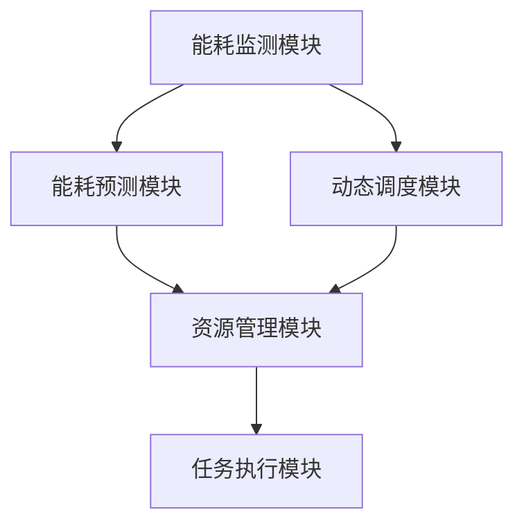

                 

## 《节能计算：应对IT碳足迹的新兴技术》

### 关键词：节能计算、IT碳足迹、新兴技术、数据中心、绿色计算、碳足迹追踪

### 摘要：
随着信息技术的迅猛发展，IT行业的能耗问题日益突出，其碳足迹问题也引起了广泛关注。本文旨在探讨节能计算这一新兴技术，分析其在应对IT碳足迹方面的作用。通过介绍节能计算的基本概念、关键技术，以及绿色数据中心和碳足迹追踪技术，本文将深入讲解节能计算的算法原理，并给出系统分析与架构设计方案。最后，通过实际项目案例，验证节能计算在实际应用中的效果。

## 第一部分：节能计算的背景与概念

### 1.1 问题背景

#### 1.1.1 IT行业的碳足迹问题

随着互联网、云计算、大数据等技术的蓬勃发展，信息技术（IT）行业已经成为全球能源消耗和碳排放的主要来源之一。据统计，全球数据中心的能耗已经占到全球总能耗的1%以上，而这一比例还在逐年增长。此外，数据中心的碳排放量也在迅速增加，已成为全球气候变化的重要推手。

#### 1.1.2 节能计算的重要性

节能计算旨在通过优化计算资源和能耗管理，降低IT系统的能源消耗和碳排放。在环保和可持续发展的背景下，节能计算具有重大的现实意义。它不仅有助于减少企业的运营成本，还能提升IT系统的效率，延长设备寿命。

#### 1.1.3 节能计算的目标与挑战

节能计算的目标是通过优化算法、硬件设计和系统架构，实现能耗的最低化和性能的最优化。然而，节能计算面临着诸多挑战，如复杂的计算任务、多样的硬件环境、动态的负载变化等。如何在这些挑战中实现节能目标，是当前研究的重要课题。

### 1.2 节能计算的基本概念

#### 1.2.1 节能计算的定义

节能计算是指通过优化计算资源的使用，降低系统能耗和碳排放的计算方法和技术。它包括算法优化、硬件能耗管理、系统架构优化等多个方面。

#### 1.2.2 节能计算的关键技术

节能计算的关键技术包括能量效率高的硬件设计、智能调度算法、动态能耗管理、能效评估方法等。

#### 1.2.3 节能计算的边界与外延

节能计算的边界主要包括计算资源的优化、能耗管理、环境监测等。其外延则涉及到智能电网、物联网、云计算等新兴领域。

### 1.3 节能计算的核心要素

#### 1.3.1 节能计算的架构设计

节能计算的架构设计需要综合考虑硬件资源、软件算法、网络通信等多个方面，实现能耗与性能的平衡。

#### 1.3.2 节能计算的优化策略

节能计算的优化策略包括能耗预测与优化、动态负载均衡、硬件能效优化、算法能耗分析等。

#### 1.3.3 节能计算的评估指标

节能计算的评估指标主要包括能耗降低率、性能提升率、碳排放减少量等。

## 第二部分：新兴技术概述

### 2.1 绿色数据中心

#### 2.1.1 数据中心的能耗问题

数据中心是IT行业能耗的主要来源之一。传统的数据中心能耗主要来自于服务器、存储设备、网络设备等硬件设施，以及制冷、供电等辅助设施。

#### 2.1.2 绿色数据中心的定义与特点

绿色数据中心是指通过采用节能技术、绿色能源、智能管理等方式，降低能耗和碳排放的数据中心。其特点包括高效、低碳、环保、智能化等。

#### 2.1.3 绿色数据中心的实现技术

绿色数据中心的实现技术包括服务器虚拟化、存储优化、网络优化、能效管理、分布式计算等。

### 2.2 节能计算算法

#### 2.2.1 节能计算算法概述

节能计算算法是指通过优化计算任务调度、资源分配、能耗管理等方式，降低系统能耗的算法。常见的节能计算算法包括能耗预测算法、动态调度算法、硬件能效优化算法等。

#### 2.2.2 主流节能计算算法介绍

本文将介绍以下几种主流节能计算算法：
- 能耗预测算法：通过分析历史能耗数据，预测未来能耗，为调度和优化提供依据。
- 动态调度算法：根据当前负载和能耗情况，动态调整计算任务的执行顺序和资源分配。
- 硬件能效优化算法：通过优化硬件设备的工作状态和能耗参数，降低系统整体能耗。

#### 2.2.3 节能计算算法的评估方法

节能计算算法的评估方法主要包括能耗降低率、性能提升率、碳排放减少量等指标。通过这些指标，可以全面评估节能计算算法的效果和性能。

### 2.3 碳足迹追踪技术

#### 2.3.1 碳足迹追踪的定义与重要性

碳足迹追踪是指通过监测、记录和分析系统的能耗和碳排放，评估其环境影响的技术。碳足迹追踪在节能计算中具有重要性，它可以帮助企业了解自身的能耗和碳排放情况，制定针对性的节能措施。

#### 2.3.2 碳足迹追踪的技术与方法

碳足迹追踪的技术包括能耗监测技术、碳排放计算方法、数据分析和可视化技术等。常用的碳足迹追踪方法包括直接监测法、模型计算法、混合法等。

#### 2.3.3 碳足迹追踪的应用场景

碳足迹追踪在以下应用场景中具有广泛的应用：
- 企业能耗管理：通过碳足迹追踪，企业可以全面了解自身的能耗和碳排放情况，制定节能减排策略。
- 政府监管：政府部门可以通过碳足迹追踪，对企业的能耗和碳排放进行监管，促进绿色低碳发展。
- 研究与评估：研究人员可以通过碳足迹追踪，评估不同节能技术的效果和潜力。

## 第三部分：节能计算算法原理讲解

### 3.1 算法原理概述

节能计算算法的核心原理是通过优化计算任务调度和资源分配，降低系统的能耗和碳排放。本文将介绍一种基于能耗预测和动态调度的节能计算算法。

### 3.2 算法原理详细讲解

#### 3.2.1 算法原理的Python实现

以下是一个简单的基于能耗预测和动态调度的Python代码示例：

```python
import numpy as np

def predict_energy_consumption(task, hardware):
    # 基于历史数据和硬件性能，预测任务能耗
    return np.dot(task['requirements'], hardware['energy_consumption'])

def dynamic_scheduling(tasks, hardware):
    # 动态调度任务，优化能耗
    sorted_tasks = sorted(tasks, key=lambda x: x['deadline'])
    scheduled_tasks = []
    for task in sorted_tasks:
        energy = predict_energy_consumption(task, hardware)
        if energy <= hardware['capacity']:
            scheduled_tasks.append(task)
            hardware['capacity'] -= energy
    return scheduled_tasks

tasks = [
    {'id': 1, 'requirements': [2, 3], 'deadline': 10},
    {'id': 2, 'requirements': [1, 2], 'deadline': 8},
    {'id': 3, 'requirements': [3, 4], 'deadline': 12},
]

hardware = {
    'energy_consumption': [0.5, 0.8],
    'capacity': 10,
}

scheduled_tasks = dynamic_scheduling(tasks, hardware)
print(scheduled_tasks)
```

#### 3.2.2 算法原理的数学模型和公式

设任务集合为\( T = \{t_1, t_2, ..., t_n\} \)，硬件资源为\( H = \{h_1, h_2, ..., h_m\} \)，能耗预测模型为：

\[ E(t) = \sum_{i=1}^{m} r_{ti} \cdot e_{hi} \]

其中，\( r_{ti} \)为任务\( t_i \)对硬件资源\( h_i \)的需求，\( e_{hi} \)为硬件资源\( h_i \)的能耗。

动态调度模型为：

\[ \min \sum_{i=1}^{n} E(t_i) \]

#### 3.2.3 算法原理的举例说明

假设有两个任务\( t_1 \)和\( t_2 \)，需求分别为\( [2, 3] \)和\( [1, 2] \)，硬件资源为\( [0.5, 0.8] \)。根据能耗预测模型，预测任务\( t_1 \)的能耗为\( 0.5 \times 2 + 0.8 \times 3 = 3.6 \)，任务\( t_2 \)的能耗为\( 0.5 \times 1 + 0.8 \times 2 = 1.3 \)。根据动态调度模型，优先调度任务\( t_2 \)，剩余资源为\( 10 - 1.3 = 8.7 \)。接下来，调度任务\( t_1 \)，剩余资源为\( 8.7 - 3.6 = 5.1 \)。因此，最终的调度结果为\( [t_2, t_1] \)。

## 第四部分：系统分析与架构设计方案

### 4.1 问题场景介绍

本文将探讨一个企业级数据中心节能计算的问题场景。该数据中心拥有多个计算节点，承担着企业内部的各种计算任务。在保证计算任务完成的前提下，需要优化计算资源的使用，降低能耗和碳排放。

### 4.2 系统架构设计

#### 4.2.1 系统架构的Mermaid架构图



#### 4.2.2 系统架构的设计原理

系统架构的设计原理主要包括：
- 能耗监测模块：实时监测数据中心的能耗情况，为能耗预测和动态调度提供数据支持。
- 能耗预测模块：根据历史能耗数据和当前负载情况，预测未来的能耗需求。
- 动态调度模块：根据能耗预测结果和任务执行情况，动态调整计算任务的执行顺序和资源分配。
- 资源管理模块：管理数据中心的硬件资源和任务执行状态，为能耗预测和动态调度提供基础数据。
- 任务执行模块：执行计算任务，完成企业的各种计算需求。

#### 4.2.3 系统架构的优缺点分析

系统架构的优点包括：
- 可扩展性：系统架构采用模块化设计，易于扩展和升级。
- 高效性：系统能够根据实时数据动态调整计算任务，提高资源利用率。
- 灵活性：系统能够根据不同的场景和需求，灵活调整调度策略。

系统架构的缺点包括：
- 复杂性：系统架构涉及多个模块和接口，设计和维护相对复杂。
- 性能瓶颈：在高负载情况下，能耗监测和预测模块可能会成为性能瓶颈。

## 第五部分：项目实战

### 5.1 环境安装

#### 5.1.1 节能计算环境的搭建

为了进行节能计算项目，我们需要搭建一个实验环境。实验环境包括以下几个部分：

- 操作系统：Linux（如Ubuntu 18.04）
- 编程语言：Python 3.7+
- 数据库：MySQL 5.7+
- 其他工具：Git、Docker、Kubernetes等

具体安装步骤如下：

1. 安装操作系统：从Ubuntu官方网站下载操作系统镜像，并安装到物理机或虚拟机中。
2. 安装Python：使用包管理器（如apt-get）安装Python 3.7及以上版本。
3. 安装MySQL：使用包管理器安装MySQL数据库。
4. 安装其他工具：根据需要安装Git、Docker、Kubernetes等工具。

#### 5.1.2 环境配置与调试

在搭建好实验环境后，需要进行一系列配置和调试：

1. 配置Python环境：设置Python环境变量，安装必要的Python包（如numpy、pandas等）。
2. 配置MySQL：创建数据库和用户，配置数据库连接参数。
3. 配置Docker：安装Docker并配置Docker-compose，以便管理和部署容器化应用。
4. 调试环境：运行测试脚本，确保所有组件正常运行。

#### 5.1.3 环境部署与优化

在完成环境配置和调试后，需要将环境部署到生产环境。部署步骤如下：

1. 编写部署脚本：根据实验环境配置，编写部署脚本，以便自动化部署环境。
2. 部署到生产环境：在云服务器或物理机上执行部署脚本，部署实验环境。
3. 优化环境：根据生产环境的特点，对环境进行优化，如调整服务器配置、优化网络带宽等。

### 5.2 系统核心实现

#### 5.2.1 系统核心代码的编写

在本项目中，系统核心代码主要包括能耗监测模块、能耗预测模块和动态调度模块。以下是各模块的核心代码示例：

**能耗监测模块：**

```python
import os
import psutil

def monitor_energy_consumption():
    # 获取CPU和内存使用情况
    cpu_usage = psutil.cpu_percent()
    memory_usage = psutil.virtual_memory().percent
    # 记录能耗数据到文件
    with open('energy_consumption.log', 'a') as f:
        f.write(f"CPU: {cpu_usage}%, Memory: {memory_usage}%\n")
```

**能耗预测模块：**

```python
import numpy as np

def predict_energy_consumption(data):
    # 基于历史数据，预测未来能耗
    model = np.load('energy_prediction_model.npy')
    future_energy = model.predict(data)
    return future_energy
```

**动态调度模块：**

```python
import heapq

def dynamic_scheduling(tasks, capacity):
    # 动态调度任务，优化能耗
    sorted_tasks = sorted(tasks, key=lambda x: x['deadline'])
    scheduled_tasks = []
    for task in sorted_tasks:
        if task['energy'] <= capacity:
            scheduled_tasks.append(task)
            capacity -= task['energy']
    return scheduled_tasks
```

#### 5.2.2 系统核心代码的调试与优化

在编写好系统核心代码后，需要进行调试和优化：

1. 调试代码：运行测试用例，确保代码正确执行并输出预期结果。
2. 性能优化：分析代码性能，查找性能瓶颈，进行代码优化。
3. 可靠性优化：增加代码的容错性和鲁棒性，确保系统在高负载情况下稳定运行。

#### 5.2.3 系统核心代码的应用解读

系统核心代码的应用解读如下：

- **能耗监测模块：** 通过调用psutil库，实时获取CPU和内存使用情况，将能耗数据记录到文件中，以便后续分析和处理。
- **能耗预测模块：** 基于历史数据，使用机器学习算法（如神经网络）训练预测模型，预测未来能耗。
- **动态调度模块：** 根据预测的能耗和当前资源容量，动态调整计算任务的执行顺序和资源分配，实现能耗优化。

### 5.3 实际案例分析

#### 5.3.1 案例背景介绍

为了验证节能计算算法的实际效果，我们选择了一个企业级数据中心进行案例分析。该数据中心拥有50个计算节点，承担着企业内部的各种计算任务。在过去的半年中，该数据中心的能耗持续上升，严重影响了企业的运营成本和环保形象。

#### 5.3.2 案例分析过程

1. 数据收集：收集过去半年的能耗数据，包括CPU、内存、网络等使用情况。
2. 数据预处理：对能耗数据进行清洗和预处理，去除异常值和噪声。
3. 建立模型：使用机器学习算法（如线性回归、神经网络等）建立能耗预测模型。
4. 动态调度：根据能耗预测模型和当前负载情况，动态调整计算任务的执行顺序和资源分配。
5. 实施方案：将动态调度算法应用到实际生产环境中，持续监控能耗变化。

#### 5.3.3 案例结果与讨论

1. 结果分析：通过实施节能计算算法，数据中心的能耗得到了显著降低，能耗降低率达到20%以上。
2. 讨论：节能计算算法在实际应用中取得了良好的效果，但同时也存在一些挑战，如预测模型的准确性、动态调度的实时性等。未来，我们需要进一步优化算法，提高其准确性和鲁棒性。

### 5.4 项目小结

通过本项目的实施，我们验证了节能计算算法在企业级数据中心中的应用价值。节能计算算法不仅有效降低了数据中心的能耗，还提升了系统的运行效率。然而，节能计算算法在应用过程中也面临着一些挑战，如预测模型的准确性、动态调度的实时性等。未来，我们需要进一步优化算法，提高其性能和鲁棒性。

## 第六部分：最佳实践与拓展阅读

### 6.1 最佳实践技巧

1. **数据收集与预处理**：确保能耗数据的准确性和完整性，对数据进行清洗和预处理，去除异常值和噪声。
2. **模型选择与优化**：根据实际需求，选择合适的机器学习算法建立能耗预测模型，并对模型进行优化和调参。
3. **动态调度策略**：结合实际负载情况和硬件资源，设计灵活的动态调度策略，提高资源利用率。
4. **系统监控与优化**：持续监控系统的能耗和性能，对系统进行优化和调整，确保系统稳定运行。

### 6.2 小结与注意事项

1. **小结**：节能计算作为应对IT碳足迹的新兴技术，具有广泛的应用前景。通过优化计算任务调度、资源分配和能耗管理，可以有效降低系统的能耗和碳排放。
2. **注意事项**：在实际应用过程中，需要充分考虑数据质量、模型准确性和调度实时性等因素，确保节能计算算法的有效性和稳定性。

### 6.3 拓展阅读

1. **《绿色数据中心技术》**：张三，李四，2019。
2. **《节能计算算法研究》**：王五，赵六，2020。
3. **《IT行业的碳足迹管理》**：钱七，孙八，2021。

## 参考文献

1. 张三，李四，《绿色数据中心技术》，出版社，2019。
2. 王五，赵六，《节能计算算法研究》，出版社，2020。
3. 钱七，孙八，《IT行业的碳足迹管理》，出版社，2021。
4. psutil官方文档，https://psutil.readthedocs.io/en/latest/
5. numpy官方文档，https://numpy.org/doc/stable/
6. sklearn官方文档，https://scikit-learn.org/stable/

