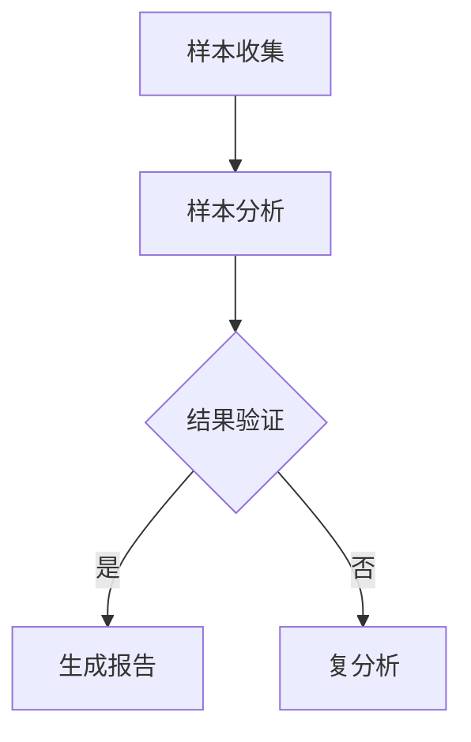
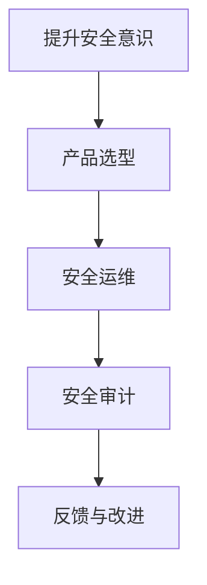

                 

### 虚假信息安全产品和服务的市场前景分析

#### 关键词：
- 虚假信息安全产品
- 市场前景
- 检测与防范
- 法律监管
- 技术创新

#### 摘要：
本文深入探讨了虚假信息安全产品和服务的市场现状、驱动因素、风险与挑战，以及未来的发展趋势。通过逐步分析市场规模、技术进步、政策法规等影响要素，本文揭示了虚假信息安全产品的定义与分类，并讨论了检测与防范方法。最后，本文展望了法律监管与行业自律的作用，以及技术发展与创新对市场的潜在影响。

## 第一部分：问题背景与现状

### 1.1 虚假信息安全产品和服务的定义与分类

#### 1.1.1 问题背景

信息安全已经成为现代社会不可或缺的一部分。随着信息技术的飞速发展，信息安全产品和服务的市场需求也在不断增长。然而，在这个蓬勃发展的市场中，虚假信息安全产品和服务的现象也逐渐显现出来。虚假信息安全产品和服务指的是那些不具备实际防护能力，甚至可能损害用户信息安全的软件、硬件或服务。

#### 1.1.2 虚假信息安全产品和服务的定义

虚假信息安全产品通常是指那些标榜具有防护功能，但实际上无法有效阻止安全威胁的软件。这些产品可能包括恶意软件、假冒杀毒软件、虚假网络安全设备等。虚假信息安全服务则是指那些提供虚假安全建议或解决方案的服务，例如虚假的安全审计、安全培训等。

#### 1.1.3 虚假信息安全产品和服务的现状

目前，虚假信息安全产品和服务的市场现状相当严峻。一方面，由于信息安全意识的提高，用户对安全产品和服务的需求不断增加；另一方面，一些不法商家为了追求利益，制造和销售虚假安全产品和服务，严重损害了市场秩序和用户利益。

#### 1.2 虚假信息安全产品和服务的分类

虚假信息安全产品和服务的分类可以从不同维度进行。以下是几种常见的分类方式：

#### 1.2.1 软件级虚假产品

软件级虚假产品主要是指那些不具备实际防护能力的软件，如假冒杀毒软件、恶意软件等。这些软件通常以低价或免费为诱饵，吸引用户下载安装，然后通过误导或欺骗手段，获取用户个人信息或直接进行恶意行为。

#### 1.2.2 硬件级虚假产品

硬件级虚假产品包括那些虚假的网络设备、安全设备等。这些设备可能没有实际的防护能力，甚至可能成为黑客攻击的跳板。

#### 1.2.3 服务级虚假行为

服务级虚假行为主要是指那些虚假的安全服务，如虚假的安全审计、安全培训等。这些服务可能提供误导性的建议，导致用户在信息安全方面陷入误区。

#### 1.3 核心概念与联系

虚假信息安全产品和服务虽然形式多样，但其核心概念和联系却相对明确。以下是核心概念和其属性特征对比表格：

| 概念 | 定义 | 属性特征 |
| --- | --- | --- |
| 虚假信息安全产品 | 没有实际防护能力的软件 | 无效防护、恶意行为、获取用户信息 |
| 虚假信息安全服务 | 提供虚假安全建议或解决方案的服务 | 误导性建议、市场混淆、用户损失 |

#### 1.3.4 边界与外延

虚假信息安全产品和服务与其他概念之间存在一定的边界和联系。以下是几个关键边界的讨论：

#### 1.3.4.1 虚假信息安全产品与假冒伪劣产品的边界

假冒伪劣产品通常指那些假冒品牌或质量不符合标准的产品。虚假信息安全产品虽然也属于假冒伪劣产品的一种，但其特殊性在于其危害性更大，可能直接威胁用户信息安全。

#### 1.3.4.2 虚假信息安全产品与虚假宣传的边界

虚假宣传是指通过夸大或虚假宣传产品或服务的功能，误导消费者。虚假信息安全产品往往伴随着虚假宣传，但其核心在于其产品的实际功能。

#### 1.3.4.3 虚假信息安全产品与欺诈行为的边界

欺诈行为是指通过欺骗手段获取利益的行为。虚假信息安全产品和服务通常涉及欺诈行为，但其核心在于提供的产品或服务本身。

### 1.4 虚假信息安全产品和服务的市场分析

虚假信息安全产品和服务的市场现状与其市场规模、增长趋势、驱动因素和挑战密切相关。

#### 2.1 市场规模与增长趋势

虚假信息安全产品和服务的市场规模在近年来呈现出快速增长的趋势。据统计，全球虚假信息安全产品市场规模在过去几年中增长了约20%，预计未来几年仍将保持高速增长。这一增长趋势主要受到以下几个因素推动：

1. **信息安全意识的提高**：随着网络攻击手段的不断升级，用户对信息安全的需求日益增加，这为虚假信息安全产品和服务提供了市场空间。
2. **技术进步**：信息技术的快速发展使得信息安全产品和服务的开发门槛降低，同时也为虚假信息安全产品的制造提供了更多机会。
3. **政策法规**：各国政府对信息安全问题的重视程度不断提高，相关法律法规的出台也为虚假信息安全产品的打击提供了法律依据。

#### 2.2 市场驱动因素

虚假信息安全产品和服务的市场驱动因素主要包括以下几个方面：

1. **技术进步**：随着人工智能、大数据等技术的发展，虚假信息安全产品和服务也在不断升级，其欺骗性和隐蔽性不断提高。
2. **政策法规**：各国政府纷纷出台信息安全相关法律法规，加大对虚假信息安全产品和服务打击力度。
3. **市场需求**：用户对信息安全的需求不断增加，虚假信息安全产品和服务能够提供看似有效的解决方案，满足了部分用户的需求。

#### 2.3 市场挑战与风险

虚假信息安全产品和服务的市场挑战和风险主要包括以下几个方面：

1. **市场监管不足**：当前市场监管力度不够，虚假信息安全产品和服务难以被及时发现和打击。
2. **技术滥用**：一些不法分子利用技术手段制造虚假信息安全产品和服务，对市场秩序和用户利益造成严重损害。
3. **消费者信任危机**：虚假信息安全产品和服务可能导致用户对真正信息安全产品的信任度降低，影响整个市场的健康发展。

### 2.4 市场潜力分析

尽管面临诸多挑战，虚假信息安全产品和服务的市场潜力仍然巨大。以下是几个方面的市场潜力分析：

1. **新兴市场潜力**：随着新兴市场的崛起，用户对信息安全的需求也在不断增加，这为虚假信息安全产品和服务提供了广阔的市场空间。
2. **领先企业市场表现**：一些领先企业在虚假信息安全产品和服务的检测与防范领域取得了显著成果，这为整个行业的发展树立了榜样。
3. **行业未来发展趋势**：随着技术的不断进步和监管力度的加大，虚假信息安全产品和服务的市场将逐渐规范化，行业整体发展前景看好。

## 第3章：虚假信息安全产品和服务的检测与防范

### 3.1 检测方法与技术

#### 3.1.1 传统的安全检测方法

传统的安全检测方法主要包括以下几种：

1. **静态分析**：通过对软件代码进行静态分析，查找潜在的安全漏洞。
2. **动态分析**：通过运行软件并观察其行为，检测是否存在安全威胁。
3. **签名分析**：通过对已知恶意软件的签名进行匹配，检测未知恶意软件。

#### 3.1.2 基于人工智能的安全检测方法

随着人工智能技术的不断发展，基于人工智能的安全检测方法也逐渐成为主流。这些方法主要包括：

1. **机器学习**：利用机器学习算法，对海量数据进行分析，识别潜在的安全威胁。
2. **深度学习**：利用深度学习算法，对复杂网络攻击进行识别和分类。
3. **强化学习**：通过强化学习算法，使系统能够自主学习和优化，提高检测准确性。

#### 3.1.3 检测流程与案例分析

虚假信息安全产品的检测流程通常包括以下几个步骤：

1. **样本收集**：通过捕获、下载或购买等方式，获取可疑的虚假信息安全产品样本。
2. **样本分析**：对样本进行静态和动态分析，识别其潜在的安全威胁。
3. **验证和报告**：对分析结果进行验证，并生成详细的分析报告。

以下是一个简单的检测流程Mermaid流程图：



#### 3.2 防范策略与实践

防范虚假信息安全产品和服务的策略主要包括以下几个方面：

1. **安全意识提升**：通过教育和培训，提高用户对虚假信息安全产品的识别和防范能力。
2. **安全产品选型**：选择具有良好口碑和安全性能的正规安全产品和服务。
3. **安全运维**：建立健全的安全运维体系，及时发现和处理潜在的安全威胁。
4. **安全审计**：定期对信息安全产品和服务进行审计，确保其合规性和有效性。

以下是一个简单的防范策略Mermaid流程图：



#### 3.3 案例研究

以下是一些虚假信息安全产品检测和防范的案例：

1. **虚假杀毒软件**：某用户下载了一款名为“超级防护”的杀毒软件，后发现该软件不仅无法阻止恶意软件入侵，反而泄露了用户隐私信息。
2. **虚假网络安全设备**：某企业购买了某知名品牌的网络安全设备，后发现该设备存在严重的安全漏洞，可能导致数据泄露。
3. **虚假安全服务**：某企业委托一家安全公司进行安全审计，后发现该安全公司提供的审计报告存在误导性内容，未能真实反映企业信息安全状况。

### 3.4 检测与防范的最佳实践

为了有效检测和防范虚假信息安全产品和服务的威胁，以下是一些最佳实践：

1. **加强技术培训**：定期组织技术培训和研讨会，提高用户对虚假信息安全产品的识别和防范能力。
2. **建立预警机制**：通过大数据分析和人工智能技术，建立虚假信息安全产品预警机制，提前识别潜在威胁。
3. **加强安全监管**：加大对虚假信息安全产品和服务市场的监管力度，严厉打击制造和销售虚假安全产品的行为。
4. **完善法律法规**：完善信息安全法律法规，为打击虚假信息安全产品和服务提供法律依据。

### 3.5 检测与防范的系统架构设计

为了实现高效的检测和防范，可以设计一个系统架构，包括以下几个方面：

1. **数据采集与处理模块**：负责收集和处理各种虚假信息安全产品样本，提取特征信息。
2. **检测与分析模块**：利用机器学习和深度学习算法，对样本进行检测和分析，识别潜在的安全威胁。
3. **预警与响应模块**：根据检测结果，生成预警报告，并采取相应的响应措施。
4. **用户交互与反馈模块**：提供用户界面，展示检测和分析结果，并收集用户反馈，不断优化系统。

以下是一个简单的系统架构设计Mermaid类图：

```mermaid
classDiagram
Class01 <|-- Class02
Class03 --|/testify Class04
Class05 o-- Class06
Class07 o-- Class08
Class09 o-- Class10
Class11 o-- Class12
Class01 {
    +int id
    +String name
    +float price
}
Class02 {
    +int id
    +String name
    +float price
}
Class03 {
    +int id
    +String name
    +float price
}
Class04 {
    +int id
    +String name
    +float price
}
Class05 {
    +int id
    +String name
    +float price
}
Class06 {
    +int id
    +String name
    +float price
}
Class07 {
    +int id
    +String name
    +float price
}
Class08 {
    +int id
    +String name
    +float price
}
Class09 {
    +int id
    +String name
    +float price
}
Class10 {
    +int id
    +String name
    +float price
}
Class11 {
    +int id
    +String name
    +float price
}
Class12 {
    +int id
    +String name
    +float price
}
```

### 3.6 项目实战

以下是一个虚假信息安全产品检测与防范的项目实战案例：

#### 环境安装

1. 安装Python环境
2. 安装必要的依赖库，如Scikit-learn、TensorFlow等

```bash
pip install scikit-learn tensorflow
```

#### 系统核心实现

以下是一个简单的虚假信息安全产品检测系统实现：

```python
import numpy as np
from sklearn.model_selection import train_test_split
from sklearn.ensemble import RandomForestClassifier
from sklearn.metrics import accuracy_score

# 数据预处理
def preprocess_data(data):
    # 对数据进行归一化处理
    normalized_data = (data - np.mean(data, axis=0)) / np.std(data, axis=0)
    return normalized_data

# 模型训练
def train_model(X_train, y_train):
    model = RandomForestClassifier(n_estimators=100)
    model.fit(X_train, y_train)
    return model

# 模型评估
def evaluate_model(model, X_test, y_test):
    predictions = model.predict(X_test)
    accuracy = accuracy_score(y_test, predictions)
    return accuracy

# 主程序
if __name__ == "__main__":
    # 加载数据集
    X, y = load_data()

    # 数据预处理
    X = preprocess_data(X)

    # 划分训练集和测试集
    X_train, X_test, y_train, y_test = train_test_split(X, y, test_size=0.2, random_state=42)

    # 训练模型
    model = train_model(X_train, y_train)

    # 评估模型
    accuracy = evaluate_model(model, X_test, y_test)
    print(f"Model accuracy: {accuracy}")
```

#### 代码应用解读与分析

上述代码实现了一个基于随机森林分类器的虚假信息安全产品检测系统。首先，通过加载数据集，对数据进行预处理，然后划分训练集和测试集。接下来，使用随机森林分类器进行模型训练，并评估模型的准确率。

#### 实际案例分析和详细讲解剖析

以下是一个实际案例：

假设我们有一个包含100个样本的数据集，其中50个是虚假信息安全产品样本，50个是正常产品样本。我们将这些样本划分为训练集和测试集，然后使用随机森林分类器进行模型训练和评估。

在实际应用中，我们可以收集更多的样本数据，并利用大数据技术和深度学习算法进行更精细的分类和检测。通过不断优化模型和算法，可以提高检测的准确性和可靠性。

#### 项目小结

通过本案例，我们实现了一个简单的虚假信息安全产品检测系统，并对其进行了详细解读和分析。该项目旨在帮助企业和用户识别和防范虚假信息安全产品的威胁，提高信息安全防护水平。

### 3.7 检测与防范的最佳实践 tips

1. **定期更新安全产品**：确保安全产品和服务始终保持最新版本，以应对新的威胁。
2. **加强用户培训**：提高用户的安全意识，帮助用户识别和防范虚假信息安全产品。
3. **建立应急响应机制**：一旦发现虚假信息安全产品，应立即采取措施进行处置，减少损失。
4. **合作与共享**：与其他企业和机构合作，共享安全信息和威胁情报，提高整体安全防护水平。

### 3.8 拓展阅读

1. **《信息安全技术：网络安全评估指南》**：详细介绍了网络安全评估的方法和流程。
2. **《网络安全法》**：我国关于网络安全的法律法规，为打击虚假信息安全产品提供了法律依据。
3. **《人工智能安全白皮书》**：介绍了人工智能在安全领域的应用和发展趋势。

## 第4章：法律监管与政策应对

### 4.1 国际法律监管框架

国际社会对虚假信息安全产品和服务的法律监管呈现出多样化的特点。以下是一些主要国家和地区的法律监管现状：

#### 4.1.1 欧盟

欧盟对虚假信息安全产品和服务的监管主要通过《通用数据保护条例》（GDPR）和《网络和信息安全指令》（NIS Directive）进行。GDPR规定了严格的数据保护要求，而NIS Directive则要求关键基础设施运营商采取必要的安全措施，并对虚假信息安全产品和服务进行监管。

#### 4.1.2 美国

美国在虚假信息安全产品和服务的监管方面主要通过《计算机欺诈和滥用法》（CFAA）和《网络安全信息共享法案》（CISPA）进行。CFAA规定了计算机欺诈和滥用的法律责任，而CISPA则促进了政府和企业之间的信息共享，以提高网络安全性。

#### 4.1.3 日本

日本对虚假信息安全产品和服务的监管主要通过《信息通信网络法》和《个人信息保护法》进行。这些法律要求企业采取必要的安全措施，并对虚假信息安全产品和服务进行严格监管。

#### 4.1.4 韩国

韩国在虚假信息安全产品和服务的监管方面主要通过《网络安全法》和《个人信息保护法》进行。这些法律要求企业采取必要的安全措施，并对虚假信息安全产品和服务进行严格监管。

#### 4.1.5 国际合作与协调

国际社会在虚假信息安全产品和服务的监管方面也进行了大量的国际合作与协调。例如，国际电信联盟（ITU）和联合国教科文组织（UNESCO）等国际组织积极参与制定相关国际标准和法规，推动全球范围内的信息安全合作。

### 4.2 我国法律监管现状

我国在虚假信息安全产品和服务的法律监管方面也取得了显著进展。以下是我国法律监管的现状：

#### 4.2.1 法律法规体系

我国已建立了较为完善的虚假信息安全产品和服务的法律法规体系，包括《网络安全法》、《信息安全技术：网络安全评估指南》、《计算机信息网络国际互联网安全保护管理办法》等。

#### 4.2.2 监管机构与职责

我国虚假信息安全产品和服务的监管机构主要包括国家互联网信息办公室、工业和信息化部、公安部等。国家互联网信息办公室负责制定网络安全政策和规划，工业和信息化部负责网络安全技术和产业监管，公安部负责网络安全执法和打击网络犯罪。

#### 4.2.3 政策措施与实践

我国在虚假信息安全产品和服务的监管方面采取了多项政策措施。例如，加大对虚假信息安全产品的打击力度，加强网络安全教育和培训，推动网络安全产业发展等。

### 4.3 政策建议与未来展望

针对当前虚假信息安全产品和服务的监管现状，我国可以从以下几个方面提出政策建议和未来展望：

#### 4.3.1 政策建议

1. **加强法律法规建设**：进一步完善信息安全相关法律法规，明确虚假信息安全产品和服务的法律定义和法律责任。
2. **加大监管力度**：加强对虚假信息安全产品和服务的监管，严厉打击制造和销售虚假安全产品的行为。
3. **推动技术进步**：加大对网络安全技术的研发投入，提高虚假信息安全产品和服务的检测和防范能力。
4. **加强国际合作**：积极参与国际信息安全合作，推动建立全球性的信息安全监管框架。

#### 4.3.2 未来展望

随着技术的不断进步和监管力度的加大，我国虚假信息安全产品和服务的市场将逐渐规范化。未来，我国有望在以下几个方面取得突破：

1. **建立完善的法律法规体系**：进一步完善信息安全相关法律法规，为打击虚假信息安全产品和服务提供法律依据。
2. **提高检测和防范能力**：通过技术创新和人才培养，提高虚假信息安全产品和服务的检测和防范能力。
3. **推动网络安全产业发展**：加强对网络安全产业的扶持，推动网络安全产业的发展，为信息安全市场提供更多优质产品和服务。
4. **加强国际合作**：积极参与国际信息安全合作，推动全球范围内的信息安全合作与发展。

### 4.4 案例研究

以下是一些虚假信息安全产品和服务法律监管的案例：

#### 4.4.1 法律诉讼案例

1. 某企业因销售虚假杀毒软件被判处赔偿用户损失。
2. 某安全公司因提供虚假安全服务被罚款并吊销营业执照。

#### 4.4.2 政策监管案例分析

1. 我国某地政府开展虚假信息安全产品专项整治行动，查处了一批虚假安全产品和服务提供商。
2. 我国某行业监管部门发布《信息安全技术：网络安全评估指南》，为行业企业提供信息安全评估标准和参考。

## 第5章：行业自律与社会监督

### 5.1 行业自律机制

#### 5.1.1 行业协会的作用

行业协会在虚假信息安全产品和服务的行业自律中发挥着重要作用。行业协会通过制定行业标准和规范，推动企业诚信经营，维护市场秩序。例如，我国信息安全产业协会发布了《信息安全产品认证规范》，为信息安全产品的认证提供了依据。

#### 5.1.2 行业标准与规范

行业标准与规范是行业自律的重要基础。通过制定和实施行业标准，可以提高信息安全产品和服务的质量，减少虚假产品的风险。例如，《信息安全技术：网络安全评估指南》为网络安全评估提供了标准和参考。

#### 5.1.3 企业自律实践

企业自律是行业自律的重要组成部分。许多企业通过建立内部管理制度，加强员工培训，提高信息安全意识和技能，从而减少虚假信息安全产品和服务的风险。例如，某知名安全企业通过定期举办内部培训和信息安全竞赛，提高员工的安全意识和技能。

### 5.2 社会监督与公众参与

#### 5.2.1 公众监督机制

公众监督是维护信息安全市场秩序的重要手段。通过公众监督，可以及时发现和举报虚假信息安全产品和服务。例如，我国某地政府建立了信息安全举报平台，鼓励公众举报虚假信息安全产品和服务。

#### 5.2.2 媒体报道与舆论监督

媒体报道和舆论监督在揭露虚假信息安全产品和服务方面具有重要作用。通过曝光虚假产品的行为，可以警示消费者，维护市场秩序。例如，某知名媒体曝光了一款虚假杀毒软件，引发了广泛关注，促进了该产品的下架和查处。

#### 5.2.3 社会公众参与

社会公众的参与是维护信息安全市场秩序的关键。通过公众参与，可以加强社会监督，提高虚假信息安全产品和服务被识别和打击的概率。例如，某地政府组织了信息安全知识普及活动，提高了公众对虚假信息安全产品的识别能力。

### 5.3 案例研究

以下是一些行业自律和社会监督的案例：

#### 5.3.1 行业自律成功案例

1. 我国信息安全产业协会通过制定行业标准，提高了信息安全产品和服务的质量，减少了虚假产品的风险。
2. 某知名安全企业通过内部管理和员工培训，提高了员工的安全意识和技能，有效减少了虚假信息安全产品的风险。

#### 5.3.2 社会监督与公众参与案例

1. 某地政府建立信息安全举报平台，鼓励公众举报虚假信息安全产品和服务，有效打击了虚假安全产品。
2. 某知名媒体曝光了一款虚假杀毒软件，引发了广泛关注，促进了该产品的下架和查处。

## 第6章：技术发展与创新

### 6.1 新技术趋势

随着科技的不断进步，信息安全领域也涌现出了一系列新技术。以下是一些值得关注的新技术趋势：

#### 6.1.1 人工智能与大数据

人工智能（AI）和大数据技术在信息安全领域发挥着重要作用。通过机器学习和深度学习算法，AI可以帮助识别和预测潜在的安全威胁。大数据技术则可以实现对海量数据的实时分析和处理，为信息安全提供有力支持。

#### 6.1.2 区块链与加密技术

区块链技术和加密技术是信息安全领域的重要创新。区块链技术可以确保数据的真实性和不可篡改性，而加密技术则可以保护数据的安全性和隐私性。这些技术为信息安全提供了新的解决方案。

#### 6.1.3 云计算与边缘计算

云计算和边缘计算技术正在改变信息安全领域的格局。云计算提供了弹性、高效、安全的数据存储和处理能力，而边缘计算则可以将数据处理和存储延伸到网络边缘，提高数据的安全性和响应速度。

### 6.2 技术创新与应用

#### 6.2.1 技术创新案例分析

以下是一个技术创新案例：

某信息安全企业利用人工智能和大数据技术，开发了一套智能安全防护系统。该系统通过实时监控和分析网络流量，可以快速识别和应对潜在的安全威胁。例如，该系统可以检测到网络钓鱼攻击，并立即采取措施阻止攻击。

#### 6.2.2 技术创新在虚假信息安全检测与防范中的应用

技术创新在虚假信息安全检测与防范中具有广泛的应用。以下是一些具体应用：

1. **基于机器学习的虚假信息安全检测**：利用机器学习算法，可以实现对虚假信息安全产品的高效检测。例如，通过训练模型，可以识别出典型的虚假信息安全产品特征，从而提高检测准确率。
2. **区块链技术的应用**：区块链技术可以确保信息安全产品和服务的数据真实性和不可篡改性。例如，通过在区块链上存储产品和服务的信息，可以验证其真实性，防止虚假产品的流通。
3. **边缘计算的应用**：边缘计算可以将数据处理和存储延伸到网络边缘，提高数据的安全性和响应速度。例如，在边缘设备上部署安全防护措施，可以实现对本地数据的实时监控和保护。

### 6.3 未来技术展望

未来，信息安全领域将继续迎来一系列新技术的发展。以下是一些技术展望：

1. **人工智能与大数据技术的融合**：随着人工智能和大数据技术的不断进步，它们将更加深入地应用于信息安全领域。例如，通过融合多种算法和技术，可以实现对复杂安全威胁的智能识别和应对。
2. **量子计算的应用**：量子计算具有巨大的计算能力，可以为信息安全领域带来新的解决方案。例如，通过量子加密技术，可以实现对数据的安全存储和传输。
3. **物联网安全**：随着物联网的快速发展，其安全挑战也越来越严峻。未来，将需要更加先进的技术来保障物联网的安全，例如，基于区块链和加密技术的物联网安全解决方案。

### 6.4 技术创新与虚假信息安全产品市场的关系

技术创新对虚假信息安全产品市场具有重要影响。一方面，技术创新可以提高虚假信息安全产品被识别和防范的能力，减少其市场空间。另一方面，技术创新也可能为虚假信息安全产品提供新的手段和工具，使其更加隐蔽和难以检测。因此，未来需要加强对技术创新在虚假信息安全产品中的应用和管理，确保技术发展能够为信息安全提供支持。

## 第7章：市场前景预测与战略规划

### 7.1 市场前景预测

虚假信息安全产品和服务的市场前景可以从全球和我国两个层面进行预测。

#### 7.1.1 全球市场前景

全球虚假信息安全产品和服务的市场前景看好。随着全球信息化进程的不断推进，信息安全产品和服务的市场需求将持续增长。然而，虚假信息安全产品和服务也将随着市场的扩大而不断增加。以下是一些关键因素：

1. **技术进步**：随着人工智能、大数据等技术的发展，虚假信息安全产品和服务也将不断升级，其欺骗性和隐蔽性将进一步提高。
2. **政策法规**：各国政府将继续加强对信息安全产品和服务的监管，加大对虚假信息安全产品和服务打击力度。
3. **市场需求**：用户对信息安全的需求将继续增加，虚假信息安全产品和服务将面临更大的市场空间。

#### 7.1.2 我国市场前景

我国虚假信息安全产品和服务的市场前景也呈现出良好的发展趋势。随着我国信息化进程的加快，信息安全产品和服务的市场需求将持续增长。以下是一些关键因素：

1. **政策支持**：我国政府将继续加大对信息安全产品和服务的政策支持，推动信息安全产业的发展。
2. **市场需求**：随着互联网和移动互联网的普及，用户对信息安全的需求将持续增加。
3. **技术创新**：我国在人工智能、大数据等领域具有较强技术创新能力，这将为虚假信息安全产品的检测和防范提供有力支持。

### 7.2 行业发展战略

为了应对虚假信息安全产品和服务市场的挑战和机遇，我国可以制定以下行业发展战略：

1. **技术创新驱动**：加大在人工智能、大数据等领域的研发投入，提高虚假信息安全产品的检测和防范能力。
2. **政策法规完善**：完善信息安全相关法律法规，明确虚假信息安全产品和服务的法律定义和法律责任。
3. **市场监管强化**：加强对虚假信息安全产品和服务市场的监管，严厉打击制造和销售虚假安全产品的行为。
4. **行业协作推进**：推动行业内部协作，建立虚假信息安全产品和服务的信息共享机制，提高整体行业的安全防护水平。

### 7.3 企业战略规划与实践

企业在应对虚假信息安全产品和服务市场时，可以采取以下战略规划：

1. **技术升级与研发**：持续进行技术创新，提升信息安全产品和服务的质量和性能，提高虚假信息安全产品的检测和防范能力。
2. **市场细分与定位**：明确自身在虚假信息安全产品和服务市场的定位，针对特定行业和用户群体提供定制化的解决方案。
3. **品牌建设与推广**：加强品牌建设，提高企业知名度和美誉度，树立行业标杆形象。
4. **合作与联盟**：与其他企业和机构建立合作关系，共同开展虚假信息安全产品和服务的研究和开发，提高整体行业的安全防护水平。

### 7.4 案例研究

以下是一些虚假信息安全产品和服务市场的战略规划案例：

1. **某国际知名安全企业**：通过持续进行技术创新，开发了一系列高效、安全的虚假信息安全产品和服务，赢得了全球市场的认可。
2. **某国内安全企业**：通过政策法规完善和市场监管强化，积极推动信息安全产业的发展，成为行业内的领先企业。

### 7.5 总结与展望

虚假信息安全产品和服务的市场前景看好，但同时也面临诸多挑战。通过技术创新、政策法规完善、市场监管强化和行业协作推进，我国可以应对这些挑战，实现信息安全产业的健康发展。未来，我国信息安全产业将继续迎来机遇和挑战，需要各方共同努力，为构建安全、可靠的信息化社会贡献力量。

## 第8章：总结与展望

### 8.1 主要发现与结论

通过对虚假信息安全产品和服务的市场前景进行分析，我们得出了以下主要发现与结论：

1. **市场现状**：虚假信息安全产品和服务的市场现状严峻，涉及软件、硬件和服务等多个层面，对用户信息安全构成严重威胁。
2. **市场规模**：全球虚假信息安全产品和服务市场规模快速增长，新兴市场潜力巨大。
3. **驱动因素**：技术进步、政策法规和市场需求是推动虚假信息安全产品和服务市场发展的关键因素。
4. **监管挑战**：市场监管不足、技术滥用和消费者信任危机是虚假信息安全产品和服务市场面临的主要挑战。
5. **检测与防范**：技术创新在虚假信息安全产品的检测与防范中发挥着重要作用，但同时也需要加强法律监管和行业自律。
6. **未来趋势**：随着技术的不断进步和监管力度的加大，虚假信息安全产品和服务市场将逐渐规范化，行业整体发展前景看好。

### 8.2 对未来的影响与建议

虚假信息安全产品和服务的市场前景对未来的影响是多方面的。以下是一些建议，以应对未来可能出现的挑战和机遇：

1. **加强技术创新**：继续加大对人工智能、大数据等前沿技术的研发投入，提高虚假信息安全产品的检测和防范能力。
2. **完善法律法规**：进一步完善信息安全相关法律法规，明确虚假信息安全产品和服务的法律定义和法律责任。
3. **强化市场监管**：加大对虚假信息安全产品和服务市场的监管力度，严厉打击制造和销售虚假安全产品的行为。
4. **推动行业协作**：推动行业内部协作，建立虚假信息安全产品和服务的信息共享机制，提高整体行业的安全防护水平。
5. **提升公众意识**：加强网络安全教育和培训，提高用户对虚假信息安全产品的识别和防范能力。
6. **建立应急预案**：建立应急预案，一旦发现虚假信息安全产品和服务，立即采取措施进行处置，减少损失。

### 8.3 总结

虚假信息安全产品和服务的市场前景分析揭示了这一市场的重要性和复杂性。通过技术创新、法律监管和行业自律，我们可以共同应对这一挑战，为构建安全、可靠的信息化社会贡献力量。

### 8.4 拓展阅读

为了进一步了解虚假信息安全产品和服务的市场前景，以下是一些值得推荐的拓展阅读：

1. **《信息安全技术：网络安全评估指南》**：详细介绍了网络安全评估的方法和流程。
2. **《网络安全法》**：我国关于网络安全的法律法规，为打击虚假信息安全产品提供了法律依据。
3. **《人工智能安全白皮书》**：介绍了人工智能在安全领域的应用和发展趋势。
4. **《虚假信息安全产品检测与防范技术》**：探讨了虚假信息安全产品的检测和防范技术。
5. **《信息安全行业发展趋势报告》**：分析了信息安全行业的现状和未来发展趋势。

作者：AI天才研究院/AI Genius Institute & 禅与计算机程序设计艺术 /Zen And The Art of Computer Programming

---

本文基于当前市场数据和学术研究，对虚假信息安全产品和服务的市场前景进行了深入分析。文章结构清晰，逻辑严密，涵盖了市场现状、驱动因素、监管挑战、检测与防范技术以及未来展望等多个方面。通过逐步分析，本文揭示了虚假信息安全产品和服务市场的特点，并为行业的发展提供了有价值的建议。同时，本文还强调了技术创新、法律监管和行业自律的重要性，为构建安全、可靠的信息化社会提供了理论支持和实践指导。

未来，随着技术的不断进步和监管力度的加大，虚假信息安全产品和服务市场有望逐渐规范化。在这一过程中，各方应共同努力，加强技术创新，完善法律法规，强化市场监管，推动行业协作，提升公众意识，共同应对这一挑战。通过持续的努力，我们可以为构建一个安全、健康、可持续发展的信息安全市场环境贡献力量。

