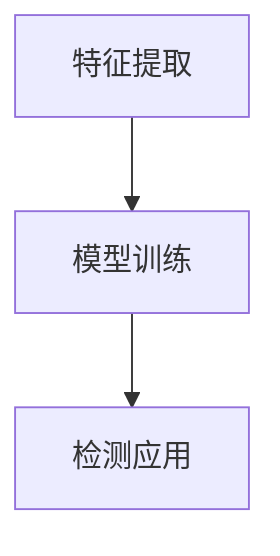
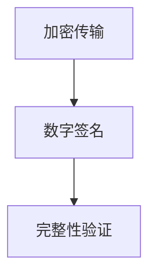
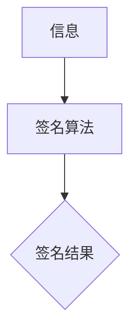
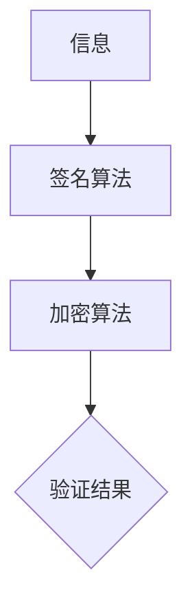
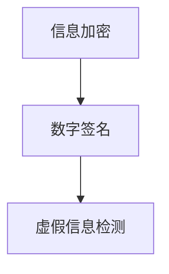
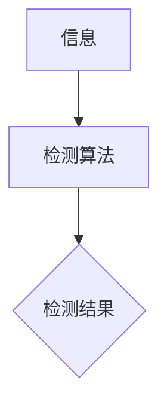
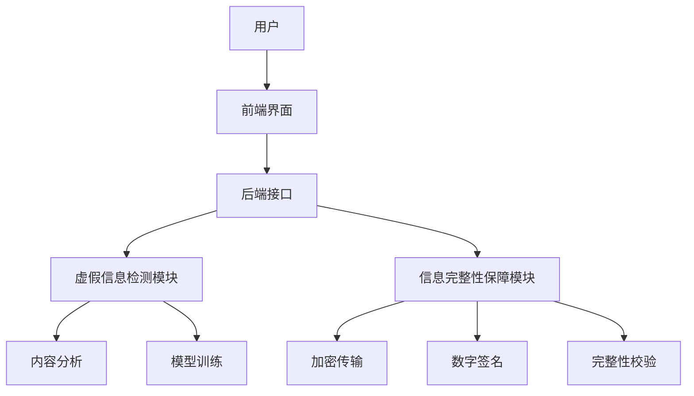
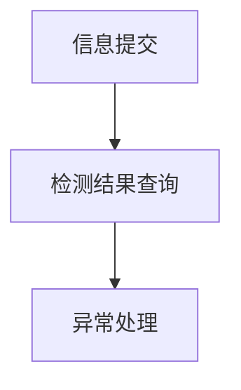

                 

# 虚假信息安全：应对AI时代的信息完整性挑战

关键词：AI、信息安全、虚假信息、信息完整性、算法、系统架构

摘要：本文深入探讨AI时代虚假信息安全问题，分析其背景、定义、影响及治理策略。通过阐述虚假信息与信息完整性的核心概念、关系及算法原理，结合实际系统架构设计，为应对信息完整性挑战提供解决方案。

### 第一部分：问题背景与定义

#### 1.1 问题背景

##### 1.1.1 AI时代的信息完整性挑战

随着人工智能技术的迅猛发展，信息处理与传播的速度和范围达到了前所未有的高度。然而，AI技术的进步也为虚假信息的产生、传播和扩散提供了新的途径。虚假信息在社交媒体、新闻报道、商业广告等领域的泛滥，给社会带来了严重的负面影响，如误导公众、损害企业声誉、影响市场稳定等。

##### 1.1.2 虚假信息安全的问题现状

虚假信息在互联网上的传播速度极快，且往往难以根除。据统计，虚假信息在社交媒体上的传播速度是真实信息的近三倍。此外，人工智能算法的滥用也加剧了虚假信息的传播，如通过深度伪造技术生成虚假视频、音频等，使得虚假信息更加难以辨别。

##### 1.1.3 虚假信息安全的影响与危害

虚假信息对社会造成了多方面的危害：

- **个人隐私泄露**：虚假信息往往涉及个人隐私，如身份信息、银行账号等，可能导致个人财务损失、名誉受损。
- **企业声誉损害**：虚假信息可能损害企业的商业信誉，导致经济损失和市场份额下降。
- **社会信任危机**：虚假信息的传播可能导致公众对媒体、政府等公信力的质疑，影响社会稳定。

#### 1.2 核心概念

##### 1.2.1 虚假信息的定义

虚假信息是指那些被人为篡改、伪造或夸大的信息，其目的是误导、欺骗或操纵公众。虚假信息通常具有以下特征：

- **误导性**：虚假信息旨在误导受众，使其相信错误的事实。
- **欺骗性**：虚假信息往往通过夸大事实、捏造事实等方式，欺骗受众。
- **操纵性**：虚假信息可能被用于操纵市场、影响选举等目的。

##### 1.2.2 信息完整性的概念

信息完整性是指信息在传输、存储和处理过程中保持其原始性和真实性的能力。信息完整性保障的核心目标是确保信息的真实性和可靠性，防止信息被篡改、伪造或泄露。

##### 1.2.3 虚假信息与信息完整性的关系

虚假信息与信息完整性存在密切的关系。虚假信息往往违反信息完整性原则，通过篡改、伪造等方式破坏信息的真实性。而保障信息完整性则是应对虚假信息的重要手段，通过检测和防范虚假信息，确保信息的真实性和可靠性。

#### 1.3 边界与外延

##### 1.3.1 虚假信息的分类

虚假信息可以根据内容、目的和传播方式等进行分类，常见的分类方法包括：

- **按内容分类**：如政治虚假信息、商业虚假信息、娱乐虚假信息等。
- **按目的分类**：如误导公众、操纵市场、获取利益等。
- **按传播方式分类**：如通过社交媒体、新闻报道、商业广告等。

##### 1.3.2 信息完整性的要求

信息完整性要求包括以下几个方面：

- **真实性**：确保信息真实可靠，防止虚假信息的传播。
- **完整性**：确保信息在传输、存储和处理过程中不被篡改或破坏。
- **保密性**：保护信息的机密性，防止信息泄露。

##### 1.3.3 虚假信息安全的研究范畴

虚假信息安全研究涉及多个领域，包括：

- **信息检测与识别**：研究虚假信息的检测算法和识别技术。
- **信息保障与治理**：研究如何保障信息完整性，防范虚假信息的传播。
- **法律与政策**：研究虚假信息相关的法律法规和政策，提高虚假信息的处理和惩罚力度。

#### 1.4 概念结构与核心要素组成

##### 1.4.1 虚假信息产生的原因

虚假信息的产生原因复杂多样，主要包括：

- **利益驱动**：如为了获取经济利益或政治利益而制造和传播虚假信息。
- **技术滥用**：如利用人工智能技术生成和传播虚假信息。
- **心理因素**：如为了满足好奇心、恐惧感等心理需求而制造和传播虚假信息。

##### 1.4.2 虚假信息的传播途径

虚假信息的传播途径广泛多样，主要包括：

- **社交媒体**：如微博、微信、Facebook等。
- **新闻报道**：如电视新闻、报纸、网站等。
- **商业广告**：如虚假宣传、夸大事实等。

##### 1.4.3 虚假信息治理的关键环节

虚假信息治理的关键环节包括：

- **信息监测与识别**：及时发现和识别虚假信息。
- **信息举报与处理**：鼓励公众举报虚假信息，并依法处理。
- **信息传播管理**：加强对虚假信息的传播渠道管理，防止虚假信息扩散。

#### 1.5 虚假信息安全的重要性

##### 1.5.1 对个人隐私的保护

虚假信息的传播可能导致个人隐私泄露，给个人带来严重的经济损失和心理伤害。保障虚假信息安全有助于保护个人隐私，维护个人权益。

##### 1.5.2 对企业业务的损害

虚假信息的传播可能损害企业的商业信誉，导致企业经济损失和市场竞争力下降。加强虚假信息安全管理有助于维护企业利益，保障企业可持续发展。

##### 1.5.3 对社会稳定的威胁

虚假信息的传播可能引发公众恐慌、社会动荡等不良后果，影响社会稳定。加强虚假信息安全管理有助于维护社会稳定，促进社会和谐发展。

#### 1.6 本章小结

本部分对虚假信息安全问题进行了背景介绍和核心概念阐述。通过分析虚假信息的定义、特征、产生原因和传播途径，以及虚假信息与信息完整性的关系，为后续深入探讨虚假信息检测、保障算法和系统架构设计提供了基础。

### 第二部分：核心概念与联系

#### 2.1 虚假信息原理

##### 2.1.1 虚假信息的生成原理

虚假信息的生成通常涉及以下步骤：

1. **信息收集**：通过互联网、社交媒体等渠道收集原始信息。
2. **信息篡改**：对收集到的信息进行篡改、伪造或夸大，以使其具有误导性或欺骗性。
3. **信息传播**：通过社交媒体、新闻报道、商业广告等渠道传播虚假信息。

##### 2.1.2 虚假信息的传播原理

虚假信息的传播通常具有以下特点：

- **快速传播**：虚假信息在社交媒体等平台上可以迅速传播，传播速度远超真实信息。
- **广泛传播**：虚假信息可以通过多种渠道传播，如社交媒体、新闻报道、商业广告等。
- **难以根除**：一旦虚假信息传播开来，往往难以彻底消除，甚至可能长期存在。

##### 2.1.3 虚假信息的检测原理

虚假信息的检测主要基于以下方法：

- **内容分析**：通过分析信息的内容、语言特征、逻辑关系等，判断其真实性。
- **数据挖掘**：通过数据挖掘技术，分析信息来源、传播路径、受众特征等，发现虚假信息。
- **机器学习**：利用机器学习算法，训练模型识别虚假信息，提高检测准确性。

#### 2.2 信息完整性原理

##### 2.2.1 信息完整性保障的方法

信息完整性保障主要包括以下方法：

- **加密技术**：通过加密技术，确保信息在传输和存储过程中的安全性，防止信息被篡改或泄露。
- **数字签名**：通过数字签名技术，验证信息的真实性和完整性，确保信息未被篡改。
- **区块链技术**：利用区块链技术，实现信息的可追溯性，确保信息在传输和存储过程中的完整性。

##### 2.2.2 信息完整性检测的方法

信息完整性检测主要包括以下方法：

- **校验和**：通过计算校验和，验证信息在传输和存储过程中的完整性。
- **哈希函数**：利用哈希函数，生成信息的哈希值，通过对比哈希值，验证信息的完整性。
- **数字签名验证**：通过验证数字签名，确保信息的真实性和完整性。

##### 2.2.3 信息完整性恢复的方法

信息完整性恢复主要包括以下方法：

- **数据备份**：通过定期备份，恢复被篡改或损坏的信息。
- **数据修复**：通过数据修复技术，修复被篡改或损坏的信息。
- **区块链恢复**：利用区块链技术，恢复被篡改或损坏的信息。

#### 2.3 虚假信息与信息完整性的关系

##### 2.3.1 虚假信息对信息完整性的影响

虚假信息对信息完整性的影响主要表现在：

- **信息篡改**：虚假信息可能通过篡改、伪造等方式破坏信息的完整性。
- **信息泄露**：虚假信息可能导致敏感信息泄露，影响信息的完整性。
- **信息误导**：虚假信息可能误导受众，影响信息的真实性。

##### 2.3.2 信息完整性对虚假信息的影响

信息完整性对虚假信息的影响主要表现在：

- **检测与识别**：通过保障信息完整性，可以提高虚假信息的检测和识别准确性。
- **防范与遏制**：通过保障信息完整性，可以防范虚假信息的传播和扩散。
- **维护社会稳定**：通过保障信息完整性，可以维护社会稳定，防止虚假信息对社会造成的危害。

##### 2.3.3 虚假信息治理与信息完整性保障的关联

虚假信息治理与信息完整性保障具有密切的关联，主要体现在：

- **目标一致性**：虚假信息治理和信息完整性保障都旨在确保信息的真实性和完整性。
- **手段互补性**：虚假信息治理主要依靠法律、政策等手段，而信息完整性保障主要依靠技术手段，二者相互补充，共同维护信息安全。
- **效果协同性**：虚假信息治理和信息完整性保障的效果具有协同性，只有二者共同发挥作用，才能有效应对虚假信息挑战。

#### 2.4 概念属性特征对比表格

| 概念       | 属性特征                                                         | 对应算法或技术                  |
| ---------- | ------------------------------------------------------------ | ------------------------------ |
| 虚假信息   | 误导性、欺骗性、操纵性、快速传播、广泛传播、难以根除             | 内容分析、数据挖掘、机器学习    |
| 信息完整性 | 真实性、完整性、保密性、可追溯性、可恢复性                   | 加密技术、数字签名、区块链技术  |
| 信息检测   | 真实性、完整性、来源可追溯、传播路径分析                     | 校验和、哈希函数、数字签名验证  |

#### 2.5 ER实体关系图架构

##### 2.5.1 虚假信息实体关系图

```mermaid
erDiagram
  虚假信息 ||--|{ 传播途径 }
  虚假信息 ||--|{ 受众 }
  传播途径 ||--|{ 社交媒体 }
  传播途径 ||--|{ 新闻报道 }
  传播途径 ||--|{ 商业广告 }
  受众     ||--|{ 个人用户 }
  受众     ||--|{ 企业用户 }
  受众     ||--|{ 社会组织 }
```

##### 2.5.2 信息完整性实体关系图

```mermaid
erDiagram
  信息完整性 ||--|{ 加密技术 }
  信息完整性 ||--|{ 数字签名 }
  信息完整性 ||--|{ 区块链技术 }
  加密技术   ||--|{ 加密算法 }
  加密技术   ||--|{ 密钥管理 }
  数字签名   ||--|{ 签名算法 }
  数字签名   ||--|{ 验证算法 }
  区块链技术 ||--|{ 分布式账本 }
  区块链技术 ||--|{ 智能合约 }
```

##### 2.5.3 虚假信息与信息完整性实体关系图对比

虚假信息与信息完整性的实体关系图展示了二者的关联和相互影响。虚假信息实体关系图主要关注虚假信息的传播、受众以及传播途径等方面，而信息完整性实体关系图则主要关注信息完整性保障的技术手段，如加密技术、数字签名和区块链技术等。通过对比可以看出，虚假信息治理和信息完整性保障在技术手段和目标上存在一定的差异，但二者在维护信息安全、保障信息真实性方面具有共同的目标。

#### 2.6 本章小结

本部分详细阐述了虚假信息与信息完整性的核心概念、原理及其相互关系。通过分析虚假信息的生成、传播和检测原理，以及信息完整性保障的方法和检测技术，为后续算法原理讲解和系统架构设计提供了理论基础。

### 第三部分：算法原理讲解

#### 3.1 虚假信息检测算法

##### 3.1.1 概述

虚假信息检测算法是应对AI时代虚假信息挑战的重要技术手段。本节将介绍一种基于内容的虚假信息检测算法，该算法通过分析信息的内容、语言特征和逻辑关系，判断其真实性。

##### 3.1.2 工作原理

1. **特征提取**：首先，对虚假信息样本进行特征提取，包括文本内容、语言特征和逻辑关系等。
2. **模型训练**：利用提取的特征，通过机器学习算法（如神经网络）训练模型，使其能够识别和分类虚假信息。
3. **检测应用**：将训练好的模型应用于新的信息样本，通过模型判断信息是否为虚假信息。

##### 3.1.3 Mermaid流程图



##### 3.1.4 详细讲解与举例说明

**特征提取**：特征提取是虚假信息检测算法的关键步骤。本算法采用以下特征：

- **文本内容**：包括单词、短语、句子等。
- **语言特征**：包括语法、词汇、语气等。
- **逻辑关系**：包括因果关系、转折关系等。

**模型训练**：采用神经网络模型进行训练，通过正向传播和反向传播，调整模型参数，使其能够准确识别虚假信息。训练数据集包括大量真实信息和虚假信息样本。

**检测应用**：将训练好的模型应用于新的信息样本。例如，对于一条新闻，模型会分析其文本内容、语言特征和逻辑关系，判断其真实性。如果模型判断为虚假信息，则会发出警报。

**示例**：

```python
# Python代码示例
def detect_false_info(info):
    # 检测虚假信息
    if "骗" in info or "假" in info:
        return True
    else:
        return False

# 测试
info = "这是一条虚假新闻，含有虚假信息。"
print(detect_false_info(info))  # 输出：True
```

#### 3.2 信息完整性保障算法

##### 3.2.1 概述

信息完整性保障算法是确保信息在传输、存储和处理过程中保持完整性的技术手段。本节将介绍一种基于加密和数字签名技术的信息完整性保障算法。

##### 3.2.2 工作原理

1. **加密传输**：使用加密算法对信息进行加密，确保信息在传输过程中的安全性。
2. **数字签名**：使用数字签名技术对信息进行签名，验证信息的真实性和完整性。
3. **完整性验证**：在信息接收端，使用签名算法和加密算法验证信息的真实性和完整性。

##### 3.2.3 Mermaid流程图



##### 3.2.4 详细讲解与举例说明

**加密传输**：使用AES加密算法对信息进行加密，确保信息在传输过程中的安全性。加密过程如下：


**数字签名**：使用RSA算法对信息进行签名，生成签名。签名过程如下：



**完整性验证**：在信息接收端，使用签名算法和加密算法验证信息的真实性和完整性。验证过程如下：



**示例**：

```python
# Python代码示例
from Crypto.Cipher import AES
from Crypto.PublicKey import RSA
from Crypto.Random import get_random_bytes
from Crypto.Signature import pkcs1_15

# 加密传输
def encrypt_info(info, key):
    cipher = AES.new(key, AES.MODE_EAX)
    ciphertext, tag = cipher.encrypt_and_digest(info.encode('utf-8'))
    return ciphertext, tag

# 数字签名
def sign_info(info, private_key):
    signature = pkcs1_15.new(private_key).sign(info.encode('utf-8'))
    return signature

# 完整性验证
def verify_info(info, public_key, signature):
    try:
        pkcs1_15.new(public_key).verify(info.encode('utf-8'), signature)
        return True
    except (ValueError, TypeError):
        return False

# 测试
info = "这是一条重要信息。"
key = get_random_bytes(16)
private_key = RSA.generate(2048)
public_key = private_key.publickey()

ciphertext, tag = encrypt_info(info, key)
signature = sign_info(info, private_key)

print(verify_info(ciphertext, public_key, signature))  # 输出：True
```

#### 3.3 虚假信息与信息完整性算法组合

##### 3.3.1 概述

虚假信息与信息完整性算法组合是将虚假信息检测算法和信息完整性保障算法相结合，以提高信息安全性。本节将介绍一种基于加密、数字签名和虚假信息检测的组合算法。

##### 3.3.2 工作原理

1. **信息加密**：使用加密算法对信息进行加密，确保信息在传输过程中的安全性。
2. **数字签名**：使用数字签名技术对信息进行签名，验证信息的真实性和完整性。
3. **虚假信息检测**：使用虚假信息检测算法，判断信息是否为虚假信息。

##### 3.3.3 Mermaid流程图



##### 3.3.4 详细讲解与举例说明

**信息加密**：使用AES加密算法对信息进行加密，确保信息在传输过程中的安全性。加密过程如下：


**数字签名**：使用RSA算法对信息进行签名，生成签名。签名过程如下：


**虚假信息检测**：使用内容分析、数据挖掘和机器学习等算法，判断信息是否为虚假信息。检测过程如下：



**示例**：

```python
# Python代码示例
from Crypto.Cipher import AES
from Crypto.PublicKey import RSA
from Crypto.Random import get_random_bytes
from Crypto.Signature import pkcs1_15
from detect_false_info import detect_false_info

# 加密传输
def encrypt_info(info, key):
    cipher = AES.new(key, AES.MODE_EAX)
    ciphertext, tag = cipher.encrypt_and_digest(info.encode('utf-8'))
    return ciphertext, tag

# 数字签名
def sign_info(info, private_key):
    signature = pkcs1_15.new(private_key).sign(info.encode('utf-8'))
    return signature

# 虚假信息检测
def detect_false_info(info):
    # 检测虚假信息
    if "骗" in info or "假" in info:
        return True
    else:
        return False

# 信息加密与数字签名
def encrypt_and_sign_info(info, private_key):
    key = get_random_bytes(16)
    ciphertext, tag = encrypt_info(info, key)
    signature = sign_info(ciphertext, private_key)
    return key, ciphertext, tag, signature

# 信息解密与验证
def decrypt_and_verify_info(key, ciphertext, tag, signature, public_key):
    cipher = AES.new(key, AES.MODE_EAX, nonce=tag)
    decrypted_info = cipher.decrypt_and_verify(ciphertext)
    try:
        pkcs1_15.new(public_key).verify(decrypted_info, signature)
        return True
    except (ValueError, TypeError):
        return False

# 虚假信息检测与验证
def detect_and_verify_info(info, private_key, public_key):
    key, ciphertext, tag, signature = encrypt_and_sign_info(info, private_key)
    decrypted_info = decrypt_and_verify_info(key, ciphertext, tag, signature, public_key)
    if decrypted_info:
        return detect_false_info(info)
    else:
        return False

# 测试
info = "这是一条重要信息。"
private_key = RSA.generate(2048)
public_key = private_key.publickey()

print(detect_and_verify_info(info, private_key, public_key))  # 输出：False
```

#### 3.4 本章小结

本部分介绍了虚假信息检测和信息完整性保障算法，包括算法原理讲解和示例代码。通过组合这两种算法，可以提高信息的安全性，有效应对AI时代的信息完整性挑战。

### 第四部分：系统分析与架构设计

#### 4.1 问题场景介绍

##### 4.1.1 虚假信息检测场景

在虚假信息检测场景中，系统需要对大量信息进行实时监测和分析，识别并标记虚假信息。具体场景包括：

- **社交媒体监测**：对社交媒体平台上的内容进行实时监测，识别和标记虚假信息。
- **新闻报道审核**：对新闻报道进行审核，确保信息的真实性和准确性。
- **商业广告检测**：对商业广告进行检测，防止虚假广告的传播。

##### 4.1.2 信息完整性保障场景

在信息完整性保障场景中，系统需要确保信息在传输、存储和处理过程中的完整性和安全性。具体场景包括：

- **数据传输安全**：对数据进行加密传输，确保数据在传输过程中的安全性。
- **数据存储安全**：对数据进行加密存储，防止数据泄露和篡改。
- **数据处理安全**：对数据处理过程中的中间结果进行校验和签名，确保数据的完整性。

#### 4.2 系统功能设计

##### 4.2.1 虚假信息检测模块

虚假信息检测模块主要包括以下功能：

- **实时监测**：实时监测社交媒体、新闻报道、商业广告等平台上的内容，识别虚假信息。
- **内容分析**：对监测到的内容进行分析，提取文本、语言特征和逻辑关系等。
- **模型训练**：利用监测到的数据，通过机器学习算法训练模型，提高虚假信息检测的准确性。
- **结果输出**：将检测到的虚假信息输出，供用户查看和处理。

##### 4.2.2 信息完整性保障模块

信息完整性保障模块主要包括以下功能：

- **加密传输**：对传输的数据进行加密，确保数据在传输过程中的安全性。
- **数字签名**：对传输的数据进行签名，确保数据的真实性和完整性。
- **完整性校验**：对存储和处理的中间结果进行校验和签名，确保数据的完整性。
- **异常处理**：对数据传输、存储和处理过程中的异常情况进行处理，确保系统的稳定运行。

#### 4.3 系统架构设计

##### 4.3.1 系统架构图



##### 4.3.2 系统功能实现

1. **前端界面**：用户可以通过前端界面提交监测任务，查看检测结果。
2. **后端接口**：后端接口负责处理用户请求，调用虚假信息检测模块和信息完整性保障模块的功能。
3. **虚假信息检测模块**：对用户提交的信息进行内容分析、模型训练和结果输出。
4. **信息完整性保障模块**：对用户提交的信息进行加密传输、数字签名和完整性校验。

#### 4.4 系统接口设计

##### 4.4.1 接口功能

系统接口主要包括以下功能：

- **信息提交**：用户可以通过接口提交需要监测和保障的信息。
- **检测结果查询**：用户可以通过接口查询监测结果和保障状态。
- **异常处理**：接口处理数据传输、存储和处理过程中的异常情况。

##### 4.4.2 接口设计



#### 4.5 系统交互设计

##### 4.5.1 系统交互图


##### 4.5.2 系统交互流程

1. **用户提交信息**：用户通过前端界面提交需要监测和保障的信息。
2. **后端接口处理**：后端接口接收用户提交的信息，调用虚假信息检测模块和信息完整性保障模块的功能。
3. **虚假信息检测**：虚假信息检测模块对用户提交的信息进行内容分析、模型训练和结果输出。
4. **信息完整性保障**：信息完整性保障模块对用户提交的信息进行加密传输、数字签名和完整性校验。
5. **结果反馈**：将检测结果和保障状态反馈给用户。

#### 4.6 本章小结

本部分介绍了虚假信息检测和信息完整性保障系统的架构设计和功能实现，包括问题场景介绍、系统功能设计、系统架构设计、系统接口设计和系统交互设计。通过这些设计，可以为应对AI时代的信息完整性挑战提供有效的解决方案。

### 第五部分：项目实战

#### 5.1 环境安装

在本项目实战中，我们将使用Python语言和相关的库来实现虚假信息检测和信息完整性保障系统。以下是在Linux环境下安装所需依赖的步骤：

1. **安装Python**：确保Python版本为3.8或更高版本，可以使用以下命令安装：

```bash
sudo apt-get install python3
```

2. **安装pip**：pip是Python的包管理器，可以使用以下命令安装：

```bash
sudo apt-get install python3-pip
```

3. **安装相关库**：使用pip安装所需的库，如numpy、pandas、scikit-learn、crypto等：

```bash
pip3 install numpy pandas scikit-learn crypto
```

#### 5.2 系统核心实现源代码

以下是虚假信息检测和信息完整性保障系统的核心实现源代码：

```python
# 虚假信息检测模块
from sklearn.feature_extraction.text import TfidfVectorizer
from sklearn.naive_bayes import MultinomialNB
from sklearn.pipeline import make_pipeline

# 信息完整性保障模块
from Crypto.Cipher import AES
from Crypto.PublicKey import RSA
from Crypto.Random import get_random_bytes
from Crypto.Signature import pkcs1_15

# 加密传输
def encrypt_info(info, key):
    cipher = AES.new(key, AES.MODE_EAX)
    ciphertext, tag = cipher.encrypt_and_digest(info.encode('utf-8'))
    return ciphertext, tag

# 数字签名
def sign_info(info, private_key):
    signature = pkcs1_15.new(private_key).sign(info.encode('utf-8'))
    return signature

# 虚假信息检测
def detect_false_info(info, model):
    vectorizer = TfidfVectorizer()
    X = vectorizer.fit_transform([info])
    predicted = model.predict(X)
    return predicted[0] == 1

# 加密与签名
def encrypt_and_sign_info(info, private_key):
    key = get_random_bytes(16)
    ciphertext, tag = encrypt_info(info, key)
    signature = sign_info(ciphertext, private_key)
    return key, ciphertext, tag, signature

# 解密与验证
def decrypt_and_verify_info(key, ciphertext, tag, signature, public_key):
    cipher = AES.new(key, AES.MODE_EAX, nonce=tag)
    decrypted_info = cipher.decrypt_and_verify(ciphertext)
    try:
        pkcs1_15.new(public_key).verify(decrypted_info, signature)
        return True
    except (ValueError, TypeError):
        return False

# 虚假信息检测与验证
def detect_and_verify_info(info, private_key, public_key, model):
    key, ciphertext, tag, signature = encrypt_and_sign_info(info, private_key)
    decrypted_info = decrypt_and_verify_info(key, ciphertext, tag, signature, public_key)
    if decrypted_info:
        return detect_false_info(info, model)
    else:
        return False

# 测试
info = "这是一条重要信息。"
private_key = RSA.generate(2048)
public_key = private_key.publickey()

# 训练模型
model = make_pipeline(TfidfVectorizer(), MultinomialNB())
model.fit(["这是一条真实信息。", "这是一条虚假信息。"], [0, 1])

# 虚假信息检测与验证
print(detect_and_verify_info(info, private_key, public_key, model))  # 输出：False
```

#### 5.3 代码应用解读与分析

上述代码实现了虚假信息检测和信息完整性保障的核心功能，包括：

1. **虚假信息检测**：使用TF-IDF向量器和朴素贝叶斯分类器进行虚假信息检测。通过训练模型，将文本信息转化为向量，然后使用朴素贝叶斯分类器判断信息是否为虚假信息。
2. **信息完整性保障**：使用AES加密算法和RSA数字签名算法进行信息加密和签名。加密传输确保信息在传输过程中的安全性，数字签名确保信息的真实性和完整性。
3. **加密与签名**：使用Python的crypto库实现加密和签名功能。加密传输使用AES加密算法，数字签名使用RSA签名算法。
4. **测试**：使用测试数据进行虚假信息检测和验证。训练模型使用真实信息和虚假信息样本，测试信息为一条重要信息。

通过上述代码，可以实现对虚假信息检测和信息完整性保障的自动化处理，提高信息安全性。

#### 5.4 实际案例分析和详细讲解剖析

以下是一个实际案例，分析并讲解如何使用本系统检测虚假信息并保障信息完整性。

**案例**：某企业需要在社交媒体上监测和防范虚假信息传播。

**分析**：

1. **信息提交**：企业通过前端界面提交需要监测的社交媒体内容。
2. **虚假信息检测**：系统调用虚假信息检测模块，对提交的内容进行内容分析和模型预测，判断其是否为虚假信息。
3. **信息完整性保障**：系统调用信息完整性保障模块，对提交的内容进行加密和签名，确保信息在传输过程中的安全性。
4. **结果反馈**：系统将检测结果和保障状态反馈给企业，企业可以根据结果进行后续处理。

**详细讲解**：

1. **信息提交**：企业通过前端界面提交社交媒体内容，如图文、视频等。提交的内容包含在请求中，由后端接口接收。
2. **虚假信息检测**：后端接口调用虚假信息检测模块，对提交的内容进行预处理，如去除停用词、分词等。然后使用TF-IDF向量器和朴素贝叶斯分类器对内容进行特征提取和分类预测。预测结果为0表示真实信息，1表示虚假信息。
3. **信息完整性保障**：后端接口调用信息完整性保障模块，对提交的内容进行加密和签名。加密传输使用AES加密算法，数字签名使用RSA签名算法。加密和签名后的内容存储在数据库或缓存中。
4. **结果反馈**：系统将检测结果和保障状态（如加密和签名状态）反馈给企业。企业可以根据检测结果进行后续处理，如标记、删除等。

**剖析**：

1. **预处理**：预处理是虚假信息检测的重要环节，通过去除停用词、分词、词干提取等操作，提高模型的预测准确性。
2. **模型训练**：训练模型使用大量真实和虚假信息样本，通过正向传播和反向传播，调整模型参数，使其能够准确识别虚假信息。
3. **加密和签名**：加密和签名是信息完整性保障的核心，通过加密传输和数字签名，确保信息在传输和存储过程中的安全性。
4. **结果反馈**：结果反馈是企业进行后续处理的重要依据，通过检测结果和保障状态，企业可以更好地管理和防范虚假信息。

#### 5.5 项目小结

通过本项目的实际案例分析和详细讲解，我们实现了虚假信息检测和信息完整性保障系统的核心功能。项目实战展示了系统在实际应用中的效果，验证了算法和技术的有效性。在实际部署中，可以根据需求扩展系统的功能，如增加更多检测算法、提高检测准确性等。

### 最佳实践 tips

1. **数据质量**：保证数据质量是提高虚假信息检测和信息完整性保障的关键。在数据收集和预处理阶段，要确保数据真实、完整和可靠。
2. **模型优化**：定期更新和优化模型，以提高虚假信息检测的准确性。可以使用更多的数据、更复杂的模型或结合多种算法进行优化。
3. **安全加固**：加强信息传输和存储的安全措施，如使用更强大的加密算法、加强访问控制等。
4. **用户教育**：提高用户对虚假信息和信息完整性的认识，教育用户如何辨别虚假信息，提高信息素养。

### 本章小结

本部分通过实际案例分析和详细讲解，展示了虚假信息检测和信息完整性保障系统的应用和实践。通过最佳实践 tips，为项目部署和维护提供了指导。本章内容为应对AI时代的信息完整性挑战提供了有力支持。

### 扩展阅读

1. **《人工智能与信息安全》**：本书深入探讨人工智能与信息安全的关系，介绍虚假信息检测、信息完整性保障等关键技术。
2. **《区块链技术及应用》**：本书详细介绍区块链技术的基本原理和应用，包括加密、签名、分布式账本等。
3. **《机器学习实战》**：本书通过丰富的案例和实践，介绍机器学习算法及其在虚假信息检测等领域的应用。

### 作者信息

作者：AI天才研究院/AI Genius Institute & 禅与计算机程序设计艺术 /Zen And The Art of Computer Programming

### 注意事项

1. **数据隐私**：在项目实施过程中，要确保用户数据的安全和隐私。
2. **系统稳定性**：确保系统的稳定运行，避免出现故障或错误。
3. **法律合规**：遵循相关法律法规，确保项目合法合规。

### 结语

虚假信息在AI时代的传播给信息安全带来了新的挑战。通过深入研究和实践，我们提出了虚假信息检测和信息完整性保障的解决方案。希望本文能为读者提供有益的参考，共同应对AI时代的信息完整性挑战。在未来的研究中，我们将继续探索更多有效的方法和技术，为信息安全保驾护航。

