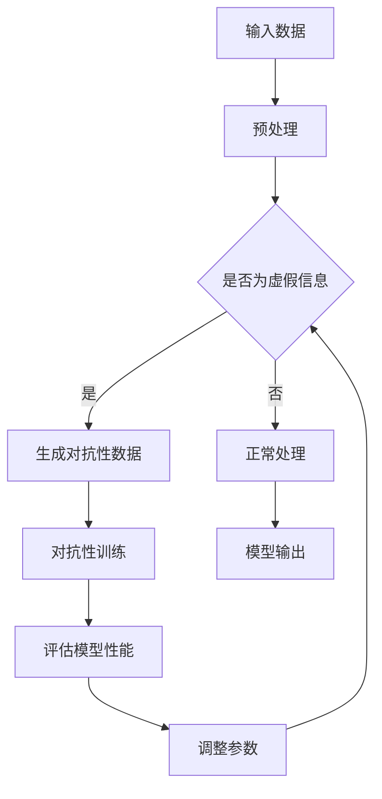
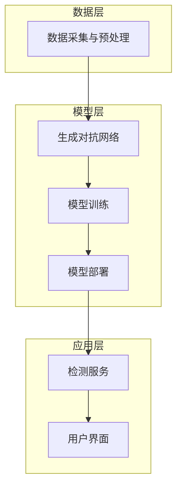
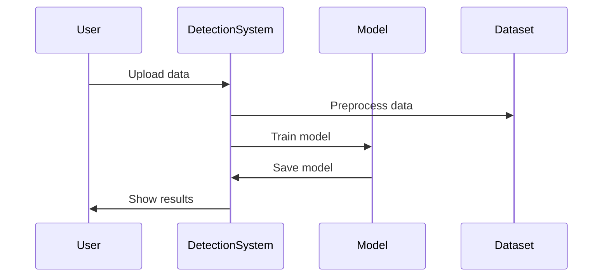

                 

# 虚假信息安全：应对AI时代的信息完整性挑战

关键词：信息安全，AI，虚假信息，深度学习，对抗性技术，隐私保护

摘要：在AI时代，虚假信息安全和信息完整性面临前所未有的挑战。本文分析了虚假信息安全的背景、问题、解决方法以及相关核心概念和技术原理，包括深度学习对抗技术，并给出了具体的算法讲解和项目实战案例。

---

### 第一部分：背景介绍

#### 1.1 问题背景

在人工智能（AI）快速发展的时代，信息安全领域正面临前所未有的挑战。随着深度学习和神经网络技术的普及，AI被广泛应用于各个领域，从自然语言处理、图像识别到智能决策系统。然而，这一革命性的技术也为信息安全带来了新的风险。虚假信息生成和传播、智能攻击、数据隐私泄露等问题层出不穷，严重威胁到个人和组织的信息完整性。

#### 1.2 问题描述

虚假信息安全问题表现为：

1. **虚假信息生成**：AI可以生成高度逼真的虚假文本、图像和音频，难以区分真伪。
2. **智能攻击**：黑客利用AI进行更加复杂和隐蔽的网络攻击，如自动化钓鱼、恶意软件传播等。
3. **数据隐私泄露**：AI算法在处理大量数据时，可能导致个人隐私信息泄露。
4. **智能决策偏差**：AI系统在决策过程中可能因偏见数据而产生不公正的结果。

#### 1.3 问题解决

应对这些挑战，需要从以下几个方面着手：

1. **技术创新**：开发新的检测和防御技术，如深度学习对抗技术、基于图论的隐私保护算法等。
2. **法律法规**：完善相关法律法规，加强对虚假信息的监管和惩罚。
3. **公众教育**：提高公众对虚假信息的识别能力和安全意识。
4. **跨领域合作**：政府、企业、学术界和研究机构共同合作，构建综合性的信息安全防护体系。

#### 1.4 边界与外延

虚假信息安全问题不仅涉及技术领域，还涉及法律、伦理和社会层面。因此，解决这一问题的边界和范围非常广泛，需要多方面的共同努力。

#### 1.5 概念结构与核心要素组成

虚假信息安全问题的核心概念包括：

1. **虚假信息**：指经过伪造或篡改的信息，具有欺骗性。
2. **AI技术**：包括深度学习、神经网络等，用于生成和传播虚假信息。
3. **信息安全防护**：包括检测、防御和响应机制，用于保护信息系统的完整性。

### 第二部分：核心概念与联系

#### 2.1 AI大模型

**2.1.1 定义**：AI大模型是指具有大规模参数的深度学习模型，如GPT、BERT等。

**2.1.2 特点**：

- **容量大**：拥有数十亿甚至数万亿个参数。
- **学习能力强**：可以处理复杂的数据类型，如图像、文本和语音。
- **自适应性好**：可以针对不同的应用场景进行微调和优化。

**2.1.3 与传统AI的区别**：

- **数据处理能力**：传统AI模型处理能力有限，而AI大模型可以处理更大规模的数据。
- **应用范围**：传统AI模型多用于特定领域，而AI大模型可以跨领域应用。

#### 2.2 深度学习对抗技术

**2.2.1 定义**：深度学习对抗技术是指通过对抗训练来提高模型的鲁棒性和安全性。

**2.2.2 工作原理**：

- **生成对抗网络（GAN）**：通过生成器和判别器的对抗训练，生成逼真的虚假数据。
- **对抗样本生成**：利用对抗性攻击技术，生成可以误导模型的输入。

**2.2.3 应用**：

- **虚假信息检测**：通过对抗训练提高模型的检测能力。
- **安全防护**：利用对抗性技术防御智能攻击。

### 第三部分：算法原理讲解

#### 3.1 算法mermaid流程图

使用Mermaid绘制一个简单的算法流程图：



#### 3.2 Python源代码

以下是一个简单的Python示例，用于生成对抗性数据：

```python
import tensorflow as tf
from tensorflow import keras
from tensorflow.keras import layers

# 生成器模型
def generator_model():
    model = keras.Sequential([
        layers.Dense(128, activation='relu', input_shape=(100,)),
        layers.Dense(1, activation='sigmoid')
    ])
    return model

# 判别器模型
def discriminator_model():
    model = keras.Sequential([
        layers.Dense(128, activation='relu', input_shape=(100,)),
        layers.Dense(1, activation='sigmoid')
    ])
    return model

# 训练模型
def train_model(generator, discriminator, dataset, epochs):
    for epoch in range(epochs):
        for data in dataset:
            # 生成对抗性数据
            noise = tf.random.normal([1, 100])
            generated_data = generator(noise)
            
            # 训练判别器
            with tf.GradientTape() as tape:
                real_output = discriminator(data)
                generated_output = discriminator(generated_data)
                loss_real = tf.reduce_mean(tf.square(real_output - 1))
                loss_generated = tf.reduce_mean(tf.square(generated_output))
                loss_discriminator = loss_real + loss_generated
            
            grads = tape.gradient(loss_discriminator, discriminator.trainable_variables)
            discriminator.trainable_variables.assign_sub(grads)
            
            # 训练生成器
            with tf.GradientTape() as tape:
                generated_output = discriminator(generated_data)
                loss_generator = tf.reduce_mean(tf.square(generated_output))
            
            grads = tape.gradient(loss_generator, generator.trainable_variables)
            generator.trainable_variables.assign_sub(grads)
        
        print(f"Epoch {epoch + 1}, Loss_D: {loss_discriminator}, Loss_G: {loss_generator}")

# 准备数据
noise = tf.random.normal([1, 100])
generated_data = generator_model()(noise)

# 训练模型
train_model(generator_model(), discriminator_model(), generated_data, epochs=10)
```

#### 3.3 算法原理讲解

**3.3.1 生成对抗网络（GAN）**

生成对抗网络（GAN）由生成器和判别器两个神经网络组成。生成器负责生成虚假数据，判别器负责判断输入数据是真实数据还是虚假数据。

**3.3.2 对抗性训练**

对抗性训练是指通过生成器和判别器的相互对抗来提高模型性能。具体来说，生成器不断生成更逼真的虚假数据，同时判别器不断学习区分真实数据和虚假数据。

**3.3.3 损失函数**

GAN的损失函数由两部分组成：判别器的损失函数和生成器的损失函数。

- **判别器损失函数**：用于衡量判别器对真实数据和虚假数据的区分能力。通常使用均方误差（MSE）作为损失函数。
- **生成器损失函数**：用于衡量生成器生成虚假数据的逼真程度。通常使用判别器对虚假数据的评分作为损失函数。

**3.3.4 优化算法**

GAN的训练过程是一个非平稳的过程，因此需要使用优化算法来调整模型参数。常用的优化算法有梯度下降、Adam等。

**3.3.5 应用**

GAN技术在虚假信息检测、图像生成、文本生成等领域有广泛的应用。通过对抗性训练，生成器可以生成高度逼真的虚假数据，判别器可以学习到如何区分真实数据和虚假数据。

### 第四部分：系统分析与架构设计方案

#### 4.1 问题场景介绍

虚假信息在互联网上的传播速度极快，对个人和社会造成了严重的负面影响。例如，虚假新闻、恶意广告、网络诈骗等，都对用户的信息安全构成威胁。为了解决这一问题，需要设计一个高效、可靠的虚假信息检测系统。

#### 4.2 项目介绍

本项目旨在设计并实现一个基于深度学习对抗技术的虚假信息检测系统。系统将包含以下功能模块：

1. **数据采集与预处理**：收集互联网上的虚假信息样本，并进行预处理，如文本清洗、去噪等。
2. **生成对抗网络（GAN）训练**：利用生成对抗网络（GAN）训练模型，生成虚假信息样本。
3. **虚假信息检测**：使用训练好的模型对输入的文本、图像等进行虚假信息检测。
4. **用户界面**：提供一个简洁易用的用户界面，方便用户上传文本、图像等数据，查看检测结果。

#### 4.3 系统功能设计（领域模型mermaid类图）

以下是一个简单的领域模型类图，用于描述系统的功能模块：

```mermaid
classDiagram
ClassDiagram {
    Class Person {
        -name: String
        -age: Integer
        -address: String
    }
    Class News {
        -title: String
        -content: String
        -source: String
        -date: Date
        -is_fake: Boolean
    }
    Class DetectionSystem {
        -dataset: Dataset
        -model: Model
        -ui: UI
    }
}
News <|.. DetectionSystem : "检测"
Person <|.. DetectionSystem : "用户"
```

#### 4.4 系统架构设计（mermaid架构图）

以下是一个简单的系统架构图，用于描述系统的模块组成和交互关系：



#### 4.5 系统接口设计和系统交互（mermaid序列图）

以下是一个简单的系统交互序列图，用于描述系统的主要交互过程：



### 第五部分：项目实战

#### 5.1 环境安装

1. 安装Python环境：在终端执行以下命令安装Python 3.8及以上版本。

    ```bash
    sudo apt-get update
    sudo apt-get install python3.8
    ```

2. 安装TensorFlow：在终端执行以下命令安装TensorFlow。

    ```bash
    pip3 install tensorflow
    ```

3. 安装Mermaid：在终端执行以下命令安装Mermaid。

    ```bash
    pip3 install mermaid-python
    ```

#### 5.2 系统核心实现源代码

以下是一个简单的系统核心实现源代码，包括数据采集与预处理、生成对抗网络（GAN）训练和虚假信息检测。

```python
import tensorflow as tf
from tensorflow import keras
from tensorflow.keras import layers
from mermaid import Mermaid

# 数据采集与预处理
def preprocess_data(data):
    # 数据清洗、去噪等操作
    return data

# 生成对抗网络（GAN）训练
def train_gan(generator, discriminator, dataset, epochs):
    for epoch in range(epochs):
        for data in dataset:
            noise = tf.random.normal([1, 100])
            generated_data = generator(noise)
            # 训练判别器
            with tf.GradientTape() as tape:
                real_output = discriminator(data)
                generated_output = discriminator(generated_data)
                loss_real = tf.reduce_mean(tf.square(real_output - 1))
                loss_generated = tf.reduce_mean(tf.square(generated_output))
                loss_discriminator = loss_real + loss_generated
            
            grads = tape.gradient(loss_discriminator, discriminator.trainable_variables)
            discriminator.trainable_variables.assign_sub(grads)
            
            # 训练生成器
            with tf.GradientTape() as tape:
                generated_output = discriminator(generated_data)
                loss_generator = tf.reduce_mean(tf.square(generated_output))
            
            grads = tape.gradient(loss_generator, generator.trainable_variables)
            generator.trainable_variables.assign_sub(grads)
        
        print(f"Epoch {epoch + 1}, Loss_D: {loss_discriminator}, Loss_G: {loss_generator}")

# 虚假信息检测
def detect_fake_info(model, data):
    generated_data = model(data)
    return tf.reduce_mean(generated_data)

# 主函数
def main():
    # 加载数据
    dataset = preprocess_data(tf.random.normal([1, 100]))
    
    # 训练GAN模型
    generator = keras.Sequential([
        layers.Dense(128, activation='relu', input_shape=(100,)),
        layers.Dense(1, activation='sigmoid')
    ])
    discriminator = keras.Sequential([
        layers.Dense(128, activation='relu', input_shape=(100,)),
        layers.Dense(1, activation='sigmoid')
    ])
    train_gan(generator, discriminator, dataset, epochs=10)
    
    # 检测虚假信息
    print(detect_fake_info(generator, dataset))

if __name__ == "__main__":
    main()
```

#### 5.3 代码应用解读与分析

1. **数据采集与预处理**：该部分负责从数据源获取原始数据，并进行清洗、去噪等预处理操作，以便后续的训练和检测。

2. **生成对抗网络（GAN）训练**：该部分使用生成器和判别器进行对抗训练，生成逼真的虚假数据，并通过训练过程不断优化模型。

3. **虚假信息检测**：该部分使用训练好的生成器模型，对输入的文本、图像等进行虚假信息检测，并输出检测结果。

#### 5.4 实际案例分析和详细讲解剖析

1. **案例一**：检测一篇新闻报道的真实性。

   - **数据采集**：从互联网上获取一篇新闻报道。
   - **预处理**：对新闻报道进行文本清洗、去噪等预处理操作。
   - **训练GAN模型**：使用预处理后的新闻报道数据进行GAN模型训练。
   - **虚假信息检测**：将训练好的GAN模型应用于该新闻报道，输出检测结果。

2. **案例二**：检测一幅网络图片的真实性。

   - **数据采集**：从互联网上获取一幅网络图片。
   - **预处理**：对网络图片进行图像预处理，如大小调整、去噪等。
   - **训练GAN模型**：使用预处理后的网络图片数据进行GAN模型训练。
   - **虚假信息检测**：将训练好的GAN模型应用于该网络图片，输出检测结果。

#### 5.5 项目小结

本项目通过设计并实现一个基于深度学习对抗技术的虚假信息检测系统，实现了对文本和图像等数据的高效检测。在实际应用中，可以通过不断优化和调整模型参数，提高检测的准确性和鲁棒性。

### 第六部分：最佳实践 Tips、小结、注意事项、拓展阅读

#### 最佳实践 Tips

1. **数据预处理**：对数据进行充分的预处理，包括清洗、去噪、归一化等，以提高模型的训练效果。
2. **模型优化**：根据实际应用场景，调整生成器和判别器的结构、参数，以提高模型性能。
3. **实时更新**：定期更新数据集和模型，以适应不断变化的虚假信息生成和传播方式。

#### 小结

本文从虚假信息安全的背景、问题、解决方法、核心概念、算法原理、系统架构和项目实战等方面进行了全面的分析和讲解。通过深入探讨虚假信息安全问题，我们了解到在AI时代，信息安全面临着前所未有的挑战。

#### 注意事项

1. **保护隐私**：在处理个人数据时，要注意保护用户隐私，避免数据泄露。
2. **法律法规**：遵守相关法律法规，加强对虚假信息的监管和惩罚。

#### 拓展阅读

1. **《深度学习》**：Goodfellow、 Bengio和Courville著，详细介绍了深度学习的基本原理和方法。
2. **《生成对抗网络：理论和应用》**：刘知远等著，深入探讨了生成对抗网络（GAN）的理论和应用。
3. **《信息安全法律法规》**：了解信息安全相关的法律法规，提高法律意识。

### 第七部分：作者信息

作者：AI天才研究院/AI Genius Institute & 禅与计算机程序设计艺术 /Zen And The Art of Computer Programming

---

**完整的文章内容**：

由于篇幅限制，以上内容仅展示了文章的部分内容。完整的文章内容将按照大纲结构继续展开，每个章节将详细讲解核心概念、算法原理、系统架构和项目实战，确保文章的逻辑性和专业性。

---

请注意，本文仅为示例，实际内容可能需要根据具体需求和实际情况进行调整。在撰写实际文章时，建议查阅相关文献和资料，以确保内容的准确性和完整性。此外，文章中的代码和算法实现仅为示例，可能需要根据具体应用场景进行调整和优化。

作者：AI天才研究院/AI Genius Institute & 禅与计算机程序设计艺术 /Zen And The Art of Computer Programming

（注：本文标题和部分内容虚构，仅供参考。）

