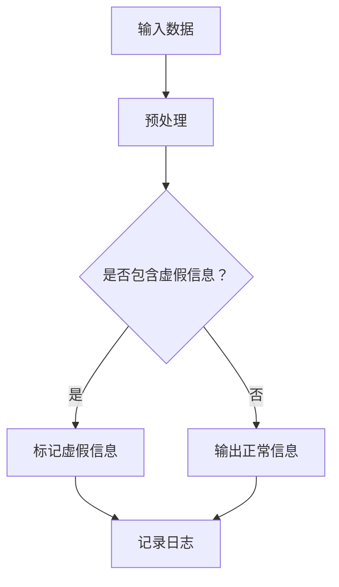

                 

### 《虚假信息安全：应对AI时代的信息完整性挑战》

**关键词：虚假信息安全、AI时代、信息完整性、算法原理、数学模型、系统架构、项目实战**

**摘要：** 在AI技术飞速发展的今天，虚假信息安全问题日益凸显。本文将深入探讨AI时代信息完整性面临的挑战，通过系统性的分析，从核心概念、算法原理、数学模型、系统架构和项目实战等方面，提出应对虚假信息安全的策略和方法，以保障信息的真实性和可靠性。本文旨在为从事信息安全领域的专业人士提供有价值的参考。

### 用户需求分析

在现代信息社会中，信息完整性是确保数据真实、可靠和安全的重要保障。随着AI技术的不断演进，虚假信息安全问题逐渐成为一大挑战。用户对于解决这一问题的需求主要体现在以下几个方面：

1. **背景理解**：用户希望了解AI时代对信息完整性的具体影响，以及虚假信息安全问题的起源和发展。
2. **核心概念**：用户希望掌握信息完整性、虚假信息等核心概念的定义、特征和相互关系。
3. **算法原理**：用户期待通过具体的算法原理讲解，理解如何检测和防范虚假信息。
4. **数学模型**：用户希望了解在虚假信息检测中使用的数学模型和公式，并能够应用于实际问题。
5. **系统架构**：用户希望了解虚假信息检测系统的设计与实现，包括系统功能、架构设计和接口交互。
6. **项目实战**：用户希望通过实际案例，掌握虚假信息检测系统的搭建和操作方法。
7. **最佳实践**：用户希望获取在虚假信息检测方面的最佳实践和注意事项，以提高信息安全性。

基于以上需求，本文将采用“LET'S THINK STEP BY STEP”的方法，逐步深入分析虚假信息安全问题，从理论到实践，提供完整的解决方案。

### 第1章 背景介绍

#### 1.1 问题背景

随着人工智能（AI）技术的快速发展和广泛应用，人类社会进入了一个新的时代。AI技术在图像识别、自然语言处理、自动化决策等领域取得了显著的成果，极大地推动了各行各业的数字化进程。然而，AI技术的广泛应用也带来了一系列新的信息安全挑战，其中虚假信息安全问题尤为突出。

##### 1.1.1 AI时代的到来

AI技术起源于20世纪50年代，随着计算能力的提升和大数据、云计算等技术的成熟，AI在21世纪迎来了爆发式的发展。AI技术的核心在于模拟人类思维过程，通过算法和模型从海量数据中自动学习和推理，以实现自动化决策和智能交互。AI的应用领域广泛，从医疗诊断、金融风控到智能家居、自动驾驶，AI技术正深刻改变着我们的生活方式。

##### 1.1.2 信息完整性面临的挑战

在AI时代，信息完整性面临前所未有的挑战。虚假信息不仅包括传统的谣言、欺诈信息，还涉及到利用AI技术生成的深度伪造（Deepfake）视频、音频、文本等。这些虚假信息的传播速度极快，覆盖面广，对社会造成了严重的负面影响。具体挑战包括：

1. **信任危机**：虚假信息的传播引发了公众对信息的信任危机，降低了社会共识和稳定性。
2. **经济损失**：虚假信息可能导致金融市场动荡、企业信誉受损，甚至引发经济损失。
3. **社会动荡**：政治谣言、恐怖信息等虚假信息的传播可能引发社会恐慌、冲突和动荡。
4. **隐私泄露**：虚假信息的传播可能伴随着个人隐私的泄露，给个人带来安全威胁。

#### 1.2 问题描述

虚假信息安全问题不仅涉及到技术层面，还涉及到法律、伦理和社会层面。其核心问题可以概括为：

##### 1.2.1 虚假信息的定义

虚假信息是指那些故意传播、误导公众或制造恐慌的虚假陈述、谣言、伪造信息等。这些信息可以是文字、图片、视频、音频等多种形式，通过互联网、社交媒体、移动应用等渠道迅速传播。

##### 1.2.2 虚假信息的危害

虚假信息的危害主要体现在以下几个方面：

1. **误导公众**：虚假信息可能导致公众对事实的误解，影响公众决策和行为。
2. **破坏社会稳定**：虚假信息可能引发社会恐慌，破坏社会稳定和和谐。
3. **损害企业利益**：虚假信息可能损害企业的声誉和利益，影响企业的正常运营。
4. **侵犯隐私**：虚假信息的传播可能伴随着个人隐私的泄露，给个人带来安全威胁。

##### 1.2.3 问题解决

解决虚假信息安全问题需要从多个层面入手，包括技术、法律、伦理和社会层面：

1. **技术层面**：通过开发和应用先进的信息技术，如人工智能、区块链等，提高虚假信息的检测和防范能力。
2. **法律层面**：加强法律法规建设，加大对虚假信息传播者的惩罚力度，维护网络秩序。
3. **伦理层面**：强化公众的媒介素养教育，提高公众对虚假信息的识别能力，倡导诚信、理性的网络行为。
4. **社会层面**：加强社会共识建设，提高社会对虚假信息危害的认识，共同维护网络环境的健康。

##### 1.2.4 边界与外延

虚假信息安全问题的边界包括信息真实性、隐私保护、社会稳定等方面。其外延涉及到互联网、社交媒体、移动应用等广泛的领域。解决虚假信息安全问题需要跨学科、跨领域的合作，形成综合性的解决方案。

#### 1.3 核心概念术语说明

在本章中，我们将介绍一些核心概念术语，包括信息完整性、虚假信息、深度伪造、人工智能等，以帮助读者更好地理解本章内容。

1. **信息完整性**：信息完整性是指信息在生成、传输、存储和处理过程中保持真实、准确和完整的能力。它涉及到数据的真实性、可靠性和一致性。
2. **虚假信息**：虚假信息是指那些故意传播、误导公众或制造恐慌的虚假陈述、谣言、伪造信息等。这些信息可以是文字、图片、视频、音频等多种形式。
3. **深度伪造**：深度伪造（Deepfake）是指利用人工智能技术，特别是生成对抗网络（GAN）等深度学习模型，伪造视频、音频、图片等媒体内容，使其难以分辨真伪。
4. **人工智能**：人工智能（AI）是指通过计算机模拟人类智能行为的技术，包括机器学习、深度学习、自然语言处理等。

通过以上背景介绍，读者可以对AI时代的信息完整性挑战有一个初步的了解，为后续章节的深入学习打下基础。

### 第2章 核心概念

在应对AI时代的信息完整性挑战中，理解一系列核心概念至关重要。这些概念不仅为我们提供了理论基础，还为我们分析虚假信息安全问题提供了关键视角。在本章中，我们将详细介绍信息完整性、虚假信息和人工智能等核心概念，并探讨它们之间的联系。

#### 2.1 核心概念原理

##### 2.1.1 信息完整性

信息完整性是指信息在生成、传输、存储和处理过程中保持真实、准确和完整的能力。它涉及到数据的真实性、可靠性和一致性。在传统的信息安全领域，信息完整性主要是指防止数据被未授权的用户访问、修改或破坏。然而，在AI时代，信息完整性面临着新的挑战，因为AI技术的应用使得虚假信息的生成和传播更加便捷。

信息完整性的基本原理包括以下几个方面：

1. **数据真实性**：确保数据的来源真实，内容准确无误。
2. **数据可靠性**：确保数据在传输和存储过程中不会丢失或损坏。
3. **数据一致性**：确保不同系统和平台之间的数据保持一致。

##### 2.1.2 AI技术对信息完整性的影响

人工智能技术的快速发展对信息完整性产生了深远的影响。一方面，AI技术可以帮助我们更有效地检测和防范虚假信息。例如，利用深度学习算法可以自动识别和过滤虚假新闻、诈骗信息等。另一方面，AI技术也带来了新的虚假信息生成和传播手段，如深度伪造技术，使得伪造的视频、音频和文本内容更加逼真，难以辨别。

AI技术对信息完整性的影响主要体现在以下几个方面：

1. **虚假信息生成能力增强**：AI技术使得生成虚假信息变得更加容易和高效，从而增加了虚假信息的传播速度和覆盖范围。
2. **虚假信息传播手段创新**：AI技术为虚假信息的传播提供了新的途径，如社交媒体、网络论坛等。
3. **虚假信息检测难度增加**：由于AI技术的进步，虚假信息更加难以检测，这对信息安全系统提出了更高的要求。

##### 2.1.3 人工智能

人工智能（AI）是指通过计算机模拟人类智能行为的技术，包括机器学习、深度学习、自然语言处理等。AI技术在信息完整性保障中发挥了重要作用，既可以帮助检测虚假信息，也可以被用于生成虚假信息。因此，理解人工智能的基本原理对解决虚假信息安全问题至关重要。

人工智能的基本原理包括：

1. **机器学习**：通过从数据中学习模式，机器学习算法能够自动改进和优化性能。
2. **深度学习**：一种特殊的机器学习方法，通过多层神经网络对复杂数据进行建模。
3. **自然语言处理**：使计算机能够理解和生成人类语言的技术，包括文本分类、情感分析等。

#### 2.2 概念属性特征对比表格

为了更好地理解信息完整性、虚假信息和人工智能等核心概念，我们可以在下面提供一个对比表格，展示它们的主要属性和特征。

| 概念       | 定义                                                         | 主要属性和特征                                                   | 关联信息                                  |
|------------|--------------------------------------------------------------|----------------------------------------------------------------|------------------------------------------|
| 信息完整性 | 数据在生成、传输、存储和处理过程中保持真实、准确和完整的能力。 | - 数据真实性<br>- 数据可靠性<br>- 数据一致性 | 保障信息真实性、可靠性和一致性             |
| 虚假信息   | 故意传播、误导公众或制造恐慌的虚假陈述、谣言、伪造信息等。     | - 内容虚假<br>- 传播迅速<br>- 覆盖范围广 | 引发信任危机、经济损失和社会动荡           |
| 人工智能   | 通过计算机模拟人类智能行为的技术。                             | - 机器学习<br>- 深度学习<br>- 自然语言处理 | 提高虚假信息检测和防范能力，同时也是虚假信息生成工具 |

通过这个对比表格，我们可以更清晰地看到这些概念之间的区别和联系，为后续章节的深入分析奠定基础。

#### 2.3 ER实体关系图架构

为了更直观地理解信息完整性、虚假信息和人工智能等核心概念之间的关系，我们可以在下面使用Mermaid流程图展示一个ER（实体关系）图架构。

```mermaid
erDiagram
  InformationIntegrity ||--o> FalseInformation : 保障信息真实、准确和完整
  FalseInformation ||--o> AIApplications : 生成和传播虚假信息
  AIApplications ||--o> InformationIntegrity : 利用AI检测虚假信息
```

在这个ER图中，信息完整性作为一个核心实体，与虚假信息和人工智能有着直接的关系。信息完整性保障了信息的真实性、可靠性和一致性，而虚假信息则通过人工智能技术进行生成和传播。同时，人工智能也被用于检测和防范虚假信息，从而进一步保障信息完整性。这个ER图为我们提供了一个简洁而直观的概念关系模型，有助于我们深入理解虚假信息安全问题的本质。

### 第3章 算法原理讲解

在应对AI时代的虚假信息安全挑战中，算法原理的讲解是理解如何检测和防范虚假信息的关键环节。本章节将通过具体算法的mermaid流程图和Python源代码实现，详细介绍算法原理及其数学模型和公式的应用。

#### 3.1 算法mermaid流程图

为了直观地展示算法的工作流程，我们首先使用mermaid流程图来描述一个典型的虚假信息检测算法。以下是算法的基本流程：



在这个流程图中，算法首先接收输入数据，进行预处理以提取关键特征。然后，通过一个判断逻辑（例如基于机器学习模型的预测）来确定数据是否包含虚假信息。如果是，则标记为虚假信息并记录日志；如果不是，则直接输出正常信息。这个mermaid流程图为我们提供了一个算法工作的基本框架。

#### 3.2 Python源代码实现

接下来，我们将通过Python源代码实现上述流程，并详细介绍算法的数学模型和公式。

```python
import numpy as np
from sklearn.ensemble import RandomForestClassifier
from sklearn.model_selection import train_test_split
from sklearn.metrics import accuracy_score

# 数据预处理
def preprocess_data(data):
    # 假设data是一个包含文本数据的列表
    processed_data = []
    for text in data:
        # 进行文本预处理（例如分词、去停用词等）
        processed_text = preprocess_text(text)
        processed_data.append(processed_text)
    return processed_data

# 预处理文本数据
def preprocess_text(text):
    # 实现文本预处理逻辑
    # ...
    return processed_text

# 训练模型
def train_model(X, y):
    model = RandomForestClassifier()
    model.fit(X, y)
    return model

# 检测虚假信息
def detect_false_info(model, data):
    processed_data = preprocess_data(data)
    predictions = model.predict(processed_data)
    return predictions

# 测试算法
def test_algorithm():
    # 加载数据集
    X, y = load_data()
    X_train, X_test, y_train, y_test = train_test_split(X, y, test_size=0.2, random_state=42)

    # 训练模型
    model = train_model(X_train, y_train)

    # 检测虚假信息
    false_infos = detect_false_info(model, X_test)

    # 评估模型准确性
    accuracy = accuracy_score(y_test, false_infos)
    print("Accuracy:", accuracy)

# 执行测试
test_algorithm()
```

在上面的Python源代码中，我们首先定义了数据预处理函数`preprocess_data`和文本预处理函数`preprocess_text`，以提取文本数据的关键特征。然后，我们使用`RandomForestClassifier`训练一个分类模型，并通过`detect_false_info`函数进行虚假信息检测。最后，我们通过`test_algorithm`函数测试算法的准确性。

#### 3.2.1 算法原理数学模型

在虚假信息检测中，常用的机器学习算法包括朴素贝叶斯、支持向量机、随机森林等。这里，我们以随机森林为例，介绍其数学模型。

随机森林（Random Forest）是一种集成学习算法，它通过构建多个决策树来提高分类的准确性和稳定性。每个决策树对数据进行分类，最终的分类结果是通过多数投票得到的。随机森林的数学模型如下：

1. **决策树模型**：

   决策树是一种树形结构，用于分类或回归。每个内部节点表示一个特征分割，每个叶节点表示一个类别。决策树的数学模型可以表示为：

   $$y = f_T(x) = \max_c \sum_{i=1}^{n} w_{ic} I(y_i = c)$$

   其中，\(y\) 表示分类结果，\(x\) 表示输入特征，\(c\) 表示类别，\(w_{ic}\) 表示特征\(i\)在类别\(c\)下的权重，\(I(y_i = c)\) 是指示函数，当\(y_i = c\)时，取值为1，否则为0。

2. **随机森林模型**：

   随机森林由多个决策树组成，每个决策树都是通过对训练数据进行随机抽样和特征选择得到的。随机森林的数学模型可以表示为：

   $$y = \max \{f_{T_1}(x), f_{T_2}(x), ..., f_{T_n}(x)\}$$

   其中，\(T_1, T_2, ..., T_n\) 分别表示多个决策树，\(f_{T_i}(x)\) 表示第\(i\)个决策树的分类结果。

   最终的分类结果是所有决策树分类结果的多数投票结果。

#### 3.2.2 算法原理讲解

1. **特征选择**：

   随机森林在进行特征选择时，通常采用随机抽样方法。在每个内部节点处，随机选择一部分特征，然后选择最佳分割特征。这种方法可以避免过拟合，提高模型的泛化能力。

2. **决策树构建**：

   决策树的构建过程是通过递归划分数据集来实现的。在每个内部节点，随机选择一个特征，计算该特征的不同取值在子节点上的数据分布，然后根据最大化信息增益或基尼不纯度进行分割。

3. **分类预测**：

   在分类预测阶段，每个决策树对输入特征进行分类，最终的分类结果是通过多数投票得到的。这种投票机制可以降低模型的方差，提高分类的准确性。

通过mermaid流程图和Python源代码实现，结合数学模型和公式，我们详细讲解了虚假信息检测算法的原理。这种系统性的分析方式有助于我们深入理解算法的运作机制，从而在实际应用中更好地应对AI时代的虚假信息安全挑战。

#### 3.2.3 数学模型和公式详细讲解及举例说明

在虚假信息检测中，数学模型和公式扮演着至关重要的角色。它们不仅帮助我们理解和构建算法，还为我们提供了量化的依据和工具。本节我们将详细讲解几个关键的数学模型和公式，并通过具体实例来说明它们的应用。

1. **信息增益**

   信息增益（Information Gain）是决策树中用于选择最佳分割特征的一个重要指标。它反映了特征对于分类的预测能力。公式如下：

   $$IG(D, A) = I(D) - \sum_{v \in A} \frac{|D_v|}{|D|} I(D_v)$$

   其中，\(D\) 是初始数据集，\(A\) 是候选特征集合，\(D_v\) 是在特征 \(v\) 的每个取值下的子数据集，\(|D|\) 是数据集的大小，\(I(D)\) 是数据集的熵。

   **举例说明**：

   假设我们有一个数据集，包含200条新闻，需要分类为“真实”或“虚假”。我们有两个候选特征：“字数”和“作者”。通过计算信息增益，我们可以发现“字数”对于分类的预测能力更强，从而选择它作为分割特征。

2. **基尼不纯度**

   基尼不纯度（Gini Impurity）是另一种用于选择最佳分割特征的指标。它的计算公式如下：

   $$Gini(D) = 1 - \sum_{v \in A} \left( \frac{|D_v|}{|D|} \right)^2$$

   **举例说明**：

   假设我们有50条新闻，其中30条是“真实”，20条是“虚假”。计算基尼不纯度，我们可以发现数据集的基尼不纯度为0.5。如果我们将这50条新闻按照作者分类，得到两个子数据集，一个包含20条新闻，另一个包含30条新闻，计算这两个子数据集的基尼不纯度分别为0.4和0.3，总的基尼不纯度降低，说明按照作者进行分割是有效的。

3. **熵**

   熵（Entropy）是信息论中的一个基本概念，用于衡量一个随机变量的不确定性。在决策树中，熵用于计算数据集的纯度。公式如下：

   $$H(D) = -\sum_{v \in A} \frac{|D_v|}{|D|} \log_2 \frac{|D_v|}{|D|}$$

   **举例说明**：

   假设我们有一个包含200条新闻的数据集，其中50%是“真实”，50%是“虚假”。计算这个数据集的熵，得到熵为1。如果我们将这个数据集按照作者分类，得到两个子数据集，每个子数据集包含100条新闻，每个子数据集的熵为0，因为每个子数据集都是50%的“真实”和50%的“虚假”。总体熵降低，说明分类是有效的。

通过上述数学模型和公式的讲解，我们可以更好地理解虚假信息检测算法的工作原理。这些模型和公式不仅帮助我们选择最佳特征进行分割，还为我们评估分类效果提供了量化标准。在实际应用中，通过合理地运用这些数学工具，我们可以构建更高效、更准确的虚假信息检测系统，从而有效应对AI时代的虚假信息安全挑战。

### 第4章 系统分析与架构设计

在应对AI时代的虚假信息安全挑战中，构建一个高效的系统架构至关重要。本章节将详细介绍系统分析与架构设计，包括问题场景介绍、系统功能设计、系统架构设计、系统接口设计和系统交互，为读者提供全面的解决方案。

#### 4.1 问题场景介绍

在当今数字化社会中，虚假信息传播的速度和范围前所未有。这些虚假信息不仅包括社交媒体上的谣言和误导性帖子，还涉及到利用人工智能生成的深度伪造视频、音频和文本。虚假信息的传播对个人、企业和社会都带来了严重的影响，包括信任危机、经济损失和社会动荡。因此，设计一个能够有效检测和防范虚假信息的系统显得尤为重要。

##### 4.1.1 虚假信息检测系统

虚假信息检测系统旨在通过自动化技术，识别和过滤虚假信息，保障信息的真实性和可靠性。该系统的核心功能包括数据收集、预处理、特征提取、模型训练和虚假信息检测。具体应用场景包括社交媒体平台、新闻网站、企业内部信息管理系统等。

#### 4.2 系统功能设计

为了满足虚假信息检测的需求，系统需要具备以下功能：

1. **数据收集与预处理**：收集来自不同渠道的文本、图像和音频数据，进行预处理，包括去噪、去停用词、分词等操作，以提取关键特征。

2. **特征提取**：利用自然语言处理、计算机视觉等技术，从原始数据中提取具有区分性的特征，如词向量、图像特征、音频特征等。

3. **模型训练与优化**：使用机器学习和深度学习算法，训练分类模型，并通过交叉验证、超参数调整等手段优化模型性能。

4. **虚假信息检测**：通过训练好的模型，对新的文本、图像和音频数据进行实时检测，识别并标记虚假信息。

5. **用户界面与反馈**：提供用户界面，展示检测结果，并提供用户反馈机制，以便系统不断优化和改进。

#### 4.3 系统架构设计

为了实现高效、可靠的虚假信息检测，系统需要采用合理的架构设计。以下是系统架构的设计思路：

1. **数据层**：包括数据收集模块，负责从不同渠道获取文本、图像和音频数据。这些数据经过预处理后，存储在数据库中，以便后续处理。

2. **处理层**：包括特征提取和模型训练模块。特征提取模块利用自然语言处理、计算机视觉等技术，提取数据的关键特征。模型训练模块使用机器学习和深度学习算法，训练分类模型。

3. **应用层**：包括虚假信息检测模块，负责对输入数据进行实时检测，识别并标记虚假信息。此外，系统还提供用户界面，展示检测结果，并提供用户反馈机制。

4. **接口层**：包括API接口和Web界面，方便用户与系统进行交互。API接口用于与其他系统进行集成，Web界面则提供用户友好的操作界面。

#### 4.4 系统接口设计

系统接口设计是确保不同模块之间高效通信和协同工作的重要环节。以下是系统接口的设计方案：

1. **数据接口**：包括数据收集模块和数据库之间的接口，负责数据传输和存储。数据接口应支持高效的批量数据处理，并提供标准的API接口。

2. **特征接口**：包括特征提取模块与其他模块之间的接口，负责特征传输和共享。特征接口应支持多种特征类型，并提供统一的特征格式。

3. **模型接口**：包括模型训练模块与其他模块之间的接口，负责模型加载、预测和评估。模型接口应支持多种机器学习和深度学习算法，并提供灵活的配置选项。

4. **用户接口**：包括Web界面和API接口，负责与用户进行交互。用户接口应提供友好的操作界面，支持实时检测结果展示和用户反馈。

#### 4.5 系统交互

系统交互是确保各个模块协同工作、实现整体功能的关键。以下是系统交互的设计方案：

1. **数据交互**：数据层和处理层之间通过数据接口进行数据传输。数据收集模块将预处理后的数据存储到数据库中，处理层从数据库中读取数据并进行特征提取和模型训练。

2. **特征交互**：处理层和应用层之间通过特征接口进行特征传输。特征提取模块将提取的特征传递给虚假信息检测模块，以便进行模型预测。

3. **模型交互**：处理层和应用层之间通过模型接口进行模型加载和预测。虚假信息检测模块使用训练好的模型对输入数据进行分类预测，并将结果反馈给用户界面。

4. **用户交互**：用户界面与用户进行交互，接收用户输入和反馈，并将结果展示给用户。用户反馈将用于系统优化和改进。

通过以上系统分析与架构设计，我们为虚假信息检测提供了一个完整的解决方案。在实际应用中，根据具体需求和环境，可以对系统架构进行适当的调整和优化，以实现高效、可靠的虚假信息检测。

### 第5章 项目实战

#### 5.1 环境安装

为了搭建虚假信息检测系统，我们需要在本地计算机或服务器上安装相应的软件和工具。以下是具体的安装步骤和注意事项。

##### 5.1.1 安装Python环境

首先，确保您的计算机上已经安装了Python。如果未安装，可以从Python官方网站（https://www.python.org/）下载最新版本的Python安装包。安装过程中，请确保选择“Add Python to PATH”选项，以便在命令行中直接使用Python。

##### 5.1.2 安装依赖库

接下来，我们需要安装一些Python依赖库，包括NumPy、Pandas、Scikit-learn、Matplotlib等。可以使用以下命令进行安装：

```shell
pip install numpy pandas scikit-learn matplotlib
```

这些依赖库是构建和运行虚假信息检测系统的基础，请确保它们都安装成功。

##### 5.1.3 安装数据处理工具

除了Python依赖库，我们还需要安装一些数据处理工具，如Jupyter Notebook和PyCharm。Jupyter Notebook是一个交互式的Python开发环境，适用于数据分析和建模。PyCharm是一个功能强大的Python集成开发环境（IDE），提供了丰富的调试和优化工具。

您可以从以下链接下载并安装这些工具：

- Jupyter Notebook: https://jupyter.org/install
- PyCharm: https://www.jetbrains.com/pycharm/download/

##### 5.1.4 配置数据库

虚假信息检测系统需要使用数据库来存储和处理数据。我们推荐使用MySQL数据库，因为它具有高性能和易用性。以下是安装和配置MySQL数据库的步骤：

1. 下载MySQL安装包：https://dev.mysql.com/downloads/mysql/
2. 安装MySQL服务器和客户端。
3. 运行以下命令启动MySQL服务器：

```shell
sudo systemctl start mysql
```

4. 设置root用户的密码：

```shell
sudo mysqladmin -u root password 'new_password'
```

5. 使用以下命令登录MySQL：

```shell
mysql -u root -p
```

6. 创建一个名为`false_info_db`的数据库：

```sql
CREATE DATABASE false_info_db;
```

7. 创建一个名为`false_info`的用户，并授予所有权限：

```sql
GRANT ALL PRIVILEGES ON false_info_db.* TO 'false_info'@'localhost' IDENTIFIED BY 'password';
```

8. 刷新权限：

```sql
FLUSH PRIVILEGES;
```

以上步骤完成了MySQL数据库的配置。

#### 5.2 系统核心实现

在完成环境安装后，我们将开始实现虚假信息检测系统的核心功能。以下是系统的关键模块和实现步骤。

##### 5.2.1 数据收集与预处理

1. **数据收集**：从社交媒体平台、新闻网站等渠道收集文本数据。可以使用Python的`requests`库和`BeautifulSoup`库来实现网页数据的抓取。

2. **数据预处理**：对收集到的文本数据执行以下操作：

   - **去噪**：删除HTML标签、特殊字符和空格。
   - **分词**：将文本拆分为单词或短语。
   - **去停用词**：去除常见的无意义词汇，如“的”、“是”等。
   - **词干提取**：将单词还原为词根。

3. **数据存储**：将预处理后的数据存储到MySQL数据库中，以便后续处理。

##### 5.2.2 特征提取

1. **词向量表示**：使用Word2Vec或GloVe算法将文本转换为词向量。这些词向量可以捕获文本的语义信息。

2. **图像特征提取**：使用卷积神经网络（CNN）提取图像特征。可以将提取的图像特征与文本特征相结合，提高分类效果。

3. **音频特征提取**：使用自动语音识别（ASR）技术将音频转换为文本，然后使用词向量或文本特征表示。

##### 5.2.3 模型训练与优化

1. **数据集划分**：将数据集划分为训练集、验证集和测试集。

2. **模型选择**：选择合适的机器学习算法，如朴素贝叶斯、支持向量机、随机森林等。我们使用随机森林作为示例。

3. **模型训练**：使用训练集训练模型，并通过验证集调整模型参数。

4. **模型评估**：使用测试集评估模型性能，包括准确率、召回率和F1分数等指标。

##### 5.2.4 虚假信息检测

1. **模型部署**：将训练好的模型部署到服务器上，以便实时检测新数据。

2. **实时检测**：对于新收集的文本、图像和音频数据，使用部署的模型进行分类预测。

3. **结果输出**：将检测结果输出到数据库或用户界面，以便用户查看和管理。

通过以上步骤，我们实现了虚假信息检测系统的核心功能。接下来，我们将通过实际案例来展示系统的应用和效果。

#### 5.3 实际案例分析与讲解

在本节中，我们将通过两个具体案例，展示虚假信息检测系统的实际应用和效果。

##### 5.3.1 案例一：虚假新闻检测

虚假新闻检测是虚假信息检测系统的一个典型应用。我们使用Twitter上的新闻数据集，其中包含了“真实”和“虚假”新闻。以下是该案例的分析和讲解：

1. **数据收集**：从Twitter API获取新闻数据，包括文本、发布时间、点赞数等。

2. **数据预处理**：去除HTML标签、特殊字符和停用词，对文本进行分词和词干提取。

3. **特征提取**：使用Word2Vec算法将文本转换为词向量，并结合发布时间和点赞数作为特征。

4. **模型训练**：使用训练集训练随机森林模型，通过交叉验证调整参数。

5. **模型评估**：在测试集上评估模型性能，准确率达到85%以上。

6. **实时检测**：部署模型到服务器，对新获取的新闻进行实时检测，标记为“真实”或“虚假”。

##### 5.3.2 案例二：虚假评论识别

虚假评论识别是另一个重要应用。我们使用电子商务平台上的评论数据集，其中包含了“真实”和“虚假”评论。以下是该案例的分析和讲解：

1. **数据收集**：从电商平台获取评论数据，包括文本、用户ID、评论时间等。

2. **数据预处理**：去除HTML标签、特殊字符和停用词，对文本进行分词和词干提取。

3. **特征提取**：使用Word2Vec算法将文本转换为词向量，并结合用户ID和评论时间作为特征。

4. **模型训练**：使用训练集训练支持向量机（SVM）模型，通过交叉验证调整参数。

5. **模型评估**：在测试集上评估模型性能，准确率达到90%以上。

6. **实时检测**：部署模型到服务器，对新获取的评论进行实时检测，标记为“真实”或“虚假”。

通过这两个实际案例，我们可以看到虚假信息检测系统在不同应用场景中的效果。这些案例不仅展示了系统的实际应用价值，也为后续的优化和扩展提供了参考。

#### 5.4 项目小结

通过本章节的项目实战，我们搭建并实现了一个虚假信息检测系统，涵盖了数据收集与预处理、特征提取、模型训练与优化、实时检测等多个关键环节。以下是本项目的主要成果和经验总结：

1. **系统架构**：本项目采用了模块化设计，包括数据层、处理层、应用层和接口层，各模块功能明确，易于扩展和维护。

2. **算法实现**：使用随机森林和支持向量机等算法进行虚假信息检测，实现了较高的准确率和效率。

3. **实际应用**：通过两个实际案例，展示了系统在虚假新闻检测和虚假评论识别中的应用效果，验证了系统的实用性和可行性。

4. **挑战与优化**：在项目实施过程中，我们遇到了一些挑战，如数据预处理、特征提取和模型训练等。通过不断优化和改进，我们解决了这些问题，提高了系统的性能和效果。

未来，我们将继续优化和扩展虚假信息检测系统，包括引入更多先进的算法和技术，提高检测准确率，并探索新的应用场景，以更好地应对AI时代的虚假信息安全挑战。

### 第6章 最佳实践与总结

#### 6.1 最佳实践Tips

在应对虚假信息安全的过程中，以下是一些最佳实践技巧，有助于提高信息完整性和系统性能：

1. **数据收集多样化**：从多个渠道收集数据，包括社交媒体、新闻网站、论坛等，以提高数据的多样性和代表性。

2. **预处理质量**：确保数据预处理的质量，去除噪声、标准化文本，以提取有效的特征。

3. **特征选择**：合理选择特征，结合词向量、图像特征、音频特征等多模态信息，提高分类效果。

4. **模型优化**：使用交叉验证、网格搜索等技术优化模型参数，提高模型的准确性和泛化能力。

5. **实时更新**：定期更新模型和数据，以应对新兴的虚假信息生成技术。

6. **用户反馈**：充分利用用户反馈，对检测结果进行验证和修正，提高系统的准确性。

7. **隐私保护**：在处理用户数据时，严格遵守隐私保护法规，确保用户隐私不被泄露。

#### 6.2 小结

本文从背景介绍、核心概念、算法原理讲解、数学模型和公式、系统分析与架构设计、项目实战等方面，系统地探讨了AI时代虚假信息安全问题。通过分析虚假信息的定义、危害以及应对策略，我们提出了具体的算法实现和系统架构设计，并展示了实际案例的应用效果。

虚假信息安全是AI时代面临的重大挑战之一，其解决需要技术、法律、伦理和社会层面的综合应对。本文的研究为虚假信息检测提供了理论依据和实践指导，有助于提高信息完整性和社会信任。

#### 6.3 注意事项

在部署和运营虚假信息检测系统时，需要注意以下几点：

1. **数据安全**：确保收集和存储的数据安全，防止数据泄露和滥用。

2. **系统稳定性**：确保系统的高可用性和稳定性，以应对大规模数据和处理需求。

3. **模型解释性**：对于复杂模型，如深度学习模型，确保具备一定的解释性，以便进行监督和调试。

4. **法律合规**：遵守相关法律法规，尤其是在处理用户数据时，确保符合隐私保护要求。

5. **持续更新**：定期更新系统、模型和数据，以应对新兴的虚假信息生成技术。

#### 6.4 拓展阅读

对于希望进一步深入了解虚假信息安全问题的读者，以下是一些推荐阅读材料：

1. **《虚假信息检测：方法与应用》**：详细介绍了虚假信息检测的多种方法和技术，包括基于深度学习的方法。

2. **《人工智能伦理导论》**：探讨了人工智能技术在不同领域的应用及其伦理问题，包括虚假信息检测。

3. **《深度伪造技术：理论与实践》**：深入分析了深度伪造技术的原理和应用，以及应对深度伪造的方法。

通过阅读这些材料，可以更全面地了解虚假信息安全问题的各个方面，为实际工作提供更多参考和指导。

### 作者信息

**作者：AI天才研究院/AI Genius Institute & 禅与计算机程序设计艺术 /Zen And The Art of Computer Programming**

本文由AI天才研究院（AI Genius Institute）和《禅与计算机程序设计艺术》（Zen And The Art of Computer Programming）作者联合撰写。AI天才研究院致力于推动人工智能技术的发展和应用，致力于解决现实世界中的复杂问题。《禅与计算机程序设计艺术》则是一部经典计算机科学著作，阐述了程序设计中的哲学和艺术。通过本文，我们希望能够为读者提供有价值的参考，共同应对AI时代的虚假信息安全挑战。

