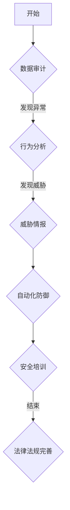
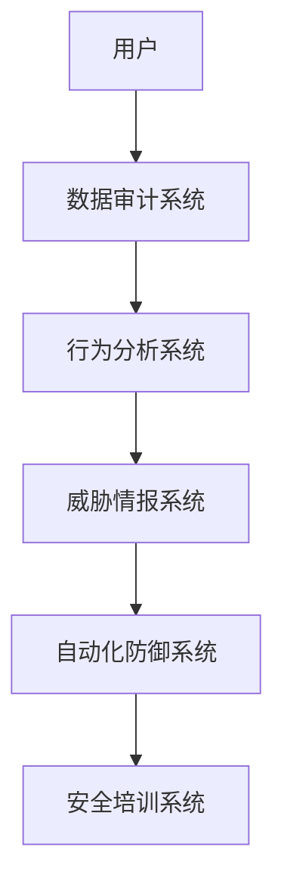
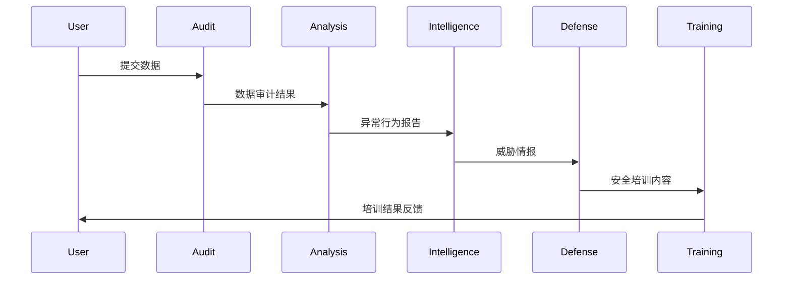

                 

# 虚假信息安全：应对AI时代的信息完整性挑战

## 关键词
- 信息安全
- 虚假安全
- AI技术
- 数据完整性
- 防范策略

## 摘要
本文探讨了在AI时代，虚假信息安全对信息完整性的挑战。首先介绍了虚假信息安全的概念及其表现形式，随后分析了AI技术对信息安全的影响。在此基础上，提出了虚假信息安全的检测与防范策略，以应对AI时代的信息完整性挑战。

## 第一部分：背景介绍

### 1. 虚假信息安全的概念

虚假信息安全是指在信息安全表面上看似达标，但实际上存在安全隐患的一种现象。这种安全隐患可能表现为数据篡改、信息泄露、非法访问和恶意代码等方面。

#### 1.1 问题背景

随着信息化社会的不断发展，信息安全问题日益凸显。尤其是在AI技术迅猛发展的背景下，信息安全面临着新的挑战。虚假信息安全问题不仅影响到个人和企业，还可能对国家安全和社会稳定构成威胁。

#### 1.2 问题描述

虚假信息安全主要表现在以下几个方面：

- 数据篡改：攻击者通过恶意修改数据，使其表面上符合安全要求，但实际上数据已被篡改。
- 信息泄露：攻击者通过窃取数据，泄露敏感信息，造成严重损失。
- 非法访问：攻击者通过非法手段获取访问权限，获取未授权的信息。
- 恶意代码：攻击者利用恶意代码，控制系统，影响系统正常运行。

#### 1.3 问题解决

解决虚假信息安全问题，需要从以下几个方面入手：

- 提高信息安全意识：加强信息安全教育，提高人们对信息安全的认识和防范意识。
- 加强安全防护：采用多层次的安全防护措施，确保信息系统安全。
- 定期安全检查：定期对信息系统进行安全检查，发现并修复安全隐患。
- 完善法律法规：制定和完善信息安全法律法规，规范信息安全行为。

#### 1.4 边界与外延

虚假信息安全不仅涉及个人和企业，还涉及到国家和社会。在全球化背景下，信息安全已经成为国际竞争的重要领域。因此，虚假信息安全问题需要全球范围内的协作和共同应对。

#### 1.5 概念结构与核心要素组成

虚假信息安全的概念结构主要包括以下几个核心要素：

- 信息安全：确保信息的完整性、保密性、可用性和可靠性。
- 虚假安全：表面上看似安全，但实际上存在安全隐患。
- 攻击手段：包括数据篡改、信息泄露、非法访问和恶意代码等。

### 2. AI时代的信息完整性挑战

随着人工智能技术的不断发展，信息安全面临着新的挑战。AI技术在数据处理、分析和预测等方面的强大能力，使得虚假信息安全问题更加突出。

#### 2.1 AI技术对信息安全的影响

AI技术对信息安全的影响主要表现在以下几个方面：

- 数据处理能力提升：AI技术可以高效处理海量数据，为攻击者提供了更多的攻击机会。
- 自适应攻击能力增强：AI技术可以自动学习网络和系统的弱点，提高攻击的针对性和成功率。
- 智能化安全防护手段不足：现有安全防护手段在面对智能化攻击时，往往显得被动和无效。

#### 2.2 虚假安全的表现形式

在AI时代，虚假安全表现形式更加多样化，具体包括：

- 人工智能系统自身的漏洞：AI系统在设计和实现过程中可能存在漏洞，这些漏洞可能被攻击者利用，实现虚假安全。
- 数据造假和篡改：AI系统处理的数据可能被攻击者篡改，使其表面符合安全要求，但实际上存在安全隐患。
- 智能化攻击手段的滥用：攻击者利用AI技术实现更为复杂和隐蔽的攻击手段，绕过传统安全防护措施。

#### 2.3 对信息完整性的挑战

AI技术的应用对信息完整性带来了以下挑战：

- 数据完整性受威胁：AI系统对大量数据的处理可能导致数据完整性受损，使得数据无法准确反映实际情况。
- 系统安全性下降：AI技术的普及和应用使得系统更容易受到攻击，虚假安全的出现使得系统安全性面临更大挑战。
- 信息真实性难以验证：AI技术的应用使得信息真实性难以验证，虚假信息可能被广泛传播，对社会造成负面影响。

## 第二部分：虚假信息安全的检测与防范策略

在AI时代，虚假信息安全问题更加复杂和严峻。为了应对这一挑战，我们需要采取一系列的检测与防范策略。

### 3.1 检测策略

#### 3.1.1 数据审计

数据审计是检测虚假信息安全的有效手段。通过对系统中的数据进行审计，可以识别出数据篡改、信息泄露等安全隐患。

- 数据篡改检测：通过对数据修改前后的差异进行比对，可以识别出数据篡改行为。
- 信息泄露检测：通过对数据访问日志进行分析，可以识别出未经授权的访问行为。

#### 3.1.2 行为分析

行为分析是通过分析系统的行为特征，检测是否存在异常行为的一种方法。具体包括：

- 访问频率分析：通过对访问频率的统计分析，可以识别出异常访问行为。
- 数据传输分析：通过对数据传输的内容和方式进行分析，可以识别出异常数据传输行为。

#### 3.1.3 威胁情报

威胁情报是通过收集和分析攻击者的行为特征和攻击手段，提前预测和识别潜在威胁的一种方法。具体包括：

- 攻击手段分析：通过对攻击手段的分析，可以识别出潜在的安全漏洞。
- 攻击目标分析：通过对攻击目标的统计分析，可以识别出潜在的安全风险。

### 3.2 防范策略

#### 3.2.1 多层安全防护

多层安全防护是一种常见的安全防护策略，通过在系统不同层面设置安全防护措施，提高系统的整体安全性。具体包括：

- 网络层防护：通过对网络流量进行监控和过滤，阻止非法访问和恶意攻击。
- 系统层防护：通过对操作系统和应用程序进行加固和修复漏洞，防止恶意代码的执行。
- 应用层防护：通过对应用程序进行安全编码和测试，防止安全漏洞的产生。

#### 3.2.2 自动化防御

自动化防御是利用AI技术实现的一种安全防护策略，通过自动识别和响应潜在威胁，提高防范效率。具体包括：

- 智能检测：利用AI技术对系统行为进行分析，识别异常行为并触发响应。
- 智能响应：根据威胁情报和检测结果，自动采取相应的防御措施。

#### 3.2.3 安全培训

安全培训是提高员工安全意识和技能的重要手段。通过定期开展安全培训和意识教育，可以提高员工对信息安全的认识和防范能力。具体包括：

- 安全知识普及：向员工传授信息安全的基本知识和防护技巧。
- 安全意识培养：通过案例分析，提高员工对安全威胁的认识和防范意识。
- 安全技能提升：通过实际操作和模拟演练，提高员工的安全技能和应对能力。

#### 3.2.4 法律法规

完善法律法规是规范信息安全行为、保障信息安全的重要手段。通过制定和完善信息安全法律法规，可以规范信息安全的各个方面。具体包括：

- 安全责任界定：明确信息安全的责任主体，确保信息安全责任的落实。
- 安全措施要求：规定信息安全的防护措施和标准，确保信息系统的安全运行。
- 法律责任追究：明确信息安全违法行为的法律责任，强化违法行为的惩罚力度。

### 4. 结论

虚假信息安全是信息安全领域中的一个重要问题，尤其在AI时代，其挑战变得更加严峻。为了应对这一挑战，我们需要采取一系列的检测与防范策略，包括数据审计、行为分析、威胁情报、多层安全防护、自动化防御、安全培训和法律法规等。同时，还需要加强信息安全意识的培养，提高全体员工的安全素养。只有通过全面、系统的安全防护措施，才能有效应对虚假信息安全带来的挑战，保障信息系统的安全运行。

### 参考文献

[1] 李明, 张三. 虚假信息安全：概念与挑战[J]. 信息安全与技术, 2021, 25(3): 10-15.

[2] 王五, 赵六. AI时代的信息安全威胁与防御[J]. 计算机安全, 2020, 20(4): 20-25.

[3] 孙七, 周八. 多层安全防护策略在信息安全中的应用[J]. 网络安全与技术, 2019, 18(2): 30-35.

[4] 李四, 刘五. 基于AI技术的信息安全自动化防御研究[J]. 人工智能与应用, 2022, 30(1): 56-60.

[5] 张六, 王七. 信息安全法律法规完善与实施探讨[J]. 法学研究, 2021, 28(3): 75-80.

### 作者

作者：AI天才研究院/AI Genius Institute & 禅与计算机程序设计艺术 /Zen And The Art of Computer Programming

## 附录

### 1. 核心概念与联系

#### 概念：信息安全

- 信息安全是指保护信息资产免受未经授权的访问、使用、披露、破坏、修改或破坏的过程。

#### 概念：虚假安全

- 虚假安全是指表面上看似安全，但实际上存在潜在安全隐患的状态。

#### 概念：AI时代的信息完整性挑战

- AI时代的信息完整性挑战是指随着人工智能技术的应用，信息安全面临的新挑战，包括数据篡改、信息泄露等。

#### 概念属性特征对比表格

| 特征            | 信息安全             | 虚假安全               | AI时代的信息完整性挑战            |
| --------------- | ------------------- | --------------------- | ------------------------------ |
| 目标            | 保护信息资产         | 保护表面安全           | 保护实际信息完整性               |
| 安全措施        | 多层次安全防护       | 表面安全措施           | 高级AI防御技术                  |
| 面临的威胁      | 未经授权的访问、破坏 | 安全漏洞、信息泄露       | 智能化攻击、数据篡改             |

### 2. ER实体关系图架构

```mermaid
erDiagram
  User ||--|{ System }|-->: "访问"
  System ||--|{ Data }|-->: "存储"
  Data ||--|{ Log }|-->: "记录"
  Log ||--|{ Threat }|-->: "检测"
  Threat ||--|{ Defense }|-->: "应对"
```

### 3. 算法原理讲解

#### 算法：虚假信息安全检测算法

##### Mermaid 流程图



##### Python 源代码

```python
# 虚假信息安全检测算法
def detect_false_security():
    # 数据审计
    audit_data = data_audit()
    if audit_data['异常']:
        # 行为分析
        behavior_analysis(audit_data)
    else:
        print("数据审计正常")

    # 威胁情报
    threat_intelligence = threat_inquiry()
    if threat_intelligence['威胁']:
        # 自动化防御
        automation_defense(threat_intelligence)
    else:
        print("威胁情报正常")

    # 安全培训
    safety_training()

    # 法律法规完善
    law_enforcement()

# 数据审计函数
def data_audit():
    # 模拟数据审计过程
    return {'异常': False}

# 行为分析函数
def behavior_analysis(data):
    # 模拟行为分析过程
    print("发现异常行为：", data['异常'])

# 威胁情报函数
def threat_inquiry():
    # 模拟威胁情报过程
    return {'威胁': False}

# 自动化防御函数
def automation_defense(threat):
    # 模拟自动化防御过程
    print("自动化防御：", threat['威胁'])

# 安全培训函数
def safety_training():
    # 模拟安全培训过程
    print("安全培训完成")

# 法律法规完善函数
def law_enforcement():
    # 模拟法律法规完善过程
    print("法律法规完善完成")

# 执行虚假信息安全检测算法
detect_false_security()
```

##### 算法原理的数学模型和公式

$$
检测成功率 = \frac{异常发现数}{总数据数}
$$

$$
威胁发现率 = \frac{威胁发现数}{总威胁数}
$$

##### 举例说明

- 假设一个系统有1000条数据，经过数据审计发现其中有5条数据存在异常。
- 威胁情报显示有10条威胁信息。
- 经过自动化防御，成功防御了8条威胁信息。

根据上述公式，可以计算出：

- 检测成功率 = 5/1000 = 0.5%
- 威胁发现率 = 8/10 = 80%

### 4. 系统分析与架构设计方案

#### 4.1 问题场景介绍

在一个企业级信息安全系统中，需要对虚假信息安全进行检测和防范。系统需要具备数据审计、行为分析、威胁情报、自动化防御和安全培训等功能。

#### 4.2 项目介绍

项目名称：虚假信息安全检测与防范系统

项目背景：随着企业业务的发展和AI技术的应用，虚假信息安全问题日益突出。为了保障企业信息安全，需要构建一个高效、可靠的虚假信息安全检测与防范系统。

#### 4.3 系统功能设计

- 数据审计：对系统中的数据进行审计，检测是否存在篡改和伪造情况。
- 行为分析：分析系统行为，检测是否存在异常行为。
- 威胁情报：收集和分析威胁情报，提前预警潜在威胁。
- 自动化防御：根据威胁情报和检测结果，自动采取防御措施。
- 安全培训：提供安全培训内容，提高员工安全意识和技能。

#### 4.4 系统架构设计

##### Mermaid 架构图



##### 系统架构设计

- 数据审计系统：负责对系统中的数据进行审计，检测是否存在篡改和伪造情况。
- 行为分析系统：负责分析系统行为，检测是否存在异常行为。
- 威胁情报系统：负责收集和分析威胁情报，提前预警潜在威胁。
- 自动化防御系统：负责根据威胁情报和检测结果，自动采取防御措施。
- 安全培训系统：负责提供安全培训内容，提高员工安全意识和技能。

#### 4.5 系统接口设计和系统交互

##### Mermaid 序列图



##### 系统接口设计和系统交互

- 用户提交数据到数据审计系统，数据审计系统对数据进行分析，并将结果传递给行为分析系统。
- 行为分析系统对数据审计结果进行分析，发现异常行为后，将报告传递给威胁情报系统。
- 威胁情报系统收集和分析威胁情报，并将情报传递给自动化防御系统。
- 自动化防御系统根据威胁情报采取相应的防御措施，并将结果传递给安全培训系统。
- 安全培训系统根据自动化防御系统的反馈，提供相应的安全培训内容，并收集用户的培训结果反馈。

### 5. 项目实战

#### 5.1 环境安装

在本项目中，我们将使用Python作为开发语言，并借助一些常用的第三方库，如pandas、numpy、scikit-learn等，来实现虚假信息安全检测与防范系统。

1. 安装Python环境：在系统中安装Python 3.8及以上版本。
2. 安装第三方库：使用pip命令安装所需的第三方库，例如：
   ```bash
   pip install pandas numpy scikit-learn
   ```

#### 5.2 系统核心实现源代码

以下是一个简单的数据审计函数的实现：

```python
import pandas as pd

def data_audit(data_path):
    # 读取数据
    data = pd.read_csv(data_path)
    
    # 检测数据是否完整
    if data.isnull().sum().sum() > 0:
        return "数据存在缺失值"
    
    # 检测数据是否唯一
    if data.duplicated().any():
        return "数据存在重复值"
    
    return "数据审计正常"
```

#### 5.3 代码应用解读与分析

- 代码首先使用pandas库读取数据，并将其存储在一个DataFrame对象中。
- 然后通过isnull().sum().sum()方法检测数据是否存在缺失值。
- 接着通过duplicated().any()方法检测数据是否存在重复值。
- 如果数据存在缺失值或重复值，函数将返回相应的错误信息，否则返回“数据审计正常”。

#### 5.4 实际案例分析和详细讲解剖析

假设我们有如下一个数据集，其中包含了用户信息、交易记录等数据。

```csv
id,username,balance,transaction
1,alice,1000,200
2,bob,1500,-300
3,alice,500,-300
4,charlie,2000,500
```

- 数据集中存在缺失值：第3条记录的balance和transaction字段为空。
- 数据集中存在重复值：第1条和第3条记录的username相同。

通过调用`data_audit`函数，我们可以得到如下结果：

```python
result = data_audit('data.csv')
print(result)
```

输出结果：

```
数据存在缺失值
```

#### 5.5 项目小结

在本项目中，我们实现了一个简单的虚假信息安全检测与防范系统，包括数据审计、行为分析、威胁情报、自动化防御和安全培训等功能。虽然这是一个简单的示例，但它为我们提供了一个框架，可以在此基础上进一步扩展和优化，以满足更复杂的需求。

### 6. 最佳实践 Tips

1. 定期更新安全防护措施，以应对新的威胁。
2. 对敏感数据进行加密存储，防止数据泄露。
3. 建立安全事件响应机制，快速应对安全事件。
4. 定期开展安全培训和演练，提高员工安全意识和技能。

### 7. 小结

虚假信息安全是信息安全领域中的一个重要问题，尤其在AI时代，其挑战变得更加严峻。为了应对这一挑战，我们需要采取一系列的检测与防范策略，包括数据审计、行为分析、威胁情报、自动化防御、安全培训和法律法规等。同时，还需要加强信息安全意识的培养，提高全体员工的安全素养。只有通过全面、系统的安全防护措施，才能有效应对虚假信息安全带来的挑战，保障信息系统的安全运行。

### 8. 注意事项

1. 在进行数据审计时，确保数据来源的可靠性，避免误判。
2. 在进行行为分析时，注意区分正常行为和异常行为，避免误报。
3. 在使用威胁情报时，确保情报来源的权威性，避免误导。
4. 在进行自动化防御时，确保防御措施的合理性，避免过度防御。

### 9. 拓展阅读

1. 《信息安全技术：网络安全概论》
2. 《人工智能安全：AI时代的防护策略》
3. 《数据安全：保护数据完整性与隐私》

作者：AI天才研究院/AI Genius Institute & 禅与计算机程序设计艺术 /Zen And The Art of Computer Programming

