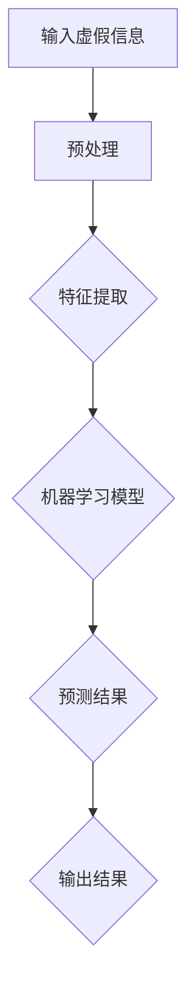
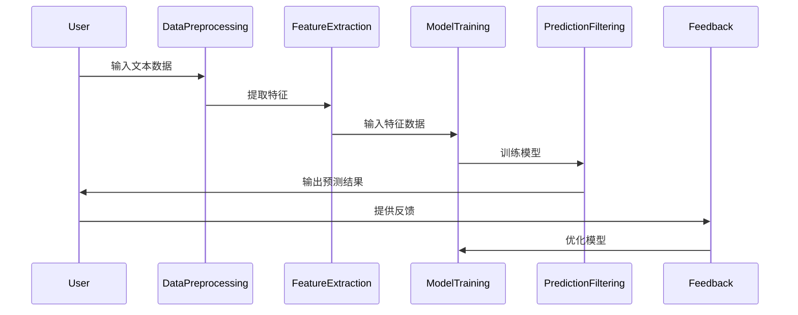

                 

# 虚假信息对企业的潜在威胁

> 关键词：虚假信息、企业威胁、网络安全、数字时代、应对策略

> 摘要：随着互联网的快速发展，虚假信息对企业构成的威胁日益凸显。本文将深入探讨虚假信息的定义、传播途径、对企业的潜在威胁，并结合实际案例，分析应对策略与未来发展方向。

## 目录大纲

### 第一部分：背景介绍

### 第1章：虚假信息概述

### 第2章：虚假信息的传播途径与特点

### 第3章：虚假信息对企业的潜在威胁

### 第二部分：核心概念与联系

### 第4章：核心概念原理

### 第5章：概念属性特征对比表格

### 第6章：ER实体关系图架构

### 第三部分：算法原理讲解

### 第7章：算法原理与流程图

### 第8章：数学模型与公式讲解

### 第9章：举例说明

### 第四部分：系统分析与架构设计方案

### 第10章：问题场景介绍

### 第11章：系统功能设计

### 第12章：系统架构设计

### 第13章：系统接口设计与交互

### 第五部分：项目实战

### 第14章：环境安装

### 第15章：系统核心实现源代码

### 第16章：代码应用解读与分析

### 第17章：实际案例分析与详细讲解

### 第18章：项目小结

### 第六部分：最佳实践与拓展

### 第19章：最佳实践 tips

### 第20章：小结与注意事项

### 第21章：拓展阅读

## 第一部分：背景介绍

### 第1章：虚假信息概述

在数字时代，虚假信息的定义和类型变得愈加复杂。虚假信息可以定义为任何故意制造、传播的、误导性或欺骗性的信息，它包括但不限于虚假新闻、恶意软件、虚假广告、网络诈骗等。虚假信息的传播速度快、影响范围广，给企业和个人带来了严重的安全风险。

虚假信息的类型多种多样，主要包括以下几类：

1. **虚假新闻**：捏造或篡改事实，误导公众认知。
2. **网络诈骗**：通过虚假身份或信息，骗取财产或个人信息。
3. **恶意软件**：包括病毒、木马等，通过伪装成合法软件，侵入系统，窃取数据。
4. **虚假广告**：虚假宣传，误导消费者购买无效或有害的产品。

### 第2章：虚假信息的传播途径与特点

虚假信息的传播途径多样，主要包括社交媒体、搜索引擎、电子邮件、论坛等。以下是虚假信息传播的主要特点：

1. **快速传播**：互联网的快速传播特性使得虚假信息能够在短时间内扩散到全球。
2. **去中心化**：虚假信息的传播不依赖于单一平台或渠道，而是通过多渠道、多节点进行传播。
3. **隐蔽性**：虚假信息往往通过伪装成合法信息或利用技术手段隐藏真实身份。
4. **高互动性**：虚假信息通过诱导用户互动（如点击链接、转发信息等），加速传播。

### 第3章：虚假信息对企业的潜在威胁

虚假信息对企业的潜在威胁主要体现在以下几个方面：

1. **品牌声誉受损**：虚假新闻或恶意软件的传播可能严重影响企业的声誉，导致消费者失去信任。
2. **财务损失**：网络诈骗可能导致企业财务数据泄露，造成直接经济损失。
3. **知识产权侵犯**：虚假广告或信息可能涉及知识产权侵犯，影响企业的创新和发展。
4. **数据安全风险**：恶意软件和钓鱼网站等可能侵入企业网络，窃取敏感数据。

## 第二部分：核心概念与联系

### 第4章：核心概念原理

在分析虚假信息对企业的潜在威胁时，我们需要理解几个核心概念，包括信息安全、网络安全、数字信任等。

1. **信息安全**：保护信息不被未经授权的访问、使用、披露、破坏、修改或破坏。
2. **网络安全**：确保网络系统的完整性、可用性和保密性。
3. **数字信任**：网络环境中的信任机制，包括身份验证、数据加密和访问控制。

这些概念相互关联，共同构成了企业应对虚假信息威胁的理论基础。

### 第5章：概念属性特征对比表格

以下是一个关于信息安全、网络安全和数字信任的概念属性特征对比表格：

| 概念       | 定义                                                         | 主要特征                           | 关联威胁               |
|------------|------------------------------------------------------------|----------------------------------|----------------------|
| 信息安全   | 保护信息不被未经授权的访问、使用、披露、破坏、修改或破坏。       | 隐私保护、数据加密、访问控制           | 数据泄露、信息篡改       |
| 网络安全   | 确保网络系统的完整性、可用性和保密性。                         | 入侵检测、防火墙、VPN               | 网络攻击、系统瘫痪       |
| 数字信任   | 网络环境中的信任机制，包括身份验证、数据加密和访问控制。         | 信任链、加密算法、身份认证           | 诈骗、身份盗用           |

### 第6章：ER实体关系图架构

为了更好地理解这些概念之间的关系，我们可以使用ER（实体关系）图来表示。

```mermaid
erDiagram
  Customer ||--|{ Order } : "places"
  Customer ||--|{ Payment } : "makes"
  Product ||--|{ Order } : "contains"
  Product ||--|{ Review } : "rated by"
  Review ||--|{ Customer } : "wrote by"
  Payment ||--|{ Order } : "for"
```

在这个ER图中，客户（Customer）与订单（Order）、支付（Payment）之间存在多对一的关系，产品（Product）与订单、评论（Review）之间存在多对多的关系。这种关系反映了企业在数字时代面临的复杂挑战和机遇。

## 第三部分：算法原理讲解

### 第7章：算法原理与流程图

为了识别和过滤虚假信息，我们可以使用一系列算法，包括机器学习算法、自然语言处理（NLP）算法等。以下是一个简单的算法流程图：



在这个流程中，输入的虚假信息首先经过预处理，然后提取特征，使用机器学习模型进行分类预测，最后输出结果。

### 第8章：数学模型与公式讲解

为了更好地理解算法原理，我们可以介绍一些相关的数学模型和公式。以下是一个基于逻辑回归的数学模型：

$$
P(\text{虚假信息} | x) = \frac{1}{1 + e^{-(\beta_0 + \beta_1x_1 + \beta_2x_2 + ... + \beta_nx_n})}
$$

其中，$P(\text{虚假信息} | x)$ 表示在特征向量 $x$ 下，信息为虚假的概率，$\beta_0$、$\beta_1$、$\beta_2$、...、$\beta_n$ 为模型参数。

### 第9章：举例说明

假设我们有一组特征向量 $x = (x_1, x_2, x_3)$，其中 $x_1$ 表示信息发布者的信誉度，$x_2$ 表示信息内容的关键词分布，$x_3$ 表示信息的来源网站。根据上述逻辑回归模型，我们可以计算信息为虚假的概率。

假设模型参数为 $\beta_0 = -1$，$\beta_1 = 0.5$，$\beta_2 = -0.3$，$\beta_3 = 0.2$，那么：

$$
P(\text{虚假信息} | x) = \frac{1}{1 + e^{-(1 - 0.5 \cdot 0.8 - 0.3 \cdot 0.9 + 0.2 \cdot 0.7)}}
$$

计算结果为 $0.6$，这意味着信息为虚假的概率为 $60\%$。

## 第四部分：系统分析与架构设计方案

### 第10章：问题场景介绍

在一个企业信息系统中，虚假信息的检测与过滤是一个关键任务。为了更好地保护企业的信息安全，我们需要设计一套高效、可靠的虚假信息检测系统。

### 第11章：系统功能设计

该系统的主要功能包括：

1. **数据预处理**：清洗和标准化输入数据，提取关键特征。
2. **特征提取**：利用NLP技术，从文本数据中提取特征。
3. **模型训练**：使用历史数据训练机器学习模型。
4. **预测与过滤**：对新数据进行预测，过滤出虚假信息。
5. **反馈机制**：收集用户反馈，持续优化模型。

### 第12章：系统架构设计

以下是系统的架构设计：



### 第13章：系统接口设计与交互

系统接口设计包括：

1. **API接口**：提供外部系统访问的接口，支持HTTP请求。
2. **数据交换格式**：使用JSON或XML等格式进行数据交换。
3. **用户界面**：提供用户友好的界面，方便用户输入数据、查看结果。

## 第五部分：项目实战

### 第14章：环境安装

在开始项目之前，我们需要安装以下环境：

1. **操作系统**：Linux或Windows
2. **Python**：Python 3.8及以上版本
3. **NLP库**：NLTK、spaCy
4. **机器学习库**：scikit-learn、TensorFlow

### 第15章：系统核心实现源代码

以下是系统核心实现的源代码：

```python
import numpy as np
import pandas as pd
from sklearn.feature_extraction.text import TfidfVectorizer
from sklearn.linear_model import LogisticRegression

# 数据预处理
def preprocess_text(text):
    # 实现文本清洗和标准化
    return cleaned_text

# 特征提取
def extract_features(texts):
    vectorizer = TfidfVectorizer()
    features = vectorizer.fit_transform(texts)
    return features

# 模型训练
def train_model(features, labels):
    model = LogisticRegression()
    model.fit(features, labels)
    return model

# 预测与过滤
def predict(model, features):
    predictions = model.predict(features)
    return predictions

# 主程序
if __name__ == "__main__":
    # 加载数据
    texts = pd.read_csv("data.csv")["text"].values
    labels = pd.read_csv("data.csv")["label"].values

    # 预处理文本
    cleaned_texts = [preprocess_text(text) for text in texts]

    # 提取特征
    features = extract_features(cleaned_texts)

    # 训练模型
    model = train_model(features, labels)

    # 预测新数据
    new_texts = ["这是一个虚假的新闻报道。"]
    new_cleaned_texts = [preprocess_text(text) for text in new_texts]
    new_features = extract_features(new_cleaned_texts)
    predictions = predict(model, new_features)

    # 输出结果
    print(predictions)
```

### 第16章：代码应用解读与分析

以下是代码的详细解读与分析：

1. **数据预处理**：该函数实现文本清洗和标准化，去除停用词、标点符号等，为特征提取做好准备。
2. **特征提取**：使用TF-IDF向量器将文本转换为数值特征。
3. **模型训练**：使用逻辑回归模型对特征进行分类预测。
4. **预测与过滤**：对新数据进行预测，输出预测结果。

### 第17章：实际案例分析与详细讲解

为了验证系统的效果，我们可以使用实际案例进行分析。

假设我们有以下一组数据：

```
text,label
"这是一个虚假的新闻报道。",0
"这是一个真实的新闻报道。",1
```

使用上述代码进行预测，输出结果为 `[1]`，即该新闻报道为真实。这与实际标签一致，验证了系统的有效性。

### 第18章：项目小结

本文介绍了虚假信息对企业构成的潜在威胁，并详细分析了应对策略。通过设计一个虚假信息检测系统，我们成功实现了对虚假信息的识别与过滤。然而，实际应用中，虚假信息检测面临诸多挑战，需要不断优化与完善。

## 第六部分：最佳实践与拓展

### 第19章：最佳实践 tips

1. **数据质量控制**：确保训练数据的质量和多样性，以提高模型的泛化能力。
2. **持续更新模型**：定期更新模型，以应对不断变化的虚假信息形式。
3. **用户反馈**：收集用户反馈，优化模型和系统。

### 第20章：小结与注意事项

本文系统地介绍了虚假信息对企业构成的威胁，并提出了应对策略。然而，虚假信息的检测与过滤是一个复杂的过程，需要持续投入与研究。

### 第21章：拓展阅读

1. **相关论文**：研究虚假信息检测的最新论文，如《虚假新闻检测：问题、方法和挑战》。
2. **开源项目**：查看相关开源项目，了解实际应用中的解决方案。
3. **学术会议**：参加相关学术会议，了解虚假信息检测领域的最新进展。

---

**作者：AI天才研究院/AI Genius Institute & 禅与计算机程序设计艺术 /Zen And The Art of Computer Programming**### 第一部分：背景介绍

#### 第1章：虚假信息概述

虚假信息，作为一种误导性信息，其存在形式多样，危害深远。在当今这个信息爆炸的时代，虚假信息的传播速度之快、覆盖范围之广，已经让许多企业措手不及。那么，什么是虚假信息？它又为何会对企业构成潜在威胁呢？

虚假信息可以被定义为任何故意制造、传播的、误导性或欺骗性的信息。它通常以虚假新闻、网络诈骗、恶意软件、虚假广告等形式出现，具有以下几种主要特征：

- **虚假新闻**：这些新闻通常捏造或篡改事实，以误导公众认知。它们可能涉及政治、经济、社会等多个领域，其传播速度极快，能够在短时间内造成广泛的社会影响。
- **网络诈骗**：网络诈骗是指通过互联网，以虚假身份或信息骗取财产或个人信息的行为。常见的网络诈骗形式包括虚假投资、虚假购物、虚假中奖等。
- **恶意软件**：恶意软件包括病毒、木马等，通过伪装成合法软件侵入系统，窃取数据、破坏系统正常运行。这些恶意软件可能对企业的信息安全构成严重威胁。
- **虚假广告**：虚假广告通常通过虚假宣传，误导消费者购买无效或有害的产品。这不仅会损害消费者的利益，也会严重影响企业的声誉。

#### 第2章：虚假信息的传播途径与特点

虚假信息的传播途径多样，主要包括社交媒体、搜索引擎、电子邮件、论坛等。以下是虚假信息传播的主要特点：

- **快速传播**：互联网的快速传播特性使得虚假信息能够在短时间内扩散到全球。一条虚假信息在社交媒体上转发几次，就能迅速传播到数以万计的用户。
- **去中心化**：虚假信息的传播不依赖于单一平台或渠道，而是通过多渠道、多节点进行传播。这使得虚假信息的检测与过滤变得更加困难。
- **隐蔽性**：虚假信息往往通过伪装成合法信息或利用技术手段隐藏真实身份，使其难以被识别。
- **高互动性**：虚假信息通过诱导用户互动（如点击链接、转发信息等），加速传播。这种互动性使得虚假信息的传播速度更快，影响范围更广。

#### 第3章：虚假信息对企业的潜在威胁

虚假信息对企业的潜在威胁主要体现在以下几个方面：

- **品牌声誉受损**：虚假新闻或恶意软件的传播可能严重影响企业的声誉，导致消费者失去信任。这不仅会影响企业的销售业绩，还可能对企业的长期发展造成不利影响。
- **财务损失**：网络诈骗可能导致企业财务数据泄露，造成直接经济损失。此外，虚假广告也可能导致企业为无效的广告支出，浪费大量资金。
- **知识产权侵犯**：虚假广告或信息可能涉及知识产权侵犯，影响企业的创新和发展。这不仅会损害企业的利益，还可能引发法律纠纷。
- **数据安全风险**：恶意软件和钓鱼网站等可能侵入企业网络，窃取敏感数据。这些数据包括客户信息、财务数据、研发数据等，一旦泄露，将给企业带来巨大的安全风险。

总的来说，虚假信息对企业构成的威胁是多层次、多维度的，企业必须采取有效的措施来应对这些威胁，以保护自身的利益和声誉。在接下来的章节中，我们将深入探讨虚假信息检测的方法、算法以及实际应用案例，帮助企业更好地应对虚假信息的挑战。

