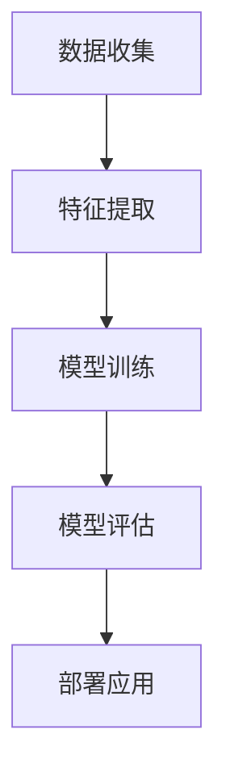
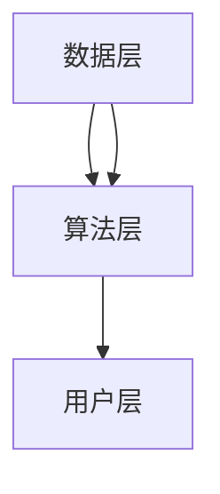

                 

### 虚假信息对企业的潜在威胁及应对策略

> 关键词：虚假信息、企业威胁、应对策略、机器学习、自然语言处理

> 摘要：本文深入探讨了虚假信息对企业所带来的潜在威胁，包括财务损失、品牌损害和操作风险等。随后，文章介绍了虚假信息的定义、分类及其传播特点。接着，文章详细讲解了虚假信息检测算法，如机器学习算法和自然语言处理算法，并使用 Mermaid 绘制了相关流程图。此外，本文还阐述了算法背后的数学模型和公式，并通过实际案例展示了系统架构设计方案和项目实战。最后，文章总结了最佳实践 tips、注意事项以及拓展阅读，为企业应对虚假信息提供了全面策略。

### 背景介绍

#### 1.1 引言

虚假信息（Fake Information）是指故意制造、传播的错误、误导性或欺骗性的信息。在企业环境中，虚假信息可能源自内部员工、外部竞争对手或恶意黑客。随着互联网和社交媒体的快速发展，虚假信息的传播速度和范围显著增加，对企业的影响愈发显著。

企业面临虚假信息威胁的原因主要有以下几点：

1. **财务风险**：虚假信息可能导致投资者对企业失去信心，进而影响股价和市值。
2. **品牌损害**：企业声誉可能因为虚假信息而遭受严重损害，影响客户信任和忠诚度。
3. **操作风险**：虚假信息可能导致企业决策失误，进而影响正常运营。

#### 1.2 虚假信息对企业的影响

1. **财务损失**：虚假信息可能误导投资者，导致资金流失。例如，某公司发布虚假财报，使投资者误判公司财务状况，最终导致股价大幅下跌。

2. **品牌损害**：虚假信息广泛传播，损害企业声誉。例如，某知名品牌因被恶意指控产品质量问题而遭受广泛质疑，导致品牌形象受损。

3. **操作风险**：虚假信息可能导致企业决策失误。例如，企业高管根据虚假的市场数据做出错误的战略决策，最终导致运营困难。

### 虚假信息的定义与影响

#### 2.1 虚假信息的概念

虚假信息是指通过故意制造、传播或修改来误导、欺骗他人的信息。它可能包含虚假的陈述、误导性的信息或者故意隐瞒真相。虚假信息的来源多种多样，包括社交媒体、新闻报道、商业广告、个人邮件等。

#### 2.2 虚假信息对企业的影响

虚假信息对企业的影响是多方面的，主要包括以下几个方面：

1. **财务风险**：虚假信息可能误导投资者，导致股价波动，从而影响企业的市值和融资能力。例如，一家企业如果发布虚假财务报表，投资者可能会基于错误的信息做出投资决策，导致股价大幅下跌。

2. **品牌损害**：虚假信息在互联网上的传播速度非常快，一旦企业被贴上负面标签，可能会迅速扩散，对品牌形象造成毁灭性的打击。例如，社交媒体上恶意谣言的传播，可能导致消费者对企业的产品或服务失去信任。

3. **操作风险**：虚假信息可能导致企业内部决策失误，从而影响正常运营。例如，企业高管在收到虚假的市场分析报告后，可能会做出错误的战略决策，导致企业陷入困境。

#### 2.3 虚假信息的类型与特点

虚假信息有多种类型，包括：

1. **传统虚假信息**：例如虚假广告、伪造文件等，主要通过传统媒体传播。

2. **网络虚假信息**：通过互联网传播，如虚假新闻、网络谣言等。

3. **社交媒体虚假信息**：通过社交媒体平台传播，如微博、微信、Facebook、Twitter等。

虚假信息的传播特点主要有：

1. **爆发性**：虚假信息一旦发布，可能会迅速传播，达到大量受众。

2. **不可控性**：由于互联网的匿名性，虚假信息难以被有效控制。

3. **交互性**：虚假信息往往伴随着用户互动，如转发、评论等，进一步加速传播。

#### 2.4 虚假信息的传播机制

虚假信息的传播机制主要包括以下几个环节：

1. **信息制造与发布**：制造者可能通过虚假报道、伪造图片、视频等方式制造虚假信息。

2. **信息传播**：通过社交媒体、新闻媒体、论坛等渠道传播。

3. **受众接受与传播**：受众在接收信息后，可能会进一步转发或评论，从而扩大信息传播范围。

4. **信息影响**：虚假信息对受众的行为、决策产生影响，如影响投资决策、消费行为等。

### 虚假信息检测算法

#### 3.1 算法概述

虚假信息检测算法主要包括以下几种：

1. **机器学习算法**：通过训练模型来识别和分类虚假信息。

2. **自然语言处理算法**：利用语言模型和词向量等工具，对文本内容进行分析和分类。

3. **图论算法**：通过构建信息传播网络，分析虚假信息的传播路径。

#### 3.2 虚假信息检测流程

虚假信息检测通常包括以下几个步骤：

1. **数据收集**：收集相关的虚假信息样本，用于训练和测试模型。

2. **特征提取**：从文本中提取有用的特征，如词频、词向量等。

3. **模型训练**：使用机器学习算法或自然语言处理算法，对提取的特征进行训练。

4. **模型评估**：通过测试集评估模型的性能，如准确率、召回率等。

5. **部署与应用**：将训练好的模型部署到实际应用场景，进行实时检测和分类。

### 虚假信息应对策略

#### 4.1 技术策略

1. **内容审核**：通过对上传的内容进行人工审核，过滤掉虚假信息。

2. **用户行为分析**：通过分析用户的行为模式，识别和阻止虚假信息的传播。

3. **机器学习模型应用**：利用训练好的机器学习模型，对文本内容进行自动分类和检测。

#### 4.2 法律与伦理策略

1. **法律法规**：制定相关法律法规，规范虚假信息的传播和处置。

2. **伦理标准**：加强行业自律，提倡诚信传播，共同抵制虚假信息。

3. **社会责任**：企业应承担社会责任，积极参与虚假信息治理。

### 算法原理讲解

#### 5.1 机器学习算法原理

机器学习算法是虚假信息检测的核心，主要包括以下步骤：

1. **数据准备**：收集和整理虚假信息样本，并将其划分为训练集和测试集。

2. **模型选择**：选择合适的机器学习模型，如支持向量机（SVM）、决策树（DT）等。

3. **模型训练**：使用训练集数据训练模型，学习如何分类虚假信息。

4. **模型评估**：使用测试集数据评估模型性能，调整模型参数以提高准确性。

#### 5.2 自然语言处理算法原理

自然语言处理（NLP）算法在虚假信息检测中具有重要意义，主要包括以下步骤：

1. **词向量表示**：将文本转化为词向量，如使用 Word2Vec、GloVe 等模型。

2. **语言模型**：训练语言模型，如使用基于循环神经网络（RNN）的模型。

3. **文本分类**：使用分类算法，如朴素贝叶斯（NB）、深度学习（DL）等，对文本进行分类。

#### 5.3 算法流程图

使用 Mermaid 绘制算法流程图，如下所示：

#### 5.4 算法原理讲解

1. **机器学习算法**

   机器学习算法的核心是学习如何从数据中提取模式和规律。在虚假信息检测中，机器学习算法通过训练模型，学习如何区分真实信息和虚假信息。常见的机器学习算法包括：

   - **支持向量机（SVM）**：通过找到一个超平面，将真实信息和虚假信息分开。

   - **决策树（DT）**：通过一系列条件判断，将数据划分为不同的类别。

   - **随机森林（RF）**：集成多个决策树，提高分类准确性。

2. **自然语言处理算法**

   自然语言处理算法是虚假信息检测的重要手段。NLP 算法通过处理文本数据，提取关键信息，然后利用机器学习算法进行分类。常见的 NLP 算法包括：

   - **词向量表示**：将文本转化为向量表示，如 Word2Vec、GloVe 等。

   - **语言模型**：使用循环神经网络（RNN）、 Transformer 等模型，对文本进行建模。

   - **文本分类**：利用分类算法，如朴素贝叶斯（NB）、卷积神经网络（CNN）等，对文本进行分类。

#### 5.5 数学模型和公式

在虚假信息检测中，常用的数学模型和公式包括：

1. **支持向量机（SVM）**

   $$ w^* = \arg\min_{w} \frac{1}{2}||w||^2 + C\sum_{i=1}^{n}\xi_i $$

   其中，$w$ 是超平面参数，$C$ 是惩罚参数，$\xi_i$ 是松弛变量。

2. **朴素贝叶斯（NB）**

   $$ P(y|X) = \frac{P(X|y)P(y)}{P(X)} $$

   其中，$P(y|X)$ 是后验概率，$P(X|y)$ 是特征条件概率，$P(y)$ 是类条件概率。

3. **卷积神经网络（CNN）**

   $$ h_{\theta}(x) = \sigma(\sum_{i=1}^{n} \theta_i \times x_i + b) $$

   其中，$h_{\theta}(x)$ 是激活函数，$\sigma$ 是 Sigmoid 函数，$\theta_i$ 是权重，$x_i$ 是输入特征，$b$ 是偏置。

#### 5.6 算法原理举例说明

以支持向量机（SVM）为例，假设我们要分类以下两组数据：

| 类别 | 数据 1 | 数据 2 | 数据 3 | 数据 4 |
| ---- | ---- | ---- | ---- | ---- |
| 真实  | 1     | 2     | 3     | 4     |
| 虚假  | 5     | 6     | 7     | 8     |

使用 SVM 对这些数据进行分类，步骤如下：

1. **数据准备**：将数据分为训练集和测试集，如 70% 作为训练集，30% 作为测试集。

2. **特征提取**：从数据中提取特征，如词频、词向量等。

3. **模型训练**：使用训练集数据训练 SVM 模型，学习如何区分真实和虚假信息。

4. **模型评估**：使用测试集数据评估模型性能，如准确率、召回率等。

5. **部署应用**：将训练好的模型部署到实际应用场景，进行实时检测和分类。

### 系统分析与架构设计方案

#### 6.1 系统概述

虚假信息检测系统旨在实时监控和分析企业内部和外部的信息流，识别和阻止虚假信息的传播。系统目标包括：

1. **提高企业信息安全性**：通过检测和阻止虚假信息，确保企业内部信息的安全。

2. **保护企业品牌形象**：通过及时发现和应对虚假信息，防止品牌形象受损。

3. **优化企业决策**：通过准确的信息分析，帮助企业做出更科学的决策。

#### 6.2 系统架构设计

虚假信息检测系统的架构设计主要包括以下几个部分：

1. **数据层**：负责数据的收集、存储和管理。

2. **算法层**：负责虚假信息的检测和分类。

3. **用户层**：提供用户交互界面，展示检测结果和报告。

#### 6.3 系统架构图

使用 Mermaid 绘制系统架构图，如下所示：

#### 6.4 系统接口设计

系统接口设计包括数据接口和控制接口：

1. **数据接口**：负责数据的收集和存储，如 API 接口、数据库连接等。

2. **控制接口**：负责系统的控制和管理，如用户登录、权限控制等。

#### 6.5 系统交互设计

系统交互设计主要包括以下几个环节：

1. **用户请求**：用户通过界面提交请求，如查询检测结果、更新配置等。

2. **数据处理**：系统接收用户请求，进行数据处理，如数据清洗、特征提取等。

3. **结果展示**：系统将处理结果展示给用户，如生成报告、可视化图表等。

4. **反馈调整**：用户对结果进行反馈，系统根据反馈调整配置和算法，提高检测准确性。

### 项目实战

#### 7.1 项目背景

虚假信息检测项目旨在构建一个高效、可靠的虚假信息检测系统，用于实时监控和分析企业内部和外部的信息流。项目目标包括：

1. **提高信息安全性**：通过实时检测和阻止虚假信息，确保企业内部信息的安全。

2. **保护品牌形象**：通过及时发现和应对虚假信息，防止品牌形象受损。

3. **优化决策**：通过准确的信息分析，帮助企业做出更科学的决策。

#### 7.2 环境安装与配置

项目环境安装与配置包括以下步骤：

1. **安装操作系统**：安装 Linux 操作系统，如 Ubuntu 20.04。

2. **安装依赖库**：安装 Python、Numpy、Pandas、Scikit-learn、TensorFlow 等依赖库。

3. **配置数据库**：配置 MySQL 数据库，用于存储数据。

4. **配置服务器**：配置服务器，如部署 Nginx、Flask 等服务。

#### 7.3 系统核心实现

系统核心实现主要包括以下模块：

1. **数据收集模块**：负责收集企业内部和外部信息，如社交媒体、新闻网站等。

2. **特征提取模块**：负责从文本数据中提取特征，如词频、词向量等。

3. **模型训练模块**：负责训练机器学习模型和自然语言处理模型。

4. **模型评估模块**：负责评估模型性能，如准确率、召回率等。

#### 7.4 实际案例分析与讲解

以一个社交媒体虚假信息检测案例为例，详细讲解系统应用过程：

1. **数据收集**：从社交媒体平台收集虚假信息样本，如微博、微信等。

2. **特征提取**：对收集的文本数据进行清洗和预处理，提取特征，如词频、词向量等。

3. **模型训练**：使用训练集数据训练机器学习模型和自然语言处理模型，如 SVM、RNN 等。

4. **模型评估**：使用测试集数据评估模型性能，调整模型参数，提高检测准确性。

5. **部署应用**：将训练好的模型部署到实际应用场景，进行实时检测和分类。

6. **反馈调整**：根据用户反馈，调整模型配置和算法，提高检测准确性。

#### 7.5 项目小结

本项目通过构建一个虚假信息检测系统，实现了对社交媒体虚假信息的实时监控和分类。项目取得了以下成果：

1. **提高了信息安全性**：通过实时检测和阻止虚假信息，确保企业内部信息的安全。

2. **保护了品牌形象**：通过及时发现和应对虚假信息，防止品牌形象受损。

3. **优化了决策**：通过准确的信息分析，帮助企业做出更科学的决策。

### 最佳实践 tips、小结、注意事项、拓展阅读

#### 8.1 最佳实践 tips

1. **建立健全的法律法规**：企业应积极参与制定相关法律法规，规范虚假信息的传播和处置。

2. **加强内部管理**：企业应加强对内部员工的管理，提高员工的诚信意识和职业道德。

3. **建立信息审核机制**：建立信息审核机制，对上传的内容进行严格审核，防止虚假信息传播。

4. **加强用户教育**：加强对用户的教育和培训，提高用户对虚假信息的识别能力。

#### 8.2 小结

本文详细探讨了虚假信息对企业的影响，以及如何使用机器学习算法和自然语言处理算法进行虚假信息检测。通过实际项目实战，展示了如何构建一个高效的虚假信息检测系统。企业应结合自身实际情况，采取有效措施应对虚假信息的威胁。

#### 8.3 注意事项

1. **遵守法律法规**：企业在处理虚假信息时，应严格遵守相关法律法规，避免违法行为。

2. **保护用户隐私**：在收集和处理用户数据时，应注意保护用户隐私，防止数据泄露。

3. **持续优化算法**：随着技术的不断发展，企业应持续优化虚假信息检测算法，提高检测准确性。

#### 8.4 拓展阅读

1. **《机器学习实战》**：详细介绍了机器学习算法的基本原理和应用案例。

2. **《自然语言处理入门》**：介绍了自然语言处理的基本概念和技术。

3. **《虚假信息检测：技术、策略与应用》**：探讨了虚假信息检测的多种技术和策略。

作者：AI天才研究院/AI Genius Institute & 禅与计算机程序设计艺术 /Zen And The Art of Computer Programming

