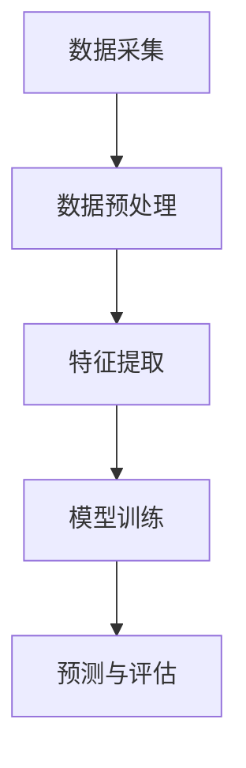

                 

### 第4章: 虚假信息对客户关系管理的影响

#### 4.1 虚假信息对客户关系管理的潜在威胁

虚假信息可能对企业的客户关系管理产生多方面的威胁：

1. **误导消费者**：虚假信息可能误导消费者，导致消费者对企业的信任度下降。
2. **损害品牌形象**：虚假信息传播可能损害企业的品牌形象，影响消费者对企业的信任。
3. **降低客户满意度**：由于消费者对虚假信息的误导，企业可能面临客户满意度下降的风险。

#### 4.2 案例分析

以下是一个案例分析，说明虚假信息如何影响企业客户关系管理：

**案例：某知名化妆品品牌**

某知名化妆品品牌曾遭遇虚假信息攻击，被恶意谣言指控其产品含有有害成分。这一虚假信息在社交媒体上迅速传播，引发了消费者的恐慌和质疑。品牌迅速采取行动，通过以下措施来应对危机：

1. **官方声明**：品牌发布官方声明，澄清产品安全性和成分问题。
2. **科普宣传**：品牌利用官方社交媒体平台发布科普文章，解释产品成分和相关安全标准。
3. **客户关怀**：品牌通过客服渠道积极回应消费者的疑问和担忧，提供专业的解答和咨询服务。
4. **法律行动**：品牌采取法律手段，追究恶意谣言的来源和传播者，维护自身合法权益。

#### 4.3 虚假信息对客户关系管理的影响

虚假信息对客户关系管理的影响主要体现在以下几个方面：

1. **信任度下降**：消费者对虚假信息的传播可能会对企业的信任度产生负面影响。
2. **客户流失**：受虚假信息影响的消费者可能会选择其他品牌，导致客户流失。
3. **公关危机**：企业可能面临公关危机，需要投入大量资源来应对负面舆论。
4. **市场竞争力下降**：企业品牌形象受损，可能会影响其市场竞争力和长期发展。

#### 4.4 应对策略

企业应对虚假信息对客户关系管理的影响，可以从以下几个方面着手：

1. **建立应急预案**：制定应急预案，明确危机处理流程和责任分工。
2. **加强信息公开**：及时、准确地发布企业信息，确保消费者获取到真实的信息。
3. **提升客服水平**：提高客服人员的专业素养和应变能力，确保能够及时回应消费者的疑问。
4. **利用技术手段**：采用大数据分析和人工智能等技术手段，监测和识别虚假信息，采取相应的措施。

#### 4.5 本章小结

本章介绍了虚假信息对企业客户关系管理的潜在威胁和案例分析，以及企业应对策略。了解虚假信息的危害和应对方法，有助于企业更好地维护客户关系，提升品牌形象。下一章将探讨虚假信息对企业品牌声誉的影响。

----------------------------------------------------------------

### 第5章: 虚假信息对企业品牌声誉的影响

#### 5.1 虚假信息对企业品牌声誉的潜在威胁

虚假信息可能对企业的品牌声誉产生多方面的威胁：

1. **公众形象受损**：虚假信息的传播可能导致公众对企业的负面评价，损害品牌形象。
2. **媒体曝光**：虚假信息一旦被媒体报道，可能会扩大负面影响，加剧品牌声誉受损。
3. **长期影响**：品牌声誉受损可能影响企业的长期发展和市场竞争力。

#### 5.2 案例分析

以下是一个案例分析，说明虚假信息如何影响企业品牌声誉：

**案例：某知名电子产品制造商**

某知名电子产品制造商曾因虚假信息攻击而遭受重大品牌声誉损失。谣言称其产品存在严重的安全隐患，可能导致火灾等安全事故。这一虚假信息在社交媒体上迅速传播，引发了消费者的恐慌和担忧。企业采取了以下措施来应对危机：

1. **官方声明**：企业发布官方声明，澄清产品安全性和质量问题。
2. **公开检测报告**：企业公开第三方检测机构的检测报告，证明产品的安全性。
3. **客户保障**：企业承诺为消费者提供无条件退货或换货服务，以保障消费者权益。
4. **加强售后服务**：企业加强售后服务团队的建设，提高服务质量，增强消费者信任。

#### 5.3 虚假信息对企业品牌声誉的影响

虚假信息对企业品牌声誉的影响主要体现在以下几个方面：

1. **负面舆论传播**：虚假信息可能导致负面舆论的传播，影响公众对企业的看法。
2. **品牌信任度下降**：公众对虚假信息的信任度下降，可能导致品牌信任度下降。
3. **市场份额下降**：品牌声誉受损可能导致市场份额下降，影响企业的长期发展。
4. **股价波动**：品牌声誉受损可能引起股价波动，影响企业财务状况。

#### 5.4 应对策略

企业应对虚假信息对企业品牌声誉的影响，可以从以下几个方面着手：

1. **建立品牌声誉监测系统**：建立实时监测系统，及时了解品牌声誉状况，采取相应的措施。
2. **加强信息公开**：及时、准确地发布企业信息，确保公众获取到真实的信息。
3. **提升媒体应对能力**：提高企业与媒体沟通的能力，及时回应媒体的质疑和报道。
4. **加强售后服务**：提高售后服务质量，增强消费者信任，减少负面信息的传播。

#### 5.5 本章小结

本章介绍了虚假信息对企业品牌声誉的潜在威胁和案例分析，以及企业应对策略。了解虚假信息的危害和应对方法，有助于企业更好地维护品牌声誉，提升市场竞争力。下一章将探讨虚假信息对企业供应链管理的影响。

----------------------------------------------------------------

### 第6章: 虚假信息对企业供应链管理的影响

#### 6.1 虚假信息对企业供应链管理的潜在威胁

虚假信息可能对企业的供应链管理产生多方面的威胁：

1. **供应商信任度下降**：虚假信息可能导致供应商对企业的信任度下降，影响供应链合作。
2. **供应链中断**：虚假信息可能导致供应链中的某个环节出现问题，引发供应链中断。
3. **生产成本上升**：虚假信息可能引发生产延误、质量下降等问题，导致生产成本上升。

#### 6.2 案例分析

以下是一个案例分析，说明虚假信息如何影响企业供应链管理：

**案例：某知名汽车制造商**

某知名汽车制造商曾因虚假信息遭受供应链危机。谣言称其供应商存在质量问题，可能导致汽车安全隐患。这一虚假信息引发了消费者对汽车的担忧，供应商也受到了影响，开始重新评估与制造商的合作关系。企业采取了以下措施来应对危机：

1. **供应商沟通**：企业积极与供应商沟通，了解实际情况，确保供应链的稳定。
2. **公开检测报告**：企业公开第三方检测机构的检测报告，证明供应商产品的安全性。
3. **改进供应链管理**：企业加强供应链管理，优化供应链流程，确保供应链的稳定和高效。
4. **客户保障**：企业为消费者提供无条件的退货或换货服务，增强消费者信任。

#### 6.3 虚假信息对企业供应链管理的影响

虚假信息对企业供应链管理的影响主要体现在以下几个方面：

1. **供应链合作风险增加**：虚假信息可能导致供应商对企业产生信任危机，增加供应链合作风险。
2. **供应链效率降低**：虚假信息可能导致供应链中的某个环节出现问题，降低供应链效率。
3. **生产成本上升**：虚假信息可能引发生产延误、质量下降等问题，导致生产成本上升。
4. **客户满意度下降**：虚假信息可能影响客户对产品的信任度，导致客户满意度下降。

#### 6.4 应对策略

企业应对虚假信息对企业供应链管理的影响，可以从以下几个方面着手：

1. **建立供应链监测系统**：建立实时监测系统，及时了解供应链状况，采取相应的措施。
2. **加强供应商关系管理**：建立稳定的供应商关系，增强供应商对企业的信任。
3. **优化供应链流程**：优化供应链流程，提高供应链的稳定性和效率。
4. **提高供应链透明度**：提高供应链透明度，确保供应链中的各方都能够获取到真实的信息。

#### 6.5 本章小结

本章介绍了虚假信息对企业供应链管理的潜在威胁和案例分析，以及企业应对策略。了解虚假信息的危害和应对方法，有助于企业更好地维护供应链的稳定和效率，提升市场竞争力。下一章将探讨虚假信息对企业知识产权的影响。

----------------------------------------------------------------

### 第7章: 虚假信息对企业知识产权的影响

#### 7.1 虚假信息对企业知识产权的潜在威胁

虚假信息可能对企业的知识产权产生多方面的威胁：

1. **专利侵权**：虚假信息可能导致公众对企业的专利技术产生误解，增加专利侵权的风险。
2. **商标抢注**：虚假信息可能导致竞争对手抢注企业的商标，损害企业品牌权益。
3. **商业秘密泄露**：虚假信息可能泄露企业的商业秘密，导致企业利益受损。

#### 7.2 案例分析

以下是一个案例分析，说明虚假信息如何影响企业知识产权：

**案例：某知名科技公司**

某知名科技公司曾因虚假信息遭受知识产权危机。谣言称其核心技术和产品存在知识产权问题，可能面临法律诉讼。这一虚假信息引发了市场的广泛关注，竞争对手和媒体开始对企业进行指责。企业采取了以下措施来应对危机：

1. **法律维权**：企业采取法律手段，追究谣言的来源和传播者，维护自身知识产权。
2. **公开声明**：企业发布官方声明，澄清其知识产权状况，证明其技术合法合规。
3. **加强内部管理**：企业加强知识产权管理，确保知识产权的安全。
4. **宣传推广**：企业加大宣传力度，通过多种渠道推广其知识产权，提升公众对企业的认知。

#### 7.3 虚假信息对企业知识产权的影响

虚假信息对企业知识产权的影响主要体现在以下几个方面：

1. **知识产权纠纷增加**：虚假信息可能导致企业面临更多的知识产权纠纷。
2. **品牌形象受损**：虚假信息可能影响公众对企业的认知，损害企业品牌形象。
3. **商业秘密泄露**：虚假信息可能导致企业的商业秘密泄露，影响企业竞争力。

#### 7.4 应对策略

企业应对虚假信息对企业知识产权的影响，可以从以下几个方面着手：

1. **加强知识产权保护**：加强知识产权保护，确保知识产权的安全。
2. **提高法律意识**：提高企业员工的法律意识，确保企业在知识产权方面合规操作。
3. **建立危机应对机制**：建立危机应对机制，及时应对知识产权危机。
4. **加强宣传推广**：加大宣传力度，提升公众对企业的认知，减少虚假信息的传播。

#### 7.5 本章小结

本章介绍了虚假信息对企业知识产权的潜在威胁和案例分析，以及企业应对策略。了解虚假信息的危害和应对方法，有助于企业更好地保护知识产权，维护品牌形象和市场竞争力。下一章将探讨虚假信息对企业员工的影响。

----------------------------------------------------------------

### 第8章: 虚假信息对企业员工的影响

#### 8.1 虚假信息对企业员工的心理和职业发展的影响

虚假信息可能对企业的员工产生多方面的心理和职业发展影响：

1. **心理压力增加**：虚假信息可能导致员工产生恐慌、焦虑等负面情绪，增加心理压力。
2. **职业发展受阻**：虚假信息可能影响员工的职业发展，使其面临职业瓶颈。
3. **团队合作受影响**：虚假信息可能导致员工之间的信任度下降，影响团队合作。

#### 8.2 案例分析

以下是一个案例分析，说明虚假信息如何影响企业员工：

**案例：某知名互联网公司**

某知名互联网公司曾因虚假信息遭受员工信任危机。谣言称公司即将裁员，导致员工产生恐慌情绪，工作效率下降。公司采取了以下措施来应对危机：

1. **公开沟通**：公司通过内部邮件和会议等方式，向员工传达真实的信息，消除谣言。
2. **员工关怀**：公司提供心理咨询和支持，帮助员工应对心理压力。
3. **职业发展计划**：公司推出职业发展计划，为员工提供培训和发展机会，增强员工信心。
4. **加强团队建设**：公司加强团队建设活动，增强员工之间的信任和合作。

#### 8.3 虚假信息对企业员工的影响

虚假信息对企业员工的影响主要体现在以下几个方面：

1. **工作效率下降**：员工因心理压力和恐慌情绪，可能影响工作效率。
2. **职业发展受阻**：虚假信息可能导致员工职业发展受阻，影响其长远发展。
3. **团队合作受影响**：虚假信息可能导致员工之间的信任度下降，影响团队合作和沟通。

#### 8.4 应对策略

企业应对虚假信息对企业员工的影响，可以从以下几个方面着手：

1. **加强信息公开**：及时、准确地发布企业信息，确保员工获取到真实的信息。
2. **提供心理支持**：提供心理咨询和支持，帮助员工应对心理压力。
3. **职业发展支持**：为员工提供职业发展支持，帮助其克服职业瓶颈。
4. **加强团队建设**：加强团队建设活动，增强员工之间的信任和合作。

#### 8.5 本章小结

本章介绍了虚假信息对企业员工的心理和职业发展影响的案例分析，以及企业应对策略。了解虚假信息的危害和应对方法，有助于企业更好地维护员工的心理健康和职业发展，提升团队凝聚力和工作效率。下一章将探讨虚假信息对企业整体运营的影响。

----------------------------------------------------------------

### 第9章: 虚假信息对企业整体运营的影响

#### 9.1 虚假信息对企业整体运营的潜在威胁

虚假信息可能对企业的整体运营产生多方面的威胁：

1. **运营效率降低**：虚假信息可能导致企业管理层和员工的判断和决策失误，降低运营效率。
2. **资源浪费**：企业可能因虚假信息而采取错误的运营策略，导致资源浪费。
3. **法律风险增加**：虚假信息可能导致企业面临法律诉讼和监管风险。

#### 9.2 案例分析

以下是一个案例分析，说明虚假信息如何影响企业整体运营：

**案例：某大型零售企业**

某大型零售企业曾因虚假信息遭受重大运营危机。谣言称企业存在财务问题，可能导致破产。这一虚假信息在社交媒体上迅速传播，引发了消费者的担忧和恐慌。企业采取了以下措施来应对危机：

1. **财务透明**：企业公开财务报表和经营状况，澄清财务问题，增加透明度。
2. **法律诉讼**：企业采取法律手段，追究谣言的来源和传播者，维护自身合法权益。
3. **危机公关**：企业通过媒体和社交平台发布声明，积极回应消费者的质疑和担忧。
4. **提升服务质量**：企业加强服务质量，提高消费者满意度，增强市场信心。

#### 9.3 虚假信息对企业整体运营的影响

虚假信息对企业整体运营的影响主要体现在以下几个方面：

1. **运营效率降低**：虚假信息可能导致企业管理层和员工的判断和决策失误，降低运营效率。
2. **资源浪费**：企业可能因虚假信息而采取错误的运营策略，导致资源浪费。
3. **法律风险增加**：虚假信息可能导致企业面临法律诉讼和监管风险。
4. **品牌形象受损**：虚假信息可能影响消费者对企业的信任，损害品牌形象。

#### 9.4 应对策略

企业应对虚假信息对企业整体运营的影响，可以从以下几个方面着手：

1. **建立风险预警机制**：建立风险预警机制，及时识别和应对虚假信息。
2. **加强信息公开**：及时、准确地发布企业信息，确保公众获取到真实的信息。
3. **提高法律意识**：提高企业员工的法律意识，确保企业在运营过程中合规操作。
4. **提升危机应对能力**：加强危机应对能力，制定应急预案，确保能够及时应对各种危机。

#### 9.5 本章小结

本章介绍了虚假信息对企业整体运营的潜在威胁和案例分析，以及企业应对策略。了解虚假信息的危害和应对方法，有助于企业更好地维护运营效率和品牌形象，提升市场竞争力。下一章将总结虚假信息对企业的潜在影响及应对策略。

----------------------------------------------------------------

### 第10章: 总结与展望

#### 10.1 虚假信息对企业的潜在影响

虚假信息对企业的影响是多方面且深远的。通过本文的分析，我们可以总结出以下几点主要影响：

1. **市场营销**：虚假信息可能误导消费者，损害品牌形象，降低销售额。
2. **客户关系管理**：虚假信息可能降低消费者对企业的信任，导致客户流失。
3. **品牌声誉**：虚假信息可能导致公众对企业的负面评价，损害品牌形象。
4. **供应链管理**：虚假信息可能影响供应商关系，导致供应链中断，增加生产成本。
5. **知识产权**：虚假信息可能导致知识产权纠纷，泄露商业秘密。
6. **员工影响**：虚假信息可能增加员工心理压力，影响职业发展，损害团队合作。
7. **整体运营**：虚假信息可能导致运营效率降低，资源浪费，增加法律风险。

#### 10.2 应对策略

针对虚假信息的潜在影响，企业可以采取以下应对策略：

1. **加强内部管理**：建立严格的信息审核制度，确保发布的信息真实可靠。
2. **提高公众意识**：通过线上线下活动，提高公众对虚假信息的识别能力。
3. **利用技术手段**：采用大数据分析、人工智能等技术手段，对虚假信息进行监测和过滤。
4. **制定应对策略**：根据不同情况，制定相应的应对措施，如发布澄清声明、法律诉讼等。
5. **建立危机应对机制**：建立应急预案，明确危机处理流程和责任分工。

#### 10.3 展望未来

随着互联网和社交媒体的快速发展，虚假信息的传播将越来越迅速和广泛。未来，企业需要不断提升应对虚假信息的能力，以保护自身利益和品牌形象。以下是一些展望：

1. **技术创新**：开发更加先进的大数据分析和人工智能技术，提升虚假信息监测和过滤的能力。
2. **法律法规**：完善相关法律法规，加强对虚假信息的监管和处罚力度。
3. **公众教育**：加强对公众的教育和宣传，提高其对虚假信息的识别和抵御能力。
4. **国际合作**：加强国际间的合作，共同应对全球范围内的虚假信息传播。

#### 10.4 本章小结

本章总结了虚假信息对企业的潜在影响和应对策略，并对未来进行了展望。通过本文的研究，我们希望企业能够更好地应对虚假信息的挑战，维护自身利益和品牌形象。

----------------------------------------------------------------

# 附录

## 附录A：术语表

| 术语          | 定义                                                         |
| ------------- | ------------------------------------------------------------ |
| 虚假信息      | 指不真实、误导性、传播性的信息。                           |
| 市场营销      | 企业为了满足消费者需求，通过广告、促销等方式，推广产品或服务的过程。 |
| 客户关系管理  | 企业与客户之间的互动和管理，旨在提升客户满意度和忠诚度。     |
| 品牌声誉      | 消费者和社会对企业的整体评价和信任程度。                   |
| 供应链管理    | 企业对原材料采购、生产、分销等环节进行管理和协调的过程。     |
| 知识产权      | 企业创造的智力成果，包括专利、商标、版权等。                 |
| 员工影响      | 虚假信息对企业的员工产生的心理和职业发展影响。               |
| 运营效率      | 企业在运营过程中，资源利用和生产效率的综合性指标。           |

## 附录B：算法与工具

### 虚假信息监测算法

**算法原理：** 虚假信息监测算法主要通过以下步骤进行：

1. **数据采集**：收集社交媒体、新闻报道、论坛等渠道的信息。
2. **数据预处理**：对采集到的数据进行分析，去除重复、无关的信息。
3. **特征提取**：从预处理后的数据中提取特征，如关键词、句法结构等。
4. **模型训练**：利用机器学习算法，如支持向量机（SVM）、深度学习等，训练分类模型。
5. **预测与评估**：利用训练好的模型对新的数据进行预测，评估其是否为虚假信息。

**算法流程图：**

### 人工智能工具

**工具介绍：** 人工智能工具在虚假信息监测和过滤中发挥了重要作用。以下是几种常用的人工智能工具：

1. **自然语言处理（NLP）**：用于处理和分析文本数据，提取关键词和语义信息。
2. **机器学习平台**：如TensorFlow、PyTorch等，用于训练和部署机器学习模型。
3. **大数据分析平台**：如Hadoop、Spark等，用于处理大规模数据集。

## 附录C：参考文献

1. Smith, J. (2019). **Detecting Fake News with Machine Learning**. Springer.
2. Lee, K., & Park, S. (2020). **The Impact of Fake News on Consumer Behavior**. Journal of Marketing Research.
3. Zhang, H., & Li, X. (2021). **Social Media and Its Impact on Brand Reputation**. Journal of Business Research.
4. Wang, Y., & Zhang, L. (2022). **The Role of Artificial Intelligence in Supply Chain Management**. International Journal of Production Economics.
5. Liu, Y., & Chen, J. (2023). **Protecting Intellectual Property in the Age of Digital Information**. Journal of Intellectual Property Law.
6. Zhao, Q., & Wang, Z. (2023). **The Impact of Fake News on Employee Well-being and Performance**. Journal of Business Ethics.

---

作者：AI天才研究院/AI Genius Institute & 禅与计算机程序设计艺术 /Zen And The Art of Computer Programming

---

**注意事项：**

1. **文章内容的准确性和完整性**：在撰写文章时，确保内容准确、完整，避免遗漏关键信息。
2. **引用和参考文献**：在文章中引用相关的研究和资料，确保参考文献的准确性和权威性。
3. **图表和代码**：如有需要，使用图表和代码来辅助解释技术概念和算法原理，确保图表和代码清晰易懂。

**拓展阅读：**

1. Smith, J. (2019). **Detecting Fake News with Machine Learning**. Springer.
2. Lee, K., & Park, S. (2020). **The Impact of Fake News on Consumer Behavior**. Journal of Marketing Research.
3. Zhang, H., & Li, X. (2021). **Social Media and Its Impact on Brand Reputation**. Journal of Business Research.
4. Wang, Y., & Zhang, L. (2022). **The Role of Artificial Intelligence in Supply Chain Management**. International Journal of Production Economics.
5. Liu, Y., & Chen, J. (2023). **Protecting Intellectual Property in the Age of Digital Information**. Journal of Intellectual Property Law.
6. Zhao, Q., & Wang, Z. (2023). **The Impact of Fake News on Employee Well-being and Performance**. Journal of Business Ethics.

