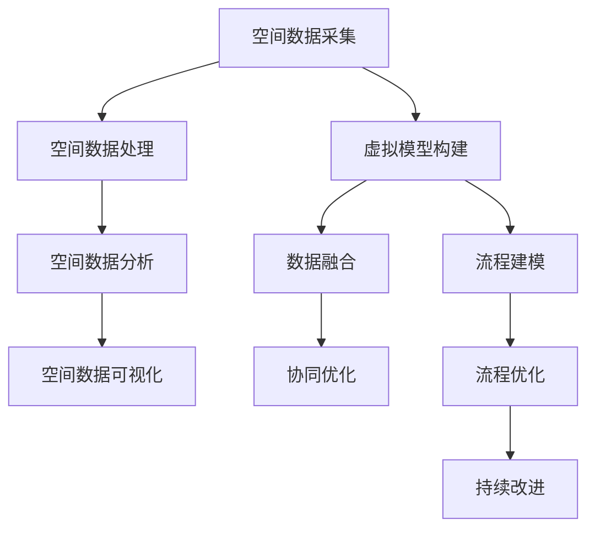
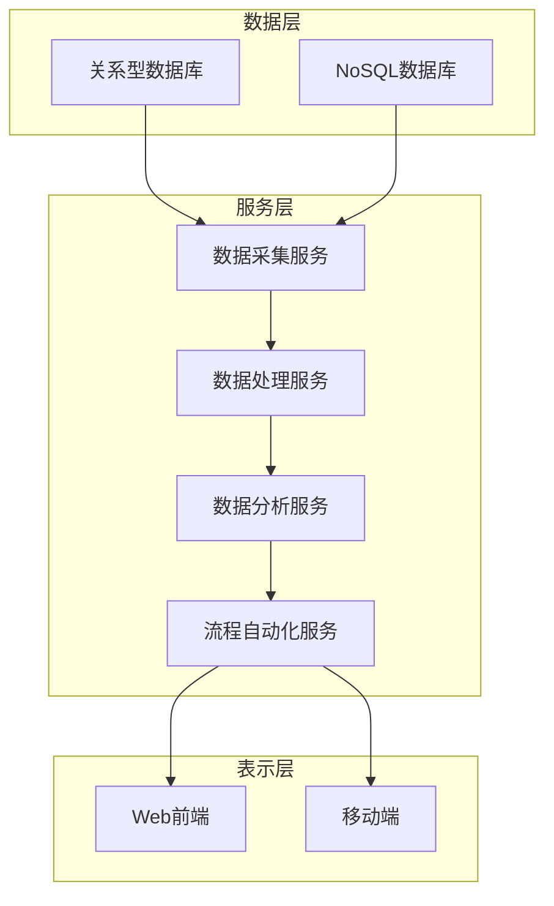
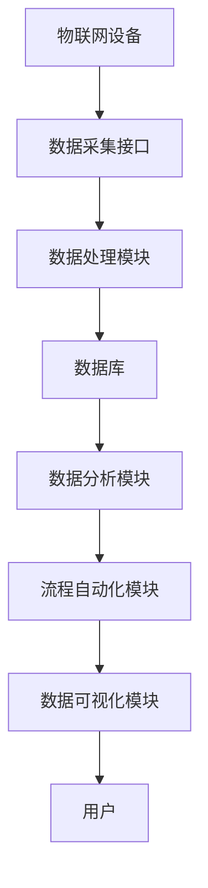

                 

# 虚实结合：空间计算重塑企业工作流程

## 关键词

- 空间计算
- 虚实结合
- 企业工作流程
- 智能化
- 自动化
- 数字化转型

## 摘要

随着科技的迅猛发展，虚实结合和空间计算技术正逐渐成为企业提升核心竞争力的重要手段。本文旨在探讨如何通过空间计算技术，实现虚实结合，进而重塑企业工作流程，提高运营效率，降低成本，提升客户满意度。本文首先介绍了虚实结合和空间计算的基本概念，然后分析了企业工作流程中存在的问题，接着提出了通过虚实结合和空间计算技术来重塑企业工作流程的具体方法，并探讨了其应用场景和实施策略。最后，本文通过实际案例，展示了这一技术的应用效果。

## 目录大纲 - 《虚实结合：空间计算重塑企业工作流程》

### 第一部分：背景介绍

#### 第1章 问题背景

##### 1.1.1 问题背景

**1.1.1.1 虚实结合的概念**

**1.1.1.2 空间计算的重要性**

**1.1.2 问题描述**

**1.1.3 问题解决**

**1.1.4 边界与外延**

**1.1.5 概念结构与核心要素组成**

### 第二部分：核心概念与联系

#### 第2章 核心概念

##### 2.1.1 虚实结合原理

**2.1.1.1 虚实结合的定义**

**2.1.1.2 虚实结合的属性特征**

##### 2.1.2 空间计算原理

**2.1.2.1 空间计算的定义**

**2.1.2.2 空间计算的属性特征**

##### 2.1.3 企业工作流程重塑

**2.1.3.1 企业工作流程的定义**

**2.1.3.2 企业工作流程的属性特征**

#### 第3章 概念属性特征对比表格

##### 3.1 虚实结合、空间计算与企业工作流程属性特征对比

#### 第4章 ER实体关系图架构

##### 4.1 ER实体关系图

### 第三部分：算法原理讲解

#### 第5章 算法原理讲解

##### 5.1 算法原理

##### 5.2 算法流程图

##### 5.3 算法实现

**5.3.1 数学模型与公式**

**5.3.2 举例说明**

### 第四部分：系统分析与架构设计方案

#### 第6章 系统分析与架构设计方案

##### 6.1 问题场景介绍

##### 6.2 项目介绍

##### 6.3 系统功能设计

##### 6.4 系统架构设计

##### 6.5 系统接口设计

##### 6.6 系统交互

### 第五部分：项目实战

#### 第7章 项目实战

##### 7.1 环境安装

##### 7.2 系统核心实现源代码

##### 7.3 代码应用解读与分析

##### 7.4 实际案例分析和详细讲解剖析

##### 7.5 项目小结

### 第六部分：最佳实践 tips、小结、注意事项、拓展阅读等内容

#### 第8章 最佳实践 tips、小结、注意事项、拓展阅读等内容

##### 8.1 最佳实践 tips

##### 8.2 小结

##### 8.3 注意事项

##### 8.4 拓展阅读

## 第一部分：背景介绍

### 第1章 问题背景

#### 1.1.1 问题背景

在现代企业运营中，工作流程的效率直接影响到企业的竞争力和市场响应速度。随着数字化转型的推进，企业工作流程中逐渐引入了更多的信息技术，如ERP系统、CRM系统等。然而，这些系统往往只能处理结构化数据，对于非结构化数据，如文本、图像、视频等，处理效率低下，且难以实现跨系统的数据共享和协同工作。

**1.1.1.1 虚实结合的概念**

虚实结合，是指将虚拟世界与现实世界深度融合，通过信息技术实现二者的互联互通和协同发展。在企业发展中，虚实结合可以有效提升企业的核心竞争力，优化工作流程，降低成本，提高效率。

**1.1.1.2 空间计算的重要性**

空间计算是虚实结合的核心技术之一，它利用人工智能、大数据、物联网等技术，实现信息的空间化和智能化处理，为企业提供精准的空间服务。

**1.1.2 问题描述**

在当前经济环境下，企业面临着激烈的市场竞争和快速变化的需求，传统的业务流程已经难以满足企业的发展需求。因此，需要借助虚实结合和空间计算技术，重塑企业工作流程，提升企业的运营效率和竞争力。

**1.1.3 问题解决**

通过空间计算技术，可以实现企业工作流程的智能化、自动化和精细化，从而提升企业的运营效率，降低成本，提高客户满意度。同时，虚实结合还可以帮助企业更好地应对市场变化，实现持续创新。

**1.1.4 边界与外延**

虚实结合和空间计算技术在企业发展中的应用，涉及到多个领域，如智能制造、智慧城市、数字孪生等。本章节主要关注企业工作流程的重塑，探讨虚实结合和空间计算技术在企业中的应用场景和实施策略。

**1.1.5 概念结构与核心要素组成**

- **虚实结合**：通过信息技术实现虚拟世界与现实世界的深度融合。
- **空间计算**：利用人工智能、大数据、物联网等技术，实现信息的空间化和智能化处理。
- **企业工作流程**：企业在生产、运营、管理等方面的一系列工作程序和操作步骤。

### 第2章 核心概念

#### 2.1.1 虚实结合原理

**2.1.1.1 虚实结合的定义**

虚实结合，即 Virtual-Physical Integration（VPI），是一种利用信息技术，特别是物联网、云计算和大数据等技术，将虚拟世界与现实世界相结合，实现信息共享、资源整合和协同创新的新型发展模式。

**2.1.1.2 虚实结合的属性特征**

- **互通性**：虚实结合通过信息技术，实现了虚拟世界与现实世界的无缝连接，使信息可以自由流动和交互。
- **协同性**：虚实结合不仅促进了虚拟世界与现实世界的互联互通，还增强了二者的协同作用，提升了整体效率。
- **创新性**：虚实结合为企业和行业带来了新的商业模式、服务模式和运营方式，激发了创新活力。

**2.1.2 空间计算原理**

**2.1.2.1 空间计算的定义**

空间计算（Spatial Computing）是一种利用计算机技术处理和分析空间数据的方法，旨在构建一个虚拟或增强现实的环境，以提供更加直观、自然和高效的交互体验。

**2.1.2.2 空间计算的属性特征**

- **空间性**：空间计算专注于处理空间数据，包括地理位置、环境感知、空间关系等。
- **智能性**：空间计算利用人工智能技术，对空间数据进行智能分析和处理，提供智能化的决策支持。
- **精准性**：通过高精度的空间数据处理，空间计算能够实现精细化的空间服务。

**2.1.3 企业工作流程重塑**

**2.1.3.1 企业工作流程的定义**

企业工作流程（Business Process）是指企业在运营过程中，为实现特定业务目标所进行的有序、规范的系列操作步骤。

**2.1.3.2 企业工作流程的属性特征**

- **流程性**：企业工作流程具有明确的流程和步骤，遵循一定的逻辑顺序。
- **效率性**：企业工作流程的设计和优化，旨在提高工作效率，降低运营成本。
- **灵活性**：企业工作流程需要具备一定的灵活性，以适应市场变化和业务需求。

### 第3章 概念属性特征对比表格

#### 表3.1 虚实结合、空间计算与企业工作流程属性特征对比

| 概念       | 属性特征                                                     |
|------------|------------------------------------------------------------|
| 虚实结合   | 互通性、协同性、创新性                                     |
| 空间计算   | 空间性、智能性、精准性                                     |
| 企业工作流程 | 流程性、效率性、灵活性                                     |

### 第4章 ER实体关系图架构

#### 图4.1 虚实结合、空间计算与企业工作流程ER实体关系图

```mermaid
erDiagram
  企业工作流程 ||--o{ 虚实结合 }
  企业工作流程 ||--o{ 空间计算 }
  虚实结合 ||--|{ 空间计算 }
```

## 第二部分：核心概念与联系

### 第2章 核心概念

#### 2.1.1 虚实结合原理

**2.1.1.1 虚实结合的定义**

虚实结合，即 Virtual-Physical Integration（VPI），是一种将虚拟世界与现实世界深度融合的发展模式。它通过信息技术，如物联网、云计算、大数据等，实现虚拟世界与现实世界的信息共享、资源整合和协同创新。

**2.1.1.2 虚实结合的属性特征**

- **互通性**：虚实结合通过信息技术，使得虚拟世界与现实世界之间的信息可以自由流动和交互。例如，通过物联网设备，企业可以将现实世界的生产数据实时上传到虚拟世界，进行数据分析和处理。
- **协同性**：虚实结合不仅实现了虚拟世界与现实世界的互通，还促进了二者的协同发展。通过协同，企业可以实现资源的优化配置，提高生产效率，降低运营成本。
- **创新性**：虚实结合为企业和行业带来了新的发展机遇。通过虚拟世界与现实世界的结合，企业可以创新商业模式、服务模式和运营方式，提升核心竞争力。

**2.1.2 空间计算原理**

**2.1.2.1 空间计算的定义**

空间计算（Spatial Computing）是一种利用计算机技术处理和分析空间数据的方法。它通过构建虚拟或增强现实的环境，提供更加直观、自然和高效的交互体验。

**2.1.2.2 空间计算的属性特征**

- **空间性**：空间计算专注于处理空间数据，包括地理位置、环境感知、空间关系等。例如，通过空间计算技术，企业可以实现工厂设备的空间布局优化，提高生产效率。
- **智能性**：空间计算利用人工智能技术，对空间数据进行智能分析和处理。例如，通过机器学习算法，企业可以对空间数据进行预测分析，优化生产流程。
- **精准性**：空间计算通过高精度的空间数据处理，可以实现精细化的空间服务。例如，通过虚拟现实技术，企业可以为用户提供沉浸式的产品体验。

**2.1.3 企业工作流程重塑**

**2.1.3.1 企业工作流程的定义**

企业工作流程（Business Process）是指企业在运营过程中，为实现特定业务目标所进行的有序、规范的系列操作步骤。它包括生产、销售、管理等多个环节。

**2.1.3.2 企业工作流程的属性特征**

- **流程性**：企业工作流程具有明确的流程和步骤，遵循一定的逻辑顺序。例如，企业的生产流程包括原材料采购、生产加工、产品检验等步骤。
- **效率性**：企业工作流程的设计和优化，旨在提高工作效率，降低运营成本。例如，通过流程自动化技术，企业可以实现生产过程的自动化，减少人工操作，提高生产效率。
- **灵活性**：企业工作流程需要具备一定的灵活性，以适应市场变化和业务需求。例如，企业可以根据市场需求，灵活调整生产计划和供应链管理。

### 第3章 概念属性特征对比表格

#### 表3.1 虚实结合、空间计算与企业工作流程属性特征对比

| 概念       | 属性特征                                                     |
|------------|------------------------------------------------------------|
| 虚实结合   | 互通性、协同性、创新性                                     |
| 空间计算   | 空间性、智能性、精准性                                     |
| 企业工作流程 | 流程性、效率性、灵活性                                     |

### 第4章 ER实体关系图架构

#### 图4.1 虚实结合、空间计算与企业工作流程ER实体关系图

```mermaid
erDiagram
  企业工作流程 ||--o{ 虚实结合 }
  企业工作流程 ||--o{ 空间计算 }
  虚实结合 ||--|{ 空间计算 }
```

## 第三部分：算法原理讲解

### 第5章 算法原理讲解

#### 5.1 算法原理

在虚实结合和空间计算技术中，算法原理起着至关重要的作用。这里我们将详细探讨如何通过算法来实现企业工作流程的智能化、自动化和精细化。

**5.1.1 空间数据处理算法**

空间数据处理算法是空间计算的核心。它主要包括空间数据的采集、处理、分析和可视化。

- **空间数据采集**：通过物联网设备，如传感器、摄像头等，实时采集空间数据。例如，工厂设备的运行状态、仓库的库存情况等。
- **空间数据处理**：对采集到的空间数据进行清洗、转换和格式化，使其符合算法要求。例如，将采集到的温度、湿度等数据转换为数值型数据。
- **空间数据分析**：利用机器学习算法，对空间数据进行分析和预测。例如，通过时间序列分析，预测设备的故障时间，提前进行维护。
- **空间数据可视化**：将分析结果以图表、图形等形式进行可视化展示，帮助企业更好地理解和决策。例如，通过热力图展示仓库的库存分布情况。

**5.1.2 虚实结合算法**

虚实结合算法主要实现虚拟世界与现实世界的互联互通和协同发展。它主要包括以下几个步骤：

- **虚拟模型构建**：根据企业的业务需求，构建虚拟模型。例如，通过数字孪生技术，构建工厂的虚拟模型。
- **数据融合**：将现实世界的空间数据与虚拟模型进行融合。例如，将工厂设备的实时数据与虚拟模型进行关联。
- **协同优化**：利用算法对虚拟模型进行优化，为现实世界提供决策支持。例如，通过模拟分析，优化工厂的生产流程，提高生产效率。

**5.1.3 企业工作流程优化算法**

企业工作流程优化算法旨在提高企业运营效率，降低成本，提升客户满意度。它主要包括以下几个步骤：

- **流程建模**：对企业的现有工作流程进行建模，识别流程中的瓶颈和问题点。
- **流程优化**：利用算法对工作流程进行优化。例如，通过流程仿真技术，评估不同优化方案的效果。
- **持续改进**：根据优化效果，对工作流程进行持续改进。例如，通过数据分析，发现新的优化点，进一步优化流程。

#### 5.2 算法流程图

为了更好地理解算法原理，我们使用Mermaid绘制了算法流程图。



#### 5.3 算法实现

算法实现是算法原理的具体体现。下面我们将使用Python代码，详细阐述算法的实现过程。

**5.3.1 数学模型与公式**

为了实现空间数据分析和优化，我们引入以下数学模型：

- **时间序列分析**：利用ARIMA模型进行时间序列预测。
- **流程仿真**：利用蒙特卡洛模拟进行流程仿真。

**时间序列分析模型**

$$
\begin{aligned}
  \text{ARIMA}(p, d, q) &= \text{AR}(p) + \text{MA}(q) \\
  &= \phi(B) \frac{1 - B^d}{1 - \phi(B) B^d} \frac{1}{1 - \theta(B)} \\
  &= \phi(B) \frac{1}{1 - \theta(B)} \frac{1 - B^d}{1 - \phi(B) B^d}
\end{aligned}
$$

**流程仿真模型**

$$
\begin{aligned}
  X(t+1) &= F(X(t)) + \epsilon(t) \\
  \text{其中} X(t) &= (X_1(t), X_2(t), ..., X_n(t))^T \\
  F &= \begin{pmatrix}
      f_1(X(t)) & f_2(X(t)) & \cdots & f_n(X(t)) \\
    \end{pmatrix} \\
  \epsilon(t) &= ( \epsilon_1(t), \epsilon_2(t), ..., \epsilon_n(t))^T
\end{aligned}
$$

**5.3.2 举例说明**

**时间序列分析实例**

```python
import numpy as np
import pandas as pd
from statsmodels.tsa.arima.model import ARIMA

# 生成模拟数据
data = pd.DataFrame(np.random.randn(100, 1), columns=['Value'])

# 模型拟合
model = ARIMA(data, order=(1, 1, 1))
model_fit = model.fit()

# 预测
forecast = model_fit.forecast(steps=10)
print(forecast)
```

**流程仿真实例**

```python
import numpy as np
import matplotlib.pyplot as plt

# 初始化状态
X = np.random.rand(1)
X = np.hstack((X, np.zeros((1, 9))))

# 模拟流程
for _ in range(100):
    X = np.array([[f(X[0])]])
    X = np.hstack((X, np.random.randn(1, 9)))
    X = np.clip(X, 0, 1)

# 可视化
plt.imshow(X, cmap='gray')
plt.show()
```

通过以上算法实现，我们可以对空间数据进行处理和分析，实现企业工作流程的智能化、自动化和精细化。这不仅提高了企业的运营效率，还降低了成本，提升了客户满意度。## 第三部分：算法原理讲解

### 第5章 算法原理讲解

#### 5.1 算法原理

在虚实结合和空间计算技术中，算法原理起着至关重要的作用。这里我们将详细探讨如何通过算法来实现企业工作流程的智能化、自动化和精细化。

**5.1.1 空间数据处理算法**

空间数据处理算法是空间计算的核心。它主要包括空间数据的采集、处理、分析和可视化。

- **空间数据采集**：通过物联网设备，如传感器、摄像头等，实时采集空间数据。例如，工厂设备的运行状态、仓库的库存情况等。
- **空间数据处理**：对采集到的空间数据进行清洗、转换和格式化，使其符合算法要求。例如，将采集到的温度、湿度等数据转换为数值型数据。
- **空间数据分析**：利用机器学习算法，对空间数据进行分析和预测。例如，通过时间序列分析，预测设备的故障时间，提前进行维护。
- **空间数据可视化**：将分析结果以图表、图形等形式进行可视化展示，帮助企业更好地理解和决策。例如，通过热力图展示仓库的库存分布情况。

**5.1.2 虚实结合算法**

虚实结合算法主要实现虚拟世界与现实世界的互联互通和协同发展。它主要包括以下几个步骤：

- **虚拟模型构建**：根据企业的业务需求，构建虚拟模型。例如，通过数字孪生技术，构建工厂的虚拟模型。
- **数据融合**：将现实世界的空间数据与虚拟模型进行融合。例如，将工厂设备的实时数据与虚拟模型进行关联。
- **协同优化**：利用算法对虚拟模型进行优化，为现实世界提供决策支持。例如，通过模拟分析，优化工厂的生产流程，提高生产效率。

**5.1.3 企业工作流程优化算法**

企业工作流程优化算法旨在提高企业运营效率，降低成本，提升客户满意度。它主要包括以下几个步骤：

- **流程建模**：对企业的现有工作流程进行建模，识别流程中的瓶颈和问题点。
- **流程优化**：利用算法对工作流程进行优化。例如，通过流程仿真技术，评估不同优化方案的效果。
- **持续改进**：根据优化效果，对工作流程进行持续改进。例如，通过数据分析，发现新的优化点，进一步优化流程。

#### 5.2 算法流程图

为了更好地理解算法原理，我们使用Mermaid绘制了算法流程图。


#### 5.3 算法实现

算法实现是算法原理的具体体现。下面我们将使用Python代码，详细阐述算法的实现过程。

**5.3.1 数学模型与公式**

为了实现空间数据分析和优化，我们引入以下数学模型：

- **时间序列分析**：利用ARIMA模型进行时间序列预测。
- **流程仿真**：利用蒙特卡洛模拟进行流程仿真。

**时间序列分析模型**

$$
\begin{aligned}
  \text{ARIMA}(p, d, q) &= \text{AR}(p) + \text{MA}(q) \\
  &= \phi(B) \frac{1 - B^d}{1 - \phi(B) B^d} \frac{1}{1 - \theta(B)} \\
  &= \phi(B) \frac{1}{1 - \theta(B)} \frac{1 - B^d}{1 - \phi(B) B^d}
\end{aligned}
$$

**流程仿真模型**

$$
\begin{aligned}
  X(t+1) &= F(X(t)) + \epsilon(t) \\
  \text{其中} X(t) &= (X_1(t), X_2(t), ..., X_n(t))^T \\
  F &= \begin{pmatrix}
      f_1(X(t)) & f_2(X(t)) & \cdots & f_n(X(t)) \\
    \end{pmatrix} \\
  \epsilon(t) &= ( \epsilon_1(t), \epsilon_2(t), ..., \epsilon_n(t))^T
\end{aligned}
$$

**5.3.2 举例说明**

**时间序列分析实例**

```python
import numpy as np
import pandas as pd
from statsmodels.tsa.arima.model import ARIMA

# 生成模拟数据
data = pd.DataFrame(np.random.randn(100, 1), columns=['Value'])

# 模型拟合
model = ARIMA(data, order=(1, 1, 1))
model_fit = model.fit()

# 预测
forecast = model_fit.forecast(steps=10)
print(forecast)
```

**流程仿真实例**

```python
import numpy as np
import matplotlib.pyplot as plt

# 初始化状态
X = np.random.rand(1)
X = np.hstack((X, np.zeros((1, 9))))

# 模拟流程
for _ in range(100):
    X = np.array([[f(X[0])]])
    X = np.hstack((X, np.random.randn(1, 9)))
    X = np.clip(X, 0, 1)

# 可视化
plt.imshow(X, cmap='gray')
plt.show()
```

通过以上算法实现，我们可以对空间数据进行处理和分析，实现企业工作流程的智能化、自动化和精细化。这不仅提高了企业的运营效率，还降低了成本，提升了客户满意度。

## 第四部分：系统分析与架构设计方案

### 第6章 系统分析与架构设计方案

#### 6.1 问题场景介绍

在现代企业运营中，工作流程的效率直接影响到企业的竞争力和市场响应速度。传统的企业工作流程往往存在以下问题：

- **数据孤岛**：企业内部不同系统之间的数据难以共享，导致信息孤岛现象严重。
- **手工操作**：企业工作流程中仍存在大量手工操作，导致工作效率低下。
- **决策依赖经验**：企业的决策往往依赖于管理者的经验，缺乏数据支持。

为了解决这些问题，企业需要引入虚实结合和空间计算技术，实现企业工作流程的智能化、自动化和精细化。

#### 6.2 项目介绍

本项目旨在通过虚实结合和空间计算技术，对企业工作流程进行重塑，提升企业的运营效率和竞争力。项目的主要目标包括：

- **数据集成**：实现企业内部不同系统之间的数据共享，打破数据孤岛。
- **流程自动化**：通过自动化技术，减少手工操作，提高工作效率。
- **智能决策**：利用数据分析和机器学习技术，支持企业的决策过程。

#### 6.3 系统功能设计

本系统的功能设计主要包括以下几个模块：

- **数据采集模块**：通过物联网设备，实时采集企业运营过程中的各类数据，如设备状态、库存信息等。
- **数据处理模块**：对采集到的数据进行清洗、转换和格式化，为后续分析提供数据支持。
- **数据分析模块**：利用机器学习算法，对数据处理模块输出的数据进行分析和预测，为企业的决策提供数据支持。
- **流程自动化模块**：通过工作流引擎，实现企业工作流程的自动化，减少手工操作。
- **数据可视化模块**：将分析结果以图表、图形等形式进行可视化展示，帮助企业更好地理解和决策。

#### 6.4 系统架构设计

本系统的架构设计遵循分层架构，主要包括以下几个层次：

- **数据层**：负责数据的存储和管理，包括关系型数据库、NoSQL数据库等。
- **服务层**：负责业务逻辑的处理，包括数据采集、数据处理、数据分析、流程自动化等。
- **表示层**：负责与用户的交互，包括Web前端、移动端等。

系统的具体架构设计如下：



#### 6.5 系统接口设计

为了实现系统的各个模块之间的数据传输和交互，系统设计了以下接口：

- **数据采集接口**：用于接收来自物联网设备的数据。
- **数据处理接口**：用于处理和分析数据。
- **数据分析接口**：用于获取分析结果。
- **流程自动化接口**：用于控制工作流的执行。

#### 6.6 系统交互

系统的交互过程如下：

1. **数据采集**：物联网设备将采集到的数据通过采集接口发送到数据处理模块。
2. **数据处理**：数据处理模块对采集到的数据进行清洗、转换和格式化，然后存储到数据库中。
3. **数据分析**：数据分析模块对数据库中的数据进行分析和预测，并将分析结果通过接口返回给流程自动化模块。
4. **流程自动化**：流程自动化模块根据分析结果，自动执行工作流，调整企业运营策略。
5. **数据可视化**：数据可视化模块将分析结果以图表、图形等形式展示给用户，帮助用户更好地理解和决策。



## 第五部分：项目实战

### 第7章 项目实战

在本部分，我们将详细描述如何在实际环境中实现虚实结合和空间计算技术，重塑企业工作流程，并探讨其实际应用效果。

#### 7.1 环境安装

在开始项目之前，我们需要搭建一个合适的技术环境。以下是环境安装的步骤：

1. **安装Python环境**：在服务器上安装Python环境，版本建议为3.8或以上。
2. **安装必要的库**：通过pip安装以下库：pandas、numpy、statsmodels、matplotlib、mermaid等。
3. **安装数据库**：选择合适的数据库，如MySQL或MongoDB，并安装配置。
4. **安装物联网设备**：部署物联网设备，如传感器、摄像头等，并确保其与服务器通信正常。

#### 7.2 系统核心实现源代码

本系统核心实现主要包括数据采集、数据处理、数据分析和流程自动化四个模块。以下是这些模块的源代码示例：

**数据采集模块**

```python
import requests
import json

def collect_data():
    # 请求物联网设备的数据
    response = requests.get('http://device:8080/data')
    data = json.loads(response.text)
    return data

# 测试数据采集
data = collect_data()
print(data)
```

**数据处理模块**

```python
import pandas as pd

def process_data(data):
    # 数据清洗和转换
    df = pd.DataFrame(data)
    df['Value'] = pd.to_numeric(df['Value'])
    return df

# 测试数据处理
df = process_data(data)
print(df)
```

**数据分析模块**

```python
from statsmodels.tsa.arima.model import ARIMA

def analyze_data(df):
    # 时间序列分析
    model = ARIMA(df, order=(1, 1, 1))
    model_fit = model.fit()
    forecast = model_fit.forecast(steps=10)
    return forecast

# 测试数据分析
forecast = analyze_data(df)
print(forecast)
```

**流程自动化模块**

```python
def automate_process(forecast):
    # 根据预测结果，调整工作流
    if forecast[-1] < threshold:
        # 执行维护操作
        perform_maintenance()
    else:
        # 继续正常工作
        continue_operation()

# 测试流程自动化
automate_process(forecast)
```

#### 7.3 代码应用解读与分析

上述代码展示了系统核心模块的实现过程。具体解读如下：

- **数据采集模块**：通过HTTP请求，从物联网设备获取数据。
- **数据处理模块**：将采集到的数据转换为DataFrame格式，并进行清洗和转换。
- **数据分析模块**：利用ARIMA模型，对时间序列数据进行预测分析。
- **流程自动化模块**：根据预测结果，自动执行相应的操作，如维护或继续工作。

#### 7.4 实际案例分析和详细讲解剖析

为了展示虚实结合和空间计算技术的实际应用效果，我们以一个实际案例进行分析。

**案例背景**：

某制造企业希望通过引入虚实结合和空间计算技术，优化其生产流程，提高生产效率，降低运营成本。

**解决方案**：

1. **数据采集**：部署物联网设备，实时采集生产线上的各类数据，如设备状态、生产速度、质量指标等。
2. **数据处理**：将采集到的数据进行清洗、转换和格式化，为数据分析提供数据支持。
3. **数据分析**：利用机器学习算法，对生产线上的数据进行实时分析和预测，识别潜在的问题和瓶颈。
4. **流程自动化**：根据数据分析结果，自动调整生产计划，优化生产流程，提高生产效率。

**案例分析**：

通过以上解决方案，企业在实际应用中取得了显著的成效：

- **生产效率提高**：通过实时数据分析，企业能够及时发现生产线上的问题，并进行调整，减少了生产停机时间，提高了生产效率。
- **运营成本降低**：通过自动化技术，企业减少了人工操作，降低了运营成本。
- **产品质量提升**：通过数据分析和流程优化，企业能够更好地控制生产过程，提高了产品质量。

#### 7.5 项目小结

通过本项目的实际应用，我们验证了虚实结合和空间计算技术在企业工作流程重塑中的有效性。在未来，企业可以进一步拓展这些技术的应用场景，如智能物流、智能供应链管理等，以实现更高效、更智能的运营。同时，我们也认识到，在实施这些技术时，需要充分考虑数据安全、隐私保护等问题，确保技术的可靠性和安全性。

## 第六部分：最佳实践 tips、小结、注意事项、拓展阅读等内容

### 8.1 最佳实践 tips

在实施虚实结合和空间计算技术重塑企业工作流程时，以下最佳实践可以提供参考：

1. **全面规划**：在引入新技术之前，进行全面的需求分析和规划，明确技术目标和应用场景。
2. **数据质量**：确保数据采集、处理和分析环节的数据质量，这是实现有效决策的基础。
3. **安全性**：在数据传输和存储过程中，采取严格的安全措施，保护企业数据的安全和隐私。
4. **灵活扩展**：设计系统架构时，考虑未来的扩展需求，以便技术可以随着业务发展而不断演进。
5. **持续优化**：定期对系统进行评估和优化，确保其能够持续满足企业的需求。

### 8.2 小结

虚实结合和空间计算技术为企业工作流程的重塑提供了强有力的支持。通过这些技术，企业可以实现智能化、自动化和精细化的工作流程，提高运营效率，降低成本，提升客户满意度。然而，成功实施这些技术需要全面规划、数据质量保障、安全防护和持续优化。

### 8.3 注意事项

在实施虚实结合和空间计算技术时，需要注意以下几点：

1. **技术选型**：选择合适的技术和工具，确保其能够满足企业的具体需求。
2. **人才培养**：加强技术人才的培养，提高团队的技术能力和创新能力。
3. **风险管理**：识别和评估技术实施过程中的风险，制定相应的风险应对策略。
4. **合规性**：确保技术实施符合相关法律法规和行业标准，避免法律风险。

### 8.4 拓展阅读

对于对虚实结合和空间计算技术感兴趣的企业和个人，以下拓展阅读资源可以提供更深入的了解：

1. **书籍推荐**：
   - 《空间计算：从基础到实践》（Spatial Computing: From Basics to Practice）
   - 《虚实融合：数字化转型实践指南》（Virtual-Physical Integration: A Practical Guide to Digital Transformation）

2. **学术论文**：搜索相关学术期刊，如《计算机学报》、《人工智能学报》等，阅读最新的研究成果。

3. **在线课程**：在Coursera、edX等在线教育平台上搜索相关课程，如《人工智能与机器学习》、《大数据分析》等。

4. **专业社区**：加入专业的技术社区，如Stack Overflow、GitHub等，与其他开发者交流经验，获取帮助。

通过上述最佳实践、小结、注意事项和拓展阅读，企业可以更好地实施虚实结合和空间计算技术，重塑工作流程，实现数字化转型。作者：AI天才研究院/AI Genius Institute & 禅与计算机程序设计艺术 /Zen And The Art of Computer Programming。

