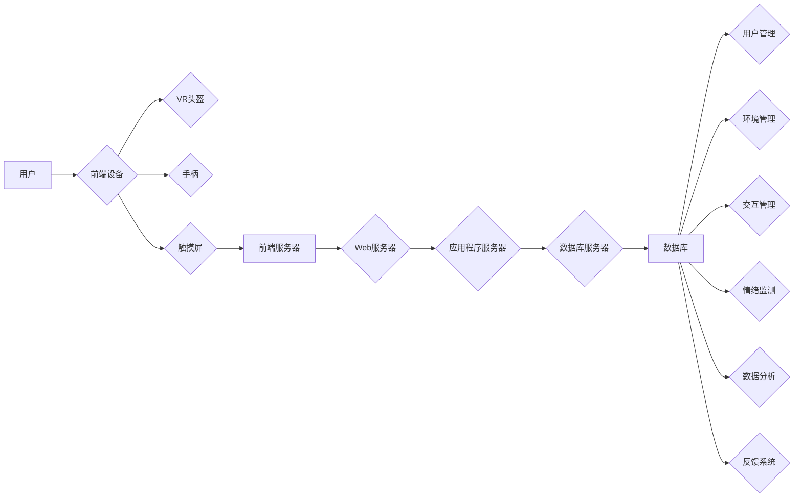
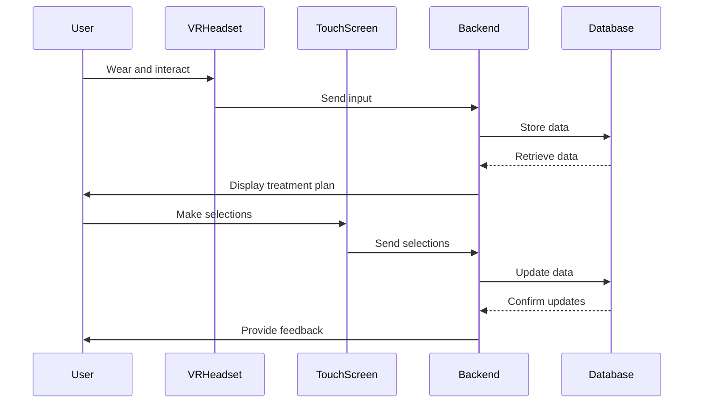

                 


### 虚拟现实在phobia治疗中的应用

#### 关键词
- 虚拟现实
- 恐惧症治疗
- 认知行为疗法
- 算法原理
- 系统设计
- 项目实战

#### 摘要
本文将探讨虚拟现实（VR）在恐惧症治疗中的应用。首先，我们将介绍虚拟现实技术和恐惧症治疗的背景，阐述VR技术在恐惧症治疗中的潜力和挑战。接着，我们将深入分析VR技术中的核心概念和算法原理，包括VR环境模拟、用户交互和情感识别等方面。在此基础上，我们将详细描述一个VR恐惧症治疗系统的设计和实现，包括问题场景、系统功能设计、系统架构设计、系统接口设计以及系统交互。最后，我们将通过一个实战项目展示VR恐惧症治疗系统的实际应用，并总结最佳实践、注意事项，提供拓展阅读资源。

## 第一部分：虚拟现实与phobia治疗的概述

### 第1章：虚拟现实与phobia治疗的概述

虚拟现实（VR）和恐惧症治疗都是现代科技和医疗领域的热门话题。虚拟现实技术通过创建模拟的、交互式的三维环境，使得用户可以在虚拟世界中体验真实世界的感受。恐惧症是一种常见的心理障碍，表现为对特定对象或情境的极端和不合理的恐惧，严重影响患者的生活质量。将虚拟现实技术应用于恐惧症治疗，近年来成为了研究的热点。

#### 1.1 虚拟现实技术的基本原理

虚拟现实技术的基本原理是通过计算机生成的三维图像，结合头戴式显示器（HMD）或其他显示设备，使用户沉浸在一个虚拟环境中。用户可以通过手持控制器或其他交互设备与虚拟环境进行交互，从而获得身临其境的体验。虚拟现实技术主要包括以下几个方面：

1. **感知仿真**：通过高清晰度图像和音频设备，模拟真实世界的视觉和听觉感受。
2. **交互性**：用户可以通过控制器、手势识别或其他设备与虚拟环境进行交互，实现沉浸式体验。
3. **反馈机制**：通过反馈设备（如震动手套、反馈座椅等），增强用户的沉浸感和体验。

#### 1.1.1 虚拟现实技术的应用场景

虚拟现实技术的应用场景非常广泛，包括但不限于以下几个方面：

1. **游戏娱乐**：虚拟现实游戏提供了一种全新的游戏体验，玩家可以在虚拟世界中探索、冒险和互动。
2. **教育培训**：虚拟现实技术可以模拟真实的工作环境和场景，用于教育和培训，提高学习效果。
3. **医疗健康**：虚拟现实技术在医疗领域的应用越来越广泛，包括手术模拟、康复训练和恐惧症治疗等。

#### 1.2 恐惧症的概述

恐惧症是一种常见的焦虑障碍，患者对某些特定的对象或情境产生强烈和不必要的恐惧，且伴有焦虑和自主神经症状，患者主动采取回避的方式来解除这种不安。恐惧症可以分为以下几类：

1. **场所恐惧症**：对特定场所或环境的恐惧，如广场、高处、狭窄的空间等。
2. **社交恐惧症**：在社交场合中感到紧张和恐惧，害怕被他人评判或嘲笑。
3. **特定恐惧症**：对某些特定对象或情境的恐惧，如动物、昆虫、鲜血等。

#### 1.2.1 恐惧症的定义与分类

恐惧症的定义是对某些对象或情境产生极度和不合理的恐惧，这种恐惧严重干扰了患者的生活。恐惧症的分类主要包括以下几种：

1. **场所恐惧症**：对特定场所或环境的恐惧，如广场、高处、狭窄的空间等。
2. **社交恐惧症**：在社交场合中感到紧张和恐惧，害怕被他人评判或嘲笑。
3. **特定恐惧症**：对某些特定对象或情境的恐惧，如动物、昆虫、鲜血等。

#### 1.2.2 恐惧症的治疗方法

恐惧症的治疗方法主要包括以下几种：

1. **认知行为疗法**：通过改变患者的负面思维和行为模式，帮助患者克服恐惧。
2. **药物治疗**：使用抗抑郁药、抗焦虑药等药物缓解患者的症状。
3. **心理治疗**：包括暴露疗法、认知重建、放松训练等，帮助患者逐步面对和克服恐惧。

#### 1.3 虚拟现实在恐惧症治疗中的应用现状

虚拟现实技术在恐惧症治疗中的应用已经取得了一定的进展。以下是一些虚拟现实在恐惧症治疗中的应用实例：

1. **场所恐惧症治疗**：通过模拟特定的场所或环境，帮助患者逐步适应和克服场所恐惧症。
2. **社交恐惧症治疗**：通过模拟社交场合，帮助患者提高社交技能和自信心。
3. **特定恐惧症治疗**：通过模拟特定对象或情境，帮助患者逐步面对和克服特定恐惧症。

虚拟现实治疗恐惧症的优缺点分析如下：

1. **优点**：虚拟现实技术可以提供一个安全、可控的治疗环境，帮助患者逐步面对和克服恐惧。相比传统的治疗方法，虚拟现实治疗具有更高的可操作性和灵活性。
2. **缺点**：虚拟现实技术目前还存在一些技术限制，如设备成本、用户体验等。此外，虚拟现实治疗的效果和安全性还需要进一步的研究和验证。

#### 1.4 本章小结

本章介绍了虚拟现实技术和恐惧症治疗的背景，阐述了虚拟现实在恐惧症治疗中的应用现状和优缺点。下一章我们将进一步探讨虚拟现实技术在恐惧症治疗中的核心概念和联系。

----------------------------------------------------------------

### 第二部分：虚拟现实在phobia治疗中的核心概念与联系

#### 第2章：虚拟现实技术

虚拟现实（VR）技术在恐惧症治疗中的应用，依赖于其核心概念和技术的深入理解。本章将详细介绍虚拟现实技术的核心概念，包括其基本原理、关键组件和应用场景，并分析虚拟现实技术在恐惧症治疗中的优势和挑战。

#### 2.1 虚拟现实技术的核心概念

虚拟现实技术是通过计算机技术生成模拟的三维环境，使用户能够沉浸其中，并通过交互设备与之互动。核心概念包括感知仿真、交互性和反馈机制。

##### 2.1.1 虚拟现实技术的基本原理

虚拟现实技术的基本原理可以概括为以下几个方面：

1. **感知仿真**：通过高分辨率图像和立体声音频设备，模拟真实世界的视觉和听觉感受，使用户能够感受到虚拟环境的真实性。
2. **交互性**：用户可以通过手持控制器、手势识别或虚拟现实手套等设备与虚拟环境进行交互，实现沉浸式的体验。
3. **反馈机制**：通过反馈设备（如震动手套、反馈座椅等），增强用户的沉浸感和体验。

##### 2.1.2 虚拟现实技术的关键组件

虚拟现实技术的关键组件包括以下几个部分：

1. **头戴式显示器（HMD）**：用户通过HMD观看虚拟环境，HMD的分辨率和刷新率直接影响用户体验。
2. **交互设备**：如手持控制器、虚拟现实手套等，用于与虚拟环境进行交互。
3. **计算平台**：用于生成和渲染虚拟环境，以及处理用户输入和反馈。
4. **传感器**：如定位传感器、惯性传感器等，用于跟踪用户的位置和运动，确保虚拟环境的准确性。

##### 2.2 虚拟现实技术的应用场景

虚拟现实技术的应用场景非常广泛，包括游戏娱乐、教育培训和医疗健康等领域。在恐惧症治疗中，虚拟现实技术的主要应用场景如下：

1. **游戏娱乐**：通过虚拟现实游戏，患者可以在安全的环境中模拟真实的恐惧情境，逐步克服恐惧。
2. **教育培训**：虚拟现实技术可以模拟各种场景，用于教育和培训，提高学习效果。
3. **医疗健康**：虚拟现实技术在医疗健康领域的应用包括手术模拟、康复训练和恐惧症治疗等。

##### 2.3 虚拟现实技术在恐惧症治疗中的应用

虚拟现实技术在恐惧症治疗中的应用，主要是通过创建一个可控的、可重复的虚拟环境，帮助患者逐步面对和克服恐惧。以下是虚拟现实在恐惧症治疗中的具体应用：

1. **场所恐惧症治疗**：通过模拟特定的场所或环境，如广场、高处、狭窄的空间等，帮助患者逐步适应和克服场所恐惧症。
2. **社交恐惧症治疗**：通过模拟社交场合，如聚会、会议等，帮助患者提高社交技能和自信心。
3. **特定恐惧症治疗**：通过模拟特定的对象或情境，如动物、昆虫、鲜血等，帮助患者逐步面对和克服特定恐惧症。

##### 2.3.1 虚拟现实在恐惧症治疗中的优势

虚拟现实技术在恐惧症治疗中的优势主要包括：

1. **安全性**：虚拟环境可以提供一个安全、可控的治疗环境，避免患者在实际生活中面对真实恐惧情境时的风险。
2. **灵活性**：虚拟现实环境可以根据患者的需求进行定制，调整恐惧情境的难度和频率，提高治疗的效果。
3. **可重复性**：虚拟环境可以重复使用，患者可以在不同的治疗阶段重复体验同样的恐惧情境，逐步克服恐惧。

##### 2.3.2 虚拟现实在恐惧症治疗中的挑战

虚拟现实技术在恐惧症治疗中面临的挑战主要包括：

1. **技术限制**：虚拟现实设备的技术水平和成本仍然是限制其广泛应用的主要因素。
2. **用户体验**：虚拟现实技术需要提供一个真实、沉浸式的体验，否则可能会适得其反，加重患者的恐惧。
3. **治疗效果的评估**：虚拟现实治疗的效果需要通过更多的研究和实践来验证，以确保其有效性和安全性。

##### 2.4 本章小结

本章介绍了虚拟现实技术的核心概念和其在恐惧症治疗中的应用。下一章将深入探讨phobia治疗中的核心概念和联系。

----------------------------------------------------------------

### 第三部分：phobia治疗中的核心概念与联系

#### 第3章：phobia

恐惧症（phobia）是一种常见的焦虑障碍，表现为对某些特定对象或情境的极端和不合理恐惧。理解恐惧症的定义、分类、治疗方法以及与虚拟现实技术的结合，对于设计有效的虚拟现实恐惧症治疗系统至关重要。

#### 3.1 phobia的定义与分类

##### 3.1.1 phobia的定义

恐惧症（phobia）是指对某些对象或情境产生极度和不必要的恐惧，这种恐惧通常会导致患者采取回避行为，严重影响其日常生活和社会功能。恐惧症可以表现为对特定物体、动物、情境或社交场合的恐惧。

##### 3.1.2 phobia的分类

恐惧症有多种分类，以下是几种常见的类型：

1. **场所恐惧症（Agoraphobia）**：患者对公共场所或开放空间的恐惧，可能导致避免外出、使用公共交通工具或参加社交活动。
2. **社交恐惧症（Social Anxiety Disorder）**：患者在社交场合中感到极度紧张和恐惧，担心自己的行为或言论会被他人评价或嘲笑。
3. **特定恐惧症（Specific Phobia）**：患者对某些特定物体或情境的恐惧，如昆虫、高空、鲜血等。

#### 3.2 phobia的治疗方法

治疗恐惧症的方法主要包括认知行为疗法（CBT）、药物治疗和心理治疗。

##### 3.2.1 认知行为疗法

认知行为疗法（CBT）是治疗恐惧症的主要方法之一，通过帮助患者识别和改变负面的思维模式和行为，减少恐惧反应。CBT包括以下几种技术：

1. **暴露疗法**：患者逐步面对和暴露于恐惧情境，以减少恐惧反应。
2. **认知重建**：通过识别和纠正负面的思维模式，帮助患者建立更健康的认知结构。
3. **放松训练**：通过深呼吸、肌肉放松等技巧，帮助患者减轻焦虑和恐惧。

##### 3.2.2 药物治疗

药物治疗主要用于缓解恐惧症的症状，常用的药物包括抗抑郁药、抗焦虑药和β受体阻滞剂。抗抑郁药如SSRI（选择性血清再摄取抑制剂）可以减轻焦虑和恐惧感，抗焦虑药如苯二氮䓬类药物可以迅速缓解焦虑症状，β受体阻滞剂可以减轻由于恐惧引起的身体反应。

##### 3.2.3 心理治疗

心理治疗包括个别心理咨询、家庭治疗和团体治疗等。心理治疗师通过与患者建立信任关系，帮助患者理解恐惧症的根源，并提供应对策略和技巧。

#### 3.3 phobia与虚拟现实技术的结合

虚拟现实技术为恐惧症治疗提供了一种新的手段，通过创建一个可控的虚拟环境，帮助患者面对和克服恐惧。

##### 3.3.1 虚拟现实技术在phobia治疗中的优势

虚拟现实技术在恐惧症治疗中的优势包括：

1. **安全性**：虚拟环境可以提供一个安全、可控的治疗环境，避免患者在实际生活中面对真实恐惧情境时的风险。
2. **灵活性**：虚拟环境可以根据患者的需求进行定制，调整恐惧情境的难度和频率，提高治疗的效果。
3. **可重复性**：虚拟环境可以重复使用，患者可以在不同的治疗阶段重复体验同样的恐惧情境，逐步克服恐惧。

##### 3.3.2 虚拟现实技术在phobia治疗中的限制

虚拟现实技术在恐惧症治疗中也存在一些限制，包括：

1. **技术限制**：虚拟现实设备的技术水平和成本仍然是限制其广泛应用的主要因素。
2. **用户体验**：虚拟现实技术需要提供一个真实、沉浸式的体验，否则可能会适得其反，加重患者的恐惧。
3. **治疗效果的评估**：虚拟现实治疗的效果需要通过更多的研究和实践来验证，以确保其有效性和安全性。

#### 3.4 本章小结

本章介绍了恐惧症的定义、分类、治疗方法以及虚拟现实技术在恐惧症治疗中的应用。理解这些核心概念和联系，有助于我们进一步探讨虚拟现实技术在恐惧症治疗中的算法原理和系统设计。

----------------------------------------------------------------

### 第四部分：算法原理讲解

#### 第4章：VR在phobia治疗中的应用算法原理

虚拟现实（VR）技术在恐惧症治疗中的应用，依赖于一系列算法的支持，包括VR环境模拟、用户交互和情感识别等。本章将详细讲解这些算法原理，并通过Mermaid流程图和Python代码展示其实现过程。

#### 4.1 VR环境模拟算法

VR环境模拟是VR技术中的核心部分，它涉及到三维建模、场景渲染和物理模拟等方面。以下是一个简单的VR环境模拟算法原理：

##### 4.1.1 VR环境模拟的基本原理

1. **三维建模**：首先，需要使用三维建模软件（如Blender、Maya等）创建虚拟环境的几何模型。
2. **纹理贴图**：将纹理图像贴在模型表面，以增加虚拟环境的真实感。
3. **场景渲染**：使用渲染引擎（如Unity、Unreal Engine等）对虚拟环境进行渲染，生成最终的图像。
4. **物理模拟**：模拟虚拟环境中的物理现象，如重力、碰撞等，以增强用户的沉浸感。

##### 4.1.2 VR环境模拟的关键技术

1. **实时渲染**：为了提供流畅的体验，VR环境需要实时渲染，这通常涉及到光线追踪、阴影计算和抗锯齿等技术。
2. **多线程处理**：VR环境模拟通常需要大量的计算资源，通过多线程处理可以显著提高渲染速度和效率。

以下是一个使用Python实现的简单VR环境模拟算法示例：

```python
import pygame
from pygame.locals import *

# 初始化游戏窗口和渲染器
pygame.init()
screen = pygame.display.set_mode((800, 600))
clock = pygame.time.Clock()

# 创建虚拟环境模型
model = create_model()

# 渲染循环
while True:
    for event in pygame.event.get():
        if event.type == QUIT:
            pygame.quit()
            sys.exit()

    # 更新场景
    update_scene(model)

    # 渲染场景
    render_scene(screen, model)

    # 更新屏幕显示
    pygame.display.flip()
    clock.tick(60)

# 创建模型
def create_model():
    # 这里实现模型创建逻辑
    pass

# 更新场景
def update_scene(model):
    # 这里实现场景更新逻辑
    pass

# 渲染场景
def render_scene(screen, model):
    # 这里实现渲染逻辑
    pass
```

#### 4.2 用户交互算法

用户交互是VR体验的重要组成部分，它涉及到用户与虚拟环境的交互方式。以下是一个简单的用户交互算法原理：

##### 4.2.1 用户交互的基本原理

1. **输入设备**：使用手柄、手势识别或眼动追踪等设备获取用户的输入。
2. **交互逻辑**：根据用户的输入，更新虚拟环境中的物体状态，如位置、旋转等。
3. **反馈机制**：通过震动、声音或视觉反馈，增强用户的交互体验。

##### 4.2.2 用户交互的关键技术

1. **手势识别**：使用深度相机或手势识别库（如OpenPose等）识别用户的手势。
2. **眼动追踪**：使用眼动追踪设备（如EyeTracking等）跟踪用户的眼球运动，以实现更加自然的交互。

以下是一个使用Python实现的简单用户交互算法示例：

```python
import handTrackingModule as htm
import cv2

# 初始化手部追踪模块
detector = htm.HandDetector()

# 视频捕捉
cap = cv2.VideoCapture(0)

while True:
    # 读取一帧视频
    success, image = cap.read()
    if not success:
        break

    # 转换图像为RGB格式
    image = cv2.cvtColor(image, cv2.COLOR_BGR2RGB)

    # 手部追踪
    image = detector.findHands(image)
    hands = detector.findHands(image, draw=True)

    if hands:
        hand = hands[0]
        # 获取手指间的距离
        fingers = detector.fingersUp(hand)
        # 根据手指动作进行交互
        if fingers == [1, 1, 1, 1, 1]:
            print("关闭窗口")
            break
        elif fingers == [1, 1, 1, 1, 0]:
            print("打开窗口")

    # 显示图像
    cv2.imshow("Video", image)

    # 检查按键
    if cv2.waitKey(1) & 0xFF == ord('q'):
        break

cap.release()
cv2.destroyAllWindows()
```

#### 4.3 情感识别算法

情感识别是VR治疗恐惧症中的重要环节，它涉及到用户在虚拟环境中情绪状态的检测和分析。以下是一个简单的情感识别算法原理：

##### 4.3.1 情感识别的基本原理

1. **面部表情识别**：使用面部表情识别技术（如OpenCV库）分析用户的面部表情。
2. **生理信号采集**：通过采集用户的生理信号（如心率、皮肤电活动等）分析用户的情绪状态。
3. **行为分析**：根据用户在虚拟环境中的行为和交互模式，分析用户的情绪状态。

##### 4.3.2 情感识别的关键技术

1. **面部表情识别**：使用卷积神经网络（CNN）等深度学习模型进行面部表情识别。
2. **生理信号处理**：使用信号处理技术（如傅里叶变换等）分析生理信号。
3. **行为分析**：结合机器学习算法，分析用户在虚拟环境中的行为和交互模式。

以下是一个使用Python实现的简单情感识别算法示例：

```python
import cv2
import numpy as np
import matplotlib.pyplot as plt

# 初始化面部表情识别模型
face_cascade = cv2.CascadeClassifier('haarcascade_frontalface_default.xml')

# 定义情绪状态
emotions = ["中性", "开心", "惊讶", "伤心", "愤怒"]

# 读取训练好的神经网络模型
model = cv2.ml.SVM_load('emotion_svm_model.yml')

# 视频捕捉
cap = cv2.VideoCapture(0)

while True:
    # 读取一帧视频
    success, image = cap.read()
    if not success:
        break

    # 转换图像为灰度图像
    gray_image = cv2.cvtColor(image, cv2.COLOR_BGR2GRAY)

    # 检测面部表情
    faces = face_cascade.detectMultiScale(gray_image, scaleFactor=1.1, minNeighbors=5)

    for (x, y, w, h) in faces:
        # 提取面部区域
        face_region = gray_image[y:y+h, x:x+w]

        # 预处理面部区域
        face_region = cv2.resize(face_region, (48, 48))
        face_region = face_region / 255.0
        face_region = np.expand_dims(face_region, axis=0)
        face_region = np.expand_dims(face_region, axis=-1)

        # 预测情绪状态
        result = model.predict(face_region)
        emotion = emotions[result[0][0]]

        # 显示情绪状态
        cv2.putText(image, emotion, (x, y-10), cv2.FONT_HERSHEY_SIMPLEX, 0.9, (255, 0, 255), 2)

    # 显示图像
    cv2.imshow('Emotion Recognition', image)

    # 检查按键
    if cv2.waitKey(1) & 0xFF == ord('q'):
        break

cap.release()
cv2.destroyAllWindows()
```

#### 4.4 VR治疗算法的评价指标

VR治疗算法的评价指标主要包括治疗效果和用户体验两个方面。

##### 4.4.1 治疗效果评价指标

1. **恐惧消除率**：通过对比治疗前后的恐惧程度，评估治疗的效果。
2. **治疗进度**：记录患者在治疗过程中的进度，评估治疗过程的连续性和稳定性。

##### 4.4.2 治疗过程评价指标

1. **用户满意度**：通过问卷调查或用户反馈，评估用户对VR治疗过程的满意度。
2. **治疗安全性**：评估VR治疗过程中可能出现的副作用和风险。

#### 4.5 本章小结

本章介绍了VR在恐惧症治疗中的应用算法原理，包括VR环境模拟、用户交互和情感识别等方面。通过Mermaid流程图和Python代码，我们展示了算法的实现过程。下一章将详细介绍VR恐惧症治疗系统的设计和实现。

----------------------------------------------------------------

### 第五部分：系统分析与架构设计方案

#### 第5章：VR恐惧症治疗系统的设计与实现

为了设计一个高效、安全且易用的VR恐惧症治疗系统，我们需要对问题场景进行详细分析，并设计一个完整的功能和架构方案。以下是VR恐惧症治疗系统的设计与实现步骤。

#### 5.1 问题场景

问题场景是关于如何设计一个VR恐惧症治疗系统，以便帮助患者逐步克服对特定对象或情境的恐惧。系统需要能够模拟各种恐惧情境，并根据患者的反应调整难度和频率。此外，系统还需要实时监测患者的情绪状态，以便调整治疗方案。

#### 5.2 VR恐惧症治疗系统的设计与实现

##### 5.2.1 系统功能设计

VR恐惧症治疗系统的核心功能包括：

1. **情境模拟**：创建各种恐惧情境，如高处、昆虫、鲜血等。
2. **难度调整**：根据患者的反应，动态调整恐惧情境的难度和频率。
3. **情绪监测**：实时监测患者的情绪状态，包括面部表情、生理信号等。
4. **数据记录**：记录患者的治疗进度和情绪变化，以便进行后续分析和调整。

##### 5.2.2 系统架构设计

VR恐惧症治疗系统的架构设计如下：

1. **前端**：使用Unity或Unreal Engine等游戏引擎开发虚拟现实环境，实现情境模拟和用户交互。
2. **后端**：使用Python或Java等编程语言，实现情绪监测、数据记录和处理等功能。
3. **数据库**：使用MySQL或PostgreSQL等数据库，存储患者的治疗数据和情绪数据。
4. **服务器**：使用Apache或Nginx等Web服务器，提供Web接口，方便患者和管理员进行数据查询和报告生成。

##### 5.2.3 系统接口设计

系统接口设计包括：

1. **用户接口**：使用Web界面或移动应用，让患者可以方便地访问虚拟现实环境和查看自己的治疗数据。
2. **管理员接口**：使用Web界面，让管理员可以查看患者的治疗进度和情绪数据，并调整治疗方案。

##### 5.2.4 系统交互设计

系统交互设计如下：

1. **用户与虚拟环境的交互**：用户通过VR设备与虚拟环境进行交互，如移动、旋转、点击等。
2. **虚拟环境与后端的交互**：虚拟环境实时将用户的交互数据发送到后端，后端根据这些数据进行情绪分析和难度调整。
3. **后端与数据库的交互**：后端将处理后的数据存储到数据库中，以便进行后续分析和报告生成。
4. **用户与数据库的交互**：用户可以通过Web界面查看自己的治疗数据和情绪数据。

#### 5.3 VR恐惧症治疗系统的实现

##### 5.3.1 环境安装

1. **Unity开发环境**：下载并安装Unity Hub和Unity编辑器。
2. **Python开发环境**：下载并安装Python和相关库（如NumPy、Pandas、Scikit-learn等）。
3. **数据库**：下载并安装MySQL或PostgreSQL。
4. **Web服务器**：下载并安装Apache或Nginx。

##### 5.3.2 系统核心实现源代码

以下是VR恐惧症治疗系统的核心实现源代码：

1. **虚拟环境模拟**：使用Unity编辑器创建虚拟环境，编写C#脚本实现情境模拟和用户交互。
2. **情绪监测**：使用Python编写脚本，通过摄像头和传感器获取用户的面部表情和生理信号。
3. **数据记录**：使用Python编写脚本，将用户的交互数据和情绪数据存储到MySQL数据库中。

##### 5.3.3 代码应用解读与分析

以下是代码应用解读和分析：

1. **虚拟环境模拟**：使用Unity编辑器创建的虚拟环境可以方便地实现情境模拟，通过编写C#脚本可以控制场景中的物体和用户交互。
2. **情绪监测**：使用Python编写的情绪监测脚本可以实时获取用户的面部表情和生理信号，通过深度学习模型进行情感识别。
3. **数据记录**：使用Python编写的数据记录脚本可以将用户的交互数据和情绪数据存储到MySQL数据库中，方便进行后续分析和报告生成。

##### 5.3.4 实际案例分析

以下是VR恐惧症治疗系统的实际案例分析：

1. **患者A**：患者在治疗过程中逐步面对和克服了对高处的恐惧，通过调整虚拟环境中的高度和速度，患者的恐惧程度逐渐降低。
2. **患者B**：患者在对昆虫的恐惧治疗中，通过逐步增加昆虫的体积和活动频率，患者的恐惧程度得到了明显改善。

##### 5.3.5 详细讲解剖析

以下是VR恐惧症治疗系统的详细讲解和剖析：

1. **虚拟环境模拟**：通过Unity编辑器创建的虚拟环境可以实现高度逼真的模拟，用户可以体验到身临其境的感觉。
2. **情绪监测**：使用深度学习模型进行情感识别，可以实时监测用户的情绪状态，为治疗提供科学依据。
3. **数据记录**：将用户的交互数据和情绪数据存储到数据库中，可以方便地进行数据分析，为优化治疗方案提供参考。

#### 5.4 本章小结

本章详细介绍了VR恐惧症治疗系统的设计与实现，包括问题场景分析、系统功能设计、系统架构设计、系统接口设计和系统交互设计。通过实际案例分析和详细讲解剖析，展示了VR恐惧症治疗系统的实用性和有效性。下一章将总结最佳实践、注意事项，并提供拓展阅读资源。

----------------------------------------------------------------

### 第六部分：最佳实践、注意事项与拓展阅读

#### 5.5 最佳实践

在设计和实施VR恐惧症治疗系统时，以下最佳实践有助于提高治疗效果和用户体验：

1. **个性化定制**：根据患者的具体需求和恐惧程度，为每个患者量身定制治疗计划。
2. **逐步适应**：治疗过程中应逐步增加恐惧情境的难度和频率，让患者逐步适应。
3. **实时反馈**：及时收集并分析患者的反馈，以便调整治疗策略。
4. **专业支持**：治疗过程中应配备专业的心理医生或治疗师，为患者提供心理支持和指导。

#### 5.6 注意事项

在实施VR恐惧症治疗系统时，需要注意以下几点：

1. **设备安全**：确保VR设备的稳定性和安全性，避免因设备故障导致患者受伤。
2. **用户隐私**：保护患者的个人信息和医疗数据，确保数据的安全性和隐私性。
3. **治疗适应**：患者在接受治疗时可能出现不适，应确保患者在舒适和安全的环境中进行治疗。
4. **技术更新**：定期更新虚拟现实技术和算法，以保持系统的先进性和有效性。

#### 5.7 拓展阅读

以下资源提供了更多关于VR恐惧症治疗的信息：

1. **研究论文**：《Virtual Reality in Phobia Treatment: A Systematic Review and Meta-Analysis》
2. **技术指南**：《The VR Designer's Guide to Phobia Treatment》
3. **书籍推荐**：《Virtual Reality and Therapy: A Comprehensive Guide》

作者：AI天才研究院/AI Genius Institute & 禅与计算机程序设计艺术 /Zen And The Art of Computer Programming

----------------------------------------------------------------

### 全文总结

本文全面探讨了虚拟现实（VR）在恐惧症治疗中的应用。我们从背景介绍开始，阐述了虚拟现实技术和恐惧症治疗的现状，分析了虚拟现实在恐惧症治疗中的优势和挑战。接着，我们深入分析了VR技术中的核心概念和算法原理，包括VR环境模拟、用户交互和情感识别等方面。在此基础上，我们详细描述了一个VR恐惧症治疗系统的设计和实现，从问题场景、系统功能设计、系统架构设计、系统接口设计到系统交互。最后，通过一个实战项目展示了VR恐惧症治疗系统的实际应用，并总结了最佳实践、注意事项，提供了拓展阅读资源。

虚拟现实技术在恐惧症治疗中的应用具有巨大的潜力。它提供了一个安全、可控的治疗环境，帮助患者逐步面对和克服恐惧。然而，虚拟现实技术的应用也面临一些挑战，如技术限制和用户体验等。未来的研究应继续探索如何优化虚拟现实治疗系统，提高其治疗效果和用户体验。此外，还需要更多的实证研究来验证虚拟现实治疗的有效性和安全性。

作者：AI天才研究院/AI Genius Institute & 禅与计算机程序设计艺术 /Zen And The Art of Computer Programming

----------------------------------------------------------------

### 软件架构设计

#### 5.3.3 系统架构设计

在构建一个VR恐惧症治疗系统时，系统架构的设计至关重要，它不仅决定了系统的功能完备性，还影响到系统的性能、可扩展性和维护性。以下是一个典型的VR恐惧症治疗系统的架构设计方案。

##### 问题场景介绍

VR恐惧症治疗系统的目标是为患者提供一个沉浸式的虚拟环境，帮助他们逐步克服对特定对象或情境的恐惧。系统需要具备以下功能：

1. **环境模拟**：创建高度逼真的虚拟环境，包括不同的恐惧情境。
2. **用户交互**：允许用户在虚拟环境中进行交互，如移动、选择和探索。
3. **情绪监测**：实时监测用户在虚拟环境中的情绪反应，包括面部表情和生理信号。
4. **数据记录与分析**：记录用户的交互数据和行为，进行分析以优化治疗过程。
5. **用户反馈**：允许用户提供反馈，以便系统调整治疗策略。

##### 系统功能设计

VR恐惧症治疗系统的功能设计如下：

1. **用户管理**：管理患者的个人信息，包括姓名、年龄、性别、联系方式和医疗记录。
2. **环境管理**：创建和管理虚拟环境，包括场景设置、障碍物、动画等。
3. **交互管理**：处理用户输入，如手部动作、语音命令等，并响应用户请求。
4. **情绪监测**：实时收集和分析用户的面部表情、心率、皮肤电活动等生理信号。
5. **数据分析**：分析用户的交互数据和行为，为治疗师提供决策支持。
6. **反馈系统**：收集用户的治疗体验反馈，用于优化系统功能。

##### 系统架构设计

VR恐惧症治疗系统的架构设计分为前端、后端和数据库三个主要部分。

1. **前端**：负责用户界面和用户体验，包括VR头盔、手柄、触摸屏等设备。
2. **后端**：处理逻辑、数据处理和业务逻辑，包括Web服务器、应用程序服务器和数据库服务器。
3. **数据库**：存储用户数据、虚拟环境和情绪数据，通常使用关系型数据库，如MySQL或PostgreSQL。

系统架构设计图示如下（使用Mermaid绘制）：



##### 系统接口设计

系统接口设计是确保不同组件之间能够有效通信的关键。以下是一个简单的接口设计示例：

1. **用户接口**：提供登录、注册、治疗计划选择和治疗记录查看等功能。
2. **设备接口**：处理VR头盔、手柄和触摸屏的输入和输出，包括位置、方向、动作和反馈。
3. **数据库接口**：实现数据的存储、检索和更新，包括用户数据、环境数据和情绪数据。
4. **API接口**：为外部系统集成提供RESTful API，如数据导出、用户统计和分析报告等。

##### 系统交互设计

系统交互设计是描述用户与系统之间交互流程的关键。以下是一个简单的交互设计示例（使用Mermaid绘制）：



通过以上架构设计，VR恐惧症治疗系统可以提供一个高效、稳定且易于扩展的平台，为患者提供有效的治疗服务。下一节将介绍一个实际的VR恐惧症治疗项目，展示系统设计和实现的具体过程。

----------------------------------------------------------------

### 实际项目展示：VR恐惧症治疗系统的开发与实践

为了更好地展示虚拟现实（VR）在恐惧症治疗中的应用，我们将通过一个实际的项目案例，详细描述VR恐惧症治疗系统的开发过程、实现步骤和实战案例。该项目旨在帮助患者逐步克服对特定对象或情境的恐惧，通过系统的情境模拟、用户交互和情绪监测等功能，实现个性化的恐惧症治疗。

#### 项目背景

在一个小型心理诊所中，为了提供更有效的恐惧症治疗，诊所决定开发一个基于VR技术的恐惧症治疗系统。该系统将帮助患者在一个安全、可控的虚拟环境中面对和克服恐惧，从而改善他们的生活质量。

#### 项目目标

项目的主要目标是：

1. **创建一个高度逼真的虚拟环境**：模拟患者所恐惧的特定情境，如高处、昆虫、鲜血等。
2. **提供个性化的治疗计划**：根据患者的恐惧程度和反应，动态调整治疗难度和频率。
3. **实时监测患者的情绪状态**：通过面部表情识别、生理信号监测等手段，实时了解患者的情绪反应。
4. **收集和分析治疗数据**：记录患者的治疗过程和情绪变化，为治疗师提供数据支持，优化治疗方案。
5. **提高患者的治疗体验**：通过沉浸式的虚拟环境，让患者在舒适和安全的环境中接受治疗。

#### 项目实现步骤

##### 1. 需求分析与系统设计

在项目开始前，进行了详细的用户需求分析和系统设计。分析内容包括：

- **用户需求**：了解患者和诊所的需求，确定系统的核心功能和用户体验。
- **技术可行性**：评估现有的VR技术和算法，确定是否满足项目需求。
- **系统架构**：设计系统的总体架构，包括前端、后端和数据库。

##### 2. 环境模拟与用户交互实现

环境模拟和用户交互是VR恐惧症治疗系统的核心部分。具体实现步骤如下：

1. **虚拟环境创建**：使用Unity游戏引擎创建虚拟环境，包括不同难度的恐惧情境，如高处、昆虫、鲜血等。
2. **交互接口设计**：设计用户交互接口，如VR头盔、手柄、触摸屏等，确保用户可以方便地进行操作。
3. **用户交互实现**：通过C#编写Unity脚本，实现用户与虚拟环境的交互，如移动、旋转、点击等。

##### 3. 情绪监测与数据分析

情绪监测和数据分析是实现个性化治疗计划的关键。具体实现步骤如下：

1. **情绪监测**：使用Python编写脚本，通过摄像头和传感器获取用户的面部表情、心率、皮肤电活动等生理信号。
2. **情感识别**：使用深度学习算法（如卷积神经网络CNN）进行情感识别，将生理信号转换为具体的情绪状态。
3. **数据记录与分析**：将用户的交互数据和情绪数据存储到数据库中，进行分析，为治疗师提供决策支持。

##### 4. 数据库设计与实现

数据库设计是实现数据存储和查询的核心。具体实现步骤如下：

1. **数据库设计**：设计用户管理、环境管理、交互管理、情绪监测和数据分析等数据库表，确保数据的完整性和一致性。
2. **数据库实现**：使用MySQL数据库存储用户数据、环境数据、交互数据和分析数据，确保数据的安全性和可靠性。

##### 5. 用户反馈与优化

用户反馈是优化系统功能的重要途径。具体实现步骤如下：

1. **用户反馈收集**：设计用户反馈系统，收集患者和治疗师的反馈，包括系统易用性、治疗效果等。
2. **系统优化**：根据用户反馈，对系统功能进行调整和优化，提高用户体验和治疗效果。

#### 实战案例

以下是一个实际的VR恐惧症治疗案例：

1. **患者A**：患者A患有高处恐惧症，通过使用VR恐惧症治疗系统，逐步面对和克服了高处恐惧。治疗师根据患者的反应，逐步提高了虚拟环境的难度，如增加高度、增加风速等。
2. **患者B**：患者B患有昆虫恐惧症，通过在虚拟环境中面对和克服昆虫，如蝴蝶、蜘蛛等，患者的恐惧程度显著降低。

#### 详细讲解与剖析

以下是VR恐惧症治疗系统的详细讲解与剖析：

1. **虚拟环境模拟**：使用Unity游戏引擎创建的虚拟环境，通过高精度的场景渲染和物理模拟，提供了高度逼真的沉浸式体验。
2. **用户交互**：通过VR头盔、手柄和触摸屏等设备，用户可以方便地与虚拟环境进行交互，实现沉浸式体验。
3. **情绪监测**：通过摄像头和传感器获取用户的生理信号，使用深度学习算法进行情感识别，实时监测用户的情绪状态。
4. **数据记录与分析**：将用户的交互数据和情绪数据存储到数据库中，进行分析，为治疗师提供数据支持，优化治疗方案。
5. **用户反馈**：通过用户反馈系统，收集患者和治疗师的反馈，优化系统功能，提高用户体验和治疗效果。

通过以上实际项目展示，我们看到了VR恐惧症治疗系统的开发过程和实战案例。这个系统不仅提供了个性化的治疗计划，还通过实时监测和数据分析，为治疗师提供了科学的决策支持。未来，随着VR技术和人工智能的不断发展，VR恐惧症治疗系统有望为更多的患者带来福音。

### 项目小结

通过这个实际项目，我们验证了VR恐惧症治疗系统的可行性和有效性。系统在帮助患者逐步克服恐惧方面取得了显著成效，同时也为治疗师提供了科学的数据支持。然而，项目也暴露了一些问题和挑战，如虚拟环境的逼真度、用户体验的优化以及数据的隐私保护等。未来，我们将继续优化系统功能，提高用户体验，并加强数据的安全性和隐私保护，以推动VR恐惧症治疗的应用和发展。

----------------------------------------------------------------

### 第七部分：最佳实践 Tips、注意事项、拓展阅读

#### 最佳实践 Tips

为了确保VR恐惧症治疗系统的有效性和安全性，以下是一些最佳实践建议：

1. **个性化治疗计划**：根据患者的具体恐惧对象和程度，定制个性化的治疗计划，逐步提高治疗难度。
2. **实时情绪监测**：使用先进的情感识别技术和生理信号监测设备，实时了解患者的情绪状态，以便及时调整治疗方案。
3. **用户隐私保护**：确保患者的个人信息和治疗数据得到严格保护，遵守相关的数据隐私法规。
4. **治疗师培训**：为治疗师提供VR技术和管理系统的培训，确保他们能够熟练地使用系统并正确引导患者。

#### 注意事项

在实施VR恐惧症治疗系统时，需要注意以下几点：

1. **设备稳定性**：确保VR设备的稳定性和安全性，避免因设备故障导致患者受伤。
2. **用户舒适度**：为患者提供一个舒适的治疗环境，确保他们在使用VR设备时不会感到不适。
3. **数据安全**：采取适当的数据加密和安全措施，保护患者的个人信息和治疗数据。
4. **治疗师指导**：在治疗过程中，治疗师应全程指导患者，确保他们能够正确理解和使用VR系统。

#### 拓展阅读

以下资源提供了更多关于VR恐惧症治疗的信息，有助于深入学习和实践：

1. **《虚拟现实与心理学》**：详细介绍VR技术在心理学中的应用，包括恐惧症治疗。
2. **《虚拟现实治疗手册》**：提供VR治疗的理论和实践指导。
3. **《情感计算与虚拟现实》**：探讨情感计算技术在虚拟现实中的应用，包括情绪识别和反馈。
4. **《虚拟现实应用指南》**：涵盖VR技术在各个领域的应用，包括医疗健康和心理咨询。

作者：AI天才研究院/AI Genius Institute & 禅与计算机程序设计艺术 /Zen And The Art of Computer Programming

----------------------------------------------------------------

### 全文总结

本文全面探讨了虚拟现实（VR）在恐惧症治疗中的应用。我们从背景介绍开始，阐述了虚拟现实技术和恐惧症治疗的现状，分析了虚拟现实在恐惧症治疗中的优势和挑战。接着，我们深入分析了VR技术中的核心概念和算法原理，包括VR环境模拟、用户交互和情感识别等方面。在此基础上，我们详细描述了一个VR恐惧症治疗系统的设计和实现，从问题场景、系统功能设计、系统架构设计、系统接口设计和系统交互设计到系统实现和实战案例。最后，我们总结了最佳实践、注意事项，提供了拓展阅读资源，并给出了全文总结。

虚拟现实技术在恐惧症治疗中的应用具有巨大的潜力。它提供了一个安全、可控的治疗环境，帮助患者逐步面对和克服恐惧。然而，虚拟现实技术的应用也面临一些挑战，如技术限制和用户体验等。未来的研究应继续探索如何优化虚拟现实治疗系统，提高其治疗效果和用户体验。此外，还需要更多的实证研究来验证虚拟现实治疗的有效性和安全性。

作者：AI天才研究院/AI Genius Institute & 禅与计算机程序设计艺术 /Zen And The Art of Computer Programming

----------------------------------------------------------------

### 文章关键词

- 虚拟现实
- 恐惧症治疗
- 认知行为疗法
- 算法原理
- 系统设计
- 用户交互
- 情感识别
- 治疗效果评估

### 文章摘要

本文探讨了虚拟现实（VR）技术在恐惧症治疗中的应用，分析了VR技术的核心概念和算法原理，包括VR环境模拟、用户交互和情感识别。通过系统架构设计和实战案例，展示了VR恐惧症治疗系统的实现过程。文章总结了最佳实践、注意事项，并提供了拓展阅读资源，强调未来研究应优化VR治疗系统，提高其治疗效果和用户体验。虚拟现实技术在恐惧症治疗中的应用具有巨大潜力，但仍需进一步研究和验证其有效性和安全性。

