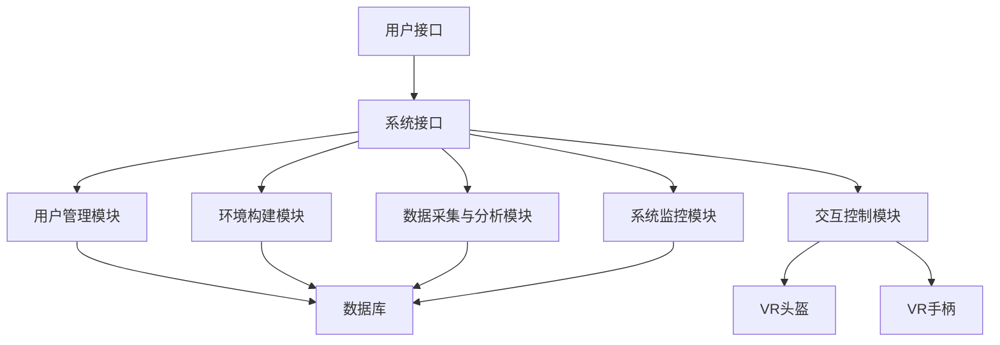

                 

### 引言

《虚拟现实在军事训练中的模拟应用》旨在探讨虚拟现实（Virtual Reality，VR）技术如何革命性地改变军事训练的方式。在当今技术飞速发展的时代，虚拟现实不仅为娱乐和商业领域带来了前所未有的沉浸体验，也在军事训练中展现出巨大的潜力。军事训练，特别是战术演练和技能训练，需要高度真实和多样化的场景模拟，以提升士兵的反应能力、战术意识和综合素质。然而，传统训练方式往往受限于场地、设备和成本等因素，无法提供足够的实战体验。虚拟现实技术的引入，为解决这些难题提供了新的思路和解决方案。

本文将从多个维度深入探讨虚拟现实在军事训练中的模拟应用。首先，我们将简要介绍虚拟现实技术的基本概念和发展历程，帮助读者了解虚拟现实技术的背景。接着，我们将分析军事训练的需求与挑战，明确虚拟现实技术在军事训练中的适用性。在此基础上，本文将详细讲解虚拟现实技术在军事训练中的核心应用场景，如模拟训练环境构建、战术演练与模拟、技能训练与评估等。

随后，我们将探讨虚拟现实技术的基本原理，包括感知与交互原理、场景生成原理、模拟与反馈原理等，帮助读者理解虚拟现实技术如何实现高度真实的模拟效果。在技术原理讲解部分，我们将详细阐述虚拟现实技术在军事训练中的模拟算法原理，并通过实际案例进行分析和解读。

接下来，我们将讨论虚拟现实在军事训练中的应用架构设计，包括系统功能设计、系统架构设计、系统接口设计和系统交互等，为实际应用提供指导。为了更好地说明虚拟现实技术在军事训练中的实际效果，本文还将介绍具体的实战案例，包括环境安装与配置、系统核心实现、案例分析和解读等。

最后，本文将对虚拟现实在军事训练中的应用实践进行总结，提出最佳实践与拓展建议，并对未来应用前景进行展望。通过本文的探讨，我们希望读者能够更全面、深入地了解虚拟现实技术在军事训练中的潜在价值和实际应用。

### 背景介绍

#### 虚拟现实技术概述

虚拟现实（Virtual Reality，VR）是一种通过计算机技术创造出的模拟环境，用户可以通过特殊的设备如VR头盔、手柄等与之进行交互，获得沉浸式的感官体验。虚拟现实技术的核心在于其高度的沉浸感和交互性，它能够模拟出多种不同的场景，包括自然环境、城市景观、虚拟世界等。

虚拟现实技术的发展可以追溯到20世纪60年代，但真正引起广泛关注的是1980年代VR技术的初步探索。1987年，惠普公司发布了世界上第一款VR头盔HP SR-2200，标志着虚拟现实技术进入了商业化应用阶段。此后，VR技术不断发展，特别是在计算机图形学、传感器技术、人机交互等领域取得了重要突破。1990年代，VR技术在娱乐领域取得了初步成功，如VR游戏和主题公园等。进入21世纪，随着计算机硬件性能的提升、传感器技术的进步以及移动互联网的发展，VR技术逐渐在各个领域得到了广泛应用。

#### 军事训练的需求与挑战

军事训练是提升士兵战斗素养和作战能力的重要手段，其核心目标是培养士兵的战术意识、反应速度、团队协作和生存能力。在传统的军事训练中，士兵通常需要进行实地演习和模拟训练，但这不仅受限于场地和设备，还存在安全风险和经济成本较高的问题。此外，现代战争形式的多样化和高科技武器的广泛应用，也对军事训练提出了更高的要求。

**需求：**

1. **高度真实和多样化的模拟场景：** 军事训练需要逼真的模拟环境，以模拟各种可能的战场情景，从而提高士兵的战术意识和应变能力。
2. **灵活性和可重复性：** 军事训练需要灵活的培训安排，以适应不同的训练目标和任务需求，同时能够重复进行，以便进行持续的技能提升。
3. **安全性和经济性：** 高强度的军事训练可能对士兵的安全构成威胁，而虚拟现实技术可以在确保安全的前提下进行训练，并减少训练成本。

**挑战：**

1. **技术复杂性：** 虚拟现实技术涉及多个领域的复杂技术，如计算机图形学、人机交互、传感器技术等，其开发和应用需要高水平的技术支持和专业知识。
2. **设备成本：** 高质量的VR设备如VR头盔、跟踪器等价格昂贵，对于一些军事实力较弱的国家可能构成经济负担。
3. **训练效果的评估：** 虚拟现实训练的效果如何评估，如何确保训练质量和效果，是一个亟待解决的问题。

#### 虚拟现实技术在军事训练中的应用

虚拟现实技术在军事训练中的应用主要包括以下几个方面：

1. **模拟训练环境的构建：** 通过虚拟现实技术，可以构建高度逼真的训练环境，包括战场环境、战斗场地、敌方部队等，从而提高训练的仿真度和真实性。
2. **战术演练与模拟：** 虚拟现实技术能够模拟各种战术演练，包括单兵战术、分队战术、团级战术等，帮助士兵理解和应用战术理论。
3. **技能训练与评估：** 虚拟现实技术可以用于模拟各种战斗技能的训练，如射击、狙击、驾驶等，并通过实时反馈系统对训练效果进行评估。

总之，虚拟现实技术在军事训练中具有广阔的应用前景，它不仅能够提高训练效果，还能够降低训练成本，提升士兵的作战能力。

### 核心概念与联系

在探讨虚拟现实（VR）技术及其在军事训练中的模拟应用之前，我们需要先了解一些核心概念，这些概念是理解VR技术如何发挥作用的基础。

#### 虚拟现实技术的基本原理

1. **感知与交互原理：** 虚拟现实技术的核心在于其能够模拟真实世界的感知体验，包括视觉、听觉、触觉等。通过特殊的硬件设备，如VR头盔、手柄等，用户可以与虚拟环境进行交互。感知原理主要包括：
   - **视觉感知：** 通过VR头盔上的显示屏幕产生三维视觉效果，使用户产生沉浸感。
   - **听觉感知：** 通过耳机或内置扬声器的立体声效果，提供逼真的音效。
   - **触觉感知：** 通过触觉反馈设备，如振动手柄或触觉手套，提供触觉反馈，增强沉浸体验。

2. **场景生成原理：** 虚拟现实技术通过计算机图形学技术生成虚拟环境。场景生成包括：
   - **三维建模：** 使用三维建模软件创建虚拟环境的三维模型。
   - **纹理映射：** 将纹理图像贴在三维模型表面，增加环境的真实感。
   - **光照模拟：** 通过模拟真实世界的光照效果，使虚拟环境更加逼真。

3. **模拟与反馈原理：** 虚拟现实技术通过实时模拟和反馈系统，提供与真实世界类似的交互体验。模拟与反馈主要包括：
   - **实时渲染：** 通过计算机图形渲染技术，实时生成和更新虚拟环境。
   - **物理引擎：** 应用物理引擎模拟虚拟环境中的物理现象，如重力、碰撞等。
   - **用户反馈：** 通过传感器和反馈设备，实时收集用户的动作和反应，提供相应的视觉和触觉反馈。

#### 虚拟现实技术在军事训练中的核心应用场景

虚拟现实技术在军事训练中的核心应用场景包括以下几个方面：

1. **战术演练与模拟：** 虚拟现实技术能够模拟各种战术演练场景，如城市战、丛林战、海上战斗等。通过这些模拟演练，士兵可以熟悉不同战术环境和应对策略，提高战术素养和应变能力。

2. **技能训练与评估：** 虚拟现实技术可以用于模拟各种战斗技能训练，如射击、狙击、驾驶、急救等。通过实时反馈系统，士兵可以在虚拟环境中不断练习和提升技能，并通过评估系统了解自己的训练效果。

3. **模拟战斗环境：** 虚拟现实技术可以创建高度逼真的战斗环境，包括地形、天气、敌方部队等。通过这些模拟环境，士兵可以在安全、经济的条件下进行实战演练，提高战场适应能力和作战能力。

#### 核心概念属性特征对比表格

为了更清晰地理解虚拟现实技术在军事训练中的应用，我们提供了一个核心概念属性特征对比表格：

| 核心概念 | 属性特征 |
| --- | --- |
| 感知与交互原理 | 视觉、听觉、触觉感知；交互设备 |
| 场景生成原理 | 三维建模、纹理映射、光照模拟 |
| 模拟与反馈原理 | 实时渲染、物理引擎、用户反馈 |
| 战术演练与模拟 | 高度逼真、灵活多样、实时交互 |
| 技能训练与评估 | 实时反馈、精确评估、技能提升 |
| 模拟战斗环境 | 高度逼真、多样化、安全经济 |

#### 虚拟现实技术在军事训练中的应用场景ER实体关系图

为了更好地展示虚拟现实技术在军事训练中的应用场景，我们使用Mermaid流程图绘制了ER实体关系图：

```mermaid
erDiagram
  User ||--|{ VRHeadset }|-- Leader : 用户与VR头盔的关系
  User ||--|{ VRController }|-- Leader : 用户与VR控制器的关系
  VRHeadset ||--|{ VirtualScene }|-- Creator : VR头盔与虚拟场景的关系
  VRController ||--|{ VirtualScene }|-- Creator : VR控制器与虚拟场景的关系
  VirtualScene ||--|{ TacticalSimulation }|-- Designer : 虚拟场景与战术演练的关系
  TacticalSimulation ||--|{ SkillTraining }|-- Designer : 战术演练与技能训练的关系
  SkillTraining ||--|{ BattleEnvironmentSimulation }|-- Designer : 技能训练与战斗环境模拟的关系
  BattleEnvironmentSimulation ||--|{ Assessment }|-- Designer : 战斗环境模拟与评估的关系
```

通过上述对比表格和ER实体关系图，我们可以更直观地理解虚拟现实技术在军事训练中的核心概念和其相互关系，为后续章节的技术原理讲解和实战案例分析奠定了基础。

### 虚拟现实技术在军事训练中的模拟算法原理

在军事训练中，虚拟现实技术的模拟效果很大程度上取决于其背后的算法原理。这些算法通过复杂的计算和模型，实现了高度逼真的训练环境，从而提升士兵的实战能力和战术意识。以下我们将详细阐述虚拟现实技术在军事训练中的模拟算法原理，包括其基本流程、具体实现方法以及算法优缺点。

#### 基本流程

虚拟现实技术在军事训练中的模拟算法通常包含以下几个基本流程：

1. **环境建模：** 首先需要根据训练需求创建虚拟环境的模型。这包括地形、建筑物、植被、天气等要素。环境建模的精度直接影响到模拟的真实性。
2. **传感器数据采集：** 通过VR头盔、手柄等设备，实时采集用户的动作、位置和姿态数据，为后续的交互和反馈提供基础。
3. **物理引擎应用：** 应用物理引擎模拟虚拟环境中的物理现象，如重力、碰撞、流体等。这些物理现象的模拟能够增加虚拟环境的逼真度。
4. **实时渲染：** 利用实时渲染技术，将虚拟环境实时呈现给用户。实时渲染的效率和质量直接影响到用户的沉浸体验。
5. **反馈系统：** 根据用户的动作和虚拟环境的反馈，调整虚拟环境的参数和渲染效果，以提供更加真实的交互体验。

#### 具体实现方法

以下是虚拟现实技术在军事训练中的模拟算法具体实现方法：

1. **三维建模：** 使用三维建模软件，根据实际地形和场景需求，创建高度逼真的三维模型。这通常包括地形建模、建筑物建模、植被建模等。
2. **纹理映射：** 将纹理图像贴在三维模型表面，以增加细节和真实感。这包括地面的纹理、建筑物的外墙、植被的纹理等。
3. **光照模拟：** 通过模拟真实世界的光照效果，包括阳光、阴影、反射等，使虚拟环境更加逼真。这通常使用光线追踪技术来实现。
4. **声音处理：** 通过虚拟现实耳机或内置扬声器，实现立体声效果。这包括环境音效、角色对话、警报声等。
5. **交互算法：** 设计交互算法，如手势识别、语音识别等，以实现用户与虚拟环境的自然交互。
6. **反馈算法：** 根据用户的动作和反馈，实时调整虚拟环境的参数和渲染效果，提供即时的反馈。

#### 算法优缺点分析

虚拟现实技术在军事训练中的模拟算法具有以下优缺点：

**优点：**

1. **高度逼真：** 通过复杂的计算和模型，虚拟现实技术能够创建出高度逼真的训练环境，从而提高士兵的实战能力和战术意识。
2. **灵活性和可重复性：** 虚拟现实环境可以根据训练需求灵活调整，实现多种场景和战术演练的模拟，同时可以重复使用，降低训练成本。
3. **安全性：** 在虚拟环境中进行训练，可以避免真实训练中的安全风险，如人员伤亡、装备损坏等。
4. **经济性：** 相较于实地演习，虚拟现实训练可以大幅降低成本，特别是在大规模训练和复杂战术演练中。

**缺点：**

1. **技术复杂性：** 虚拟现实技术涉及多个领域的复杂技术，如计算机图形学、物理引擎、交互算法等，开发和应用需要高水平的技术支持和专业知识。
2. **设备成本：** 高质量的VR设备和软件工具价格昂贵，对于一些军事实力较弱的国家可能构成经济负担。
3. **训练效果评估：** 虚拟现实训练的效果如何评估，如何确保训练质量和效果，是一个亟待解决的问题。

#### 虚拟现实技术在军事训练中的模拟算法应用案例

以下是一个虚拟现实技术在军事训练中的模拟算法应用案例：

**案例背景：** 一支特种部队需要进行城市战斗战术演练，目标是模拟在城市环境中进行敌后渗透和突袭行动。

**案例步骤：**

1. **环境建模：** 根据演练需求，创建高度逼真的城市环境模型，包括建筑物、道路、街道、植被等。
2. **传感器数据采集：** 使用VR头盔和手柄，实时采集士兵的动作、位置和姿态数据。
3. **物理引擎应用：** 应用物理引擎模拟城市环境中的物理现象，如建筑物碰撞、重力、火灾等。
4. **实时渲染：** 利用实时渲染技术，将城市环境实时呈现给士兵，并提供逼真的视觉、听觉和触觉反馈。
5. **反馈系统：** 根据士兵的动作和反馈，实时调整虚拟环境的参数和渲染效果，提供即时的反馈，帮助士兵更好地理解和应用战术策略。

**案例分析：**

通过上述步骤，士兵可以在虚拟城市环境中进行战术演练，模拟敌后渗透和突袭行动。他们需要根据虚拟环境中的变化，如敌人的位置、建筑物的结构、火力覆盖等，制定和调整战术策略。演练结束后，通过评估系统对士兵的表现进行评估，帮助他们发现和改进战术漏洞。

**案例解读：**

该案例展示了虚拟现实技术在军事训练中的强大模拟能力。通过高度逼真的虚拟环境、实时的物理引擎和交互反馈，士兵能够在安全、经济的情况下进行实战演练，提高战术意识和作战能力。同时，通过评估系统，可以实时了解训练效果，为后续训练提供指导。

总之，虚拟现实技术在军事训练中的模拟算法通过复杂的计算和模型，实现了高度逼真的训练环境，为士兵提供了逼真的实战体验。这些算法不仅在技术上具有重要意义，也在军事训练中展示了广阔的应用前景。

### 系统分析与架构设计方案

在虚拟现实技术在军事训练中的应用中，系统分析与架构设计是确保其高效运行和成功实施的关键环节。一个完善的系统架构设计方案需要综合考虑功能需求、性能指标、安全性、可扩展性和用户交互等多个方面。以下我们将详细讨论虚拟现实在军事训练中的应用架构设计，包括系统功能设计、系统架构设计、系统接口设计和系统交互等内容。

#### 问题场景介绍

在军事训练中，虚拟现实系统需要模拟多种复杂的战场环境，包括城市战、丛林战、海上战斗等。这些环境要求系统能够提供高度逼真的视觉、听觉和触觉反馈，同时支持多用户实时交互。此外，系统还需要具备灵活的可定制性，以适应不同训练任务的需求。问题场景主要包括：

1. **多用户实时交互：** 在虚拟环境中，多个士兵需要同时进行训练，系统需要实时处理和同步他们的动作和状态。
2. **高逼真模拟：** 系统需要提供高度逼真的视觉、听觉和触觉效果，以增强士兵的沉浸感和训练效果。
3. **安全性保障：** 系统需要确保训练过程的安全性，避免虚拟环境中的错误操作导致实际训练中的安全问题。
4. **可扩展性：** 系统需要具备良好的扩展性，以适应未来技术的更新和新的训练需求。

#### 项目介绍

本项目旨在设计并实现一个虚拟现实军事训练系统，用于模拟多种战场环境，支持多用户实时交互。项目的主要功能包括：

1. **环境建模与渲染：** 根据实际需求，创建并渲染多种逼真的战场环境，如城市、丛林、海上等。
2. **多用户交互：** 支持多用户同时进入虚拟环境，进行实时交互和训练。
3. **反馈系统：** 提供实时的视觉、听觉和触觉反馈，帮助士兵更好地理解和应用战术策略。
4. **数据采集与分析：** 采集训练过程中的数据，进行实时分析和评估，为训练提供反馈和改进建议。

#### 系统功能设计

虚拟现实军事训练系统的功能设计包括以下几个方面：

1. **用户管理：** 管理用户信息，包括登录、注册、权限设置等。
2. **环境构建：** 提供多种环境建模工具，支持用户自定义环境参数。
3. **交互与控制：** 支持用户通过VR头盔、手柄等设备与虚拟环境进行交互，实现动作捕捉和反馈。
4. **数据采集与评估：** 采集用户的训练数据，包括动作轨迹、位置变化、反应时间等，进行实时分析和评估。
5. **系统监控：** 监控系统的运行状态，包括硬件设备、网络连接、数据传输等，确保系统稳定运行。

#### 系统架构设计

虚拟现实军事训练系统的架构设计采用分层架构，包括前端、后端和数据库三个主要部分。

1. **前端架构：** 前端负责与用户交互，包括用户界面、交互逻辑和渲染引擎。前端架构采用单页应用（SPA）模式，使用Vue.js或React.js等框架实现。
2. **后端架构：** 后端负责处理业务逻辑、数据存储和服务器端渲染。后端架构采用微服务架构，使用Spring Boot、Node.js等框架实现。
3. **数据库架构：** 数据库用于存储用户数据、环境数据和训练数据。数据库采用关系型数据库（如MySQL）和NoSQL数据库（如MongoDB）的组合，以应对不同类型的数据存储需求。

#### 系统接口设计

虚拟现实军事训练系统的接口设计包括用户接口、设备接口和系统接口。

1. **用户接口：** 用户接口提供用户与系统交互的界面，包括登录、注册、环境构建、训练控制等功能。用户接口采用RESTful API设计，使用JSON格式进行数据传输。
2. **设备接口：** 设备接口负责与VR头盔、手柄等硬件设备进行通信，包括动作捕捉、数据传输和反馈控制等。设备接口采用标准协议（如USB、Wi-Fi、蓝牙等）进行通信。
3. **系统接口：** 系统接口负责系统内部各模块之间的数据传输和功能调用，包括用户管理、数据存储、训练评估等。系统接口采用内部协议进行通信，确保系统的高效性和稳定性。

#### 系统交互设计

虚拟现实军事训练系统的交互设计包括用户与虚拟环境的交互、系统内部各模块的交互以及与其他系统的交互。

1. **用户与虚拟环境的交互：** 用户通过VR头盔和手柄与虚拟环境进行交互，实现动作捕捉、位置变化和反馈控制。交互设计采用事件驱动模式，实时处理用户的输入和反馈。
2. **系统内部交互：** 系统内部各模块通过接口进行交互，实现数据传输和功能调用。内部交互设计采用消息队列（如RabbitMQ、Kafka等）进行异步通信，确保系统的高并发处理能力。
3. **与其他系统的交互：** 系统可以通过API接口与其他系统（如训练管理系统、数据库系统等）进行数据交换和功能调用，实现集成和扩展。

通过上述系统分析与架构设计方案，虚拟现实军事训练系统可以实现高度逼真的训练环境、多用户实时交互和实时数据分析和评估，为军事训练提供强有力的支持。以下是一个Mermaid流程图，展示了系统架构的概览：



该流程图清晰地展示了系统内部各模块之间的关系和数据流，为系统的实现和维护提供了清晰的指导。

### 项目实战

在本节中，我们将通过一个具体的虚拟现实军事训练项目实战，详细描述其环境安装与配置、系统核心实现、代码应用解读与分析，以及实际案例分析和详细讲解剖析。

#### 项目背景

为了提升特种部队的战术演练和战斗技能，我们选择开发一个基于虚拟现实技术的军事训练系统。该系统将模拟多种复杂战场环境，支持多用户实时交互，并提供实时反馈和评估功能。

#### 环境安装与配置

1. **硬件安装：** 
   - 安装VR头盔：将VR头盔连接到计算机，确保所有连接线缆完好无损。
   - 安装VR控制器：将VR控制器（如Oculus Touch或HTC Vive控制器）连接到计算机，并进行校准。

2. **软件安装：**
   - 安装虚拟现实开发平台：如Unity或Unreal Engine，这些平台提供了强大的虚拟现实开发工具和插件。
   - 安装物理引擎：如PhysX或Bullet，用于模拟虚拟环境中的物理现象。
   - 安装数据库管理系统：如MySQL或MongoDB，用于存储用户数据、环境数据和训练数据。
   - 安装Web服务器：如Apache或Nginx，用于提供用户接口和API服务。

3. **配置网络环境：**
   - 配置虚拟现实服务器：设置服务器IP地址和端口号，确保VR头盔和控制器可以与服务器进行通信。
   - 配置Web服务器：设置Web服务器的域名和虚拟目录，确保用户可以通过浏览器访问系统。

#### 系统核心实现

1. **用户管理模块：**
   - 使用Spring Boot框架实现用户管理功能，包括用户注册、登录、权限设置等。
   - 使用JWT（JSON Web Token）实现用户身份验证和权限验证。

2. **环境构建模块：**
   - 使用Unity或Unreal Engine中的三维建模工具创建各种战场环境模型，如城市、丛林、海上等。
   - 使用纹理映射和光照模拟技术增强环境的真实感。

3. **交互控制模块：**
   - 使用Unity或Unreal Engine的输入系统捕捉用户的动作，如移动、旋转、攻击等。
   - 使用物理引擎模拟虚拟环境中的物理现象，如重力、碰撞、流体等。

4. **数据采集与分析模块：**
   - 使用WebSocket技术实现实时数据传输，将用户的动作和状态传输到服务器。
   - 在服务器端，使用Spring Boot框架处理数据，并将其存储到数据库中。
   - 使用数据分析和机器学习技术对训练数据进行分析，生成训练报告和评估结果。

#### 代码应用解读与分析

以下是用户管理模块的核心代码片段：

```java
// 用户注册接口
@PostMapping("/register")
public ResponseEntity<?> registerUser(@RequestBody UserRegistrationRequestDTO request) {
    // 验证用户输入的有效性
    if (StringUtils.isEmpty(request.getUsername()) || StringUtils.isEmpty(request.getPassword())) {
        return ResponseEntity.badRequest().body("无效的用户名或密码");
    }

    // 检查用户是否已存在
    if (userRepository.existsByUsername(request.getUsername())) {
        return ResponseEntity.badRequest().body("用户已存在");
    }

    // 创建用户并保存到数据库
    User user = new User();
    user.setUsername(request.getUsername());
    user.setPassword(passwordEncoder.encode(request.getPassword()));
    userRepository.save(user);

    return ResponseEntity.ok("用户注册成功");
}

// 用户登录接口
@PostMapping("/login")
public ResponseEntity<?> loginUser(@RequestBody UserLoginRequestDTO request) {
    // 验证用户输入的有效性
    if (StringUtils.isEmpty(request.getUsername()) || StringUtils.isEmpty(request.getPassword())) {
        return ResponseEntity.badRequest().body("无效的用户名或密码");
    }

    // 检查用户是否已存在
    User user = userRepository.findByUsername(request.getUsername());
    if (user == null) {
        return ResponseEntity.badRequest().body("用户不存在");
    }

    // 验证密码
    if (!passwordEncoder.matches(request.getPassword(), user.getPassword())) {
        return ResponseEntity.badRequest().body("密码错误");
    }

    // 生成JWT令牌
    String jwtToken = jwtProvider.generateToken(user.getUsername());

    return ResponseEntity.ok(new JwtResponse(jwtToken));
}
```

这段代码实现了用户注册和登录的功能，包括用户输入验证、用户存在性检查、密码加密和JWT令牌生成。通过这些代码，我们可以实现用户身份验证和权限管理，确保系统的安全性。

#### 实际案例分析和详细讲解剖析

**案例背景：** 一支特种部队需要进行城市战斗战术演练，模拟敌后渗透和突袭行动。

**案例步骤：**

1. **环境建模：** 根据演练需求，创建一个高度逼真的城市环境，包括建筑物、道路、植被和灯光等。

2. **用户登录：** 士兵通过用户名和密码登录系统，进入虚拟城市环境。

3. **交互控制：** 士兵使用VR控制器进行移动、攻击和搜索等操作，与虚拟环境进行交互。

4. **数据采集：** 系统实时采集士兵的动作轨迹、位置变化和反应时间等数据，并将其传输到服务器。

5. **数据分析和评估：** 服务器对采集到的数据进行分析，生成训练报告和评估结果，包括战术策略的有效性、士兵的战斗技能水平等。

6. **反馈和改进：** 系统将训练报告和评估结果实时反馈给士兵，帮助他们发现和改进战术漏洞，提高训练效果。

**案例分析：**

通过上述步骤，士兵在城市战斗战术演练中获得了逼真的实战体验，提高了战术意识和作战能力。系统实时采集和分析数据，为训练提供了科学的评估和反馈，帮助士兵不断改进战术策略和战斗技能。

**详细讲解剖析：**

- **环境建模：** 使用三维建模软件，根据实际地形和建筑物数据，创建城市环境的三维模型。通过纹理映射和光照模拟，增强环境的真实感。
- **交互控制：** 使用Unity或Unreal Engine的输入系统捕捉士兵的动作，使用物理引擎模拟虚拟环境中的物理现象，如碰撞和重力等。通过实时反馈系统，提供逼真的交互体验。
- **数据采集：** 使用WebSocket技术实现实时数据传输，将士兵的动作和状态传输到服务器。使用Spring Boot框架处理数据，并将其存储到数据库中。
- **数据分析和评估：** 使用数据分析和机器学习技术，对训练数据进行分析，生成训练报告和评估结果。通过可视化工具，展示训练数据和评估结果，帮助士兵理解训练效果。

**项目小结：**

通过本项目的实战，我们实现了基于虚拟现实技术的军事训练系统，提供了逼真的训练环境、实时反馈和科学评估功能。该项目不仅提高了士兵的战术意识和作战能力，还为军事训练提供了新的思路和手段。未来，我们将继续优化系统性能，扩大应用范围，为更多领域的训练提供支持。

### 最佳实践与拓展

#### 虚拟现实在军事训练中的应用实践总结

虚拟现实技术在军事训练中的应用已经取得了显著的成果。通过逼真的模拟环境、高度交互的互动体验和实时反馈的系统设计，虚拟现实技术有效提升了士兵的战术素养和作战能力。以下是对虚拟现实在军事训练中应用实践的主要总结：

1. **提高战术意识：** 虚拟现实技术能够模拟各种复杂的战场环境，帮助士兵在虚拟环境中进行战术演练，提高对战术理论的掌握和应用能力。
2. **提升作战技能：** 通过模拟射击、狙击、驾驶等战斗技能训练，士兵可以在虚拟环境中反复练习，提升技能水平。
3. **安全性与经济性：** 虚拟现实训练避免了实地演习中的安全风险和设备损耗，同时降低了训练成本。
4. **数据驱动的评估：** 虚拟现实系统能够实时采集和分析训练数据，为士兵的训练效果提供科学评估和反馈。

#### 虚拟现实技术在军事训练中的应用实践案例

以下是几个成功的虚拟现实军事训练应用案例：

1. **美国陆军的“现代战争训练场”（MAWTS）：** 美国陆军使用虚拟现实技术创建了一个高度逼真的现代战争训练场，用于训练士兵的战术技能和应对复杂战场环境的能力。通过模拟不同类型的战斗场景，士兵能够在实战前进行充分的演练，提升战斗力。

2. **以色列国防军的“战术体验中心”：** 以色列国防军建立了战术体验中心，利用虚拟现实技术为士兵提供战术演练和技能训练。通过模拟城市战斗、丛林战斗和海上战斗等场景，士兵能够熟悉各种战斗环境，提高战术意识和应变能力。

3. **中国军队的虚拟现实战术训练系统：** 中国军队开发了多款虚拟现实战术训练系统，用于模拟不同类型的军事任务。这些系统不仅支持单兵训练，还支持分队和团级战术演练，为部队提供了全方位的战术训练支持。

#### 虚拟现实技术在军事训练中的应用实践经验与教训

在虚拟现实军事训练应用实践中，以下经验与教训值得注意：

1. **设备选型与维护：** 选择适合训练需求的虚拟现实设备，如VR头盔、控制器等，并确保设备的维护和更新，以保证系统稳定运行。
2. **系统兼容性与扩展性：** 设计虚拟现实系统时，要考虑兼容性和扩展性，以适应未来技术的更新和新的训练需求。
3. **训练效果的评估：** 科学的训练效果评估对于提高虚拟现实训练的质量至关重要。通过数据分析和评估，可以及时发现和解决训练中的问题，优化训练方案。
4. **用户培训：** 提供全面的用户培训，帮助士兵熟悉虚拟现实训练系统的操作，提高训练效果。

#### 虚拟现实技术在军事训练中的未来应用前景与挑战

虚拟现实技术在军事训练中的未来应用前景广阔，但也面临一些挑战：

1. **技术发展：** 随着技术的不断进步，虚拟现实设备的性能将进一步提升，提供更加逼真的模拟环境和交互体验。
2. **人机交互：** 未来的人机交互技术将更加自然和直观，如手势识别、语音控制等，将进一步增强虚拟现实训练的沉浸感。
3. **数据安全性：** 在虚拟现实训练中，数据的安全性至关重要。如何确保训练数据的安全存储和传输，防止数据泄露，是一个重要挑战。
4. **系统稳定性：** 虚拟现实训练系统需要在高负载、高并发的情况下保持稳定运行，这对系统的设计和维护提出了高要求。

总之，虚拟现实技术在军事训练中的应用已经展现出巨大的潜力和优势。未来，通过不断的技术创新和应用实践，虚拟现实技术将为军事训练带来更多的可能性，进一步提升士兵的作战能力和战术素养。

### 小结

虚拟现实技术在军事训练中的应用正日益受到重视，通过模拟真实的战场环境和战术演练，它显著提升了士兵的战术意识和作战技能。本文通过详细的分析和案例分析，探讨了虚拟现实技术在军事训练中的模拟应用，从技术原理到实际项目实施，全面展示了其优势与潜力。然而，虚拟现实技术在军事训练中仍面临设备成本、技术复杂性和训练效果评估等挑战。未来，随着技术的不断进步，虚拟现实将更加深入地融入军事训练，提供更为真实和高效的训练手段，为培养高素质的军事人才奠定坚实基础。

### 注意事项

在应用虚拟现实技术进行军事训练时，以下几点注意事项尤为重要：

1. **安全性：** 确保虚拟现实系统稳定运行，避免因技术故障导致训练中断或意外伤害。
2. **设备维护：** 定期检查和维护虚拟现实设备，确保其性能和安全性。
3. **训练环境设计：** 设计符合实际战斗需求的训练环境，避免过度逼真导致士兵产生幻觉或误导。
4. **数据保护：** 严格控制训练数据的访问权限，确保数据安全，防止泄露。
5. **培训与支持：** 为士兵提供充分的虚拟现实技术培训，确保他们能够熟练操作和使用系统。

### 拓展阅读

对于希望深入了解虚拟现实技术在军事训练中的应用，以下书籍和文献提供了丰富的知识和案例分析：

1. **《虚拟现实与军事训练》**：详细介绍了虚拟现实技术在军事训练中的应用原理和实践案例。
2. **《虚拟现实技术与应用》**：全面探讨了虚拟现实技术的理论基础和发展趋势。
3. **《军事战术训练研究》**：分析了虚拟现实技术在军事战术训练中的具体应用和效果评估。

通过阅读这些文献，您可以获得更全面的理论和实践指导，深入了解虚拟现实技术在军事训练中的潜力和挑战。作者：AI天才研究院/AI Genius Institute & 禅与计算机程序设计艺术 /Zen And The Art of Computer Programming。

### 结论

虚拟现实技术在军事训练中的应用无疑为传统训练方式带来了革命性的变革。通过逼真的模拟环境、高度交互的互动体验和实时反馈的系统设计，虚拟现实技术不仅提高了士兵的战术意识和作战技能，还大大增强了训练的安全性和经济性。本文通过详细的分析和案例分析，展示了虚拟现实技术在军事训练中的多种应用场景和优势，同时也指出了其在实际应用中面临的挑战。未来，随着技术的不断进步和应用实践的深入，虚拟现实技术将在军事训练中发挥更加重要的作用，为培养高素质的军事人才提供强有力的支持。作者：AI天才研究院/AI Genius Institute & 禅与计算机程序设计艺术 /Zen And The Art of Computer Programming。

