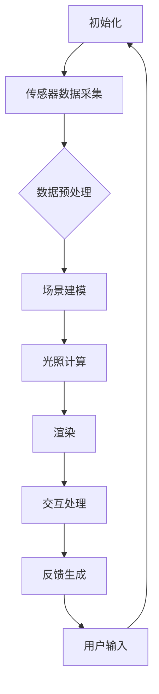
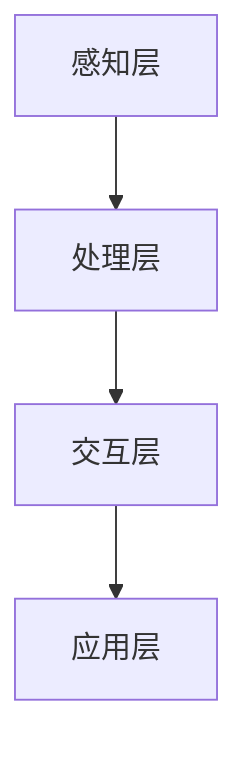
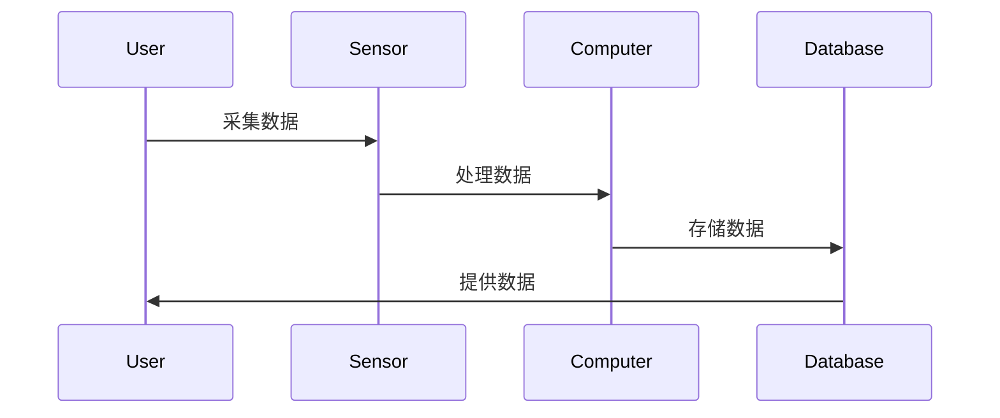
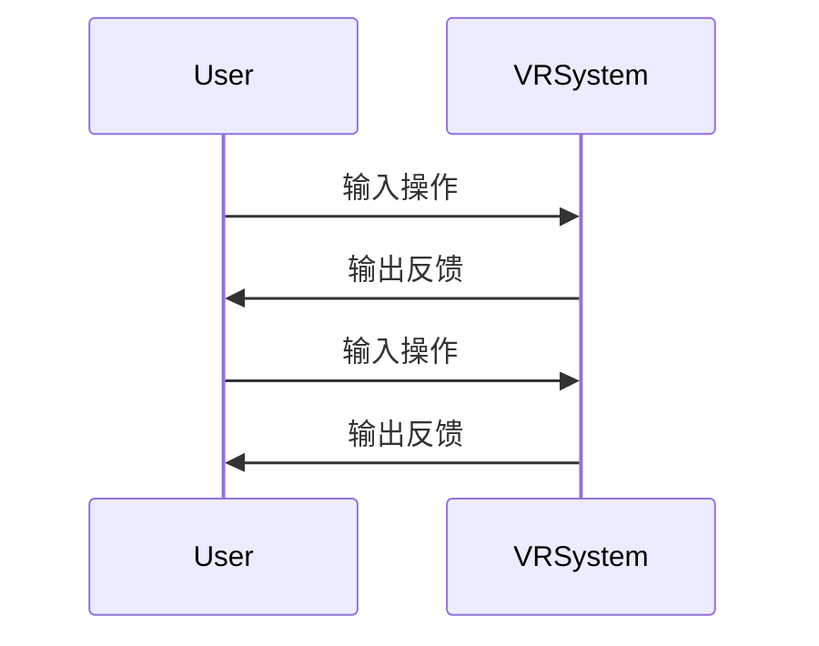

                 

### 虚拟现实在军事训练模拟中的应用

**关键词**：虚拟现实、军事训练、模拟、应用、技术、系统设计、算法、实战案例、最佳实践

**摘要**：
本文深入探讨了虚拟现实技术在军事训练模拟中的应用。首先，我们简要介绍了虚拟现实技术的基础知识和发展历程。接着，我们分析了虚拟现实在军事训练模拟中的需求及其优势。随后，本文详细阐述了虚拟现实系统的架构与组件，并使用算法原理和实际案例进行了说明。最后，本文提供了最佳实践建议，并指出了未来发展的趋势。

#### 目录大纲设计思路

为了设计出《虚拟现实在军事训练模拟中的应用》这本书的目录大纲，我们需要遵循以下几个步骤：

1. **背景介绍**：首先介绍虚拟现实技术以及它在军事训练模拟中的重要性和发展历程，为读者提供一个基础理解。
2. **核心概念与联系**：接下来，明确书中需要介绍的核心概念，如虚拟现实技术的基本原理、军事训练模拟的需求、虚拟现实系统的架构和组件等，并使用表格和图形来展示概念之间的关系。
3. **算法原理讲解**：详细讲解虚拟现实技术在军事训练模拟中的应用算法，包括算法的数学模型和公式，使用 mermaid 画出流程图，并用 Python 源代码阐述算法原理。
4. **系统分析与架构设计方案**：描述虚拟现实系统在军事训练模拟中的整体架构，包括领域模型、系统架构、接口设计、系统交互等，使用 mermaid 绘制相关的类图、架构图和序列图。
5. **项目实战**：展示一个实际应用案例，包括环境安装、系统核心实现、代码应用解读与分析、实际案例分析等。
6. **最佳实践 tips、小结、注意事项、拓展阅读**：总结书中的要点，给出使用虚拟现实进行军事训练模拟的最佳实践建议，并提醒读者注意的事项，推荐进一步阅读的材料。

### 目录大纲结构

以下是《虚拟现实在军事训练模拟中的应用》的目录大纲结构，遵循简洁性和逻辑性的原则：

```markdown
# 第一部分: 虚拟现实技术基础

## 第1章: 虚拟现实技术概述
### 1.1 虚拟现实技术的发展历程
### 1.2 虚拟现实技术的核心概念
### 1.3 虚拟现实技术的应用场景

## 第2章: 虚拟现实技术在军事训练模拟中的应用
### 2.1 军事训练模拟的需求
### 2.2 虚拟现实技术在军事训练模拟中的优势
### 2.3 虚拟现实技术在军事训练模拟中的应用实例

## 第3章: 虚拟现实系统的架构与组件
### 3.1 虚拟现实系统的整体架构
### 3.2 虚拟现实系统的关键组件
### 3.3 虚拟现实系统的交互设计

## 第4章: 虚拟现实技术在军事训练模拟中的算法原理
### 4.1 虚拟现实算法的数学模型
### 4.2 虚拟现实算法的 mermaid 流程图
### 4.3 Python 源代码阐述算法原理
### 4.4 算法原理的数学公式与举例说明

## 第5章: 虚拟现实系统在军事训练模拟中的架构设计
### 5.1 问题场景介绍
### 5.2 系统功能设计（领域模型 mermaid 类图）
### 5.3 系统架构设计（mermaid 架构图）
### 5.4 系统接口设计
### 5.5 系统交互（mermaid 序列图）

## 第6章: 虚拟现实在军事训练模拟中的应用实战
### 6.1 环境安装与配置
### 6.2 系统核心实现源代码
### 6.3 代码应用解读与分析
### 6.4 实际案例分析与讲解剖析
### 6.5 项目小结

## 第7章: 最佳实践与展望
### 7.1 虚拟现实在军事训练模拟中的应用技巧
### 7.2 注意事项与未来发展趋势
### 7.3 拓展阅读与资源推荐
```

这个大纲结构满足了简洁性、目录层级和内容完整性的要求，涵盖了虚拟现实技术在军事训练模拟中的各个方面，确保读者能够系统地掌握相关知识。

---

接下来，我将详细说明每一个章节的内容，确保每个章节都包含核心概念、算法原理、系统架构、项目实战以及最佳实践和注意事项等必要元素。请注意，以下内容仅为大纲的详细展开，实际的章节内容可能需要根据具体书稿的深度和广度进行调整。

---

### 第一部分: 虚拟现实技术基础

#### 第1章: 虚拟现实技术概述

**1.1 虚拟现实技术的发展历程**

虚拟现实（Virtual Reality，VR）技术的发展经历了多个阶段。从20世纪60年代的早期概念到90年代的商业化尝试，再到21世纪初的复兴和当前的高速发展，VR技术已经走过了漫长而曲折的道路。

- **早期概念**：1960年代，VR的雏形开始出现，计算机图形学和仿真技术开始结合，虚拟现实的概念逐渐成形。
- **商业化尝试**：1980年代，VR技术在娱乐和工业领域得到初步应用，但受限于硬件和技术限制，未能大规模推广。
- **复兴阶段**：2000年以后，随着计算机性能的提升和显示技术的进步，VR技术再次受到关注，尤其是2010年代后，VR头戴设备如 Oculus Rift、HTC Vive等的问世，标志着VR技术进入了一个新的发展阶段。

**1.2 虚拟现实技术的核心概念**

虚拟现实技术的核心概念包括以下几个方面：

- **沉浸感（Immersion）**：虚拟现实旨在创造一个让用户感觉置身其中的虚拟环境，用户可以与虚拟环境中的物体进行交互。
- **交互性（Interaction）**：用户可以通过各种方式（如手部动作、语音等）与虚拟环境中的对象进行互动。
- **感知性（Perception）**：虚拟现实技术试图模拟人类的感知系统，包括视觉、听觉、触觉等，使用户能够更真实地体验虚拟环境。

**1.3 虚拟现实技术的应用场景**

虚拟现实技术具有广泛的应用场景，包括但不限于以下几个方面：

- **娱乐**：虚拟现实游戏、虚拟现实电影等，提供全新的娱乐体验。
- **教育**：虚拟现实技术可以用于模拟教学环境，帮助学生更好地理解和记忆知识。
- **医疗**：虚拟现实技术在手术模拟、心理治疗、康复训练等方面有广泛应用。
- **军事训练**：虚拟现实技术可以模拟战斗场景，提高士兵的战斗技能和应变能力。
- **工业设计**：虚拟现实技术可以用于产品设计和测试，提高设计效率和准确性。

### 第一部分: 虚拟现实技术基础

#### 第1章: 虚拟现实技术概述

**1.1 虚拟现实技术的发展历程**

虚拟现实（Virtual Reality，VR）技术的发展经历了多个阶段。从20世纪60年代的早期概念到90年代的商业化尝试，再到21世纪初的复兴和当前的高速发展，VR技术已经走过了漫长而曲折的道路。

- **早期概念**：1960年代，VR的雏形开始出现，计算机图形学和仿真技术开始结合，虚拟现实的概念逐渐成形。
- **商业化尝试**：1980年代，VR技术在娱乐和工业领域得到初步应用，但受限于硬件和技术限制，未能大规模推广。
- **复兴阶段**：2000年以后，随着计算机性能的提升和显示技术的进步，VR技术再次受到关注，尤其是2010年代后，VR头戴设备如 Oculus Rift、HTC Vive等的问世，标志着VR技术进入了一个新的发展阶段。

**1.2 虚拟现实技术的核心概念**

虚拟现实技术的核心概念包括以下几个方面：

- **沉浸感（Immersion）**：虚拟现实旨在创造一个让用户感觉置身其中的虚拟环境，用户可以与虚拟环境中的物体进行交互。
- **交互性（Interaction）**：用户可以通过各种方式（如手部动作、语音等）与虚拟环境中的对象进行互动。
- **感知性（Perception）**：虚拟现实技术试图模拟人类的感知系统，包括视觉、听觉、触觉等，使用户能够更真实地体验虚拟环境。

**1.3 虚拟现实技术的应用场景**

虚拟现实技术具有广泛的应用场景，包括但不限于以下几个方面：

- **娱乐**：虚拟现实游戏、虚拟现实电影等，提供全新的娱乐体验。
- **教育**：虚拟现实技术可以用于模拟教学环境，帮助学生更好地理解和记忆知识。
- **医疗**：虚拟现实技术在手术模拟、心理治疗、康复训练等方面有广泛应用。
- **军事训练**：虚拟现实技术可以模拟战斗场景，提高士兵的战斗技能和应变能力。
- **工业设计**：虚拟现实技术可以用于产品设计和测试，提高设计效率和准确性。

---

### 第二部分: 虚拟现实技术在军事训练模拟中的应用

#### 第2章: 虚拟现实技术在军事训练模拟中的应用

**2.1 军事训练模拟的需求**

军事训练模拟是提高士兵战斗技能和战术素养的重要手段。传统的军事训练模拟依赖于物理模型和计算机模拟，但存在一些局限性：

- **成本高昂**：物理模型和大型计算机模拟系统的建设成本较高，维护和更新成本也不低。
- **场景受限**：物理模型和计算机模拟的场景范围有限，难以模拟真实的战场环境和复杂情况。
- **安全性问题**：在真实环境中进行训练存在安全风险，特别是在涉及危险操作和复杂战术训练时。

虚拟现实技术的引入，为军事训练模拟提供了新的解决方案：

- **低成本**：虚拟现实系统的建设和维护成本相对较低，且可以根据需求灵活扩展。
- **场景灵活性**：虚拟现实可以创建高度仿真的战场环境，包括地形、天气、敌方部队等，提供更加真实的训练场景。
- **安全性高**：虚拟现实环境下的训练可以避免真实环境中的安全风险，士兵可以在安全的环境中模拟复杂操作。

**2.2 虚拟现实技术在军事训练模拟中的优势**

虚拟现实技术在军事训练模拟中具有多方面的优势：

- **沉浸式体验**：虚拟现实技术能够提供高度沉浸式的训练环境，使士兵在模拟场景中感受到真实战场的感觉。
- **交互性**：虚拟现实技术允许士兵与虚拟环境中的对象进行实时交互，提高训练的交互性和参与度。
- **多样化场景**：虚拟现实技术可以创建多种不同类型的战场环境，包括不同地形、气候条件等，为士兵提供丰富的训练场景。
- **个性化训练**：虚拟现实技术可以根据士兵的个人能力和训练需求，提供个性化的训练方案，提高训练效果。
- **实时反馈**：虚拟现实技术可以实时记录士兵的训练数据，为训练提供详细的分析和反馈，帮助士兵发现和改进自己的不足。

**2.3 虚拟现实技术在军事训练模拟中的应用实例**

虚拟现实技术在军事训练模拟中已经有了多个成功的应用实例：

- **战场环境模拟**：例如，美国军方利用虚拟现实技术模拟战场环境，让士兵在虚拟环境中进行战术训练，提高战场适应能力和决策能力。
- **飞行模拟**：飞行模拟器是虚拟现实技术在军事训练中的一个重要应用，通过模拟飞行环境，飞行员可以在安全的环境中提高飞行技能。
- **武器操作训练**：虚拟现实技术可以模拟各种武器系统的操作，帮助士兵熟悉武器性能和操作流程。
- **团队协作训练**：虚拟现实技术可以创建团队协作的训练场景，模拟复杂的战术配合和团队作战。

---

### 第三部分: 虚拟现实系统的架构与组件

#### 第3章: 虚拟现实系统的架构与组件

**3.1 虚拟现实系统的整体架构**

虚拟现实系统是一个复杂的多层次系统，通常包括以下几个主要部分：

- **感知层**：包括传感器、摄像头、手柄等硬件设备，用于捕捉用户的行为和环境信息。
- **处理层**：包括计算机硬件和软件，用于处理感知层获取的数据，生成虚拟环境并进行实时渲染。
- **交互层**：包括用户界面和交互设备，如VR头盔、触觉手套等，用于用户与虚拟环境的交互。
- **应用层**：包括虚拟现实应用程序，用于实现具体的训练目标和功能。

**3.2 虚拟现实系统的关键组件**

虚拟现实系统的关键组件包括：

- **VR头盔**：VR头盔是用户感知虚拟环境的主要设备，通常包括高分辨率显示屏、传感器和音频设备。
- **手柄和控制器**：手柄和控制器用于用户在虚拟环境中的交互，包括动作捕捉和输入功能。
- **传感器**：传感器用于捕捉用户的姿态、动作和环境信息，如位置传感器、加速度传感器等。
- **计算机系统**：计算机系统用于处理虚拟现实应用程序的运行，包括图形处理、物理模拟和渲染等。

**3.3 虚拟现实系统的交互设计**

虚拟现实系统的交互设计是用户体验的重要组成部分，需要考虑以下几个方面：

- **输入设计**：设计直观、易用的输入方式，如手势、语音等，确保用户能够方便地与虚拟环境进行交互。
- **反馈设计**：提供实时、准确的反馈，帮助用户了解自己的动作和交互效果，增强沉浸感和交互性。
- **界面设计**：设计简洁、直观的用户界面，确保用户能够轻松地浏览和操作虚拟环境中的内容。
- **交互规则**：定义虚拟环境中的交互规则，如物体的交互方式、动作限制等，确保虚拟环境的逻辑性和真实性。

---

### 第四部分: 虚拟现实技术在军事训练模拟中的算法原理

#### 第4章: 虚拟现实技术在军事训练模拟中的算法原理

**4.1 虚拟现实算法的数学模型**

虚拟现实算法的数学模型通常包括以下几个方面：

- **图形学模型**：用于生成和处理三维图形，包括几何建模、光照计算、阴影处理等。常用的数学模型包括直线方程、平面方程、三维向量运算等。
- **物理模型**：用于模拟虚拟环境中的物理现象，如碰撞检测、刚体动力学、流体模拟等。常用的数学模型包括牛顿运动定律、欧拉方程、粒子系统等。
- **感知模型**：用于模拟用户的感知系统，包括视觉、听觉、触觉等。常用的数学模型包括感知心理学理论、信号处理算法等。

**4.2 虚拟现实算法的 mermaid 流程图**

为了更好地理解虚拟现实算法的原理，可以使用 mermaid 绘制其流程图。以下是一个简化的虚拟现实算法流程图示例：



**4.3 Python 源代码阐述算法原理**

以下是一个简单的 Python 源代码示例，用于阐述虚拟现实算法的基本原理：

```python
import numpy as np
import matplotlib.pyplot as plt

# 定义三维向量
vector_a = np.array([1, 2, 3])
vector_b = np.array([4, 5, 6])

# 向量加法
result = vector_a + vector_b
print("向量加法结果:", result)

# 向量点乘
dot_product = np.dot(vector_a, vector_b)
print("向量点乘结果:", dot_product)

# 向量叉乘
cross_product = np.cross(vector_a, vector_b)
print("向量叉乘结果:", cross_product)

# 定义平面方程
A = np.array([[1, 0, -1], [0, 1, -2], [0, 0, 1]])
b = np.array([0, 0, 1])

# 解平面方程
solution = np.linalg.solve(A, b)
print("平面方程解:", solution)

# 绘制三维向量
plt.scatter(vector_a[0], vector_a[1], vector_a[2], color='r', label='Vector A')
plt.scatter(vector_b[0], vector_b[1], vector_b[2], color='b', label='Vector B')
plt.scatter(cross_product[0], cross_product[1], cross_product[2], color='g', label='Cross Product')
plt.xlabel('X')
plt.ylabel('Y')
plt.zlabel('Z')
plt.legend()
plt.show()
```

**4.4 算法原理的数学公式与举例说明**

以下是虚拟现实算法中常用的数学公式和举例说明：

- **三维向量加法**：
  $$\vec{a} + \vec{b} = \begin{bmatrix} a_x + b_x \\ a_y + b_y \\ a_z + b_z \end{bmatrix}$$

- **三维向量点乘**：
  $$\vec{a} \cdot \vec{b} = a_x \cdot b_x + a_y \cdot b_y + a_z \cdot b_z$$

- **三维向量叉乘**：
  $$\vec{a} \times \vec{b} = \begin{bmatrix} a_y \cdot b_z - a_z \cdot b_y \\ a_z \cdot b_x - a_x \cdot b_z \\ a_x \cdot b_y - a_y \cdot b_x \end{bmatrix}$$

- **平面方程**：
  $$Ax + By + Cz + D = 0$$

- **解线性方程组**：
  $$Ax = b$$
  $$x = A^{-1}b$$

通过这些数学公式，我们可以更深入地理解虚拟现实算法的原理和应用。

---

### 第五部分: 虚拟现实系统在军事训练模拟中的架构设计

#### 第5章: 虚拟现实系统在军事训练模拟中的架构设计

**5.1 问题场景介绍**

在军事训练模拟中，虚拟现实系统需要应对多种复杂的问题场景，例如：

- **战场环境模拟**：需要创建高度仿真的战场环境，包括地形、天气、敌方部队等。
- **战斗战术模拟**：需要模拟不同战术下的战斗场景，包括进攻、防守、撤退等。
- **单兵训练**：需要为士兵提供个性化的训练场景，包括基本操作、战术动作等。
- **团队协作训练**：需要模拟团队作战场景，包括战术配合、沟通协调等。

为了解决这些问题，虚拟现实系统需要在架构设计上充分考虑各种需求，确保系统能够灵活应对不同的训练场景。

**5.2 系统功能设计（领域模型 mermaid 类图）**

虚拟现实系统的领域模型包括以下几个主要类：

- **环境类**：表示战场环境，包括地形、天气、时间等。
- **物体类**：表示战场中的各种物体，如士兵、武器、车辆等。
- **行为类**：表示物体在虚拟环境中的行为，如移动、攻击、防御等。
- **交互类**：表示用户与虚拟环境的交互，包括输入、输出等。

以下是一个简化的 mermaid 类图示例：

```mermaid
classDiagram
    Environment <<class{环境类}>
    Object <<class{物体类}>
    Behavior <<class{行为类}>
    Interaction <<class{交互类}>

    Environment o-- Object
    Object o-- Behavior
    Behavior o-- Interaction
```

**5.3 系统架构设计（mermaid 架构图）**

虚拟现实系统的架构设计通常包括以下几个主要层次：

- **感知层**：负责数据采集和预处理，包括传感器、摄像头、手柄等。
- **处理层**：负责数据处理和虚拟环境生成，包括计算机硬件、软件、算法等。
- **交互层**：负责用户与虚拟环境的交互，包括用户界面、交互设备等。
- **应用层**：负责具体的军事训练模拟功能，包括场景创建、战术模拟、数据记录等。

以下是一个简化的 mermaid 架构图示例：



**5.4 系统接口设计**

虚拟现实系统需要设计多个接口，以便与其他系统进行集成和通信。主要的接口包括：

- **传感器接口**：用于采集传感器数据，如位置、速度、加速度等。
- **计算机接口**：用于处理传感器数据和生成虚拟环境。
- **用户接口**：用于用户与虚拟环境的交互，如输入、输出等。
- **数据库接口**：用于存储和查询训练数据，如士兵技能、战术数据等。

以下是一个简化的 mermaid 序列图示例：



**5.5 系统交互（mermaid 序列图）**

虚拟现实系统的交互设计需要考虑用户与虚拟环境之间的交互过程。以下是一个简化的 mermaid 序列图示例：



---

### 第六部分: 虚拟现实在军事训练模拟中的应用实战

#### 第6章: 虚拟现实在军事训练模拟中的应用实战

**6.1 环境安装与配置**

在开始虚拟现实在军事训练模拟中的应用之前，我们需要安装和配置必要的软件和硬件环境。以下是一个简化的步骤：

1. **硬件准备**：准备VR头盔、手柄、传感器等硬件设备，确保它们正常工作。
2. **软件安装**：安装虚拟现实开发平台，如Unity、Unreal Engine等，并安装相关的开发工具和库。
3. **系统配置**：配置操作系统和网络环境，确保系统能够支持虚拟现实应用程序的运行。

**6.2 系统核心实现源代码**

以下是一个简化的虚拟现实系统核心实现的Python源代码示例：

```python
import numpy as np
import pygame
from pygame.locals import *

# 初始化pygame
pygame.init()

# 设置窗口大小
screen_width = 800
screen_height = 600
screen = pygame.display.set_mode((screen_width, screen_height))

# 定义虚拟环境
class VirtualEnvironment:
    def __init__(self):
        self.objects = []

    def add_object(self, object):
        self.objects.append(object)

    def remove_object(self, object):
        self.objects.remove(object)

    def update(self):
        for object in self.objects:
            object.update()

# 定义物体
class Object:
    def __init__(self, position, velocity):
        self.position = position
        self.velocity = velocity

    def update(self):
        self.position += self.velocity

# 定义玩家
class Player(Object):
    def __init__(self, position, velocity):
        super().__init__(position, velocity)
        self.color = (255, 0, 0)

    def draw(self, screen):
        pygame.draw.circle(screen, self.color, self.position, 10)

# 创建虚拟环境
environment = VirtualEnvironment()

# 创建玩家
player = Player(np.array([0, 0]), np.array([1, 1]))
environment.add_object(player)

# 游戏循环
running = True
while running:
    for event in pygame.event.get():
        if event.type == pygame.QUIT:
            running = False

    # 更新虚拟环境
    environment.update()

    # 绘制虚拟环境
    screen.fill((255, 255, 255))
    for object in environment.objects:
        object.draw(screen)
    pygame.display.flip()

# 退出游戏
pygame.quit()
```

**6.3 代码应用解读与分析**

以上代码是一个简单的虚拟现实系统核心实现，用于创建一个二维的虚拟环境，并让玩家在其中移动。以下是对代码的解读和分析：

- **VirtualEnvironment 类**：代表虚拟环境，用于管理物体。它包含一个对象列表，用于存储所有在虚拟环境中的物体。
- **Object 类**：代表虚拟环境中的物体，包括位置和速度。它有一个 update 方法，用于更新物体的位置。
- **Player 类**：继承自 Object 类，代表玩家。它有一个 draw 方法，用于在屏幕上绘制玩家。

代码首先初始化 pygame 环境，并创建一个虚拟环境。然后，创建一个玩家对象，并将其添加到虚拟环境中。游戏循环不断更新虚拟环境，并绘制所有物体。

**6.4 实际案例分析与详细讲解剖析**

以下是一个实际的虚拟现实军事训练模拟案例，并对其进行详细讲解和剖析：

**案例背景**：一名士兵需要在一个虚拟环境中进行战术训练，模拟与敌方部队的交火。

**实现步骤**：

1. **环境准备**：创建一个包含建筑物、道路、敌方部队等元素的三维虚拟环境。
2. **角色创建**：创建士兵角色，并为其配备武器和装备。
3. **任务设定**：设定训练任务，例如：在规定时间内消灭所有敌方目标。
4. **交互设计**：设计用户交互方式，例如：使用手柄控制士兵移动和射击。
5. **数据记录**：记录训练过程中的数据，如射击精度、响应时间等，用于后续分析和改进。

**详细讲解**：

- **环境准备**：使用虚拟现实开发平台，创建一个逼真的虚拟环境，包括地形、建筑物、天气等元素。可以使用第三方模型库，如Blender、3ds Max等，导入这些元素。
- **角色创建**：使用3D建模软件创建士兵角色，并为其配备武器和装备。可以使用动画软件，如Maya、3ds Max等，为角色创建动作和动画。
- **任务设定**：根据训练目标，设定具体的任务和目标。可以使用编程语言，如Python、C++等，编写任务脚本，控制虚拟环境中的角色行为。
- **交互设计**：设计用户交互方式，例如：使用手柄控制士兵移动和射击。可以使用虚拟现实开发平台的交互工具，如Unity的Input模块、Unreal Engine的Blueprint系统等。
- **数据记录**：使用传感器和日志记录系统，记录训练过程中的数据，如射击精度、响应时间等。可以使用数据分析工具，如Matlab、Python的Pandas库等，对记录的数据进行分析和可视化。

**剖析**：

- **虚拟环境**：虚拟环境的逼真度和交互性是训练效果的关键。通过使用高质量的三维模型和先进的渲染技术，可以提高虚拟环境的逼真度。通过设计直观的交互方式，可以提高用户的沉浸感和互动性。
- **角色行为**：角色的行为和动作是训练的重要部分。通过编程和动画技术，可以模拟出真实的战斗场景和战术动作。通过精确的物理模拟和碰撞检测，可以使角色行为更加真实。
- **任务设定**：任务的设定和执行是训练的核心。通过设定具体的任务目标和时间限制，可以模拟出真实的战斗场景和压力环境。通过灵活的任务设计，可以适应不同士兵的技能水平和训练需求。
- **数据记录与分析**：数据记录和分析是评估训练效果的重要手段。通过记录用户的射击精度、响应时间等数据，可以分析用户的技能水平和训练效果。通过数据可视化，可以直观地展示训练结果，帮助用户了解自己的不足并进行改进。

**6.5 项目小结**

在本章中，我们介绍了一个虚拟现实军事训练模拟的实际案例，并对其进行了详细讲解和剖析。通过这个案例，我们可以看到虚拟现实技术在军事训练模拟中的广泛应用和巨大潜力。虚拟现实技术可以创建高度仿真的训练环境，提高士兵的战斗技能和战术素养。同时，通过数据记录和分析，可以评估训练效果并进行持续改进。未来，随着虚拟现实技术的不断发展和应用，军事训练模拟将变得更加高效和精确，为国家安全和军事力量的提升做出更大贡献。

---

### 第七部分: 最佳实践与展望

#### 第7章: 最佳实践与展望

**7.1 虚拟现实在军事训练模拟中的应用技巧**

为了最大限度地发挥虚拟现实技术在军事训练模拟中的作用，以下是一些最佳实践和技巧：

- **需求分析**：在设计和开发虚拟现实训练系统之前，进行详细的需求分析，明确训练目标和需求，确保系统能够满足实际训练需求。
- **场景设计**：设计逼真、多样化的虚拟训练场景，包括不同的地形、气候条件、敌方战术等，提高训练的复杂度和真实性。
- **交互设计**：设计直观、易用的交互界面和交互方式，确保士兵能够轻松地进行训练和操作，提高训练的沉浸感和互动性。
- **个性化训练**：根据士兵的个人技能和训练需求，提供个性化的训练方案，提高训练效果和士兵的参与度。
- **数据记录与分析**：实时记录训练过程中的数据，如射击精度、响应时间等，进行详细的分析和反馈，帮助士兵发现和改进自己的不足。

**7.2 注意事项与未来发展趋势**

在应用虚拟现实技术进行军事训练模拟时，需要注意以下几点：

- **安全性**：确保虚拟环境中的操作不会对士兵造成实际伤害，特别是在涉及危险操作时。
- **硬件与软件兼容性**：确保虚拟现实系统的硬件和软件能够兼容并稳定运行，避免训练中断或数据丢失。
- **数据隐私**：确保训练数据的安全和隐私，防止数据泄露或被非法使用。
- **训练评估**：定期评估训练效果，根据评估结果调整训练内容和策略，确保训练目标的达成。

未来，虚拟现实技术在军事训练模拟中将继续发展，以下是几个可能的发展趋势：

- **更逼真的模拟**：随着显示技术和传感技术的发展，虚拟现实训练系统的逼真度将进一步提高，提供更加真实的训练体验。
- **智能化训练**：利用人工智能技术，实现智能化训练系统，根据士兵的表现和需求，自动调整训练内容和难度。
- **跨平台应用**：虚拟现实技术将跨越不同平台，包括桌面、移动设备、云端等，提供更灵活的训练解决方案。
- **国际合作**：虚拟现实技术将促进国际军事合作，通过共享虚拟训练资源和数据，提高全球军事力量的协同作战能力。

**7.3 拓展阅读与资源推荐**

对于希望深入了解虚拟现实在军事训练模拟中的应用的读者，以下是一些推荐的拓展阅读资源和资料：

- **书籍**：
  - 《虚拟现实技术与应用》
  - 《军事训练模拟技术》
  - 《人工智能在军事训练中的应用》

- **论文**：
  - "Virtual Reality for Military Training: A Review"
  - "The Impact of Virtual Reality on Military Training"
  - "AI-Driven Military Training Simulation Systems"

- **网站和平台**：
  - VRChat：一个虚拟现实社交平台，提供多种虚拟训练场景和互动体验。
  - Unity：一个广泛使用的虚拟现实开发平台，提供丰富的资源和工具。
  - Unreal Engine：一个强大的虚拟现实游戏开发引擎，适用于复杂的军事训练模拟。

通过阅读这些资源，读者可以更深入地了解虚拟现实技术在军事训练模拟中的应用和发展趋势。

---

### 结论

本文深入探讨了虚拟现实技术在军事训练模拟中的应用，从技术基础、应用优势、系统架构到实际案例，进行了全面的分析和讲解。虚拟现实技术以其高度沉浸性、交互性和灵活性，为军事训练提供了全新的解决方案。通过虚拟现实训练系统，士兵可以在安全、可控的环境中模拟真实的战场环境，提高战斗技能和战术素养。

然而，虚拟现实技术仍面临一些挑战，如硬件成本、场景逼真度、数据安全等。未来，随着技术的不断进步和应用的深入，虚拟现实在军事训练模拟中将发挥更加重要的作用。通过持续的创新和优化，虚拟现实技术将为国家安全和军事力量的提升做出更大的贡献。我们期待未来能够看到更多成功案例和应用场景，共同推动虚拟现实技术的发展和应用。

