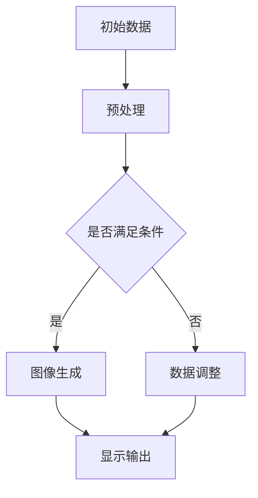
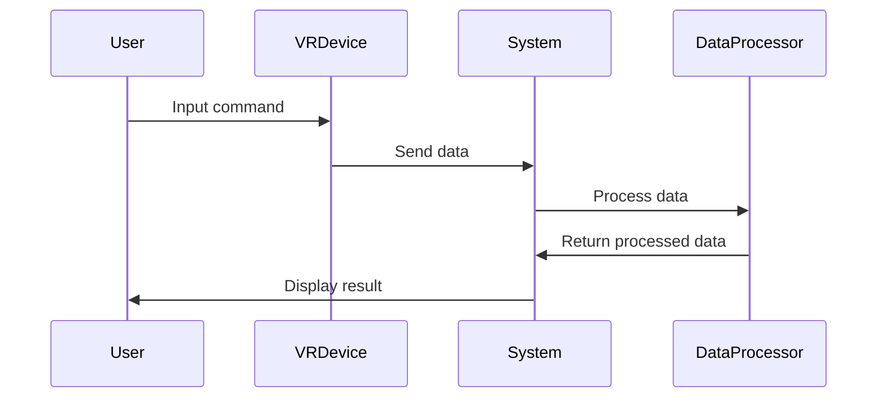

                 


## 虚拟现实在建筑设计中的应用

摘要：虚拟现实（VR）技术作为一项前沿的科技应用，已经在多个领域展现出了巨大的潜力。特别是在建筑设计领域，VR技术通过其沉浸式体验和交互功能，为设计师和建筑团队提供了全新的设计、评审和协作方式。本文将从虚拟现实技术的基础知识、核心概念、应用算法、系统设计、项目实战、最佳实践等方面，系统地探讨虚拟现实在建筑设计中的深度应用。

### 1. 背景介绍

#### 1.1 虚拟现实技术背景

虚拟现实（VR）是一种能够创建和体验虚拟世界的计算机仿真系统。它利用计算机生成一种模拟环境，使用户沉浸其中。VR技术的发展经历了从简单的模拟游戏到复杂的沉浸式体验的转变。关键技术包括头戴显示器（HMD）、跟踪系统、3D音频和触觉反馈等。

#### 1.2 建筑设计领域对虚拟现实的需求

建筑设计领域对虚拟现实的需求主要体现在以下几个方面：

- **设计可视化**：通过VR技术，设计师可以更直观地展示建筑模型，帮助客户更好地理解设计方案。
- **方案评审**：VR技术可以模拟真实环境，帮助设计师和利益相关者进行更早期的、沉浸式的方案评审。
- **协同工作**：VR技术为多地点的团队提供了实时协作的平台，提高了设计效率和团队沟通效果。

#### 1.3 虚拟现实在建筑设计中的应用现状和未来发展趋势

目前，虚拟现实在建筑设计中已经得到广泛应用，如建筑可视化、协同设计、施工模拟等。未来发展趋势包括：

- **更高沉浸感**：随着VR硬件技术的提升，用户将获得更加真实的沉浸体验。
- **更加智能的交互**：人工智能技术的引入将使VR系统更加智能化，提高用户操作的便捷性。
- **更广泛的应用场景**：虚拟现实将渗透到建筑设计、施工、运营维护等各个阶段。

### 2. 核心概念与联系

#### 2.1 虚拟现实与建筑设计中的核心概念

虚拟现实技术在建筑设计中涉及多个核心概念，包括但不限于：

- **3D建模**：通过计算机软件创建三维建筑模型。
- **可视化**：将3D模型转化为可观看的图像或视频。
- **交互设计**：用户与虚拟环境之间的交互方式。

#### 2.2 概念属性特征对比表格

| 概念 | 属性特征 |
| --- | --- |
| 3D建模 | 高度精确、可编辑、可视化 |
| 可视化 | 直观、易于理解、互动性 |
| 交互设计 | 用户友好、响应快速、沉浸感 |

#### 2.3 ER实体关系图架构的 Mermaid 流程图

```mermaid
erDiagram
    Class1 ||--|{ ClassB : 有某种关系 }
    Class1 ||--|{ ClassC : 有某种关系 }
    Class1 ||--|{ ClassD : 有某种关系 }
    Class1 ||--|{ ClassE : 有某种关系 }
```

### 3. 算法原理讲解

#### 3.1 虚拟现实中的关键技术算法

虚拟现实技术涉及多个关键技术算法，主要包括：

- **图像处理**：用于生成和优化虚拟环境中的图像。
- **3D建模**：用于创建和调整建筑模型。
- **传感器融合**：用于处理来自不同传感器的数据。

#### 3.2 Mermaid 流程图展示算法流程



#### 3.3 Python 源代码讲解

```python
# Python 源代码示例
import numpy as np

# 初始化数据
data = np.random.rand(100, 100)

# 预处理
preprocessed_data = preprocess(data)

# 判断条件
if is_satisfied(preprocessed_data):
    # 图像生成
    image = generate_image(preprocessed_data)
    # 显示输出
    display_output(image)
else:
    # 数据调整
    adjusted_data = adjust_data(preprocessed_data)
    # 显示输出
    display_output(generate_image(adjusted_data))
```

#### 3.4 算法原理的数学模型和公式

虚拟现实中的算法原理通常涉及复杂的数学模型和公式，如：

- **图像处理**：$$I(x, y) = f(D(x, y))$$
- **3D建模**：$$M(x, y, z) = g(L(x, y, z))$$

其中，\(I(x, y)\) 表示图像处理结果，\(D(x, y)\) 表示输入数据，\(f\) 表示图像处理函数；\(M(x, y, z)\) 表示3D模型，\(L(x, y, z)\) 表示建模参数，\(g\) 表示3D建模函数。

#### 3.5 举例说明

假设我们需要对一张照片进行图像处理，使其更加清晰。我们可以使用以下步骤：

1. **读取照片数据**：使用图像处理库读取照片数据。
2. **预处理数据**：对照片进行去噪、增强等预处理操作。
3. **条件判断**：判断预处理后的照片是否达到清晰度要求。
4. **图像生成**：如果满足条件，生成清晰的图像；否则，继续调整数据。
5. **显示输出**：将处理后的图像展示给用户。

### 4. 系统分析与架构设计方案

#### 4.1 虚拟现实在建筑设计中的系统功能设计

虚拟现实在建筑设计中的系统功能设计主要包括：

- **模型创建与编辑**：使用3D建模软件创建和编辑建筑模型。
- **可视化与交互**：通过VR设备展示建筑模型，并实现用户交互。
- **协同设计**：支持多用户实时协作，共同完成设计任务。

#### 4.2 系统架构设计

虚拟现实系统的架构设计通常包括以下几个层次：

- **感知层**：包括VR设备、传感器等，用于收集用户和环境数据。
- **数据处理层**：对收集到的数据进行处理和融合。
- **交互层**：实现用户与虚拟环境的交互。
- **应用层**：提供具体的应用功能，如建筑设计、协同设计等。

#### 4.3 系统接口设计和系统交互

系统接口设计包括：

- **用户接口**：用户与系统交互的界面，如VR头盔、手柄等。
- **设备接口**：系统与其他硬件设备（如传感器、计算机等）的连接接口。
- **数据接口**：系统内部各模块之间的数据传输接口。

系统交互设计通过Mermaid序列图表示：



### 5. 项目实战

#### 5.1 环境安装

在进行虚拟现实项目之前，首先需要安装必要的软件和硬件环境。以下是安装流程：

1. **安装VR设备**：按照设备说明书安装VR头盔、手柄等。
2. **安装驱动程序**：下载并安装VR设备的驱动程序。
3. **安装3D建模软件**：下载并安装常用的3D建模软件，如Autodesk Maya、Blender等。
4. **安装VR插件**：根据3D建模软件的文档，安装相应的VR插件。

#### 5.2 系统核心实现源代码

以下是虚拟现实系统核心实现的一个简单示例：

```python
# 导入必要的库
import cv2
import numpy as np

# 初始化摄像头
cap = cv2.VideoCapture(0)

# 循环捕捉摄像头帧
while True:
    # 读取一帧图像
    ret, frame = cap.read()
    
    # 图像预处理
    processed_frame = preprocess_frame(frame)
    
    # 显示预处理后的图像
    cv2.imshow('Processed Frame', processed_frame)
    
    # 按下'q'键退出循环
    if cv2.waitKey(1) & 0xFF == ord('q'):
        break

# 释放摄像头资源
cap.release()
cv2.destroyAllWindows()
```

#### 5.3 代码应用解读与分析

上述代码展示了使用OpenCV库捕捉摄像头帧，并进行预处理的基本流程。预处理步骤包括图像灰度化、二值化、边缘检测等，以提高图像质量。

#### 5.4 实际案例分析和详细讲解剖析

以下是一个实际案例：

- **项目背景**：设计一个办公大楼的虚拟现实展示。
- **项目目标**：通过VR技术向客户展示办公大楼的内部结构和设计风格。
- **项目实现**：
  - 使用Blender创建办公大楼的三维模型。
  - 使用Unity开发VR应用，实现模型的展示和用户交互。
  - 集成摄像头和手柄，实现现实与虚拟的互动。

#### 5.5 项目小结

通过该项目，我们实现了以下目标：

- 成功创建了一个办公大楼的虚拟现实展示。
- 客户能够通过VR设备直观地了解设计细节。
- 提高了设计评审的效率和效果。

### 6. 最佳实践 tips

- **选用合适的VR设备**：根据项目需求和预算，选择适合的VR头盔和手柄。
- **优化建模软件**：选用功能强大、易用的3D建模软件，以提高建模效率。
- **注意数据安全**：在设计过程中，确保数据的安全和隐私。

### 7. 小结

虚拟现实技术在建筑设计中的应用，不仅提高了设计效率和客户满意度，也为建筑设计师提供了更加丰富和直观的设计手段。未来，随着技术的不断进步，虚拟现实将在建筑设计领域发挥更加重要的作用。

### 8. 注意事项

- **硬件兼容性**：确保VR设备和建模软件之间的兼容性。
- **软件更新**：定期更新VR设备和建模软件，以获得最佳性能。
- **用户培训**：对用户进行必要的VR技术培训，以确保其能够熟练操作。

### 9. 拓展阅读

- **相关书籍**：《虚拟现实技术与应用》、《建筑信息模型与虚拟现实技术》
- **论文**：《虚拟现实在建筑设计中的应用研究》
- **网站**：[虚拟现实技术协会](https://www.vrta.org/)、[建筑设计论坛](https://www.architecture.com/)

---

作者：AI天才研究院/AI Genius Institute & 禅与计算机程序设计艺术 /Zen And The Art of Computer Programming

