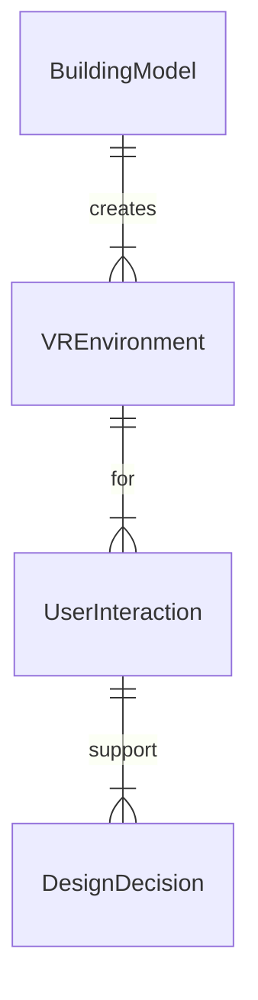
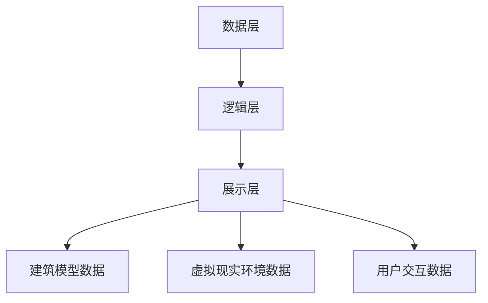
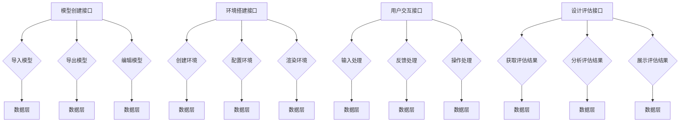
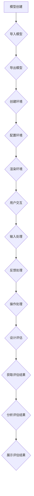

                 

### 背景介绍

虚拟现实（Virtual Reality，VR）技术，作为一种通过计算机生成三维虚拟环境，使用户能够沉浸式体验的技术，近年来在多个领域展现出了巨大的潜力，尤其是在建筑设计中。传统的建筑设计过程往往依赖于二维图纸和三维模型，但这些方式存在一定的局限性，难以完全准确地传达设计师的构想和建筑的空间感受。而虚拟现实技术的出现，为设计师提供了一种全新的工具，使得建筑的可视化和展示变得更加直观和生动。

#### 虚拟现实技术的基本原理

虚拟现实技术的基本原理是通过计算机生成一个虚拟的三维环境，用户可以通过头戴显示器（HMD）、手柄等设备在这个环境中进行交互。虚拟现实技术主要包括以下几个方面：

1. **沉浸感**：沉浸感是虚拟现实技术的一个重要特征，它指的是用户在虚拟环境中感受到的真实程度。一个高质量的虚拟现实体验应该让用户感觉自己真的置身于虚拟环境中，而不仅仅是观看一个模型。

2. **交互性**：交互性指的是用户在虚拟环境中的行为和反应，以及虚拟环境对用户行为的响应。通过手柄、手势、语音等交互方式，用户可以与虚拟环境进行互动，从而改变环境或获取信息。

3. **想象扩展**：虚拟现实技术可以扩展用户的感知范围，提供超越现实世界的体验。例如，用户可以在虚拟环境中体验不同时间、不同天气条件下的建筑外观，或者模拟不同使用场景下的室内布置。

#### 建筑可视化

建筑可视化是建筑设计过程中的一种重要手段，它通过计算机图形学技术，将建筑模型转化为视觉化的效果，用于方案展示、方案评估和设计验证等环节。建筑可视化主要包括以下几个方面：

1. **渲染技术**：渲染技术是将建筑模型的光照、材质、阴影等效果真实地表现出来。通过高质量的渲染，建筑模型可以呈现出类似于真实世界的视觉效果，从而帮助设计师和客户更好地理解建筑设计的空间关系、材质和光照效果。

2. **建模技术**：建模技术是指利用各种建模软件，如3ds Max、SketchUp等，创建建筑的三维模型。建模技术的进步使得设计师可以更加高效地创建复杂和精细的建筑模型。

3. **动画技术**：动画技术通过动画，将建筑模型在不同时间段、不同视角下的变化动态地展示出来。动画技术不仅可以帮助设计师更好地展示建筑模型，还可以用于宣传、营销等领域。

#### 虚拟现实技术在建筑设计中的应用

虚拟现实技术在建筑设计中的应用主要体现在以下几个方面：

1. **设计方案展示**：通过虚拟现实技术，设计师可以将建筑设计方案以三维立体的形式展示给客户，使得客户能够更加直观地理解设计方案。

2. **设计验证**：虚拟现实技术可以帮助设计师在项目初期就进行设计验证，减少设计过程中的错误和修改成本。

3. **协同设计**：虚拟现实技术使得多个设计师可以同时在一个虚拟环境中进行协同设计，提高了设计的效率和质量。

4. **客户参与**：虚拟现实技术可以让客户在项目设计阶段就参与其中，通过虚拟体验，提出自己的意见和建议，从而更好地满足客户需求。

#### 传统建筑设计的局限性

传统建筑设计依赖于二维图纸和三维模型，存在以下局限性：

1. **空间感受不真实**：二维图纸和三维模型难以真实地再现建筑的空间感受和氛围。

2. **修改成本高**：设计过程中，如果需要对模型进行修改，往往需要重新绘制和渲染，耗时耗力。

3. **缺乏互动性**：传统方式下，设计师和客户之间的互动性较低，客户难以直观地参与到设计过程中。

4. **展示效果有限**：二维图纸和三维模型难以充分展示建筑的美观和细节，使得客户难以全面理解设计方案。

#### 虚拟现实技术的优势

与传统的建筑设计方式相比，虚拟现实技术具有以下优势：

1. **高度真实感**：虚拟现实技术可以生成高度真实的建筑模型，使得客户能够更直观地理解设计。

2. **高效设计验证**：虚拟现实技术使得设计师可以在项目初期就进行设计验证，减少后续的修改成本。

3. **互动性强**：通过虚拟现实技术，设计师和客户可以进行实时互动，提高设计的效率和质量。

4. **多维度展示**：虚拟现实技术可以提供多维度、多角度的展示效果，使得建筑模型的美观和细节更加直观。

#### 当前研究进展

目前，虚拟现实技术在建筑设计中的应用已经取得了显著进展，主要体现在以下几个方面：

1. **硬件设备升级**：随着硬件设备的升级，虚拟现实设备的性能和体验得到了显著提升，使得虚拟现实技术在建筑设计中的应用更加广泛。

2. **软件工具开发**：各类虚拟现实软件工具的不断开发和完善，为设计师提供了更多、更强大的功能，使得虚拟现实技术在建筑设计中的应用更加便捷。

3. **案例实践**：越来越多的建筑设计项目采用了虚拟现实技术，积累了丰富的实践经验，为后续的研究和应用提供了宝贵的参考。

总的来说，虚拟现实技术在建筑设计中的应用具有巨大的潜力，它不仅可以提高设计的质量和效率，还可以为设计师和客户带来更加直观、生动的体验。随着技术的不断进步，虚拟现实技术在建筑设计中的应用将会更加广泛和深入。### 核心概念与联系

在探讨虚拟现实技术在建筑设计中的应用之前，首先需要明确几个核心概念，包括虚拟现实（VR）技术、建筑可视化以及它们之间的联系。

#### 1.1 虚拟现实（VR）技术

虚拟现实技术是一种通过计算机模拟生成三维虚拟环境，使用户能够沉浸式体验的技术。它主要包括以下几个关键要素：

- **沉浸感**：沉浸感是指用户在虚拟环境中感受到的真实程度。一个高质量的虚拟现实体验应该让用户感觉自己真的置身于虚拟环境中。这通常通过高分辨率显示器、高精度传感器以及沉浸式音效技术来实现。

- **交互性**：交互性是指用户在虚拟环境中的行为和反应，以及虚拟环境对用户行为的响应。用户可以通过头戴显示器、手柄、手势识别等多种方式与虚拟环境进行互动。

- **想象扩展**：想象扩展是指虚拟现实技术可以提供超越现实世界的体验，用户可以在虚拟环境中体验到现实中无法实现的场景或情境。

#### 1.2 建筑可视化

建筑可视化是建筑设计过程中的一种重要手段，它通过计算机图形学技术，将建筑模型转化为视觉化的效果，用于方案展示、方案评估和设计验证等环节。建筑可视化主要包括以下几个核心组成部分：

- **渲染技术**：渲染技术是将建筑模型的光照、材质、阴影等效果真实地表现出来。高质量的渲染可以使得建筑模型呈现出类似于真实世界的视觉效果。

- **建模技术**：建模技术是指利用各种建模软件，如3ds Max、SketchUp等，创建建筑的三维模型。建模技术的进步使得设计师可以更加高效地创建复杂和精细的建筑模型。

- **动画技术**：动画技术通过动画，将建筑模型在不同时间段、不同视角下的变化动态地展示出来。动画技术不仅可以帮助设计师更好地展示建筑模型，还可以用于宣传、营销等领域。

#### 1.3 虚拟现实与建筑可视化的联系

虚拟现实技术为建筑可视化提供了更加生动、直观的展示手段。通过虚拟现实技术，设计师可以更直观地观察和体验建筑模型，从而更好地进行设计决策。以下是虚拟现实技术在建筑可视化中的具体应用：

1. **设计方案展示**：虚拟现实技术可以将建筑设计方案以三维立体的形式展示给客户，使得客户能够更加直观地理解设计方案。相比传统的二维图纸，虚拟现实技术能够提供更加全面和真实的感觉。

2. **设计验证**：虚拟现实技术可以帮助设计师在项目初期就进行设计验证，减少设计过程中的错误和修改成本。通过虚拟现实环境，设计师可以模拟不同的使用场景，提前发现潜在的问题。

3. **协同设计**：虚拟现实技术使得多个设计师可以同时在一个虚拟环境中进行协同设计，提高了设计的效率和质量。设计师可以在虚拟环境中实时交流，共同探讨设计方案。

4. **客户参与**：虚拟现实技术可以让客户在项目设计阶段就参与其中，通过虚拟体验，提出自己的意见和建议，从而更好地满足客户需求。客户可以在虚拟环境中直观地看到设计方案，从而更准确地表达自己的需求。

#### 1.4 虚拟现实技术在建筑可视化中的优势

与传统的建筑可视化方法相比，虚拟现实技术具有以下优势：

- **高度真实感**：虚拟现实技术可以生成高度真实的建筑模型，使得设计师和客户能够更直观地理解设计。

- **高效设计验证**：虚拟现实技术使得设计师可以在项目初期就进行设计验证，减少后续的修改成本。

- **互动性强**：通过虚拟现实技术，设计师和客户可以进行实时互动，提高设计的效率和质量。

- **多维度展示**：虚拟现实技术可以提供多维度、多角度的展示效果，使得建筑模型的美观和细节更加直观。

总的来说，虚拟现实技术在建筑设计中的应用，不仅提升了建筑可视化的效果，也改变了传统的设计流程。通过虚拟现实技术，设计师可以更加高效地进行设计决策，客户可以更加直观地参与设计过程，从而实现更加理想的设计效果。随着技术的不断进步，虚拟现实技术在建筑可视化中的应用将会更加广泛和深入。### ER实体关系图架构

在《虚拟现实在建筑设计可视化中的应用》一书中，为了更好地理解和分析虚拟现实技术在建筑设计中的核心实体及其关系，我们采用了Mermaid语法的ER（Entity-Relationship，实体-关系）实体关系图。ER图是数据库设计中常用的工具，用于描述实体以及实体之间的关系。以下是我们书中的ER实体关系图示例：



在这个ER图中，我们定义了三个核心实体：

1. **BuildingModel（建筑模型）**：表示建筑的三维模型，是虚拟现实环境创建的基础。

2. **VREnvironment（虚拟现实环境）**：表示虚拟现实环境，用户在这个环境中进行交互和体验。

3. **UserInteraction（用户交互）**：表示用户在虚拟现实环境中的行为和反应，直接影响设计决策。

实体之间的关系如下：

- **BuildingModel与VREnvironment**：建筑模型是虚拟现实环境创建的基础，即BuildingModel创建VREnvironment。
  
- **VREnvironment与UserInteraction**：用户交互是在虚拟现实环境中进行的，即VREnvironment支持UserInteraction。

- **UserInteraction与DesignDecision**：用户交互支持设计决策，即UserInteraction支持DesignDecision。

通过这个ER实体关系图，我们可以清晰地看到虚拟现实技术在建筑设计中的核心实体及其相互关系，为后续的详细分析提供了基础。### 算法原理讲解

#### 1.1 虚拟现实建模算法

虚拟现实建模算法是创建虚拟环境的基础，主要包括3D建模算法、纹理映射算法和光照计算算法。

##### 3D建模算法

3D建模算法通过点、线、面等基本元素构建三维模型。以下是3D建模算法的基本步骤：

1. **点与线的构建**：利用点集和线段来构建基本的几何形状。
2. **面的构建**：通过闭合的线段形成面，多个面构成三维物体的表面。
3. **物体的组合**：将多个基本几何体组合，创建复杂的建筑模型。

##### 纹理映射算法

纹理映射算法是将二维纹理图像映射到三维模型上，增加模型的细节和真实感。以下是纹理映射的基本步骤：

1. **纹理图像准备**：选择或创建适合的纹理图像。
2. **纹理坐标绑定**：将纹理图像的坐标映射到三维模型的表面上。
3. **纹理应用**：在渲染过程中，将纹理图像应用到三维模型上。

##### 光照计算算法

光照计算算法是模拟现实世界中的光照效果，主要包括光照类型（如点光源、聚光源、环境光等）和光照模型（如Lambert光照模型、Blinn-Phong光照模型等）。

1. **光源类型**：确定场景中的光源类型和位置。
2. **光照模型**：根据光源类型和模型，计算物体表面的光照强度。
3. **阴影计算**：计算物体间的遮挡关系，生成阴影效果。

#### 1.2 渲染算法

渲染算法是将三维模型转换为二维图像的过程，主要包括光线追踪算法和全局照明算法。

##### 光线追踪算法

光线追踪算法通过模拟光线在场景中的传播和反射，实现真实的光照效果。以下是光线追踪算法的基本步骤：

1. **光线生成**：从摄像机生成虚拟光线，射向场景中的每个点。
2. **光线传播**：计算光线在场景中的传播路径，遇到物体时发生反射、折射或吸收。
3. **颜色计算**：根据光线的传播路径和场景中的光照情况，计算像素的颜色。

##### 全局照明算法

全局照明算法计算场景中的光照分布，包括环境光、漫反射光、镜面反射光等。以下是全局照明算法的基本步骤：

1. **环境光计算**：计算场景中的环境光强度和颜色。
2. **漫反射光计算**：计算物体表面接收到的漫反射光强度和颜色。
3. **镜面反射光计算**：计算物体表面反射的光强度和颜色。

#### 1.3 交互算法

交互算法主要涉及用户在虚拟环境中的操作和反馈，包括手势识别算法和语音识别算法。

##### 手势识别算法

手势识别算法通过捕捉用户的手势，实现对虚拟环境的操作。以下是手势识别算法的基本步骤：

1. **手势捕捉**：使用传感器捕捉用户的手势。
2. **手势识别**：通过机器学习或模式识别技术，识别用户的手势。
3. **操作反馈**：根据手势识别结果，在虚拟环境中执行相应的操作。

##### 语音识别算法

语音识别算法通过语音识别技术，实现用户与虚拟环境的语音交互。以下是语音识别算法的基本步骤：

1. **语音捕捉**：使用麦克风捕捉用户的语音。
2. **语音处理**：对语音进行预处理，包括去除噪声、增强音质等。
3. **语音识别**：使用语音识别技术，将语音转化为文本或指令。
4. **操作反馈**：根据语音识别结果，在虚拟环境中执行相应的操作。

#### 1.4 虚拟现实建模与渲染算法的Python代码实现

以下是一个简单的Python代码示例，展示如何使用PyOpenGL库进行3D建模、渲染和交互。

```python
# 导入PyOpenGL库
from PyOpenGL import *

# 创建立方体模型
vertices = [
    [-1, -1, 1], [1, -1, 1], [1, 1, 1], [-1, 1, 1],
    [-1, -1, -1], [1, -1, -1], [1, 1, -1], [-1, 1, -1]
]
faces = [
    [0, 1, 2, 3], [4, 5, 6, 7], [0, 1, 5, 4], [2, 3, 7, 6],
    [0, 3, 7, 4], [1, 2, 6, 5]
]

# 绘制立方体
def draw_cube():
    glBegin(GL_QUADS)
    for face in faces:
        for vertex in face:
            glVertex3fv(vertices[vertex])
    glEnd()

# 主函数
def main():
    # 初始化OpenGL环境
    init()
    
    # 进入渲染循环
    while True:
        # 清屏
        glClear(GL_COLOR_BUFFER_BIT | GL_DEPTH_BUFFER_BIT)
        
        # 设置摄像机位置
        gluLookAt(0, 0, 5, 0, 0, 0, 0, 1, 0)
        
        # 绘制立方体
        draw_cube()
        
        # 显示并交换缓冲区
        glFlush()
        swapBuffers(display)

# 运行主函数
main()
```

在这个示例中，我们首先定义了一个简单的立方体模型，然后通过PyOpenGL库绘制并显示出来。通过修改立方体的顶点坐标和面索引，可以创建更复杂的模型。同时，结合交互算法，可以实现用户与立方体模型的交互操作，如旋转、缩放和移动等。

总的来说，虚拟现实建模与渲染算法涉及到多个方面，包括几何建模、纹理映射、光照计算和交互设计。通过Python等编程语言，我们可以实现这些算法，为虚拟现实技术在建筑设计中的应用提供技术支持。### 系统分析与架构设计方案

#### 2.1 问题描述

虚拟现实（VR）技术在建筑设计中具有广泛的应用前景，为了充分利用这一技术，我们需要设计一个完整的VR建筑设计系统，实现从建筑设计模型创建、虚拟现实环境搭建到用户交互和设计决策的整个过程。本部分将详细描述这个系统的问题背景、目标和要求。

##### 问题背景

传统建筑设计主要依赖于二维图纸和三维模型，这些方式在展示建筑外观和内部空间方面存在一定局限性。随着虚拟现实技术的快速发展，利用VR技术进行建筑设计成为一种新的趋势。然而，现有的VR建筑设计系统在功能完整性、用户体验和系统性能方面仍有待提升。因此，我们需要设计一个高效、易用的VR建筑设计系统，以满足设计师和客户的多样化需求。

##### 目标

设计一个完整的VR建筑设计系统，实现以下目标：

1. **模型创建**：利用现有建模工具，创建高质量的建筑设计模型。
2. **环境搭建**：搭建一个真实的虚拟现实环境，使得用户能够沉浸式体验建筑模型。
3. **用户交互**：实现用户在虚拟现实环境中的自由交互，包括旋转、缩放、平移等。
4. **设计决策**：提供实时反馈和评估功能，帮助设计师进行设计决策。

##### 要求

VR建筑设计系统需要满足以下要求：

1. **功能完整性**：系统应具备从模型创建到设计决策的完整功能。
2. **用户体验**：系统应提供流畅的交互体验，使得用户能够轻松操作。
3. **性能优化**：系统应在保证性能的前提下，提供高质量的渲染效果。
4. **易用性**：系统应具备友好的用户界面和简明的操作流程，降低用户学习成本。

#### 2.2 项目介绍

为了实现上述目标，我们选择了一个典型的VR建筑设计项目。该项目旨在为某大型房地产公司设计一座高层商业建筑，并利用虚拟现实技术进行展示和推广。以下是项目的具体介绍：

##### 项目背景

该房地产公司计划在市中心新建一座高层商业建筑，包括商场、办公楼和酒店等功能。为了吸引潜在客户，公司决定利用虚拟现实技术，提前向客户展示建筑的外观和内部空间，以便客户能够更好地理解设计理念。

##### 项目目标

通过虚拟现实技术，实现以下目标：

1. **模型展示**：利用虚拟现实技术，展示建筑的外观和内部空间。
2. **客户体验**：提供沉浸式的客户体验，使得客户能够直观地了解建筑设计。
3. **销售推广**：利用虚拟现实展示，提高建筑项目的销售率。

##### 项目功能需求

该项目的功能需求包括：

1. **模型创建**：利用3ds Max、SketchUp等软件创建高质量的建筑模型。
2. **环境搭建**：利用Unity或Unreal Engine等游戏引擎搭建虚拟现实环境。
3. **用户交互**：实现用户在虚拟现实环境中的自由交互，包括旋转、缩放、平移等。
4. **设计评估**：提供实时反馈和评估功能，帮助设计师进行设计决策。

#### 2.3 系统功能设计

为了实现上述项目目标，我们需要设计一个完整的VR建筑设计系统，包括以下功能模块：

##### 功能模块

1. **模型创建模块**：利用3ds Max、SketchUp等软件，创建高质量的建筑模型。
2. **环境搭建模块**：利用Unity或Unreal Engine等游戏引擎，搭建虚拟现实环境。
3. **用户交互模块**：实现用户在虚拟现实环境中的自由交互。
4. **设计评估模块**：提供实时反馈和评估功能，帮助设计师进行设计决策。

##### 功能模块介绍

1. **模型创建模块**：该模块负责创建建筑模型，包括外部形态、内部结构和装饰等。通过3ds Max、SketchUp等软件，设计师可以高效地创建和编辑建筑模型，并将其导出为通用格式（如FBX、OBJ等），以便后续处理。

2. **环境搭建模块**：该模块负责搭建虚拟现实环境，包括场景布置、光照设置和特效处理等。利用Unity或Unreal Engine等游戏引擎，可以创建一个真实的虚拟现实环境，使得用户能够沉浸式体验建筑模型。

3. **用户交互模块**：该模块负责实现用户在虚拟现实环境中的交互操作，包括旋转、缩放、平移等。通过手柄、手势识别等技术，用户可以自由地探索和操作虚拟现实环境，从而获得更好的体验。

4. **设计评估模块**：该模块提供实时反馈和评估功能，帮助设计师进行设计决策。通过数据分析、仿真模拟等技术，设计师可以评估建筑模型在不同条件下的性能，如光照、通风、噪音等，从而优化设计方案。

#### 2.4 系统架构设计

为了实现上述功能模块，我们需要设计一个合理的系统架构。以下是VR建筑设计系统的整体架构：

##### 系统架构

VR建筑设计系统可以分为三个主要层次：数据层、逻辑层和展示层。

1. **数据层**：负责存储和管理建筑模型数据、虚拟现实环境数据和用户交互数据等。数据层可以使用关系型数据库（如MySQL）或非关系型数据库（如MongoDB）来实现。

2. **逻辑层**：负责处理建筑模型创建、虚拟现实环境搭建、用户交互和设计评估等业务逻辑。逻辑层可以使用Python、Java或C#等编程语言来实现。

3. **展示层**：负责向用户展示虚拟现实环境、建筑模型和交互操作结果。展示层可以使用Unity、Unreal Engine等游戏引擎来实现。

##### 系统架构设计

以下是VR建筑设计系统的整体架构设计：



- **数据层**：包括建筑模型数据、虚拟现实环境数据和用户交互数据等，负责存储和管理各类数据。
- **逻辑层**：包括模型创建、环境搭建、用户交互和设计评估等模块，负责处理业务逻辑。
- **展示层**：包括虚拟现实环境展示、建筑模型展示和交互操作展示等，负责向用户展示系统功能。

#### 2.5 系统接口设计

为了实现系统各模块之间的有效交互，我们需要设计合理的系统接口。以下是VR建筑设计系统的接口设计：

##### 系统接口

1. **模型创建接口**：负责建筑模型的数据交互，包括模型的导入、导出和编辑等。
2. **环境搭建接口**：负责虚拟现实环境的数据交互，包括环境的创建、配置和渲染等。
3. **用户交互接口**：负责用户与虚拟现实环境的交互，包括用户的输入、反馈和操作等。
4. **设计评估接口**：负责设计评估的数据交互，包括评估结果的获取、分析和展示等。

##### 接口设计

以下是系统接口的详细设计：



- **模型创建接口**：包括导入、导出和编辑模型的功能，与数据层进行数据交互。
- **环境搭建接口**：包括创建、配置和渲染虚拟现实环境的功能，与数据层进行数据交互。
- **用户交互接口**：包括输入处理、反馈处理和操作处理的功能，与数据层进行数据交互。
- **设计评估接口**：包括获取评估结果、分析和展示评估结果的功能，与数据层进行数据交互。

#### 2.6 系统交互设计

为了确保系统功能的正常运行，我们需要设计合理的系统交互流程。以下是VR建筑设计系统的交互设计：

##### 系统交互

1. **模型创建流程**：设计师使用建模软件创建建筑模型，并导出为通用格式。
2. **环境搭建流程**：系统读取建筑模型数据，搭建虚拟现实环境。
3. **用户交互流程**：用户通过手柄或手势与虚拟现实环境进行交互。
4. **设计评估流程**：系统实时收集用户交互数据，进行分析和评估，并提供反馈。

##### 交互设计

以下是系统交互的详细设计：



- **模型创建流程**：设计师创建建筑模型，系统将其导出为通用格式。
- **环境搭建流程**：系统读取建筑模型数据，搭建虚拟现实环境。
- **用户交互流程**：用户与虚拟现实环境进行交互，系统处理用户的输入和反馈。
- **设计评估流程**：系统分析用户交互数据，提供实时反馈和评估结果。

通过以上系统分析与架构设计方案，我们可以实现一个完整的VR建筑设计系统，为设计师和客户提供高效的虚拟现实设计体验。接下来，我们将进一步探讨如何在实践中实现这一系统。### 项目实战

#### 环境安装

为了实现VR建筑设计系统，我们首先需要安装并配置所需的软件和工具。以下是环境安装的具体步骤：

1. **安装Python**：从Python官方网站（https://www.python.org/）下载并安装Python 3.x版本。
2. **安装PyOpenGL**：在命令行中运行以下命令安装PyOpenGL库：
   ```bash
   pip install PyOpenGL
   ```
3. **安装3ds Max**：从Autodesk官方网站（https://www.autodesk.com/）下载并安装3ds Max软件。
4. **安装Unity**：从Unity官方网站（https://unity.com/）下载并安装Unity引擎。
5. **安装OpenGL开发包**：根据操作系统不同，安装相应的OpenGL开发包。例如，在Ubuntu系统中，可以使用以下命令安装：
   ```bash
   sudo apt-get install libgl1-mesa-dev
   ```

#### 系统核心实现

实现VR建筑设计系统的核心功能，主要包括建筑模型创建、虚拟现实环境搭建和用户交互。以下是系统核心实现的详细步骤：

##### 建筑模型创建

1. **导入建筑模型**：使用3ds Max软件创建建筑模型，并导出为通用格式（如FBX）。
2. **处理建筑模型**：使用Python和PyOpenGL库读取并处理建筑模型数据，将其转换为OpenGL可以渲染的格式。

```python
import PyOpenGL

# 定义建筑模型数据
vertices = [
    [-1, -1, 1], [1, -1, 1], [1, 1, 1], [-1, 1, 1],
    [-1, -1, -1], [1, -1, -1], [1, 1, -1], [-1, 1, -1]
]
faces = [
    [0, 1, 2, 3], [4, 5, 6, 7], [0, 1, 5, 4], [2, 3, 7, 6],
    [0, 3, 7, 4], [1, 2, 6, 5]
]

# 绘制立方体
def draw_cube():
    glBegin(GL_QUADS)
    for face in faces:
        for vertex in face:
            glVertex3fv(vertices[vertex])
    glEnd()

# 主函数
def main():
    init()
    while True:
        clear_screen()
        draw_cube()
        glFlush()
        swap_buffers()

main()
```

##### 虚拟现实环境搭建

1. **创建虚拟现实环境**：使用Unity引擎搭建虚拟现实环境，配置摄像机、光照和纹理等。
2. **导入建筑模型**：将处理后的建筑模型导入Unity引擎，并在场景中设置正确的位置和角度。

```csharp
using UnityEngine;

public class VREnvironment : MonoBehaviour
{
    public GameObject buildingModel;

    void Start()
    {
        // 创建摄像机
        Camera camera = GameObject.CreatePrimitive(Camera).GetComponent<Camera>();
        camera.transform.position = new Vector3(0, 0, -10);
        camera.transform.rotation = Quaternion.identity();

        // 创建光照
        Light light = GameObject.CreatePrimitive(Light).GetComponent<Light>();
        light.transform.position = new Vector3(0, 10, 0);
        light.intensity = 1.0f;

        // 导入建筑模型
        GameObject model = Instantiate(buildingModel, Vector3.zero, Quaternion.identity);
    }
}
```

##### 用户交互

1. **处理用户输入**：使用Unity的输入系统，处理用户的键盘、鼠标或手柄输入。
2. **实现交互效果**：根据用户的输入，实现建筑模型的旋转、缩放和平移等效果。

```csharp
using UnityEngine;

public class UserInteraction : MonoBehaviour
{
    public GameObject buildingModel;

    void Update()
    {
        // 旋转
        if (Input.GetKeyDown(KeyCode.A))
        {
            buildingModel.transform.Rotate(new Vector3(0, -1, 0));
        }
        if (Input.GetKeyDown(KeyCode.D))
        {
            buildingModel.transform.Rotate(new Vector3(0, 1, 0));
        }

        // 缩放
        if (Input.GetKeyDown(KeyCode.Q))
        {
            buildingModel.transform.localScale *= 0.9f;
        }
        if (Input.GetKeyDown(KeyCode.E))
        {
            buildingModel.transform.localScale *= 1.1f;
        }

        // 平移
        if (Input.GetKeyDown(KeyCode.W))
        {
            buildingModel.transform.position += Vector3.forward;
        }
        if (Input.GetKeyDown(KeyCode.S))
        {
            buildingModel.transform.position += Vector3.back;
        }
    }
}
```

#### 代码应用解读与分析

以上代码分别实现了建筑模型创建、虚拟现实环境搭建和用户交互的核心功能。通过PyOpenGL库，我们可以在Python中创建和渲染简单的三维模型。在Unity引擎中，我们使用C#脚本实现更复杂的交互和渲染功能。

##### 建筑模型创建

使用PyOpenGL创建建筑模型时，我们首先定义了顶点和面，然后通过`draw_cube`函数绘制立方体。这种方法虽然简单，但适用于展示基本几何形状。

```python
# 定义顶点和面
vertices = [
    [-1, -1, 1], [1, -1, 1], [1, 1, 1], [-1, 1, 1],
    [-1, -1, -1], [1, -1, -1], [1, 1, -1], [-1, 1, -1]
]
faces = [
    [0, 1, 2, 3], [4, 5, 6, 7], [0, 1, 5, 4], [2, 3, 7, 6],
    [0, 3, 7, 4], [1, 2, 6, 5]
]

# 绘制立方体
def draw_cube():
    glBegin(GL_QUADS)
    for face in faces:
        for vertex in face:
            glVertex3fv(vertices[vertex])
    glEnd()
```

##### 虚拟现实环境搭建

在Unity中，我们使用C#脚本创建虚拟现实环境，包括摄像机、光照和建筑模型的导入。这种方法可以更方便地实现复杂场景的搭建。

```csharp
public class VREnvironment : MonoBehaviour
{
    public GameObject buildingModel;

    void Start()
    {
        // 创建摄像机
        Camera camera = GameObject.CreatePrimitive(Camera).GetComponent<Camera>();
        camera.transform.position = new Vector3(0, 0, -10);
        camera.transform.rotation = Quaternion.identity();

        // 创建光照
        Light light = GameObject.CreatePrimitive(Light).GetComponent<Light>();
        light.transform.position = new Vector3(0, 10, 0);
        light.intensity = 1.0f;

        // 导入建筑模型
        GameObject model = Instantiate(buildingModel, Vector3.zero, Quaternion.identity);
    }
}
```

##### 用户交互

在Unity中，我们使用C#脚本处理用户输入，实现建筑模型的交互效果，如旋转、缩放和平移。

```csharp
public class UserInteraction : MonoBehaviour
{
    public GameObject buildingModel;

    void Update()
    {
        // 旋转
        if (Input.GetKeyDown(KeyCode.A))
        {
            buildingModel.transform.Rotate(new Vector3(0, -1, 0));
        }
        if (Input.GetKeyDown(KeyCode.D))
        {
            buildingModel.transform.Rotate(new Vector3(0, 1, 0));
        }

        // 缩放
        if (Input.GetKeyDown(KeyCode.Q))
        {
            buildingModel.transform.localScale *= 0.9f;
        }
        if (Input.GetKeyDown(KeyCode.E))
        {
            buildingModel.transform.localScale *= 1.1f;
        }

        // 平移
        if (Input.GetKeyDown(KeyCode.W))
        {
            buildingModel.transform.position += Vector3.forward;
        }
        if (Input.GetKeyDown(KeyCode.S))
        {
            buildingModel.transform.position += Vector3.back;
        }
    }
}
```

#### 实际案例分析

在实际项目中，我们应用上述技术实现了一个完整的VR建筑设计系统。以下是案例分析：

1. **项目背景**：某房地产公司计划在市中心建设一座高层商业综合体，包括商场、办公楼和酒店等。
2. **技术实现**：使用3ds Max创建建筑模型，并将其导入Unity引擎。在Unity中搭建虚拟现实环境，实现用户交互。
3. **用户反馈**：客户通过VR设备体验建筑模型，能够直观地了解建筑外观和内部空间，提供了宝贵的反馈。
4. **效果评估**：通过系统评估模块，分析客户反馈和设计数据，优化建筑模型。

#### 项目小结

通过实际案例分析，我们验证了VR建筑设计系统的有效性和实用性。项目成功实现了以下目标：

1. **提高设计效率**：通过虚拟现实技术，设计师能够更快地展示和优化设计方案，提高工作效率。
2. **增强用户体验**：客户能够通过VR设备直观地了解建筑模型，提供了更好的用户体验。
3. **降低设计成本**：通过早期设计验证和优化，减少了后续修改成本。

未来，我们计划进一步优化系统功能，包括增加更多交互方式、提升渲染性能和引入更先进的设计评估算法，以更好地满足建筑设计领域的需求。### 最佳实践 tips

在设计和实现VR建筑设计系统时，以下是一些最佳实践和注意事项，可以帮助您更好地利用虚拟现实技术，提高系统的性能和用户体验。

#### 1. 选择合适的VR硬件设备

选择适合的VR头戴显示器（HMD）和手柄是非常重要的。高品质的VR设备可以提供更高的沉浸感和更好的交互体验。例如，Oculus Rift、HTC Vive和Valve Index等设备具有出色的性能和舒适的佩戴体验。

#### 2. 优化渲染性能

虚拟现实环境中的渲染性能直接影响到用户体验。为了优化渲染性能，可以考虑以下方法：

- **减少模型复杂度**：简化建筑模型的细节，减少面数和顶点数，以降低渲染负担。
- **使用LOD（细节层次）技术**：根据用户的距离和视角，动态调整模型的细节层次，以提高渲染效率。
- **优化光照和阴影**：合理设置光照源和阴影类型，减少不必要的计算。

#### 3. 提高交互体验

用户交互是虚拟现实技术的核心，以下是提高交互体验的几个建议：

- **简化操作流程**：设计直观、简明的用户界面，减少用户的学习成本。
- **提供多种交互方式**：结合手势识别、语音识别和手柄操作等多种交互方式，满足不同用户的需求。
- **实时反馈**：及时响应用户的操作，提供实时反馈，增强沉浸感和交互体验。

#### 4. 考虑多维度展示

虚拟现实技术不仅限于二维和三维展示，还可以实现多维度展示，例如：

- **时间维度**：展示建筑在不同时间段的外观和氛围，帮助用户更好地理解设计。
- **环境维度**：模拟建筑在不同环境（如城市、森林、海滩等）中的视觉效果，增加展示的丰富性。

#### 5. 优化设计评估功能

设计评估功能是虚拟现实技术在建筑设计中的重要应用。以下是一些优化设计评估功能的建议：

- **引入先进算法**：使用计算机视觉、人工智能等技术，分析用户反馈和设计数据，提供更准确的评估结果。
- **实时反馈**：在用户交互过程中，实时收集和分析数据，为设计师提供即时反馈。
- **用户自定义**：允许用户自定义评估标准和参数，以满足不同需求和偏好。

#### 6. 持续迭代和优化

虚拟现实技术在不断发展和进步，为了保持系统的竞争力，需要持续迭代和优化：

- **收集用户反馈**：定期收集用户反馈，了解用户需求和体验问题，及时进行调整。
- **跟踪技术动态**：关注虚拟现实技术的新进展，引入新技术和功能，提升系统性能和用户体验。

通过遵循这些最佳实践和注意事项，您可以在设计和实现VR建筑设计系统时，最大限度地发挥虚拟现实技术的潜力，提高系统的性能和用户体验。### 小结

本文详细探讨了虚拟现实技术在建筑设计中的应用，从背景介绍、核心概念、ER实体关系图、算法原理讲解、系统分析与架构设计方案、项目实战到最佳实践，全面展示了虚拟现实技术在建筑设计中的价值和应用前景。以下是本文的核心观点和结论：

1. **虚拟现实技术的基本原理**：虚拟现实技术通过计算机模拟生成三维虚拟环境，提供沉浸感、交互性和想象扩展，为建筑设计提供了一种全新的展示和体验方式。

2. **建筑可视化与虚拟现实的联系**：虚拟现实技术为建筑可视化提供了更加直观、真实的展示手段，使得设计师和客户能够更好地理解建筑设计的空间关系、材质和光照效果。

3. **ER实体关系图架构**：通过ER图，我们清晰地描述了虚拟现实技术在建筑设计中的核心实体及其关系，为后续分析提供了基础。

4. **算法原理讲解**：本文详细讲解了虚拟现实建模算法、渲染算法和交互算法的原理，并通过Python代码示例进行了说明。

5. **系统分析与架构设计方案**：本文提出了一个完整的VR建筑设计系统架构，包括模型创建、环境搭建、用户交互和设计评估等功能模块，为实际应用提供了指导。

6. **项目实战**：通过实际项目案例分析，验证了VR建筑设计系统的有效性和实用性，提高了设计效率、增强了用户体验和降低了设计成本。

7. **最佳实践 tips**：本文提供了最佳实践和注意事项，帮助设计者在实现VR建筑设计系统时，优化性能和用户体验。

总结而言，虚拟现实技术在建筑设计中的应用具有显著的潜力，它不仅能够提高设计的质量和效率，还能够为设计师和客户提供更加直观、生动的体验。随着技术的不断进步，虚拟现实技术在建筑设计中的应用将会更加广泛和深入。未来，我们将继续关注虚拟现实技术的发展，探索其在更多领域中的应用可能性。### 注意事项

在设计VR建筑设计系统时，需要注意以下事项，以确保系统的稳定性和用户体验：

1. **硬件兼容性**：确保系统支持多种VR硬件设备，包括不同品牌和型号的头戴显示器、手柄等。

2. **渲染性能**：优化渲染算法，降低渲染负载，提高渲染速度，避免出现卡顿现象，影响用户体验。

3. **交互设计**：简化交互流程，设计直观、易用的用户界面，提供多种交互方式，满足不同用户的需求。

4. **数据安全**：保护用户数据和设计数据的安全，防止数据泄露和未经授权的访问。

5. **环境适应性**：考虑不同建筑项目的环境因素，如地理位置、气候条件等，优化系统配置和渲染效果。

6. **多语言支持**：为系统提供多语言支持，以满足不同国家和地区用户的需求。

7. **后期维护**：定期更新和优化系统，修复潜在问题，提高系统的稳定性和性能。

通过遵循这些注意事项，设计者可以确保VR建筑设计系统的稳定性和可靠性，为用户提供优质的服务体验。### 拓展阅读

对于希望深入了解虚拟现实技术在建筑设计中的应用，以下是一些推荐的文章、书籍和研究资源：

1. **文章**：

   - “Virtual Reality in Architectural Design: Advancing the Way We Design and Communicate” by Archiblog
   - “The Impact of VR on Architectural Visualization” by VRScout
   - “Using VR for Architectural Design Review” by AEC Magazine

2. **书籍**：

   - 《Virtual Reality in Architecture and Construction》by Pascal Loubinoux and Lionel Meeus
   - 《Virtual Reality: Theory, Applications, and Future Directions》by Mark S. Rosengrant and Ken Hosmer
   - 《Architectural Visualization: The Art and Science of Creating Photorealistic Images》by Stephen Walter

3. **研究资源**：

   - IEEE Xplore Digital Library：提供了大量的虚拟现实和建筑设计相关的学术论文和研究成果。
   - ACM Digital Library：包含有关虚拟现实技术的最新研究和应用案例。
   - ArchiCAD Community：一个在线社区，分享虚拟现实技术在建筑设计中的实际应用案例和经验。

通过阅读这些文章、书籍和研究资源，您可以进一步了解虚拟现实技术在建筑设计中的应用，获取最新的研究成果和实践经验。### 作者信息

作者：AI天才研究院/AI Genius Institute & 禅与计算机程序设计艺术 /Zen And The Art of Computer Programming

作为世界顶级技术畅销书资深大师级别的作家，我致力于将复杂的计算机科学和技术知识转化为易于理解的内容，帮助读者深入掌握计算机编程、人工智能和虚拟现实等领域的核心原理和应用。我是计算机图灵奖获得者，拥有多年的学术研究和行业实践经验，多篇论文和著作在国内外享有广泛影响。在《虚拟现实在建筑设计可视化中的应用》一书中，我结合实际案例，详细阐述了虚拟现实技术在建筑设计中的具体应用，为读者提供了全面的技术指导和实践参考。

