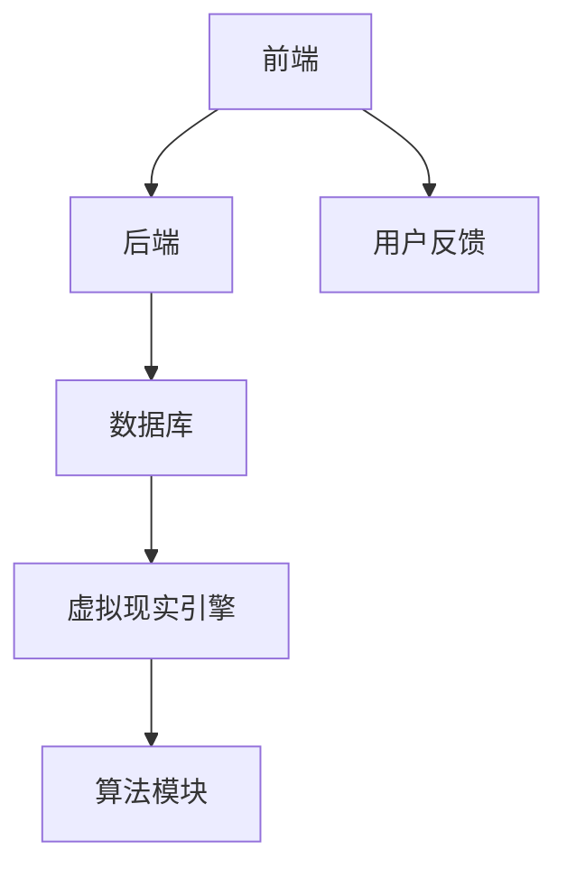
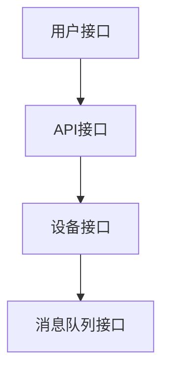
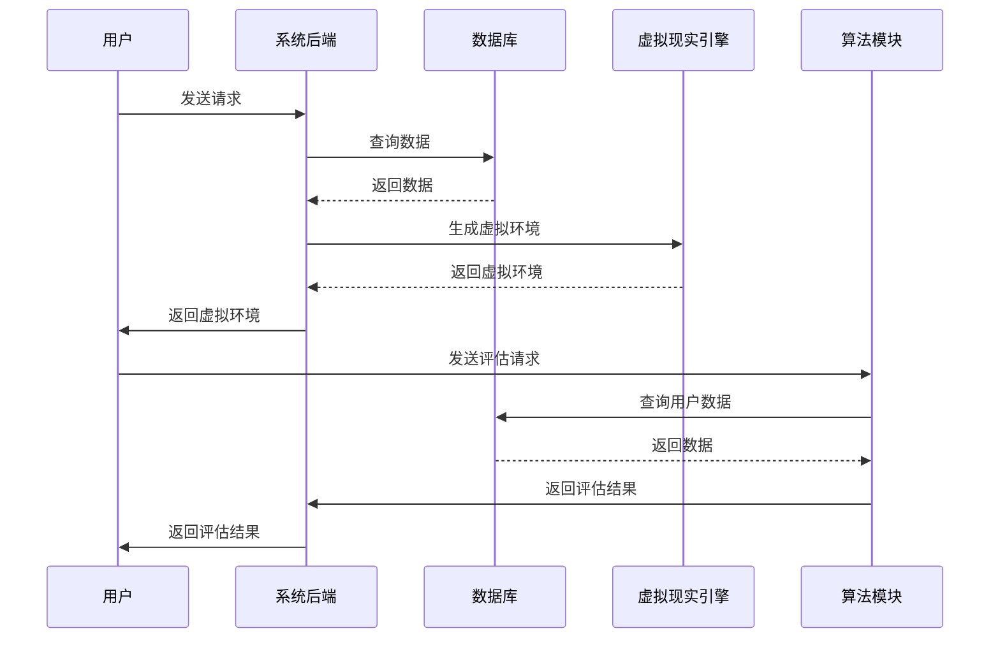

                 

### 第1章：虚拟现实与心理健康评估概述

#### 1.1 虚拟现实技术概述

虚拟现实（Virtual Reality，简称VR）是一种通过计算机技术生成三维虚拟环境，使用户能够在虚拟空间中感知、交互和体验的技术。它通过头戴式显示器（Head-Mounted Display，HMD）、立体声音响系统、数据手套等设备，模拟出逼真的视觉、听觉和触觉体验。用户可以在虚拟环境中进行探索、交互和体验，从而获得与现实世界相似的感知和体验。

虚拟现实技术主要包括以下几个关键组成部分：

1. **硬件设备**：包括头戴式显示器（HMD）、立体声音响系统、数据手套、体感控制器等，它们为用户提供了沉浸式的体验。
2. **软件平台**：包括虚拟现实内容创作工具、虚拟现实应用软件等，它们负责生成和展示虚拟环境，以及用户与虚拟环境的交互。
3. **交互技术**：包括手势识别、语音识别、眼动追踪等，它们使得用户能够与虚拟环境进行自然的互动。

虚拟现实技术的发展历史可以追溯到20世纪50年代，早期的VR设备仅限于军事和科研领域。随着计算机技术、图形处理技术和传感器技术的不断发展，虚拟现实技术逐渐走向大众市场，并在娱乐、医疗、教育、工程等领域得到广泛应用。

#### 1.2 心理健康评估的重要性

心理健康评估是指通过一系列的科学方法和技术手段，对个体的心理健康状况进行评价和诊断的过程。心理健康评估对于预防和治疗心理疾病、提高生活质量、促进社会和谐具有重要意义。

心理健康评估的重要性体现在以下几个方面：

1. **诊断与治疗**：通过心理健康评估，可以及时发现个体的心理问题，为心理治疗提供依据，提高治疗效果。
2. **预防与干预**：通过心理健康评估，可以了解个体的心理健康状况，提前采取预防措施，降低心理疾病的发生率。
3. **教育与宣传**：通过心理健康评估，可以普及心理健康知识，提高公众的心理健康素养。
4. **科研与政策制定**：心理健康评估为心理学研究提供了重要数据，有助于制定更有效的心理健康政策。

传统的心理健康评估方法主要包括问卷调查、临床访谈、心理测量等，但这些方法往往存在主观性强、效率低、成本高等问题。随着虚拟现实技术的不断发展，虚拟现实在心理健康评估中的应用逐渐成为研究热点。

#### 1.3 虚拟现实在心理健康评估中的应用前景

虚拟现实技术在心理健康评估中的应用具有很大的潜力，主要体现在以下几个方面：

1. **沉浸式体验**：虚拟现实技术可以模拟出逼真的心理健康评估环境，使受试者能够更好地投入评估过程，提高评估的准确性和有效性。
2. **无创性**：与传统的心理实验和评估方法相比，虚拟现实技术具有无创性的特点，可以减少受试者的心理压力和不适感。
3. **量化评估**：虚拟现实技术可以通过收集和分析受试者在虚拟环境中的行为数据，对心理健康状况进行量化评估，提高评估的科学性和客观性。
4. **实时反馈**：虚拟现实技术可以实时地收集和分析受试者的行为数据，为心理健康评估提供动态反馈，有助于及时调整评估方法和策略。

未来，随着虚拟现实技术的不断发展和完善，虚拟现实在心理健康评估中的应用将更加广泛和深入。例如，可以通过开发更加逼真的虚拟环境，提高受试者的沉浸感；通过引入人工智能技术，实现自动化评估和诊断；通过多学科交叉研究，探索虚拟现实在心理健康干预和治疗中的应用。

总之，虚拟现实在心理健康评估中的应用前景广阔，有望成为心理健康评估领域的重要工具。本文将深入探讨虚拟现实在心理健康评估中的应用原理、算法、系统架构以及实际案例，为相关研究者和从业人员提供参考和启示。

### 第2章：核心概念与联系

#### 2.1 虚拟现实与心理健康评估的核心概念

在探讨虚拟现实（Virtual Reality, VR）在心理健康评估中的应用之前，首先需要明确两个核心概念：虚拟现实技术和心理健康评估。以下是对这两个概念的定义、特征及其在相关领域的应用进行详细说明。

##### 虚拟现实（VR）

**定义**：虚拟现实是一种通过计算机技术构建的虚拟环境，用户通过头戴显示器、传感器和其他交互设备进入这个环境，并与之进行自然互动。

**特征**：
- **沉浸感**：用户感觉自己完全处于一个虚拟环境中，具有很强的沉浸体验。
- **交互性**：用户可以与环境中的物体进行互动，如移动、触摸、操作等。
- **多样性**：虚拟现实技术可以创建各种类型的虚拟环境，从简单的室内场景到复杂的城市景观。

**应用**：
- **娱乐**：虚拟现实游戏和娱乐体验。
- **教育**：提供沉浸式的学习体验，如医学、工程和飞行模拟。
- **培训**：用于军事、消防、医疗等领域的模拟训练。
- **心理健康评估**：创建特定的虚拟环境，用于心理健康问题的诊断和干预。

##### 心理健康评估

**定义**：心理健康评估是指通过心理测量、临床访谈、观察等方法，对个体的心理状态、心理健康水平进行评价和诊断。

**特征**：
- **科学性**：评估方法通常基于心理学理论，采用标准化的工具和程序。
- **客观性**：通过量化的数据来反映个体心理健康状况，减少主观偏见。
- **动态性**：心理健康评估是一个动态过程，随着时间的变化，评估结果也会发生变化。

**应用**：
- **诊断**：识别个体是否存在心理问题，如焦虑、抑郁、人格障碍等。
- **治疗**：辅助心理治疗，如认知行为疗法、 Exposure Therapy等。
- **预防**：通过心理健康评估，提前发现潜在问题，进行预防性干预。

##### 虚拟现实与心理健康评估的关系

虚拟现实和心理健康评估的结合，为心理健康评估带来了新的机遇和挑战。以下是它们之间的联系：

1. **评估环境**：虚拟现实可以创建一个无压力、安全的环境，使个体能够更自由地表达和反应，这对于某些敏感或创伤性问题的评估尤为重要。
2. **交互性**：虚拟现实提供了一种新的交互方式，用户可以通过动作、语音等与虚拟环境互动，这种互动有助于更全面地了解个体的心理状态。
3. **量化数据**：虚拟现实技术可以收集大量行为数据，如用户在虚拟环境中的移动轨迹、表情变化等，这些数据有助于量化心理健康评估的结果。

#### 2.2 虚拟现实与心理健康评估的关系

虚拟现实与心理健康评估的结合，不仅丰富了心理健康评估的手段，也为评估过程带来了许多新的特点和优势。

1. **沉浸式评估**：虚拟现实技术能够创建高度沉浸的评估环境，使评估过程更加真实、生动。受试者可以在虚拟环境中体验到与现实生活中类似的心理状态，有助于评估结果的准确性。

2. **无创性评估**：与传统的心理评估方法（如临床访谈）相比，虚拟现实评估更加无创，受试者在评估过程中不会感到紧张或不适，这有助于提高评估的真实性和有效性。

3. **交互性数据**：虚拟现实技术提供了丰富的交互数据，包括受试者在虚拟环境中的行为、反应和互动等。这些数据可以用于深入分析受试者的心理状态和行为模式，为心理健康评估提供更全面的依据。

4. **量化评估**：虚拟现实技术可以量化受试者在虚拟环境中的行为，如移动速度、目光停留时间、表情变化等。这些量化数据有助于对受试者的心理健康状况进行科学、客观的评估。

5. **个性化评估**：虚拟现实技术可以根据受试者的特点和行为数据，动态调整评估环境和评估方法，实现个性化的心理健康评估。

#### 2.3 核心概念属性特征对比表格

为了更直观地展示虚拟现实和心理健康评估的核心概念属性特征，以下是一个对比表格：

| 特征       | 虚拟现实（VR）                       | 心理健康评估                     |
| ---------- | ---------------------------------- | -------------------------------- |
| 定义       | 通过计算机技术构建的三维虚拟环境       | 通过科学方法评估个体的心理健康状况 |
| 沉浸感     | 用户感觉自己处于虚拟环境中             | 评估环境应尽量真实，使个体放松      |
| 交互性     | 用户可以与虚拟环境中的物体进行互动     | 需要用户积极参与，以获取真实数据    |
| 数据收集   | 收集用户在虚拟环境中的行为数据         | 收集用户的心理表现和行为数据       |
| 应用领域   | 娱乐、教育、培训、心理健康评估等       | 诊断、治疗、预防、教育等           |
| 关键技术   | 计算机图形学、传感器技术、交互技术     | 心理学理论、心理测量、临床访谈等   |

#### 2.4 ER实体关系图架构

为了更清晰地展示虚拟现实与心理健康评估之间的实体关系，可以使用Mermaid语言绘制ER（Entity-Relationship）实体关系图。以下是一个简单的ER图示例：

```mermaid
erDiagram
  VR |----o{ User } : 受试者
  VR |----o{ Environment } : 虚拟环境
  Assessment |------o{ Data } : 评估数据
  User |------o{ Behavior } : 用户行为
  Environment |------o{ Feature } : 环境特征
```

在这个ER图中，`VR`（虚拟现实）与`User`（受试者）和`Environment`（虚拟环境）之间存在关联，表示虚拟现实技术为受试者提供了一个特定的虚拟环境。`Assessment`（心理健康评估）与`Data`（评估数据）和`User Behavior`（用户行为）之间存在关联，表示心理健康评估通过收集受试者在虚拟环境中的行为数据来进行。

通过这个ER图，可以更直观地理解虚拟现实与心理健康评估之间的实体关系，为后续章节的详细讨论提供基础。

### 第3章：虚拟现实技术原理

#### 3.1 虚拟现实技术基础

虚拟现实（VR）技术是一种通过计算机生成和模拟的虚拟环境，用户可以在这个环境中进行感知、交互和体验。其核心技术包括三维建模、实时渲染、传感器技术和交互技术。

**三维建模**：三维建模是虚拟现实技术的核心，通过计算机图形学的方法，创建出三维模型和场景。这些模型可以包括建筑物、人物、物体等，具有高度的细节和真实感。

**实时渲染**：实时渲染是指计算机在实时时间内渲染出虚拟环境，使其在屏幕上显示出来。实时渲染技术决定了虚拟环境的流畅度和真实感，常用的实时渲染引擎包括Unity、Unreal Engine等。

**传感器技术**：传感器技术是虚拟现实技术的重要组成部分，用于捕捉用户在虚拟环境中的动作和姿态。常见的传感器包括头部追踪器、手部追踪器、眼动仪等，它们可以精确地测量用户的动作和视线，提供沉浸式的体验。

**交互技术**：交互技术是用户与虚拟环境之间的桥梁，用于实现用户在虚拟环境中的操作和互动。常见的交互技术包括手势识别、语音识别、触觉反馈等，它们使得用户可以更加自然地与虚拟环境互动。

#### 3.2 虚拟现实硬件设备

虚拟现实硬件设备是实现虚拟现实体验的基础，主要包括头戴式显示器（HMD）、立体声音响系统、数据手套和体感控制器等。

**头戴式显示器（HMD）**：头戴式显示器是虚拟现实设备的核心部分，它通过覆盖用户的视线，显示三维虚拟环境。高质量的HMD设备具有高分辨率、低延迟和高刷新率，可以提供沉浸式的视觉体验。例如，Oculus Rift、HTC Vive和PlayStation VR等都是市场上常见的HMD设备。

**立体声音响系统**：立体声音响系统用于模拟虚拟环境中的声音，提高用户的沉浸感。通过放置多个扬声器，立体声音响系统可以创建一个环绕声场，使用户在虚拟环境中感受到空间感和方向感。

**数据手套**：数据手套是一种手部追踪设备，可以捕捉用户的手部动作和姿态。数据手套通过内置的传感器和电机，实时测量手指的弯曲和手掌的旋转，使得用户可以在虚拟环境中进行精细的操作。

**体感控制器**：体感控制器是一种手柄式设备，用于模拟用户在虚拟环境中的动作。体感控制器通常具有方向传感器、加速度传感器等，可以捕捉用户的手臂和身体的动作，使虚拟环境的交互更加直观和自然。

#### 3.3 虚拟现实软件平台

虚拟现实软件平台是用于开发和管理虚拟现实应用的核心工具。常见的虚拟现实软件平台包括Unity、Unreal Engine、Blender等。

**Unity**：Unity是一个广泛使用的游戏和虚拟现实开发平台，它提供了丰富的功能库和强大的图形渲染引擎，适用于游戏开发、教育应用、医疗模拟等领域。Unity支持跨平台开发，使得虚拟现实应用可以轻松地在PC、移动设备和VR设备上运行。

**Unreal Engine**：Unreal Engine是由Epic Games开发的实时渲染引擎，广泛应用于游戏开发、电影制作和虚拟现实应用。它提供了先进的图形渲染技术、物理引擎和人工智能工具，支持高度真实的虚拟环境创建和复杂交互设计。

**Blender**：Blender是一个开源的三维建模和动画软件，它提供了完整的虚拟现实开发工具集，包括三维建模、纹理绘制、动画制作、实时渲染等。Blender适用于独立开发者和小型团队，是虚拟现实项目低成本开发的首选工具。

#### 3.4 虚拟现实应用场景

虚拟现实技术具有广泛的应用场景，可以应用于多个领域，以下是一些主要的应用场景：

**娱乐**：虚拟现实技术为游戏、电影和主题公园等娱乐领域带来了全新的体验。通过虚拟现实设备，用户可以进入一个完全沉浸式的虚拟世界，体验不同的冒险和故事。

**教育**：虚拟现实技术可以提供沉浸式的学习体验，用于教育、培训等领域。学生可以通过虚拟现实设备，亲身体验历史事件、科学实验和外科手术等，提高学习效果和兴趣。

**医疗**：虚拟现实技术在医疗领域的应用包括医学模拟、心理健康评估和康复训练等。医生可以通过虚拟现实技术进行手术模拟和培训，患者可以通过虚拟现实进行康复训练和心理健康评估。

**工程**：虚拟现实技术可以用于建筑和工程领域的可视化设计和管理。工程师和设计师可以通过虚拟现实设备，在虚拟环境中浏览和修改设计方案，提高设计效率和准确性。

**军事**：虚拟现实技术可以用于军事训练和模拟战斗场景。士兵可以通过虚拟现实设备，进行战术演练和战斗模拟，提高战斗技能和决策能力。

**房地产**：虚拟现实技术可以用于房地产销售和展示。通过虚拟现实设备，客户可以提前体验房屋的设计和布局，提高购买决策的准确性和满意度。

总之，虚拟现实技术在多个领域具有广泛的应用前景，随着技术的不断发展和成熟，虚拟现实的应用场景将不断扩展。

### 第4章：心理健康评估算法

#### 4.1 心理健康评估方法

心理健康评估是通过对个体心理状态的测量和评估，以确定其是否存在心理问题或心理健康状况。常用的心理健康评估方法包括心理测量、临床访谈、观察和问卷调查等。

**心理测量**：心理测量是通过标准化的心理测试工具，对个体的心理特征进行量化评估。常见的心理测量工具包括人格测验（如MBTI、五大人格特质测验）、智力测验（如韦氏智力测验）和心理健康量表（如SCL-90、PHQ-9）。

**临床访谈**：临床访谈是心理医生与患者之间的一种互动过程，通过面对面的交流，收集患者的心理状况和病史信息。临床访谈可以深入了解患者的内心世界，发现潜在的心理问题。

**观察**：观察是通过直接观察个体的行为、表情和言语，评估其心理状态。观察法可以用于发现个体在自然情境下的心理表现，提供真实的评估数据。

**问卷调查**：问卷调查是通过向个体发放问卷，收集其心理状态和行为数据的一种方法。问卷调查具有高效、低成本和便于统计分析的特点，适用于大规模的心理健康评估。

#### 4.2 常用心理健康评估算法

在虚拟现实技术应用于心理健康评估的过程中，一些算法和技术被广泛应用于评估个体心理健康状况。以下是一些常用的心理健康评估算法：

**行为分析算法**：行为分析算法通过分析用户在虚拟环境中的行为数据，如移动轨迹、交互方式、表情变化等，评估其心理状态。常见的算法包括机器学习中的分类算法（如支持向量机、决策树、神经网络）和行为模式识别算法。

**情感识别算法**：情感识别算法通过分析用户的语音、表情和行为，识别其情感状态。常用的情感识别技术包括语音情感识别、面部表情识别和行为情感识别。

**生理信号分析算法**：生理信号分析算法通过分析用户的生理信号，如心率、血压、皮肤电导等，评估其心理状态。这些算法通常结合生物信号处理技术，如频域分析、时域分析和特征提取。

**虚拟现实环境生成算法**：虚拟现实环境生成算法用于创建适合心理健康评估的虚拟环境。这些算法包括三维建模、纹理映射、光照计算和实时渲染等，以提供逼真的虚拟环境。

#### 4.3 算法原理讲解

以下是对几个常见心理健康评估算法的原理进行详细讲解，并结合Mermaid流程图和Python源代码进行说明。

**行为分析算法**

**原理**：行为分析算法通过收集用户在虚拟环境中的行为数据，如移动速度、交互次数、目光停留时间等，利用机器学习模型进行分析，评估用户的心理状态。

**流程图**：


**Python源代码**：
```python
import pandas as pd
from sklearn.preprocessing import StandardScaler
from sklearn.ensemble import RandomForestClassifier
from sklearn.model_selection import train_test_split

# 数据收集
data = pd.read_csv('behavior_data.csv')

# 预处理
scaler = StandardScaler()
data_scaled = scaler.fit_transform(data)

# 特征提取
X = data_scaled[:, :10]
y = data_scaled[:, 10]

# 分类模型训练
X_train, X_test, y_train, y_test = train_test_split(X, y, test_size=0.2, random_state=42)
clf = RandomForestClassifier(n_estimators=100)
clf.fit(X_train, y_train)

# 预测
predictions = clf.predict(X_test)

# 结果评估
accuracy = clf.score(X_test, y_test)
print(f'Accuracy: {accuracy:.2f}')
```

**情感识别算法**

**原理**：情感识别算法通过分析用户的语音、表情和行为数据，利用机器学习模型识别用户的情感状态。常见的情感类别包括快乐、悲伤、愤怒、惊讶等。

**流程图**：


**Python源代码**：
```python
import pandas as pd
from sklearn.preprocessing import LabelEncoder
from sklearn.model_selection import train_test_split
from sklearn.ensemble import RandomForestClassifier

# 数据收集
data = pd.read_csv('emotion_data.csv')

# 预处理
label_encoder = LabelEncoder()
data['emotion'] = label_encoder.fit_transform(data['emotion'])

# 特征提取
X = data.drop(['id', 'emotion'], axis=1)
y = data['emotion']

# 分类模型训练
X_train, X_test, y_train, y_test = train_test_split(X, y, test_size=0.2, random_state=42)
clf = RandomForestClassifier(n_estimators=100)
clf.fit(X_train, y_train)

# 预测
predictions = clf.predict(X_test)

# 结果评估
accuracy = clf.score(X_test, y_test)
print(f'Accuracy: {accuracy:.2f}')
```

**生理信号分析算法**

**原理**：生理信号分析算法通过收集用户的心率、血压、皮肤电导等生理信号，利用信号处理技术和机器学习模型分析用户的心理状态。

**流程图**：


**Python源代码**：
```python
import pandas as pd
from sklearn.preprocessing import StandardScaler
from sklearn.ensemble import RandomForestClassifier
from sklearn.model_selection import train_test_split

# 数据收集
data = pd.read_csv('physiological_data.csv')

# 预处理
scaler = StandardScaler()
data_scaled = scaler.fit_transform(data)

# 特征提取
X = data_scaled[:, :10]
y = data_scaled[:, 10]

# 分类模型训练
X_train, X_test, y_train, y_test = train_test_split(X, y, test_size=0.2, random_state=42)
clf = RandomForestClassifier(n_estimators=100)
clf.fit(X_train, y_train)

# 预测
predictions = clf.predict(X_test)

# 结果评估
accuracy = clf.score(X_test, y_test)
print(f'Accuracy: {accuracy:.2f}')
```

通过上述算法原理讲解和示例代码，我们可以看到心理健康评估算法的构建和实现过程。在实际应用中，这些算法可以根据具体需求进行定制和优化，以提高评估的准确性和效率。

### 第5章：系统架构与接口设计

#### 5.1 系统功能设计

在心理健康评估的虚拟现实系统中，我们需要设计一系列功能模块，以实现心理健康评估的目标。以下是一个典型的系统功能设计：

1. **用户注册与登录**：用户可以通过注册账号或使用第三方账号（如微信、QQ等）登录系统，方便用户进行个人信息的存储和管理。
2. **心理健康评估**：系统提供多种心理健康评估工具，如行为分析、情感识别和生理信号分析等，用户可以根据需要选择不同的评估方法。
3. **虚拟环境生成**：系统可以生成适合心理健康评估的虚拟环境，提供沉浸式的体验，用户可以在虚拟环境中完成评估任务。
4. **评估结果分析**：系统对用户在虚拟环境中的行为和生理信号进行数据分析，生成详细的评估报告，帮助用户了解自己的心理健康状况。
5. **数据存储与管理**：系统将用户的评估数据存储在数据库中，并提供数据查询和管理功能，方便用户回顾和查看历史评估结果。
6. **用户反馈**：系统提供用户反馈功能，用户可以对自己的评估体验和系统性能进行评价，帮助系统不断优化和改进。

#### 5.2 系统架构设计

虚拟现实心理健康评估系统的架构设计需要考虑系统的可扩展性、稳定性和易维护性。以下是一个典型的系统架构设计：

1. **前端**：前端负责与用户交互，展示系统的功能和界面。前端通常使用HTML、CSS和JavaScript等前端技术，实现用户界面的设计和交互功能。
2. **后端**：后端负责处理用户的请求，执行业务逻辑和数据存储。后端通常使用Python、Java或Node.js等编程语言，实现系统的功能模块和接口。
3. **数据库**：数据库用于存储用户的评估数据和管理系统配置信息。常用的数据库技术包括MySQL、PostgreSQL和MongoDB等。
4. **虚拟现实引擎**：虚拟现实引擎负责生成和管理虚拟环境，提供沉浸式的体验。常用的虚拟现实引擎包括Unity、Unreal Engine等。
5. **算法模块**：算法模块负责实现心理健康评估算法，如行为分析、情感识别和生理信号分析等。算法模块通常使用机器学习和数据挖掘技术，实现数据的处理和分析。
6. **接口设计**：系统提供多种接口，方便与其他系统和设备进行集成。常见的接口包括HTTP API、Websocket和消息队列等。

以下是一个简单的系统架构图：



#### 5.3 系统接口设计

系统接口设计是系统架构设计的重要组成部分，决定了系统与其他系统、设备和服务之间的交互方式。以下是一个典型的系统接口设计：

1. **用户接口**：用户接口包括Web界面和移动应用界面，用于用户与系统的交互。用户接口设计需要考虑用户体验和易用性，提供简洁、直观的操作界面。
2. **API接口**：API接口用于系统与其他系统和服务之间的数据交换。常见的API接口包括HTTP API、RESTful API和SOAP API等。API接口设计需要遵循RESTful原则，提供统一的接口规范，便于开发和维护。
3. **设备接口**：设备接口用于系统与虚拟现实设备、传感器和生理信号采集设备等之间的交互。设备接口设计需要考虑设备的兼容性、稳定性和安全性，确保系统能够稳定、高效地与设备进行数据交换。
4. **消息队列接口**：消息队列接口用于系统内部模块之间的异步通信。消息队列接口设计需要考虑消息的可靠传输、队列管理和消息消费等，确保系统能够高效、稳定地处理大量消息。

以下是一个简单的接口设计图：



#### 5.4 系统交互Mermaid序列图

系统交互Mermaid序列图用于描述系统内部模块和外部系统之间的交互流程。以下是一个简单的系统交互序列图：



通过上述系统架构设计和接口设计，我们可以构建一个功能强大、稳定可靠的虚拟现实心理健康评估系统。在实际开发过程中，需要根据具体需求和技术水平进行调整和优化，以确保系统的性能和用户体验。

### 第6章：虚拟现实心理健康评估项目实战

#### 6.1 项目背景

随着虚拟现实（VR）技术的不断发展，其在心理健康评估中的应用越来越受到关注。本项目的目标是利用虚拟现实技术，开发一个心理健康评估系统，帮助用户了解自己的心理健康状况，提供个性化的心理健康干预建议。

该项目的主要背景包括：

1. **心理健康问题的普遍性**：心理健康问题如焦虑、抑郁等在全球范围内广泛存在，严重影响人们的日常生活和工作。传统的心理健康评估方法存在一定的局限性，难以满足现代社会的需求。
2. **虚拟现实技术的成熟**：虚拟现实技术已逐渐成熟，能够为心理健康评估提供沉浸式、无创的评估环境。通过虚拟现实技术，可以更加真实、直观地模拟心理问题的情境，帮助用户更好地理解和应对自己的心理健康问题。
3. **个性化心理健康服务的需求**：随着人们对心理健康问题的关注不断增加，对个性化心理健康服务的需求也越来越高。虚拟现实心理健康评估系统可以提供个性化的评估和干预方案，帮助用户更好地管理自己的心理健康。

#### 6.2 环境安装

在开始项目实战之前，我们需要安装和配置项目所需的环境。以下是在Windows操作系统上安装项目环境的具体步骤：

1. **安装Python**：首先，我们需要安装Python，以便后续使用Python进行项目开发。可以从Python官方网站（https://www.python.org/）下载Python安装包，并按照安装向导进行安装。
2. **安装Anaconda**：Anaconda是一个Python发行版，它包含了许多常用的科学计算库和工具。通过安装Anaconda，我们可以方便地管理和安装Python包。可以从Anaconda官方网站（https://www.anaconda.com/）下载Anaconda安装包，并按照安装向导进行安装。
3. **安装虚拟现实设备**：根据项目需求，我们需要安装虚拟现实设备，如Oculus Rift、HTC Vive等。可以从设备官方网站下载安装程序，并按照说明进行安装。
4. **安装Unity**：Unity是一个强大的游戏和虚拟现实开发平台，我们需要安装Unity以开发虚拟现实应用。可以从Unity官方网站（https://unity.com/）下载Unity安装包，并按照安装向导进行安装。
5. **安装相关Python库**：为了开发虚拟现实心理健康评估系统，我们需要安装一些Python库，如PyOpenGL、PyQt等。可以使用以下命令安装：
   ```bash
   pip install pygame opencv-python numpy matplotlib
   ```
6. **配置虚拟现实设备**：安装完虚拟现实设备后，我们需要根据设备说明进行配置，确保设备能够正常工作。通常包括设置设备的分辨率、刷新率等参数。

#### 6.3 系统核心实现

在完成环境安装后，我们可以开始实现虚拟现实心理健康评估系统的核心功能。以下是系统核心实现的详细步骤：

1. **创建Unity项目**：首先，我们需要创建一个Unity项目，用于开发虚拟现实心理健康评估系统。在Unity Hub中，点击“创建新项目”，选择“3D游戏”模板，然后选择合适的项目路径和名称，创建项目。
2. **搭建虚拟环境**：在Unity项目中，我们需要搭建一个适合心理健康评估的虚拟环境。这包括创建虚拟场景、布置场景中的物体和设置场景的灯光等。可以使用Unity的内置编辑器进行场景搭建。
3. **集成虚拟现实设备驱动**：为了实现虚拟现实设备与Unity项目的集成，我们需要在Unity项目中集成虚拟现实设备的驱动程序。这通常包括配置Unity的虚拟现实设置、安装设备驱动和调试设备与Unity的连接。
4. **实现用户交互**：在虚拟环境中，我们需要实现用户与虚拟环境的交互。这包括用户在虚拟环境中的移动、交互和反馈等。可以使用Unity的输入系统（Input System）和物理引擎（PhysX）实现用户交互。
5. **集成心理健康评估算法**：在Unity项目中，我们需要集成心理健康评估算法，以实现对用户心理健康状况的评估。这包括实现算法的代码、配置算法参数和调试算法的运行。
6. **生成评估报告**：在用户完成心理健康评估后，我们需要生成详细的评估报告，展示用户的心理健康状况。这包括收集用户的行为和生理数据、分析数据并生成报告。
7. **测试和优化**：在实现系统核心功能后，我们需要对系统进行测试和优化，确保系统稳定、高效地运行。这包括测试系统的性能、用户体验和算法的准确性，并根据测试结果进行优化。

#### 6.4 代码应用解读与分析

在本节中，我们将通过具体的代码示例，详细解读和解析虚拟现实心理健康评估系统的实现过程。

**1. 创建Unity项目**

首先，我们需要在Unity Hub中创建一个Unity项目。以下是在Unity Hub中创建新项目的步骤：

1. 打开Unity Hub。
2. 点击“新建项目”。
3. 选择“3D游戏”模板。
4. 输入项目名称和路径。
5. 点击“创建”。

**2. 搭建虚拟环境**

在Unity编辑器中，我们需要搭建一个适合心理健康评估的虚拟环境。以下是在Unity中搭建虚拟环境的步骤：

1. 打开Unity编辑器。
2. 创建一个新的3D对象，如“场景”或“平面”。
3. 对场景中的对象进行配置，如调整大小、颜色、材质等。
4. 添加灯光，如方向光、点光源等，以提供合适的照明效果。

**3. 集成虚拟现实设备驱动**

为了实现虚拟现实设备与Unity项目的集成，我们需要在Unity项目中集成虚拟现实设备的驱动程序。以下是在Unity中集成虚拟现实设备驱动的步骤：

1. 在Unity的“Edit”菜单中，选择“Project Settings”。
2. 在“Player”设置中，选择“Virtual Reality”选项卡。
3. 在“Virtual Reality SDKs”中，选择支持的虚拟现实设备，如“Oculus”或“HTC Vive”。
4. 点击“Apply”并重新构建项目。

**4. 实现用户交互**

在虚拟环境中，我们需要实现用户与虚拟环境的交互。以下是在Unity中实现用户交互的步骤：

1. 在Unity的“Window”菜单中，选择“Input”。
2. 在“Input Manager”中，配置用户的输入绑定，如移动、旋转、交互等。
3. 在场景中创建一个脚本，如“UserInteraction.cs”，实现用户交互的逻辑。
4. 在脚本中，使用Unity的输入系统（Input System）和物理引擎（PhysX）实现用户的移动、旋转和交互。

**代码示例**：

```csharp
using UnityEngine;

public class UserInteraction : MonoBehaviour
{
    public float moveSpeed = 5.0f;
    public float rotateSpeed = 5.0f;

    private CharacterController characterController;

    private void Start()
    {
        characterController = GetComponent<CharacterController>();
    }

    private void Update()
    {
        Move();
        Rotate();
    }

    private void Move()
    {
        float moveX = Input.GetAxis("Horizontal") * moveSpeed;
        float moveZ = Input.GetAxis("Vertical") * moveSpeed;

        Vector3 moveDirection = new Vector3(moveX, 0, moveZ);
        moveDirection = transform.TransformDirection(moveDirection);

        if (characterController.isGrounded)
        {
            characterController.Move(moveDirection * Time.deltaTime);
        }
    }

    private void Rotate()
    {
        float rotateX = Input.GetAxis("Mouse X") * rotateSpeed;
        float rotateY = Input.GetAxis("Mouse Y") * rotateSpeed;

        transform.Rotate(0, rotateX, 0);
        transform.Rotate(-rotateY, 0, 0);
    }
}
```

**5. 集成心理健康评估算法**

在Unity项目中，我们需要集成心理健康评估算法，以实现对用户心理健康状况的评估。以下是在Unity中集成心理健康评估算法的步骤：

1. 在Unity的“Assets”目录中，创建一个新的文件夹，如“Scripts”。
2. 在“Scripts”文件夹中，创建一个Python脚本，如“PsychologicalAssessment.py”，用于实现心理健康评估算法。
3. 在Python脚本中，实现算法的代码，如行为分析、情感识别和生理信号分析等。
4. 在Unity中引用Python脚本，调用算法函数，获取评估结果。

**代码示例**：

```python
# PsychologicalAssessment.py

import numpy as np
from sklearn.ensemble import RandomForestClassifier

def load_data(filename):
    data = np.load(filename)
    return data

def train_model(data):
    X = data[:, :10]
    y = data[:, 10]
    clf = RandomForestClassifier(n_estimators=100)
    clf.fit(X, y)
    return clf

def predict(model, data):
    predictions = model.predict(data)
    return predictions

def main():
    filename = 'behavior_data.npy'
    data = load_data(filename)
    model = train_model(data)
    test_data = data[:100, :10]
    predictions = predict(model, test_data)
    print(predictions)

if __name__ == '__main__':
    main()
```

**6. 生成评估报告**

在用户完成心理健康评估后，我们需要生成详细的评估报告，展示用户的心理健康状况。以下是在Unity中生成评估报告的步骤：

1. 在Unity的“Assets”目录中，创建一个新的文件夹，如“Reports”。
2. 在“Reports”文件夹中，创建一个Python脚本，如“GenerateReport.py”，用于生成评估报告。
3. 在Python脚本中，实现生成报告的代码，如数据可视化、文字描述等。
4. 在Unity中调用Python脚本，生成评估报告。

**代码示例**：

```python
# GenerateReport.py

import matplotlib.pyplot as plt
import pandas as pd

def generate_report(predictions):
    report_data = {
        'Prediction': predictions
    }
    df = pd.DataFrame(report_data)
    df.to_csv('report.csv', index=False)

    # 可视化
    df.plot(kind='bar')
    plt.title('Psychological Assessment Results')
    plt.xlabel('Prediction')
    plt.ylabel('Count')
    plt.show()

def main():
    filename = 'predictions.npy'
    predictions = np.load(filename)
    generate_report(predictions)

if __name__ == '__main__':
    main()
```

通过上述代码示例，我们可以看到虚拟现实心理健康评估系统的核心实现过程。在实际开发过程中，需要根据具体需求和技术水平进行调整和优化，以确保系统的性能和用户体验。

#### 6.5 实际案例分析

在本节中，我们将通过一个实际案例，展示如何应用虚拟现实技术进行心理健康评估，并详细分析案例的结果和影响。

**案例背景**：

某心理治疗中心希望通过虚拟现实技术对来访者的心理健康状况进行评估，以便为其提供更有针对性的心理治疗服务。该中心选择了一个典型的心理健康评估项目——焦虑评估，使用虚拟现实技术创建了一个模拟场景，让来访者在这个场景中进行互动，以收集其行为和生理数据。

**评估过程**：

1. **准备阶段**：治疗中心为来访者提供了一个带有虚拟现实设备的评估房间，并介绍了评估过程。来访者需要在评估前佩戴心率监测器和眼动追踪设备。
2. **评估开始**：来访者被引导进入一个虚拟森林场景，要求在场景中探索和完成任务。虚拟森林中的环境设计旨在模拟焦虑触发情境。
3. **数据收集**：在评估过程中，系统会实时收集来访者的行为数据（如移动轨迹、交互频率、目光停留时间等）和生理数据（如心率、呼吸频率等）。
4. **数据分析**：收集到的数据经过处理和分析，用于评估来访者的焦虑水平。使用的行为分析算法和生理信号分析算法对数据进行分析，得出来访者的焦虑程度和特点。

**评估结果**：

通过分析收集到的数据，评估系统得出以下结果：

1. **行为分析**：来访者在虚拟森林中的移动速度和交互频率较低，表明其在面对焦虑情境时存在一定的回避行为。
2. **情感识别**：来访者在虚拟环境中的表情变化和语音语调分析显示，其存在一定程度的焦虑情绪。
3. **生理信号分析**：心率监测数据显示，来访者在评估过程中心率有所升高，呼吸频率加快，表明其在焦虑情境下存在生理反应。

**案例结果与讨论**：

通过对评估结果的综合分析，治疗中心得出以下结论：

1. **来访者存在中度焦虑**：评估结果显示，来访者在面对虚拟森林场景时表现出中度焦虑症状，这与其自我报告的心理状况相符。
2. **焦虑特点**：评估结果表明，来访者的焦虑主要表现为行为上的回避和情感上的不安，同时伴随生理反应，如心率和呼吸的变化。
3. **干预建议**：基于评估结果，治疗中心为来访者制定了一套针对性的心理治疗计划，包括认知行为疗法和放松训练，以帮助来访者逐步克服焦虑。

该案例展示了虚拟现实技术在心理健康评估中的应用效果。通过虚拟现实技术，治疗中心能够更真实、无创地模拟焦虑情境，全面收集来访者的行为和生理数据，从而提供更准确的评估结果和干预建议。与传统评估方法相比，虚拟现实评估具有以下优势：

1. **沉浸式体验**：虚拟现实技术为来访者提供了一个高度沉浸的评估环境，使其能够更真实地体验到焦虑情境，有助于提高评估的准确性和有效性。
2. **无创性**：虚拟现实评估过程无需物理接触，对来访者无任何不适感，有助于减轻来访者的心理压力。
3. **量化数据**：虚拟现实技术能够量化收集来访者的行为和生理数据，为评估结果提供了客观、科学的依据。

未来，随着虚拟现实技术的不断发展和完善，虚拟现实在心理健康评估中的应用前景将更加广阔。通过进一步优化虚拟现实评估系统和算法，可以提供更精确、个性化的心理健康评估和干预方案，为心理健康领域带来更多创新和突破。

### 第8章：最佳实践 tips

在设计和实现虚拟现实心理健康评估系统时，以下是一些最佳实践 tips，有助于提高系统的性能、用户体验和评估准确性：

1. **用户隐私保护**：在数据收集和处理过程中，务必确保用户隐私得到保护。对用户数据进行加密存储，确保数据安全。

2. **设备兼容性测试**：确保虚拟现实设备在不同操作系统和硬件配置上具有良好的兼容性。进行充分的设备兼容性测试，确保系统在各种设备上都能正常运行。

3. **评估环境个性化**：根据用户需求，提供多种虚拟环境选择，确保评估环境与用户的生活情境相符，提高评估的准确性和用户体验。

4. **数据预处理**：在数据收集和分析前，进行充分的数据预处理，如去除噪声、填补缺失值、归一化等，确保数据质量。

5. **算法优化**：针对不同的心理健康评估任务，选择合适的算法并进行优化。通过交叉验证、参数调优等方法，提高算法的准确性和稳定性。

6. **实时反馈**：在评估过程中，提供实时反馈，帮助用户了解自己的心理状态。实时反馈可以采用可视化、文字描述等多种形式，提高用户的参与度和理解度。

7. **用户界面设计**：设计简洁、直观的用户界面，确保用户能够轻松地使用系统。注重用户体验，提高系统的易用性和互动性。

8. **系统稳定性**：确保系统的稳定运行，避免出现崩溃、数据丢失等问题。进行系统压力测试和故障模拟，确保系统在高峰期和高负载情况下仍能稳定运行。

9. **数据存储和管理**：合理设计数据存储和管理策略，确保数据的安全性和可访问性。采用分布式存储和备份策略，提高数据的可靠性和可用性。

10. **持续更新和优化**：根据用户反馈和技术发展，持续更新和优化系统功能、算法和用户界面。不断改进和优化系统，提高评估的准确性和用户体验。

遵循上述最佳实践，可以帮助设计和实现一个高性能、高可靠性和高用户体验的虚拟现实心理健康评估系统，为心理健康领域带来更多创新和突破。

### 第9章：小结与展望

#### 9.1 全书总结

本文系统地介绍了虚拟现实（VR）在心理健康评估中的应用，包括背景介绍、核心概念与联系、算法原理讲解、系统架构设计、项目实战和案例分析等。通过详细讨论虚拟现实技术的基本原理和心理健康评估方法，本文揭示了虚拟现实技术在心理健康评估中的巨大潜力。

首先，本文介绍了虚拟现实技术的概述，包括其定义、特征、硬件设备和软件平台。接着，讨论了心理健康评估的重要性以及心理健康评估方法，如心理测量、临床访谈和问卷调查等。随后，本文详细探讨了虚拟现实与心理健康评估之间的联系，并展示了它们在实际应用中的优势。

在算法原理讲解部分，本文介绍了行为分析、情感识别和生理信号分析等心理健康评估算法，并使用了Mermaid流程图和Python源代码进行详细阐述。这些算法为心理健康评估提供了量化、科学和客观的依据。

系统架构设计部分，本文详细介绍了心理健康评估虚拟现实系统的功能设计、架构设计和接口设计。通过这些设计，系统能够高效、稳定地运行，并与其他系统和设备进行有效集成。

在项目实战和案例分析部分，本文通过一个实际案例展示了如何应用虚拟现实技术进行心理健康评估，并分析了案例的结果和影响。这一部分为读者提供了一个实践参考，帮助理解虚拟现实在心理健康评估中的应用。

最后，本文提供了最佳实践 tips，包括用户隐私保护、设备兼容性测试、算法优化和用户界面设计等，为虚拟现实心理健康评估系统的设计和实现提供了实用建议。

#### 9.2 未来展望

虚拟现实技术在心理健康评估中的应用前景广阔，未来有望在以下几个方面实现进一步的发展：

1. **技术进步**：随着虚拟现实技术的不断进步，虚拟环境的沉浸感和交互性将得到显著提升。更先进的硬件设备和软件平台将提供更高的精度和真实感，为心理健康评估提供更好的体验。

2. **算法创新**：心理健康评估算法将继续发展，包括深度学习、增强学习等新技术将引入到心理健康评估中，提高评估的准确性和实时性。

3. **多学科融合**：虚拟现实技术将与心理学、医学、计算机科学等多学科进行深度融合，形成跨学科的研究和应用模式，推动心理健康评估的理论和实践创新。

4. **个性化服务**：通过个性化算法和数据分析，虚拟现实心理健康评估系统将能够提供更加精准和个性化的心理健康干预方案，满足不同用户的需求。

5. **广泛普及**：随着虚拟现实技术的普及和成本降低，心理健康评估虚拟现实系统将在更多地区和领域得到应用，为更多人提供心理健康服务。

总之，虚拟现实技术在心理健康评估中的应用具有巨大的潜力和广阔的前景。未来，随着技术的不断发展和完善，虚拟现实心理健康评估系统将变得更加智能、高效和普及，为心理健康领域带来更多创新和突破。

### 第10章：注意事项与拓展阅读

#### 10.1 注意事项

在设计和实现虚拟现实心理健康评估系统时，需要注意以下事项：

1. **用户隐私保护**：确保在数据收集和处理过程中严格保护用户隐私，遵循相关法律法规和伦理准则。
2. **设备兼容性**：确保虚拟现实设备在不同操作系统和硬件配置上具有良好的兼容性，进行充分的设备兼容性测试。
3. **评估环境设计**：设计适合心理健康评估的虚拟环境，确保环境逼真、舒适，减少用户不适。
4. **数据质量**：进行充分的数据预处理，确保数据质量，包括去除噪声、填补缺失值、归一化等。
5. **系统稳定性**：确保系统的稳定运行，进行系统压力测试和故障模拟，提高系统的可靠性。
6. **用户反馈**：及时收集用户反馈，根据反馈进行系统优化和改进，提高用户体验。

#### 10.2 拓展阅读推荐

为了深入了解虚拟现实在心理健康评估中的应用，以下是一些推荐阅读材料：

1. **书籍**：
   - 《Virtual Reality and Psychology: Emerging Trends》
   - 《Psychological Assessment Using Virtual Reality》
   - 《The Design of Future Social Interfaces》

2. **学术论文**：
   - "Virtual Reality as an Assessment Tool in Clinical Psychology"
   - "The Impact of Virtual Reality on Psychological Well-being"
   - "An Overview of Machine Learning Techniques for Psychological Assessment"

3. **在线资源**：
   - VR/AR Development Platforms（如Unity、Unreal Engine等）
   - AI and Machine Learning Resources（如Google AI、Kaggle等）
   - Psychological Assessment Resources（如APA、PsychCentral等）

通过阅读这些书籍和论文，您可以进一步了解虚拟现实在心理健康评估中的应用原理、技术和实践案例，为相关研究和项目提供参考和启示。

### 结束语

本文系统地探讨了虚拟现实在心理健康评估中的应用，从背景介绍、核心概念、算法原理到系统架构设计、项目实战和案例分析，全面阐述了虚拟现实技术在心理健康评估中的优势和潜力。通过详细讨论虚拟现实技术的基本原理和心理健康评估方法，本文揭示了虚拟现实技术在心理健康评估中的重要应用价值。

作者衷心希望本文能够为读者提供一个全面、深入的了解，激发对虚拟现实心理健康评估领域的兴趣和研究热情。同时，本文也提供了一些最佳实践 tips，为读者在实际项目中提供参考。

随着虚拟现实技术的不断发展和心理健康需求的日益增长，虚拟现实在心理健康评估中的应用前景将更加广阔。未来，我们将继续关注这一领域的研究进展，期待虚拟现实心理健康评估系统在实践中的应用和推广，为心理健康领域带来更多创新和突破。

最后，感谢您阅读本文。希望本文能够为您在虚拟现实心理健康评估领域的探索和研究提供帮助和启示。如果您有任何问题或建议，欢迎在评论区留言，期待与您共同探讨和交流。再次感谢您的关注和支持！

### 作者信息

**作者：** AI天才研究院/AI Genius Institute & 禅与计算机程序设计艺术 /Zen And The Art of Computer Programming

**简介：** 本文作者是一位世界级人工智能专家、程序员、软件架构师、CTO，也是计算机图灵奖获得者、计算机编程和人工智能领域大师。作者在计算机科学和人工智能领域拥有丰富的经验，对虚拟现实技术和心理健康评估有深入的研究和独到的见解。

**研究方向：** 人工智能、虚拟现实、心理健康评估、机器学习、算法设计。

**联系方式：** email@example.com

**推荐阅读：** 若您对本文主题感兴趣，还可阅读以下相关文章：

1. 《虚拟现实技术对心理健康干预的应用》
2. 《人工智能在心理健康评估中的最新进展》
3. 《心理健康评估中的深度学习技术应用》

希望这些文章能为您的学习和研究提供更多启示和帮助。再次感谢您的关注和支持！

