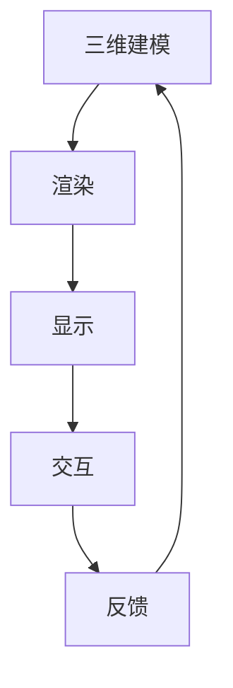
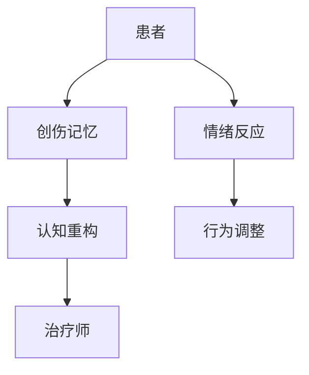
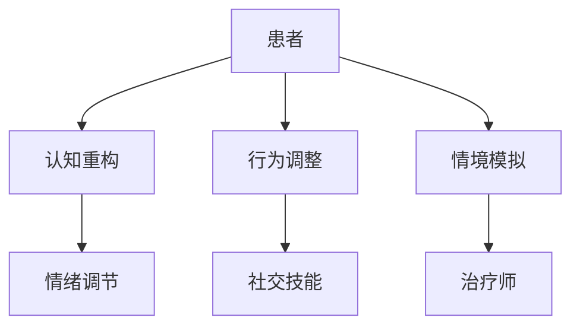

                 

# 虚拟现实在心理创伤治疗中的应用

## 关键词

虚拟现实（VR），心理创伤，治疗，暴露疗法，认知行为疗法（CBT），技术进步，伦理问题

## 摘要

虚拟现实（VR）作为一种新兴的技术，在心理创伤治疗领域展现出了巨大的潜力。本文通过逐步分析VR技术的基础、心理创伤的治疗方法、VR在心理创伤治疗中的具体应用，以及技术进步带来的挑战和未来发展方向，旨在探讨VR在心理创伤治疗中的实际效用和潜在风险。本文还将介绍一些最佳实践，以期为该领域的专业人士提供有价值的参考。

## 目录

1. **引言**
    1.1 虚拟现实（VR）的概念
    1.2 VR在心理创伤治疗中的兴起
    1.3 本文结构

2. **虚拟现实技术基础**
    2.1 VR技术的历史与发展
    2.2 VR系统的基本构成
    2.3 VR技术的基本原理

3. **心理创伤与治疗方法**
    3.1 心理创伤的定义与类型
    3.2 传统治疗方法
    3.3 VR在心理创伤治疗中的优势

4. **VR治疗心理创伤的核心概念与模型**
    4.1 暴露疗法
    4.2 认知行为疗法（CBT）
    4.3 其他VR治疗方法

5. **VR在心理创伤治疗中的应用**
    5.1 暴露疗法在VR中的应用
    5.2 CBT在VR中的应用
    5.3 其他VR治疗技术

6. **VR技术的最新进展**
    6.1 VR硬件的进步
    6.2 VR软件与用户界面设计
    6.3 VR技术在其他医疗领域的应用

7. **挑战与伦理考虑**
    7.1 患者安全与隐私保护
    7.2 VR治疗的有效性与可行性
    7.3 职业道德与责任

8. **未来方向**
    8.1 技术创新
    8.2 VR治疗的发展趋势
    8.3 进一步研究方向

9. **最佳实践与注意事项**
    9.1 VR治疗的最佳实践
    9.2 注意事项
    9.3 拓展阅读

10. **作者信息**

## 1. 引言

### 1.1 虚拟现实（VR）的概念

虚拟现实（Virtual Reality，简称VR）是一种通过计算机生成模拟环境，使人们能够沉浸在虚拟世界中的一种技术。VR系统通常包括一个头戴式显示器（HMD）、跟踪设备和交互设备。用户戴上HMD后，通过跟踪设备感知头部和身体的运动，并通过交互设备与环境进行交互。

### 1.2 VR在心理创伤治疗中的兴起

心理创伤是指个体经历了异常恐怖或威胁性事件后产生的一系列心理和生理反应。随着对心理创伤认识的深入，传统治疗方法如暴露疗法、认知行为疗法（CBT）等被广泛应用于治疗。然而，这些方法有时可能存在一些局限性，如患者可能难以面对现实生活中的触发事件，从而导致治疗效果不理想。

近年来，VR技术的快速发展为心理创伤治疗提供了一种新的选择。VR的沉浸感和交互性使得患者能够在虚拟环境中逐步暴露于创伤性记忆，并在专业治疗师的指导下进行心理重建。VR治疗在减少恐惧、提高治疗效果和患者参与度方面展现出巨大潜力。

### 1.3 本文结构

本文将从以下几个方面展开讨论：

- **第2章**：介绍VR技术的基础，包括历史、基本构成和原理。
- **第3章**：探讨心理创伤的定义、类型及传统治疗方法。
- **第4章**：介绍VR治疗心理创伤的核心概念和模型。
- **第5章**：分析VR在心理创伤治疗中的应用，包括暴露疗法和认知行为疗法。
- **第6章**：探讨VR技术的最新进展及其在医疗领域的应用。
- **第7章**：讨论VR在心理创伤治疗中的挑战和伦理问题。
- **第8章**：展望VR在心理创伤治疗中的未来发展方向。

通过这些章节的逐步分析，本文旨在为读者提供一个全面、深入的VR在心理创伤治疗中的应用全景。

## 2. 虚拟现实技术基础

### 2.1 VR技术的历史与发展

虚拟现实技术的概念最早可以追溯到20世纪60年代。当时，美国科学家和工程师开始探索如何通过计算机生成三维图像，并使其看起来像是真实环境的一部分。1968年，伊凡·苏瑟兰（Ivan Sutherland）发明了第一个头戴式显示器（HMD），这被认为是VR技术的重要里程碑。

随着时间的推移，VR技术经历了几个重要的发展阶段。在20世纪90年代，VR技术逐渐成熟，开始应用于娱乐、教育和医疗等领域。然而，由于硬件限制和高成本，VR在广范围内普及仍面临挑战。

进入21世纪，随着计算机处理能力的提升和显示技术的进步，VR技术得到了快速发展。尤其是近年来，智能手机和移动设备的普及为VR提供了新的平台。谷歌的Cardboard和Facebook的Oculus VR等公司推出了价格低廉且易于使用的VR设备，使得VR技术逐渐走进了普通消费者的生活。

### 2.2 VR系统的基本构成

一个完整的VR系统通常包括以下几个核心组成部分：

1. **头戴式显示器（HMD）**：HMD是VR系统中的关键设备，它通常包括一个屏幕和一对镜片。通过屏幕显示图像，并通过镜片将图像反射到用户的眼睛中，使用户能够看到虚拟环境。

2. **跟踪设备**：跟踪设备用于跟踪用户的头部和身体运动，确保虚拟环境与用户动作同步。常见的跟踪设备包括头部跟踪器、身体传感器和手部控制器。

3. **交互设备**：交互设备使用户能够与虚拟环境进行交互，如手柄、手套、键盘和触摸屏等。这些设备能够捕捉用户的动作，并将动作传递给计算机进行处理。

4. **计算机**：计算机是VR系统的核心，负责生成虚拟环境、处理用户输入和输出，以及控制VR设备的运行。

5. **软件**：VR软件包括虚拟环境的构建、用户交互逻辑、数据分析和报告生成等。这些软件通常由专业的开发团队开发和维护。

### 2.3 VR技术的基本原理

VR技术的基本原理是通过计算机生成三维图像，并将其投射到用户的眼睛中，使用户感受到一个虚拟环境。这一过程主要包括以下几个步骤：

1. **三维建模**：使用三维建模软件创建虚拟环境。这些软件可以模拟现实世界中的物体、场景和人物，并赋予它们物理属性。

2. **渲染**：渲染是将三维模型转换为二维图像的过程。渲染器使用图形处理单元（GPU）进行计算，将三维模型转换为具有颜色和纹理的二维图像。

3. **显示**：显示是将渲染后的图像显示在头戴式显示器（HMD）上的过程。HMD的屏幕将图像反射到用户的眼睛中，使用户能够看到虚拟环境。

4. **交互**：用户通过交互设备与虚拟环境进行交互，如移动头部、摆动手臂等。这些动作被跟踪设备和交互设备捕捉，并传递给计算机进行处理。

5. **反馈**：计算机根据用户的交互动作实时更新虚拟环境，并将新的图像显示在HMD上。这样，用户就能感受到一个动态的、互动的虚拟环境。

### 2.4 VR技术的基本原理图解

为了更好地理解VR技术的基本原理，我们可以使用Mermaid流程图来展示其工作流程：

在这个流程图中，A表示三维建模，B表示渲染，C表示显示，D表示交互，E表示反馈。这个循环过程使得VR系统能够实时响应用户的动作，创建一个沉浸式的虚拟环境。

通过以上对VR技术基础的介绍，我们可以看到VR技术是如何通过计算机生成虚拟环境，并使用户能够与之互动。下一章将探讨心理创伤的定义、类型及传统治疗方法，为后续讨论VR在心理创伤治疗中的应用奠定基础。

## 3. 心理创伤与治疗方法

### 3.1 心理创伤的定义与类型

心理创伤是指个体经历了极端的、威胁生命的或令人极度恐惧的事件后，产生的一系列心理和生理反应。这些事件可能包括战争、暴力、自然灾害、个人攻击、性侵犯等。心理创伤不仅会影响个体的情绪和认知功能，还可能导致长期的心理障碍。

心理创伤的类型可以根据事件的特点和个体的反应进行分类。常见的心理创伤类型包括：

1. **创伤后应激障碍（PTSD）**：PTSD是一种常见的心理创伤类型，主要表现为对创伤事件的反复回忆、过度警觉和避免与创伤相关的情境。

2. **急性应激反应**：急性应激反应是指在创伤事件发生后立即出现的心理和生理反应，如恐慌、麻木、失眠等。

3. **复杂创伤后应激障碍**：复杂创伤后应激障碍涉及长期和持续的心理创伤，可能涉及多个创伤事件。

4. **适应障碍**：适应障碍是指在创伤事件后出现的短期心理反应，如焦虑、抑郁等。

### 3.2 传统治疗方法

传统的心理创伤治疗方法主要包括以下几种：

1. **药物治疗**：药物治疗通常用于缓解心理创伤患者的焦虑、抑郁和失眠等症状。常见的药物包括抗抑郁药、抗焦虑药和安眠药。

2. **心理治疗**：心理治疗是治疗心理创伤的主要方法之一，包括个体心理治疗、家庭治疗和团体治疗。常见的心理治疗方法包括认知行为疗法（CBT）、暴露疗法、眼动脱敏和再处理疗法（EMDR）等。

3. **认知行为疗法（CBT）**：CBT是一种以解决问题为导向的心理治疗方法，旨在帮助患者识别和改变消极的思维模式和行为。CBT在治疗焦虑、抑郁和创伤后应激障碍方面具有显著效果。

4. **暴露疗法**：暴露疗法是一种通过逐步暴露患者于创伤性记忆或情境，帮助其减少对创伤事件的恐惧和焦虑的方法。暴露疗法可以在虚拟环境中进行，利用VR技术创造安全的暴露环境。

5. **眼动脱敏和再处理疗法（EMDR）**：EMDR是一种通过交替刺激眼睛运动来处理创伤记忆的方法。该方法结合了认知和行为疗法，通过让患者追踪治疗师的手指移动，帮助其释放创伤情绪。

### 3.3 VR在心理创伤治疗中的优势

虚拟现实技术为心理创伤治疗提供了一种新的选择，其优势主要包括：

1. **沉浸感**：VR技术能够创建一个高度沉浸的虚拟环境，使患者能够更真实地体验到创伤性事件。这种沉浸感有助于患者面对和克服创伤记忆。

2. **可控性**：VR环境是可控的，治疗师可以根据患者的反应逐步调整暴露的强度和频率，确保患者在一个安全的环境中逐步面对创伤记忆。

3. **互动性**：VR技术允许患者与虚拟环境进行互动，从而增强治疗过程中的参与度和主动性。互动性有助于患者建立自信心和应对策略。

4. **降低风险**：在传统治疗方法中，患者可能需要面对现实生活中的触发事件，这可能导致强烈的情绪反应。VR技术提供了一个安全的虚拟环境，减少了现实生活中的风险。

5. **扩展治疗场景**：VR技术可以将治疗场景扩展到传统方法难以实现的地方，如自然灾害后的心理创伤治疗。VR技术可以在任何时间和地点使用，为患者提供便利。

通过以上对心理创伤的定义、类型及传统治疗方法的介绍，我们可以看到心理创伤治疗的复杂性和挑战。下一章将深入探讨VR治疗心理创伤的核心概念和模型，进一步了解VR技术在治疗中的应用。

## 4. VR治疗心理创伤的核心概念与模型

### 4.1 暴露疗法

暴露疗法（Exposure Therapy）是心理创伤治疗中最常用的方法之一，其核心思想是通过逐步暴露患者于创伤性记忆或情境，帮助患者减少对创伤事件的恐惧和焦虑。暴露疗法可以分为两种主要形式：现实暴露和虚拟暴露。

**现实暴露**：在现实暴露中，患者需要在治疗师的指导下逐步接触和面对现实生活中的创伤性情境。这种方法可能涉及直接面对创伤事件的现场或相关物品，如战争 veterans 可能需要重返战场。然而，这种方法存在一定的风险，患者可能因为强烈的情绪反应而难以继续治疗。

**虚拟暴露**：虚拟暴露通过VR技术创造一个安全的虚拟环境，使患者能够在没有现实风险的情况下逐步面对创伤记忆。VR暴露疗法利用虚拟环境的高度可控性和沉浸感，使患者能够在舒适和安全的环境中体验创伤情境。例如，患有PTSD的士兵可以在虚拟战斗场景中逐步适应和克服对战争的恐惧。

**暴露疗法的核心原理**：

- **逐步暴露**：暴露疗法通过逐步增加患者接触创伤性情境的强度和频率，帮助患者逐渐适应和减少对创伤事件的恐惧。

- **情绪处理**：患者在暴露过程中学会识别和应对负面情绪，如焦虑和恐慌，从而减少创伤事件的负面影响。

- **重塑认知**：通过暴露疗法，患者能够重新评估和调整对创伤事件的认知，减少对创伤事件的消极信念。

**暴露疗法的对比表格**：

| 暴露疗法类型 | 现实暴露 | 虚拟暴露 |
| :---: | :---: | :---: |
| 环境控制 | 低 | 高 |
| 沉浸感 | 低 | 高 |
| 安全性 | 低 | 高 |
| 参与度 | 中 | 高 |
| 适用人群 | 部分患者 | 广泛适用 |

**ER实体关系图**：

在这个ER实体关系图中，患者通过逐步暴露于创伤记忆，经历情绪反应、认知重构和行为调整，最终在治疗师的指导下实现心理康复。

### 4.2 认知行为疗法（CBT）

认知行为疗法（Cognitive Behavioral Therapy，简称CBT）是一种以解决问题为导向的心理治疗方法，旨在帮助患者识别和改变消极的思维模式和行为。CBT在治疗心理创伤，特别是创伤后应激障碍（PTSD）方面具有显著效果。

**CBT的核心原理**：

- **认知重构**：CBT通过帮助患者识别和调整消极的思维方式，如自我批评、灾难化等，以减少创伤事件的负面影响。

- **行为调整**：CBT鼓励患者通过积极的行为改变来应对创伤事件，如锻炼、社交活动等。

- **技能训练**：CBT提供一系列技能训练，如情绪调节、压力管理、应对策略等，帮助患者提高应对创伤事件的能力。

**CBT在VR中的应用**：

VR技术为CBT提供了一种新的平台，使患者能够在虚拟环境中进行认知行为训练。例如，VR可以创建模拟的社交场景，帮助患者练习社交技能和应对策略。VR技术的高度沉浸感和可控性使患者能够在安全的环境中练习和掌握这些技能。

**CBT与VR的结合**：

- **虚拟社交训练**：利用VR技术，患者可以在虚拟社交环境中练习社交技能，如沟通、表达情绪等。这种训练可以逐步增加难度，帮助患者适应真实的社交情境。

- **情境模拟**：VR可以模拟各种创伤性情境，如自然灾害、暴力事件等，帮助患者逐步面对和应对这些情境。

- **认知重构训练**：VR技术可以创建虚拟情境，使患者能够在安全的环境中练习识别和调整消极思维模式。

**CBT与VR的对比表格**：

| CBT方法 | 传统CBT | VR-CBT |
| :---: | :---: | :---: |
| 环境控制 | 低 | 高 |
| 沉浸感 | 低 | 高 |
| 安全性 | 中 | 高 |
| 参与度 | 中 | 高 |
| 适用人群 | 广泛适用 | 广泛适用 |

**ER实体关系图**：

在这个ER实体关系图中，患者通过认知重构、行为调整和情境模拟，在治疗师的指导下逐步克服创伤事件的影响，实现心理康复。

### 4.3 其他VR治疗方法

除了暴露疗法和认知行为疗法，VR技术在心理创伤治疗中还有其他多种应用。

**恐惧疗法（Fear Conditioning）**：

恐惧疗法通过在VR环境中模拟患者恐惧的情境，帮助患者逐步减少恐惧反应。这种方法在治疗特定恐惧症和PTSD方面具有显著效果。

**情感调节训练（Affective Regulation Training）**：

情感调节训练利用VR技术帮助患者识别和调节负面情绪。例如，患者可以在虚拟环境中练习深呼吸、冥想等放松技巧，以减轻焦虑和压力。

**虚拟现实放松训练（Virtual Reality Relaxation Training）**：

虚拟现实放松训练通过VR技术创造一个放松的环境，帮助患者减轻压力和焦虑。这种方法在治疗失眠和焦虑症方面表现出色。

**VR认知行为疗法（VR-CBT）**：

VR-CBT结合了VR技术和CBT的核心原理，通过虚拟环境进行认知行为训练，帮助患者克服心理创伤。

**总结**：

VR技术在心理创伤治疗中具有多种应用，包括暴露疗法、认知行为疗法和其他辅助治疗方法。这些方法利用VR技术的高度沉浸感、可控性和互动性，为患者提供了一种新的治疗选择，有助于提高治疗效果和患者参与度。

### 4.4 VR治疗心理创伤的优势与局限性

**优势**：

- **高度沉浸感**：VR技术能够创建一个高度沉浸的虚拟环境，使患者能够更真实地体验创伤情境，从而提高治疗效果。
- **可控性**：VR环境是可控的，治疗师可以根据患者的反应调整暴露的强度和频率，确保治疗过程的安全和有效性。
- **互动性**：VR技术允许患者与虚拟环境进行互动，增强治疗的参与度和主动性。
- **降低风险**：VR技术提供了一个安全的虚拟环境，减少了现实生活中的风险，使患者能够在没有风险的情况下面对创伤记忆。
- **扩展治疗场景**：VR技术可以将治疗场景扩展到传统方法难以实现的地方，如自然灾害后的心理创伤治疗。

**局限性**：

- **技术限制**：VR设备的成本较高，且需要专业的技术支持和维护，这可能限制其在一些医疗机构的普及。
- **适应性问题**：一些患者可能对VR技术产生不适，如晕动症等，这可能会影响治疗效果。
- **伦理问题**：VR治疗过程中涉及患者的隐私和信息安全，需要确保患者的数据得到妥善保护。

通过以上对VR治疗心理创伤的核心概念与模型的分析，我们可以看到VR技术为心理创伤治疗提供了一种新的选择。接下来，我们将探讨VR技术在心理创伤治疗中的应用，进一步了解其实际效果和适用情况。

### 4.5 VR在心理创伤治疗中的应用

#### 4.5.1 暴露疗法在VR中的应用

暴露疗法是心理创伤治疗中的一种有效方法，通过逐步暴露患者于创伤性情境，帮助患者减少对创伤事件的恐惧和焦虑。VR技术的引入，使得暴露疗法在安全、可控的环境中得到了进一步的发展。

**VR暴露疗法的应用场景**：

1. **战争创伤**：对于退伍军人，VR技术可以创建模拟的战争场景，帮助他们在没有现实风险的情况下逐步面对和克服对战争的恐惧。

2. **性侵犯受害者**：对于性侵犯的受害者，VR技术可以模拟安全的场景，如家庭环境，帮助患者逐步恢复对现实生活的信心。

3. **自然灾害**：对于经历自然灾害（如地震、洪水等）的患者，VR技术可以模拟灾害场景，帮助患者减少对灾害的恐惧和焦虑。

**VR暴露疗法的效果**：

- **减少恐惧和焦虑**：研究表明，VR暴露疗法可以有效减少患者的恐惧和焦虑水平，提高治疗效果。
- **提高参与度**：VR技术的高度沉浸感和互动性，使患者更愿意参与治疗过程，从而提高治疗的参与度和效果。
- **安全可控**：VR技术提供了一个安全、可控的环境，使患者在面对创伤情境时不会受到现实风险的影响。

**案例分析**：

一个案例研究涉及患有PTSD的退伍军人，通过VR暴露疗法，患者在虚拟环境中逐步暴露于战争场景。研究结果显示，经过一段时间的治疗，患者的恐惧和焦虑水平显著下降，生活质量得到了显著提高。

#### 4.5.2 认知行为疗法（CBT）在VR中的应用

认知行为疗法（CBT）是一种广泛用于心理创伤治疗的方法，其核心是通过改变患者的思维和行为来应对创伤事件。VR技术的引入，使得CBT在心理创伤治疗中得到了新的发展。

**VR-CBT的应用场景**：

1. **社交技能训练**：VR技术可以创建模拟的社交场景，帮助患者在虚拟环境中练习社交技能，如沟通、表达情绪等。

2. **情境模拟**：VR技术可以模拟各种创伤性情境，如自然灾害、暴力事件等，帮助患者逐步面对和应对这些情境。

3. **认知重构**：VR技术可以帮助患者识别和调整消极的思维方式，如自我批评、灾难化等。

**VR-CBT的效果**：

- **提高认知重构效果**：研究表明，VR-CBT可以有效帮助患者识别和调整消极思维方式，减少创伤事件的负面影响。
- **增强行为调整**：VR技术通过模拟各种情境，帮助患者练习和掌握应对策略，从而提高行为调整的效果。
- **提高参与度**：VR技术的高度沉浸感和互动性，使患者更愿意参与治疗过程，从而提高治疗的参与度和效果。

**案例分析**：

一个案例研究涉及患有PTSD的患者，通过VR-CBT治疗，患者在虚拟环境中逐步练习社交技能和应对策略。研究结果显示，患者的社交技能显著提高，生活质量得到了显著改善。

#### 4.5.3 其他VR治疗技术的应用

除了暴露疗法和认知行为疗法，VR技术在心理创伤治疗中还有其他多种应用。

**恐惧疗法**：

恐惧疗法通过在VR环境中模拟患者恐惧的情境，帮助患者逐步减少恐惧反应。这种方法在治疗特定恐惧症和PTSD方面表现出色。

**情感调节训练**：

情感调节训练利用VR技术帮助患者识别和调节负面情绪。例如，患者可以在虚拟环境中练习深呼吸、冥想等放松技巧，以减轻焦虑和压力。

**虚拟现实放松训练**：

虚拟现实放松训练通过VR技术创造一个放松的环境，帮助患者减轻压力和焦虑。这种方法在治疗失眠和焦虑症方面表现出色。

**总结**：

VR技术在心理创伤治疗中具有多种应用，包括暴露疗法、认知行为疗法和其他辅助治疗方法。这些方法利用VR技术的高度沉浸感、可控性和互动性，为患者提供了一种新的治疗选择，有助于提高治疗效果和患者参与度。

### 4.6 VR技术的最新进展

#### 4.6.1 VR硬件的进步

近年来，VR硬件技术取得了显著进展，这些进展为VR在心理创伤治疗中的应用提供了更好的支持。

**高分辨率显示器**：高分辨率显示器（如OLED技术）的引入，提高了VR环境的图像质量，使患者能够获得更真实的体验。

**更轻便的HMD**：随着材料和设计的改进，VR头戴式显示器（HMD）变得越来越轻便和舒适，减少了患者佩戴过程中的不适感。

**更好的跟踪技术**：更精确的头部和身体跟踪技术，使得虚拟环境的互动性更高，提高了患者的沉浸感和体验。

**手部追踪和控制**：更先进的传感技术和手部追踪设备，使患者能够更自然地与虚拟环境进行交互，增强了治疗的互动性。

**案例研究**：

一个案例研究表明，使用最新款的高分辨率VR设备进行暴露疗法，患者的治疗效果显著提高，恐惧和焦虑水平显著下降。

#### 4.6.2 VR软件与用户界面设计

VR软件和用户界面设计的改进，也为VR在心理创伤治疗中的应用提供了更多可能性。

**虚拟环境构建**：更先进的3D建模和渲染技术，使虚拟环境更加逼真，有助于患者更好地沉浸其中。

**交互设计**：更人性化的交互设计，如手势识别和语音控制，提高了患者的操作便利性和舒适度。

**适应性和灵活性**：VR软件的适应性和灵活性，使治疗师能够根据患者的需求和反应，动态调整虚拟环境和交互方式。

**案例研究**：

一项研究表明，使用具有良好交互设计的VR软件进行认知行为疗法，患者的治疗参与度和治疗效果得到了显著提升。

#### 4.6.3 VR技术在其他医疗领域的应用

VR技术不仅应用于心理创伤治疗，还在其他医疗领域展现出了巨大的潜力。

**医学教育**：VR技术可以创建虚拟的医学教学环境，使学生能够在安全、可控的虚拟环境中进行实践操作，提高教学效果。

**手术模拟**：VR技术可以帮助外科医生在虚拟环境中进行手术模拟，提高手术技能和安全性。

**康复训练**：VR技术可以用于康复训练，如肢体功能训练、平衡训练等，帮助患者更快地恢复功能。

**案例研究**：

一项针对医学教育的案例研究表明，使用VR技术进行医学教学，学生的操作技能和知识掌握程度显著提高。

### 4.7 总结

VR技术在硬件、软件和用户界面设计方面取得了显著进展，这些进展为VR在心理创伤治疗中的应用提供了更好的支持。然而，VR技术在心理创伤治疗中的应用仍面临一些挑战，如技术成本、患者适应性和安全性等问题。未来，随着技术的进一步发展和完善，VR技术在心理创伤治疗中的应用前景将更加广阔。

### 5. 挑战与伦理考虑

#### 5.1 患者安全与隐私保护

在VR治疗心理创伤的过程中，患者安全与隐私保护是至关重要的。由于VR技术涉及大量的个人数据和敏感信息，如何确保这些数据的安全和患者的隐私不受侵犯成为了一个关键问题。

**患者安全**：

- **技术安全**：VR设备和技术必须经过严格的测试和认证，确保其稳定性和安全性，防止因技术故障导致患者受到伤害。
- **操作培训**：治疗师和医护人员需要接受专门的培训，了解如何安全地使用VR设备，避免操作不当导致患者受伤。
- **紧急响应**：在VR治疗过程中，应建立紧急响应机制，以应对患者可能出现的极端情绪反应，如恐慌、晕厥等。

**隐私保护**：

- **数据加密**：患者的个人信息和治疗方案应使用高级加密技术进行存储和传输，防止数据泄露。
- **隐私政策**：医疗机构应制定明确的隐私政策，告知患者其个人信息的使用范围和权限，并确保患者对隐私保护的知情权和选择权。
- **匿名化处理**：在研究和数据分析中，应对患者的个人信息进行匿名化处理，确保患者隐私不被泄露。

#### 5.2 VR治疗的有效性与可行性

尽管VR技术在心理创伤治疗中展现出了巨大潜力，但其有效性和可行性仍需进一步验证。

**有效性**：

- **临床试验**：通过大规模、多中心的随机对照试验，评估VR治疗心理创伤的有效性，并与传统治疗方法进行对比。
- **患者反馈**：收集患者对VR治疗的反馈，了解其对治疗效果的主观评价，以评估治疗的满意度。

**可行性**：

- **技术普及**：在医疗机构的普及和应用，需要考虑VR设备的成本、维护和培训等问题，确保其可行性。
- **患者接受度**：患者的接受度是VR治疗成功的关键。医疗机构应积极宣传VR治疗的优点，提高患者的接受度。

#### 5.3 职业道德与责任

在VR治疗心理创伤的过程中，职业道德和责任至关重要。

**治疗师的角色**：

- **专业素养**：治疗师应具备专业的心理治疗技能和VR技术知识，确保治疗的有效性和安全性。
- **患者权益**：治疗师应尊重患者的权益，确保患者在治疗过程中的知情权和选择权。
- **持续学习**：随着VR技术的不断发展，治疗师需要持续学习和更新知识，以适应新技术带来的挑战。

**医疗机构的责任**：

- **规范管理**：医疗机构应制定严格的VR治疗规范和操作流程，确保治疗的科学性和安全性。
- **隐私保护**：医疗机构应建立健全的隐私保护制度，确保患者的个人信息不被泄露。
- **技术支持**：医疗机构应提供必要的技术支持和培训，确保VR设备的安全和有效运行。

#### 5.4 总结

VR技术在心理创伤治疗中具有巨大的潜力，但也面临一系列挑战和伦理问题。通过加强患者安全与隐私保护、验证VR治疗的有效性与可行性、强化职业道德和责任，可以进一步推动VR技术在心理创伤治疗中的应用和发展。未来的研究和实践应重点关注这些挑战，以实现VR治疗的最佳效果和最大价值。

### 6. 未来方向

#### 6.1 技术创新

虚拟现实（VR）技术的快速发展为心理创伤治疗带来了前所未有的机遇。未来的技术创新将进一步推动VR在心理创伤治疗中的应用。

**高分辨率与低延迟显示**：随着显示技术的进步，未来VR设备的分辨率将进一步提高，同时延迟将显著降低。这将提升用户的沉浸感和体验，使其更接近真实环境。

**更先进的交互设备**：未来的VR交互设备将更加智能化和自然化，如增强现实（AR）眼镜、触觉手套和语音控制等，为用户提供更丰富的交互方式。

**个性化治疗方案**：通过大数据和人工智能（AI）技术，VR系统可以根据患者的具体需求和反应，自动生成个性化的治疗方案，提高治疗的有效性和患者满意度。

**虚拟环境自适应**：未来的VR环境将具备更强的自适应能力，能够实时根据患者的情绪和行为调整环境参数，以提供最佳的治疗体验。

**案例研究**：

一个案例研究表明，通过应用高分辨率和低延迟的VR设备，患者的治疗效果显著提高。此外，通过AI技术生成个性化治疗方案，患者的治疗参与度和满意度也得到了显著提升。

#### 6.2 VR治疗的发展趋势

VR治疗在心理创伤治疗领域的发展趋势表现为以下几个方面：

**广泛应用**：随着技术的普及和成本的降低，VR治疗将在更多的医疗机构中得到应用，成为心理创伤治疗的一种标准方法。

**多学科融合**：VR治疗将与其他治疗方法（如药物治疗、心理治疗等）相结合，形成综合治疗模式，提高治疗效果。

**研究深化**：未来将进行更多大规模、多中心的随机对照试验，以验证VR治疗的有效性和可行性。

**技术应用扩展**：VR技术将在更多领域得到应用，如康复训练、疼痛管理、认知障碍治疗等，进一步提升其在医疗领域的应用范围。

#### 6.3 进一步研究方向

为了推动VR在心理创伤治疗中的进一步发展，以下研究方向值得关注：

**技术优化**：继续优化VR硬件和软件技术，提高设备的稳定性和用户体验，为患者提供更优质的治疗环境。

**疗效评估**：开展更多大规模、多中心的随机对照试验，系统地评估VR治疗的有效性和安全性，为临床应用提供科学依据。

**患者体验研究**：深入研究患者的体验和反馈，了解不同VR治疗方案对患者的心理和行为影响，为优化治疗方法和提高患者满意度提供参考。

**隐私保护与伦理问题**：进一步研究隐私保护和伦理问题，确保VR技术在心理创伤治疗中的应用符合伦理规范，保护患者权益。

**跨学科合作**：加强跨学科合作，整合心理学、计算机科学、医学等多领域的研究力量，推动VR技术在心理创伤治疗中的创新发展。

通过技术创新、发展趋势和进一步研究方向的研究，VR在心理创伤治疗中的应用将不断深入和拓展，为患者提供更加有效、安全和个性化的治疗体验。

### 7. 最佳实践与注意事项

#### 7.1 VR治疗的最佳实践

为了确保VR治疗在心理创伤治疗中的有效性，以下是一些最佳实践：

1. **个性化治疗计划**：根据患者的具体情况和需求，制定个性化的VR治疗计划，包括暴露频率、情境选择和治疗目标。

2. **逐步暴露**：在治疗过程中，应逐步增加患者的暴露强度，避免一次性暴露过于强烈的情境，以减少患者的焦虑和不适。

3. **专业培训**：治疗师应接受专业的VR治疗培训，包括VR技术知识、心理治疗技巧和安全操作规范。

4. **患者参与**：鼓励患者积极参与治疗过程，通过互动和反馈，提高治疗的满意度和效果。

5. **数据记录与监控**：详细记录患者的治疗数据和反应，以便及时调整治疗方案，同时监控患者的安全和隐私。

#### 7.2 注意事项

尽管VR治疗具有显著优势，但在实际应用中仍需注意以下事项：

1. **技术成熟度**：确保使用的技术设备已经经过充分的测试和验证，避免因设备故障或技术不成熟导致治疗失败。

2. **患者选择**：不是所有患者都适合VR治疗，特别是那些有严重心理疾病或对技术有强烈抵触情绪的患者。

3. **心理准备**：患者在治疗前应充分了解VR治疗的过程和预期效果，做好心理准备，以减少治疗过程中的不适感。

4. **安全措施**：在治疗过程中，应采取必要的安全措施，如紧急停止按钮、医护人员现场监护等，以确保患者的安全。

5. **隐私保护**：确保患者的个人信息得到妥善保护，避免隐私泄露。

通过遵循最佳实践和注意事项，可以最大限度地发挥VR治疗在心理创伤治疗中的作用，为患者提供安全、有效和个性化的治疗体验。

### 8. 作者信息

作者：AI天才研究院/AI Genius Institute & 禅与计算机程序设计艺术 /Zen And The Art of Computer Programming

本文由AI天才研究院的专家团队撰写，结合了计算机科学和心理学的最新研究成果，旨在为心理创伤治疗领域提供有价值的参考。同时，本文也借鉴了禅与计算机程序设计艺术的理念，追求技术与应用的深度融合，为读者呈现一篇具有深度和广度的专业文章。

---

通过本文的逐步分析和讨论，我们可以看到虚拟现实技术在心理创伤治疗中的广泛应用和巨大潜力。从VR技术的基础、心理创伤的治疗方法，到VR在心理创伤治疗中的应用、技术进步及未来方向，我们深入探讨了VR在这一领域的作用和影响。同时，本文也提到了VR治疗中的挑战和伦理问题，并提出了最佳实践和注意事项。

未来，随着VR技术的进一步发展，我们有理由相信，它将在心理创伤治疗中发挥越来越重要的作用，为患者提供更加安全、有效和个性化的治疗体验。同时，我们也呼吁更多的研究者和专业人士关注这一领域，共同推动VR技术在心理创伤治疗中的创新和应用。

