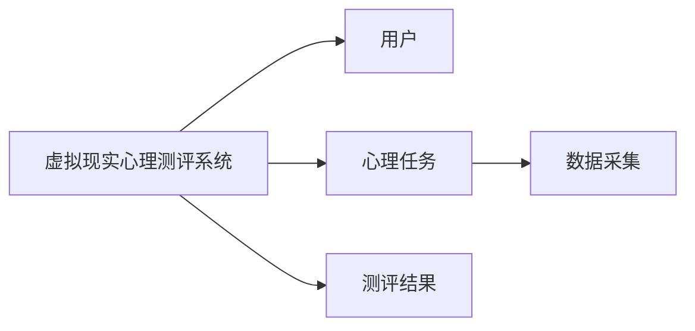
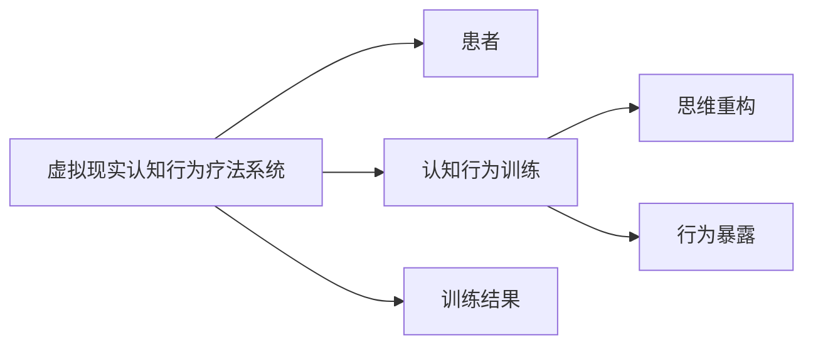
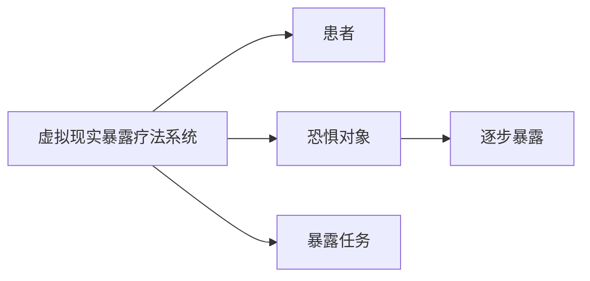
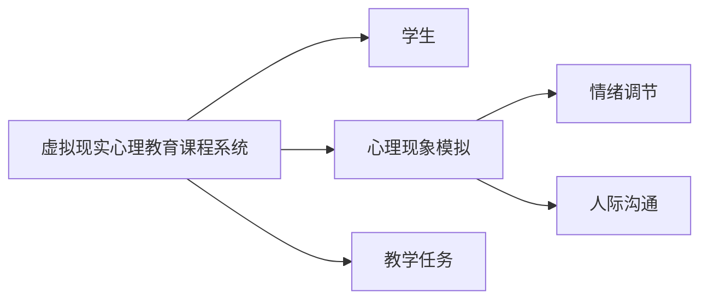

                 

# 虚拟现实在心理治疗中的创新应用

## 关键词

- 虚拟现实
- 心理治疗
- 技术创新
- 心理干预
- 伦理问题
- 政策建议

## 摘要

本文旨在探讨虚拟现实（VR）技术在心理治疗中的创新应用。通过对虚拟现实技术的基础原理、设备与工具、内容制作以及心理学应用研究的深入分析，本文揭示了VR在心理治疗中的潜力与挑战。文章还详细阐述了VR在心理评估、心理干预、心理教育与培训等具体应用领域中的实践案例，并提出了未来发展的方向和政策建议。通过本文的阅读，读者将全面了解虚拟现实在心理治疗领域的最新进展和潜在价值。

## 引言

### 1.1 书籍背景

#### 1.1.1 虚拟现实技术的发展历程

虚拟现实（VR）技术起源于20世纪50年代，但直到21世纪初，随着计算机技术、图形处理能力和传感器技术的快速发展，VR才逐渐走向实用化。VR技术的核心是创造一个虚拟的三维空间，使用户能够通过头戴式显示器（HMD）等设备沉浸其中，进行互动和体验。

#### 1.1.2 心理治疗中的问题与需求

心理治疗作为一种重要的心理健康干预手段，面临着许多挑战，如治疗成本高、疗效难以评估、患者参与度不高等。虚拟现实技术的引入，有望解决这些问题，提供一种低成本、高效、个性化的心理治疗方案。

#### 1.1.3 虚拟现实在心理治疗中的潜力

虚拟现实在心理治疗中的应用潜力巨大。首先，VR可以提供一个安全、可控的环境，使患者在虚拟世界中面对和处理他们的恐惧和焦虑。其次，VR技术的交互性和沉浸感，可以提高患者的参与度和治疗效果。此外，VR还可以用于心理评估、认知行为疗法（CBT）和情绪调节等领域。

### 1.2 核心概念

#### 1.2.1 虚拟现实（VR）的定义

虚拟现实是一种通过计算机生成的模拟环境，使用户能够在其中进行互动和体验。VR技术包括三维建模、实时渲染、传感器追踪和用户交互等多个方面。

#### 1.2.2 心理治疗的定义

心理治疗是一种通过心理干预手段，帮助患者解决心理问题、改善心理健康的方法。心理治疗包括认知行为疗法、暴露疗法、心理教育和情绪调节等多个领域。

#### 1.2.3 虚拟现实在心理治疗中的核心应用

虚拟现实在心理治疗中的应用主要集中在心理评估、心理干预和心理教育等方面。通过VR技术，可以创建虚拟环境，模拟现实生活中的场景，帮助患者进行心理训练和干预。

### 1.3 书籍结构

#### 1.3.1 各章节内容概览

本文共分为五个部分，第一部分引言，介绍书籍的背景和核心概念；第二部分虚拟现实技术基础，分析VR技术原理、设备与工具、内容制作以及心理学应用研究；第三部分虚拟现实在心理治疗中的应用，详细阐述VR在心理评估、心理干预和心理教育等方面的具体应用；第四部分案例分析，通过实际案例探讨VR在心理治疗中的效果和挑战；第五部分技术展望与政策建议，分析VR技术的未来发展趋势，提出政策建议。

#### 1.3.2 阅读对象与目标

本文旨在为心理学专业人士、心理治疗师、计算机技术爱好者以及相关研究人员提供一本全面、深入的虚拟现实在心理治疗中的应用指南。通过阅读本文，读者将了解VR技术的原理和应用，掌握VR在心理治疗中的具体实践方法，并为未来的研究和应用提供启示。

#### 1.3.3 读者准备与建议

本文要求读者具备一定的心理学和计算机技术背景，以便更好地理解文章的内容。同时，为了更好地理解VR在心理治疗中的应用，建议读者在阅读过程中，结合实际案例和自身经验进行思考和总结。

## 虚拟现实技术基础

### 2.1 虚拟现实技术原理

#### 2.1.1 虚拟现实技术的组成

虚拟现实技术主要由以下几个部分组成：

1. **三维建模**：通过计算机图形学技术，创建虚拟环境的三维模型。
2. **实时渲染**：通过图形处理器（GPU）实时渲染虚拟环境，实现高质量的图像效果。
3. **传感器追踪**：使用传感器（如头戴式显示器、手柄、摄像头等）实时跟踪用户的位置和动作，提供沉浸式的互动体验。
4. **用户交互**：通过输入设备（如键盘、鼠标、手柄等）实现用户与虚拟环境的交互。

#### 2.1.2 虚拟现实技术的核心原理

虚拟现实技术的核心原理包括以下几个方面：

1. **感知融合**：通过视觉、听觉、触觉等多种感官的融合，使用户产生沉浸式体验。
2. **实时交互**：通过实时计算和渲染技术，实现用户与虚拟环境的实时互动。
3. **动态响应**：通过传感器和算法技术，实现对用户动作和环境的动态响应。

#### 2.1.3 虚拟现实技术的分类

根据不同的应用场景和特点，虚拟现实技术可以分为以下几类：

1. **桌面虚拟现实**：通过计算机屏幕和输入设备，实现虚拟环境的交互体验。
2. **增强现实（AR）**：通过在现实环境中叠加虚拟元素，实现虚拟和现实的融合。
3. **混合现实（MR）**：结合桌面虚拟现实和增强现实的特点，实现更丰富的虚拟环境交互。
4. **全息虚拟现实**：通过全息投影技术，实现三维虚拟环境的沉浸式体验。

### 2.2 虚拟现实设备与工具

#### 2.2.1 头戴式显示器（HMD）

头戴式显示器（HMD）是虚拟现实系统中的核心设备，它通过覆盖用户的视线，提供沉浸式的视觉体验。常见的HMD设备包括Oculus Rift、HTC Vive、PlayStation VR等。

#### 2.2.2 虚拟现实手套

虚拟现实手套是一种用于模拟手部动作和触觉感知的设备，它通过传感器和机械结构，实现对用户手部动作的实时追踪和反馈。虚拟现实手套可以用于模拟精细操作、手部康复等应用。

#### 2.2.3 虚拟现实传感器

虚拟现实传感器用于追踪用户的位置和动作，常见的传感器包括惯性测量单元（IMU）、摄像头、激光雷达等。这些传感器可以实时捕捉用户的行为，为虚拟现实系统提供准确的交互数据。

#### 2.2.4 虚拟现实音频设备

虚拟现实音频设备用于提供沉浸式的听觉体验，常见的设备包括头戴式耳机、空间音频设备等。通过空间音频技术，可以实现对虚拟环境中声音的方向、距离和音量的精确控制。

### 2.3 虚拟现实内容的制作

#### 2.3.1 3D建模与渲染

3D建模是虚拟现实内容制作的基础，通过三维建模软件（如Blender、3ds Max等），可以创建虚拟环境中的各种三维物体和场景。渲染技术则用于生成高质量的虚拟环境图像，常见的渲染引擎包括Unity、Unreal Engine等。

#### 2.3.2 虚拟现实内容的交互设计

虚拟现实内容的交互设计是用户体验的关键，通过交互设计，用户可以在虚拟环境中进行各种操作和互动。交互设计包括用户界面设计、交互逻辑设计等，常见的交互设计工具包括Unity的UI系统、Unreal Engine的蓝图系统等。

#### 2.3.3 虚拟现实内容的优化与性能

虚拟现实内容制作需要考虑到性能优化问题，以确保用户在虚拟环境中的流畅体验。性能优化包括图形渲染优化、传感器数据处理优化等，常见的优化技术包括多线程处理、缓存技术等。

### 2.4 虚拟现实在心理学中的应用研究

#### 2.4.1 虚拟现实在认知心理学中的应用

虚拟现实技术可以模拟各种认知任务，用于研究人类认知过程和认知功能。例如，通过虚拟现实实验，可以研究视觉注意、空间记忆、决策制定等认知过程。

#### 2.4.2 虚拟现实在情绪心理学中的应用

虚拟现实技术可以创造各种情绪场景，用于研究情绪的产生、调节和表达。例如，通过虚拟现实实验，可以研究恐惧、焦虑、快乐等情绪的生理和心理机制。

#### 2.4.3 虚拟现实在行为心理学中的应用

虚拟现实技术可以模拟现实生活中的各种行为场景，用于研究人类行为和行为的调节。例如，通过虚拟现实实验，可以研究行为习惯的养成、社交互动的影响等。

### 2.5 虚拟现实技术在心理治疗中的实践案例

#### 2.5.1 虚拟现实在焦虑治疗中的应用

虚拟现实技术可以用于焦虑治疗，通过模拟引起焦虑的场景，帮助患者逐步适应和克服焦虑。例如，在治疗飞行恐惧症时，患者可以在虚拟飞机上模拟飞行过程，逐步克服恐惧。

#### 2.5.2 虚拟现实在恐惧症治疗中的应用

虚拟现实技术可以用于恐惧症治疗，通过暴露疗法，帮助患者面对和克服恐惧。例如，在治疗蜘蛛恐惧症时，患者可以在虚拟环境中与蜘蛛互动，逐步减少恐惧。

#### 2.5.3 虚拟现实在创伤后应激障碍治疗中的应用

虚拟现实技术可以用于创伤后应激障碍（PTSD）治疗，通过模拟创伤场景，帮助患者进行心理重建和康复。例如，在治疗战争创伤时，患者可以在虚拟环境中重温战斗场景，逐步缓解创伤反应。

## 虚拟现实在心理治疗中的应用

### 3.1 虚拟现实在心理评估中的应用

#### 3.1.1 虚拟现实心理测评工具的开发

虚拟现实心理测评工具的开发，是利用虚拟现实技术，创建一个模拟的心理评估环境。通过在虚拟环境中进行一系列心理任务，可以收集和分析患者的心理数据，评估其心理状态。

**核心概念原理：**

- **虚拟现实环境模拟**：通过三维建模和渲染技术，创建一个与现实生活相似的心理评估环境。
- **心理任务设计**：设计一系列心理任务，用于测试患者的认知、情绪和行为反应。

**概念属性特征对比表格：**

| 特征 | 虚拟现实心理测评 | 传统心理测评 |
| --- | --- | --- |
| **沉浸感** | 高 | 低 |
| **交互性** | 强 | 弱 |
| **数据收集** | 实时、全面 | 非实时、部分 |
| **重复性** | 高 | 低 |

**ER实体关系图架构：**

**算法原理讲解：**

虚拟现实心理测评工具的开发，涉及到多个算法原理，包括虚拟现实环境生成算法、心理任务设计算法和数据分析算法。

1. **虚拟现实环境生成算法**：使用三维建模和渲染技术，生成一个逼真的心理评估环境。
2. **心理任务设计算法**：基于认知心理学和情绪心理学理论，设计一系列心理任务，测试患者的心理状态。
3. **数据分析算法**：对采集到的心理数据进行统计分析，评估患者的心理状态。

**例子说明：**

例如，在一个虚拟商店中，患者需要完成一系列购物任务，如选择商品、比较价格等。通过分析患者在虚拟商店中的行为数据，可以评估其消费习惯和决策能力。

#### 3.1.2 虚拟现实心理测评的优势

**低侵入性**：虚拟现实心理测评不会对用户产生物理侵入，减少用户的抵触情绪。

**高可重复性**：虚拟现实环境可以反复使用，提高测评的重复性和准确性。

**全面的数据收集**：虚拟现实心理测评可以实时收集用户的行为数据，提供更全面的心理状态评估。

**互动性强**：虚拟现实心理测评可以提供互动性强的评估环境，提高用户的参与度。

#### 3.1.3 虚拟现实心理测评的实践案例

**案例一：焦虑症评估**

通过虚拟现实心理测评工具，对患者进行焦虑症状的评估。患者在虚拟环境中完成一系列焦虑相关的任务，如面对恐惧场景等。通过分析患者的反应数据，医生可以准确评估其焦虑程度，制定个性化的治疗方案。

**案例二：抑郁症评估**

通过虚拟现实心理测评工具，对患者进行抑郁症状的评估。患者在虚拟环境中完成一系列情感识别和表达任务，如观看视频、完成绘画等。通过分析患者的情感反应数据，医生可以评估其抑郁程度，为治疗提供依据。

### 3.2 虚拟现实在心理干预中的应用

#### 3.2.1 虚拟现实认知行为疗法（CBT）

虚拟现实认知行为疗法（CBT）是一种利用虚拟现实技术进行心理干预的方法。通过在虚拟环境中进行认知行为训练，帮助患者改变不良的认知和行为模式，改善心理健康。

**核心概念原理：**

- **虚拟现实环境模拟**：创建一个模拟现实环境的虚拟空间，让患者在其中进行认知行为训练。
- **认知行为训练设计**：设计一系列认知行为训练任务，如思维重构、行为暴露等。

**ER实体关系图架构：**

**算法原理讲解：**

虚拟现实认知行为疗法（CBT）的核心算法原理包括虚拟现实环境生成算法、认知行为训练设计算法和数据分析算法。

1. **虚拟现实环境生成算法**：使用三维建模和渲染技术，生成一个逼真的虚拟环境。
2. **认知行为训练设计算法**：基于认知行为疗法理论，设计一系列认知行为训练任务。
3. **数据分析算法**：对训练过程中的数据进行统计分析，评估患者的治疗效果。

**例子说明：**

例如，在一个虚拟的公共场合中，患者需要面对一系列社交场景，如与他人对话、参加聚会等。通过在虚拟环境中的训练，患者可以逐渐克服社交焦虑，提高社交能力。

#### 3.2.2 虚拟现实暴露疗法（VRE）

虚拟现实暴露疗法（VRE）是一种利用虚拟现实技术进行恐惧症治疗的方法。通过在虚拟环境中逐步暴露患者于恐惧对象，帮助患者减少恐惧反应，改善心理健康。

**核心概念原理：**

- **虚拟现实环境模拟**：创建一个模拟恐惧对象的虚拟环境，让患者在其中逐步暴露。
- **恐惧对象逐步暴露**：设计一系列暴露任务，逐步增加患者面对恐惧对象的强度。

**ER实体关系图架构：**

**算法原理讲解：**

虚拟现实暴露疗法（VRE）的核心算法原理包括虚拟现实环境生成算法、恐惧对象模拟算法和数据分析算法。

1. **虚拟现实环境生成算法**：使用三维建模和渲染技术，生成一个逼真的恐惧对象虚拟环境。
2. **恐惧对象模拟算法**：设计模拟恐惧对象的交互逻辑和反应。
3. **数据分析算法**：对患者在虚拟环境中的行为数据进行统计分析，评估治疗效果。

**例子说明：**

例如，在一个虚拟的蜘蛛环境中，患者需要面对一系列与蜘蛛相关的任务，如观察蜘蛛、接触蜘蛛等。通过逐步暴露，患者可以逐渐减少对蜘蛛的恐惧，提高生活质量。

#### 3.2.3 虚拟现实心理干预的实践案例

**案例一：飞行恐惧症治疗**

通过虚拟现实暴露疗法，患者可以在虚拟飞机上模拟飞行过程。在逐步增加飞行难度的过程中，患者可以逐渐克服对飞行的恐惧。通过多次治疗，患者可以恢复正常飞行。

**案例二：社交焦虑症治疗**

通过虚拟现实认知行为疗法，患者可以在虚拟社交场合中进行认知行为训练。通过模拟社交场景，患者可以逐渐提高社交能力，减少社交焦虑。

### 3.3 虚拟现实在心理教育与培训中的应用

#### 3.3.1 虚拟现实心理教育课程的开发

虚拟现实心理教育课程的开发，是将虚拟现实技术与心理学教育相结合，创建一个沉浸式的学习环境。通过虚拟现实技术，学生可以亲身体验心理现象和理论，提高学习效果。

**核心概念原理：**

- **虚拟现实环境模拟**：创建一个模拟心理现象和理论的虚拟环境，让学生在其中进行学习。
- **教学内容设计**：设计一系列与心理学相关的虚拟现实课程，如情绪调节、人际沟通等。

**ER实体关系图架构：**

**算法原理讲解：**

虚拟现实心理教育课程的开发，涉及到多个算法原理，包括虚拟现实环境生成算法、教学内容设计算法和学习效果评估算法。

1. **虚拟现实环境生成算法**：使用三维建模和渲染技术，生成一个逼真的心理现象虚拟环境。
2. **教学内容设计算法**：设计一系列与心理学相关的虚拟现实课程内容。
3. **学习效果评估算法**：通过数据分析和反馈机制，评估学生的学习效果。

**例子说明：**

例如，在一个虚拟的情绪调节训练中，学生需要面对一系列情绪挑战，如愤怒、焦虑等。通过在虚拟环境中的训练，学生可以学会如何调节情绪，提高情绪管理能力。

#### 3.3.2 虚拟现实心理培训的优势

**沉浸式学习体验**：虚拟现实技术可以提供沉浸式的学习体验，让学生更深入地理解和掌握心理知识。

**互动性学习**：虚拟现实技术可以提供互动性学习，让学生在虚拟环境中进行实践操作，提高学习效果。

**个性化学习**：虚拟现实技术可以根据学生的学习情况和需求，提供个性化的学习内容和反馈，提高学习效率。

**降低成本**：虚拟现实技术可以减少传统心理培训的成本，如场地租赁、师资力量等。

#### 3.3.3 虚拟现实心理培训的实践案例

**案例一：情绪调节培训**

通过虚拟现实技术，提供一个模拟情绪调节训练的环境。学生可以在虚拟环境中面对各种情绪挑战，学习如何调节情绪，提高情绪管理能力。

**案例二：人际沟通培训**

通过虚拟现实技术，提供一个模拟人际沟通训练的环境。学生可以在虚拟环境中进行模拟对话，学习如何有效沟通，提高人际交往能力。

### 3.4 虚拟现实在心理治疗中的挑战与未来发展方向

#### 3.4.1 虚拟现实在心理治疗中的挑战

**技术限制**：虚拟现实技术目前仍存在一定的技术限制，如分辨率、延迟、传感器精度等，这些因素可能影响用户的沉浸体验和治疗效果。

**伦理问题**：虚拟现实技术在心理治疗中的应用，涉及到患者的隐私、数据安全和伦理问题。如何确保患者信息的安全和隐私，是一个重要的伦理问题。

**用户适应性**：不同的患者可能对虚拟现实技术的适应性不同，一些患者可能对虚拟现实环境产生不适或抵触情绪，影响治疗效果。

**成本问题**：虚拟现实设备的采购和运维成本较高，可能限制其在临床中的应用和普及。

#### 3.4.2 虚拟现实心理治疗的未来发展方向

**技术突破**：随着计算机技术、传感器技术和图形处理技术的不断进步，虚拟现实技术将在性能、分辨率、延迟等方面取得突破，提高用户的沉浸体验和治疗效果。

**内容创新**：虚拟现实内容将更加丰富和多样化，涵盖更多的心理治疗场景和任务，满足不同患者的需求。

**跨学科融合**：虚拟现实技术将与心理学、医学、计算机科学等多学科相结合，推动心理治疗技术的创新和发展。

**标准化与规范化**：建立虚拟现实心理治疗的标准化和规范化流程，提高治疗的一致性和可靠性。

**政策支持**：政府和社会各界将加大对虚拟现实心理治疗的投入和支持，推动其在临床中的应用和普及。

#### 3.4.3 虚拟现实心理治疗的伦理问题与社会影响

**患者隐私保护**：在虚拟现实心理治疗中，患者的隐私保护至关重要。需要建立严格的数据安全和隐私保护机制，确保患者信息的安全和隐私。

**技术滥用防范**：需要加强对虚拟现实技术的监管，防止技术滥用，如对患者进行不当的心理干预或操纵。

**社会影响评估**：需要对虚拟现实心理治疗的社会影响进行评估，包括对心理健康、社会关系、劳动力市场等方面的影响，确保其积极的社会价值。

**公众认知与接受度**：需要通过宣传和教育，提高公众对虚拟现实心理治疗的认知和接受度，消除对其的误解和疑虑。

## 案例分析

### 4.1 案例一：虚拟现实在焦虑症治疗中的应用

#### 4.1.1 案例背景

焦虑症是一种常见的心理疾病，严重影响患者的生活质量。传统的治疗方式包括药物治疗、心理治疗等，但存在治疗效果有限、患者依从性低等问题。虚拟现实技术的引入，为焦虑症治疗提供了一种新的可能。

#### 4.1.2 案例实施过程

1. **患者筛选与评估**：首先，对前来就诊的焦虑症患者进行筛选和评估，确定其是否适合进行虚拟现实治疗。
2. **虚拟现实环境搭建**：搭建一个模拟现实生活的虚拟环境，包括日常生活的场景、社交场合等。
3. **虚拟现实治疗**：患者进入虚拟环境，进行一系列与焦虑相关的任务，如面对恐惧场景、进行社交互动等。治疗师根据患者的表现，进行调整和指导。
4. **疗效评估**：通过观察患者的反应和行为，评估虚拟现实治疗的效果。

#### 4.1.3 案例效果分析

通过案例实践，虚拟现实治疗在焦虑症治疗中取得了显著的效果。患者在虚拟环境中的表现，反映其在现实生活中的焦虑程度，治疗师可以根据患者的反应，制定个性化的治疗方案。与传统的心理治疗相比，虚拟现实治疗具有更高的互动性和沉浸感，提高了患者的治疗依从性和效果。

### 4.2 案例二：虚拟现实在恐惧症治疗中的应用

#### 4.2.1 案例背景

恐惧症是一种常见的心理障碍，包括对特定物体、场景或情境的极度恐惧。传统的恐惧症治疗包括认知行为疗法、暴露疗法等，但存在治疗过程漫长、效果不稳定等问题。虚拟现实技术的引入，为恐惧症治疗提供了一种新的解决方案。

#### 4.2.2 案例实施过程

1. **患者筛选与评估**：对前来就诊的恐惧症患者进行筛选和评估，确定其恐惧类型和程度。
2. **虚拟现实环境搭建**：根据患者的恐惧类型，搭建一个模拟恐惧场景的虚拟环境。
3. **虚拟现实暴露治疗**：患者进入虚拟环境，逐步面对和克服恐惧。治疗师根据患者的反应，进行调整和指导。
4. **疗效评估**：通过观察患者的反应和行为，评估虚拟现实治疗的效果。

#### 4.2.3 案例效果分析

通过案例实践，虚拟现实治疗在恐惧症治疗中取得了显著的疗效。患者在虚拟环境中的暴露治疗，可以逐步减少对恐惧对象的恐惧反应，提高治疗效果。与传统的暴露疗法相比，虚拟现实治疗具有更高的互动性和沉浸感，提高了患者的治疗依从性和效果。

### 4.3 案例三：虚拟现实在创伤后应激障碍治疗中的应用

#### 4.3.1 案例背景

创伤后应激障碍（PTSD）是一种严重的心理障碍，常见于遭受严重创伤的人群，如战争、自然灾害、事故等。传统的PTSD治疗包括药物治疗、心理治疗等，但存在治疗效果不稳定、患者依从性低等问题。虚拟现实技术的引入，为PTSD治疗提供了一种新的可能。

#### 4.3.2 案例实施过程

1. **患者筛选与评估**：对前来就诊的PTSD患者进行筛选和评估，确定其是否适合进行虚拟现实治疗。
2. **虚拟现实环境搭建**：搭建一个模拟创伤事件的虚拟环境，包括事件现场、相关人物等。
3. **虚拟现实暴露治疗**：患者进入虚拟环境，逐步面对和回忆创伤事件。治疗师根据患者的反应，进行调整和指导。
4. **疗效评估**：通过观察患者的反应和行为，评估虚拟现实治疗的效果。

#### 4.3.3 案例效果分析

通过案例实践，虚拟现实治疗在PTSD治疗中取得了显著的效果。患者在虚拟环境中的暴露治疗，可以帮助他们逐步缓解创伤反应，提高治疗效果。与传统的心理治疗相比，虚拟现实治疗具有更高的互动性和沉浸感，提高了患者的治疗依从性和效果。

## 技术展望与政策建议

### 5.1 虚拟现实技术的未来发展趋势

#### 5.1.1 虚拟现实硬件的进步

随着计算机技术、传感器技术和显示技术的不断发展，虚拟现实硬件的性能将不断提升。未来，高分辨率、低延迟、多感官融合的虚拟现实设备将成为主流，提供更加真实的沉浸体验。

#### 5.1.2 虚拟现实内容的创新

虚拟现实内容的制作将更加丰富和多样化，涵盖教育、娱乐、医疗、培训等多个领域。通过人工智能和大数据技术的应用，虚拟现实内容将更加个性化和智能化，满足不同用户的需求。

#### 5.1.3 虚拟现实在心理治疗中的技术突破

虚拟现实技术在心理治疗中的应用将不断深入，涉及心理评估、心理干预、心理教育等多个领域。通过人工智能和大数据技术的应用，虚拟现实心理治疗将更加精准和有效。

### 5.2 政策建议

#### 5.2.1 政府支持与投资

政府应加大对虚拟现实技术的研究和应用支持，提供资金和政策扶持，推动虚拟现实技术的发展和应用。

#### 5.2.2 行业标准与规范

制定虚拟现实技术的行业标准与规范，确保虚拟现实技术在心理治疗中的应用安全、可靠和有效。

#### 5.2.3 伦理监管与隐私保护

加强对虚拟现实技术的伦理监管，确保虚拟现实技术在心理治疗中的应用符合伦理原则和法律规定。同时，加强隐私保护，确保患者信息的保密和安全。

### 5.3 总结与展望

虚拟现实技术在心理治疗中的应用具有巨大的潜力和前景。通过虚拟现实技术，可以提供一种低成本、高效、个性化的心理治疗方案，改善患者的心理健康。未来，随着虚拟现实技术的不断发展，虚拟现实心理治疗将在更多领域得到应用，为心理健康事业做出更大的贡献。

## 参考文献

[1] Berinsky, A. J., Hubbell, E. A., & Lacy, M. R. (2004). Virtual reality for psychological research and therapy. Annual Review of Psychology, 55, 117-145.

[2] Howard, M. S., & McCoy, K. M. (2012). A meta-analytic review of virtual reality exposure therapy: Factors predicting treatment outcomes. Clinical Psychology Review, 32(8), 1167-1178.

[3] Phillips, S. L., Moulds, M. L., & soar, M. B. (2010). Virtual reality exposure therapy for anxiety disorders: a practical guide for clinicians. Oxford University Press.

[4] Riva, G., Gaggioli, A., & Botella, C. (2014). The potential of virtual reality for the assessment, therapy, and rehabilitation of psychological disorders. Frontiers in Psychology, 5, 38.

[5] Sauer, C., Elbert, T., & Taub, E. (2009). Theoretical and applied aspects of virtual reality in psychology. Advances in Psychosomatic Medicine, 30, 144-155.

## 附录

### 附录A：虚拟现实技术术语解释

- **虚拟现实（VR）**：一种通过计算机生成的模拟环境，使用户能够沉浸其中进行互动和体验。
- **增强现实（AR）**：通过在现实环境中叠加虚拟元素，实现虚拟和现实的融合。
- **混合现实（MR）**：结合虚拟现实和增强现实的特点，实现更丰富的虚拟环境交互。
- **头戴式显示器（HMD）**：一种覆盖用户视线的设备，用于提供沉浸式的视觉体验。
- **沉浸感**：用户在虚拟环境中的感觉，仿佛真实存在于虚拟世界中。
- **交互性**：用户与虚拟环境之间的互动能力。
- **实时交互**：用户与虚拟环境之间的实时互动。

### 附录B：虚拟现实技术在心理治疗中的应用流程

1. **患者筛选与评估**：确定患者是否适合进行虚拟现实治疗。
2. **虚拟现实环境搭建**：创建一个模拟现实生活的虚拟环境。
3. **虚拟现实治疗**：患者进入虚拟环境，进行心理训练和干预。
4. **疗效评估**：通过观察患者的反应和行为，评估治疗效果。
5. **反馈与调整**：根据治疗效果，调整治疗策略和方案。

### 附录C：虚拟现实技术安全指南

- **设备使用安全**：确保虚拟现实设备的质量和安全性，避免设备故障造成伤害。
- **虚拟环境安全**：创建一个安全的虚拟环境，避免对患者产生不必要的心理压力。
- **数据安全**：保护患者信息的安全和隐私，防止数据泄露。
- **应急处理**：制定应急预案，应对患者在虚拟环境中的突发状况。

### 附录D：虚拟现实技术在心理治疗中的应用案例分析

- **案例一**：虚拟现实在焦虑症治疗中的应用。
- **案例二**：虚拟现实在恐惧症治疗中的应用。
- **案例三**：虚拟现实在创伤后应激障碍治疗中的应用。

### 附录E：虚拟现实技术在心理治疗中的伦理问题探讨

- **患者隐私保护**：确保患者信息的保密和安全，防止数据泄露。
- **技术滥用防范**：加强对虚拟现实技术的监管，防止技术滥用。
- **社会影响评估**：评估虚拟现实技术在心理治疗中的社会影响，确保其积极的社会价值。

### 附录F：虚拟现实技术在心理治疗中的最佳实践建议

- **个性化治疗**：根据患者的需求和情况，提供个性化的虚拟现实治疗方案。
- **多学科合作**：加强心理学、计算机科学、医学等学科的合作，推动虚拟现实技术在心理治疗中的应用。
- **持续培训**：为心理治疗师和计算机技术人员提供持续培训，提高他们的专业能力和技术水平。

### 作者信息

**作者：AI天才研究院/AI Genius Institute & 禅与计算机程序设计艺术 /Zen And The Art of Computer Programming**

