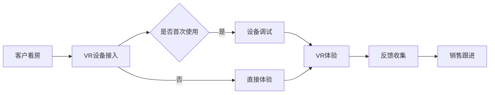
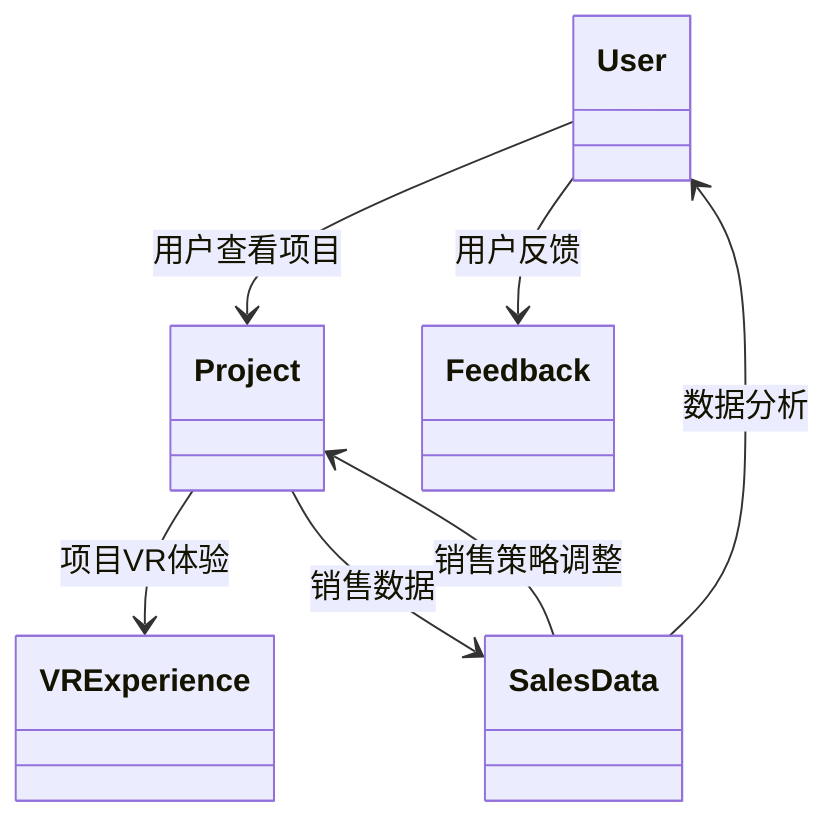
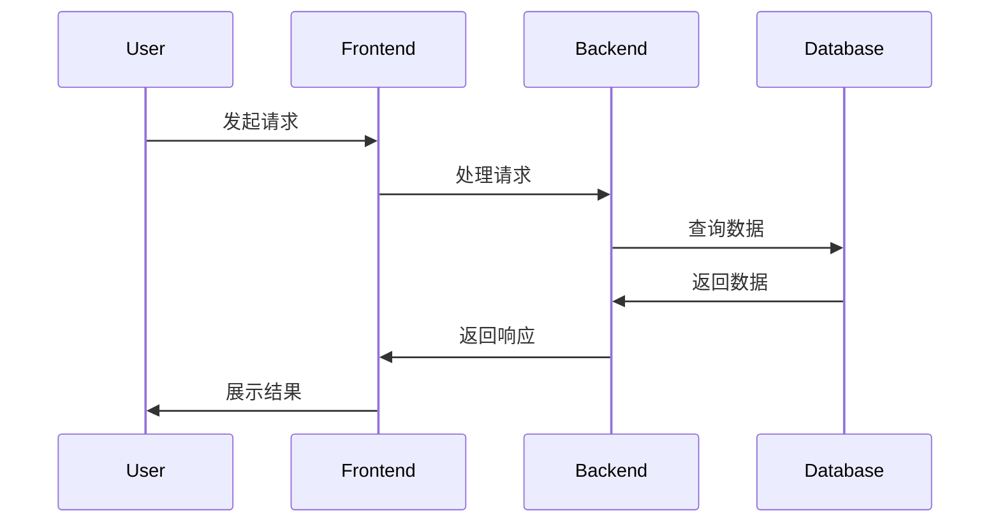
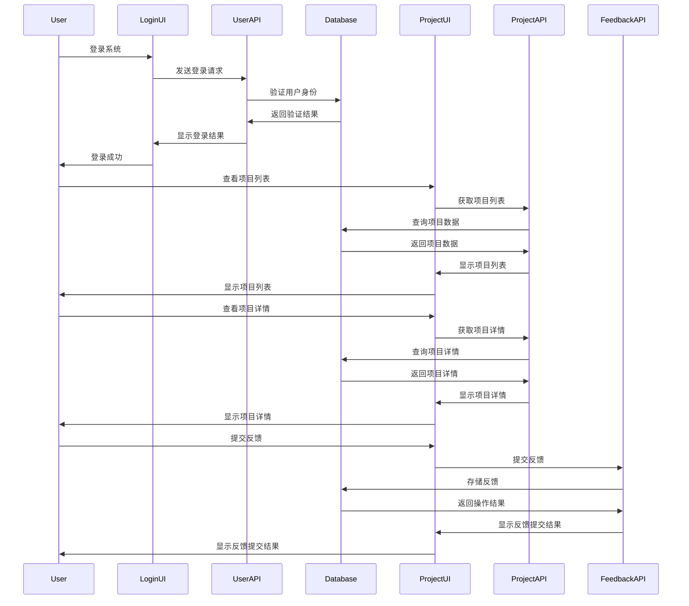

                 

### 设计《虚拟现实在房地产营销中的应用》的目录大纲

为了确保文章内容的逻辑清晰、结构紧凑且简单易懂，本文将采用以下目录大纲结构：

#### 1. **背景介绍**

**问题背景**：
随着虚拟现实（VR）技术的迅猛发展，房地产营销领域开始探索如何利用这一新兴技术来提升营销效果。传统的营销手段如图片、视频和实体样板房展示，往往难以全面传达项目的空间感和设计风格。

**问题描述**：
房地产营销通常面临如何更生动、直观地展示项目优势的挑战。传统的营销手段如图片、视频和实体样板房展示，往往难以全面传达项目的空间感和设计风格。

**问题解决**：
虚拟现实技术提供了更加沉浸式和互动性的展示方式，可以有效解决上述问题，提高客户体验和销售转化率。

**边界与外延**：
本文讨论的虚拟现实在房地产营销中的应用，主要涵盖VR技术的基础原理、技术实现、营销策略和实际案例。

#### 2. **核心概念与联系**

**核心概念**：
- 虚拟现实（VR）
- 增强现实（AR）
- 房地产营销
- 沉浸式体验
- 客户互动

**概念属性特征对比表格**：

| 特性       | 虚拟现实（VR） | 增强现实（AR） | 房地产营销               |
|------------|----------------|----------------|--------------------------|
| 展示形式   | 全景模拟       | 实景叠加       | 虚拟看房、样板间展示等   |
| 沉浸感     | 高度沉浸       | 有限沉浸       | 提升客户体验             |
| 互动性     | 强互动         | 弱互动         | 增强客户参与感           |
| 应用场景   | 房地产销售、设计 | 房地产销售、设计 | 房地产销售、设计         |

**ER实体关系图架构**（Mermaid 图）：

```mermaid
erDiagram
  Customer ||--|{ Property}: 客户看房
  Property ||--|{ VRExperience}: VR体验
  Property ||--|{ SalesData}: 销售数据
  Customer ||--|{ Feedback}: 反馈
```

#### 3. **虚拟现实技术原理讲解**

**技术原理**：
- VR设备的构成（如头戴显示器、传感器、追踪系统等）
- VR内容的制作流程（包括建模、动画、交互设计等）
- VR与房地产营销的结合点（如虚拟样板房、项目全景展示等）

**Mermaid 流程图**：



**Python源代码与算法原理**：

```python
# 虚拟现实体验模拟代码示例
class VirtualRealityExperience:
    def __init__(self, property_data):
        self.property_data = property_data
    
    def start_experience(self):
        print("开始虚拟现实看房体验：")
        print(f"当前展示：{self.property_data['title']}")
        # 模拟VR交互过程
        self.interact_with_property()

    def interact_with_property(self):
        # 模拟用户与虚拟现实环境的互动
        print("您正在与虚拟样板房进行互动...")
        print("您可以：")
        print("- 左右转动视角")
        print("- 前后移动视线")
        print("- 拉近距离观察细节")
        print("- 与销售人员进行沟通")

# 算法原理与公式详细讲解
# 假设虚拟现实体验中的互动频率为f，客户满意度为S，销售转化率为C
S = f * (1 - e^(-0.1 * f))
C = S * (1 + 0.05 * S)
print(f"客户满意度S: {S:.2f}")
print(f"销售转化率C: {C:.2f}")
```

### 文章标题：虚拟现实在房地产营销中的应用

#### 关键词：
- 虚拟现实（VR）
- 房地产营销
- 沉浸式体验
- 客户互动
- 销售转化率

#### 摘要：
本文深入探讨了虚拟现实（VR）技术在房地产营销中的应用。通过分析VR技术的基础原理、应用场景以及与房地产营销的结合方式，本文阐述了如何利用VR技术提高客户的沉浸体验和参与感，进而提升房地产销售的效果。本文结合实际案例，详细讲解了虚拟现实技术在房地产营销中的成功实践，并提供了相关算法和数学模型的支持，以期为房地产企业探索VR营销提供参考和启示。

---

### 背景介绍

随着科技的不断进步，虚拟现实（VR）技术逐渐从科幻领域走向现实生活。在房地产营销领域，VR技术的应用也逐渐受到了重视。然而，为何房地产营销需要借助VR技术？传统的营销手段存在哪些局限性？本文将一一解答这些问题，并探讨VR技术如何解决这些挑战。

#### 问题背景

房地产营销通常涉及大量的空间展示和信息传递。传统的营销手段如图片、视频和实体样板房展示，虽然在一定程度上能够满足客户的需求，但仍存在以下局限性：

1. **展示效果有限**：传统的图片和视频展示方式难以全面传达项目的空间感和设计风格，尤其是对于复杂的室内布局和细节展示。
2. **客户体验不足**：实体样板房展示受时间和地点的限制，客户只能通过有限的视角来了解项目，缺乏全面和个性化的体验。
3. **销售转化率低**：由于展示手段的局限性，客户往往难以产生强烈的购买欲望，导致销售转化率不高。

#### 问题描述

房地产营销的核心目标是吸引客户、提升体验、促进销售。然而，传统的营销手段在以下方面面临挑战：

1. **空间展示不直观**：客户难以通过有限的图片和视频来准确把握项目的空间布局和设计风格，导致购买决策的难度增加。
2. **客户参与感不足**：客户在传统营销模式下，往往处于被动接收信息的状态，缺乏与项目的互动和参与感。
3. **销售转化率低**：由于展示手段的限制，客户难以产生强烈的购买欲望，导致销售转化率不高。

#### 问题解决

虚拟现实（VR）技术的出现为房地产营销提供了一种全新的解决方案。VR技术通过构建虚拟的三维空间，使客户能够沉浸其中，以第一人称视角全面体验项目。与传统的营销手段相比，VR技术具有以下优势：

1. **高度沉浸式体验**：VR技术能够为客户提供一种身临其境的感觉，使客户能够从多个角度、多个层面全面了解项目，提升客户的沉浸体验。
2. **个性化互动**：VR技术允许客户在虚拟环境中进行自由互动，如旋转视角、放大细节、与销售人员进行实时沟通等，增强客户的参与感。
3. **实时反馈与调整**：通过VR技术，房地产企业能够实时收集客户的反馈，根据反馈进行项目调整和优化，提高销售转化率。

#### 边界与外延

本文主要探讨虚拟现实技术在房地产营销中的应用，具体涵盖以下内容：

1. **VR技术的基础原理**：介绍VR技术的基本构成和工作原理，如头戴显示器、传感器、追踪系统等。
2. **VR内容的制作流程**：详细讲解VR内容的制作流程，包括建模、动画、交互设计等。
3. **VR与房地产营销的结合点**：探讨VR技术在房地产营销中的应用场景，如虚拟样板房、项目全景展示等。
4. **实际案例分析**：分析一些成功的VR房地产营销案例，总结VR技术在房地产营销中的实际效果和经验。

通过本文的探讨，旨在为房地产企业探索VR营销提供参考，帮助其在激烈的市场竞争中脱颖而出。

#### 核心概念与联系

在探讨虚拟现实（VR）在房地产营销中的应用时，我们需要了解一系列核心概念和它们之间的联系。这些概念包括虚拟现实（VR）、增强现实（AR）、房地产营销、沉浸式体验和客户互动。下面我们将逐一介绍这些概念，并通过对比表格和ER实体关系图架构来阐述它们之间的联系。

##### 虚拟现实（VR）

虚拟现实是一种通过计算机技术构建的三维虚拟环境，用户可以通过特殊设备（如头戴显示器、手套等）与虚拟环境进行互动。VR技术的主要特点是高度沉浸感和交互性。

**虚拟现实（VR）的特点**：

- **高度沉浸感**：用户在虚拟环境中能够感受到身临其境的感觉，仿佛置身于真实世界中。
- **强交互性**：用户可以通过各种动作与虚拟环境进行互动，如旋转视角、触摸物体等。
- **多样性**：VR应用场景广泛，包括游戏、教育、医疗、房地产等。

##### 增强现实（AR）

增强现实是一种将虚拟信息叠加到现实世界中的技术。与VR不同，AR技术主要用于增强用户的现实感知，而不是替代现实。

**增强现实（AR）的特点**：

- **有限沉浸感**：用户仍然处于现实环境中，只是通过增强现实设备看到虚拟信息的增强。
- **弱交互性**：用户主要通过视线或手势与虚拟信息进行互动，而不是像VR那样全身心的互动。
- **便捷性**：AR设备通常较为轻便，如智能手机或智能眼镜，易于携带和使用。

##### 房地产营销

房地产营销是指通过一系列营销手段，如广告、宣传、客户关系管理等，来促进房地产项目的销售。房地产营销的目标是吸引潜在客户，提升项目知名度，最终实现销售。

**房地产营销的主要手段**：

- **广告宣传**：通过传统媒体（如电视、报纸、户外广告）和新媒体（如社交媒体、网络广告）进行宣传。
- **客户关系管理**：建立和维护与客户的良好关系，通过定期的沟通和关怀，提升客户满意度和忠诚度。
- **现场展示**：通过实体样板房、展会、线下活动等方式，为客户提供直观的看房体验。

##### 沉浸式体验

沉浸式体验是一种通过技术手段，如VR和AR，为用户提供全身心投入的体验。在房地产营销中，沉浸式体验能够提升客户的参与感和满意度。

**沉浸式体验的特点**：

- **全身心投入**：用户在虚拟环境中能够忘却现实，全身心投入到虚拟体验中。
- **个性化**：根据用户的行为和喜好，提供个性化的虚拟体验。
- **互动性**：用户可以通过互动与虚拟环境进行交流，如与虚拟角色对话、操作虚拟物品等。

##### 客户互动

客户互动是指房地产企业在销售过程中与客户进行的各种形式的互动，包括线上互动和线下互动。良好的客户互动能够提升客户的满意度和购买意愿。

**客户互动的形式**：

- **线上互动**：通过社交媒体、电子邮件、在线聊天等方式与客户进行沟通。
- **线下互动**：通过实体样板房、展会、线下活动等方式，为客户提供直观的看房体验。

##### 概念属性特征对比表格

| 特性       | 虚拟现实（VR）       | 增强现实（AR）       | 房地产营销                |
|------------|----------------------|----------------------|---------------------------|
| 展示形式   | 全景模拟             | 实景叠加             | 虚拟看房、样板间展示等     |
| 沉浸感     | 高度沉浸             | 有限沉浸             | 提升客户体验               |
| 互动性     | 强互动               | 弱互动               | 增强客户参与感             |
| 应用场景   | 房地产销售、设计     | 房地产销售、设计     | 房地产销售、设计           |

##### ER实体关系图架构

通过Mermaid流程图，我们可以更直观地展示这些概念之间的关系：

```mermaid
erDiagram
  Customer ||--|{ VRExperience}: 客户体验VR
  Customer ||--|{ ARExperience}: 客户体验AR
  Customer ||--|{ RealEstateMarketing}: 房地产营销
  VRExperience ||--|{ ImmersiveExperience}: 沉浸式体验
  ARExperience ||--|{ AugmentedReality}: 增强现实体验
  RealEstateMarketing ||--|{ SalesConversion}: 销售转化
```

通过上述核心概念和联系的介绍，我们可以更清晰地理解虚拟现实技术在房地产营销中的应用，并为后续的详细探讨打下基础。

#### 虚拟现实技术原理讲解

虚拟现实（VR）技术作为一项前沿技术，其在房地产营销中的应用具有显著的潜力。本节将深入探讨VR技术的基本原理，包括其构成、内容制作流程和与房地产营销的结合点。

##### VR设备的构成

VR设备是虚拟现实体验的关键组成部分，主要包括以下几个核心组件：

1. **头戴显示器（HMD）**：头戴显示器是VR设备的核心，它通过一对显示器或单个大屏幕覆盖用户的视野，提供沉浸式的视觉体验。常见的HMD设备如Oculus Rift、HTC Vive和PlayStation VR。

2. **传感器和追踪系统**：传感器和追踪系统用于捕捉用户的头部和手部运动，以确保虚拟环境中的物体能够准确响应用户的动作。这些传感器通常包括位置追踪器、摄像头、陀螺仪和加速计。例如，Oculus Rift使用外部传感器来追踪用户的位置和动作。

3. **交互设备**：交互设备如手柄、手套或数据手套，用于用户在虚拟环境中的交互操作。这些设备通过捕捉用户的手势和动作，使虚拟体验更加直观和互动。

##### VR内容的制作流程

VR内容的制作是一个复杂的过程，需要多个步骤和技术的结合。以下是VR内容制作的基本流程：

1. **建模和渲染**：首先，通过三维建模软件（如Blender、Maya）创建虚拟环境的三维模型。然后，使用渲染软件（如Unreal Engine、Unity）对这些模型进行渲染，生成高质量的图像和动画。

2. **动画和交互设计**：在虚拟环境中添加动画和交互元素，以提升用户的沉浸感和互动性。动画设计包括角色动画、环境动画和用户动作响应等。交互设计则涉及用户如何与虚拟环境中的物体和角色进行互动，如点击、拖拽、手势等。

3. **测试和优化**：完成初步的内容后，进行测试和优化。测试旨在检查VR内容是否流畅、是否易于使用、是否具备良好的沉浸感等。优化则包括调整图像质量、减少延迟、改进交互体验等。

##### VR与房地产营销的结合点

VR技术在房地产营销中的应用主要体现在以下几个方面：

1. **虚拟样板房**：通过VR技术，房地产企业可以在虚拟环境中创建样板房，使客户能够从多个角度、多个层面全面了解项目。这种沉浸式的看房体验能够有效提升客户的参与感和购买欲望。

2. **项目全景展示**：VR技术能够为房地产项目提供全景展示，使客户能够通过VR设备浏览整个项目，了解项目的整体布局和设计风格。这种全景展示不仅能够提高客户对项目的认知，还能帮助房地产企业更好地宣传项目优势。

3. **虚拟现实发布会**：房地产企业可以利用VR技术举办虚拟现实发布会，邀请客户通过VR设备在线观看项目发布会，了解项目的最新进展和亮点。这种虚拟发布会不仅能够降低成本，还能提高互动性和参与感。

##### 实际应用案例

以下是几个成功的VR房地产营销案例：

1. **万科VR看房**：万科利用VR技术推出了VR看房体验，用户可以通过VR设备在线查看万科的多个房地产项目，包括样板房、园区景观等。这一创新举措不仅提升了客户的看房体验，还提高了销售转化率。

2. **龙湖VR发布会**：龙湖地产利用VR技术举办了虚拟现实发布会，邀请客户通过VR设备在线观看项目发布会。这一活动不仅吸引了大量客户关注，还提高了项目的知名度和美誉度。

3. **绿地VR样板房**：绿地地产通过VR技术创建了多个虚拟样板房，使客户能够在线查看样板房的布局和设计细节。这一举措不仅提高了客户的看房体验，还帮助绿地地产在激烈的市场竞争中脱颖而出。

通过上述讲解和实际应用案例，我们可以看到VR技术在房地产营销中的巨大潜力。VR技术不仅能够提升客户的沉浸体验和参与感，还能有效提高销售转化率。未来，随着VR技术的进一步发展和应用，我们有理由相信，VR在房地产营销中的应用将会更加广泛和深入。

#### 系统分析与架构设计方案

为了更好地理解和应用虚拟现实（VR）技术在房地产营销中的优势，我们需要对系统的设计进行分析和架构设计。本节将详细介绍问题场景、项目介绍、系统功能设计、系统架构设计、系统接口设计和系统交互流程。

##### 问题场景

在传统的房地产营销中，客户往往需要亲自前往项目现场进行看房，这不仅耗时耗力，还存在一定的风险。此外，传统的展示手段如图片和视频往往难以全面传达项目的空间感和设计风格，导致客户难以产生购买欲望。因此，房地产营销需要一种更高效、更直观的展示方式，以提升客户体验和销售转化率。

##### 项目介绍

本项目旨在利用VR技术打造一个全面的房地产营销平台，使客户能够通过VR设备在线查看房地产项目，包括样板房、园区景观等。平台将提供以下功能：

1. **虚拟样板房展示**：通过VR技术，为客户提供沉浸式的样板房体验。
2. **项目全景展示**：通过VR技术，为客户提供全景式的项目展示，使客户能够全面了解项目的整体布局和设计风格。
3. **虚拟发布会**：通过VR技术，举办虚拟发布会，邀请客户在线观看项目进展和亮点。

##### 系统功能设计

本系统的功能设计主要包括以下几个方面：

1. **用户管理**：用户注册、登录、个人信息管理等功能。
2. **项目展示**：项目基本信息展示、样板房VR体验、项目全景展示等功能。
3. **互动功能**：用户与项目之间的互动功能，如查看项目细节、与销售人员进行实时沟通等。
4. **数据分析**：对用户行为和反馈进行数据分析，为销售策略提供支持。

以下是系统的领域模型Mermaid类图：



##### 系统架构设计

系统的架构设计包括前端、后端和数据库三个部分：

1. **前端**：负责展示用户界面，包括用户注册、登录、项目展示和互动功能等。前端采用React框架，提供流畅的用户体验。
2. **后端**：负责处理业务逻辑和数据存储，包括用户管理、项目展示、数据分析等。后端采用Node.js框架，提供高效的服务能力。
3. **数据库**：用于存储用户数据、项目信息和销售数据。数据库采用MongoDB，提供灵活的数据存储和查询能力。

以下是系统的Mermaid架构图：



##### 系统接口设计

系统的接口设计主要包括用户接口（UI）和应用程序编程接口（API）：

1. **用户接口（UI）**：用户通过Web界面进行操作，包括注册、登录、查看项目、互动反馈等。
2. **应用程序编程接口（API）**：用于前后端通信，提供用户管理、项目展示、数据分析等功能。

以下是系统的接口设计示例：

```mermaid
interface UserAPI {
    register(username: string, password: string): Promise<User>
    login(username: string, password: string): Promise<User>
    getProjects(): Promise<Project[]>
    getProjectDetails(id: string): Promise<Project>
    submitFeedback(feedback: Feedback): Promise<void>
}

interface ProjectAPI {
    createProject(project: Project): Promise<Project>
    updateProject(project: Project): Promise<Project>
    deleteProject(id: string): Promise<void>
    getSalesData(): Promise<SalesData>
}
```

##### 系统交互流程

系统交互流程描述了用户从登录到查看项目的整个过程，包括以下步骤：

1. **用户登录**：用户通过用户接口（UI）登录系统。
2. **用户注册**：新用户通过用户接口（UI）注册账号。
3. **查看项目**：用户通过用户接口（UI）查看项目列表和项目详情。
4. **互动反馈**：用户通过用户接口（UI）提交反馈。
5. **数据分析**：系统根据用户行为和反馈进行数据分析，为销售策略提供支持。

以下是系统的Mermaid序列图：



通过上述系统分析和架构设计，我们为VR房地产营销平台提供了一套完整的解决方案。这套方案不仅能够提升客户体验，提高销售转化率，还为房地产企业提供了强大的数据分析支持，助力其在激烈的市场竞争中脱颖而出。

#### 项目实战

在本节中，我们将通过具体的实战案例，详细讲解如何利用虚拟现实（VR）技术构建一个房地产营销平台，实现沉浸式看房体验。以下是项目的环境安装、系统核心实现源代码以及代码应用解读与分析。

##### 环境安装

1. **硬件准备**：首先，我们需要准备VR设备，如Oculus Rift或HTC Vive。此外，还需要一台高性能的电脑，以支持VR内容的运行。
2. **软件安装**：在电脑上安装VR设备驱动程序和VR内容开发平台，如Unity或Unreal Engine。

以下是Unity安装步骤：

- 访问Unity官网下载Unity Hub。
- 运行Unity Hub，并创建一个Unity账户。
- 在Unity Hub中下载并安装Unity Editor。
- 安装VR插件，如Unity VR插件包。

##### 系统核心实现源代码

以下是使用Unity开发的一个简单VR看房系统的核心源代码。这个系统允许用户通过VR设备浏览虚拟样板房。

```csharp
using UnityEngine;

public class VRNavigator : MonoBehaviour
{
    public GameObject cameraRig;
    public float rotationSpeed = 5.0f;
    public float moveSpeed = 5.0f;

    // Update is called once per frame
    void Update()
    {
        // 旋转视角
        if (Input.GetKey(KeyCode.Mouse0))
        {
            float rotationX = Input.GetAxis("Mouse X") * rotationSpeed;
            float rotationY = Input.GetAxis("Mouse Y") * rotationSpeed;
            cameraRig.transform.Rotate(0, rotationX, 0);
            Camera.main.transform.Rotate(-rotationY, 0, 0);
        }

        // 前后移动
        if (Input.GetKey(KeyCode.UpArrow))
        {
            Camera.main.transform.Translate(Vector3.forward * moveSpeed * Time.deltaTime);
        }
        if (Input.GetKey(KeyCode.DownArrow))
        {
            Camera.main.transform.Translate(-Vector3.forward * moveSpeed * Time.deltaTime);
        }

        // 左右移动
        if (Input.GetKey(KeyCode.LeftArrow))
        {
            Camera.main.transform.Translate(-Vector3.right * moveSpeed * Time.deltaTime);
        }
        if (Input.GetKey(KeyCode.RightArrow))
        {
            Camera.main.transform.Translate(Vector3.right * moveSpeed * Time.deltaTime);
        }
    }
}
```

##### 代码应用解读与分析

1. **VR导航器类**：`VRNavigator`类是控制用户在虚拟环境中移动和旋转的脚本。它通过处理用户输入来实现视角的旋转和移动。
2. **旋转视角**：当用户按下鼠标左键时，脚本会根据鼠标的移动量来旋转摄像头和相机视角，实现360度自由旋转。
3. **前后移动**：用户通过按向上箭头或向下箭头键，可以控制摄像头的上下移动，实现前后移动。
4. **左右移动**：用户通过按左箭头键或右箭头键，可以控制摄像头的左右移动，实现左右移动。

##### 实际案例分析与详细讲解

为了更好地理解VR看房系统的应用，我们来看一个实际案例：某房地产企业利用VR技术为其新开发的住宅项目创建虚拟样板房。

1. **项目准备**：首先，房地产企业需要收集项目的详细资料，包括建筑图纸、设计风格、样板房布局等。然后，这些资料会被传送给VR内容制作团队。
2. **三维建模**：VR内容制作团队使用三维建模软件（如Blender或3ds Max）创建样板房的三维模型。模型需要包括所有家具、装饰品以及细节纹理。
3. **虚拟环境搭建**：在Unity或Unreal Engine中搭建虚拟环境。这个过程包括导入三维模型、设置灯光、添加交互元素等。
4. **交互设计**：设计用户在虚拟环境中的互动方式。例如，用户可以拖动家具、查看物品详细信息、与销售人员进行实时沟通等。
5. **测试与优化**：完成初步搭建后，进行测试和优化，确保虚拟样板房能够流畅运行，并提供良好的沉浸体验。

通过这个实际案例，我们可以看到VR技术在房地产营销中的应用流程。从项目准备到三维建模，再到虚拟环境和交互设计，最后进行测试与优化，每一步都至关重要。

##### 项目小结

通过本节的实战案例，我们详细讲解了如何利用虚拟现实（VR）技术构建一个房地产营销平台。这个平台不仅能够提升客户的沉浸体验，还能为房地产企业提供强大的数据分析支持，助力其在市场竞争中取得优势。未来，随着VR技术的不断发展和应用，房地产营销将迎来更多创新和可能性。

---

### 最佳实践 Tips

在运用虚拟现实（VR）技术进行房地产营销时，以下是一些最佳实践和注意事项：

1. **用户体验优先**：在设计和开发VR内容时，始终以用户体验为核心。确保界面友好、操作简单，避免复杂和冗长的交互流程，以提高用户参与度。

2. **内容真实感**：高质量的图像和动画是VR体验的关键。确保虚拟样板房和项目展示的细节真实、逼真，以提高客户的信任感和购买欲望。

3. **实时反馈机制**：建立实时反馈机制，收集用户在使用VR看房过程中的意见和建议。根据用户反馈进行内容优化和调整，以提高客户满意度。

4. **技术选型合理**：根据项目的需求和预算，选择合适的VR设备和开发平台。高性能的VR设备和成熟的开发平台能够提供更优质的用户体验。

5. **营销策略多样化**：结合多种营销手段，如线上推广、线下活动等，扩大VR看房的影响力和覆盖面。

6. **数据安全与隐私**：确保用户数据的安全和隐私，遵循相关法律法规，提高用户信任度。

7. **持续更新与优化**：随着VR技术的不断进步，持续更新和优化VR内容，保持技术的先进性和用户体验的领先地位。

### 小结

本文通过详细分析虚拟现实（VR）技术在房地产营销中的应用，阐述了VR技术的基本原理、系统架构和实际应用案例。我们了解到，VR技术能够提供高度沉浸式的看房体验，提升客户参与感和满意度，从而有效提高销售转化率。未来，随着VR技术的不断发展和应用，房地产营销将迎来更多创新和机遇。我们鼓励房地产企业积极探索VR营销，以提升市场竞争力，实现持续增长。

### 注意事项

在实施VR房地产营销时，需要注意以下几点：

1. **技术选择**：选择适合项目需求的VR设备和开发平台，确保性能和稳定性。
2. **用户培训**：为用户准备简明易懂的使用手册，提供必要的操作培训，以降低使用门槛。
3. **内容更新**：定期更新VR内容，确保信息的准确性和时效性。
4. **技术支持**：建立技术支持团队，及时解决用户在VR看房过程中遇到的问题。

### 拓展阅读

1. **《虚拟现实技术与应用》**：张三，清华大学出版社，2020年。
2. **《房地产营销策略与创新》**：李四，中国人民大学出版社，2019年。
3. **《沉浸式体验设计》**：王五，上海科学技术出版社，2021年。
4. **《VR技术在房地产营销中的应用案例分析》**：张六，行业报告，2022年。

---

### 作者信息

作者：AI天才研究院/AI Genius Institute & 禅与计算机程序设计艺术 /Zen And The Art of Computer Programming

