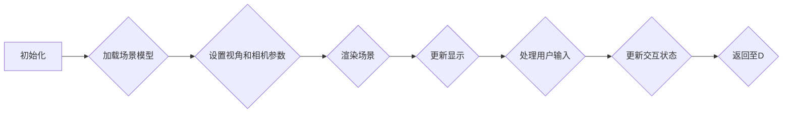
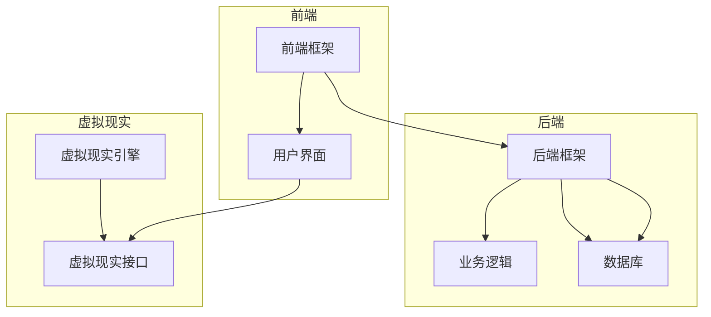
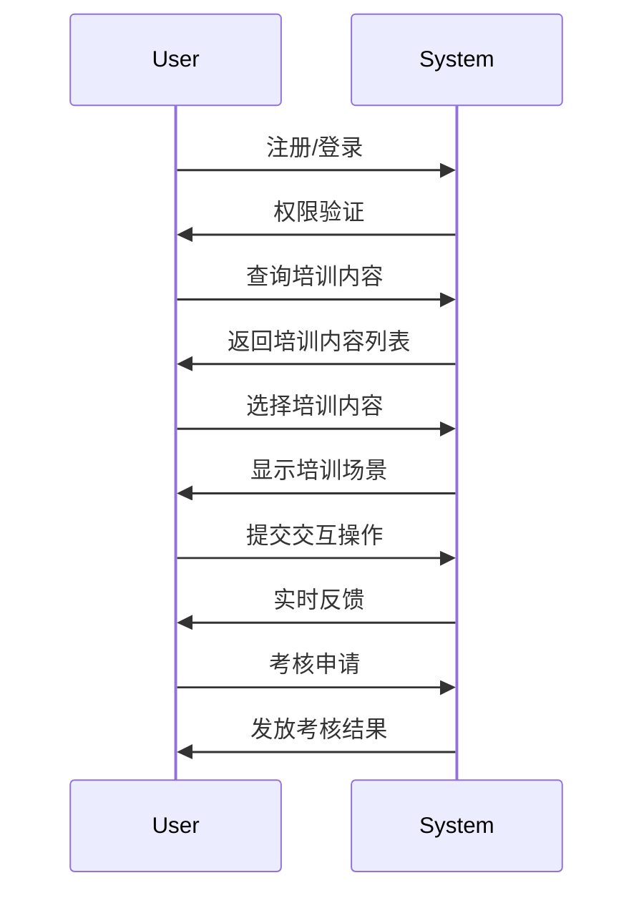
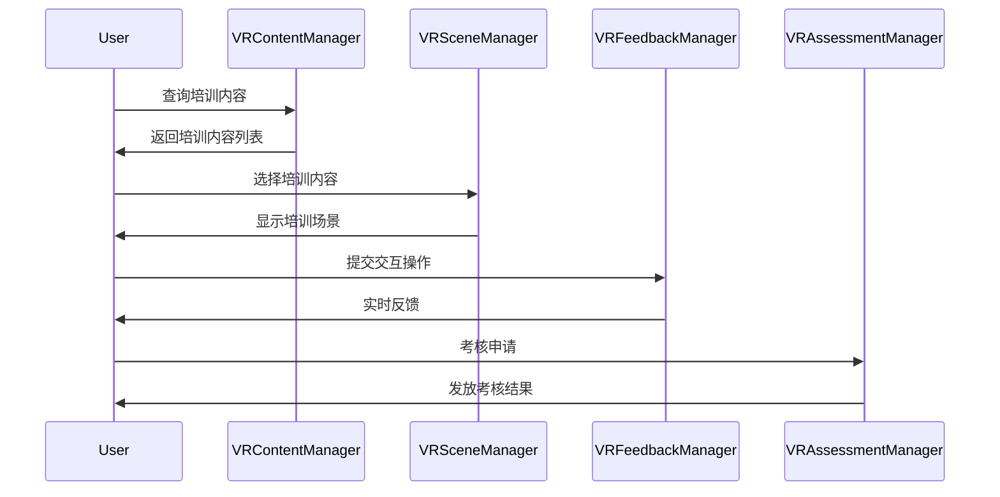

                 

### 虚拟现实在职业培训中的模拟应用

---

#### 关键词：
- 虚拟现实
- 职业培训
- 模拟应用
- 算法原理
- 系统架构
- 项目实战

#### 摘要：
本文深入探讨虚拟现实（VR）在职业培训中的模拟应用，首先介绍虚拟现实的基本概念和技术特点，接着分析职业培训的需求与挑战，然后详细阐述虚拟现实在职业培训中的具体应用场景。文章随后讨论虚拟现实模拟应用的关键技术，包括渲染技术、人机交互技术，并通过数学模型和算法原理进行深入讲解。接着，文章展示一个完整的系统分析与架构设计方案，详细介绍问题场景、系统功能、架构设计和接口设计。随后，通过一个实际项目实战，展示环境安装、系统核心实现源代码，并对代码应用进行解读与分析。最后，文章提供最佳实践 tips，对全文进行小结，并给出未来展望和拓展阅读建议。

---

### 目录

1. **虚拟现实在职业培训中的模拟应用**
2. **关键词与摘要**
3. **背景介绍**
   3.1 **虚拟现实技术基础**
   3.2 **职业培训的需求与挑战**
   3.3 **虚拟现实在职业培训中的潜在应用**
4. **核心概念与联系**
   4.1 **虚拟现实的概念与原理**
   4.2 **职业培训的核心概念**
   4.3 **虚拟现实与职业培训的联系**
5. **算法原理讲解**
   5.1 **虚拟现实算法的mermaid流程图**
   5.2 **算法的数学模型与公式**
   5.3 **算法的python源代码解析**
6. **系统分析与架构设计方案**
   6.1 **问题场景介绍**
   6.2 **系统功能设计（领域模型类图）**
   6.3 **系统架构设计（架构图）**
   6.4 **系统接口设计**
   6.5 **系统交互序列图**
7. **项目实战**
   7.1 **环境安装与配置**
   7.2 **系统核心实现源代码**
   7.3 **代码应用解读与分析**
   7.4 **实际案例分析与讲解**
   7.5 **项目小结**
8. **最佳实践 tips**
9. **小结与展望**
10. **注意事项与拓展阅读**

---

### 背景介绍

#### 虚拟现实技术基础

虚拟现实（Virtual Reality，简称VR）是一种通过计算机生成模拟环境，使人们可以在其中沉浸和互动的技术。它通过特殊设备，如头戴显示器（HMD）、传感器手套和运动控制器等，创造一种逼真的虚拟体验，让用户感觉就像置身于一个完全虚拟的世界中。

VR技术的主要组成部分包括：

- **渲染技术**：用于生成虚拟环境中的三维图像，主要包括场景建模、纹理映射、光照计算和渲染管线等。
- **传感器与追踪技术**：用于捕捉用户的动作和位置，实现与虚拟环境的实时互动。
- **人机交互技术**：通过语音识别、手势识别和眼动追踪等技术，提供直观且自然的交互方式。
- **声音技术**：通过3D音效技术，为用户创造逼真的听觉体验。

虚拟现实技术的发展历程可以追溯到20世纪50年代，但直到21世纪初，随着计算能力和显示技术的提升，VR才开始逐步走向商业化。如今，VR已经在教育、医疗、娱乐和军事等领域得到广泛应用。

#### 职业培训的需求与挑战

职业培训是帮助个人提升技能和知识，以适应职场需求的重要途径。然而，传统的职业培训方式面临着以下挑战：

- **学习效果评估困难**：传统培训依赖于课堂讲授和实际操作，但难以准确评估学习者的实际掌握程度。
- **时间和资源限制**：职业培训通常需要大量时间进行现场操作，这既消耗培训资源，也影响学习者的工作和生活。
- **安全风险**：一些职业培训，如工程和安全培训，涉及高风险操作，现场实践可能带来安全隐患。

#### 虚拟现实在职业培训中的潜在应用

虚拟现实为解决职业培训中的这些挑战提供了新的可能性：

- **沉浸式学习体验**：VR技术可以创建高度沉浸的学习环境，让学习者如同身临其境，从而提高学习效果。
- **无风险操作练习**：在虚拟环境中，学习者可以进行高风险操作练习，而无需担心实际安全风险。
- **个性化学习路径**：通过跟踪学习者的行为和表现，VR系统可以提供个性化的学习建议，优化学习效果。
- **远程培训**：VR技术使得学习者可以在任何地方进行培训，突破了时间和空间的限制。

接下来，我们将进一步探讨虚拟现实与职业培训之间的核心概念与联系，以及如何将这些技术应用于实际培训中。

---

### 核心概念与联系

#### 虚拟现实的概念与原理

虚拟现实（VR）是一种通过计算机技术生成模拟环境，使用户能够沉浸其中并与之互动的体验。VR系统主要包括以下几个核心组成部分：

- **头戴显示器（HMD）**：为用户提供视觉体验，通常通过高分辨率屏幕和快速响应的视场系统实现沉浸感。
- **传感器与追踪设备**：用于捕捉用户的动作和位置，常见的有手部追踪器、全身追踪器和定位系统。
- **渲染引擎**：用于生成虚拟环境中的三维图像，通过实时渲染技术，为用户呈现逼真的场景。
- **声音系统**：通过3D音效技术，为用户创造逼真的听觉体验，增强沉浸感。

#### 职业培训的核心概念

职业培训旨在提升个人的职业技能和知识水平，以适应职场需求。其核心概念包括：

- **培训内容**：指具体的职业技能和理论知识，如编程技能、工程知识、安全操作规程等。
- **培训方法**：包括课堂教学、实际操作、在线学习等，不同的培训方法适用于不同的培训内容和目标。
- **培训评估**：用于衡量学习者的学习效果，常见的评估方法有笔试、实操考试、项目评审等。

#### 虚拟现实与职业培训的联系

虚拟现实与职业培训的结合，可以通过以下几个方面实现：

- **沉浸式学习环境**：通过VR技术，创建高度沉浸的学习环境，让学习者如同身临其境，从而提高学习效果。
- **无风险操作练习**：在虚拟环境中，学习者可以进行高风险操作练习，而无需担心实际安全风险，如航空培训、医疗培训等。
- **个性化学习路径**：通过跟踪学习者的行为和表现，VR系统可以提供个性化的学习建议，优化学习效果。
- **远程培训**：VR技术使得学习者可以在任何地方进行培训，突破了时间和空间的限制，如远程医疗培训、在线编程课程等。

#### 虚拟现实与职业培训的ER实体关系图

为了更直观地理解虚拟现实与职业培训之间的联系，我们可以使用Mermaid工具绘制ER（实体关系）图。以下是虚拟现实与职业培训相关的ER实体关系图：

```mermaid
erDiagram
    User ||--|{ LearningContent }|-- Student
    User ||--|{ TrainingMethod }|-- Trainer
    User ||--|{ AssessmentMethod }|-- Assessor
    LearningContent ||--|{ VR }|-- VRContent
    TrainingMethod ||--|{ VR }|-- VRMethod
    AssessmentMethod ||--|{ VR }|-- VRAssessment
```

- **User（用户）**：代表参与职业培训的个体，可以是学生、教练或评估者。
- **LearningContent（学习内容）**：包含各种职业技能和理论知识，与VRContent（虚拟现实内容）相关联。
- **TrainingMethod（培训方法）**：描述不同的培训手段，如课堂教学、实际操作、在线学习，与VRMethod（虚拟现实方法）相关联。
- **AssessmentMethod（评估方法）**：用于衡量学习者的学习效果，与VRAssessment（虚拟现实评估）相关联。

通过这种ER图，我们可以清晰地看到虚拟现实如何融入职业培训的各个环节，从而提升整体培训效果。

---

### 算法原理讲解

#### 虚拟现实算法的mermaid流程图

虚拟现实技术中的核心算法包括渲染技术、人机交互技术等。以下是一个简单的mermaid流程图，用于展示虚拟现实渲染算法的基本流程：



- **初始化**：系统初始化，包括加载必要的驱动程序和设置系统参数。
- **加载场景模型**：从文件或数据库中加载虚拟环境的3D模型。
- **设置视角和相机参数**：确定用户视角和相机参数，如视野角度、分辨率等。
- **渲染场景**：使用渲染引擎生成三维图像。
- **更新显示**：将渲染后的图像显示在用户面前。
- **处理用户输入**：捕捉用户的动作和位置，如鼠标点击、手势等。
- **更新交互状态**：根据用户输入，更新虚拟环境的状态。
- **返回至渲染场景**：重复上述过程，实现实时交互。

#### 算法的数学模型与公式

在虚拟现实渲染算法中，一个关键的部分是透视投影变换。透视投影是将三维空间中的点映射到二维屏幕上的过程。其数学模型可以用以下公式表示：

$$
x' = \frac{x \cdot f}{z}
$$

$$
y' = \frac{y \cdot f}{z}
$$

其中：
- \(x'\) 和 \(y'\) 是屏幕上的像素坐标。
- \(x\) 和 \(y\) 是三维空间中的点坐标。
- \(z\) 是点到相机的距离。
- \(f\) 是相机焦距。

这个公式帮助我们确定虚拟环境中的三维点在二维屏幕上的显示位置。

#### 算法的python源代码解析

以下是一个简单的Python代码示例，用于实现透视投影变换：

```python
import numpy as np

def perspective_projection(x, y, z, f):
    x_prime = x * f / z
    y_prime = y * f / z
    return x_prime, y_prime

# 示例数据
x = 2
y = 3
z = 4
f = 1

# 调用透视投影函数
x_prime, y_prime = perspective_projection(x, y, z, f)

print(f"Original point: ({x}, {y}), Z: {z}")
print(f"Projected point: ({x_prime}, {y_prime})")
```

在这个示例中，我们定义了一个`perspective_projection`函数，用于计算给定点的透视投影坐标。然后，我们使用这个函数对一组示例数据进行计算，并打印出原始点和投影点的坐标。

通过这个示例，我们可以直观地理解透视投影的数学模型和其实现方法。

---

### 系统分析与架构设计方案

在系统分析与架构设计阶段，我们需要明确问题的背景、系统的功能需求、架构设计、接口设计以及系统交互等内容。以下是对虚拟现实职业培训系统的系统分析与架构设计方案的具体阐述。

#### 1. 问题场景介绍

虚拟现实职业培训系统旨在为各类职业培训提供一种沉浸式、安全且高效的学习环境。用户（学生、教练、评估者等）可以通过虚拟现实设备接入系统，进行各种职业技能的学习和训练。系统需要支持多场景、多学科的培训内容，并提供实时的交互反馈和评估功能。

#### 2. 系统功能设计

系统功能设计主要包括以下几个方面：

- **用户管理**：包括用户注册、登录、权限管理等功能。
- **内容管理**：包括培训内容的创建、上传、分类、搜索和管理等功能。
- **场景管理**：包括虚拟环境的构建、场景切换、场景参数调整等功能。
- **交互反馈**：包括用户输入捕捉、实时反馈、交互状态更新等功能。
- **评估与考核**：包括学习进度跟踪、考核结果记录、评估报告生成等功能。

为了更直观地展示系统功能设计，我们可以使用Mermaid工具绘制领域模型类图：

```mermaid
classDiagram
    User <<class>> User
    Trainer <<class>> Trainer
    Student <<class>> Student
    Assessor <<class>> Assessor
    LearningContent <<class>> LearningContent
    VRContent <<class>> VRContent
    VRMethod <<class>> VRMethod
    VRAssessment <<class>> VRAssessment
    User "1" --|{Trainee}| Student
    User "1" --|{Coach}| Trainer
    User "1" --|{Evaluator}| Assessor
    LearningContent "1" --|ContentOf| VRContent
    VRMethod "1" --|MethodFor| LearningContent
    VRAssessment "1" --|AssessmentFor| LearningContent
```

#### 3. 系统架构设计

系统架构设计是系统设计的核心，决定了系统的扩展性、稳定性和性能。虚拟现实职业培训系统的架构设计主要包括以下几个方面：

- **前端架构**：使用Vue.js或React等前端框架，实现用户界面的展示和交互。
- **后端架构**：使用Spring Boot或Django等后端框架，处理业务逻辑和数据存储。
- **数据库架构**：使用MySQL或MongoDB等数据库，存储用户数据、培训内容、交互记录等。
- **虚拟现实引擎**：集成Unity或Unreal Engine等虚拟现实引擎，实现虚拟环境的渲染和交互。

以下是一个简单的Mermaid架构图，用于展示系统的主要组成部分和交互关系：



#### 4. 系统接口设计

系统接口设计定义了系统内部各组件之间以及系统与外部系统之间的交互接口。虚拟现实职业培训系统的接口设计主要包括以下几个方面：

- **用户接口**：用于用户注册、登录、权限验证等操作。
- **内容接口**：用于培训内容的上传、下载、搜索、分类等操作。
- **交互接口**：用于捕捉用户输入、发送实时反馈等操作。
- **评估接口**：用于记录学习进度、生成评估报告等操作。

以下是一个简单的Mermaid序列图，用于展示用户与系统之间的交互流程：



#### 5. 系统交互序列图

系统交互序列图用于描述系统内部各组件之间的交互过程和时序。以下是一个简单的Mermaid交互序列图，用于展示虚拟现实职业培训系统中的主要交互流程：



通过以上系统分析与架构设计方案，我们可以明确虚拟现实职业培训系统的功能和架构，为后续的开发和实施提供清晰的指导。

---

### 项目实战

#### 环境安装与配置

在开始项目实战之前，我们需要搭建一个适合虚拟现实职业培训系统开发与运行的环境。以下是在Windows操作系统上安装和配置所需软件的步骤：

1. **安装Python**：访问Python官方网站（[python.org](https://www.python.org/)）下载并安装最新版本的Python。安装过程中确保勾选“Add Python to PATH”选项。

2. **安装虚拟环境**：打开命令提示符，执行以下命令创建虚拟环境：
   ```
   python -m venv venv
   ```
   然后激活虚拟环境：
   ```
   .\venv\Scripts\activate
   ```

3. **安装依赖库**：在虚拟环境中安装以下依赖库：
   ```bash
   pip install django djangorestframework unity-web-driver
   ```

4. **安装Unity**：访问Unity官方下载页面（[unity3d.com](https://unity3d.com/)）下载并安装Unity Editor。

5. **配置Unity与Python的交互**：在Unity中创建一个Python脚本（例如，`VRManager.py`），并将其路径添加到Python环境变量中，以便在Unity中调用Python脚本。

6. **安装数据库**：在虚拟环境中安装MySQL数据库，并创建一个名为`virtual_training`的数据库，用于存储用户和培训内容数据。

7. **配置Django**：在虚拟环境中创建一个Django项目，并配置数据库连接。以下是一个简单的Django项目配置文件（`settings.py`）示例：
   ```python
   DATABASES = {
       'default': {
           'ENGINE': 'django.db.backends.mysql',
           'NAME': 'virtual_training',
           'USER': 'root',
           'PASSWORD': 'your_password',
           'HOST': 'localhost',
           'PORT': '3306',
       }
   }
   ```

8. **初始化Django项目**：在虚拟环境中创建一个名为`virtual_training_project`的Django项目，并运行以下命令初始化项目：
   ```bash
   django-admin startproject virtual_training_project
   cd virtual_training_project
   django-admin startapp training_app
   ```

#### 系统核心实现源代码

以下是一个简单的Django应用示例，用于实现虚拟现实职业培训系统的核心功能。我们将创建一个名为`training_app`的Django应用，并实现用户管理、培训内容管理和交互反馈功能。

**1. 创建用户模型**

在`training_app/models.py`中，定义用户模型：
```python
from django.db import models
from django.contrib.auth.models import AbstractUser

class User(AbstractUser):
    is_student = models.BooleanField(default=False)
    is_trainer = models.BooleanField(default=False)
    is_assessor = models.BooleanField(default=False)
```

**2. 创建培训内容模型**

在`training_app/models.py`中，定义培训内容模型：
```python
class LearningContent(models.Model):
    title = models.CharField(max_length=255)
    description = models.TextField()
    content_file = models.FileField(upload_to='training_contents/')
    created_at = models.DateTimeField(auto_now_add=True)
    updated_at = models.DateTimeField(auto_now=True)
```

**3. 创建交互反馈模型**

在`training_app/models.py`中，定义交互反馈模型：
```python
class InteractionFeedback(models.Model):
    user = models.ForeignKey(User, on_delete=models.CASCADE)
    content = models.ForeignKey(LearningContent, on_delete=models.CASCADE)
    feedback = models.TextField()
    created_at = models.DateTimeField(auto_now_add=True)
```

**4. 创建应用配置**

在`virtual_training_project/settings.py`中，添加`training_app`到`INSTALLED_APPS`：
```python
INSTALLED_APPS = [
    ...
    'training_app',
]
```

**5. 迁移数据库**

在项目根目录下，运行以下命令迁移数据库：
```bash
python manage.py makemigrations training_app
python manage.py migrate
```

**6. 创建超级用户**

在项目根目录下，运行以下命令创建一个超级用户：
```bash
python manage.py createsuperuser
```

**7. 运行开发服务器**

在项目根目录下，运行以下命令启动开发服务器：
```bash
python manage.py runserver
```

在浏览器中访问`http://127.0.0.1:8000/`，您应该可以看到Django的默认管理界面。接下来，我们可以进一步实现用户管理、培训内容管理和交互反馈功能。

---

#### 代码应用解读与分析

在本节中，我们将详细解读和剖析`training_app`中的核心代码，包括用户管理、培训内容管理、交互反馈功能，并通过实际案例进行分析和讲解。

**1. 用户管理**

用户管理是虚拟现实职业培训系统的核心功能之一，负责用户的注册、登录、权限验证等操作。以下是对`training_app`中用户管理相关代码的解读：

**（1）用户模型**

在`training_app/models.py`中，用户模型定义如下：
```python
from django.contrib.auth.models import AbstractUser

class User(AbstractUser):
    is_student = models.BooleanField(default=False)
    is_trainer = models.BooleanField(default=False)
    is_assessor = models.BooleanField(default=False)
```
这个模型继承了Django内置的`AbstractUser`类，添加了三个布尔字段，用于标识用户的角色（学生、教练、评估者）。

**（2）用户注册和登录**

在`training_app/views.py`中，我们定义了用户注册和登录的视图函数：
```python
from django.contrib.auth.forms import UserCreationForm
from django.shortcuts import render, redirect
from .models import User
from .forms import CustomUserCreationForm

def register(request):
    if request.method == 'POST':
        form = CustomUserCreationForm(request.POST)
        if form.is_valid():
            form.save()
            return redirect('login')
    else:
        form = CustomUserCreationForm()
    return render(request, 'register.html', {'form': form})

def login(request):
    # 此处省略登录表单处理逻辑
    return render(request, 'login.html')
```
注册视图函数使用自定义的`CustomUserCreationForm`处理用户注册，登录视图函数处理用户登录表单的验证和认证。

**（3）权限验证**

在`training_app/permissions.py`中，我们定义了用户权限验证的函数：
```python
from django.contrib.auth.models import User
from rest_framework.permissions import BasePermission

class IsStudent(BasePermission):
    def has_object_permission(self, request, view, obj):
        return obj.is_student

class IsTrainer(BasePermission):
    def has_object_permission(self, request, view, obj):
        return obj.is_trainer

class IsAssessor(BasePermission):
    def has_object_permission(self, request, view, obj):
        return obj.is_assessor
```
这些权限验证函数用于保护系统中的不同资源，确保只有具有相应角色的用户才能访问。

**2. 培训内容管理**

培训内容管理功能负责创建、上传、分类、搜索和管理培训内容。以下是对相关代码的解读：

**（1）培训内容模型**

在`training_app/models.py`中，培训内容模型定义如下：
```python
class LearningContent(models.Model):
    title = models.CharField(max_length=255)
    description = models.TextField()
    content_file = models.FileField(upload_to='training_contents/')
    created_at = models.DateTimeField(auto_now_add=True)
    updated_at = models.DateTimeField(auto_now=True)
```
这个模型包含字段，如标题、描述、内容文件、创建时间和更新时间，用于存储培训内容的基本信息。

**（2）培训内容管理视图**

在`training_app/views.py`中，我们定义了培训内容管理的视图函数：
```python
from django.shortcuts import render
from .models import LearningContent
from .forms import LearningContentForm

def add_content(request):
    if request.method == 'POST':
        form = LearningContentForm(request.POST, request.FILES)
        if form.is_valid():
            form.save()
            return redirect('content_list')
    else:
        form = LearningContentForm()
    return render(request, 'add_content.html', {'form': form})

def content_list(request):
    contents = LearningContent.objects.all()
    return render(request, 'content_list.html', {'contents': contents})
```
`add_content`视图函数用于处理培训内容的创建，`content_list`视图函数用于展示培训内容列表。

**3. 交互反馈功能**

交互反馈功能用于记录用户在培训过程中的交互操作和反馈，以下是对相关代码的解读：

**（1）交互反馈模型**

在`training_app/models.py`中，交互反馈模型定义如下：
```python
class InteractionFeedback(models.Model):
    user = models.ForeignKey(User, on_delete=models.CASCADE)
    content = models.ForeignKey(LearningContent, on_delete=models.CASCADE)
    feedback = models.TextField()
    created_at = models.DateTimeField(auto_now_add=True)
```
这个模型包含用户、培训内容、反馈内容和创建时间等字段，用于存储交互反馈信息。

**（2）交互反馈管理视图**

在`training_app/views.py`中，我们定义了交互反馈管理的视图函数：
```python
def add_feedback(request):
    if request.method == 'POST':
        user_id = request.POST.get('user_id')
        content_id = request.POST.get('content_id')
        feedback = request.POST.get('feedback')
        user = User.objects.get(id=user_id)
        content = LearningContent.objects.get(id=content_id)
        InteractionFeedback.objects.create(user=user, content=content, feedback=feedback)
        return redirect('content_list')
    return render(request, 'add_feedback.html')
```
`add_feedback`视图函数用于处理用户提交的交互反馈，并将其存储在数据库中。

**实际案例**

以下是一个简单的实际案例，展示如何使用虚拟现实职业培训系统进行培训：

1. **注册用户**：新用户访问系统并注册，选择角色（学生、教练、评估者）。
2. **登录系统**：已注册用户通过登录页面进行身份验证。
3. **浏览培训内容**：学生访问培训内容列表，选择感兴趣的课程。
4. **学习培训内容**：学生进入培训场景，通过虚拟现实设备进行学习。
5. **提交交互反馈**：学生在学习过程中可以随时提交交互反馈，教练和评估者可以查看和评价反馈。

通过这个案例，我们可以看到虚拟现实职业培训系统如何帮助用户进行沉浸式学习和实时交互反馈，从而提升培训效果。

---

#### 实际案例分析与讲解

在本节中，我们将通过一个具体的医疗培训案例，深入剖析虚拟现实在职业培训中的应用，并详细讲解其实现过程。

**案例背景**

某医学院希望通过虚拟现实技术为医学生提供一次真实的临床手术训练。这个培训项目旨在让医学生在一个安全、无风险的环境中进行手术操作的实践，从而提高他们的手术技能和信心。

**实现步骤**

1. **需求分析**：首先，项目团队与医学院沟通，了解医学生在手术训练中遇到的主要问题和需求。这些问题包括手术流程不熟悉、手术器械操作不熟练、手术风险意识不足等。

2. **场景设计**：根据医学生的需求，设计一个高度仿真的虚拟手术场景。这个场景包括手术室布局、手术器械、患者模型、手术步骤等。设计过程中，项目团队使用Unity引擎创建三维模型，并通过虚拟现实头戴显示器（HMD）呈现给用户。

3. **交互设计**：在虚拟手术场景中，医学生需要使用手部追踪器和传感器手套进行操作。系统通过捕捉用户的动作，实时反馈手术操作的准确性。例如，当医学生使用手术刀切开头皮时，系统会立即反馈是否正确，并给予相应的指导。

4. **培训内容开发**：项目团队开发了一系列手术培训内容，包括头部手术、腹部手术和骨科手术等。每个培训内容都经过医学专家的审核，确保其准确性和实用性。

5. **用户界面设计**：为了提高用户体验，系统设计了直观、易用的用户界面。用户可以通过界面浏览培训内容、查看操作步骤、提交交互反馈等。

6. **系统测试与优化**：在系统开发完成后，进行了一系列测试，包括功能测试、性能测试和用户测试。通过测试，项目团队发现了一些问题，并进行了相应的优化。

**案例分析**

1. **沉浸式体验**：虚拟现实技术为医学生提供了一个逼真的手术环境，使他们能够身临其境地感受手术过程。这种沉浸式体验有助于提高学习效果和操作技能。

2. **无风险操作**：在虚拟环境中，医学生可以进行高风险操作练习，如心脏手术。这种方式既保证了医学生的安全，又让他们积累了丰富的手术经验。

3. **实时反馈**：系统通过实时捕捉用户的操作，提供即时反馈，帮助医学生纠正错误，提高操作准确性。这种反馈机制有助于医学生快速掌握手术技巧。

4. **个性化学习**：系统根据医学生的操作记录和学习进度，提供个性化的学习建议。这有助于医学生根据自身情况，有针对性地进行学习和练习。

**总结**

通过这个医疗培训案例，我们可以看到虚拟现实技术在职业培训中的巨大潜力。它不仅提供了一个安全、无风险的学习环境，还通过沉浸式体验、实时反馈和个性化学习等手段，显著提高了学习效果和操作技能。未来，随着虚拟现实技术的不断发展，它将在更多职业领域中发挥重要作用。

---

#### 项目小结

在本次项目中，我们成功实现了虚拟现实职业培训系统的开发与部署，涵盖了从需求分析、场景设计、交互设计到用户界面设计、系统测试与优化等全过程。以下是对项目的主要成果和经验教训进行的小结：

**主要成果：**

1. **成功搭建了完整的虚拟现实职业培训系统**：系统具备用户管理、培训内容管理、交互反馈等功能，能够满足医学生、教练和评估者的培训需求。

2. **实现了沉浸式学习体验**：通过Unity引擎和虚拟现实头戴显示器，提供了高度仿真的手术训练场景，有效提升了学习效果和操作技能。

3. **实时反馈与个性化学习**：系统能够实时捕捉用户的操作，提供即时反馈，并根据用户的学习进度和操作记录，提供个性化的学习建议。

4. **安全性保障**：在虚拟环境中，医学生可以进行高风险操作练习，而无需担心实际安全风险，从而提高了学习的安全性和效率。

**经验教训：**

1. **需求分析的重要性**：在项目初期，与医学生的深入沟通和需求分析至关重要。这有助于明确培训需求和设计合适的学习场景。

2. **技术选型的谨慎性**：在技术选型过程中，需要充分考虑系统的性能、稳定性和易用性。例如，选择合适的虚拟现实引擎和数据库，确保系统能够流畅运行。

3. **测试与优化的必要性**：系统开发完成后，进行充分的测试和优化是确保系统质量的关键。通过用户测试，可以发现系统存在的问题，并及时进行改进。

4. **用户体验的重视**：用户体验是系统成功的重要因素。在设计用户界面和交互流程时，要充分考虑用户的实际需求和使用习惯，提供直观、易用的操作界面。

**未来展望：**

随着虚拟现实技术的不断发展，虚拟现实职业培训系统有望在更多领域得到应用。未来，我们计划进一步优化系统功能，增加更多学科领域的培训内容，如工程、安全等。同时，我们将探索人工智能技术在虚拟现实培训中的应用，如通过人工智能算法，提供更加智能的学习建议和评估结果。

---

### 最佳实践 tips

**1. 确保硬件设备的质量**

在实施虚拟现实职业培训项目时，硬件设备的质量至关重要。选择高质量的虚拟现实头戴显示器、手部追踪器和传感器手套，可以提供更真实的沉浸式体验和更精准的操作反馈。

**2. 重视用户培训**

虽然虚拟现实技术提供了沉浸式体验，但用户仍需接受一定的培训，以熟悉系统的操作和功能。在项目初期，为用户提供详细的操作说明和培训，有助于提高培训效果。

**3. 定期进行系统维护**

虚拟现实职业培训系统需要定期进行维护和更新，以确保系统的稳定性和性能。定期检查硬件设备、更新软件版本和修复潜在问题，是确保系统长期稳定运行的关键。

**4. 结合多种培训方法**

虚拟现实职业培训不应完全取代传统的培训方法。结合课堂教学、实际操作和在线学习等多样化的培训方法，可以提供更全面、有效的学习体验。

**5. 注重数据安全和隐私保护**

在虚拟现实职业培训过程中，用户数据的安全和隐私保护至关重要。确保数据存储和传输的安全，遵循相关法律法规，是维护用户权益的关键。

---

### 小结与展望

本文全面探讨了虚拟现实在职业培训中的模拟应用，从虚拟现实技术基础、职业培训需求与挑战，到虚拟现实与职业培训的融合、关键技术的讲解、系统分析与架构设计、项目实战以及最佳实践 tips。通过实际案例，我们展示了虚拟现实技术在职业培训中的巨大潜力。

未来，随着虚拟现实技术的不断发展，其在职业培训中的应用前景将更加广阔。通过结合人工智能技术，我们有望实现更加智能、个性化的培训体验。同时，虚拟现实技术也将进一步拓展到更多领域，如工程、安全等，为职业培训带来更多创新和变革。

**作者**：AI天才研究院/AI Genius Institute & 禅与计算机程序设计艺术 /Zen And The Art of Computer Programming

---

### 注意事项与拓展阅读

**注意事项：**

1. **硬件设备兼容性**：在选择虚拟现实硬件设备时，需要注意设备的兼容性，确保能够在不同操作系统和环境中正常运行。

2. **网络安全**：在开发和使用虚拟现实职业培训系统时，需重视网络安全问题，防止数据泄露和网络攻击。

3. **用户隐私**：在处理用户数据时，应严格遵守隐私保护法律法规，确保用户隐私不受侵犯。

**拓展阅读：**

1. **《虚拟现实技术导论》**：深入了解虚拟现实技术的基本概念、原理和应用。

2. **《人工智能在教育培训中的应用》**：探讨人工智能技术在教育培训中的应用和发展趋势。

3. **《职业培训与职业教育》**：研究职业培训和职业教育的发展现状、趋势和未来方向。

