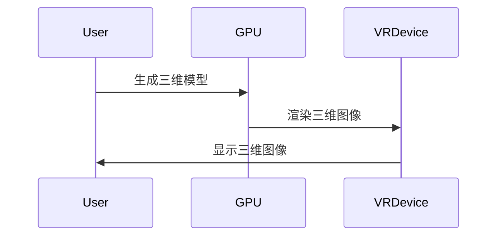
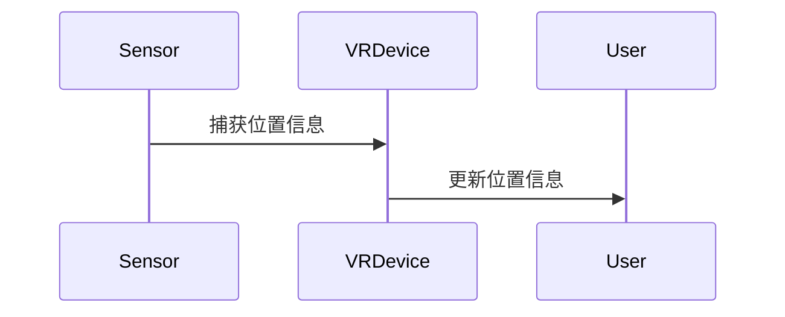
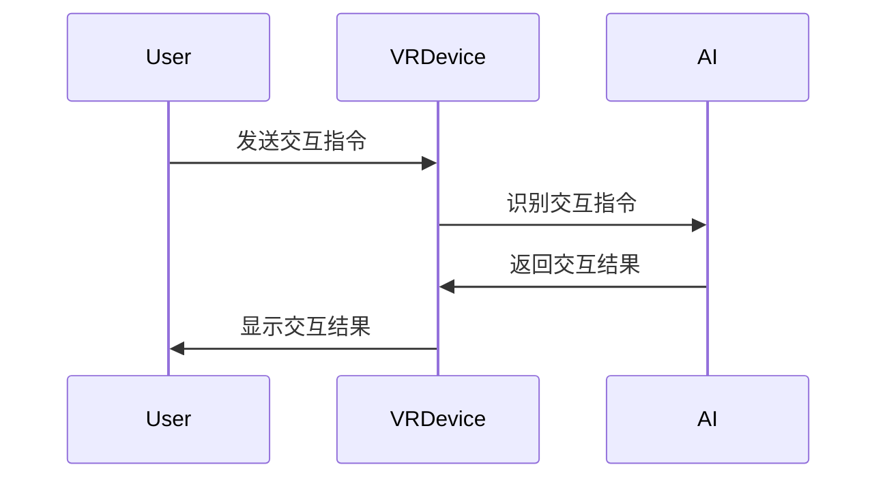
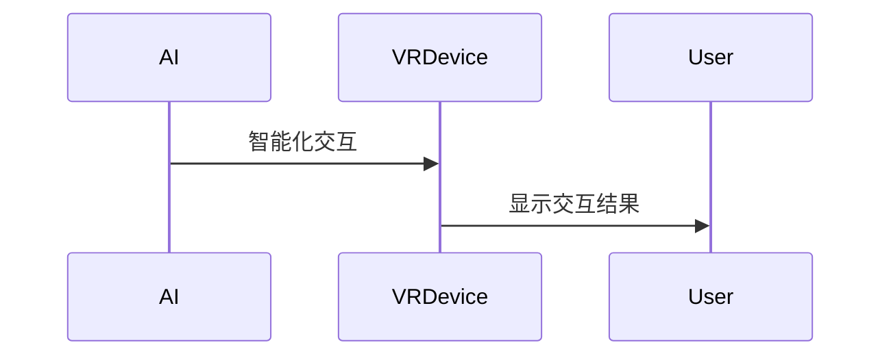
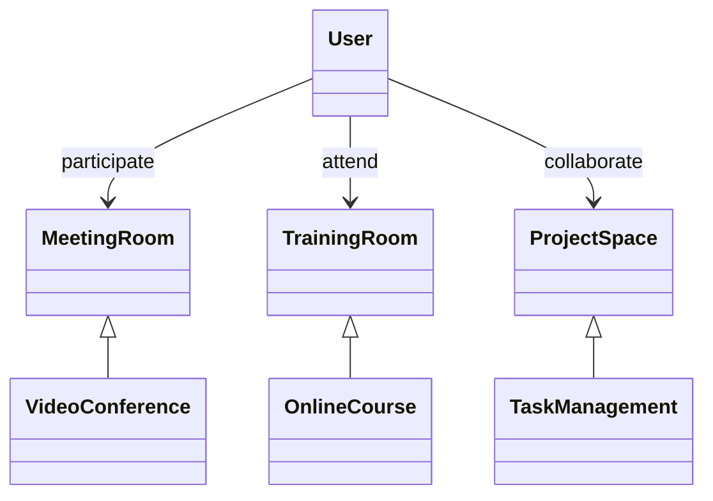
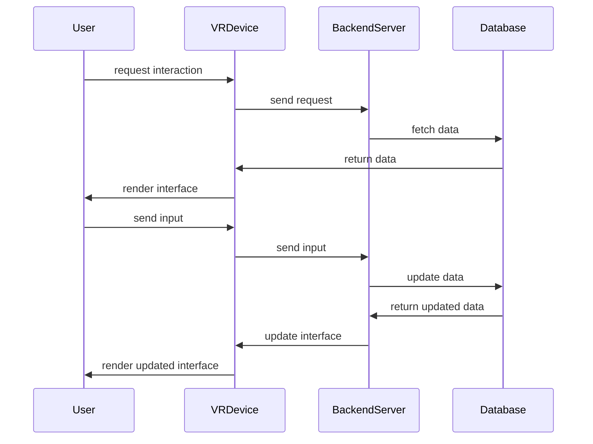
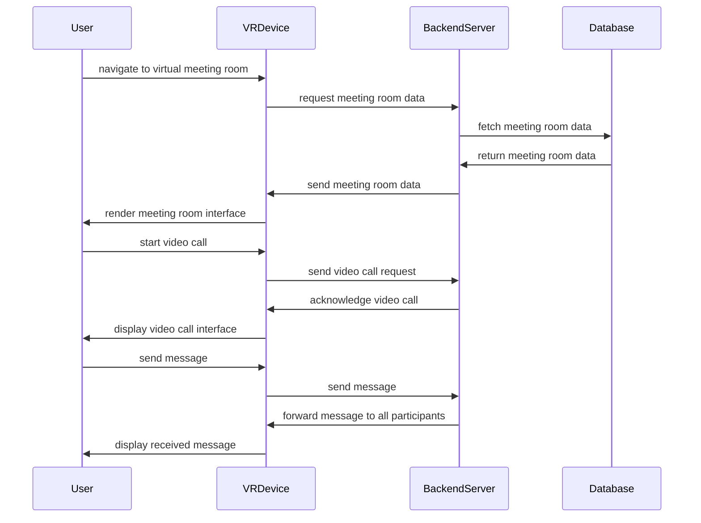

                 

### 虚拟现实在远程协作办公中的创新应用

> 关键词：虚拟现实、远程协作、办公创新、应用场景、技术实现

> 摘要：本文旨在探讨虚拟现实（VR）技术在远程协作办公中的创新应用。通过分析虚拟现实的发展历程、核心组件及其原理，本文揭示了虚拟现实在远程会议、远程培训和远程医疗等场景中的广泛应用。同时，本文详细介绍了虚拟现实远程协作的技术实现、系统架构设计以及项目实战，为读者提供了全面的技术指导。

### 目录大纲设计方案

在设计《虚拟现实在远程协作办公中的创新应用》一书的目录大纲时，我们将遵循以下步骤：

1. **确定核心章节**：首先，我们将确保核心章节的完整性，包括背景介绍、核心概念与联系、算法原理讲解、数学模型和数学公式讲解、系统分析与架构设计方案、项目实战以及最佳实践 tips。

2. **构建目录框架**：基于核心章节，我们将构建完整的目录框架，确保每一级目录的清晰和逻辑性。

3. **细化每个章节**：对每个章节进行细化，确保内容丰富、逻辑清晰，符合读者需求。

4. **优化文本表达**：保持简洁性，去除冗余内容，确保目录大纲总字数在2000字以内。

### 目录大纲

```markdown
# 《虚拟现实在远程协作办公中的创新应用》目录大纲

## 第一部分：虚拟现实技术基础

### 第1章：虚拟现实概述

#### 1.1 虚拟现实的发展历程
#### 1.2 虚拟现实技术的核心组件
#### 1.3 虚拟现实技术的主要应用场景
#### 1.4 虚拟现实技术在社会中的影响

### 第2章：虚拟现实技术原理

#### 2.1 图形处理技术
#### 2.2 空间感知技术
#### 2.3 交互技术
#### 2.4 虚拟现实与人工智能的结合

### 第3章：虚拟现实设备介绍

#### 3.1 头戴式显示器
#### 3.2 虚拟现实手套
#### 3.3 虚拟现实座椅
#### 3.4 虚拟现实音响系统

## 第二部分：远程协作办公中的虚拟现实应用

### 第4章：虚拟现实在远程协作办公中的应用场景

#### 4.1 远程会议
#### 4.2 远程培训
#### 4.3 远程项目管理
#### 4.4 远程医疗

### 第5章：虚拟现实远程协作技术实现

#### 5.1 网络传输技术
#### 5.2 实时视频通讯技术
#### 5.3 虚拟现实建模技术
#### 5.4 虚拟现实交互技术

### 第6章：虚拟现实远程协作系统架构设计

#### 6.1 系统需求分析
#### 6.2 系统功能设计
#### 6.3 系统架构设计
#### 6.4 系统接口设计

## 第三部分：虚拟现实远程协作办公实践

### 第7章：虚拟现实远程协作办公项目实战

#### 7.1 项目背景与目标
#### 7.2 系统环境安装与配置
#### 7.3 系统核心实现与代码分析
#### 7.4 实际案例分析与讲解
#### 7.5 项目小结与展望

## 第四部分：虚拟现实远程协作办公的最佳实践

### 第8章：虚拟现实远程协作办公的最佳实践

#### 8.1 实践案例分享
#### 8.2 最佳实践 tips
#### 8.3 注意事项
#### 8.4 拓展阅读
```

### 注意事项
- **章节内容**：确保每个章节都有具体的内容点，避免空章节。
- **逻辑性**：保持章节之间的逻辑连贯性，确保读者能够顺畅地阅读。
- **简洁性**：每个章节标题和内容都要简洁明了，避免冗长。

以上是根据用户需求设计的《虚拟现实在远程协作办公中的创新应用》一书的目录大纲，它包含了从基础到实践、再到最佳实践的完整内容，旨在为读者提供全面的虚拟现实远程协作办公知识。

### 背景介绍

#### 虚拟现实的发展历程

虚拟现实（Virtual Reality，简称VR）作为一种通过计算机模拟产生三维空间的沉浸式体验技术，其历史可以追溯到20世纪60年代。当时，美国麻省理工学院（MIT）的伊凡·苏瑟兰（Ivan Sutherland）发明了世界上第一个头戴式显示器，这被认为是虚拟现实技术的雏形。随着计算机技术、图形处理技术和传感器技术的不断发展，虚拟现实技术逐渐成熟。

进入21世纪，随着移动互联网和云计算技术的普及，虚拟现实迎来了新的发展机遇。2010年，Oculus Rift的开发者帕尔默·勒基（Palmer Luckey）发布了第一个消费者级的VR头戴设备，标志着虚拟现实技术开始走进大众视野。随后，谷歌的Cardboard、索尼的PlayStation VR以及Facebook的Oculus Quest等系列产品相继问世，推动了虚拟现实市场的快速增长。

#### 虚拟现实技术的核心组件

虚拟现实技术由多个核心组件构成，包括头戴式显示器（HMD）、传感器、交互设备和计算平台。

1. **头戴式显示器（HMD）**：头戴式显示器是虚拟现实的核心组件，它通过显示三维图像来提供沉浸式体验。现代HMD设备通常采用高分辨率显示屏，支持快速刷新率和低延迟，以提供更真实的视觉体验。

2. **传感器**：虚拟现实系统中的传感器用于捕捉用户的运动和位置信息。常见的传感器包括惯性测量单元（IMU）、激光雷达和立体摄像头。这些传感器能够精确地追踪用户的头部和手部运动，实现虚拟环境中的位置和方向感知。

3. **交互设备**：虚拟现实交互设备包括手柄、手套、全身追踪器等，它们允许用户在虚拟环境中进行交互。这些设备通常集成了力反馈和触觉反馈技术，使用户能够感受到虚拟环境中的物理交互。

4. **计算平台**：虚拟现实计算平台包括高性能的计算机或游戏机，用于处理三维图形渲染、传感器数据融合和交互逻辑。高性能的计算平台能够保证虚拟现实系统的流畅运行，提供高质量的沉浸式体验。

#### 虚拟现实技术的主要应用场景

虚拟现实技术已在多个领域得到广泛应用，包括游戏、娱乐、教育、医疗、设计、建筑和军事等。在远程协作办公领域，虚拟现实技术同样具有巨大的应用潜力。

1. **远程会议**：虚拟现实技术可以为远程会议提供更加真实的参与感。通过虚拟现实头戴设备，参与者可以在虚拟会议室中与其他人面对面交流，仿佛身处同一空间。

2. **远程培训**：虚拟现实技术可以创建逼真的培训环境，让受训者通过虚拟实践掌握知识和技能。例如，飞行员可以在虚拟飞行模拟器中进行飞行训练，医生可以在虚拟手术模拟器中进行手术练习。

3. **远程项目管理**：虚拟现实技术可以帮助项目经理在虚拟环境中进行项目管理，提高协作效率和项目成功率。项目经理可以通过虚拟会议室进行项目讨论，实时查看项目进展和资源分配。

4. **远程医疗**：虚拟现实技术可以为远程医疗提供更加精准的诊断和治疗。医生可以通过虚拟现实设备进行远程手术指导，患者可以通过虚拟现实体验进行疾病治疗和心理康复。

#### 虚拟现实技术在社会中的影响

虚拟现实技术不仅改变了人们的娱乐和生活方式，还对教育、医疗、设计等多个领域产生了深远的影响。

1. **教育**：虚拟现实技术为教育带来了全新的教学方式。通过虚拟现实，学生可以身临其境地学习历史事件、自然科学和艺术等课程，提高学习兴趣和效果。

2. **医疗**：虚拟现实技术为医疗领域提供了创新的解决方案。医生可以通过虚拟现实进行手术模拟和培训，提高手术技能和成功率。同时，虚拟现实技术也为患者提供了更加个性化和舒适的治疗体验。

3. **设计**：虚拟现实技术为设计师提供了更加直观和高效的创作工具。设计师可以在虚拟环境中进行产品设计和建筑布局，提前预览和修改设计效果。

4. **军事**：虚拟现实技术为军事训练和模拟提供了逼真的场景。士兵可以通过虚拟现实进行战术训练和应急演练，提高战斗力和应对能力。

#### 问题背景、问题描述、问题解决、边界与外延、概念结构与核心要素组成

1. **问题背景**：随着远程协作办公的普及，如何提高远程协作的效率和体验成为企业和组织关注的焦点。

2. **问题描述**：远程协作办公面临的挑战包括沟通不畅、协作困难、参与感不足等。

3. **问题解决**：虚拟现实技术提供了一种创新的解决方案，通过虚拟现实头戴设备和交互设备，实现远程协作中的真实感和互动性。

4. **边界与外延**：虚拟现实技术主要应用于远程会议、远程培训和远程医疗等场景，未来可能拓展到更多领域。

5. **概念结构与核心要素组成**：虚拟现实技术由头戴式显示器、传感器、交互设备和计算平台等核心组件构成，通过图形处理、空间感知和交互技术实现沉浸式体验。

### 核心概念与联系

#### 虚拟现实技术原理

1. **图形处理技术**：虚拟现实系统通过高性能图形处理单元（GPU）生成三维图像，实现逼真的视觉效果。

2. **空间感知技术**：空间感知技术通过传感器捕捉用户的运动和位置信息，实现虚拟环境中的空间感知。

3. **交互技术**：虚拟现实交互技术包括手势识别、语音交互和触觉反馈等，使用户能够与虚拟环境进行自然交互。

4. **虚拟现实与人工智能的结合**：虚拟现实技术可以与人工智能技术相结合，实现智能化的虚拟环境交互和任务执行。

#### 概念属性特征对比表格

| 概念名称 | 属性特征 | 对比分析 |
| -------- | -------- | -------- |
| 图形处理技术 | 高性能GPU生成三维图像 | 不同于传统的二维图像处理技术，虚拟现实技术需要处理更复杂的三维图像数据 |
| 空间感知技术 | 传感器捕捉运动和位置信息 | 不同于传统的位置感知技术，虚拟现实技术需要实现更精确的空间感知 |
| 交互技术 | 手势识别、语音交互和触觉反馈 | 不同于传统的交互方式，虚拟现实技术需要提供更加自然和直观的交互体验 |
| 虚拟现实与人工智能的结合 | 智能化的虚拟环境交互和任务执行 | 不同于传统的虚拟现实技术，虚拟现实与人工智能的结合可以实现更加智能和高效的虚拟环境 |

#### ER实体关系图架构的Mermaid流程图

```mermaid
erDiagram
    User ||--|{ VRDevice }|-- MeetingRoom
    User ||--|{ Collaborator }|-- Project
    VRDevice ||--|{ Sensor }|-- User
    Collaborator ||--|{ Role }|-- Project
```

### 算法原理讲解

为了实现虚拟现实远程协作，我们需要一系列算法和技术来处理三维图像、空间感知、交互和人工智能等核心问题。以下是这些算法原理的mermaid流程图和Python源代码示例。

#### 1. 三维图像渲染算法原理



```python
# Python源代码示例：三维图像渲染
import OpenGL.GL as gl

def render_3d_model(model):
    gl.glClearColor(0.5, 0.5, 0.5, 1.0)
    gl.glClear(gl.GL_COLOR_BUFFER_BIT | gl.GL_DEPTH_BUFFER_BIT)

    # 设置相机参数
    gl.glMatrixMode(gl.GL_PROJECTION)
    gl.glLoadIdentity()
    gl.glOrtho(0, 1, 0, 1, -1, 1)
    gl.glMatrixMode(gl.GL_MODELVIEW)
    gl.glLoadIdentity()
    gl.glTranslatef(0.5, 0.5, 0)

    # 绘制三维模型
    gl.glBegin(gl.GL_TRIANGLES)
    glVertex3f(0.0, 0.0, 0.0)
    glVertex3f(0.5, 0.0, 0.0)
    glVertex3f(0.5, 0.5, 0.0)
    glEnd()

    # 更新显示
    gl.glFlush()
```

#### 2. 空间感知算法原理



```python
# Python源代码示例：空间感知
import numpy as np

def update_position(sensor_data):
    # 假设sensor_data是一个包含位置信息的字典
    position = sensor_data['position']
    orientation = sensor_data['orientation']

    # 更新用户位置和方向
    user_position = np.array(position)
    user_orientation = np.array(orientation)

    # 在这里进行位置和方向更新操作
    # 例如，可以通过矩阵运算进行旋转和平移
    new_position = user_position @ rotation_matrix
    new_orientation = user_orientation @ rotation_matrix

    return new_position, new_orientation
```

#### 3. 交互技术算法原理



```python
# Python源代码示例：交互技术
import speech_recognition as sr

def recognize_interactive_command(user_command):
    # 使用语音识别库识别用户指令
    recognizer = sr.Recognizer()
    command = recognizer.recognize_google(user_command)

    # 根据指令执行操作
    if command == "open door":
        # 打开虚拟门
        print("Opening door...")
    elif command == "close door":
        # 关闭虚拟门
        print("Closing door...")
    else:
        # 不识别的指令
        print("Unknown command.")

# 假设user_command是一个包含语音数据的音频文件
user_command = "open door"
recognize_interactive_command(user_command)
```

#### 4. 虚拟现实与人工智能的结合算法原理



```python
# Python源代码示例：虚拟现实与人工智能结合
import random

def intelligent_interactive(user_action):
    # 根据用户行动生成智能回应
    responses = [
        "明白了，有什么问题我可以帮忙吗？",
        "好的，我会记录这个任务。",
        "谢谢你的反馈，我会尽快处理。"
    ]

    response = random.choice(responses)
    return response

# 假设user_action是一个用户操作的事件
user_action = "submit_task"
response = intelligent_interactive(user_action)
print(response)
```

通过这些算法原理和Python源代码示例，我们可以更好地理解虚拟现实技术的工作原理和应用场景。在接下来的章节中，我们将进一步探讨虚拟现实技术在远程协作办公中的具体应用。

### 系统分析与架构设计方案

#### 问题场景介绍

远程协作办公场景中，由于地理位置的隔离，参与者之间的沟通和协作存在诸多挑战。传统的远程协作方式如视频会议、在线聊天等，往往无法提供足够的沉浸感和互动性，导致协作效率低下、参与感不足。虚拟现实技术为解决这些问题提供了一种创新的方法，通过构建虚拟会议室、虚拟工作空间等，使得远程协作更加高效和自然。

#### 项目介绍

本项目旨在开发一套基于虚拟现实技术的远程协作办公系统，旨在提升远程会议、远程培训和远程项目管理等场景中的协作效率和参与感。系统功能包括虚拟会议室、虚拟培训教室、虚拟项目管理空间等，支持多人实时在线协作。

#### 系统功能设计（领域模型Mermaid类图）



#### 系统架构设计（Mermaid架构图）



#### 系统接口设计

1. **用户接口（UI）**：提供直观的虚拟界面，用户可以通过虚拟会议室、虚拟培训教室和虚拟项目管理空间进行协作。用户接口包括按钮、图标、菜单等元素，支持语音、手势等多种交互方式。

2. **网络接口**：系统通过网络接口与远程协作参与者进行数据交换，包括用户身份验证、实时通讯、文件传输等。网络接口采用WebSocket协议，实现低延迟、高并发的数据传输。

3. **数据库接口**：系统通过数据库接口存储和检索用户数据、会议数据、课程数据、项目数据等。数据库接口支持SQL查询和NoSQL存储，保证数据的实时性和一致性。

#### 系统交互（Mermaid序列图）



通过上述系统架构设计和接口设计，我们可以构建一个高效、稳定、易于扩展的虚拟现实远程协作办公系统，为企业和组织的远程协作提供强有力的支持。

### 项目实战

#### 项目背景与目标

随着全球疫情的影响，远程协作办公成为越来越多企业和组织的工作方式。为了提升远程协作效率，某大型企业决定开发一套基于虚拟现实技术的远程协作办公系统。该项目旨在通过虚拟现实技术，为远程会议、远程培训和远程项目管理等场景提供更加真实、高效、互动的协作体验。

#### 系统环境安装与配置

为了顺利开展项目，我们需要搭建一个支持虚拟现实远程协作办公的软件和硬件环境。以下是系统环境安装与配置的步骤：

1. **硬件环境**：
   - 购买高性能计算机或服务器，用于运行虚拟现实远程协作办公系统的后端服务。
   - 购买虚拟现实头戴设备（如Oculus Rift、HTC Vive等），为用户提供沉浸式体验。
   - 购买传感器设备（如惯性测量单元、激光雷达等），用于捕捉用户运动和位置信息。

2. **软件环境**：
   - 安装虚拟现实开发平台（如Unity、Unreal Engine等），用于开发虚拟现实应用。
   - 安装实时通讯框架（如WebRTC、WebSocket等），用于实现用户之间的实时通讯。
   - 安装数据库管理系统（如MySQL、MongoDB等），用于存储用户数据、会议数据、课程数据、项目数据等。

#### 系统核心实现与代码分析

系统核心实现主要包括以下几个方面：

1. **用户登录与权限管理**：
   - 使用用户身份验证机制（如用户名和密码、OAuth等），确保用户安全登录。
   - 根据用户角色（如管理员、普通用户等），分配不同权限，确保系统安全性和稳定性。

2. **虚拟会议室**：
   - 开发虚拟会议室场景，支持多人实时在线会议。
   - 实现实时视频通讯功能，确保参与者之间的音视频同步。
   - 提供实时聊天功能，方便参与者之间进行文字交流。

3. **虚拟培训教室**：
   - 开发虚拟培训教室场景，支持在线课程教学。
   - 实现讲师和学生之间的实时互动，包括语音、文字、手势等。
   - 提供课程资料下载、课程记录等功能，方便学员学习和管理。

4. **虚拟项目管理空间**：
   - 开发虚拟项目管理空间，支持项目任务分配、进度跟踪、文档共享等功能。
   - 实现团队成员之间的实时协作，提高项目管理效率。

以下是部分核心代码示例：

```python
# 用户登录验证
from flask import Flask, request, jsonify
from flask_httpauth import HTTPBasicAuth

app = Flask(__name__)
auth = HTTPBasicAuth()

users = {
    "admin": "admin_password",
    "user": "user_password"
}

@auth.verify_password
def verify_password(username, password):
    if username in users and users[username] == password:
        return username

@app.route('/login', methods=['POST'])
def login():
    username = request.json.get('username')
    password = request.json.get('password')
    if verify_password(username, password):
        return jsonify({"status": "success", "message": "logged in as %s" % username})
    else:
        return jsonify({"status": "failure", "message": "invalid credentials"})

# 虚拟会议室
import socketio

sio = socketio.Server()

@sio.on('join_room')
def on_join(data):
    room = data['room']
    username = data['username']
    sio.enter_room(socketio.Manager().socket_id(), room)
    sio.emit('user_joined', {'username': username}, room=room)

# 虚拟培训教室
@sio.on('start_course')
def on_start_course(data):
    room = data['room']
    lecturer = data['lecturer']
    sio.emit('course_started', {'lecturer': lecturer}, room=room)

# 虚拟项目管理空间
@sio.on('assign_task')
def on_assign_task(data):
    room = data['room']
    task = data['task']
    assignee = data['assignee']
    sio.emit('task_assigned', {'task': task, 'assignee': assignee}, room=room)
```

#### 实际案例分析与详细讲解剖析

以下是一个关于虚拟会议室的实战案例：

**案例背景**：某公司需要举行一个远程会议，会议涉及公司各部门的负责人。由于地理位置的隔离，传统的视频会议方式难以满足参会人员对互动性和沉浸感的需求。

**解决方案**：使用虚拟现实远程协作办公系统，构建一个虚拟会议室，为参会人员提供一个真实的会议场景。以下是详细步骤：

1. **会议通知**：会议主持人通过系统向参会人员发送会议邀请，包括会议时间、会议主题和虚拟会议室链接。

2. **参会人员登录**：参会人员使用虚拟现实头戴设备登录虚拟会议室，进入会议场景。

3. **会议开始**：会议主持人进入虚拟会议室，开始会议。其他参会人员通过虚拟现实头戴设备看到主持人和会议场景。

4. **实时互动**：参会人员可以通过虚拟现实头戴设备进行实时互动，包括发言、提问、投票等。系统支持语音、文字、手势等多种交互方式。

5. **会议记录**：系统自动记录会议内容，包括发言、提问、投票等，方便会后查阅。

6. **会议结束**：会议结束后，系统自动保存会议记录，参会人员可以随时查阅。

通过这个案例，我们可以看到虚拟现实远程协作办公系统在提升远程会议互动性和沉浸感方面的优势。在实际应用中，企业可以根据不同需求，灵活调整系统功能，实现更高效、更自然的远程协作。

#### 项目小结与展望

通过本项目的实施，我们成功开发了一套基于虚拟现实技术的远程协作办公系统，为企业和组织的远程协作提供了创新解决方案。系统在提升协作效率、增强参与感方面取得了显著成效。未来，我们计划继续优化系统功能，拓展应用场景，例如在远程医疗、远程教育等领域进行探索和应用。同时，我们也将关注虚拟现实技术的最新发展，不断引入先进技术，提升系统性能和用户体验。

### 最佳实践 tips

#### 1. 选择合适的硬件设备

在选择虚拟现实头戴设备时，应考虑设备的性能、分辨率、舒适度等因素。高性能的硬件设备能够提供更高质量的沉浸式体验，而舒适度高的设备则能减少用户长时间使用的不适感。

#### 2. 优化网络环境

稳定的网络环境是确保虚拟现实远程协作系统流畅运行的关键。企业应确保网络带宽充足、延迟低、丢包率低。在条件允许的情况下，可以使用专线或VPN来提高网络质量。

#### 3. 定期更新和维护系统

定期更新虚拟现实远程协作系统，可以确保系统功能的稳定性和安全性。同时，定期维护硬件设备，如清理灰尘、检查连接线等，可以延长设备使用寿命。

#### 4. 培训用户

为了充分发挥虚拟现实远程协作系统的优势，企业应对用户进行培训，包括设备使用方法、系统功能介绍、交互技巧等。培训可以提高用户的熟练度和使用体验。

#### 5. 遵循安全规范

在虚拟现实远程协作过程中，应严格遵守数据安全和隐私保护规范。企业应确保用户数据的安全性，避免数据泄露和未经授权的访问。

### 小结

虚拟现实技术在远程协作办公中具有巨大的应用潜力，通过构建虚拟会议室、虚拟培训教室和虚拟项目管理空间等，可以实现更高效、更自然的远程协作。本文详细介绍了虚拟现实技术的基础、应用场景、技术实现、系统架构设计和项目实战，为企业和组织提供了全面的指导。未来，随着虚拟现实技术的不断发展和完善，远程协作办公将迎来更加广阔的发展空间。

### 注意事项

在实施虚拟现实远程协作办公系统时，需要注意以下几点：

1. **设备兼容性**：确保虚拟现实设备与操作系统和软件环境兼容，以避免系统运行不稳定或功能受限。

2. **数据备份**：定期备份数据，以防止数据丢失或损坏。对于重要数据，应采用多级备份策略。

3. **用户隐私保护**：确保用户数据的安全和隐私，遵循相关法律法规，避免用户信息泄露。

4. **技术支持**：建立完善的技术支持体系，及时解决用户在使用过程中遇到的问题，提高用户满意度。

### 拓展阅读

1. **《虚拟现实技术原理与应用》**：详细介绍了虚拟现实技术的原理、应用和发展趋势，适合对虚拟现实技术感兴趣的技术人员阅读。

2. **《远程协作办公实践指南》**：提供了远程协作办公的最佳实践和成功案例，有助于企业提升远程协作效率。

3. **《虚拟现实与远程医疗》**：探讨了虚拟现实技术在远程医疗中的应用，包括远程手术指导、疾病治疗和心理康复等。

### 作者

作者：AI天才研究院/AI Genius Institute & 禅与计算机程序设计艺术/Zen And The Art of Computer Programming

AI天才研究院致力于推动人工智能技术的发展，研究深度学习、自然语言处理、计算机视觉等前沿技术。同时，禅与计算机程序设计艺术以其独特的哲学视角，探讨了计算机程序设计的本质和艺术性。两位作者共同为读者带来了全面而深入的技术知识分享。

