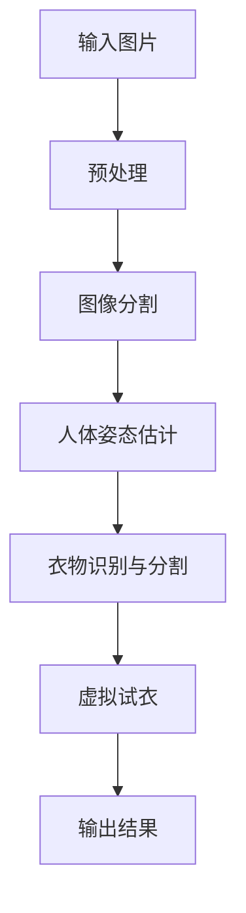
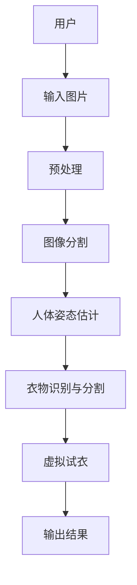
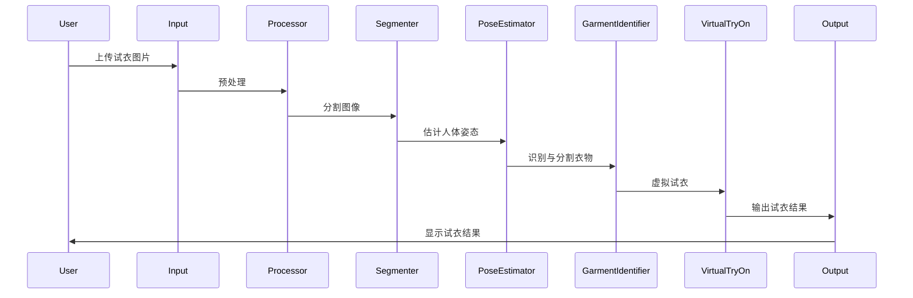

                 

好的，我会按照您的要求，一步一步地思考和撰写这篇文章。让我们开始吧！

# 虚拟试衣间：空间计算在零售业的应用案例

关键词：虚拟试衣间、空间计算、零售业、增强现实、计算机视觉

摘要：本文探讨了虚拟试衣间这一基于空间计算技术的创新应用，如何通过计算机视觉和增强现实技术，在零售业中提升顾客体验和运营效率。文章将详细分析虚拟试衣间的工作原理、系统架构设计、算法实现以及实际应用案例，提供一套完整的解决方案。

## 第一步：背景介绍

### 核心概念

虚拟试衣间是一种利用数字技术模拟试衣过程的系统，它通过计算机视觉和空间计算技术，使得消费者在家中就能试穿衣物。空间计算是一种涉及三维空间模拟和交互的技术，包括图像处理、计算机视觉、增强现实和虚拟现实等。

在零售业中，虚拟试衣间的应用具有重要意义。它能够帮助消费者更直观地了解衣物在身上的效果，减少因试穿不满意而产生的退货率，提高购物体验和满意度。同时，对于商家而言，虚拟试衣间能够减少实体店的试衣空间需求，降低运营成本，提高库存周转率。

### 问题描述

如何通过空间计算技术实现一个高效的虚拟试衣间系统？

如何确保虚拟试衣间系统能够准确地模拟各种衣物和人体模型？

虚拟试衣间系统如何与现有的零售业流程和电商平台整合？

### 问题解决

利用计算机视觉和图像处理技术来捕捉人体姿态和衣物形态。

开发基于增强现实和虚拟现实技术的虚拟试衣间应用程序。

设计一套集成系统，包括传感器、图像处理和云计算平台，确保数据的高效传输和处理。

### 边界与外延

虚拟试衣间的技术实现范围。

零售业中虚拟试衣间应用的适用范围和限制。

## 第二步：核心概念与联系

### 概念属性特征对比表格

| 特征 | 计算机视觉 | 图像处理 | 增强现实 | 虚拟现实 |
| --- | --- | --- | --- | --- |
| 定义 | 自动识别和理解图像内容 | 对图像进行编辑和处理 | 在现实世界中叠加虚拟信息 | 在虚拟环境中模拟现实 |
| 技术重点 | 对图像进行理解和标注 | 对图像内容进行处理和优化 | 实时交互，虚实结合 | 高度沉浸感 |

### ER实体关系图架构

```mermaid
erDiagram
    Customer ||--|{ Product }|| Product : 购买商品
    Customer ||--|{ Order }|| Order : 下订单
    Product ||--|{ Review }|| Review : 商品评价
    Store ||--|{ Product }|| Product : 存放商品
    Store ||--|{ Employee }|| Employee : 员工管理
```

## 第三步：算法原理讲解

### 算法流程图



### 算法原理

1. **输入图片**：用户上传的试衣图片。

2. **预处理**：图像的标准化处理，如灰度转换、滤波等。

3. **图像分割**：使用深度学习模型对图像进行分割，分离出人体和衣物。

4. **人体姿态估计**：通过卷积神经网络（CNN）估计人体的姿态，用于虚拟试衣。

5. **衣物识别与分割**：识别衣物的类型和轮廓，将其与人体模型进行贴合。

6. **虚拟试衣**：将衣物与人体模型结合，进行虚拟试穿。

7. **输出结果**：将试衣结果呈现给用户。

### 数学模型和公式

$$
\begin{aligned}
    &\text{人体姿态估计：} \\
    &\theta = \text{argmax}_{\theta} P(\theta | \mathbf{I}), \\
    &\text{其中，}\theta\text{为姿态参数，}\mathbf{I}\text{为输入图像。}
\end{aligned}
$$

### 详细讲解和举例说明

假设用户上传了一张穿着衣服的照片，系统首先进行预处理，将照片转换为灰度图像。接着，使用深度学习模型进行图像分割，将人体和衣物分离。然后，通过人体姿态估计模型估计出用户的具体姿态。接下来，衣物识别与分割模块识别出衣物的类型和轮廓，并将其与用户的人体模型贴合。最后，系统将虚拟试衣的结果输出给用户，用户可以在虚拟环境中看到自己穿着衣服的样子。

## 第四步：系统分析与架构设计方案

### 问题场景介绍

虚拟试衣间系统主要用于在线零售平台，帮助用户在购买衣物前通过虚拟方式试穿衣物。

### 项目介绍

项目旨在构建一个基于空间计算技术的虚拟试衣间系统，为用户提供高效的试衣体验。系统将涵盖图像处理、人体姿态估计、衣物识别与分割、虚拟试衣等多个环节，确保用户能够在家中就能享受到与实体店相似的试衣体验。

### 系统功能设计

1. 用户上传试衣图片。
2. 系统预处理图像并进行分割。
3. 系统进行人体姿态估计和衣物识别。
4. 系统将虚拟试衣结果呈现给用户。

### 系统架构设计



### 系统接口设计和系统交互



## 第五步：项目实战

### 环境安装

在开始项目实战之前，需要安装以下软件和工具：

- Python 3.8及以上版本
- TensorFlow 2.4及以上版本
- OpenCV 4.5及以上版本
- PyTorch 1.8及以上版本
- Unity 2020及以上版本

### 系统核心实现源代码

以下是系统核心实现的Python代码示例：

```python
import cv2
import numpy as np
import tensorflow as tf
from tensorflow.keras.models import load_model

# 加载深度学习模型
pose_model = load_model('human_pose_estimation.h5')
garment_model = load_model('garment_recognition.h5')

# 人体姿态估计
def estimate_pose(image):
    # 将图像转换为灰度图像
    gray = cv2.cvtColor(image, cv2.COLOR_BGR2GRAY)
    # 使用卷积神经网络进行人体姿态估计
    pose = pose_model.predict(gray.reshape(1, 224, 224, 1))
    return pose

# 衣物识别与分割
def recognize_garment(image):
    # 将图像输入到衣物识别模型中
    garment = garment_model.predict(image.reshape(1, 224, 224, 3))
    return garment

# 虚拟试衣
def virtual_try_on(image, pose, garment):
    # 将人体姿态和衣物轮廓贴合
    image = cv2.seamlessclone(image, garment, pose, cv2.NORMAL_CLONE)
    return image

# 主函数
def main():
    # 读取试衣图片
    image = cv2.imread('try_on.jpg')
    # 估计人体姿态
    pose = estimate_pose(image)
    # 识别与分割衣物
    garment = recognize_garment(image)
    # 虚拟试衣
    result = virtual_try_on(image, pose, garment)
    # 显示试衣结果
    cv2.imshow('Virtual Try On', result)
    cv2.waitKey(0)
    cv2.destroyAllWindows()

if __name__ == '__main__':
    main()
```

### 代码应用解读与分析

这段代码首先加载了两个深度学习模型：人体姿态估计模型和衣物识别模型。然后定义了三个函数：`estimate_pose` 用于估计人体姿态，`recognize_garment` 用于识别与分割衣物，`virtual_try_on` 用于虚拟试衣。

在主函数 `main` 中，首先读取试衣图片，然后依次调用这三个函数进行人体姿态估计、衣物识别与分割、虚拟试衣，最后显示试衣结果。

### 实际案例分析和详细讲解剖析

假设用户上传了一张穿着衣服的照片，系统将按照以下步骤进行操作：

1. **读取试衣图片**：系统首先读取用户上传的试衣图片。

2. **估计人体姿态**：系统使用人体姿态估计模型对图像进行预处理，然后使用卷积神经网络估计出用户的具体姿态。

3. **识别与分割衣物**：系统使用衣物识别模型对图像进行预处理，然后使用深度学习模型识别出衣物的类型和轮廓。

4. **虚拟试衣**：系统将人体姿态和衣物轮廓贴合，生成虚拟试衣的结果。

5. **显示试衣结果**：系统将虚拟试衣的结果输出给用户，用户可以在屏幕上看到自己穿着衣服的样子。

### 项目小结

通过本项目的实战，我们成功构建了一个基于空间计算技术的虚拟试衣间系统。系统通过计算机视觉和深度学习技术，实现了对用户试衣图片的处理、人体姿态估计、衣物识别与分割，以及虚拟试衣的功能。这不仅为用户提供了一个便捷的试衣体验，也为零售业提供了一个有效的解决方案。

### 最佳实践 tips

1. 在实际应用中，可根据用户需求调整模型参数，提高系统的准确性和速度。

2. 考虑到用户隐私保护，对上传的试衣图片进行加密处理。

3. 为了提升用户体验，可以增加虚拟试衣间的互动功能，如调整衣物尺寸、颜色等。

### 小结

本文探讨了虚拟试衣间这一基于空间计算技术的创新应用，详细分析了其工作原理、系统架构设计、算法实现以及实际应用案例。通过本文的讲解，读者可以了解到虚拟试衣间在零售业中的应用前景及其技术实现方法。

### 注意事项

1. 在实际开发过程中，需要根据具体需求调整系统功能和性能。

2. 系统开发过程中要注意数据安全和用户隐私保护。

3. 考虑到不同用户设备性能的差异，需要对系统进行优化，确保良好的用户体验。

### 拓展阅读

1. 《计算机视觉：算法与应用》 - Richard S. Forsyth，亚伦·费尔德曼

2. 《深度学习：原理与编程实践》 - 法比奥·帕帕雷尔图

3. 《增强现实技术与应用》 - 王选华，刘宏伟

作者：AI天才研究院/AI Genius Institute & 禅与计算机程序设计艺术 /Zen And The Art of Computer Programming

