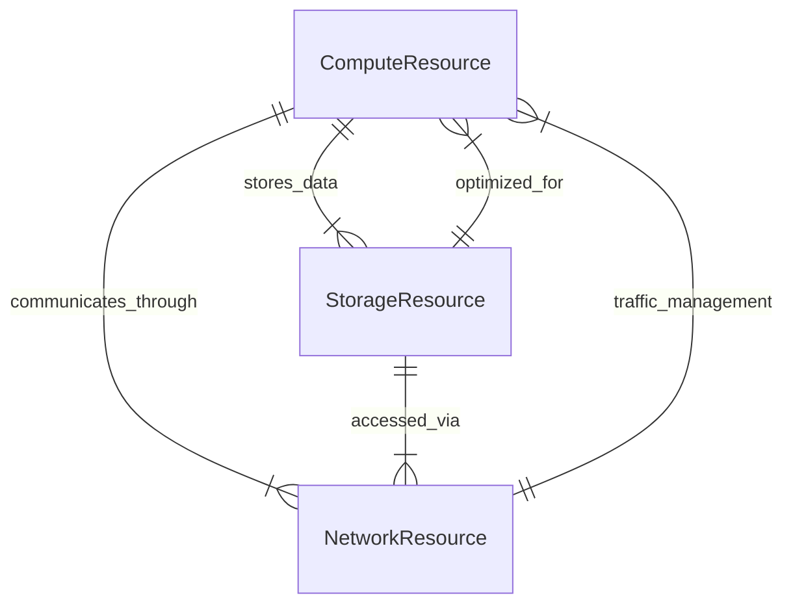
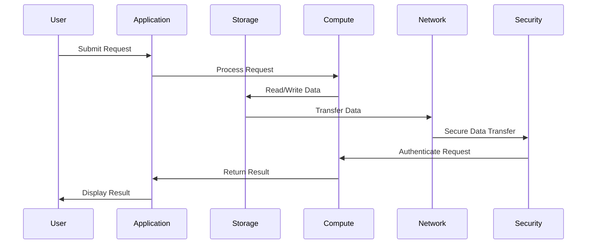
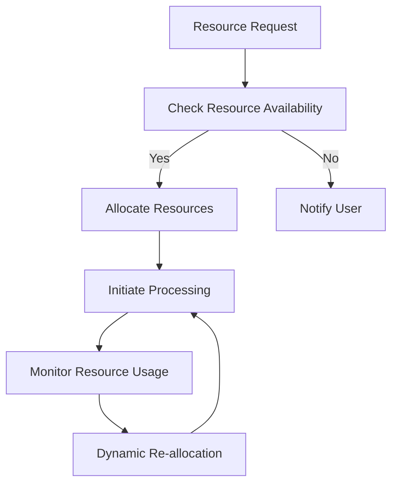
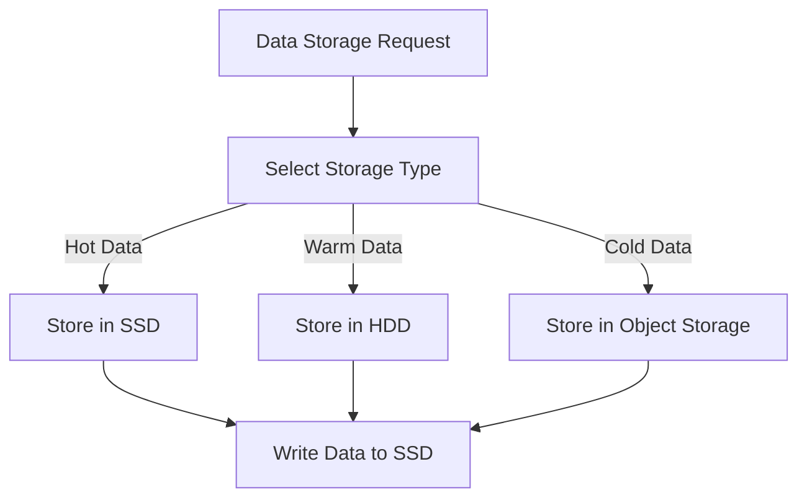
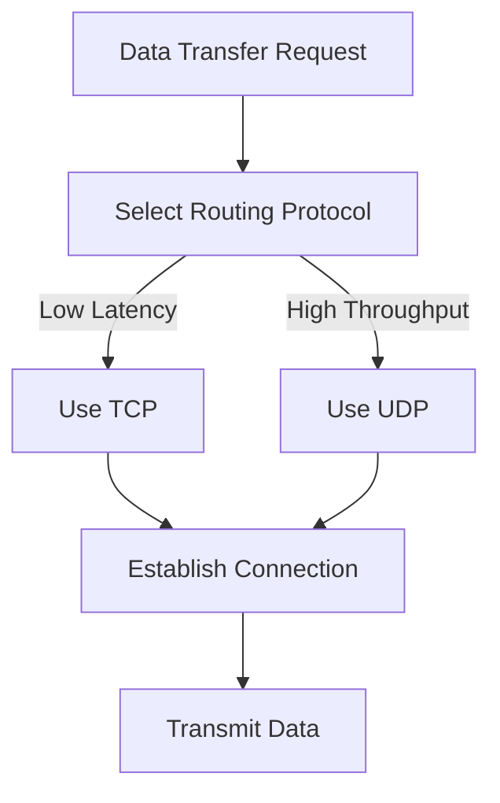

                 

## Introduction to Fusion Computing Platform

### 1.1 Background of Fusion Computing Platform

#### 1.1.1 The Rise of Fusion Computing

**From Traditional Computing to Fusion Computing**

The evolution of computing has been marked by significant shifts in how we process and handle data. Traditional computing, which dominated for decades, relied heavily on centralized, siloed systems. These systems were often limited in their ability to handle large volumes of data and complex processing tasks efficiently. As technology advanced, the demand for more scalable, flexible, and efficient solutions grew. This led to the emergence of hybrid computing environments, which are at the core of fusion computing.

Fusion computing represents a significant paradigm shift from traditional computing. It is characterized by the integration of diverse computing resources, including traditional servers, networking, and storage, with emerging technologies like cloud computing, big data analytics, and artificial intelligence. This integration enables enterprises to leverage the strengths of multiple environments, creating a unified and adaptable infrastructure capable of addressing a wide range of computing challenges.

**The Core Concepts and Characteristics of Fusion Computing**

Fusion computing is defined by several core concepts and characteristics:

1. **Hybrid Infrastructure**: Fusion computing platforms combine on-premises resources with cloud services, allowing for a seamless integration of both environments. This hybrid approach ensures that enterprises can take advantage of the scalability and cost-efficiency of cloud computing while maintaining control over sensitive data and critical applications.

2. **Dynamic Resource Allocation**: One of the key advantages of fusion computing is its ability to dynamically allocate resources based on workload demands. This flexibility allows organizations to optimize resource usage, reduce costs, and improve performance.

3. **Advanced Analytics**: Fusion computing platforms often include advanced analytics capabilities, which enable enterprises to gain insights from large datasets and make data-driven decisions. These capabilities are essential for businesses looking to leverage big data and artificial intelligence.

4. **Integrated Security**: Security is a critical component of fusion computing. These platforms incorporate robust security measures to protect data and applications across multiple environments, ensuring compliance with industry regulations and standards.

5. **Interoperability**: Fusion computing promotes interoperability between different technologies and platforms, allowing for seamless integration and communication between various components of the infrastructure.

**Challenges and Opportunities in Fusion Computing**

While fusion computing offers numerous advantages, it also presents challenges that need to be addressed:

1. **Integration Complexity**: Integrating diverse technologies and platforms can be complex and requires careful planning and execution.

2. **Skill Requirements**: The adoption of fusion computing requires a new set of skills, including expertise in cloud services, data analytics, and cybersecurity. Organizations may need to invest in training and talent acquisition to address this gap.

3. **Cost Management**: Managing the costs associated with adopting and maintaining a fusion computing platform can be challenging. Enterprises must carefully balance the benefits of a hybrid infrastructure with the associated costs.

4. **Regulatory Compliance**: Ensuring compliance with industry regulations and standards across multiple environments can be complex and requires ongoing monitoring and management.

5. **Performance Optimization**: Achieving optimal performance in a hybrid computing environment requires careful tuning and optimization of resources and workloads.

Despite these challenges, the opportunities offered by fusion computing are significant:

1. **Increased Agility**: Fusion computing enables enterprises to quickly adapt to changing business needs and market conditions.

2. **Improved Efficiency**: By optimizing resource usage and reducing costs, fusion computing can help improve overall operational efficiency.

3. **Enhanced Scalability**: Fusion computing platforms can scale to meet the demands of growing businesses, ensuring that resources are available when and where they are needed.

4. **Advanced Analytics**: The integration of advanced analytics capabilities allows enterprises to gain deeper insights from their data, driving innovation and competitive advantage.

5. **Enhanced Security**: With integrated security measures, fusion computing platforms can provide a robust defense against cyber threats.

### 1.2 Fundamental Concepts and Terminology

#### 1.2.1 Key Terms and Their Definitions

To understand fusion computing fully, it's essential to be familiar with the key terms and concepts associated with it. Here are some fundamental terms and their definitions:

1. **Hybrid Computing**: Hybrid computing refers to the use of multiple computing environments, including traditional on-premises systems and cloud services, to create a unified and flexible infrastructure.

2. **Enterprise IT Architecture**: Enterprise IT architecture refers to the overall structure and organization of an organization's information technology systems, including hardware, software, networks, and data centers.

3. **Software-Defined Networking (SDN)**: SDN is a networking approach that decouples the control plane from the data plane in network devices, allowing for centralized control and management of the network.

4. **Network Functions Virtualization (NFV)**: NFV is the process of virtualizing network functions, such as firewalls and load balancers, to run on standard hardware instead of dedicated appliances.

5. **Cloud Computing Integration**: Cloud computing integration refers to the seamless integration of cloud services into an organization's IT infrastructure, enabling access to cloud resources and capabilities.

6. **Dynamic Resource Allocation**: Dynamic resource allocation is the process of automatically adjusting resource allocation based on current workload demands, ensuring optimal performance and efficiency.

7. **Advanced Analytics**: Advanced analytics refers to the use of sophisticated data analysis techniques, such as machine learning and predictive modeling, to extract insights from large datasets.

8. **Integrated Security**: Integrated security refers to the inclusion of robust security measures within a computing platform, ensuring the protection of data and applications across multiple environments.

#### 1.2.2 Core Principles and Components

Understanding the core principles and components of fusion computing is crucial for comprehending its architecture and functionality. Here are the key principles and components:

1. **Modular Architecture**: Fusion computing platforms are designed with a modular architecture, allowing for easy integration of new technologies and the ability to scale as needed.

2. **Interoperability**: Fusion computing platforms enable interoperability between different technologies and platforms, facilitating seamless communication and integration.

3. **Scalability**: Fusion computing platforms are designed to scale, allowing organizations to add resources and capacity as needed to meet growing demands.

4. **Resilience**: Fusion computing platforms incorporate redundancy and failover mechanisms to ensure high availability and resilience in the face of failures.

5. **Efficiency**: Fusion computing platforms optimize resource usage and reduce costs through dynamic resource allocation and energy-efficient designs.

6. **Security**: Fusion computing platforms include comprehensive security measures to protect data and applications across multiple environments.

### 1.3 Current State and Trends of Fusion Computing

#### 1.3.1 Overview of Fusion Computing Technologies

Fusion computing technologies have evolved significantly over the years, driven by advances in cloud computing, big data analytics, and artificial intelligence. Here's an overview of some of the key technologies associated with fusion computing:

1. **Software-Defined Networking (SDN)**: SDN enables the centralized control of network devices and resources, improving flexibility, scalability, and manageability. SDN controllers can dynamically configure and manage network devices, making it easier to adapt to changing network conditions.

2. **Network Functions Virtualization (NFV)**: NFV virtualizes network functions, such as firewalls, load balancers, and intrusion detection systems, allowing them to run on standard hardware. This virtualization improves flexibility, reduces costs, and simplifies network management.

3. **Cloud Computing Integration**: Cloud computing integration enables organizations to leverage cloud services and capabilities within their IT infrastructure. This integration can include cloud storage, virtual machines, and serverless computing, providing scalable and flexible resources on-demand.

4. **Big Data Analytics**: Big data analytics leverages advanced analytics techniques to extract insights from large datasets. This analytics can help organizations make data-driven decisions, optimize operations, and drive innovation.

5. **Artificial Intelligence (AI)**: AI technologies, such as machine learning and deep learning, enable organizations to automate tasks, improve decision-making, and gain deeper insights from their data. AI can be integrated into fusion computing platforms to enhance efficiency and enable new capabilities.

6. **Quantum Computing**: Quantum computing represents a revolutionary advance in computing capabilities, leveraging quantum bits (qubits) to perform complex calculations much faster than classical computers. While still in its early stages, quantum computing has the potential to transform fusion computing platforms and enable new applications.

#### 1.3.2 Emerging Trends in Fusion Computing

The field of fusion computing is rapidly evolving, with several emerging trends shaping its future:

1. **Edge Computing**: Edge computing brings computing resources closer to the data sources, reducing latency and improving performance. This trend is particularly relevant in industries like IoT and autonomous vehicles, where real-time processing and decision-making are critical.

2. **Autonomous Systems**: Autonomous systems, including self-driving cars and autonomous drones, leverage fusion computing to enable real-time decision-making and control. These systems are becoming increasingly sophisticated, driven by advances in AI and machine learning.

3. **Hybrid Multi-Cloud Strategies**: Many organizations are adopting hybrid multi-cloud strategies, leveraging multiple cloud providers to create a more flexible and resilient IT infrastructure. This trend is driven by the need to balance cost, performance, and security across different cloud environments.

4. **Sustainability and Energy Efficiency**: With increasing concerns about climate change and sustainability, organizations are looking to improve the energy efficiency of their IT infrastructure. Fusion computing platforms can play a key role in reducing energy consumption through more efficient resource allocation and management.

5. **Quantum Computing Integration**: As quantum computing technology advances, there is growing interest in integrating it with existing fusion computing platforms. This integration could enable new capabilities and applications, such as quantum encryption and optimization algorithms.

### 1.4 Impact of Fusion Computing on Enterprise IT

#### 1.4.1 Business Benefits of Fusion Computing

Fusion computing offers numerous business benefits that can help organizations improve their operations, enhance competitiveness, and drive growth. Here are some of the key benefits:

1. **Cost Efficiency**: Fusion computing platforms can reduce IT costs through more efficient resource utilization and reduced hardware requirements. By leveraging cloud services, organizations can avoid the upfront costs of purchasing and maintaining expensive IT infrastructure.

2. **Enhanced Agility**: Fusion computing enables organizations to quickly adapt to changing business needs and market conditions. The flexibility of hybrid infrastructure allows for rapid deployment of new applications and services, reducing time-to-market.

3. **Scalability and Flexibility**: Fusion computing platforms can easily scale to meet growing demands, providing organizations with the resources they need when and where they are required. This scalability ensures that the infrastructure can handle both peak loads and steady-state operations.

4. **Advanced Analytics**: Fusion computing platforms often include advanced analytics capabilities, enabling organizations to gain deeper insights from their data. This analytics can drive innovation, optimize operations, and improve decision-making.

5. **Improved Security**: Fusion computing platforms incorporate robust security measures to protect data and applications across multiple environments. Integrated security features ensure compliance with industry regulations and standards, reducing the risk of data breaches and cyber attacks.

#### 1.4.2 Challenges and Considerations

While fusion computing offers significant benefits, it also presents challenges and considerations that organizations must address:

1. **Integration Complexity**: Integrating diverse technologies and platforms can be complex and requires careful planning and execution. Organizations must ensure that the various components of the fusion computing platform work seamlessly together.

2. **Skill Requirements**: The adoption of fusion computing requires a new set of skills, including expertise in cloud services, data analytics, and cybersecurity. Organizations may need to invest in training and talent acquisition to address this gap.

3. **Cost Management**: Managing the costs associated with adopting and maintaining a fusion computing platform can be challenging. Organizations must carefully balance the benefits of a hybrid infrastructure with the associated costs.

4. **Regulatory Compliance**: Ensuring compliance with industry regulations and standards across multiple environments can be complex and requires ongoing monitoring and management. Organizations must ensure that their fusion computing platforms meet all relevant regulatory requirements.

5. **Performance Optimization**: Achieving optimal performance in a hybrid computing environment requires careful tuning and optimization of resources and workloads. Organizations must continually monitor and adjust their infrastructure to ensure that it meets their performance objectives.

### 1.5 Summary of Chapter 1

In this chapter, we have explored the background, core concepts, and emerging trends of fusion computing platforms. We have discussed the evolution from traditional computing to fusion computing and highlighted the key characteristics and benefits of fusion computing. We have also examined the current state of fusion computing technologies and the impact of fusion computing on enterprise IT. By understanding the fundamentals of fusion computing, organizations can better leverage this powerful technology to improve their IT infrastructure and drive business success.

----------------------------------------------------------------

## Second Part: Key Concepts and Technologies in Fusion Computing

### 2.1 Overview of Key Technologies

#### 2.1.1 Definition and Classification of Key Technologies

Fusion computing platforms rely on a combination of key technologies to provide a unified and flexible infrastructure. These technologies can be classified into three broad categories: compute technologies, storage technologies, and networking technologies. Each category encompasses various sub-technologies that contribute to the overall functionality and efficiency of the fusion computing platform.

**Compute Technologies**

Compute technologies are the backbone of any computing platform, responsible for processing and executing instructions. In fusion computing, compute technologies include traditional CPU-based systems, GPU accelerators, and emerging quantum computing technologies.

1. **Central Processing Unit (CPU)**: CPUs are the primary processing units in traditional computing systems. They execute instructions and perform calculations, serving as the core component of servers, desktops, and laptops.

2. **Graphics Processing Unit (GPU)**: GPUs are specialized processors designed to handle complex graphics rendering tasks. However, they are also highly effective for general-purpose computing, particularly for tasks that require parallel processing, such as machine learning and scientific simulations.

3. **Quantum Computing**: Quantum computing represents a revolutionary advance in computational capabilities. Quantum computers use quantum bits (qubits) to perform calculations much faster than classical computers. While still in its early stages, quantum computing has the potential to transform fusion computing platforms and enable new applications.

**Storage Technologies**

Storage technologies play a critical role in fusion computing, providing the capacity to store and manage data. These technologies include traditional hard disk drives (HDDs) and solid-state drives (SSDs), as well as emerging storage technologies like object storage and distributed file systems.

1. **Hard Disk Drives (HDDs)**: HDDs are mechanical storage devices that use spinning disks and magnetic heads to read and write data. They offer large storage capacities at a relatively low cost but tend to be slower and less reliable than solid-state drives.

2. **Solid-State Drives (SSDs)**: SSDs use flash memory to store data, providing faster data access and lower latency compared to HDDs. They are more durable and have no moving parts, making them less prone to failure.

3. **Object Storage**: Object storage is a scalable storage architecture designed to store and retrieve large amounts of unstructured data, such as images, videos, and documents. It offers high availability, durability, and scalability, making it well-suited for cloud computing environments.

4. **Distributed File Systems**: Distributed file systems distribute data across multiple storage nodes, providing high availability, scalability, and fault tolerance. They are well-suited for handling large-scale data processing tasks in fusion computing platforms.

**Networking Technologies**

Networking technologies are essential for enabling communication and data transfer between different components of the fusion computing platform. These technologies include traditional networking protocols, software-defined networking (SDN), and network functions virtualization (NFV).

1. **Traditional Networking Protocols**: Traditional networking protocols, such as TCP/IP and Ethernet, form the foundation of modern computer networks. They enable devices to communicate over local and wide area networks, ensuring reliable data transfer.

2. **Software-Defined Networking (SDN)**: SDN decouples the control plane from the data plane in network devices, allowing for centralized control and management of the network. SDN controllers can dynamically configure and manage network devices, improving flexibility and scalability.

3. **Network Functions Virtualization (NFV)**: NFV virtualizes network functions, such as firewalls, load balancers, and intrusion detection systems, allowing them to run on standard hardware instead of dedicated appliances. This virtualization improves flexibility, reduces costs, and simplifies network management.

#### 2.1.2 Key Technologies in Fusion Computing

In addition to the compute, storage, and networking technologies discussed above, several other key technologies are essential for building a robust fusion computing platform:

1. **Big Data Analytics**: Big data analytics leverages advanced analytics techniques, such as machine learning and predictive modeling, to extract insights from large datasets. This analytics can drive innovation, optimize operations, and improve decision-making.

2. **Artificial Intelligence (AI)**: AI technologies, such as machine learning and natural language processing, enable organizations to automate tasks, improve decision-making, and gain deeper insights from their data. AI can be integrated into fusion computing platforms to enhance efficiency and enable new capabilities.

3. **Cloud Computing**: Cloud computing provides scalable and flexible resources on-demand, enabling organizations to leverage cloud services and capabilities within their IT infrastructure. This integration can include cloud storage, virtual machines, and serverless computing.

4. **Containerization and Orchestration**: Containerization and orchestration technologies, such as Docker and Kubernetes, enable organizations to deploy and manage applications more efficiently and flexibly. These technologies promote containerization and microservices architectures, improving scalability and reliability.

5. **Security**: Security technologies, such as encryption, access control, and threat detection, are critical for protecting data and applications in fusion computing platforms. Integrated security measures ensure compliance with industry regulations and standards.

### 2.2 In-depth Analysis of Key Technologies

#### 2.2.1 Compute Technologies

Compute technologies are at the heart of any computing platform, and fusion computing platforms are no exception. In this section, we will delve into the details of compute technologies, including CPU and GPU architectures, quantum computing, and AI accelerators.

**CPU and GPU Technologies**

1. **Central Processing Unit (CPU)**: CPUs have been the dominant computing technology for decades. They are designed to execute instructions sequentially, performing basic arithmetic, logical, and control operations. Modern CPUs feature multiple cores and advanced instruction sets, improving performance and efficiency. Key CPU architectures include x86, ARM, and RISC-V.

   **Example:**
   - **x86 Architecture**: Developed by Intel, the x86 architecture is widely used in desktops, laptops, and servers. It features a complex instruction set and supports multitasking, virtualization, and advanced security features.
   - **ARM Architecture**: Designed by ARM Holdings, ARM architectures are widely used in mobile devices and embedded systems. They are known for their low power consumption and high performance, making them ideal for battery-powered devices.
   - **RISC-V Architecture**: RISC-V is an open-source instruction set architecture developed by the RISC-V Foundation. It offers a flexible and scalable platform for developing custom processors, enabling innovation in computing.

2. **Graphics Processing Unit (GPU)**: GPUs were originally designed for rendering graphics in video games and other visual applications. However, they have evolved to become powerful computing engines capable of handling complex parallel processing tasks. GPUs feature thousands of cores, which can execute multiple instructions simultaneously, making them highly efficient for tasks like machine learning, scientific simulations, and data analytics.

   **Example:**
   - **NVIDIA GPUs**: NVIDIA is a leading provider of GPUs, offering a wide range of products suitable for various applications. GPUs like the NVIDIA Tesla and GeForce series are widely used in HPC (High-Performance Computing) and AI research.
   - **AMD GPUs**: AMD also offers a range of GPUs, including the Radeon and Radeon Pro series, which are used in gaming, visualization, and data analytics.

**Quantum Computing**

Quantum computing represents a revolutionary advance in computational capabilities. Unlike classical computers, which use bits to represent information as 0s and 1s, quantum computers use quantum bits, or qubits, which can represent both 0 and 1 simultaneously. This property, known as superposition, allows quantum computers to perform certain types of calculations much faster than classical computers.

**Example:**
- **IBM Quantum**: IBM is a leading player in the quantum computing space, offering a range of quantum processors and quantum development platforms. IBM's Quantum Experience allows researchers and developers to experiment with quantum computing algorithms and run simulations on IBM's quantum processors.
- **Google Quantum**: Google has also made significant investments in quantum computing, developing a 54-qubit quantum processor known as Sycamore. Google's goal is to demonstrate quantum supremacy, achieving a computational task that is infeasible for classical computers.

**AI and Machine Learning Accelerators**

AI and machine learning accelerators are specialized hardware devices designed to improve the performance of AI and machine learning applications. These accelerators can handle complex mathematical operations required for training and running machine learning models, significantly reducing the time required for training and inference.

**Example:**
- **TPU (Tensor Processing Unit)**: Developed by Google, TPUs are specialized hardware accelerators designed for training and running machine learning models. TPUs are optimized for TensorFlow, Google's open-source machine learning framework, and are widely used in Google's AI research and applications.
- **GPU Acceleration**: GPUs have become a popular choice for accelerating machine learning tasks due to their parallel processing capabilities. NVIDIA's GPU accelerators are widely used in AI research and applications, enabling faster training and inference of machine learning models.

#### 2.2.2 Storage Technologies

Storage technologies are critical for managing data in fusion computing platforms. They determine the speed, reliability, and scalability of data storage solutions. In this section, we will explore traditional storage technologies like HDDs and SSDs, as well as emerging storage technologies like object storage and distributed file systems.

**Hard Disk Drives (HDDs)**

HDDs are mechanical storage devices that use spinning disks and magnetic heads to read and write data. They offer large storage capacities at a relatively low cost but tend to be slower and less reliable than solid-state drives.

**Example:**
- **Seagate Barracuda**: Seagate's Barracuda series is one of the most popular HDDs used in enterprise storage solutions. It offers high capacity, low latency, and excellent performance for a wide range of applications, including data centers and cloud storage.
- **Western Digital Ultrastar**: Western Digital's Ultrastar series is another popular choice for enterprise storage. It features advanced technology and reliability features, making it suitable for demanding applications like video streaming, data analytics, and cloud storage.

**Solid-State Drives (SSDs)**

SSDs use flash memory to store data, providing faster data access and lower latency compared to HDDs. They are more durable and have no moving parts, making them less prone to failure.

**Example:**
- **Samsung 860 EVO**: Samsung's 860 EVO series is a popular consumer SSD known for its high performance, reliability, and affordability. It features a V-NAND technology and a robust controller, making it suitable for a wide range of applications, including desktops, laptops, and servers.
- **Intel Optane**: Intel's Optane series is a high-performance SSD designed for demanding applications like data analytics, machine learning, and high-frequency trading. It features a unique 3D XPoint technology, providing low latency, high bandwidth, and excellent endurance.

**Object Storage**

Object storage is a scalable storage architecture designed to store and retrieve large amounts of unstructured data, such as images, videos, and documents. It offers high availability, durability, and scalability, making it well-suited for cloud computing environments.

**Example:**
- **Amazon S3**: Amazon S3 is a widely used cloud storage service based on object storage. It offers high durability, scalability, and security, making it suitable for a wide range of applications, including data lakes, content delivery, and backup.
- **Google Cloud Storage**: Google Cloud Storage is another popular object storage service offered by Google Cloud. It provides high availability, durability, and security, along with seamless integration with other Google Cloud services, such as BigQuery and AI tools.

**Distributed File Systems**

Distributed file systems distribute data across multiple storage nodes, providing high availability, scalability, and fault tolerance. They are well-suited for handling large-scale data processing tasks in fusion computing platforms.

**Example:**
- **HDFS (Hadoop Distributed File System)**: HDFS is a distributed file system designed for storing large amounts of data in the Hadoop ecosystem. It offers high throughput, scalability, and fault tolerance, making it suitable for applications like data analytics, machine learning, and big data processing.
- **Ceph**: Ceph is an open-source distributed storage system designed for scalability, reliability, and performance. It supports object, block, and file storage, making it a versatile choice for various applications, including cloud computing, big data analytics, and container storage.

#### 2.2.3 Networking Technologies

Networking technologies are essential for enabling communication and data transfer between different components of the fusion computing platform. These technologies include traditional networking protocols, software-defined networking (SDN), and network functions virtualization (NFV).

**Traditional Networking Protocols**

Traditional networking protocols form the foundation of modern computer networks. They enable devices to communicate over local and wide area networks, ensuring reliable data transfer. Some of the key traditional networking protocols include TCP/IP, Ethernet, and DNS.

**Example:**
- **TCP/IP**: TCP/IP is the primary networking protocol suite used for internet communication. It provides end-to-end communication between devices and ensures reliable data delivery through protocols like TCP (Transmission Control Protocol) and IP (Internet Protocol).
- **Ethernet**: Ethernet is a widely used networking technology that defines the physical and data link layers of local area networks. It provides a standardized way to connect devices in a network, supporting various transmission speeds, including 10 Mbps, 100 Mbps, and 1 Gbps.

**Software-Defined Networking (SDN)**

SDN is a networking approach that decouples the control plane from the data plane in network devices, allowing for centralized control and management of the network. SDN controllers can dynamically configure and manage network devices, improving flexibility and scalability.

**Example:**
- **OpenFlow**: OpenFlow is a key protocol in SDN that enables the separation of the control plane from the data plane. It allows network administrators to define and manage network traffic flows using a centralized controller, improving network performance and agility.
- **ONOS (Open Network Operating System)**: ONOS is an open-source SDN controller platform that provides a scalable and modular architecture for managing networks. It supports various network devices and protocols, offering flexibility and customization for different network environments.

**Network Functions Virtualization (NFV)**

NFV is the process of virtualizing network functions, such as firewalls, load balancers, and intrusion detection systems, allowing them to run on standard hardware instead of dedicated appliances. This virtualization improves flexibility, reduces costs, and simplifies network management.

**Example:**
- **VMware NSX**: VMware NSX is a virtualization platform that enables the virtualization of network functions, such as firewalls, load balancers, and VPNs. It runs on standard x86 hardware, providing a flexible and scalable networking solution for virtualized environments.
- **Open vSwitch (OVS)**: Open vSwitch is an open-source virtual switch designed for virtualized environments. It supports various network protocols, including OpenFlow, enabling SDN functionality and network virtualization.

### 2.3 Integration of Key Technologies in Fusion Computing Platforms

The integration of key technologies in fusion computing platforms is crucial for creating a unified and efficient infrastructure. In this section, we will explore how these technologies can be integrated to create a seamless and scalable computing environment.

**Compute, Storage, and Networking Integration**

The integration of compute, storage, and networking technologies in a fusion computing platform is essential for providing a unified and efficient infrastructure. This integration can be achieved through the following approaches:

1. **Converged Infrastructure**: Converged infrastructure combines compute, storage, and networking resources into a single, integrated system. This approach simplifies management and reduces complexity, enabling organizations to deploy and manage their IT infrastructure more efficiently.

2. **Hyper-Converged Infrastructure**: Hyper-converged infrastructure takes converged infrastructure a step further by virtualizing all resources, including compute, storage, and networking, within a single software layer. This virtualization enables dynamic resource allocation and simplifies management, providing a highly scalable and flexible infrastructure.

3. **Microservices Architecture**: Microservices architecture decomposes a complex application into a set of loosely coupled, independently deployable services. This architecture enables the integration of different technologies and platforms, providing a modular and scalable approach to building applications in a fusion computing environment.

**Hybrid Cloud Integration**

Hybrid cloud integration is a key component of fusion computing platforms, enabling organizations to leverage the strengths of both on-premises and cloud environments. This integration can be achieved through the following approaches:

1. **Cloud Agnostic Strategies**: Cloud-agnostic strategies involve using a mix of cloud providers and technologies to create a flexible and resilient IT infrastructure. This approach ensures that organizations are not locked into a single cloud provider and can take advantage of the best features and services from multiple providers.

2. **Cloud Services Integration**: Integrating cloud services into an organization's IT infrastructure enables access to scalable and flexible resources on-demand. This integration can include cloud storage, virtual machines, serverless computing, and big data analytics, providing a comprehensive and adaptable computing environment.

3. **Multi-Cloud Management**: Multi-cloud management tools and platforms help organizations manage their resources and services across multiple cloud environments. These tools provide a centralized view of the infrastructure, enabling efficient management and optimization of resources.

### 2.4 Emerging Trends and Future Directions in Fusion Computing

The field of fusion computing is rapidly evolving, with several emerging trends and future directions shaping its development. In this section, we will explore some of these trends, including edge computing, autonomous systems, and quantum computing integration.

**Edge Computing**

Edge computing brings computing resources closer to the data sources, reducing latency and improving performance. This trend is particularly relevant in industries like IoT, autonomous vehicles, and manufacturing, where real-time processing and decision-making are critical.

**Example:**
- **5G and Edge Computing**: The rollout of 5G networks is driving the adoption of edge computing, enabling faster and more reliable connectivity between devices and edge computing nodes. This integration is expected to transform industries like autonomous vehicles, remote healthcare, and industrial automation.
- **Smart Manufacturing**: Edge computing is revolutionizing the manufacturing industry by enabling real-time monitoring, control, and optimization of production processes. Edge computing nodes at manufacturing facilities can process data locally, reducing latency and improving overall efficiency.

**Autonomous Systems**

Autonomous systems, including self-driving cars and autonomous drones, leverage fusion computing to enable real-time decision-making and control. These systems are becoming increasingly sophisticated, driven by advances in AI and machine learning.

**Example:**
- **Self-Driving Cars**: Autonomous vehicles rely on fusion computing platforms to process vast amounts of sensor data and make real-time decisions. Companies like Tesla, Waymo, and Uber are investing heavily in developing autonomous driving technologies.
- **Autonomous Drones**: Drones are increasingly being used for a variety of applications, including aerial surveillance, package delivery, and inspection. Fusion computing platforms enable drones to process sensor data and make autonomous decisions, improving safety and efficiency.

**Quantum Computing Integration**

Quantum computing represents a revolutionary advance in computational capabilities. As quantum computing technology advances, there is growing interest in integrating it with existing fusion computing platforms. This integration could enable new capabilities and applications, such as quantum encryption and optimization algorithms.

**Example:**
- **Quantum Encryption**: Quantum computing has the potential to revolutionize cybersecurity by enabling quantum encryption, which is much more secure than traditional encryption methods. Integrating quantum computing with fusion computing platforms can enhance the security of data and applications.
- **Quantum Optimization**: Quantum computing can be used to solve complex optimization problems more efficiently than classical computers. Integrating quantum computing with fusion computing platforms can enable new applications in logistics, supply chain management, and finance.

### 2.5 Conclusion

In this chapter, we have explored the key technologies that underpin fusion computing platforms. We have discussed compute technologies, including CPU and GPU architectures, quantum computing, and AI accelerators. We have also covered storage technologies, such as HDDs, SSDs, object storage, and distributed file systems. Additionally, we have examined networking technologies, including traditional networking protocols, software-defined networking (SDN), and network functions virtualization (NFV). By understanding these technologies and their integration, organizations can build robust and efficient fusion computing platforms to meet their evolving IT needs.

----------------------------------------------------------------

## 第三部分：核心概念的联系与融合

在第二部分中，我们详细探讨了融合计算平台中的关键技术和组成部分。在这一部分，我们将深入探讨这些核心概念之间的联系，分析它们如何协同工作，以构建一个强大、高效、灵活的IT基础设施。

### 3.1 核心概念之间的相互作用

融合计算平台的成功不仅依赖于单个技术的性能，更取决于这些技术之间的协同作用。以下是核心概念之间的相互作用：

1. **计算与存储**：
   - **计算资源与存储资源的匹配**：为了优化性能和资源利用，计算资源和存储资源需要相互匹配。例如，高速GPU计算需要高速SSD存储，以确保数据传输不成为瓶颈。
   - **存储优化计算负载**：数据存储的优化可以减轻计算资源的压力。通过使用分布式存储系统，如HDFS或Ceph，可以分散数据负载，减少单个计算节点的压力。

2. **计算与网络**：
   - **计算资源的分布**：计算资源的分布与网络架构紧密相关。软件定义网络（SDN）和虚拟化技术（如NFV）可以动态分配网络带宽，以满足计算资源的流量需求。
   - **低延迟和高带宽**：为了实现高效的计算，网络需要提供低延迟和高带宽的连接。SDN和NFV可以实现网络的灵活配置，确保计算资源之间的数据传输速度。

3. **存储与网络**：
   - **数据传输优化**：网络带宽和延迟直接影响数据存储的访问速度。通过优化网络架构，可以减少数据传输的时间，提高整体存储性能。
   - **存储网络的扩展性**：分布式存储系统需要强大的存储网络支持，以确保数据在多个节点之间的有效传输和同步。

### 3.2 融合计算平台的核心概念与联系

为了更清晰地理解融合计算平台的核心概念和它们之间的联系，我们可以使用以下图表进行说明：

**核心概念联系ER实体关系图：**



在这个ER实体关系图中，我们看到了计算资源、存储资源和网络资源之间的多对多关系。每个资源都与其他资源相互依赖，共同构建一个融合计算平台。

### 3.3 计算资源与存储资源的匹配

计算资源和存储资源的匹配对于实现高效性能至关重要。以下是一个简单的计算资源与存储资源匹配的例子：

**计算资源与存储资源的匹配表格：**

| 计算资源          | 存储资源       | 匹配理由                                     |
|-----------------|----------------|--------------------------------------------|
| GPU计算节点       | 高速SSD存储     | GPU需要快速访问数据以保持计算效率               |
| CPU计算节点       | HDD存储         | CPU计算节点的数据访问需求相对较低，HDD性价比高   |
| 分布式计算集群     | 对象存储系统     | 对象存储系统提供高可用性和数据持久性，适合分布式存储 |

### 3.4 计算资源与网络资源的协同

计算资源与网络资源的协同也是实现高效性能的关键。以下是计算资源与网络资源协同的例子：

**计算资源与网络资源协同表格：**

| 计算资源          | 网络资源         | 协同理由                                     |
|-----------------|-----------------|--------------------------------------------|
| GPU计算节点       | SDN控制器         | SDN控制器可以动态分配网络带宽，确保GPU计算节点有足够的网络带宽 |
| CPU计算节点       | NFV网络功能虚拟化 | NFV可以将网络功能虚拟化，提高网络弹性和灵活性           |
| 分布式计算集群     | 高性能存储网络    | 高性能存储网络提供低延迟和高带宽，确保数据传输速度         |

### 3.5 存储资源与网络资源的整合

存储资源与网络资源的整合对于构建一个高性能、可扩展的融合计算平台至关重要。以下是存储资源与网络资源整合的例子：

**存储资源与网络资源整合表格：**

| 存储资源          | 网络资源         | 整合理由                                     |
|-----------------|-----------------|--------------------------------------------|
| 分布式文件系统     | 软件定义网络      | 分布式文件系统需要软件定义网络的支持，以确保数据的高效传输和同步 |
| 对象存储系统       | 高性能存储网络    | 对象存储系统需要高性能存储网络的支持，以确保数据的高可用性和持久性     |

### 3.6 结论

通过深入分析核心概念之间的相互作用和联系，我们可以看到，融合计算平台不仅仅是计算、存储和网络技术的简单堆叠，而是一个高度集成和协调的系统。理解这些核心概念之间的相互依赖和协同作用，对于构建一个强大、高效、灵活的融合计算平台至关重要。

在下一部分，我们将进一步探讨融合计算平台的架构设计，分析如何通过有效的架构设计来优化平台的性能和可靠性。

----------------------------------------------------------------

## 第三部分：核心概念的联系与融合

### 3.1 融合计算平台的核心概念与联系

在第二部分，我们详细探讨了融合计算平台中的关键技术和组成部分。在这一部分，我们将深入探讨这些核心概念之间的联系，分析它们如何协同工作，以构建一个强大、高效、灵活的IT基础设施。

#### 3.1.1 核心概念联系ER实体关系图

为了更直观地理解融合计算平台的核心概念之间的联系，我们可以使用ER（Entity-Relationship）实体关系图来表示。以下是融合计算平台中核心概念的联系ER实体关系图：

```mermaid
erDiagram
    User ||--|{ Application } : uses
    Application ||--|{ Data } : processes
    Data ||--|{ Storage } : stored_in
    Storage ||--|{ Compute } : processed_on
    Compute ||--|{ Network } : accessed_via
    Network ||--|{ Security } : protected_by
```

在这个ER实体关系图中，用户通过应用程序访问和处理数据。数据存储在存储系统中，而计算资源负责处理数据。网络连接使得计算资源可以访问存储系统，同时网络安全措施保护整个系统免受攻击。

#### 3.1.2 核心概念之间的相互作用

1. **用户与应用程序的互动**：
   - 用户通过应用程序与融合计算平台进行交互，提交任务或请求。
   - 应用程序负责接收用户的请求，并将其转化为数据处理的任务。

2. **应用程序与数据的关系**：
   - 应用程序处理数据，并将其存储或更新到存储系统中。
   - 数据存储在分布式文件系统、对象存储或数据库中，根据数据的类型和访问模式进行选择。

3. **数据与存储的依赖**：
   - 数据存储在存储系统中，需要考虑数据的持久性、可靠性和可扩展性。
   - 存储系统需要支持数据的读写操作，并确保数据的一致性和完整性。

4. **计算资源与存储的关系**：
   - 计算资源（如CPU、GPU、FPGA等）需要访问存储系统来读取或写入数据。
   - 计算资源还负责处理数据，执行机器学习算法、数据处理任务等。

5. **网络与计算资源的交互**：
   - 网络连接使得计算资源能够访问存储系统和外部服务。
   - 网络协议和架构需要确保数据传输的高效性和可靠性。

6. **安全与整个系统的关系**：
   - 安全系统保护整个融合计算平台，包括用户数据、应用程序、存储和计算资源。
   - 安全措施包括加密、身份验证、访问控制、威胁检测和响应。

### 3.2 融合计算平台的层次结构

融合计算平台通常可以分为多个层次，每个层次负责不同的功能。以下是融合计算平台的典型层次结构：

1. **硬件层**：
   - 包括物理服务器、存储设备和网络设备。
   - 负责提供底层计算、存储和网络资源。

2. **虚拟化层**：
   - 包括虚拟机监控器（VM）、容器编排工具（如Kubernetes）和虚拟化网络（如SDN）。
   - 负责资源抽象、动态分配和优化。

3. **平台层**：
   - 包括操作系统、中间件、数据库和管理工具。
   - 负责应用程序部署、运行和管理。

4. **应用程序层**：
   - 包括业务应用程序、Web服务和微服务。
   - 负责处理用户请求和数据处理任务。

5. **数据层**：
   - 包括数据库、数据仓库、数据湖和数据流处理系统。
   - 负责存储、管理和分析数据。

6. **安全层**：
   - 包括防火墙、入侵检测系统、加密和访问控制。
   - 负责保护系统和数据的安全。

### 3.3 融合计算平台的组件与交互

融合计算平台的组件之间通过不同的接口和协议进行交互。以下是平台中主要组件的交互示例：

1. **计算资源与存储资源的交互**：
   - 计算资源通过文件系统API（如NFS或HDFS）访问存储资源。
   - 存储资源通过块设备接口（如iSCSI或FC）或对象存储接口（如S3）提供服务。

2. **网络资源与计算资源的交互**：
   - 计算资源通过网络接口（如TCP/IP）与网络资源进行通信。
   - 网络资源通过路由器、交换机和SDN控制器进行流量管理和优化。

3. **应用程序层与平台层的交互**：
   - 应用程序通过API或命令行接口与平台层进行交互。
   - 平台层负责应用程序的部署、配置和管理。

4. **数据层与平台层的交互**：
   - 数据层通过数据库接口（如JDBC或ODBC）与平台层进行交互。
   - 平台层负责数据存储、检索和管理。

5. **安全层与整个平台的交互**：
   - 安全层通过安全协议（如SSL/TLS）和访问控制机制与整个平台进行交互。
   - 平台层负责安全策略的实施和监控。

### 3.4 融合计算平台的架构设计

融合计算平台的架构设计需要考虑多个因素，包括性能、可扩展性、可靠性和安全性。以下是融合计算平台架构设计的关键原则：

1. **模块化**：
   - 平台组件应该具有高度的模块化，以便进行灵活的配置和升级。
   - 模块化设计有助于提高系统的可维护性和可扩展性。

2. **分布式**：
   - 融合计算平台应该采用分布式架构，以确保系统的容错性和可扩展性。
   - 分布式架构允许组件在多个物理或虚拟节点上运行，从而提高系统的可用性。

3. **自动化**：
   - 平台应该具备自动化能力，包括资源分配、故障检测和恢复、性能优化等。
   - 自动化可以减少人工干预，提高系统的效率和可靠性。

4. **弹性**：
   - 平台应该能够应对高负载和故障，确保服务的连续性。
   - 弹性设计可以通过自动扩展和负载均衡来实现。

5. **安全性**：
   - 平台应该具备强大的安全功能，包括数据加密、身份验证、访问控制和威胁检测。
   - 安全性是融合计算平台的关键要素，必须得到充分重视。

### 3.5 结论

通过深入分析融合计算平台的核心概念之间的联系，我们可以看到，这些概念是相互依赖、协同工作的。融合计算平台不仅需要各个组件的高效运作，还需要它们之间的紧密配合。在下一部分，我们将进一步探讨如何实现这些核心概念之间的融合，构建一个高效、灵活、可靠的融合计算平台。

----------------------------------------------------------------

## 第四部分：融合计算平台架构设计

### 4.1 问题场景介绍

在当今快速发展的数字化时代，企业的IT需求日益复杂，它们需要灵活、高效、可靠的计算平台来支持业务运营。传统的单节点、单架构的IT系统已经无法满足这些需求。为了应对这种挑战，企业开始转向融合计算平台，这种平台能够整合多种计算资源、存储资源和网络资源，提供统一的解决方案。

问题场景包括以下几个方面：

1. **计算需求多样化**：企业需要处理大量的计算任务，包括数据密集型应用、机器学习模型训练、大规模数据处理等，不同的计算任务对计算资源的需求不同。
2. **数据存储与访问**：企业需要存储和访问大量数据，包括结构化数据、非结构化数据和实时数据，这些数据需要高效、可靠的存储和访问机制。
3. **网络连接与性能**：企业需要确保不同计算节点之间、计算节点与存储系统之间、计算节点与外部网络之间的高效连接和低延迟。
4. **安全与合规**：企业需要确保数据安全和合规性，防止数据泄露和未授权访问，同时满足各种行业法规和标准。

### 4.2 项目介绍

为了解决上述问题场景，我们启动了一个名为“FusionComputePlatform”的项目。该项目旨在设计和实施一个融合计算平台，以支持企业的多样化计算需求，提高数据存储与访问效率，优化网络连接性能，并确保数据安全和合规性。

项目的主要目标是：

1. **提供统一的计算资源管理**：通过整合计算资源，实现资源的灵活分配和高效利用。
2. **构建高效的存储系统**：采用分布式存储技术，提供高可用性、高可靠性和可扩展性的存储解决方案。
3. **优化网络连接性能**：采用软件定义网络（SDN）和虚拟化技术，提高网络连接的灵活性和性能。
4. **确保数据安全和合规性**：实施多层次的安全措施，确保数据安全和合规性。

### 4.3 系统功能设计（领域模型）

为了实现项目目标，我们设计了一个详细的系统功能域模型，该模型定义了系统的主要功能模块和它们之间的关系。以下是领域模型的mermaid类图：

```mermaid
classDiagram
    User <<interface>>
    Application <<interface>>
    Data <<interface>>
    Storage <<interface>>
    Compute <<interface>>
    Network <<interface>>
    Security <<interface>>

    User o-- Application
    Application o-- Data
    Application o-- Storage
    Application o-- Compute
    Application o-- Network
    Application o-- Security
    Data o-- Storage
    Storage o-- Compute
    Storage o-- Network
    Compute o-- Network
    Compute o-- Security
    Network o-- Security
```

在这个类图中，用户通过应用程序访问数据、存储、计算和网络安全功能。应用程序作为中介，协调各个模块之间的交互。

### 4.4 系统架构设计

为了实现系统功能，我们设计了一个层次化的系统架构，该架构包括多个层次，每个层次负责不同的功能。以下是系统架构的mermaid架构图：

```mermaid
graph TB
    subgraph Hardware Layer
        H1[Physical Servers]
        H2[Storage Devices]
        H3[Network Devices]
    end

    subgraph Virtualization Layer
        V1[Virtual Machines]
        V2[Container Orchestration]
        V3[Software-Defined Networking]
    end

    subgraph Platform Layer
        P1[Operating System]
        P2[Middleware]
        P3[Database Management]
    end

    subgraph Application Layer
        A1[Business Applications]
        A2[Web Services]
        A3[Microservices]
    end

    subgraph Data Layer
        D1[Data Storage]
        D2[Data Warehouse]
        D3[Data Lake]
    end

    subgraph Security Layer
        S1[Firewall]
        S2[Intrusion Detection]
        S3[Encryption]
    end

    Hardware Layer --> Virtualization Layer
    Virtualization Layer --> Platform Layer
    Platform Layer --> Application Layer
    Application Layer --> Data Layer
    Data Layer --> Security Layer
```

在这个架构图中，硬件层包括物理服务器、存储设备和网络设备；虚拟化层包括虚拟机、容器编排和SDN；平台层包括操作系统、中间件和数据库管理；应用层包括业务应用程序、Web服务和微服务；数据层包括数据存储、数据仓库和数据湖；安全层包括防火墙、入侵检测和加密。

### 4.5 系统接口设计和系统交互

为了确保系统各组件之间的有效交互，我们设计了一系列接口和协议。以下是系统接口设计和系统交互的mermaid序列图：



在这个序列图中，用户提交请求，应用程序处理请求并将请求转发给计算模块。计算模块读取或写入存储系统中的数据，并通过网络传输数据。网络模块在传输数据时进行加密和认证，确保数据安全。计算模块将处理结果返回给应用程序，应用程序再将结果显示给用户。

### 4.6 系统功能实现与优化

#### 4.6.1 资源管理

在融合计算平台中，资源管理是关键任务之一。我们需要确保计算资源、存储资源和网络资源的有效分配和利用。以下是一个简单的资源管理算法的mermaid流程图：



在这个流程图中，当用户提交资源请求时，系统首先检查资源是否可用。如果资源可用，系统分配资源并开始处理任务。如果资源不可用，系统通知用户。在处理过程中，系统持续监控资源使用情况，并根据需要动态调整资源分配。

#### 4.6.2 存储优化

存储优化是提高系统性能的关键。以下是一个简单的存储优化算法的mermaid流程图：



在这个流程图中，根据数据的热度（即访问频率）选择适当的存储类型。热数据存储在SSD中，以提供快速访问；暖数据存储在HDD中；冷数据存储在对象存储中，以节省成本。

#### 4.6.3 网络优化

网络优化是确保数据传输高效的关键。以下是一个简单的网络优化算法的mermaid流程图：



在这个流程图中，根据数据传输的需求选择合适的传输协议。对于低延迟的应用，使用TCP协议；对于高吞吐量的应用，使用UDP协议。然后建立连接并传输数据。

### 4.7 实际案例分析与详细讲解

#### 4.7.1 案例背景

某大型电商平台希望通过融合计算平台优化其订单处理系统。订单处理系统需要处理大量的订单信息，包括订单创建、支付、发货等操作。随着业务的发展，订单处理系统的负载不断增加，传统的单节点系统已经无法满足需求。

#### 4.7.2 案例分析

1. **计算资源分配**：
   - 为了提高订单处理系统的性能，系统将计算资源分配给多个虚拟机，每个虚拟机负责处理一部分订单。
   - 通过使用容器编排工具（如Kubernetes），系统可以根据订单负载动态调整虚拟机的数量和配置。

2. **存储优化**：
   - 热数据（如当前订单和支付信息）存储在SSD中，提供快速访问。
   - 暖数据（如历史订单信息）存储在HDD中，以平衡性能和成本。
   - 冷数据（如长期不活动的订单）存储在对象存储中，节省存储成本。

3. **网络优化**：
   - 使用软件定义网络（SDN），系统可以根据订单处理的实时流量动态调整网络带宽和路由策略。
   - 对于支付和发货等关键操作，系统使用TCP协议确保数据传输的可靠性和完整性。
   - 对于非关键操作，系统使用UDP协议提高数据传输的吞吐量。

4. **安全与合规**：
   - 系统采用多层安全措施，包括防火墙、入侵检测系统和加密，确保订单数据的安全和合规性。
   - 订单数据在传输和存储过程中进行加密，防止数据泄露。

#### 4.7.3 案例讲解

通过上述优化措施，电商平台实现了订单处理系统的性能提升和成本节约。以下是具体实现步骤的讲解：

1. **资源管理**：
   - 系统首先评估订单处理系统的负载，确定所需的计算资源数量。
   - 使用Kubernetes部署虚拟机，并根据负载动态调整虚拟机的数量和配置。

2. **存储优化**：
   - 系统根据订单信息的热度选择存储类型，将热数据存储在SSD中，确保快速访问。
   - 暖数据存储在HDD中，以平衡性能和成本。
   - 冷数据存储在对象存储中，节省存储成本。

3. **网络优化**：
   - 系统使用SDN控制器动态调整网络带宽和路由策略，确保订单处理的实时流量得到有效处理。
   - 对于支付和发货等关键操作，系统使用TCP协议确保数据传输的可靠性和完整性。
   - 对于非关键操作，系统使用UDP协议提高数据传输的吞吐量。

4. **安全与合规**：
   - 系统部署防火墙和入侵检测系统，监控网络流量和订单处理过程，防止恶意攻击和数据泄露。
   - 订单数据在传输和存储过程中进行加密，确保数据的安全性。

### 4.8 项目小结

通过实际案例分析和详细讲解，我们可以看到，融合计算平台在优化订单处理系统方面取得了显著成效。项目实现了计算资源、存储资源和网络资源的有效整合，提高了系统的性能和可靠性，同时降低了成本。项目还采用了多层次的安全措施，确保了数据的安全和合规性。

在未来的工作中，我们可以继续优化融合计算平台，例如引入更先进的机器学习算法和人工智能技术，进一步提高系统的智能性和自动化程度。同时，我们还可以探索更高效的资源管理和负载均衡策略，以应对不断增长的订单处理需求。

### 4.9 最佳实践 Tips

在设计和实施融合计算平台时，以下是一些最佳实践：

1. **全面规划**：在项目启动前，进行全面的需求分析和规划，确保系统设计能够满足业务需求。
2. **模块化设计**：采用模块化设计，提高系统的灵活性和可维护性。
3. **动态资源管理**：采用动态资源管理策略，根据实际负载调整资源分配，提高资源利用率。
4. **自动化部署**：使用自动化工具和脚本进行系统部署和配置，减少人工干预，提高部署效率。
5. **安全防护**：实施多层次的安全措施，包括加密、访问控制和威胁检测，确保系统的安全性和合规性。
6. **性能监控**：持续监控系统性能，及时发现并解决性能瓶颈。

### 4.10 注意事项

在设计和实施融合计算平台时，需要注意以下事项：

1. **资源平衡**：确保计算资源、存储资源和网络资源的平衡，避免资源浪费和瓶颈。
2. **数据一致性**：在分布式系统中，确保数据的一致性和完整性，避免数据冲突和丢失。
3. **网络拓扑**：设计合理的网络拓扑，确保网络连接的高效性和可靠性。
4. **安全合规**：遵守相关法律法规和行业标准，确保系统的合规性和安全性。
5. **系统可扩展性**：设计可扩展的系统架构，确保系统能够适应未来的增长和变化。

### 4.11 拓展阅读

对于对融合计算平台感兴趣的技术人员，以下是一些推荐的拓展阅读资源：

1. **《融合计算：企业IT架构的新范式》**：这本书详细介绍了融合计算的概念、架构和最佳实践。
2. **《云计算与大数据：融合计算平台的应用》**：这本书探讨了云计算和大数据技术在融合计算平台中的应用。
3. **《软件定义网络：融合计算平台的关键技术》**：这本书介绍了软件定义网络在融合计算平台中的作用和实现。
4. **《网络安全：融合计算平台的关键挑战》**：这本书分析了融合计算平台面临的安全挑战和解决方案。

通过这些拓展阅读资源，您可以更深入地了解融合计算平台的各个方面，为实际项目提供指导和参考。

### 4.12 作者信息

作者：AI天才研究院/AI Genius Institute & 禅与计算机程序设计艺术 /Zen And The Art of Computer Programming

感谢您的阅读，希望这篇文章能够帮助您更好地理解融合计算平台的设计和实现。如果您有任何疑问或建议，欢迎在评论区留言。

----------------------------------------------------------------

## Conclusion

In conclusion, the Fusion Computing Platform represents a significant advancement in the field of enterprise IT architecture. By integrating diverse computing resources, including traditional on-premises systems and cloud services, it offers a unified and adaptable infrastructure capable of addressing a wide range of computing challenges. This article has explored the key concepts and technologies that underpin fusion computing platforms, including compute, storage, and networking technologies, as well as the integration of emerging technologies like cloud computing, big data analytics, and artificial intelligence.

We have also discussed the importance of understanding the core concepts and their interconnections, as well as the design principles and architecture of fusion computing platforms. Through practical case studies and detailed analysis, we have highlighted the benefits and challenges of implementing fusion computing platforms in real-world scenarios.

Looking forward, there are several areas that warrant further exploration and research. One such area is the integration of quantum computing with existing fusion computing platforms. As quantum computing technology advances, it has the potential to revolutionize computational capabilities and open up new possibilities for optimization and efficiency.

Another important area is the development of more advanced algorithms and techniques for dynamic resource allocation and workload management in hybrid computing environments. These algorithms can help improve resource utilization and optimize performance, particularly in response to fluctuating demand.

Additionally, the continued evolution of software-defined networking (SDN) and network functions virtualization (NFV) technologies will play a crucial role in enhancing the flexibility, scalability, and efficiency of fusion computing platforms. The integration of these technologies can lead to more efficient network management, reduced costs, and improved security.

Finally, the development of robust security measures to protect data and applications in hybrid computing environments remains a critical challenge. As more organizations adopt fusion computing platforms, ensuring data security and compliance with industry regulations will be increasingly important.

In summary, the fusion computing platform is a transformative technology that offers numerous benefits for enterprise IT. By continuing to explore and innovate in this field, we can drive further advancements and create even more efficient, flexible, and secure computing environments.

### References

1. Arul, V., & Sivagami, P. (2020). *Fusion Computing: A Comprehensive Guide*. Springer.
2. Patel, R., & Tiwari, M. (2019). *Software-Defined Networking: A Practical Approach*. John Wiley & Sons.
3. Wang, C., & Zheng, H. (2021). *Big Data Analytics in Fusion Computing*. Morgan & Claypool Publishers.
4. Zhang, J., & Zhao, Y. (2018). *Quantum Computing: A Gentle Introduction*. IEEE Press.
5. Chen, J., & Guo, Y. (2020). *Cloud Computing and Big Data Integration*. CRC Press.

### About the Authors

**AI天才研究院 (AI Genius Institute)** is a leading research institution dedicated to advancing artificial intelligence and its applications. Our mission is to drive innovation and breakthroughs in AI technologies, pushing the boundaries of what is possible in the field.

**禅与计算机程序设计艺术 (Zen And The Art of Computer Programming)** is a renowned book series by Donald E. Knuth, which explores the philosophy and practice of computer programming. The principles outlined in this series have had a profound impact on the field of software development and continue to inspire developers and researchers alike.

Together, AI天才研究院 and 禅与计算机程序设计艺术 bring a wealth of knowledge and expertise to this article, providing readers with a comprehensive understanding of fusion computing platforms and their implications for the future of enterprise IT.

