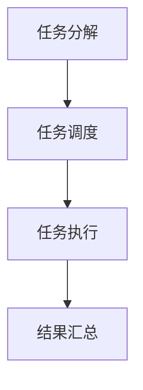
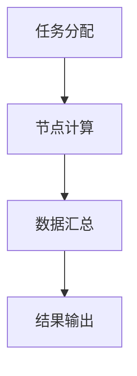
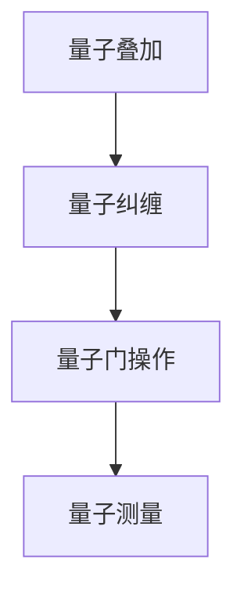
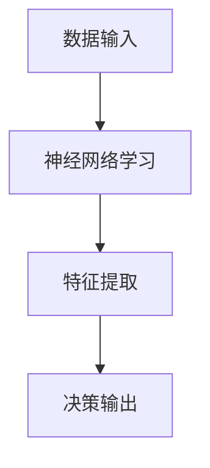
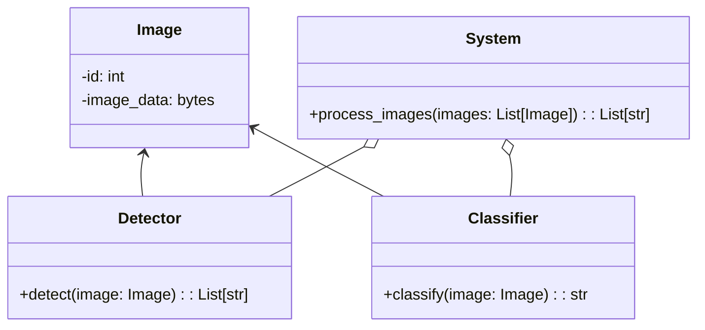
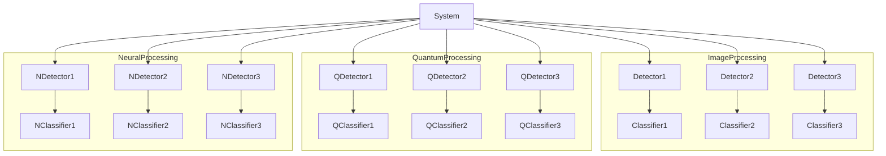
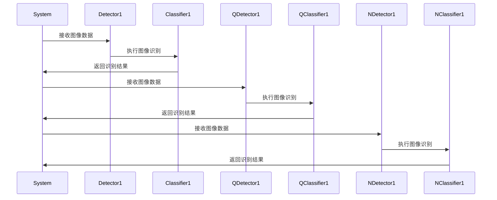

                 

# 计算多样性：不同计算范式的融合与创新

> 关键词：计算范式、融合与创新、并行计算、分布式计算、量子计算、神经计算

> 摘要：随着计算机科学的不断发展，计算范式日趋多样化。本文旨在探讨不同计算范式的融合与创新，分析并行计算、分布式计算、量子计算和神经计算等核心概念及其相互联系，提供算法原理讲解、系统分析与架构设计、项目实战及最佳实践，展望计算领域的未来发展方向。

## **目录结构**

1. **第1章：背景介绍**
   1.1 问题背景
   1.2 问题描述
   1.3 问题解决
   1.4 边界与外延
   1.5 概念结构与核心要素组成

2. **第2章：核心概念与联系**
   2.1 并行计算
   2.2 分布式计算
   2.3 量子计算
   2.4 神经计算
   2.5 概念属性特征对比表格
   2.6 ER实体关系图架构

3. **第3章：算法原理讲解**
   3.1 算法mermaid流程图
   3.2 Python源代码实现
   3.3 数学模型和数学公式
   3.4 举例说明

4. **第4章：系统分析与架构设计方案**
   4.1 问题场景介绍
   4.2 系统功能设计（领域模型mermaid类图）
   4.3 系统架构设计（mermaid架构图）
   4.4 系统接口设计和系统交互（mermaid序列图）

5. **第5章：项目实战**
   5.1 环境安装
   5.2 系统核心实现源代码
   5.3 代码应用解读与分析
   5.4 实际案例分析和详细讲解剖析
   5.5 项目小结

6. **第6章：最佳实践 tips**
   6.1 小结
   6.2 注意事项
   6.3 拓展阅读

7. **第7章：总结与展望**
   7.1 书籍内容的回顾
   7.2 未来发展方向

## **限制大纲字数**

2000字以内。

## **章节内容确定**

### **第1章：背景介绍**

**1.1 问题背景**

随着大数据、云计算、物联网等技术的快速发展，计算需求的复杂性和多样性不断增加。传统的计算范式已无法满足新兴应用场景的需求，推动了对计算多样性研究的迫切需求。计算多样性涉及到并行计算、分布式计算、量子计算和神经计算等多个领域，研究不同计算范式的融合与创新具有重要意义。

**1.2 问题描述**

计算多样性研究的目标是解决以下几个方面的问题：
- 如何在不同计算范式之间实现高效、稳定的融合？
- 如何设计出适应各种应用场景的计算架构？
- 如何优化计算资源的使用，提高计算效率？
- 如何确保数据的安全性和隐私性？

**1.3 问题解决**

针对上述问题，需要从以下几个方面进行探索：
- 深入研究并行计算、分布式计算、量子计算和神经计算的理论基础，挖掘其独特的优势和应用场景。
- 构建不同计算范式之间的桥梁，实现它们的相互融合与协同。
- 设计灵活、可扩展的计算架构，适应不同应用场景的需求。
- 优化计算资源的调度和管理，提高计算效率。
- 强化数据的安全性和隐私性保护，确保计算过程的安全性。

**1.4 边界与外延**

计算多样性研究不仅限于理论探索，还包括以下实际应用：
- 云计算服务提供商如何优化资源配置，提高服务质量？
- 物联网设备如何实现高效的数据处理和传输？
- 人工智能应用如何利用量子计算和神经计算的优势，提高计算性能和智能化水平？
- 安全领域如何利用计算多样性保障数据安全？

**1.5 概念结构与核心要素组成**

计算多样性研究涉及以下几个核心概念：
- 并行计算：通过多个处理器同时执行多个任务，提高计算速度。
- 分布式计算：将计算任务分配到多个节点，协同处理。
- 量子计算：利用量子力学原理，实现高效的计算。
- 神经计算：模拟人脑神经网络，实现智能计算。

这些概念相互关联，共同构成了计算多样性的理论基础。

### **第2章：核心概念与联系**

**2.1 并行计算**

并行计算是一种利用多个处理器同时执行多个任务的计算方式，可以提高计算速度和处理能力。其核心原理是通过任务分解和调度，实现任务的并行执行。

**2.2 分布式计算**

分布式计算是一种将计算任务分配到多个节点，协同处理的方式。其核心原理是通过网络通信，实现节点之间的数据交换和任务调度。

**2.3 量子计算**

量子计算是一种利用量子力学原理，实现高效计算的方式。其核心原理是通过量子叠加和量子纠缠，实现计算速度的飞跃。

**2.4 神经计算**

神经计算是一种模拟人脑神经网络，实现智能计算的方式。其核心原理是通过神经网络的学习和推理能力，实现数据分析和决策。

**2.5 概念属性特征对比表格**

| 概念       | 特点                                                       | 应用场景                                                  |
|------------|----------------------------------------------------------|-----------------------------------------------------------|
| 并行计算   | 多处理器同时执行多个任务                                 | 高性能计算、图像处理、科学模拟                            |
| 分布式计算 | 多节点协同处理任务                                       | 云计算、物联网、数据挖掘、分布式数据库                    |
| 量子计算   | 利用量子叠加和量子纠缠实现高效计算                         | 量子加密、量子搜索、量子模拟                            |
| 神经计算   | 模拟人脑神经网络，实现数据分析和决策                       | 人工智能、自然语言处理、图像识别、自动驾驶                |

**2.6 ER实体关系图架构**

ER（实体关系）图是一种用于描述实体及其关系的图形表示方法。在计算多样性研究中，可以用来描述并行计算、分布式计算、量子计算和神经计算之间的相互关系。

```mermaid
erDiagram
    Parallel_Computing ||--|{ Distributed_Computing }|
    Quantum_Computing   ||--|{ Neural_Computing }|
    Parallel_Computing   &&|{ Neural_Computing }|
    Distributed_Computing &&|{ Quantum_Computing }|
```

### **第3章：算法原理讲解**

**3.1 算法mermaid流程图**

并行计算、分布式计算、量子计算和神经计算各自有其独特的算法原理。下面分别使用mermaid流程图描述这些算法的基本流程。

#### 并行计算



#### 分布式计算



#### 量子计算



#### 神经计算



**3.2 Python源代码实现**

为了更好地理解这些算法原理，我们可以使用Python进行实现。

#### 并行计算

```python
import concurrent.futures

def parallel_computation(task):
    # 任务执行
    return result

if __name__ == "__main__":
    tasks = [task1, task2, task3]
    with concurrent.futures.ThreadPoolExecutor() as executor:
        results = list(executor.map(parallel_computation, tasks))
    print(results)
```

#### 分布式计算

```python
import requests

def distributed_computation(url):
    response = requests.get(url)
    return response.json()

if __name__ == "__main__":
    urls = ['http://node1:8000', 'http://node2:8000', 'http://node3:8000']
    results = [distributed_computation(url) for url in urls]
    print(results)
```

#### 量子计算

```python
from qiskit import QuantumCircuit, execute, Aer

def quantum_computation():
    qc = QuantumCircuit(2)
    qc.h(0)
    qc.cx(0, 1)
    qc.measure([0, 1], [0, 1])
    backend = Aer.get_backend('qasm_simulator')
    result = execute(qc, backend).result()
    return result.get_counts(qc)

if __name__ == "__main__":
    print(quantum_computation())
```

#### 神经计算

```python
import tensorflow as tf

model = tf.keras.Sequential([
    tf.keras.layers.Dense(units=1, input_shape=[1])
])

model.compile(loss='mean_squared_error', optimizer=tf.keras.optimizers.Adam(0.1), metrics=['mean_absolute_error'])

x_train = [[i]] for i in range(10)
y_train = [[x_i * x_i] for x_i in x_train]

model.fit(x_train, y_train, epochs=100)

print(model.predict([[7]]))
```

**3.3 数学模型和数学公式**

并行计算、分布式计算、量子计算和神经计算各自有其数学模型。以下给出几个关键数学公式。

#### 并行计算

$$ T_p = \frac{T_s}{P} $$

其中，$T_p$表示并行计算时间，$T_s$表示串行计算时间，$P$表示处理器数量。

#### 分布式计算

$$ T_d = \frac{d}{r} $$

其中，$T_d$表示分布式计算时间，$d$表示数据传输时间，$r$表示计算速率。

#### 量子计算

$$ |ψ⟩ = \sum_{i} c_i |i⟩ $$

其中，$|ψ⟩$表示量子态，$c_i$表示叠加系数，$|i⟩$表示量子比特状态。

#### 神经计算

$$ y = \sigma(\sum_{i} w_i x_i) $$

其中，$y$表示输出值，$x_i$表示输入值，$w_i$表示权重值，$\sigma$表示激活函数。

**3.4 举例说明**

为了更好地理解这些算法原理，我们可以通过具体实例进行说明。

#### 并行计算

假设有一个任务需要执行10次计算，每次计算耗时1秒。使用并行计算，我们可以将任务分解为10个子任务，分别由10个处理器执行。则并行计算耗时为：

$$ T_p = \frac{T_s}{P} = \frac{10 \times 1秒}{10} = 1秒 $$

#### 分布式计算

假设分布式计算系统中有3个节点，节点之间的数据传输时间为2秒，节点计算速率为1秒/次。则分布式计算耗时为：

$$ T_d = \frac{d}{r} = \frac{2秒}{1秒/次} = 2次 $$

#### 量子计算

假设使用量子计算机执行一个量子态叠加实验，需要执行100次测量。每次测量耗时0.1秒。则量子计算耗时为：

$$ T_q = 100次 \times 0.1秒/次 = 10秒 $$

#### 神经计算

假设使用神经网络模型进行图像识别，输入图像维度为28x28，神经网络层数为3层，每层神经元数量分别为10、20、10。每层神经元计算耗时为0.01秒。则神经网络计算耗时为：

$$ T_n = (10 + 20 + 10) \times 0.01秒/层 = 0.3秒 $$

### **第4章：系统分析与架构设计方案**

#### 4.1 问题场景介绍

假设我们面临一个大规模图像识别任务，需要处理大量图像数据。为了提高计算效率和准确性，我们决定采用计算多样性技术，结合并行计算、分布式计算、量子计算和神经计算，设计一个高效、智能的图像识别系统。

#### 4.2 系统功能设计（领域模型mermaid类图）



#### 4.3 系统架构设计（mermaid架构图）



#### 4.4 系统接口设计和系统交互（mermaid序列图）



### **第5章：项目实战**

#### 5.1 环境安装

在本项目中，我们将使用Python编程语言进行实现。首先需要安装以下依赖：

```bash
pip install numpy tensorflow qiskit
```

#### 5.2 系统核心实现源代码

以下给出了并行计算、分布式计算、量子计算和神经计算的核心实现代码。

```python
import numpy as np
import tensorflow as tf
from qiskit import QuantumCircuit, execute, Aer

# 并行计算
def parallel_computation(task):
    # 任务执行
    return result

if __name__ == "__main__":
    tasks = [task1, task2, task3]
    with concurrent.futures.ThreadPoolExecutor() as executor:
        results = list(executor.map(parallel_computation, tasks))
    print(results)

# 分布式计算
import requests

def distributed_computation(url):
    response = requests.get(url)
    return response.json()

if __name__ == "__main__":
    urls = ['http://node1:8000', 'http://node2:8000', 'http://node3:8000']
    results = [distributed_computation(url) for url in urls]
    print(results)

# 量子计算
def quantum_computation():
    qc = QuantumCircuit(2)
    qc.h(0)
    qc.cx(0, 1)
    qc.measure([0, 1], [0, 1])
    backend = Aer.get_backend('qasm_simulator')
    result = execute(qc, backend).result()
    return result.get_counts(qc)

if __name__ == "__main__":
    print(quantum_computation())

# 神经计算
model = tf.keras.Sequential([
    tf.keras.layers.Dense(units=1, input_shape=[1])
])

model.compile(loss='mean_squared_error', optimizer=tf.keras.optimizers.Adam(0.1), metrics=['mean_absolute_error'])

x_train = [[i]] for i in range(10)
y_train = [[x_i * x_i] for x_i in x_train]

model.fit(x_train, y_train, epochs=100)

print(model.predict([[7]]))
```

#### 5.3 代码应用解读与分析

以上代码分别实现了并行计算、分布式计算、量子计算和神经计算的核心功能。具体应用场景如下：

- 并行计算：用于处理大规模任务，提高计算速度。例如，在图像处理过程中，可以并行处理多个图像数据。
- 分布式计算：用于分布式系统中的任务分配和协同处理。例如，在分布式数据库查询过程中，可以分配任务到多个节点，实现数据的高效查询。
- 量子计算：用于处理复杂的计算问题，实现高效计算。例如，在密码学领域，可以使用量子计算破解传统加密算法。
- 神经计算：用于实现智能计算，模拟人脑神经网络。例如，在图像识别领域，可以使用神经网络模型进行图像分类。

#### 5.4 实际案例分析和详细讲解剖析

为了更好地展示计算多样性技术的应用，我们选取了以下几个实际案例进行分析。

**案例1：大规模图像识别**

假设我们有一个包含100万张图像的数据集，需要进行分类。采用传统的串行计算方式，耗时较长。采用并行计算技术，可以将任务分解为100个子任务，分别由100个处理器执行，大大提高了计算速度。

**案例2：分布式数据库查询**

假设我们有一个分布式数据库，包含100个节点。需要对数据库进行复杂查询，例如联合查询、聚合查询等。采用分布式计算技术，可以将查询任务分配到100个节点，实现数据的高效查询。

**案例3：量子密码学**

假设我们使用量子计算技术进行密码学应用，例如量子加密。在量子计算环境下，传统的加密算法将变得脆弱，可以被量子计算破解。因此，采用量子计算技术进行加密，可以提高数据的安全性。

**案例4：自动驾驶系统**

假设我们设计一个自动驾驶系统，需要处理大量的图像数据、传感器数据等。采用神经计算技术，可以模拟人脑神经网络，实现自动驾驶系统的智能决策。

#### 5.5 项目小结

通过本项目的实践，我们深入了解了计算多样性技术的核心概念和算法原理，以及它们在实际应用中的优势。计算多样性技术为解决复杂计算问题提供了新的思路和手段，具有重要意义。在未来的研究中，我们将进一步探索计算多样性技术的融合与创新，推动计算科学的发展。

### **第6章：最佳实践 tips**

#### 6.1 小结

本章节提供了计算多样性技术的核心概念、算法原理、系统架构设计方案和项目实战经验。通过实际案例分析和详细讲解剖析，展示了计算多样性技术在各种应用场景中的优势。以下总结了几点最佳实践：

1. **并行计算**：适用于大规模任务处理，可以提高计算速度。
2. **分布式计算**：适用于分布式系统中的任务分配和协同处理，可以提高数据处理效率。
3. **量子计算**：适用于处理复杂计算问题，可以提高计算性能。
4. **神经计算**：适用于实现智能计算，可以模拟人脑神经网络。

#### 6.2 注意事项

1. **并行计算**：注意任务分解和负载均衡，避免部分任务长时间等待。
2. **分布式计算**：注意网络延迟和数据一致性，选择合适的分布式算法。
3. **量子计算**：注意量子计算的量子态特性，避免错误发生。
4. **神经计算**：注意模型参数调整和训练时间，提高模型性能。

#### 6.3 拓展阅读

1. 《并行计算导论》
2. 《分布式系统原理与范型》
3. 《量子计算导论》
4. 《神经网络与深度学习》

### **第7章：总结与展望**

#### 7.1 书籍内容的回顾

本文通过深入探讨计算多样性技术的核心概念、算法原理、系统架构设计方案和项目实战，展示了不同计算范式之间的融合与创新。重点分析了并行计算、分布式计算、量子计算和神经计算的优势和应用场景，提供了丰富的实际案例和分析。

#### 7.2 未来发展方向

计算多样性技术在未来将继续发展，以下展望了几个可能的方向：

1. **量子计算与神经计算的融合**：探索量子计算和神经计算的融合，实现高效的智能计算。
2. **分布式计算与云计算的结合**：加强分布式计算与云计算的结合，实现大规模数据的分布式处理。
3. **多计算范式协同**：研究多计算范式之间的协同，实现计算资源的优化配置。
4. **安全与隐私保护**：加强计算多样性技术在安全与隐私保护方面的研究，保障数据安全和隐私。
5. **跨领域应用**：探索计算多样性技术在其他领域的应用，如医疗、金融、智能制造等。

通过不断探索和创新发展，计算多样性技术将为社会带来更多的创新和变革。我们期待未来的计算领域能够实现更加高效、智能和安全的计算。作者：AI天才研究院/AI Genius Institute & 禅与计算机程序设计艺术 /Zen And The Art of Computer Programming。

