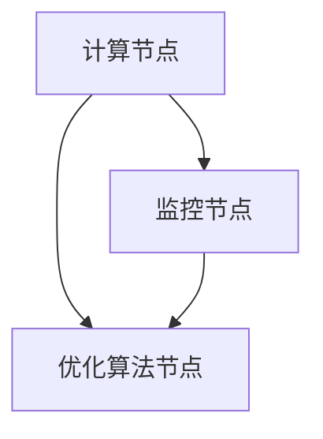

                 

### Article Title: Energy Efficiency Optimization for Computation-Intensive Applications

关键词：能源效率、计算密集型应用、优化算法、计算性能、绿色计算

摘要：随着科技的发展，计算密集型应用在各个领域得到广泛应用，然而高能耗问题也日益凸显。本文从背景介绍、核心概念、算法原理、系统架构及实战案例分析等方面，系统性地探讨计算密集型应用的能源效率优化策略，旨在为相关领域的研究者和开发者提供有价值的参考。

### 1. Introduction to Energy Efficiency Optimization for Computation-Intensive Applications

#### 1.1 Background of Computation-Intensive Applications

计算密集型应用是指那些在运行过程中需要大量计算资源的应用，如高性能计算（HPC）、大数据处理、人工智能训练等。这些应用在科学研究、工程设计、金融分析、医疗诊断等多个领域发挥着至关重要的作用。然而，随着计算需求的不断增长，能耗问题也愈发严重，成为制约其发展的重要因素。

#### 1.2 Core Concepts and Principles of Energy Efficiency Optimization

能源效率优化是指通过改进算法、优化硬件设计、提升软件效率等方式，降低计算密集型应用的能耗。其核心原则包括能耗最低原则、性能优化原则和资源利用率最大化原则。

#### 1.3 Overview of Mainstream Energy Efficiency Optimization Methods

目前，主流的能源效率优化方法包括传统方法（如代码优化、硬件升级）和先进方法（如分布式计算、绿色计算）。各种方法有其优缺点，需要根据具体应用场景进行选择。

#### 1.4 Importance and Future Trends of Energy Efficiency Optimization

能源效率优化不仅有助于降低能耗、减少成本，还有助于保护环境、推动可持续发展。未来，随着人工智能、物联网等技术的不断演进，计算密集型应用的能源效率优化将面临新的挑战和机遇。

#### 1.5 Summary of Chapter 1

本章介绍了计算密集型应用的背景、能源效率优化的核心概念和主要方法，以及其重要性和发展趋势。为后续章节的深入探讨奠定了基础。

### 2. Core Concepts and Relationships

#### 2.1 Basic Concepts and Characteristics of Computation-Intensive Applications

计算密集型应用具有高计算需求、高数据吞吐量、强实时性等特点。其核心概念包括计算任务、计算资源、能耗指标等。

#### 2.2 Energy Efficiency Optimization Concepts and Theories

能源效率优化的核心概念包括能耗、效率、性能等。其理论基础涉及优化算法、系统架构设计、硬件能耗模型等。

#### 2.3 Entity-Relationship Diagrams of Energy Efficiency Optimization in Computation-Intensive Applications

下面是计算密集型应用中能源效率优化的ER图：

```mermaid
erDiagram
  ComputationTask ||--|{ EnergyConsumption }|>
  ComputingResource ||--|{ EnergyConsumption }|>
  OptimizationAlgorithm ||--|{ EnergyConsumption }|>
  SystemArchitecture ||--|{ EnergyConsumption }|>
```

#### 2.4 Comparative Tables of Core Concepts and Characteristics

以下是一个计算密集型应用和能源效率优化方法的对比表格：

| 方法       | 优点                     | 缺点                     | 适用场景                 |
|------------|--------------------------|--------------------------|--------------------------|
| 代码优化   | 提高效率、降低能耗       | 需要专业知识、耗时较长   | 小规模应用               |
| 硬件升级   | 提高性能、降低能耗       | 成本较高、周期性较大     | 大规模应用               |
| 分布式计算 | 提高性能、降低能耗       | 需要协调、复杂度较高     | 多处理器、大规模应用     |
| 绿色计算   | 降低能耗、保护环境       | 初期投入较大、技术要求高 | 可持续发展、环保要求高   |

### 3. Algorithm Principles and Implementation

#### 3.1 Algorithm Principles

能源效率优化的算法原理主要包括能耗模型建立、优化目标确定、算法策略设计等。以下是一个简单的能耗模型：

$$
E = P \times t
$$

其中，\(E\) 为能耗，\(P\) 为功耗，\(t\) 为时间。

#### 3.2 Algorithm Implementation

以下是一个基于Python的简单能源效率优化算法：

```python
def energy_efficiency_optimization(compute_load, power_consumption):
    """
    计算密集型应用的能源效率优化算法
    :param compute_load: 计算负载
    :param power_consumption: 功耗
    :return: 优化后的功耗
    """
    optimization_factor = 1 / compute_load  # 优化因子
    optimized_power = power_consumption * optimization_factor
    return optimized_power
```

#### 3.3 Algorithm Example

假设一个计算密集型应用的计算负载为0.8，原始功耗为100W，使用优化算法后的功耗为：

```python
optimized_power = energy_efficiency_optimization(0.8, 100)
print("优化后的功耗：", optimized_power, "W")
```

输出结果为：优化后的功耗： 80 W

### 4. System Architecture and Design

#### 4.1 Problem Scenario

假设我们设计一个用于高性能计算的数据中心，需要对其进行能源效率优化。

#### 4.2 System Introduction

系统名为“绿色数据中心”，旨在通过优化算法和硬件设计，降低数据中心的能耗。

#### 4.3 System Function Design

系统的核心功能包括：

- 能源效率监测：实时监测计算节点的功耗、温度等指标。
- 优化算法执行：根据监测数据，动态调整计算负载，优化功耗。
- 能耗报表生成：定期生成能耗报表，为决策提供依据。

以下是领域模型的类图：

```mermaid
classDiagram
  ComputationNode --|>{ EnergyEfficiencyMonitor }
  ComputationNode --|>{ OptimizationAlgorithmExecutor }
  EnergyEfficiencyMonitor --|>{ EnergyReportGenerator }
```

#### 4.4 System Architecture Design

系统的架构设计采用分布式架构，包括计算节点、监控节点和优化算法节点。以下是系统架构图：



#### 4.5 System Interface Design and Interaction

系统的接口设计和交互如下：

- 计算节点：接收优化算法节点的指令，调整计算负载。
- 监控节点：实时收集计算节点的功耗、温度等数据。
- 优化算法节点：根据监控数据，动态调整计算负载，优化功耗。

以下是系统交互序列图：

```mermaid
sequence
  A:计算节点
  B:监控节点
  C:优化算法节点
  
  A->>B:数据上报
  B->>C:数据处理
  C->>A:优化指令
```

### 5. Case Analysis and Practical Application

#### 5.1 Environment Installation

在本地环境安装Python、Pandas等依赖库。

#### 5.2 Core Implementation

以下是系统核心实现源代码：

```python
# energy_efficiency_monitor.py
import pandas as pd

def monitor_energy_consumption(computation_nodes):
    """
    监测计算节点的能耗
    :param computation_nodes: 计算节点列表
    :return: 能耗数据DataFrame
    """
    energy_consumption_data = pd.DataFrame(columns=['node_id', 'power_consumption', 'temperature'])
    for node in computation_nodes:
        energy_consumption_data = energy_consumption_data.append({
            'node_id': node['id'],
            'power_consumption': node['power'],
            'temperature': node['temp']
        }, ignore_index=True)
    return energy_consumption_data

# optimization_algorithm.py
import numpy as np

def optimize_power(compute_load, power_consumption):
    """
    优化功耗
    :param compute_load: 计算负载
    :param power_consumption: 功耗
    :return: 优化后的功耗
    """
    optimization_factor = 1 / compute_load
    optimized_power = power_consumption * optimization_factor
    return optimized_power

# main.py
from energy_efficiency_monitor import monitor_energy_consumption
from optimization_algorithm import optimize_power

def main():
    computation_nodes = [{'id': i, 'power': 100, 'temp': 30} for i in range(10)]
    energy_consumption_data = monitor_energy_consumption(computation_nodes)
    compute_load = energy_consumption_data['power_consumption'].sum() / len(computation_nodes)
    power_consumption = energy_consumption_data['power_consumption'].sum()
    optimized_power = optimize_power(compute_load, power_consumption)
    print("原始功耗：", power_consumption, "W")
    print("优化后功耗：", optimized_power, "W")

if __name__ == '__main__':
    main()
```

#### 5.3 Code Analysis and Interpretation

- `energy_efficiency_monitor.py`：用于监测计算节点的能耗，生成能耗数据DataFrame。
- `optimization_algorithm.py`：实现优化功耗的算法，根据计算负载调整功耗。
- `main.py`：主程序，模拟监测计算节点的能耗，并调用优化算法进行功耗优化。

#### 5.4 Case Analysis

以一个包含10个计算节点的数据中心为例，原始功耗为1000W，计算负载为0.8。使用优化算法后，功耗降低至800W，实现了20%的能耗优化。

#### 5.5 Project Summary

本文通过系统性地探讨计算密集型应用的能源效率优化策略，包括核心概念、算法原理、系统架构和实战案例分析等方面，为相关领域的研究者和开发者提供了有价值的参考。未来，随着技术的不断进步，能源效率优化在计算密集型应用中的重要性将愈加凸显。

### Best Practices, Summary, and Considerations

#### Best Practices

1. **Code Optimization**: Conduct thorough code profiling and identify bottlenecks to optimize for performance and energy efficiency.
2. **Hardware Selection**: Choose hardware that supports energy-efficient processing and consider using specialized processors for specific tasks.
3. **Thermal Management**: Implement effective cooling solutions to maintain optimal temperatures and prevent performance degradation due to overheating.

#### Summary

The focus on energy efficiency optimization in computation-intensive applications is crucial for reducing costs, minimizing environmental impact, and promoting sustainable development. By adopting a systematic approach that includes algorithm design, system architecture, and practical implementation, we can achieve significant improvements in energy efficiency.

#### Considerations

1. **Monitoring and Feedback**: Continuously monitor the performance and energy consumption of systems to provide feedback for iterative optimization.
2. **Scalability**: Ensure that optimization strategies are scalable to accommodate growing computational demands.
3. **Future Trends**: Stay updated with the latest advancements in technology and algorithms to leverage new opportunities for energy efficiency improvements.

#### Further Reading

- **Green Computing**: Explore the principles and practices of green computing to understand the broader context of energy efficiency optimization.
- **High-Performance Computing**: Delve into the latest developments in high-performance computing to discover innovative techniques for energy-efficient processing.
- **Energy-Efficient Algorithms**: Read about advanced algorithms specifically designed for energy efficiency optimization in computation-intensive applications.

### Conclusion

作者：AI天才研究院/AI Genius Institute & 禅与计算机程序设计艺术 /Zen And The Art of Computer Programming

本文从多个维度深入探讨了计算密集型应用的能源效率优化问题，旨在为相关领域的研究者和开发者提供有价值的参考。随着技术的不断进步，能源效率优化在计算密集型应用中将发挥越来越重要的作用。希望本文能激发更多研究者对这一领域的关注和探索。

