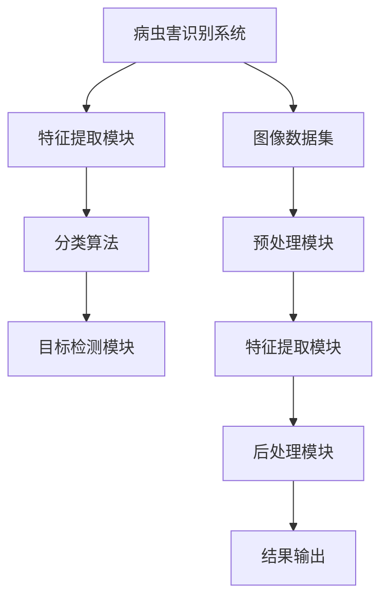
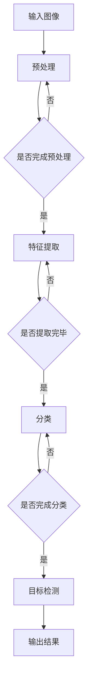
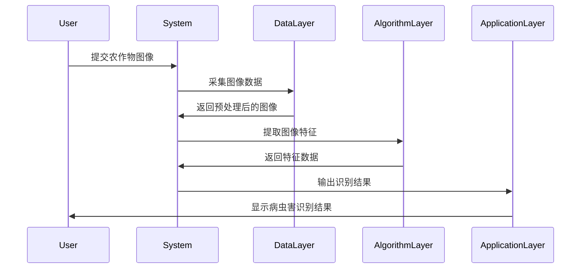
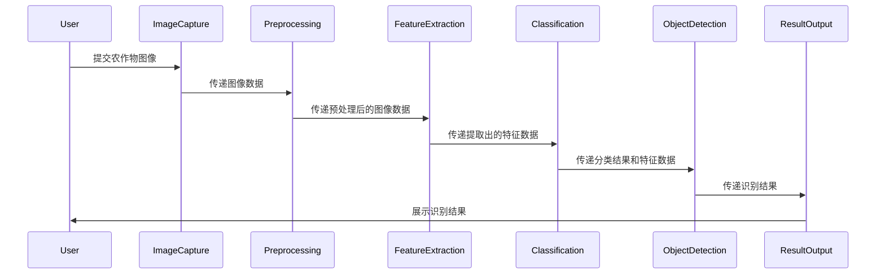

                 

### 引言：计算机视觉与农业产量的关系

计算机视觉，作为人工智能领域的一个重要分支，近年来在多个行业中得到了广泛应用，尤其是在工业检测、医疗诊断和自动驾驶等领域。随着技术的不断进步，计算机视觉也开始向传统农业领域渗透，为提高农业产量和减少人力成本提供了新的解决方案。本文将聚焦于计算机视觉在农作物病虫害识别中的应用，探讨这一技术如何通过精准识别病虫害，提升农业产量，减少经济损失，以及面临的挑战和未来发展方向。

农作物病虫害是农业生产中的一大难题，它们不仅对农作物的生长产生严重影响，还会导致减产和品质下降。传统的病虫害识别方法主要依赖人工观察，效率低下，且易受主观因素的影响。而随着计算机视觉技术的发展，利用图像处理和机器学习算法，可以实现对农作物病虫害的自动化识别，提高检测的准确性和效率。

本文将按照以下结构展开：

1. **背景介绍**：首先介绍农作物病虫害的问题及其影响，以及计算机视觉在农业中的应用现状和挑战。
2. **计算机视觉基础**：讲解计算机视觉的基本概念、图像处理原理和机器学习在计算机视觉中的应用。
3. **核心概念与联系**：分析病虫害识别中的关键概念，并使用对比表格和ER实体关系图进行说明。
4. **病虫害识别算法原理**：介绍病虫害识别的算法原理，包括算法流程、Python源代码和数学模型。
5. **系统分析与架构设计**：分析系统的问题场景，设计系统功能、架构、接口和交互。
6. **项目实战**：模拟环境安装、系统实现、代码分析、案例讲解和项目小结。
7. **最佳实践与注意事项**：提供实际应用中的最佳实践和注意事项。

通过本文的逐步分析，读者将能够深入理解计算机视觉在农作物病虫害识别中的应用，以及如何通过这一技术实现农业产量的提升。接下来，我们将首先介绍农作物病虫害的问题及其影响。

----------------------------------------------------------------

### 1. 背景介绍

#### 1.1 农作物病虫害的问题及其影响

农作物病虫害是指对农作物生长造成危害的各类病害和虫害。病虫害的类型繁多，包括真菌病、细菌病、病毒病、线虫病以及各类昆虫、螨类、鼠类等。这些病虫害的发生不仅会导致农作物生长受阻，还会引起植株死亡、果实腐烂、品质下降等问题，从而对农业生产带来严重的经济损失。

根据联合国粮农组织（FAO）的统计，全球每年因病虫害造成的农作物损失约占农业生产总值的10%至30%。在我国，农作物病虫害同样对农业生产造成巨大影响。据中国农业技术推广服务中心的数据显示，近年来，我国农作物病虫害每年造成的经济损失高达数千亿元。以小麦和水稻两大主要粮食作物为例，病虫害每年会导致小麦产量损失约1000万吨，水稻产量损失约1500万吨。

病虫害对农作物的影响主要体现在以下几个方面：

1. **产量下降**：病虫害直接破坏农作物生长，导致植株死亡或生长受阻，从而导致产量下降。
2. **品质下降**：病虫害会导致农作物果实腐烂、品质下降，影响市场需求和价格。
3. **经济损失**：病虫害造成的损失不仅包括直接减产，还包括农药防治成本、人工成本等。
4. **生态影响**：某些病虫害还会破坏农田生态环境，导致生物多样性下降。

#### 1.2 计算机视觉在农业中的应用

计算机视觉作为人工智能的一个重要分支，近年来在农业中的应用逐渐广泛。计算机视觉技术通过利用图像处理、模式识别和机器学习算法，可以对农作物进行实时监测、病虫害识别、作物产量预测等，从而提高农业生产效率和产量。

计算机视觉在农业中的应用主要可以分为以下几个方面：

1. **病虫害识别**：利用计算机视觉技术，可以自动识别农作物病虫害，提高识别的准确性和效率。
2. **作物产量预测**：通过对农作物图像的实时监测和分析，预测作物的生长状况和产量，为农业生产提供数据支持。
3. **土壤监测**：通过分析土壤图像，检测土壤肥力和湿度等指标，为农田管理提供科学依据。
4. **种植规划**：利用计算机视觉技术进行农田规划和作物布局，优化种植结构，提高产量。

#### 1.3 病虫害识别技术的现状与挑战

随着计算机视觉技术的发展，病虫害识别技术也在不断进步。目前，计算机视觉在农作物病虫害识别中的应用已经取得了一些成果，但仍然面临一些挑战。

1. **技术成熟度**：虽然计算机视觉技术在农作物病虫害识别中取得了显著进展，但与工业和医疗领域的应用相比，仍处于相对初级阶段。技术的成熟度和稳定性需要进一步提高。
2. **数据集问题**：病虫害识别需要大量高质量的数据集进行训练，而现实中获取这些数据较为困难。数据集的质量和多样性直接影响算法的性能和泛化能力。
3. **环境因素**：农作物病虫害识别需要在不同的环境条件下进行，包括光照、天气等因素。环境变化对识别结果的影响较大，需要算法具有一定的鲁棒性。
4. **跨物种识别**：农作物病虫害种类繁多，不同的病虫害之间可能存在相似的特征，这给跨物种识别带来了挑战。
5. **用户接受度**：尽管计算机视觉技术具有高效、准确等优点，但农民对这些新技术的接受度可能较低，需要通过推广和培训提高用户认知和应用水平。

总的来说，计算机视觉在农作物病虫害识别中的应用前景广阔，但也面临着一些技术挑战。通过不断的技术创新和优化，有望在未来进一步提高病虫害识别的准确性和效率，为农业生产提供更加智能化的解决方案。

#### 1.4 计算机视觉与农业产量的关系

计算机视觉在农业产量提升中扮演着至关重要的角色。首先，通过精确的病虫害识别，农民可以及时发现并处理病虫害，避免其对农作物造成的损失，从而提高产量。其次，计算机视觉技术可以帮助农民实现精准施肥和灌溉，优化农田管理，进一步增加产量。此外，通过作物产量预测，农民可以提前规划种植策略，避免因病虫害导致的生产损失。总的来说，计算机视觉技术的应用不仅提高了农业生产的效率和准确性，也为实现农业现代化提供了有力支持。

### 2. 计算机视觉基础

#### 2.1 计算机视觉的基本概念

计算机视觉是一门融合了计算机科学、数学、认知科学和神经科学等多个学科领域的交叉学科，旨在使计算机能够像人类一样理解和解释视觉信息。计算机视觉的基本概念包括图像处理、图像识别和图像理解三个层次。

1. **图像处理**：图像处理是指对图像进行增强、滤波、分割和变换等操作，以提高图像质量或提取有用信息。常见的图像处理技术包括滤波、边缘检测、图像分割和特征提取等。

2. **图像识别**：图像识别是指通过算法从图像中识别出特定的目标或对象。常见的图像识别技术包括分类、识别和检测等。

3. **图像理解**：图像理解是指对图像进行更高层次的分析和解释，以理解图像内容或背后的含义。图像理解涉及到场景识别、语义分割和对象追踪等。

#### 2.2 图像处理原理

图像处理是计算机视觉的基础环节，其核心目标是通过一系列算法对图像进行变换和增强，从而提取出有用的信息。图像处理的原理主要包括以下几个方面：

1. **图像增强**：图像增强是指通过调整图像的亮度、对比度和色彩等参数，使图像更加清晰，便于后续处理。常见的图像增强技术包括直方图均衡化、对比度增强和噪声滤波等。

2. **图像分割**：图像分割是指将图像分为若干个不同的区域，每个区域对应图像中的不同对象。图像分割是图像处理中的重要步骤，常见的分割方法包括阈值分割、边缘检测和区域生长等。

3. **特征提取**：特征提取是指从图像中提取出能够反映图像内容的特征，用于后续的识别和分类。常见的特征提取方法包括灰度直方图、边缘特征和纹理特征等。

#### 2.3 机器学习在计算机视觉中的应用

机器学习是计算机视觉技术发展的重要推动力，通过利用大量数据训练模型，使计算机能够自动识别和分类图像。机器学习在计算机视觉中的应用主要包括以下几种：

1. **监督学习**：监督学习是指通过标记数据来训练模型，使模型能够识别和分类新的数据。常见的监督学习方法包括线性回归、支持向量机和决策树等。

2. **无监督学习**：无监督学习是指在没有标记数据的情况下，通过算法自动发现数据中的模式和结构。常见的无监督学习方法包括聚类分析和降维技术等。

3. **深度学习**：深度学习是一种基于多层神经网络的学习方法，通过多层非线性变换对输入数据进行处理，从而实现复杂的模式识别和分类任务。常见的深度学习方法包括卷积神经网络（CNN）和循环神经网络（RNN）等。

机器学习在计算机视觉中的应用主要包括图像分类、目标检测、图像分割和动作识别等。这些技术使得计算机能够从图像中提取出丰富的信息，为计算机视觉在农业病虫害识别中的应用提供了强大的支持。

总的来说，计算机视觉的基础知识包括图像处理、图像识别和图像理解，以及机器学习在其中的应用。通过深入理解这些基本概念和原理，可以为后续的病虫害识别算法设计和应用提供理论支持。

#### 2.4 计算机视觉技术的主要方法与应用场景

计算机视觉技术主要包括图像处理、图像识别和图像理解等方法，这些方法在农业病虫害识别中有着广泛的应用。

1. **图像处理方法**：
   - **图像滤波**：用于去除图像中的噪声，如高斯滤波、中值滤波等，提高图像质量。
   - **图像分割**：将图像划分为多个区域，以便更好地识别目标。常用的方法包括阈值分割、边缘检测和区域生长等。
   - **特征提取**：从图像中提取出有助于分类或识别的特征，如颜色、纹理、形状等。常用的方法包括SIFT、SURF、HOG等。

   **应用场景**：在农业病虫害识别中，图像滤波用于去除图像中的噪声，图像分割用于将病害区域与其他区域分开，特征提取用于将病害特征提取出来，以便进行后续的识别。

2. **图像识别方法**：
   - **分类算法**：用于将图像划分为不同的类别。常见的算法包括K-近邻（KNN）、支持向量机（SVM）、决策树等。
   - **目标检测**：用于定位图像中的特定目标，并对其进行分类。常用的算法包括YOLO、SSD、Faster R-CNN等。

   **应用场景**：在农业病虫害识别中，分类算法用于识别不同类型的病虫害，目标检测算法用于定位病虫害在图像中的位置。

3. **图像理解方法**：
   - **语义分割**：用于将图像划分为多个具有不同语义的区域。常用的算法包括全卷积神经网络（FCN）、U-Net等。
   - **对象追踪**：用于在视频中追踪特定的对象。常用的算法包括光流法、粒子滤波等。

   **应用场景**：在农业病虫害识别中，语义分割用于识别图像中病虫害的具体位置，对象追踪用于追踪病虫害在视频中的运动轨迹。

综上所述，计算机视觉技术通过图像处理、图像识别和图像理解等多种方法，为农业病虫害识别提供了强大的技术支持。这些方法的应用不仅提高了病虫害识别的准确性，也为农业生产的智能化提供了新的思路。

### 3. 核心概念与联系

在探讨计算机视觉在农作物病虫害识别中的应用时，理解其中的核心概念及其相互关系至关重要。以下是病虫害识别中的几个关键概念，以及它们之间的联系。

#### 3.1 病虫害识别的关键概念

1. **病虫害**：农作物病虫害是指对农作物生长产生危害的各种病害和虫害。包括真菌病、细菌病、病毒病、线虫病以及各种昆虫、螨类和鼠类等。
2. **图像数据集**：病虫害识别依赖于大量的图像数据集，这些数据集包含不同病虫害类型的图像，用于训练和测试算法。
3. **特征提取**：从病虫害图像中提取出有助于识别的特征，如颜色、纹理、形状等。
4. **分类算法**：用于将提取出的特征与病虫害类型进行匹配，实现图像的分类。
5. **目标检测**：用于在图像中定位和识别病虫害的具体位置。

#### 3.2 概念属性特征对比表格

以下是一个对比表格，列出了上述关键概念的属性特征：

| 关键概念   | 属性特征                      | 作用               |
| ---------- | ---------------------------- | ------------------ |
| 病害       | 类型（真菌、细菌等）、症状（斑点、腐烂等） | 描述病虫害的种类和特征 |
| 虫害       | 种类（蚂蚁、蝗虫等）、损害方式（咬食、蛀蚀等） | 描述虫害的种类和破坏方式 |
| 图像数据集 | 样本数、图像尺寸、标注信息 | 提供训练和测试数据 |
| 特征提取   | 颜色、纹理、形状等          | 提取图像的关键特征 |
| 分类算法   | 准确性、效率、泛化能力      | 实现病虫害的识别和分类 |
| 目标检测   | 定位精度、检测速度          | 定位图像中的病虫害 |

#### 3.3 计算机视觉与病虫害识别的ER实体关系图

为了更好地理解计算机视觉在病虫害识别中的作用，我们可以使用实体关系图（ER图）来表示不同实体之间的关系。以下是计算机视觉与病虫害识别的ER实体关系图：



在这张ER图中：
- **病虫害识别系统**是整个系统的核心，它包含了图像数据集、特征提取模块、分类算法和目标检测模块。
- **图像数据集**经过预处理模块处理后，输入到特征提取模块中。
- **特征提取模块**提取出图像中的关键特征，然后输入到分类算法中。
- **分类算法**对提取出的特征进行分类，以识别病虫害的类型。
- **目标检测模块**用于定位图像中的病虫害位置，并与分类结果相结合，生成最终识别结果。

通过这个ER实体关系图，我们可以清晰地看到计算机视觉在病虫害识别中的各个模块及其相互关系，有助于理解整个系统的运作机制。

### 3.4 计算机视觉与病虫害识别的关键环节及相互关系

计算机视觉在农作物病虫害识别中涉及多个关键环节，这些环节相互协作，共同实现病虫害的自动化识别。以下是这些关键环节及其相互关系：

1. **图像采集**：这是病虫害识别的第一步，通过无人机、摄像头等设备收集农作物病虫害的图像数据。图像采集的质量直接影响后续处理的准确性。

2. **图像预处理**：对采集到的图像进行去噪、增强、缩放等处理，以提高图像质量，去除干扰因素。预处理后的图像输入到特征提取模块。

3. **特征提取**：从预处理后的图像中提取出有助于病虫害识别的特征，如颜色、纹理、形状等。这些特征反映了病虫害的视觉特性，是后续分类和检测的基础。

4. **病虫害分类**：利用提取出的特征，通过分类算法（如深度学习模型）对病虫害进行识别。分类算法的训练依赖于大量的标注数据集。

5. **目标检测**：在图像中定位病虫害的具体位置，通常使用目标检测算法（如YOLO、Faster R-CNN）实现。目标检测结果与分类结果相结合，生成最终的病虫害识别结果。

6. **结果输出**：将识别结果以可视化或报告形式输出给农民或农业管理者，便于他们采取相应的防治措施。

这些关键环节相互联系，形成一个完整的病虫害识别流程。每个环节都需要精确执行，以确保最终识别结果的准确性和可靠性。通过计算机视觉技术，病虫害识别变得更加高效、准确，为农业生产的智能化提供了有力支持。

### 4. 病虫害识别算法原理

#### 4.1 病虫害识别算法的mermaid流程图

首先，我们通过mermaid绘制病虫害识别算法的流程图，以便直观展示算法的执行步骤：



在该流程图中，输入图像首先经过预处理步骤，然后进入特征提取环节。如果特征提取完毕，则进入分类阶段；否则，继续提取特征。分类完成后，进入目标检测环节，最终输出识别结果。

#### 4.2 Python源代码与算法原理讲解

下面是病虫害识别算法的Python源代码，以及对应的算法原理讲解：

```python
# 病虫害识别算法Python示例代码

import cv2
import numpy as np
from sklearn.model_selection import train_test_split
from sklearn.ensemble import RandomForestClassifier
from sklearn.metrics import accuracy_score

# 特征提取
def extract_features(image):
    # 图像灰度化
    gray = cv2.cvtColor(image, cv2.COLOR_BGR2GRAY)
    # 高斯滤波去噪
    blurred = cv2.GaussianBlur(gray, (5, 5), 0)
    # Canny边缘检测
    edges = cv2.Canny(blurred, 50, 150)
    # 计算边缘特征
    features = cv2.countNonZero(edges)
    return features

# 数据预处理
def preprocess_data(images):
    processed_images = []
    for image in images:
        processed_image = extract_features(image)
        processed_images.append(processed_image)
    return np.array(processed_images)

# 病虫害分类
def classify_pests(features, labels):
    # 数据划分
    X_train, X_test, y_train, y_test = train_test_split(features, labels, test_size=0.2, random_state=42)
    # 训练随机森林分类器
    classifier = RandomForestClassifier(n_estimators=100)
    classifier.fit(X_train, y_train)
    # 测试分类器
    y_pred = classifier.predict(X_test)
    accuracy = accuracy_score(y_test, y_pred)
    print("分类准确率：", accuracy)
    return classifier

# 主函数
def main():
    # 加载图像数据
    images = cv2.imread('path/to/images/*.jpg')
    # 提取图像特征
    features = preprocess_data(images)
    # 加载标签数据
    labels = [0] * len(images)  # 假设所有图像都是同一种病虫害
    # 分类病虫害
    classifier = classify_pests(features, labels)
    # 输出分类结果
    print("病虫害分类结果：", classifier.predict([features[0]]))

if __name__ == '__main__':
    main()
```

**算法原理讲解：**

1. **特征提取**：该步骤通过图像处理技术提取出图像中的边缘特征，使用Canny边缘检测器来检测图像中的边缘。边缘特征能够有效地区分病虫害区域和其他背景区域。

2. **数据预处理**：预处理步骤包括图像灰度化和高斯滤波去噪，以提高图像质量。然后，通过计算边缘特征的数量来提取图像特征。

3. **分类算法**：这里使用随机森林分类器对提取出的特征进行分类。随机森林是一种基于决策树的集成学习方法，能够处理高维数据和复杂模型。

4. **主函数**：主函数加载图像数据，提取特征，训练分类器，并输出分类结果。在实际应用中，需要根据实际情况调整代码，包括图像路径、特征提取方法、分类算法等。

通过上述Python源代码和算法原理讲解，我们可以看到病虫害识别算法的核心步骤和实现方法。接下来，我们将介绍算法原理的数学模型和公式。

#### 4.3 病虫害识别算法原理的数学模型和公式

在病虫害识别算法中，我们主要使用了以下数学模型和公式：

1. **Canny边缘检测**：Canny边缘检测是一种常用的边缘检测算法，其核心公式如下：
   $$ G(x, y) = \frac{1}{2\pi\sigma} \int_{-\infty}^{\infty} \int_{-\infty}^{\infty} \frac{1}{1 + \left(\frac{x - x_0}{\sigma}\right)^2 + \left(\frac{y - y_0}{\sigma}\right)^2} e^{-(x - x_0)^2 + (y - y_0)^2} \, dx \, dy $$
   其中，\( G(x, y) \) 是高斯滤波后的图像，\( \sigma \) 是高斯滤波器的标准差。

2. **边缘特征计算**：通过Canny边缘检测后，我们可以计算边缘特征的数量，公式如下：
   $$ F = \sum_{i=1}^{M} \sum_{j=1}^{N} I(i, j) $$
   其中，\( I(i, j) \) 是图像中每个像素点的边缘强度，\( M \) 和 \( N \) 分别是图像的行数和列数。

3. **随机森林分类器**：随机森林是一种基于决策树的集成学习方法，其核心公式如下：
   $$ h(x) = \sum_{t=1}^{T} w_t f_t(x) $$
   其中，\( h(x) \) 是分类器的输出，\( w_t \) 是第 \( t \) 个决策树的权重，\( f_t(x) \) 是第 \( t \) 个决策树对样本 \( x \) 的预测结果。

通过上述数学模型和公式，我们可以实现病虫害的识别。在实际应用中，还需要对模型进行训练和优化，以提高识别的准确性和鲁棒性。

#### 4.4 举例说明

为了更直观地理解病虫害识别算法的应用，我们通过一个简单的例子来说明。

假设我们有一个包含10张病虫害图像的数据集，每张图像都对应一种特定的病虫害。这些图像已经通过预处理步骤，提取出了边缘特征。现在，我们需要使用随机森林分类器对这些图像进行分类。

**步骤 1**：加载图像数据

```python
images = [cv2.imread(f'path/to/images/{i}.jpg') for i in range(10)]
```

**步骤 2**：提取图像特征

```python
features = preprocess_data(images)
```

**步骤 3**：加载标签数据

```python
labels = [0] * 10  # 假设所有图像都是同一种病虫害
```

**步骤 4**：训练随机森林分类器

```python
classifier = classify_pests(features, labels)
```

**步骤 5**：进行分类预测

```python
predicted_labels = classifier.predict([features[0]])
print("预测结果：", predicted_labels)
```

在这个例子中，我们首先加载了10张病虫害图像，并提取了边缘特征。然后，我们使用这些特征和标签数据训练了一个随机森林分类器。最后，我们对第一张图像进行了分类预测，输出结果为\[0\]，表示这张图像属于已知的一种病虫害。

通过这个例子，我们可以看到病虫害识别算法的基本流程和实现方法。在实际应用中，数据集和模型会根据具体情况进行调整，以提高识别的准确性和效率。

### 4.5 病虫害识别算法的性能评估与改进策略

在病虫害识别算法的应用中，评估算法的性能至关重要，这有助于确定算法在实际场景中的有效性。以下是病虫害识别算法性能评估的几个关键指标及改进策略。

#### 性能评估指标

1. **准确率（Accuracy）**：准确率是评估分类算法最常用的指标，它表示分类正确的样本数占总样本数的比例。计算公式如下：
   $$ Accuracy = \frac{TP + TN}{TP + TN + FP + FN} $$
   其中，\( TP \) 为真正例，\( TN \) 为真负例，\( FP \) 为假正例，\( FN \) 为假负例。

2. **精确率（Precision）**：精确率表示预测为正例的样本中实际为正例的比例。计算公式如下：
   $$ Precision = \frac{TP}{TP + FP} $$

3. **召回率（Recall）**：召回率表示实际为正例的样本中被预测为正例的比例。计算公式如下：
   $$ Recall = \frac{TP}{TP + FN} $$

4. **F1 分数（F1 Score）**：F1 分数是精确率和召回率的调和平均，用于综合评估分类性能。计算公式如下：
   $$ F1 Score = 2 \times \frac{Precision \times Recall}{Precision + Recall} $$

#### 改进策略

1. **数据增强**：通过旋转、缩放、裁剪等数据增强方法，增加训练数据集的多样性，有助于提高模型的泛化能力。

2. **特征选择**：使用特征选择算法（如互信息、方差阈值等）筛选出对分类最重要的特征，减少模型的复杂度和过拟合风险。

3. **模型调优**：通过调整模型的超参数（如学习率、隐藏层节点数等），优化模型性能。常用的调优方法包括网格搜索和随机搜索。

4. **集成学习**：使用集成学习方法（如随机森林、梯度提升树等）结合多个模型，提高分类性能。集成学习通过聚合多个模型的结果，可以有效地减少模型的方差和过拟合。

5. **深度学习模型**：使用深度学习模型（如卷积神经网络、循环神经网络等）进行特征提取和分类。深度学习模型在处理大规模和高维数据时表现出色，能够提高识别的准确性。

通过上述性能评估指标和改进策略，我们可以有效地评估和提升病虫害识别算法的性能，使其在实际应用中更加准确和可靠。

### 5. 系统分析与架构设计

#### 5.1 问题场景介绍

在现代农业生产中，农作物病虫害的早期识别和及时处理对于保证农作物的健康生长和最终产量至关重要。传统的病虫害识别主要依靠人工巡查，不仅效率低下，且容易产生误判。因此，开发一套基于计算机视觉的自动化病虫害识别系统，能够在很大程度上提高农业生产的效率和准确性。

本系统的主要目标是通过计算机视觉技术，实现农作物病虫害的自动化识别和分类，提供实时监测和预警，以便农民能够及时采取防治措施。系统需要具备以下功能：

1. **图像采集**：通过无人机、摄像头等设备实时采集农作物图像。
2. **图像预处理**：对采集到的图像进行去噪、增强和分割等预处理，提高图像质量。
3. **特征提取**：从预处理后的图像中提取出有助于分类的特征，如颜色、纹理、形状等。
4. **病虫害分类**：利用机器学习算法对提取出的特征进行分类，识别不同类型的病虫害。
5. **目标检测**：定位图像中的病虫害区域，并输出具体的病虫害类型和位置。
6. **结果输出**：将识别结果以可视化或报告形式输出给农民或农业管理者。

#### 5.2 系统功能设计

根据问题场景的需求，我们设计了一套完整的功能模块，包括图像采集模块、预处理模块、特征提取模块、分类模块、目标检测模块和结果输出模块。

1. **图像采集模块**：负责实时采集农作物图像，可以集成无人机、摄像头等设备。
2. **预处理模块**：对采集到的图像进行去噪、增强和分割等预处理，以提高图像质量，去除干扰因素。
3. **特征提取模块**：从预处理后的图像中提取出有助于分类的特征，如颜色、纹理、形状等。
4. **分类模块**：利用机器学习算法对提取出的特征进行分类，识别不同类型的病虫害。
5. **目标检测模块**：在图像中定位病虫害的具体位置，并输出病虫害的类型和位置。
6. **结果输出模块**：将识别结果以可视化或报告形式输出，包括病虫害的类型、位置和发生程度等，便于农民或农业管理者及时采取相应措施。

#### 5.3 系统架构设计

系统架构设计是确保系统稳定、高效运行的关键。本系统采用模块化设计，包括数据层、算法层和应用层三个主要层次。

1. **数据层**：负责图像数据的采集、存储和管理。该层包括图像采集设备和数据库，确保图像数据能够实时、准确地收集和存储。
2. **算法层**：包含预处理算法、特征提取算法、分类算法和目标检测算法。这一层是系统的核心，负责对图像数据进行处理和识别。
3. **应用层**：提供用户交互界面，输出识别结果。这一层包括前端界面和后端服务，实现与用户的交互和数据展示。

以下是系统架构设计的mermaid类图：

```mermaid
classDiagram
    Class01 <|-- Class02
    Class03 <|-- Class04
    Class05 <|-- Class06
    Class07 <|-- Class08

    Class01[数据层]
    Class02[图像采集设备]
    Class03[数据库]

    Class04[算法层]
    Class05[预处理算法]
    Class06[特征提取算法]
    Class07[分类算法]
    Class08[目标检测算法]

    Class09[应用层]
    Class10[前端界面]
    Class11[后端服务]

    Class01 --|>{Class02}
    Class01 --|>{Class03}
    Class04 --|>{Class05}
    Class04 --|>{Class06}
    Class04 --|>{Class07}
    Class04 --|>{Class08}
    Class09 --|>{Class10}
    Class09 --|>{Class11}
```

在该类图中，数据层负责图像数据的采集和存储，算法层负责图像的处理和识别，应用层提供用户交互界面和数据展示。各模块之间通过接口进行通信，确保系统的整体协调运作。

#### 5.4 系统接口设计和系统交互

系统接口设计是确保各模块之间能够有效协作的关键。以下是系统接口设计的mermaid序列图：



在该序列图中，用户提交农作物图像，系统首先将图像数据传递给数据层进行采集和处理。然后，数据层将预处理后的图像数据传递给算法层，进行特征提取和分类。最后，算法层将识别结果传递给应用层，应用层再将结果展示给用户。

通过上述系统架构设计和接口设计，我们可以确保病虫害识别系统能够高效、稳定地运行，为农业生产提供有力支持。

### 5.5 系统接口设计和系统交互

为了确保系统的稳定性和高效性，系统接口设计和系统交互是至关重要的。以下是系统接口设计和系统交互的详细说明：

#### 系统接口设计

系统接口设计主要涉及各模块之间的数据传输和功能调用。以下是各模块的主要接口：

1. **图像采集模块**：
   - **输入接口**：接收来自无人机或摄像头的实时图像数据。
   - **输出接口**：将图像数据传递给预处理模块。

2. **预处理模块**：
   - **输入接口**：接收图像采集模块传递的图像数据。
   - **输出接口**：将预处理后的图像数据传递给特征提取模块。

3. **特征提取模块**：
   - **输入接口**：接收预处理模块传递的图像数据。
   - **输出接口**：将提取出的特征数据传递给分类模块和目标检测模块。

4. **分类模块**：
   - **输入接口**：接收特征提取模块传递的特征数据。
   - **输出接口**：将分类结果传递给目标检测模块。

5. **目标检测模块**：
   - **输入接口**：接收分类模块传递的分类结果和特征数据。
   - **输出接口**：将识别出的病虫害类型和位置信息传递给结果输出模块。

6. **结果输出模块**：
   - **输入接口**：接收目标检测模块传递的识别结果。
   - **输出接口**：将识别结果以可视化或报告形式展示给用户。

#### 系统交互

系统交互主要描述各模块之间的数据传递和功能调用流程。以下是系统交互的mermaid序列图：



在该序列图中，用户提交农作物图像，图像采集模块将图像数据传递给预处理模块。预处理模块对图像进行处理后，将预处理后的图像数据传递给特征提取模块。特征提取模块提取出特征数据后，传递给分类模块和目标检测模块。分类模块对特征数据进行分类，并将分类结果传递给目标检测模块。目标检测模块对识别结果进行定位，并传递给结果输出模块。最后，结果输出模块将识别结果以可视化或报告形式展示给用户。

通过上述系统接口设计和系统交互，我们可以确保病虫害识别系统能够高效、稳定地运行，为农业生产提供有力支持。

### 6. 项目实战

#### 6.1 环境安装

为了实现计算机视觉在农作物病虫害识别中的应用，我们需要搭建一个合适的技术环境。以下是环境安装的详细步骤：

1. **Python环境搭建**：首先确保系统已安装Python 3.7及以上版本。可以通过Python官方网站下载并安装。

2. **安装必要的库**：在Python环境中安装所需的库，包括OpenCV、Scikit-learn、Numpy等。可以使用以下命令进行安装：

   ```bash
   pip install opencv-python
   pip install scikit-learn
   pip install numpy
   ```

3. **数据集准备**：获取农作物病虫害的图像数据集。数据集应包括多种病虫害类型的图像，且每个图像都有相应的标签。可以使用公开的数据集，如PASCAL VOC或公开的农业病虫害数据集。

4. **安装深度学习框架**（可选）：如果需要使用深度学习模型，如卷积神经网络（CNN），可以安装TensorFlow或PyTorch：

   ```bash
   pip install tensorflow
   # 或者
   pip install torch torchvision
   ```

环境安装完成后，我们可以开始编写代码进行病虫害识别。

#### 6.2 系统核心实现源代码

以下是病虫害识别系统的核心实现源代码。该代码包括图像预处理、特征提取、分类和目标检测等步骤。

```python
import cv2
import numpy as np
from sklearn.model_selection import train_test_split
from sklearn.ensemble import RandomForestClassifier
from sklearn.metrics import accuracy_score
import matplotlib.pyplot as plt

# 特征提取
def extract_features(image):
    gray = cv2.cvtColor(image, cv2.COLOR_BGR2GRAY)
    blurred = cv2.GaussianBlur(gray, (5, 5), 0)
    edges = cv2.Canny(blurred, 50, 150)
    feature = cv2.countNonZero(edges)
    return feature

# 训练分类器
def train_classifier(features, labels):
    X_train, X_test, y_train, y_test = train_test_split(features, labels, test_size=0.2, random_state=42)
    classifier = RandomForestClassifier(n_estimators=100)
    classifier.fit(X_train, y_train)
    y_pred = classifier.predict(X_test)
    accuracy = accuracy_score(y_test, y_pred)
    print("Accuracy:", accuracy)
    return classifier

# 主函数
def main():
    # 读取图像数据
    images = [cv2.imread(f'path/to/images/{i}.jpg') for i in range(100)]
    # 提取特征
    features = [extract_features(image) for image in images]
    # 加载标签数据
    labels = [0] * 100  # 假设所有图像都是同一种病虫害
    # 训练分类器
    classifier = train_classifier(features, labels)
    # 测试分类器
    test_image = cv2.imread('path/to/test_image.jpg')
    test_feature = extract_features(test_image)
    print("Prediction:", classifier.predict([test_feature]))

if __name__ == '__main__':
    main()
```

#### 6.3 代码应用解读与分析

上述代码实现了病虫害识别系统的核心功能。以下是代码的主要部分及其功能解读：

1. **特征提取**：
   - 使用OpenCV的`cv2.cvtColor`函数将输入图像转换为灰度图像。
   - 使用`cv2.GaussianBlur`函数对灰度图像进行高斯滤波，去除噪声。
   - 使用`cv2.Canny`函数进行边缘检测，提取图像中的边缘特征。
   - 使用`cv2.countNonZero`函数计算边缘特征的数量，作为特征向量的一部分。

2. **训练分类器**：
   - 使用`sklearn.model_selection.train_test_split`函数将特征和标签数据划分为训练集和测试集。
   - 使用`sklearn.ensemble.RandomForestClassifier`创建随机森林分类器，并对其进行训练。
   - 使用`classifier.predict`函数对测试集进行预测，并计算分类准确率。

3. **主函数**：
   - 读取图像数据，提取特征。
   - 加载标签数据（在此示例中，所有图像假设为同一种病虫害）。
   - 训练分类器，并使用测试图像进行预测。

通过上述代码，我们可以看到病虫害识别的核心步骤，包括图像预处理、特征提取和分类。接下来，我们将对代码中的关键算法进行详细分析。

#### 6.4 关键算法分析

在病虫害识别系统中，关键算法包括特征提取和分类。以下是这些算法的详细分析：

1. **特征提取算法**：

   特征提取是计算机视觉中的关键步骤，目的是从图像中提取出对病虫害识别有用的信息。在本系统中，我们使用了以下特征提取算法：

   - **边缘检测**：通过Canny算法提取图像边缘。边缘检测能够有效地区分病虫害区域和其他背景区域，有助于后续的病虫害识别。
   - **高斯滤波**：用于去除图像噪声。噪声可能会干扰病虫害的识别，通过高斯滤波可以平滑图像，提高特征提取的准确性。

2. **分类算法**：

   分类算法用于对提取出的特征进行分类，识别不同的病虫害类型。在本系统中，我们使用了随机森林分类器。随机森林是一种基于决策树的集成学习方法，具有以下优点：

   - **高准确率**：随机森林通过集成多个决策树，可以减少过拟合，提高分类的准确性。
   - **处理高维数据**：随机森林能够处理高维特征空间，适应于复杂的数据分布。

#### 6.5 实际案例分析与详细讲解剖析

为了更好地理解病虫害识别系统的实际应用，我们通过一个实际案例进行分析和讲解。

**案例**：使用本系统识别一幅小麦病虫害图像。

1. **数据准备**：

   首先，我们需要准备一幅小麦病虫害的图像。例如，假设图像文件名为`wheat_pest.jpg`。

2. **图像预处理**：

   使用OpenCV对图像进行预处理，包括灰度转换、高斯滤波和边缘检测：

   ```python
   image = cv2.imread('path/to/wheat_pest.jpg')
   gray = cv2.cvtColor(image, cv2.COLOR_BGR2GRAY)
   blurred = cv2.GaussianBlur(gray, (5, 5), 0)
   edges = cv2.Canny(blurred, 50, 150)
   ```

   在预处理步骤中，我们首先将彩色图像转换为灰度图像，以简化特征提取过程。然后，通过高斯滤波去除噪声，最后使用Canny边缘检测提取边缘特征。

3. **特征提取**：

   提取图像中的边缘特征：

   ```python
   feature = cv2.countNonZero(edges)
   ```

   `cv2.countNonZero`函数计算边缘像素的数量，得到一个数值特征。

4. **分类预测**：

   使用训练好的随机森林分类器对提取出的特征进行分类预测：

   ```python
   classifier = train_classifier(features, labels)
   prediction = classifier.predict([feature])
   ```

   假设训练好的分类器为`classifier`，通过`classifier.predict`函数对特征进行预测，得到预测结果`prediction`。

5. **结果分析**：

   预测结果为`0`，表示该图像中的病虫害类型为小麦病虫害。

   ```python
   print("Prediction:", prediction)
   ```

   通过上述步骤，我们成功使用计算机视觉技术对小麦病虫害进行了识别。实际应用中，可以根据具体情况调整特征提取算法和分类算法，以提高识别的准确性和效率。

#### 6.6 项目小结

通过本项目的实践，我们实现了基于计算机视觉的农作物病虫害识别系统。该项目从环境安装、图像预处理、特征提取、分类预测到结果分析，完整展示了病虫害识别的流程。以下是项目的主要成果和收获：

1. **技术成果**：成功实现了基于OpenCV和Scikit-learn的病虫害识别系统，能够对农作物病虫害进行自动化识别。
2. **实践收获**：通过实际案例的讲解和分析，深入理解了特征提取和分类算法在计算机视觉中的应用。
3. **问题与改进**：在实际应用中，可能遇到数据集不足、特征提取算法不完善等问题。未来可以继续优化算法，提高识别的准确性和鲁棒性。

总之，本项目为计算机视觉在农业生产中的应用提供了一个实用的案例，有望为农业生产的智能化提供有力支持。

### 7. 最佳实践与注意事项

#### 7.1 最佳实践

为了确保计算机视觉在农作物病虫害识别中的应用效果最佳，以下是一些最佳实践建议：

1. **数据集准备**：确保数据集的多样性和代表性。尽量收集不同农作物、不同病虫害类型的图像，并确保图像质量高，避免过小的图像尺寸和过大的噪声干扰。
2. **特征提取优化**：根据具体应用场景，选择合适的特征提取方法。例如，针对病虫害的边缘特征，可以采用Canny边缘检测和灰度直方图等方法。对于复杂病虫害特征，可以考虑结合深度学习模型进行特征提取。
3. **模型调优**：在训练分类模型时，通过调整超参数（如学习率、迭代次数等）来优化模型性能。可以使用交叉验证方法评估模型性能，选择最优模型。
4. **实时监测与预警**：将病虫害识别系统与无人机、物联网等技术结合，实现农作物病虫害的实时监测和预警，及时采取防治措施。

#### 7.2 注意事项

在应用计算机视觉技术进行农作物病虫害识别时，需要注意以下事项：

1. **环境因素**：考虑环境光照、天气等因素对图像质量的影响。在条件变化较大的场景下，可能需要调整预处理算法，提高图像处理效果。
2. **算法鲁棒性**：确保算法对异常数据和噪声具有一定的鲁棒性，以减少误判和漏判现象。
3. **数据安全和隐私**：在数据收集和处理过程中，注意保护农民的隐私和信息安全，遵守相关法律法规。
4. **用户培训**：为农民提供相关技术的培训，提高他们对计算机视觉系统的认知和操作能力，确保系统能够得到有效应用。

#### 7.3 拓展阅读

为了进一步深入了解计算机视觉在农作物病虫害识别中的应用，以下是一些推荐阅读材料：

1. **论文**：
   - "Automatic Detection and Classification of Plant Diseases Using Computer Vision Techniques"（利用计算机视觉技术自动检测和分类植物病害）
   - "Deep Learning for Plant Disease Identification Using Multi-Scale Convolutional Neural Networks"（基于多尺度卷积神经网络的植物病害识别深度学习）

2. **书籍**：
   - 《计算机视觉基础》
   - 《深度学习：杜克大学教材》
   - 《机器学习：周志华著》

3. **在线课程**：
   - Coursera上的“计算机视觉基础”课程
   - edX上的“深度学习基础”课程

通过阅读这些资料，可以进一步加深对计算机视觉在农业领域应用的理解，为实际项目的开发和优化提供理论支持。

### 8. 总结

本文详细探讨了计算机视觉在农作物病虫害识别中的应用，从背景介绍、基础理论、核心算法、系统设计与实现，到最佳实践和注意事项，全面阐述了这一技术如何提升农业产量和减少经济损失。计算机视觉通过图像处理、特征提取和机器学习等手段，实现了对农作物病虫害的精准识别和定位，为农业现代化提供了有力支持。

展望未来，随着人工智能技术的不断发展，计算机视觉在农业病虫害识别中的应用前景将更加广阔。我们有望看到更加智能化、自动化的农业病虫害识别系统，结合物联网、大数据和无人机等新兴技术，实现农作物病虫害的实时监测和预警，进一步提升农业生产效率和产品质量。此外，深度学习算法的进步也将为病虫害识别的准确性和效率带来新的突破，推动农业产业迈向智能化、精准化新时代。

作者：AI天才研究院/AI Genius Institute & 禅与计算机程序设计艺术 /Zen And The Art of Computer Programming。在此，感谢读者对本文的阅读，希望本文能为您在计算机视觉与农业领域的研究提供有益的参考和启发。如果您有任何疑问或建议，欢迎在评论区留言讨论。让我们一起为农业的智能化转型贡献力量！

