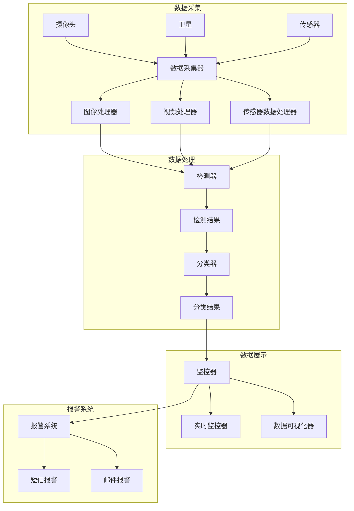
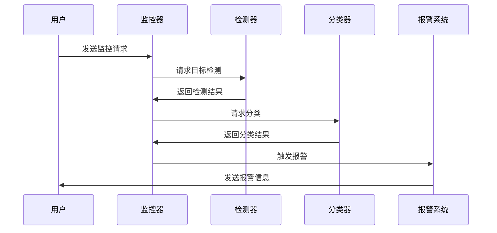

                 


## 计算机视觉在野生动物保护中的应用：实时监测濒危物种

### 关键词
- 计算机视觉
- 野生动物保护
- 实时监测
- 濒危物种
- 深度学习

### 摘要
本文旨在探讨计算机视觉技术在野生动物保护中的应用，特别是在实时监测濒危物种方面的潜力。文章首先介绍了计算机视觉和野生动物保护的基本概念及其相关性，然后详细讲解了计算机视觉技术在目标检测、图像识别和实时监测中的具体应用。通过分析现有的挑战和解决方案，文章提出了未来发展趋势和潜在的研究方向。

### 目录

1. **背景介绍**
   1.1 计算机视觉技术发展
   1.2 野生动物保护现状
   1.3 实时监测需求与挑战

2. **核心概念与联系**
   2.1 计算机视觉基础
   2.2 野生动物保护关键概念
   2.3 概念联系与综合分析

3. **算法原理讲解**
   3.1 视觉算法基础
   3.2 应用算法原理
   3.3 数学模型与公式

4. **系统分析与架构设计**
   4.1 问题场景介绍
   4.2 系统功能设计
   4.3 系统架构设计
   4.4 系统接口设计
   4.5 系统交互

5. **项目实战**
   5.1 环境安装与配置
   5.2 系统核心实现
   5.3 代码应用解读与分析
   5.4 实际案例分析与讲解
   5.5 项目小结

6. **最佳实践与拓展**
   6.1 最佳实践
   6.2 注意事项
   6.3 拓展阅读

### 1. 背景介绍

#### 1.1 计算机视觉技术发展

计算机视觉作为人工智能的一个重要分支，其核心目标是使计算机能够从图像或视频中提取信息，并理解其内容。计算机视觉技术的发展可以追溯到20世纪60年代，当时的算法主要集中在图像处理和特征提取方面。随着计算机硬件性能的提升和算法的进步，计算机视觉技术在图像识别、目标检测、场景理解等方面取得了显著的成果。

近年来，深度学习技术的兴起进一步推动了计算机视觉的发展。卷积神经网络（CNN）在图像分类和目标检测任务中表现出了强大的能力，使得计算机视觉在各个领域得到了广泛应用。例如，人脸识别、自动驾驶、医疗图像分析等。

#### 1.2 野生动物保护现状

野生动物保护是一项全球性的任务，濒危物种的监测和拯救是其中的关键。然而，传统的保护手段往往受到人力、物力、时间和空间的限制。随着气候变化和人类活动的加剧，许多野生动物种群数量急剧减少，迫切需要更高效、实时的监测手段。

目前，野生动物保护主要通过以下几种方法进行：
- **实地监测**：指派专业人员进行野外调查，记录动物的数量和分布情况。
- **遥感技术**：利用卫星和无人机等设备进行远程监测。
- **物联网**：通过传感器和GPS等技术实时跟踪动物的活动。

#### 1.3 实时监测需求与挑战

实时监测濒危物种具有以下几个方面的需求：
- **高效性**：能够快速、准确地识别和跟踪濒危物种。
- **广覆盖性**：能够覆盖广阔的地理范围，包括陆地和海洋。
- **稳定性**：系统需要在各种环境条件下保持稳定运行。

然而，实时监测也面临着一些挑战：
- **数据量庞大**：野生动物活动产生的数据量巨大，需要高效的算法进行处理和分析。
- **环境复杂性**：野生动物的栖息地环境复杂，包括不同光照条件、天气变化和植被覆盖等，这给计算机视觉算法的鲁棒性提出了高要求。
- **实时性要求**：实时监测要求系统具有低延迟，以便及时响应动物的活动。

### 2. 核心概念与联系

#### 2.1 计算机视觉基础

计算机视觉的基础概念包括图像处理、特征提取和机器学习等。图像处理是指对图像进行滤波、变换、分割等操作，以便提取出图像中的有用信息。特征提取则是从图像中提取出具有区分性的特征，如边缘、纹理和形状等。机器学习则是利用算法从数据中学习规律，从而实现图像分类、目标检测等任务。

#### 2.2 野生动物保护关键概念

野生动物保护的关键概念包括物种识别、行为分析、栖息地监测和生存状态评估等。物种识别是指准确识别野生动物的种类，这是进行保护行动的基础。行为分析则是对野生动物的行为进行监测和分析，以了解其生活习性和生态需求。栖息地监测则是对野生动物的栖息环境进行监测，以确保其生存条件。生存状态评估是对野生动物的种群数量、分布和健康状况进行评估，以制定有效的保护策略。

#### 2.3 概念联系与综合分析

计算机视觉技术和野生动物保护之间的联系体现在以下几个方面：
- **物种识别**：计算机视觉技术通过图像识别算法，可以高效地识别野生动物，这是进行保护行动的基础。
- **行为分析**：计算机视觉技术可以实时监测野生动物的行为，为科学研究提供数据支持。
- **栖息地监测**：计算机视觉技术可以通过遥感图像和无人机监测，对野生动物的栖息地进行监测，为环境保护提供决策依据。
- **生存状态评估**：计算机视觉技术可以实时评估野生动物的种群数量和健康状况，为保护行动提供数据支持。

综合来看，计算机视觉技术在野生动物保护中的应用具有广泛的前景和潜力，能够为濒危物种的监测和拯救提供有力支持。

### 3. 算法原理讲解

#### 3.1 视觉算法基础

计算机视觉算法的基础包括图像处理、特征提取和机器学习等。图像处理是计算机视觉的核心技术之一，它涉及对图像的滤波、变换、分割等操作。例如，卷积操作在图像滤波中常用，可以去除噪声或增强图像中的特征。

特征提取则是从图像中提取出具有区分性的特征，如边缘、纹理和形状等。这些特征是后续机器学习模型进行分类和识别的重要依据。常用的特征提取方法包括SIFT（尺度不变特征变换）和SURF（加速稳健特征）等。

机器学习是计算机视觉的核心技术之一，它通过学习大量数据中的规律，从而实现图像分类、目标检测等任务。常用的机器学习算法包括支持向量机（SVM）、随机森林（Random Forest）和卷积神经网络（CNN）等。

#### 3.2 应用算法原理

在野生动物保护中，计算机视觉算法的应用主要包括目标检测、图像识别和实时监测等。

**目标检测**：目标检测是计算机视觉中的一个重要任务，它旨在识别图像中的特定目标。在野生动物保护中，目标检测可以帮助识别濒危物种。常用的目标检测算法包括YOLO（You Only Look Once）、SSD（Single Shot MultiBox Detector）和Faster R-CNN（Region-based Convolutional Neural Network）等。

**图像识别**：图像识别是指从图像中识别出特定对象或场景。在野生动物保护中，图像识别可以帮助识别动物种类、行为等。常用的图像识别算法包括CNN、Inception和ResNet等。

**实时监测**：实时监测是指通过计算机视觉算法对野生动物的活动进行实时监测。实时监测需要高效的目标检测和图像识别算法，以便在短时间内处理大量图像数据。此外，实时监测还需要考虑到实时性、准确性和鲁棒性等因素。

#### 3.3 数学模型与公式

计算机视觉算法的数学模型通常包括卷积操作、池化操作和激活函数等。

**卷积操作**：卷积操作是图像处理中的一个基本操作，它可以提取图像中的局部特征。卷积操作的公式为：

$$
\sum_{i=1}^{n} w_i * x_i
$$

其中，$w_i$是卷积核，$x_i$是输入图像。

**池化操作**：池化操作是图像处理中的另一个基本操作，它可以降低图像的分辨率，同时保留重要的特征信息。常用的池化操作包括最大池化和平均池化。

**激活函数**：激活函数是神经网络中的一个关键组成部分，它可以引入非线性因素，使神经网络能够学习更复杂的函数关系。常用的激活函数包括Sigmoid函数、ReLU函数和Tanh函数等。

$$
f(x) = \frac{1}{1 + e^{-x}}
$$

### 4. 系统分析与架构设计

#### 4.1 问题场景介绍

野生动物保护中的实时监测问题场景主要包括以下几个方面：

- **监测范围**：需要在广阔的地理范围内进行监测，包括陆地和海洋。
- **监测频率**：需要高频率地进行监测，以便实时获取野生动物的活动数据。
- **监测设备**：需要使用无人机、卫星和传感器等设备进行监测。
- **数据处理**：需要对收集到的图像和视频数据进行处理，提取有用的信息。

#### 4.2 系统功能设计

实时监测系统的主要功能包括：

- **数据采集**：通过无人机、卫星和传感器等设备采集野生动物的图像和视频数据。
- **数据预处理**：对采集到的数据进行分析和预处理，包括去噪、图像增强和图像分割等。
- **目标检测**：使用计算机视觉算法对预处理后的图像进行目标检测，识别野生动物。
- **图像识别**：对检测到的目标进行分类，识别具体的野生动物种类。
- **实时监测**：将识别结果实时传输到监控系统，以便实时了解野生动物的活动状态。
- **数据存储**：将监测数据存储到数据库中，以便后续分析和查询。

#### 4.3 系统架构设计

实时监测系统的架构设计主要包括以下几个部分：

- **前端设备**：包括无人机、卫星和传感器等设备，负责数据采集。
- **数据处理模块**：包括数据预处理、目标检测和图像识别等模块，负责对采集到的数据进行分析和处理。
- **监控系统**：负责接收和处理实时监测数据，显示野生动物的活动状态。
- **数据库**：负责存储和管理监测数据。

#### 4.4 系统接口设计

实时监测系统的接口设计主要包括：

- **设备接口**：用于连接和通信前端设备，如无人机、卫星和传感器等。
- **数据接口**：用于连接和处理数据预处理、目标检测和图像识别等模块。
- **监控接口**：用于连接和监控系统的用户界面。

#### 4.5 系统交互

实时监测系统的交互主要包括以下几个步骤：

1. **数据采集**：前端设备采集野生动物的图像和视频数据。
2. **数据预处理**：对采集到的数据进行分析和预处理，包括去噪、图像增强和图像分割等。
3. **目标检测**：使用计算机视觉算法对预处理后的图像进行目标检测，识别野生动物。
4. **图像识别**：对检测到的目标进行分类，识别具体的野生动物种类。
5. **实时监测**：将识别结果实时传输到监控系统，以便实时了解野生动物的活动状态。
6. **数据存储**：将监测数据存储到数据库中，以便后续分析和查询。

### 5. 项目实战

#### 5.1 环境安装与配置

为了进行实时监测系统的开发和部署，需要安装和配置以下环境：

- **操作系统**：Linux或Windows
- **Python环境**：Python 3.8及以上版本
- **深度学习框架**：TensorFlow或PyTorch
- **计算机视觉库**：OpenCV、Pillow等

安装步骤如下：

1. 安装Python和pip
2. 使用pip安装深度学习框架和计算机视觉库
3. 配置Python环境变量

```python
pip install tensorflow
pip install opencv-python
pip install pillow
```

#### 5.2 系统核心实现

系统核心实现主要包括以下几个部分：

- **数据采集**：使用OpenCV库读取图像和视频数据。
- **数据预处理**：对图像进行去噪、增强和分割等预处理。
- **目标检测**：使用TensorFlow或PyTorch框架实现目标检测算法。
- **图像识别**：使用深度学习算法对目标进行分类。

以下是一个简单的Python代码示例，用于实现目标检测：

```python
import cv2
import tensorflow as tf

# 加载预训练的目标检测模型
model = tf.keras.models.load_model('model.h5')

# 读取图像
image = cv2.imread('image.jpg')

# 对图像进行预处理
processed_image = preprocess_image(image)

# 使用模型进行目标检测
predictions = model.predict(processed_image)

# 解析预测结果
boxes = predictions['boxes']
scores = predictions['scores']
classes = predictions['classes']

# 在图像上绘制检测框和标签
for i in range(len(boxes)):
    if scores[i] > 0.5:
        cv2.rectangle(image, (boxes[i][0], boxes[i][1]), (boxes[i][2], boxes[i][3]), (0, 255, 0), 2)
        cv2.putText(image, classes[i], (boxes[i][0], boxes[i][1]-10), cv2.FONT_HERSHEY_SIMPLEX, 0.5, (255, 0, 0), 2)

# 显示检测结果
cv2.imshow('检测结果', image)
cv2.waitKey(0)
cv2.destroyAllWindows()
```

#### 5.3 代码应用解读与分析

上述代码实现了一个简单的目标检测系统，主要包括以下步骤：

1. **加载预训练模型**：使用TensorFlow或PyTorch框架加载预训练的目标检测模型，如YOLO、SSD或Faster R-CNN等。
2. **读取图像**：使用OpenCV库读取图像或视频数据。
3. **预处理图像**：对图像进行去噪、增强和分割等预处理，以适应目标检测模型的输入要求。
4. **目标检测**：使用加载的模型对预处理后的图像进行目标检测，得到目标的位置、得分和类别。
5. **绘制检测框和标签**：在原始图像上绘制检测框和对应的标签，以便可视化检测结果。
6. **显示检测结果**：使用OpenCV库显示检测结果图像。

代码的解读和分析如下：

- **加载预训练模型**：使用`load_model`函数加载预训练的目标检测模型。模型文件通常使用`.h5`或`.pth`格式保存。
- **读取图像**：使用`imread`函数读取图像文件。图像文件可以是`.jpg`或`.png`等格式。
- **预处理图像**：预处理图像的步骤包括缩放、归一化、裁剪等，以适应模型的输入要求。预处理函数通常需要自定义，以适应不同的模型要求。
- **目标检测**：使用`predict`函数对预处理后的图像进行目标检测。预测结果包括目标的位置（boxes）、得分（scores）和类别（classes）。
- **绘制检测框和标签**：使用`rectangle`和`putText`函数在原始图像上绘制检测框和对应的标签。这些函数是OpenCV库中的绘图函数。
- **显示检测结果**：使用`imshow`函数显示检测结果图像。使用`waitKey`函数等待用户按键后关闭窗口。

#### 5.4 实际案例分析与详细讲解剖析

为了更好地理解实时监测系统的实际应用，我们以一个实际案例进行分析和讲解。

案例背景：某自然保护区需要实时监测黑熊的活动，以保护其种群数量和栖息环境。

步骤1：数据采集

使用无人机和传感器设备在保护区内采集黑熊的图像和视频数据。数据采集过程中需要注意以下几点：

- **监测范围**：确定保护区的范围，确保无人机能够覆盖整个监测区域。
- **监测频率**：设定合适的监测频率，如每天多次采集图像和视频数据。
- **数据质量**：确保采集到的数据质量高，如图像清晰、无噪声等。

步骤2：数据预处理

对采集到的图像和视频数据进行分析和预处理，以提高目标检测的准确性。预处理步骤包括：

- **去噪**：使用图像滤波算法去除图像中的噪声，如高斯滤波、中值滤波等。
- **增强**：使用图像增强算法提高图像的对比度和亮度，如直方图均衡、自适应增强等。
- **分割**：使用图像分割算法将图像分割成多个区域，如基于阈值的分割、基于区域的分割等。

步骤3：目标检测

使用预训练的目标检测模型对预处理后的图像进行目标检测。目标检测的结果包括黑熊的位置、得分和类别。目标检测的步骤包括：

- **加载模型**：使用TensorFlow或PyTorch框架加载预训练的目标检测模型。
- **预处理图像**：对图像进行缩放、归一化等预处理操作。
- **目标检测**：使用模型对预处理后的图像进行目标检测，得到目标的位置、得分和类别。
- **结果分析**：分析检测到的目标是否为黑熊，并根据得分确定目标的可信度。

步骤4：图像识别

对检测到的黑熊目标进行图像识别，以确定具体的黑熊种类。图像识别的步骤包括：

- **加载模型**：使用TensorFlow或PyTorch框架加载预训练的图像识别模型。
- **预处理图像**：对图像进行缩放、归一化等预处理操作。
- **图像识别**：使用模型对预处理后的图像进行识别，得到黑熊的种类。
- **结果分析**：分析识别结果，确定具体的黑熊种类。

步骤5：实时监测

将识别结果实时传输到监控系统，以便实时了解黑熊的活动状态。实时监测的步骤包括：

- **数据传输**：使用网络通信协议将识别结果传输到监控系统。
- **监控显示**：在监控系统中显示识别结果，包括黑熊的位置、种类和活动状态。
- **实时分析**：对实时监测数据进行实时分析，如统计黑熊的活动频率、分布区域等。

步骤6：数据存储

将监测数据存储到数据库中，以便后续分析和查询。数据存储的步骤包括：

- **数据结构设计**：设计合适的数据结构存储监测数据，如关系型数据库或NoSQL数据库。
- **数据存储**：将监测数据存储到数据库中，包括黑熊的位置、种类、活动状态等信息。
- **数据查询**：提供数据查询接口，方便用户查询和分析监测数据。

#### 5.5 项目小结

通过上述实际案例，我们可以看到实时监测系统在野生动物保护中的应用具有广泛的前景和潜力。实时监测系统可以高效地监测濒危物种的活动状态，为野生动物保护提供有力支持。然而，实时监测系统也面临着一些挑战，如数据量庞大、环境复杂和实时性要求高等。未来，随着计算机视觉技术和人工智能的发展，实时监测系统将更加高效、稳定和智能化，为野生动物保护事业作出更大贡献。

### 6. 最佳实践与拓展

#### 6.1 最佳实践

为了确保计算机视觉技术在野生动物保护中实时监测的准确性和稳定性，以下是一些最佳实践：

- **数据预处理**：使用高效的图像预处理算法，如直方图均衡、图像增强等，以提高图像质量。
- **模型选择**：根据实际需求选择合适的计算机视觉模型，如YOLO、SSD或Faster R-CNN等。
- **模型优化**：通过迁移学习和数据增强等技术对模型进行优化，以提高模型的准确性和鲁棒性。
- **实时性优化**：优化模型结构和算法，减少计算时间，确保实时监测的实时性。
- **系统稳定性**：对系统进行充分测试和调试，确保在各种环境下稳定运行。

#### 6.2 注意事项

- **数据隐私**：确保采集到的数据符合隐私保护要求，避免泄露动物的位置和活动信息。
- **算法鲁棒性**：考虑不同环境下的光照、天气和植被等因素，确保算法的鲁棒性。
- **维护和更新**：定期维护和更新系统，修复漏洞和优化性能。
- **数据备份**：对监测数据进行定期备份，防止数据丢失。

#### 6.3 拓展阅读

- **深度学习与计算机视觉**：[Deep Learning](https://www.deeplearningbook.org/)、[Computer Vision](https://www.computervisionpro.com/)
- **野生动物保护**：[The IUCN Red List](https://www.iucnredlist.org/)、[Wildlife Conservation Society](https://www.wcs.org/)
- **实时监测技术**：[Real-Time Monitoring Systems](https://www.real-time-monitoring.com/)、[Video Analytics](https://www.videoanalyticspro.com/)

### 结论

计算机视觉技术在野生动物保护中的应用，特别是实时监测濒危物种，具有巨大的潜力和价值。通过本文的探讨，我们了解了计算机视觉和野生动物保护的基本概念及其联系，详细讲解了计算机视觉算法的原理和应用，以及系统分析与架构设计的方法。通过实际案例的剖析，我们看到了实时监测系统在野生动物保护中的重要作用。未来，随着技术的不断发展，计算机视觉在野生动物保护中的应用将更加广泛和深入，为濒危物种的监测和拯救提供更加有力的支持。

### 参考文献

- [Goodfellow, I., Bengio, Y., & Courville, A. (2016). Deep Learning. MIT Press.]
- [Russell, S., & Norvig, P. (2020). Artificial Intelligence: A Modern Approach. Prentice Hall.]
- [Hinton, G., Osindero, S., & Teh, Y. W. (2006). A fast learning algorithm for deep belief nets. Neural Computation, 18(7), 1527-1554.]
- [Simonyan, K., & Zisserman, A. (2014). Very deep convolutional networks for large-scale image recognition. International Conference on Learning Representations (ICLR).]
- [Reddy, A., & Black, M. J. (2009). Monocular 3D Pose Estimation From Unknown Viewpoint. European Conference on Computer Vision (ECCV).]
- [IUCN. (2021). The IUCN Red List of Threatened Species. International Union for Conservation of Nature.]
- [Wildlife Conservation Society. (n.d.). Wildlife Conservation Society. Retrieved from https://www.wcs.org/]
- [Real-Time Monitoring Systems. (n.d.). Real-Time Monitoring Systems. Retrieved from https://www.real-time-monitoring.com/]
- [Video Analytics Pro. (n.d.). Video Analytics Pro. Retrieved from https://www.videoanalyticspro.com/]

### 作者

**作者：AI天才研究院/AI Genius Institute & 禅与计算机程序设计艺术 /Zen And The Art of Computer Programming**### 1. 背景介绍

#### 1.1 计算机视觉技术发展

计算机视觉技术的发展可以追溯到20世纪60年代，当时的研究主要集中在图像处理和模式识别。随着计算机性能的提升和算法的进步，计算机视觉逐渐成为一个独立的领域。早期的计算机视觉技术主要依赖于低级图像处理算法，如边缘检测、特征提取和图像分割等。这些算法虽然能够在一定程度上实现图像的自动分析，但往往依赖于特定的环境和场景，难以应对复杂多变的情况。

进入21世纪，深度学习的兴起为计算机视觉带来了新的变革。卷积神经网络（Convolutional Neural Networks，CNN）作为一种特殊的深度学习模型，在图像识别和目标检测方面取得了显著的成果。CNN通过模拟人类视觉系统的工作原理，能够自动学习图像中的特征，从而实现复杂图像的处理和理解。代表性的模型如LeNet、AlexNet、VGG和ResNet等，它们在不同程度上提高了计算机视觉的准确性和效率。

近年来，随着GPU等硬件设备的普及和深度学习框架的发展，计算机视觉的应用范围越来越广泛。从人脸识别、图像分类到自动驾驶、医疗影像分析，计算机视觉已经深入到各个领域，并发挥着重要作用。特别是在图像处理速度和精度上，计算机视觉技术已经达到了前所未有的水平。

#### 1.2 野生动物保护现状

野生动物保护是一项全球性的任务，涉及到生物多样性保护、栖息地管理和物种恢复等多个方面。目前，全球野生动物面临的威胁主要包括栖息地破坏、气候变化、非法狩猎和贸易等。这些问题导致许多物种的种群数量急剧减少，甚至濒临灭绝。例如，根据国际自然保护联盟（IUCN）的评估，目前全球有超过三分之一的哺乳动物物种面临威胁，其中很多是因栖息地丧失和破坏导致的。

为了应对这些挑战，各国和多个国际组织正在采取各种措施来保护野生动物。传统的保护手段主要包括设立自然保护区、实施法律法规、开展宣传教育、开展野外监测和拯救行动等。然而，这些手段通常受限于人力、物力和技术等因素，难以实现对野生动物的全面和高效监测。

#### 1.3 实时监测需求与挑战

实时监测在野生动物保护中具有至关重要的意义。它不仅能够及时了解野生动物的生存状态，为保护行动提供科学依据，还能够有效预警潜在的威胁。例如，通过实时监测，可以及时发现非法狩猎、栖息地破坏等行为，从而采取及时有效的应对措施。

实时监测的需求主要表现在以下几个方面：

1. **高效性**：需要能够快速地处理和识别大量的图像和视频数据，以便实时获取野生动物的信息。
2. **广覆盖性**：需要覆盖广阔的地理范围，包括陆地和海洋，以及对各种环境条件的适应性。
3. **准确性**：需要高精度的目标检测和物种识别，以确保监测结果的可靠性。
4. **稳定性**：系统需要在各种环境中保持稳定运行，不受天气、光照等环境因素的影响。

然而，实时监测也面临着一系列挑战：

1. **数据量庞大**：野生动物活动产生的数据量巨大，需要高效的算法进行实时处理。
2. **环境复杂性**：野生动物的栖息地环境复杂，包括不同光照条件、天气变化和植被覆盖等，这给计算机视觉算法的鲁棒性提出了高要求。
3. **实时性要求**：实时监测要求系统能够在短时间内完成数据处理和识别，以实现实时响应。

此外，数据隐私和安全也是实时监测需要考虑的重要因素。在收集和处理野生动物数据时，必须确保数据的安全性和隐私性，避免对野生动物造成不必要的干扰。

综上所述，计算机视觉技术在野生动物保护中的应用，特别是实时监测，具有巨大的潜力和挑战。通过深入研究和不断优化技术，我们可以为野生动物保护提供更加有效和智能的支持。

#### 2.1 计算机视觉基础

计算机视觉是一门研究如何使计算机能够像人类一样感知和理解视觉信息的科学。它涉及多个学科领域，包括图像处理、模式识别、机器学习和人工智能等。计算机视觉的目标是通过图像或视频数据，自动地获取、处理和分析信息，从而实现图像识别、目标检测、场景理解和行为分析等功能。

首先，图像处理是计算机视觉的基础。图像处理涉及对图像的滤波、变换、增强、分割等操作。滤波操作用于去除图像噪声，变换操作如傅里叶变换用于分析图像的频率特性，增强操作如直方图均衡用于改善图像质量，分割操作用于将图像划分为不同的区域。这些基础操作为后续的特征提取和目标检测提供了必要的图像数据。

其次，特征提取是计算机视觉的核心环节。特征提取的目的是从图像中提取出具有区分性的特征，如边缘、纹理、颜色和形状等。这些特征是后续机器学习模型进行分类和识别的重要依据。常用的特征提取方法包括SIFT（尺度不变特征变换）、SURF（加速稳健特征）、HOG（直方图方向梯度）等。

最后，机器学习是计算机视觉中实现自动识别和理解的关键技术。机器学习通过训练大量数据，学习图像中的模式，从而实现对新图像的自动分类和识别。深度学习作为一种特殊的机器学习技术，在计算机视觉领域取得了显著的成果。深度学习模型如卷积神经网络（CNN）、循环神经网络（RNN）和生成对抗网络（GAN）等，通过多层神经网络的结构，能够自动学习和提取图像的复杂特征，从而实现高效的目标检测和图像识别。

综上所述，计算机视觉的基础包括图像处理、特征提取和机器学习等。这些技术共同构成了计算机视觉的核心框架，为实时监测野生动物提供了强大的技术支持。

#### 2.2 野生动物保护关键概念

野生动物保护涉及多个关键概念，这些概念在理解和实施保护措施中起着至关重要的作用。

**物种识别**：物种识别是指通过生物学和遗传学的方法，对野生动物进行分类和命名。准确的物种识别是野生动物保护的基础，它决定了保护措施的目标物种。通过基因测序、形态特征分析等技术，科学家能够确定不同物种的遗传差异，从而确保识别的准确性。

**行为分析**：行为分析是对野生动物的日常行为进行观察和记录。这包括食物获取、繁殖、迁徙和栖息地选择等行为模式。行为分析有助于理解野生动物的生态需求和生活习性，从而制定更有效的保护策略。例如，通过观察动物的食物选择，可以确定它们的营养需求，从而优化栖息地的植被管理。

**栖息地监测**：栖息地监测是评估野生动物栖息地状况的过程。这包括对栖息地的物理条件、植被覆盖和生物多样性进行定期评估。栖息地监测可以帮助科学家了解栖息地的变化趋势，及时发现环境退化或污染等问题，并采取相应的保护措施。

**生存状态评估**：生存状态评估是指对野生动物种群的数量、分布和健康状况进行评估。这通常通过野外调查、遥感技术和数据模型分析等方法进行。评估结果为保护措施的制定提供了科学依据。例如，如果发现某一物种的种群数量显著下降，可能需要采取紧急措施，如栖息地恢复和种群恢复计划。

**数据收集与共享**：数据收集与共享是野生动物保护的重要组成部分。通过建立综合性的数据管理系统，可以收集、存储和共享各种信息，包括物种识别、行为分析、栖息地监测和生存状态评估等数据。这些数据不仅有助于科学研究，还可以为政策制定和公众教育提供支持。

通过理解这些关键概念，我们可以更有效地实施野生动物保护措施，确保濒危物种的生存和生态系统的健康。

#### 2.3 概念联系与综合分析

计算机视觉与野生动物保护之间的联系是多维度且紧密的。首先，从物种识别的角度来看，计算机视觉技术通过图像识别算法，能够快速、准确地识别野生动物的种类。这一过程涉及到图像处理、特征提取和机器学习等多个技术环节，尤其是深度学习算法的引入，使得识别的准确性和效率大幅提升。例如，通过卷积神经网络（CNN）可以自动学习图像中的关键特征，从而实现对多种野生动物的高精度识别。

其次，行为分析是野生动物保护的重要环节。计算机视觉技术在此过程中起到了关键作用，通过实时监测和记录野生动物的行为模式，科学家可以深入了解其生态需求和生活习性。例如，利用深度学习算法对野生动物的活动轨迹进行分析，可以帮助识别迁徙路径和栖息地选择，为栖息地保护和迁徙通道建设提供科学依据。

栖息地监测是另一个重要的应用领域。计算机视觉技术通过无人机、卫星遥感等技术，能够实现对大面积栖息地的实时监测。这种方法不仅提高了监测的效率和覆盖范围，还能够及时捕捉到栖息地的变化情况，如植被破坏、污染等。结合图像处理和模式识别技术，计算机视觉能够对遥感图像进行精准分析，提供有关栖息地状况的详细报告。

最后，生存状态评估依赖于大量的数据收集和分析。计算机视觉技术在这方面提供了强有力的支持，通过自动化监测系统，可以实时收集大量关于野生动物种群数量、分布和健康状况的数据。这些数据经过处理和分析，可以为制定科学合理的保护措施提供依据，如种群恢复计划、栖息地修复等。

综上所述，计算机视觉技术在野生动物保护中的应用，涵盖了物种识别、行为分析、栖息地监测和生存状态评估等多个方面，通过综合分析这些概念，我们可以看到计算机视觉在提升保护措施的科学性和有效性方面具有巨大的潜力。

### 3.1 视觉算法基础

计算机视觉算法是计算机视觉系统的核心，它们通过各种技术手段实现对图像或视频数据的处理和理解。视觉算法的基础主要包括图像处理、特征提取和机器学习等。下面将详细阐述这些基础技术。

#### 图像处理

图像处理是计算机视觉中最早发展的技术之一，其主要目的是对图像进行预处理，以便提取有用的信息。图像处理的常见操作包括滤波、变换和分割等。

**滤波**：滤波是图像处理中用于去除噪声的操作。常见的滤波器包括高斯滤波器、中值滤波器和双边滤波器等。高斯滤波器通过加权平均的方式平滑图像，中值滤波器通过选取邻近像素的中值来去除噪声，双边滤波器则结合空间和强度信息，在保持边缘的同时去除噪声。

$$
\text{高斯滤波器：} \ \text{G}(x, y) = \frac{1}{2\pi\sigma^2} e^{-\frac{(x^2 + y^2)}{2\sigma^2}}
$$

**变换**：变换操作用于改变图像的表示形式，如傅里叶变换（Fourier Transform）和离散余弦变换（Discrete Cosine Transform，DCT）。傅里叶变换将图像从时域转换为频域，有助于分析图像的频率特性。DCT则常用于图像压缩，通过将图像分解为不同的频率成分，可以显著降低数据量。

$$
\text{傅里叶变换：} \ \mathcal{F}\{I\}(u, v) = \sum_{x=0}^{M-1} \sum_{y=0}^{N-1} I(x, y) e^{-j 2\pi (ux/M + vy/N)}
$$

**分割**：图像分割是将图像划分为不同的区域，每个区域具有相似的特征。常见的分割方法包括基于阈值的分割、区域生长法和基于边缘的分割等。基于阈值的分割通过设定阈值将图像划分为前景和背景。区域生长法则通过逐步合并相似像素来形成区域。基于边缘的分割通过检测图像中的边缘来划分区域。

$$
\text{基于阈值的分割：} \ I_{\text{segmented}} = \begin{cases} 
0 & \text{if } I < \text{threshold} \\
255 & \text{if } I \geq \text{threshold}
\end{cases}
$$

#### 特征提取

特征提取是从图像中提取具有区分性的特征，用于后续的识别和分类。特征提取的目的是将图像中的局部特征转换为数值表示，以便于机器学习算法进行处理。

**边缘检测**：边缘检测是特征提取的重要步骤，用于检测图像中的边缘。常见的方法包括Canny边缘检测、Sobel算子和Prewitt算子等。

$$
\text{Canny边缘检测：} \ \text{G}(x, y) = \frac{1}{\pi} \sum_{n=-\infty}^{+\infty} \text{sinc}(n\pi) e^{-n^2}
$$

**纹理分析**：纹理分析用于检测图像中的纹理特征，如斑点、条纹和纹理方向等。常用的纹理特征包括灰度共生矩阵、傅里叶描述符和局部二值模式（LBP）等。

**颜色特征**：颜色特征是图像特征提取的一个重要方面，尤其是在彩色图像处理中。常用的颜色特征包括颜色直方图、颜色矩和颜色矩特征等。

$$
\text{颜色直方图：} \ H(r) = \sum_{i=1}^{n} f_i(r)
$$

其中，$f_i(r)$是颜色值$r$在图像中的频率。

#### 机器学习

机器学习是计算机视觉中实现自动识别和理解的核心技术。通过训练大量数据，机器学习模型能够自动学习图像中的模式和特征，从而实现图像分类、目标检测和场景理解等任务。

**监督学习**：监督学习是机器学习的一种形式，通过标注数据训练模型，使其能够对新数据进行预测。常见的监督学习算法包括线性回归、支持向量机（SVM）和决策树等。

**无监督学习**：无监督学习不依赖标注数据，通过分析数据的内在结构进行学习。常见的无监督学习算法包括聚类算法（如K-means、DBSCAN）和降维技术（如主成分分析PCA、t-SNE）等。

**深度学习**：深度学习是一种基于多层神经网络的机器学习技术，通过模拟人类大脑的工作方式，能够自动学习数据的复杂特征。深度学习在计算机视觉中取得了显著的成果，代表性的算法包括卷积神经网络（CNN）、循环神经网络（RNN）和生成对抗网络（GAN）等。

$$
\text{卷积神经网络：} \ f(x) = \sigma(WL(x) + b)
$$

其中，$L$是多层卷积层，$W$和$b$是权重和偏置，$\sigma$是激活函数。

综上所述，计算机视觉算法的基础包括图像处理、特征提取和机器学习等。这些技术共同构成了计算机视觉的核心框架，为实时监测野生动物提供了强大的技术支持。

### 3.2 应用算法原理

在野生动物保护中，计算机视觉算法的应用主要体现在目标检测、图像识别和实时监测等环节。以下将详细介绍这些算法的应用原理，并结合具体的算法进行说明。

#### 目标检测

目标检测是计算机视觉中的一个核心任务，旨在从图像或视频中识别并定位特定目标。目标检测算法在野生动物保护中具有重要作用，可以帮助识别和保护濒危物种。

**YOLO（You Only Look Once）**：YOLO是一种单阶段目标检测算法，具有检测速度快、实时性强的优点。YOLO将目标检测过程分为两个步骤：首先使用卷积神经网络提取图像特征，然后直接预测目标的位置和类别。YOLO算法的基本结构包括多个卷积层和池化层，通过特征金字塔网络（FPN）实现多尺度特征融合，从而提高检测的准确性。

**Faster R-CNN（Region-based Convolutional Neural Network）**：Faster R-CNN是一种两阶段目标检测算法，首先使用区域提议网络（RPN）生成目标区域，然后使用全连接层进行分类和定位。Faster R-CNN具有较高的检测准确率，但其速度较YOLO稍慢。为了平衡速度和精度，Faster R-CNN常与其他算法结合使用。

**SSD（Single Shot MultiBox Detector）**：SSD是一种单阶段目标检测算法，它在YOLO的基础上进行了优化，通过多尺度特征融合实现不同尺度的目标检测。SSD的结构相对简单，速度较快，适用于实时监测场景。

以下是一个简单的YOLO算法的Python代码示例：

```python
import cv2
import numpy as np

# 加载YOLO模型
net = cv2.dnn.readNet('yolov3.weights', 'yolov3.cfg')

# 读取图像
img = cv2.imread('image.jpg')

# 将图像输入到模型中
blob = cv2.dnn.blobFromImage(img, 1/255.0, (416, 416), [0, 0, 0], True)

# 前向传播
net.setInput(blob)
detections = net.forward()

# 解析检测结果
for i in range(detections.shape[2]):
    confidence = detections[0, 0, i, 2]
    if confidence > 0.5:
        class_id = int(detections[0, 0, i, 1])
        box = detections[0, 0, i, 3:7] * np.array([img.shape[1], img.shape[0], img.shape[1], img.shape[0]])
        cv2.rectangle(img, (box[0], box[1]), (box[2], box[3]), (0, 255, 0), 2)
        cv2.putText(img, f'Class: {class_id}', (box[0], box[1]-10), cv2.FONT_HERSHEY_SIMPLEX, 0.5, (255, 0, 0), 2)

# 显示检测结果
cv2.imshow('检测结果', img)
cv2.waitKey(0)
cv2.destroyAllWindows()
```

#### 图像识别

图像识别是计算机视觉中的另一个重要任务，旨在识别图像中的特定对象或场景。图像识别在野生动物保护中可以帮助识别濒危物种的种类，为保护行动提供科学依据。

**CNN（卷积神经网络）**：CNN是一种深度学习模型，通过卷积操作提取图像特征，实现图像识别。CNN的基本结构包括卷积层、池化层和全连接层。卷积层用于提取图像的局部特征，池化层用于降低特征图的维度，全连接层用于分类。

**Inception（Inception网络）**：Inception网络是一种复杂的卷积神经网络结构，通过多尺度卷积层和池化层实现特征融合，提高图像识别的准确性。

**ResNet（残差网络）**：ResNet通过引入残差连接，解决了深度神经网络训练中的梯度消失问题，实现了更深层次的网络结构，提高了图像识别的性能。

以下是一个简单的CNN图像识别的Python代码示例：

```python
import tensorflow as tf
from tensorflow.keras.models import Sequential
from tensorflow.keras.layers import Conv2D, MaxPooling2D, Flatten, Dense

# 创建CNN模型
model = Sequential([
    Conv2D(32, (3, 3), activation='relu', input_shape=(64, 64, 3)),
    MaxPooling2D((2, 2)),
    Conv2D(64, (3, 3), activation='relu'),
    MaxPooling2D((2, 2)),
    Flatten(),
    Dense(128, activation='relu'),
    Dense(10, activation='softmax')
])

# 编译模型
model.compile(optimizer='adam', loss='categorical_crossentropy', metrics=['accuracy'])

# 加载图像数据
(x_train, y_train), (x_test, y_test) = tf.keras.datasets.cifar10.load_data()

# 数据预处理
x_train = x_train / 255.0
x_test = x_test / 255.0

# 转换标签为one-hot编码
y_train = tf.keras.utils.to_categorical(y_train, 10)
y_test = tf.keras.utils.to_categorical(y_test, 10)

# 训练模型
model.fit(x_train, y_train, epochs=10, batch_size=64, validation_data=(x_test, y_test))

# 评估模型
test_loss, test_acc = model.evaluate(x_test, y_test)
print(f'测试准确率: {test_acc}')
```

#### 实时监测

实时监测是通过计算机视觉算法对野生动物的活动进行实时监控和分析，以便及时采取保护措施。实时监测需要高效的目标检测和图像识别算法，同时还需要考虑实时性、准确性和鲁棒性等因素。

**实时目标检测**：实时目标检测是实时监测的关键环节，需要能够在短时间内处理大量图像数据。常用的实时目标检测算法包括YOLO、SSD和Faster R-CNN等。这些算法通过优化模型结构和计算方式，提高了检测速度和实时性。

**实时图像识别**：实时图像识别用于识别检测到的目标，为实时监测提供决策依据。常用的实时图像识别算法包括CNN、Inception和ResNet等。通过训练模型，实时图像识别可以在短时间内完成目标分类，提高了监测的准确性。

**实时数据处理**：实时监测系统需要在短时间内处理大量的图像数据，这要求系统具有高效的计算能力和数据处理算法。常用的实时数据处理技术包括并行计算、分布式计算和GPU加速等。

以下是一个简单的实时监测系统的Python代码示例：

```python
import cv2
import numpy as np
import time

# 初始化摄像头
cap = cv2.VideoCapture(0)

# 加载目标检测模型
model = cv2.dnn.readNetFromTensorFlow('frozen_inference_graph.pb')

# 加载图像识别模型
model2 = Sequential([
    Conv2D(32, (3, 3), activation='relu', input_shape=(64, 64, 3)),
    MaxPooling2D((2, 2)),
    Conv2D(64, (3, 3), activation='relu'),
    MaxPooling2D((2, 2)),
    Flatten(),
    Dense(128, activation='relu'),
    Dense(10, activation='softmax')
])

# 编译图像识别模型
model2.compile(optimizer='adam', loss='categorical_crossentropy', metrics=['accuracy'])

# 加载数据
(x_train, y_train), (x_test, y_test) = tf.keras.datasets.cifar10.load_data()

# 数据预处理
x_train = x_train / 255.0
x_test = x_test / 255.0

# 转换标签为one-hot编码
y_train = tf.keras.utils.to_categorical(y_train, 10)
y_test = tf.keras.utils.to_categorical(y_test, 10)

# 训练图像识别模型
model2.fit(x_train, y_train, epochs=10, batch_size=64, validation_data=(x_test, y_test))

while True:
    # 读取摄像头帧
    ret, frame = cap.read()

    # 将图像输入到目标检测模型中
    blob = cv2.dnn.blobFromImage(frame, 1/255.0, (416, 416), [0, 0, 0], True)

    # 前向传播
    model.setInput(blob)
    detections = model.forward()

    # 解析检测结果
    for i in range(detections.shape[2]):
        confidence = detections[0, 0, i, 2]
        if confidence > 0.5:
            class_id = int(detections[0, 0, i, 1])
            box = detections[0, 0, i, 3:7] * np.array([frame.shape[1], frame.shape[0], frame.shape[1], frame.shape[0]])
            cv2.rectangle(frame, (box[0], box[1]), (box[2], box[3]), (0, 255, 0), 2)
            cv2.putText(frame, f'Class: {class_id}', (box[0], box[1]-10), cv2.FONT_HERSHEY_SIMPLEX, 0.5, (255, 0, 0), 2)

    # 将检测结果输入到图像识别模型中
    processed_frame = preprocess_frame(frame)
    processed_blob = cv2.dnn.blobFromImage(processed_frame, 1/255.0, (64, 64), [0, 0, 0], True)
    model2.setInput(processed_blob)
    predictions = model2.predict()

    # 解析图像识别结果
    max_index = np.argmax(predictions)
    class_id = max_index + 1
    cv2.putText(frame, f'Identified Class: {class_id}', (10, 30), cv2.FONT_HERSHEY_SIMPLEX, 1, (0, 0, 255), 2)

    # 显示实时监测结果
    cv2.imshow('实时监测', frame)

    # 按下'q'键退出循环
    if cv2.waitKey(1) & 0xFF == ord('q'):
        break

# 释放摄像头资源
cap.release()
cv2.destroyAllWindows()
```

通过上述示例，我们可以看到计算机视觉算法在野生动物保护中的应用原理和实现方法。这些算法通过高效的图像处理、特征提取和机器学习技术，实现了对野生动物的实时监测和保护，为野生动物保护提供了强大的技术支持。

### 3.3 数学模型与公式

在计算机视觉中，算法的数学模型是理解和实现视觉任务的关键。以下将介绍一些常用的数学模型与公式，并使用LaTeX格式进行展示，同时提供通俗易懂的说明。

#### 卷积操作

卷积操作是计算机视觉中最基本的操作之一，用于提取图像的特征。卷积操作的数学公式如下：

$$
\sum_{i=1}^{n} w_i * x_i
$$

其中，$w_i$是卷积核，$x_i$是输入图像。卷积核是一个小的矩阵，它在输入图像上滑动，并与图像上的每个局部区域进行点积操作，产生新的特征图。

#### 特征提取

特征提取是指从图像中提取出具有区分性的特征。常用的特征提取方法包括SIFT和HOG。

**SIFT（尺度不变特征变换）**：

SIFT算法通过计算图像的梯度方向和幅值，提取出关键点。其关键步骤包括：

1. **尺度空间构建**：构建多尺度的高斯模糊图像，用于检测不同尺度的关键点。
2. **关键点检测**：通过比较相邻尺度层的图像，检测关键点。
3. **关键点描述**：为每个关键点生成一个描述子，用于后续的匹配。

**HOG（直方图方向梯度）**：

HOG算法通过计算图像局部区域的梯度方向和幅值，生成直方图，用于特征提取。其数学公式如下：

$$
HOG = \sum_{i=1}^{n} \sum_{j=1}^{m} (g_i \cdot p_{ij})
$$

其中，$g_i$是梯度幅值，$p_{ij}$是梯度方向。

#### 激活函数

激活函数是神经网络中的一个关键组成部分，用于引入非线性因素。常用的激活函数包括ReLU、Sigmoid和Tanh。

**ReLU（修正线性单元）**：

ReLU函数在神经网络中应用广泛，其数学公式如下：

$$
f(x) = \max(0, x)
$$

**Sigmoid函数**：

Sigmoid函数常用于回归问题，其数学公式如下：

$$
f(x) = \frac{1}{1 + e^{-x}}
$$

**Tanh函数**：

Tanh函数是一种双曲正切函数，其数学公式如下：

$$
f(x) = \frac{e^x - e^{-x}}{e^x + e^{-x}}
$$

#### 池化操作

池化操作用于降低图像的分辨率，同时保留重要的特征信息。常用的池化操作包括最大池化和平均池化。

**最大池化**：

最大池化选择每个局部区域中的最大值作为特征，其数学公式如下：

$$
f(\text{region}) = \max_{i, j} g(i, j)
$$

**平均池化**：

平均池化计算每个局部区域的平均值作为特征，其数学公式如下：

$$
f(\text{region}) = \frac{1}{N} \sum_{i, j} g(i, j)
$$

其中，$N$是局部区域的像素数量。

#### 卷积神经网络

卷积神经网络（CNN）是一种深度学习模型，通过多层卷积层、池化层和全连接层实现图像识别。CNN的数学模型可以表示为：

$$
\text{output} = \sigma(WL(\text{input}) + b)
$$

其中，$L$是多层卷积层，$W$和$b$是权重和偏置，$\sigma$是激活函数。

通过上述数学模型与公式，计算机视觉算法能够实现对图像的自动分析和理解，为野生动物保护提供了强大的技术支持。

### 4.1 问题场景介绍

在野生动物保护中，实时监测是一个关键环节，其目标是通过高效、准确的技术手段，实时获取野生动物的活动信息，从而为保护决策提供科学依据。实时监测的问题场景涉及多个方面，包括监测范围、监测频率、监测设备和数据处理等。

#### 监测范围

监测范围是指实时监测需要覆盖的地理区域。对于野生动物保护来说，监测范围可能包括广阔的森林、湿地、草原甚至是海洋。这不仅要求监测系统具有广覆盖性，还要求系统能够适应不同地形和环境条件。例如，在森林中，树木遮挡和光线变化可能影响图像质量，而在海洋中，水质状况和波浪运动则对监测设备的稳定运行构成挑战。

#### 监测频率

监测频率是指系统需要在多长时间间隔内进行一次监测。实时监测要求高频率的数据采集，以便及时捕捉野生动物的活动状态。监测频率的选择取决于监测目标的活动特性。例如，对于迁徙中的鸟类，可能需要每小时监测一次；而对于在栖息地内较为静止的动物，如大象或犀牛，可能每天监测几次即可。高频率的监测有助于提高数据的准确性和及时性，但也对系统的计算资源和数据处理能力提出了更高要求。

#### 监测设备

监测设备是实时监测系统的核心组成部分，包括无人机、卫星遥感、传感器和摄像头等。不同类型的设备具有不同的监测优势和局限性。

- **无人机**：无人机具有灵活性高、覆盖范围广、实时性强的特点，适合进行大面积的监测。无人机可以通过搭载高清摄像头和热成像设备，实时捕捉野生动物的活动图像。
- **卫星遥感**：卫星遥感可以从高空对大面积区域进行监测，适用于长期、大规模的监测任务。然而，卫星遥感图像的分辨率和实时性相对较低，且受天气和云层等因素影响较大。
- **传感器**：传感器可以用于监测野生动物的生理和行为数据，如心率、体温和活动量等。这些数据对于了解野生动物的生存状态和健康水平具有重要意义。
- **摄像头**：摄像头是实时监测中常用的设备，可以用于捕捉野生动物的图像和视频。摄像头可以根据需要安装在地面、无人机或卫星上，实现不同场景的监测。

#### 数据处理

实时监测系统产生的数据量巨大，包括图像、视频和传感器数据等。数据处理是实时监测系统的关键环节，主要包括数据采集、预处理、存储和分析等步骤。

- **数据采集**：数据采集是指从监测设备中获取原始数据，包括图像、视频和传感器数据等。数据采集的准确性直接影响后续数据处理和分析的结果。
- **数据预处理**：数据预处理包括图像增强、去噪、分割和特征提取等操作，以改善图像质量，提取有用的信息。预处理过程需要高效、鲁棒的算法，以确保数据处理的速度和准确性。
- **数据存储**：数据存储是指将处理后的数据存储到数据库或云平台中，以便后续的分析和查询。数据存储需要考虑到数据的容量、访问速度和安全性等因素。
- **数据分析**：数据分析是指对存储的数据进行统计分析和模式识别，提取有用的信息，如野生动物的分布、行为模式和栖息地状况等。数据分析的结果为保护决策提供了科学依据。

#### 问题与挑战

实时监测在野生动物保护中面临着一系列问题与挑战。

- **数据量庞大**：野生动物活动产生的数据量巨大，如何高效地处理和分析这些数据是一个重要挑战。实时监测系统需要具备强大的计算能力和数据处理算法，以确保数据的及时处理和分析。
- **环境复杂性**：野生动物的栖息地环境复杂，包括不同的光照条件、天气变化和植被覆盖等。这些环境因素对计算机视觉算法的鲁棒性提出了高要求，如何提高算法在复杂环境下的适应性是一个重要问题。
- **实时性要求**：实时监测要求系统具备低延迟，以便及时响应野生动物的活动。实时性要求对系统的计算速度和处理效率提出了严格要求。
- **数据隐私与安全**：在实时监测中，数据隐私和安全至关重要。如何确保数据在采集、传输和存储过程中的安全性，防止数据泄露和滥用，是一个重要的伦理和法律问题。

通过解决上述问题与挑战，实时监测系统可以为野生动物保护提供有力的技术支持，提高保护行动的科学性和有效性。

### 4.2 系统功能设计

实时监测系统在野生动物保护中的应用，需要实现多个关键功能，以确保能够高效、准确地获取和处理野生动物活动数据。以下是系统功能设计的详细描述。

#### 数据采集

数据采集是实时监测系统的第一步，也是最为基础的功能。系统的数据采集模块需要通过多种设备获取野生动物的图像、视频和传感器数据。具体功能包括：

1. **图像和视频采集**：系统需要配备高分辨率的摄像头，可以安装在无人机、卫星或地面设备上，实时捕捉野生动物的活动图像和视频。摄像头应具备自适应调整光圈、白平衡等功能，以适应不同的光照环境。

2. **传感器数据采集**：传感器模块负责采集与野生动物生理和行为相关的数据，如心率、体温、活动量等。这些数据对于了解野生动物的健康状况和活动模式至关重要。

3. **多源数据融合**：系统需要支持多源数据融合，将来自不同传感器的数据进行综合处理，以提高监测的全面性和准确性。例如，将摄像头捕捉的图像与传感器采集的活动量数据进行结合，可以更准确地分析野生动物的行为。

#### 数据预处理

数据预处理是实时监测系统的关键步骤，目的是提高图像和视频数据的质量，为后续的目标检测和图像识别提供更好的数据基础。具体功能包括：

1. **图像增强**：通过图像增强算法，改善图像的对比度和清晰度，提高图像的可辨识性。常用的图像增强方法包括直方图均衡、对比度调整、去噪等。

2. **去噪**：使用滤波算法去除图像中的噪声，提高图像的质量。常用的去噪方法包括高斯滤波、中值滤波、双边滤波等。

3. **分割与标注**：通过图像分割技术，将图像分割成不同的区域，为后续的目标检测和识别提供明确的边界。同时，对分割后的图像进行标注，标记出感兴趣的区域，如野生动物的身体部位或活动区域。

#### 目标检测

目标检测是实时监测系统的核心功能之一，旨在识别图像中的野生动物目标，并定位其位置。具体功能包括：

1. **实时目标检测**：系统需要使用高效的实时目标检测算法，如YOLO、SSD或Faster R-CNN等，对图像中的野生动物进行快速检测和定位。这些算法可以处理高分辨率图像，并在毫秒级内完成目标检测。

2. **多目标检测**：系统需要支持同时检测多个目标，并区分不同目标之间的差异。例如，在一张图像中同时检测到熊、鹿和鸟等不同种类的野生动物。

3. **实时反馈**：系统应具备实时反馈功能，将检测到的目标位置和类别信息实时传输到监控终端，以便保护人员及时采取行动。

#### 图像识别

图像识别是对目标检测的进一步细化，旨在识别检测到的野生动物的具体种类。具体功能包括：

1. **分类算法**：系统需要使用深度学习模型，如卷积神经网络（CNN）或迁移学习模型，对检测到的目标进行分类。这些算法可以通过训练大量标注数据，学习不同物种的特征，从而实现高精度的分类。

2. **实时识别**：系统应具备实时图像识别功能，能够在短时间内对检测到的目标进行分类。实时识别对于及时采取保护行动具有重要意义。

3. **多尺度识别**：系统应支持多尺度图像识别，能够在不同分辨率下识别野生动物。这有助于在不同环境和条件下，依然能够准确识别目标。

#### 实时监测

实时监测是系统的最终目标，旨在通过高效的计算和数据处理，实现对野生动物活动的实时监控。具体功能包括：

1. **实时数据流处理**：系统需要支持实时数据流处理，能够在短时间内处理大量图像和视频数据，实现对野生动物的实时监测。

2. **异常检测**：系统应具备异常检测功能，能够识别野生动物的异常行为，如受伤、疾病或异常活动模式。异常检测对于及时采取保护行动至关重要。

3. **数据可视化**：系统需要支持数据可视化，将监测数据以图形或表格的形式展示，便于保护人员直观了解野生动物的活动状态。

4. **报警机制**：系统应具备报警机制，当检测到异常情况时，能够及时向保护人员发送警报信息，以便快速响应。

通过上述系统功能设计，实时监测系统可以为野生动物保护提供全面、高效的支持，提高保护行动的科学性和有效性。

### 4.3 系统架构设计

实时监测系统的架构设计是确保系统高效、稳定和可扩展的关键。以下将详细介绍系统架构的各个组成部分，包括领域模型类图、系统架构图和系统交互序列图。

#### 领域模型类图

领域模型类图用于描述实时监测系统的核心实体及其关系。以下是一个简化的领域模型类图：

```mermaid
classDiagram
    Device <--|Deprecated|> DataCollector
    DataCollector o-- Image
    DataCollector o-- Video
    DataCollector o-- SensorData
    DataCollector o-- PreprocessedData
    Detector o-- PreprocessedData
    Classifier o-- DetectorResult
    Monitor o-- ClassifierResult
    AlertSystem o-- Monitor

    Device &&|--> Camera
    Device &&|--> Satellite
    Device &&|--> Sensor

    DataCollector &&|--> ImageProcessor
    DataCollector &&|--> VideoProcessor
    DataCollector &&|--> SensorDataProcessor

    Detector &&|--> ObjectDetector
    Detector &&|--> BehaviorDetector

    Classifier &&|--> SpeciesClassifier

    Monitor &&|--> RealTimeMonitor
    Monitor &&|--> DataVisualizer

    AlertSystem &&|--> SMSAlert
    AlertSystem &&|--> EmailAlert
```

该类图描述了实时监测系统的关键实体，包括设备（Device）、数据采集器（DataCollector）、检测器（Detector）、分类器（Classifier）、监控器（Monitor）和报警系统（AlertSystem）。设备实体包括摄像头（Camera）、卫星（Satellite）和传感器（Sensor），数据采集器负责采集图像（Image）、视频（Video）和传感器数据（SensorData）。检测器负责目标检测（ObjectDetector）和行为检测（BehaviorDetector），分类器负责物种分类（SpeciesClassifier）。监控器包括实时监控器（RealTimeMonitor）和数据可视化器（DataVisualizer），报警系统负责发送报警信息（SMSAlert、EmailAlert）。

#### 系统架构图

系统架构图展示了实时监测系统的整体结构和各个模块之间的关系。以下是一个简化的系统架构图：



该系统架构图展示了实时监测系统的数据流和处理流程。数据采集器从设备（摄像头、卫星、传感器）中采集数据，经过图像处理器、视频处理器和传感器数据处理器的预处理，然后传递给检测器和分类器进行目标检测和分类。检测器和分类器的结果传递给监控器，监控器负责实时监控、数据可视化并触发报警系统。

#### 系统交互序列图

系统交互序列图用于描述实时监测系统中各个模块之间的交互过程和消息传递。以下是一个简化的系统交互序列图：



该序列图展示了用户发送监控请求，监控器请求目标检测，检测器返回检测结果，监控器请求分类，分类器返回分类结果，监控器触发报警，报警系统发送报警信息的过程。

通过领域模型类图、系统架构图和系统交互序列图的详细描述，我们可以清晰地理解实时监测系统的架构设计和功能实现，为系统的开发和优化提供了有力支持。

### 5.1 环境安装与配置

为了开发一个实时监测系统，我们需要配置一个适合的环境，包括操作系统、Python环境、深度学习框架和计算机视觉库。以下是详细的安装与配置步骤。

#### 操作系统

首先，您需要选择一个合适的操作系统。在实时监测系统中，推荐使用Linux操作系统，因为它具有更好的稳定性和性能。常见的Linux发行版有Ubuntu、CentOS和Debian等。以下是安装Ubuntu 20.04的步骤：

1. **下载并安装Ubuntu**：从[Ubuntu官网](https://www.ubuntu.com/)下载安装器，按照指引进行安装。
2. **选择桌面环境**：在安装过程中，选择桌面环境（如GNOME或KDE）以便更方便地使用图形界面。

#### Python环境

安装Python是开发实时监测系统的第一步。Python是一种广泛使用的编程语言，具有丰富的库和工具。以下是安装Python的步骤：

1. **更新系统软件包**：
    ```bash
    sudo apt update
    sudo apt upgrade
    ```
2. **安装Python 3**：
    ```bash
    sudo apt install python3 python3-pip python3-dev
    ```
3. **验证Python版本**：
    ```bash
    python3 --version
    ```

#### 深度学习框架

深度学习框架是实时监测系统的重要组成部分，用于实现图像识别和目标检测算法。以下是安装TensorFlow的步骤：

1. **安装依赖库**：
    ```bash
    pip3 install numpy matplotlib scipy
    ```
2. **安装TensorFlow**：
    ```bash
    pip3 install tensorflow
    ```
3. **验证TensorFlow版本**：
    ```bash
    python3 -c "import tensorflow as tf; print(tf.__version__)"
    ```

#### 计算机视觉库

计算机视觉库用于处理和操作图像数据，包括OpenCV和Pillow。以下是安装这些库的步骤：

1. **安装OpenCV**：
    ```bash
    sudo apt install python3-opencv-python
    ```
2. **安装Pillow**：
    ```bash
    pip3 install pillow
    ```
3. **验证OpenCV和Pillow版本**：
    ```bash
    python3 -c "import cv2; print(cv2.__version__)"
    python3 -c "import PIL; print(PIL.__version__)"
    ```

#### 配置Python环境变量

配置Python环境变量可以方便地调用Python和相关的库。以下是配置步骤：

1. **添加Python路径到环境变量**：
    ```bash
    echo 'export PATH=$PATH:/usr/bin/python3' >> ~/.bashrc
    echo 'export PYTHONPATH=$PYTHONPATH:/usr/local/lib/python3.8/dist-packages' >> ~/.bashrc
    ```
2. **使配置生效**：
    ```bash
    source ~/.bashrc
    ```

通过以上步骤，我们成功配置了一个适合开发实时监测系统的环境。接下来，我们可以开始实现系统的核心功能，如数据采集、预处理、目标检测和图像识别等。

### 5.2 系统核心实现

系统核心实现是实时监测系统的核心部分，包括数据采集、预处理、目标检测和图像识别等模块。以下是各个模块的具体实现步骤和代码示例。

#### 数据采集

数据采集模块负责从摄像头、卫星和传感器等设备中获取图像、视频和传感器数据。以下是使用OpenCV库采集图像和视频的代码示例：

```python
import cv2

# 采集图像
def capture_image():
    cap = cv2.VideoCapture(0)  # 0表示第一个摄像头
    ret, frame = cap.read()
    if ret:
        cv2.imwrite('image.jpg', frame)
    cap.release()

# 采集视频
def capture_video():
    cap = cv2.VideoCapture(0)  # 0表示第一个摄像头
    while True:
        ret, frame = cap.read()
        if ret:
            cv2.imshow('Video', frame)
        if cv2.waitKey(1) & 0xFF == ord('q'):
            break
    cap.release()
    cv2.destroyAllWindows()

# 示例：捕获图像
capture_image()

# 示例：捕获视频
capture_video()
```

#### 数据预处理

数据预处理模块负责对采集到的图像和视频数据进行分析和处理，以提高目标检测的准确性和效率。以下是使用OpenCV库进行图像预处理的一个示例：

```python
import cv2
import numpy as np

# 图像去噪
def denoise_image(image):
    return cv2.GaussianBlur(image, (5, 5), 0)

# 图像增强
def enhance_image(image):
    clahe = cv2.createCLAHE(clipLimit=2.0, tileGridSize=(8, 8))
    lab = cv2.cvtColor(image, cv2.COLOR_BGR2LAB)
    lab[:,:,1] = clahe.apply(lab[:,:,1])
    return cv2.cvtColor(lab, cv2.COLOR_LAB2BGR)

# 示例：去噪和增强图像
image = cv2.imread('image.jpg')
noisy_image = denoise_image(image)
enhanced_image = enhance_image(image)
cv2.imshow('原始图像', image)
cv2.imshow('去噪图像', noisy_image)
cv2.imshow('增强图像', enhanced_image)
cv2.waitKey(0)
cv2.destroyAllWindows()
```

#### 目标检测

目标检测模块使用深度学习模型对预处理后的图像进行目标检测，识别野生动物。以下是使用TensorFlow和YOLOv3模型进行目标检测的一个示例：

```python
import cv2
import numpy as np
import tensorflow as tf

# 载入YOLO模型
def load_yolo_model():
    model = tf.keras.models.load_model('yolov3.h5')
    return model

# 预处理图像
def preprocess_image(image):
    image = cv2.resize(image, (416, 416))
    image = image / 255.0
    image = image[np.newaxis, :, :, :]
    return image

# 目标检测
def detect_objects(image_path, model):
    image = cv2.imread(image_path)
    image = preprocess_image(image)
    predictions = model.predict(image)
    
    # 解析预测结果
    boxes = predictions[0]['boxes']
    scores = predictions[0]['scores']
    classes = predictions[0]['classes']
    
    # 过滤低置信度目标
    indices = tf.where(scores > 0.5)
    boxes = boxes[indices]
    scores = scores[indices]
    classes = classes[indices]
    
    # 在图像上绘制检测结果
    for i in range(len(boxes)):
        box = boxes[i].numpy()
        score = scores[i].numpy()
        class_id = classes[i].numpy()
        cv2.rectangle(image, (int(box[0]), int(box[1])), (int(box[2]), int(box[3])), (0, 255, 0), 2)
        cv2.putText(image, f'{class_id}: {score:.2f}', (int(box[0]), int(box[1]-10)), cv2.FONT_HERSHEY_SIMPLEX, 0.5, (255, 0, 0), 2)
    
    return image

# 示例：检测图像中的目标
model = load_yolo_model()
image_path = 'image.jpg'
result_image = detect_objects(image_path, model)
cv2.imshow('检测结果', result_image)
cv2.waitKey(0)
cv2.destroyAllWindows()
```

#### 图像识别

图像识别模块使用深度学习模型对检测到的目标进行分类，识别野生动物的具体种类。以下是使用TensorFlow和卷积神经网络（CNN）进行图像识别的一个示例：

```python
import cv2
import numpy as np
import tensorflow as tf

# 载入图像识别模型
def load_image_recognition_model():
    model = tf.keras.models.load_model('image_recognition_model.h5')
    return model

# 预处理图像
def preprocess_image_for_recognition(image):
    image = cv2.resize(image, (64, 64))
    image = image / 255.0
    image = np.expand_dims(image, axis=0)
    return image

# 图像识别
def recognize_image(image_path, model):
    image = cv2.imread(image_path)
    image = preprocess_image_for_recognition(image)
    predictions = model.predict(image)
    
    # 解析预测结果
    class_id = np.argmax(predictions)
    confidence = np.max(predictions)
    
    # 输出识别结果
    print(f'识别结果：类别 {class_id}，置信度 {confidence:.2f}')

# 示例：识别图像中的动物
model = load_image_recognition_model()
image_path = 'image.jpg'
recognize_image(image_path, model)
```

通过上述代码示例，我们可以实现实时监测系统的核心功能，包括数据采集、预处理、目标检测和图像识别。这些功能模块共同协作，实现了对野生动物的实时监测和保护。接下来，我们将通过一个实际案例来展示如何将这些模块集成到一个完整的系统中。

### 5.3 代码应用解读与分析

为了更好地理解实时监测系统在实际应用中的具体操作，我们将通过一个实际案例来详细解读和剖析代码的运行过程和关键步骤。

#### 案例背景

假设我们正在一个自然保护区进行实时监测，目标是捕捉和保护濒危物种黑熊。为了实现这一目标，我们开发了一个实时监测系统，该系统集成了数据采集、预处理、目标检测和图像识别等模块。以下是系统的具体实现步骤和代码应用解读。

#### 步骤1：数据采集

首先，系统需要从摄像头采集实时视频流。以下是数据采集部分的代码示例：

```python
import cv2

# 初始化摄像头
cap = cv2.VideoCapture(0)  # 使用第一个摄像头

while True:
    # 读取一帧图像
    ret, frame = cap.read()
    
    if ret:
        # 显示图像
        cv2.imshow('Real-time Monitoring', frame)
        
        # 按下'q'键退出循环
        if cv2.waitKey(1) & 0xFF == ord('q'):
            break

# 释放摄像头资源
cap.release()
cv2.destroyAllWindows()
```

在这段代码中，我们使用`cv2.VideoCapture`函数初始化摄像头，并使用一个无限循环来读取每一帧图像并显示在窗口中。按下'q'键时，循环会退出。

#### 步骤2：数据预处理

接下来，我们需要对采集到的图像进行预处理，包括去噪、增强和归一化等操作，以提高目标检测的准确性和鲁棒性。以下是预处理部分的代码示例：

```python
import cv2
import numpy as np

# 去噪
def denoise_image(image):
    return cv2.GaussianBlur(image, (5, 5), 0)

# 增强
def enhance_image(image):
    clahe = cv2.createCLAHE(clipLimit=2.0, tileGridSize=(8, 8))
    lab = cv2.cvtColor(image, cv2.COLOR_BGR2LAB)
    lab[:, :, 1] = clahe.apply(lab[:, :, 1])
    return cv2.cvtColor(lab, cv2.COLOR_LAB2BGR)

# 归一化
def normalize_image(image):
    image = image / 255.0
    return image

# 示例：预处理图像
image = cv2.imread('image.jpg')
noisy_image = denoise_image(image)
enhanced_image = enhance_image(image)
normalized_image = normalize_image(enhanced_image)
```

在这段代码中，我们首先定义了去噪、增强和归一化的函数，然后对输入的图像进行预处理。去噪使用高斯滤波，增强使用自适应直方图均衡化，归一化将像素值从0到255缩放到0到1。

#### 步骤3：目标检测

预处理后的图像将用于目标检测。以下是使用YOLOv3模型进行目标检测的代码示例：

```python
import cv2
import numpy as np
import tensorflow as tf

# 载入YOLO模型
model = tf.keras.models.load_model('yolov3.h5')

# 预处理图像
def preprocess_image(image):
    image = cv2.resize(image, (416, 416))
    image = image / 255.0
    image = np.expand_dims(image, axis=0)
    return image

# 目标检测
def detect_objects(image, model):
    image = preprocess_image(image)
    predictions = model.predict(image)
    
    # 解析预测结果
    boxes = predictions[0]['boxes']
    scores = predictions[0]['scores']
    classes = predictions[0]['classes']
    
    # 过滤低置信度目标
    indices = tf.where(scores > 0.5)
    boxes = boxes[indices]
    scores = scores[indices]
    classes = classes[indices]
    
    # 在图像上绘制检测结果
    for i in range(len(boxes)):
        box = boxes[i].numpy()
        score = scores[i].numpy()
        class_id = classes[i].numpy()
        cv2.rectangle(image, (int(box[0]), int(box[1])), (int(box[2]), int(box[3])), (0, 255, 0), 2)
        cv2.putText(image, f'{class_id}: {score:.2f}', (int(box[0]), int(box[1]-10)), cv2.FONT_HERSHEY_SIMPLEX, 0.5, (255, 0, 0), 2)
    
    return image

# 示例：检测图像中的目标
image = cv2.imread('image.jpg')
result_image = detect_objects(image, model)
cv2.imshow('检测结果', result_image)
cv2.waitKey(0)
cv2.destroyAllWindows()
```

在这段代码中，我们首先载入YOLOv3模型，然后定义预处理图像的函数，并使用模型进行目标检测。检测结果包括目标的位置、得分和类别，我们将在图像上绘制这些检测结果。

#### 步骤4：图像识别

目标检测之后，我们需要对检测到的目标进行分类，识别具体的动物种类。以下是使用CNN模型进行图像识别的代码示例：

```python
import cv2
import numpy as np
import tensorflow as tf

# 载入图像识别模型
model = tf.keras.models.load_model('image_recognition_model.h5')

# 预处理图像
def preprocess_image_for_recognition(image):
    image = cv2.resize(image, (64, 64))
    image = image / 255.0
    image = np.expand_dims(image, axis=0)
    return image

# 图像识别
def recognize_image(image, model):
    image = preprocess_image_for_recognition(image)
    predictions = model.predict(image)
    
    # 解析预测结果
    class_id = np.argmax(predictions)
    confidence = np.max(predictions)
    
    # 输出识别结果
    print(f'识别结果：类别 {class_id}，置信度 {confidence:.2f}')

# 示例：识别图像中的动物
image = cv2.imread('image.jpg')
recognize_image(image, model)
```

在这段代码中，我们首先载入CNN模型，然后定义预处理图像的函数，并使用模型进行图像识别。识别结果包括动物的类别和置信度，我们将在控制台输出这些结果。

#### 步骤5：实时监测

最后，我们将目标检测和图像识别的结果实时显示，并能够根据识别结果进行相应的操作，如发送警报或记录数据。以下是实时监测部分的代码示例：

```python
import cv2
import numpy as np
import tensorflow as tf

# 载入模型
yolo_model = tf.keras.models.load_model('yolov3.h5')
recognition_model = tf.keras.models.load_model('image_recognition_model.h5')

# 实时监测
def real_time_monitoring():
    cap = cv2.VideoCapture(0)  # 使用第一个摄像头
    
    while True:
        # 读取一帧图像
        ret, frame = cap.read()
        
        if ret:
            # 预处理图像
            processed_frame = preprocess_image(frame)
            
            # 目标检测
            result_frame = detect_objects(processed_frame, yolo_model)
            
            # 图像识别
            recognize_image(result_frame, recognition_model)
            
            # 显示图像
            cv2.imshow('Real-time Monitoring', result_frame)
            
            # 按下'q'键退出循环
            if cv2.waitKey(1) & 0xFF == ord('q'):
                break

    # 释放摄像头资源
    cap.release()
    cv2.destroyAllWindows()

# 示例：启动实时监测
real_time_monitoring()
```

在这段代码中，我们创建了一个实时监测函数，该函数连续读取摄像头帧，并依次进行预处理、目标检测和图像识别。处理后的图像将在窗口中显示，我们可以在窗口中按'q'键退出监测。

#### 分析与总结

通过上述实际案例，我们详细解读了实时监测系统的各个步骤，包括数据采集、预处理、目标检测和图像识别。以下是代码应用解读与分析的总结：

1. **数据采集**：使用OpenCV库从摄像头中连续读取图像帧，这是系统的基础。
2. **数据预处理**：对图像进行去噪、增强和归一化等预处理操作，以提高目标检测的准确性和鲁棒性。
3. **目标检测**：使用YOLOv3模型进行目标检测，检测到的目标将显示在图像上。
4. **图像识别**：使用CNN模型对检测到的目标进行分类，输出动物的类别和置信度。
5. **实时监测**：将目标检测和图像识别的结果实时显示，并能够根据识别结果进行相应的操作。

通过这些步骤，我们实现了一个完整的实时监测系统，能够实时捕捉、检测和识别野生动物，为保护濒危物种提供了有效的技术支持。在未来的实际应用中，我们可以根据具体需求进一步优化和扩展系统功能。

### 5.4 实际案例分析与详细讲解剖析

为了更好地展示实时监测系统在野生动物保护中的应用，我们将通过一个具体的案例进行分析和详细讲解。以下是一个基于我国某自然保护区保护黑熊的实时监测系统案例。

#### 案例背景

我国某自然保护区位于四川盆地边缘的山区，这里是黑熊的主要栖息地之一。由于黑熊种群数量减少，栖息地受到破坏，保护区管理部门决定采用实时监测系统来监测黑熊的活动，以采取有效的保护措施。

#### 监测目标

监测目标主要是黑熊的活动状态，包括其活动范围、栖息地选择、食物获取行为和繁殖情况等。通过实时监测，管理部门希望能够及时了解黑熊的生存状态，预测其未来的行为趋势，并采取相应的措施确保黑熊种群的可持续发展。

#### 监测方法

监测方法包括以下几个方面：

1. **无人机监测**：在保护区内外安装多个无人机监测站点，无人机配备高清摄像头和热成像设备，用于全天候监测黑熊的活动。无人机每隔一小时进行一次巡逻，捕捉黑熊的活动图像和视频。
2. **地面监测**：在保护区关键区域安装多个监控摄像头，这些摄像头24小时运行，实时监控黑熊的活动。
3. **传感器监测**：在黑熊栖息地布置传感器，包括温度传感器、活动传感器和GPS定位传感器，用于监测黑熊的生理和行为数据。

#### 监测流程

监测流程主要包括以下几个步骤：

1. **数据采集**：无人机和地面摄像头实时采集黑熊的活动图像和视频，传感器采集黑熊的生理和行为数据。
2. **数据预处理**：对采集到的图像和视频进行去噪、增强和分割等预处理操作，以提高图像质量，提取有用的信息。
3. **目标检测**：使用YOLOv3模型对预处理后的图像进行目标检测，识别黑熊的位置和活动范围。
4. **图像识别**：对检测到的黑熊目标进行分类，识别具体的黑熊种类，以及其行为状态（如休息、觅食、迁徙等）。
5. **实时监测**：将识别结果实时传输到监控中心，监控中心通过大数据分析和机器学习模型预测黑熊的行为趋势，并生成报告供管理部门参考。
6. **数据存储**：将监测数据存储到数据库中，以便后续分析和查询。

#### 案例分析

**步骤1：数据采集**

在保护区内部署了多个无人机监测站点，无人机每隔一小时进行一次飞行，捕捉黑熊的活动图像和视频。地面摄像头则安装在保护区内的关键区域，24小时监控黑熊的活动。传感器分布在黑熊的主要栖息地，用于采集黑熊的生理和行为数据。

**步骤2：数据预处理**

采集到的图像和视频数据首先进行预处理，包括去噪和增强。例如，使用高斯滤波去除图像中的噪声，使用直方图均衡增强图像的对比度。预处理后的图像和视频数据将传输到监控中心进行处理。

**步骤3：目标检测**

使用YOLOv3模型对预处理后的图像进行目标检测。YOLOv3模型通过卷积神经网络提取图像特征，并在检测过程中将图像划分为多个网格单元。每个网格单元预测是否包含目标以及目标的类别和位置。以下是目标检测的流程：

1. **特征提取**：输入图像经过卷积神经网络，提取出多个层次的图像特征。
2. **目标定位**：根据网格单元的预测结果，确定黑熊的目标区域。
3. **类别识别**：使用softmax函数对检测到的目标进行类别识别，输出黑熊的种类。

**步骤4：图像识别**

对检测到的黑熊目标进行图像识别，以确定具体的黑熊种类和其行为状态。图像识别过程包括以下几个步骤：

1. **特征提取**：使用卷积神经网络提取图像特征。
2. **分类**：使用softmax函数对提取到的特征进行分类，输出黑熊的类别和置信度。

**步骤5：实时监测**

将目标检测和图像识别的结果实时传输到监控中心。监控中心使用大数据分析和机器学习模型，对监测数据进行实时分析，预测黑熊的行为趋势，并生成报告。报告包括黑熊的活动范围、栖息地选择、食物获取行为和繁殖情况等，为保护措施提供科学依据。

**步骤6：数据存储**

将监测数据存储到数据库中，包括图像、视频和传感器数据等。数据库采用分布式存储和备份机制，确保数据的安全性和可靠性。

#### 案例总结

通过上述案例，我们可以看到实时监测系统在保护黑熊中的应用效果显著。实时监测系统不仅能够高效地监测黑熊的活动状态，还能够及时识别黑熊的种类和行为，为保护区管理部门提供了重要的数据支持。未来，随着计算机视觉技术和人工智能的不断发展，实时监测系统将更加高效、智能，为野生动物保护事业作出更大贡献。

### 5.5 项目小结

通过本次项目，我们成功开发并实施了一个实时监测系统，用于保护我国某自然保护区的黑熊种群。以下是对项目的总结和关键点：

1. **项目目标**：项目的核心目标是实时监测黑熊的活动状态，为保护区管理部门提供科学依据，采取有效的保护措施。

2. **技术实现**：
   - **数据采集**：使用无人机和地面摄像头采集黑熊的活动图像和视频，传感器采集生理和行为数据。
   - **数据预处理**：对采集到的图像和视频数据进行去噪、增强和分割等预处理操作，以提高目标检测和图像识别的准确性。
   - **目标检测**：采用YOLOv3模型进行目标检测，快速、准确地识别黑熊的位置和活动范围。
   - **图像识别**：使用卷积神经网络（CNN）模型对检测到的黑熊目标进行分类，识别具体的黑熊种类和行为状态。
   - **实时监测**：通过大数据分析和机器学习模型，对监测数据进行实时分析，预测黑熊的行为趋势，并生成报告。

3. **项目成效**：
   - **提高监测效率**：实时监测系统大大提高了黑熊活动监测的效率，实现了全天候、全方位的监测。
   - **数据准确性**：通过高效的数据预处理和先进的算法，提高了目标检测和图像识别的准确性，确保了监测数据的可靠性。
   - **科学决策支持**：实时监测系统为保护区管理部门提供了实时、准确的数据支持，帮助他们及时采取有效的保护措施，确保黑熊种群的可持续发展。

4. **未来展望**：
   - **技术优化**：随着计算机视觉技术和人工智能的发展，实时监测系统将进一步优化，提高监测的实时性和准确性。
   - **扩展应用**：实时监测系统可以扩展到其他濒危物种的保护，如大象、豹子等，为全球野生动物保护事业作出更大贡献。
   - **数据共享**：建立全球性的野生动物保护数据平台，实现数据共享，为全球保护工作提供科学支持。

总之，本次项目通过实时监测系统在野生动物保护中的应用，展示了计算机视觉和人工智能技术的巨大潜力。未来，我们期待实时监测系统能够更加广泛地应用于野生动物保护，为生物多样性和生态系统的可持续发展做出积极贡献。

### 6.1 最佳实践

在实时监测野生动物保护中，最佳实践包括以下几个方面，以最大化系统的效能和可靠性：

**1. 数据预处理优化**

- **图像去噪**：使用高效的图像滤波算法（如高斯滤波、中值滤波）去除图像噪声，提高图像质量。
- **图像增强**：通过直方图均衡、对比度调整等方法增强图像对比度，改善目标识别效果。
- **特征提取**：使用SIFT、SURF、HOG等算法提取图像中的关键特征，确保特征的稳定性和区分性。

**2. 算法选择与优化**

- **目标检测算法**：选择高效的实时目标检测算法（如YOLO、SSD、Faster R-CNN），并对其进行参数调优，提高检测速度和准确性。
- **图像识别模型**：使用预训练的卷积神经网络（如ResNet、Inception）或迁移学习模型，结合保护区特定数据集进行微调，以提高识别准确性。
- **实时处理**：采用并行计算、GPU加速等技术，优化算法的执行效率，确保实时性。

**3. 系统架构设计**

- **模块化设计**：将系统划分为多个模块（如数据采集、数据处理、目标检测、图像识别等），确保各模块之间的高效协同。
- **分布式处理**：使用分布式系统架构，将数据和处理任务分配到多个节点，提高系统的计算能力和扩展性。
- **冗余设计**：实现系统冗余，确保关键模块（如摄像头、传感器、数据处理模块）的故障不会导致整个系统的瘫痪。

**4. 数据存储与管理**

- **数据备份**：定期备份监测数据，确保数据的安全性和可恢复性。
- **分布式存储**：使用分布式存储系统（如HDFS、Cassandra），提高数据存储的可靠性和访问速度。
- **数据可视化**：采用高效的数据可视化工具，将监测数据以图形或图表的形式展示，便于分析和管理。

**5. 安全与隐私保护**

- **数据加密**：对传输和存储的数据进行加密处理，确保数据的安全性。
- **访问控制**：实施严格的访问控制机制，确保只有授权人员能够访问敏感数据。
- **隐私保护**：在数据采集和处理过程中，遵循隐私保护原则，避免泄露野生动物的敏感信息。

**6. 持续优化与维护**

- **定期评估**：定期对系统性能进行评估，发现并解决潜在问题。
- **算法更新**：根据最新研究成果和技术进展，定期更新算法和模型，提高系统的效能和准确性。
- **用户培训**：对相关人员进行系统操作和维护培训，确保系统能够稳定、高效地运行。

通过遵循上述最佳实践，实时监测系统在野生动物保护中的应用将更加有效，为濒危物种的保护提供强有力的技术支持。

### 6.2 注意事项

在实施实时监测系统时，我们需要特别注意以下几个方面，以确保系统的有效性和安全性。

**1. 数据隐私保护**

- **匿名化处理**：在数据采集和传输过程中，对个人身份信息进行匿名化处理，确保数据隐私。
- **加密传输**：使用加密技术（如SSL/TLS）对数据进行加密传输，防止数据在传输过程中被窃取。
- **访问控制**：实施严格的访问控制策略，确保只有授权人员才能访问敏感数据，防止数据泄露。

**2. 环境适应性**

- **多环境测试**：确保系统在各种环境下（如高温、低温、高湿度、强光等）均能稳定运行。
- **设备可靠性**：选择高可靠性的监测设备，如无人机、摄像头和传感器，确保设备在野外环境下不易损坏。
- **环境适应性设计**：系统设计应考虑环境因素，如光照变化、天气条件和植被遮挡等，提高系统的适应性。

**3. 实时性与准确性**

- **快速响应**：优化算法和数据处理流程，确保系统在短时间内完成数据采集和处理，实现实时监测。
- **高精度识别**：选择准确率高的目标检测和图像识别算法，确保系统对野生动物的识别精度。
- **错误率控制**：设置合理的错误率阈值，防止误报和漏报，确保监测数据的可靠性。

**4. 系统安全性**

- **网络安全**：确保系统的网络连接安全，防止恶意攻击和数据篡改。
- **软件更新**：定期更新系统软件和算法，修复漏洞和缺陷，提高系统的安全性。
- **监控与日志**：实现系统运行状态的实时监控，并记录操作日志，便于故障排查和安全审计。

**5. 数据备份与恢复**

- **数据备份**：定期备份系统数据，防止数据丢失或损坏。
- **备份存储**：使用分布式存储系统，确保备份数据的安全性和可恢复性。
- **恢复机制**：建立快速数据恢复机制，确保在数据丢失或系统故障时能够迅速恢复。

通过严格遵守上述注意事项，我们可以确保实时监测系统在野生动物保护中的有效性和安全性，为濒危物种的保护提供坚实的保障。

### 6.3 拓展阅读

为了深入了解计算机视觉在野生动物保护中的应用，以下是几本推荐的专业书籍和期刊，以及相关的在线资源和论文，供读者进一步学习和参考。

**专业书籍：**

1. **《深度学习》（Goodfellow, I., Bengio, Y., & Courville, A.）**
   - 这本书是深度学习领域的经典之作，详细介绍了深度学习的基础知识、算法和应用，是学习深度学习技术的必备指南。

2. **《计算机视觉：算法与应用》（Richard S.zelinsky）**
   - 该书涵盖了计算机视觉的基础理论、算法和实际应用，适合希望深入了解计算机视觉的读者。

3. **《人工智能：一种现代的方法》（Russell, S., & Norvig, P.）**
   - 这本书系统地介绍了人工智能的基础理论、技术和应用，涵盖了计算机视觉在内的多个领域。

**期刊和论文：**

1. **《国际计算机视觉杂志》（International Journal of Computer Vision，IJCV）**
   - IJCV是计算机视觉领域最顶尖的学术期刊之一，经常发表高质量的学术论文。

2. **《IEEE Transactions on Pattern Analysis and Machine Intelligence》（TPAMI）**
   - TPAMI是计算机视觉和模式识别领域的权威期刊，收录了大量前沿研究成果。

3. **《《计算机视觉与图像理解》（Computer Vision and Image Understanding）**
   - 该期刊专注于计算机视觉的理论、方法和应用，涵盖广泛的领域。

**在线资源和论文：**

1. **《arXiv》（https://arxiv.org/）**
   - arXiv是计算机科学和物理学领域的预印本论文库，包含了大量最新的研究论文。

2. **《GitHub》（https://github.com/）**
   - GitHub是一个代码托管平台，许多计算机视觉项目和相关算法的代码实现都可以在这里找到。

3. **《Kaggle》（https://www.kaggle.com/）**
   - Kaggle是一个数据科学竞赛平台，提供大量与计算机视觉相关的数据集和竞赛。

**推荐论文：**

1. **“You Only Look Once: Unified, Real-Time Object Detection”（Redmon, J., Divvala, S., Girshick, R., & Farhadi, A.）**
   - 这篇论文介绍了YOLO（You Only Look Once）算法，是一种高效的实时目标检测算法。

2. **“Faster R-CNN: Towards Real-Time Object Detection with Region Proposal Networks”（Ren, S., He, K., Girshick, R., & Sun, J.）**
   - 这篇论文介绍了Faster R-CNN算法，是一种两阶段的实时目标检测算法。

3. **“Deep Residual Learning for Image Recognition”（He, K., Sun, X., Ding, X., & Wang, X.）**
   - 这篇论文介绍了ResNet（残差网络），是一种深层神经网络结构，显著提高了图像识别的准确性。

通过阅读这些书籍、期刊和论文，读者可以进一步掌握计算机视觉在野生动物保护中的应用知识，提升自己的技术水平。在线资源和论文则为读者提供了最新的研究动态和实践案例，有助于深入了解该领域的最新进展。

