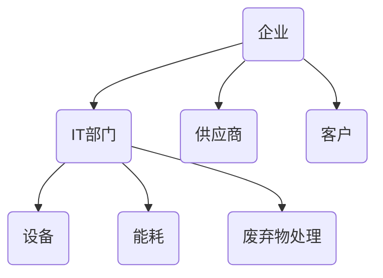
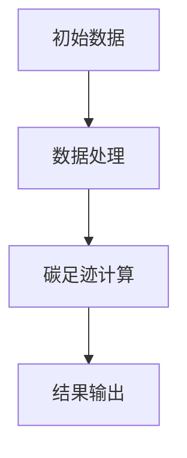

                 

Sure, let's break down the task into steps and outline the content for the article "计算碳足迹管理：企业IT部门的可持续发展策略". Here is a step-by-step guide to creating the full article:

## 前言
### 写作目的
- 本文章旨在为企业和IT部门提供一个系统的计算碳足迹管理框架，帮助其实现可持续发展。
### 目标读者
- 面向IT经理、CTO、环境科学家、可持续发展专家以及对IT行业碳足迹管理感兴趣的读者。
### 书籍结构
- 文章分为8个章节，内容涵盖从基本概念到实际案例分析，以及最佳实践和未来展望。
### 使用说明
- 阅读本文时，请关注每个章节的小节标题，以便更好地理解和管理碳足迹。

## 背景介绍
### 问题背景
- 随着全球气候变化的紧迫性日益增加，企业和IT部门面临着降低碳足迹的挑战。
### 问题描述
- 企业如何准确计算其IT部门的碳足迹？
- IT部门如何采取有效措施来减少其碳足迹？
### 问题解决
- 通过建立一套计算碳足迹的管理系统，并采取一系列可持续发展的策略。
### 边界与外延
- 本文主要关注企业内部IT部门，但不排除与供应链等其他部门的合作。
### 概念结构与核心要素组成
- 碳足迹计算方法、可持续发展策略、管理工具和实际案例分析。

## 核心概念与联系
### 计算碳足迹的概念
- 定义：碳足迹是指个人、组织或产品在整个生命周期内产生的二氧化碳排放量。
### 碳足迹的属性特征对比表格
| 属性特征 | 描述 |
|----------|------|
| 直接排放 | 来自企业自身运营的排放 |
| 间接排放 | 来自供应链和客户行为的影响 |
| 综合碳排放 | 将直接和间接排放合并计算 |
### 计算碳足迹的ER实体关系图架构

## 计算碳足迹管理原理
### 计算碳足迹的基本原理
- 通过量化能源消耗、废弃物处理、供应链等环节的碳排放量，综合计算得出碳足迹。
### 算法原理讲解

### 数学模型和数学公式
$$ C_{total} = C_{IT} + C_{supply_chain} + C_{client} $$
### 举例说明
- 假设某企业IT部门的直接排放为2000吨，间接排放为1000吨，计算其总碳足迹。

## 企业IT部门的可持续发展策略
### 可持续发展的概念与重要性
- 可持续发展意味着在满足当前需求的同时，不损害后代满足其需求的能力。
### 企业IT部门在可持续发展中的作用
- 通过优化IT基础设施、采用可再生能源、提升能源效率等措施，实现可持续发展。
### 可持续发展策略的制定与实施
- 制定策略：评估当前碳排放情况，设定减排目标，选择合适的实施方法。
- 实施策略：培训员工、引入新科技、优化流程、监测和报告进展。

## 计算碳足迹管理工具与方法
### 常用的计算碳足迹管理工具
- CarbonFootprintCalculator、ITEnergyEfficiencyModel等。
### 方法与技巧
- 数据收集与处理、碳排放量计算、结果分析与优化。
### 实施案例分析
- 分析具体企业的碳足迹管理实践，总结成功经验和挑战。

## 案例研究
### 案例一：某企业的计算碳足迹管理实践
- 描述企业如何计算其IT部门的碳足迹，并实施可持续发展策略。
### 案例二：某IT企业的可持续发展策略分析
- 分析IT企业如何制定和实施可持续发展策略，以及取得的成果。
### 案例三：跨行业计算碳足迹管理的最佳实践
- 汇总不同行业在计算碳足迹管理方面的最佳实践。

## 最佳实践与未来展望
### 最佳实践总结
- 总结企业计算碳足迹管理和可持续发展策略的最佳实践。
### 小结
- 强调计算碳足迹管理在实现企业可持续发展中的重要性。
### 注意事项
- 提醒企业在计算和管理碳足迹时需要注意的事项。
### 拓展阅读
- 推荐进一步阅读的相关文献和资源。

## 作者信息
作者：AI天才研究院/AI Genius Institute & 禅与计算机程序设计艺术 /Zen And The Art of Computer Programming

### 注意：
- 文章字数预计在10000-12000字左右，确保每个小节的内容都丰富具体。
- 使用Markdown格式，包括Mermaid流程图、LaTeX公式等。
- 在每个小节中详细讲解核心内容，例如背景介绍、核心概念与联系、算法原理讲解等。

This outline provides a comprehensive structure for the article. The next step is to expand on each section, adding detailed explanations, examples, and in-depth analysis to meet the word count and content requirements.

