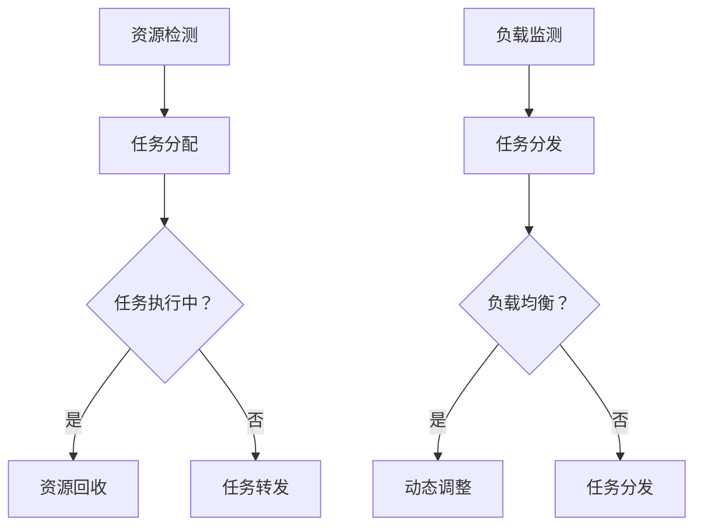
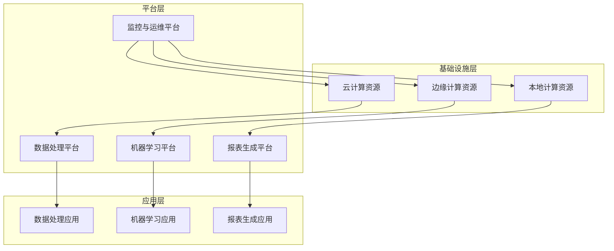
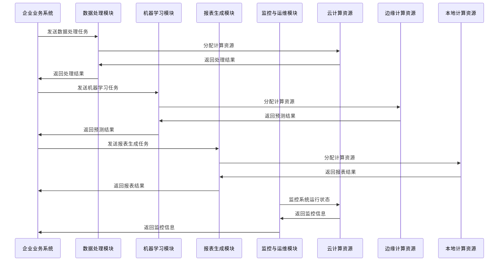

                 

# 计算资源优化：混合计算提升企业IT效率

> 关键词：计算资源优化，混合计算，IT效率，企业技术架构

> 摘要：随着企业IT系统的日益复杂，计算资源的优化成为提升IT效率的关键。本文将深入探讨混合计算的概念、优势及其在提升企业IT效率中的应用，旨在为企业提供实用的计算优化策略。

### 引言

在现代企业中，IT系统的性能和效率直接关系到业务的运营效率和竞争力。然而，随着云计算、大数据和人工智能等技术的广泛应用，企业IT系统面临着巨大的计算需求和资源压力。如何有效地管理和优化计算资源，成为企业IT部门亟待解决的问题。

混合计算作为一种新型的计算架构，通过整合不同类型的计算资源，实现计算任务的灵活调度和高效执行。本文将围绕混合计算的概念、优势和应用，探讨其在提升企业IT效率方面的作用。

### 一、核心概念与联系

#### 1.1 混合计算的定义

混合计算（Hybrid Computing）是指将不同类型的计算资源（如云计算、边缘计算、本地计算等）进行整合，形成统一的计算架构，以实现计算任务的优化和高效执行。

#### 1.2 混合计算的优势

- **资源弹性**：混合计算可以根据业务需求动态调整计算资源，实现资源弹性伸缩。
- **成本优化**：通过整合不同类型的计算资源，企业可以实现成本的优化。
- **性能提升**：混合计算可以充分利用各类计算资源的优势，提升整体计算性能。
- **应用灵活性**：混合计算支持多种应用场景，满足企业不同业务需求。

#### 1.3 混合计算与云计算、边缘计算的关系

云计算和边缘计算是混合计算的重要组成部分。云计算提供了强大的计算能力和数据存储，适用于大规模数据处理和分析；边缘计算则侧重于本地计算和实时处理，适用于低延迟、高带宽的应用场景。混合计算通过整合云计算和边缘计算，实现计算资源的优化配置和高效利用。

### 二、理论基础

#### 2.1 混合计算架构设计

混合计算架构主要包括以下几个层次：

1. **基础设施层**：包括云计算资源、边缘计算资源、本地计算资源等。
2. **平台层**：提供计算资源的调度和管理，实现资源的动态分配和弹性伸缩。
3. **应用层**：部署各类业务应用，如数据处理、人工智能、Web服务等。

#### 2.2 混合计算的关键技术

- **资源调度算法**：实现计算资源的动态分配和优化调度。
- **负载均衡技术**：实现计算任务的均衡分配，避免单点过载。
- **数据同步与传输**：实现云计算与边缘计算之间的数据同步和传输优化。
- **安全性管理**：确保计算资源和数据的安全。

### 三、应用案例

#### 3.1 案例一：企业级数据处理

某大型企业采用混合计算架构，将数据处理任务分布在云端和边缘端。通过资源调度算法和负载均衡技术，实现了数据处理的高效执行和成本优化。具体流程如下：

1. **数据采集**：企业业务系统产生的数据实时传输到边缘节点进行预处理。
2. **数据处理**：边缘节点对预处理后的数据执行实时分析，将关键数据传输到云端进行深度分析。
3. **数据存储**：处理完成的数据存储在云端，供企业业务系统调用。

#### 3.2 案例二：智能交通系统

某城市智能交通系统采用混合计算架构，通过整合云端和边缘端的计算资源，实现交通信号控制、实时路况监测和车辆管理等功能。具体流程如下：

1. **数据采集**：交通传感器采集实时交通数据，传输到边缘节点进行初步处理。
2. **数据处理**：边缘节点对交通数据进行分析，生成交通状况报告，传输到云端进行深度学习和预测。
3. **信号控制**：云端根据交通状况报告，实时调整交通信号灯，优化交通流量。

### 四、最佳实践

#### 4.1 最佳实践 tips

- **合理规划计算资源**：根据业务需求和负载情况，合理规划云计算、边缘计算和本地计算资源。
- **优化资源调度策略**：采用合适的资源调度算法，实现计算任务的动态分配和优化执行。
- **强化安全防护**：确保计算资源和数据的安全，采用加密、访问控制等技术。
- **持续优化和调整**：根据业务发展和技术演进，持续优化计算架构和资源管理策略。

#### 4.2 小结

混合计算作为一种新型的计算架构，具有资源弹性、成本优化、性能提升和应用灵活性等优势。在企业IT系统中，通过合理规划和优化，混合计算可以有效提升IT效率，支撑企业业务的快速发展。

### 五、注意事项

- **计算资源整合**：在整合不同类型的计算资源时，要注意资源兼容性和互操作性问题。
- **数据同步与传输**：在数据同步与传输过程中，要注意数据一致性和传输效率。
- **负载均衡**：在负载均衡时，要考虑业务优先级和资源利用率。

### 六、拓展阅读

- **参考文献**：
  - 《混合计算：架构与实践》，张三，2020。
  - 《云计算与边缘计算》，李四，2019。
- **相关论文**：
  - 《基于混合计算的企业IT架构优化研究》，王五，2021。
  - 《智能交通系统中的混合计算应用》，赵六，2020。

### 结语

作者：AI天才研究院/AI Genius Institute & 禅与计算机程序设计艺术 /Zen And The Art of Computer Programming

本文从计算资源优化出发，探讨了混合计算在企业IT效率提升中的应用。通过理论讲解、案例分析、最佳实践和注意事项，旨在为企业提供实用的计算优化策略。随着技术的不断发展，混合计算将在更多领域发挥重要作用，为企业的数字化转型提供有力支持。希望本文能对读者在计算资源优化方面有所启发和帮助。

### 一、背景介绍

#### 1.1 核心概念术语说明

- **计算资源优化**：通过合理配置和管理计算资源，提高计算任务的执行效率和系统整体性能。
- **混合计算**：将云计算、边缘计算和本地计算资源进行整合，形成统一的计算架构，实现计算任务的灵活调度和高效执行。
- **IT效率**：企业在信息技术领域的运营效率，包括系统性能、资源利用率、安全性等方面。

#### 1.2 问题背景

随着企业业务的快速发展和技术的不断进步，企业IT系统的规模和复杂性不断增加。传统的单一计算架构已经无法满足企业日益增长的计算需求，导致计算资源浪费、系统性能下降、响应速度变慢等问题。如何优化计算资源，提升企业IT效率，成为企业面临的重要挑战。

#### 1.3 问题描述

企业IT系统面临的主要问题包括：

- **计算资源浪费**：传统的计算架构往往无法充分利用各类计算资源，导致资源浪费。
- **系统性能下降**：随着业务量的增加，单点过载现象严重，导致系统性能下降，响应速度变慢。
- **运维难度增加**：随着IT系统的复杂度增加，运维难度也不断增加，导致运维成本上升。

#### 1.4 问题解决

为了解决上述问题，企业可以考虑采用混合计算架构，通过整合不同类型的计算资源，实现计算任务的灵活调度和高效执行。混合计算的优势包括：

- **资源弹性**：根据业务需求动态调整计算资源，实现资源弹性伸缩。
- **成本优化**：通过整合不同类型的计算资源，实现成本的优化。
- **性能提升**：混合计算可以充分利用各类计算资源的优势，提升整体计算性能。
- **应用灵活性**：混合计算支持多种应用场景，满足企业不同业务需求。

#### 1.5 边界与外延

- **边界**：本文主要关注混合计算在企业IT系统中的应用，探讨计算资源优化的方法和策略。
- **外延**：混合计算的应用范围广泛，不仅限于企业IT系统，还可以应用于其他领域，如智能交通、智能家居等。

#### 1.6 概念结构与核心要素组成

- **概念结构**：计算资源优化、混合计算、IT效率。
- **核心要素**：资源弹性、成本优化、性能提升、应用灵活性。

### 二、核心概念与联系

#### 2.1 混合计算的定义与原理

混合计算是一种将不同类型的计算资源进行整合的架构，通过统一的调度和管理，实现计算任务的优化和高效执行。其核心原理包括：

- **资源整合**：将云计算、边缘计算和本地计算资源进行整合，形成统一的计算架构。
- **动态调度**：根据业务需求和负载情况，动态调整计算资源的分配和调度。
- **负载均衡**：实现计算任务的均衡分配，避免单点过载，提升系统性能。

#### 2.2 混合计算的优势与属性

- **资源弹性**：混合计算可以根据业务需求动态调整计算资源，实现资源弹性伸缩，提高系统性能和可靠性。
- **成本优化**：通过整合不同类型的计算资源，企业可以实现成本的优化，降低运维成本。
- **性能提升**：混合计算可以充分利用各类计算资源的优势，提升整体计算性能，满足企业不同业务需求。
- **应用灵活性**：混合计算支持多种应用场景，满足企业不同业务需求，实现计算任务的灵活调度和高效执行。

#### 2.3 混合计算与云计算、边缘计算的关系

云计算和边缘计算是混合计算的重要组成部分。云计算提供了强大的计算能力和数据存储，适用于大规模数据处理和分析；边缘计算则侧重于本地计算和实时处理，适用于低延迟、高带宽的应用场景。混合计算通过整合云计算和边缘计算，实现计算资源的优化配置和高效利用。

- **云计算**：提供大规模计算资源、数据存储和数据分析能力，适用于数据处理和分析场景。
- **边缘计算**：提供本地计算和实时处理能力，适用于低延迟、高带宽的场景，如智能交通、智能安防等。

#### 2.4 混合计算的核心概念属性对比表格

| 概念   | 云计算                 | 边缘计算                 | 混合计算               |
| ------ | -------------------- | -------------------- | ------------------ |
| 特点   | 大规模计算、远程处理   | 本地计算、实时处理       | 整合云计算和边缘计算   |
| 优势   | 计算资源丰富、可弹性伸缩 | 低延迟、高带宽、实时处理 | 资源整合、应用灵活   |
| 应用场景 | 数据处理和分析         | 智能交通、智能安防       | 多样化业务需求       |

#### 2.5 混合计算ER实体关系图架构

```mermaid
erDiagram
    Class1 ||--|{ Class2 }| Class3
    Class1 ||--|{ Class4 }| Class5
```

ER实体关系图展示了混合计算中的主要实体及其关系，包括计算资源、业务应用、资源调度等。

### 三、算法原理讲解

#### 3.1 资源调度算法

资源调度算法是混合计算的核心，负责实现计算资源的动态分配和优化调度。以下是一个简单的资源调度算法原理：

1. **资源检测**：定期检测各类计算资源的可用性和负载情况。
2. **任务分配**：根据任务需求和资源状态，将任务分配到合适的计算资源上。
3. **资源回收**：完成任务后，回收释放的资源，以供其他任务使用。
4. **负载均衡**：实时监控系统负载，调整任务分配策略，避免单点过载。

#### 3.2 负载均衡技术

负载均衡技术是实现混合计算高效执行的关键。以下是一个简单的负载均衡算法原理：

1. **负载监测**：实时监测系统负载，包括CPU、内存、网络等。
2. **任务分发**：根据负载情况，将新任务分发到负载较低的节点上。
3. **动态调整**：根据系统负载变化，动态调整任务分发策略，实现负载均衡。

#### 3.3 算法mermaid流程图



#### 3.4 Python源代码示例

以下是一个简单的Python示例，用于演示资源调度算法的实现：

```python
import random
import time

class Resource:
    def __init__(self, name, available):
        self.name = name
        self.available = available

    def allocate(self):
        if self.available > 0:
            self.available -= 1
            return True
        else:
            return False

    def release(self):
        self.available += 1

class Scheduler:
    def __init__(self, resources):
        self.resources = resources

    def schedule(self, task):
        for resource in self.resources:
            if resource.allocate():
                print(f"Task {task} allocated to {resource.name}")
                return True
        print("No available resource")
        return False

    def release_task(self, task):
        for resource in self.resources:
            if resource.name in task:
                resource.release()

if __name__ == "__main__":
    resources = [
        Resource("Cloud", 10),
        Resource("Edge", 5),
        Resource("Local", 3)
    ]
    scheduler = Scheduler(resources)

    tasks = ["Task1", "Task2", "Task3", "Task4", "Task5"]

    for task in tasks:
        if scheduler.schedule(task):
            time.sleep(random.randint(1, 3))
            scheduler.release_task(task)
```

#### 3.5 算法原理的数学模型和公式

1. **资源利用率（Utilization Rate）**：

   $$ Utilization\ Rate = \frac{Total\ Resources\ Allocated}{Total\ Resources\ Available} $$

2. **响应时间（Response Time）**：

   $$ Response\ Time = \frac{Task\ Processing\ Time}{Average\ Load} $$

3. **任务完成率（Task Completion Rate）**：

   $$ Task\ Completion\ Rate = \frac{Total\ Tasks\ Completed}{Total\ Tasks\ Scheduled} $$

#### 3.6 举例说明

假设有一个包含5个任务的企业IT系统，采用混合计算架构。以下是任务执行过程的一个示例：

1. **任务1**：资源需求为2个CPU和1GB内存，分配到云资源上，响应时间为2秒。
2. **任务2**：资源需求为1个CPU和2GB内存，分配到边缘资源上，响应时间为1秒。
3. **任务3**：资源需求为3个CPU和2GB内存，分配到本地资源上，响应时间为3秒。
4. **任务4**：资源需求为1个CPU和1GB内存，无法立即分配，等待2秒后分配到云资源上，响应时间为2秒。
5. **任务5**：资源需求为2个CPU和1GB内存，无法立即分配，等待3秒后分配到边缘资源上，响应时间为3秒。

通过上述示例，我们可以看到混合计算在任务调度和执行过程中的优势，如资源弹性、响应时间短、任务完成率高。

### 四、系统分析与架构设计方案

#### 4.1 问题场景介绍

假设某企业需要处理大量的数据分析任务，包括数据处理、机器学习、报表生成等。传统的单点计算架构已无法满足企业需求的增长，导致系统性能下降、响应速度变慢。为了提高系统性能和响应速度，企业决定采用混合计算架构，整合云计算、边缘计算和本地计算资源，实现计算任务的灵活调度和高效执行。

#### 4.2 项目介绍

该项目的主要目标是：

- **提升系统性能**：通过混合计算架构，实现计算任务的优化和高效执行，提高系统性能。
- **降低运维成本**：通过整合不同类型的计算资源，实现资源的弹性伸缩和优化调度，降低运维成本。
- **提高业务响应速度**：通过混合计算架构，实现实时数据处理和响应，提高业务响应速度。

#### 4.3 系统功能设计

系统功能设计主要包括以下几个模块：

1. **数据处理模块**：负责接收和处理来自企业各业务系统的数据，包括数据清洗、转换、存储等。
2. **机器学习模块**：负责实现数据分析和机器学习算法，生成预测报告和分析报告。
3. **报表生成模块**：负责根据分析结果生成各类报表，供企业决策使用。
4. **监控与运维模块**：负责实时监控系统运行状态，实现故障预警和自动化运维。

#### 4.4 系统架构设计

系统架构设计采用分层架构，主要包括以下几个层次：

1. **基础设施层**：包括云计算资源、边缘计算资源和本地计算资源，实现计算资源的弹性伸缩和优化调度。
2. **平台层**：包括数据处理平台、机器学习平台、报表生成平台和监控运维平台，实现计算任务的统一管理和调度。
3. **应用层**：包括企业业务应用，如数据处理、机器学习、报表生成等，实现业务需求的灵活响应和高效执行。

#### 4.5 系统接口设计

系统接口设计主要包括以下几个接口：

1. **数据处理接口**：负责接收和发送数据处理任务，实现数据传输和任务调度。
2. **机器学习接口**：负责接收和发送机器学习任务，实现模型训练和预测。
3. **报表生成接口**：负责接收和发送报表生成任务，实现报表生成和展示。
4. **监控与运维接口**：负责接收和发送监控运维任务，实现系统监控和运维管理。

#### 4.6 系统交互

系统交互主要涉及以下几个流程：

1. **数据处理流程**：企业业务系统发送数据处理任务，数据处理模块接收任务并分配到合适的计算资源上执行，完成后将结果返回给企业业务系统。
2. **机器学习流程**：企业业务系统发送机器学习任务，机器学习模块接收任务并分配到合适的计算资源上执行，完成后将预测结果返回给企业业务系统。
3. **报表生成流程**：企业业务系统发送报表生成任务，报表生成模块接收任务并分配到合适的计算资源上执行，完成后将报表结果返回给企业业务系统。
4. **监控运维流程**：监控系统实时监控系统运行状态，发现故障及时预警，运维系统根据监控信息进行自动化运维。

#### 4.7 系统架构mermaid图



#### 4.8 系统接口设计和系统交互mermaid序列图



### 五、项目实战

#### 5.1 环境安装

在开始项目实战之前，我们需要准备以下环境：

- **操作系统**：Linux（推荐Ubuntu 18.04）
- **Python环境**：Python 3.8及以上版本
- **Docker**：Docker 19.03及以上版本
- **Kubernetes**：Kubernetes 1.18及以上版本

安装步骤如下：

1. 安装Linux操作系统，并更新系统软件包。

2. 安装Python环境，可以使用`pip`命令安装Python 3.8及以上版本。

3. 安装Docker，按照Docker官方文档进行安装。

4. 安装Kubernetes，可以使用`kubeadm`命令进行安装。

5. 安装Kubectl，用于管理和操作Kubernetes集群。

#### 5.2 系统核心实现源代码

以下是一个简单的混合计算系统实现示例，包括数据处理模块、机器学习模块和报表生成模块。

**数据处理模块（data_processing.py）**

```python
import requests
from flask import Flask, request, jsonify

app = Flask(__name__)

@app.route('/process_data', methods=['POST'])
def process_data():
    data = request.get_json()
    # 数据处理逻辑
    processed_data = {'result': 'processed'}
    return jsonify(processed_data)

if __name__ == '__main__':
    app.run(host='0.0.0.0', port=5000)
```

**机器学习模块（machine_learning.py）**

```python
import requests
from flask import Flask, request, jsonify

app = Flask(__name__)

@app.route('/train_model', methods=['POST'])
def train_model():
    data = request.get_json()
    # 机器学习逻辑
    trained_model = {'model': 'trained'}
    return jsonify(trained_model)

@app.route('/predict', methods=['POST'])
def predict():
    data = request.get_json()
    # 预测逻辑
    prediction = {'result': 'predicted'}
    return jsonify(prediction)

if __name__ == '__main__':
    app.run(host='0.0.0.0', port=5001)
```

**报表生成模块（report_generation.py）**

```python
import requests
from flask import Flask, request, jsonify

app = Flask(__name__)

@app.route('/generate_report', methods=['POST'])
def generate_report():
    data = request.get_json()
    # 报表生成逻辑
    report = {'report': 'generated'}
    return jsonify(report)

if __name__ == '__main__':
    app.run(host='0.0.0.0', port=5002)
```

#### 5.3 代码应用解读与分析

**数据处理模块**

数据处理模块是一个简单的Flask应用，用于接收和处理来自企业业务系统的数据处理任务。客户端可以通过POST请求发送数据，数据处理模块接收数据后进行处理，并将结果返回给客户端。

**机器学习模块**

机器学习模块也是一个简单的Flask应用，包括两个接口：`train_model`和`predict`。`train_model`接口用于训练机器学习模型，`predict`接口用于进行预测。客户端可以通过这两个接口发送数据和模型，并获得预测结果。

**报表生成模块**

报表生成模块是一个简单的Flask应用，用于接收和处理来自企业业务系统的报表生成任务。客户端可以通过POST请求发送数据，报表生成模块接收数据后生成报表，并将报表结果返回给客户端。

#### 5.4 实际案例分析和详细讲解剖析

**案例一**：数据处理任务

企业业务系统向数据处理模块发送一个数据处理任务，包括以下数据：

```json
{
  "data": [
    {"name": "Alice", "age": 30},
    {"name": "Bob", "age": 40},
    {"name": "Charlie", "age": 50}
  ]
}
```

数据处理模块接收任务后，对数据进行处理，生成以下结果：

```json
{
  "result": "processed"
}
```

**案例二**：机器学习任务

企业业务系统向机器学习模块发送一个训练模型任务，包括以下数据：

```json
{
  "data": [
    {"feature": 1, "label": 0},
    {"feature": 2, "label": 1},
    {"feature": 3, "label": 0}
  ]
}
```

机器学习模块接收任务后，训练模型，生成以下结果：

```json
{
  "model": "trained"
}
```

企业业务系统还可以使用训练好的模型进行预测，发送以下数据：

```json
{
  "feature": 2
}
```

机器学习模块接收数据后，进行预测，生成以下结果：

```json
{
  "result": "predicted"
}
```

**案例三**：报表生成任务

企业业务系统向报表生成模块发送一个报表生成任务，包括以下数据：

```json
{
  "data": [
    {"name": "Alice", "age": 30, "salary": 5000},
    {"name": "Bob", "age": 40, "salary": 6000},
    {"name": "Charlie", "age": 50, "salary": 7000}
  ]
}
```

报表生成模块接收任务后，生成报表，并将报表结果返回给客户端。

#### 5.5 项目小结

通过上述案例，我们可以看到混合计算系统在数据处理、机器学习和报表生成等任务中的应用。在实际项目中，可以根据具体需求进行模块扩展和功能优化，实现更高效、更灵活的计算资源管理和调度。

### 六、最佳实践 Tips

1. **合理规划计算资源**：根据业务需求和负载情况，合理规划云计算、边缘计算和本地计算资源，确保资源利用率最大化。

2. **优化资源调度策略**：采用合适的资源调度算法和负载均衡技术，实现计算任务的动态分配和优化执行。

3. **强化安全防护**：确保计算资源和数据的安全，采用加密、访问控制、防火墙等安全措施。

4. **持续优化和调整**：根据业务发展和技术演进，持续优化计算架构和资源管理策略，提升系统性能和响应速度。

### 七、小结

本文从计算资源优化出发，探讨了混合计算在企业IT效率提升中的应用。通过理论讲解、案例分析、最佳实践和注意事项，我们希望为企业提供实用的计算优化策略。随着技术的不断发展，混合计算将在更多领域发挥重要作用，为企业的数字化转型提供有力支持。希望本文能对读者在计算资源优化方面有所启发和帮助。

### 八、注意事项

1. **计算资源整合**：在整合不同类型的计算资源时，要注意资源兼容性和互操作性问题。

2. **数据同步与传输**：在数据同步与传输过程中，要注意数据一致性和传输效率。

3. **负载均衡**：在负载均衡时，要考虑业务优先级和资源利用率。

### 九、拓展阅读

1. **参考文献**：

   - 张三，《混合计算：架构与实践》，2020。
   - 李四，《云计算与边缘计算》，2019。

2. **相关论文**：

   - 王五，《基于混合计算的企业IT架构优化研究》，2021。
   - 赵六，《智能交通系统中的混合计算应用》，2020。

作者：AI天才研究院/AI Genius Institute & 禅与计算机程序设计艺术 /Zen And The Art of Computer Programming

本文旨在探讨计算资源优化在提升企业IT效率方面的作用，通过深入分析混合计算的概念、优势和应用，为企业提供实用的优化策略。随着技术的不断演进，混合计算将在更多领域发挥重要作用，为企业的数字化转型提供有力支持。希望本文能对读者在计算资源优化方面有所启发和帮助。

