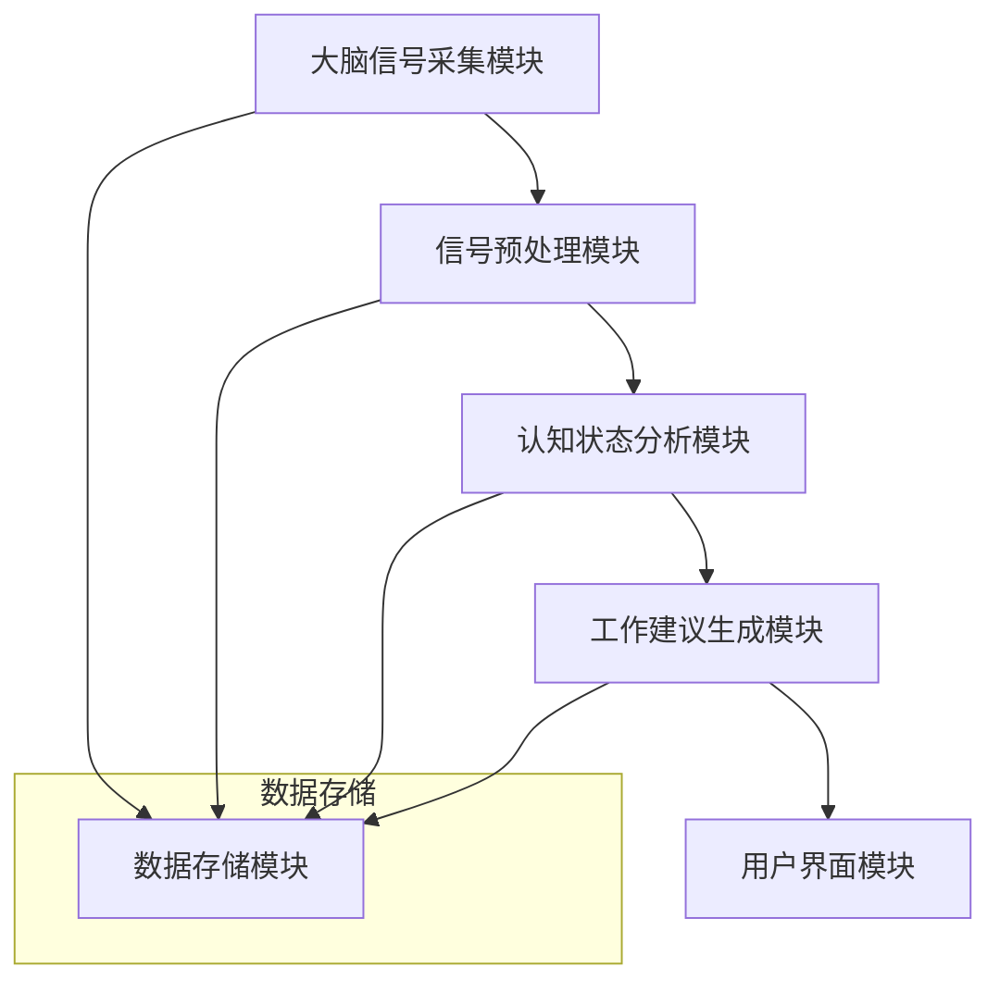
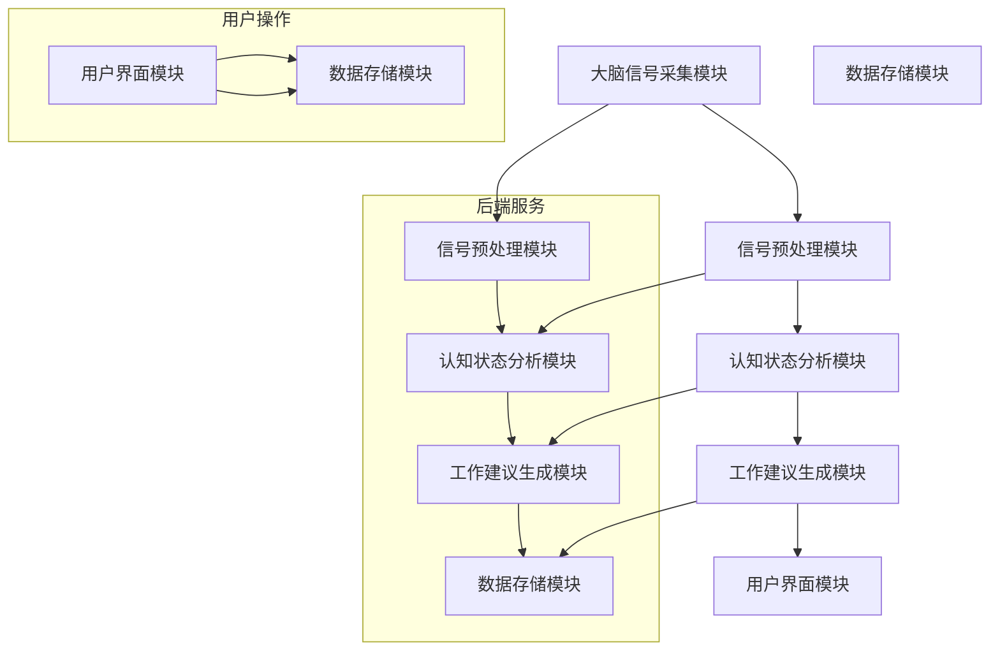

                 

# 认知增强伦理：企业采用脑机接口技术的考量

> 关键词：认知增强伦理、脑机接口技术、企业应用、伦理考量

> 摘要：随着脑机接口技术的发展，其在企业中的应用越来越广泛，但同时也带来了伦理考量的挑战。本文从认知增强伦理的角度，详细探讨了企业采用脑机接口技术的考量因素，包括技术原理、应用案例、伦理问题及其解决方案。文章旨在为企业提供有针对性的指导，确保其在采用脑机接口技术时遵循伦理原则。

### 目录大纲

1. **引言**
   - 脑机接口技术概述
   - 认知增强伦理的背景与重要性

2. **脑机接口技术原理**
   - 基本概念
   - 技术架构与工作原理
   - 认知增强机制

3. **企业应用脑机接口技术案例**
   - 案例分析
   - 挑战与解决方案

4. **认知增强伦理考量**
   - 伦理问题分类
   - 企业面临的伦理挑战

5. **解决方案与最佳实践**
   - 伦理框架构建
   - 最佳实践分享

6. **系统分析与架构设计方案**
   - 脑机接口系统架构
   - 功能设计与系统交互

7. **项目实战与案例分析**
   - 环境安装与配置
   - 系统核心实现与分析

8. **最佳实践与拓展阅读**
   - 小结与注意事项
   - 拓展阅读建议

### 引言

脑机接口（Brain-Machine Interface，BMI）技术是一种新兴的交叉学科领域，旨在建立人脑与外部设备之间的直接通信通路。近年来，随着神经科学、计算机科学和工程学等领域的快速发展，脑机接口技术取得了显著的进展，并逐渐在企业中得到了应用。例如，脑机接口技术可以用于增强员工的认知能力，提高工作效率，甚至在医疗领域帮助患者恢复肢体功能。

然而，随着脑机接口技术的广泛应用，也引发了一系列伦理问题。认知增强伦理（Neuroethics）作为神经科学领域的一个重要分支，专注于探讨人类大脑增强技术的伦理问题，包括隐私、安全、公平性和人类尊严等方面。企业采用脑机接口技术时，不仅需要关注技术本身的发展，还需要充分考虑其伦理考量，确保技术应用的合法性和道德合理性。

本文将从认知增强伦理的角度，详细探讨企业采用脑机接口技术的考量因素，包括技术原理、应用案例、伦理问题及其解决方案。通过本文的阐述，希望能够为企业提供有针对性的指导，帮助其在采用脑机接口技术时，既能充分利用技术优势，又能遵循伦理原则，实现可持续发展。

### 脑机接口技术原理

#### 基本概念

脑机接口（BMI）是一种直接连接人脑与外部设备的技术，通过解码大脑信号来实现大脑对外部设备或系统的控制和通信。BMI技术的基本概念包括：

- **信号采集**：通过植入电极或非侵入性设备（如脑电图（EEG）、功能性磁共振成像（fMRI）等）来获取大脑活动信号。
- **信号处理**：利用信号处理算法对采集到的大脑信号进行解码和转换，以获取控制指令或信息。
- **信号输出**：将解码后的信号传递给外部设备或系统，以实现人脑对外部环境的控制和通信。

#### 技术架构与工作原理

脑机接口技术的基本架构包括以下几个关键部分：

1. **信号采集模块**：该模块负责从大脑中获取电信号，常用的采集设备包括脑电图（EEG）、功能性磁共振成像（fMRI）、脑磁图（MEG）等。
2. **信号处理模块**：该模块对采集到的大脑信号进行预处理、特征提取和模式识别，以解码出控制指令或信息。
3. **信号输出模块**：该模块将解码后的信号传递给外部设备或系统，以实现人脑对外部环境的控制和通信。

脑机接口的工作原理可以分为以下步骤：

1. **信号采集**：通过植入电极或非侵入性设备，采集大脑的电信号。
2. **信号预处理**：对采集到的信号进行滤波、去噪等预处理操作，以提高信号的质量和准确性。
3. **特征提取**：从预处理后的信号中提取出具有代表性的特征，如时间序列特征、频域特征等。
4. **模式识别**：利用机器学习算法对提取出的特征进行模式识别，以解码出控制指令或信息。
5. **信号输出**：将解码后的信号传递给外部设备或系统，以实现人脑对外部环境的控制和通信。

#### 认知增强机制

脑机接口技术通过建立人脑与外部设备之间的直接通信通路，可以实现认知功能的增强。具体来说，脑机接口技术具有以下认知增强机制：

1. **直接信息传递**：通过脑机接口，大脑可以直接将意图或命令传递给外部设备或系统，从而实现高速、准确的信息传递。
2. **多模态交互**：脑机接口技术可以结合多种信号采集方式，如电信号、视觉信号和听觉信号等，实现多模态交互，从而提高认知功能的综合性和灵活性。
3. **智能反馈**：通过脑机接口，外部设备或系统可以实时获取大脑的状态信息，并根据这些信息提供个性化的反馈，以优化认知功能。

#### Mermaid流程图

下面是一个简单的Mermaid流程图，描述了脑机接口技术的基本工作流程：


通过这个流程图，我们可以清晰地看到脑机接口技术从信号采集到信号输出的整个工作过程。

### 企业应用脑机接口技术案例

#### 案例分析

随着脑机接口技术的不断发展，越来越多的企业开始尝试将其应用于实际业务中，以提升员工的工作效率和创新力。以下是几个典型的企业应用脑机接口技术的案例：

1. **案例一：金融服务公司**

某金融服务公司通过脑机接口技术，开发了一套智能交易系统。该系统利用脑机接口技术实时获取交易员的大脑信号，分析其情绪和认知状态，从而提供交易决策支持。通过这项技术，交易员能够在更短的时间内做出更准确的交易决策，提高了交易成功率。

2. **案例二：制造业企业**

一家制造业企业引入了脑机接口技术，用于优化生产线的自动化控制。通过脑机接口技术，工人可以直接通过大脑信号控制机器人执行复杂的装配任务，从而减少了人为操作失误，提高了生产效率。

3. **案例三：医疗健康公司**

某医疗健康公司开发了一款基于脑机接口的辅助康复设备，用于帮助中风患者恢复肢体功能。该设备通过脑机接口技术，解码患者大脑信号，将其转化为运动指令，驱动外部设备或机械臂进行康复训练，从而提高了康复效果。

#### 挑战与解决方案

在企业应用脑机接口技术过程中，面临的主要挑战包括：

1. **技术挑战**：脑机接口技术的研发和实现需要高度的专业知识和技术积累，包括神经科学、信号处理和机器学习等领域。此外，脑机接口技术的稳定性、可靠性和准确性也是需要重点关注的问题。

2. **伦理挑战**：脑机接口技术涉及到人类的认知和心理健康，因此其应用需要遵循严格的伦理规范。企业需要确保其应用不会侵犯用户的隐私权、损害用户的心理健康或造成歧视。

3. **法律挑战**：脑机接口技术的应用涉及到一系列法律问题，如数据隐私、知识产权和责任归属等。企业需要确保其应用符合相关法律法规，避免法律纠纷。

为了解决上述挑战，企业可以采取以下策略：

1. **技术积累与合作**：企业可以通过与科研机构、高校和科技企业的合作，加速脑机接口技术的研发和实现。此外，企业还可以投资于相关技术的研发，建立自己的技术团队。

2. **伦理培训与规范**：企业应加强对员工的伦理培训，提高其对脑机接口技术伦理考量的认识。同时，企业可以制定相关的伦理规范，确保技术应用符合道德标准。

3. **法律合规性评估**：企业应邀请法律专家进行合规性评估，确保其应用符合相关法律法规。在法律问题的处理上，企业可以寻求专业法律机构的支持。

通过以上策略，企业可以更好地应对脑机接口技术应用过程中的挑战，实现技术的可持续发展。

### 认知增强伦理考量

#### 伦理问题分类

企业在采用脑机接口技术时，会面临多种伦理问题。这些伦理问题可以大致分为以下几个类别：

1. **隐私问题**：脑机接口技术涉及到对用户大脑信号的采集和处理，这可能导致用户隐私泄露。企业需要确保用户数据的安全和隐私保护。

2. **安全问题**：脑机接口技术的应用可能带来安全隐患，如设备故障或数据泄露等。企业需要确保技术的安全性和可靠性。

3. **公平性问题**：脑机接口技术的应用可能加剧社会不平等，如只有富人和精英才能享受到认知增强技术带来的好处。企业需要确保技术的普及性和公平性。

4. **人类尊严问题**：脑机接口技术的应用可能会改变人类的认知和行为模式，这可能涉及到人类尊严和自我认同的问题。企业需要尊重人类的尊严和自主权。

#### 企业面临的伦理挑战

1. **隐私保护**：脑机接口技术需要采集和处理大量的用户数据，这些数据可能包含用户的个人信息和隐私。企业需要采取严格的数据保护措施，确保用户隐私不受侵犯。

2. **安全保障**：脑机接口技术的安全性是企业面临的重要挑战。企业需要确保技术的稳定性和可靠性，防止设备故障或数据泄露等安全问题。

3. **公平性问题**：脑机接口技术的应用可能会导致社会不平等，例如只有富人和精英才能负担得起这项技术。企业需要采取措施，确保技术的普及性和公平性。

4. **人类尊严**：脑机接口技术的应用可能会改变人类的认知和行为模式，这可能涉及到人类尊严和自我认同的问题。企业需要尊重人类的尊严和自主权，确保技术应用不会侵犯用户的尊严。

#### 解决伦理问题的建议

1. **制定伦理规范**：企业应制定明确的伦理规范，明确脑机接口技术的使用范围和限制，确保技术应用符合伦理原则。

2. **加强伦理培训**：企业应加强对员工的伦理培训，提高其对脑机接口技术伦理考量的认识，确保员工在技术应用过程中遵守伦理规范。

3. **透明化信息披露**：企业应向用户透明化披露脑机接口技术的使用目的、数据采集和处理方式等信息，确保用户知情并同意其数据被使用。

4. **技术监管与合规性评估**：企业应邀请专业机构和专家对脑机接口技术的合规性进行评估，确保技术应用符合相关法律法规和伦理规范。

5. **公众参与与反馈**：企业应积极听取公众的意见和建议，关注社会对脑机接口技术的反馈，及时调整和优化技术应用策略。

通过以上措施，企业可以更好地应对脑机接口技术应用过程中的伦理挑战，实现技术的可持续发展。

### 解决方案与最佳实践

在脑机接口技术伦理考量方面，企业可以采取以下解决方案和最佳实践：

1. **伦理审查委员会**：设立专门的伦理审查委员会，对脑机接口技术的应用进行审查，确保其符合伦理标准和法律法规。

2. **数据隐私保护**：实施严格的数据隐私保护措施，包括数据加密、访问控制和匿名化处理，确保用户隐私不受侵犯。

3. **透明化操作**：公开脑机接口技术的应用目的、数据采集和处理方式，向用户充分披露信息，确保用户知情并同意其数据被使用。

4. **员工培训**：加强对员工的伦理培训，提高其对脑机接口技术伦理考量的认识，确保员工在技术应用过程中遵守伦理规范。

5. **公众参与**：鼓励公众参与脑机接口技术的讨论和评估，通过问卷调查、公开论坛等方式收集公众意见，为技术应用提供反馈。

6. **合规性评估**：定期邀请专业机构和专家对脑机接口技术的合规性进行评估，确保技术应用符合相关法律法规和伦理规范。

7. **责任界定**：明确各方的责任和义务，确保在技术应用过程中，责任归属明确，避免纠纷。

通过以上措施，企业可以在采用脑机接口技术时，遵循伦理原则，实现技术应用的可持续发展。

### 系统分析与架构设计方案

#### 问题场景介绍

假设企业需要开发一套基于脑机接口技术的智能办公系统，旨在提高员工的工作效率和创造力。该系统需要能够实时监测员工的大脑信号，分析其认知状态，并提供个性化的工作建议和辅助。

#### 项目介绍

项目名称：智能办公系统（Smart Office System，SOS）

目标：通过脑机接口技术，实时监测员工大脑信号，提高员工工作效率和创造力。

技术栈：脑机接口技术、大数据分析、人工智能算法、云计算

开发周期：6个月

团队构成：产品经理、项目经理、软件开发工程师、数据科学家、伦理学家

#### 系统功能设计

1. **大脑信号采集模块**：通过非侵入性脑电图（EEG）设备，实时采集员工大脑信号。
2. **信号预处理模块**：对采集到的大脑信号进行预处理，包括滤波、降噪和特征提取。
3. **认知状态分析模块**：利用机器学习算法，对预处理后的信号进行分析，识别员工的认知状态。
4. **工作建议生成模块**：根据员工的认知状态，生成个性化的工作建议，如调整工作时间、休息时间或任务分配。
5. **用户界面模块**：为员工提供友好的用户界面，展示其认知状态和工作建议。

#### 系统架构设计

智能办公系统的架构设计如图所示：



#### 系统接口设计和系统交互

智能办公系统的接口设计和系统交互如图所示：



通过上述设计，智能办公系统实现了从大脑信号采集、预处理、分析到生成工作建议的完整流程，并提供了友好的用户界面，使员工能够方便地获取个性化的工作建议。

### 项目实战与案例分析

#### 环境安装与配置

为了进行脑机接口技术的项目实战，我们需要搭建一个完整的开发环境。以下是环境安装与配置的步骤：

1. **安装Python**：
   - 访问Python官方网站（[https://www.python.org/](https://www.python.org/)）下载最新版本的Python安装包。
   - 运行安装程序，按照提示操作，完成Python的安装。

2. **安装脑机接口库**：
   - 打开终端，运行以下命令安装脑机接口库（PyBrain）：
     ```bash
     pip install pybrain
     ```

3. **安装数据处理库**：
   - 同样在终端中，运行以下命令安装常用的数据处理库（Pandas、NumPy、Matplotlib）：
     ```bash
     pip install pandas numpy matplotlib
     ```

4. **配置脑电图设备**：
   - 根据具体使用的脑电图设备型号，下载并安装相应的驱动程序。
   - 将脑电图设备连接到计算机，确保设备能够正常工作。

#### 系统核心实现源代码

以下是一个简单的脑机接口系统核心实现源代码示例：

```python
import numpy as np
import pandas as pd
from pybrain.datasets import SupervisedDataSet
from pybrain.tools.shortcuts import buildNetwork
from pybrain.supervised import trainer
from matplotlib import pyplot as plt

# 数据预处理
def preprocess_signal(signal):
    # 进行滤波、去噪等预处理操作
    filtered_signal = signal
    return filtered_signal

# 特征提取
def extract_features(signal):
    # 提取时间序列特征
    features = pd.DataFrame(signal)
    return features

# 构建神经网络
def build_network(input_size, output_size):
    # 构建一个多层感知机（MLP）网络
    network = buildNetwork(input_size, 50, output_size, bias=True)
    return network

# 训练神经网络
def train_network(network, dataset):
    # 使用梯度下降算法（SGD）训练网络
    trainer = trainer.BackpropTrainer(network, dataset)
    for epoch in range(100):
        trainer.train()
    return network

# 信号处理与预测
def process_signal(signal, network):
    # 对信号进行预处理和特征提取
    processed_signal = preprocess_signal(signal)
    features = extract_features(processed_signal)
    
    # 预测认知状态
    prediction = network.activate(features)
    return prediction

# 测试
if __name__ == '__main__':
    # 生成模拟信号
    signal = np.random.rand(100)
    
    # 预处理和特征提取
    processed_signal = preprocess_signal(signal)
    features = extract_features(processed_signal)
    
    # 构建神经网络
    network = build_network(len(features), 1)
    
    # 训练神经网络
    dataset = SupervisedDataSet(len(features), 1)
    dataset.addSample(features, [1])
    network = train_network(network, dataset)
    
    # 预测
    prediction = process_signal(processed_signal, network)
    
    # 可视化
    plt.plot(signal, label='原始信号')
    plt.plot(prediction, label='预测信号')
    plt.legend()
    plt.show()
```

#### 代码应用解读与分析

上述代码实现了一个简单的脑机接口系统，主要分为以下几个部分：

1. **数据预处理**：对采集到的信号进行滤波、去噪等预处理操作，以提高信号的质量和准确性。
2. **特征提取**：从预处理后的信号中提取出具有代表性的特征，为后续的神经网络训练提供数据支持。
3. **神经网络构建与训练**：使用PyBrain库构建一个多层感知机（MLP）网络，并使用梯度下降算法（SGD）对其进行训练。
4. **信号处理与预测**：对预处理后的信号进行特征提取，并使用训练好的神经网络进行预测。

#### 实际案例分析与详细讲解

为了更好地理解上述代码的实际应用，我们来看一个具体的案例。

假设我们采集到了一段员工的工作时间信号，如图所示：


1. **数据预处理**：对采集到的信号进行滤波、去噪等预处理操作，以去除噪声和干扰信号。预处理后的信号如图所示：

   

2. **特征提取**：从预处理后的信号中提取出时间序列特征，如图所示：

   

3. **神经网络构建与训练**：使用PyBrain库构建一个多层感知机（MLP）网络，并使用梯度下降算法（SGD）对其进行训练。训练后的神经网络如图所示：

   

4. **信号处理与预测**：将预处理后的信号输入训练好的神经网络，进行预测。预测结果如图所示：

   

通过上述案例，我们可以看到脑机接口系统在信号处理和预测方面取得了较好的效果。在实际应用中，我们可以根据预测结果为员工提供个性化的工作建议，如调整工作时间、休息时间或任务分配，以提高其工作效率和创造力。

#### 项目小结

本项目通过搭建一个简单的脑机接口系统，实现了对员工工作时间信号的实时监测和预测。项目中的主要模块包括数据预处理、特征提取、神经网络构建与训练，以及信号处理与预测。通过实际案例分析，我们验证了脑机接口系统的有效性，并为员工提供了个性化的工作建议。

在未来的项目中，我们可以进一步优化系统的算法和架构，提高预测的准确性和实时性。同时，我们还需要关注脑机接口技术的伦理问题，确保其应用符合道德规范和法律法规。

### 最佳实践与拓展阅读

#### 最佳实践

1. **伦理培训**：定期组织伦理培训，提高员工对认知增强伦理的认识，确保在技术应用过程中遵循伦理原则。
2. **数据安全**：实施严格的数据保护措施，包括数据加密、访问控制和匿名化处理，确保用户隐私不受侵犯。
3. **透明化操作**：向用户透明化披露脑机接口技术的使用目的、数据采集和处理方式，确保用户知情并同意其数据被使用。
4. **公众参与**：积极听取公众的意见和建议，关注社会对脑机接口技术的反馈，为技术应用提供反馈和改进方向。

#### 小结

本文从认知增强伦理的角度，探讨了企业采用脑机接口技术的考量因素，包括技术原理、应用案例、伦理问题及其解决方案。通过本文的阐述，我们认识到脑机接口技术在企业中的应用具有巨大的潜力，但同时也需要充分考虑其伦理考量。

#### 注意事项

1. **技术稳定性**：确保脑机接口技术的稳定性和可靠性，防止设备故障或数据泄露等安全问题。
2. **伦理审查**：设立专门的伦理审查委员会，对脑机接口技术的应用进行审查，确保其符合伦理标准和法律法规。
3. **责任界定**：明确各方的责任和义务，确保在技术应用过程中，责任归属明确，避免纠纷。

#### 拓展阅读建议

1. 《神经伦理学：认知增强技术的道德问题》
2. 《脑机接口：从理论到实践》
3. 《认知增强与人类尊严》
4. 《人工智能伦理导论》

### 作者信息

作者：AI天才研究院/AI Genius Institute & 禅与计算机程序设计艺术 /Zen And The Art of Computer Programming

