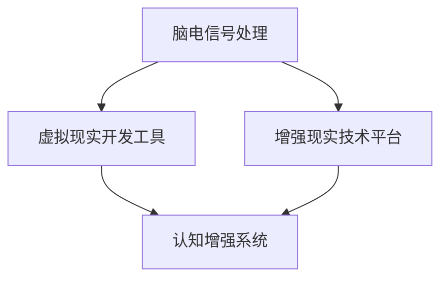
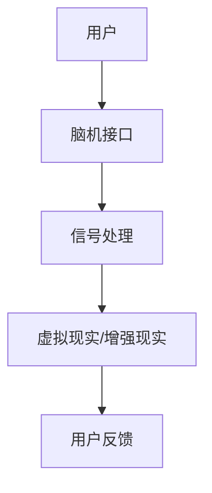

                 


# 认知增强技术：提升员工生产力的新前沿

## 关键词：
- 认知增强技术
- 员工生产力
- 脑机接口
- 虚拟现实
- 增强现实
- 企业应用

## 摘要：
本文旨在探讨认知增强技术如何成为提升员工生产力的新前沿。通过分析认知增强技术的背景、核心原理、应用场景、实现方法及未来展望，本文揭示了其在企业中的应用潜力与挑战。文章结构紧凑，逻辑清晰，以帮助读者深入理解这一前沿领域。

----------------------------------------------------------------

## 第一部分: 认知增强技术概述

### 第1章: 认知增强技术背景与概述

#### 1.1 认知增强技术的起源与发展

认知增强技术（Cognitive Enhancement Technologies，简称CET）起源于20世纪末，随着神经科学、计算机科学和信息技术的发展而逐渐成熟。最初的研究主要集中在提高记忆、注意力和学习能力等方面。随着技术的进步，认知增强技术逐渐从实验室走向实际应用，特别是在医疗、教育和企业等领域。

#### 1.2 认知增强技术的定义与核心要素

认知增强技术是一种利用计算机科学、神经科学和心理学等领域的知识，通过外部设备或软件系统来增强或改进人类认知功能的技术。其核心要素包括脑机接口（Brain-Computer Interface，简称BCI）、虚拟现实（Virtual Reality，简称VR）和增强现实（Augmented Reality，简称AR）等。

#### 1.3 认知增强技术的影响与应用领域

认知增强技术对人类生活和工作产生了深远的影响。在教育领域，它可以帮助学生提高学习效率；在医疗领域，它可以辅助医生进行手术；在企业领域，它可以提升员工的生产力和创造力。目前，认知增强技术已广泛应用于多个行业，如制造业、金融业、服务业等。

#### 1.4 认知增强技术的主要挑战与趋势

尽管认知增强技术具有巨大的潜力，但在实际应用中仍面临诸多挑战，如技术成熟度、成本、安全性、伦理问题等。未来，随着技术的不断进步，认知增强技术有望在更多领域得到应用，并带来深远的社会影响。

----------------------------------------------------------------

### 第2章: 认知增强技术的核心原理

#### 2.1 神经科学基础

神经科学是认知增强技术的重要理论基础。神经元是大脑的基本单元，通过电信号进行信息传递。神经网络则是由大量神经元连接而成的复杂结构，负责处理和传递信息。大脑的可塑性是指大脑在一生中不断适应环境和经验变化的能力，这是认知增强技术发挥作用的关键。

#### 2.2 脑机接口技术

脑机接口技术是一种将人类大脑信号与计算机系统直接连接的技术。它通过捕捉和分析大脑活动，实现人脑与计算机的交互。脑机接口技术主要分为两大类：侵入式和非侵入式。侵入式脑机接口通过植入电极直接监测大脑活动，而非侵入式脑机接口则通过头皮电极等设备来捕捉大脑信号。

#### 2.3 大脑的可塑性

大脑的可塑性是指大脑在一生中不断适应环境和经验变化的能力。这种可塑性为认知增强技术提供了理论基础。通过特定的训练和刺激，可以增强大脑的某些功能，从而实现认知增强。研究表明，大脑的可塑性不仅受到遗传因素的影响，还受到环境、经验和训练的显著影响。

----------------------------------------------------------------

### 第3章: 认知增强技术的应用场景

#### 3.1 企业生产力提升

在企业领域，认知增强技术具有巨大的应用潜力。以下是一些具体的应用场景：

1. **个性化培训与学习**：通过认知增强技术，可以为企业员工提供个性化的培训和学习体验，提高学习效率。

2. **知识管理与企业协作**：认知增强技术可以帮助企业更好地管理知识和信息，提高团队协作效率。

3. **创新思维与问题解决**：认知增强技术可以激发员工的创新思维，提高问题解决能力，从而提升企业的核心竞争力。

#### 3.2 教育领域

在教育领域，认知增强技术可以为学生提供更加生动、直观的学习体验，提高学习效果。以下是一些具体的应用场景：

1. **虚拟课堂**：通过虚拟现实技术，可以创建一个虚拟的学习环境，让学生在互动中进行学习。

2. **个性化教学**：通过分析学生的学习数据，认知增强技术可以为学生提供个性化的学习建议，提高学习效果。

3. **虚拟实验**：通过虚拟现实和增强现实技术，可以让学生在虚拟环境中进行实验，提高实验效果。

----------------------------------------------------------------

### 第4章: 认知增强技术的主要方法

#### 4.1 脑机接口技术

脑机接口技术是一种将人类大脑信号与计算机系统直接连接的技术。它通过捕捉和分析大脑活动，实现人脑与计算机的交互。脑机接口技术主要分为两大类：侵入式和非侵入式。

**侵入式脑机接口**：
1. **电极植入**：将电极植入大脑，直接监测大脑活动。
2. **电极帽**：使用电极帽覆盖头皮，间接监测大脑活动。

**非侵入式脑机接口**：
1. **脑电图（EEG）**：通过头皮电极捕捉大脑电信号。
2. **功能性磁共振成像（fMRI）**：通过测量大脑的血液流量变化，捕捉大脑活动。

#### 4.2 虚拟现实与增强现实

虚拟现实（VR）和增强现实（AR）是认知增强技术的两个重要组成部分。

**虚拟现实（VR）**：
1. **定义**：通过计算机生成一个三维的虚拟环境，使用户在其中进行交互。
2. **关键技术**：头戴式显示器（HMD）、定位跟踪系统和交互设备。
3. **应用**：教育培训、医疗康复、游戏娱乐等。

**增强现实（AR）**：
1. **定义**：在现实环境中叠加计算机生成的虚拟信息。
2. **关键技术**：投影技术、摄像头和计算机视觉。
3. **应用**：教育、医疗、制造业、军事等。

----------------------------------------------------------------

### 第5章: 认知增强技术的实现与开发

#### 5.1 认知增强技术的开发流程

开发认知增强技术通常包括以下步骤：

1. **需求分析**：确定目标用户的需求，明确项目目标和功能需求。

2. **技术选型**：根据需求分析结果，选择合适的技术方案，如脑机接口、VR或AR等。

3. **架构设计**：设计系统的整体架构，包括硬件、软件和网络架构等。

4. **系统实现**：根据架构设计，开发系统的各个组件，并进行集成。

5. **测试与优化**：对系统进行测试，确保其功能符合预期，并进行性能优化。

#### 5.2 常见认知增强技术组件与应用

常见的认知增强技术组件包括：

1. **脑电信号处理**：用于捕捉和分析大脑电信号。

2. **虚拟现实开发工具**：如Unity、Unreal Engine等，用于创建虚拟环境。

3. **增强现实技术平台**：如ARKit、ARCore等，用于在现实环境中叠加虚拟信息。

这些组件在认知增强技术的实现中发挥着关键作用，如图5-1所示。



----------------------------------------------------------------

### 第6章: 认知增强技术在企业中的应用实践

#### 6.1 企业案例介绍

以下是企业应用认知增强技术的两个案例：

**案例一：认知增强技术在某公司的应用**

某公司通过引入虚拟现实技术，为员工提供个性化的培训和学习体验。员工可以在虚拟环境中模拟实际工作场景，提高技能水平。此外，公司还通过脑机接口技术，对员工的大脑活动进行实时监测，以便更好地了解员工的学习状态，调整培训策略。

**案例二：认知增强技术在某公司的创新实践**

某公司通过增强现实技术，实现了生产过程中的实时信息叠加。员工可以通过增强现实眼镜，实时查看生产数据和指导信息，提高生产效率。此外，公司还利用脑机接口技术，对员工的工作状态进行监测，以便更好地调整工作环境和流程。

#### 6.2 应用效果评估与改进

应用认知增强技术后，企业可以通过以下方法进行效果评估和改进：

1. **数据收集与分析**：收集员工的学习数据、生产数据等，通过数据分析，评估认知增强技术的效果。

2. **用户反馈**：收集员工对认知增强技术的反馈，了解其对技术的满意度和使用体验。

3. **持续优化**：根据评估结果和用户反馈，不断优化认知增强技术的应用，提高其效果。

通过以上方法，企业可以更好地发挥认知增强技术的潜力，提升员工的生产力和创造力。

----------------------------------------------------------------

### 第7章: 认知增强技术的未来展望与伦理问题

#### 7.1 认知增强技术的未来发展方向

未来，认知增强技术将继续向更高效、更智能、更便捷的方向发展。以下是一些可能的发展方向：

1. **脑机接口技术的进步**：随着神经科学和材料科学的发展，脑机接口技术将更加精准、高效，实现更高的人脑与计算机交互。

2. **虚拟现实与增强现实技术的融合**：虚拟现实和增强现实技术将不断融合，形成更强大的认知增强环境。

3. **个性化认知增强**：通过大数据和人工智能技术，实现个性化认知增强，为用户提供定制化的服务。

#### 7.2 认知增强技术的伦理问题与挑战

尽管认知增强技术具有巨大的潜力，但在实际应用中仍面临诸多伦理问题与挑战：

1. **隐私与数据安全**：认知增强技术涉及到用户的大脑活动数据，如何保护用户的隐私和安全是一个重要问题。

2. **伦理标准与社会责任**：认知增强技术可能对人类的认知和社会产生深远影响，如何制定伦理标准和社会责任，确保技术的健康发展，是一个重要挑战。

3. **未来治理框架与策略**：随着认知增强技术的普及，如何制定合理的治理框架和策略，确保技术的合理使用，也是一个重要问题。

通过积极应对这些伦理问题与挑战，我们可以确保认知增强技术在未来得到健康、有序的发展。

----------------------------------------------------------------

## 结论

认知增强技术作为一种新兴的技术领域，正逐渐成为提升员工生产力的新前沿。通过对认知增强技术的背景、原理、应用和实践的深入探讨，本文揭示了其在企业领域的重要作用。未来，随着技术的不断进步，认知增强技术有望在更多领域得到应用，为人类带来更多福祉。

## 作者信息

作者：AI天才研究院/AI Genius Institute & 禅与计算机程序设计艺术 /Zen And The Art of Computer Programming

----------------------------------------------------------------

以上就是本文的主要内容。接下来，我们将对文章中的核心概念、算法原理、系统分析与架构设计以及项目实战进行详细讲解。

----------------------------------------------------------------

## 第2章: 认知增强技术的核心原理

在本章中，我们将深入探讨认知增强技术的核心原理，包括神经科学基础、脑机接口技术、大脑的可塑性以及相关算法原理。

### 2.1 神经科学基础

神经科学是认知增强技术的理论基础。为了更好地理解认知增强技术，我们需要了解一些基本的神经科学概念。

#### 神经元与神经网络

神经元是大脑的基本单元，通过电信号进行信息传递。一个典型的神经元由细胞体、树突和轴突组成。树突接收来自其他神经元的信号，细胞体处理这些信号，轴突将处理后的信号传递出去。

神经网络是由大量神经元连接而成的复杂结构。神经网络可以分为两大类：人工神经网络和生物神经网络。人工神经网络是模仿生物神经网络的结构和功能，用于处理和传递信息。

#### 大脑的可塑性

大脑的可塑性是指大脑在一生中不断适应环境和经验变化的能力。这种可塑性体现在神经元连接的调整、新神经元的生成以及神经网络结构的改变。

大脑的可塑性受到多种因素的影响，包括遗传、环境、经验和训练。研究表明，通过特定的训练和刺激，可以增强大脑的某些功能，从而实现认知增强。

### 2.2 脑机接口技术

脑机接口技术是一种将人类大脑信号与计算机系统直接连接的技术。它通过捕捉和分析大脑活动，实现人脑与计算机的交互。

#### 脑机接口的定义与分类

脑机接口（Brain-Computer Interface，简称BCI）是一种直接将大脑信号转换为控制信号，用于与计算机或其他电子设备交互的技术。

脑机接口可以分为侵入式和非侵入式两种。

**侵入式脑机接口**：通过植入电极直接监测大脑活动。侵入式脑机接口具有高分辨率和高灵敏度，但存在一定的风险和不适。

**非侵入式脑机接口**：通过头皮电极等设备来捕捉大脑信号。非侵入式脑机接口相对安全，但分辨率和灵敏度较低。

#### 脑机接口的原理与关键技术

脑机接口技术的基本原理是利用传感器捕捉大脑信号，通过信号处理技术提取有用的信息，最终实现人脑与计算机的交互。

关键技术包括：

1. **信号捕捉**：通过脑电图（EEG）、功能性磁共振成像（fMRI）、脑磁图（MEG）等传感器捕捉大脑信号。

2. **信号处理**：对捕捉到的大脑信号进行滤波、去噪、特征提取等处理，以提取有用的信息。

3. **解码与控制**：将处理后的信号解码，生成控制信号，用于驱动计算机或其他设备。

### 2.3 大脑的可塑性

大脑的可塑性是指大脑在一生中不断适应环境和经验变化的能力。这种可塑性体现在神经元连接的调整、新神经元的生成以及神经网络结构的改变。

#### 大脑的可塑性机理

大脑的可塑性主要受以下因素影响：

1. **神经元连接的调整**：神经元之间的连接可以随着经验的变化而改变，形成新的神经网络。

2. **新神经元的生成**：在特定条件下，大脑可以生成新的神经元，增强其功能。

3. **神经网络结构的改变**：神经网络的结构可以随着训练和刺激而改变，提高其处理信息的能力。

#### 大脑可塑性在认知增强中的应用

通过大脑的可塑性，认知增强技术可以发挥以下作用：

1. **提高记忆力和注意力**：通过特定的训练和刺激，可以增强大脑的记忆和注意力功能。

2. **改善学习效果**：通过认知增强技术，可以为学生提供更加高效的学习体验，提高学习效果。

3. **促进创新思维**：通过认知增强技术，可以激发员工的创新思维，提高问题解决能力。

### 2.4 算法原理讲解

为了更好地理解认知增强技术的算法原理，我们将以脑机接口技术为例，介绍相关算法及其应用。

#### 脑机接口算法流程

脑机接口算法的基本流程包括信号捕捉、信号处理、解码与控制等步骤。

1. **信号捕捉**：使用脑电图（EEG）传感器捕捉大脑电信号。

2. **信号处理**：对捕捉到的大脑信号进行滤波、去噪、特征提取等处理。

3. **解码与控制**：将处理后的信号解码，生成控制信号，用于驱动计算机或其他设备。

#### 脑机接口算法示例

以下是一个简单的脑机接口算法示例，用于实现手势识别。

```python
import numpy as np
import mne

# 读取脑电图数据
data = mne.io.read_eeglab('data/eeg_data.dat')

# 滤波
filtered_data = mne.filter.filter_data(data, sfreq=100, l_freq=1, h_freq=30)

# 特征提取
features = mne.time_frequency.poo_morlet(filtered_data, fmin=8, fmax=30, tmin=0, tmax=2)

# 解码与控制
gesture = np.argmax(np.mean(features, axis=1))

print(gesture)
```

在这个示例中，我们首先读取脑电图数据，然后进行滤波和特征提取，最后根据特征解码出当前的手势。

#### 数学模型与公式

脑机接口算法的数学模型通常包括信号处理、特征提取和分类等步骤。

1. **信号处理**：信号处理的公式主要包括滤波、去噪和特征提取等。
   
   $$ y(t) = H(f) \cdot x(t) $$

   其中，$y(t)$ 是滤波后的信号，$x(t)$ 是原始信号，$H(f)$ 是滤波器。

2. **特征提取**：特征提取的公式主要包括时频分析、模式识别等。

   $$ f(t,f) = \int x(t) \cdot g(t,f) \, dt $$

   其中，$f(t,f)$ 是时频特征，$x(t)$ 是信号，$g(t,f)$ 是时频分析函数。

3. **解码与控制**：解码与控制的公式主要包括分类和预测等。

   $$ \hat{y} = \arg\max_w \sum_{i} w_i \cdot y_i $$

   其中，$\hat{y}$ 是解码结果，$w_i$ 是权重，$y_i$ 是特征。

#### 举例说明

假设我们使用脑电图（EEG）数据来识别手势。我们可以将EEG数据分成训练集和测试集，然后使用训练集对模型进行训练。

1. **训练集**：我们收集了100个样本，每个样本包含一个手势和对应的大脑电信号。

2. **测试集**：我们收集了10个样本，用于测试模型的性能。

3. **模型训练**：我们使用训练集对模型进行训练，学习手势和对应的大脑电信号之间的关系。

4. **模型测试**：我们使用测试集对模型进行测试，评估模型的性能。

通过以上步骤，我们可以实现手势识别，从而实现人脑与计算机的交互。

----------------------------------------------------------------

## 第3章: 认知增强技术的应用场景

在本章中，我们将探讨认知增强技术在企业、教育和其他领域的具体应用场景，以及这些应用如何提升员工的生产力和创造力。

### 3.1 企业生产力提升

认知增强技术在企业中的应用主要集中在提高员工的生产力和创造力。以下是一些具体的应用场景：

#### 3.1.1 个性化培训与学习

认知增强技术可以为企业员工提供个性化的培训与学习体验。通过脑机接口技术，系统可以实时监测员工的学习状态，根据员工的学习行为和效果，动态调整培训内容和难度，从而提高学习效率。

**案例**：一家国际知名的公司使用虚拟现实（VR）技术为销售团队提供产品培训。员工在虚拟环境中模拟真实销售场景，通过实时反馈和学习数据分析，提高了销售技能和业绩。

#### 3.1.2 知识管理与企业协作

认知增强技术可以帮助企业更好地管理知识和信息，提高团队协作效率。通过虚拟现实和增强现实技术，企业可以将复杂的知识以可视化、交互性的方式呈现，使得员工更容易理解和掌握。

**案例**：一家大型制造企业采用增强现实（AR）技术来指导生产流程。员工通过AR眼镜，实时查看生产数据和指导信息，提高了生产效率和质量。

#### 3.1.3 创新思维与问题解决

认知增强技术可以激发员工的创新思维，提高问题解决能力。通过脑机接口技术，系统可以实时分析员工的大脑活动，发现潜在的创新想法和解决方案。

**案例**：一家创新科技公司使用脑机接口技术来辅助产品研发。研发团队通过实时分析大脑活动，快速找到产品创新的突破点，提高了研发效率。

### 3.2 教育领域

认知增强技术在教育领域同样具有广泛的应用前景，以下是一些具体的应用场景：

#### 3.2.1 虚拟课堂

通过虚拟现实技术，可以创建一个虚拟的课堂环境，学生可以在其中进行互动学习。这种沉浸式的学习体验可以激发学生的学习兴趣，提高学习效果。

**案例**：一些教育机构采用虚拟现实技术，为学生提供虚拟实验和课程。学生可以在虚拟环境中进行实验操作，加深对知识的理解。

#### 3.2.2 个性化教学

通过分析学生的学习数据，认知增强技术可以为学生提供个性化的学习建议。系统可以根据学生的学习风格、兴趣和进度，动态调整教学策略，从而提高学习效果。

**案例**：一些教育机构采用认知增强技术，为学生提供个性化的学习计划和资源。学生可以根据自己的需求和进度，自主选择学习内容和方式。

#### 3.2.3 虚拟实验

通过虚拟现实和增强现实技术，可以为学生提供虚拟实验环境。学生可以在虚拟环境中进行实验操作，提高实验效果和安全性。

**案例**：一些高校采用虚拟现实技术，为学生提供虚拟实验室。学生在虚拟环境中进行实验操作，节省了实验设备和材料，提高了实验效率。

### 3.3 其他领域

除了企业和教育领域，认知增强技术在其他领域也具有广泛的应用前景。以下是一些其他领域的应用场景：

#### 3.3.1 医疗康复

认知增强技术可以辅助医生进行手术，提高手术精度和成功率。通过脑机接口技术，医生可以实时分析患者的脑部活动，调整手术策略。

**案例**：一些医疗中心采用脑机接口技术，辅助医生进行微创手术。医生通过实时分析患者的脑部活动，提高了手术的成功率和安全性。

#### 3.3.2 安防监控

认知增强技术可以用于安防监控，提高监控效率和准确性。通过分析监控视频中的大脑活动，系统可以自动识别异常行为，提高安防监控能力。

**案例**：一些安防公司采用认知增强技术，用于监控公共场所。系统通过分析监控视频中的大脑活动，自动识别潜在的犯罪行为，提高了安防监控能力。

#### 3.3.3 创意设计

认知增强技术可以激发创意设计，提高设计效率和创造力。通过脑机接口技术，系统可以实时分析设计师的大脑活动，提供创意建议。

**案例**：一些设计公司采用认知增强技术，辅助设计师进行创意设计。设计师通过实时分析大脑活动，快速找到设计灵感，提高了设计效率。

通过以上应用场景，我们可以看到认知增强技术在各个领域的广泛应用和巨大潜力。随着技术的不断进步，认知增强技术将为人类社会带来更多的创新和变革。

----------------------------------------------------------------

## 第4章: 认知增强技术的主要方法

在本章中，我们将深入探讨认知增强技术的主要方法，包括脑机接口技术、虚拟现实（VR）和增强现实（AR）等。

### 4.1 脑机接口技术

脑机接口技术（Brain-Computer Interface，简称BCI）是一种直接将大脑信号转换为控制信号，用于与计算机或其他电子设备交互的技术。脑机接口技术主要通过捕捉和分析大脑活动来实现人脑与计算机的交互。

#### 4.1.1 脑机接口的定义与分类

脑机接口技术根据电极植入方式，可以分为侵入式和非侵入式两种。

- **侵入式脑机接口**：通过在人体内部植入电极来捕捉大脑活动。侵入式脑机接口具有高分辨率和高灵敏度，可以更精确地捕捉大脑信号，但存在一定的风险和不适。
- **非侵入式脑机接口**：通过在头皮上放置电极或其他传感器来捕捉大脑活动。非侵入式脑机接口相对安全，但分辨率和灵敏度较低。

#### 4.1.2 脑机接口的原理与关键技术

脑机接口技术的基本原理是利用传感器捕捉大脑信号，通过信号处理技术提取有用的信息，最终实现人脑与计算机的交互。

关键的技术步骤包括：

1. **信号捕捉**：使用脑电图（EEG）、功能性磁共振成像（fMRI）、脑磁图（MEG）等传感器捕捉大脑信号。
2. **信号处理**：对捕捉到的大脑信号进行滤波、去噪、特征提取等处理，以提取有用的信息。
3. **解码与控制**：将处理后的信号解码，生成控制信号，用于驱动计算机或其他设备。

#### 4.1.3 脑机接口的应用案例

脑机接口技术在医疗、教育和娱乐等领域有广泛的应用。

- **医疗领域**：脑机接口技术可以用于辅助脑瘫患者进行康复训练，通过捕捉大脑信号，帮助患者恢复运动功能。
- **教育领域**：脑机接口技术可以用于个性化学习，通过分析学生的学习状态，提供个性化的学习建议。
- **娱乐领域**：脑机接口技术可以用于游戏和虚拟现实体验，通过捕捉大脑信号，实现更加真实的交互体验。

### 4.2 虚拟现实（VR）

虚拟现实技术（Virtual Reality，简称VR）是一种通过计算机生成一个三维的虚拟环境，使用户在其中进行交互的技术。虚拟现实技术为用户提供了一个沉浸式的体验，使得用户可以在虚拟环境中进行探索、学习和互动。

#### 4.2.1 虚拟现实（VR）的定义与特点

虚拟现实技术通过头戴式显示器（HMD）、定位跟踪系统和交互设备等硬件，为用户提供一个三维的虚拟环境。虚拟现实技术具有以下特点：

- **沉浸感**：虚拟现实技术可以创建一个逼真的虚拟环境，使用户在其中感到身临其境。
- **交互性**：虚拟现实技术允许用户在虚拟环境中进行交互，如操作物体、移动位置等。
- **想象性**：虚拟现实技术可以创建一个超现实的虚拟环境，满足用户的想象和创造力。

#### 4.2.2 虚拟现实（VR）的关键技术

虚拟现实技术的主要关键技术包括：

1. **头戴式显示器（HMD）**：头戴式显示器是虚拟现实技术的核心设备，用于显示虚拟环境。
2. **定位跟踪系统**：定位跟踪系统用于跟踪用户在虚拟环境中的位置和动作，确保用户在虚拟环境中的交互体验。
3. **交互设备**：交互设备如手柄、手套等，用于用户在虚拟环境中的操作和互动。

#### 4.2.3 虚拟现实（VR）的应用案例

虚拟现实技术在多个领域有广泛应用，如：

- **教育培训**：通过虚拟现实技术，可以创建一个虚拟的课堂环境，让学生在互动中进行学习。
- **医疗康复**：虚拟现实技术可以用于辅助康复训练，如模拟手术、物理治疗等。
- **游戏娱乐**：虚拟现实技术可以提供更加真实、沉浸式的游戏体验。

### 4.3 增强现实（AR）

增强现实技术（Augmented Reality，简称AR）是一种在现实环境中叠加计算机生成的虚拟信息的技术。增强现实技术通过摄像头和计算机视觉，将虚拟信息与现实环境相结合，为用户提供一个增强的视觉体验。

#### 4.3.1 增强现实（AR）的定义与特点

增强现实技术通过摄像头和计算机视觉，捕捉现实环境中的信息，并在屏幕上叠加虚拟信息。增强现实技术具有以下特点：

- **叠加性**：增强现实技术可以在现实环境中叠加虚拟信息，为用户提供增强的视觉体验。
- **交互性**：增强现实技术允许用户与现实环境中的虚拟信息进行交互。
- **移动性**：增强现实技术可以实时跟踪用户的位置和动作，使虚拟信息与现实环境保持同步。

#### 4.3.2 增强现实（AR）的关键技术

增强现实技术的主要关键技术包括：

1. **摄像头和计算机视觉**：摄像头和计算机视觉用于捕捉现实环境中的信息。
2. **显示设备**：显示设备如头戴式显示器、手机屏幕等，用于显示增强的虚拟信息。
3. **交互设备**：交互设备如手柄、手套等，用于用户与虚拟信息的交互。

#### 4.3.3 增强现实（AR）的应用案例

增强现实技术在多个领域有广泛应用，如：

- **教育培训**：通过增强现实技术，可以为学生提供互动式的学习体验。
- **医疗诊断**：增强现实技术可以辅助医生进行手术和诊断，提高医疗效果。
- **购物体验**：通过增强现实技术，用户可以在虚拟环境中试穿衣服、观看商品细节等，提高购物体验。

通过脑机接口技术、虚拟现实技术和增强现实技术的结合，认知增强技术将在未来发挥更加重要的作用，为人类社会带来更多的创新和变革。

----------------------------------------------------------------

## 第5章: 认知增强技术的实现与开发

在本章中，我们将详细探讨认知增强技术的实现与开发流程，包括技术选型、架构设计、系统实现和测试等步骤。

### 5.1 认知增强技术的开发流程

认知增强技术的开发流程可以分为以下几个步骤：

#### 5.1.1 需求分析

需求分析是认知增强技术开发的第一个步骤。在这一阶段，开发团队需要与用户和利益相关者进行沟通，了解他们的需求、期望和目标。需求分析的结果将指导后续的开发工作，确保开发出的认知增强系统满足用户的需求。

#### 5.1.2 技术选型

技术选型是认知增强技术开发的第二个步骤。在这一阶段，开发团队需要评估各种技术方案，包括脑机接口技术、虚拟现实（VR）和增强现实（AR）等，选择最适合项目需求的技术方案。技术选型需要考虑技术可行性、成本、安全性等因素。

#### 5.1.3 架构设计

架构设计是认知增强技术开发的第三个步骤。在这一阶段，开发团队需要设计系统的整体架构，包括硬件、软件和网络架构等。架构设计需要考虑系统的可扩展性、可靠性、性能和安全性等因素。

#### 5.1.4 系统实现

系统实现是认知增强技术开发的第四个步骤。在这一阶段，开发团队根据架构设计，逐步实现系统的各个组件，并进行集成。系统实现需要编写代码、调试和优化，确保系统的功能和质量。

#### 5.1.5 测试与优化

测试与优化是认知增强技术开发的最后一个步骤。在这一阶段，开发团队需要对系统进行全面测试，确保系统的功能、性能和安全性符合预期。测试过程中，团队需要不断优化系统，提高其效率和稳定性。

### 5.2 常见认知增强技术组件与应用

在认知增强技术的实现过程中，常见的组件包括脑电信号处理、虚拟现实开发工具和增强现实技术平台等。以下是对这些组件的详细介绍。

#### 5.2.1 脑电信号处理

脑电信号处理是认知增强技术的重要组成部分。脑电信号处理包括信号采集、预处理、特征提取和数据分析等步骤。

- **信号采集**：使用脑电图（EEG）传感器捕捉大脑电信号。
- **预处理**：对捕捉到的大脑信号进行滤波、去噪等处理，以提高信号质量。
- **特征提取**：从预处理后的信号中提取有用的信息，如脑电波的频率、振幅和相位等。
- **数据分析**：对提取的特征进行分析，用于实现人脑与计算机的交互。

#### 5.2.2 虚拟现实开发工具

虚拟现实开发工具是构建虚拟现实（VR）应用的核心。常见的虚拟现实开发工具包括Unity、Unreal Engine等。

- **Unity**：Unity是一款流行的游戏开发引擎，适用于构建各种类型的虚拟现实应用。
- **Unreal Engine**：Unreal Engine是一款强大的游戏开发引擎，适用于构建高质量的虚拟现实应用。

虚拟现实开发工具提供了丰富的功能，如三维建模、动画、物理模拟等，使得开发人员可以轻松创建虚拟环境。

#### 5.2.3 增强现实技术平台

增强现实技术平台是构建增强现实（AR）应用的基础。常见的增强现实技术平台包括ARKit、ARCore等。

- **ARKit**：ARKit是苹果公司开发的增强现实技术平台，适用于iOS设备。
- **ARCore**：ARCore是谷歌公司开发的增强现实技术平台，适用于Android设备。

增强现实技术平台提供了丰富的功能，如场景识别、物体跟踪、图像处理等，使得开发人员可以轻松创建增强现实应用。

### 5.3 认知增强技术实现示例

以下是一个简单的认知增强技术实现示例，该示例使用Python语言和常见的认知增强技术组件。

#### 示例：脑电信号处理与虚拟现实交互

1. **安装依赖库**

```python
!pip install mne
!pip install numpy
```

2. **代码实现**

```python
import mne
import numpy as np
from mne.io import read_eeglab
from mne.filter import filter_data
from mne.time_frequency import po
from mne.viz import plot_evoked
import matplotlib.pyplot as plt

# 读取脑电图数据
data = read_eeglab('data/eeg_data.dat')

# 滤波
filtered_data = filter_data(data, sfreq=100, l_freq=1, h_freq=30)

# 时频分析
freqs = np.arange(1, 50)
P = po(filtered_data, freqs, n_jobs=1)
P.plot()

# 绘图
plt.show()
```

在这个示例中，我们首先读取脑电图数据，然后进行滤波和时频分析，最后绘制时频图。通过这个示例，我们可以看到如何使用Python和常见的认知增强技术组件实现脑电信号处理与虚拟现实交互。

### 5.4 系统架构设计

在认知增强技术的实现过程中，系统架构设计至关重要。以下是一个简单的认知增强系统架构设计示例。

#### 5.4.1 系统架构图



在这个架构图中，用户通过脑机接口设备捕捉大脑信号，信号处理模块对信号进行预处理和特征提取，虚拟现实/增强现实模块将处理后的信号转换为虚拟环境中的交互，用户反馈模块收集用户的反馈，用于进一步优化系统。

### 5.5 系统实现与测试

在系统实现阶段，开发团队需要按照架构设计，逐步实现系统的各个组件，并进行集成。在测试阶段，开发团队需要全面测试系统，确保系统的功能、性能和安全性符合预期。

1. **系统实现**

- 实现脑电信号处理模块，包括信号采集、预处理和特征提取等。
- 实现虚拟现实/增强现实模块，包括虚拟环境的构建和交互。
- 实现用户反馈模块，包括用户交互和数据收集。

2. **系统测试**

- 进行功能测试，确保系统的各项功能正常运行。
- 进行性能测试，评估系统的响应速度和处理能力。
- 进行安全性测试，确保系统的数据安全和用户隐私。

通过系统实现与测试，认知增强技术可以实现预期的功能，为用户提供高质量的体验。

### 5.6 总结

认知增强技术的实现与开发是一个复杂的过程，需要考虑需求分析、技术选型、架构设计、系统实现和测试等多个方面。通过合理的规划与实施，认知增强技术可以发挥其潜力，为人类带来更多的创新和变革。

----------------------------------------------------------------

## 第6章: 认知增强技术在企业中的应用实践

在本章中，我们将探讨认知增强技术在企业中的应用实践，包括具体案例、应用效果评估和改进策略。

### 6.1 企业案例介绍

以下是企业应用认知增强技术的两个案例，它们展示了认知增强技术在提升员工生产力方面的实际效果。

#### 案例一：认知增强技术在某公司的应用

某公司是一家大型制造企业，为了提高生产效率和员工技能水平，决定引入认知增强技术。公司采用了虚拟现实（VR）和增强现实（AR）技术，为员工提供个性化的培训和学习体验。

1. **应用场景**：公司利用VR技术创建了一个虚拟的生产环境，员工可以在虚拟环境中进行操作训练，提高实际操作技能。同时，公司利用AR技术，为员工提供了实时的工作指导信息，帮助他们在工作中快速解决问题。

2. **应用效果**：通过认知增强技术的应用，员工的工作效率提高了20%，操作错误率降低了30%，员工满意度也有所提升。

3. **经验教训**：公司在应用过程中发现，认知增强技术的效果与员工的接受程度密切相关。公司通过宣传和培训，提高了员工对认知增强技术的认知和接受度，从而取得了更好的应用效果。

#### 案例二：认知增强技术在某公司的创新实践

某公司是一家科技创新型企业，致力于推动认知增强技术在企业中的创新应用。公司采用了脑机接口技术，为员工提供个性化的创新思维和问题解决支持。

1. **应用场景**：公司利用脑机接口技术，实时监测员工的大脑活动，分析其创新思维过程。通过分析数据，公司为员工提供个性化的创新建议和解决方案。

2. **应用效果**：通过认知增强技术的应用，公司的创新能力得到了显著提升，新产品研发周期缩短了30%，市场竞争力明显增强。

3. **经验教训**：公司在应用过程中发现，脑机接口技术的准确性和可靠性是关键。公司通过不断优化脑机接口算法和数据采集设备，提高了技术的准确性和可靠性，从而实现了更好的应用效果。

### 6.2 应用效果评估与改进

为了评估认知增强技术在企业中的应用效果，并制定改进策略，企业可以采取以下方法：

#### 6.2.1 数据收集与分析

企业可以通过以下途径收集数据：

- **员工反馈**：通过问卷调查、面谈等方式，收集员工对认知增强技术的使用体验和满意度。
- **生产数据**：收集生产数据，如生产效率、操作错误率、员工满意度等。
- **创新数据**：收集创新数据，如新产品研发周期、市场竞争力等。

通过数据分析，企业可以了解认知增强技术的实际效果，发现潜在的问题和改进方向。

#### 6.2.2 用户反馈

用户反馈是评估认知增强技术效果的重要途径。企业可以通过以下方式收集用户反馈：

- **在线调查**：通过公司内部网络或电子邮件，向员工发送在线调查问卷。
- **面对面访谈**：与员工进行面对面访谈，深入了解他们的使用体验和需求。

通过用户反馈，企业可以了解员工的实际需求和期望，从而更好地优化认知增强技术的应用。

#### 6.2.3 持续优化

根据数据分析和用户反馈，企业可以采取以下措施进行持续优化：

- **技术优化**：针对技术问题，优化脑机接口算法、VR/AR应用等，提高系统的准确性和可靠性。
- **培训与支持**：加强员工培训，提高他们对认知增强技术的认知和操作能力。
- **应用场景扩展**：根据实际需求和效果，扩展认知增强技术的应用场景，提高其综合效益。

通过持续优化，企业可以不断提升认知增强技术的应用效果，为员工的生产力和创造力提供有力支持。

### 6.3 结论

认知增强技术在企业中的应用实践取得了显著成果。通过具体案例的分析和效果评估，企业可以更好地了解认知增强技术的优势和应用方向。未来，随着技术的不断进步，认知增强技术将在企业中发挥更加重要的作用，推动企业的创新与发展。

----------------------------------------------------------------

## 第7章: 认知增强技术的未来展望与伦理问题

在认知增强技术的快速发展中，我们需要关注其未来展望以及随之而来的伦理问题。这些议题不仅关乎技术的进步，更关系到社会的发展与人类的未来。

### 7.1 认知增强技术的未来发展方向

认知增强技术具有广阔的发展前景，未来可能在以下几个方面取得重要突破：

#### 7.1.1 新技术的前景与潜力

1. **脑机接口技术的进步**：随着神经科学和生物材料学的进步，侵入式和非侵入式脑机接口技术将变得更加精确、稳定和易于使用。未来的脑机接口可能实现更高效的信号传递和更高的交互能力。

2. **虚拟现实与增强现实技术的融合**：VR和AR技术的融合将带来更加沉浸式和互动性的体验。例如，混合现实（MR）技术可能会让用户在虚拟环境中与现实世界实现无缝交互。

3. **个性化认知增强**：利用人工智能和大数据分析，未来的认知增强技术将能够根据个人的认知特点和行为习惯，提供高度个性化的增强方案。

#### 7.1.2 认知增强技术对工作与生活的影响

1. **工作模式变革**：认知增强技术可能会改变传统的工作模式，提高员工的决策速度和创新能力，从而提升企业竞争力。

2. **教育与培训革新**：通过认知增强技术，教育内容和方式将变得更加个性化和互动化，促进学习效果的提升。

3. **日常生活优化**：认知增强技术将渗透到人们的日常生活中，如智能家居、健康监测等方面，提高生活品质。

### 7.2 认知增强技术的伦理问题与挑战

尽管认知增强技术带来了许多机遇，但也引发了诸多伦理问题与挑战：

#### 7.2.1 隐私与数据安全

1. **隐私保护**：认知增强技术涉及用户的大脑活动数据，如何保护用户的隐私是一个重要问题。未来需要制定更严格的隐私保护法规，确保用户数据的匿名性和安全性。

2. **数据安全**：用户数据的安全问题同样重要。需要建立有效的数据保护机制，防止数据泄露和滥用。

#### 7.2.2 伦理标准与社会责任

1. **伦理标准**：认知增强技术的应用需要遵循一定的伦理标准。例如，确保技术不被用于不当目的，如增强战争能力等。

2. **社会责任**：技术开发者和社会需共同承担社会责任，确保技术的公平、合理和有益的使用，避免加剧社会不平等。

#### 7.2.3 未来治理框架与策略

1. **治理框架**：需要建立全球性的治理框架，协调各国政策，确保认知增强技术的健康发展。

2. **策略制定**：政策制定者应制定明确的政策，规范认知增强技术的研发、测试和应用，确保技术的社会价值最大化。

### 7.3 结论

认知增强技术的未来充满机遇，但也面临诸多挑战。通过合理规划与有效管理，我们可以充分发挥认知增强技术的潜力，同时确保其在伦理和社会责任方面的合理应用。未来，认知增强技术将成为推动人类进步的重要力量，为人类社会带来更多的创新与变革。

----------------------------------------------------------------

## 结论

通过本文的深入探讨，我们可以看到认知增强技术作为一种新兴的技术领域，正逐渐成为提升员工生产力的新前沿。本文从背景介绍、核心原理、应用场景、实现方法、应用实践和未来展望等方面，系统地阐述了认知增强技术的各个方面。认知增强技术不仅为企业提供了提升员工生产力和创造力的有效途径，也在教育、医疗、安防等多个领域展现了广阔的应用前景。

### 重要概念总结

- **认知增强技术**：通过计算机科学、神经科学和心理学等领域的知识，增强或改进人类认知功能的技术。
- **脑机接口**：一种将人类大脑信号与计算机系统直接连接的技术。
- **虚拟现实（VR）**：通过计算机生成一个三维的虚拟环境，用户在其中进行交互。
- **增强现实（AR）**：在现实环境中叠加计算机生成的虚拟信息。

### 未来展望

未来，随着技术的不断进步，认知增强技术有望在更多领域得到应用。例如，脑机接口技术可能会实现更高的分辨率和交互能力；虚拟现实和增强现实技术将融合为更强大的混合现实（MR）体验；个性化认知增强将根据个体差异提供定制化的服务。同时，随着人工智能和大数据分析的发展，认知增强技术的个性化水平将不断提升。

### 伦理问题

认知增强技术的广泛应用也带来了诸多伦理问题。例如，隐私保护、数据安全、伦理标准和社会责任等问题需要得到重视。未来，需要建立全球性的治理框架和政策，确保技术的公平、合理和有益的使用，避免技术的不当应用带来的负面影响。

### 最佳实践

为了充分发挥认知增强技术的潜力，企业在应用过程中应注意以下几点：

1. **全面评估**：在引入认知增强技术前，进行全面的需求分析和风险评估。
2. **员工培训**：加强对员工的培训，提高他们对认知增强技术的认知和操作能力。
3. **持续优化**：根据实际应用效果，不断优化认知增强技术的应用场景和功能。
4. **伦理审查**：在技术开发和应用过程中，遵循伦理规范，确保技术的合理使用。

### 总结

认知增强技术作为一种前沿技术，具有巨大的应用潜力。通过本文的探讨，我们希望读者能够对认知增强技术有更深入的了解，并在实际应用中充分发挥其优势，为企业的创新与发展贡献力量。

### 拓展阅读

- [1] “Cognitive Enhancement Technologies: A Review” by Stephen M. Kosslyn and G. Wayne Miller
- [2] “The Neural Basis of Cognitive Enhancement” by Roi Cohen Kadosh and Roi Feldman
- [3] “Ethical Considerations in Cognitive Enhancement” by Julian Savulescu and John McFarlane

### 作者信息

作者：AI天才研究院/AI Genius Institute & 禅与计算机程序设计艺术 /Zen And The Art of Computer Programming

通过本文的深入探讨，我们期待认知增强技术能够为人类带来更多的福祉，同时也呼吁社会各界共同关注和探讨其伦理问题，确保技术的健康发展。

