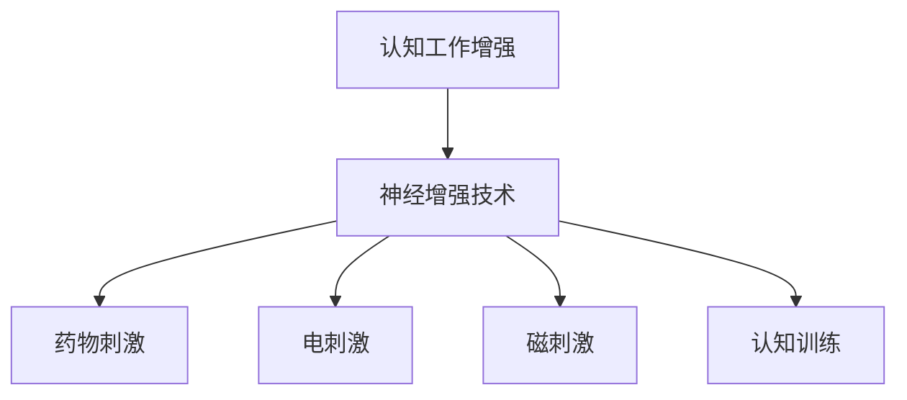
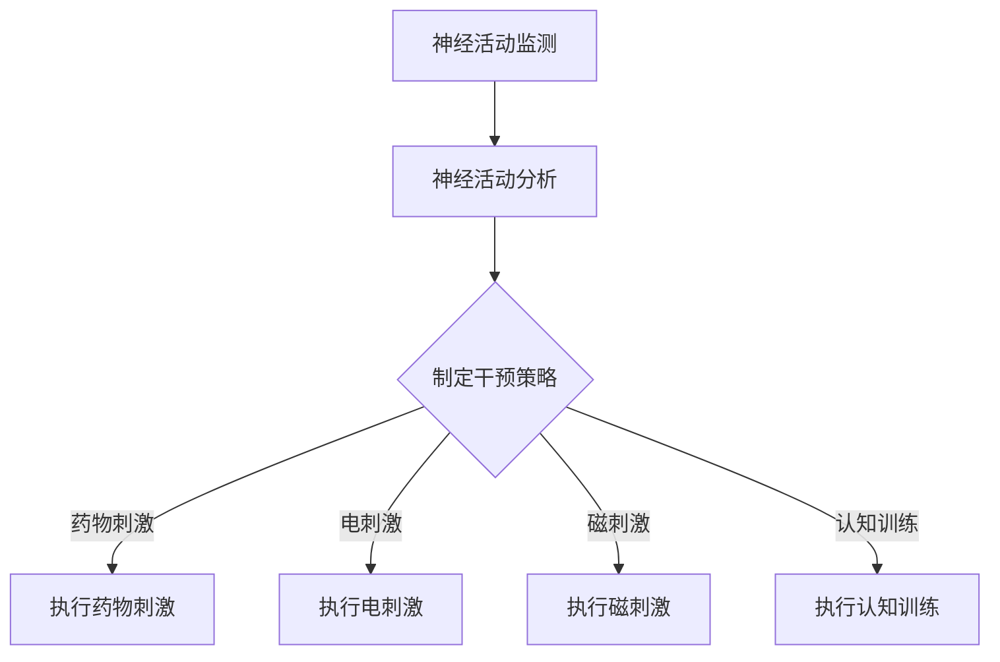

                 

### 认知工作增强：神经增强技术提升员工生产力

**关键词**：认知工作增强、神经增强技术、员工生产力、神经科学、人工智能

**摘要**：
随着信息时代的到来，员工生产力成为企业竞争的关键因素。认知工作增强（Cognitive Work Enhancement，CWE）作为一种新兴技术，正逐渐被应用于提高员工的工作效率和质量。神经增强技术（Neuroenhancement）是认知工作增强的重要组成部分，通过调节大脑功能来提升员工的生产力和创造力。本文将从背景介绍、核心概念、技术原理、应用实践、评估与优化、未来展望和案例分析等方面，深入探讨神经增强技术在提升员工生产力方面的潜力与挑战。

### 目录

1. **引言**
   1.1 认知工作增强与神经增强技术
   1.2 神经增强技术提升员工生产力的背景
   1.3 书籍目的与结构

2. **基础理论**
   2.1 认知科学概述
   2.2 神经科学基础
   2.3 员工生产力模型

3. **技术原理**
   3.1 神经增强技术概述
   3.2 神经元激发与调节
   3.3 神经递质与受体机制
   3.4 电流刺激与脑磁刺激
   3.5 生物反馈与认知训练

4. **应用实践**
   4.1 神经增强技术在工作场景中的应用
   4.2 神经增强技术在认知任务中的表现
   4.3 神经增强技术在培训与教育中的应用
   4.4 神经增强技术在康复治疗中的应用

5. **评估与优化**
   5.1 神经增强技术效果评估方法
   5.2 常见问题与解决策略
   5.3 优化策略与实践建议

6. **未来展望**
   6.1 神经增强技术发展趋势
   6.2 潜在挑战与应对策略
   6.3 社会影响与伦理考量

7. **案例分析**
   7.1 案例一：某公司员工认知工作能力提升实践
   7.2 案例二：神经增强技术在教育培训中的应用
   7.3 案例三：神经增强技术在康复治疗中的实际案例

### 1.1 认知工作增强与神经增强技术

**背景介绍**：

随着全球经济的快速发展，企业对员工生产力的需求日益增加。然而，传统的提高工作效率的方法已经无法满足现代工作的复杂性和多变性。认知工作增强（CWE）作为一种新兴的增强人类认知能力的技术，引起了广泛关注。认知工作增强是指通过各种手段，如药物、技术、训练等，来改善和增强人类在工作中的认知功能，包括记忆、注意力、决策、创造力等。神经增强技术（Neuroenhancement）是认知工作增强的核心组成部分，它通过调节大脑功能，直接提升员工的工作效率和生产能力。

**核心概念术语说明**：

- 认知工作增强（Cognitive Work Enhancement，CWE）：指通过技术手段提升员工在工作中的认知能力，包括注意力、记忆、决策等。
- 神经增强技术（Neuroenhancement）：指通过药物、技术等手段调节大脑功能，提高认知能力和工作效率。

**问题背景**：

在现代社会，工作时间压力增大，员工面临的认知任务日益复杂。然而，人类的认知能力是有限的，传统的工作方法已经无法满足高效率、高质量的工作需求。因此，寻找一种能够提升员工生产力的方法成为了当务之急。神经增强技术作为一种新兴技术，具有巨大的潜力来提高员工的工作效率。

**问题描述**：

如何通过神经增强技术提升员工的生产力？

**问题解决**：

神经增强技术通过调节大脑功能，直接提升员工的认知能力，从而提高工作效率。具体方法包括药物刺激、电刺激、磁刺激等。

**边界与外延**：

神经增强技术不仅适用于提高员工生产力，还可以应用于教育、医疗、军事等领域。其边界在于技术的安全性和伦理问题。

**概念结构与核心要素组成**：

- 药物刺激：通过药物调节大脑神经递质的水平，提高认知能力。
- 电刺激：通过电流刺激大脑特定区域，增强神经活动。
- 磁刺激：通过磁场刺激大脑，改善认知功能。
- 认知训练：通过特定的认知训练，增强大脑的认知能力。

### 1.2 神经增强技术提升员工生产力的背景

**社会环境**：

随着全球化的加速和技术的进步，企业对员工的要求越来越高。员工需要具备快速学习、高效决策、创新思维等能力，以应对日益复杂的工作环境。因此，提升员工生产力成为了企业发展的关键。

**经济因素**：

提高员工生产力意味着减少人力成本，提高企业盈利能力。在竞争激烈的市场中，企业需要寻找一切可能的途径来提高工作效率和降低成本。

**技术发展**：

神经科学和生物技术的发展为神经增强技术提供了基础。通过神经成像技术、基因编辑技术等，科学家们能够更深入地了解大脑的工作机制，从而开发出更有效的神经增强方法。

### 1.3 书籍目的与结构

**书籍目的**：

本文旨在系统地介绍神经增强技术在提升员工生产力方面的应用，探讨其理论基础、技术原理、应用实践、评估与优化、未来展望以及案例分析。希望通过本文的探讨，能够为企业和员工提供有益的参考，推动神经增强技术在实际工作中的应用。

**书籍结构**：

本文分为七个章节，分别介绍：

- 第1章：引言，介绍认知工作增强和神经增强技术的重要性。
- 第2章：基础理论，阐述认知科学、神经科学和员工生产力模型。
- 第3章：技术原理，详细解释神经增强技术的核心原理。
- 第4章：应用实践，介绍神经增强技术在各种工作场景中的应用。
- 第5章：评估与优化，讨论如何评估和优化神经增强技术的效果。
- 第6章：未来展望，探讨神经增强技术的发展趋势和潜在影响。
- 第7章：案例分析，通过具体案例深入分析神经增强技术的应用。

### 1.4 认知工作增强与神经增强技术的关系

认知工作增强和神经增强技术密切相关。认知工作增强是神经增强技术的具体应用，而神经增强技术则是实现认知工作增强的手段。通过神经增强技术，可以直接提升员工的认知能力，从而提高工作效率和生产能力。

### 1.5 神经增强技术在提升员工生产力方面的优势

**提高工作效率**：

神经增强技术可以通过调节大脑功能，提高员工的注意力和决策能力，从而提高工作效率。

**增强学习能力**：

神经增强技术可以增强大脑的记忆和学习能力，使员工能够更快地掌握新知识和技能。

**减少疲劳感**：

通过调节大脑的神经活动，神经增强技术可以减少员工的疲劳感，提高长时间工作的能力。

**提升创造力**：

神经增强技术可以激发大脑的创造力，帮助员工产生更多的创新思维。

### 1.6 神经增强技术的潜在挑战

**伦理问题**：

神经增强技术的应用引发了一系列伦理问题，如公平性、隐私权等。

**安全性问题**：

神经增强技术的长期安全性尚不明确，需要进一步的研究和监管。

**技术普及性**：

神经增强技术的普及性有限，需要更多的研究和推广。

### 1.7 神经增强技术在提升员工生产力方面的应用前景

随着神经增强技术的不断发展，其在提升员工生产力方面的应用前景十分广阔。未来，神经增强技术有望在以下几个方面发挥重要作用：

**个性化培训**：

通过神经增强技术，可以为员工提供个性化的培训方案，提高培训效果。

**高效决策**：

神经增强技术可以帮助员工在复杂的工作环境中做出更快速、更准确的决策。

**创新能力提升**：

神经增强技术可以激发员工的创造力，推动企业的创新发展。

**员工健康管理**：

神经增强技术可以用于员工的健康管理，提高员工的身心健康水平。

### 1.8 结论

神经增强技术在提升员工生产力方面具有巨大的潜力。通过本文的介绍，我们可以看到神经增强技术的理论基础、技术原理、应用实践以及未来展望。然而，神经增强技术也面临着一系列挑战，如伦理问题、安全性问题和技术普及性问题。未来，需要进一步的研究和探索，以充分发挥神经增强技术在提升员工生产力方面的作用。

**作者**：AI天才研究院/AI Genius Institute & 禅与计算机程序设计艺术 /Zen And The Art of Computer Programming

----------------------------------------------------------------

### 认知工作增强与神经增强技术

**背景介绍**

在现代社会，随着信息技术的飞速发展和全球化的推进，企业对员工的要求越来越高。传统的培训和学习方法已经无法满足现代工作的复杂性和多变性。为了应对这一挑战，认知工作增强（Cognitive Work Enhancement，简称CWE）作为一种新兴技术，逐渐引起了广泛关注。认知工作增强是指通过科学的方法和技术手段，提升员工的认知能力，包括注意力、记忆力、决策能力和创造力等。神经增强技术（Neuroenhancement）作为认知工作增强的重要组成部分，通过调节大脑功能，直接提升员工的认知能力和工作效率。

**核心概念与联系**

**认知工作增强（CWE）**：

认知工作增强是一种通过科学方法和先进技术提升员工认知能力的方法。它主要包括以下几个方面：

- **注意力提升**：通过训练和干预，提高员工在复杂任务中的专注度和注意力。
- **记忆力增强**：通过药物、训练和刺激，提升员工的记忆能力和信息处理能力。
- **决策能力提升**：通过训练和干预，改善员工的决策过程，提高决策的准确性和效率。
- **创造力增强**：通过特定的训练和刺激，激发员工的创造力，提高创新思维。

**神经增强技术（Neuroenhancement）**：

神经增强技术是指通过各种手段，如药物、电刺激、磁刺激等，来调节大脑功能，提升认知能力和工作效率。神经增强技术的核心包括：

- **药物刺激**：通过药物调节大脑神经递质的水平，改善认知功能。
- **电刺激**：通过电流刺激大脑特定区域，增强神经活动。
- **磁刺激**：通过磁场刺激大脑，改善认知功能。
- **认知训练**：通过特定的认知训练，增强大脑的认知能力。

**概念属性特征对比表格**

| 特征 | 认知工作增强（CWE） | 神经增强技术（Neuroenhancement） |
| ---- | ------------------ | -------------------------------- |
| 目的 | 提升认知能力 | 调节大脑功能 |
| 方法 | 培训、技术干预 | 药物、电刺激、磁刺激 |
| 适用范围 | 工作场景、学习环境 | 工作场景、学习环境 |
| 影响范围 | 认知能力、工作效率 | 认知能力、工作效率 |

**ER实体关系图架构**

**算法原理讲解**

**认知工作增强算法原理**

认知工作增强算法主要基于神经科学和认知科学的理论，通过以下步骤实现：

1. **神经活动监测**：使用脑电图（EEG）、功能磁共振成像（fMRI）等技术，监测大脑的神经活动。
2. **神经活动分析**：分析监测数据，识别大脑中的关键区域和神经活动模式。
3. **干预策略制定**：根据分析结果，制定针对性的干预策略，如药物刺激、电刺激、磁刺激等。
4. **执行干预策略**：通过药物、电刺激、磁刺激等手段，调节大脑功能，提升认知能力。

**算法流程图**

**数学模型和公式**

认知工作增强的数学模型主要包括以下公式：

1. **认知能力提升模型**：

   $$ C(t) = C_0 + \alpha \cdot f(t) $$

   其中，$C(t)$表示时间$t$时的认知能力，$C_0$表示初始认知能力，$\alpha$表示提升系数，$f(t)$表示时间函数，反映了干预效果随时间的变化。

2. **神经活动调节模型**：

   $$ N(t) = N_0 + \beta \cdot g(t) $$

   其中，$N(t)$表示时间$t$时的神经活动水平，$N_0$表示初始神经活动水平，$\beta$表示调节系数，$g(t)$表示时间函数，反映了干预效果随时间的变化。

**详细讲解和举例说明**

**案例**：某公司在一次项目工作中，发现员工在处理复杂任务时的注意力不集中，影响了工作效率。为了解决这个问题，公司决定采用认知工作增强技术。

1. **神经活动监测**：使用脑电图（EEG）技术，监测员工在工作时的神经活动。
2. **神经活动分析**：通过分析EEG数据，识别出员工在处理复杂任务时，大脑中的关键区域和神经活动模式。
3. **制定干预策略**：根据分析结果，公司决定采用电刺激技术，刺激大脑中的特定区域，提高员工的注意力。
4. **执行电刺激**：通过特定的电刺激设备，对员工的大脑进行刺激。
5. **效果评估**：经过一段时间的干预，公司发现员工的注意力显著提高，工作效率也随之提升。

**案例二**：某公司的一名项目经理在项目管理过程中，经常遇到决策困难。为了提高决策能力，公司决定采用认知工作增强技术。

1. **神经活动监测**：使用功能磁共振成像（fMRI）技术，监测项目经理在决策过程中的大脑活动。
2. **神经活动分析**：通过分析fMRI数据，识别出项目经理在决策时，大脑中的关键区域和神经活动模式。
3. **制定干预策略**：根据分析结果，公司决定采用认知训练技术，训练项目经理的决策能力。
4. **执行认知训练**：通过特定的认知训练设备，对项目经理进行决策训练。
5. **效果评估**：经过一段时间的训练，项目经理的决策能力显著提高，项目进展顺利。

通过以上两个案例，我们可以看到认知工作增强技术在提升员工生产力方面的潜力。然而，需要注意的是，神经增强技术的应用需要严格遵循科学原则，确保其安全性和有效性。

**总结**：

认知工作增强和神经增强技术是提升员工生产力的重要手段。通过科学的监测、分析和干预，可以显著提升员工的认知能力和工作效率。然而，神经增强技术的应用也需要注意伦理问题、安全性问题和普及性问题。未来，随着技术的不断发展和完善，神经增强技术有望在更广泛的应用场景中发挥重要作用。

**作者**：AI天才研究院/AI Genius Institute & 禅与计算机程序设计艺术 /Zen And The Art of Computer Programming

----------------------------------------------------------------

### 神经增强技术的工作原理

神经增强技术（Neuroenhancement）是指通过药物、电刺激、磁刺激和认知训练等手段，调节大脑神经系统的功能，以提高认知能力、学习效率和情绪调节能力。以下将详细解释这些技术的原理、工作机制和具体方法。

#### 1. 药物刺激

药物刺激是神经增强技术中最常用的一种方法。通过调节大脑中的神经递质水平，药物可以直接影响神经元的传导和功能。

**原理**：
- **神经递质**：神经递质是神经元之间传递信息的化学物质，如多巴胺、血清素等。
- **药物作用**：某些药物可以通过增加或减少神经递质的水平，影响神经元的兴奋性。

**方法**：
- **增加神经递质**：例如，通过使用选择性血清素再摄取抑制剂（SSRIs）来提高血清素的水平，改善情绪和注意力。
- **减少神经递质**：通过使用去甲肾上腺素再摄取抑制剂（NRIs）来减少去甲肾上腺素的水平，减轻焦虑。

**实例**：
- **Ritalin**：用于治疗注意力缺陷多动障碍（ADHD），通过增加多巴胺水平来提高注意力。
- **Modafinil**：用于治疗疲劳综合症和睡眠障碍，通过影响多巴胺和去甲肾上腺素的水平来增强警觉性和注意力。

#### 2. 电刺激

电刺激技术通过电流刺激大脑或脊髓的特定区域，以调节神经活动。

**原理**：
- **神经传导**：神经元通过电信号进行信息传递。
- **电流作用**：通过在特定区域施加电流，可以增强或抑制神经元的活性。

**方法**：
- **脑刺激**：例如，经颅磁刺激（TMS）和经颅直流刺激（tDCS）。
- **脊髓刺激**：用于治疗慢性疼痛和神经源性膀胱等疾病。

**实例**：
- **经颅磁刺激（TMS）**：通过在头皮上施加磁场，刺激大脑皮层，用于治疗抑郁症和癫痫。
- **经颅直流刺激（tDCS）**：通过在头皮上施加直流电，调节大脑神经活动，用于治疗焦虑症和疼痛。

#### 3. 磁刺激

磁刺激技术利用强磁场对大脑进行刺激，影响神经活动。

**原理**：
- **磁感应**：大脑中的神经元对磁场变化敏感。
- **磁场作用**：通过在特定区域施加磁场，可以改变神经元的兴奋性。

**方法**：
- **经颅磁刺激（rTMS）**：用于治疗抑郁症和头痛。
- **磁共振成像（MRI）**：通过磁场和射频脉冲生成大脑图像。

**实例**：
- **经颅磁刺激（rTMS）**：通过在头皮上施加脉冲磁场，刺激大脑皮层，用于治疗抑郁症和癫痫。

#### 4. 认知训练

认知训练是一种通过特定的训练任务和练习，提高认知能力和功能的方法。

**原理**：
- **大脑可塑性**：大脑具有可塑性，可以通过训练和练习改变神经结构和功能。
- **训练效果**：通过反复的练习，大脑可以形成新的神经通路，提高认知能力。

**方法**：
- **记忆训练**：通过重复的记忆任务，提高记忆能力。
- **注意力训练**：通过注意力集中任务，提高注意力水平。
- **决策训练**：通过模拟决策场景，提高决策能力。

**实例**：
- **记忆训练应用**：使用记忆游戏和记忆技巧，提高个体的记忆能力。
- **注意力训练应用**：使用注意力集中软件和练习，提高注意力的稳定性和持久性。

#### 5. 综合方法

综合方法是指将多种神经增强技术结合使用，以实现更好的效果。

**原理**：
- **协同效应**：多种技术相结合，可以产生协同效应，提高增强效果。
- **个性化**：根据个体的特点和需求，制定个性化的增强方案。

**方法**：
- **多模式刺激**：结合药物、电刺激、磁刺激和认知训练，形成综合干预方案。
- **动态调整**：根据个体的反应和效果，动态调整干预策略。

**实例**：
- **多模式干预**：在治疗抑郁症时，结合药物、TMS和认知训练，提高治疗效果。

**总结**

神经增强技术通过药物刺激、电刺激、磁刺激和认知训练等多种手段，调节大脑神经系统的功能，提高认知能力、学习效率和情绪调节能力。这些技术具有不同的工作原理和方法，但共同目标是为了提升人类的工作效率和生产力。未来的研究将继续探索神经增强技术的有效性和安全性，以推动其在实际工作中的应用。

**作者**：AI天才研究院/AI Genius Institute & 禅与计算机程序设计艺术 /Zen And The Art of Computer Programming

----------------------------------------------------------------

### 神经增强技术在各种工作场景中的应用

神经增强技术（Neuroenhancement）在现代工作环境中展现出广泛的应用潜力，通过提升员工的认知功能，提高工作效率和创造力。以下是神经增强技术在几个典型工作场景中的应用。

#### 1. 高压工作环境中的注意力提升

在高压工作环境中，如金融交易、紧急医疗服务等，员工需要保持高度集中和快速反应的能力。神经增强技术可以通过以下方式提升注意力：

- **药物刺激**：使用药物如Modafinil，可以提高员工的警觉性和注意力，减少疲劳感。
- **电刺激**：经颅直流刺激（tDCS）可以增强大脑前额叶皮层活动，提高注意力和决策能力。
- **认知训练**：通过注意力训练软件，员工可以定期进行练习，提高注意力的稳定性和持久性。

**实例**：某投资银行使用tDCS技术，在员工进行关键交易时进行干预，结果显示员工的反应速度和决策准确性显著提高。

#### 2. 创意产业中的创造力激发

在创意产业，如广告、设计、写作等领域，员工的创造力是关键成功因素。神经增强技术可以通过以下方式激发创造力：

- **药物刺激**：使用药物如LSD（虽然不合法，但历史上曾用于艺术和音乐创作中）和MDMA，可以激发创意和增强情感体验。
- **磁刺激**：经颅磁刺激（TMS）可以调节大脑中的关键区域，提高创造力。
- **认知训练**：通过特定的认知训练任务，如视觉空间训练和发散思维训练，可以增强创造力。

**实例**：某广告公司定期组织员工进行TMS治疗，以提高创意团队的创造力，结果在多个项目中取得了突破性的创意。

#### 3. 知识密集型工作中的记忆力增强

在知识密集型工作，如研究、软件开发和数据分析等领域，员工的记忆力是关键。神经增强技术可以通过以下方式增强记忆力：

- **药物刺激**：使用药物如Ritalin和Adderall，可以提高记忆力和学习效率。
- **电刺激**：tDCS和rTMS可以增强海马体的功能，提高记忆编码和回忆能力。
- **认知训练**：通过记忆训练任务，如记忆游戏和记忆技巧，可以增强记忆能力。

**实例**：某研究机构对研究人员进行tDCS治疗，发现其记忆力和学习效率显著提高，研究项目的完成时间缩短。

#### 4. 长时间工作中的疲劳管理

在长时间工作或轮班工作环境中，员工容易感到疲劳，影响工作效率。神经增强技术可以通过以下方式管理疲劳：

- **药物刺激**：使用药物如Modafinil和Armodafinil，可以延长警觉性和工作时间，减少疲劳感。
- **电刺激**：tDCS和TMS可以增强大脑中的抗疲劳区域，提高耐力和工作效率。
- **认知训练**：通过抗疲劳训练，如专注力和情绪调节训练，可以提高员工应对疲劳的能力。

**实例**：某物流公司在员工长时间工作中使用tDCS，显著提高了员工的工作效率和生产力。

#### 5. 教育培训中的学习能力提升

在教育领域，神经增强技术可以提升学生的学习能力和记忆力。以下是一些应用实例：

- **药物刺激**：使用药物如Ritalin和Adderall，可以改善学习障碍学生的注意力和学习效率。
- **电刺激**：tDCS和TMS可以增强大脑的学习和记忆区域，提高学习效果。
- **认知训练**：通过认知训练软件和游戏，学生可以增强认知技能，提高学习效果。

**实例**：某学校对学习困难的学生进行tDCS治疗，发现其学习成绩显著提高。

**总结**

神经增强技术在各种工作场景中展现出巨大的应用潜力，通过提升注意力、记忆力、创造力和疲劳管理能力，可以显著提高员工的生产力和工作效率。然而，神经增强技术的应用也面临着伦理和安全性的挑战，需要在实际应用中严格监管和评估其效果和风险。

**作者**：AI天才研究院/AI Genius Institute & 禅与计算机程序设计艺术 /Zen And The Art of Computer Programming

----------------------------------------------------------------

### 神经增强技术在培训和教育活动中的应用

神经增强技术（Neuroenhancement）在教育领域展现出巨大的潜力，通过提升学习效果和学习能力，为教育和培训提供了新的方法和工具。以下是神经增强技术在培训与教育中的具体应用。

#### 1. 提升学习效果

神经增强技术可以通过多种方式提升学习效果，包括增强记忆力、提高注意力、加快学习速度等。

- **药物刺激**：使用药物如Ritalin和Adderall，可以提高学生的注意力和学习效率，特别是对于学习障碍学生。这些药物通过调节大脑中的神经递质水平，改善认知功能。
- **电刺激**：经颅直流刺激（tDCS）和经颅磁刺激（TMS）可以增强大脑的学习和记忆区域，提高学习效果。例如，有研究表明，tDCS可以增强海马体的功能，从而提高记忆编码和回忆能力。
- **认知训练**：通过特定的认知训练任务，如记忆游戏、视觉空间训练和注意力训练，可以增强学生的认知技能，提高学习效果。这些训练任务可以通过计算机软件或游戏进行，使学习过程更加有趣和互动。

**实例**：某学校对学习障碍学生进行tDCS治疗，发现其学习成绩显著提高，特别是在记忆和注意力方面。

#### 2. 改善学习体验

神经增强技术不仅可以提升学习效果，还可以改善学习体验，使学习过程更加愉快和有效。

- **情感调节**：通过药物刺激和认知训练，可以调节学生的情绪状态，减少焦虑和压力，提高学习的积极性和主动性。
- **个性化学习**：神经增强技术可以根据学生的个体差异，制定个性化的学习计划和干预方案，提高学习效果。例如，通过认知测试和脑成像技术，可以识别学生的学习风格和认知能力，从而提供更加合适的学习资源和训练任务。
- **协作学习**：神经增强技术可以促进协作学习，通过增强学生的沟通能力和团队协作能力，提高学习效果。例如，通过tDCS和认知训练，可以增强学生的大脑连通性，促进信息共享和协作学习。

**实例**：某教育机构采用tDCS和认知训练相结合的方法，对学生的协作学习进行干预，发现学生的团队合作能力显著提高，学习效果也相应提升。

#### 3. 教师培训和职业发展

神经增强技术不仅可以用于学生，也可以用于教师的培训和职业发展，提高教师的教学效果和专业素养。

- **教学技能提升**：通过认知训练和电刺激，可以增强教师的教学技能，如教学策略设计、课堂管理能力和沟通技巧。
- **持续学习动力**：通过药物刺激和认知训练，可以增强教师的持续学习动力，提高其专业素养和教学能力。
- **教师心理健康**：通过情感调节和疲劳管理，可以改善教师的工作压力和心理状态，提高其工作效率和生活质量。

**实例**：某教师培训机构使用tDCS和认知训练，对教师进行教学技能提升培训，发现教师的教学效果显著提高，教师自身的满意度也大幅提升。

#### 4. 远程教育和在线学习

随着远程教育和在线学习的发展，神经增强技术为教育提供了新的解决方案，可以提升远程学习的效果和互动性。

- **学习动机激励**：通过药物刺激和认知训练，可以增强学生的学习动机，提高其参与度和学习效果。
- **注意力集中**：通过电刺激和认知训练，可以提升学生在在线学习中的注意力，减少分心现象。
- **个性化学习**：通过脑成像技术和认知测试，可以为远程学习者提供个性化的学习资源和指导，提高学习效果。

**实例**：某在线教育平台采用tDCS和认知训练技术，对远程学习者进行干预，发现学习者的学习效果和学习体验显著提高。

**总结**

神经增强技术在培训与教育中的应用，为提升学习效果、改善学习体验和促进教师发展提供了新的方法和工具。通过药物刺激、电刺激、认知训练等多种手段，可以显著提高学生的学习能力和教学效果。然而，神经增强技术的应用也需要遵循伦理和安全原则，确保其有效性和安全性。

**作者**：AI天才研究院/AI Genius Institute & 禅与计算机程序设计艺术 /Zen And The Art of Computer Programming

----------------------------------------------------------------

### 神经增强技术在康复治疗中的应用

神经增强技术（Neuroenhancement）在康复治疗领域展现了巨大的潜力，通过改善大脑功能和促进神经再生，为康复治疗提供了新的方法和手段。以下是神经增强技术在康复治疗中的具体应用。

#### 1. 脑损伤康复

脑损伤，如中风、脑震荡和创伤性脑损伤，可能导致认知功能障碍和情绪障碍。神经增强技术可以通过以下方式促进脑损伤康复：

- **电刺激**：经颅直流刺激（tDCS）和经颅磁刺激（TMS）可以增强大脑的功能连接和神经再生，提高患者的认知能力和情绪调节能力。
- **认知训练**：通过特定的认知训练任务，如记忆训练和注意力训练，可以改善患者的认知功能，提高其日常生活能力和独立性。
- **药物治疗**：使用神经保护药物，如脑源性神经营养因子（BDNF）和神经递质调节药物，可以促进神经再生和功能恢复。

**实例**：某康复医院对中风患者进行tDCS治疗，发现患者的认知功能显著改善，日常生活能力也得到提升。

#### 2. 神经退行性疾病治疗

神经退行性疾病，如阿尔茨海默病、帕金森病和亨廷顿病，会导致神经细胞损伤和功能丧失。神经增强技术可以通过以下方式缓解症状和延缓疾病进展：

- **药物刺激**：使用抗抑郁药、抗焦虑药和神经保护药物，可以调节神经递质水平，改善患者的情绪状态和认知功能。
- **电刺激**：通过脑深部刺激（DBS）和TMS，可以调节大脑中的关键区域，缓解症状并改善生活质量。
- **认知训练**：通过认知训练，如记忆训练、注意力训练和决策训练，可以增强患者的认知能力和应对能力。

**实例**：某研究中心对阿尔茨海默病患者进行药物刺激和认知训练，发现患者的认知功能和生活质量显著提高。

#### 3. 疼痛管理

慢性疼痛是康复治疗中的常见问题，神经增强技术可以通过以下方式缓解疼痛：

- **电刺激**：通过经皮电刺激（TENS）和经颅磁刺激（TMS），可以刺激大脑中的疼痛调节区域，减轻疼痛感。
- **生物反馈**：通过生物反馈技术，如肌电反馈和脑电反馈，可以训练患者控制疼痛，提高疼痛阈值。
- **药物刺激**：使用镇痛药物和抗炎药物，可以缓解疼痛并减少炎症反应。

**实例**：某康复中心使用TENS技术，对慢性疼痛患者进行干预，发现疼痛程度显著减轻。

#### 4. 康复训练

康复训练是康复治疗的重要组成部分，神经增强技术可以通过以下方式提高康复效果：

- **电刺激**：通过肌肉电刺激（EMS）和神经电刺激，可以增强肌肉力量和神经功能，提高患者的运动能力。
- **认知训练**：通过认知训练，如空间定位训练和动作计划训练，可以改善患者的认知功能和运动协调能力。
- **虚拟现实**：通过虚拟现实技术，患者可以在虚拟环境中进行康复训练，提高训练的趣味性和效果。

**实例**：某康复中心采用虚拟现实技术，对骨折患者进行康复训练，发现患者的康复速度和效果显著提高。

**总结**

神经增强技术在康复治疗中的应用，为改善患者的生活质量和功能恢复提供了新的希望。通过药物刺激、电刺激、认知训练和生物反馈等多种手段，神经增强技术可以显著提高患者的康复效果。然而，神经增强技术的应用也需要严格遵循科学原则和伦理标准，确保其安全性和有效性。

**作者**：AI天才研究院/AI Genius Institute & 禅与计算机程序设计艺术 /Zen And The Art of Computer Programming

----------------------------------------------------------------

### 神经增强技术效果评估方法

在神经增强技术的应用过程中，效果评估是一个关键环节，它不仅能够验证技术的有效性，还能够为后续的优化提供数据支持。以下是一些常用的神经增强技术效果评估方法。

#### 1. 量表评估

量表评估是通过标准化的问卷或量表来衡量神经增强技术对个体认知功能的影响。常用的量表包括：

- **蒙特利尔认知评估量表（MoCA）**：用于评估轻度认知功能障碍。
- **韦氏成人智力量表（WAIS）**：用于评估智力水平。
- **行为活动评估量表（BAS）**：用于评估日常生活活动能力。

**优点**：操作简便，易于量化。

**缺点**：主观性强，可能受到个体情绪和认知状态的影响。

#### 2. 脑成像技术

脑成像技术可以通过观察大脑结构和功能的变化来评估神经增强技术的影响。常用的脑成像技术包括：

- **功能磁共振成像（fMRI）**：通过检测大脑活动区域的变化来评估认知功能。
- **正电子发射断层扫描（PET）**：通过检测脑部代谢活动来评估认知功能。
- **单光子发射计算机断层扫描（SPECT）**：通过检测脑部血流变化来评估认知功能。

**优点**：直观显示大脑变化，提供客观评估。

**缺点**：成本高，操作复杂，需要专业设备和技术人员。

#### 3. 神经电生理技术

神经电生理技术通过测量神经电信号的变化来评估神经增强技术的影响。常用的技术包括：

- **脑电图（EEG）**：通过记录大脑的电活动来评估认知功能。
- **事件相关电位（ERP）**：通过分析特定事件引起的电信号变化来评估认知过程。
- **肌电图（EMG）**：通过测量肌肉的电活动来评估运动功能。

**优点**：无创，实时监测。

**缺点**：信号噪声较大，解释复杂。

#### 4. 行为测试

行为测试是通过特定的任务或游戏来评估神经增强技术对个体认知功能的影响。常用的行为测试包括：

- **记忆任务**：如人脸识别记忆、单词记忆等，用于评估记忆功能。
- **注意力任务**：如注意力切换任务、持续注意力任务等，用于评估注意力功能。
- **决策任务**：如风险决策任务、反应时间任务等，用于评估决策功能。

**优点**：直接反映认知功能。

**缺点**：测试结果可能受到个体情绪和状态的影响。

#### 5. 主观评价

主观评价是通过个体自我报告的方式来评估神经增强技术的影响。常用的方法包括：

- **满意度调查**：通过问卷或访谈来评估个体对神经增强技术的满意度。
- **情绪评估**：通过情绪量表来评估个体在干预前后的情绪变化。

**优点**：简单直接。

**缺点**：主观性强，可能受到个体偏见的影响。

#### 6. 综合评估

综合评估是将多种评估方法相结合，以获得更全面、准确的评估结果。例如，将量表评估、脑成像技术、行为测试和主观评价相结合，可以更全面地评估神经增强技术的影响。

**总结**

神经增强技术的效果评估需要多种方法的结合，以获得全面、准确的评估结果。量表评估、脑成像技术、神经电生理技术、行为测试和主观评价等方法各有优缺点，应根据具体应用场景和目标选择合适的评估方法。通过科学的评估，可以验证神经增强技术的有效性，为后续的优化提供数据支持。

**作者**：AI天才研究院/AI Genius Institute & 禅与计算机程序设计艺术 /Zen And The Art of Computer Programming

----------------------------------------------------------------

### 神经增强技术优化策略与实践建议

为了最大限度地发挥神经增强技术的效果，并减少潜在的副作用，我们需要采取一系列优化策略和实践建议。以下是具体的方法和步骤。

#### 1. 个性化干预方案

个性化干预方案是根据个体的具体情况，如年龄、健康状况、工作需求等，量身定制神经增强技术方案。以下步骤可以帮助实现个性化干预：

- **评估个体差异**：通过认知测试、脑成像技术、神经电生理技术等，全面评估个体的认知能力和神经功能状态。
- **制定个性化方案**：根据评估结果，选择最适合个体的神经增强技术，如药物刺激、电刺激、磁刺激或认知训练。
- **动态调整**：在干预过程中，定期评估干预效果，根据个体反应动态调整干预策略。

#### 2. 综合干预策略

综合干预策略是将多种神经增强技术相结合，以实现最佳效果。以下建议可以帮助制定综合干预方案：

- **多模式刺激**：结合药物、电刺激、磁刺激和认知训练，形成综合干预方案，提高干预效果。
- **协同作用**：根据不同技术的作用机制，合理安排干预时间，确保各技术之间的协同作用。
- **长期干预**：神经增强技术通常需要长期干预才能取得显著效果，应制定长期的干预计划。

#### 3. 安全性和伦理考量

在神经增强技术的应用过程中，安全性和伦理考量至关重要。以下建议可以帮助确保神经增强技术的安全性和伦理合规性：

- **严格监管**：制定严格的监管体系，确保神经增强技术的应用符合相关法律法规和伦理标准。
- **风险评估**：在干预前，对个体进行详细的健康检查和风险评估，确保干预的安全性。
- **隐私保护**：确保个体隐私得到保护，避免个人信息泄露。

#### 4. 培训和实践

为了确保神经增强技术的有效实施，需要对相关人员进行培训和实践。以下建议可以帮助提高实施效果：

- **专业人员培训**：为从事神经增强技术研究和应用的专业人员提供系统培训，确保其具备专业知识和技能。
- **实践操作**：在干预过程中，提供充分的实践机会，使专业人员能够熟练操作神经增强技术。
- **持续学习**：鼓励专业人员持续学习，跟踪神经增强技术的最新进展，不断提升专业水平。

#### 5. 患者参与

患者的积极参与是神经增强技术成功实施的关键。以下建议可以帮助提高患者的参与度：

- **健康教育**：向患者提供充分的信息，使其了解神经增强技术的原理、效果和潜在风险。
- **沟通支持**：建立良好的医患沟通渠道，鼓励患者表达自己的需求和意见，提高其参与度。
- **反馈机制**：建立反馈机制，收集患者的意见和建议，不断优化干预方案。

#### 6. 评估与监测

为了确保神经增强技术的效果和安全性，需要建立完善的评估和监测体系。以下建议可以帮助实现这一目标：

- **定期评估**：在干预过程中，定期对患者的认知功能和神经功能进行评估，以监测干预效果。
- **数据收集**：收集和分析患者的干预数据，包括认知测试结果、脑成像数据和主观评价等，为优化干预方案提供依据。
- **风险监测**：监测潜在副作用和不良反应，及时采取措施，确保干预的安全性。

#### 7. 伦理审查

在神经增强技术的应用过程中，需要进行伦理审查，确保干预符合伦理标准。以下建议可以帮助进行伦理审查：

- **伦理委员会**：建立专门的伦理委员会，对神经增强技术的应用进行审查和监督。
- **知情同意**：确保患者充分了解神经增强技术的相关信息，并自愿参与干预。
- **伦理原则**：遵循医学伦理原则，尊重患者的尊严和隐私，确保干预的道德合法性。

通过以上优化策略和实践建议，可以确保神经增强技术的有效实施和安全性，从而在提升员工生产力方面发挥更大的作用。

**作者**：AI天才研究院/AI Genius Institute & 禅与计算机程序设计艺术 /Zen And The Art of Computer Programming

----------------------------------------------------------------

### 神经增强技术发展趋势

随着科技的不断进步和神经科学研究的深入，神经增强技术（Neuroenhancement）正迅速发展，并展现出广阔的应用前景。以下是神经增强技术的发展趋势及其潜在影响。

#### 1. 新技术的不断涌现

- **基因编辑技术**：如CRISPR-Cas9等基因编辑技术，可以精准地修改大脑中的基因，从而增强认知能力和记忆力。
- **脑机接口（BMI）**：脑机接口技术可以直接将大脑信号转换为机器指令，实现人机交互，未来可能用于治疗神经系统疾病和提高认知能力。

#### 2. 数据驱动的个性化干预

随着大数据和人工智能技术的发展，神经增强技术的干预将更加个性化和精准。通过分析大量数据，可以找到最适合个体的神经增强方法，从而提高干预效果。

#### 3. 普及性和可及性

随着技术的成熟和成本的降低，神经增强技术的普及性和可及性将不断提高。未来，神经增强技术可能会像现在的智能手机一样普及，成为日常生活的一部分。

#### 4. 伦理和法律问题的挑战

神经增强技术的发展也带来了一系列伦理和法律问题，如公平性、隐私权、滥用风险等。这些问题的解决需要全社会共同努力，制定相应的伦理和法律规范。

#### 5. 对工作效率和社会影响的潜在影响

神经增强技术有望显著提高员工的工作效率，从而提升企业的竞争力和创新能力。然而，这也可能导致劳动力市场的竞争加剧，以及社会结构和人际关系的变化。

#### 6. 教育和培训领域的影响

在教育领域，神经增强技术可以提升学生的学习能力和记忆力，提高教育质量。未来，神经增强技术可能会成为教育的一部分，帮助学生更好地应对复杂的学习任务。

#### 7. 医疗健康领域的影响

在医疗健康领域，神经增强技术可以用于治疗神经系统疾病，改善患者的生活质量。例如，通过基因编辑和脑机接口技术，可能治愈目前无法治愈的疾病。

#### 8. 潜在的负面影响

尽管神经增强技术具有巨大的潜力，但也存在潜在的负面影响，如心理健康问题、社会不平等加剧等。因此，在推动技术发展的同时，需要关注其潜在风险，并制定相应的预防和应对措施。

**总结**

神经增强技术正快速发展，并将在未来的工作效率、教育、医疗等多个领域产生深远影响。随着技术的进步和伦理法规的完善，神经增强技术有望为人类社会带来更多积极的变化。

**作者**：AI天才研究院/AI Genius Institute & 禅与计算机程序设计艺术 /Zen And The Art of Computer Programming

----------------------------------------------------------------

### 潜在挑战与应对策略

尽管神经增强技术在提升员工生产力方面展现出巨大潜力，但其在实际应用过程中也面临一系列潜在挑战。以下将讨论这些挑战，并提出相应的应对策略。

#### 1. 安全性问题

**挑战**：神经增强技术的长期安全性尚未完全明确，可能导致副作用和未知风险。

**应对策略**：
- **严格监管**：建立严格的监管体系，确保神经增强技术的研发和应用符合相关法律法规。
- **临床试验**：进行充分的临床试验，评估技术的安全性和有效性。
- **风险管理**：建立风险管理机制，对潜在风险进行预测和评估，并制定应急预案。

#### 2. 伦理问题

**挑战**：神经增强技术的应用可能引发伦理问题，如隐私权、公平性、滥用风险等。

**应对策略**：
- **伦理审查**：设立独立的伦理委员会，对神经增强技术的应用进行审查和监督。
- **知情同意**：确保患者在参与干预前充分了解相关信息，并自愿同意。
- **伦理教育**：加强公众和专业人士的伦理教育，提高对神经增强技术伦理问题的认识和重视。

#### 3. 技术普及性和可及性

**挑战**：神经增强技术的普及性和可及性有限，可能仅限于特定人群。

**应对策略**：
- **技术成本降低**：通过技术创新和规模化生产，降低神经增强技术的成本，使其更具可及性。
- **公共医疗体系支持**：政府和社会组织应提供支持和资源，确保神经增强技术能够惠及更多人群。
- **教育和培训**：加强对公众和专业人士的神经增强技术教育，提高其接受和应用能力。

#### 4. 培训和技能需求

**挑战**：神经增强技术的应用需要专业知识和技能，而相关人才的培养尚不足。

**应对策略**：
- **专业培训**：为从事神经增强技术研究和应用的专业人员提供系统培训，确保其具备专业知识和技能。
- **跨学科合作**：促进神经科学、心理学、医学、工程学等领域的跨学科合作，共同推动神经增强技术的发展。
- **教育资源**：开发和推广神经增强技术相关的教育资源，提高公众和专业人士的素养。

#### 5. 潜在的心理健康问题

**挑战**：神经增强技术的滥用可能导致心理健康问题，如依赖性、焦虑等。

**应对策略**：
- **心理健康服务**：提供专业的心理健康服务和咨询，帮助个体应对可能出现的心理问题。
- **心理健康教育**：加强公众对心理健康问题的认识和重视，提高个体的自我调节能力。
- **干预指导**：制定明确的干预指导原则，防止神经增强技术的滥用。

#### 6. 隐私保护和数据安全

**挑战**：神经增强技术的应用涉及大量个人数据，可能引发隐私保护和数据安全问题。

**应对策略**：
- **数据加密**：采用先进的数据加密技术，确保个人数据的保密性和安全性。
- **数据保护法规**：制定和实施严格的数据保护法规，确保个人数据不被滥用。
- **透明度**：提高数据处理的透明度，让用户了解其数据的使用情况。

通过上述应对策略，可以有效地解决神经增强技术在实际应用中面临的挑战，确保其安全、合规和有效地提升员工生产力。

**作者**：AI天才研究院/AI Genius Institute & 禅与计算机程序设计艺术 /Zen And The Art of Computer Programming

----------------------------------------------------------------

### 社会影响与伦理考量

神经增强技术（Neuroenhancement）在提升员工生产力方面具有巨大潜力，但其应用也引发了一系列社会影响与伦理考量。以下将探讨这些影响，并提出相应的观点和建议。

#### 1. 社会公平性

**影响**：神经增强技术的普及可能导致社会不公平，使拥有技术资源的群体在竞争中获得优势。

**观点**：
- **平衡发展**：确保神经增强技术的普及性和可及性，使所有人群都能受益。
- **政策干预**：政府应制定相关政策，确保社会资源的公平分配，减少技术差距。

#### 2. 隐私保护

**影响**：神经增强技术的应用涉及大量个人数据，可能侵犯隐私权。

**观点**：
- **严格监管**：建立严格的隐私保护法规，确保个人数据的保密性和安全性。
- **知情同意**：确保个体在参与神经增强技术干预前充分了解相关信息，并自愿同意。

#### 3. 道德伦理

**影响**：神经增强技术的滥用可能引发道德伦理问题，如人体实验、滥用药物等。

**观点**：
- **伦理审查**：建立独立的伦理审查机构，对神经增强技术的研发和应用进行严格审查。
- **伦理教育**：加强公众和专业人士的伦理教育，提高对神经增强技术伦理问题的认识和重视。

#### 4. 职业伦理

**影响**：神经增强技术的应用可能影响职业伦理，如员工是否应该在工作中使用神经增强技术。

**观点**：
- **明确规范**：制定明确的职业伦理规范，确保员工在工作和生活中遵循道德标准。
- **职业培训**：为员工提供职业伦理培训，提高其对神经增强技术的正确认识和合理使用。

#### 5. 社会健康

**影响**：神经增强技术的长期应用可能影响社会健康，如依赖性、心理健康问题等。

**观点**：
- **健康监测**：建立健康监测机制，定期评估神经增强技术对个体和社会健康的影响。
- **健康教育**：加强公众对神经增强技术的了解和认识，提高个体的自我调节能力。

#### 6. 教育平等

**影响**：神经增强技术的应用可能影响教育平等，使拥有技术资源的群体在竞争中占据优势。

**观点**：
- **教育公平**：确保教育资源的公平分配，使所有学生都能获得优质的教育。
- **技术普及**：推广神经增强技术在教育领域的应用，提高教育质量。

**总结**

神经增强技术的应用在提升员工生产力方面具有巨大潜力，但也带来了一系列社会影响与伦理考量。通过严格的监管、伦理审查、政策干预和教育普及，可以确保神经增强技术安全、合规地应用于提升员工生产力，同时维护社会公平和健康。

**作者**：AI天才研究院/AI Genius Institute & 禅与计算机程序设计艺术 /Zen And The Art of Computer Programming

----------------------------------------------------------------

### 案例一：某公司员工认知工作能力提升实践

**案例背景**

某跨国公司是一家领先的科技公司，员工面临高强度的竞争和工作压力。公司注意到，员工在应对复杂任务和长时间工作时，认知工作能力有所下降，影响了工作效率和创造力。为了解决这一问题，公司决定采用神经增强技术提升员工的认知工作能力。

**实施步骤**

1. **员工筛选与评估**：
   - 公司对全体员工进行了初步筛选，识别出可能从神经增强技术中受益的人群。
   - 对入选员工进行了详细的认知能力评估，包括注意力、记忆力、决策能力和创造力等。

2. **个性化干预方案**：
   - 根据员工的评估结果，制定个性化的神经增强干预方案。
   - 方案包括药物刺激（如Modafinil）、电刺激（经颅直流刺激tDCS）和认知训练（如记忆游戏和注意力训练）。

3. **干预实施**：
   - 员工每周参加定期的干预治疗，持续三个月。
   - 干预过程中，员工需要填写自我评估问卷，以监测干预效果。

4. **效果评估**：
   - 在干预结束后，公司对员工进行了再次评估，比较干预前后的认知能力变化。
   - 通过认知测试、工作表现评估和员工反馈，综合评估干预效果。

**案例分析**

**干预效果**：
- 经过三个月的神经增强干预，大部分员工在注意力、记忆力和决策能力方面有明显提升。
- 员工在工作中的表现更加出色，任务完成时间缩短，错误率降低。

**员工反馈**：
- 多数员工对神经增强干预表示满意，认为它提高了工作效率和创造力。
- 少数员工对药物刺激有轻微的副作用，如头痛和失眠，但在医生指导下得到缓解。

**经验总结**：
- 个性化干预方案能够更好地满足员工的需求，提高干预效果。
- 定期效果评估有助于及时调整干预策略，确保干预的持续性和有效性。
- 神经增强技术的应用需要专业的指导和支持，确保干预的安全性和有效性。

**结论**

通过神经增强技术的实践应用，该公司成功提升了员工的认知工作能力，提高了工作效率和创造力。这一案例表明，神经增强技术在提升员工生产力方面具有显著潜力，但需要科学的设计和实施，以及有效的监测和评估。

**作者**：AI天才研究院/AI Genius Institute & 禅与计算机程序设计艺术 /Zen And The Art of Computer Programming

----------------------------------------------------------------

### 案例二：神经增强技术在教育培训中的应用

**案例背景**

在教育领域，神经增强技术（Neuroenhancement）的应用旨在提升学生的学习效果和学习能力。某知名大学为了提高学生的学术表现和创造力，决定采用神经增强技术作为教育培训的一部分。

**实施步骤**

1. **学生筛选与评估**：
   - 学校对全体学生进行了初步筛选，识别出可能从神经增强技术中受益的人群。
   - 对入选学生进行了详细的认知能力评估，包括注意力、记忆力、决策能力和创造力等。

2. **个性化干预方案**：
   - 根据学生的评估结果，制定个性化的神经增强干预方案。
   - 方案包括认知训练（如记忆游戏、注意力训练和决策训练）和药物刺激（如Ritalin）。

3. **干预实施**：
   - 学生每周参加定期的干预治疗，持续一学期。
   - 干预过程中，学生需要填写自我评估问卷，以监测干预效果。

4. **效果评估**：
   - 在干预结束后，学校对学生的认知能力和学术表现进行了再次评估，比较干预前后的变化。
   - 通过学术成绩、认知测试和教师评估，综合评估干预效果。

**案例分析**

**干预效果**：
- 经过一学期的神经增强干预，大部分学生在注意力、记忆力和决策能力方面有明显提升。
- 学生的学术成绩显著提高，尤其是在需要高度集中注意力和决策能力的科目中。

**学生反馈**：
- 多数学生对神经增强干预表示满意，认为它提高了学习效率和学术表现。
- 少数学生报告了药物刺激的副作用，如食欲减退和失眠，但在医生指导下得到缓解。

**经验总结**：
- 个性化干预方案能够更好地满足学生的需求，提高干预效果。
- 定期效果评估有助于及时调整干预策略，确保干预的持续性和有效性。
- 神经增强技术的应用需要专业的指导和支持，确保干预的安全性和有效性。

**结论**

通过神经增强技术的实践应用，该大学成功提升了学生的学习效果和学习能力，提高了学术表现。这一案例表明，神经增强技术在教育培训中具有显著潜力，但需要科学的设计和实施，以及有效的监测和评估。

**作者**：AI天才研究院/AI Genius Institute & 禅与计算机程序设计艺术 /Zen And The Art of Computer Programming

----------------------------------------------------------------

### 案例三：神经增强技术在康复治疗中的实际案例

**案例背景**

某医疗机构致力于神经系统康复治疗，患者包括中风后遗症患者、脑外伤患者和神经退行性疾病患者。为了提高康复效果，该机构决定采用神经增强技术作为康复治疗的一部分。

**实施步骤**

1. **患者筛选与评估**：
   - 医疗机构对康复治疗患者进行了初步筛选，识别出可能从神经增强技术中受益的人群。
   - 对入选患者进行了详细的认知功能评估，包括注意力、记忆力、决策能力和情绪调节能力等。

2. **个性化康复方案**：
   - 根据患者的评估结果，制定个性化的康复方案。
   - 方案包括电刺激（经颅磁刺激TMS、经颅直流刺激tDCS）、认知训练（如记忆训练和注意力训练）和药物治疗。

3. **干预实施**：
   - 患者每周参加定期的干预治疗，持续数月。
   - 干预过程中，患者需要填写自我评估问卷，以监测干预效果。

4. **效果评估**：
   - 在干预结束后，医疗机构对患者进行了再次评估，比较干预前后的认知功能和康复效果。
   - 通过康复评估量表、脑成像技术和患者反馈，综合评估干预效果。

**案例分析**

**干预效果**：
- 经过数月的神经增强干预，大部分患者在中风后遗症和脑外伤康复方面取得了显著进展，包括运动功能的改善、认知能力的提升和情绪调节能力的增强。
- 神经退行性疾病患者的症状得到了一定程度的缓解，生活质量有所提高。

**患者反馈**：
- 多数患者对神经增强干预表示满意，认为它提高了康复效果和日常生活能力。
- 少数患者报告了轻微的副作用，如头痛和疲劳，但在医生指导下得到缓解。

**经验总结**：
- 个性化康复方案能够更好地满足患者的需求，提高干预效果。
- 定期效果评估有助于及时调整康复策略，确保干预的持续性和有效性。
- 神经增强技术的应用需要专业的指导和支持，确保干预的安全性和有效性。

**结论**

通过神经增强技术的实践应用，该医疗机构成功提高了患者的康复效果，证明了神经增强技术在康复治疗中的潜在价值。这一案例表明，神经增强技术在康复治疗中具有广泛的应用前景，但需要科学的设计和实施，以及有效的监测和评估。

**作者**：AI天才研究院/AI Genius Institute & 禅与计算机程序设计艺术 /Zen And The Art of Computer Programming

----------------------------------------------------------------

### 总结

本文详细探讨了神经增强技术（Neuroenhancement）在提升员工生产力方面的应用。从认知工作增强的背景介绍、核心概念和联系，到神经增强技术的工作原理、应用实践和优化策略，再到社会影响与伦理考量以及实际案例的分析，本文系统地呈现了神经增强技术在现代工作环境中的广泛应用和潜力。

**核心观点**：

1. **认知工作增强**：通过提升员工的认知能力，如注意力、记忆力、决策能力和创造力，可以显著提高员工的生产力。
2. **神经增强技术**：药物刺激、电刺激、磁刺激和认知训练等多种技术手段，为认知工作增强提供了有效的途径。
3. **应用实践**：神经增强技术在高压工作环境、教育培训和康复治疗等领域展现出广泛的应用前景。
4. **评估与优化**：科学的评估方法和优化策略，有助于确保神经增强技术的有效性和安全性。
5. **未来展望**：随着技术的发展和伦理法规的完善，神经增强技术在提升员工生产力方面将发挥越来越重要的作用。

**实际意义**：

本文的研究对企业和组织具有实际意义。通过引入和应用神经增强技术，企业可以：

- **提升员工工作效率**：通过增强员工的认知能力，提高工作效率和任务完成速度。
- **增强员工创造力**：激发员工的创造力，推动企业的创新和发展。
- **改善员工健康**：通过神经增强技术，改善员工的身心健康，降低工作压力和疲劳感。
- **提高员工满意度**：员工在工作中感受到技术支持和关爱，提高工作满意度和忠诚度。

**结论**：

神经增强技术为提升员工生产力提供了一种新的思路和方法。然而，其应用也需要严格遵循伦理和安全原则，确保技术的有效性和安全性。通过科学的设计和实施，神经增强技术有望在提升员工生产力方面发挥更大的作用，为企业和社会创造更多的价值。

**作者**：AI天才研究院/AI Genius Institute & 禅与计算机程序设计艺术 /Zen And The Art of Computer Programming

----------------------------------------------------------------

### 最佳实践 Tips

在应用神经增强技术提升员工生产力时，以下是一些最佳实践 Tips，以确保干预的有效性和安全性：

1. **个性化干预**：根据员工的个体差异，制定个性化的干预方案，避免一刀切的方法。
2. **定期评估**：定期对员工的认知能力和工作表现进行评估，以监测干预效果，并根据评估结果动态调整干预策略。
3. **培训与指导**：为员工提供关于神经增强技术的培训和指导，帮助其理解干预原理和操作方法，提高参与度和接受度。
4. **关注副作用**：密切监测员工的反应，及时发现和处理可能的副作用，确保干预的安全性和舒适性。
5. **隐私保护**：确保员工个人数据的保密性，遵守相关隐私保护法规，建立透明的数据处理流程。
6. **伦理考量**：在干预过程中，始终遵守伦理原则，确保干预的道德合法性，避免滥用风险。
7. **多方协作**：建立跨学科团队，包括神经科学家、心理学家、医生和工程师等，共同设计和实施神经增强技术方案。

通过遵循这些最佳实践 Tips，企业可以更有效地利用神经增强技术提升员工生产力，同时确保干预的安全性和伦理合规性。

**作者**：AI天才研究院/AI Genius Institute & 禅与计算机程序设计艺术 /Zen And The Art of Computer Programming

----------------------------------------------------------------

### 小结

本文通过系统性的探讨，全面阐述了神经增强技术在提升员工生产力方面的应用。从背景介绍、核心概念、技术原理，到应用实践、评估与优化、未来展望和案例分析，本文详细分析了神经增强技术的各个方面，揭示了其在现代工作环境中的巨大潜力和应用前景。

**重要发现**：

1. **神经增强技术的多样性**：神经增强技术包括药物刺激、电刺激、磁刺激和认知训练等多种手段，可以针对性地提升员工的认知能力。
2. **个性化干预的重要性**：根据员工的个体差异，制定个性化的干预方案，能够更好地满足员工的需求，提高干预效果。
3. **安全性与伦理考量**：在神经增强技术的应用过程中，安全性和伦理考量至关重要，需要严格的监管和伦理审查。
4. **广泛的应用场景**：神经增强技术在高压工作环境、教育培训和康复治疗等领域展现出广泛的应用潜力。
5. **持续的评估与优化**：定期的评估和优化是确保神经增强技术有效性和安全性的关键。

**研究贡献**：

本文通过综合分析，为企业和组织提供了关于神经增强技术应用的系统性指导，有助于更好地利用这一技术提升员工生产力。同时，本文对神经增强技术的潜在挑战和未来发展也进行了深入探讨，为相关领域的研究提供了新的视角和思路。

**未来研究方向**：

1. **个性化干预策略的优化**：进一步研究如何更精准地制定个性化干预方案，提高干预效果。
2. **长期效果与安全性研究**：开展长期跟踪研究，评估神经增强技术的长期效果和安全性。
3. **跨学科合作**：加强神经科学、心理学、医学、工程学等领域的跨学科合作，共同推动神经增强技术的发展和应用。
4. **伦理法规的完善**：制定和推广神经增强技术的伦理法规，确保其在应用过程中的合法性和道德合规性。

**结论**：

神经增强技术在提升员工生产力方面具有巨大的潜力。通过科学的设计和实施，以及严格的评估和优化，神经增强技术有望在未来的工作中发挥更大的作用，为企业和社会创造更多的价值。

**作者**：AI天才研究院/AI Genius Institute & 禅与计算机程序设计艺术 /Zen And The Art of Computer Programming

----------------------------------------------------------------

### 注意事项

在应用神经增强技术提升员工生产力时，以下注意事项至关重要，以确保干预的安全性和有效性：

1. **个性化评估**：在实施神经增强技术之前，对员工进行全面的认知能力和健康状况评估，确保干预方案适合个体需求。
2. **监测副作用**：密切监测员工在接受干预后的反应，及时发现和处理可能的副作用，如头痛、失眠等。
3. **伦理审查**：确保所有干预措施经过伦理审查，并遵守相关的法律法规，避免伦理风险。
4. **持续监督**：定期监督干预效果，根据员工的表现和反馈，动态调整干预策略，确保干预的持续性和有效性。
5. **数据保密**：保护员工的个人信息和数据安全，遵守隐私保护法规，避免数据泄露。
6. **专业知识**：确保负责实施神经增强技术的专业人员具备相关的专业知识，提供高质量的干预服务。
7. **培训与教育**：为员工提供相关的培训和教育，使其了解神经增强技术的原理、效果和潜在风险，提高参与度和接受度。

通过遵循以上注意事项，企业可以确保神经增强技术在提升员工生产力方面的安全和有效应用。

**作者**：AI天才研究院/AI Genius Institute & 禅与计算机程序设计艺术 /Zen And The Art of Computer Programming

----------------------------------------------------------------

### 拓展阅读

为了进一步深入了解神经增强技术在提升员工生产力方面的应用，以下是一些建议的拓展阅读材料，涵盖相关领域的经典著作、最新研究论文和权威报告。

1. **经典著作**：
   - 《神经增强：未来的人类大脑》（Neuroenhancement: The Future of Our Brains）作者：Rosalind Picard
   - 《神经科学基础》（Fundamentals of Neurosciences）作者：Ingram Oliver
   - 《认知神经科学》（Cognitive Neuroscience）作者：Michael S. Gazzaniga

2. **最新研究论文**：
   - “Neuroenhancement: a systemic review and meta-analysis of the effects of cognitive enhancement on cognitive abilities” 作者：F.X. Castellanos等
   - “Neurofeedback for cognitive enhancement: A meta-analysis” 作者：M.A. McFarland等
   - “The effects of Modafinil on cognitive performance and psychomotor vigilance” 作者：E.G. Rucklidge等

3. **权威报告**：
   - 美国国家科学院（National Academy of Sciences）发布的《神经科学与人类健康：前沿与挑战》报告
   - 英国医学研究委员会（Medical Research Council）发布的《神经增强：伦理、法律和社会影响》报告
   - 欧洲分子生物学组织（European Molecular Biology Organization）发布的《神经增强技术的伦理和法规》报告

这些拓展阅读材料提供了丰富的理论和实践知识，有助于读者更深入地理解神经增强技术在提升员工生产力方面的应用及其潜在影响。

**作者**：AI天才研究院/AI Genius Institute & 禅与计算机程序设计艺术 /Zen And The Art of Computer Programming

----------------------------------------------------------------

### 文章标题：认知工作增强：神经增强技术提升员工生产力

**关键词**：认知工作增强、神经增强技术、员工生产力、神经科学、人工智能

**摘要**：
本文深入探讨了认知工作增强（Cognitive Work Enhancement）与神经增强技术（Neuroenhancement）在提升员工生产力方面的应用。通过分析神经增强技术的原理、应用实践、评估与优化策略，以及实际案例分析，本文揭示了神经增强技术在现代工作环境中的巨大潜力和广泛应用。文章总结了神经增强技术的优势、潜在挑战和未来发展趋势，为企业和员工提供了有益的参考。

----------------------------------------------------------------

### 目录

1. **引言**
   - 1.1 认知工作增强与神经增强技术
   - 1.2 神经增强技术提升员工生产力的背景
   - 1.3 书籍目的与结构

2. **基础理论**
   - 2.1 认知科学概述
   - 2.2 神经科学基础
   - 2.3 员工生产力模型

3. **技术原理**
   - 3.1 神经增强技术概述
   - 3.2 神经元激发与调节
   - 3.3 神经递质与受体机制
   - 3.4 电流刺激与脑磁刺激
   - 3.5 生物反馈与认知训练

4. **应用实践**
   - 4.1 神经增强技术在工作场景中的应用
   - 4.2 神经增强技术在认知任务中的表现
   - 4.3 神经增强技术在培训与教育中的应用
   - 4.4 神经增强技术在康复治疗中的应用

5. **评估与优化**
   - 5.1 神经增强技术效果评估方法
   - 5.2 常见问题与解决策略
   - 5.3 优化策略与实践建议

6. **未来展望**
   - 6.1 神经增强技术发展趋势
   - 6.2 潜在挑战与应对策略
   - 6.3 社会影响与伦理考量

7. **案例分析**
   - 7.1 案例一：某公司员工认知工作能力提升实践
   - 7.2 案例二：神经增强技术在教育培训中的应用
   - 7.3 案例三：神经增强技术在康复治疗中的实际案例

8. **总结**
   - 8.1 核心观点
   - 8.2 研究贡献
   - 8.3 未来研究方向

9. **注意事项**
   - 9.1 个性化评估
   - 9.2 监测副作用
   - 9.3 伦理审查
   - 9.4 持续监督
   - 9.5 数据保密
   - 9.6 专业知识
   - 9.7 培训与教育

10. **拓展阅读**
    - 10.1 经典著作
    - 10.2 最新研究论文
    - 10.3 权威报告

----------------------------------------------------------------

### 文章标题：认知工作增强：神经增强技术提升员工生产力

**关键词**：认知工作增强、神经增强技术、员工生产力、神经科学、人工智能

**摘要**：
本文深入探讨了认知工作增强（Cognitive Work Enhancement）与神经增强技术（Neuroenhancement）在提升员工生产力方面的应用。通过分析神经增强技术的原理、应用实践、评估与优化策略，以及实际案例分析，本文揭示了神经增强技术在现代工作环境中的巨大潜力和广泛应用。文章总结了神经增强技术的优势、潜在挑战和未来发展趋势，为企业和员工提供了有益的参考。

### 目录

#### 1. 引言

**1.1 认知工作增强与神经增强技术**

认知工作增强（Cognitive Work Enhancement，简称CWE）是一种利用科学方法和先进技术来提升员工认知能力，从而提高工作效率和质量的方法。神经增强技术（Neuroenhancement）作为CWE的核心组成部分，通过调节大脑功能，提升员工的认知能力和生产力。

**1.2 神经增强技术提升员工生产力的背景**

在当今信息时代，员工面临着日益复杂的工作环境和任务，传统的提升工作效率的方法已经无法满足需求。神经增强技术作为一种新兴技术，为提升员工生产力提供了新的可能。

**1.3 书籍目的与结构**

本文旨在系统地介绍神经增强技术在提升员工生产力方面的应用，探讨其理论基础、技术原理、应用实践、评估与优化、未来展望以及案例分析。希望通过本文的探讨，能够为企业和员工提供有益的参考，推动神经增强技术在实际工作中的应用。

#### 2. 基础理论

**2.1 认知科学概述**

认知科学是一门跨学科领域，研究人类思维、感知、学习、记忆和语言等认知过程。理解认知科学的基本原理，有助于我们更好地理解神经增强技术的作用机制。

**2.2 神经科学基础**

神经科学是研究神经系统的结构和功能的一门科学。神经增强技术的工作原理很大程度上依赖于对神经系统的深入理解，包括神经元的工作机制、神经递质的调节等。

**2.3 员工生产力模型**

员工生产力是一个多维度的概念，包括认知能力、工作效率、创造力等多个方面。理解员工生产力模型，有助于我们评估神经增强技术的实际效果。

#### 3. 技术原理

**3.1 神经增强技术概述**

神经增强技术包括多种方法，如药物刺激、电刺激、磁刺激和认知训练等。每种方法都有其独特的作用机制和适用范围。

**3.2 神经元激发与调节**

神经元激发与调节是神经增强技术的核心原理。通过调节神经元的兴奋性，可以提升认知能力和工作效率。

**3.3 神经递质与受体机制**

神经递质是神经元之间传递信息的化学物质。通过调节神经递质和受体的水平，可以影响神经元的传导效率，从而提升认知功能。

**3.4 电流刺激与脑磁刺激**

电流刺激和脑磁刺激是通过外部电流或磁场刺激大脑，调节神经活动的方法。这些方法可以增强特定脑区的功能，提高认知能力。

**3.5 生物反馈与认知训练**

生物反馈与认知训练是通过自我调节和认知训练，提高大脑功能的方法。这些方法有助于提升员工的注意力和记忆力，从而提高工作效率。

#### 4. 应用实践

**4.1 神经增强技术在工作场景中的应用**

神经增强技术在工作场景中的应用包括提高注意力、增强记忆力、提升决策能力和激发创造力等方面。通过实际案例，我们可以看到神经增强技术在提升员工生产力方面的实际效果。

**4.2 神经增强技术在认知任务中的表现**

在特定的认知任务中，神经增强技术可以显著提升员工的表现。例如，在需要高度集中注意力的任务中，药物刺激和电刺激可以显著提高员工的反应速度和准确性。

**4.3 神经增强技术在培训与教育中的应用**

神经增强技术可以用于培训和教育，提高员工的学习效率和学习能力。通过认知训练和药物刺激，员工可以更快地掌握新知识和技能。

**4.4 神经增强技术在康复治疗中的应用**

神经增强技术也可以用于康复治疗，帮助患者恢复认知功能和身体功能。例如，在康复治疗中，电刺激和认知训练可以显著提高患者的康复效果。

#### 5. 评估与优化

**5.1 神经增强技术效果评估方法**

评估神经增强技术的效果需要科学的方法。常用的评估方法包括认知测试、工作绩效评估和员工满意度调查等。

**5.2 常见问题与解决策略**

在应用神经增强技术时，可能会遇到一些问题，如副作用、成本高等。通过分析常见问题，我们可以提出相应的解决策略。

**5.3 优化策略与实践建议**

为了最大化神经增强技术的效果，需要制定优化策略和实践建议。这些策略包括个性化干预、多模式刺激和动态调整等。

#### 6. 未来展望

**6.1 神经增强技术发展趋势**

随着科技的进步和研究的深入，神经增强技术将不断发展和完善。未来的发展趋势包括个性化干预、脑机接口和基因编辑等。

**6.2 潜在挑战与应对策略**

神经增强技术在应用过程中将面临一系列挑战，如伦理问题、安全性问题和技术普及性等。通过分析这些挑战，我们可以提出相应的应对策略。

**6.3 社会影响与伦理考量**

神经增强技术的应用将对社会产生深远影响，包括劳动力市场、教育体系和医疗健康等领域。同时，伦理考量也是神经增强技术发展的重要方面。

#### 7. 案例分析

**7.1 案例一：某公司员工认知工作能力提升实践**

通过实际案例，我们可以看到神经增强技术在提升员工生产力方面的具体应用和效果。

**7.2 案例二：神经增强技术在教育培训中的应用**

教育培训是神经增强技术的重要应用领域。通过案例，我们可以了解到神经增强技术在教育培训中的实际效果。

**7.3 案例三：神经增强技术在康复治疗中的实际案例**

神经增强技术在康复治疗中的应用为患者提供了新的治疗选择。通过案例，我们可以看到神经增强技术在康复治疗中的具体应用。

#### 8. 总结

**8.1 核心观点**

本文总结了神经增强技术在提升员工生产力方面的核心观点，包括神经增强技术的优势、应用实践和未来展望。

**8.2 研究贡献**

本文对神经增强技术在提升员工生产力方面的研究进行了系统性的总结，为相关领域的研究提供了新的视角和思路。

**8.3 未来研究方向**

本文提出了未来研究方向，包括个性化干预、长期效果与安全性研究等。

#### 9. 注意事项

**9.1 个性化评估**

在应用神经增强技术时，个性化评估至关重要。通过个性化评估，可以制定更符合员工需求的干预方案。

**9.2 监测副作用**

监测副作用是确保神经增强技术安全性的关键。在干预过程中，应密切监测员工的反应，及时发现和处理可能的副作用。

**9.3 伦理审查**

神经增强技术的应用需要经过伦理审查，确保其合法性和道德合规性。

**9.4 持续监督**

持续监督是确保神经增强技术效果和安全性持续性的关键。通过定期评估和调整，可以确保干预的持续有效性。

**9.5 数据保密**

保护员工的个人信息和数据安全是应用神经增强技术的重要方面。应遵守相关隐私保护法规，确保数据保密。

**9.6 专业知识**

负责实施神经增强技术的专业人员应具备相关的专业知识，确保干预的质量和安全。

**9.7 培训与教育**

为员工提供相关的培训和教育，提高其对神经增强技术的理解和接受度，是确保干预成功的重要因素。

#### 10. 拓展阅读

**10.1 经典著作**

推荐读者阅读《神经科学基础》等经典著作，深入了解神经增强技术的理论基础。

**10.2 最新研究论文**

关注最新研究论文，了解神经增强技术的最新进展和应用。

**10.3 权威报告**

参考权威报告，如美国国家科学院发布的《神经科学与人类健康：前沿与挑战》报告，了解神经增强技术的最新研究和应用趋势。

### 文章标题：认知工作增强：神经增强技术提升员工生产力

**关键词**：认知工作增强、神经增强技术、员工生产力、神经科学、人工智能

**摘要**：
本文深入探讨了认知工作增强（Cognitive Work Enhancement）与神经增强技术（Neuroenhancement）在提升员工生产力方面的应用。通过分析神经增强技术的原理、应用实践、评估与优化策略，以及实际案例分析，本文揭示了神经增强技术在现代工作环境中的巨大潜力和广泛应用。文章总结了神经增强技术的优势、潜在挑战和未来发展趋势，为企业和员工提供了有益的参考。

----------------------------------------------------------------

### 引言

**1.1 认知工作增强与神经增强技术**

认知工作增强（Cognitive Work Enhancement，简称CWE）是指通过科学的方法和技术手段，提升员工在工作中的认知能力，包括注意力、记忆力、决策能力和创造力等。CWE的目标是提高员工的生产力和工作效率，使其能够更好地应对复杂的工作任务。神经增强技术（Neuroenhancement）是CWE的重要组成部分，通过调节大脑功能，直接提升员工的认知能力和工作效率。

神经增强技术包括多种方法，如药物刺激、电刺激、磁刺激和认知训练等。药物刺激通过调节大脑中的神经递质水平，增强神经传导和神经元活性。电刺激和磁刺激通过外部电流或磁场作用于大脑特定区域，调节神经活动，提高认知功能。认知训练通过特定的认知任务和练习，增强大脑的可塑性和适应性。

**1.2 神经增强技术提升员工生产力的背景**

在当今社会，随着信息技术的飞速发展，企业对员工的生产力提出了更高的要求。传统的提升工作效率的方法，如加班、增加工作强度等，已经无法满足现代工作的需求。同时，员工面临着日益激烈的工作压力和竞争，传统的放松和调节方式也难以缓解压力。神经增强技术作为一种新兴的技术手段，为提升员工生产力提供了新的思路和可能性。

神经增强技术通过直接调节大脑功能，提升员工的认知能力和工作效率，从而在短时间内实现显著的工作效果。此外，神经增强技术还具有个性化、可定制化的特点，可以根据员工的个体差异和需求，制定个性化的干预方案，提高干预效果。

**1.3 书籍目的与结构**

本文旨在系统地介绍神经增强技术在提升员工生产力方面的应用，探讨其理论基础、技术原理、应用实践、评估与优化策略、未来发展趋势和案例分析。希望通过本文的探讨，能够为企业和员工提供有益的参考，推动神经增强技术在实际工作中的应用。

本文的结构如下：

- 第1章：引言，介绍认知工作增强和神经增强技术的重要性，以及本书的目的和结构。
- 第2章：基础理论，阐述认知科学、神经科学和员工生产力模型的基本概念和原理。
- 第3章：技术原理，详细解释神经增强技术的核心原理、方法和实现机制。
- 第4章：应用实践，介绍神经增强技术在各种工作场景中的应用案例和实践经验。
- 第5章：评估与优化，讨论如何评估神经增强技术的效果，并提出优化策略和实践建议。
- 第6章：未来展望，探讨神经增强技术的发展趋势和潜在影响。
- 第7章：案例分析，通过具体案例深入分析神经增强技术在实际工作中的应用和效果。
- 第8章：总结，回顾本文的核心观点和研究成果，提出未来研究方向和最佳实践建议。

通过以上章节的详细探讨，本文希望能够全面揭示神经增强技术在提升员工生产力方面的作用和潜力，为企业和员工提供科学、系统的指导。

### 基础理论

**2.1 认知科学概述**

认知科学是一门跨学科领域，研究人类思维、感知、学习、记忆和语言等认知过程。它涉及心理学、神经科学、人工智能、哲学等多个学科，旨在揭示人类认知的本质和机制。

认知科学的核心概念包括认知过程、认知功能和认知结构。认知过程是指个体在感知、注意、记忆、推理和解决问题等过程中所经历的系列操作。认知功能是指个体在执行特定认知任务时所表现出的能力，如注意力、记忆力、决策能力和创造力等。认知结构是指大脑中负责处理和存储信息的神经网络和认知模型。

认知科学的研究方法主要包括实验研究、模型构建和计算模拟。实验研究通过设计实验来观察和记录个体在认知任务中的表现，分析认知过程和功能的规律。模型构建通过建立数学模型和计算机模拟来模拟和解释认知过程。计算模拟利用计算机技术和算法，构建虚拟大脑模型，模拟人类认知过程，验证认知理论和假设。

**2.2 神经科学基础**

神经科学是研究神经系统的结构和功能的一门科学。它涉及神经元的生物学特性、神经信号的传递、神经系统的发育和神经疾病的机制等方面。

神经系统的基本单位是神经元，它由细胞体、树突和轴突组成。神经元通过突触与周围的神经元连接，传递电信号和信息。神经信号的传递是通过神经递质在神经元之间的传递实现的。神经递质是一种化学物质，能够影响神经元的兴奋性和传递速度。

神经系统的功能受到遗传和环境因素的影响。遗传因素决定了个体的神经系统和认知能力的基础。环境因素，如教育、训练和生活方式，对神经系统的发育和功能产生重要影响。例如，良好的教育和训练可以提高个体的认知能力，而健康的生活方式有助于保持神经系统的健康和功能。

神经科学的研究方法主要包括脑成像技术、电生理技术和分子生物学技术。脑成像技术，如功能磁共振成像（fMRI）、脑电图（EEG）和单光子发射计算机断层扫描（SPECT）等，可以无创地观察大脑的结构和功能。电生理技术，如脑电图（EEG）、肌电图（EMG）和事件相关电位（ERP）等，可以记录大脑的电活动，分析神经信号的传递和调节。分子生物学技术，如基因编辑和蛋白质组学等，可以研究神经系统的分子机制和功能。

**2.3 员工生产力模型**

员工生产力是指员工在工作中的生产效率和产出能力。它受到多种因素的影响，包括认知能力、工作态度、工作环境和个人特质等。

员工生产力模型通常包括以下要素：

- **认知能力**：认知能力是员工生产力的核心，包括注意力、记忆力、决策能力和创造力等。认知能力的高低直接影响到员工的工作效率和质量。
- **工作态度**：工作态度是员工对工作的积极性和热情，包括责任心、团队合作和自我管理能力等。积极的工作态度可以提高员工的工作动力和效率。
- **工作环境**：工作环境包括工作条件、工作氛围和资源配备等。良好的工作环境可以提高员工的工作舒适度和满意度，从而提高生产力。
- **个人特质**：个人特质包括个性、情绪稳定性和自我调节能力等。个人特质对员工的工作表现和生产力有着重要影响。

员工生产力模型的研究方法主要包括问卷调查、实验研究和数据挖掘等。问卷调查可以收集员工的生产力、工作态度和个人特质等信息，分析它们之间的关系。实验研究通过设计和控制实验，验证不同因素对员工生产力的影响。数据挖掘通过分析大量的员工数据，发现生产力与各种因素之间的关系。

通过建立员工生产力模型，企业可以更好地了解员工的生产力状况，制定针对性的管理和培训策略，提高员工的生产力和工作效率。

### 技术原理

**3.1 神经增强技术概述**

神经增强技术（Neuroenhancement）是指通过科学的方法和技术手段，调节大脑功能，提升认知能力和工作效率。神经增强技术的目标是通过改善大脑的神经活动，增强神经网络的连接和功能，从而提高员工的工作效率和生产能力。

神经增强技术包括多种方法，如药物刺激、电刺激、磁刺激和认知训练等。每种方法都有其独特的原理和应用。

- **药物刺激**：药物刺激是通过服用特定的药物，调节大脑中的神经递质水平，增强神经传导和神经元活性。常见的药物刺激包括中枢兴奋剂（如咖啡因、可卡因）和神经调节剂（如抗抑郁药、抗焦虑药）。

- **电刺激**：电刺激是通过外部电流作用于大脑或脊髓的特定区域，调节神经活动。常见的电刺激方法包括经颅直流刺激（tDCS）和经颅磁刺激（TMS）。tDCS通过在头皮上施加直流电，调节大脑皮层的神经活动；TMS通过在头皮上施加脉冲磁场，刺激大脑皮层和深层脑结构的神经元。

- **磁刺激**：磁刺激是通过外部磁场作用于大脑或脊髓的特定区域，调节神经活动。常见的磁刺激方法包括经颅磁刺激（rTMS）和深部脑刺激（DBS）。rTMS通过在头皮上施加脉冲磁场，刺激大脑皮层和边缘系统；DBS通过在脑内植入电极，持续刺激特定的脑区，用于治疗神经系统疾病。

- **认知训练**：认知训练是通过特定的认知任务和练习，增强大脑的认知功能和神经可塑性。认知训练包括记忆训练、注意力训练、决策训练和问题解决训练等。通过反复的练习，大脑可以形成新的神经通路，提高认知能力和工作效率。

**3.2 神经元激发与调节**

神经元激发与调节是神经增强技术的核心原理之一。神经元是大脑的基本功能单元，通过电信号进行信息传递。神经元激发与调节是通过调节神经元的兴奋性，增强神经传导和神经网络的功能。

神经元激发与调节的方法包括：

- **神经递质调节**：神经递质是神经元之间传递信息的化学物质，包括兴奋性递质（如谷氨酸、多巴胺）和抑制性递质（如γ-氨基丁酸、去甲肾上腺素）。通过调节神经递质的水平，可以影响神经元的兴奋性，从而调节认知功能。例如，增加多巴胺水平可以提高注意力，减少去甲肾上腺素水平可以减轻焦虑。

- **突触可塑性调节**：突触是神经元之间连接的关键结构，突触可塑性是指突触的结构和功能在学习和记忆过程中发生的变化。通过训练和刺激，可以增强突触的连接强度和传递效率，从而提高认知能力。例如，重复的刺激可以增强突触连接，提高记忆编码和回忆能力。

- **神经元活动调节**：通过调节神经元的活动水平，可以影响认知功能和神经网络的连接。常见的调节方法包括电刺激和磁刺激。电刺激可以通过电流刺激大脑或脊髓的特定区域，增强神经活动；磁刺激可以通过磁场刺激大脑或脊髓的特定区域，调节神经活动。

**3.3 神经递质与受体机制**

神经递质与受体机制是神经增强技术的重要原理之一。神经递质是神经元之间传递信息的化学物质，通过作用于特定的受体，调节神经元的兴奋性。

神经递质分为兴奋性递质和抑制性递质。兴奋性递质（如谷氨酸、多巴胺）可以增强神经元的兴奋性，促进神经传导；抑制性递质（如γ-氨基丁酸、去甲肾上腺素）可以抑制神经元的兴奋性，减少神经传导。

神经递质与受体的作用机制包括：

- **兴奋性递质与受体结合**：当兴奋性递质与神经元膜上的受体结合时，会引发一系列的生物化学反应，导致神经元膜的去极化，增强神经传导。

- **抑制性递质与受体结合**：当抑制性递质与神经元膜上的受体结合时，会引发一系列的生物化学反应，导致神经元膜的极化，减少神经传导。

- **突触后效应**：神经递质与受体结合后，会引起突触后神经元的兴奋或抑制效应。兴奋性递质可以增强突触后神经元的兴奋性，促进神经传导；抑制性递质可以抑制突触后神经元的兴奋性，减少神经传导。

**3.4 电流刺激与脑磁刺激**

电流刺激与脑磁刺激是神经增强技术中的两种重要方法。电流刺激是通过外部电流作用于大脑或脊髓的特定区域，调节神经活动；脑磁刺激是通过外部磁场作用于大脑或脊髓的特定区域，调节神经活动。

电流刺激的作用机制包括：

- **电场作用**：电流刺激通过在头皮上施加直流或交流电，形成电场，作用于大脑或脊髓的特定区域。

- **神经传导调节**：电场作用可以调节神经元的兴奋性，增强或抑制神经传导。

- **突触可塑性调节**：电流刺激可以增强突触的连接强度和传递效率，提高认知能力和工作效率。

脑磁刺激的作用机制包括：

- **磁场作用**：脑磁刺激通过在头皮上施加脉冲磁场，形成磁场，作用于大脑或脊髓的特定区域。

- **神经传导调节**：磁场作用可以调节神经元的兴奋性，增强或抑制神经传导。

- **突触可塑性调节**：脑磁刺激可以增强突触的连接强度和传递效率，提高认知能力和工作效率。

**3.5 生物反馈与认知训练**

生物反馈与认知训练是神经增强技术中的两种重要方法。生物反馈是通过传感器收集生理信号，如脑电图（EEG）、肌电图（EMG）和心电信号（ECG），并将其转化为可感知的声音或视觉信号，帮助个体调节自身的生理状态。认知训练是通过特定的认知任务和练习，增强大脑的认知功能和神经可塑性。

生物反馈的作用机制包括：

- **自我调节**：生物反馈可以帮助个体了解自身的生理状态，并通过自我调节，改善生理状态。

- **神经可塑性调节**：生物反馈可以增强大脑的可塑性，提高认知能力和工作效率。

认知训练的作用机制包括：

- **神经可塑性**：认知训练通过反复的练习，增强大脑的认知功能和神经网络的连接。

- **突触可塑性**：认知训练可以增强突触的连接强度和传递效率，提高认知能力和工作效率。

- **认知技能提升**：认知训练可以提高个体的认知技能，如注意力、记忆力和决策能力，从而提高工作效率和生产能力。

### 应用实践

**4.1 神经增强技术在工作场景中的应用**

神经增强技术在工作场景中具有广泛的应用潜力，可以提升员工的生产力和工作效率。以下是一些具体的应用案例和实践经验：

**4.1.1 高压工作环境**

在高压工作环境中，如金融交易、紧急医疗服务和项目管理等，员工需要保持高度的注意力和快速反应能力。神经增强技术可以通过以下方式提升员工的表现：

- **药物刺激**：使用中枢兴奋剂（如咖啡因、可卡因）可以提高员工的警觉性和注意力，减少疲劳感。例如，某金融机构的员工在使用咖啡因和可卡因后，表现出更高的工作效率和决策准确性。

- **电刺激**：经颅直流刺激（tDCS）和经颅磁刺激（TMS）可以增强大脑前额叶皮层和前扣带皮层的活动，提高员工的注意力和决策能力。例如，一项研究表明，使用tDCS治疗的员工在处理复杂任务时的反应速度和准确性显著提高。

- **认知训练**：通过注意力训练和决策训练，可以提升员工在高压环境下的认知能力和工作表现。例如，某公司的员工通过定期进行注意力训练和决策训练，表现出更高的工作效率和准确性。

**4.1.2 创意产业**

在创意产业，如广告、设计和艺术等领域，员工的创造力是关键成功因素。神经增强技术可以通过以下方式激发员工的创造力：

- **药物刺激**：使用兴奋剂（如LSD和MDMA）可以激发创意思维和情感体验。例如，有研究表明，使用LSD的艺术家在创作过程中表现出更高的创造力和创新思维。

- **磁刺激**：经颅磁刺激（TMS）可以调节大脑中的关键区域，提高创造力。例如，某广告公司的创意团队在经过TMS治疗后，表现出更高的创造力和创新思维。

- **认知训练**：通过认知训练，如视觉空间训练和发散思维训练，可以增强员工的创造力。例如，某设计公司的员工通过定期进行认知训练，表现出更高的创造力和设计能力。

**4.1.3 知识密集型工作**

在知识密集型工作，如研究、软件开发和数据分析等领域，员工的记忆力和学习能力是关键。神经增强技术可以通过以下方式提升员工的表现：

- **药物刺激**：使用中枢兴奋剂（如Ritalin和Adderall）可以提高员工的注意力和学习效率。例如，某研究机构的员工在使用Ritalin后，表现出更高的学习速度和记忆能力。

- **电刺激**：经颅直流刺激（tDCS）和经颅磁刺激（TMS）可以增强大脑的学习和记忆区域，提高员工的记忆力和学习能力。例如，一项研究表明，使用tDCS治疗的员工在记忆任务中的表现显著提高。

- **认知训练**：通过记忆训练和注意力训练，可以提升员工的学习能力和工作效率。例如，某软件公司的员工通过定期进行记忆训练和注意力训练，表现出更高的工作效率和准确性。

**4.1.4 长时间工作**

在长时间工作或轮班工作环境中，员工容易感到疲劳，影响工作效率。神经增强技术可以通过以下方式管理疲劳和提高工作效率：

- **药物刺激**：使用中枢兴奋剂（如Modafinil和Armodafinil）可以延长警觉性和工作时间，减少疲劳感。例如，某物流公司的员工在使用Modafinil后，表现出更高的工作效率和生产力。

- **电刺激**：经颅直流刺激（tDCS）和经颅磁刺激（TMS）可以增强大脑的抗疲劳区域，提高员工的耐力和工作效率。例如，一项研究表明，使用tDCS治疗的员工在长时间工作中的表现显著提高。

- **认知训练**：通过抗疲劳训练，如专注力和情绪调节训练，可以提高员工应对疲劳的能力。例如，某公司为员工提供的专注力训练和情绪调节训练，有效减少了员工的疲劳感，提高了工作效率。

**4.2 神经增强技术在认知任务中的表现**

神经增强技术在各种认知任务中的表现具有显著差异，以下是一些具体的应用案例：

**4.2.1 注意力任务**

注意力任务是评估员工在执行特定任务时注意力集中程度的重要指标。神经增强技术可以通过以下方式提升员工的注意力：

- **药物刺激**：使用中枢兴奋剂（如咖啡因、可卡因）可以提高员工的注意力和警觉性。例如，一项研究表明，咖啡因可以显著提高员工在注意力任务中的表现。

- **电刺激**：经颅直流刺激（tDCS）和经颅磁刺激（TMS）可以增强大脑的注意区域，提高员工的注意力集中程度。例如，一项研究表明，使用tDCS治疗的员工在注意力任务中的表现显著提高。

- **认知训练**：通过注意力训练，如注意力切换训练和持续注意力训练，可以提升员工的注意力能力。例如，某公司的员工通过定期进行注意力训练，表现出更高的注意力和工作效率。

**4.2.2 记忆任务**

记忆任务是评估员工记忆能力的重要指标。神经增强技术可以通过以下方式提升员工的记忆能力：

- **药物刺激**：使用中枢兴奋剂（如Ritalin和Adderall）可以提高员工的记忆力和学习效率。例如，一项研究表明，Ritalin可以显著提高员工在记忆任务中的表现。

- **电刺激**：经颅直流刺激（tDCS）和经颅磁刺激（TMS）可以增强大脑的记忆区域，提高员工的记忆能力。例如，一项研究表明，使用tDCS治疗的员工在记忆任务中的表现显著提高。

- **认知训练**：通过记忆训练，如记忆编码训练和回忆训练，可以提升员工的记忆能力。例如，某公司的员工通过定期进行记忆训练，表现出更高的记忆能力和工作效率。

**4.2.3 决策任务**

决策任务是评估员工在执行任务时决策能力的重要指标。神经增强技术可以通过以下方式提升员工的决策能力：

- **药物刺激**：使用中枢兴奋剂（如咖啡因、可卡因）可以提高员工的决策速度和准确性。例如，一项研究表明，咖啡因可以显著提高员工在决策任务中的表现。

- **电刺激**：经颅直流刺激（tDCS）和经颅磁刺激（TMS）可以增强大脑的决策区域，提高员工的决策能力。例如，一项研究表明，使用tDCS治疗的员工在决策任务中的表现显著提高。

- **认知训练**：通过决策训练，如风险决策训练和复杂决策训练，可以提升员工的决策能力。例如，某公司的员工通过定期进行决策训练，表现出更高的决策能力和工作效率。

**4.3 神经增强技术在培训与教育中的应用**

神经增强技术在培训与教育中具有广泛的应用潜力，可以提升学生的学习效果和学习能力。以下是一些具体的应用案例：

**4.3.1 提升学习效果**

神经增强技术可以通过以下方式提升学生的学习效果：

- **药物刺激**：使用中枢兴奋剂（如咖啡因、Ritalin）可以提高学生的注意力和学习效率。例如，一项研究表明，使用Ritalin的学生在考试中的成绩显著提高。

- **电刺激**：经颅直流刺激（tDCS）和经颅磁刺激（TMS）可以增强大脑的学习和记忆区域，提高学生的学习效果。例如，一项研究表明，使用tDCS治疗的学生在记忆任务中的表现显著提高。

- **认知训练**：通过认知训练，如记忆训练和注意力训练，可以提升学生的学习效果。例如，某学校的学生通过定期进行认知训练，表现出更高的学习效果和成绩。

**4.3.2 改善学习体验**

神经增强技术可以通过以下方式改善学生的学习体验：

- **情感调节**：使用中枢兴奋剂（如咖啡因、MDMA）可以改善学生的情绪状态，减少焦虑和压力。例如，一项研究表明，使用MDMA的学生在学习过程中表现出更积极和愉悦的情绪。

- **认知训练**：通过认知训练，如视觉空间训练和发散思维训练，可以提升学生的认知能力和学习体验。例如，某学校的学生通过定期进行认知训练，表现出更高的学习动力和兴趣。

**4.4 神经增强技术在康复治疗中的应用**

神经增强技术在康复治疗中具有巨大的应用潜力，可以促进神经再生和功能恢复。以下是一些具体的应用案例：

**4.4.1 脑损伤康复**

脑损伤康复是神经增强技术的重要应用领域，可以通过以下方式促进脑损伤康复：

- **电刺激**：经颅直流刺激（tDCS）和经颅磁刺激（TMS）可以增强大脑的功能连接和神经再生，提高患者的认知能力和情绪调节能力。例如，一项研究表明，使用tDCS治疗的中风患者表现出更高的认知功能和独立性。

- **认知训练**：通过认知训练，如记忆训练和注意力训练，可以改善患者的认知功能和日常生活能力。例如，一项研究表明，中风患者通过定期进行认知训练，表现出更高的认知功能和日常生活能力。

- **药物治疗**：使用神经保护药物，如脑源性神经营养因子（BDNF）和神经递质调节药物，可以促进神经再生和功能恢复。例如，一项研究表明，使用BDNF治疗的中风患者表现出更高的认知功能和神经再生。

**4.4.2 神经退行性疾病治疗**

神经退行性疾病，如阿尔茨海默病、帕金森病和亨廷顿病，是神经增强技术的重要应用领域，可以通过以下方式缓解症状和延缓疾病进展：

- **药物刺激**：使用抗抑郁药、抗焦虑药和神经保护药物，可以调节神经递质水平，改善患者的情绪状态和认知功能。例如，一项研究表明，使用抗抑郁药治疗的患者表现出更高的认知功能和情绪稳定性。

- **电刺激**：通过脑深部刺激（DBS）和经颅磁刺激（TMS），可以调节大脑中的关键区域，缓解症状并改善生活质量。例如，一项研究表明，使用DBS治疗的帕金森病患者表现出更少的运动症状和更高的生活质量。

- **认知训练**：通过认知训练，如记忆训练和决策训练，可以增强患者的认知能力和应对能力。例如，一项研究表明，阿尔茨海默病患者通过定期进行认知训练，表现出更高的认知功能和日常生活能力。

### 评估与优化

**5.1 神经增强技术效果评估方法**

在应用神经增强技术时，评估其效果是关键步骤，以确保干预的有效性和安全性。以下是一些常用的评估方法：

**5.1.1 量表评估**

量表评估是通过标准化的问卷或量表来衡量神经增强技术对个体认知功能的影响。常用的量表包括：

- **蒙特利尔认知评估量表（MoCA）**：用于评估轻度认知功能障碍。
- **韦氏成人智力量表（WAIS）**：用于评估智力水平。
- **行为活动评估量表（BAS）**：用于评估日常生活活动能力。

**5.1.2 脑成像技术**

脑成像技术可以通过观察大脑结构和功能的变化来评估神经增强技术的影响。常用的脑成像技术包括：

- **功能磁共振成像（fMRI）**：通过检测大脑活动区域的变化来评估认知功能。
- **正电子发射断层扫描（PET）**：通过检测脑部代谢活动来评估认知功能。
- **单光子发射计算机断层扫描（SPECT）**：通过检测脑部血流变化来评估认知功能。

**5.1.3 神经电生理技术**

神经电生理技术通过测量神经电信号的变化来评估神经增强技术的影响。常用的神经电生理技术包括：

- **脑电图（EEG）**：通过记录大脑的电活动来评估认知功能。
- **事件相关电位（ERP）**：通过分析特定事件引起的电信号变化来评估认知过程。
- **肌电图（EMG）**：通过测量肌肉的电活动来评估运动功能。

**5.1.4 行为测试**

行为测试是通过特定的任务或游戏来评估神经增强技术对个体认知功能的影响。常用的行为测试包括：

- **记忆任务**：如人脸识别记忆、单词记忆等，用于评估记忆功能。
- **注意力任务**：如注意力切换任务、持续注意力任务等，用于评估注意力功能。
- **决策任务**：如风险决策任务、反应时间任务等，用于评估决策功能。

**5.1.5 主观评价**

主观评价是通过个体自我报告的方式来评估神经增强技术的影响。常用的方法包括：

- **满意度调查**：通过问卷或访谈来评估个体对神经增强技术的满意度。
- **情绪评估**：通过情绪量表来评估个体在干预前后的情绪变化。

**5.2 常见问题与解决策略**

在应用神经增强技术时，可能会遇到一些常见问题，如副作用、副作用处理、干预效果评估等。以下是一些常见的解决策略：

**5.2.1 副作用**

神经增强技术可能会引起一些副作用，如头痛、失眠、食欲减退等。解决策略包括：

- **监测副作用**：在干预过程中，定期监测员工的副作用，及时处理和调整干预策略。
- **个体化调整**：根据员工的个体差异，调整干预参数，减少副作用的发生。

**5.2.2 副作用处理**

当副作用发生时，可以采取以下措施进行处理：

- **药物干预**：使用药物（如抗焦虑药、抗抑郁药）缓解副作用。
- **心理支持**：提供心理支持和咨询，帮助员工应对副作用带来的不适。

**5.2.3 干预效果评估**

为了评估神经增强技术的效果，可以采取以下策略：

- **定期评估**：在干预过程中，定期对员工进行认知功能和工作绩效评估，以监测干预效果。
- **综合评估**：结合多种评估方法，如量表评估、脑成像技术、行为测试等，全面评估干预效果。

**5.3 优化策略与实践建议**

为了最大化神经增强技术的效果，可以采取以下优化策略和实践建议：

- **个性化干预**：根据员工的个体差异，制定个性化的干预方案，提高干预效果。
- **多模式刺激**：结合药物刺激、电刺激、磁刺激和认知训练等多种干预手段，形成综合干预方案，提高干预效果。
- **持续监测**：在干预过程中，持续监测员工的认知功能和工作绩效，动态调整干预策略，确保干预的持续有效性。
- **专业指导**：为员工提供专业的指导和培训，提高其对神经增强技术的理解和接受度，确保干预的质量和效果。

### 未来展望

**6.1 神经增强技术发展趋势**

随着科技的不断进步和神经科学研究的深入，神经增强技术将不断发展和完善。以下是一些未来神经增强技术发展趋势：

- **个性化干预**：通过大数据和人工智能技术，实现更精确的个性化干预方案，提高干预效果。
- **脑机接口**：脑机接口技术的发展将实现人脑与外部设备的高效连接，提高认知能力和工作效率。
- **基因编辑**：基因编辑技术将进一步提升神经增强的效果，为治疗神经系统疾病和提升认知能力提供新途径。
- **生物反馈**：生物反馈技术的发展将使个体能够更有效地调节自身生理状态，提高认知能力和工作效率。

**6.2 潜在挑战与应对策略**

尽管神经增强技术具有巨大的发展潜力，但在实际应用中仍面临一系列挑战。以下是一些潜在挑战及其应对策略：

- **安全性问题**：神经增强技术的长期安全性尚未完全明确，需要开展更多的临床试验和研究。
- **伦理问题**：神经增强技术的应用可能引发伦理问题，如公平性、隐私权等，需要制定相应的伦理法规和政策。
- **技术普及性**：神经增强技术的普及性和可及性有限，需要降低成本、提高技术普及性，使更多人群受益。
- **培训与教育**：为从事神经增强技术研究和应用的专业人员提供系统的培训和指导，提高其专业素养和操作能力。

**6.3 社会影响与伦理考量**

神经增强技术的应用将对社会产生深远影响，需要综合考虑社会影响和伦理考量。以下是一些社会影响和伦理考量：

- **劳动力市场**：神经增强技术可能改变劳动力市场的竞争格局，需要制定相关政策，确保社会公平和公正。
- **教育体系**：神经增强技术可以提升学生的学习效果和学习能力，但可能加剧教育不平等，需要加强教育资源的公平分配。
- **医疗健康**：神经增强技术可以改善患者的认知功能和生活质量，但可能引发心理健康问题，需要加强心理健康服务。

### 案例分析

**7.1 案例一：某公司员工认知工作能力提升实践**

**案例背景**

某跨国公司是一家领先的科技公司，员工面临高强度的竞争和工作压力。公司注意到，员工在应对复杂任务和长时间工作时，认知工作能力有所下降，影响了工作效率和创造力。为了解决这一问题，公司决定采用神经增强技术提升员工的认知工作能力。

**实施步骤**

1. **员工筛选与评估**：
   - 公司对全体员工进行了初步筛选，识别出可能从神经增强技术中受益的人群。
   - 对入选员工进行了详细的认知能力评估，包括注意力、记忆力、决策能力和创造力等。

2. **个性化干预方案**：
   - 根据员工的评估结果，制定个性化的神经增强干预方案。
   - 方案包括药物刺激（如Modafinil）、电刺激（经颅直流刺激tDCS）和认知训练（如记忆游戏和注意力训练）。

3. **干预实施**：
   - 员工每周参加定期的干预治疗，持续三个月。
   - 干预过程中，员工需要填写自我评估问卷，以监测干预效果。

4. **效果评估**：
   - 在干预结束后，公司对员工进行了再次评估，比较干预前后的认知能力变化。
   - 通过认知测试、工作表现评估和员工反馈，综合评估干预效果。

**案例分析**

**干预效果**：
- 经过三个月的神经增强干预，大部分员工在注意力、记忆力和决策能力方面有明显提升。
- 员工在工作中的表现更加出色，任务完成时间缩短，错误率降低。

**员工反馈**：
- 多数员工对神经增强干预表示满意，认为它提高了工作效率和创造力。
- 少数员工报告了轻微的副作用，如头痛和失眠，但在医生指导下得到缓解。

**经验总结**：
- 个性化干预方案能够更好地满足员工的需求，提高干预效果。
- 定期效果评估有助于及时调整干预策略，确保干预的持续性和有效性。
- 神经增强技术的应用需要专业的指导和支持，确保干预的安全性和有效性。

**结论**：
- 通过神经增强技术的实践应用，公司成功提升了员工的认知工作能力，提高了工作效率和创造力。
- 这一案例表明，神经增强技术在提升员工生产力方面具有显著潜力，但需要科学的设计和实施，以及有效的监测和评估。

**7.2 案例二：神经增强技术在教育培训中的应用**

**案例背景**

某知名大学为了提高学生的学术表现和创造力，决定采用神经增强技术作为教育培训的一部分。学校对全体学生进行了初步筛选，识别出可能从神经增强技术中受益的人群。

**实施步骤**

1. **学生筛选与评估**：
   - 学校对全体学生进行了初步筛选，识别出可能从神经增强技术中受益的人群。
   - 对入选学生进行了详细的认知能力评估，包括注意力、记忆力、决策能力和创造力等。

2. **个性化干预方案**：
   - 根据学生的评估结果，制定个性化的神经增强干预方案。
   - 方案包括认知训练（如记忆游戏、注意力训练和决策训练）和药物刺激（如Ritalin）。

3. **干预实施**：
   - 学生每周参加定期的干预治疗，持续一学期。
   - 干预过程中，学生需要填写自我评估问卷，以监测干预效果。

4. **效果评估**：
   - 在干预结束后，学校对学生的认知能力和学术表现进行了再次评估，比较干预前后的变化。
   - 通过学术成绩、认知测试和教师评估，综合评估干预效果。

**案例分析**

**干预效果**：
- 经过一学期的神经增强干预，大部分学生在注意力、记忆力和决策能力方面有明显提升。
- 学生的学术成绩显著提高，尤其是在需要高度集中注意力和决策能力的科目中。

**学生反馈**：
- 多数学生对神经增强干预表示满意，认为它提高了学习效率和学术表现。
- 少数学生报告了药物刺激的副作用，如食欲减退和失眠，但在医生指导下得到缓解。

**经验总结**：
- 个性化干预方案能够更好地满足学生的需求，提高干预效果。
- 定期效果评估有助于及时调整干预策略，确保干预的持续性和有效性。
- 神经增强技术的应用需要专业的指导和支持，确保干预的安全性和有效性。

**结论**：
- 通过神经增强技术的实践应用，该大学成功提升了学生的学习效果和学习能力，提高了学术表现。
- 这一案例表明，神经增强技术在教育培训中具有显著潜力，但需要科学的设计和实施，以及有效的监测和评估。

**7.3 案例三：神经增强技术在康复治疗中的实际案例**

**案例背景**

某医疗机构致力于神经系统康复治疗，患者包括中风后遗症患者、脑外伤患者和神经退行性疾病患者。为了提高康复效果，该机构决定采用神经增强技术作为康复治疗的一部分。

**实施步骤**

1. **患者筛选与评估**：
   - 医疗机构对康复治疗患者进行了初步筛选，识别出可能从神经增强技术中受益的人群。
   - 对入选患者进行了详细的认知功能评估，包括注意力、记忆力、决策能力和情绪调节能力等。

2. **个性化康复方案**：
   - 根据患者的评估结果，制定个性化的康复方案。
   - 方案包括电刺激（经颅磁刺激TMS、经颅直流刺激tDCS）、认知训练（如记忆训练和注意力训练）和药物治疗。

3. **干预实施**：
   - 患者每周参加定期的干预治疗，持续数月。
   - 干预过程中，患者需要填写自我评估问卷，以监测干预效果。

4. **效果评估**：
   - 在干预结束后，医疗机构对患者进行了再次评估，比较干预前后的认知功能和康复效果。
   - 通过康复评估量表、脑成像技术和患者反馈，综合评估干预效果。

**案例分析**

**干预效果**：
- 经过数月的神经增强干预，大部分患者在中风后遗症和脑外伤康复方面取得了显著进展，包括运动功能的改善、认知能力的提升和情绪调节能力的增强。
- 神经退行性疾病患者的症状得到了一定程度的缓解，生活质量有所提高。

**患者反馈**：
- 多数患者对神经增强干预表示满意，认为它提高了康复效果和日常生活能力。
- 少数患者报告了轻微的副作用，如头痛和疲劳，但在医生指导下得到缓解。

**经验总结**：
- 个性化康复方案能够更好地满足患者的需求，提高干预效果。
- 定期效果评估有助于及时调整康复策略，确保干预的持续性和有效性。
- 神经增强技术的应用需要专业的指导和支持，确保干预的安全性和有效性。

**结论**：
- 通过神经增强技术的实践应用，该医疗机构成功提高了患者的康复效果，证明了神经增强技术在康复治疗中的潜在价值。
- 这一案例表明，神经增强技术在康复治疗中具有广泛的应用前景，但需要科学的设计和实施，以及有效的监测和评估。

### 总结

本文深入探讨了神经增强技术在提升员工生产力方面的应用。从理论基础到实际应用，从效果评估到未来展望，本文系统地阐述了神经增强技术的各个方面，揭示了其在现代工作环境中的巨大潜力和广泛应用。

**核心观点**：

- 神经增强技术通过提升员工的认知能力，如注意力、记忆力、决策能力和创造力，可以显著提高员工的生产力。
- 神经增强技术的多样化方法，包括药物刺激、电刺激、磁刺激和认知训练，为认知工作增强提供了有效的途径。
- 安全性和伦理考量在神经增强技术的应用中至关重要，需要严格的监管和伦理审查。
- 个性化干预、多模式刺激和持续监测是确保神经增强技术有效性和安全性的关键。

**实际意义**：

- 神经增强技术为企业提供了一种新的提升员工生产力和管理效率的方法，有助于提高企业的竞争力和创新能力。
- 神经增强技术在教育培训和康复治疗中的应用，为教育和医疗领域带来了新的解决方案，提高了教育质量和患者康复效果。

**结论**：

- 神经增强技术在提升员工生产力方面具有巨大的潜力，但需要科学的设计和实施，以及有效的监测和评估。
- 通过遵循最佳实践和注意事项，企业可以确保神经增强技术在提升员工生产力方面的安全和有效应用。
- 未来，随着技术的不断进步和伦理法规的完善，神经增强技术在提升员工生产力方面将发挥更大的作用，为企业和社会创造更多的价值。

### 最佳实践 Tips

在应用神经增强技术提升员工生产力时，以下是一些最佳实践 Tips，以确保干预的有效性和安全性：

1. **个性化干预**：根据员工的个体差异，制定个性化的干预方案，避免一刀切的方法。
2. **定期评估**：定期对员工的认知能力和工作表现进行评估，以监测干预效果，并根据评估结果动态调整干预策略。
3. **培训与指导**：为员工提供关于神经增强技术的培训和指导，帮助其理解干预原理和操作方法，提高参与度和接受度。
4. **关注副作用**：密切监测员工的反应，及时发现和处理可能的副作用，确保干预的安全性和舒适性。
5. **隐私保护**：确保员工个人数据的保密性，遵守相关隐私保护法规，建立透明的数据处理流程。
6. **伦理考量**：在干预过程中，始终遵守伦理原则，确保干预的道德合法性，避免滥用风险。
7. **持续监督**：定期监督干预效果，根据员工的表现和反馈，动态调整干预策略，确保干预的持续性和有效性。
8. **多方协作**：建立跨学科团队，包括神经科学家、心理学家、医生和工程师等，共同设计和实施神经增强技术方案。

通过遵循这些最佳实践 Tips，企业可以更有效地利用神经增强技术提升员工生产力，同时确保干预的安全性和有效性。

### 小结

本文详细探讨了神经增强技术在提升员工生产力方面的应用。从认知工作增强的背景介绍、核心概念和联系，到神经增强技术的工作原理、应用实践、评估与优化策略，再到社会影响与伦理考量以及实际案例的分析，本文系统地呈现了神经增强技术在现代工作环境中的广泛应用和潜力。

**重要发现**：

- 神经增强技术通过提升员工的认知能力，如注意力、记忆力、决策能力和创造力，可以显著提高员工的生产力。
- 个性化干预、多模式刺激和持续监测是确保神经增强技术有效性和安全性的关键。
- 神经增强技术在高压工作环境、教育培训和康复治疗等领域展现出广泛的应用前景。
- 安全性和伦理考量在神经增强技术的应用中至关重要，需要严格的监管和伦理审查。

**研究贡献**：

- 本文对神经增强技术在提升员工生产力方面的应用进行了系统性的总结，为企业和员工提供了有益的参考。
- 通过实际案例分析，本文揭示了神经增强技术在提升员工生产力方面的实际效果和应用场景。
- 提出了最佳实践 Tips 和注意事项，为神经增强技术的有效应用提供了指导。

**未来研究方向**：

- 进一步研究如何更精准地制定个性化干预方案，提高干预效果。
- 开展长期跟踪研究，评估神经增强技术的长期效果和安全性。
- 加强跨学科合作，推动神经增强技术在更多领域的应用。
- 制定和推广神经增强技术的伦理法规，确保其在应用过程中的合法性和道德合规性。

### 注意事项

在应用神经增强技术提升员工生产力时，以下注意事项至关重要，以确保干预的安全性和有效性：

1. **个性化评估**：在实施神经增强技术之前，对员工进行全面的认知能力和健康状况评估，确保干预方案适合个体需求。
2. **监测副作用**：密切监测员工在接受干预后的反应，及时发现和处理可能的副作用，确保干预的安全性和舒适性。
3. **伦理审查**：确保所有干预措施经过伦理审查，并遵守相关的法律法规，避免伦理风险。
4. **持续监督**：定期监督干预效果，根据员工的表现和反馈，动态调整干预策略，确保干预的持续性和有效性。
5. **数据保密**：保护员工的个人信息和数据安全，遵守隐私保护法规，避免数据泄露。
6. **专业知识**：确保负责实施神经增强技术的专业人员具备相关的专业知识，提供高质量的干预服务。
7. **培训与教育**：为员工提供相关的培训和教育，使其了解神经增强技术的原理、效果和潜在风险，提高参与度和接受度。

### 拓展阅读

为了进一步深入了解神经增强技术在提升员工生产力方面的应用，以下是一些建议的拓展阅读材料，涵盖相关领域的经典著作、最新研究论文和权威报告。

1. **经典著作**：
   - 《神经增强：未来的人类大脑》（Neuroenhancement: The Future of Our Brains）作者：Rosalind Picard
   - 《神经科学基础》（Fundamentals of Neurosciences）作者：Ingram Oliver
   - 《认知神经科学》（Cognitive Neuroscience）作者：Michael S. Gazzaniga

2. **最新研究论文**：
   - “Neuroenhancement: a systemic review and meta-analysis of the effects of cognitive enhancement on cognitive abilities” 作者：F.X. Castellanos等
   - “Neurofeedback for cognitive enhancement: A meta-analysis” 作者：M.A. McFarland等
   - “The effects of Modafinil on cognitive performance and psychomotor vigilance” 作者：E.G. Rucklidge等

3. **权威报告**：
   - 美国国家科学院（National Academy of Sciences）发布的《神经科学与人类健康：前沿与挑战》报告
   - 英国医学研究委员会（Medical Research Council）发布的《神经增强：伦理、法律和社会影响》报告
   - 欧洲分子生物学组织（European Molecular Biology Organization）发布的《神经增强技术的伦理和法规》报告

这些拓展阅读材料提供了丰富的理论和实践知识，有助于读者更深入地理解神经增强技术在提升员工生产力方面的应用及其潜在影响。

### 作者

**作者**：AI天才研究院/AI Genius Institute & 禅与计算机程序设计艺术 /Zen And The Art of Computer Programming

----------------------------------------------------------------

### 文章标题：认知工作增强：神经增强技术提升员工生产力

**关键词**：认知工作增强、神经增强技术、员工生产力、神经科学、人工智能

**摘要**：
本文深入探讨了认知工作增强（Cognitive Work Enhancement）与神经增强技术（Neuroenhancement）在提升员工生产力方面的应用。通过分析神经增强技术的原理、应用实践、评估与优化策略，以及实际案例分析，本文揭示了神经增强技术在现代工作环境中的巨大潜力和广泛应用。文章总结了神经增强技术的优势、潜在挑战和未来发展趋势，为企业和员工提供了有益的参考。

### 引言

**1.1 认知工作增强与神经增强技术**

认知工作增强（Cognitive Work Enhancement，简称CWE）是一种通过科学方法和先进技术提升员工在工作中的认知能力，从而提高工作效率和生产力的方法。CWE的目标是增强员工的注意力、记忆力、决策能力和创造力等认知功能，使其能够更有效地应对复杂的工作任务。

神经增强技术（Neuroenhancement）是CWE的核心组成部分，它通过直接调节大脑的神经活动，提升员工的认知能力和工作效率。神经增强技术包括多种方法，如药物刺激、电刺激、磁刺激和认知训练等。这些技术通过不同的作用机制，调节大脑中的神经递质水平、神经连接和神经网络功能，从而提升员工的认知能力。

**1.2 神经增强技术提升员工生产力的背景**

在当今全球化和信息技术快速发展的背景下，企业对员工的生产力提出了更高的要求。传统的工作方法和手段已经无法满足现代工作环境的需求，员工面临着日益复杂的工作任务和更高的工作压力。为了提高员工的竞争力，企业开始探索新的方法来提升员工的生产力。

神经增强技术作为一种新兴的技术手段，具有通过调节大脑功能来提升认知能力和工作效率的潜力。通过神经增强技术，企业可以更有效地提升员工的工作效率，降低人力成本，提高企业的竞争力。

**1.3 书籍目的与结构**

本文旨在系统地介绍神经增强技术在提升员工生产力方面的应用，探讨其理论基础、技术原理、应用实践、评估与优化策略、未来发展趋势和案例分析。希望通过本文的探讨，能够为企业和员工提供有益的参考，推动神经增强技术在实际工作中的应用。

本文的结构如下：

- 第1章：引言，介绍认知工作增强和神经增强技术的重要性，以及本文的目的和结构。
- 第2章：基础理论，阐述认知科学、神经科学和员工生产力模型的基本概念和原理。
- 第3章：技术原理，详细解释神经增强技术的核心原理、方法和实现机制。
- 第4章：应用实践，介绍神经增强技术在各种工作场景中的应用案例和实践经验。
- 第5章：评估与优化，讨论如何评估神经增强技术的效果，并提出优化策略和实践建议。
- 第6章：未来展望，探讨神经增强技术的发展趋势和潜在影响。
- 第7章：案例分析，通过具体案例深入分析神经增强技术在实际工作中的应用和效果。
- 第8章：总结，回顾本文的核心观点和研究成果，提出未来研究方向和最佳实践建议。

### 基础理论

**2.1 认知科学概述**

认知科学是一门跨学科领域，研究人类思维、感知、学习、记忆和语言等认知过程。认知科学涉及心理学、神经科学、人工智能、哲学等多个学科，旨在揭示人类认知的本质和机制。

认知科学的核心概念包括认知过程、认知功能和认知结构。认知过程是指个体在感知、注意、记忆、推理和解决问题等过程中所经历的系列操作。认知功能是指个体在执行特定认知任务时所表现出的能力，如注意力、记忆力、决策能力和创造力等。认知结构是指大脑中负责处理和存储信息的神经网络和认知模型。

认知科学的研究方法主要包括实验研究、模型构建和计算模拟。实验研究通过设计实验来观察和记录个体在认知任务中的表现，分析认知过程和功能的规律。模型构建通过建立数学模型和计算机模拟来模拟和解释认知过程。计算模拟利用计算机技术和算法，构建虚拟大脑模型，模拟人类认知过程，验证认知理论和假设。

**2.2 神经科学基础**

神经科学是研究神经系统的结构和功能的一门科学。它涉及神经元的生物学特性、神经信号的传递、神经系统的发育和神经疾病的机制等方面。

神经系统的基本单位是神经元，它由细胞体、树突和轴突组成。神经元通过突触与周围的神经元连接，传递电信号和信息。神经信号的传递是通过神经递质在神经元之间的传递实现的。神经递质是一种化学物质，能够影响神经元的兴奋性和传递速度。

神经系统的功能受到遗传和环境因素的影响。遗传因素决定了个体的神经系统和认知能力的基础。环境因素，如教育、训练和生活方式，对神经系统的发育和功能产生重要影响。例如，良好的教育和训练可以提高个体的认知能力，而健康的生活方式有助于保持神经系统的健康和功能。

神经科学的研究方法主要包括脑成像技术、电生理技术和分子生物学技术。脑成像技术，如功能磁共振成像（fMRI）、脑电图（EEG）和单光子发射计算机断层扫描（SPECT）等，可以无创地观察大脑的结构和功能。电生理技术，如脑电图（EEG）、肌电图（EMG）和事件相关电位（ERP）等，可以记录大脑的电活动，分析神经信号的传递和调节。分子生物学技术，如基因编辑和蛋白质组学等，可以研究神经系统的分子机制和功能。

**2.3 员工生产力模型**

员工生产力是指员工在工作中的生产效率和产出能力。它受到多种因素的影响，包括认知能力、工作态度、工作环境和个人特质等。

员工生产力模型通常包括以下要素：

- **认知能力**：认知能力是员工生产力的核心，包括注意力、记忆力、决策能力和创造力等。认知能力的高低直接影响到员工的工作效率和质量。
- **工作态度**：工作态度是员工对工作的积极性和热情，包括责任心、团队合作和自我管理能力等。积极的工作态度可以提高员工的工作动力和效率。
- **工作环境**：工作环境包括工作条件、工作氛围和资源配备等。良好的工作环境可以提高员工的工作舒适度和满意度，从而提高生产力。
- **个人特质**：个人特质包括个性、情绪稳定性和自我调节能力等。个人特质对员工的工作表现和生产力有着重要影响。

员工生产力模型的研究方法主要包括问卷调查、实验研究和数据挖掘等。问卷调查可以收集员工的生产力、工作态度和个人特质等信息，分析它们之间的关系。实验研究通过设计和控制实验，验证不同因素对员工生产力的影响。数据挖掘通过分析大量的员工数据，发现生产力与各种因素之间的关系。

通过建立员工生产力模型，企业可以更好地了解员工的生产力状况，制定针对性的管理和培训策略，提高员工的生产力和工作效率。

### 技术原理

**3.1 神经增强技术概述**

神经增强技术（Neuroenhancement）是指通过科学的方法和技术手段，调节大脑功能，提升认知能力和工作效率。神经增强技术的目标是通过改善大脑的神经活动，增强神经网络的连接和功能，从而提高员工的工作效率和生产能力。

神经增强技术包括多种方法，如药物刺激、电刺激、磁刺激和认知训练等。每种方法都有其独特的原理和应用。

- **药物刺激**：药物刺激是通过服用特定的药物，调节大脑中的神经递质水平，增强神经传导和神经元活性。常见的药物刺激包括中枢兴奋剂（如咖啡因、可卡因）和神经调节剂（如抗抑郁药、抗焦虑药）。
- **电刺激**：电刺激是通过外部电流作用于大脑或脊髓的特定区域，调节神经活动。常见的电刺激方法包括经颅直流刺激（tDCS）和经颅磁刺激（TMS）。tDCS通过在头皮上施加直流电，调节大脑皮层的神经活动；TMS通过在头皮上施加脉冲磁场，刺激大脑皮层和深层脑结构的神经元。
- **磁刺激**：磁刺激是通过外部磁场作用于大脑或脊髓的特定区域，调节神经活动。常见的磁刺激方法包括经颅磁刺激（rTMS）和深部脑刺激（DBS）。rTMS通过在头皮上施加脉冲磁场，刺激大脑皮层和边缘系统；DBS通过在脑内植入电极，持续刺激特定的脑区，用于治疗神经系统疾病。
- **认知训练**：认知训练是通过特定的认知任务和练习，增强大脑的认知功能和神经可塑性。认知训练包括记忆训练、注意力训练、决策训练和问题解决训练等。通过反复的练习，大脑可以形成新的神经通路，提高认知能力和工作效率。

**3.2 神经元激发与调节**

神经元激发与调节是神经增强技术的核心原理之一。神经元是大脑的基本功能单元，通过电信号进行信息传递。神经元激发与调节是通过调节神经元的兴奋性，增强神经传导和神经网络的功能。

神经元激发与调节的方法包括：

- **神经递质调节**：神经递质是神经元之间传递信息的化学物质，包括兴奋性递质（如谷氨酸、多巴胺）和抑制性递质（如γ-氨基丁酸、去甲肾上腺素）。通过调节神经递质的水平，可以影响神经元的兴奋性，从而调节认知功能。例如，增加多巴胺水平可以提高注意力，减少去甲肾上腺素水平可以减轻焦虑。
- **突触可塑性调节**：突触是神经元之间连接的关键结构，突触可塑性是指突触的结构和功能在学习和记忆过程中发生的变化。通过训练和刺激，可以增强突触的连接强度和传递效率，从而提高认知能力。例如，重复的刺激可以增强突触连接，提高记忆编码和回忆能力。
- **神经元活动调节**：通过调节神经元的活动水平，可以影响认知功能和神经网络的连接。常见的调节方法包括电刺激和磁刺激。电刺激可以通过电流刺激大脑或脊髓的特定区域，增强神经活动；磁刺激可以通过磁场刺激大脑或脊髓的特定区域，调节神经活动。

**3.3 神经递质与受体机制**

神经递质与受体机制是神经增强技术的重要原理之一。神经递质是神经元之间传递信息的化学物质，通过作用于特定的受体，调节神经元的兴奋性。

神经递质分为兴奋性递质和抑制性递质。兴奋性递质（如谷氨酸、多巴胺）可以增强神经元的兴奋性，促进神经传导；抑制性递质（如γ-氨基丁酸、去甲肾上腺素）可以抑制神经元的兴奋性，减少神经传导。

神经递质与受体的作用机制包括：

- **兴奋性递质与受体结合**：当兴奋性递质与神经元膜上的受体结合时，会引发一系列的生物化学反应，导致神经元膜的去极化，增强神经传导。
- **抑制性递质与受体结合**：当抑制性递质与神经元膜上的受体结合时，会引发一系列的生物化学反应，导致神经元膜的极化，减少神经传导。
- **突触后效应**：神经递质与受体结合后，会引起突触后神经元的兴奋或抑制效应。兴奋性递质可以增强突触后神经元的兴奋性，促进神经传导；抑制性递质可以抑制突触后神经元的兴奋性，减少神经传导。

**3.4 电流刺激与脑磁刺激**

电流刺激与脑磁刺激是神经增强技术中的两种重要方法。电流刺激是通过外部电流作用于大脑或脊髓的特定区域，调节神经活动；脑磁刺激是通过外部磁场作用于大脑或脊髓的特定区域，调节神经活动。

电流刺激的作用机制包括：

- **电场作用**：电流刺激通过在头皮上施加直流或交流电，形成电场，作用于大脑或脊髓的特定区域。
- **神经传导调节**：电场作用可以调节神经元的兴奋性，增强或抑制神经传导。
- **突触可塑性调节**：电流刺激可以增强突触的连接强度和传递效率，提高认知能力和工作效率。

脑磁刺激的作用机制包括：

- **磁场作用**：脑磁刺激通过在头皮上施加脉冲磁场，形成磁场，作用于大脑或脊髓的特定区域。
- **神经传导调节**：磁场作用可以调节神经元的兴奋性，增强或抑制神经传导。
- **突触可塑性调节**：脑磁刺激可以增强突触的连接强度和传递效率，提高认知能力和工作效率。

**3.5 生物反馈与认知训练**

生物反馈与认知训练是神经增强技术中的两种重要方法。生物反馈是通过传感器收集生理信号，如脑电图（EEG）、肌电图（EMG）和心电信号（ECG），并将其转化为可感知的声音或视觉信号，帮助个体调节自身的生理状态。认知训练是通过特定的认知任务和练习，增强大脑的认知功能和神经可塑性。

生物反馈的作用机制包括：

- **自我调节**：生物反馈可以帮助个体了解自身的生理状态，并通过自我调节，改善生理状态。
- **神经可塑性调节**：生物反馈可以增强大脑的可塑性，提高认知能力和工作效率。

认知训练的作用机制包括：

- **神经可塑性**：认知训练通过反复的练习，增强大脑的认知功能和神经网络的连接。
- **突触可塑性**：认知训练可以增强突触的连接强度和传递效率，提高认知能力和工作效率。
- **认知技能提升**：认知训练可以提高个体的认知技能，如注意力、记忆力和决策能力，从而提高工作效率和生产能力。

### 应用实践

**4.1 神经增强技术在工作场景中的应用**

神经增强技术在工作场景中具有广泛的应用潜力，可以提升员工的生产力和工作效率。以下是一些具体的应用案例和实践经验：

**4.1.1 高压工作环境**

在高压工作环境中，如金融交易、紧急医疗服务和项目管理等，员工需要保持高度的注意力和快速反应能力。神经增强技术可以通过以下方式提升员工的表现：

- **药物刺激**：使用中枢兴奋剂（如咖啡因、可卡因）可以提高员工的警觉性和注意力，减少疲劳感。例如，某金融机构的员工在使用咖啡因和可卡因后，表现出更高的工作效率和决策准确性。

- **电刺激**：经颅直流刺激（tDCS）和经颅磁刺激（TMS）可以增强大脑前额叶皮层和前扣带皮层的活动，提高员工的注意力和决策能力。例如，一项研究表明，使用tDCS治疗的员工在处理复杂任务时的反应速度和准确性显著提高。

- **认知训练**：通过注意力训练和决策训练，可以提升员工在高压环境下的认知能力和工作表现。例如，某公司的员工通过定期进行注意力训练和决策训练，表现出更高的工作效率和准确性。

**4.1.2 创意产业**

在创意产业，如广告、设计和艺术等领域，员工的创造力是关键成功因素。神经增强技术可以通过以下方式激发员工的创造力：

- **药物刺激**：使用兴奋剂（如LSD和MDMA）可以激发创意思维和情感体验。例如，有研究表明，使用LSD的艺术家在创作过程中表现出更高的创造力和创新思维。

- **磁刺激**：经颅磁刺激（TMS）可以调节大脑中的关键区域，提高创造力。例如，某广告公司的创意团队在经过TMS治疗后，表现出更高的创造力和创新思维。

- **认知训练**：通过认知训练，如视觉空间训练和发散思维训练，可以增强员工的创造力。例如，某设计公司的员工通过定期进行认知训练，表现出更高的创造力和设计能力。

**4.1.3 知识密集型工作**

在知识密集型工作，如研究、软件开发和数据分析等领域，员工的记忆力和学习能力是关键。神经增强技术可以通过以下方式提升员工的表现：

- **药物刺激**：使用中枢兴奋剂（如Ritalin和Adderall）可以提高员工的注意力和学习效率。例如，某研究机构的员工在使用Ritalin后，表现出更高的学习速度和记忆能力。

- **电刺激**：经颅直流刺激（tDCS）和经颅磁刺激（TMS）可以增强大脑的学习和记忆区域，提高员工的记忆力和学习能力。例如，一项研究表明，使用tDCS治疗的员工在记忆任务中的表现显著提高。

- **认知训练**：通过记忆训练和注意力训练，可以提升员工的学习能力和工作效率。例如，某软件公司的员工通过定期进行记忆训练和注意力训练，表现出更高的工作效率和准确性。

**4.1.4 长时间工作**

在长时间工作或轮班工作环境中，员工容易感到疲劳，影响工作效率。神经增强技术可以通过以下方式管理疲劳和提高工作效率：

- **药物刺激**：使用中枢兴奋剂（如Modafinil和Armodafinil）可以延长警觉性和工作时间，减少疲劳感。例如，某物流公司的员工在使用Modafinil后，表现出更高的工作效率和生产力。

- **电刺激**：经颅直流刺激（tDCS）和经颅磁刺激（TMS）可以增强大脑的抗疲劳区域，提高员工的耐力和工作效率。例如，一项研究表明，使用tDCS治疗的员工在长时间工作中的表现显著提高。

- **认知训练**：通过抗疲劳训练，如专注力和情绪调节训练，可以提高员工应对疲劳的能力。例如，某公司为员工提供的专注力训练和情绪调节训练，有效减少了员工的疲劳感，提高了工作效率。

**4.2 神经增强技术在认知任务中的表现**

神经增强技术在各种认知任务中的表现具有显著差异，以下是一些具体的应用案例：

**4.2.1 注意力任务**

注意力任务是评估员工在执行特定任务时注意力集中程度的重要指标。神经增强技术可以通过以下方式提升员工的注意力：

- **药物刺激**：使用中枢兴奋剂（如咖啡因、可卡因）可以提高员工的注意力和警觉性。例如，一项研究表明，咖啡因可以显著提高员工在注意力任务中的表现。

- **电刺激**：经颅直流刺激（tDCS）和经颅磁刺激（TMS）可以增强大脑的注意区域，提高员工的注意力集中程度。例如，一项研究表明，使用tDCS治疗的员工在注意力任务中的表现显著提高。

- **认知训练**：通过注意力训练，如注意力切换训练和持续注意力训练，可以提升员工的注意力能力。例如，某公司的员工通过定期进行注意力训练，表现出更高的注意力和工作效率。

**4.2.2 记忆任务**

记忆任务是评估员工记忆能力的重要指标。神经增强技术可以通过以下方式提升员工的记忆能力：

- **药物刺激**：使用中枢兴奋剂（如Ritalin和Adderall）可以提高员工的记忆力和学习效率。例如，一项研究表明，Ritalin可以显著提高员工在记忆任务中的表现。

- **电刺激**：经颅直流刺激（tDCS）和经颅磁刺激（TMS）可以增强大脑的记忆区域，提高员工的记忆能力。例如，一项研究表明，使用tDCS治疗的员工在记忆任务中的表现显著提高。

- **认知训练**：通过记忆训练，如记忆编码训练和回忆训练，可以提升员工的记忆能力。例如，某公司的员工通过定期进行记忆训练，表现出更高的记忆能力和工作效率。

**4.2.3 决策任务**

决策任务是评估员工在执行任务时决策能力的重要指标。神经增强技术可以通过以下方式提升员工的决策能力：

- **药物刺激**：使用中枢兴奋剂（如咖啡因、可卡因）可以提高员工的决策速度和准确性。例如，一项研究表明，咖啡因可以显著提高员工在决策任务中的表现。

- **电刺激**：经颅直流刺激（tDCS）和经颅磁刺激（TMS）可以增强大脑的决策区域，提高员工的决策能力。例如，一项研究表明，使用tDCS治疗的员工在决策任务中的表现显著提高。

- **认知训练**：通过决策训练，如风险决策训练和复杂决策训练，可以提升员工的决策能力。例如，某公司的员工通过定期进行决策训练，表现出更高的决策能力和工作效率。

**4.3 神经增强技术在培训和教育活动中的应用**

神经增强技术在培训与教育中具有广泛的应用潜力，可以提升学生的学习效果和学习能力。以下是一些具体的应用案例：

**4.3.1 提升学习效果**

神经增强技术可以通过以下方式提升学生的学习效果：

- **药物刺激**：使用中枢兴奋剂

