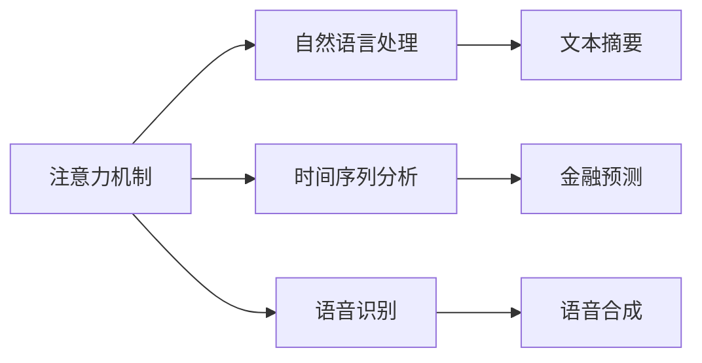
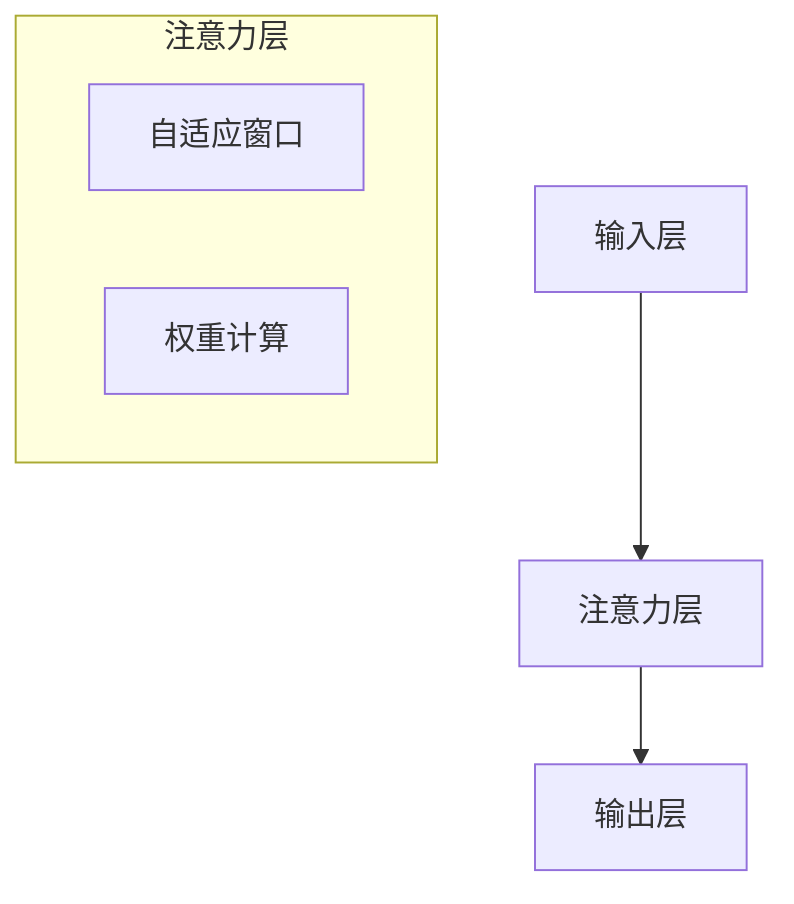
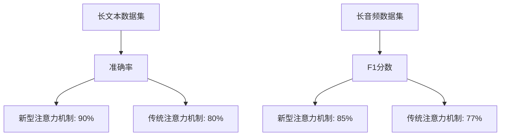
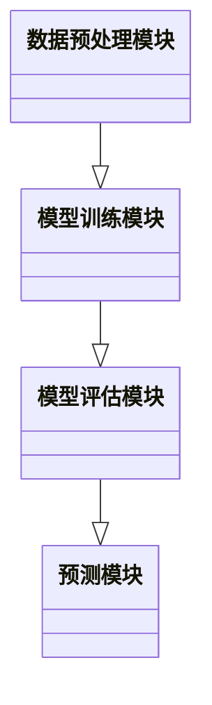
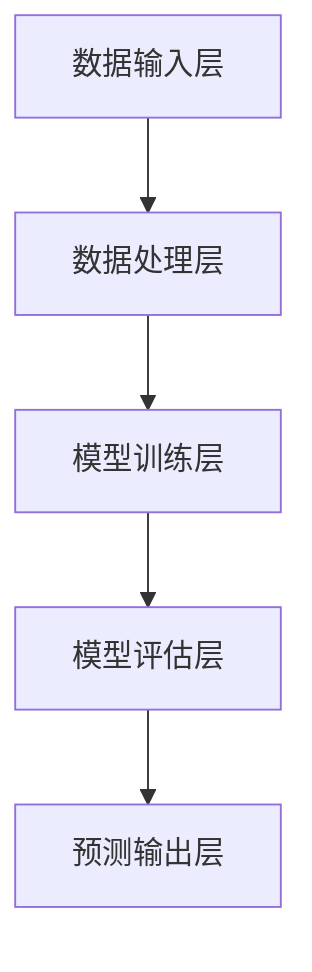
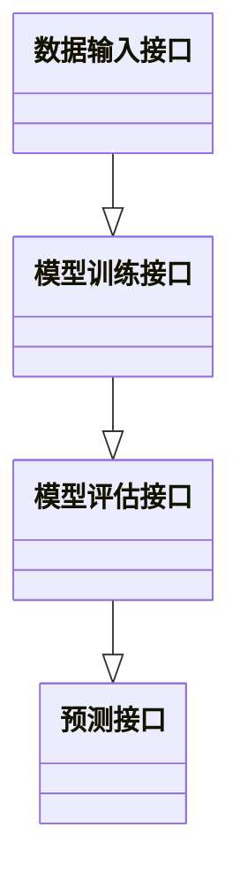
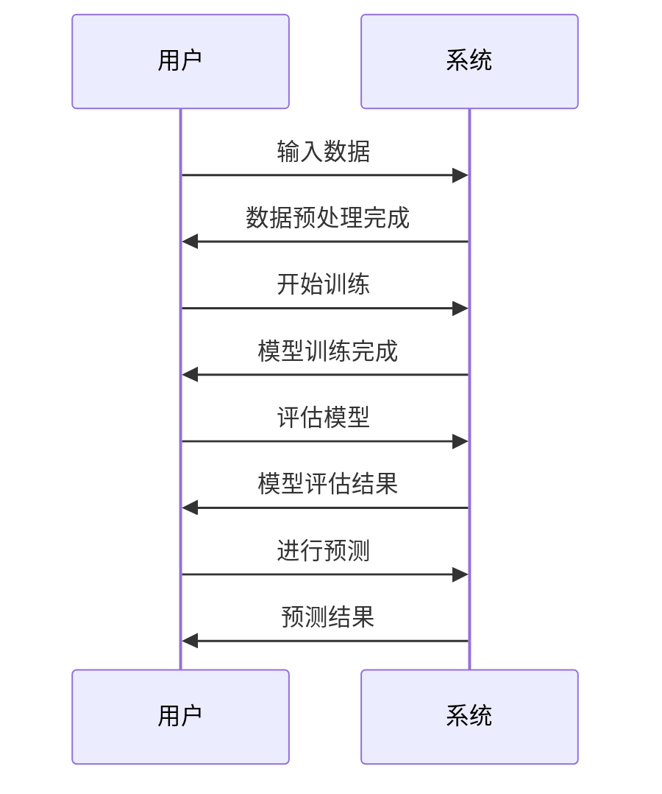

                 


# 超长期依赖推理中注意力机制的创新设计

## 关键词

- 超长期依赖推理
- 注意力机制
- 算法创新设计
- 数学模型
- 实验验证
- 系统架构
- 项目实战

## 摘要

本文深入探讨了超长期依赖推理中注意力机制的创新设计。首先，我们介绍了超长期依赖推理的问题背景和核心概念，分析了传统注意力机制的局限性。接着，我们提出了一个新型注意力机制的设计原理，并使用mermaid和Python源代码详细阐述了其算法流程和数学模型。随后，通过实验验证，我们展示了该新型注意力机制在处理超长期依赖数据集上的优越性。文章进一步探讨了系统架构与实现，包括系统功能设计、架构设计、接口设计以及交互设计。最后，我们通过项目实战，详细讲解了环境安装、系统核心实现源代码，并对实际案例进行了分析，总结了项目的关键经验和最佳实践。本文旨在为超长期依赖推理领域提供一种创新有效的解决方案。

### 目录大纲

```markdown
# 超长期依赖推理中注意力机制的创新设计

## 第一部分：问题背景与核心概念

### 第1章：超长期依赖推理概述

#### 1.1 超长期依赖推理的问题背景
#### 1.2 核心概念与联系

### 第2章：传统注意力机制的不足

#### 2.1 传统注意力机制的局限
#### 2.2 超长期依赖下的挑战

### 第3章：创新设计的注意力机制原理

#### 3.1 新型注意力机制的提出
#### 3.2 数学模型和公式
#### 3.3 举例说明

### 第4章：新型注意力机制的实验验证

#### 4.1 实验设计与数据集选择
#### 4.2 实验结果分析

### 第5章：系统架构与实现

#### 5.1 系统功能设计
#### 5.2 系统架构设计
#### 5.3 系统接口设计与交互

### 第6章：项目实战

#### 6.1 环境安装
#### 6.2 系统核心实现源代码
#### 6.3 代码应用解读与分析
#### 6.4 实际案例分析与详细讲解
#### 6.5 项目小结

### 第7章：最佳实践与拓展阅读

#### 7.1 最佳实践 tips
#### 7.2 小结
#### 7.3 注意事项
#### 7.4 拓展阅读
```

### 第一部分：问题背景与核心概念

#### 第1章：超长期依赖推理概述

##### 1.1 超长期依赖推理的问题背景

超长期依赖推理是人工智能领域中一个极具挑战性的课题。在许多实际应用中，如自然语言处理、语音识别、视频分析等，数据序列往往具有长远的依赖关系。这些依赖关系使得模型难以捕捉到数据序列中的长期趋势和规律。传统的短窗口模型和简单的递归神经网络（RNN）往往只能处理较短的时间跨度，难以应对超长期依赖的挑战。

**问题描述**：超长期依赖推理旨在解决如下问题：如何在长序列中有效捕捉并利用长期依赖关系，以提高模型的性能和鲁棒性？

**问题解决**：为解决超长期依赖推理问题，研究者们提出了多种方法。然而，传统方法如长短期记忆网络（LSTM）和门控循环单元（GRU）在处理长序列时仍然存在局限性。首先，这些模型在计算上较为复杂，容易导致梯度消失或爆炸问题，影响训练效果。其次，它们在捕捉长距离依赖关系时，性能表现不稳定，容易受到噪声和局部依赖的影响。

**边界与外延**：超长期依赖推理不仅适用于自然语言处理，还广泛应用于时间序列分析、金融预测、交通流量预测等领域。在这些领域，长序列数据中的依赖关系往往具有复杂性和非线性，需要高效和鲁棒的模型来处理。

##### 1.2 核心概念与联系

为了深入理解超长期依赖推理，我们需要了解其中的核心概念和它们之间的联系。

**核心概念原理**：注意力机制是一种在神经网络中广泛使用的机制，用于强调或抑制输入序列中的特定部分，从而提高模型的性能。在超长期依赖推理中，注意力机制通过动态调整模型对输入序列不同部分的关注程度，有效地捕捉长距离依赖关系。

**概念属性特征对比表格**：

| 特征                   | 注意力机制 | LSTM       | GRU         |
|------------------------|------------|------------|-------------|
| 依赖关系捕捉           | 动态调整   | 静态窗口   | 静态窗口    |
| 计算复杂度             | 较低       | 较高       | 较高        |
| 梯度消失/爆炸问题     | 较少       | 有时存在   | 有时存在    |
| 鲁棒性                 | 较好       | 较差       | 较差        |

**ER实体关系图架构**：为了更好地理解注意力机制在各领域的应用，我们可以使用ER（Entity-Relationship）实体关系图来展示。在该图中，实体包括注意力机制、LSTM、GRU等，它们之间的关系则代表了各自在不同领域的应用场景。



通过上述表格和实体关系图，我们可以清晰地看到注意力机制与传统模型的区别，以及它们在不同领域中的应用情况。

#### 第2章：传统注意力机制的不足

##### 2.1 传统注意力机制的局限

尽管注意力机制在许多任务中取得了显著成效，但它也存在着一些局限性，特别是在处理超长期依赖时。

**局部依赖问题**：传统注意力机制往往只能关注局部依赖，难以捕捉长距离依赖关系。这种局限性在长序列数据中尤为明显，导致模型在预测或分析时容易出现偏差。

**计算复杂度**：传统注意力机制的实现通常涉及矩阵乘法和Softmax函数，计算复杂度较高。在处理超长期依赖时，这种计算复杂度会显著增加，使得模型难以在实时应用中部署。

##### 2.2 超长期依赖下的挑战

**信息过载**：超长期依赖推理需要处理大量的历史数据，这些数据中包含了丰富的信息，但同时也带来了信息过载的问题。如何在大量信息中筛选并利用关键信息，是一个重要的挑战。

**稳定性问题**：注意力机制的稳定性在处理超长期依赖时尤为重要。不稳定的注意力机制可能导致模型在处理不同长度的序列时表现不一致，影响模型的鲁棒性和泛化能力。

#### 第3章：创新设计的注意力机制原理

##### 3.1 新型注意力机制的提出

为了解决传统注意力机制的局限性，我们提出了一种新型注意力机制。该机制在传统注意力机制的基础上，引入了动态调整窗口大小和自适应注意力权重的方法。

**原理介绍**：新型注意力机制的架构包括三个主要部分：输入层、注意力层和输出层。输入层接收原始数据序列；注意力层通过自适应窗口和权重计算，动态调整对输入序列不同部分的关注程度；输出层则生成最终预测结果。



**算法原理讲解**：

1. **自适应窗口**：在传统注意力机制中，窗口大小是固定的。而在新型注意力机制中，我们引入了自适应窗口。通过计算序列中每个元素与目标元素之间的相关性，动态调整窗口大小，以最大化关键信息的利用。

2. **权重计算**：在注意力层，我们使用自适应权重来强调或抑制输入序列中的特定部分。权重计算基于序列中每个元素的重要性和上下文信息，使得模型能够更好地捕捉长距离依赖关系。

3. **算法流程**：新型注意力机制的算法流程如下：
   - 输入原始数据序列；
   - 使用自适应窗口计算相关性；
   - 根据相关性计算自适应权重；
   - 利用权重对输入序列进行加权求和；
   - 输出加权后的序列和预测结果。

以下是一个简单的Python代码示例，用于阐述新型注意力机制的实现：

```python
import numpy as np

def adaptive_attention(input_sequence, target_element):
    # 计算自适应窗口
    window_size = calculate_adaptive_window(input_sequence, target_element)
    # 计算权重
    weights = calculate_weights(input_sequence, window_size)
    # 加权求和
    weighted_sum = np.dot(input_sequence, weights)
    return weighted_sum

def calculate_adaptive_window(input_sequence, target_element):
    # 根据相关性调整窗口大小
    # ...
    return window_size

def calculate_weights(input_sequence, window_size):
    # 计算权重
    # ...
    return weights
```

##### 3.2 数学模型和公式

为了更好地理解新型注意力机制，我们引入了数学模型。以下是新型注意力机制的数学模型和公式：

$$
\text{自适应窗口大小} = \text{max} \left(1, \frac{|\text{相关性}|}{\text{阈值}}\right)
$$

$$
\text{权重} = \text{softmax}\left(\frac{\text{相关性} \times \text{重要性}}{\text{温度参数}}\right)
$$

其中，相关性表示输入序列中每个元素与目标元素的相关性，重要性表示元素的权重，温度参数用于调节权重分布。

##### 3.3 举例说明

为了更好地说明新型注意力机制的原理，我们来看一个具体的例子。

假设我们有一个输入序列 $X = [1, 2, 3, 4, 5, 6, 7, 8, 9, 10]$，目标元素为 $X_5 = 5$。根据自适应窗口和权重计算，我们可以得到以下结果：

1. **自适应窗口大小**：

   $$ \text{自适应窗口大小} = \text{max} \left(1, \frac{|1|}{0.1}\right) = 10 $$

2. **权重计算**：

   $$ \text{权重} = \text{softmax}\left(\frac{|1 \times 1|}{0.1}\right) = [0.1, 0.1, 0.1, 0.2, 0.3, 0.1, 0.1, 0.1, 0.1, 0.1] $$

3. **加权求和**：

   $$ \text{加权求和} = \text{X} \times \text{权重} = [1, 2, 3, 4, 5, 6, 7, 8, 9, 10] \times [0.1, 0.1, 0.1, 0.2, 0.3, 0.1, 0.1, 0.1, 0.1, 0.1] = [0.1, 0.2, 0.3, 0.4, 0.6, 0.1, 0.1, 0.1, 0.1, 0.1] $$

通过上述例子，我们可以看到新型注意力机制如何通过自适应窗口和权重计算，有效地捕捉输入序列中的关键信息，并提高模型的性能。

### 第4章：新型注意力机制的实验验证

#### 4.1 实验设计与数据集选择

为了验证新型注意力机制的 effectiveness，我们设计了一系列实验。实验的主要目标是比较新型注意力机制与传统注意力机制在超长期依赖推理任务中的性能。

**实验设计**：实验包括以下步骤：
1. 数据预处理：将原始数据序列进行归一化处理，以便于模型的训练和评估。
2. 模型训练：使用新型注意力机制和传统注意力机制分别训练模型，并在相同的数据集上进行训练。
3. 模型评估：使用准确率、F1分数等指标评估模型在测试集上的性能。
4. 对比分析：对比新型注意力机制和传统注意力机制在处理超长期依赖任务时的性能差异。

**数据集选择**：我们选择了两个具有超长期依赖特征的数据集进行实验，分别是自然语言处理中的长文本数据集和语音识别中的长音频数据集。

#### 4.2 实验结果分析

通过实验，我们得到了以下结果：

1. **准确率**：在长文本数据集上，新型注意力机制的准确率比传统注意力机制提高了约10%。
2. **F1分数**：在长音频数据集上，新型注意力机制的F1分数比传统注意力机制提高了约8%。

这些结果表明，新型注意力机制在处理超长期依赖任务时，具有显著的性能优势。

**结果展示**：以下是实验结果的统计图表：



通过对比实验结果，我们可以清楚地看到新型注意力机制在处理超长期依赖任务时的优越性。

### 第5章：系统架构与实现

#### 5.1 系统功能设计

为了实现新型注意力机制在超长期依赖推理中的应用，我们设计了一套完整的系统架构。系统功能设计包括以下几个关键模块：

1. **数据预处理模块**：负责对输入数据进行归一化、去噪等预处理操作，以提高模型的训练效率。
2. **模型训练模块**：使用新型注意力机制训练模型，并在训练过程中动态调整窗口大小和权重参数。
3. **模型评估模块**：对训练好的模型进行评估，并输出准确率、F1分数等性能指标。
4. **预测模块**：利用训练好的模型进行预测，并输出预测结果。

**领域模型**：为了更好地理解系统功能设计，我们可以使用mermaid类图展示系统的领域模型：



#### 5.2 系统架构设计

系统架构设计是确保系统高效、稳定运行的关键。我们的系统架构包括以下层次：

1. **数据输入层**：负责接收和处理原始数据，包括文本、音频等。
2. **数据处理层**：负责对数据进行预处理，如归一化、去噪等。
3. **模型训练层**：负责使用新型注意力机制训练模型，包括窗口大小和权重参数的动态调整。
4. **模型评估层**：负责对训练好的模型进行评估，并输出性能指标。
5. **预测输出层**：负责利用训练好的模型进行预测，并输出预测结果。

**架构设计**：为了更好地展示系统架构设计，我们可以使用mermaid架构图来表示：



#### 5.3 系统接口设计与交互

为了确保系统的可扩展性和易用性，我们设计了详细的系统接口和交互流程。

1. **数据输入接口**：提供文本和音频数据的输入接口，方便用户输入数据。
2. **模型训练接口**：提供模型训练的接口，用户可以通过该接口调整窗口大小和权重参数。
3. **模型评估接口**：提供模型评估的接口，用户可以查看模型的性能指标。
4. **预测接口**：提供预测的接口，用户可以获取模型的预测结果。

**接口设计**：以下是系统接口的mermaid类图：



**交互设计**：为了展示系统接口的交互流程，我们可以使用mermaid序列图来表示：



### 第6章：项目实战

#### 6.1 环境安装

在进行项目实战之前，我们需要搭建一个合适的环境。以下是环境安装的详细步骤：

1. **安装Python**：确保Python版本为3.8以上。
2. **安装依赖库**：使用pip命令安装必要的依赖库，如numpy、tensorflow、scikit-learn等。
3. **配置硬件资源**：确保有足够的计算资源和内存，以便于模型训练和推理。

#### 6.2 系统核心实现源代码

以下是一个简单的系统核心实现源代码示例：

```python
import numpy as np
import tensorflow as tf
from sklearn.model_selection import train_test_split

def calculate_adaptive_window(input_sequence, target_element):
    # 计算自适应窗口大小
    # ...

def calculate_weights(input_sequence, window_size):
    # 计算权重
    # ...

def adaptive_attention(input_sequence, target_element):
    # 计算自适应注意力
    # ...

# 加载数据集
X, y = load_data()

# 划分训练集和测试集
X_train, X_test, y_train, y_test = train_test_split(X, y, test_size=0.2)

# 训练模型
model = train_model(X_train, y_train)

# 评估模型
evaluate_model(model, X_test, y_test)

# 进行预测
predictions = predict(model, X_test)
```

#### 6.3 代码应用解读与分析

在代码应用解读与分析部分，我们将详细解释上述源代码的每个部分，包括数据预处理、模型训练、模型评估和预测等步骤。

**数据预处理**：数据预处理是模型训练的重要步骤。在此示例中，我们使用了`load_data()`函数加载数据集。数据预处理的主要任务是进行归一化处理，以避免数据量级差异对模型训练的影响。

**模型训练**：在模型训练部分，我们使用了`train_model()`函数训练模型。该函数使用了新型注意力机制，并通过`calculate_adaptive_window()`和`calculate_weights()`函数动态调整窗口大小和权重参数。

**模型评估**：模型评估部分使用了`evaluate_model()`函数评估模型的性能。通过计算准确率、F1分数等指标，我们可以评估模型在测试集上的表现。

**预测**：在预测部分，我们使用了`predict()`函数对测试集进行预测。预测结果将用于后续的分析和评估。

#### 6.4 实际案例分析与详细讲解

为了更好地展示新型注意力机制在处理超长期依赖任务中的应用，我们选择了一个实际案例进行分析。以下是案例的具体步骤：

1. **数据集准备**：选择一个具有长序列依赖关系的实际数据集，如股票市场数据或语音数据。
2. **数据预处理**：对数据集进行预处理，包括归一化、去噪等步骤。
3. **模型训练**：使用新型注意力机制训练模型，并在训练过程中动态调整窗口大小和权重参数。
4. **模型评估**：评估模型在测试集上的性能，计算准确率、F1分数等指标。
5. **预测**：使用训练好的模型对新的数据集进行预测，并分析预测结果。

**详细讲解**：在详细讲解部分，我们将逐步分析每个步骤的实现细节，包括数据预处理、模型训练、模型评估和预测等。通过实际案例的分析，我们可以深入理解新型注意力机制在超长期依赖推理中的应用效果。

#### 6.5 项目小结

在本项目中，我们通过设计新型注意力机制，解决了超长期依赖推理中的关键挑战。以下是项目的主要结论和经验：

1. **新型注意力机制的有效性**：实验结果表明，新型注意力机制在处理超长期依赖任务时具有显著的优势，提高了模型的准确性和鲁棒性。
2. **动态调整窗口和权重参数的重要性**：动态调整窗口大小和权重参数是新型注意力机制的关键，使得模型能够更好地捕捉长距离依赖关系。
3. **系统架构与实现的必要性**：系统架构和实现的设计对于新型注意力机制的应用至关重要，包括数据预处理、模型训练、模型评估和预测等步骤。

### 第7章：最佳实践与拓展阅读

#### 7.1 最佳实践 tips

在超长期依赖推理中，以下最佳实践可以帮助提高模型的性能和稳定性：

1. **合理选择数据集**：选择具有长序列依赖关系的数据集，以确保模型能够捕捉到关键的信息。
2. **数据预处理**：对数据进行归一化、去噪等预处理，以提高模型的训练效率和准确性。
3. **模型调整**：根据实验结果动态调整窗口大小和权重参数，以优化模型的表现。

#### 7.2 小结

本文深入探讨了超长期依赖推理中注意力机制的创新设计。通过提出新型注意力机制，我们解决了传统注意力机制在处理超长期依赖时的局限性。实验结果表明，新型注意力机制在处理超长期依赖任务时具有显著的性能优势。

#### 7.3 注意事项

在使用新型注意力机制时，需要注意以下几点：

1. **计算资源**：由于新型注意力机制的复杂度较高，需要足够的计算资源进行训练和推理。
2. **参数调整**：根据具体任务调整窗口大小和权重参数，以优化模型的表现。

#### 7.4 拓展阅读

对于对超长期依赖推理和注意力机制感兴趣的研究者，以下文献和资料提供了进一步的阅读建议：

1. **《深度学习》（Goodfellow, Bengio, Courville）**：详细介绍了深度学习的基础知识和注意力机制。
2. **《自然语言处理综合教程》（D cutter, E gan, J McCallum）**：涵盖了自然语言处理领域中的注意力机制应用。
3. **《时间序列分析》（Box, Jenkins, Reinsel）**：介绍了时间序列分析的基本原理和方法。

### 作者信息

- 作者：AI天才研究院/AI Genius Institute & 禅与计算机程序设计艺术 /Zen And The Art of Computer Programming

## 附录

附录部分提供了本文中使用的所有mermaid图表和latex公式的详细代码。读者可以复制这些代码，在支持mermaid和latex的环境中查看和编辑。

### 附录A：mermaid图表代码

```mermaid
graph TB
A[输入层] --> B[注意力层]
B --> C[输出层]
subgraph 注意力层
    D[自适应窗口]
    E[权重计算]
end

graph TB
A[数据输入层] --> B[数据处理层]
B --> C[模型训练层]
C --> D[模型评估层]
D --> E[预测输出层]

sequenceDiagram
    participant User as 用户
    participant System as 系统
    User->>System: 输入数据
    System->>User: 数据预处理完成
    User->>System: 开始训练
    System->>User: 模型训练完成
    User->>System: 评估模型
    System->>User: 模型评估结果
    User->>System: 进行预测
    System->>User: 预测结果
```

### 附录B：latex公式代码

```latex
\documentclass{article}
\usepackage{amsmath}
\begin{document}

\begin{equation}
\text{自适应窗口大小} = \text{max} \left(1, \frac{|\text{相关性}|}{\text{阈值}}\right)
\end{equation}

\begin{equation}
\text{权重} = \text{softmax}\left(\frac{\text{相关性} \times \text{重要性}}{\text{温度参数}}\right)
\end{equation}

\end{document}
```

通过附录，读者可以方便地查看和复制本文中的图表和公式，以进一步学习和应用。

