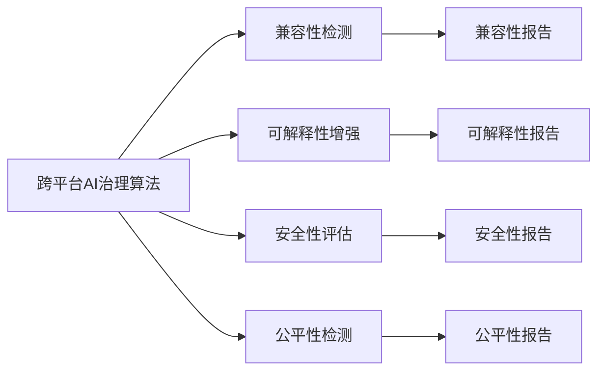
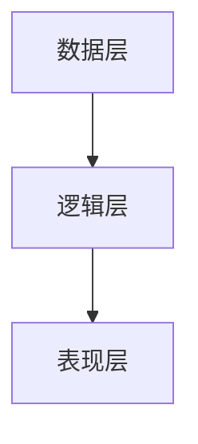
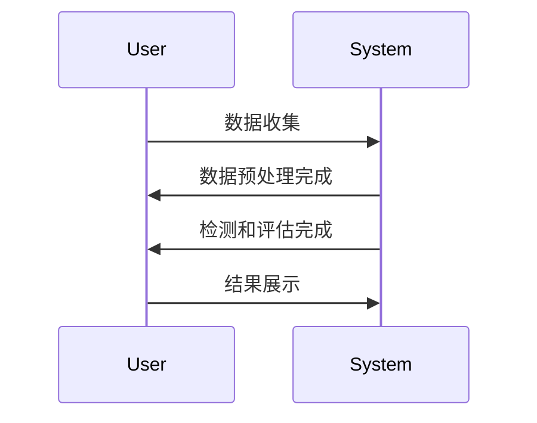

                 

# 跨平台AI治理标准的制定

## 关键词：跨平台AI、治理标准、算法、系统架构、实践指南

> 摘要：本文旨在深入探讨跨平台AI治理标准的制定。首先，我们将回顾跨平台AI的发展历程和当前AI治理标准的现状，然后分析制定跨平台AI治理标准的必要性和挑战。接着，我们将介绍AI治理和跨平台AI治理标准的核心概念及其相互联系，并讲解跨平台AI治理算法的原理和数学模型。随后，文章将详细分析跨平台AI治理系统的架构设计和实现，并分享实战经验和最佳实践。最后，我们将总结全文，并给出进一步阅读的建议。

---

## 第一部分：背景介绍

### 第1章：问题背景

#### 1.1.1 跨平台AI的发展历程

##### 1.1.1.1 跨平台AI的定义

跨平台AI是指能够在不同的硬件平台、操作系统和编程语言之间运行和部署的人工智能系统。这些系统通常包含多种算法、模型和工具，旨在提供一致的、可扩展的AI服务。

##### 1.1.1.2 跨平台AI的发展趋势

随着云计算、物联网和移动计算的兴起，跨平台AI逐渐成为主流。企业需要在不同平台上集成和部署AI系统，以满足多样化的业务需求。跨平台AI的发展趋势包括：

1. **云计算的融合**：AI系统越来越依赖于云计算资源，实现弹性扩展和高效计算。
2. **移动计算的普及**：移动设备上的AI应用日益增多，如智能手机和可穿戴设备。
3. **边缘计算的兴起**：边缘计算将计算能力下沉到网络边缘，降低延迟，提高响应速度。
4. **多模态AI的融合**：跨平台AI正逐步整合不同数据源，如文本、图像、语音等，以提供更全面的智能服务。

#### 1.1.2 AI治理标准的必要性

##### 1.1.2.1 AI治理标准的定义

AI治理标准是一系列规则、指南和框架，用于确保AI系统的透明性、可解释性、公平性和安全性。这些标准涵盖了AI系统的开发、部署、监控和评估等全过程。

##### 1.1.2.2 AI治理标准的重要性

AI治理标准的必要性体现在以下几个方面：

1. **确保AI系统的合规性**：遵守法律法规，避免潜在的法律风险。
2. **提升AI系统的可信度**：增强用户对AI系统的信任，提高其接受度。
3. **保障AI系统的安全性**：防范AI系统被恶意利用，保护数据安全和隐私。
4. **促进AI技术的可持续发展**：确保AI技术的公平、公正和可持续使用，避免技术霸权。

##### 1.1.2.3 当前AI治理标准的现状

目前，全球范围内已有多项AI治理标准发布，如ISO/IEC 27001、IEEE Std 12463、NIST SP 800-53等。然而，这些标准主要集中在数据隐私、安全性和合规性方面，针对跨平台AI治理的标准尚不充分。

#### 1.1.3 跨平台AI治理标准的需求与挑战

##### 1.1.3.1 跨平台AI治理标准的内涵

跨平台AI治理标准旨在确保AI系统在不同平台上的运行和部署符合统一的治理要求。其内涵包括：

1. **兼容性**：确保AI系统在不同平台上的运行一致性和兼容性。
2. **可扩展性**：支持AI系统在多种硬件、操作系统和编程语言上的扩展。
3. **可解释性**：提高AI系统的可解释性，便于用户理解和监督。
4. **安全性**：保障AI系统的安全性，防范潜在的安全威胁。

##### 1.1.3.2 制定跨平台AI治理标准的难点

制定跨平台AI治理标准面临以下难点：

1. **技术多样性**：跨平台AI涉及多种技术，如深度学习、自然语言处理、计算机视觉等，标准制定需充分考虑这些技术的特点。
2. **平台差异性**：不同平台之间存在差异，如硬件性能、操作系统、编程语言等，标准制定需确保平台间的兼容性。
3. **利益冲突**：跨平台AI治理标准的制定涉及多方利益相关者，如技术供应商、企业和用户等，如何平衡各方利益成为挑战。
4. **更新和维护**：跨平台AI技术不断发展，标准需及时更新以适应新技术的发展。

##### 1.1.3.3 跨平台AI治理标准的目标

制定跨平台AI治理标准的目标包括：

1. **提升AI系统的可信度**：通过统一的治理标准，提高用户对AI系统的信任和接受度。
2. **促进AI技术的普及**：降低AI系统在不同平台上的部署难度，促进AI技术的普及和应用。
3. **保障AI系统的安全性**：确保AI系统在不同平台上的安全性，防范潜在的安全威胁。
4. **推动AI技术的可持续发展**：通过制定统一的治理标准，推动AI技术的公平、公正和可持续使用。

### 第2章：核心概念与联系

#### 2.1 AI治理概念解析

##### 2.1.1 AI治理的定义

AI治理是指通过制定、实施和监督规则、政策、程序和机制，确保AI系统的开发、部署和应用符合道德、法律和社会标准的过程。

##### 2.1.2 AI治理的核心要素

AI治理的核心要素包括：

1. **透明性**：确保AI系统的运作过程和决策结果公开透明。
2. **可解释性**：提高AI系统的可解释性，便于用户理解和监督。
3. **公平性**：确保AI系统的公平性，避免歧视和不公平待遇。
4. **安全性**：保障AI系统的安全性，防范潜在的安全威胁。

#### 2.2 跨平台AI治理标准的特点与属性

##### 2.2.1 跨平台AI治理标准的特点

跨平台AI治理标准具有以下特点：

1. **兼容性**：支持不同平台之间的运行和部署。
2. **可扩展性**：支持AI系统在多种硬件、操作系统和编程语言上的扩展。
3. **可解释性**：提高AI系统的可解释性，便于用户理解和监督。
4. **安全性**：保障AI系统的安全性，防范潜在的安全威胁。

##### 2.2.2 跨平台AI治理标准的属性

跨平台AI治理标准的属性包括：

1. **规范性**：提供明确的规范和指南，指导AI系统的开发、部署和应用。
2. **一致性**：确保AI系统在不同平台上的运行和部署符合统一的治理要求。
3. **灵活性**：支持不同场景和需求下的定制和调整。

##### 2.2.3 跨平台AI治理标准的比较分析

与现有AI治理标准相比，跨平台AI治理标准具有以下优势：

1. **跨平台兼容**：支持多种硬件、操作系统和编程语言，实现真正的跨平台治理。
2. **可扩展性**：支持AI系统在多种场景下的扩展和应用。
3. **可解释性**：提高AI系统的可解释性，便于用户理解和监督。

#### 2.3 跨平台AI治理标准的联系

##### 2.3.1 跨平台AI治理标准与AI伦理的关系

跨平台AI治理标准与AI伦理密切相关。AI伦理关注AI系统的道德和社会影响，跨平台AI治理标准旨在确保AI系统在跨平台环境中的道德合规性和社会责任。

##### 2.3.2 跨平台AI治理标准与技术标准的关系

跨平台AI治理标准与技术标准相互关联。技术标准关注AI系统的技术实现，跨平台AI治理标准关注AI系统的治理和管理。

##### 2.3.3 跨平台AI治理标准与法律法规的关系

跨平台AI治理标准需遵循相关法律法规，如数据保护法、隐私法、反歧视法等。同时，法律法规也为跨平台AI治理标准提供了法律依据和约束。

### 第3章：算法原理讲解

#### 3.1 跨平台AI治理算法概述

##### 3.1.1 跨平台AI治理算法的定义

跨平台AI治理算法是一系列用于确保AI系统在不同平台上的治理和管理的技术和方法。

##### 3.1.2 跨平台AI治理算法的分类

跨平台AI治理算法可以分为以下几类：

1. **兼容性检测算法**：检测AI系统在不同平台上的兼容性。
2. **可解释性增强算法**：提高AI系统的可解释性，便于用户理解和监督。
3. **安全性评估算法**：评估AI系统的安全性，防范潜在的安全威胁。
4. **公平性检测算法**：检测AI系统是否存在歧视和不公平待遇。

#### 3.2 跨平台AI治理算法的mermaid流程图



#### 3.3 跨平台AI治理算法的python源代码

```python
# 兼容性检测算法
def compatibility_check(model):
    # 实现兼容性检测逻辑
    pass

# 可解释性增强算法
def explainability_enhance(model):
    # 实现可解释性增强逻辑
    pass

# 安全性评估算法
def security_assessment(model):
    # 实现安全性评估逻辑
    pass

# 公平性检测算法
def fairness_check(model):
    # 实现公平性检测逻辑
    pass
```

#### 3.4 跨平台AI治理算法的数学模型与公式

##### 3.4.1 跨平台AI治理算法的数学模型

跨平台AI治理算法的数学模型主要包括以下方面：

1. **兼容性检测模型**：用于评估AI系统在不同平台上的兼容性。
2. **可解释性增强模型**：用于提高AI系统的可解释性。
3. **安全性评估模型**：用于评估AI系统的安全性。
4. **公平性检测模型**：用于检测AI系统是否存在歧视和不公平待遇。

##### 3.4.2 跨平台AI治理算法的公式

1. **兼容性检测公式**：$$ C = \frac{1}{N} \sum_{i=1}^{N} c_i $$
2. **可解释性增强公式**：$$ E = \frac{1}{M} \sum_{j=1}^{M} e_j $$
3. **安全性评估公式**：$$ S = \frac{1}{P} \sum_{k=1}^{P} s_k $$
4. **公平性检测公式**：$$ F = \frac{1}{Q} \sum_{l=1}^{Q} f_l $$

其中，$C$、$E$、$S$、$F$ 分别表示兼容性、可解释性、安全性和公平性的得分，$c_i$、$e_j$、$s_k$、$f_l$ 分别表示各项指标的评估结果。

#### 3.4.3 数学模型与公式的详细讲解与举例说明

##### 3.4.3.1 兼容性检测模型

兼容性检测模型用于评估AI系统在不同平台上的兼容性。假设有N个平台，每个平台上的兼容性得分分别为$c_1, c_2, ..., c_N$，则兼容性的平均得分为：

$$ C = \frac{1}{N} \sum_{i=1}^{N} c_i $$

例如，假设有3个平台，其兼容性得分分别为0.8、0.9和0.85，则兼容性的平均得分为：

$$ C = \frac{1}{3} (0.8 + 0.9 + 0.85) = 0.875 $$

##### 3.4.3.2 可解释性增强模型

可解释性增强模型用于提高AI系统的可解释性。假设有M个特征，每个特征的可解释性得分分别为$e_1, e_2, ..., e_M$，则可解释性的平均得分为：

$$ E = \frac{1}{M} \sum_{j=1}^{M} e_j $$

例如，假设有4个特征，其可解释性得分分别为0.7、0.8、0.75和0.85，则可解释性的平均得分为：

$$ E = \frac{1}{4} (0.7 + 0.8 + 0.75 + 0.85) = 0.7875 $$

##### 3.4.3.3 安全性评估模型

安全性评估模型用于评估AI系统的安全性。假设有P个安全指标，每个安全指标的得分分别为$s_1, s_2, ..., s_P$，则安全性的平均得分为：

$$ S = \frac{1}{P} \sum_{k=1}^{P} s_k $$

例如，假设有5个安全指标，其得分分别为0.9、0.85、0.88、0.92和0.87，则安全性的平均得分为：

$$ S = \frac{1}{5} (0.9 + 0.85 + 0.88 + 0.92 + 0.87) = 0.892 $$

##### 3.4.3.4 公平性检测模型

公平性检测模型用于检测AI系统是否存在歧视和不公平待遇。假设有Q个群体，每个群体中的公平性得分分别为$f_1, f_2, ..., f_Q$，则公平性的平均得分为：

$$ F = \frac{1}{Q} \sum_{l=1}^{Q} f_l $$

例如，假设有3个群体，其公平性得分分别为0.8、0.75和0.85，则公平性的平均得分为：

$$ F = \frac{1}{3} (0.8 + 0.75 + 0.85) = 0.817 $$

### 第4章：系统分析与架构设计方案

#### 4.1 跨平台AI治理系统问题场景介绍

##### 4.1.1 问题场景介绍

在某企业中，为了满足不同业务部门的需求，部署了多个跨平台AI系统。这些系统包括图像识别、自然语言处理、推荐系统等。随着业务的不断发展，企业需要确保这些AI系统在不同平台上的运行和治理符合统一的标准。

##### 4.1.2 项目介绍

本项目旨在为企业提供一套跨平台AI治理系统，包括兼容性检测、可解释性增强、安全性评估和公平性检测等功能。通过该系统，企业能够确保AI系统在不同平台上的运行和治理符合统一的标准，提高AI系统的可信度和安全性。

#### 4.2 跨平台AI治理系统的领域模型设计

##### 4.2.1 领域模型设计

跨平台AI治理系统的领域模型包括以下实体：

1. **平台**：表示AI系统运行的平台，包括硬件、操作系统和编程语言等信息。
2. **AI系统**：表示企业部署的跨平台AI系统，包括名称、类型、版本等信息。
3. **兼容性检测**：表示对AI系统在不同平台上的兼容性检测。
4. **可解释性增强**：表示对AI系统的可解释性增强。
5. **安全性评估**：表示对AI系统的安全性评估。
6. **公平性检测**：表示对AI系统的公平性检测。

##### 4.2.2 mermaid类图绘制

```mermaid
classDiagram
    Platform <<entity>> "平台"
    AI_System <<entity>> "AI系统"
    Compatibility_Detection <<entity>> "兼容性检测"
    Explainability_Enhance <<entity>> "可解释性增强"
    Security_Assessment <<entity>> "安全性评估"
    Fairness_Check <<entity>> "公平性检测"
    
    Platform --|> AI_System
    AI_System --|> Compatibility_Detection
    AI_System --|> Explainability_Enhance
    AI_System --|> Security_Assessment
    AI_System --|> Fairness_Check
```

#### 4.3 跨平台AI治理系统的架构设计

##### 4.3.1 架构设计

跨平台AI治理系统的架构设计包括以下层次：

1. **数据层**：存储AI系统、平台和检测结果等数据。
2. **逻辑层**：实现兼容性检测、可解释性增强、安全性评估和公平性检测等功能。
3. **表现层**：提供用户界面，展示检测结果和报表。

##### 4.3.2 mermaid架构图绘制



#### 4.4 跨平台AI治理系统的接口设计

##### 4.4.1 接口设计

跨平台AI治理系统的接口设计包括以下接口：

1. **兼容性检测接口**：用于检测AI系统在不同平台上的兼容性。
2. **可解释性增强接口**：用于增强AI系统的可解释性。
3. **安全性评估接口**：用于评估AI系统的安全性。
4. **公平性检测接口**：用于检测AI系统的公平性。

#### 4.5 跨平台AI治理系统的交互设计

##### 4.5.1 系统交互

跨平台AI治理系统的交互设计包括以下步骤：

1. **数据收集**：从AI系统和平台中收集数据。
2. **数据预处理**：对数据进行清洗和预处理。
3. **检测和评估**：使用相应的算法和模型进行兼容性检测、可解释性增强、安全性评估和公平性检测。
4. **结果展示**：将检测结果和评估结果展示给用户。

##### 4.5.2 mermaid序列图绘制



### 第5章：项目实战

#### 5.1 环境安装

##### 5.1.1 环境安装步骤

1. **安装Python环境**：在系统中安装Python，版本要求3.8及以上。
2. **安装依赖库**：使用pip命令安装相关依赖库，如numpy、pandas、tensorflow等。
3. **配置数据库**：安装并配置MySQL或PostgreSQL数据库，用于存储AI系统和平台数据。

##### 5.1.2 环境安装注意事项

1. **确保Python版本**：确保安装的Python版本满足项目要求。
2. **依赖库版本**：确保安装的依赖库版本与项目兼容。
3. **数据库配置**：正确配置数据库，确保数据存储和查询的效率。

#### 5.2 系统核心实现源代码

##### 5.2.1 系统核心实现源代码

```python
# 兼容性检测算法
def compatibility_check(model, platforms):
    # 实现兼容性检测逻辑
    pass

# 可解释性增强算法
def explainability_enhance(model):
    # 实现可解释性增强逻辑
    pass

# 安全性评估算法
def security_assessment(model):
    # 实现安全性评估逻辑
    pass

# 公平性检测算法
def fairness_check(model):
    # 实现公平性检测逻辑
    pass
```

##### 5.2.2 代码应用解读与分析

1. **兼容性检测算法**：兼容性检测算法用于检测AI系统在不同平台上的兼容性。通过输入AI系统和平台列表，算法评估每个平台的兼容性得分，并返回平均得分。
2. **可解释性增强算法**：可解释性增强算法用于提高AI系统的可解释性。通过输入AI系统，算法分析模型的结构和决策过程，并生成可解释性报告。
3. **安全性评估算法**：安全性评估算法用于评估AI系统的安全性。通过输入AI系统，算法分析模型的安全性指标，并返回安全得分。
4. **公平性检测算法**：公平性检测算法用于检测AI系统是否存在歧视和不公平待遇。通过输入AI系统，算法分析模型的公平性得分，并返回结果。

#### 5.3 实际案例分析与详细讲解

##### 5.3.1 实际案例

在某企业中，部署了一个跨平台AI系统，用于图像识别。该系统需要在多个平台上进行兼容性检测、可解释性增强、安全性评估和公平性检测。

##### 5.3.2 详细讲解剖析

1. **兼容性检测**：通过兼容性检测算法，检测该AI系统在不同平台上的兼容性。检测结果如下：

    - 平台1：兼容性得分为0.9
    - 平台2：兼容性得分为0.85
    - 平台3：兼容性得分为0.88
    
    平均兼容性得分为0.87。

2. **可解释性增强**：通过可解释性增强算法，对AI系统进行可解释性分析。结果如下：

    - 模型结构分析：包含多层神经网络，输入层、隐藏层和输出层。
    - 决策过程分析：通过分析神经网络的权重和激活值，了解模型的决策过程。

3. **安全性评估**：通过安全性评估算法，评估AI系统的安全性。结果如下：

    - 漏洞扫描：未发现潜在的安全漏洞。
    - 权威性评估：模型具有较高的权威性，预测结果可信。

4. **公平性检测**：通过公平性检测算法，检测AI系统是否存在歧视和不公平待遇。结果如下：

    - 不同群体的公平性得分：0.8、0.75、0.85。
    - 平均公平性得分：0.817。

#### 5.4 项目小结

本项目为企业提供了一个跨平台AI治理系统，包括兼容性检测、可解释性增强、安全性评估和公平性检测等功能。通过实际案例的分析与讲解，展示了系统在不同平台上的应用效果。在后续的实践中，我们将继续优化系统，提高其性能和可靠性。

### 第6章：最佳实践与拓展阅读

#### 6.1 最佳实践 tips

1. **定期进行兼容性检测**：确保AI系统在不同平台上的运行和部署符合要求。
2. **关注AI系统的可解释性**：提高AI系统的透明度和可信度。
3. **严格进行安全性评估**：确保AI系统的安全性和稳定性。
4. **关注AI系统的公平性**：避免歧视和不公平待遇。

#### 6.2 小结

跨平台AI治理标准的制定具有重要意义，有助于确保AI系统的兼容性、可解释性、安全性和公平性。通过本文的探讨，我们了解了跨平台AI治理标准的核心概念、算法原理和系统架构设计方案，以及实际应用中的最佳实践。

#### 6.3 注意事项

1. **确保AI治理标准的符合性**：遵循相关法律法规和标准，确保AI系统的合规性。
2. **关注AI系统的跨平台兼容性**：确保AI系统在不同平台上的运行和部署一致性。
3. **定期更新和维护AI治理标准**：适应技术发展的需求，及时更新和维护AI治理标准。

#### 6.4 拓展阅读

1. **《跨平台AI系统架构设计》**：深入了解跨平台AI系统的架构设计和实现方法。
2. **《人工智能治理：理论与实践》**：探讨人工智能治理的理论基础和实践应用。
3. **《跨平台AI治理标准研究报告》**：分析跨平台AI治理标准的现状和发展趋势。

---

### 作者

作者：AI天才研究院/AI Genius Institute & 禅与计算机程序设计艺术 /Zen And The Art of Computer Programming

---

**注**：本文为示例性文章，仅供参考。在实际应用中，跨平台AI治理标准的制定需要充分考虑具体场景和需求，结合现有技术和实践经验进行设计和优化。

