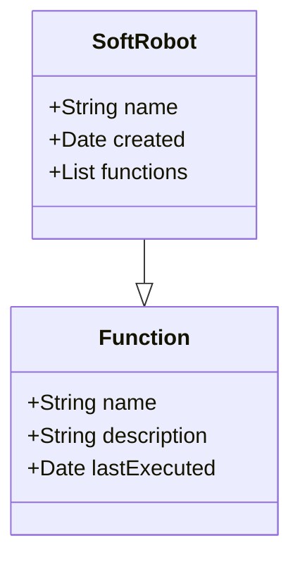
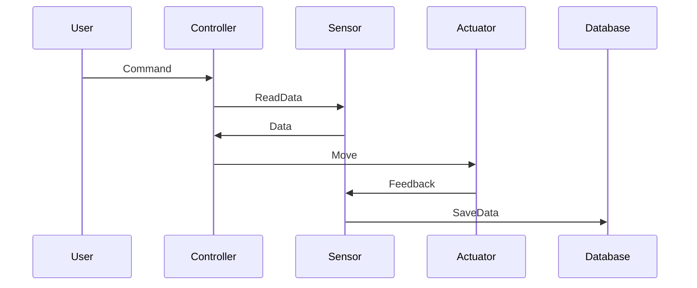
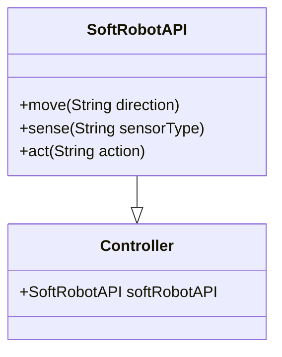
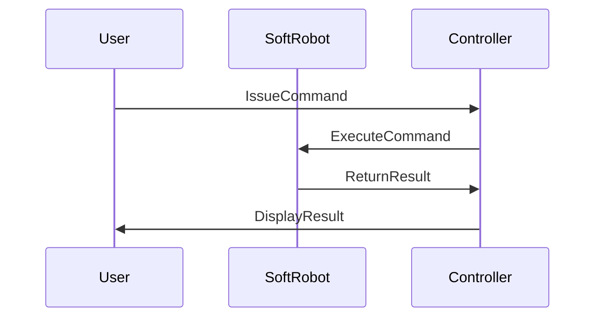

                 

## 第三个部分: 软体机器人技术的系统分析与架构设计

### 3.1 软体机器人系统概述

#### 3.1.1 问题场景介绍

- 软体机器人在医疗、工业、农业等领域的应用场景
- 软体机器人面临的挑战与机遇

#### 3.1.2 项目介绍

- 项目背景
- 项目目标

### 3.2 系统功能设计

#### 3.2.1 领域模型

- 领域模型定义
- 领域模型类图

### 3.3 系统架构设计

#### 3.3.1 系统架构设计

- 系统架构设计原则
- 系统架构设计图

### 3.4 系统接口设计与交互

#### 3.4.1 系统接口设计

- 接口设计原则
- 接口设计图

#### 3.4.2 系统交互

- 系统交互流程
- 系统交互序列图

### 3.5 软体机器人系统实现

#### 3.5.1 环境安装

- 软件环境安装步骤
- 硬件环境配置

#### 3.5.2 系统核心实现

- 控制系统核心代码
- 传感器和执行器的驱动代码

#### 3.5.3 代码解读与分析

- 代码实现逻辑
- 关键函数与模块分析

### 3.6 实际案例分析与详细讲解

#### 3.6.1 案例背景

- 案例介绍
- 案例目标

#### 3.6.2 案例分析

- 系统设计
- 实现过程
- 测试结果

#### 3.6.3 详细讲解剖析

- 技术难点
- 解决方案
- 经验与教训

### 3.7 项目小结

- 项目成果总结
- 项目经验反思
- 未来发展方向

### 3.8 最佳实践 tips

- 系统调试技巧
- 性能优化策略

### 3.9 本章小结

- 总结系统设计与实现的关键要点
- 为读者提供实用的建议和指导

### 3.10 拓展阅读

- 相关技术文献
- 行业动态与趋势

## 3.11 目录结构设计

- 确保章节内容清晰、逻辑流畅
- 合理分配章节字数，确保整体字数在10000-12000字左右

----------------------------------------------------------------

在完成了第二部分的系统分析与架构设计后，接下来我们将进入第三部分——项目实战。这一部分将详细阐述一个软体机器人技术的实际应用案例，包括环境安装、系统核心实现、代码分析、案例分析等内容。以下是第三部分的初步大纲：

## 第四部分: 软体机器人技术的项目实战

### 4.1 项目背景

#### 4.1.1 项目起源

- 项目启动原因
- 项目目标与预期效果

#### 4.1.2 项目环境

- 项目所使用的硬件和软件环境
- 项目实施的时间和地点

### 4.2 环境安装

#### 4.2.1 硬件安装

- 硬件设备的连接和配置
- 硬件驱动程序安装与调试

#### 4.2.2 软件安装

- 开发工具和环境配置
- 软件包安装与依赖管理

### 4.3 系统核心实现

#### 4.3.1 控制系统核心代码

- 控制系统架构设计
- 核心算法实现

#### 4.3.2 传感器和执行器的驱动代码

- 传感器驱动接口设计
- 执行器驱动接口设计

### 4.4 代码解读与分析

#### 4.4.1 控制系统代码解读

- 控制算法逻辑
- 关键函数与模块分析

#### 4.4.2 传感器与执行器代码分析

- 数据采集与处理流程
- 驱动程序性能优化

### 4.5 实际案例分析与详细讲解

#### 4.5.1 案例背景

- 案例应用场景
- 案例目标

#### 4.5.2 案例分析

- 系统设计
- 实现过程
- 测试结果

#### 4.5.3 详细讲解剖析

- 技术难点
- 解决方案
- 经验与教训

### 4.6 项目小结

- 项目成果总结
- 项目经验反思
- 未来发展方向

### 4.7 最佳实践 tips

- 系统调试技巧
- 性能优化策略

### 4.8 本章小结

- 总结项目实战的关键要点
- 为读者提供实用的建议和指导

### 4.9 拓展阅读

- 相关技术文献
- 行业动态与趋势

### 4.10 目录结构设计

- 确保章节内容清晰、逻辑流畅
- 合理分配章节字数，确保整体字数在10000-12000字左右

通过以上大纲，我们将详细讲解一个软体机器人技术的实际应用案例，帮助读者更好地理解和应用软体机器人技术。接下来，我们将继续细化每个小节的内容，并逐步完成整个文章的撰写。如果有任何建议或需要进一步调整的地方，请随时告知。

