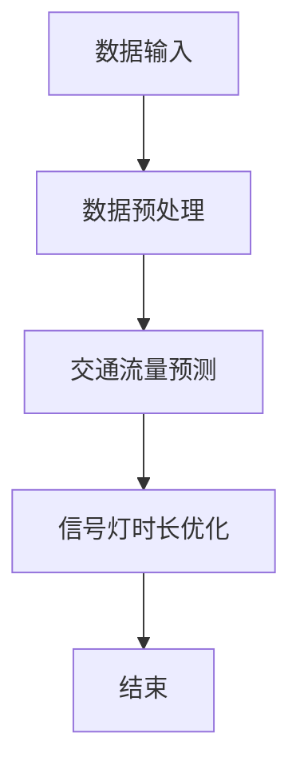
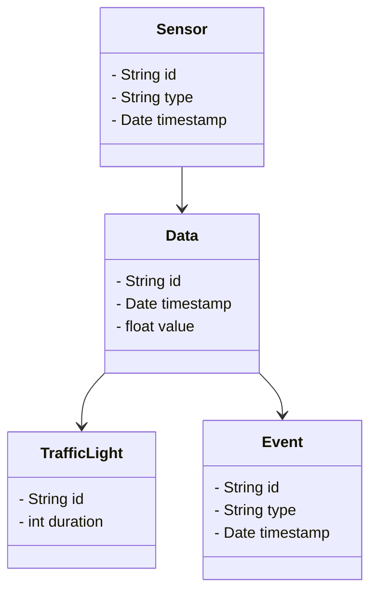
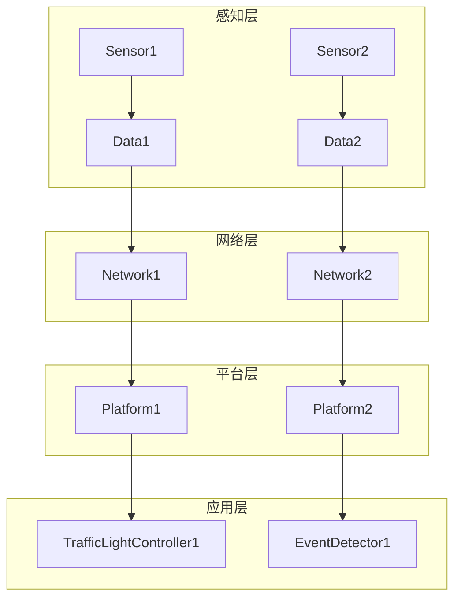

                 

### 文章标题

《边缘AI在智能交通信号控制中的应用：实现实时路况响应》

> 关键词：边缘AI、智能交通信号控制、实时路况响应、算法实现、系统架构

> 摘要：本文深入探讨了边缘AI技术在智能交通信号控制中的应用，通过分析边缘AI的优势及其在交通信号控制中的潜在价值，详细介绍了边缘AI在实时路况监测、数据分析与响应系统中的具体实现，旨在为相关领域的研究者和从业者提供理论指导和实践参考。

### 第1章：边缘AI与智能交通信号控制概述

#### 1.1.1 边缘AI的概念与优势

边缘AI（Edge AI）是一种将人工智能计算能力部署在靠近数据源或用户的位置的技术。与云计算相比，边缘AI具有低延迟、高实时性、节约带宽等优点，使其在需要快速响应的应用场景中具有显著优势。

边缘AI的优势主要体现在以下几个方面：

1. **低延迟**：边缘计算将数据处理靠近数据源，减少了数据传输的时间，从而降低了延迟。
2. **高实时性**：对于实时性要求较高的应用，如智能交通信号控制，边缘AI可以提供快速响应。
3. **节约带宽**：通过在边缘节点处理数据，可以减少需要传输到中心服务器的数据量，从而节约带宽资源。

#### 1.1.2 智能交通信号控制的概念与需求

智能交通信号控制是一种利用计算机技术和通信技术，实现交通信号灯的自动化控制和优化管理的系统。其核心目标是减少交通拥堵、提高交通效率和安全性。

智能交通信号控制的需求主要体现在以下几个方面：

1. **实时性**：交通信号控制需要实时响应交通流量变化，调整信号灯时长。
2. **准确性**：精确的流量监测和预测对于智能交通信号控制至关重要。
3. **灵活性**：交通信号控制系统需要能够适应不同交通场景的变化。

#### 1.1.3 边缘AI在智能交通信号控制中的应用价值

边缘AI在智能交通信号控制中的应用价值体现在以下几个方面：

1. **实时路况监测**：通过边缘AI技术，可以实现对实时交通数据的快速采集和处理，从而提高路况监测的实时性和准确性。
2. **智能信号控制策略**：边缘AI可以基于实时路况数据，快速调整信号灯控制策略，优化交通流。
3. **异常事件检测**：边缘AI能够实时监测交通状况，及时检测和预警异常事件，如交通事故或道路施工。

### 第2章：边缘AI技术基础

#### 2.1.1 边缘计算的基本原理与架构

边缘计算是一种将数据处理和分析工作从中心云服务器转移到网络边缘设备（如智能手机、路由器、传感器等）的计算模式。其基本原理是通过在靠近数据源的地方处理数据，实现低延迟、高效的数据处理。

边缘计算的架构通常包括以下几个层次：

1. **感知层**：负责数据的采集和初步处理，如传感器、摄像头等。
2. **网络层**：负责数据的传输和连接，如Wi-Fi、5G等。
3. **平台层**：提供计算资源和存储服务，如边缘服务器、虚拟化平台等。
4. **应用层**：负责具体应用场景的实现，如智能交通信号控制等。

#### 2.1.2 常见的边缘AI硬件平台

边缘AI硬件平台是边缘AI技术实现的基础。常见的边缘AI硬件平台包括：

1. **嵌入式设备**：如物联网设备、智能手机等，适合处理简单的AI任务。
2. **边缘服务器**：具有强大的计算和存储能力，适合处理复杂的AI任务。
3. **专用硬件**：如GPU、FPGA等，提供高效的AI计算能力。

#### 2.1.3 边缘AI算法基础

边缘AI算法是实现边缘AI功能的核心。常见的边缘AI算法包括：

1. **机器学习算法**：如神经网络、决策树等，用于数据分析和模式识别。
2. **深度学习算法**：如卷积神经网络（CNN）、循环神经网络（RNN）等，用于复杂图像和序列数据处理。
3. **强化学习算法**：如Q-learning、SARSA等，用于智能决策和策略优化。

### 第3章：智能交通信号控制系统

#### 3.1.1 智能交通信号控制系统的组成与工作原理

智能交通信号控制系统通常由以下几个组成部分构成：

1. **信号控制器**：负责信号灯的控制和调整。
2. **传感器**：用于监测交通流量、速度、车辆数量等数据。
3. **通信系统**：用于数据传输和控制指令的传递。

智能交通信号控制系统的基本工作原理是：

1. **数据采集**：传感器采集交通流量数据。
2. **数据处理**：信号控制器根据采集到的数据，分析并调整信号灯时长。
3. **指令传递**：控制指令通过通信系统传递给各个信号灯。
4. **实时调整**：根据实时数据，持续调整信号灯时长，优化交通流。

#### 3.1.2 智能交通信号控制系统的分类

智能交通信号控制系统根据控制策略的不同，可以分为以下几类：

1. **固定时间信号控制系统**：信号灯时长固定，不随交通流量变化。
2. **定时递增信号控制系统**：信号灯时长根据预设的递增规则进行调整。
3. **动态交通信号控制系统**：信号灯时长根据实时交通流量数据动态调整。

#### 3.1.3 智能交通信号控制系统的功能与性能要求

智能交通信号控制系统的主要功能包括：

1. **实时交通流量监测**：监测交通流量、速度、车辆数量等数据。
2. **信号灯时长调整**：根据实时交通流量数据，调整信号灯时长。
3. **异常事件检测**：检测交通异常事件，如交通事故或道路施工。
4. **交通信息发布**：向驾驶员提供交通信息，如路况信息、预计通行时间等。

智能交通信号控制系统的性能要求包括：

1. **实时性**：能够快速响应交通流量变化，调整信号灯时长。
2. **准确性**：能够准确监测交通流量数据，提供可靠的控制决策。
3. **灵活性**：能够适应不同交通场景的变化，提供灵活的控制策略。

### 第4章：边缘AI在智能交通信号控制中的应用

#### 4.1.1 边缘AI在交通流量监测中的应用

边缘AI在交通流量监测中的应用主要包括以下几个方面：

1. **实时数据采集**：通过边缘设备（如摄像头、传感器等）采集实时交通数据。
2. **数据预处理**：对采集到的数据（如图像、速度、流量等）进行预处理，提取有用信息。
3. **数据传输**：将预处理后的数据传输到边缘服务器或中心服务器。

边缘AI在交通流量监测中的应用可以提高数据的实时性和准确性，为智能交通信号控制提供可靠的数据支持。

#### 4.1.2 边缘AI在智能信号控制策略优化中的应用

边缘AI在智能信号控制策略优化中的应用主要包括以下几个方面：

1. **实时交通数据分析**：利用边缘AI技术，对实时交通数据进行分析，识别交通流量模式。
2. **信号控制策略调整**：根据实时交通数据分析结果，动态调整信号灯时长和相位。
3. **策略评估与优化**：对调整后的信号控制策略进行评估，持续优化控制策略。

边缘AI在智能信号控制策略优化中的应用可以实现交通信号控制的智能化和自适应化，提高交通效率。

#### 4.1.3 边缘AI在异常事件检测中的应用

边缘AI在异常事件检测中的应用主要包括以下几个方面：

1. **实时交通状况监测**：利用边缘AI技术，实时监测交通状况，识别异常事件。
2. **异常事件预警**：对识别到的异常事件进行预警，通知相关部门进行处理。
3. **事件处理**：根据异常事件预警，采取相应的处理措施，如调整信号灯控制策略、关闭道路等。

边缘AI在异常事件检测中的应用可以提高交通安全性，减少交通事故的发生。

### 第5章：实时路况监测与数据采集

#### 5.1.1 实时路况监测的关键技术

实时路况监测是智能交通信号控制的基础，其关键技术包括：

1. **传感器技术**：用于采集交通流量、速度、车辆数量等数据。
2. **图像识别技术**：用于识别道路上的车辆、行人等目标。
3. **数据传输技术**：用于将采集到的数据实时传输到边缘服务器或中心服务器。

#### 5.1.2 数据采集系统设计

数据采集系统设计主要包括以下几个步骤：

1. **需求分析**：确定实时路况监测的需求，包括监测内容、监测范围等。
2. **传感器选择**：根据需求选择合适的传感器，如摄像头、雷达、激光雷达等。
3. **数据传输设计**：设计数据传输方案，确保数据实时、准确地传输到边缘服务器或中心服务器。

#### 5.1.3 数据预处理与存储

数据预处理与存储主要包括以下几个步骤：

1. **数据清洗**：去除数据中的噪声和异常值，提高数据质量。
2. **数据转换**：将原始数据转换为适合分析和处理的数据格式。
3. **数据存储**：将预处理后的数据存储在数据库或数据湖中，方便后续分析和处理。

### 第6章：边缘AI算法在实时路况分析中的应用

#### 6.1.1 实时路况分析算法原理

实时路况分析算法的原理主要包括以下几个方面：

1. **数据输入**：接收实时采集的交通流量、速度、车辆数量等数据。
2. **数据预处理**：对输入数据进行清洗、转换等预处理操作。
3. **交通流量预测**：利用机器学习算法，如时间序列模型、神经网络等，预测未来一段时间内的交通流量。
4. **信号灯时长优化**：根据预测结果，动态调整信号灯时长，优化交通流。

#### 6.1.2 算法mermaid流程图

以下是实时路况分析算法的mermaid流程图：



#### 6.1.3 Python源代码实现与讲解

以下是一个简单的Python源代码实现，用于实时路况分析：

```python
import pandas as pd
from sklearn.model_selection import train_test_split
from sklearn.ensemble import RandomForestRegressor

# 数据预处理
def preprocess_data(data):
    # 数据清洗
    data = data.dropna()
    # 数据转换
    data['hour'] = data['time'].apply(lambda x: x.hour)
    data['dayofweek'] = data['time'].apply(lambda x: x.dayofweek)
    return data

# 交通流量预测
def predict_traffic(data):
    X = data[['hour', 'dayofweek']]
    y = data['traffic']
    X_train, X_test, y_train, y_test = train_test_split(X, y, test_size=0.2)
    model = RandomForestRegressor()
    model.fit(X_train, y_train)
    y_pred = model.predict(X_test)
    return y_pred

# 信号灯时长优化
def optimize_traffic_light(y_pred):
    # 根据预测结果，动态调整信号灯时长
    # 此处仅为示例，具体调整策略需根据实际需求设计
    light_time = 60 * y_pred.mean()
    return light_time

# 主函数
def main():
    data = pd.read_csv('traffic_data.csv')
    data = preprocess_data(data)
    y_pred = predict_traffic(data)
    light_time = optimize_traffic_light(y_pred)
    print('Optimized traffic light time:', light_time)

if __name__ == '__main__':
    main()
```

### 第7章：实时路况响应系统设计与实现

#### 7.1.1 实时路况响应系统的架构设计

实时路况响应系统的架构设计主要包括以下几个层次：

1. **感知层**：负责数据采集和初步处理，包括传感器、摄像头等设备。
2. **网络层**：负责数据传输和连接，包括Wi-Fi、5G等网络技术。
3. **平台层**：负责数据处理和存储，包括边缘服务器、数据库等。
4. **应用层**：负责实时路况分析和响应系统的实现，包括信号灯控制、异常事件检测等。

#### 7.1.2 系统功能设计(领域模型mermaid类图)

以下是实时路况响应系统的领域模型mermaid类图：



#### 7.1.3 系统架构设计mermaid架构图

以下是实时路况响应系统的mermaid架构图：



### 第8章：项目实战与案例分析

#### 8.1.1 项目环境安装

为了实现实时路况响应系统，需要搭建相应的开发环境和工具。以下是项目环境安装的步骤：

1. **安装Python**：确保Python 3.8及以上版本已安装。
2. **安装JDK**：确保JDK 1.8及以上版本已安装。
3. **安装Git**：确保Git已安装。
4. **安装Docker**：确保Docker已安装。
5. **安装Kafka**：确保Kafka已安装并启动。

#### 8.1.2 系统核心实现源代码

以下是实时路况响应系统的核心实现源代码：

```python
# traffic_light_controller.py
import kafka
import json
from datetime import datetime

# Kafka消费者
consumer = kafka.KafkaConsumer('traffic_data_topic', bootstrap_servers=['localhost:9092'])

# 信号灯控制器
class TrafficLightController:
    def __init__(self):
        self.light_duration = 60

    def update_light_duration(self, traffic_data):
        # 根据实时交通数据，动态调整信号灯时长
        self.light_duration = traffic_data['traffic'] * 2

    def control_light(self):
        while True:
            message = consumer.poll(timeout_ms=1000)
            if message:
                traffic_data = json.loads(message.value())
                self.update_light_duration(traffic_data)
                print(f"Current traffic light duration: {self.light_duration} seconds")

# 主函数
if __name__ == '__main__':
    controller = TrafficLightController()
    controller.control_light()
```

#### 8.1.3 代码应用解读与分析

以下是代码的解读与分析：

1. **Kafka消费者**：使用Kafka消费者从`traffic_data_topic`主题中读取实时交通数据。
2. **信号灯控制器类**：定义了信号灯控制器类，包括初始化信号灯时长、更新信号灯时长和控制信号灯方法。
3. **控制信号灯**：使用无限循环，从Kafka消费者中读取实时交通数据，并根据数据动态调整信号灯时长，实现实时路况响应。

#### 8.1.4 实际案例分析和详细讲解剖析

以下是实际案例分析和详细讲解剖析：

1. **案例背景**：在一个繁忙的路口，交通信号灯时长固定为60秒。
2. **案例分析**：当实时交通数据表明流量较大时，信号灯控制器根据流量数据动态调整信号灯时长，例如将时长调整为120秒。
3. **详细讲解**：通过Kafka消费者实时读取交通数据，信号灯控制器根据流量数据动态调整信号灯时长，实现实时路况响应。

#### 8.1.5 项目小结

本项目通过边缘AI技术实现了实时路况响应系统，包括数据采集、传输、处理和信号灯控制等功能。实际案例表明，通过动态调整信号灯时长，可以显著提高交通效率，减少拥堵。未来，该项目可以进一步优化和扩展，如引入更多的传感器、支持多种交通场景等。

### 第9章：边缘AI在智能交通信号控制中的未来发展方向

#### 9.1.1 边缘AI技术的发展趋势

边缘AI技术在智能交通信号控制中的应用前景广阔。随着5G、物联网等技术的发展，边缘AI将更加普及，其性能和功能也将不断提升。未来，边缘AI技术将朝着以下几个方向发展：

1. **计算能力提升**：边缘设备将搭载更加强大的处理器和算法，提高数据处理能力。
2. **智能化水平提高**：通过深度学习和强化学习等技术，边缘AI将能够实现更复杂的决策和优化。
3. **网络连接增强**：5G和物联网技术的发展将提供更稳定的网络连接，支持更大规模的数据传输。

#### 9.1.2 智能交通信号控制的挑战与机遇

智能交通信号控制面临以下挑战：

1. **数据质量和实时性**：交通数据的质量和实时性直接影响信号控制的准确性和效率。
2. **系统复杂性**：智能交通信号控制系统涉及多种传感器、算法和通信技术，系统复杂性高。
3. **安全性和隐私保护**：交通数据的安全性和隐私保护是智能交通信号控制的重要挑战。

同时，智能交通信号控制也面临以下机遇：

1. **技术创新**：边缘AI、5G、物联网等技术的不断发展为智能交通信号控制提供了新的技术手段。
2. **政策支持**：政府对智能交通的重视和支持为智能交通信号控制提供了良好的发展环境。
3. **市场需求**：随着城市化进程的加快，对智能交通信号控制的需求日益增长。

#### 9.1.3 边缘AI在智能交通信号控制中的未来应用场景

未来，边缘AI在智能交通信号控制中将有以下应用场景：

1. **智能信号控制**：通过实时数据分析和智能决策，实现交通信号灯的动态调整，优化交通流。
2. **智能交通管理**：利用边缘AI技术，实现交通流量预测、车辆路径优化等，提高交通管理效率。
3. **智能安全监控**：利用边缘AI技术，实现对交通状况的实时监测和异常事件检测，提高交通安全性。

### 第10章：小结与展望

#### 10.1.1 本书内容总结

本文首先介绍了边缘AI与智能交通信号控制的基本概念和优势，然后详细探讨了边缘AI在实时路况监测、数据分析与响应系统中的应用。通过具体的算法实现和项目实战案例，展示了边缘AI在智能交通信号控制中的实际应用效果。同时，对未来边缘AI在智能交通信号控制中的发展方向进行了展望。

#### 10.1.2 最佳实践 tips

1. **数据质量保障**：确保交通数据的准确性和实时性，提高信号控制的可靠性。
2. **算法优化**：根据实际交通场景，持续优化边缘AI算法，提高信号控制的智能化水平。
3. **系统安全**：加强交通数据的安全性和隐私保护，确保系统的稳定运行。

#### 10.1.3 小结、注意事项

1. **小结**：边缘AI在智能交通信号控制中具有低延迟、高实时性等优势，是实现智能化交通管理的重要技术手段。
2. **注意事项**：在实施边缘AI智能交通信号控制时，需充分考虑数据质量、系统复杂性和安全性的挑战。

#### 10.1.4 拓展阅读建议

1. **边缘AI技术**：《边缘计算：技术与应用》、《边缘AI：原理与实践》等书籍。
2. **智能交通信号控制**：《智能交通系统设计与应用》、《智能交通信号控制技术》等书籍。
3. **项目实战**：相关开源项目，如Kafka、TensorFlow等。

### 作者信息

- 作者：AI天才研究院/AI Genius Institute & 禅与计算机程序设计艺术 /Zen And The Art of Computer Programming

本文深入探讨了边缘AI在智能交通信号控制中的应用，通过理论与实践的结合，为相关领域的研究者和从业者提供了有价值的参考。随着边缘AI技术的不断发展，其在智能交通信号控制中的应用前景将更加广阔。希望本文能够为读者带来启发和帮助。

