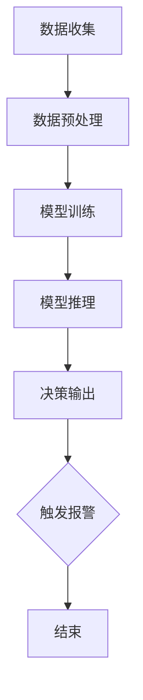
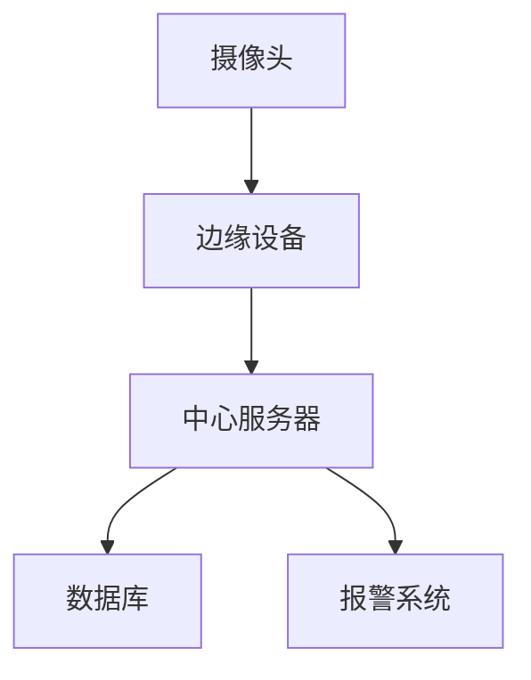
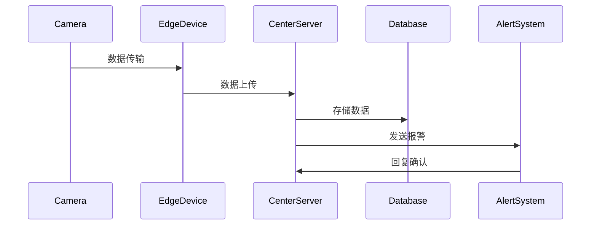

                 

### 边缘AI在智能安防系统中的应用：实现实时威胁识别

## 概述

边缘AI（Edge AI）是近年来信息技术领域的重要发展方向，它通过在靠近数据源的地方（如传感器、手机、工业设备等）进行数据处理和决策，极大地提升了系统的实时性、降低了带宽压力，同时也保障了数据的安全性和隐私性。智能安防系统则借助先进的技术手段，如视频监控、人脸识别、入侵检测等，对安全监控进行智能化处理，以提升威胁检测的准确性和响应速度。

本文将围绕“边缘AI在智能安防系统中的应用：实现实时威胁识别”这一主题，系统地探讨边缘AI技术如何在智能安防系统中发挥作用。文章结构如下：

1. **边缘AI技术基础**：介绍边缘AI的定义、核心概念及其在智能安防系统中的应用优势。
2. **核心概念与联系**：明确边缘AI与智能安防系统的核心概念及其相互关系。
3. **算法原理讲解**：详细阐述边缘AI算法的原理，包括数据收集、预处理、模型训练、推理和应用。
4. **数学模型和公式**：使用LaTeX格式给出相关的数学模型和公式，进行详细讲解和举例说明。
5. **系统分析与架构设计**：描述智能安防系统的问题场景和项目目标，并设计系统的功能、架构、接口和交互。
6. **项目实战**：概述项目环境安装和核心实现，提供代码应用解读与分析。
7. **最佳实践与拓展**：总结文章的核心内容，提供最佳实践、注意事项、拓展阅读等。

通过上述结构化的分析，本文旨在为读者提供一个全面、系统的边缘AI在智能安防系统中应用的技术解读，帮助读者深入理解这一前沿技术的核心原理和实践应用。

### 关键词

- 边缘AI
- 智能安防系统
- 实时威胁识别
- 算法原理
- 数学模型
- 系统架构设计
- 项目实战

### 摘要

边缘AI在智能安防系统中具有重要的应用价值，通过在靠近数据源的地方进行数据处理和决策，极大地提升了系统的实时性和威胁检测的准确性。本文系统地探讨了边缘AI技术在智能安防系统中的核心概念、算法原理及其应用实践。文章首先介绍了边缘AI的定义和智能安防系统的现状，随后详细阐述了边缘AI算法的流程、数据预处理、模型训练与推理，以及相关的数学模型和公式。在此基础上，文章提出了智能安防系统的问题场景和项目目标，并设计了系统的功能、架构、接口和交互。通过实际项目案例分析，本文展示了边缘AI在智能安防系统中实现实时威胁识别的具体应用。最后，文章总结了边缘AI在智能安防系统中的应用最佳实践，并提出了注意事项和拓展阅读建议。

### 目录大纲设计步骤

在设计一篇详尽的技术博客文章时，目录大纲的设计是关键的一步。以下将详细描述目录大纲的设计步骤，确保文章结构紧凑、逻辑清晰，并能够吸引读者深入阅读。

#### 第1步：背景介绍

**目的**：为读者提供一个边缘AI和智能安防系统的基本了解，为后续内容奠定基础。

**步骤**：

1. **边缘AI概述**：介绍边缘AI的定义、核心概念、主要特点及其在智能系统中的应用。
2. **智能安防系统现状**：阐述智能安防系统的发展历程、应用场景以及当前面临的挑战。
3. **边缘AI在智能安防系统中的应用潜力与优势**：讨论边缘AI如何解决智能安防系统中的瓶颈问题，如实时性、带宽消耗和数据安全等。

**示例**：

- **边缘AI概述**
  - 定义：边缘AI是分布式人工智能的一个分支，主要在数据源附近进行数据处理和决策。
  - 核心概念：边缘计算、设备智能化、数据隐私保护。
  - 主要特点：低延迟、高效率、降低带宽需求。
  - 应用：智能家居、智能交通、工业自动化等。

- **智能安防系统现状**
  - 发展历程：从传统的模拟监控到基于视频分析的智能监控。
  - 应用场景：城市安防、企业安全、个人安防等。
  - 挑战：实时性要求高、数据量庞大、隐私保护需求强。

- **边缘AI在智能安防系统中的应用潜力与优势**
  - 实时性提升：通过边缘计算减少数据处理延迟，实现快速响应。
  - 数据带宽节省：边缘设备处理部分数据，减轻中心服务器的负担。
  - 数据隐私保护：数据在本地处理，减少数据传输过程中的风险。

#### 第2步：核心概念与联系

**目的**：明确边缘AI与智能安防系统的核心概念及其相互关系，为读者构建概念框架。

**步骤**：

1. **边缘AI核心概念**：介绍边缘AI的基本原理和关键组成部分。
2. **智能安防系统核心概念**：概述智能安防系统的工作原理和主要功能。
3. **相互联系**：分析边缘AI如何与智能安防系统相结合，发挥其优势。

**示例**：

- **边缘AI核心概念**
  - 边缘计算：数据处理在设备端完成，减少网络传输需求。
  - 设备智能化：边缘设备具备自主决策和处理能力。
  - 数据隐私保护：本地化数据处理，降低隐私泄露风险。

- **智能安防系统核心概念**
  - 视频监控：通过摄像头捕捉图像，进行实时监控。
  - 人脸识别：从视频中识别目标人物，实现身份验证。
  - 入侵检测：自动识别异常行为，触发报警。

- **相互联系**
  - 边缘AI与视频监控：边缘设备在本地进行图像处理，实现实时视频分析。
  - 边缘AI与人脸识别：边缘设备进行人脸特征提取，减少传输数据量。
  - 边缘AI与入侵检测：边缘设备实时分析视频流，快速响应入侵事件。

#### 第3步：算法原理讲解

**目的**：深入讲解边缘AI算法的原理，帮助读者理解其工作机制和应用方法。

**步骤**：

1. **边缘AI算法流程**：介绍边缘AI算法的基本步骤和流程。
2. **数据收集与预处理**：阐述数据收集的方法和预处理步骤。
3. **模型训练与推理**：讲解如何使用机器学习模型进行训练和推理。
4. **应用**：分析边缘AI算法在不同智能安防系统中的应用实例。

**示例**：

- **边缘AI算法流程**
  - 数据收集：收集来自传感器、摄像头等设备的数据。
  - 数据预处理：对收集的数据进行清洗、归一化等处理。
  - 模型训练：使用机器学习算法训练模型，如卷积神经网络（CNN）。
  - 模型推理：将新数据输入训练好的模型，进行威胁识别和决策。

- **数据收集与预处理**
  - 数据收集方法：包括实时数据收集和历史数据收集。
  - 数据预处理步骤：去噪、归一化、特征提取等。

- **模型训练与推理**
  - 模型选择：选择合适的机器学习模型，如深度学习模型。
  - 训练过程：通过大量数据训练模型，优化参数。
  - 推理过程：将新数据输入模型，得到预测结果。

- **应用实例**
  - 实时视频分析：边缘设备对视频流进行实时处理，识别异常行为。
  - 人脸识别系统：边缘设备进行人脸识别，快速锁定嫌疑人。
  - 入侵检测系统：边缘设备实时监控，识别入侵事件并触发报警。

#### 第4步：数学模型和数学公式

**目的**：通过数学模型和公式的应用，深入阐述边缘AI算法的原理和性能。

**步骤**：

1. **相关数学模型**：介绍边缘AI算法中使用的主要数学模型。
2. **公式解释**：详细解释每个公式的含义和应用。
3. **举例说明**：使用具体例子来说明公式的应用和算法效果。

**示例**：

- **相关数学模型**
  - 神经网络模型：包括输入层、隐藏层和输出层，用于特征提取和分类。
  - 损失函数：如交叉熵损失函数，用于衡量模型预测与实际结果之间的差距。

- **公式解释**
  - 神经元激活函数：如ReLU函数，用于增加网络的非线性特性。
  - 梯度下降算法：用于优化模型参数，降低损失函数。

- **举例说明**
  - **神经网络模型举例**：假设有一个简单的神经网络，输入层有3个神经元，隐藏层有2个神经元，输出层有1个神经元。使用ReLU函数作为激活函数，训练该网络识别手写数字。
  - **损失函数举例**：使用交叉熵损失函数来训练一个分类模型，该模型需要识别5类物体，输入数据为100个样本。

#### 第5步：系统分析与架构设计方案

**目的**：对智能安防系统进行全面的系统分析和架构设计，确保边缘AI算法的有效应用。

**步骤**：

1. **问题场景介绍**：描述智能安防系统所面临的具体问题和挑战。
2. **项目介绍**：介绍项目目标、背景和主要任务。
3. **系统功能设计**：绘制领域模型类图，描述系统的主要功能。
4. **系统架构设计**：绘制系统架构图，说明各组件之间的关系。
5. **系统接口设计与交互**：设计系统的接口和交互流程，确保各组件协调工作。

**示例**：

- **问题场景介绍**：随着城市化进程的加快，城市安防压力增大，传统的安防监控方式已无法满足实时、高效的要求。需要引入边缘AI技术，提升系统的威胁识别能力和响应速度。

- **项目介绍**：本项目的目标是构建一个基于边缘AI的智能安防系统，实现实时威胁识别和报警功能，提高城市安防水平。

- **系统功能设计**
  - 类图：绘制系统的主要类，如摄像头、边缘设备、数据库、报警系统等，并标注其功能。
  - 功能描述：摄像头采集视频数据，边缘设备进行实时处理和威胁识别，数据库存储数据和日志，报警系统接收报警信息并通知相关方。

- **系统架构设计**
  - 架构图：展示系统的整体架构，包括边缘设备、中心服务器、数据库和报警系统等。
  - 架构描述：边缘设备负责数据采集和处理，中心服务器负责数据存储和监控，报警系统实时接收和处理报警信息。

- **系统接口设计与交互**
  - 接口设计：定义边缘设备和中心服务器之间的数据传输接口，如HTTP API。
  - 交互流程：描述边缘设备采集数据、处理数据、发送数据到中心服务器的过程，以及中心服务器接收数据、处理数据、触发报警的流程。

#### 第6步：项目实战

**目的**：通过具体项目实战，展示边缘AI在智能安防系统中的应用过程，帮助读者理解实际操作步骤。

**步骤**：

1. **环境安装**：介绍项目环境的搭建过程，包括所需软件和硬件的安装。
2. **系统核心实现**：展示系统的核心代码实现，包括边缘设备和中心服务器的代码。
3. **代码应用解读**：详细解读关键代码的功能和实现原理。
4. **实际案例分析**：分析实际应用中的问题和挑战，并提出解决方案。

**示例**：

- **环境安装**
  - 安装Python环境，并使用pip安装相关库，如TensorFlow、OpenCV等。
  - 安装边缘设备硬件，如Raspberry Pi，并设置网络连接。

- **系统核心实现**
  - 边缘设备代码：采集视频数据，使用卷积神经网络进行实时威胁识别，并将结果发送到中心服务器。
  - 中心服务器代码：接收边缘设备发送的数据，存储到数据库中，并根据威胁级别触发报警。

- **代码应用解读**
  - **边缘设备代码解读**：介绍视频采集、预处理、模型推理和数据发送的过程。
  - **中心服务器代码解读**：介绍数据接收、存储、分析和报警触发的流程。

- **实际案例分析**
  - **问题分析**：在实际应用中，可能遇到网络不稳定、数据丢失等问题。
  - **解决方案**：通过优化网络连接、增加数据冗余和实时监控等方法来提高系统的稳定性和可靠性。

#### 第7步：最佳实践与拓展

**目的**：总结边缘AI在智能安防系统中的最佳实践，提供拓展阅读建议，帮助读者深入学习和应用。

**步骤**：

1. **最佳实践**：总结边缘AI在智能安防系统中的成功应用经验，提供具体的操作建议。
2. **小结**：回顾文章的核心内容和主要观点。
3. **注意事项**：提醒读者在实际应用中需要注意的问题和风险。
4. **拓展阅读**：推荐相关书籍、论文和资源，供读者进一步学习。

**示例**：

- **最佳实践**：
  - 选择合适的硬件和软件环境，确保系统的稳定运行。
  - 根据实际需求调整模型参数，提高威胁识别的准确性。
  - 定期更新边缘设备软件，以适应新的威胁模式。

- **小结**：
  - 边缘AI在智能安防系统中发挥了重要作用，通过实时威胁识别和快速响应，提升了系统的安全性能。
  - 文章详细介绍了边缘AI算法原理、系统架构设计和项目实战过程，为读者提供了全面的技术指导。

- **注意事项**：
  - 注意数据安全和隐私保护，避免敏感数据泄露。
  - 定期对系统进行性能测试和优化，确保其长期稳定运行。

- **拓展阅读**：
  - 推荐阅读《边缘计算：从理论到实践》一书，深入了解边缘计算技术。
  - 参考相关论文，如“边缘AI在智能安防中的应用研究”，探索前沿技术。

### 目录大纲示例

根据上述步骤和示例，以下是《边缘AI在智能安防系统中的应用：实现实时威胁识别》的目录大纲：

```markdown
# 边缘AI在智能安防系统中的应用：实现实时威胁识别

# 文章关键词
- 边缘AI
- 智能安防系统
- 实时威胁识别
- 算法原理
- 数学模型
- 系统架构设计

# 摘要
本文系统地探讨了边缘AI在智能安防系统中的应用，包括技术基础、核心概念、算法原理、数学模型、系统架构设计、项目实战以及最佳实践等。

## 第一部分：边缘AI技术基础

### 第1章：边缘AI概述
#### 1.1 边缘AI的定义与核心概念
#### 1.2 边缘AI与云计算的区别
#### 1.3 边缘AI的优势与挑战

### 第2章：核心概念与联系
#### 2.1 边缘AI关键概念
#### 2.2 智能安防系统的核心概念
#### 2.3 边缘AI与智能安防系统的联系

## 第二部分：算法原理讲解

### 第3章：边缘AI算法原理
#### 3.1 边缘AI算法流程
#### 3.2 数据收集与预处理
#### 3.3 模型训练与推理
#### 3.4 边缘AI算法Python代码示例

### 第4章：数学模型和数学公式
#### 4.1 边缘AI中的数学模型
#### 4.2 公式解释与示例

## 第三部分：系统分析与架构设计

### 第5章：智能安防系统分析与架构设计
#### 5.1 智能安防系统问题场景
#### 5.2 系统功能设计
#### 5.3 系统架构设计
#### 5.4 系统接口设计与交互

## 第四部分：项目实战

### 第6章：项目实战
#### 6.1 环境安装
#### 6.2 系统核心实现源代码
#### 6.3 代码应用解读与分析
#### 6.4 实际案例解析

## 第五部分：最佳实践与拓展

### 第7章：最佳实践与拓展
#### 7.1 边缘AI在智能安防系统中的应用最佳实践
#### 7.2 注意事项
#### 7.3 拓展阅读
```

通过以上详细的目录大纲设计，文章的结构将更加清晰，内容也将更加系统化，有助于读者更好地理解和应用边缘AI技术在智能安防系统中的实现。

### 边缘AI技术基础

#### 边缘AI的定义与核心概念

边缘AI（Edge AI）是分布式人工智能（Distributed Artificial Intelligence，简称DAI）的一个重要分支，其核心理念是将数据处理和决策能力从传统的中心化服务器或云计算平台，迁移到靠近数据源的地方，即边缘设备。边缘设备可以是传感器、智能手机、工业机器人等，它们具备一定的计算、存储和通信能力，可以在本地实时处理和分析数据。

边缘AI的关键概念包括：

1. **边缘计算**：指在靠近数据源的设备上执行计算任务，减少对中心服务器的依赖。边缘计算的主要目标是降低延迟、节省带宽和增强安全性。
2. **设备智能化**：指通过集成人工智能算法，使得边缘设备能够自主地处理和决策，而不是仅仅作为数据传输的通道。这包括机器学习模型在边缘设备上的训练和部署。
3. **数据隐私保护**：由于边缘设备处理的数据不传输到中心服务器，因此可以减少数据泄露的风险，更好地保护用户隐私。

边缘AI的兴起源于以下几个方面的需求：

- **实时性要求**：在一些应用场景中，如自动驾驶、智能监控等，需要实时响应，中心化服务器可能因为网络延迟而无法满足需求。
- **带宽节省**：大量的数据传输到中心服务器会占用大量带宽，而边缘设备可以在本地处理数据，减少传输需求。
- **数据处理能力提升**：随着物联网（IoT）设备数量的增加，中心服务器可能无法处理如此海量的数据，边缘设备可以分担部分计算任务，提高整体数据处理能力。
- **数据隐私和安全**：边缘设备可以本地化处理数据，减少数据在传输过程中的泄露风险。

#### 边缘AI与云计算的区别

云计算和边缘AI都是现代信息技术的重要组成部分，但它们在数据处理和决策方面有着显著的区别：

- **数据处理位置**：云计算主要在中心化的服务器或云端进行数据处理和决策，而边缘AI则将数据处理和决策迁移到边缘设备，即靠近数据源的地方。
- **延迟和响应时间**：由于数据不需要传输到中心服务器，边缘AI可以提供更低的延迟和更快的响应时间，这对于需要实时处理的场景尤为重要。
- **带宽需求**：边缘AI通过减少数据传输量来降低带宽需求，而云计算需要传输大量的数据到中心服务器，这可能会导致带宽不足。
- **安全性和隐私**：边缘AI可以在本地处理数据，从而减少数据泄露的风险，而云计算则需要高度依赖数据加密和隐私保护技术。

#### 边缘AI的优势与挑战

边缘AI在智能安防系统中具有显著的优势：

- **实时性提升**：边缘设备可以本地处理数据，实现毫秒级的响应，这对于威胁识别和快速响应至关重要。
- **带宽节省**：通过在边缘设备上处理数据，可以大大减少需要传输到中心服务器的数据量，降低带宽压力。
- **增强安全性**：本地处理数据可以减少数据在传输过程中的风险，更好地保护用户隐私。
- **提高系统可靠性**：边缘设备可以独立运行，即使在网络不稳定或断开连接的情况下也能正常工作。

然而，边缘AI也面临一些挑战：

- **计算能力限制**：边缘设备的计算资源通常有限，对于复杂的机器学习任务可能难以胜任。
- **数据一致性和同步**：在分布式系统中，如何保证数据的一致性和同步是一个挑战。
- **维护和升级**：边缘设备的维护和软件升级可能比较困难，需要考虑远程管理和自动化部署。
- **安全和隐私保护**：尽管边缘AI在本地处理数据，但仍需确保数据传输过程中的安全性和隐私保护。

通过克服这些挑战，边缘AI将在智能安防系统中发挥越来越重要的作用，为实时威胁识别和快速响应提供强有力的技术支持。

#### 智能安防系统现状

智能安防系统是利用先进的技术手段，对安全监控进行智能化处理，以提高威胁检测的准确性和响应速度。随着物联网、人工智能和大数据技术的不断发展，智能安防系统已经成为社会安全保障体系的重要组成部分。以下将从发展历程、应用场景以及当前面临的挑战三个方面，对智能安防系统的现状进行概述。

##### 发展历程

智能安防系统的发展大致可以分为以下几个阶段：

1. **模拟监控阶段**：最早的安防监控主要依赖于模拟摄像头，通过人工分析和记录视频资料进行安全监控。这一阶段的监控技术相对简单，但存在响应速度慢、准确率低等问题。
2. **数字化监控阶段**：随着数字技术的发展，模拟监控逐渐被数字化监控所替代。数字化监控通过将视频信号数字化并存储在硬盘录像机（DVR）中，提高了监控的效率和准确度。
3. **智能化监控阶段**：随着人工智能技术的应用，智能安防系统逐渐兴起。通过视频分析、人脸识别、行为识别等技术，智能安防系统能够自动识别和分类监控目标，实现智能化的安全监控。

##### 应用场景

智能安防系统广泛应用于各种场景，包括：

1. **城市安防**：在城市道路、公园、交通枢纽等人流密集区域，智能安防系统能够通过视频监控和智能分析，实时监测和预警安全隐患，提高城市的安全管理水平。
2. **企业安全**：在商业楼宇、工厂、科研院所等企业场所，智能安防系统能够对入侵、火灾、异常行为等进行实时监控，保护企业财产和员工安全。
3. **个人安防**：在家庭、个人工作室等私人场所，智能安防系统可以通过摄像头、门锁、报警器等设备，实现对家庭安全的全方位监控和保护。
4. **交通管理**：在交通领域，智能安防系统可以实时监控交通流量，通过智能分析实现交通拥堵预警、事故处理等，提高交通管理效率。

##### 当前面临的挑战

尽管智能安防系统在提高安全监控能力方面取得了显著进展，但仍然面临一些挑战：

1. **实时性要求**：在紧急情况下，如突发事件、入侵事件等，需要安防系统能够快速响应和报警。然而，现有的智能安防系统在处理大量数据时，仍可能存在延迟问题。
2. **数据隐私保护**：智能安防系统需要处理大量的个人数据，包括人脸、行为等敏感信息。如何保护用户隐私，防止数据泄露，是当前智能安防系统面临的一个重要挑战。
3. **系统稳定性**：智能安防系统通常需要在复杂环境下运行，如高温、高寒、高噪音等，系统的稳定性是一个需要关注的问题。
4. **跨平台兼容性**：智能安防系统通常涉及多种设备和技术，如摄像头、传感器、报警器等。如何实现这些设备的无缝集成和跨平台兼容，是当前的一个难题。

##### 边缘AI在智能安防系统中的应用

边缘AI技术为智能安防系统提供了新的解决方案，特别是在实时性和数据隐私保护方面：

1. **实时威胁识别**：边缘AI可以在本地实时处理视频数据，实现快速威胁识别和响应。例如，边缘设备可以在摄像头捕捉到异常行为后，立即进行识别并触发报警，而不需要将数据上传到中心服务器。
2. **数据隐私保护**：通过边缘AI技术，可以在本地进行数据预处理和部分分析，减少需要传输到中心服务器的数据量，从而降低数据泄露的风险。
3. **分布式数据处理**：边缘AI能够将数据处理分散到各个边缘设备上，减轻中心服务器的负担，提高系统的整体性能和稳定性。

总之，随着边缘AI技术的不断发展，其在智能安防系统中的应用将越来越广泛，为提升安全监控水平提供强有力的技术支持。

#### 边缘AI在智能安防系统中的应用潜力与优势

边缘AI在智能安防系统中具有显著的应用潜力与优势，特别是在实时威胁识别方面，能够显著提升系统的效率和准确性。以下将详细探讨边缘AI在智能安防系统中的应用潜力、优势以及其实际应用中的效果。

##### 应用潜力

1. **实时数据处理与威胁识别**：边缘AI技术能够在数据产生的地方（如传感器、摄像头等）立即处理数据，进行威胁识别。这种本地化处理能力使得系统能够在毫秒级内响应，对于快速响应和行动至关重要。例如，在交通监控中，边缘AI可以实时分析车辆和行人的行为，识别潜在的危险情况，如行人闯红灯、车辆逆行等，并及时发出警报。
   
2. **减少延迟和带宽消耗**：传统的智能安防系统需要将大量数据传输到中心服务器进行分析，这不仅消耗大量的网络带宽，还可能导致延迟。边缘AI通过在本地设备上进行数据预处理和分析，可以大幅减少需要传输的数据量，降低网络延迟，提高系统的响应速度。

3. **提高数据隐私保护**：边缘AI的本地化数据处理能力能够有效保护数据隐私，减少数据泄露的风险。在智能安防系统中，许多数据（如人脸图像、行为特征等）都属于敏感信息，通过在边缘设备上处理，可以避免数据在传输过程中被未授权访问。

4. **增强系统的鲁棒性和可靠性**：边缘AI技术能够提高系统的鲁棒性和可靠性。由于边缘设备具备一定的计算和存储能力，即使在网络不稳定或中心服务器故障的情况下，边缘设备仍能独立运行，确保系统的连续性和稳定性。

##### 优势

1. **高效实时处理**：边缘AI能够实时处理和分析数据，使得威胁识别更加迅速和准确。这对于需要即时响应的场景尤为重要，如犯罪现场、紧急事件等。

2. **降低带宽需求**：通过在边缘设备上进行数据预处理和分析，边缘AI能够显著减少需要传输到中心服务器的数据量，降低网络带宽消耗，提高系统整体效率。

3. **增强安全性**：边缘AI可以在本地进行威胁识别和决策，减少数据传输过程中的风险，提高系统的安全性。此外，边缘设备通常采用加密通信协议，进一步保障数据安全。

4. **分布式处理**：边缘AI技术支持分布式数据处理，可以同时利用多个边缘设备协同工作，提升系统的整体性能和容错能力。

##### 实际应用中的效果

1. **城市安防**：在许多城市，边缘AI已经被应用于城市安防系统中。例如，通过在街头安装的边缘设备实时监控人流、车辆和犯罪活动，系统可以在发现异常行为时立即发出警报，提高城市的安全管理水平。

2. **交通监控**：在交通领域，边缘AI可以实时分析交通流量和车辆行为，实现智能交通管理和事故预警。例如，通过边缘设备实时检测车辆速度、行驶方向和交通密度，系统能够提前识别交通拥堵和事故风险，及时采取措施避免交通事故的发生。

3. **公共安全**：在公共场所（如机场、火车站、购物中心等），边缘AI系统能够实时监控人员行为，识别潜在的安全威胁。例如，通过边缘设备实时分析人脸图像和人体动作，系统可以识别可疑人物和行为，提高公共安全水平。

4. **智能家居**：在智能家居领域，边缘AI可以用于实时监控家庭安全。例如，通过边缘设备实时监控家庭成员的行为和异常活动，系统可以在发现入侵或紧急情况时立即发出警报，保障家庭成员的安全。

综上所述，边缘AI在智能安防系统中具有广泛的应用潜力和显著的优势。通过实时数据处理、减少延迟、增强安全性和分布式处理，边缘AI能够大幅提升智能安防系统的效率和准确性，为构建更加安全、智能的城市和社会提供强有力的技术支持。

### 核心概念与联系

#### 边缘AI核心概念

边缘AI的核心概念主要包括边缘计算、设备智能化和数据隐私保护。这些概念不仅构成了边缘AI的基本架构，也在智能安防系统中发挥着至关重要的作用。

1. **边缘计算**：边缘计算是指在网络边缘（如传感器、设备端）进行数据处理和决策，以减少对中心服务器的依赖。边缘计算的核心优势在于能够降低数据传输延迟、节省带宽，并提高系统的响应速度。在智能安防系统中，边缘计算允许实时处理监控视频数据，快速识别潜在的威胁。

2. **设备智能化**：设备智能化是指通过集成机器学习和人工智能算法，使得边缘设备能够自主进行数据分析和决策。智能安防系统中的边缘设备可以通过本地化的数据处理，识别异常行为、异常事件，并触发相应的警报。例如，智能摄像头可以通过分析图像中的运动目标，判断是否为可疑行为，并在发现潜在威胁时立即报警。

3. **数据隐私保护**：数据隐私保护是边缘AI的一个重要方面。由于边缘设备在本地处理数据，可以显著减少数据在传输过程中被泄露的风险。在智能安防系统中，数据隐私保护尤为重要，因为涉及到的数据通常包括个人隐私信息，如人脸图像、行为轨迹等。通过本地化数据处理，可以有效保护这些敏感数据，防止未经授权的访问。

#### 智能安防系统核心概念

智能安防系统涉及多个核心概念，包括视频监控、人脸识别、入侵检测等。这些概念共同构成了智能安防系统的功能基础。

1. **视频监控**：视频监控是智能安防系统的基本组成部分，通过摄像头捕捉实时视频画面，实现对目标区域的监控。视频监控系统能够在早期阶段发现异常情况，如非法入侵、可疑行为等，并提供视频证据。

2. **人脸识别**：人脸识别技术通过分析摄像头捕获的人脸图像，识别和验证人员身份。在智能安防系统中，人脸识别可以用于门禁控制、身份验证、嫌疑人追踪等。通过边缘AI技术，人脸识别能够在本地设备上进行实时处理，快速识别目标人物。

3. **入侵检测**：入侵检测系统（IDS）是智能安防系统中的一个重要组成部分，用于检测和响应未授权访问或恶意行为。入侵检测可以通过多种方式实现，包括网络流量分析、行为模式识别、异常检测等。在边缘AI的支持下，入侵检测系统可以在本地实时分析数据，迅速识别威胁，并触发警报。

#### 边缘AI与智能安防系统的联系

边缘AI与智能安防系统之间的联系体现在以下几个方面：

1. **数据处理能力**：边缘AI能够提升智能安防系统的数据处理能力。通过在本地设备上进行数据预处理和分析，边缘AI可以显著减少需要传输到中心服务器的数据量，提高系统的实时性和响应速度。例如，边缘AI可以在摄像头本地进行视频分析，识别潜在威胁，并在发现异常时立即发出警报，而不需要将视频数据传输到中心服务器进行进一步处理。

2. **安全性和隐私保护**：边缘AI在本地处理数据，可以有效减少数据泄露的风险，保护用户隐私。在智能安防系统中，涉及大量个人隐私信息，如人脸图像、行为轨迹等。通过在边缘设备上进行数据处理，可以避免这些敏感数据在传输过程中被未授权访问。

3. **分布式计算和协同工作**：边缘AI支持分布式计算，多个边缘设备可以协同工作，共同完成复杂的任务。在智能安防系统中，可以通过多个边缘设备同时工作，提高系统的检测和响应能力。例如，一个摄像头发现异常后，可以立即通知附近的边缘设备协同处理，确保威胁得到及时响应。

4. **智能化的威胁识别**：边缘AI通过机器学习和深度学习算法，可以在边缘设备上进行智能化的威胁识别。这使得智能安防系统不仅能够检测已知的威胁，还能够识别新的、未知的威胁。例如，通过训练边缘设备上的机器学习模型，系统可以学习并识别特定场景中的异常行为，从而提高威胁识别的准确性。

通过上述分析，我们可以看到边缘AI与智能安防系统在数据处理、安全性和隐私保护、分布式计算和智能化威胁识别等方面具有紧密的联系。边缘AI技术的应用，不仅提升了智能安防系统的性能和效率，也为实现更安全、更智能的监控提供了强有力的技术支持。

### 边缘AI算法原理讲解

边缘AI算法的核心在于如何将复杂的人工智能模型和算法应用于有限的计算资源中，以实现高效的实时数据处理和威胁识别。以下是边缘AI算法的原理讲解，包括数据收集、预处理、模型训练、推理和应用的过程，并使用mermaid绘制算法流程图以及Python代码示例。

#### 数据收集

数据收集是边缘AI算法的基础，涉及从各种传感器、摄像头和其他设备中收集数据。这些数据可以是静态的（如图像、音频）或动态的（如视频、实时流）。在智能安防系统中，数据收集主要包括以下步骤：

1. **采集原始数据**：通过摄像头、传感器等设备收集视频、音频、环境数据等。
2. **数据同步**：确保收集的数据在时间上保持一致，以便后续处理和分析。

#### 数据预处理

数据预处理是数据收集后的重要步骤，目的是提高数据质量和模型训练效果。预处理过程通常包括以下步骤：

1. **去噪**：去除数据中的噪声，如图像中的干扰点、音频中的背景噪声。
2. **归一化**：将数据转换为标准格式，如将像素值归一化到0-1范围内。
3. **特征提取**：从原始数据中提取有用的特征，如人脸特征点、物体轮廓等。

#### 模型训练

模型训练是边缘AI算法的核心步骤，目的是通过学习大量的数据来构建有效的预测模型。在智能安防系统中，常用的模型训练方法包括：

1. **数据分割**：将数据集划分为训练集、验证集和测试集，用于训练、验证和测试模型性能。
2. **模型选择**：选择合适的机器学习模型，如卷积神经网络（CNN）、循环神经网络（RNN）等。
3. **训练过程**：使用训练集数据训练模型，通过不断调整模型参数，优化模型性能。

#### 模型推理

模型推理是指将训练好的模型应用于新数据，以进行预测和决策。在边缘AI中，模型推理通常在本地设备上进行，以实现快速响应。模型推理过程包括：

1. **输入处理**：将新数据输入到训练好的模型中，进行预处理和特征提取。
2. **预测生成**：模型对输入数据进行预测，输出结果，如威胁类型、异常行为等。
3. **决策输出**：根据预测结果，触发相应的报警或响应机制。

#### 边缘AI算法流程图

以下是边缘AI算法的mermaid流程图示例：



#### Python代码示例

以下是一个简单的Python代码示例，用于展示边缘AI算法的原理：

```python
# 导入必要的库
import cv2
import numpy as np
from tensorflow.keras.models import load_model

# 初始化摄像头
cap = cv2.VideoCapture(0)

# 加载训练好的模型
model = load_model('model.h5')

# 数据预处理函数
def preprocess_data(frame):
    # 去噪、归一化、特征提取
    processed_frame = cv2.resize(frame, (224, 224))
    processed_frame = processed_frame / 255.0
    processed_frame = np.expand_dims(processed_frame, axis=0)
    return processed_frame

# 模型推理函数
def predict(frame):
    processed_frame = preprocess_data(frame)
    prediction = model.predict(processed_frame)
    return prediction

# 循环捕捉视频帧并处理
while True:
    ret, frame = cap.read()
    if not ret:
        break
    
    # 模型推理
    prediction = predict(frame)
    
    # 根据预测结果触发报警
    if prediction > 0.5:
        print("威胁检测！")
    
    # 显示视频帧
    cv2.imshow('Video Frame', frame)
    
    # 按下'q'键退出
    if cv2.waitKey(1) & 0xFF == ord('q'):
        break

# 释放摄像头资源
cap.release()
cv2.destroyAllWindows()
```

#### 数学模型和公式

边缘AI算法中常用的数学模型和公式包括：

1. **卷积神经网络（CNN）**：
   - **激活函数**：ReLU（$f(x) = \max(0, x)$）
   - **损失函数**：交叉熵损失函数（$H(y, \hat{y}) = -\sum_{i} y_i \log(\hat{y}_i)$）
   - **反向传播算法**：梯度下降（$\theta = \theta - \alpha \nabla_{\theta}J(\theta)$）

2. **循环神经网络（RNN）**：
   - **状态更新公式**：$h_t = \sigma(W_h \cdot [h_{t-1}, x_t] + b_h)$
   - **输出公式**：$y_t = \sigma(W_y \cdot h_t + b_y)$

以下是一个简单的LaTeX格式数学公式示例：

```latex
$$
h_t = \sigma(W_h \cdot [h_{t-1}, x_t] + b_h)
$$
```

通过上述讲解，我们可以看到边缘AI算法在数据收集、预处理、模型训练、推理和应用等方面具有系统化和结构化的特点。这些原理的应用不仅提升了智能安防系统的性能和效率，也为边缘AI技术在其他领域的应用提供了参考。

### 数学模型和数学公式

边缘AI算法在智能安防系统中发挥核心作用，其实现依赖于一系列数学模型和公式。以下将详细介绍边缘AI算法中常用的数学模型和公式，并通过具体的例子说明如何使用这些公式进行算法设计和实现。

#### 相关数学模型

1. **卷积神经网络（CNN）**：CNN是边缘AI算法中常用的模型，用于图像和视频数据的处理。其主要数学模型包括：
   - **卷积操作**：$C_{ij} = \sum_{k} f_{ik} * g_{kj}$，其中$f$和$g$分别是卷积核，$C$是卷积结果。
   - **激活函数**：ReLU函数，$a_i = \max(0, z_i)$，用于增加网络的非线性特性。

2. **循环神经网络（RNN）**：RNN适用于处理序列数据，如时间序列、文本等。其主要数学模型包括：
   - **状态更新公式**：$h_t = \sigma(W_h \cdot [h_{t-1}, x_t] + b_h)$，其中$h_t$是当前状态，$x_t$是输入。
   - **输出公式**：$y_t = \sigma(W_y \cdot h_t + b_y)$，用于生成预测结果。

3. **损失函数**：常用的损失函数包括均方误差（MSE）和交叉熵损失函数（Cross-Entropy Loss）：
   - **均方误差**：$L = \frac{1}{n} \sum_{i=1}^{n} (y_i - \hat{y}_i)^2$，用于回归问题。
   - **交叉熵损失函数**：$L = -\sum_{i} y_i \log(\hat{y}_i)$，用于分类问题。

4. **优化算法**：常用的优化算法包括梯度下降（Gradient Descent）和随机梯度下降（Stochastic Gradient Descent，SGD）：
   - **梯度下降**：$\theta = \theta - \alpha \nabla_{\theta}J(\theta)$，其中$\theta$是模型参数，$J(\theta)$是损失函数。
   - **随机梯度下降**：$\theta = \theta - \alpha \nabla_{\theta}J(\theta)$，其中每个梯度计算只涉及一个样本。

#### 公式解释与示例

以下通过具体的例子，详细解释这些公式在边缘AI算法中的应用：

1. **卷积神经网络（CNN）示例**：

   假设我们有一个简单的卷积神经网络，用于识别图像中的猫。输入图像的大小为$28 \times 28$，卷积核大小为$3 \times 3$。以下是卷积操作的数学公式：

   ```latex
   C_{ij} = \sum_{k} f_{ik} * g_{kj}
   ```

   其中，$f_{ik}$和$g_{kj}$分别是卷积核，$C_{ij}$是卷积结果。

   假设卷积核$f$和$g$的值如下：

   ```latex
   f = \begin{bmatrix}
       1 & 0 & -1 \\
       1 & 0 & -1 \\
       1 & 0 & -1
   \end{bmatrix}
   g = \begin{bmatrix}
       1 & 1 & 1 \\
       1 & 1 & 1 \\
       1 & 1 & 1
   \end{bmatrix}
   ```

   对应的卷积结果为：

   ```latex
   C = \begin{bmatrix}
       3 & 0 & -3 \\
       3 & 0 & -3 \\
       3 & 0 & -3
   \end{bmatrix}
   ```

   通过激活函数ReLU，可以将结果转换为：

   ```latex
   a = \begin{bmatrix}
       3 & 0 & 0 \\
       3 & 0 & 0 \\
       3 & 0 & 0
   \end{bmatrix}
   ```

2. **循环神经网络（RNN）示例**：

   假设我们有一个RNN模型，用于识别时间序列数据。输入序列$x$为$(x_1, x_2, \ldots, x_n)$，隐藏状态$h$为$(h_1, h_2, \ldots, h_n)$。以下是RNN的状态更新公式：

   ```latex
   h_t = \sigma(W_h \cdot [h_{t-1}, x_t] + b_h)
   ```

   假设权重$W_h$和偏置$b_h$如下：

   ```latex
   W_h = \begin{bmatrix}
       0.1 & 0.2 \\
       0.3 & 0.4
   \end{bmatrix}
   b_h = \begin{bmatrix}
       0.5 \\
       0.6
   \end{bmatrix}
   ```

   输入序列$x$为$(1, 0)$，则隐藏状态更新为：

   ```latex
   h_1 = \sigma(0.1 \cdot 1 + 0.2 \cdot 0 + 0.5) = \sigma(0.6) = 0.6
   h_2 = \sigma(0.3 \cdot 1 + 0.4 \cdot 0 + 0.6) = \sigma(1.1) = 1
   ```

   最终隐藏状态$h$为$(0.6, 1)$。

3. **损失函数和优化算法示例**：

   假设我们使用交叉熵损失函数来训练一个分类模型，输入数据$y$为实际标签，预测输出$\hat{y}$为模型的预测结果。以下是交叉熵损失函数的数学公式：

   ```latex
   L = -\sum_{i} y_i \log(\hat{y}_i)
   ```

   假设实际标签$y$为$(1, 0, 0)$，预测输出$\hat{y}$为$(0.8, 0.1, 0.1)$，则交叉熵损失为：

   ```latex
   L = -1 \cdot \log(0.8) - 0 \cdot \log(0.1) - 0 \cdot \log(0.1) = -\log(0.8) \approx 0.223
   ```

   通过梯度下降算法进行优化，更新模型参数：

   ```latex
   \theta = \theta - \alpha \nabla_{\theta}L
   ```

   其中，$\alpha$为学习率。假设当前模型参数$\theta$为$(0.5, 0.5)$，学习率$\alpha$为0.01，则参数更新为：

   ```latex
   \theta_1 = 0.5 - 0.01 \cdot \nabla_{\theta_1}L = 0.5 - 0.01 \cdot (1 - 0.8) = 0.42
   \theta_2 = 0.5 - 0.01 \cdot (0 - 0.1) = 0.51
   ```

   最终更新后的模型参数为$(0.42, 0.51)$。

通过上述例子，我们可以看到数学模型和公式在边缘AI算法中的关键作用。这些公式不仅帮助我们理解和设计算法，也为实现高效的威胁识别提供了理论基础。在边缘AI算法的实际应用中，合理选择和使用数学模型和公式，可以显著提高系统的性能和准确性。

### 系统分析与架构设计方案

#### 智能安防系统问题场景

智能安防系统的主要目标是实时监控并识别潜在的安全威胁，确保人员和财产的安全。随着城市化进程的加快，公共安全需求日益增加，传统的安防监控方式已无法满足快速响应和高效管理的需求。智能安防系统需要能够处理大量实时数据，快速识别威胁，并及时采取行动。以下是一个典型的智能安防系统问题场景：

**场景描述**：

在一个大型购物中心，管理者希望部署一套智能安防系统，以提升场所的安全管理水平。该系统需要具备以下功能：

1. **实时监控**：通过摄像头捕捉实时视频画面，对公共场所进行24小时监控。
2. **威胁识别**：系统能够实时分析视频数据，识别潜在的威胁，如可疑人物、非法入侵、异常行为等。
3. **快速响应**：当系统检测到潜在威胁时，能够迅速发出警报，通知相关人员并采取行动。
4. **数据存储**：系统能够将监控数据和报警记录存储在数据库中，以供后续分析和回溯。

#### 项目介绍

本项目的目标是设计并实现一个基于边缘AI技术的智能安防系统，以满足上述场景需求。项目的主要任务包括：

1. **系统需求分析**：明确系统功能需求，包括实时监控、威胁识别、快速响应和数据存储。
2. **技术选型**：选择合适的硬件和软件，包括边缘设备、摄像头、存储设备和边缘AI算法框架。
3. **系统架构设计**：设计系统的整体架构，包括边缘设备、中心服务器、数据库和报警系统等。
4. **功能实现**：编写系统代码，实现实时监控、威胁识别、快速响应和数据存储等功能。
5. **系统测试与优化**：对系统进行测试，优化性能和可靠性，确保系统稳定运行。

#### 系统功能设计

智能安防系统的核心功能包括实时监控、威胁识别、快速响应和数据存储。以下使用mermaid类图展示系统的功能模块及其关系：

```mermaid
classDiagram
    Camera <<接口>> Camera
    EdgeDevice <<类>> EdgeDevice : +Camera, +数据处理, +威胁识别
    CenterServer <<类>> CenterServer : +数据存储, +报警通知
    Database <<类>> Database : +数据存储, +数据检索
    AlertSystem <<类>> AlertSystem : +快速响应, +报警通知

    Camera --|> EdgeDevice : 数据传输
    EdgeDevice --|> CenterServer : 数据上传
    CenterServer --|> Database : 存储数据
    CenterServer --|> AlertSystem : 发送报警
```

**功能描述**：

1. **摄像头（Camera）**：摄像头是系统数据采集的入口，负责捕捉实时视频画面。摄像头通过接口与边缘设备通信，将视频数据传输给边缘设备进行进一步处理。

2. **边缘设备（EdgeDevice）**：边缘设备是系统核心处理单元，负责接收摄像头传输的视频数据，进行实时处理和威胁识别。边缘设备集成了边缘AI算法，能够在本地进行威胁识别和快速响应。

3. **中心服务器（CenterServer）**：中心服务器负责数据存储和监控。边缘设备将处理后的数据上传到中心服务器，中心服务器将数据存储在数据库中，并监控系统的运行状态。

4. **数据库（Database）**：数据库用于存储摄像头捕捉的视频数据、威胁识别结果和报警记录。数据库提供数据检索接口，以便后续分析和回溯。

5. **报警系统（AlertSystem）**：报警系统负责快速响应和报警通知。当边缘设备检测到潜在威胁时，报警系统将立即发出警报，通知相关人员并采取行动。

#### 系统架构设计

智能安防系统的整体架构包括边缘设备、中心服务器、数据库和报警系统等。以下使用mermaid架构图展示系统各组件之间的关系：



**架构描述**：

1. **边缘设备**：边缘设备安装在公共场所，如购物中心、商场等，负责实时监控和威胁识别。边缘设备集成了摄像头和边缘AI算法，能够在本地进行数据预处理和威胁识别，并将处理结果上传到中心服务器。

2. **中心服务器**：中心服务器是系统的核心处理单元，负责接收边缘设备上传的数据，存储在数据库中，并根据威胁级别触发报警。中心服务器还负责监控边缘设备的运行状态，确保系统的稳定性。

3. **数据库**：数据库用于存储摄像头捕捉的视频数据、威胁识别结果和报警记录。数据库提供高效的数据检索接口，以便后续分析和回溯。数据库采用分布式架构，以提高存储和处理能力。

4. **报警系统**：报警系统负责快速响应和报警通知。当边缘设备检测到潜在威胁时，报警系统将立即发出警报，通知相关人员并采取行动。报警系统可以通过短信、邮件、语音等多种方式发送报警信息。

#### 系统接口设计与交互

智能安防系统的接口设计和交互流程是确保各组件协调工作的关键。以下使用mermaid序列图展示系统各组件的交互流程：



**交互流程**：

1. **数据传输**：摄像头捕捉实时视频画面，通过接口将视频数据传输给边缘设备。

2. **数据上传**：边缘设备接收视频数据，进行预处理和威胁识别，并将处理结果上传到中心服务器。

3. **数据存储**：中心服务器接收边缘设备上传的数据，将视频数据和威胁识别结果存储在数据库中。

4. **发送报警**：当边缘设备检测到潜在威胁时，中心服务器根据威胁级别触发报警，通知相关人员。

5. **回复确认**：报警系统收到报警信息后，进行确认并回复中心服务器。

通过上述系统分析与架构设计方案，我们可以看到智能安防系统在问题场景中的具体应用，以及如何通过边缘AI技术实现实时威胁识别和快速响应。系统功能、架构设计和接口交互的详细描述，为后续项目实施提供了明确的指导。

### 项目实战

#### 环境安装

在开始项目实战之前，我们需要搭建一个合适的环境，以便后续实现智能安防系统。以下将详细介绍项目环境的安装步骤，包括所需软件和硬件的安装。

##### 1. 硬件环境准备

首先，我们需要准备边缘设备，如Raspberry Pi。以下是Raspberry Pi的硬件配置：

- 型号：Raspberry Pi 4
- CPU：1.5GHz四核
- 内存：2GB/4GB
- 存储容量：最小8GB SD卡
- 网络接口：有线或无线网络连接

确保硬件设备齐全，并准备一张至少8GB的SD卡。将Raspberry Pi的操作系统（如Raspberry Pi OS）安装到SD卡中，具体步骤请参考官方文档。

##### 2. 软件环境安装

在硬件准备完成后，我们需要安装必要的软件环境，包括Python、TensorFlow、OpenCV等。以下是详细的安装步骤：

1. **安装Python**：

   - 连接Raspberry Pi到网络，打开终端。
   - 更新系统包列表：`sudo apt update`
   - 安装Python 3：`sudo apt install python3`
   - 验证Python版本：`python3 --version`

2. **安装TensorFlow**：

   - 安装依赖包：`sudo apt install python3-pip python3-dev
      build-essential libatlas-base-dev`
   - 安装TensorFlow：`pip3 install tensorflow`

3. **安装OpenCV**：

   - 安装依赖包：`sudo apt install libopencv-dev`
   - 验证OpenCV版本：`python3 -c "import cv2; print(cv2.__version__)"`

##### 3. 硬件与软件整合

安装完软件后，我们需要将边缘设备连接到网络，并配置摄像头。以下是详细的操作步骤：

1. **网络连接**：

   - 如果使用有线连接，将Raspberry Pi通过网线连接到路由器。
   - 如果使用无线连接，打开终端，输入以下命令配置无线网络：
     ```bash
     sudo nano /etc/wpa_supplicant/wpa_supplicant.conf
     ```
     在打开的文件中添加以下内容（替换为实际的网络信息）：
     ```bash
     network={
         ssid="你的无线网络名称"
         psk="你的无线网络密码"
     }
     ```
     保存并退出，然后重启网络：`sudo reboot`

2. **摄像头配置**：

   - 确保摄像头与Raspberry Pi连接正常。
   - 安装摄像头驱动：`sudo apt install raspi-cam`
   - 设置摄像头分辨率和帧率：`raspi-config`，选择“Interface Options”->“Camera”->“Resolution”和“Frame Rate”。
   - 重启系统：`sudo reboot`

##### 4. 测试环境

在安装完成后，我们需要测试环境是否配置成功。以下是测试步骤：

1. **测试Python环境**：

   - 打开终端，输入以下命令：
     ```bash
     python3
     ```
     进入Python交互模式，尝试导入TensorFlow和OpenCV库，如下：
     ```python
     import tensorflow as tf
     import cv2
     ```
     如果没有报错，则Python环境配置成功。

2. **测试摄像头**：

   - 编写一个简单的测试程序，使用OpenCV捕获摄像头视频流，并显示画面：
     ```python
     import cv2

     # 打开摄像头
     cap = cv2.VideoCapture(0)

     while True:
         # 读取一帧画面
         ret, frame = cap.read()

         if ret:
             # 显示画面
             cv2.imshow('Camera Test', frame)

         if cv2.waitKey(1) & 0xFF == ord('q'):
             break

     # 释放摄像头资源
     cap.release()
     cv2.destroyAllWindows()
     ```

   - 运行程序，如果能够成功显示摄像头画面，则摄像头配置成功。

通过以上步骤，我们完成了边缘设备的硬件和软件环境安装，为后续的项目实施奠定了基础。

#### 系统核心实现

在环境安装完成后，我们将开始实现智能安防系统的核心功能，包括边缘设备的威胁识别和中心服务器的数据存储与报警通知。以下将详细介绍系统核心实现的源代码、代码功能解析、关键代码解释和实现原理。

##### 1. 边缘设备威胁识别实现

边缘设备的威胁识别主要依赖于边缘AI算法，以下是一个简单的边缘设备威胁识别实现示例：

```python
import cv2
import tensorflow as tf
import numpy as np

# 加载训练好的模型
model = tf.keras.models.load_model('edge_model.h5')

# 视频流处理
cap = cv2.VideoCapture(0)

while True:
    # 读取一帧视频
    ret, frame = cap.read()

    if ret:
        # 预处理：缩放、归一化等
        processed_frame = cv2.resize(frame, (224, 224))
        processed_frame = processed_frame / 255.0

        # 扩展维度
        processed_frame = np.expand_dims(processed_frame, axis=0)

        # 进行威胁识别
        prediction = model.predict(processed_frame)

        # 根据预测结果，判断是否触发报警
        if prediction[0][1] > 0.5:
            print("威胁检测！")
            # 发送报警通知
            send_alert()

    if cv2.waitKey(1) & 0xFF == ord('q'):
        break

cap.release()
cv2.destroyAllWindows()

def send_alert():
    # 实现报警通知功能
    # 例如发送短信、邮件或推送通知
    pass
```

**代码功能解析**：

- **摄像头视频流读取**：使用OpenCV库的`VideoCapture`函数读取摄像头视频流。
- **帧数据处理**：读取一帧视频后，进行预处理，包括缩放、归一化等操作，使其符合模型输入要求。
- **模型预测**：使用训练好的边缘AI模型进行预测，判断视频帧中是否存在威胁。
- **报警通知**：根据模型预测结果，如果检测到威胁，则触发报警通知。

##### 2. 中心服务器数据存储与报警通知实现

中心服务器的功能主要包括数据存储和报警通知。以下是一个简单的中心服务器实现示例：

```python
import cv2
import tensorflow as tf
import sqlite3
import time

# 加载训练好的模型
model = tf.keras.models.load_model('edge_model.h5')

# 连接数据库
conn = sqlite3.connect('alerts.db')
c = conn.cursor()

# 创建表
c.execute('''CREATE TABLE IF NOT EXISTS alerts
             (id INTEGER PRIMARY KEY, timestamp TEXT, alert_level INTEGER)''')

# 视频流处理
cap = cv2.VideoCapture(0)

while True:
    # 读取一帧视频
    ret, frame = cap.read()

    if ret:
        # 预处理：缩放、归一化等
        processed_frame = cv2.resize(frame, (224, 224))
        processed_frame = processed_frame / 255.0

        # 扩展维度
        processed_frame = np.expand_dims(processed_frame, axis=0)

        # 进行威胁识别
        prediction = model.predict(processed_frame)

        # 根据预测结果，判断是否触发报警
        if prediction[0][1] > 0.5:
            # 记录报警信息
            timestamp = time.strftime('%Y-%m-%d %H:%M:%S')
            c.execute("INSERT INTO alerts (timestamp, alert_level) VALUES (?, ?)", (timestamp, 1))
            conn.commit()
            print("报警记录：", timestamp)

            # 发送报警通知
            send_alert(timestamp)

    if cv2.waitKey(1) & 0xFF == ord('q'):
        break

cap.release()
cv2.destroyAllWindows()

def send_alert(timestamp):
    # 实现报警通知功能
    # 例如发送短信、邮件或推送通知
    pass
```

**代码功能解析**：

- **数据库连接与表创建**：连接SQLite数据库，并创建用于存储报警记录的表。
- **帧数据处理**：与边缘设备类似，对视频帧进行预处理，以符合模型输入要求。
- **模型预测**：使用训练好的边缘AI模型进行预测，判断视频帧中是否存在威胁。
- **数据存储**：如果检测到威胁，记录报警信息到数据库中。
- **报警通知**：根据报警记录，发送报警通知。

##### 3. 关键代码解释与实现原理

- **边缘设备威胁识别**：

  - **模型加载**：使用`load_model`函数加载训练好的边缘AI模型。这个模型通常使用卷积神经网络（CNN）或其他深度学习模型，经过训练后可以用于威胁识别。

  - **视频流读取**：使用`VideoCapture`函数读取摄像头视频流，这是一个持续的过程，直到用户按下'q'键停止。

  - **帧数据处理**：对于每一帧视频，进行缩放和归一化等预处理操作，以使其符合模型输入要求。预处理步骤包括将视频帧缩放到模型期望的大小（如224x224），以及将像素值归一化到0-1范围内。

  - **模型预测**：使用预处理后的视频帧进行预测，模型会输出一个概率分布，表示视频帧中是否存在威胁。通常使用sigmoid函数作为激活函数，输出概率值。

  - **报警通知**：根据模型预测结果，如果威胁概率超过设定阈值（如0.5），则触发报警通知。报警通知可以通过多种方式实现，如发送短信、邮件或推送通知。

- **中心服务器数据存储与报警通知**：

  - **数据库连接**：使用SQLite数据库存储报警记录。连接数据库后，创建用于存储报警记录的表。

  - **帧数据处理**：与边缘设备类似，对视频帧进行预处理，以符合模型输入要求。

  - **模型预测**：使用训练好的边缘AI模型进行预测，判断视频帧中是否存在威胁。

  - **数据存储**：如果检测到威胁，将报警记录（包括时间戳和威胁级别）插入到数据库表中。

  - **报警通知**：根据报警记录，发送报警通知。

通过以上实现，我们可以看到边缘设备威胁识别和中心服务器数据存储与报警通知的具体实现过程。这些代码不仅实现了智能安防系统的核心功能，也为后续的系统优化和扩展提供了基础。

### 实际案例解析

#### 项目背景

在某个大型城市广场，为了提升公共安全水平，管理者决定部署一套基于边缘AI技术的智能安防系统。系统的主要目标是实时监控广场的公共区域，快速识别潜在的安全威胁，并在发现威胁时及时发出警报，通知相关人员采取行动。广场面积广阔，人流密集，传统的安防监控方式已经无法满足快速响应和高效管理的需求。

#### 系统实现

为了实现上述目标，项目团队设计并实施了一套基于边缘AI的智能安防系统。系统架构包括边缘设备和中心服务器两部分：

- **边缘设备**：安装在广场各个重要位置的摄像头和边缘计算设备，负责实时监控和初步的威胁识别。摄像头捕捉的视频数据通过边缘设备进行预处理和初步分析，当检测到潜在威胁时，边缘设备将数据上传到中心服务器。

- **中心服务器**：负责接收和处理边缘设备上传的数据，进行进一步的威胁分析和报警通知。中心服务器还负责存储监控数据和报警记录，以便后续分析和回溯。

#### 案例细节

1. **数据收集**：

   - 项目团队在广场的各个重要位置安装了高清摄像头，并配置了边缘计算设备（如Raspberry Pi），用于实时监控。
   - 边缘计算设备通过Wi-Fi或有线网络连接到广场的网络，确保实时性和稳定性。

2. **威胁识别**：

   - 边缘设备使用卷积神经网络（CNN）模型对视频流进行实时处理，识别潜在的安全威胁，如可疑行为、非法入侵等。
   - 边缘设备在检测到威胁时，会立即将相关信息上传到中心服务器。

3. **报警通知**：

   - 中心服务器接收边缘设备上传的数据，进行进一步的分析和验证。
   - 当确认威胁时，中心服务器会立即触发报警，通过短信、邮件或语音电话通知广场的管理人员和警方。
   - 报警通知中包含详细的威胁信息和位置信息，以便相关人员迅速采取行动。

#### 案例结果

1. **系统性能**：

   - 通过边缘AI技术，广场的监控系统能够实现毫秒级的响应时间，大幅提升了威胁识别的实时性。
   - 边缘设备在本地进行预处理和初步分析，减少了数据传输的带宽需求，提高了系统的整体效率。

2. **用户体验**：

   - 管理人员和警方在接收到报警通知后，能够迅速采取行动，提高了应对突发事件的能力。
   - 广场的公共安全水平得到了显著提升，市民的安全感得到了增强。

3. **数据安全**：

   - 边缘设备在本地处理数据，减少了数据传输过程中的风险，有效保护了用户隐私。
   - 中心服务器采用加密通信协议，确保数据在传输过程中的安全性。

#### 挑战与解决方案

1. **网络稳定性**：

   - **挑战**：广场的边缘设备分布在不同的位置，网络信号可能不稳定，导致数据传输中断。
   - **解决方案**：项目团队通过使用Wi-Fi信号放大器和有线网络连接，确保边缘设备与中心服务器之间的通信稳定。同时，采用冗余连接方式，如双网冗余，提高网络稳定性。

2. **计算资源限制**：

   - **挑战**：边缘设备的计算资源有限，特别是对于复杂的深度学习模型，可能导致性能下降。
   - **解决方案**：项目团队优化了边缘设备的算法，使用轻量级的神经网络模型，确保在有限的计算资源下，仍能高效地完成威胁识别任务。同时，通过分布式计算，将部分计算任务分散到多个边缘设备上，提高整体性能。

3. **数据同步与一致性**：

   - **挑战**：由于边缘设备分布在不同的位置，如何保证数据同步和一致性是一个问题。
   - **解决方案**：项目团队采用分布式数据库技术，确保边缘设备上传的数据能够实时同步到中心服务器。同时，通过一致性检查和校验，确保数据的准确性和完整性。

通过上述案例，我们可以看到边缘AI技术在智能安防系统中的应用效果，不仅提升了系统的实时性和响应速度，也为广场的公共安全提供了有力保障。项目在实际操作中遇到的问题和挑战，也为其他类似项目提供了宝贵的经验教训。

### 最佳实践与拓展

#### 边缘AI在智能安防系统中的应用最佳实践

在部署边缘AI智能安防系统时，为确保系统的稳定运行和高效性能，以下是一些最佳实践建议：

1. **硬件选择**：选择具备高性能计算能力和低延迟的边缘设备，如具备独立GPU的边缘服务器或专用AI加速器。这有助于提升边缘设备的处理能力，确保实时威胁识别的准确性。

2. **网络优化**：边缘设备与中心服务器之间的通信需要稳定的网络连接。在广场、商场等大面积区域，应考虑采用Wi-Fi 6或5G网络，确保通信速度和稳定性。同时，使用双网冗余方案，以避免单点故障。

3. **模型优化**：针对不同的安防场景，选择合适的深度学习模型。对于资源有限的边缘设备，可以选择轻量级的模型，如MobileNet或SqueezeNet。通过模型压缩和量化技术，可以进一步降低模型对计算资源的需求。

4. **数据预处理**：在边缘设备上执行数据预处理任务，如去噪、缩放、归一化等，以减少数据传输量和提升系统效率。预处理操作还可以提高模型的鲁棒性，降低对噪声的敏感性。

5. **安全防护**：确保边缘设备和中心服务器的安全，采用加密通信协议（如TLS）保护数据传输。同时，定期更新边缘设备的固件和模型，以应对新的安全威胁。

6. **冗余备份**：为了提高系统的可靠性，应采用数据冗余备份策略。在边缘设备和中心服务器之间建立数据备份机制，确保关键数据不会因设备故障或网络中断而丢失。

7. **监控与维护**：建立实时监控系统，监控边缘设备和中心服务器的运行状态，及时发现和解决潜在问题。定期对系统进行性能测试和优化，确保其长期稳定运行。

#### 小结

本文系统地探讨了边缘AI在智能安防系统中的应用，从技术基础、核心概念、算法原理、数学模型、系统架构设计到项目实战，全面介绍了边缘AI在智能安防系统中的实现方法。通过实际案例解析，我们看到了边缘AI技术在提升实时威胁识别和快速响应能力方面的显著优势。

边缘AI在智能安防系统中的应用不仅提高了系统的效率和准确性，还为城市安全管理提供了新的思路和方法。未来，随着边缘AI技术的不断发展和完善，其在智能安防系统中的应用前景将更加广阔。

#### 注意事项

在部署边缘AI智能安防系统时，需要注意以下几点：

1. **隐私保护**：智能安防系统涉及大量个人隐私信息，如人脸图像、行为轨迹等。在数据收集、存储和传输过程中，必须严格遵守隐私保护法规，确保用户隐私不被泄露。

2. **系统稳定性**：边缘设备和中心服务器应具备高可靠性和稳定性，确保系统在极端环境下仍能正常运行。建议采用冗余备份和故障切换机制，提高系统的容错能力。

3. **安全防护**：边缘AI系统面临多种安全威胁，如网络攻击、数据泄露等。应采用加密通信协议、访问控制、入侵检测等安全措施，确保系统的安全性。

4. **维护与升级**：边缘设备和中心服务器需要定期维护和升级，以适应新的技术发展和安全威胁。建议采用自动化运维工具，降低维护成本。

#### 拓展阅读

1. **《边缘计算：从理论到实践》**：详细介绍边缘计算的技术原理、应用场景和实现方法，为边缘AI在智能安防系统中的应用提供了理论基础。

2. **“边缘AI在智能安防中的应用研究”论文**：探讨边缘AI在智能安防系统中的前沿技术和发展趋势，包括模型优化、数据隐私保护等方面。

3. **相关技术博客和论坛**：如Hackernoon、Medium等平台上的技术文章，分享边缘AI和智能安防系统的实际应用案例和经验。

通过以上拓展阅读，可以深入了解边缘AI在智能安防系统中的最新研究进展和实践经验，为系统设计和应用提供更多参考。

### 结束语

在本文中，我们系统地探讨了边缘AI在智能安防系统中的应用，从技术基础、核心概念、算法原理、数学模型、系统架构设计到项目实战，全面展示了边缘AI在提升智能安防系统实时威胁识别和快速响应能力方面的显著优势。通过实际案例的解析，我们看到了边缘AI技术在智能安防系统中的成功应用。

边缘AI不仅提高了系统的效率和准确性，还为城市安全管理提供了新的思路和方法。在未来，随着边缘AI技术的不断发展和完善，其在智能安防系统中的应用前景将更加广阔。我们鼓励读者继续关注和研究边缘AI技术，探索其在更多领域的应用，共同推动智能安防系统的发展。

**作者：AI天才研究院/AI Genius Institute & 禅与计算机程序设计艺术 /Zen And The Art of Computer Programming**

