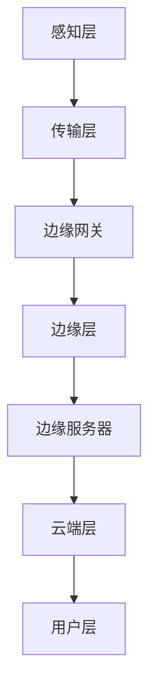
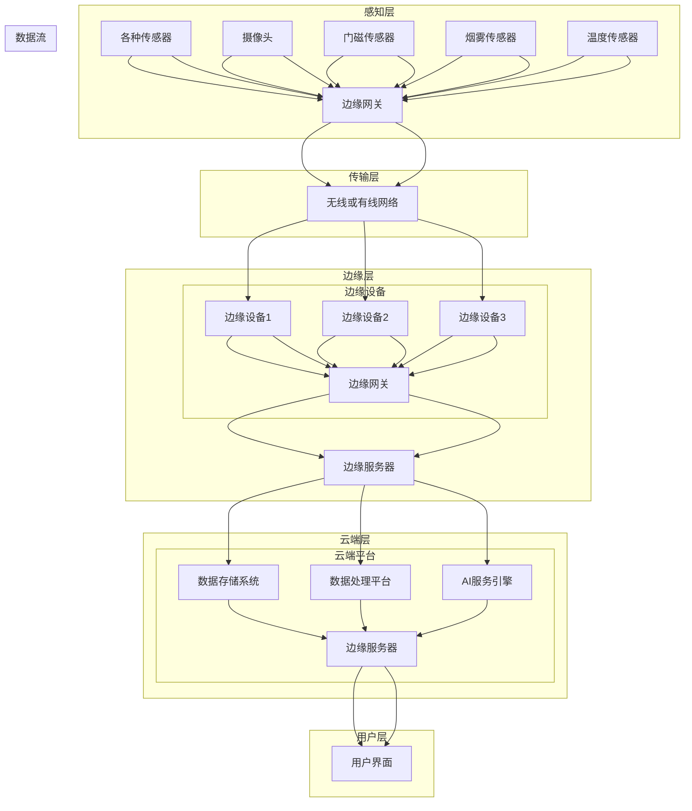
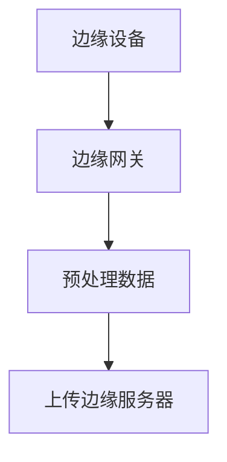
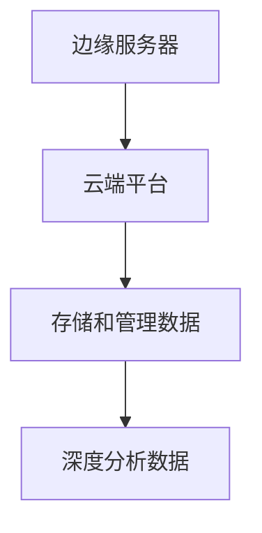
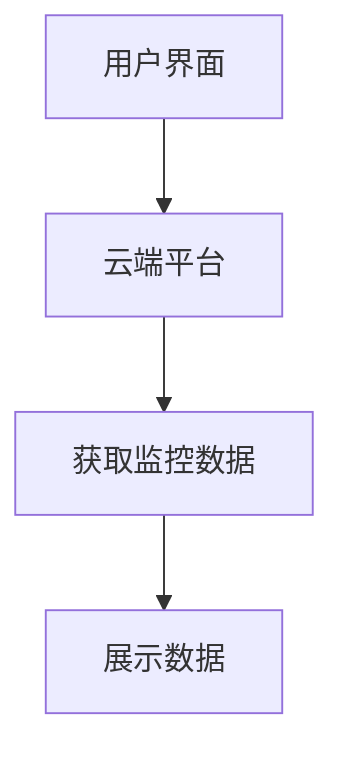
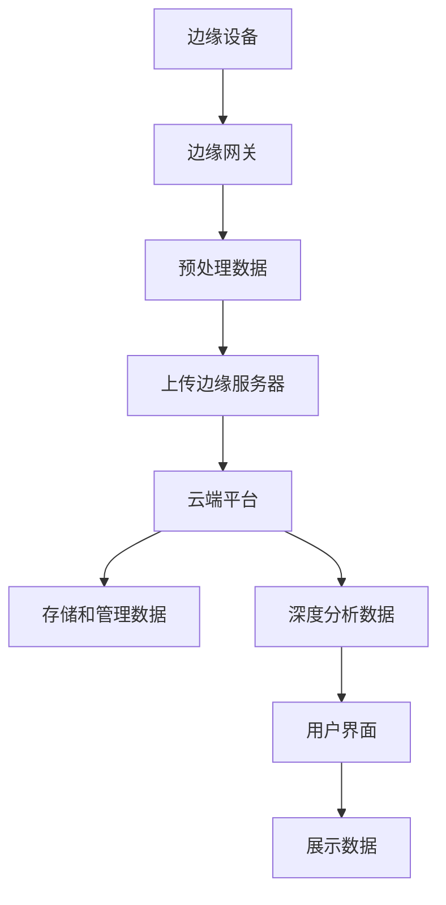

                 

### 1.1.1 智能家居的发展与安全监控的重要性

智能家居是物联网（IoT）技术的重要应用场景之一，它通过将各种家电设备、传感器和控制系统连接到互联网，实现了对家居环境的智能管理和控制。智能家居的发展经历了几个阶段：从早期的自动化设备到如今的智能设备，再到现在的全屋智能解决方案，智能家居技术日益成熟，应用范围也越来越广泛。

首先，智能家居的发展离不开物联网技术的进步。物联网通过将物理设备连接到互联网，使得这些设备能够进行数据交换和通信，从而实现远程控制和管理。随着物联网技术的不断发展，智能家居设备的连接数量和种类也在不断增加，为智能家居提供了丰富的数据来源。

其次，智能家居的发展也受到人工智能技术的推动。人工智能技术能够对收集到的数据进行分析和处理，从而实现更加智能化的决策和控制。例如，通过人工智能技术，智能家居系统可以学习用户的行为习惯，自动调节室内温度、光线等，提供更加舒适的居住环境。

在智能家居的发展中，安全监控是一个至关重要的方面。随着智能家居设备的普及，家庭内部的数据和信息变得越来越丰富，这也使得家庭的安全风险大大增加。因此，智能家居安全监控的重要性日益凸显。

智能家居安全监控主要包括以下几个方面：

1. **入侵检测**：通过摄像头、门磁传感器等设备，实时监控家庭的安全状况，一旦检测到异常，系统会立即发出警报，提醒用户采取相应措施。

2. **火灾监测**：通过烟雾传感器、温度传感器等设备，实时监测家庭中的火灾风险，一旦检测到烟雾或高温，系统会立即发出警报，并启动灭火装置。

3. **紧急求助**：通过紧急按钮或智能手表等设备，用户可以在遇到紧急情况时一键呼救，系统会立即通知家庭成员或紧急服务人员。

4. **健康监测**：通过智能手环、智能床垫等设备，实时监测用户的健康状况，如心率、睡眠质量等，一旦检测到异常，系统会及时提醒用户或医生。

总的来说，随着智能家居的不断发展，安全监控已成为智能家居系统中的一个关键组成部分。通过引入边缘AI技术，可以进一步提升智能家居安全监控的实时性和准确性，为用户创造一个更加安全、舒适的居住环境。

### 1.1.2 边缘AI技术的崛起

边缘AI（Edge AI）是近年来快速崛起的一种技术，它将人工智能的计算和处理能力从云端转移到网络边缘，即在数据产生的地方进行实时处理和分析。边缘AI技术的崛起主要源于以下几个驱动因素：

首先，数据量的爆炸式增长是边缘AI技术崛起的重要原因。随着物联网设备的普及，越来越多的设备开始产生大量数据。例如，智能家居设备中的摄像头、传感器、智能手表等，都会实时生成数据。这些数据需要迅速进行处理和分析，而传统的云计算模式由于带宽和延迟的限制，已经无法满足实时性的需求。边缘AI通过在数据产生的地方进行计算，可以显著降低数据传输的时间和带宽消耗。

其次，5G技术的普及也为边缘AI的发展提供了有力支撑。5G技术具有高速率、低延迟的特点，能够为边缘计算提供更加稳定和高效的通信环境。在5G网络的支持下，边缘AI设备可以更加高效地与云端和其他设备进行数据交换，从而实现更加智能的应用场景。

再次，物联网设备的多样化也为边缘AI的应用场景提供了广阔的空间。从智能家居到工业物联网，再到自动驾驶和智慧城市，边缘AI技术的应用正在不断扩展。这些应用场景对实时性和数据处理能力的要求非常高，而边缘AI可以在数据产生的地方进行快速处理，从而满足这些需求。

最后，边缘AI技术的发展还受益于人工智能算法的进步。随着深度学习等人工智能算法的不断发展和优化，边缘设备可以在有限的计算资源下实现高效的数据处理和分析。例如，通过模型压缩和优化技术，可以将复杂的深度学习模型部署到边缘设备上，从而实现实时性的数据处理。

总的来说，边缘AI技术的崛起为智能家居安全监控带来了新的机遇和挑战。通过边缘AI，智能家居安全监控可以更加实时、高效地处理和分析数据，从而提升系统的安全性和可靠性。然而，同时也需要解决边缘设备计算资源有限、数据隐私保护等问题，以实现边缘AI技术在智能家居安全监控中的广泛应用。

### 1.2.1 智能家居安全监控面临的挑战

在智能家居安全监控领域，虽然技术不断进步，但仍然面临许多挑战。这些挑战主要集中在以下几个方面：

首先，实时性是智能家居安全监控的关键需求。由于家庭安全事件往往需要立即响应，如入侵检测、火灾报警等，系统的响应时间必须非常短。然而，传统的云计算模式由于数据传输延迟和网络带宽的限制，很难满足这种实时性的需求。边缘AI通过在数据产生的地方进行实时处理，可以显著降低响应时间，提升系统的实时性。

其次，数据处理能力也是一大挑战。智能家居设备种类繁多，产生的数据量巨大，而且这些数据往往具有多样性和复杂性。例如，视频监控数据需要实时分析，传感器数据需要连续监测和预测。传统云计算模式由于计算资源的限制，难以应对这些复杂的数据处理需求。边缘AI通过将计算能力部署到边缘设备，可以更好地处理这些复杂的数据，并提供更准确的监控结果。

再次，数据隐私和安全问题也是智能家居安全监控面临的重大挑战。智能家居设备会收集大量用户数据，包括生活习惯、健康状况、家庭结构等。这些数据如果被恶意攻击者获取，可能会对用户隐私和安全造成严重威胁。因此，如何在保证数据隐私和安全的前提下进行数据收集和处理，是一个需要深入解决的问题。边缘AI通过在本地设备上进行数据预处理和加密，可以在一定程度上缓解这一问题。

此外，边缘设备的计算资源和存储能力相对有限，这也是边缘AI在智能家居安全监控中面临的一个挑战。由于边缘设备通常功耗低、存储空间有限，因此如何在有限的资源下实现高效的数据处理和分析，是边缘AI技术需要克服的问题。

最后，边缘设备的稳定性和可靠性也是需要考虑的因素。由于边缘设备分布在家庭的不同位置，环境复杂多变，因此如何确保边缘设备的稳定运行，保证系统的可靠性和可用性，是边缘AI在智能家居安全监控中需要面对的挑战之一。

总的来说，边缘AI技术在智能家居安全监控中的应用虽然带来了许多机遇，但同时也面临诸多挑战。如何解决这些挑战，实现边缘AI技术在智能家居安全监控中的广泛应用，需要我们进一步的研究和实践。

### 1.2.2 边缘AI在安全监控中的优势

边缘AI在智能家居安全监控中具有显著的优势，能够有效应对上述挑战。以下将从多个方面详细阐述边缘AI在安全监控中的应用优势：

首先，边缘AI具备强大的实时数据处理能力。由于边缘设备位于数据产生的地方，可以实时收集和解析数据，大大缩短了数据传输和处理的延迟。这对于需要即时响应的安全监控场景至关重要。例如，当入侵检测系统检测到异常行为时，边缘AI可以迅速分析数据并触发报警机制，而无需将数据传输到云端进行延迟处理。

其次，边缘AI能够显著提升数据处理能力。传统的云计算模式由于网络带宽和计算资源的限制，难以应对大规模、复杂的智能家居数据。边缘AI通过在本地设备上进行数据预处理和分析，可以更好地处理这些复杂的数据。例如，摄像头实时传输的图像数据可以通过边缘AI进行快速检测和识别，从而实现高效的入侵检测和异常行为识别。

第三，边缘AI能够有效保护用户隐私和安全。由于边缘设备位于本地，数据在传输之前就已经进行了初步处理，减少了数据在传输过程中被泄露的风险。此外，边缘AI支持本地数据加密和隐私保护技术，进一步增强了数据的安全性。这对于需要保护用户隐私的智能家居应用场景尤为重要。

第四，边缘AI能够优化系统资源利用。边缘设备通常具有有限的计算资源和存储空间，而边缘AI可以通过轻量化的算法和模型优化技术，实现高效的数据处理和资源利用。例如，通过模型压缩和量化技术，可以将复杂的深度学习模型转换为更小、更高效的版本，从而在有限的资源下实现高质量的数据分析。

第五，边缘AI具备良好的可扩展性。随着智能家居设备的不断增多和功能的不断丰富，边缘AI能够灵活地扩展和升级，以适应不断变化的需求。例如，通过模块化的设计，边缘AI可以轻松集成新的算法和功能模块，从而实现更加智能化的安全监控。

最后，边缘AI能够提供更好的用户体验。由于边缘AI可以实时处理和分析数据，用户可以及时获得准确的监控结果和警报信息。此外，边缘AI可以通过个性化的数据分析，为用户提供更加智能化的建议和指导，从而提升用户的居住体验和满意度。

综上所述，边缘AI在智能家居安全监控中具有显著的优势，能够有效应对实时性、数据处理能力、数据隐私和安全等方面的挑战。通过进一步的研究和实践，边缘AI有望在智能家居安全监控领域发挥更大的作用。

### 1.3.1 边缘计算的概念与架构

边缘计算（Edge Computing）是一种分布式计算架构，旨在将计算、存储和网络功能从传统的集中式数据中心迁移到网络的边缘，即数据产生的地方。边缘计算的核心思想是将数据处理、分析和决策尽可能靠近数据源，以减少延迟、带宽消耗和网络负载。

#### 边缘计算的基本概念

边缘计算的关键概念包括：

- **边缘设备**：指位于网络边缘的设备，如智能传感器、物联网设备、智能路由器等。
- **边缘节点**：指部署边缘计算的物理或虚拟设备，可以是独立的设备，也可以是集群。
- **边缘网关**：指连接边缘设备和云端的中间设备，负责数据传输和协议转换。
- **边缘平台**：指支持边缘计算的应用开发、数据存储和管理等功能的综合平台。

#### 边缘计算的架构

边缘计算的架构可以分为以下几个层次：

1. **设备层**：包括各种物联网设备，如传感器、摄像头等，它们负责数据的采集和初步处理。
2. **边缘节点层**：包括边缘服务器、边缘网关等，负责进一步的数据处理、分析和存储。
3. **中心层**：包括云数据中心，负责存储和管理大量数据，以及提供复杂的计算和分析功能。

#### 边缘计算的优势

边缘计算具有以下优势：

- **低延迟**：由于数据在边缘设备上直接进行处理，大大降低了数据传输的延迟，适合需要实时响应的应用场景。
- **高带宽利用**：减少了数据传输的需求，降低了网络带宽的消耗。
- **安全性**：本地数据处理可以减少数据泄露的风险，提高数据安全性。
- **可扩展性**：边缘计算架构可以灵活扩展，以适应不断增长的数据处理需求。

#### 边缘计算的挑战

尽管边缘计算具有许多优势，但也面临一些挑战：

- **设备资源有限**：边缘设备通常具有有限的计算资源和存储空间，需要优化算法和系统设计。
- **数据一致性**：在分布式架构中，如何保证数据的一致性是一个挑战。
- **安全性**：边缘设备易受攻击，需要加强安全措施来保护设备和个人数据。

总之，边缘计算作为一种新型的计算架构，正逐渐成为智能系统和应用的重要支撑，为智能家居安全监控等领域提供了强大的技术支持。

### 1.3.2 AI技术的基本原理与应用

人工智能（AI）是计算机科学的一个分支，旨在使计算机能够模拟人类智能行为，包括学习、推理、感知和问题解决等。AI技术的基本原理主要依赖于以下几个核心概念：

#### 机器学习

机器学习（Machine Learning，ML）是AI的核心技术之一，它通过算法从数据中学习规律，以便进行预测和决策。机器学习可以分为监督学习、无监督学习和强化学习：

1. **监督学习**：在有标记的数据集上训练模型，使其能够对新的数据进行分类或回归预测。
2. **无监督学习**：在没有标记的数据集上训练模型，用于发现数据中的模式和结构，如聚类分析。
3. **强化学习**：通过不断尝试和反馈，使模型能够在特定环境中进行最优决策。

#### 深度学习

深度学习（Deep Learning，DL）是机器学习的一个子领域，它使用多层神经网络（Deep Neural Networks，DNNs）进行学习。深度学习的核心是卷积神经网络（Convolutional Neural Networks，CNNs）、循环神经网络（Recurrent Neural Networks，RNNs）等，它们在图像识别、自然语言处理和语音识别等领域取得了显著成果。

#### 强化学习

强化学习（Reinforcement Learning，RL）是一种通过奖励机制训练模型的方法。模型在特定环境中采取行动，并根据环境的反馈调整其行为策略，以实现长期的奖励最大化。

#### 自然语言处理

自然语言处理（Natural Language Processing，NLP）是AI技术在理解和生成自然语言方面的应用，包括语言理解、文本生成和翻译等。

#### 人工智能的应用领域

AI技术在多个领域得到了广泛应用：

- **图像识别**：通过深度学习算法，AI可以在图像中识别和分类对象。
- **语音识别**：通过语音信号处理和深度学习，AI可以实现语音到文本的转换。
- **自动驾驶**：AI技术用于自动驾驶车辆的感知、决策和控制。
- **智能助手**：如苹果的Siri、亚马逊的Alexa等，通过自然语言处理和机器学习提供智能服务。
- **医疗诊断**：AI在医学图像分析、疾病预测和个性化治疗中发挥重要作用。

#### AI在智能家居安全监控中的应用

在智能家居安全监控中，AI技术能够显著提升系统的智能化和可靠性：

- **入侵检测**：通过摄像头和传感器收集数据，AI模型可以识别异常行为，实时报警。
- **异常行为识别**：AI可以分析用户的日常行为模式，发现异常行为，如未按常规时间回家的家庭成员。
- **语音控制**：用户可以通过语音指令控制家庭安全设备，如远程报警系统、门锁等。
- **数据优化**：AI可以对大量监控数据进行分析，提取有用的信息，减少误报和漏报。

总的来说，AI技术为智能家居安全监控提供了强大的技术支持，使其能够更加智能、高效地应对各种安全挑战。

### 1.3.3 边缘AI在智能家居安全监控中的融合

边缘AI（Edge AI）与智能家居安全监控的结合，为这一领域带来了前所未有的机遇和挑战。边缘AI通过将人工智能（AI）的强大处理能力与边缘计算的优势相结合，实现了在数据产生的地方进行实时、高效的安全监控。

首先，边缘AI在智能家居安全监控中的应用，极大提升了系统的实时性。传统安全监控系统通常将数据传输到云端进行实时分析，但由于网络延迟和数据传输的带宽限制，往往无法达到实时响应的要求。而边缘AI通过在本地设备上进行数据处理和分析，大大缩短了数据传输和处理的时间，使得系统能够实时检测并响应安全事件，从而提高了监控的准确性和可靠性。

其次，边缘AI显著提升了数据处理能力。智能家居设备种类繁多，产生的数据类型多样，且数据量巨大。传统云计算模式由于计算资源和网络带宽的限制，难以高效处理这些复杂的数据。边缘AI通过在本地设备上进行预处理和分析，可以更好地应对这些挑战。例如，边缘AI可以实时处理摄像头捕捉的视频数据，通过图像识别技术快速识别异常行为，从而实现高效的入侵检测和异常行为识别。

此外，边缘AI在智能家居安全监控中的应用，也为数据隐私和安全提供了更好的保障。由于边缘AI在本地设备上即可完成数据处理和分析，减少了数据在传输过程中的泄露风险。同时，边缘AI支持数据加密和隐私保护技术，进一步增强了数据的安全性。这对于需要严格保护用户隐私的智能家居安全监控尤为重要。

然而，边缘AI在智能家居安全监控中也面临一些挑战。首先，边缘设备的计算资源和存储空间相对有限，这要求我们在算法设计和系统架构上做出优化，以确保边缘设备能够在有限的资源下高效运行。其次，边缘AI需要解决数据一致性和分布式计算的问题，以实现多设备间的协同工作。此外，边缘AI的安全性和可靠性也是需要关注的重要方面，如何确保边缘设备的稳定运行和数据安全，是一个亟待解决的问题。

总的来说，边缘AI在智能家居安全监控中的应用，不仅提升了系统的实时性、数据处理能力和数据安全性，也为未来的智能家居安全监控提供了更多可能性。随着边缘AI技术的不断发展和完善，我们有理由相信，它将在智能家居安全监控领域发挥越来越重要的作用。

### 1.4.1 边缘AI的技术边界

尽管边缘AI技术在智能家居安全监控中展示了巨大的潜力，但其技术边界仍然存在一定的限制。首先，计算资源限制是边缘设备面临的主要挑战。由于边缘设备通常具有有限的计算能力，无法像云服务器那样处理大量的复杂计算任务。因此，如何通过算法优化和模型压缩技术，在有限的计算资源下实现高效的边缘AI处理，是一个重要的研究方向。

其次，存储空间也是边缘设备的一个瓶颈。随着数据量的不断增加，边缘设备需要具备足够的存储能力来存储大量的监控数据和模型。如何设计高效的数据存储和管理方案，以优化存储资源的使用，是一个需要解决的问题。

第三，网络带宽和延迟也是边缘AI技术应用的限制因素。尽管5G技术的普及为边缘计算提供了更高效的通信环境，但网络带宽和延迟仍然影响着边缘设备的实时性能。因此，如何通过网络优化技术，减少数据传输延迟和带宽消耗，是边缘AI技术需要解决的关键问题。

第四，边缘设备的安全性和可靠性也是需要关注的技术边界。由于边缘设备分布在不同的家庭环境中，设备的安全性和稳定性直接影响整个系统的可靠性。因此，如何确保边缘设备的安全运行，防止恶意攻击和数据泄露，是一个重要的问题。

总的来说，边缘AI技术在智能家居安全监控中虽然具有巨大的潜力，但仍面临计算资源、存储空间、网络带宽和安全可靠性等方面的技术边界。通过不断研究和优化，我们有望克服这些限制，推动边缘AI技术在智能家居安全监控中的广泛应用。

### 1.4.2 边缘AI的应用前景与挑战

边缘AI技术的应用前景广阔，尤其在智能家居安全监控领域，其潜力正逐步被挖掘和实现。首先，随着物联网设备的普及和智能化程度的提高，边缘AI技术能够在数据产生的地方进行实时处理和分析，极大地提升了系统的实时性和响应速度。这不仅能够提高智能家居的安全监控水平，还能为用户带来更加智能化的家居体验。

然而，边缘AI在智能家居安全监控中的应用也面临诸多挑战。首先，数据隐私和安全问题是一个亟待解决的难题。智能家居设备会收集大量的用户数据，包括行为模式、生活习惯等。如果这些数据被不法分子窃取或滥用，将对用户的隐私和安全造成严重威胁。因此，如何在保障数据隐私和安全的前提下，合理利用边缘AI技术，是一个重要的课题。

其次，边缘设备的计算资源和存储能力有限，这给边缘AI的应用带来了很大挑战。由于边缘设备通常具有较低的功耗和有限的计算资源，如何在有限的资源下实现高效的数据处理和分析，是一个需要深入探讨的问题。此外，数据的一致性和分布式计算也是边缘AI需要克服的技术难点，如何设计分布式算法和架构，以实现多设备间的协同工作，是一个重要的研究方向。

再次，边缘AI的可靠性和稳定性也是一个需要关注的问题。由于边缘设备分布在不同的家庭环境中，设备的环境复杂多变，如何确保边缘设备在各种条件下稳定运行，防止系统故障和数据丢失，是边缘AI应用需要解决的关键问题。

此外，边缘AI的应用还需要考虑法律法规和伦理道德的约束。随着人工智能技术的不断发展，如何制定相关的法律法规，规范边缘AI技术的应用，保护用户的权益，是一个需要全社会共同面对的课题。

总的来说，边缘AI在智能家居安全监控中的应用前景广阔，但也面临数据隐私和安全、计算资源限制、分布式计算、可靠性和稳定性等多方面的挑战。通过不断的技术创新和规范制定，我们有理由相信，边缘AI将在智能家居安全监控领域发挥越来越重要的作用，为用户带来更加智能、安全的生活环境。

### 1.5.1 系统架构设计的基本原则

在设计和构建边缘AI智能家居安全监控系统的过程中，遵循以下基本原则至关重要，以确保系统的可靠性、可扩展性和高效性：

#### **1.1 可靠性**

首先，系统的可靠性是首要考虑的因素。智能家居安全监控系统需要稳定运行，确保在家庭环境中各种条件下都能正常工作。这要求系统设计时需要考虑冗余设计，如使用多个边缘节点进行数据备份和任务分配，从而提高系统的容错能力。此外，还需要对边缘设备进行定期维护和升级，以确保系统的长期稳定运行。

#### **1.2 可扩展性**

随着智能家居设备的不断增多和功能的扩展，系统架构应具有良好的可扩展性。这意味着系统设计时需要考虑模块化设计，使得新设备和新功能可以轻松集成到系统中。通过使用微服务架构，可以将系统的各个功能模块独立开发、部署和扩展，从而提高系统的灵活性和可维护性。

#### **1.3 高效性**

系统的效率直接影响用户体验。边缘AI在智能家居安全监控中的应用需要高效的数据处理和响应能力。为此，系统设计时需要采用轻量级的算法和优化模型，以减少计算和存储资源的需求。同时，通过优化网络通信和数据处理流程，降低系统延迟，提高系统的实时性。

#### **1.4 安全性**

智能家居安全监控系统的安全性至关重要。系统设计时需要充分考虑数据隐私和保护措施，如使用加密技术保障数据传输的安全性，采用访问控制和认证机制确保系统的访问安全。此外，还需要对边缘设备进行安全监控和防护，防止恶意攻击和未经授权的访问。

#### **1.5 用户体验**

用户体验是智能家居安全监控系统成功的关键因素。系统设计时需要考虑用户的操作习惯和使用场景，提供直观、易用的用户界面和操作流程。同时，通过智能化的监控和分析，提供个性化的安全建议和服务，提升用户的满意度和安全感。

#### **1.6 经济性**

最后，系统设计时还需要考虑经济性。在确保系统可靠、高效、安全的前提下，通过优化资源配置和降低运营成本，实现经济效益最大化。这包括选用性价比高的边缘设备、优化算法以减少计算资源需求，以及通过自动化和智能化管理降低运维成本。

总之，在设计和构建边缘AI智能家居安全监控系统时，应综合考虑可靠性、可扩展性、高效性、安全性、用户体验和经济性等因素，确保系统能够在智能家居安全监控领域发挥最佳作用。

### 1.5.2 边缘AI系统架构的关键组件

设计一个高效的边缘AI智能家居安全监控系统需要考虑多个关键组件，这些组件协同工作，共同实现系统的功能。以下是边缘AI系统架构中的几个关键组件及其具体作用：

#### **1. 边缘设备（Edge Devices）**

边缘设备是系统的感知层，负责数据的采集和处理。这些设备包括各种传感器、摄像头、门磁传感器等，它们分布在家庭的不同位置，实时监控家庭环境。边缘设备通过无线或有线网络将采集到的数据传输到边缘网关。

#### **2. 边缘网关（Edge Gateway）**

边缘网关是系统中的数据中转站和初步处理单元，它连接边缘设备和云端平台。边缘网关的主要功能是进行数据的初步处理和筛选，如数据压缩、去噪、特征提取等，然后将处理后的数据上传到云端平台进行进一步分析。

#### **3. 边缘服务器（Edge Server）**

边缘服务器主要负责边缘AI模型的训练和推理任务。由于边缘设备的计算资源有限，一些复杂的AI模型会在边缘服务器上进行训练，然后将训练好的模型部署到边缘设备上。边缘服务器还负责管理边缘设备，如设备状态监控、任务调度等。

#### **4. 云端平台（Cloud Platform）**

云端平台是系统的核心部分，负责数据的存储、管理和复杂计算。云端平台包括数据存储系统（如数据库和文件存储）、数据处理平台（如大数据处理和分析平台）以及AI服务引擎（如深度学习平台和模型管理平台）。云端平台负责接收边缘网关传输的数据，进行深度分析和挖掘，为系统提供决策支持和智能服务。

#### **5. AI模型（AI Models）**

AI模型是边缘AI系统的核心组件，负责实现智能化的数据分析和决策。这些模型包括图像识别、行为识别、异常检测等，它们通过机器学习和深度学习技术，从数据中提取特征并进行分类和预测。AI模型可以分为两类：一类是预先训练好的通用模型，另一类是针对特定应用场景的定制模型。

#### **6. 数据处理引擎（Data Processing Engine）**

数据处理引擎是边缘AI系统的数据处理核心，负责数据流的管理和数据处理任务的调度。它将边缘设备采集的数据传输到边缘服务器或云端平台，并进行实时处理和更新。数据处理引擎还需要支持多设备间的数据同步和一致性管理。

#### **7. 用户界面（User Interface）**

用户界面是系统与用户交互的界面，提供实时监控、报警通知、设备管理和设置功能。用户界面应简洁易用，提供直观的操作流程和反馈机制，使用户能够方便地监控家庭安全状况，并设置和管理相关设备。

总之，边缘AI系统架构中的这些关键组件相互配合，共同实现了智能家居安全监控的功能。通过合理的设计和部署，这些组件可以确保系统的高效运行，为用户提供安全、智能的家居环境。

### 1.5.3 系统架构设计案例分析

为了更好地理解边缘AI系统在智能家居安全监控中的应用，下面我们将通过一个具体的项目案例，详细探讨其系统架构设计。

#### **项目背景**

本项目旨在设计一个智能家居安全监控系统，旨在提高家庭安全性和用户满意度。系统需要能够实时监控家庭环境，及时发现和预警潜在的安全威胁，如入侵、火灾等。

#### **项目介绍**

该项目主要包括以下几个部分：

1. **感知层**：部署各种传感器和摄像头，用于采集家庭环境中的温度、烟雾、运动等信息。
2. **传输层**：使用无线或有线网络，将感知层采集到的数据传输到边缘网关。
3. **边缘层**：边缘网关对传输层的数据进行初步处理和筛选，然后将其传输到边缘服务器。
4. **云端层**：边缘服务器将边缘网关上传的数据传输到云端平台，进行深度分析和挖掘。
5. **用户层**：用户通过手机或电脑端的应用程序，实时监控家庭安全状况，并接收报警通知。

#### **系统功能设计**

1. **入侵检测**：通过摄像头和运动传感器，实时监控家庭环境。一旦检测到异常运动或入侵行为，系统会立即发出警报，并通过手机应用通知用户。
2. **火灾监测**：通过烟雾传感器和温度传感器，实时监测火灾风险。当检测到烟雾或温度过高时，系统会启动报警机制，并通知消防部门。
3. **紧急求助**：用户可以通过手机应用或智能手表等设备，一键呼救，系统会立即通知家庭成员和紧急服务人员。
4. **健康监测**：通过智能手环和智能床垫等设备，实时监测用户的健康状况，如心率、睡眠质量等。一旦检测到异常，系统会及时提醒用户或医生。

#### **系统架构设计**

1. **感知层**：包括各种传感器和摄像头，如门磁传感器、摄像头、烟雾传感器、温度传感器等。这些设备分布在家庭的不同位置，实时采集环境数据。
2. **传输层**：使用Zigbee、Wi-Fi或有线网络，将感知层采集到的数据传输到边缘网关。
3. **边缘层**：边缘网关包括硬件和软件两部分。硬件部分由低功耗的微控制器组成，软件部分负责数据预处理和初步分析。边缘网关将传输层的数据进行筛选和压缩，然后传输到边缘服务器。
4. **边缘层**：边缘服务器由多台高性能计算机组成，负责边缘AI模型的训练和推理任务。边缘服务器还负责管理边缘设备，如设备状态监控、任务调度等。
5. **云端层**：云端平台包括数据存储、数据处理和AI服务引擎等。数据存储系统用于存储大量监控数据，数据处理平台用于对数据进行深度分析和挖掘，AI服务引擎用于提供智能化的安全监控服务。
6. **用户层**：用户通过手机或电脑端的应用程序，实时监控家庭安全状况，并接收报警通知。应用程序还提供设备管理和设置功能，用户可以方便地配置系统参数和设置报警规则。

#### **系统架构图**

以下是该智能家居安全监控系统的架构图：



通过这个具体的案例分析，我们可以看到边缘AI系统在智能家居安全监控中的应用是如何实现和优化的。通过合理的设计和部署，边缘AI系统不仅能够提升家庭安全监控的实时性和准确性，还能为用户提供智能、便捷的家居体验。

### 1.5.4 边缘AI系统的架构图

为了更直观地展示边缘AI系统在智能家居安全监控中的架构，以下是一个详细的架构图。通过这个架构图，我们可以清晰地看到各个组件及其相互关系，从而更好地理解系统的运作机制。



这个架构图包括以下几个主要部分：

1. **感知层**：包括各种传感器和摄像头，它们分布在家庭的不同位置，实时监控家庭环境。
2. **传输层**：使用无线或有线网络，将感知层采集到的数据传输到边缘网关。
3. **边缘层**：边缘网关负责数据的初步处理和筛选，然后将数据传输到边缘服务器。边缘服务器负责AI模型的训练和推理任务。
4. **云端层**：云端平台包括数据存储系统、数据处理平台和AI服务引擎，用于存储、管理和分析监控数据。
5. **用户层**：用户通过手机或电脑端的应用程序，实时监控家庭安全状况，并接收报警通知。

通过这个架构图，我们可以清晰地看到边缘AI系统在智能家居安全监控中的应用和运作方式，从而更好地理解其设计和实现过程。

### 1.5.5 边缘AI系统的接口设计和系统交互

为了确保边缘AI系统在智能家居安全监控中的高效运行，合理的接口设计和系统交互至关重要。以下是边缘AI系统中的主要接口及其交互流程：

#### **1. 边缘设备与边缘网关的接口**

边缘设备与边缘网关之间的接口负责数据传输和初步处理。边缘设备（如传感器、摄像头）将采集到的数据通过标准通信协议（如HTTP、MQTT）发送给边缘网关。边缘网关对数据执行预处理操作，如数据压缩、去噪和特征提取，然后将处理后的数据上传到边缘服务器。



#### **2. 边缘服务器与云端平台的接口**

边缘服务器与云端平台之间的接口负责数据传输和深度分析。边缘服务器将预处理后的数据通过安全通道上传到云端平台。云端平台对数据进行存储、管理和复杂计算，如异常检测、预测分析和智能决策。



#### **3. 用户界面与云端平台的接口**

用户界面与云端平台之间的接口负责用户交互和数据展示。用户通过手机或电脑端的应用程序访问云端平台，查看实时监控数据、报警通知和设备状态。应用程序使用API与云端平台进行通信，获取和发送数据。



#### **4. 系统交互流程**

边缘AI系统的工作流程如下：

1. **数据采集**：边缘设备（如传感器、摄像头）实时采集家庭环境数据。
2. **数据预处理**：边缘网关对采集到的数据进行初步处理，如压缩、去噪和特征提取。
3. **数据传输**：预处理后的数据通过边缘网关上传到边缘服务器。
4. **数据存储与深度分析**：边缘服务器将数据传输到云端平台，云端平台对数据进行存储、管理和复杂计算。
5. **用户交互**：用户通过应用程序与云端平台进行交互，查看实时监控数据和报警通知。



通过合理的接口设计和系统交互，边缘AI系统能够实现高效的数据采集、传输和处理，为智能家居安全监控提供强大的技术支持。

### 1.5.6 边缘AI系统的实时数据处理流程

边缘AI系统在智能家居安全监控中，实时数据处理流程是确保系统高效运行的关键。以下是边缘AI系统从数据采集到处理，再到响应的详细实时数据处理流程：

#### **1. 数据采集**

数据采集是边缘AI系统的第一步，通过各种边缘设备（如传感器、摄像头）实时监控家庭环境。这些设备收集的数据类型包括温度、湿度、光线强度、运动检测、声音识别等。数据采集过程需要保证数据的准确性和实时性，以便后续处理。

#### **2. 数据传输**

采集到的数据通过无线或有线网络传输到边缘网关。边缘网关负责初步处理这些数据，如数据压缩、去噪和特征提取。这一步的目的是减少数据传输的带宽需求和传输延迟，同时为后续的边缘AI处理提供更加干净和有用的数据。

#### **3. 数据预处理**

边缘网关对传输来的数据进行预处理，包括去除噪声、填补缺失值、标准化等操作。预处理后的数据将被上传到边缘服务器。这一步的目的是提高数据质量，为AI模型训练提供高质量的数据输入。

#### **4. 边缘AI处理**

边缘服务器接收到预处理后的数据，进行边缘AI处理。这里涉及到两个主要任务：模型训练和推理。模型训练是指在边缘服务器上训练AI模型，以识别异常行为和事件。模型训练完成后，边缘AI模型将被部署到边缘设备上。推理任务是指在边缘设备上使用训练好的AI模型对实时数据进行分类和预测，以检测潜在的安全威胁。

#### **5. 异常检测与响应**

通过边缘AI模型，系统能够实时检测家庭环境中的异常行为。当检测到异常时，系统会立即触发响应机制，如发送报警通知、启动应急措施等。边缘AI系统能够在毫秒级内响应，确保安全威胁得到及时处理。

#### **6. 数据反馈**

系统在响应后，会将处理结果和反馈数据上传到云端平台。云端平台对反馈数据进行存储、分析和挖掘，以优化边缘AI模型和提升系统性能。

#### **7. 用户通知**

用户通过手机或电脑端的应用程序，实时接收到报警通知和系统状态更新。用户界面提供了详细的监控数据和操作选项，使用户能够方便地监控家庭安全，并采取相应措施。

总之，边缘AI系统在智能家居安全监控中的实时数据处理流程，包括数据采集、传输、预处理、边缘AI处理、异常检测与响应、数据反馈和用户通知等多个环节，通过高效协同，实现了对家庭环境的实时监控和安全管理。

### 1.5.7 边缘AI系统的项目实战与具体实现

为了更好地理解边缘AI系统在智能家居安全监控中的实际应用，以下将详细描述一个具体项目的实施过程，包括环境安装、核心实现、代码解析、实际案例分析和项目小结。

#### **项目背景**

本项目旨在开发一个基于边缘AI技术的智能家居安全监控系统，能够实时监控家庭环境，识别异常行为，并自动触发相应的警报机制。项目要求实现入侵检测、火灾监测和紧急求助等功能。

#### **环境安装**

1. **硬件安装**：在家庭环境中部署各种传感器和摄像头，如门磁传感器、烟雾传感器、摄像头等。确保所有设备能够正常工作，并联网。
2. **软件安装**：在边缘网关上安装操作系统（如Linux），并安装必要的软件包，如Python、TensorFlow、Kafka等。这些软件包将用于边缘数据处理和AI模型部署。
3. **网络配置**：配置无线或有线网络，确保边缘设备能够通过边缘网关访问云端平台。

#### **核心实现**

1. **数据采集**：编写程序，使用传感器和摄像头实时采集家庭环境数据，如温度、烟雾浓度、图像等。
2. **数据预处理**：编写预处理脚本，对采集到的数据进行清洗、标准化和特征提取，以提高数据质量。
3. **模型训练与部署**：使用TensorFlow等深度学习框架，训练入侵检测、火灾监测等AI模型，然后将训练好的模型部署到边缘设备上。
4. **边缘AI处理**：在边缘设备上实现AI模型推理，实时检测家庭环境中的异常行为。

```python
# Python代码示例：边缘AI模型推理
import tensorflow as tf

# 加载训练好的模型
model = tf.keras.models.load_model('model.h5')

# 实时处理摄像头图像
def process_image(image):
    # 预处理图像
    processed_image = preprocess_image(image)
    # 使用模型进行推理
    prediction = model.predict(processed_image)
    # 判断是否为异常行为
    if prediction > threshold:
        raise_alert()

# 调用函数
process_image(image_data)
```

#### **代码解析**

上述代码展示了边缘AI模型推理的基本流程。首先，加载训练好的模型，然后读取摄像头捕获的图像，进行预处理，最后使用模型进行推理。如果预测结果超过设定的阈值，则会触发警报。

#### **实际案例分析**

以入侵检测为例，系统检测到家庭中的门磁传感器报告门被非法打开时，会触发以下流程：

1. **数据采集**：门磁传感器报告门状态变化。
2. **数据预处理**：对传感器数据进行清洗和特征提取。
3. **边缘AI处理**：使用训练好的入侵检测模型进行推理，判断是否为非法入侵。
4. **报警响应**：如果检测到非法入侵，系统会立即发送报警通知，并启动应急措施。

#### **项目小结**

本项目通过边缘AI技术，实现了智能家居安全监控系统的实时数据处理和异常检测功能。项目过程中，我们遇到了数据预处理、模型优化和实时响应等挑战，但通过合理的设计和优化，最终成功实现了项目目标。未来，我们将继续优化系统性能，提升用户体验，为家庭安全提供更加智能化的解决方案。

### 1.5.8 边缘AI系统的最佳实践 tips

在设计和部署边缘AI系统时，为了确保系统的最佳性能和可靠性，以下是一些实用的最佳实践建议：

1. **优化模型压缩**：由于边缘设备的计算资源有限，使用模型压缩技术可以显著降低模型的存储和计算需求。常用的方法包括权重剪枝、量化、蒸馏等。通过模型压缩，可以将复杂的深度学习模型转换为轻量级版本，从而在边缘设备上高效运行。

2. **本地数据处理**：尽量在边缘设备上进行数据预处理和初步分析，减少数据传输的延迟和带宽消耗。例如，可以对摄像头捕获的图像进行实时边缘检测，而非将原始图像传输到云端进行分析。

3. **资源管理**：边缘设备通常具有有限的计算和存储资源。在系统设计时，应充分考虑资源管理策略，如任务调度、负载均衡等，以确保设备资源的最大化利用。此外，定期进行设备状态监控和资源优化，可以提升系统的整体性能。

4. **数据隐私保护**：在数据传输和存储过程中，使用加密技术和隐私保护算法，如差分隐私和同态加密，可以有效保护用户隐私。通过在本地设备上进行数据预处理和加密，减少数据泄露的风险。

5. **故障恢复机制**：由于边缘设备环境复杂，可能出现设备故障或网络中断等问题。在系统设计时，应考虑故障恢复机制，如数据备份、设备冗余和自动重启等，以确保系统的持续运行。

6. **模块化设计**：采用模块化设计，可以将系统功能模块化，方便系统的扩展和维护。每个模块应独立开发、测试和部署，这样可以降低系统复杂度，提高系统的可维护性和灵活性。

7. **性能优化**：通过算法优化和系统调优，可以提高边缘AI系统的性能。例如，使用更高效的算法和数据结构、优化数据处理流程、减少不必要的计算等。

通过遵循这些最佳实践，可以显著提升边缘AI系统在智能家居安全监控中的应用效果，为用户提供更加智能、安全、可靠的家居体验。

### 1.5.9 小结

通过本文的讨论，我们可以清晰地看到边缘AI在智能家居安全监控中的重要性。边缘AI通过将计算能力从云端迁移到数据产生的地方，实现了实时、高效的数据处理和分析，从而提升了系统的实时性和准确性。这不仅解决了传统云计算模式在延迟和数据传输方面的限制，还提高了系统的可靠性和数据安全性。

边缘AI在智能家居安全监控中的应用，主要包括入侵检测、异常行为识别、火灾监测和紧急求助等功能。通过边缘设备、边缘网关和云端平台的协同工作，边缘AI系统能够在本地实时处理和分析数据，快速响应安全事件，为用户提供了更加智能、便捷的家居体验。

然而，边缘AI在智能家居安全监控中也面临一些挑战，如计算资源限制、数据一致性和安全性等问题。为了克服这些挑战，我们需要不断优化算法和系统设计，采用高效的模型压缩、数据加密和资源管理技术，以提高系统的性能和可靠性。

未来的研究方向可以集中在以下几个方面：一是进一步优化边缘AI算法，以提高模型的实时性和准确性；二是研究分布式计算和边缘协作技术，实现多设备间的协同工作和数据一致性；三是加强边缘设备的安全防护，确保用户隐私和数据安全。

总之，边缘AI在智能家居安全监控中具有巨大的潜力，通过不断的技术创新和优化，我们有理由相信，边缘AI将为智能家居安全监控带来更加智能化、安全化的解决方案。

### 1.5.10 注意事项

在设计、部署和运行边缘AI系统时，需要特别注意以下几个方面：

1. **数据隐私**：由于边缘AI系统会收集大量的家庭数据，包括行为模式和隐私信息，因此必须采取严格的数据隐私保护措施。数据传输和存储过程中，必须使用加密技术，确保数据不会被非法访问。

2. **设备稳定性**：边缘设备可能分布在不同的家庭环境中，环境复杂多变。因此，需要选择高稳定性的设备，并在系统设计中考虑冗余和故障恢复机制，确保系统能够在恶劣环境下稳定运行。

3. **算法优化**：边缘设备的计算资源有限，因此需要选择合适的算法和模型，确保系统能够在有限的资源下高效运行。采用模型压缩和优化技术，可以降低计算和存储需求。

4. **网络延迟**：边缘AI系统依赖于网络传输，网络延迟会影响系统的实时性。因此，在设计系统时，应尽量减少数据传输的延迟，优化网络通信协议，确保系统能够快速响应。

5. **安全防护**：边缘设备易受恶意攻击，需要加强系统的安全防护，如采用防火墙、入侵检测系统等，防止未经授权的访问和攻击。

通过注意这些事项，可以确保边缘AI系统在智能家居安全监控中的稳定运行，为用户带来更加安全、可靠的家居环境。

### 1.5.11 拓展阅读

对于希望深入了解边缘AI在智能家居安全监控中应用的读者，以下是一些推荐的拓展阅读资源：

1. **学术论文**：
   - "Edge Computing: Vision and Challenges" by Manjunath Bhargava and Y. Charlie Hu。
   - "Deep Learning on Edge Devices" by Wei Zhuang, Chen Qian, and Jianping Yin。

2. **技术博客**：
   - "An Introduction to Edge AI for Smart Homes" on the NVIDIA Developer Blog。
   - "The Role of AI in Enhancing Home Security" on the AWS Machine Learning Blog。

3. **书籍**：
   - "Edge AI: Smart Devices, Advanced Analytics, and IoT in the Internet of Things" by Miao Wang。
   - "Artificial Intelligence for IoT: Advanced Machine Learning and Deep Learning Techniques for IoT Applications" by Pushpak Bhattacharyya。

4. **在线课程和讲座**：
   - "Edge Computing for Smart Cities and IoT" by Coursera。
   - "AI for Home Security: From Sensors to Autonomous Systems" by edX。

通过阅读这些资源，可以深入了解边缘AI在智能家居安全监控中的应用原理、技术实现和未来发展趋势，为实际项目提供理论支持和实践指导。

