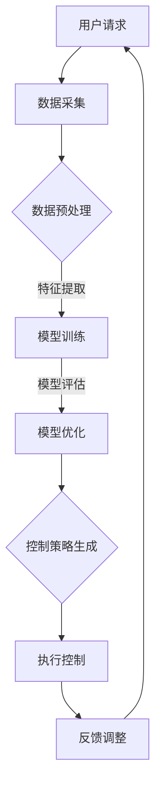

                 

## 边缘AI在智能家电中的个性化控制

### 关键词：边缘AI、智能家电、个性化控制、算法原理、系统设计

> 摘要：随着智能家居市场的迅速发展，边缘AI技术在智能家电中的个性化控制应用逐渐成为研究热点。本文首先介绍了智能家电与边缘AI的基本概念，随后详细解析了边缘AI在智能家电个性化控制中的核心概念、算法原理和实现方法。通过mermaid流程图、Python代码示例和数学模型，本文为读者提供了一个清晰、系统的边缘AI在智能家电个性化控制领域的深度解读。

## 第一部分：背景与核心概念

### 第1章：智能家电与边缘AI概述

#### 1.1 智能家电的兴起

智能家电，即通过嵌入智能芯片、传感器和网络通信模块，实现远程控制、自主学习和交互功能的家电产品。根据产品类型，智能家电可分为智能电视、智能冰箱、智能空调、智能照明等多个类别。其发展历程可以追溯到20世纪80年代，但随着物联网、人工智能技术的进步，智能家电市场在21世纪初进入快速发展阶段。

当前，智能家电市场呈现出以下几个特点：

1. **产品普及度提高**：智能家电已从高端市场逐渐走向普通家庭，成为现代家居生活的重要组成部分。
2. **功能多样化**：智能家电不仅具备基础的自动化功能，还具备智能识别、语音交互、远程监控等先进功能。
3. **市场潜力巨大**：根据市场调研数据，全球智能家电市场预计将在未来几年内保持高速增长，市场规模不断扩大。

#### 1.2 边缘AI的概念与价值

边缘AI（Edge AI）是指在靠近数据源或终端设备的地方进行数据处理和分析的智能技术。与云计算不同，边缘AI专注于在设备本地处理数据，以实现低延迟、高效率的实时响应。边缘AI在智能家电中的应用价值主要体现在以下几个方面：

1. **实时性增强**：边缘AI能够实现对家电设备数据的实时监控和分析，提高响应速度和系统效率。
2. **隐私保护**：边缘AI将数据处理本地化，减少了数据传输过程中的隐私泄露风险。
3. **网络带宽优化**：通过在边缘设备上处理数据，边缘AI能够显著降低网络带宽的消耗，提高网络资源利用效率。
4. **设备智能化**：边缘AI使得智能家电不再完全依赖于云端，提高了设备的独立性和智能化水平。

#### 1.3 边缘AI的核心技术与架构

边缘AI技术主要包括以下几个方面：

1. **传感器技术**：边缘AI需要依赖各种传感器来收集环境数据，如温度、湿度、声音、图像等。
2. **计算能力**：边缘设备通常采用高效的处理器、GPU和FPGA等硬件加速计算，以处理大量数据。
3. **通信技术**：边缘设备需要具备稳定的通信能力，以与其他设备或云端进行数据交换。
4. **算法模型**：边缘AI依赖于各种机器学习和深度学习算法，以实现对数据的分析和预测。

边缘AI系统架构通常包括以下几个层次：

1. **感知层**：包括各种传感器和采集设备，用于收集环境数据。
2. **边缘层**：处理感知层收集的数据，进行初步分析、预处理和特征提取。
3. **平台层**：包括边缘计算平台和边缘服务器，用于部署和管理边缘AI应用。
4. **应用层**：提供各种智能家电应用，如自动化控制、设备监控和故障诊断等。

### 第2章：边缘AI的核心概念与联系

#### 2.1 边缘AI的核心概念

边缘AI的核心概念主要包括以下几个环节：

1. **数据采集与预处理**：边缘AI需要从各种传感器和设备中收集数据，并进行预处理，如去噪、滤波和归一化等。
2. **特征提取与建模**：通过数据预处理后的数据，提取出具有代表性的特征，并建立相应的机器学习模型。
3. **模型训练与优化**：使用大量的训练数据，对机器学习模型进行训练和优化，以提高模型的预测准确性和泛化能力。
4. **模型部署与维护**：将训练好的模型部署到边缘设备上，并进行实时更新和维护，以适应环境变化和新的需求。

#### 2.2 概念属性特征对比表格

以下是边缘AI相关概念属性特征的对比表格：

| 概念                 | 属性特征                                                     |
|----------------------|--------------------------------------------------------------|
| 数据采集与预处理     | 实时性、可靠性、安全性                                     |
| 特征提取与建模       | 数据质量、模型复杂度、预测准确性                           |
| 模型训练与优化       | 数据规模、模型参数、训练时间                               |
| 模型部署与维护       | 系统稳定性、升级与更新、响应速度                           |

#### 2.3 边缘AI的ER实体关系图架构

以下是边缘AI的ER实体关系图架构：

```mermaid
erDiagram
  用户 -->|收集| 数据采集
  数据采集 -->|处理| 数据预处理
  数据预处理 -->|提取| 特征提取
  特征提取 -->|建模| 模型训练
  模型训练 -->|部署| 模型部署
  模型部署 -->|维护| 模型维护
```

### 第3章：边缘AI在智能家电中的个性化控制算法原理

#### 3.1 个性化控制算法概述

个性化控制算法是边缘AI在智能家电中的核心应用之一。它通过对用户行为数据的分析，实现智能家电的个性化控制，提高用户体验。个性化控制算法主要包括以下几种类型：

1. **基于规则的算法**：根据预定义的规则，对用户行为进行分类和决策。
2. **基于模型的算法**：使用机器学习和深度学习模型，对用户行为进行建模和预测。
3. **混合算法**：结合基于规则和基于模型的优点，实现更精准的个性化控制。

#### 3.2 智能家电个性化控制算法的mermaid流程图

以下是智能家电个性化控制算法的mermaid流程图：



#### 3.3 模型训练与优化

模型训练与优化是边缘AI在智能家电个性化控制中的关键环节。以下是一个简单的Python源代码示例：

```python
import numpy as np
from sklearn.linear_model import LinearRegression

# 假设我们有如下训练数据
X = np.array([[1], [2], [3], [4], [5]])
y = np.array([2, 4, 6, 8, 10])

# 使用线性回归模型进行训练
model = LinearRegression()
model.fit(X, y)

# 进行预测
y_pred = model.predict([[6]])

print("预测结果：", y_pred)
```

#### 3.4 控制策略生成与反馈调整

控制策略生成与反馈调整是智能家电个性化控制算法的两个重要环节。控制策略生成主要通过机器学习模型来实现，而反馈调整则通过对用户反馈数据的分析来不断优化模型。

以下是一个简单的数学模型和公式：

$$
u(t) = K_p e(t) + K_i \int_{0}^{t} e(\tau) d\tau + K_d \frac{de(t)}{dt}
$$

其中，$u(t)$为控制输出，$e(t)$为误差，$K_p$、$K_i$和$K_d$分别为比例、积分和微分系数。

#### 第4章：个性化控制算法的数学模型与公式

#### 4.1 个性化控制算法的数学模型

个性化控制算法的数学模型通常基于控制理论中的PID（比例-积分-微分）控制策略。PID控制器通过调整比例（P）、积分（I）和微分（D）三个参数来控制系统的输出，以达到期望的控制效果。

PID控制器的数学模型可以表示为：

$$
u(t) = K_p e(t) + K_i \int_{0}^{t} e(\tau) d\tau + K_d \frac{de(t)}{dt}
$$

其中，$u(t)$为控制输出，$e(t)$为系统的误差，$K_p$、$K_i$和$K_d$分别为比例、积分和微分系数。

#### 4.2 个性化控制算法的数学公式

PID控制器的数学公式如下：

$$
u(t) = K_p e(t) + K_i \int_{0}^{t} e(\tau) d\tau + K_d \frac{de(t)}{dt}
$$

其中，$u(t)$为控制输出，$e(t)$为系统的误差，$K_p$、$K_i$和$K_d$分别为比例、积分和微分系数。

#### 4.3 举例说明

假设智能空调系统需要根据室内温度与用户偏好来调整制冷功率。设定温度偏差$e(t)$为当前温度与目标温度之差，通过上述PID控制公式来调整制冷功率，使得室内温度逐渐接近目标温度。

例如，假设目标温度为24℃，当前温度为22℃，比例系数$K_p = 0.5$，积分系数$K_i = 0.1$，微分系数$K_d = 0.2$。根据PID控制公式，可以计算出控制输出$u(t)$：

$$
u(t) = 0.5 \times (24 - 22) + 0.1 \times \int_{0}^{t} (24 - \tau) d\tau + 0.2 \times \frac{d(24 - \tau)}{dt}
$$

通过计算，可以得出控制输出$u(t)$的数值，进而调整制冷功率，使室内温度逐渐达到目标温度。

## 第三部分：边缘AI个性化控制系统的设计与实现

### 第5章：边缘AI个性化控制系统的设计与架构

#### 5.1 个性化控制系统的需求分析

个性化控制系统的需求分析主要包括用户需求和系统功能设计。

1. **用户需求**：
   - 智能家电的个性化设置，如温度、湿度、亮度等。
   - 远程监控和控制，如手机APP控制、语音控制等。
   - 高效的能效管理，如自动调整家电运行模式，以节约能源。

2. **系统功能设计**：
   - 数据采集与预处理：收集智能家电的数据，如传感器数据、用户操作记录等。
   - 特征提取与建模：从数据中提取有用的特征，建立机器学习模型。
   - 控制策略生成与执行：根据模型预测结果，生成控制策略并执行。
   - 反馈调整与优化：根据用户反馈，不断优化控制策略。

#### 5.2 个性化控制系统架构设计

个性化控制系统架构设计主要包括硬件平台选择、软件架构设计和系统接口设计。

1. **硬件平台选择**：
   - 选择具有高性能计算能力和低功耗的边缘设备，如ARM处理器、GPU加速卡等。
   - 配备各种传感器，如温度传感器、湿度传感器、光照传感器等。
   - 选择具有高带宽、低延迟的无线通信模块，如Wi-Fi、蓝牙等。

2. **软件架构设计**：
   - 分布式架构：将数据处理和分析任务分布到多个边缘设备上，提高系统的效率和可靠性。
   - 微服务架构：将系统功能划分为多个微服务，实现模块化和可扩展性。
   - 容器化部署：使用容器技术（如Docker）进行系统部署，提高系统的灵活性和可维护性。

3. **系统接口设计**：
   - 设备接口：提供与智能家电的通信接口，实现数据的采集和命令的发送。
   - 用户接口：提供与用户的交互界面，如手机APP、网页等。
   - 管理接口：提供系统管理和配置功能，如设备监控、日志记录等。

#### 5.3 系统接口设计与交互

系统接口设计主要包括设备接口、用户接口和管理接口的设计与实现。

1. **设备接口**：
   - 采用标准通信协议（如HTTP、MQTT）进行数据传输。
   - 设备数据格式定义：定义统一的数据格式，如JSON、XML等。
   - 设备认证与安全：使用加密算法（如AES）进行数据传输加密，确保数据安全。

2. **用户接口**：
   - 设计直观、易用的用户界面，支持多种交互方式（如触摸、语音等）。
   - 提供设备监控、设置、控制等功能。
   - 支持多平台访问，如Android、iOS、Web等。

3. **管理接口**：
   - 提供系统管理和监控功能，如设备状态监控、日志查询、配置管理等。
   - 支持远程升级和故障诊断。
   - 提供API接口，方便第三方系统集成。

### 第6章：个性化控制系统的项目实战

#### 6.1 环境安装与配置

1. **操作系统与环境搭建**：
   - 选择适合的操作系统，如Ubuntu、CentOS等。
   - 安装必要的软件和工具，如Python、TensorFlow、Docker等。

2. **相关软件与硬件安装**：
   - 安装边缘设备，如树莓派、NVIDIA Jetson等。
   - 连接各种传感器，如温度传感器、湿度传感器、光照传感器等。
   - 安装无线通信模块，如Wi-Fi、蓝牙等。

#### 6.2 系统核心实现

1. **数据采集与预处理**：
   - 编写数据采集程序，从传感器获取数据。
   - 对采集到的数据进行处理，如滤波、去噪、归一化等。

2. **模型训练与优化**：
   - 使用Python和TensorFlow等工具，编写模型训练程序。
   - 调整模型参数，优化模型性能。

3. **控制策略生成与反馈调整**：
   - 根据模型预测结果，生成控制策略。
   - 根据用户反馈，调整控制策略，提高系统性能。

#### 6.3 代码应用解读

1. **数据采集与预处理**：
   ```python
   import time
   import serial

   # 连接串口
   ser = serial.Serial('/dev/ttyUSB0', 9600)

   while True:
       # 读取串口数据
       data = ser.readline()
       # 数据处理（去噪、滤波等）
       processed_data = preprocess_data(data)
       # 输出处理结果
       print(processed_data)
       # 暂停一段时间
       time.sleep(1)
   ```

2. **模型训练与优化**：
   ```python
   import tensorflow as tf
   from tensorflow.keras.models import Sequential
   from tensorflow.keras.layers import Dense

   # 构建模型
   model = Sequential()
   model.add(Dense(units=64, activation='relu', input_shape=(10,)))
   model.add(Dense(units=1, activation='sigmoid'))

   # 编译模型
   model.compile(optimizer='adam', loss='binary_crossentropy', metrics=['accuracy'])

   # 训练模型
   model.fit(X_train, y_train, epochs=10, batch_size=32)
   ```

3. **控制策略生成与反馈调整**：
   ```python
   import numpy as np

   # 假设模型已经训练好
   model = load_model('model.h5')

   # 输入数据
   input_data = np.array([[22, 0.5]])

   # 预测控制输出
   output = model.predict(input_data)

   # 根据预测结果调整控制策略
   control_strategy = adjust_strategy(output)
   ```

### 第7章：项目小结与最佳实践

#### 项目小结

本文详细介绍了边缘AI在智能家电中的个性化控制技术，从基本概念、算法原理到系统设计、项目实战，为读者提供了一个全面、系统的了解。通过mermaid流程图、Python代码示例和数学模型，本文力求让读者能够清晰地理解边缘AI在智能家电个性化控制中的关键技术和实现方法。

#### 最佳实践

1. **数据预处理**：在数据采集阶段，务必对数据进行充分预处理，以提高模型的训练效果和预测准确性。
2. **模型优化**：在模型训练过程中，根据数据特点调整模型参数，进行模型优化，以提高模型性能。
3. **反馈调整**：在实际应用中，根据用户反馈不断调整控制策略，以适应不同场景和用户需求。

#### 注意事项

1. **安全性**：在边缘AI应用中，确保数据传输和存储的安全，防止隐私泄露。
2. **稳定性**：在边缘设备上部署AI应用时，确保系统的稳定性和可靠性，避免出现故障。

#### 拓展阅读

1. **边缘AI技术**：深入理解边缘AI的基本概念、应用场景和关键技术。
2. **智能家电**：了解智能家电的发展趋势、技术原理和应用案例。
3. **机器学习**：掌握机器学习的基本原理、算法和应用方法。

### 作者

**作者：AI天才研究院/AI Genius Institute & 禅与计算机程序设计艺术 /Zen And The Art of Computer Programming**

感谢您的阅读，希望本文对您在边缘AI和智能家电领域的研究有所帮助。如果您有任何疑问或建议，欢迎随时联系作者。期待与您共同探索智能科技的未来！

